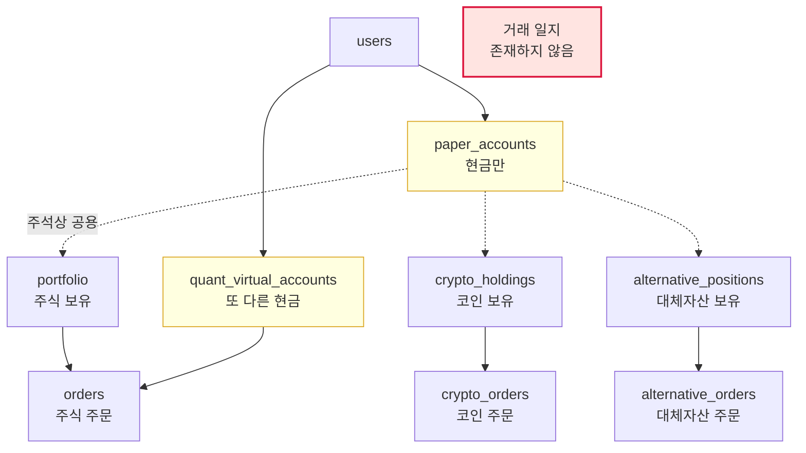
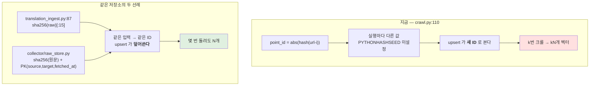

# #21 [분석] A2 데이터 계층 — 테이블 25개는 마이그레이션과 맞는데, 장부가 다섯 군데로 흩어져 있습니다

> 🗂️ 옛 GitHub 이슈를 옮긴 **기록 문서**입니다 — [색인](../README.md). 원문은 그대로 두고, 링크·커밋 해시만 새 자리 기준으로 바꿨습니다.

| 항목 | 내용 |
|---|---|
| 종류 | 이슈 |
| 상태 | 열림 |
| 원 작성 | 이동원(`devlee328288`) · 2026-09-17 14:46 KST |
| 라벨 | `analysis` `phase-2` |
| 댓글 | 1건 |
| 옛 주소 | `github.com/devlee328288/Qurious/issues/21` (지금은 열리지 않음) |

## 본문

읽는 순서: 0 쉬운 요약 → 0.1 한눈에 보기 → 3 장부가 흩어진 문제 → 필요한 절만

---

## 0. 쉬운 요약 (3줄)

1. **테이블 정의는 깨끗합니다.** 25개 테이블의 컬럼이 SQLAlchemy 모델과 Alembic 마이그레이션 사이에서 **하나도 어긋나지 않았습니다**. 인덱스만 3건 다릅니다.
2. **그런데 "돈과 거래를 적는 곳"이 5군데로 흩어져 있습니다.** 현금 계좌가 2개(`paper_accounts`·`quant_virtual_accounts`), 보유 종목이 3개(`portfolio`·`crypto_holdings`·`alternative_positions`), 주문이 3개 테이블입니다. [D7 #13](../discussions/013.md)이 추천한 "계좌 하나 · 일지 하루 1행"은 **지금 스키마로는 담을 수 없습니다.**
3. **크롤링한 문서를 다시 넣으면 벡터가 중복으로 쌓입니다.** 문서 조각의 ID를 파이썬 내장 `hash()`로 만드는데, 이 값은 **프로그램을 껐다 켤 때마다 달라집니다**(실측 확인).

---

### 0.1 한눈에 보기

| 저장소 | 무엇이 들어 있나 | 상태 | 확실도 |
|---|---|---|---|
| **PostgreSQL** | 테이블 **25개** (0001에 18개 + 0002에 7개) | 모델↔마이그레이션 **컬럼 100% 일치** · 인덱스 3건 불일치 | 🟢 |
| **Redis** | 네임스페이스 **6개** | 그중 **2개는 선언만 하고 아무도 안 씀** | 🟢 |
| **Qdrant** | 컬렉션 **2개** (`fin_chunks`·`translation_docs`) | `fin_chunks`를 **두 곳이 서로 다른 방식으로 생성** · 중복 적재 결함 | 🟢 |
| **Neo4j** | 노드 3종 · 관계 4종 | 스키마 제약(constraint) 선언 없음 | 🟢 |
| (그 밖) | PG `data_cache` 테이블 · `_yahoo_session` 메모리 딕셔너리 | **캐시가 3계층으로 갈라져 있음** | 🟢 |

**바로 손봐야 할 것 6가지**

| # | 문제 | 어디 | 영향 |
|---|---|---|---|
| 1 | 문서 조각 ID가 실행마다 바뀜 | [crawl.py:110](https://github.com/EST-team-project/Qurious/blob/04f476a/app/services/crawl.py#L110) | 재크롤 시 **벡터 중복 무한 누적** |
| 2 | 현금 계좌가 2개 | `paper_accounts` · `quant_virtual_accounts` | D7 ③ "계좌 하나" 불가 |
| 3 | 거래 일지 테이블이 **없음** | — | D7 ⑤ "매 거래일 1행" 불가 |
| 4 | `orders`에 체결가·체결시각·비용 컬럼 없음 | [trading.py:24](https://github.com/EST-team-project/Qurious/blob/04f476a/app/models/trading.py#L24) | D7 ⑥ · D4 ① 기록 불가 |
| 5 | 인덱스 3건이 모델에 없음 | `api_keys` · `portfolio` · `users` | 자동생성 시 **인덱스가 지워질 위험** |
| 6 | 증권사 키가 평문 | [trading.py:48-49](https://github.com/EST-team-project/Qurious/blob/04f476a/app/models/trading.py#L48) | [A8 #11](../issues/011.md) 재확인 |

> 확실도 — 🟢 코드를 직접 읽고 실행해 확인 / 🟡 그 위에서 제가 판단한 추론.
> 기준 커밋 **`04f476a`**. 데이터베이스 서버 없이, **모델 메타데이터와 마이그레이션 소스를 파싱해** 대조했습니다.

---

### 0.2 용어 풀이

#### (가) 같은 말인데 뜻이 갈리는 것

| 말 | 뜻 ① | 뜻 ② | 이 문서에서 |
|---|---|---|---|
| **계좌** | 현금 잔고를 담는 행 | 보유 종목까지 포함한 자산 전체 | 이 앱은 **현금만** 계좌에 있고 보유는 딴 테이블입니다 |
| **모의투자 계좌** | `paper_accounts` (모의투자 화면) | `quant_virtual_accounts` (퀀트 자동매매) | **서로 다른 테이블 두 개**입니다 |
| **인덱스** | DB가 빨리 찾으려고 만드는 색인 | 유니크 제약이 자동으로 만드는 색인 | 둘을 섞어 세면 개수가 안 맞습니다 |
| **캐시** | Redis (메모리) | PostgreSQL `data_cache` 테이블 | 이 앱은 **둘 다** 쓰고, 프로세스 메모리까지 셋입니다 |

#### (나) 기술 용어

| 용어 | 정확한 뜻 | 이 문서에서 가리키는 것 | 헷갈리기 쉬운 점 |
|---|---|---|---|
| **마이그레이션 (Alembic)** | 데이터베이스 구조를 바꾸는 절차를 순서대로 적어 둔 파일. 실행하면 표가 만들어지고 컬럼이 추가됨 | `alembic/versions/0001_…`·`0002_…` 두 개 | 모델 파일(`app/models/`)은 **파이썬 쪽의 설계도**일 뿐, 실제 DB를 바꾸는 건 마이그레이션입니다. 둘이 어긋나면 코드는 있는 컬럼을 찾는데 DB엔 없습니다 |
| **드리프트 (drift)** | 설계도와 실제 DB가 조금씩 어긋나 벌어지는 현상 | 3절에서 검사한 것 | **이번 검사에서는 컬럼 드리프트가 0건**이었습니다 |
| **autogenerate** | Alembic이 모델과 DB를 비교해 마이그레이션 파일을 **자동으로 써 주는** 기능 | 5절의 위험 | 모델에 없는 인덱스를 발견하면 **"지우는" 코드를 써 줍니다.** 그대로 실행하면 인덱스가 사라집니다 |
| **FK (외래키)** | 다른 표의 행을 가리키는 컬럼. `user_id`가 `users.id`를 가리키는 식 | 6절 | FK가 있다고 인덱스가 자동으로 생기지는 **않습니다**(PostgreSQL 기준). 직접 만들어야 합니다 |
| **임베딩 차원 (dimension)** | 문장을 숫자 배열로 바꿀 때 그 배열의 길이. `nomic-embed-text`는 768 | 8절 | 컬렉션을 만들 때 정한 길이와 다른 길이를 넣으면 **거부됩니다** |
| **멱등성 (idempotent)** | 같은 일을 여러 번 해도 결과가 한 번 한 것과 같은 성질 | 8절의 결함 | 같은 문서를 두 번 넣었을 때 **한 벌만 남아야** 멱등합니다. 지금은 두 벌이 쌓입니다 |

#### (다) 숫자로 확인 — `hash()`가 왜 위험한가

파이썬의 내장 `hash()`는 문자열에 대해 **프로세스마다 다른 값**을 냅니다. 보안(해시 충돌 공격) 때문에 일부러 그렇게 설계돼 있습니다. 같은 문자열로 세 번 실행해 봤습니다.

| 실행 | `abs(hash('https://example.com/news-0')) % (2**63)` |
|---|---|
| 1번째 | 5868034897129705700 |
| 2번째 | 4001518353341081593 |
| 3번째 | 2062707726283233381 |

`PYTHONHASHSEED` 환경변수를 고정하면 막을 수 있지만, **Dockerfile·docker-compose.yml·start.sh 어디에도 설정이 없습니다**(확인함).

비교를 위해 — 같은 프로젝트의 번역 적재기는 **sha256**을 씁니다([translation_ingest.py:88](https://github.com/EST-team-project/Qurious/blob/04f476a/app/services/translation_ingest.py#L88)). sha256은 언제 어디서 돌려도 같은 값이라 안전합니다. **한 프로젝트 안에 안전한 방식과 위험한 방식이 같이 있습니다.**

---

## 1. 조사 범위와 방법

| 질문 | 답한 방법 |
|---|---|
| 테이블 전수와 실제 사용처 | 모델 메타데이터를 파이썬으로 불러 열거 + 코드 전체에서 클래스 참조 수 집계 |
| 마이그레이션과 모델의 불일치 | 마이그레이션 소스를 **AST로 파싱**해 컬럼·인덱스를 뽑아 모델 메타데이터와 대조 |
| D7 장부 요건을 담을 수 있나 | 관련 10개 테이블의 컬럼을 나열해 요건과 맞춰봄 |
| A5 저장 필드 부족을 고치려면 | `custom_indicators` 모델·마이그레이션·API 본문 3곳을 확인 |
| 인덱스·제약 누락 | FK 컬럼 중 인덱스·유니크·PK 어디에도 안 걸린 것을 골라냄 |
| Redis·Neo4j·Qdrant 구조 | 네임스페이스·컬렉션·노드 라벨 선언과 사용처를 추적 |

> **주의 — 한 번 틀렸다가 고친 것**: 처음엔 마이그레이션 파서가 헬퍼 함수(`_uuid_pk()` 같은 것)를 못 읽어 "8개 테이블에서 컬럼이 3~4개씩 모자란다"는 결과가 나왔습니다. 헬퍼를 해석하도록 고치니 **불일치 0건**이 됐습니다. 아래 3절 결과는 고친 뒤의 값입니다.

---

## 2. PostgreSQL — 테이블 25개 전수 🟢

### 2.1 사용자 데이터 (FK로 `users`에 매달린 것)

| 테이블 | 컬럼 | 인덱스 | 유니크 | 무엇을 담나 | 코드 참조 |
|---|---|---|---|---|---|
| `users` | 7 | 1 | 1 | 계정 | 10곳 |
| `portfolio` | 7 | 0 | 1 | **주식** 보유 | 22곳 |
| `orders` | 11 | 1 | 0 | **주식** 주문 | 12곳 |
| `broker_settings` | 15 | 0 | 1 | 증권사 키 + 자동매매 설정 | 다수 |
| `quant_virtual_accounts` | 6 | 0 | 1 | **퀀트용 현금 계좌** | 6곳 |
| `custom_indicators` | 9 | 1 | 0 | 커스텀 지표 파라미터 | 8곳 |
| `paper_accounts` | 6 | 0 | 1 | **모의투자 현금 계좌** | 9곳 |
| `crypto_holdings` | 8 | 0 | 1 | **코인** 보유 | 6곳 |
| `crypto_orders` | 10 | 1 | 0 | **코인** 주문 | 5곳 |
| `alternative_positions` | 7 | 0 | 1 | **대체자산** 보유 | 8곳 |
| `alternative_orders` | 12 | 1 | 0 | **대체자산** 주문 | 4곳 |
| `api_keys` | 9 | 0 | 1 | 외부 API 키 | 7곳 |
| `lean_backtest_runs` | 12 | 1 | 0 | LEAN 백테스트 이력 | 4곳 |
| `conversations` | 6 | 1 | 0 | 대화방 | 18곳 |
| `chats` | 9 | 2 | 0 | 대화 내용 | 20곳 |
| `audit_events` | 6 | 2 | 0 | 감사 로그 | 7곳 |
| `notification_settings` | 21 | 0 | 1 | 알림 설정 | 다수 |
| `notification_log` | 6 | 1 | 0 | 알림 발송 기록 | 6곳 |
| `uploaded_docs` | 9 | 1 | 0 | 업로드 문서 | 6곳 |

### 2.2 공용·참조 데이터 (사용자와 무관)

| 테이블 | 컬럼 | 인덱스 | 무엇을 담나 | 코드 참조 |
|---|---|---|---|---|
| `bank_products` | 16 | 1 | 예·적금 상품 | 14곳 |
| `fund_products` | 16 | 2 | 펀드 상품 | 16곳 |
| `personal_cb_stats` | 9 | 2 | 개인 신용통계 | 16곳 |
| `corporate_cb_stats` | 7 | 2 | 기업 신용통계 | 15곳 |
| `crawled_docs` | 6 | 1 | 크롤링 문서 | 14곳 |
| `data_cache` | 4 | 1 | **PG 기반 캐시** | 5곳 |

---

## 3. 장부가 다섯 군데로 흩어져 있습니다 🟢

[D7 #13](../discussions/013.md)의 추천안 ③은 "**`paper_accounts` 하나**", ⑤는 "**매 거래일 1행 일지**"였습니다. 지금 구조와 맞춰 봅니다.



### 3.1 현금 계좌가 두 개입니다

| 테이블 | 컬럼 | 쓰는 곳 |
|---|---|---|
| `paper_accounts` | `cash` · `initial_cash` | 모의투자 화면 |
| `quant_virtual_accounts` | `cash_balance` · `initial_capital` | 퀀트 자동매매 |

`paper_accounts`의 주석은 "**모의투자 현금 계좌 (주식·코인·대체자산 공용)**"이라고 적혀 있습니다([paper.py:24](https://github.com/EST-team-project/Qurious/blob/04f476a/app/models/paper.py#L24)). 그런데 자동매매는 `quant_virtual_accounts`를 따로 씁니다. **같은 사용자의 모의 자산이 두 장부에 나뉘어 있어 합산 잔고를 한 번의 조회로 낼 수 없습니다.**

### 3.2 `orders`가 기록하지 않는 것

현재 컬럼: `user_id` `symbol` `name` `order_type` `quantity` `price` `status` `broker` `source` `id` `created_at`

| D7 · D4가 요구하는 것 | 지금 담을 수 있나 |
|---|---|
| **체결가** (D7 ⑥ — 다음 거래일 시가) | ❌ `price` 하나뿐이라 주문가와 체결가를 구분 못 함 |
| **체결 시각** | ❌ `created_at`(주문 생성) 하나뿐 |
| **수수료** (D4 ① 편도 10bps) | ❌ 컬럼 없음 |
| **매도세** (D4 ① 0.15%) | ❌ 컬럼 없음 |
| **어떤 전략·지표로 낸 주문인지** | △ `source`가 `WEB/PAPER/OPENAPI/PINE/QUANT` 5종만 구분 |
| **사전등록 번호** (D7 ⑦) | ❌ |

`status`의 **기본값이 `"filled"`** 입니다([trading.py:31](https://github.com/EST-team-project/Qurious/blob/04f476a/app/models/trading.py#L31)) — 주문을 넣는 순간 체결된 것으로 간주한다는 뜻입니다. D7 ⑥이 정한 "체결은 다음 거래일 시가"와 정면으로 다릅니다.

### 3.3 일지 테이블이 아예 없습니다

`journal`·`daily_log`·`trade_log` 등 어떤 이름으로도 모델·마이그레이션에 존재하지 않습니다(전수 검색 확인). D7 ⑤의 "매 거래일 1행"을 지금은 **적을 곳 자체가 없습니다.**

### 3.4 그래서 무엇을 바꿔야 하나 (제안) 🟡

| 안 | 내용 | 마이그레이션 부담 |
|---|---|---|
| **최소** | `orders`에 컬럼 5개 추가(`fill_price` `filled_at` `fee` `tax` `run_id`) + 새 테이블 `trading_journal` 1개 | 작음 — 기존 데이터 유지 |
| 중간 | 위 + `quant_virtual_accounts`를 `paper_accounts`로 합치고 뷰로 호환 유지 | 중간 |
| 전면 | 주문 3개 테이블을 `asset_class` 컬럼으로 통합 | 큼 — 코드 다수 수정 |

**최소안을 권합니다.** 2차 프로젝트 3주 안에 D7·D4가 요구하는 기록을 시작할 수 있고, 되돌리기도 쉽습니다.

---

## 4. A5 [#19](../issues/019.md)의 "저장 필드 부족"을 고치려면 🟢

[A5 #19](../issues/019.md)에서 지적한 **저장 필드 6개**는 다음 **3곳을 같이** 고쳐야 합니다.

| # | 파일 | 무엇을 | 
|---|---|---|
| 1 | [models/trading.py:72](https://github.com/EST-team-project/Qurious/blob/04f476a/app/models/trading.py#L72) `CustomIndicator` | 컬럼 추가 |
| 2 | `alembic/versions/` 새 파일 `0003_…` | `op.add_column` 으로 실제 DB 반영 |
| 3 | [routes/stocks.py:769](https://github.com/EST-team-project/Qurious/blob/04f476a/app/routes/stocks.py#L769) `CustomIndicatorBody` + [:786](https://github.com/EST-team-project/Qurious/blob/04f476a/app/routes/stocks.py#L786) `_custom_indicator_to_dict` | 받는 값·돌려주는 값 |

[D6 #20](../discussions/020.md) ④의 **12필드 안**을 그대로 옮기면 이렇게 됩니다.

| 컬럼 | 형 | 왜 필요한가 |
|---|---|---|
| `symbol` | String(20) | 어떤 종목으로 냈는지 |
| `period` | String(10) | 어떤 기간으로 냈는지 |
| `cost_spec_version` | String(20) | D4 ① 비용 규격의 어느 판을 썼는지 |
| `indicator_spec_version` | String(20) | D6 ① 지표 정의의 어느 판을 썼는지 |
| `result_sharpe` `result_mdd` `result_pf` `result_trades` | Float / Integer | 결과 스냅샷 |
| `attempt_no` | Integer | D4 ⑦ 시도 횟수 (MinBTL 상한 관리) |
| `pre_registered` | Boolean | D7 ⑦ 사전등록 여부 |
| `code_commit` | String(40) | 어느 커밋에서 낸 결과인지 |

> `custom_indicators`는 이미 `user_id`+`created_at` 복합 인덱스가 있습니다([trading.py:74](https://github.com/EST-team-project/Qurious/blob/04f476a/app/models/trading.py#L74)). `attempt_no`로 조회할 일이 생기면 인덱스를 하나 더 붙이면 됩니다.

---

## 5. 모델 vs 마이그레이션 — 컬럼은 완벽, 인덱스는 3건 🟢

### 5.1 컬럼: 불일치 **0건**

25개 테이블 전부에서 컬럼 이름 집합이 **정확히 같았습니다.** 마이그레이션 두 개만 있고 손으로 고친 흔적이 없어 드리프트가 생길 틈이 없었던 것으로 보입니다 🟡.

### 5.2 인덱스: 3건이 마이그레이션에만 있습니다

| 테이블 | 모델 `__table_args__` | 마이그레이션 `create_index` |
|---|---|---|
| `api_keys` | (없음) | `ix_api_keys_user` |
| `portfolio` | (없음) | `ix_portfolio_user_id` |
| `users` | `ix_users_email` | `ix_users_client_id`, `ix_users_email` |

**왜 문제인가** 🟡: 누군가 `alembic revision --autogenerate` 를 돌리면, Alembic은 "모델에 없는데 DB에 있는 인덱스"를 발견하고 **`op.drop_index(...)` 를 써 넣습니다.** 그대로 실행하면 이 3개 인덱스가 사라집니다.

**고치는 법 (둘 중 하나)**

| 방법 | 내용 |
|---|---|
| **A (권장)** | 모델의 `__table_args__`에 같은 이름의 `Index(...)`를 선언해 마이그레이션과 맞춘다. DB는 안 건드림 |
| B | 마이그레이션에서 인덱스를 빼고 실제 DB에서도 drop |

---

## 6. 인덱스·제약 점검 🟢

FK 컬럼 중 **인덱스·유니크·PK 어디에도 안 걸린 것**을 찾았습니다.

| 테이블 | 컬럼 | 비고 |
|---|---|---|
| `api_keys` | `user_id` (FK) | 모델 기준. 실제 DB에는 마이그레이션이 만든 `ix_api_keys_user`가 있음 → **5.2를 고치면 같이 해결** |

그 외 24개 테이블은 FK 컬럼이 전부 유니크 제약이나 복합 인덱스에 포함돼 있었습니다. **이 항목은 크게 걱정할 게 없습니다.**

> 참고 — PostgreSQL은 외래키를 만들어도 인덱스를 자동으로 만들어 주지 않습니다. 이 프로젝트는 대부분 `UniqueConstraint("user_id", ...)` 형태로 커버하고 있어 결과적으로 괜찮습니다.

---

## 7. Redis — 네임스페이스 6개 중 2개가 유령입니다 🟢

키 형식은 `{네임스페이스}:{키}` 입니다([redis_cache.py:54](https://github.com/EST-team-project/Qurious/blob/04f476a/app/lib/redis_cache.py#L54)).

| 인스턴스 | 네임스페이스 | 쓰는 곳 | 용도 |
|---|---|---|---|
| `session_cache` | `fin_session` | 8곳 | 로그인 세션 |
| `user_state_cache` | `user_state` | 5곳 | 사용자 상태 |
| `jwt_blacklist_cache` | `jwt_bl` | 3곳 | 로그아웃된 토큰 차단 |
| `_rate_cache` | `openapi_rl` | 2곳 | OpenAPI 호출 제한 |
| **`market_cache`** | `market` | **0곳** | 시세 캐시 — **선언만 있고 아무도 안 씀** |
| **`rate_limit_cache`** | `rl` | **0곳** | 호출 제한 — **선언만 있고 아무도 안 씀** |

`market_cache`가 놀고 있는 대신, 시세 캐싱은 **다른 두 곳**에서 합니다.

| 계층 | 위치 | 성질 |
|---|---|---|
| PostgreSQL `data_cache` 테이블 | [data_cache.py](https://github.com/EST-team-project/Qurious/blob/04f476a/app/services/data_cache.py) | 영구. 인터넷이 끊기면 오래된 값이라도 읽음 |
| 프로세스 메모리 딕셔너리 | [stock.py:89](https://github.com/EST-team-project/Qurious/blob/04f476a/app/services/stock.py#L89) `_yahoo_session` | 30분 TTL. **재시작하면 사라지고, 워커가 여러 개면 제각각** |

→ **캐시가 3계층으로 갈라져 있습니다.** 2차에서 시세 조회가 늘어나면 정리가 필요합니다 🟡.

---

## 8. Qdrant — 같은 문서를 다시 넣으면 벡터가 쌓입니다 🟢

### 8.1 컬렉션 2개

| 컬렉션 | 만드는 곳 | 차원 | 거리 |
|---|---|---|---|
| `fin_chunks` | [rag_pipeline.py:39](https://github.com/EST-team-project/Qurious/blob/04f476a/app/services/rag_pipeline.py#L39) — **768 하드코딩** | 768 | COSINE |
| `fin_chunks` | [crawl.py:99](https://github.com/EST-team-project/Qurious/blob/04f476a/app/services/crawl.py#L99) — **실제 임베딩 길이를 재서** 결정 (실패 시 768) | 가변 | COSINE |
| `translation_docs` | [translation_ingest.py:90](https://github.com/EST-team-project/Qurious/blob/04f476a/app/services/translation_ingest.py#L90) | 인자로 받음 | COSINE |

설정상 `QDRANT_COLLECTION`과 `DOCUMENT_COLLECTION`이 **둘 다 `"fin_chunks"`** 입니다([config.py:37-38](https://github.com/EST-team-project/Qurious/blob/04f476a/app/config.py#L37)). 크롤링한 문서와 사용자가 올린 문서가 **같은 컬렉션에 섞입니다.**

현재 임베딩 모델 `nomic-embed-text`가 768이라 두 생성 경로가 우연히 일치합니다. 하지만 `EMBED_MODEL`을 바꾸면 **먼저 컬렉션을 만든 쪽의 차원이 굳어지고**, 다른 쪽이 넣는 벡터는 거부됩니다 🟡.

### 8.2 중복 적재 결함 🟢

```python
point_id = abs(hash(f"{meta.get('url', '')}-{i}")) % (2 ** 63)
```
— [crawl.py:110](https://github.com/EST-team-project/Qurious/blob/04f476a/app/services/crawl.py#L110)

Qdrant의 `upsert`는 **같은 ID면 덮어쓰고, 다른 ID면 새로 넣습니다.** 그런데 `hash()`가 실행마다 다른 값을 내므로(0.2절 (다) 실측), **같은 URL을 다시 크롤할 때마다 새 벡터가 통째로 추가됩니다.**

| 크롤 횟수 | 같은 문서의 벡터 수 |
|---|---|
| 1회 | N개 |
| 2회 (재시작 후) | 2N개 |
| k회 | **kN개** |

검색 결과가 같은 문서 조각으로 채워지고, 저장 공간도 계속 늘어납니다.

**고치는 법**: 같은 프로젝트의 [translation_ingest.py:88](https://github.com/EST-team-project/Qurious/blob/04f476a/app/services/translation_ingest.py#L88) 방식을 그대로 가져오면 됩니다.

```python
int(hashlib.sha256(raw.encode()).hexdigest()[:15], 16)
```

---

## 9. Neo4j — 노드 3종 · 관계 4종 🟢

| 구분 | 이름 | 만드는 곳 |
|---|---|---|
| 노드 | `Sector` · `Company` · `Document` | [graph_service.py](https://github.com/EST-team-project/Qurious/blob/04f476a/app/services/graph_service.py) |
| 관계 | `BELONGS_TO` · `COMPETES_WITH` · `SUPPLIES_TO` · `MENTIONS` | 같은 파일 |

`MERGE`를 쓰고 있어 중복 노드는 생기지 않습니다(Qdrant와 대조적). 다만 **유니크 제약(constraint) 선언이 없어** 속성이 어긋난 노드가 들어오면 별개 노드가 될 수 있습니다 🟡.

---

## 10. 근거 · 반례 · 한계

### 10.1 이 문서를 지탱하는 근거

| 주장 | 근거 | 확실도 |
|---|---|---|
| 테이블 25개 | 모델 메타데이터 열거 + 마이그레이션 AST 파싱, 양쪽 25 | 🟢 |
| 컬럼 불일치 0건 | 25개 테이블 컬럼 이름 집합 비교 | 🟢 |
| 인덱스 3건 불일치 | 모델 `Index` vs 마이그레이션 `create_index` 이름 비교 | 🟢 |
| `hash()`가 실행마다 다름 | 3회 실행 실측 + `PYTHONHASHSEED` 미설정 확인 | 🟢 |
| 일지 테이블 없음 | 모델·마이그레이션 전수 검색 | 🟢 |
| 현금 계좌 2개 | 두 모델의 컬럼 확인 | 🟢 |
| autogenerate가 인덱스를 지울 것 | Alembic 동작에 대한 제 추론 | 🟡 |
| 캐시 3계층 정리 필요 | 제 판단 | 🟡 |

### 10.2 한계 — 이 문서가 못 본 것

1. **실제 데이터베이스를 보지 않았습니다.** DB 서버 없이 **소스만** 대조했습니다. 누군가 손으로 `ALTER TABLE`을 했다면 이 문서는 그걸 못 봅니다. 실 DB가 생기면 `alembic check` 로 한 번 더 확인해야 합니다.

2. **Redis·Qdrant·Neo4j도 실제 서버를 보지 않았습니다.** 선언된 키·컬렉션·라벨만 세었습니다. 운영 중 생긴 키는 셈에서 빠졌습니다.

3. **"코드 참조 N곳"은 단순 이름 검색입니다.** 주석·문자열 안의 이름도 셀 수 있어 **대략의 활발함**으로만 봐 주세요. 실제로 이번에 클래스 이름을 단수형으로 잘못 세어 `BrokerSettings`·`NotificationSettings`가 "참조 0건"으로 나온 적이 있습니다 — 복수형으로 고치니 둘 다 활발히 쓰이고 있었습니다.

4. **`market_cache`·`rate_limit_cache`가 "미사용"인 것은 사실이지만**, 앞으로 쓸 자리로 남겨둔 것일 수 있습니다 🟡. 지우자는 제안이 아니라 **지금은 비어 있다는 사실**을 적은 것입니다.

5. **3.4의 마이그레이션 부담 평가는 제 추정입니다** 🟡. 실제로 해 보면 코드 수정량이 더 클 수 있습니다.

---

## 11. 판정을 뒤집을 조건

| 판정 | 이런 사실이 나오면 다시 봐야 합니다 |
|---|---|
| "컬럼 드리프트 0건" | 실제 DB에 `alembic check`를 돌려 차이가 나오면 |
| "인덱스 3건이 위험" | 팀이 autogenerate를 **쓰지 않기로** 하면 위험이 사라짐 (그래도 맞춰두는 편이 좋습니다) |
| "Qdrant 중복 적재" | 크롤을 **한 번만** 돌리고 끝낼 거라면 실무상 문제가 안 됨 |
| "현금 계좌 2개가 문제" | D7 ③에서 "두 계좌를 그대로 두자"로 결론 나면 문제가 아님 |
| "최소안 권장" | A3(인증·권한) 분석에서 `orders` 구조를 크게 바꿔야 할 이유가 나오면 전면안이 나을 수 있음 |

---

## 12. ★ 데이터 계층이 하나 늘었습니다 — 수집기 SQLite (2026-09-19 · S30 갱신)

이 문서는 `04f476a` 기준이고, 그때는 데이터 저장소가 **Postgres·Redis·Qdrant·Neo4j 넷**이었습니다. S27~S30 에 시세 수집기가 들어와 **다섯째가 생겼습니다.**

### 12.1 왜 Postgres 가 아니라 SQLite 인가

| | Postgres (본체) | SQLite (수집기) |
|---|---|---|
| 뜨지 않으면 | 앱이 안 돈다 | **수집은 계속 된다** |
| 무엇이 들어가나 | 사용자·주문·장부 25표 | 시장 데이터 6표 |
| 언제 필요한가 | 사용자가 쓸 때 | **매일 장 끝나고** |

수집기가 본체 스택에 묶여 있으면 **스택이 안 뜨는 날은 그날 시세를 통째로 놓칩니다.** 놓친 시세는 사람이 기억해서 메꿔야 하고, 결국 안 메꿉니다. 그래서 표준 라이브러리 + `requests` 만 씁니다([`collector/config.py`](https://github.com/EST-team-project/Qurious/blob/76202d7/collector/config.py) 머리말).

⚠️ **이 문서의 "테이블 25개" 는 여전히 Postgres 만의 수입니다.** 전체 데이터 계층은 이제 **25 + 6** 입니다.

### 12.2 늘어난 여섯 표

```
  받은 것 (출처가 준 값 그대로)            계산한 것 (언제든 지우고 다시 만든다)
  ─────────────────────────────           ────────────────────────────────────
   raw_response    응답 원문 gzip+sha256    price_adjusted    수정주가
   price_daily     일별 시세 (446만 행)     corporate_action  가격이 끊긴 날·계수
   dividend        배당 (S30 신설)
   ingest_day      수집 상태 (재개의 근거)

  ★ 받은 것과 계산한 것을 섞지 않는다.
    계산 규칙은 바뀌고, 바뀌면 전부 다시 만들어야 하는데
    원본에 덮어써 두면 되돌릴 근거가 없어진다.
```

이 분리는 **이 문서 3절의 "장부가 다섯 군데로 흩어져 있다"** 와 성격이 다릅니다. 3절은 *같은 사실*(현금 잔고)이 여러 곳에 있어 어긋날 수 있다는 문제이고, 여기는 *원본과 파생*을 일부러 나눈 것입니다.

---

### 12.3 ★★ 8.2 의 Qdrant 중복 적재 — **저장소 안에 작동하는 선례가 생겼습니다**

8.2 에서 `hash()` 때문에 같은 URL 을 다시 크롤하면 벡터가 `kN` 개로 쌓인다고 적었습니다. 🟢 **`main` `76202d7` 에서 다시 확인했습니다 — 그대로입니다**([crawl.py:110](https://github.com/EST-team-project/Qurious/blob/76202d7/app/services/crawl.py#L110)).

그런데 S30 에 배당 수집기를 만들면서 **같은 문제를 제대로 푼 코드가 이 저장소에 생겼습니다.** 고치는 법을 "이렇게 하면 된다" 가 아니라 **"이미 여기 이렇게 돌고 있다"** 로 말할 수 있게 됐습니다.

> **용어 — 멱등성(idempotency)**
> - 뜻: **몇 번 실행해도 결과가 같은** 성질.
> - 이 문서에서: 같은 URL 을 두 번 크롤해도 벡터가 두 배가 되지 않아야 한다는 것.
> - 헷갈리는 점: "중복 제거" 와 다릅니다. 중복 제거는 **쌓인 뒤 치우는** 것이고, 멱등성은 **애초에 안 쌓이게** 하는 것입니다. 쌓인 뒤 치우려면 "무엇이 원본인가" 를 다시 판단해야 하는데, 그 판단이 또 틀립니다.



**코드 재사용 판정 — 3줄로 끝납니다**

| 가져올 곳 | 줄 | 판정 |
|---|---|---|
| [`translation_ingest.py:87`](https://github.com/EST-team-project/Qurious/blob/76202d7/app/services/translation_ingest.py#L87) | 1 | ✅ **그대로 복사** — 같은 저장소·같은 Qdrant·같은 용도 |
| [`collector/raw_store.py`](https://github.com/EST-team-project/Qurious/blob/76202d7/collector/raw_store.py) | 198 | 🟡 **설계만 참고** — 원문 보존까지 하려면. 지금 당장은 과합니다 |
| [`collector/db.py` `ingest_day`](https://github.com/EST-team-project/Qurious/blob/76202d7/collector/db.py) | — | 🟡 **크롤링 재개까지 하려면** 참고. 8.2 를 고치는 데는 필요 없습니다 |

```
  바꾸기 전  point_id = abs(hash(f"{meta.get('url','')}-{i}")) % (2 ** 63)
  바꾼 뒤    point_id = int(hashlib.sha256(f"{meta.get('url','')}-{i}".encode())
                            .hexdigest()[:15], 16)
             + 파일 머리에 import hashlib
```

⚠️ **이 3줄은 D3 ⑤-1(크롤링 범위)·A11 4.6(robots 준수) 결론과 무관합니다.** 무엇을 얼마나 크롤할지가 정해지지 않아도, **같은 것을 두 번 넣지 않는다**는 성질은 어느 결론에서도 필요합니다. 그래서 **지금 고쳐도 되는 유일한 항목**으로 봅니다 🟢.

🔴 **뒤집을 조건**: 팀이 "크롤링을 아예 안 한다" 로 결론 내면 이 3줄도 불필요해집니다. 다만 `translation_docs`(사용자 업로드)는 크롤링과 무관하게 남으므로, 그쪽 경로는 이미 올바르게 되어 있음을 확인해 둡니다.

---

### 12.4 "투자·모의투자에 쓸 수 있는가" 로 다시 보면 — **3.3 이 가장 큰 구멍입니다**

이 문서에서 실투자 가능성을 막는 항목을 골라 다시 세웠습니다.

| 이 문서의 항목 | 실투자·모의투자 관점 | 급한가 |
|---|---|---|
| **3.3 일지 테이블이 아예 없습니다** | 🔴 **성과를 측정할 수 없습니다.** 날짜별 평가금액이 없으면 수익률·MDD·Sharpe 를 계산할 근거가 없습니다. 주문 기록만으로 되돌려 만들 수는 있지만, 배당·수수료·분할이 끼면 재구성이 틀립니다 | **가장 급함** |
| 3.1 현금 계좌가 두 개 | 🔴 어느 쪽이 진짜 잔고인지 모르면 주문 가능 금액을 못 정합니다 | 급함 (D7 ③ 결론 필요) |
| 3.2 `orders` 가 기록하지 않는 것 | 🟡 체결가·수수료가 없으면 **비용 반영 성과**를 못 냅니다 — [#32](../issues/032.md) 의 주 검정(숙제 ①)이 바로 이것입니다 | 급함 |
| 8.2 Qdrant 중복 | 🟢 투자 판단에 직접 영향 없음. 검색 품질·용량 문제 | 3줄이니 지금 |
| 5.2 인덱스 3건 | 🟢 성능·운영 문제 | 나중 |

**그래서 3.3 이 D5 ⑨(기준가)·[#12](../issues/012.md) 4.4.1(일별 잔고 스냅샷)과 같은 작업입니다.** 세 곳에 흩어져 적혀 있는데 하나의 표를 만드는 일입니다.

🟢 **S30 에서 이 표를 만들 재료가 하나 갖춰졌습니다** — 배당입니다([#33 10.5](../issues/033.md) · [PR #36](../pulls/036.md)). 일별 평가금액을 제대로 쌓으려면 그날 받은 배당을 더해야 하는데(TR), 지금까지는 그 자료가 아예 없었습니다.

```
  일별 잔고 스냅샷에 필요한 재료

   ① 보유 종목·수량        orders 로 재구성 (3.2 — 체결가 없음 🟡)
   ② 그날 종가             price_daily        🟢 446만 행 확보
   ③ 분할·권리락 보정      corporate_action   🟢 2,689건 확보
   ④ 그날 받은 배당        dividend           🟢 S30 에 확보 ◄── 새로 채워진 칸
   ⑤ 수수료·세금           ❌ 없음 (3.2)      🔴 #32 숙제 ①

   → ②③④ 는 이제 있습니다. 막는 것은 ①⑤ — 둘 다 이 문서 3절의 항목입니다.
```

---

### 12.5 이 절이 바꾸지 않은 것

- **2절 테이블 25개 · 5절 컬럼 불일치 0건 · 5.2 인덱스 3건**: 다시 세지 않았습니다. `04f476a` 기준 그대로입니다. `git diff --name-only 04f476a main` 으로 확인했습니다 — 바뀐 경로는 `collector/` · `app/celery_app.py` · `app/tasks/` · `requirements.txt` · `.gitignore` · `docs/TIL/` 뿐이고 **`app/models/`·마이그레이션은 한 줄도 바뀌지 않았습니다** 🟢.
- **10.2 한계 ①②(실제 DB 를 보지 않았다)**: 여전히 유효합니다. 수집기 SQLite 는 실제로 돌려 봤지만(446만 행), **Postgres·Redis·Qdrant·Neo4j 는 아직 소스만** 봤습니다 🔴.

**갱신 기준 커밋**: `76202d7` · **갱신일**: 2026-09-19 (KST · S30)

---

**관련 문서**: [D7 #13](../discussions/013.md) · [D4 #17](../discussions/017.md) · [D6 #20](../discussions/020.md) · [A5 #19](../issues/019.md) · [A8 #11](../issues/011.md) · [A9 #12](../issues/012.md) · [A1 #9](../issues/009.md) · [인덱스 #1](../issues/001.md)

**기준 커밋**: `04f476a` · **조사일**: 2026-09-17 (KST)

---

## 댓글 1건

---

<a id="issuecomment-5739608953"></a>

### 💬 1. 이동원(`devlee328288`) · 2026-09-19 14:19 KST

**본문에 12절을 더했습니다** (S30). 변경 요약만 적습니다 — 내용은 본문에 있습니다.

| 어디 | 무엇을 |
|---|---|
| **12.1~12.2 신설** | 데이터 저장소가 **넷 → 다섯**이 됐습니다. 수집기 SQLite 6표(`raw_response`·`price_daily`·`dividend`·`ingest_day`·`price_adjusted`·`corporate_action`). ⚠️ 이 문서의 "테이블 25개" 는 여전히 **Postgres 만의 수**입니다 |
| **12.3 신설** | 8.2 의 Qdrant 중복 적재를 **고치는 법이 아니라 선례**로 다시 썼습니다 |
| **12.4 신설** | "투자·모의투자에 쓸 수 있는가" 로 이 문서 항목을 다시 세웠습니다 |
| 12.5 | 2·5절을 다시 세지 않은 근거 |

**12.3 — 8.2 는 3줄이면 고쳐집니다.** `main` `76202d7` 에서 `hash()` 가 그대로인 것을 확인했고([crawl.py:110](https://github.com/EST-team-project/Qurious/blob/76202d7/app/services/crawl.py#L110)), 같은 저장소에 **이미 올바르게 도는 코드가 둘** 있습니다 — [`translation_ingest.py:87`](https://github.com/EST-team-project/Qurious/blob/76202d7/app/services/translation_ingest.py#L87) 의 `sha256` 과 S30 에 만든 `collector/raw_store.py` 입니다.

⚠️ **이 3줄은 D3 ⑤-1(크롤링 범위)·A11 4.6(robots) 결론을 기다리지 않아도 됩니다.** 무엇을 얼마나 크롤할지가 안 정해져도 *같은 것을 두 번 넣지 않는다* 는 성질은 어느 결론에서도 필요합니다.

**12.4 — 실투자 관점에서 가장 큰 구멍은 3.3(일지 테이블 없음)입니다.** 날짜별 평가금액이 없으면 수익률·MDD·Sharpe 를 계산할 근거가 없습니다. 그리고 이것이 **D5 ⑨(기준가) · [#12](../issues/012.md) 4.4.1(일별 잔고 스냅샷) 과 같은 작업**입니다 — 세 곳에 흩어져 적혀 있는데 만들 표는 하나입니다.

그 표에 필요한 재료 다섯 중 **셋이 채워졌습니다**(종가 446만 행 · 조정 2,689건 · **배당 — S30 신설**). 막는 것은 `orders` 의 체결가와 수수료 둘이고, 둘 다 이 문서 3.2 의 항목입니다.
