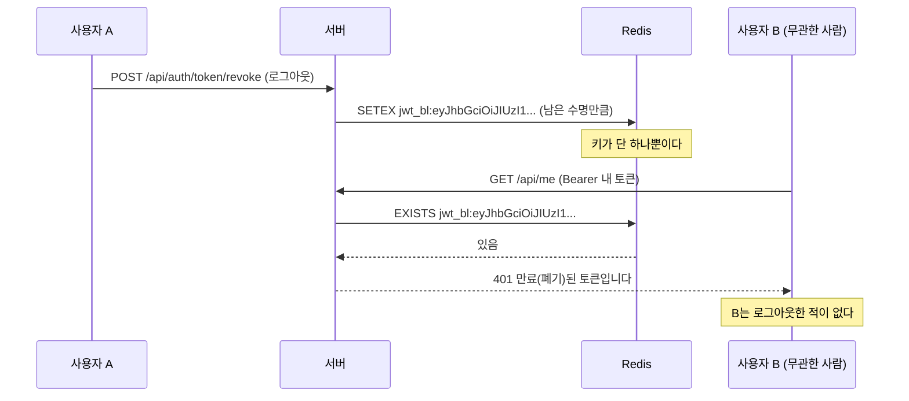
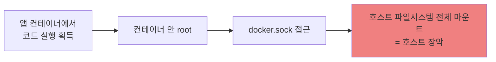
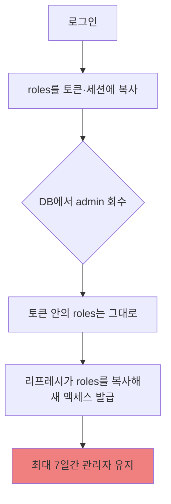

# #22 [분석] A3 인증·세션·권한 — 로그아웃 한 번이 전 사용자의 JWT를 끊습니다

> 🗂️ 옛 GitHub 이슈를 옮긴 **기록 문서**입니다 — [색인](../README.md). 원문은 그대로 두고, 링크·커밋 해시만 새 자리 기준으로 바꿨습니다.

| 항목 | 내용 |
|---|---|
| 종류 | 이슈 |
| 상태 | 열림 |
| 원 작성 | 이동원(`devlee328288`) · 2026-09-17 15:11 KST |
| 라벨 | `analysis` `security` |
| 댓글 | 2건 |
| 옛 주소 | `github.com/devlee328288/Qurious/issues/22` (지금은 열리지 않음) |

## 본문

> **쉬운 요약 3줄**
> 1. 누구든 **로그아웃을 한 번 하면 그 순간 전 사용자의 JWT가 전부 막힙니다.** 폐기 목록에 넣는 열쇠(키)가 사람마다 다르지 않고 **전원이 똑같은 값 하나**라서입니다 — 실제로 토큰을 만들어 확인했습니다.
> 2. 반대로 **로그인 문은 너무 넓습니다.** 비밀번호를 무한정 틀려도 막지 않고, 인증 없이 열려 있는 API가 34개이며, 그중에는 LLM을 돌리는 것과 DB에 쓰는 것이 섞여 있습니다.
> 3. 다만 **잘 되어 있는 것도 분명합니다** — 비밀번호는 bcrypt, Open API 키는 SHA-256 해시만 저장, 남의 자료를 id로 찔러 보는 공격(IDOR)은 9곳 모두 막혀 있습니다. 2·3차에서 고칠 곳은 **인증의 "끄는 쪽"과 배포 설정**입니다.

---

## 0. 한눈에 보기

기준 커밋 **`04f476a`** · 조사일 **2026-09-17(KST)** · 확실도 표기 **🟢 코드·원문으로 확인 / 🟡 추론**
> 🔄 **2026-09-20(S35) 재점검 — 11건 모두 미해결.** 아래 표 다음의 재점검 절을 보세요. 본문의 퍼머링크는 조사 시점(`04f476a`)을 가리키므로 그대로 둡니다.

| # | 발견 | 심각도 | 확실도 | 근거 |
|---|---|:---:|:---:|---|
| 1 | ~~**JWT 폐기 목록 키가 전 사용자 공통** — 한 명이 로그아웃하면 전원 401~~ ✅ **2026-09-20 해결** ([PR #47](../pulls/047.md)) — 키를 `jti`(uuid4)로 바꿨습니다 | ✅ 닫힘 | 🟢 실측 | [jwt_auth.py:83-85](https://github.com/EST-team-project/Qurious/blob/04f476a/app/lib/jwt_auth.py#L83-L85) |
| 2 | ~~그 폐기 API에 **인증이 없다** → 계정 1개로 최대 7일간 전체 JWT 마비~~ ✅ **2026-09-20 해결** ([PR #47](../pulls/047.md)) — 호출자 인증 + 소유권 확인을 넣었습니다 | ✅ 닫힘 | 🟢 | [auth.py:234-242](https://github.com/EST-team-project/Qurious/blob/04f476a/app/routes/auth.py#L234-L242) |
| 3 | **docker.sock 마운트 + 컨테이너 root 실행** → 앱 침해가 곧 호스트 장악 | 🔴 높음 | 🟢 | [docker-compose.yml:77](https://github.com/EST-team-project/Qurious/blob/04f476a/docker-compose.yml#L77) · [Dockerfile](https://github.com/EST-team-project/Qurious/blob/04f476a/Dockerfile#L26-L30) |
| 4 | 증권사 **app_secret 평문 저장** + ~~**TLS 인증서 검증 끔 5곳**~~ 🔴 2026-09-20 **6곳으로 늘었습니다** (S35 체결 조회 추가 · 재점검 절 참고) | 🟠 중간 | 🟢 | [trading.py:49](https://github.com/EST-team-project/Qurious/blob/04f476a/app/models/trading.py#L49) · [kis.py](https://github.com/EST-team-project/Qurious/blob/04f476a/app/services/brokers/kis.py#L38) |
| 5 | **자동매매가 프로세스 전역 1개** — 아무나 남의 것을 끄고 로그를 본다 | 🟠 중간 | 🟢 | [auto_trade.py:372-390](https://github.com/EST-team-project/Qurious/blob/04f476a/app/services/auto_trade.py#L372-L390) |
| 6 | 인증 없는 라우트 **34/146** 중 `POST /api/graph/rag`(LLM)·`/seed`(DB 쓰기)·`/api/tasks/{id}` | 🟠 중간 | 🟢 | [graph.py:58-84](https://github.com/EST-team-project/Qurious/blob/04f476a/app/routes/graph.py#L58-L84) · [tasks.py](https://github.com/EST-team-project/Qurious/blob/04f476a/app/routes/tasks.py#L26-L58) |
| 7 | 권한(roles)이 토큰·세션에 **박혀서 최대 7일** — 권한을 뺏어도 안 먹는다 | 🟠 중간 | 🟢 | [auth.py:202-231](https://github.com/EST-team-project/Qurious/blob/04f476a/app/routes/auth.py#L202-L231) |
| 8 | 관리자 판정이 **이메일 문자열 일치** — 먼저 가입하는 사람이 관리자 | 🟡 낮음* | 🟢 | [auth.py:114](https://github.com/EST-team-project/Qurious/blob/04f476a/app/routes/auth.py#L114) |
| 9 | 로그인 **횟수 제한 없음** + 계정 존재 여부가 응답 시간으로 샌다 | 🟡 낮음 | 🟢/🟡 | [auth.py:151-154](https://github.com/EST-team-project/Qurious/blob/04f476a/app/routes/auth.py#L151-L154) |
| 10 | 기본 비밀값 3종 + **DB·Redis·Neo4j 포트를 호스트에 공개** 🔶 **JWT 부분만 2026-09-20 해결** ([PR #47](../pulls/047.md) — `JWT_SECRET` 이 자리표시자면 토큰 발급을 막습니다). `SESSION_SECRET`·DB 비밀번호·포트 공개는 **그대로** | 🟠 중간 | 🟢 | [docker-compose.yml](https://github.com/EST-team-project/Qurious/blob/04f476a/docker-compose.yml#L5-L45) |
| 11 | ~~`python-jose>=3.3.0` — 하한이 **CVE 2건 영향 버전**~~ ✅ **2026-09-20 해결** ([PR #47](../pulls/047.md)) — `>=3.4.0` 으로 올렸습니다. 🟡 두 CVE 모두 JWE·비대칭키 경로라 HS256 을 쓰는 우리의 실제 노출은 아니었습니다 | ✅ 닫힘 | 🟢 | [requirements.txt:2](https://github.com/EST-team-project/Qurious/blob/04f476a/requirements.txt#L2) |

\* 8번은 `ADMIN_EMAILS` 기본값이 비어 있어 **지금은 관리자 계정이 아예 만들어지지 않습니다**. 값을 채우는 순간 위험해지는 구조라 "낮음"으로 두되 2차 전에 손볼 항목으로 적습니다.

### 🔄 2026-09-20(S35) 재점검 — **11건 모두 그대로입니다**

조사 이후 사흘 동안 코드가 6,900줄 늘었습니다(수집기·매매비용·체결 동기화). 그 변경이
이 이슈의 결함을 건드렸는지 다시 확인했습니다. **기준 `298ae90`.**

| # | 결함 | 상태 | 확인 방법 |
|---|---|---|---|
| 1 | JWT 폐기 목록 키가 전 사용자 공통 | ✅ **S36 해결** | 키가 `jti` 로 바뀌었습니다. 임시 Redis 로 16건 실측 통과 (PR [#47](../pulls/047.md)) |
| 2 | 폐기 API에 인증 없음 | ✅ **S36 해결** | `Depends(get_current_user_any)` + 소유권 확인. 남의 토큰은 403 (PR [#47](../pulls/047.md)) |
| 3 | docker.sock + root 실행 | 🔴 **그대로** | `docker-compose.yml`·`Dockerfile` 변화 없음 |
| 4 | app_secret 평문 + TLS 검증 끔 | 🔴 **악화** ↓ 아래 참고 | 줄 번호가 밀렸고 **끈 곳이 5→6곳으로 늘었습니다** |
| 5 | 자동매매가 프로세스 전역 1개 | 🔴 **그대로** | `auto_trade.py` 변경분은 비용 계산뿐, 소유권 검사는 여전히 없음 |
| 6 | 인증 없는 라우트 34/146 | 🔴 **그대로** | 해당 라우트 파일 변화 없음 |
| 7 | 권한이 토큰에 박혀 최대 7일 | 🔴 **그대로** | `auth.py` 변화 없음 |
| 8 | 관리자 판정이 이메일 문자열 | 🔴 **그대로** | `auth.py:114` 동일 |
| 9 | 로그인 횟수 제한 없음 | 🔴 **그대로** | `auth.py` 변화 없음 |
| 10 | 기본 비밀값 3종 + 포트 공개 | 🔶 **JWT 만 해결** | `JWT_SECRET` 은 자리표시자면 막힙니다(PR [#47](../pulls/047.md)). `SESSION_SECRET`·DB 비밀번호·포트는 그대로 |
| 11 | `python-jose>=3.3.0` | ✅ **S36 해결** | `>=3.4.0` 으로 상향 (PR [#47](../pulls/047.md)) |

~~**하나도 고쳐지지 않았습니다.** 2차 프로젝트 시작(09-27) 전에 최소한 1·2번은 닫아야
합니다 — 계정 하나로 서비스 전체 인증을 최대 7일 멈출 수 있는 상태가 그대로입니다.~~

### ✅ 2026-09-20(S36) — 1·2·11 을 닫고 10 을 절반 닫았습니다 ([PR #47](../pulls/047.md) · 작업 이슈 [#46](../issues/046.md))

**11건 중 4건이 움직였습니다: 해결 3 · 부분해결 1 · 미해결 7.**

고치면서 조사 때 못 봤던 것 하나가 드러났습니다 — **`JWT_SECRET` 이 실제로 기본값으로
동작하고 있었습니다.** `.env`·`.env.dev`·`.env.prod` 어디에도 그 항목이 없어(각 0건)
`app/config.py` 의 자리표시자가 그대로 서명에 쓰였고, 이 저장소는 Public 입니다.
즉 결함 1·2 의 공격에 **계정조차 필요 없었습니다.** 폐기 목록만 고치면 반쪽이라
같은 PR 에서 닫았습니다(결함 10 의 JWT 부분).

또 결함 1 을 고치는 과정에서 **고치지 않으면 결함이 모양만 바꿔 되살아나는 함정 셋**을
찾아 함께 처리했습니다 — ① `create_token_pair` 가 액세스·리프레시에 같은 `jti` 를 주는 것,
② refresh 가 `jti` 를 새 액세스에 복사하는 것, ③ `exp` 없는 토큰은 만료도 폐기도 되지
않는 것(python-jose 의 `require_exp` 기본값이 False). 자세한 내용은 [#46](../issues/046.md) 에 있습니다.

⚠️ **머지 뒤 `.env` 에 `JWT_SECRET` 을 넣어야 합니다** (`openssl rand -hex 32`).
안 넣으면 JWT 발급·검증이 500 으로 막힙니다. 웹 화면(쿠키 세션)은 영향받지 않습니다.

**남은 7건 중 다음 후보는 3번(docker.sock + root 실행)과 6번(인증 없는 라우트 34곳)입니다.**

#### 4번은 줄 번호가 밀렸고, 제가 한 곳을 더 늘렸습니다

| 무엇 | 조사 시점(`04f476a`) | 지금(`298ae90`) |
|---|---|---|
| `app_secret` 평문 칸 | [trading.py:49](https://github.com/EST-team-project/Qurious/blob/04f476a/app/models/trading.py#L49) | [trading.py:101](https://github.com/EST-team-project/Qurious/blob/298ae90/app/models/trading.py#L101) — `orders` 가 23칸으로 늘며 밀렸을 뿐, **내용은 같습니다** |
| TLS 검증 끈 곳 | **5곳** | 🔴 **6곳** — S35 에서 체결 조회를 추가하며 기존 관례(`verify=False`)를 따랐습니다 |

여섯 곳 모두 `app/services/brokers/kis.py` 안에 있습니다. 새로 추가한 곳만 `verify=True`
로 두면 **체결 조회만 실패하고 나머지는 통과하는** 엇갈린 상태가 되어, 원인을 찾기가
오히려 어려워집니다. 그래서 일단 기존과 맞춰 두고 **여섯 곳을 한꺼번에 고치는 일**로
남깁니다. 🟡 `verify=False` 가 왜 들어갔는지는 여전히 코드에 적혀 있지 않습니다(4.2 한계).

#### 새로 생긴 고려사항 — KIS 접근토큰이 평문 파일로 남습니다 🟡

S35 에서 `scripts/sync_fills.py` 가 KIS 접근토큰을 `.kis_token_mock.json` 에 캐시합니다.
KIS 가 토큰 재발급 간격을 제한해서 필요한 조치였습니다.

- `.gitignore` 에 넣어 **커밋되지는 않습니다** 🟢
- 다만 **디스크에 평문**으로 남고, 토큰 수명은 최대 24시간입니다 🟡
- 지금은 **모의계좌 토큰**만 저장됩니다. 실계좌(`--real`)를 쓰면 실계좌 토큰이 같은
  방식으로 남으므로, 그때는 저장 방식을 다시 봐야 합니다 🔴

이것은 4.1(평문 저장)과 같은 갈래의 문제입니다 — 이 이슈가 제안하는 비밀값 보관 방식을
정할 때 **토큰 캐시도 함께** 다루면 됩니다.

---

**잘 되어 있는 것 (그대로 유지할 것)**

| 항목 | 상태 | 근거 |
|---|---|---|
| 비밀번호 저장 | bcrypt 해시 (평문·MD5 아님) | [auth.py:112](https://github.com/EST-team-project/Qurious/blob/04f476a/app/routes/auth.py#L112) |
| Open API 키 | **원문 미저장, SHA-256 해시만** | [paper.py:92-104](https://github.com/EST-team-project/Qurious/blob/04f476a/app/models/paper.py#L92-L104) |
| 남의 자료 열람(IDOR) | 리소스 id 라우트 **9곳 모두 소유자 확인** | [documents.py:143](https://github.com/EST-team-project/Qurious/blob/04f476a/app/routes/documents.py#L143) |
| 세션 쿠키 | `httponly` + `SameSite=lax` | [auth.py:135-139](https://github.com/EST-team-project/Qurious/blob/04f476a/app/routes/auth.py#L135-L139) |
| CORS | 미들웨어 자체가 없음 = 외부 출처 차단 | `grep` 결과 0건 |
| 커밋된 `.env.prod`·`.env.example` | 실제 비밀값 없음, 자리표시자뿐 | [.env.prod](https://github.com/EST-team-project/Qurious/blob/04f476a/.env.prod) |

---

## 1. 용어 풀이

읽다가 막히는 말이 없도록 먼저 풉니다. **정확한 뜻 → 이 문서에서 가리키는 것 → 헷갈리기 쉬운 점** 순서입니다.

### 1.1 먼저, 이 앱에는 로그인 방식이 **두 가지**입니다

같은 말을 두 뜻으로 쓰게 되는 자리라 맨 앞에 구분표를 둡니다.

| | **세션 쿠키 방식** | **JWT 방식** |
|---|---|---|
| 누가 쓰나 | 브라우저 화면(app.html) | API 클라이언트·봇 |
| 증거물 | `fin_session` 쿠키 (임의의 UUID) | `Authorization: Bearer <토큰>` |
| 어디에 진실이 있나 | **서버(Redis)** — 지우면 즉시 끝 | **토큰 안** — 서버는 서명만 확인 |
| 로그아웃 | Redis 키 삭제 → 확실히 끝난다 | 폐기 목록에 올려야 끝난다 ← **1번 결함 지점** |
| 유효기간 | 7일, 요청할 때마다 연장 | 액세스 15분 / 리프레시 7일 |

> **헷갈리기 쉬운 점**: "로그아웃했는데 왜 안 끝나요?"의 답이 두 방식에서 완전히 다릅니다. 이 문서에서 **1·2번 결함은 JWT 쪽만의 문제**이고, 브라우저 화면은 영향을 받지 않습니다.

### 1.2 인증·권한 용어

| 용어 | 정확한 뜻 | 이 문서에서 가리키는 것 | 헷갈리기 쉬운 점 |
|---|---|---|---|
| **JWT** | 서명된 JSON을 점 두 개로 이은 문자열. `헤더.내용.서명` | `/api/auth/token`이 주는 토큰 | **암호화가 아니라 서명**입니다. 내용은 누구나 읽을 수 있고, 위조만 못 합니다 |
| **헤더 부분** | JWT의 첫 토막. 서명 알고리즘만 담긴다 | `{"alg":"HS256","typ":"JWT"}` | 사람마다 다른 값이 아니라 **전원 똑같습니다** ← 1번 결함의 핵심 |
| **액세스 / 리프레시** | 짧게 쓰는 표 / 그 표를 새로 받는 표 | 15분 / 7일 | 리프레시가 더 **오래 살아서** 사고가 나면 피해도 깁니다 |
| **폐기 목록(blacklist)** | 아직 기간이 남았지만 무효로 칠 토큰 명단 | Redis `jwt_bl:` 키 | JWT는 원래 "서버가 기억 안 하는" 방식이라, 폐기 목록은 그 성질을 되돌리는 **예외 장치**입니다 |
| **권한(roles)** | 이 사람이 무엇을 할 수 있나 | `["user"]` 또는 `["admin"]` | **인증(누구냐)과 권한(뭘 해도 되냐)은 다릅니다.** 7번 결함은 인증이 아니라 권한 쪽 |
| **IDOR** | 남의 자료 번호를 넣어 열어 보는 공격 | `/api/conversations/{cid}` 같은 주소 | 이 앱은 **막혀 있습니다**(9/9). 흔한 결함이라 확인했고, 결과가 좋았습니다 |
| **SameSite=lax** | 다른 사이트에서 온 요청에 쿠키를 안 붙이는 규칙 | 쿠키 설정값 | 이것 덕분에 **CSRF가 대부분 막힙니다.** `none`으로 바꾸면 그 방패가 사라집니다 |

### 1.3 배포·통신 용어

| 용어 | 정확한 뜻 | 이 문서에서 가리키는 것 | 헷갈리기 쉬운 점 |
|---|---|---|---|
| **docker.sock** | 도커 데몬에 명령을 넣는 통로 파일 | `/var/run/docker.sock` 마운트 | 이걸 컨테이너에 넣어 주는 건 **호스트 root 권한을 주는 것과 거의 같습니다** |
| **TLS 인증서 검증** | 상대가 진짜 그 서버인지 확인하는 절차 | `httpx.AsyncClient(verify=False)` | 끄면 **암호화는 되지만 상대를 확인하지 않습니다** — 중간에 낀 사람에게 그대로 넘어갑니다 |
| **레이트 리밋** | 정해진 시간에 몇 번까지만 허용 | Open API에만 있음(분당 60회) | **로그인에는 없습니다** |
| **CVE / CVSS** | 알려진 취약점 번호 / 그 심각도 점수(0~10) | python-jose 2건 | CVSS가 높아도 **우리 코드가 그 기능을 쓰는지**가 별개입니다 |

---

## 2. 결함 1 — 로그아웃 한 번이 전원의 JWT를 끊습니다 🔴

### 2.1 무슨 일이 일어나나

폐기 목록에 올릴 때 쓰는 열쇠를 **토큰의 앞 32글자**로 삼습니다.

```python
def _bl_key(token: str) -> str:
    """블랙리스트 키: 토큰의 앞 32자 사용 (메모리 절약)."""
    return token[:32]
```
— [app/lib/jwt_auth.py:83-85](https://github.com/EST-team-project/Qurious/blob/04f476a/app/lib/jwt_auth.py#L83-L85)

그런데 JWT의 앞부분은 **내용이 아니라 헤더**이고, 헤더는 알고리즘 이름만 담고 있어 **누구의 토큰이든 똑같습니다.**

### 2.2 실측 — 정말 같은 값인지 직접 확인했습니다

프로젝트의 `create_access_token`을 **그대로 옮겨** 서로 다른 사용자 3명의 토큰을 만들고 `_bl_key`를 계산했습니다. (`python-jose 3.5.0`, 설정 기본값 `HS256`)

```
alice@example.com    _bl_key(앞 32자): eyJhbGciOiJIUzI1NiIsInR5cCI6IkpX
bob@example.com      _bl_key(앞 32자): eyJhbGciOiJIUzI1NiIsInR5cCI6IkpX
admin@example.com    _bl_key(앞 32자): eyJhbGciOiJIUzI1NiIsInR5cCI6IkpX

서로 다른 사용자 3명의 블랙리스트 키가 모두 같은가?: True
고유 키 개수: 1 / 토큰 개수: 3

헤더 base64 길이: 36 자
헤더 디코드: {"alg":"HS256","typ":"JWT"}
→ 토큰 앞 32자는 모두 헤더 안에 들어간다: True

access vs refresh 키 동일: True
```

**숫자로 보면 이렇습니다.**

| 항목 | 값 | 의미 |
|---|---:|---|
| 헤더 base64 길이 | **36자** | 앞 32자는 전부 헤더 안 |
| 잘라 쓰는 길이 | **32자** | 사용자마다 달라지는 부분(내용·서명)에 **닿지 못함** |
| 사용자 3명의 고유 키 개수 | **1개** | 전원 공유 |
| 액세스 vs 리프레시 | **같음** | 종류 구분도 없음 |

Redis 최종 키는 네임스페이스가 붙어 `jwt_bl:eyJhbGciOiJIUzI1NiIsInR5cCI6IkpX` **하나**입니다 ([redis_cache.py:54-55,160](https://github.com/EST-team-project/Qurious/blob/04f476a/app/lib/redis_cache.py#L54-L55)).

### 2.3 그래서 실제로 어떻게 되나



| 누가 무엇을 하면 | 막히는 범위 | 지속 시간 |
|---|---|---|
| 아무나 액세스 토큰 1개를 폐기 | **전원의 모든 JWT** | 그 토큰의 남은 수명 (최대 **15분**) |
| 아무나 리프레시 토큰 1개를 폐기 | **전원의 모든 JWT** | 그 토큰의 남은 수명 (최대 **7일**) |
| 그 사이 새로 로그인 | 새 토큰도 **같은 키**라 즉시 차단 | — |

지속 시간은 [jwt_auth.py:94-97](https://github.com/EST-team-project/Qurious/blob/04f476a/app/lib/jwt_auth.py#L94-L97)이 `ttl = exp - 현재시각`으로 정하기 때문입니다. 🟢

### 2.4 여기에 2번이 겹칩니다 — 폐기 API에 인증이 없습니다

```python
@router.post("/auth/token/revoke")
async def revoke_tokens(body: TokenRevokeBody):
    await revoke_token(body.access_token)
```
— [app/routes/auth.py:234-242](https://github.com/EST-team-project/Qurious/blob/04f476a/app/routes/auth.py#L234-L242). `Depends(...)`가 없습니다.

회원가입은 누구나 할 수 있으므로([auth.py:105](https://github.com/EST-team-project/Qurious/blob/04f476a/app/routes/auth.py#L105)), **계정 하나만 만들면 자기 리프레시 토큰을 폐기하는 것만으로 서비스 전체의 JWT 인증을 최대 7일 멈출 수 있습니다.** 반복하면 계속 유지됩니다. 🟢

OWASP는 이 범주를 A01 접근 통제 실패로 분류하고, 목록에 **"abusing JWT invalidation"**(JWT 무효화 장치를 악용)을 직접 적어 두었습니다 ([원문](https://raw.githubusercontent.com/OWASP/Top10/master/2021/docs/en/A01_2021-Broken_Access_Control.md), 조회 2026-09-17 KST).

### 2.5 고치는 방향 (셋 중 하나)

| 안 | 내용 | 품 | 남는 문제 |
|---|---|:---:|---|
| **가** | 키를 **토큰 전체의 SHA-256**으로 | 1줄 | 없음 — 가장 단순 |
| 나 | 토큰에 `jti`(고유 번호)를 넣고 그것으로 | 중간 | 토큰 구조 변경 |
| 다 | 폐기 목록을 없애고 액세스 수명을 더 짧게 | 중간 | 즉시 차단을 포기 |

어느 쪽을 택하든 **폐기 API에 인증을 붙이는 것**(`Depends(get_current_user_jwt)`)은 함께 가야 합니다. 판단은 D 문서가 아니라 구현 시점의 선택이라 여기서는 후보만 둡니다.

---

## 3. 결함 3 — 앱이 뚫리면 호스트까지 갑니다 🔴

세 가지가 **동시에** 성립합니다.



| 조건 | 근거 | 설명 |
|---|---|---|
| docker.sock을 앱에 넘김 | [docker-compose.yml:77](https://github.com/EST-team-project/Qurious/blob/04f476a/docker-compose.yml#L77) | LEAN 백테스트를 호스트 도커로 돌리려고 붙였습니다 |
| 컨테이너가 **root**로 실행 | [Dockerfile](https://github.com/EST-team-project/Qurious/blob/04f476a/Dockerfile) | `USER` 지시가 없습니다 (기본 root) |
| 데이터 폴더 `chmod 777` | [Dockerfile:24](https://github.com/EST-team-project/Qurious/blob/04f476a/Dockerfile#L24) | 권한을 더 넓힙니다 |

docker.sock을 가진 쪽은 `-v /:/host` 같은 옵션으로 **호스트 디스크 전체를 마운트한 컨테이너를 띄울 수 있습니다.** 즉 "컨테이너라서 안전하다"가 성립하지 않습니다. 🟢

**대안 후보**: ① LEAN을 SSH 모드로 분리(설정이 이미 있습니다 — [config.py:61-64](https://github.com/EST-team-project/Qurious/blob/04f476a/app/config.py#L61-L64)) ② 백테스트를 앱과 별도 컨테이너로 떼고 그쪽에만 sock을 주기 ③ 2차에서는 LEAN 자체를 안 쓰기. **③은 D4 ③(정본 엔진을 `backtest_strategy` 하나로)이 그대로 채택되면 자연히 따라옵니다** — 그때는 docker.sock을 뗄 수 있습니다. 🟡

---

## 4. 결함 4 — 증권사 자격증명 🟠

### 4.1 평문 저장

```python
app_secret: Mapped[str] = mapped_column(String(200), nullable=False, default="")
```
— [app/models/trading.py:49](https://github.com/EST-team-project/Qurious/blob/04f476a/app/models/trading.py#L49)

암호화·해시 없이 그대로 들어갑니다. **해시는 답이 아닙니다** — 증권사에 보낼 때 원문이 필요하니까요. 필요한 건 **양방향 암호화**(키는 환경변수, 예: `cryptography`의 Fernet)입니다.

같은 저장소 안에서 **Open API 키는 SHA-256 해시만 저장**하고 있어([paper.py:92-104](https://github.com/EST-team-project/Qurious/blob/04f476a/app/models/paper.py#L92-L104)) 대조적입니다. 쓰임이 달라 방식이 달라야 하는 것은 맞지만, 증권사 쪽만 아무 보호가 없습니다. 🟢

### 4.2 TLS 인증서 검증을 끈 곳 5군데

```python
async with httpx.AsyncClient(verify=False, timeout=10) as cli:
```
— [kis.py](https://github.com/EST-team-project/Qurious/blob/04f476a/app/services/brokers/kis.py) 의 38·60·84·146·166행. **이 요청들의 헤더에 `appkey`·`appsecret`이 실려 나갑니다** ([kis.py:24-35](https://github.com/EST-team-project/Qurious/blob/04f476a/app/services/brokers/kis.py#L24-L35)). 중간자가 있으면 자격증명이 그대로 넘어갑니다.

OWASP A07의 매핑 CWE에 **CWE-295(부적절한 인증서 검증)**·**CWE-297(호스트 불일치)**이 들어 있습니다 ([원문](https://raw.githubusercontent.com/OWASP/Top10/master/2021/docs/en/A07_2021-Identification_and_Authentication_Failures.md)). 🟢

> **한계**: `verify=False`가 왜 들어갔는지는 코드에 적혀 있지 않습니다. 사내망 프록시 때문일 수도, 개발 중 오류를 급히 넘기려던 것일 수도 있습니다. 한국투자증권 포털은 robots.txt로 막혀 원문 확인을 못 했습니다 — **이 판단은 "끄면 위험하다"까지이고, "왜 껐나"는 미확인입니다.** 🟡

### 4.3 덤: 설정을 다시 저장하면 비밀키가 지워집니다 (보안이라기보다 운영 결함)

저장 라우트는 받은 값을 **조건 없이 덮어씁니다**:

```python
row.app_key = body.app_key
row.app_secret = body.app_secret
```
— [stocks.py:394-395](https://github.com/EST-team-project/Qurious/blob/04f476a/app/routes/stocks.py#L394-L395)

그런데 조회 라우트는 `app_key`만 **마스킹해서** 주고 `app_secret`은 아예 주지 않으며([stocks.py:418-422](https://github.com/EST-team-project/Qurious/blob/04f476a/app/routes/stocks.py#L418-L422)), 화면의 `loadIndicatorApiSettings()`는 입력란을 **채우지 않습니다**([app.html:3545-3555](https://github.com/EST-team-project/Qurious/blob/04f476a/public/app.html#L3545-L3555)). 저장 버튼은 입력란의 현재 값을 그대로 보냅니다([app.html:3557-3570](https://github.com/EST-team-project/Qurious/blob/04f476a/public/app.html#L3557-L3570)).

→ **브로커 종류만 바꾸고 저장하면 `app_key`·`app_secret`이 빈 문자열로 덮여 연결이 끊깁니다.** 그러면 팩토리가 조용히 `MockBrokerClient`로 떨어집니다([factory.py:24-25](https://github.com/EST-team-project/Qurious/blob/04f476a/app/services/brokers/factory.py#L24-L25)) — 화면에는 오류가 안 뜹니다. 🟢

---

## 5. 결함 5 — 자동매매는 "우리 서버에 하나"입니다 🟠

```python
_auto_trade_task: asyncio.Task | None = None
_is_running = False
_auto_trade_user_id = "quant_system"
```
— [auto_trade.py:20-24](https://github.com/EST-team-project/Qurious/blob/04f476a/app/services/auto_trade.py#L20-L24). 사용자별이 아니라 **모듈 전역 변수 한 벌**입니다.

| 라우트 | 인증 | 실제 동작 | 문제 |
|---|:---:|---|---|
| `POST /api/auto-trade/start` | 로그인 필요 | 이미 돌고 있으면 `False` 반환 | A가 켜 두면 B는 **못 켭니다** |
| `POST /api/auto-trade/stop` | 로그인 필요 | 인자 없이 **그냥 취소** | **B가 A의 자동매매를 끕니다** |
| `GET /api/auto-trade/status` | 로그인 필요 | 전역 상태 + **로그 최근 50건** | B가 A의 `user_id`와 거래 내역을 봅니다 |

— [stocks.py:675-689](https://github.com/EST-team-project/Qurious/blob/04f476a/app/routes/stocks.py#L675-L689) · [auto_trade.py:372-390](https://github.com/EST-team-project/Qurious/blob/04f476a/app/services/auto_trade.py#L372-L390)

즉 "로그인했는가"는 보지만 **"이게 네 것인가"는 아무도 묻지 않습니다.** OWASP A01이 말하는 *"record ownership을 강제하라"*에 정확히 걸립니다. 🟢

**2차와의 연결**: D7 ⑧(담당 1명 PC + HF private 원장)이 채택되면 운영자가 1명이라 당장은 사고가 안 납니다. 하지만 **팀원 4명이 각자 화면을 열어 보는 것만으로 서로의 상태가 섞입니다.** D7 ③(현금 계좌를 `paper_accounts` 하나로)을 확정할 때 이 전역 상태도 같이 정리 대상에 넣는 편이 좋겠습니다. 🟡

---

## 6. 결함 6 — 인증 없는 라우트 34개 🟠

라우터 전체를 AST로 훑어 `Depends` 목록을 뽑았습니다.

| 구분 | 개수 | 비율 |
|---|---:|---:|
| 전체 라우트 | **146** | 100% |
| 인증 필요 | **112** | 76.7% |
| 인증 없음 | **34** | 23.3% |

34개 대부분은 **공개되어도 되는 것**입니다 — 로그인·회원가입, `/api/health`, 시세 조회(`/api/stocks/*`, `/api/paper/crypto/*`), 종목 목록. 문제는 다음 4개입니다.

| 라우트 | 왜 문제인가 | 확실도 |
|---|---|:---:|
| `POST /api/graph/rag` | **인증 없이 LLM을 돌립니다.** 토큰·GPU가 그대로 나갑니다 | 🟢 |
| `POST /api/graph/seed` | 인증 없이 **Neo4j에 씁니다** | 🟢 |
| `GET /api/tasks/{task_id}` | 남의 비동기 작업 **결과를 읽습니다** (LLM 답변이 들어 있을 수 있음) | 🟢 |
| `DELETE /api/tasks/{task_id}` | 남의 작업을 **취소**합니다(`terminate=true`면 워커 강제 종료) | 🟢 |

— [graph.py:58-84](https://github.com/EST-team-project/Qurious/blob/04f476a/app/routes/graph.py#L58-L84) · [tasks.py:26-58](https://github.com/EST-team-project/Qurious/blob/04f476a/app/routes/tasks.py#L26-L58)

`task_id`는 UUID라 찍어 맞히기는 어렵습니다. 다만 **경계 자체가 없다**는 점이 사실이고, 답변을 받아 오는 화면이 그 id를 쓰므로 유출 경로가 없다고 단정하기도 어렵습니다. 🟡

---

## 7. 결함 7 — 권한을 뺏어도 최대 7일 살아 있습니다 🟠

`roles`가 로그인 시점에 **토큰과 세션 안으로 복사**됩니다([auth.py:202-209](https://github.com/EST-team-project/Qurious/blob/04f476a/app/routes/auth.py#L202-L209), [auth.py:76-83](https://github.com/EST-team-project/Qurious/blob/04f476a/app/routes/auth.py#L76-L83)). 권한 검사는 DB가 아니라 그 복사본을 봅니다([jwt_auth.py:163-169](https://github.com/EST-team-project/Qurious/blob/04f476a/app/lib/jwt_auth.py#L163-L169), [admin.py:19-22](https://github.com/EST-team-project/Qurious/blob/04f476a/app/routes/admin.py#L19-L22)).

게다가 토큰 갱신이 **기존 payload를 그대로 복사**합니다:

```python
user_payload = {k: v for k, v in payload.items() if k not in ("type", "iat", "exp")}
```
— [auth.py:226](https://github.com/EST-team-project/Qurious/blob/04f476a/app/routes/auth.py#L226)

즉 DB에서 `admin`을 떼어내도 **그 사람이 가진 리프레시 토큰이 살아 있는 동안(최대 7일) 계속 관리자**입니다. 🟢



한편 관리자 라우트는 **쿠키 전용**(`get_current_user`)이라 Bearer로는 접근이 안 됩니다([admin.py:19](https://github.com/EST-team-project/Qurious/blob/04f476a/app/routes/admin.py#L19)). 보안상 나쁜 건 아니지만 **두 인증 방식이 라우트마다 뒤섞여 있다**는 뜻이라, 어디에 무엇이 걸렸는지 사람이 기억해야 합니다.

---

## 8. 결함 8·9·10·11 — 짧게 🟡

### 8.1 관리자는 "이메일이 목록에 있으면"입니다

```python
roles = ["admin"] if body.email in settings.admin_email_list else ["user"]
```
— [auth.py:114](https://github.com/EST-team-project/Qurious/blob/04f476a/app/routes/auth.py#L114)

이메일 소유 확인(인증 메일)이 없으므로, `ADMIN_EMAILS`에 적힌 주소로 **먼저 가입하는 사람이 관리자**가 됩니다. 관리자는 `POST /api/admin/reset`으로 **테이블 10개를 비울 수 있습니다**([admin.py:25-36](https://github.com/EST-team-project/Qurious/blob/04f476a/app/routes/admin.py#L25-L36)).

지금은 `ADMIN_EMAILS` 기본값이 빈 문자열이라([config.py:74](https://github.com/EST-team-project/Qurious/blob/04f476a/app/config.py#L74)) **관리자 계정이 생기지 않습니다.** 값을 넣는 순간 열리는 문이라 2차 전에 손볼 항목으로 적어 둡니다. 🟢

### 8.2 로그인 문 — 횟수 제한 없음, 계정 존재 여부가 샌다

- 비밀번호를 **몇 번을 틀려도** 잠기거나 느려지지 않습니다. 레이트 리밋은 Open API에만 있습니다([openapi.py:40-55](https://github.com/EST-team-project/Qurious/blob/04f476a/app/routes/openapi.py#L40-L55)). 🟢
- `if not user or not bcrypt.checkpw(...)` — **없는 계정이면 bcrypt를 아예 돌리지 않습니다**([auth.py:153](https://github.com/EST-team-project/Qurious/blob/04f476a/app/routes/auth.py#L153)). bcrypt는 의도적으로 느리므로 **응답 시간 차이로 "그 이메일이 가입돼 있는지"를 알아낼 수 있습니다.** FastAPI 공식 문서는 이 대비로 *"없는 사용자에게도 더미 해시로 검증을 돌려 타이밍 공격을 막는다"*고 명시합니다([원문](https://raw.githubusercontent.com/fastapi/fastapi/master/docs/en/docs/tutorial/security/oauth2-jwt.md), 조회 2026-09-17 KST).
  - 다만 **응답 시간을 실제로 재 보지는 않았습니다**(DB·Redis를 띄우지 않음). 코드 경로상 그렇다는 데까지입니다. 🟡

### 8.3 기본 비밀값과 열린 포트

| 항목 | 기본값 | 위치 |
|---|---|---|
| `JWT_SECRET` | `change-me-jwt-secret-32chars-min!!` | [config.py:16](https://github.com/EST-team-project/Qurious/blob/04f476a/app/config.py#L16) |
| `SESSION_SECRET` | `change-me-super-secret` | [config.py:7](https://github.com/EST-team-project/Qurious/blob/04f476a/app/config.py#L7) |
| PostgreSQL | `fin_user` / `fin_pass` | [docker-compose.yml:8-9](https://github.com/EST-team-project/Qurious/blob/04f476a/docker-compose.yml#L8-L9) |
| Neo4j | `neo4j` / `finagent123` | [docker-compose.yml:45](https://github.com/EST-team-project/Qurious/blob/04f476a/docker-compose.yml#L45) |

`JWT_SECRET`이 기본값이면 **누구나 원하는 내용의 토큰을 만들 수 있습니다** — `roles: ["admin"]`을 포함해서. FastAPI 공식 문서는 `openssl rand -hex 32`로 만들라고 안내합니다(같은 원문).

포트도 호스트에 열려 있습니다 — PostgreSQL `15432`, Redis `16379`, Neo4j `17474`·**`7687`**. **Redis에는 비밀번호가 없습니다**(`requirepass` 없음) — 세션과 JWT 폐기 목록이 그 안에 있습니다. 개발 편의로는 이해되지만, 그대로 시연에 쓰면 같은 네트워크에서 접근됩니다. 🟢

> `.env.prod`가 저장소에 커밋돼 있습니다. **지금은 자리표시자뿐이라 유출이 없습니다.** 다만 `.gitignore`가 `.env`·`.env.dev`·`.env.local`만 막고 `.env.prod`는 안 막으므로([.gitignore:18-20](https://github.com/EST-team-project/Qurious/blob/04f476a/.gitignore#L18-L20)), 누군가 실값을 적으면 **그대로 Public 저장소에 올라갑니다.** 🟢

### 8.4 python-jose 핀 하한

`requirements.txt:2`는 `python-jose[cryptography]>=3.3.0`입니다. 3.3.0 이하는 CVE 2건의 영향 범위이고 **둘 다 3.4.0에서 고쳐졌습니다.**

| CVE | 내용 | 심각도 | 영향 범위 |
|---|---|---|---|
| CVE-2024-33663 | OpenSSH ECDSA 키 등과의 **알고리즘 혼동** | GitHub 등급 **CRITICAL** | `< 3.4.0` |
| CVE-2024-33664 | 압축비가 큰 JWE로 자원 고갈 (**JWT 폭탄**) | GitHub 등급 **MODERATE** | `< 3.4.0` |

등급 표기가 헷갈릴 수 있어 덧붙입니다. GitHub은 33663을 CRITICAL로 매겼지만, **같이 실린 CVSS 3.1 벡터를 원문 공식으로 직접 계산하면 7.4(HIGH)**가 나옵니다(벡터 `AV:N/AC:H/PR:N/UI:N/S:U/C:H/I:H/A:N` → Impact 5.177 + Exploitability 2.221). 라벨과 점수가 어긋나는 흔한 경우입니다.

— 출처: OSV [GHSA-6c5p-j8vq-pqhj](https://api.osv.dev/v1/vulns/GHSA-6c5p-j8vq-pqhj) · [GHSA-cjwg-qfpm-7377](https://api.osv.dev/v1/vulns/GHSA-cjwg-qfpm-7377), 조회 2026-09-17 KST.

**지금 새로 설치하면 최신이 잡힙니다** — 제 검증 환경에서도 3.5.0이 설치됐습니다. 문제는 lock 파일이 없어 **환경마다 버전이 달라질 수 있다**는 쪽입니다. 우리 코드는 JWE를 쓰지 않고 HS256 고정이라 두 CVE의 직접 경로는 아닙니다. 🟡

참고로 **FastAPI 공식 문서는 현재 `PyJWT`를 권장합니다**(예전에는 python-jose를 썼습니다). 옮길지는 2차에서 결정할 문제로 남겨 둡니다.

---

## 9. 근거·반례·한계

### 9.1 반례 — 과장하지 않기 위해

| 걱정 | 실제 | 왜 |
|---|---|---|
| "블랙리스트 결함으로 계정이 털린다" | **아닙니다.** 남의 계정으로 **들어가지는** 못합니다 | 막는 방향(DoS)이지 뚫는 방향이 아닙니다 |
| "브라우저 화면도 멈춘다" | **아닙니다.** 쿠키 세션은 별도 경로입니다 | [jwt_auth.py:139-146](https://github.com/EST-team-project/Qurious/blob/04f476a/app/lib/jwt_auth.py#L139-L146) |
| "CSRF로 관리자 초기화가 가능하다" | 대체로 **막힙니다** | `SameSite=lax`라 교차 사이트 POST에 쿠키가 안 붙습니다 |
| "IDOR이 많을 것이다" | **9곳 모두 소유자 확인이 있었습니다** | `_assert_owner` 등 |
| "커밋된 env에 키가 샜다" | **없습니다** | 자리표시자뿐 |

### 9.2 한계 — 팀원이 재현할 때 빠질 함정 포함

1. **제가 처음 라우트를 잘못 셌습니다.** AST 스크립트의 인증 함수 목록에 `require_api_key`를 빠뜨려 `/openapi/v1/*` **8개를 "인증 없음"으로 잘못 분류**했습니다(실제로는 API 키 인증이 있습니다 — [openapi.py:58-74](https://github.com/EST-team-project/Qurious/blob/04f476a/app/routes/openapi.py#L58-L74)). 보정 후 42개 → **34개**가 맞습니다. 같은 검사를 하실 분은 **인증 의존성 함수의 이름이 파일마다 다르다**는 점을 먼저 확인하세요.
2. **서버를 띄워 실제 요청을 보내지는 않았습니다.** PostgreSQL·Redis가 필요해서입니다. 2번(폐기 API 무인증)과 1번의 조합은 **코드와 토큰 생성까지만 실측**했고, 401이 실제로 떨어지는 것은 확인하지 않았습니다.
3. **타이밍 공격은 재 보지 않았습니다**(8.2).
4. **`verify=False`의 도입 이유는 모릅니다**(4.2). 한국투자증권 포털은 robots.txt로 막혀 원문을 못 읽었습니다.
5. **A2([#21](../issues/021.md))가 남긴 숙제 중 "봉인 전용 사용자의 권한"은 이번에도 못 봤습니다.** 권한 모델이 `roles` 문자열 배열 하나뿐이라, 봉인 전용 같은 세분 권한은 **아직 코드에 존재하지 않습니다** — 만들어야 할 것이지 확인할 것이 아니었습니다. 🟢
6. 이 문서는 **인증·권한·배포 설정**만 봅니다. LLM 공급자 인증([#10](../discussions/010.md) §2.3)은 A10, 시장 데이터 경로는 A4에서 다룹니다.

---

## 10. 판정을 뒤집을 조건

| 판정 | 이렇게 되면 뒤집힙니다 |
|---|---|
| 1·2번이 가장 급하다 | JWT 경로를 **아무도 안 쓴다면** 순위가 내려갑니다. 화면은 전부 쿠키 세션이고 `/api/auth/token`을 부르는 곳이 코드에 없다면, 남는 건 "쓰지도 않는 인증 경로"라는 별개 문제입니다 |
| 3번(docker.sock)이 높음이다 | **2차에서 LEAN을 버리면**(D4 ③ 결론에 따라) 마운트를 뗄 수 있고, 그러면 사라집니다 |
| 4번(평문 secret)이 중간이다 | D7 ①(live 차단)이 확정되고 **실계좌 키를 아예 입력하지 않기로 하면** 노출될 자산 자체가 없어집니다. 모의 키만 남으면 심각도가 내려갑니다 |
| 5번(자동매매 전역)이 중간이다 | 운영자를 1명으로 못 박고(D7 ⑧) **화면에서 자동매매 탭을 감추면** 실질 위험이 사라집니다 |
| 10번(기본 비밀값)이 낮음이다 | **외부에 시연 URL을 연다면** 즉시 "높음"이 됩니다. D2(로컬 시연 + 정적 결과 페이지) 결론이 바뀌는지에 달렸습니다 |

---

## 11. 2·3차로 넘길 때의 물음 (결론 아님)

- **JWT 경로를 계속 유지할까요?** 화면이 전부 쿠키 세션이라면, JWT를 **지우는 것**도 선택지입니다. 1·2·7번이 한꺼번에 사라집니다. 남기려면 1·2번은 고쳐야 합니다.
- **실계좌 키를 받는 입력란을 2차에도 둘까요?** D7 ①이 live를 막기로 했다면 입력란 자체를 빼는 편이 4번을 근본에서 없앱니다.
- **`ADMIN_EMAILS`를 쓸까요?** 쓴다면 최초 관리자만 수동으로 만들고 그 뒤로는 목록을 비우는 방식이 안전합니다.
- 위 셋은 **A3에서 정하지 않습니다.** D7·D2 결론이 나온 뒤 따라오는 문제라 여기서는 선택지만 적어 둡니다.

---

<details>
<summary>부록 — 재현 방법</summary>

**라우트 인증 전수 조사**: `app/routes/*.py`를 `ast`로 파싱해 `@router.<method>` 데코레이터가 붙은 함수의 기본값·어노테이션·데코레이터 `dependencies`·라우터 `dependencies`에서 `Depends(...)`를 모아, 인증 함수 이름(`get_current_user`, `get_current_user_any`, `get_current_user_jwt`, `require_roles`, `_require_admin`, `require_api_key`)이 들어 있는지 봅니다. **이름 목록을 먼저 `grep`으로 확인하세요**(9.2-1).

**블랙리스트 키 충돌**: `jwt_auth.py`의 `create_access_token`·`_bl_key`를 그대로 옮기고, `config.py` 기본값(`HS256`, 15분)으로 서로 다른 사용자 3명의 토큰을 만들어 앞 32자를 비교합니다. `python-jose 3.5.0` 기준 헤더 base64는 36자입니다.

</details>

---

## 댓글 2건

---

<a id="issuecomment-5747469756"></a>

### 💬 1. 이동원(`devlee328288`) · 2026-09-20 12:54 KST

**본문을 갱신했습니다** (S35 재점검 · 댓글엔 요약만 둡니다).

- 0절에 **2026-09-20 재점검 절**을 넣었습니다 — 결함 11건을 기준 `298ae90` 로 다시 확인했고 **하나도 고쳐지지 않았습니다.**
- 0절 표 4번 행: ~~TLS 검증 끔 5곳~~ → 🔴 **6곳**. S35 에서 체결 조회를 추가하며 기존 관례(`verify=False`)를 따랐습니다. 새로 넣은 한 곳만 켜면 그 호출만 실패해 원인 찾기가 더 어려워지므로, **여섯 곳을 한꺼번에 고치는 일**로 남겼습니다.
- `app_secret` 평문 칸의 줄 번호가 `trading.py:49` → `101` 로 밀렸습니다 (내용 동일 · `orders` 확장 때문).
- 새 고려사항: `scripts/sync_fills.py` 가 **KIS 접근토큰을 평문 파일로 캐시**합니다(gitignore 됨 · 모의 토큰만). 4.1 과 같은 갈래라 비밀값 보관 방식을 정할 때 함께 다루면 됩니다.

2차 시작(09-27)까지 일주일입니다. **1·2번(로그아웃 한 번이 전원 JWT 를 끊는 것 + 그 API 에 인증이 없는 것)** 은 그 전에 닫는 것이 좋겠습니다.

---

<a id="issuecomment-5747622022"></a>

### 💬 2. 이동원(`devlee328288`) · 2026-09-20 13:28 KST

**본문 갱신 (2026-09-20 · S36)** — 결함 **1·2·11 해결**, **10 부분 해결**. 미해결 7건.

- 표의 해당 칸을 ~~취소선~~ + ✅ 로 바꾸고, S35 재점검 절 끝에 결과 문단을 더했습니다.
- 작업 이슈 [#46](../issues/046.md) · PR [#47](../pulls/047.md) (`Closes #46`).
- 고치는 과정에서 **`JWT_SECRET` 이 실제로 기본값으로 동작 중**이라는 것이 드러나 같은 PR 에서 막았습니다 — 조사 때는 결함 10 안에 묻혀 있던 항목인데, 이것 때문에 1·2 의 공격에 **계정조차 필요 없었습니다.**
- ⚠️ 머지 뒤 `.env` 에 `JWT_SECRET` 을 채워야 합니다 (`openssl rand -hex 32`).

자세한 근거·시각자료는 [#46](../issues/046.md) 에 있습니다.
