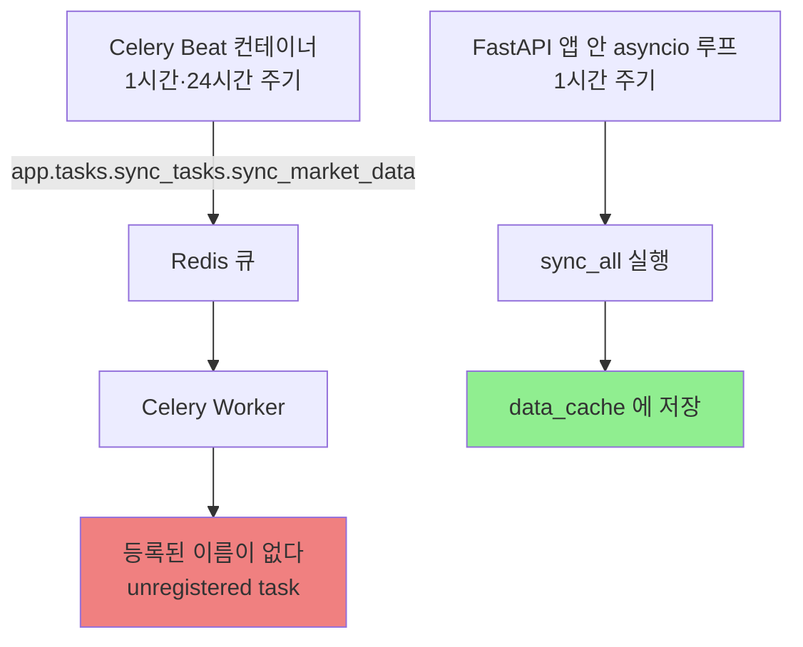
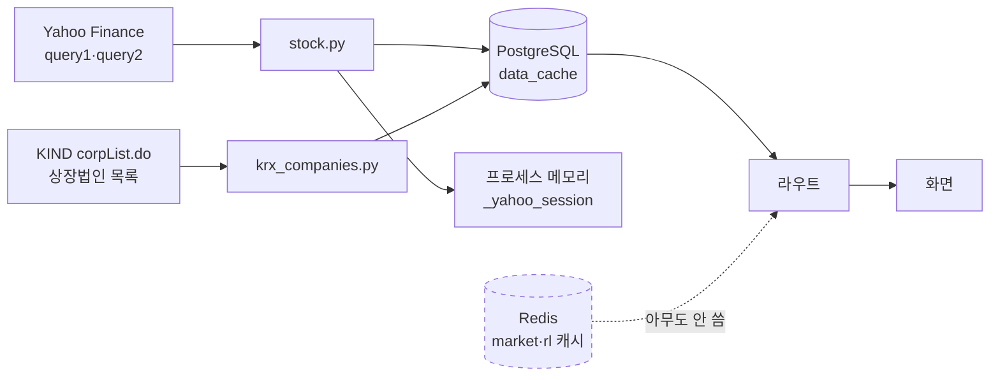
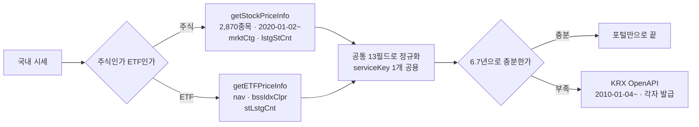
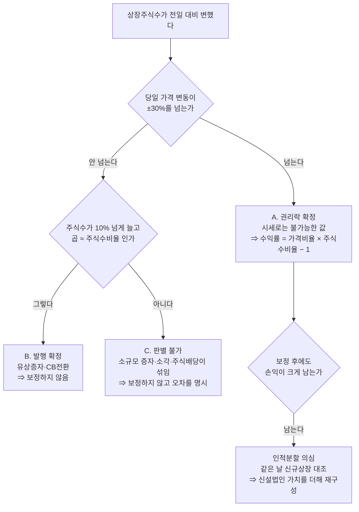
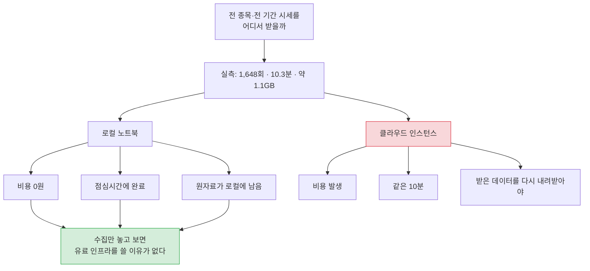
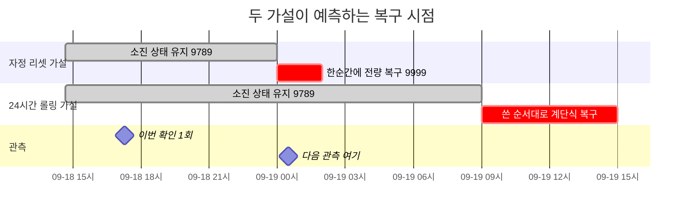
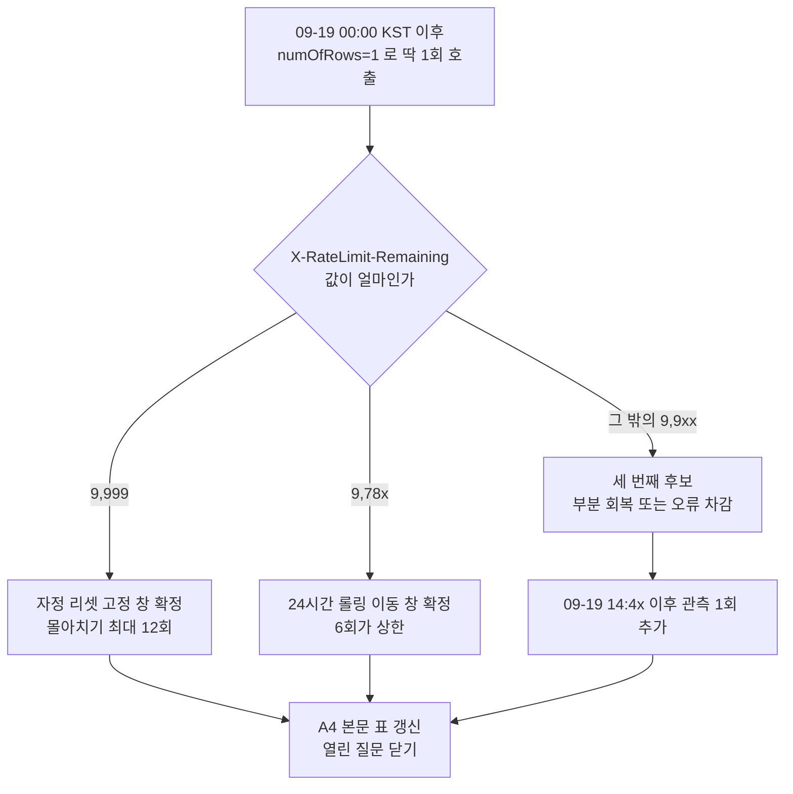
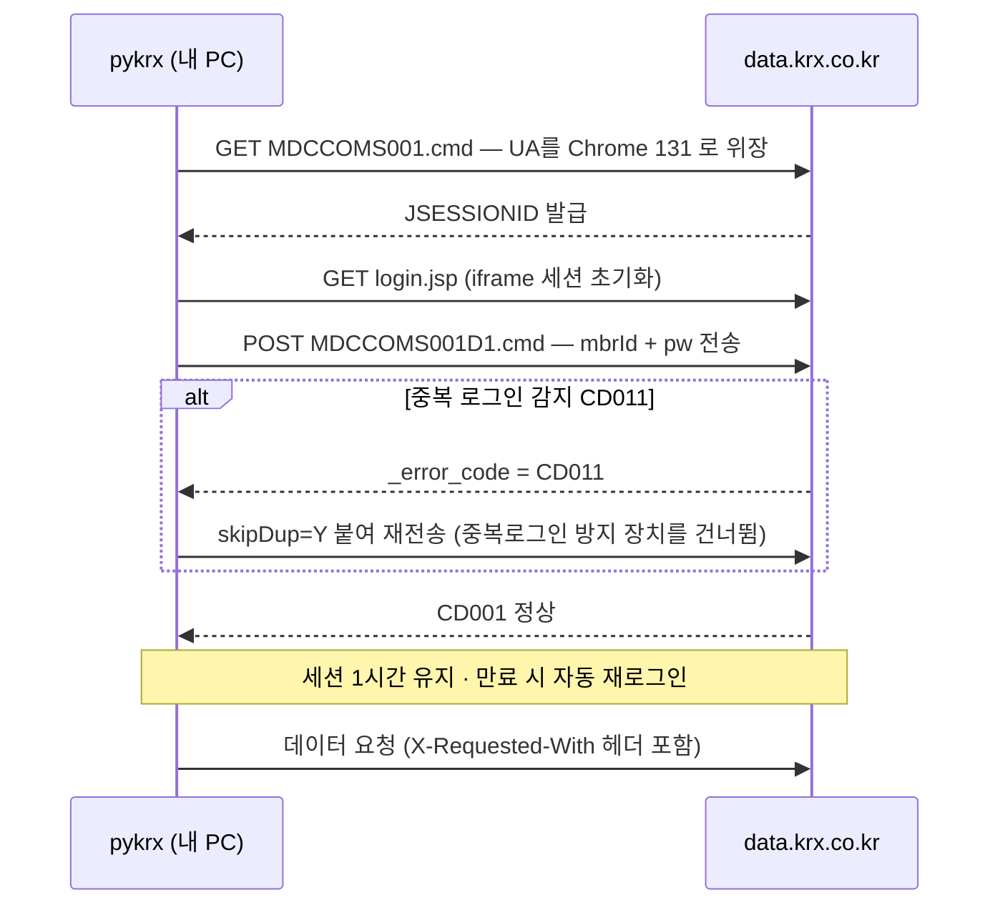

# #23 [분석] A4 시장 데이터·캐시·동기화 — 예약 작업 2개가 한 번도 실행된 적이 없습니다

> 🗂️ 옛 GitHub 이슈를 옮긴 **기록 문서**입니다 — [색인](../README.md). 원문은 그대로 두고, 링크·커밋 해시만 새 자리 기준으로 바꿨습니다.

| 항목 | 내용 |
|---|---|
| 종류 | 이슈 |
| 상태 | 열림 |
| 원 작성 | 이동원(`devlee328288`) · 2026-09-17 15:19 KST |
| 라벨 | `analysis` |
| 댓글 | 10건 |
| 옛 주소 | `github.com/devlee328288/Qurious/issues/23` (지금은 열리지 않음) |

## 본문

> **쉬운 요약 3줄**
> 1. ✅ **[2026-09-19 고쳤습니다 — PR [#35](../pulls/035.md)]** ~~예약 작업(Celery Beat) 두 개가 한 번도 실행된 적이 없습니다. 부르는 이름과 등록된 이름이 달라서입니다.~~ 🔴 **원인을 하나 더 찾았습니다.** 이름 불일치는 맞지만 그게 전부가 아니었습니다 — **태스크가 애초에 하나도 등록되지 않고 있었습니다.** 두 결함은 별개라 둘 다 고쳐야 돕니다(2.1.1). 실제 Redis 로 띄워 확인했습니다.
> 2. **2차가 하려는 "주식 + 국내상장 ETF"(D5 ①)를 지금 데이터 경로로는 받을 수 없습니다.** 종목 목록은 KOSPI 31개가 코드에 박혀 있고, KRX 목록은 *상장법인* 목록이라 ETF가 처음부터 없습니다. 지금 있는 ETF는 전부 **미국** 섹터 ETF입니다.
> 3. 그리고 **휴장일이라는 개념이 코드 어디에도 없습니다.** 값이 비면 수익률을 0으로 채웁니다 — 쉬는 날과 "하루 종일 안 움직인 날"이 구분되지 않습니다.

---

## 0. 한눈에 보기

기준 커밋 **`04f476a`** · 조사일 **2026-09-17(KST)** · 확실도 **🟢 코드·원문으로 확인 / 🟡 추론**

| # | 발견 | 심각도 | 확실도 | 근거 |
|---|---|:---:|:---:|---|
| 1 | ✅ **고침(PR [#35](../pulls/035.md))** ~~Celery Beat 태스크 2개가 영영 실행되지 않음 (이름 불일치)~~ → 실제로는 **결함 2건**: ① 태스크 등록 0개 ② 이름 불일치 | ~~🔴 높음~~ → 해소 | 🟢 실측 | [celery_app.py:33-44](https://github.com/EST-team-project/Qurious/blob/04f476a/app/celery_app.py#L33-L44) vs [sync_tasks.py:16,39](https://github.com/EST-team-project/Qurious/blob/04f476a/app/tasks/sync_tasks.py#L16) |
| 2 | **국내상장 ETF를 받을 경로가 없음** — D5 ①과 정면 충돌 | 🟠 중간 | 🟢 | [stock.py:15-47](https://github.com/EST-team-project/Qurious/blob/04f476a/app/services/stock.py#L15-L47) · [krx_companies.py:103-111](https://github.com/EST-team-project/Qurious/blob/04f476a/app/services/krx_companies.py#L103-L111) |
| 3 | **휴장일 처리 0건** + 수익률 결측을 `0.0`으로 채움 | 🟠 중간 | 🟢 | `grep` 0건 · [investment_research.py:56](https://github.com/EST-team-project/Qurious/blob/04f476a/app/services/investment_research.py#L56) |
| 4 | 시세 전량이 **Yahoo 비공식 API** — 제공자가 밝힌 조건은 *개인 사용* | 🟠 중간 | 🟢/🟡 | [stock.py:9](https://github.com/EST-team-project/Qurious/blob/04f476a/app/services/stock.py#L9) |
| 5 | 캐시 신선도가 **화면마다 2·3·6·24시간**으로 제각각 | 🟡 낮음 | 🟢 | 아래 3.2 표 |
| 6 | Redis 캐시 2개(`market`·`rl`)는 **정의만 있고 아무도 안 씀** | 🟡 낮음 | 🟢 | [redis_cache.py:157,159](https://github.com/EST-team-project/Qurious/blob/04f476a/app/lib/redis_cache.py#L157) |
| 7 | 실패가 **조용합니다** — 예외를 삼키고 `None`·빈 리스트 반환 | 🟡 낮음 | 🟢 | [stock.py:66-67](https://github.com/EST-team-project/Qurious/blob/04f476a/app/services/stock.py#L66-L67) |
| 8 | `POST /api/system/sync`를 **로그인한 누구나** 무제한 호출 | 🟡 낮음 | 🟢 | [system.py:38-41](https://github.com/EST-team-project/Qurious/blob/04f476a/app/routes/system.py#L38-L41) |
| 9 | Yahoo crumb 세션이 **프로세스 전역 변수** | 🟡 낮음 | 🟢 | [stock.py:89-90](https://github.com/EST-team-project/Qurious/blob/04f476a/app/services/stock.py#L89-L90) |

---

### 0.1 ★ 2026-09-18 추가 — 수집기를 짤 때 바로 물리는 함정 3가지

| 함정 | 무엇이 일어나나 | 막는 법 | 근거 |
|---|---|---|---|
| **포털 `endBasDt` 가 배타적** | 범위 조회의 **마지막 날이 조용히 빠집니다** (`begin=0915,end=0917` → 09-15·09-16 만) | 끝날 +1일, 또는 **`basDt` 하루치씩** 순회 | [#33 6.4](../issues/033.md) |
| **KIS 유량 초과가 빈 배열로 옴** | `output2` 가 `[]` 라 **"그날 데이터 없음"으로 오인** | `rt_cd != "0"` 이면 예외 (`EGW00201`) · 간격 **0.6~1.0초** | [#33 6.1.1](../issues/033.md) |
| **거래정지 판별이 소스마다 다름** | 포털은 `mkp==0`, **KIS 는 `acml_vol==0`** — 규칙을 섞으면 **하나도 안 걸림** | 전처리 규격에 **소스별로** 적기 | [#33 6.3](../issues/033.md) |
| **포털 휴장일과 '아직 안 올라온 날'이 똑같음** ★ 09-19 | 둘 다 `resultCode=00` + `totalCount=0`. **당일 `basDt` 를 찍는 일정은 영원히 0건** | 당일 수집이 아니라 **최근 2주 되돌아보며 빈 날 채우기** | [#33 10절](../issues/033.md) |
| **조정계수를 직접 계산하면 틀림** ★ 09-19 | 카카오 558,000÷5=111,600 이 아니라 **기준가 112,000**(호가단위 조정) | 계산하지 말고 **`vs` 가 주는 값**을 쓴다 | [#33 5-A](../issues/033.md) |

이 셋은 모두 **오류를 내지 않고 조용히 틀립니다.** 2.2절의 `KeyError` 처럼 시끄럽게 실패하는 결함보다 찾기 어렵습니다.

---

## 1. 용어 풀이

**정확한 뜻 → 이 문서에서 가리키는 것 → 헷갈리기 쉬운 점** 순입니다.

### 1.1 "예약 실행"이 이 프로젝트에는 **두 벌** 있습니다

같은 일을 하는 장치가 둘이라 먼저 구분합니다.

| | **앱 안 스케줄러** | **Celery Beat** |
|---|---|---|
| 어디서 도나 | FastAPI 프로세스 안 asyncio 루프 | 별도 컨테이너(`fin-ai-celery-beat`) |
| 시작 지점 | `main.py`의 lifespan | `celery -A app.celery_app beat` |
| 주기 | 1시간 | 1시간 / 24시간 |
| **지금 도는가** | **돕니다** | **안 돕니다** ← 결함 1 |
| 앱이 꺼지면 | 같이 멈춤 | 계속 돌아야 정상 |

> **헷갈리기 쉬운 점**: [#9](../issues/009.md)에서 "앱 안 스케줄러와 중복"이라고 적었지만, **실제로는 중복이 아니라 한쪽이 죽어 있는 상태**입니다. 고치면 그때 비로소 중복이 됩니다 — 그러니 "이름을 고친다"와 "둘 중 하나를 없앤다"는 **같이** 결정해야 합니다.

### 1.2 데이터 용어

| 용어 | 정확한 뜻 | 이 문서에서 가리키는 것 | 헷갈리기 쉬운 점 |
|---|---|---|---|
| **crumb(크럼)** | Yahoo가 자동 수집을 막으려고 요구하는 임시 토큰 | `_get_yahoo_crumb()`가 30분마다 새로 받음 | 로그인이 아닙니다. **쿠키와 짝**이라 둘 중 하나만 있으면 401이 납니다 |
| **TTL / 신선도** | 캐시된 값을 언제까지 믿을지 | `max_age_hours` | **얼마나 자주 갱신하나(주기)**와 **얼마나 오래 믿나(TTL)**는 다릅니다. 이 프로젝트는 둘이 어긋나 있습니다(3.2) |
| **stale(묵은 값)** | 기한이 지났지만 남아 있는 값 | 인터넷이 끊겼을 때 쓰는 값 | 화면에 **"언제 값인지"가 표시되지 않으면** 사용자는 실시간으로 오해합니다 |
| **수정주가** | 액면분할·배당을 반영해 과거 가격을 고친 값 | Yahoo가 기본으로 주는 값 | 보정 여부가 다르면 **같은 종목의 수익률이 달라집니다** |
| **휴장일** | 시장이 열지 않는 날 | 이 코드에 **개념이 없습니다** | 주말만이 아닙니다 — 공휴일·임시휴장이 있습니다 |
| **PDF (ETF)** | Portfolio Deposit File, ETF 구성 종목·비중 | pykrx `get_etf_portfolio_deposit_file` | 문서 형식 PDF와 **무관합니다** |
| **look-ahead** | 그 시점에 몰랐을 정보를 쓰는 것 | `shift(1)`로 막는 곳들 | 데이터 수집 단계에서도 생깁니다 — **나중에 수정된 과거 값**을 쓰면 같은 문제입니다 |

---

## 2. 결함 1 — 예약 작업이 한 번도 돈 적이 없습니다 ~~🔴~~ ✅ 2026-09-19 고침

### 2.1 무엇이 어긋났나

Beat는 **모듈 경로**로 부르고, 태스크는 **짧은 이름**으로 등록돼 있습니다.

| | 값 | 위치 |
|---|---|---|
| Beat가 부르는 이름 | `app.tasks.sync_tasks.sync_market_data` | [celery_app.py:35](https://github.com/EST-team-project/Qurious/blob/04f476a/app/celery_app.py#L35) |
| 실제 등록된 이름 | `sync.market_data` | [sync_tasks.py:16](https://github.com/EST-team-project/Qurious/blob/04f476a/app/tasks/sync_tasks.py#L16) |
| Beat가 부르는 이름 | `app.tasks.sync_tasks.sync_stock_candles` | [celery_app.py:40](https://github.com/EST-team-project/Qurious/blob/04f476a/app/celery_app.py#L40) |
| 실제 등록된 이름 | `sync.stock_candles` | [sync_tasks.py:39](https://github.com/EST-team-project/Qurious/blob/04f476a/app/tasks/sync_tasks.py#L39) |

Celery 공식 문서는 이렇게 적고 있습니다 — *"If no explicit name is provided the task decorator will generate one for you, and this name will be based on 1) the module the task is defined in, and 2) the name of the task function."* ([원문](https://raw.githubusercontent.com/celery/celery/main/docs/userguide/tasks.rst), 조회 2026-09-17 KST). 즉 **이름을 명시하면 모듈 경로 이름은 만들어지지 않습니다.**

### 2.1.1 🔴 정정 — 원인이 하나가 아니었습니다 (2026-09-19 추가)

위 2.1 의 진단(이름 불일치)은 **맞지만 불완전했습니다.** 실제로 Redis 를 띄워 워커를 돌려
보니 더 앞선 곳에서 막혀 있었습니다 — **태스크가 아예 하나도 등록되지 않고 있었습니다.**

```
바꾸기 전 — 워커 기동 로그

  [tasks]
                     ← 비어 있음. 한 줄도 없습니다.

  celery@HOST ready.   ← 그런데 "ready" 는 찍힙니다
```

| | 결함 ① 등록 0개 | 결함 ② 이름 불일치 |
|---|---|---|
| 어디서 | `celery_app.py` 맨 아래 `autodiscover_tasks(["app.tasks"])` | `beat_schedule` 의 `"task"` 값 |
| 무엇이 | 그 함수는 `app/tasks/**tasks.py**` 를 찾는데, 그런 파일이 없음 | 모듈 경로로 부르는데 등록 이름은 짧은 이름 |
| 증상 | 보낸 태스크가 **`NotRegistered`** | Beat 메시지를 워커가 **조용히 버림** |
| 범위 | 채팅·인제스트·수집 **전부** | Beat 2개만 |

**둘은 별개입니다.** 하나만 고치면 여전히 돌지 않습니다 —

```
①만 고침 : 태스크는 등록됨 → 그러나 Beat 가 없는 이름을 부름        → 안 돎
②만 고침 : 이름은 맞음     → 그러나 등록된 태스크가 애초에 없음      → 안 돎
①+② 고침 : 등록 + 이름 일치                                         → 돎 ✅
```

**왜 여태 안 드러났나.** `autodiscover_tasks` 는 **못 찾아도 오류를 내지 않습니다.** 0개를
등록하고 조용히 넘어갑니다. 워커는 멀쩡히 뜨고 `ready` 를 찍으므로 로그만 봐서는 정상으로
보입니다. 이 이슈가 처음에 ②만 짚은 것도 같은 이유입니다 — 정적 분석으로는 ①이 보이지
않습니다. **띄워 봐야 보입니다.** 🟢

**고친 방식**: `Celery(include=[...])` 로 태스크 모듈 4개를 **명시적으로** 싣습니다.
`autodiscover` 에 기대지 않습니다. 새 태스크 파일을 만들 때 한 줄 추가하면 됩니다.

| 확인 항목 | 바꾸기 전 | 바꾼 뒤 |
|---|---|---|
| 등록된 태스크 수 | 0개 | **10개** |
| 보낸 태스크 3건 | `NotRegistered` | **3/3 실행** |
| Beat 항목 5개 | 0개 도달 | **5개 전부 워커 도달** |

(2026-09-19 · `redis:7-alpine` 컨테이너 · Windows 는 `--pool=solo` 필요)

⚠️ **`sync.*` 두 개는 이름만 맞추고 실행하지 않았습니다.** 그 구현이 Yahoo 비공식 API
경로를 타기 때문입니다(4절). 이름 불일치라는 결함은 해소됐지만, 그 태스크를 실제로 쓸지는
D7([#13](../discussions/013.md))에서 소스를 확정한 뒤 정할 문제로 남습니다.

### 2.2 실측 — 같은 구조를 최소 재현했습니다

```
celery 5.6.3

등록된 태스크 이름: ['lumina-invest.other_task', 'sync.market_data']

Beat가 부르는 이름 : app.tasks.sync_tasks.sync_market_data
그 이름이 등록되어 있나?: False
실제 등록 이름        : sync.market_data
이름 미지정 태스크    : lumina-invest.other_task   ← 모듈 경로 기반으로 자동 생성됨

app.tasks[...] 조회 결과: KeyError 'app.tasks.sync_tasks.sync_market_data'
```

`name=`을 명시한 쪽은 그 이름으로만 등록되고, 명시하지 않은 쪽만 자동 이름이 붙는 것이 그대로 보입니다. 🟢

### 2.3 그래서 실제로 어떻게 돌고 있나



| 장치 | 상태 | 결과 |
|---|---|---|
| 앱 안 스케줄러 | **동작** | 시장지수·매크로·섹터ETF·미국주식 + 캔들 워밍 |
| Beat `sync.market_data` | **미동작** | 앱이 꺼져 있으면 아무도 갱신하지 않음 |
| Beat `sync.stock_candles` | **미동작** | 일 1회 캔들 갱신이 사실상 없음 |

앱 안 스케줄러가 같은 `sync_all`을 부르므로([sync_tasks.py:23-29](https://github.com/EST-team-project/Qurious/blob/04f476a/app/tasks/sync_tasks.py#L23-L29), [sync_scheduler.py:240](https://github.com/EST-team-project/Qurious/blob/04f476a/app/services/sync_scheduler.py#L240)) **겉보기에는 멀쩡합니다.** 그래서 지금까지 드러나지 않았을 가능성이 큽니다. 🟡

### 2.4 고칠 때 같이 정해야 할 것

🔴 **2026-09-19 정정** — ~~이름만 맞추면~~ **①·② 를 둘 다 고치면**(2.1.1) 그때 비로소 이 문제가 생깁니다. 이름만 맞춰서는 애초에 돌지 않았으므로, 이 절은 *고친 뒤에야* 유효한 이야기였습니다. **지금은 둘 다 고쳤으므로 이 선택이 실제 문제가 됐습니다.**

둘 다 고친 지금, **두 장치가 같은 일을 1시간마다 두 번** 하게 됩니다. 앱 안 스케줄러의 중복 방지 플래그 `_syncing`은 **그 프로세스 안에서만** 유효하므로([sync_scheduler.py:199-200](https://github.com/EST-team-project/Qurious/blob/04f476a/app/services/sync_scheduler.py#L199-L200)) Celery 워커 쪽 실행은 막지 못합니다.

| 안 | 내용 | 장점 | 단점 |
|---|---|---|---|
| **가** | 이름을 고치고 **앱 안 스케줄러를 뗀다** | 앱이 꺼져도 갱신이 돈다 · 워커를 늘려도 한 번만 | 컨테이너 2개(beat·worker)가 항상 떠 있어야 함 |
| 나 | Beat 스케줄을 **지우고** 앱 안 루프만 남긴다 | 컨테이너 2개를 줄일 수 있다(D2의 0원 원칙과 맞음) | 앱이 꺼지면 갱신이 멈춘다 |
| 다 | 둘 다 두고 분산 락을 건다 | 이중화 | 이 규모에 과합니다 |

D2 추천안(팀 추가 0원 · 로컬 시연)을 따르면 **나**가 단순합니다. 다만 결정은 D2 결론이 확정된 뒤에 하는 편이 낫습니다.

---

## 3. 데이터가 흐르는 길과 캐시

### 3.1 전체 그림



캐시가 **세 겹**입니다 — PostgreSQL `data_cache`, Redis, 프로세스 메모리. 이 중 **Redis의 시세용 2개는 참조가 0건**입니다(A2 [#21](../issues/021.md)에서 지적한 내용을 이번에도 확인했습니다). 🟢

### 3.2 신선도가 화면마다 다릅니다

| 무엇 | TTL | 갱신 주기 | 어긋남 | 위치 |
|---|---:|---:|:---:|---|
| 시장지수 | 2시간 | 1시간 | 맞음 | [stocks.py:41](https://github.com/EST-team-project/Qurious/blob/04f476a/app/routes/stocks.py#L41) |
| 매크로 지표 | 2시간 | 1시간 | 맞음 | [macro.py:36](https://github.com/EST-team-project/Qurious/blob/04f476a/app/routes/macro.py#L36) |
| 섹터 ETF · 미국주식 | 2시간 | 1시간 | 맞음 | [macro.py:51,67](https://github.com/EST-team-project/Qurious/blob/04f476a/app/routes/macro.py#L51) |
| AI 분석 결과 | 3시간 | — | 갱신 주기 없음 | [ml.py:137](https://github.com/EST-team-project/Qurious/blob/04f476a/app/routes/ml.py#L137) |
| 캔들 · 퀀트지표 | 6시간 | **24시간**(미동작) | **어긋남** | [stocks.py:62,78](https://github.com/EST-team-project/Qurious/blob/04f476a/app/routes/stocks.py#L62) |
| 펀더멘털 | 6시간 | 없음 | 요청 때만 | [stock.py:134](https://github.com/EST-team-project/Qurious/blob/04f476a/app/services/stock.py#L134) |
| KRX 종목 목록 | 24시간 | 없음 | 요청 때만 | [krx_companies.py:24](https://github.com/EST-team-project/Qurious/blob/04f476a/app/services/krx_companies.py#L24) |
| `cache_get` 기본값 | **24시간** | — | — | [data_cache.py:32](https://github.com/EST-team-project/Qurious/blob/04f476a/app/services/data_cache.py#L32) |

**캔들 줄이 문제입니다.** 화면은 "6시간 지나면 묵은 값"으로 보는데, 갱신 담당은 24시간짜리 Beat이고 그마저 안 돕니다. 실제로는 앱 안 루프가 매시간 캔들을 워밍해 주고 있어([sync_scheduler.py:223](https://github.com/EST-team-project/Qurious/blob/04f476a/app/services/sync_scheduler.py#L223)) 메워지는 구조입니다 — **우연히 맞고 있는 셈**입니다. 🟡

> 백테스트를 돌리는 사람 입장에서 중요한 점: **묵은 값이 그대로 계산에 들어가도 화면에 표시가 없습니다.** `cache_info()`가 나이(분)를 돌려주는 기능이 있지만([data_cache.py:71-88](https://github.com/EST-team-project/Qurious/blob/04f476a/app/services/data_cache.py#L71-L88)) 쓰는 곳은 `/api/system/sync-status` 한 곳뿐입니다.

---

## 4. 결함 2 — 2차의 유니버스(D5 ①)를 지금 경로로 못 받습니다 🟠

D5 ① 추천안은 **"주식 + 국내상장 ETF"**입니다. 지금 코드가 무엇을 줄 수 있는지 봅니다.

| 무엇이 있나 | 내용 | 국내 ETF 포함? |
|---|---|:---:|
| `QUANT_STOCKS` | **KOSPI 31종목이 코드에 하드코딩** (`.KS`만) | ❌ |
| `krx_companies` | KIND **상장법인 목록** — 코스피·코스닥, `type: "주식"` 고정 | ❌ (법인 목록이라 ETF가 없음) |
| `SECTOR_ETFS` | XLK·XLF·XLE… **미국** 섹터 ETF 11개 | ❌ (미국) |
| `MARKET_INDICES` | `^KS11`·`^KQ11`·`KRW=X` | ❌ (지수) |

— [stock.py:15-53](https://github.com/EST-team-project/Qurious/blob/04f476a/app/services/stock.py#L15-L53) · [krx_companies.py:103-111](https://github.com/EST-team-project/Qurious/blob/04f476a/app/services/krx_companies.py#L103-L111) · [sync_scheduler.py:49-61](https://github.com/EST-team-project/Qurious/blob/04f476a/app/services/sync_scheduler.py#L49-L61)

코넥스는 *"Yahoo Finance에 사실상 데이터가 없어"* 의도적으로 뺐다고 적혀 있습니다([krx_companies.py:29](https://github.com/EST-team-project/Qurious/blob/04f476a/app/services/krx_companies.py#L29)). 🟢

### 4.1 그럼 어떻게 받나 — 선택지 비교

> **2026-09-18 정정.** 아래 표 3행을 처음에 *"S11에서 확인했듯 사이트 접근 자체가 막혀 있어
> 미확인"*이라고 적었는데 **틀렸습니다.** 실제로 호출됩니다. 공공데이터포털 행도 빠져 있어
> 함께 넣었습니다. 실측 근거는 전부 → [#31 ETF 시세 출처 확정 댓글](../issues/031.md#issuecomment-5713249020)

> **2026-09-18 2차 갱신 (S23).** KRX 행의 구성종목 **❓를 ❌로 닫았습니다** — 공식 서비스 목록
> 31개 전수 + 경로 16개 404 + 응답 필드 19개 전수, 세 갈래로 확인했습니다. 포털 거래일도
> **1,647 → 1,648**로 정정합니다(S22 수집물 68종목 `basDt` 합집합 실측).
> 근거 → [#23 KRX ETF 구성종목(PDF) 조사 댓글](../issues/023.md#issuecomment-5725736888)

> ★★ **2026-09-18 갱신** — 아래 표에서 **네 방법 중 둘이 🔴 로 닫혔습니다**(Yahoo·pykrx). 새로 **FinanceDataReader 🔴** 와 **KIS ✅(용도 한정)** 를 넣었습니다. 그리고 **KRX·포털·KIS 세 기관의 값이 완전히 일치**함을 같은 날 같은 종목으로 확인했습니다(삼성전자 253,500 / SK하이닉스 1,759,000 / 카카오 33,500 — 시가·거래량까지 동일).
> **남은 것은 값의 정확성이 아니라 기간·유량·약관입니다.** → [#33 6.1~6.6](../issues/033.md)

| 방법 | 국내 ETF 목록 | ETF 시세 | 구성종목·비중 | 필요한 것 | 걸림돌 |
|---|:---:|:---:|:---:|---|---|
| ~~**Yahoo 그대로**~~ 🔴 | ❌ 목록을 못 만듦 | 🟡 `069500.KS` 식 개별 조회만 | ❌ | 없음 | 🔴 **선택 불가** — 목록을 손으로 적어야 함 · robots.txt `Disallow: /` — **A11 [#25](../issues/025.md)에서 우리가 문제 삼은 그 행위** |
| ~~**pykrx 추가**~~ 🔴 | ✅ `get_etf_ticker_list` | ✅ `get_etf_ohlcv_by_date` | ✅ `get_etf_portfolio_deposit_file` | **`KRX_ID`·`KRX_PW`** (로그인 계정 2개) | 🔴 **2026-09-18 선택 불가로 확정** — KRX 약관 **제10조②(자동화 수단 무단 수집 금지)** 위반([#25](../issues/025.md)). 기록으로만 남깁니다 |
| ~~**FinanceDataReader**~~ 🔴 | ✅ | ✅ | ❌ | 없음 | 🔴 **2026-09-18 선택 불가로 확정** — 국내 일별시세 경로가 **`fchart.stock.naver.com`** 인데 그 도메인 robots.txt 가 **`Disallow: /`**(직접 확인). 코드 내 `data.krx.co.kr` **25회** ([#33 6.5](../issues/033.md)) |
| **KIS 오픈API** ★신설 | 🟡 별도 | ✅ **실시간·당일** · 응답 **80필드** · **수정주가 직접 제공**(`FID_ORG_ADJ_PRC=0`) | ❌ | 앱키·시크릿 (각자 발급) | 🔴 **대량 백필 금지** — 약관 **제9조①4**(서버 부하 시 이용 중지) · **제5조③**(개인 업무 한정·제3자 제공 금지) · 모의 **초당 약 2건** 실측 |
| **KRX 공식 OpenAPI** | ✅ `basDd` 하루치가 **그날 상장 전종목**을 줌 | ✅ **2010-01-04~** **16.7년** · 약 4,100거래일 🟢 | ❌ **별도 API 없음** — 공식 목록 31개 전수 확인 (S23) | **`AUTH_KEY` 헤더 1개** · https 고정 | 약관 제7조⑤ **인증키 양도 금지** → 4명 각자 발급 |
| **공공데이터포털** | ❌ 목록을 주지 않음 — 코드를 **알아야** 조회 | ✅ **2020-01-02~** 1,648거래일 · `numOfRows=2000`으로 **1회에 전부** 🟢 | ❌ | `serviceKey` 1개 | **6.7년이 벽** · 휴장일 행 없음 · 공공누리 제4유형 |

**인증 부담이 pykrx와 다릅니다.** pykrx는 KRX 홈페이지 **로그인 계정**(`KRX_ID`·`KRX_PW`)이
필요한 반면, 공식 OpenAPI는 **발급받은 `AUTH_KEY` 헤더 하나**로 끝납니다. 단 `http`로 부르면
302가 떨어지므로 `https` 고정입니다. 🟢

<details>
<summary><b>호출할 때 걸리기 쉬운 것 3가지</b> (S19 조사에서 제가 다 걸렸습니다)</summary>

1. 공공데이터포털 `serviceKey`는 **이미 URL 인코딩된 값**입니다. 다시 인코딩하면 403입니다.
2. 단축코드 파라미터는 `likeSrtnCd`, ISIN은 `isinCd`입니다. **바꿔 넣으면 오류가 아니라
   `resultCode=00`에 `totalCount=0`**이 옵니다 — 조용히 빈 값을 받습니다.
3. KRX 공식은 `basDd`(기준일자) **하루치 전종목**이 조회 단위입니다. 종목 하나의 시계열을
   받는 형태가 아니라서, 긴 기간을 받으려면 날짜를 돌며 여러 번 불러야 합니다.

</details>

pykrx README가 밝히는 조건입니다 — *"KRX 로그인이 필요한 API를 사용하려면 `KRX_ID`·`KRX_PW`
두 환경변수를 **반드시** 설정해야 합니다"*, 그리고 *"데이터의 저작권은 각 제공처에 있으며…
상업적 용도 사용 시 데이터 제공처의 약관을 준수해야 합니다"*
([원문](https://raw.githubusercontent.com/sharebook-kr/pykrx/master/README.md), 조회 2026-09-17 KST).

> **D6 ⑥과 이어집니다.** D6에서 *"수급 데이터는 3차에서 뺀다"*를 추천안으로 잡은 이유가 KRX
> 유래 공공데이터의 **공공누리 제4유형**(출처표시 + 상업적 이용금지 + 변경금지, 재배포 금지)
> 이었습니다. **이 제약은 네 경로 중 Yahoo를 뺀 셋 모두에 붙습니다** — 계정·키가 필요하고,
> 받은 데이터를 저장소에 올릴 수 없습니다. 🟡

### 4.2 최소로 가는 길 — 권고를 거둡니다

원래 이 자리에 *"대표 ETF 5~10개(`069500.KS`·`360750.KS` 등)면 지금 Yahoo 경로 그대로 된다"*
라고 적었습니다. **공식 경로가 실재하는 것이 확인된 지금은 권하지 않습니다.**

| | 처음 안 (Yahoo 대표 5~10개) | 지금 안 (공식 경로) |
|---|---|---|
| 추가 의존성 | 없음 | 없음 — 둘 다 `requests` 한 줄 |
| 계정·키 | 없음 | 무료 키 1개 (즉시 발급) |
| 이용 조건 | robots.txt `Disallow: /` — **A11 [#25](../issues/025.md)에서 우리가 남을 두고 문제 삼은 바로 그 행위** | 약관상 허용 · 재배포만 금지 |
| 과거 범위 | 사실상 제한 없음 | KRX 2010~ · 포털 2020~ |
| 생존편향 | ❌ 오늘 살아 있는 종목만 | KRX ✅ (그날 유니버스) · 포털 ❌ |

→ **대표 몇 개든 전체든, 경로는 공식으로 바꾸는 편이 낫습니다.** 작업량 차이는 거의 없습니다.

다만 **몇 년치를 쓸지가 KRX냐 포털이냐를 가릅니다** — 6.7년이면 포털만으로 끝나고, 그보다
길면 KRX가 유일합니다. 이것은 D5 [#18](../discussions/018.md) · D4 [#17](../discussions/017.md)에서 정할 일입니다.

D5 ①이 "국내상장 ETF **전체**"를 뜻하는지 "**대표 몇 개**"를 뜻하는지는 여전히 열려 있습니다
— 이 문서는 그 답을 정하지 않습니다.

---

## 5. 결함 3 — 휴장일이 없고, 빈 값은 0이 됩니다 🟠

`휴장`·`holiday`·`is_open`·`business_day` 같은 말로 코드 전체를 훑었지만 **일치 0건**입니다. "거래일"이라는 말은 주석과 설명 문구에만 나옵니다. 🟢

대신 결측을 이렇게 처리합니다.

| 위치 | 코드 | 뜻 |
|---|---|---|
| [investment_research.py:56](https://github.com/EST-team-project/Qurious/blob/04f476a/app/services/investment_research.py#L56) | `close.pct_change().fillna(0.0)` | 수익률 빈칸 → **0%** |
| [investment_research.py:47](https://github.com/EST-team-project/Qurious/blob/04f476a/app/services/investment_research.py#L47) | `state.ffill().fillna(0.0)` | 직전 값으로 메우고 남으면 0 |
| [lean_backtest.py:474](https://github.com/EST-team-project/Qurious/blob/04f476a/app/services/lean_backtest.py#L474) | `close.pct_change().fillna(0.0)` | 같음 |
| [investment_research.py:52](https://github.com/EST-team-project/Qurious/blob/04f476a/app/services/investment_research.py#L52) | `indicators(candles).dropna()` | 지표 계산 전 빈 줄 제거 |

**왜 문제가 되나.** 쉬는 날과 "거래됐지만 0%인 날"이 **같은 값**이 됩니다. 변동성은 0인 날이 많아질수록 낮아지므로, 샤프지수 같은 지표가 **실제보다 좋아 보일 수 있습니다.** 얼마나 좋아지는지는 종목·기간에 따라 다르고, **이번에 수치로 재지는 않았습니다.** 🟡

> **D4와 이어집니다.** D4 ④는 `TimeSeriesSplit(gap ≥ label_horizon)`, ⑤는 블록 부트스트랩을 추천안으로 잡았습니다. 두 방법 모두 **행(row) 하나를 하루로 셈합니다.** 휴장일이 0%짜리 행으로 섞여 들어가면 gap과 블록 길이의 실제 의미가 달라집니다 — 2차에서 규격을 확정할 때 "행 = 거래일"임을 데이터 단계에서 보장하는 편이 안전합니다. 🟡

---

## 6. 결함 4 — 시세 전량이 Yahoo 비공식 API 🟠

| 무엇을 받나 | 어디서 | 인증 |
|---|---|:---:|
| 캔들·현재가 | `query2.finance.yahoo.com/v8/finance/chart` | 없음 |
| 펀더멘털 | `query1.finance.yahoo.com/v10/finance/quoteSummary` | **crumb + 쿠키** |
| 종목 검색(보조) | `query1.finance.yahoo.com/v1/finance/search` | 없음 |
| 연결 확인용 | `query2…/chart/AAPL` HEAD 요청 | 없음 |

이 주소들은 Yahoo가 문서로 공개한 API가 아니라 **웹사이트 내부용**입니다. 그래서 `v10/quoteSummary`는 crumb을 요구하고([stock.py:93-113](https://github.com/EST-team-project/Qurious/blob/04f476a/app/services/stock.py#L93-L113)), 이 방식은 Yahoo가 바꾸면 **예고 없이 깨집니다.**

같은 엔드포인트를 쓰는 대표 라이브러리 yfinance는 README에 이렇게 못 박아 두었습니다 — *"yfinance is **not** affiliated, endorsed, or vetted by Yahoo, Inc."*, 그리고 **"Remember - the Yahoo! finance API is intended for personal use only."** ([원문](https://raw.githubusercontent.com/ranaroussi/yfinance/main/README.md), 조회 2026-09-17 KST).

> **한계**: Yahoo 이용약관 **원문은 읽지 못했습니다.** `policies.yahoo.com`이 `robots.txt`로 자동 조회를 막습니다(`User-agent: *` / `Disallow: /`). 위 문구는 yfinance가 인용한 것이라 **2차 출처**입니다. 약관 원문 확인이 필요하면 사람이 직접 열어 봐야 합니다. 🟡

우리 프로젝트는 팀 과제·시연 용도라 "개인 사용"의 테두리 안이라고 볼 여지가 큽니다. 다만 **공개 서비스로 열거나 데이터를 재배포하면 이야기가 달라집니다** — D2(로컬 시연 + 정적 결과 페이지) 결론과 직접 맞물립니다. 🟡

### 6.1 crumb 세션이 프로세스마다 따로입니다

```python
_yahoo_session: dict = {"cookies": None, "crumb": None, "ts": 0.0}
_CRUMB_TTL_SEC = 1800
```
— [stock.py:89-90](https://github.com/EST-team-project/Qurious/blob/04f476a/app/services/stock.py#L89-L90)

모듈 전역이라 **앱·Celery 워커가 각각 자기 crumb을 받습니다.** 지금 배포는 `uvicorn` 워커가 1개라([Dockerfile:30](https://github.com/EST-team-project/Qurious/blob/04f476a/Dockerfile#L30) — `--workers` 옵션 없음) 실질 문제가 없지만, **워커를 늘리는 순간 발급 요청이 그만큼 늘어납니다.** 🟢

---

## 7. 결함 7·8 — 조용한 실패와 무제한 수동 동기화 🟡

**실패가 보이지 않습니다.**

| 위치 | 코드 | 결과 |
|---|---|---|
| [stock.py:66-67](https://github.com/EST-team-project/Qurious/blob/04f476a/app/services/stock.py#L66-L67) | `except Exception: return None` | 화면에 "데이터 없음" |
| [krx_companies.py:71-72](https://github.com/EST-team-project/Qurious/blob/04f476a/app/services/krx_companies.py#L71-L72) | `except: return cached or []` | 검색 결과가 조용히 빔 |
| [data_cache.py:51-53](https://github.com/EST-team-project/Qurious/blob/04f476a/app/services/data_cache.py#L51-L53) | `except: logger.warning; return None` | 로그만 남음 |
| [audit.py:30-31](https://github.com/EST-team-project/Qurious/blob/04f476a/app/services/audit.py#L30-L31) | `except Exception: pass` | 감사 로그 유실이 무음 |

"값을 지어내지 않는다"는 원칙 자체는 좋습니다([stock.py:126-132](https://github.com/EST-team-project/Qurious/blob/04f476a/app/services/stock.py#L126-L132) 주석). 문제는 **왜 없는지가 구분되지 않는다**는 점입니다 — 종목이 없어서인지, Yahoo가 막아서인지, 네트워크가 끊겨서인지 화면에서 같아 보입니다.

또 KIND는 *"일부 클라우드 데이터센터 IP 대역을 403으로 막는다"*고 코드 주석에 적혀 있습니다([krx_companies.py:11-12](https://github.com/EST-team-project/Qurious/blob/04f476a/app/services/krx_companies.py#L11-L12)). **로컬에서는 되고 배포 환경에서는 안 될 수 있다**는 뜻이라, D2의 "로컬 시연" 결론과 같이 봐야 합니다. 🟢

**수동 동기화**는 `POST /api/system/sync` 한 번이면 `force=True`로 전체가 돕니다([system.py:38-41](https://github.com/EST-team-project/Qurious/blob/04f476a/app/routes/system.py#L38-L41)). 로그인만 하면 되고 횟수 제한이 없어, 연타하면 Yahoo에 대량 요청이 나갑니다. A3 결함 ⑨(로그인 횟수 제한 없음)와 성격이 같습니다. 🟢

---

## 8. 근거·반례·한계

### 8.1 반례

| 걱정 | 실제 | 왜 |
|---|---|---|
| "Beat가 안 돌아서 데이터가 낡았다" | **아닙니다.** 앱 안 루프가 매시간 같은 일을 합니다 | [sync_scheduler.py:234-244](https://github.com/EST-team-project/Qurious/blob/04f476a/app/services/sync_scheduler.py#L234-L244) |
| "이름만 고치면 된다" | 고치면 **중복 실행**이 생깁니다 | `_syncing`은 프로세스 로컬(2.4) |
| "crumb 전역 변수 때문에 지금 문제가 있다" | 지금은 워커 1개라 **문제 없습니다** | `--workers` 미지정 |
| "국내 ETF는 아예 못 쓴다" | **대표 몇 개는 Yahoo로 바로 됩니다** | `069500.KS` 형식 (4.2) |
| "휴장일 때문에 결과가 크게 틀어진다" | **재 보지 않았습니다** | 방향만 말할 수 있습니다(5절) |

### 8.2 한계 — 재현할 때의 함정 포함

1. **`_yahoo_chart` 실패 시 동작을 실제 네트워크로 확인하지 않았습니다.** 예외를 삼키고 `None`을 준다는 것은 코드로 확실하지만, Yahoo가 429·401을 줄 때의 빈도나 회복 양상은 **모릅니다.**
2. ✅ **[2026-09-19 해소]** ~~Beat 미동작을 실서버에서 확인하지 않았습니다.~~ `redis:7-alpine` 컨테이너로 워커·Beat 를 실제로 띄워 확인했고, 그 과정에서 **원인이 하나 더 있다는 것까지 찾았습니다**(2.1.1). PostgreSQL 없이 Redis 만으로 확인됐습니다 — 등록·라우팅은 DB를 거치지 않기 때문입니다. 🟡 **남은 한계**: 태스크 *본체*가 하는 일(Yahoo 호출)은 여전히 실행하지 않았습니다.
3. **pykrx는 README 기준이고 설치·호출해 보지 않았습니다.** `KRX_ID`·`KRX_PW`가 실제로 어느 API에서 요구되는지(ETF 목록까지 필요한지)는 **미확인**입니다. 2차에서 쓰기로 하면 **이것부터 확인해야 합니다.**
4. **Yahoo 약관 원문을 못 읽었습니다**(6절). robots.txt 차단. 인용은 2차 출처입니다.
5. **KRX 계열 사이트는 이번에도 못 읽었습니다** — S11에서 확인한 대로 `data.krx.co.kr`·`openapi.krx.co.kr`은 playwright로도 403입니다.
6. 휴장일·결측이 성과 지표를 **얼마나** 바꾸는지는 측정하지 않았습니다(5절).
7. 이 문서는 **시장 데이터 경로**만 봅니다. LLM 공급자·RAG 쪽은 A10에서 다룹니다.

---

## 9. 판정을 뒤집을 조건

| 판정 | 이렇게 되면 뒤집힙니다 |
|---|---|
| ~~Beat 미동작이 🔴이다~~ ✅ **해소(PR [#35](../pulls/035.md))** | ~~Beat 컨테이너를 쓰지 않기로 하면(D2의 0원·로컬 시연) 스케줄을 지우는 것으로 끝나고, 심각도가 사라집니다~~ → 고쳤으므로 이 조건은 소멸했습니다. 다만 **2.4 의 중복 실행 문제가 대신 살아났습니다** — D2 결론이 나오면 가/나 중 하나를 골라야 합니다 |
| ETF 경로가 없다는 것이 🟠이다 | D5 ①이 **"대표 ETF 몇 개"**를 뜻한다면 Yahoo 그대로 되므로 🟡로 내려갑니다 |
| 휴장일 부재가 🟠이다 | 2차가 **월 1회 리밸런싱**(D5 ③)만 한다면 일 단위 결측의 영향이 작아집니다. 반대로 일 단위 백테스트를 계속하면 그대로 남습니다 |
| Yahoo 의존이 🟠이다 | pykrx·KRX 공식 경로로 **국내 데이터를 옮기면** 내려갑니다. 다만 계정·라이선스 제약이 대신 생깁니다(4.1) |
| 캐시 TTL 불일치가 🟡이다 | 백테스트가 **캐시를 통해 데이터를 읽는다면** 재현성 문제로 올라갑니다 — D4 ③(정본 엔진 하나)을 확정할 때 "엔진은 캐시가 아니라 원본을 읽는다"를 함께 못 박으면 해결됩니다 |

---

## 10. 2·3차로 넘길 물음 (결론 아님)

- **D5 ①의 "국내상장 ETF"는 전체입니까, 대표 몇 개입니까?** 답에 따라 pykrx 도입 여부가 갈립니다.
- **Celery를 계속 쓸까요?** 지금 Beat 2개는 안 돌고, 워커는 채팅·인제스트용으로만 쓰입니다. D2가 "로컬 시연"으로 확정되면 스택을 줄이는 선택지가 생깁니다.
- **"행 하나 = 거래일 하나"를 데이터 단계에서 보장할까요?** D4 ④⑤의 gap·블록 길이가 의미를 가지려면 필요합니다.
- 위 셋은 **A4에서 정하지 않습니다.** D2·D4·D5 결론에 딸린 문제라 선택지만 적어 둡니다.

---

<details>
<summary>부록 — 재현 방법</summary>

**Celery 이름 불일치**: `celery`만 설치한 빈 환경에서 `Celery("lumina-invest")`를 만들고 `@app.task(name="sync.market_data")`로 하나, 이름 없이 하나를 등록한 뒤 `app.tasks` 키를 출력합니다. `celery_app.py`의 `beat_schedule`이 부르는 문자열이 그 키에 없음을 확인합니다. (celery 5.6.3에서 확인)

**캐시 TTL 전수**: `grep -rn "cache_get(" app/`로 호출부를 모두 뽑아 `max_age_hours` 인자를 봅니다. 인자를 생략한 호출은 기본값 24시간입니다.

**휴장일 처리 유무**: `grep -rniE "휴장|holiday|거래일|trading_day|is_open|business_day" app/` — 주석·문자열만 걸리고 로직이 없음을 확인합니다.

</details>

---

## 댓글 10건

---

<a id="issuecomment-5724274745"></a>

### 💬 1. 이동원(`devlee328288`) · 2026-09-18 11:32 KST

## [정정] 4.1 표의 KRX 행이 틀렸습니다 — 본문을 고쳤습니다

> **쉬운 요약 3줄**
> 1. 이 문서 4.1 표에 *"KRX 공식 OpenAPI는 사이트 접근 자체가 막혀 있어 미확인"*이라고 적었는데
>    **틀렸습니다.** 실제로 호출되고, **2010-01-04**부터 줍니다.
> 2. 표에 **공공데이터포털 행이 아예 없었습니다.** 그쪽은 **2020-01-02**부터입니다.
> 3. 4.2의 *"Yahoo로 대표 5~10개"* 권고도 **거둡니다** — 공식 경로가 있는데 비공식을 쓸 이유가
>    없습니다. A11 [#25](../issues/025.md)에서 우리가 남을 두고 문제 삼은 것과 같은 행위입니다.

정정일 **2026-09-18(KST)** · 확실도 **🟢 실측 / 🟡 추론·미확인**

---

## 1. 무엇이 어떻게 바뀌었나

| 자리 | 처음 (S12에 쓴 것) | 지금 | 왜 |
|---|---|---|---|
| 4.1 표 3행 | "S11에서 확인했듯 사이트 접근 자체가 막혀 있어 **미확인**" | "✅ 2010-01-04~ 약 4,100거래일" | 실제 호출 — `basDd=20100104` → **50종목**, KODEX 200 종가 **22,710** 🟢 |
| 4.1 표 | 공공데이터포털 행 **없음** (3행짜리 표) | 행 추가 → **4행** · 2020-01-02~ **1,647거래일**, `numOfRows=2000`으로 1회 수신 | 같은 조사 🟢 |
| 4.1 각주 | pykrx의 `KRX_ID`·`KRX_PW`만 언급 | 공식은 **`AUTH_KEY` 헤더 1개**로 된다는 대비를 추가 | 인증 부담이 다름 🟢 |
| 4.1 각주 | — | 호출 함정 3가지를 접이식으로 추가 | 조사하며 셋 다 걸렸습니다 🟢 |
| 4.2 | "Yahoo 대표 5~10개면 지금 그대로 된다" | 권고 철회 + 5항목 비교표 | 공식 경로 실재 확인 🟢 |

### 왜 S11에서는 "막혀 있다"고 봤나

```
S11에서 본 것          이번에 호출한 것
─────────────────      ─────────────────────────────
KRX 웹사이트           KRX OpenAPI 엔드포인트
data.krx.co.kr         openapi.krx.co.kr
(브라우저 화면)         (AUTH_KEY 헤더 + https)
   ↓                        ↓
  막힘                    정상 응답
```

**둘은 다른 문입니다.** 제가 그때 이 둘을 구분하지 않고 "사이트 접근이 막혔으니 API도
미확인"이라고 한 칸에 몰아 적었습니다. 화면이 막혔다는 것이 API가 막혔다는 뜻은 아닙니다. 🟢

---

## 2. 네 경로를 한 장으로

```
과거 범위
 2002 ─── 2010 ────────────────────── 2020 ──────────── 2026
   │        │                           │                 │
   │        ├───────── KRX 공식 ────────────────────────► │  약 4,100 거래일
   │        │                           ├─── 포털 ──────► │  1,647 거래일
   │        │                           │                 │
   └ KODEX 200 상장(2002-10-14) — 두 경로 모두 여기까진 안 줍니다

목록(유니버스)을 주는가
 KRX 공식    ✅ basDd 하루치 = 그날 상장 전종목 → 폐지 종목이 저절로 들어옴
 pykrx       ✅ get_etf_ticker_list (단 로그인 계정 필요)
 포털        ❌ 종목코드를 알아야 조회 — 목록은 따로 구해야 함
 Yahoo       ❌ 손으로 적어야 함
```

---

## 3. 이 정정이 열어 놓는 것

| 무엇 | 왜 지금 답할 수 없나 | 어디서 정할 일 |
|---|---|---|
| **백테스트 기간을 몇 년으로** | 6.7년이면 포털로 끝나고, 그보다 길면 KRX가 유일 — **전략이 먼저 정해져야** 기간이 나옴 | D5 [#18](../discussions/018.md) · D4 [#17](../discussions/017.md) |
| **인증키를 각자 발급할지** | KRX 약관 **제7조⑤가 양도를 금지** — 키 하나를 4명이 돌려쓰면 위반 | D2 [#10](../discussions/010.md) (준비물) |
| **생존편향을 어떻게 다룰지** | 2020-01-02 ETF 450종목 중 **100종목(22.2%)이 지금 없음** — 오늘 목록만 쓰면 성과가 부풀려짐 | D4 [#17](../discussions/017.md) ④⑤ |

세 가지 모두 근거는 →
[#31 ETF 시세 출처 확정 댓글](../issues/031.md#issuecomment-5713249020)

---

## 4. 용어 풀이

**빠른 대조표**

| 말 | 한 줄 뜻 |
|---|---|
| `basDd` | KRX OpenAPI의 **기준일자** 파라미터. 그날 하루치 전종목을 부른다 |
| `likeSrtnCd` | 공공데이터포털의 **단축코드**(6자리) 파라미터 |
| `isinCd` | 국제 표준 종목번호(12자리) 파라미터. 위와 **바꿔 넣으면 빈 응답** |
| `AUTH_KEY` | KRX OpenAPI 인증키. HTTP **헤더**로 넣는다 |
| `serviceKey` | 공공데이터포털 인증키. **URL 쿼리**로 넣고, 이미 인코딩돼 있다 |
| 공공누리 제4유형 | 출처표시 + 상업적 이용금지 + 변경금지. **재배포가 안 된다** |
| 생존편향 | 살아남은 것만 보고 판단해 성과를 실제보다 좋게 보는 착각 |

**자세히** — *정확한 뜻 → 이 문서에서 → 헷갈리기 쉬운 점*

- **유니버스(universe)**
  *정확한 뜻*: 전략이 사고팔 후보가 되는 종목 전체 집합.
  *이 문서에서*: "국내상장 ETF 전체"냐 "대표 몇 개"냐를 가리키는 말로 씁니다(D5 ①).
  *헷갈리기 쉬운 점*: 유니버스는 **날짜마다 다릅니다.** 2020년의 유니버스와 오늘의 유니버스는
  다른 집합입니다. 이 차이를 무시하는 것이 곧 생존편향입니다.

- **공식 API와 비공식 API**
  *정확한 뜻*: 제공자가 문서로 공개하고 이용약관을 붙여 둔 것이 공식, 화면용으로 만든 내부
  호출을 외부에서 흉내 내는 것이 비공식입니다.
  *이 문서에서*: KRX·공공데이터포털이 공식, Yahoo·네이버·다음이 비공식입니다.
  *헷갈리기 쉬운 점*: **"응답이 잘 온다"는 공식이라는 뜻이 아닙니다.** 비공식도 잘 옵니다.
  차이는 예고 없이 막히거나 바뀌어도 할 말이 없고, robots.txt가 막고 있으면 이용 조건을
  어기는 것이 된다는 데 있습니다.

---

## 5. 판정을 뒤집을 조건

1. **KRX OpenAPI에 ETF 구성종목(PDF) API가 따로 있다면** 4.1 표의 ❓가 ✅로 바뀌고, pykrx를
   쓸 이유가 한 가지 더 줄어듭니다. — **아직 확인하지 않았습니다** 🟡
2. **2010년 이전이 필요하다고 판단되면 네 경로 모두 부족합니다.** KODEX 200은 2002-10-14
   상장인데 KRX도 2010년이 벽입니다. 그때는 유료 데이터가 유일한 선택지가 됩니다. 🟢
3. **팀이 "ETF를 안 쓰고 주식만 간다"고 정하면** 이 절 전체가 의미를 잃습니다. 대신
   **국내 주식 시세의 공식 경로**(공공데이터포털 `주식시세정보`, data 15094808)를 따로
   확인해야 합니다 — `QUANT_STOCKS` 31종목이 거기 걸립니다. **아직 확인하지 않았습니다** 🟡

---

## 6. 한계

- 이 정정은 **ETF 시세**에 한정됩니다. 주식·수급·재무는 다른 API이고 아직 보지 않았습니다.
- KRX OpenAPI의 **일 10,000회 한도**는 문서 값이고, 한도에 부딪히는 실험은 하지 않았습니다. 🟡
- 4.1 표의 "구성종목·비중" 칸에서 KRX 공식을 ❓로 둔 것은 **일별매매정보 API에 그 필드가
  없다**는 뜻이지, KRX가 그 데이터를 안 준다는 뜻이 아닙니다. 별도 API 목록은 미확인입니다. 🟡

---

<a id="issuecomment-5724930363"></a>

### 💬 2. 이동원(`devlee328288`) · 2026-09-18 12:57 KST

> **S21 실측.** 강사님 th15 `aihub-rag` 코드에서 4.1 표에 빠져 있던 **국내 주식(ETF 아님) 공식 경로**를 찾았습니다. 공공데이터포털 20회 + KRX 공식 OpenAPI 8회를 실제로 호출해 확인했고, **우리 31종목에 관한 새 문제**와 **강사님 코드를 그대로 쓰면 깨지는 곳 3군데**가 함께 나왔습니다.

## 쉬운 요약 3줄

1. 국내 **주식**은 ETF와 **다른 API**로 받습니다. 강사님이 쓰는 금융위원회 `getStockPriceInfo`가 그것이고, 우리 `QUANT_STOCKS` **31종목이 31개 다 나옵니다.** 🟢
2. 이 API도 **2020-01-02부터**로 ETF와 똑같습니다. "6.7년의 벽"은 ETF만의 문제가 아니었습니다. 🟢
3. **새 문제 둘.** ① 2020-01-02 명단에 우리 31종목 중 **3개가 아직 상장 전**이었습니다(KRX로 교차확인). ② 이 API는 **수정주가가 아닙니다** — 카카오는 액면분할일에 종가가 558,000 → 120,500으로 찍힙니다. 🟢

## 한눈에 보기

| 질문 | 답 | 확실도 |
|---|---|:---:|
| 국내 주식(ETF 아님) 공식 경로가 있나 | ✅ 금융위 `GetStockSecuritiesInfoService/getStockPriceInfo` | 🟢 실측 |
| 우리 31종목이 거기 다 있나 | ✅ **31/31** (2026-09-17) | 🟢 실측 |
| 이 API로 ETF도 받나 | ❌ **못 받습니다** (069500 → `totalCount=0`) | 🟢 실측 |
| 언제부터 | **2020-01-02 ~** · 1,648거래일 | 🟢 실측 |
| 31종목을 2020년부터 돌려도 되나 | ❌ **3종목이 그때 없습니다** (5절) | 🟢 KRX 교차검증 |
| 종가가 수정주가인가 | ❌ **아닙니다** (6절) | 🟢 실측 |
| 강사님 코드를 그대로 쓰면 되나 | ❌ **3군데서 깨집니다** — 수정안은 8절 | 🟢 실측 |

## 용어 풀이 — 빠른 대조표

| 용어 | 한 줄 뜻 |
|---|---|
| 오퍼레이션 | 한 API 안의 개별 기능. 주식용·ETF용이 따로 있다 |
| `mrktCtg` | 시장 구분 (KOSPI / KOSDAQ / KONEX) |
| 우선주 | 의결권 없이 배당을 더 받는 주식. 이름 끝 "우" |
| 사후선택편향 | 지금 잘된 종목만 골라 과거에 넣어 보는 잘못 |
| 생존편향 | 지금 사라진 종목을 빼고 보는 잘못 |
| 수정주가 | 액면분할·증자를 소급 반영해 이어 붙인 가격 |
| URL 인코딩 | `/`·`=` 같은 글자를 `%2F`·`%3D`로 바꾸는 규칙 |

<details><summary><b>자세히</b> — 헷갈리기 쉬운 점까지</summary>

**사후선택편향 (look-ahead / selection bias)**
- *정확한 뜻*: 그 시점에 **알 수 없었던 정보**로 종목을 골라 놓고, 그 시점부터 성과를 재는 것.
- *이 문서에서*: 2026년 기준 대형주 31개를 2020-01-02부터 돌리는 것이 정확히 이것입니다.
- *헷갈리기 쉬운 점*: **생존편향과 방향이 반대**입니다. 생존편향은 *망한 종목을 빼서*, 사후선택편향은 *뜰 종목을 미리 넣어서* 성과가 좋아 보입니다. 우리 31종목은 **둘 다** 안고 있습니다.

**수정주가 (adjusted price)**
- *정확한 뜻*: 액면분할·증자처럼 주식 수가 변하는 사건을 과거 가격에 소급 반영해 연속적으로 만든 시계열.
- *이 문서에서*: 이 API의 `clpr`은 **그날 실제 종가 그대로**입니다.
- *헷갈리기 쉬운 점*: Yahoo의 `Adj Close`는 수정주가입니다. **둘을 섞으면 같은 종목이 다른 수익률**을 냅니다.

**URL 인코딩 / 이중 인코딩**
- *정확한 뜻*: `%2F`는 이미 인코딩된 `/`입니다. 여기에 한 번 더 걸면 `%252F`가 되어 **다른 문자열**이 됩니다.
- *이 문서에서*: 포털이 주는 "Encoding 키"를 `requests`의 `params=`에 넣으면 정확히 이 일이 벌어집니다.
- *헷갈리기 쉬운 점*: 에러가 "인코딩 오류"가 아니라 **"등록되지 않은 서비스키"(403)** 로 옵니다.

</details>

---

## 1. 어디서 찾았나

th15 `edumgt/aihub-rag`(`a1fbe8d`) README가 공공데이터포털 예시로 **금융위원회 주식시세**를 씁니다.

- [README.md:150-154](https://github.com/edumgt/aihub-rag/blob/a1fbe8d/README.md) — `--endpoint .../GetStockSecuritiesInfoService/getStockPriceInfo`
- [scripts/sources/data_go_kr_source.py:57-89](https://github.com/edumgt/aihub-rag/blob/a1fbe8d/scripts/sources/data_go_kr_source.py) — 범용 어댑터

기관코드 `1160100`은 금융위원회, `GetStockSecuritiesInfoService`가 **주식시세정보**(포털 데이터 15094808)입니다.

## 2. 실측 — 공공데이터포털 20회

| # | 확인 | 결과 |
|:--:|---|---|
| 1 | 삼성전자 `likeSrtnCd=005930` | ✅ `basDt`·`mkp`·`hipr`·`lopr`·`clpr`·`trqu`·`trPrc`·`lstgStCnt`·`mrktTotAmt` |
| 2 | ETF 069500 | **`totalCount=0`** |
| 3 | 하루치 전 종목(`basDt=20260917`) | **2,870종목** (KOSDAQ 1,820 · KOSPI 942 · KONEX 108) |
| 4 | ETF 이름 혼입(KODEX/TIGER/…) | **0건** |
| 5 | 우선주 | **114종목 포함** |
| 6 | 2010·2012·2014·2016·2018·2019년 | **전부 0건** |
| 7 | 최초 수록일 | **2020-01-02** (종가 55,200) |
| 8 | 전체 거래일 | **1,648거래일** |
| 9 | 31종목 대조(2026-09-17) | **31/31** |
| 10 | 31종목 대조(2020-01-02, 2,475종목) | **28/31** |

호출 2026-09-18 KST · 전부 `resultCode=00 NORMAL SERVICE`

## 3. 4.1 표에 추가되는 행

| 방법 | 국내 **주식** 목록 | 주식 시세 | 필요한 것 | 걸림돌 |
|---|:---:|:---:|---|---|
| **공공데이터포털 — 금융위 주식시세** | ✅ `basDt` 하루치가 **그날 상장 전종목 2,870개** | ✅ **2020-01-02~** 1,648거래일 | `serviceKey` 1개 | 6.7년 벽 · **ETF 없음** · **수정주가 아님** |

기존 4.1 표는 ETF 기준이었고, ETF 행의 *"목록을 주지 않음 ❌"* 과 달리 **주식은 목록까지 줍니다** — 하루치 조회가 곧 그날의 상장 명단입니다. `krx_companies`가 KIND를 긁는 일([krx_companies.py](https://github.com/EST-team-project/Qurious/blob/04f476a/app/services/krx_companies.py))을 이 API로 대체할 수 있습니다.



**ETF API 필드도 확인했습니다**(실측). 공통 13개(`basDt`·`srtnCd`·`isinCd`·`itmsNm`·`clpr`·`vs`·`fltRt`·`mkp`·`hipr`·`lopr`·`trqu`·`trPrc`·`mrktTotAmt`)로 합칠 수 있습니다. 단 **상장주식수 필드 이름이 다릅니다** — 주식 `lstgStCnt` / ETF `stLstgCnt`. 그대로 합치면 한쪽이 조용히 비어 버립니다. ⚠️

## 4. 닫히는 질문

> ~~국내 주식(ETF 아님) 시세의 공식 경로 미확인~~ → **닫힘.** 🟢

## 5. 새 문제 ① — 31종목을 그대로 쓰면 안 됩니다 🟠

2020-01-02 명단에 없는 우리 종목 3개를 **KRX 공식 OpenAPI로 독립 확인**했습니다. 상장일 **전날엔 없고 당일엔 있으며**, 그날 전체 종목 수가 **정확히 1 늘어납니다.**

| 종목 | 코드 | 전날 | 상장일 | 전 종목 수 | 포털 최초일 | 두 기관 종가 |
|---|---|:--:|---|:--:|---|---|
| 하이브 *(당시 **빅히트**)* | 352820 | 10-14 없음 | **2020-10-15** | 914 → **915** | 20201015 | 258,000 = 258,000 ✅ |
| 크래프톤 | 259960 | 08-09 없음 | **2021-08-10** | 931 → **932** | 20210810 | 454,000 = 454,000 ✅ |
| LG에너지솔루션 | 373220 | 01-26 없음 | **2022-01-27** | 940 → **941** | 20220127 | 505,000 = 505,000 ✅ |

포털(금융위)과 KRX는 **다른 기관의 다른 API인데 종가가 정확히 일치**합니다. 상장일 판정은 🟢입니다.

**덤으로 나온 사실:** 하이브는 상장 당시 종목명이 **"빅히트"** 였습니다(하이브 개명은 2021-03). → **유니버스를 종목명으로 관리하면 과거 데이터와 매칭이 깨집니다.** 코드(`srtnCd`)나 `isinCd`로 관리해야 합니다.

그리고 전체 종목 수도 2,475 → 2,870(+395)로 늘었습니다. **유니버스는 날짜마다 다릅니다.**

> 이것은 **D4 [#17](../discussions/017.md)의 생존편향과 같은 뿌리**입니다. [#17](../discussions/017.md)에는 *"2020-01-02 ETF 450종목 중 100종목(22.2%)이 지금 없다"*(사라진 쪽)를 적었는데, 여기서는 **반대쪽(새로 생긴 쪽)**이 나왔습니다. 다행히 이 API는 `basDt` 하루치 조회로 **"그날의 명단"을 정확히 줍니다.**

## 6. 새 문제 ② — 수정주가가 아닙니다 🟠

카카오(035720)의 5:1 액면분할(2021-04-15) 구간 실측입니다.

| 날짜 | 종가 | 상장주식수 |
|---|---:|---:|
| 2021-04-14 | **558,000** | 88,761,861 |
| 2021-04-15 | **120,500** | 443,809,305 |

그대로 수익률을 계산하면 **-78.4%의 가짜 급락**이 생깁니다. 실제로는 분할 반영 시 `558,000 ÷ 5 = 111,600` 대비 **+8.0% 상승한 날**입니다.

**다행히 보정 단서가 응답 안에 있습니다.** 상장주식수가 정확히 5배(88,761,861 → 443,809,305)로 뛰므로, `lstgStCnt` 비율로 분할을 **감지하고 보정할 수 있습니다.** 다만 유상·무상증자도 상장주식수를 바꾸므로 **만능은 아닙니다**(가격이 함께 조정되지 않는 증자와 구분이 필요).

## 7. 강사님 코드를 그대로 쓰면 3군데서 깨집니다

| # | 함정 | 무슨 일이 | 실측 |
|:--:|---|---|:--:|
| ① | `type=json` | 금융위 API는 `resultType`을 봅니다. `type`을 주면 **XML이 옵니다** → `resp.json()`에서 예외 | 🟢 |
| ② | `serviceKey`를 `params=`에 | `requests`가 `%2F` → **`%252F`로 재인코딩** → 403 `SERVICE_KEY_IS_NOT_REGISTERED_ERROR` | 🟢 |
| ③ | `max_pages=1` 기본값 | 페이지당 100건 × 1페이지 = **100건만 받고 조용히 끝납니다** | 🟢 코드 |

②는 **인코딩 키를 쓸 때만** 납니다. 그리고 `extra_params`는 생성자에만 있고 **CLI로 넘길 방법이 없어**([ingest_external.py:103-111](https://github.com/edumgt/aihub-rag/blob/a1fbe8d/scripts/ingest_external.py)) 옵션으로 우회할 수 없습니다 — **코드를 고쳐야 합니다.**

## 8. 어떻게 고치나 — 실측으로 검증한 수정안

**(1) `data_go_kr_source.py` — 3줄 수정**

```diff
+from urllib.parse import unquote
 from .base import DocRecord, SourceAdapter

 class DataGoKrSource(SourceAdapter):
     def __init__(self, endpoint, service_key, domain_name, text_fields,
                  id_field=None, items_path=None, page_size=100, max_pages=1,
-                 extra_params=None):
+                 extra_params=None, result_type_param="resultType"):
         self.endpoint = endpoint
-        self.service_key = service_key
+        # 포털 Encoding 키(%2F…)를 그대로 params에 넣으면 requests가 %252F로
+        # 재인코딩해 403이 난다. 미리 풀어 두면 requests가 원형으로 되돌린다.
+        # Decoding 키를 줘도 unquote는 무해하므로 양쪽 다 동작한다.
+        self.service_key = unquote(service_key)
+        self.result_type_param = result_type_param
```

```diff
             params = {
                 "serviceKey": self.service_key,
                 "pageNo": page,
                 "numOfRows": self.page_size,
-                "type": "json",
+                # 응답 형식 파라미터 이름이 기관마다 다르다
+                # (금융위=resultType · 관광공사=_type · 일부=type)
+                self.result_type_param: "json",
                 **self.extra_params,
             }
             resp = requests.get(self.endpoint, params=params, timeout=30)
             resp.raise_for_status()
+            # 파라미터 이름이 틀리면 200에 XML이 온다 — resp.json()이 터지기 전에 잡는다
+            if "json" not in resp.headers.get("Content-Type", "").lower():
+                raise RuntimeError(
+                    f"JSON이 아닌 응답({resp.headers.get('Content-Type')}). "
+                    f"--result-type-param 값을 확인하세요.\n{resp.text[:200]}"
+                )
             payload = resp.json()
```

**(2) `ingest_external.py` — 옵션 2개 추가**

```diff
     dgk.add_argument("--endpoint", required=True)
+    dgk.add_argument("--result-type-param", default="resultType",
+                     help="응답 형식 파라미터 이름 (금융위=resultType · 관광공사=_type)")
+    dgk.add_argument("--extra-param", action="append", default=[], metavar="KEY=VALUE",
+                     help="추가 쿼리 파라미터. 여러 번 지정 가능 (예: --extra-param basDt=20260917)")
```

```diff
         return DataGoKrSource(
             endpoint=args.endpoint,
             ...
             max_pages=args.max_pages,
+            result_type_param=args.result_type_param,
+            extra_params=dict(p.split("=", 1) for p in args.extra_param),
         )
```

**(3) README 예시 — `basDt`와 페이지 수를 넣어야 실제로 다 받습니다**

```bash
python3 scripts/ingest_external.py data_go_kr \
    --endpoint https://apis.data.go.kr/1160100/service/GetStockSecuritiesInfoService/getStockPriceInfo \
    --text-fields itmsNm,mrktCtg,clpr --domain 06.주식투자 \
    --extra-param basDt=20260917 --page-size 1000 --max-pages 3
```

**검증 결과** — 수정안과 동일한 방식으로 실제 호출했습니다:

```
HTTP 200 | resultCode 00 | totalCount 1 | Content-Type: application/json; charset=UTF-8
수신: 20260917 삼성전자 252500
이중 unquote 안전성(Decoding 키를 줘도 되는가): True
```

→ **Encoding 키·Decoding 키 어느 쪽을 넣어도 동작**합니다. 🟢

## 9. 한계

1. **일일 트래픽 한도를 확인하지 않았습니다.** 2,870종목 × 1,648일을 받으려면 호출 수가 큽니다. 포털 마이페이지에서 확인해야 합니다. 🟡
2. **수정주가 보정을 실제로 구현해 검증하진 않았습니다.** 카카오 1건으로 "수정주가가 아니다"를 확정했을 뿐, `lstgStCnt` 비율 보정이 증자 사례에서도 통하는지는 **미검증**입니다. 🟡
3. **th15 코드를 실행하진 않았습니다.** 7절 ①②는 같은 파라미터·같은 라이브러리(`requests` 2.32.3)로 재현한 것이고, 8절 수정안은 그 방식대로 호출해 확인한 것입니다.
4. **ETF·주식을 실제로 합쳐 보진 않았습니다.** 필드 목록 비교까지입니다.
5. KONEX 108종목이 섞여 있습니다. 유니버스에서 뺄지는 따로 정해야 합니다.

**조사 중 틀렸다가 고친 것:** 처음엔 금융위 **기업기본정보**(`getCorpOutline`)로 상장일을 확인하려 했는데 `NO_OPENAPI_SERVICE_ERROR`(활용신청 안 됨)가 떴습니다. 그래서 KRX 공식 OpenAPI로 바꿨고, 결과적으로 **다른 기관 데이터와 종가까지 대조**되어 더 강한 근거가 됐습니다.

## 10. 판정을 뒤집을 조건

- 포털이 **2020년 이전을 소급 제공**하면 → 6.7년 벽이 사라지고 KRX 필요성이 줄어듭니다.
- **트래픽 한도가 전 기간 수집을 막을 만큼 낮으면** → 4.1의 우선순위가 KRX로 넘어갑니다.
- `lstgStCnt` 비율 보정이 **증자 사례에서 깨지면** → 수정주가를 주는 경로(pykrx 등)가 다시 필요해집니다.

---

<a id="issuecomment-5725392203"></a>

### 💬 3. 이동원(`devlee328288`) · 2026-09-18 13:59 KST

> **S22 실측.** S21 한계 ②에 *"`lstgStCnt` 비율 보정이 증자 사례에서도 통하는지는 미검증"* 이라고 적어 두었습니다. **구현해서 돌렸습니다.** 대형주 65종목 · 6.7년 · 일별 102,549행에서 상장주식수 변동 **218건 전수**를 판별했습니다.

## 쉬운 요약 3줄

1. **순수 액면분할에는 정확히 통합니다.** 3건(카카오 5:1 · 한미반도체 2:1 · LS ELECTRIC 5:1)에서 주식수 비율이 **정확히 정수배**였고 보정이 맞았습니다. 🟢
2. **인적분할에는 4건 전부 실패합니다.** 오차가 −4.2 ~ **−48.2%p** 입니다. 신설법인 주식의 가치를 버리기 때문입니다. 🟢
3. **나머지 186건은 구분 자체가 불가능합니다.** 소규모 무상증자와 유상증자·CB전환·자사주 소각이 데이터상 같아 보입니다. 다만 오차 상한이 `|주식수 변화율|`로 잡히고 **중앙값 1.8%**입니다. 🟢

## 한눈에 보기

| 질문 | 답 | 확실도 |
|---|---|:---:|
| `lstgStCnt` 비율 보정이 통하는가 | **조건부.** 아래 3행으로 갈립니다 | 🟢 |
| ├ 액면분할·대형 무상증자 | ✅ **정확** (3/3 검증) | 🟢 실측 |
| ├ 인적분할 | ❌ **전부 실패** (0/4) · 오차 −4.2~−48.2%p | 🟢 실측 |
| └ 소규모 증자·CB전환·자사주 소각 | ⚠️ **판별 불가** (186건) · 보정하면 안 됨 | 🟢 실측 |
| 판별 기준은 무엇이 맞나 | **가격제한폭 ±30%** (물리적 제약) | 🟢 |
| "시총 보존 창" 방식은 되나 | ❌ **안 됩니다.** 186건 중 **168건을 오탐** | 🟢 실측 |
| 월말 데이터로 판별할 수 있나 | ❌ **불가능합니다** (그달 수익률이 섞임) | 🟢 실측 |
| 그럼 실무적으로 어떻게 | 대형 권리락만 보정 · 나머지는 그대로 두고 오차를 명시 | 🟡 제안 |

## 용어 풀이 — 빠른 대조표

| 용어 | 한 줄 뜻 |
|---|---|
| 권리락 | 주식 수가 늘어난 만큼 기준가를 낮춰 다시 시작하는 것 |
| 액면분할 | 1주를 여러 주로 쪼갬. 주주는 돈을 내지 않는다 |
| 무상증자 | 공짜로 새 주식을 나눠 줌. 주주는 돈을 내지 않는다 |
| 유상증자 | 돈을 받고 새 주식을 발행. 기존 주가는 기계적으로 안 내려간다 |
| 인적분할 | 회사를 둘로 쪼개 주주에게 양쪽 주식을 나눠 줌 |
| 자사주 소각 | 회사가 산 자기 주식을 없앰. 주식 수는 줄지만 주주 보유 수는 그대로 |
| 가격제한폭 | 하루에 오르내릴 수 있는 한계. 국내는 **±30%** |
| 수정주가 | 이런 사건을 과거에 소급 반영해 이어 붙인 가격 |

<details><summary><b>자세히</b> — 헷갈리기 쉬운 점까지</summary>

**권리락형 vs 발행형 — 이 문서의 핵심 구분**
- *정확한 뜻*: **주주가 돈을 냈는가**로 갈립니다. 안 냈으면(분할·무상증자) 주식 수가 늘어난 만큼 가격이 기계적으로 내려갑니다 = 권리락. 냈거나 남이 받았으면(유상증자·CB전환) 가격은 그렇게 내려가지 않습니다.
- *이 문서에서*: 앞쪽만 `lstgStCnt` 비율로 보정해야 하고, 뒤쪽을 보정하면 **없던 수익을 만듭니다.**
- *헷갈리기 쉬운 점*: 둘 다 "상장주식수가 늘었다"로만 보입니다. API가 주는 필드로는 **구분 표시가 없습니다.**

**인적분할이 왜 특히 어려운가**
- *정확한 뜻*: 주주는 존속회사 주식 *a*주 + 신설회사 주식 *b*주를 받습니다. 존속회사 주식 수는 **줄어듭니다**.
- *이 문서에서*: `lstgStCnt` 비율만 보면 "주식 수가 줄었네" → 손실로 기록됩니다. **받은 신설회사 주식이 계산에서 빠집니다.**
- *헷갈리기 쉬운 점*: 자사주 소각도 주식 수가 줄어듭니다. **둘은 정반대**인데(소각은 보정하면 안 되고, 인적분할은 신설법인을 더해야 함) 필드상 똑같아 보입니다.

**가격제한폭을 판별 기준으로 쓰는 이유**
- *정확한 뜻*: 국내 주식은 하루 ±30%를 넘을 수 없습니다. 제도가 만든 **물리적 한계**입니다.
- *이 문서에서*: 하루에 −78%가 찍혔다면 그것은 시세가 아니라 **권리락일 수밖에 없습니다.** 추정이 아니라 배제입니다.
- *헷갈리기 쉬운 점*: 이 규칙은 **오탐이 0**이지만 **누락은 있습니다** — ±30% 안에서 일어나는 소규모 무상증자는 못 잡습니다(6절).

</details>

---

## 1. S21이 남긴 질문과, 처음 세운 규칙이 왜 틀렸나

S21에 카카오 1건으로 *"이 API는 수정주가가 아니다"*를 확정하고, 보정 단서로 `lstgStCnt`를 제시했습니다. 그때 자연스러워 보였던 규칙은 이것이었습니다.

> ~~주식수 비율 × 가격 비율 ≈ 1 이면 분할이다 (시가총액이 보존되므로)~~

**이 규칙은 두 방향으로 깨집니다.**

**(가) 월말 데이터로는 아예 성립하지 않습니다.** 그달의 실제 수익률이 섞이기 때문입니다.

| 카카오 2021-04 | 가격 비율 | 주식수 비율 | 곱 |
|---|---:|---:|---:|
| **월말→월말** (03-31 → 04-30) | 0.2279 | 5.0009 | **1.1398** ← 창을 벗어남 |
| **일별** (분할 당일 04-15) | 0.2159 | 5.0000 | **1.0797** |

분할 당일 주가가 **실제로 +7.97% 올랐고**, 월간으로 보면 그달 나머지 움직임까지 더해져 **1.14**가 됩니다. 어떤 창을 잡아도 "분할이면서 그달 +14% 오른 종목"과 "분할 아닌 종목"을 가를 수 없습니다.

**(나) 일별로 내려가도, 작은 사건에서는 오탐합니다.**

| 삼성전자 2026-04-14 | 종가 | 상장주식수 | 가격 비율 | 주식수 비율 | 곱 |
|---|---:|---:|---:|---:|---:|
| 자사주 소각 | 206,500 | 5,846,278,608 | 1.0274 | 0.9876 | **1.0146** |

곱이 1.0146이라 "시총 보존 창"에 **걸립니다.** 보정하면 그날 +2.74%가 +1.46%로 깎입니다 — **없던 손실**입니다.
판별불가 186건 중 **168건(90%)** 이 이 창에 들어옵니다. 창 방식은 쓸 수 없습니다. 🟢

## 2. 그래서 무엇을 기준으로 삼았나 — 가격제한폭



**±30%는 추정이 아니라 배제입니다.** 국내 가격제한폭이 ±30%이므로, 그 밖의 값은 정의상 시세일 수 없습니다. 그래서 이 규칙의 **오탐은 0**입니다.

## 3. 실측 — 218건 전수 분류

대상: 유니버스에 한 번이라도 든 **65종목** · 2020-01-02~2026-09-17 · 일별 **102,549행** · 상장주식수 변동 **218건(49종목)**

| 구분 | 건수 | 보정 | 성격 |
|---|---:|:--:|---|
| **A. 권리락 확정** (`\|가격변동\| > 30%`) | **5** | ✅ 한다 | 액면분할 3 · 인적분할 2 |
| **B. 발행 확정** (주식수 +10%↑, 가격 유지) | **27** | ❌ 안 한다 | 유상증자 신주상장 · CB전환 |
| **C. 판별 불가** | **186** | ❌ 안 한다 | 소규모 증자·소각·주식배당 |

## 4. [A] 5건 — 순수 분할은 보정이 정확합니다

| 분할일 | 종목 | 상장주식수 | 비율 | 정수배? | 당일 가격비율 | 보정 수익률 |
|---|---|---|---:|:--:|---:|---:|
| 2021-04-15 | 카카오 | 88,761,861 → 443,809,305 | **5.0** | ✅ | 0.2159 | **+7.97%** |
| 2022-04-06 | 한미반도체 | 49,459,877 → 98,919,754 | **2.0** | ✅ | 0.4814 | **−3.71%** |
| 2026-04-13 | LS ELECTRIC | 30,000,000 → 150,000,000 | **5.0** | ✅ | 0.2274 | **+13.71%** |
| 2021-11-29 | SK텔레콤 | 72,060,143 → 218,833,144 | 3.036813 | ❌ | 0.1871 | −43.19% ⚠️ |
| 2025-11-24 | 삼성바이오로직스 | 71,174,000 → 46,290,951 | 0.650391 | ❌ | 1.4652 | −4.71% ⚠️ |

**정수배 3건은 보정이 정확합니다.** 주식수 비율이 소수점 오차 없이 정확히 5.0 · 2.0 · 5.0입니다.
**비정수 2건이 문제입니다** — 보정 후에도 −43%, −4.7%가 남습니다. 여기서 인적분할이 드러납니다.

> **부수 발견 — 정수배 여부가 1차 선별자가 됩니다.** 순수 액면분할·무상증자는 비율이 정확한 유리수입니다. 인적분할은 분할비율이 소수(0.650391 등)라 정수배가 아닙니다. 완벽하진 않지만 **"보정해도 손익이 남는다 + 비정수"** 조합이 인적분할을 잘 골라냅니다.

## 5. ★ 인적분할 4건 — 주식수 보정은 전부 실패합니다

[A]에서 걸린 2건 외에, 가격 변동이 ±30% 안이라 **A에도 안 걸린** 인적분할이 2건 더 있었습니다(LG · 한화에어로스페이스). 네 건 모두 **같은 날 신설법인이 상장**했음을 대조로 확인했습니다.

| 모회사 | 분할일 | 분할 전 시총 | 존속 | 신설법인 | 합계 / 이전 |
|---|---|---:|---:|---|---:|
| SK텔레콤 | 2021-11-29 | 22.30조 | 12.67조 | SK스퀘어 10.75조 | **105.0%** |
| LG | 2021-05-27 | 21.83조 | 17.07조 | LX홀딩스 0.92조 | **82.4%** |
| 한화에어로스페이스 | 2024-09-27 | 14.68조 | 14.45조 | 한화인더스트리얼솔루션즈 1.79조 | **110.6%** |
| 삼성바이오로직스 | 2025-11-24 | 86.90조 | 82.81조 | 삼성에피스홀딩스 10.91조 | **107.9%** |

신설법인 상장일이 **4건 모두 분할일과 같습니다.** 시총 합계가 82~111%로 남아, "가치가 신설법인으로 옮겨 갔다"가 확인됩니다.

**구주 1주를 계속 들고 있었다면 그날 수익률이 얼마인가** — 신설법인 배정 주식까지 넣어 재구성했습니다.

| 모회사 | 무보정 | **주식수 보정** | **정확 재구성** | 보정 오차 | 무보정 오차 |
|---|---:|---:|---:|---:|---:|
| SK텔레콤 | −81.29% | **−43.19%** | **+5.02%** | **−48.21%p** | −86.31%p |
| LG | −14.23% | **−21.81%** | **−17.62%** | **−4.19%p** | +3.39%p |
| 한화에어로스페이스 | +9.31% | **−1.59%** | **+10.58%** | **−12.17%p** | −1.27%p |
| 삼성바이오로직스 | +46.52% | **−4.71%** | **+7.85%** | **−12.56%p** | +38.67%p |

**보정 오차가 4건 모두 음수입니다.** 방향이 일정한 것은 우연이 아닙니다 — 신설법인 주식을 버리므로 **항상 과소평가**합니다.

그리고 **LG는 보정이 무보정보다 나빴습니다**(오차 −4.19%p vs +3.39%p). "일단 보정하면 낫다"가 성립하지 않습니다.

**재구성 방법**(1주 기준):

```
보유 가치 = (존속 주식수 비율) × 존속 종가  +  (신설 주식수 ÷ 분할 전 존속 주식수) × 신설 종가
수익률    = 보유 가치 ÷ 분할 전 종가 − 1
```

예) SK텔레콤: 구주 1주 → 존속 3.0368주 + SK스퀘어 1.9632주. *(5:1 액면분할이 동시에 있었습니다.)*

## 6. [C] 186건 — 구분할 수 없고, 그 대가가 얼마인가

이 구간에서는 두 가설의 예측이 겹칩니다. 그래서 **구분이 원리적으로 불가능**합니다. 대신 **틀렸을 때의 손해가 정확히 `|주식수 변화율|`** 입니다.

| 지표 | 값 |
|---|---:|
| 건수 | **186건** |
| `\|주식수 변화율\|` 중앙값 | **1.80%** |
| 90분위 | 4.91% |
| 최대 | **10.76%** |
| 주식수 +5% 이상 | 11건 |
| 주식수 −5% 이하 | 6건 |

```
오차 상한 분포 (판별불가 186건)
 0~2%  ████████████████████████████████████████  약 절반
 2~5%  ██████████████████████
 5~11% ████████   ← 17건
```

**한 종목의 하루 오차이고, 동일가중 31종목이면 1/31로 희석됩니다.** 그래서 D4 [#17](../discussions/017.md)의 편향 측정에서도 보정 방식을 바꿔도 결론이 안 흔들렸습니다(+4.81 → +5.15%p).

## 7. 결론 — 어디까지 통하나

| 사건 | 빈도(6.7년·65종목) | `lstgStCnt` 보정 | 왜 |
|---|---:|:--:|---|
| 액면분할·대형 무상증자 | 3건 | ✅ **정확** | 주주가 돈을 안 냄 · 비율이 정수배 |
| 인적분할 | 4건 | ❌ **실패** | 신설법인 가치가 빠짐 → 항상 과소평가 |
| 유상증자 신주상장·CB전환 | 27건 | ❌ **하면 안 됨** | 가격이 기계적으로 안 내려감 |
| 소규모 증자·자사주 소각·주식배당 | 186건 | ⚠️ **판별 불가** | 두 가설이 겹침 · 오차 중앙값 1.8% |

**한 문장**: `lstgStCnt` 비율 보정은 **"가격제한폭을 벗어나는 순수 분할"에만** 통하고, **증자에는 통하지 않으며**(애초에 보정 대상이 아님), **인적분할에는 별도 처리가 필요합니다.**

## 8. 구현

```python
DAILY_LIMIT = 0.30      # 국내 가격제한폭. 이 밖의 값은 시세일 수 없다.

def adjust_return(prev, cur, spinoff_table=None):
    """일별 (종가, 상장주식수)로 그날 수익률을 낸다. 월간으로는 판별이 불가능하다."""
    rp = cur["clpr"] / prev["clpr"]
    rn = cur["lstgStCnt"] / prev["lstgStCnt"]

    # ① 인적분할은 신설법인 가치를 더해야 한다 — 주식수 비율로는 항상 과소평가된다
    key = (cur["srtnCd"], cur["basDt"])
    if spinoff_table and key in spinoff_table:
        new = spinoff_table[key]          # {"clpr", "lstgStCnt"}
        per = new["lstgStCnt"] / prev["lstgStCnt"]
        return (rn * cur["clpr"] + per * new["clpr"]) / prev["clpr"] - 1

    # ② 권리락 확정: 가격제한폭 밖이면 시세가 아니다 (오탐 0)
    if abs(rp - 1) > DAILY_LIMIT:
        return rp * rn - 1

    # ③ 나머지는 보정하지 않는다. 판별이 불가능하고, 잘못 보정하면 없던 손익이 생긴다.
    #    이때의 오차 상한은 |rn − 1| 이다 (중앙값 1.8% · 최대 10.8% · 65종목 6.7년 실측)
    return rp - 1
```

**인적분할 표는 자동 탐지 후 사람이 확인하는 게 맞습니다.** 탐지 조건은 *"②로 보정했는데도 손익이 크게 남는다"* 또는 *"주식수가 줄었는데 같은 날 신규 상장이 있다"* 입니다. 6.7년·65종목에서 **4건**이었으니 손으로 관리할 만한 양입니다.

## 9. 덤 — 종목명은 바뀝니다 (그리고 우리 코드는 이미 틀렸습니다)

S21에 *"하이브는 상장 당시 빅히트였다"*를 적었는데, 전수로 보니 예외가 아니었습니다. **65종목 중 10종목(15%)** 이 6.7년 안에 개명했습니다.

| 코드 | 변경일 | 이전 → 이후 |
|---|---|---|
| 010120 | 2020-04-06 | LS산전 → **LS ELECTRIC** |
| 011200 | 2020-04-14 | 현대상선 → **HMM** |
| 352820 | 2021-04-14 | 빅히트 → **하이브** |
| 034020 | 2022-04-21 | 두산중공업 → **두산에너빌리티** |
| 329180 | 2023-04-14 | 현대중공업 → **HD현대중공업** |
| 009540 | 2023-04-24 | 한국조선해양 → **HD한국조선해양** |
| 267260 | 2023-04-28 | 현대일렉트릭 → **HD현대일렉트릭** |
| 042660 | 2023-06-13 | 대우조선해양 → **한화오션** |
| 489790 | 2025-01-17 | 한화인더스트리얼솔루션즈 → **한화비전** |
| 036570 | **2026-04-15** | 엔씨소프트 → **NC** |

그리고 [stock.py:15-46](https://github.com/EST-team-project/Qurious/blob/04f476a/app/services/stock.py#L15-L46) 의 하드코딩된 이름을 2026-09-17 공식 종목명과 대조하니 **2건이 어긋납니다.**

| 코드 | 코드상 이름 | 공식 종목명 | 원인 |
|---|---|---|---|
| 036570 | 엔씨소프트 | **NC** | 2026-04-15 개명 — 코드가 따라가지 못함 |
| 005380 | 현대자동차 | **현대차** | 개명이 아니라 **처음부터 불일치** |

지금은 `symbol`로 조회하니 동작에 문제가 없지만, **화면에 표시되는 이름이 실제와 다릅니다.** 그리고 어디선가 이름으로 매칭하면 조용히 깨집니다.

**한 가지 더** — 단축코드에 **영문자가 들어가는 종목이 있습니다.** 삼성에피스홀딩스가 `0126Z0` 입니다. 종목코드를 정수로 파싱하거나 `\d{6}` 으로 검증하면 이런 종목이 사라집니다. ⚠️

## 10. 한계

1. **대형주 65종목만 봤습니다.** 소형주·코스닥에는 감자·주식병합이 훨씬 잦고 비율도 큽니다. 판별불가 186건의 오차 분포는 **소형주에서 더 나쁠 것**입니다. 🟡
2. **[C] 186건의 실제 정답을 확인하지 않았습니다.** "판별 불가"는 데이터만으로 못 가른다는 뜻이고, 공시를 보면 각각은 알 수 있습니다. **몇 건이 실제로 무상증자였는지는 세어 보지 않았습니다.** 🟡
3. **인적분할 4건은 KOSPI 대형주입니다.** 신설법인이 같은 날 상장했기에 재구성이 가능했습니다. 비상장으로 떨어져 나가면 이 방법도 못 씁니다.
4. **주식배당·감자를 따로 세지 않았습니다.** 성격상 권리락형이지만 규모가 작아 [C]에 섞였을 것입니다.
5. **6.7년입니다.** 포털이 2020-01-02부터라 그 이전 사건(예: 2018년 삼성전자 50:1 분할)은 이 표에 없습니다.

**조사 중 틀렸다가 고친 것**: 1절 그대로입니다. 처음 세운 "시총 보존 창" 규칙이 **카카오를 놓치고 삼성전자를 오탐**했습니다. 그대로 갔다면 D4 [#17](../discussions/017.md)의 편향 측정에도 잘못된 수익률이 들어갔을 것입니다. 일별로 내려가 가격제한폭 기준으로 바꿔 해결했습니다.

## 11. 판정을 뒤집을 조건

- **KRX OpenAPI나 다른 경로가 권리락 사유 코드(분할/증자/분할)를 준다면** → 판별불가 186건이 전부 해결되고, 이 문서의 규칙이 필요 없어집니다. **아직 확인하지 않았습니다.**
- **소형주를 포함했을 때** 판별불가 건의 `|주식수 변화율|` 중앙값이 5%를 넘으면 → "보정하지 않고 넘긴다"는 선택을 다시 봐야 합니다.
- **인적분할에서 신설법인이 같은 날 상장하지 않는 사례**가 나오면 → 5절 재구성이 안 되므로, 그 종목·그 구간을 아예 빼는 쪽이 맞을 수 있습니다.
- **pykrx 등 수정주가를 주는 경로를 쓰기로 정하면** → 이 규칙 전체가 불필요해집니다. 단 그쪽은 공식 API가 아니라는 문제가 남습니다(4.1 표).

---

**4.1 표에 붙일 단서** — S21에 추가한 "공공데이터포털 — 금융위 주식시세" 행의 *걸림돌* 칸을 이렇게 고치는 것을 제안합니다.

> ~~수정주가 아님~~ → **수정주가 아님. 액면분할은 `lstgStCnt`로 보정 가능하나, 인적분할은 신설법인 대조가 따로 필요하고(6.7년·대형주 4건), 소규모 증자·소각은 판별 불가(오차 중앙값 1.8%)**

---

<a id="issuecomment-5725661101"></a>

### 💬 4. 이동원(`devlee328288`) · 2026-09-18 14:34 KST

## 📌 공공데이터포털 일일 한도, 마이페이지 없이 헤더에서 확인했습니다 — 결론: 한도는 병목이 아닙니다

**쉬운 요약 3줄**

1. 포털은 **응답 헤더에 남은 횟수를 그대로 실어 보냅니다.** 로그인해서 마이페이지를 볼 필요가 없었습니다 — 우리 키의 한도는 **하루 10,000회**입니다.
2. 전 종목·전 기간(2,870종목 × 1,648거래일)을 다 받는 데 **1,648회 · 10.3분**이면 됩니다. 한도의 **16.5%**입니다.
3. 그래서 **"수집량 때문에 유료 인프라가 필요하다"는 말은 성립하지 않습니다.** 노트북에서 점심시간에 끝납니다.

> 측정일 2026-09-18 (KST) · 대상 API: 금융위원회_주식시세정보 `getStockPriceInfo` · 키는 `.env` 의 `DATA_GO_KR_API_KEY`(커밋되지 않음, 값은 어디에도 적지 않습니다)

---

### 한눈에 보기

| 항목 | 실측값 | 확실도 | 어떻게 쟀나 |
|---|---|---|---|
| 일일 한도 | **10,000회** | 🟢 | 응답 헤더 `X-RateLimit-Limit: 10000` |
| 카운팅 방식 | 호출 1회당 정확히 1 차감 | 🟢 | 같은 호출 반복 시 `Remaining` 9810 → 9809 |
| 1회 응답량 | **2,870행 / 766KB** (하루치 전종목) | 🟢 | `basDt=20260917`, `numOfRows=3000` |
| `numOfRows` 상한 | **10,000 이상** | 🟢 | 10000 요청도 `resultCode=00` |
| 처리량 | **0.375초/회 · 초당 2.66회** | 🟢 | 무휴식 연속 10회 = 벽시계 3.75초, 실패 0건 |
| 초당 호출 제한 | **걸리지 않음** | 🟡 | 10회 연속으로는 안 걸림. 1,648회 연속은 미검증 |
| 포털 제공 시작 | **2020-01-02** | 🟢 | `20191230` → 0행 / `20200102` → 2,475행 |
| 전체 거래일 수 | **1,648일** | 🟢 | S22 수집 68종목의 `basDt` 합집합 |
| 휴장일 응답 | 0행 · 0.05~0.08초 (거의 공짜) | 🟢 | `20260905`·`20260912`(토) |
| 한도 리셋 시점 | **미확정** | 🔴 | 포털 FAQ·이용가이드에 명시 없음 → 아래 "확인 방법" 절 |

---

### 🔤 용어 풀이

**빠른 대조표**

| 용어 | 한 줄 뜻 |
|---|---|
| 일일 트래픽 | 이 API를 하루에 몇 번 부를 수 있는지의 상한 |
| `X-RateLimit-*` | 서버가 응답에 끼워 보내는 "한도 / 남은 횟수" 쪽지 |
| 개발계정 · 운영계정 | 신청 직후 주는 기본 등급 / 활용사례를 등록하면 올려주는 등급 |
| `basDt` | 기준일자. "이 날짜의 시세를 달라"는 뜻 |
| `numOfRows` | 한 번에 몇 행을 받을지 |
| 벽시계 시간 | 실제로 흐른 시간(사람이 기다린 시간) |

**자세히**

- **일일 트래픽(traffic)**
  - *정확한 뜻*: 활용신청 건별로 부여되는 **하루 호출 횟수 상한**. 초과하면 `returnReasonCode 22`(요청제한횟수 초과) 오류가 돌아옵니다.
  - *이 문서에서*: 우리 키는 10,000입니다. 포털 상세페이지도 "개발계정 : 10,000"으로 같은 값을 적고 있어 헤더와 일치합니다.
  - *헷갈리는 점*: 웹에 흔히 도는 **"개발계정은 하루 1,000건"은 우리 API에 맞지 않습니다.** 트래픽은 데이터셋마다 다릅니다. 남의 블로그 숫자가 아니라 **내 응답 헤더를 봐야 맞습니다.**

- **`X-RateLimit-Limit` / `-Remaining` / `-Requested`**
  - *정확한 뜻*: 각각 한도 / 남은 횟수 / 이번 요청이 소모한 횟수.
  - *이 문서에서*: 이 세 줄 덕분에 로그인 없이 한도를 확정했습니다.
  - *헷갈리는 점*: **오류 응답에는 이 헤더가 붙지 않습니다.** 없는 서비스를 불렀더니 헤더 없이 `returnReasonCode 12`만 왔습니다. 그래서 **실패 호출이 한도를 깎는지는 아직 모릅니다.**

- **개발계정 · 운영계정**
  - *정확한 뜻*: 활용신청 직후가 개발계정, 활용사례를 등록하고 신청하면 운영계정으로 올라가며 트래픽 증액을 요청할 수 있습니다. 이 API는 두 단계 모두 **자동승인**입니다.
  - *이 문서에서*: 우리는 개발계정 10,000으로도 충분하므로 **운영계정 전환은 지금 필요 없습니다.**

---

### 근거 — 실제로 부른 결과

호출 1회의 응답 헤더입니다(키 값은 가립니다).

```
HTTP 200
X-RateLimit-Limit: 10000       ← 하루 한도
X-RateLimit-Remaining: 9810    ← 남은 횟수
X-RateLimit-Requested: 1       ← 이번에 쓴 횟수

{"response":{"header":{"resultCode":"00","resultMsg":"NORMAL SERVICE."},
 "body":{"totalCount":2871, ...}}}
```

무휴식 연속 10회(서로 다른 거래일, `numOfRows=3000`):

```
20260901  0.40초  2,873행      20260908  0.69초  2,873행
20260902  0.37초  2,873행      20260909  0.42초  2,873행
20260903  0.34초  2,872행      20260910  0.40초  2,874행
20260904  0.47초  2,873행      20260911  0.48초  2,873행
20260905  0.05초      0행      20260912  0.08초      0행   ← 토요일
─────────────────────────────────────────────────────────────
벽시계 3.75초 / 평균 0.375초 / 초당 2.66회 / 실패 0건 / 누적 22,984행
```

기간 양끝과 중간도 찍어 가용 범위를 확인했습니다.

| `basDt` | 행수 | 해석 |
|---|---|---|
| 2019-12-30 | **0** | 그날은 실제 거래일인데도 0행 → **포털 제공 시작 이전** |
| 2020-01-02 | 2,475 | 제공 시작일 |
| 2022-06-15 | 2,624 | |
| 2024-03-11 | 2,799 | |
| 2026-09-17 | 2,870 | 최신 |

6.7년 사이 상장 종목이 **2,475 → 2,870 (+395종목, +16%)** 로 늘었습니다. [#17](../discussions/017.md)에서 다룬 시점 유니버스 문제와 같은 뿌리입니다.

---

### 그래서 "2,870종목 × 1,648일"이 되는가

세 가지 수집 방식의 비용입니다. **1칸 = 200회**입니다.

```
일일 한도 10,000회 ├────────────────────────────────────────────────┤

A  거래일만 부르기   ████████░░░░░░░░░░░░░░░░░░░░░░░░░░░░░░░░░░░░░░░░   1,648회 (16.5%)  10.3분
A' 달력 전부 부르기  ████████████░░░░░░░░░░░░░░░░░░░░░░░░░░░░░░░░░░░░   2,451회 (24.5%)  11.2분
B  종목별로 부르기   ██████████████░░░░░░░░░░░░░░░░░░░░░░░░░░░░░░░░░░   2,870회 (28.7%)  약 18분
   오늘 이미 쓴 양   █░░░░░░░░░░░░░░░░░░░░░░░░░░░░░░░░░░░░░░░░░░░░░░░     209회 ( 2.1%)
```

| | **A 날짜별 전종목** | B 종목별 전기간 |
|---|---|---|
| 부르는 법 | `basDt=YYYYMMDD` + `numOfRows=3000` | `likeSrtnCd` + `beginBasDt`/`endBasDt` |
| 호출 수 | **1,648회** | 2,870회 |
| 소요 | **약 10분** | 약 18분 |
| 받는 행 | 약 **450만 행** | 같음 |
| 생존편향 | **없음** — 그날 상장돼 있던 종목이 그대로 들어옴 | **있음** — 오늘 살아있는 종목 목록으로만 돌게 됨 |

> **A를 권합니다.** 호출도 적고 시간도 짧은데, 무엇보다 **[#17](../discussions/017.md)에서 잰 시점 유니버스 편향(동일가중 +5.36%p · 모멘텀 +11.55%p)을 애초에 만들지 않습니다.** B는 "지금 상장된 종목 목록"에서 출발하므로, 그 편향을 우리 손으로 다시 넣는 셈이 됩니다.

재수집 여유도 계산해 두면 — **10,000 ÷ 1,648 = 6.07.** 하루에 전체를 **여섯 번** 다시 받을 수 있습니다. 수집 스크립트를 고쳐가며 시행착오를 해도 하루치 한도로 감당됩니다.

> `A'` 는 거래일 목록 없이 달력을 전부 때리는 방식입니다. 휴장일 응답이 0.05~0.08초로 거의 공짜라 **A 대비 1분밖에 안 늘어납니다.** 거래일 달력을 따로 관리하기 싫으면 A' 로 가도 무방하다는 뜻입니다.

---

### 🔗 D2 [#10](../discussions/010.md) 에 주는 함의

D2는 "유료 서비스를 어디까지 쓸지"를 다룹니다. 수집 쪽 답은 이 측정으로 나왔습니다.



다만 이건 **"수집"에 한정한 이야기**입니다. 학습·서빙·상시 데모는 별개이고, 그 판단은 D2에서 따로 해야 합니다. 저는 결론을 내지 않고 재료만 놓습니다.

---

### ❓ 못 정한 것: 한도 리셋 시점 — 이렇게 확인하면 됩니다

포털 FAQ와 이용가이드를 열었지만 **초기화 시점 안내가 없었습니다.** 자정 기준인지 24시간 롤링인지 모릅니다. 확인하는 길이 둘 있습니다.

**방법 ① 헤더 1회로 판정 (로그인 불필요 · 30초)**

다음 날 아무 때나 API를 **한 번** 부르고 `X-RateLimit-Remaining` 만 봅니다.

| 남은 횟수가 | 뜻 |
|---|---|
| **9,999** 근처 | **날짜 기준 리셋** — 전날 쓴 209회가 지워졌다 |
| **9,790** 근처 | **24시간 롤링** — 전날 쓴 209회가 아직 살아있다 |

```python
import requests
from urllib.parse import unquote
r = requests.get(
    "https://apis.data.go.kr/1160100/service/GetStockSecuritiesInfoService/getStockPriceInfo",
    params={"serviceKey": unquote(KEY_ENC), "resultType": "json",
            "numOfRows": 1, "pageNo": 1, "basDt": "20260917"}, timeout=30)
print(r.headers["X-RateLimit-Remaining"], "/", r.headers["X-RateLimit-Limit"])
```

> `DATA_GO_KR_API_KEY` 는 **Encoding 키(% 포함)** 라 `unquote()` 로 먼저 풀어야 합니다. 안 풀면 인증 오류가 납니다.

**방법 ② 포털 마이페이지에서 직접 확인**

[data.go.kr](https://www.data.go.kr) 로그인 → **마이페이지 → 오픈API → 개발계정 → 해당 활용신청 건** 을 열면 일일 트래픽과 당일 사용량이 표시됩니다. 계정 소유자만 볼 수 있어 제가 대신 확인할 수 없는 부분입니다.

**어느 쪽이든 결과는 결론을 바꾸지 않습니다.** 롤링이라 해도 하루 두 번 전체 수집(3,296회)이 한도 안에 들어오기 때문입니다. 다만 **수집을 어느 시각에 시작할지** 계획할 때는 알아두는 편이 낫습니다.

---

### 반례·한계

1. **리셋 시점 미확정** — 위 절에 확인 방법을 남겨 뒀습니다.
2. **한도가 데이터셋별인지 계정 전체인지 모릅니다.** 비교하려고 다른 데이터셋을 불러봤지만 제가 찍은 경로(`GetCorpBasicInfoService/getCorpOutline`)가 **존재하지 않는 서비스**였습니다(`returnReasonCode 12`). 판정 실패입니다. DART·KRX 등을 본격적으로 쓰기 시작하면 다시 확인해야 합니다.
3. **실패 호출이 한도를 깎는지 모릅니다.** 오류 응답에는 `X-RateLimit` 헤더가 아예 없었습니다.
4. **1,648회 연속 호출은 안 해봤습니다.** 10회에서 안 걸렸다고 1,648회에서 안 걸린다는 보장은 없습니다. 실제 수집 때는 실패 시 대기 후 재시도를 넣어야 합니다.
5. **처음 판단이 틀렸습니다.** 저는 "마이페이지 로그인이 필요할 것"이라 보고 시작했는데, 응답 헤더에 이미 들어 있었습니다. **부르기 전에 헤더부터 봤어야 했습니다.**
6. 이 수치는 **금융위원회 주식시세정보 한 건**의 것입니다. DART·KRX 등 다른 출처는 각자 다릅니다.
7. 거래일 1,648일은 **S22에 받아 둔 68종목의 `basDt` 합집합**입니다. 전 종목을 받으면 거래정지 등으로 달라질 수 있으나, 상위 종목 다수가 정확히 1,648일로 일치해 신뢰할 만합니다.

---

### 판정을 뒤집을 조건

| 이러면 결론이 바뀝니다 | 어떻게 바뀌나 |
|---|---|
| 리셋이 24시간 롤링이고 하루에 두 번 돌려야 한다 | 그래도 3,296회 < 10,000 — **안 바뀝니다** |
| 한도가 계정 전체 공유이고 DART·KRX도 같은 통에서 깎인다 | 합산 관리가 필요 — 그래도 여유는 큼 |
| 실패 호출도 차감되고 재시도가 잦다 | 실패율 50%여도 3,296회 — **안 바뀝니다** |
| **분·초 단위 제한이 따로 있어 1,000회쯤에서 차단된다** | **바뀝니다.** 수집을 며칠로 쪼개거나 간격을 둬야 합니다 |
| **백테스트 기간을 16.7년(KRX)까지 늘린다** | 포털엔 2020년 이전이 없습니다 → **포털로는 불가능** |

마지막 줄이 중요합니다. **포털은 2020-01-02 이전 데이터를 아예 주지 않습니다**(`20191230` → 0행). S22에서 "시점 유니버스 편향을 통계적으로 유의하게 재려면 약 16.5년이 필요하다"가 나왔는데, 포털만으로는 **6.7년이 천장**입니다. 기간을 늘리려면 KRX 쪽을 쓸 수밖에 없다는 뜻이고, 이건 D5 [#18](../discussions/018.md) · D4 [#17](../discussions/017.md) 에서 정할 일입니다.

---

<a id="issuecomment-5725736888"></a>

### 💬 5. 이동원(`devlee328288`) · 2026-09-18 14:44 KST

## 📌 KRX OpenAPI에 ETF 구성종목(PDF) API는 **없습니다** — 4.1 표의 ❓를 닫습니다

**쉬운 요약 3줄**

1. KRX 공식 OpenAPI **31개 서비스 어디에도 ETF 구성종목(PDF)이 없습니다.** 공식 목록 원문 + 실호출 16개 경로 404 + 응답 필드 19개 전수, 세 갈래로 확인했습니다.
2. 덤으로 **KRX 데이터가 2010-01-04부터**라는 걸 실측했습니다. 포털은 2020-01-02부터라 **10년 차이**입니다 — 백테스트 기간 논의(D5 [#18](../discussions/018.md))의 근거가 하나 더 생겼습니다.
3. 구성종목이 필요하면 **pykrx(로그인 계정 필요)** 쪽으로 가야 합니다. 제가 시도한 다른 우회로 두 개는 **확인에 실패**했습니다.

> 측정일 2026-09-18 (KST) · 인증키는 `.env` 의 `KRX_API_KEY`(커밋되지 않음, 값은 어디에도 적지 않습니다)

---

### 한눈에 보기

| 물음 | 답 | 확실도 |
|---|---|---|
| KRX OpenAPI에 ETF 구성종목(PDF) API가 있나 | **없다** | 🟢 |
| ETF 일별매매정보 안에 구성종목 필드가 있나 | **없다** (19개 필드 전수 확인) | 🟢 |
| 공공데이터포털에는 있나 | **없다** (증권상품시세정보 = ETF/ETN/ELW 시세 3개뿐) | 🟢 |
| KRX 데이터 제공 시작일 | **2010-01-04** (2009-12-30은 0행) | 🟢 |
| KRX 전체 서비스 수 | **31개** (제 실측 27개는 부분집합이었습니다) | 🟢 |
| KRX가 robots.txt를 두는가 | **두지 않는다** (3개 도메인 모두 404/403) | 🟢 |
| pykrx 우회로가 실제로 동작하나 | **미검증** → 다음 세션 과제로 올립니다 | 🔴 |

---

### 🔤 용어 풀이

**빠른 대조표**

| 용어 | 한 줄 뜻 |
|---|---|
| PDF | Portfolio Deposit File. ETF 1묶음을 만들 때 넣어야 하는 **주식 바구니 명세** |
| 구성종목·비중 | 그 ETF가 실제로 무엇을 몇 % 담고 있는지 |
| CU | Creation Unit. ETF를 새로 찍어내는 최소 단위 묶음 |
| NAV | 순자산가치. ETF가 담은 자산의 이론 가격 |
| 추적지수 | 그 ETF가 따라가기로 한 지수(예: 코스피 200) |

**자세히**

- **PDF (Portfolio Deposit File, 납입자산구성내역)**
  - *정확한 뜻*: ETF를 새로 발행(설정)하려면 현금이 아니라 **주식 바구니**를 넣어야 합니다. 그 바구니에 무엇을 몇 주씩 넣어야 하는지를 매일 공표하는 파일이 PDF입니다. 결과적으로 **그 ETF의 구성종목과 수량**을 알 수 있습니다.
  - *이 문서에서*: 우리가 찾던 "ETF가 뭘 담고 있나" 데이터가 바로 이것입니다.
  - *헷갈리는 점*: **Adobe의 PDF 문서 형식과 아무 관계가 없습니다.** 같은 세 글자라서 검색하면 엉뚱한 게 나옵니다.

- **추적지수(`IDX_IND_NM`)**
  - *정확한 뜻*: ETF가 따라가기로 선언한 지수의 이름. KRX ETF 일별매매정보가 이 필드를 줍니다.
  - *이 문서에서*: 구성종목 대신 **부분적으로** 쓸 수 있는 정보입니다. "TIGER 200은 코스피 200을 따라간다"까지는 알 수 있습니다.
  - *헷갈리는 점*: **추적지수를 안다고 구성종목을 아는 건 아닙니다.** 지수 구성종목은 또 별도 데이터이고, KRX OpenAPI의 지수 서비스 5개는 **지수 시세만** 줍니다. 게다가 액티브 ETF는 지수를 그대로 담지도 않습니다.

---

### 근거 ① — 공식 서비스 목록 원문

[KRX Data Marketplace 서비스 목록](https://openapi.krx.co.kr/contents/OPP/INFO/service/OPPINFO004.cmd)을 직접 열어 전문을 확인했습니다. 증권상품 칸 원문 그대로입니다.

> **증권상품**
> ETF 일별매매정보 — ETF(상장지수펀드)의 매매정보 제공 ('10년01월04일 데이터부터 제공)
> ETN 일별매매정보 — ETN(상장지수증권)의 매매정보 제공 ('14년11월17일 데이터부터 제공)
> ELW 일별매매정보 — ELW(주식위런트증권)의 매매정보 제공 ('10년01월04일 데이터부터 제공)

**증권상품은 이 3개가 전부입니다.** 전체 목록도 이렇습니다.

```
KRX OpenAPI — 31개 서비스
├ 지수        5   KRX/KOSPI/KOSDAQ 시리즈, 채권지수, 파생상품지수 … 모두 "시세"만
├ 주식        8   유가·코스닥·코넥스 일별매매 + 신주인수권증권·증서 + 종목기본정보 3
├ 증권상품    3   ETF · ETN · ELW  ← 전부 "일별매매정보". 구성종목 없음 ❌
├ 채권        3   국채전문유통 · 일반채권 · 소액채권
├ 파생상품    6   선물 3 · 옵션 3
├ 일반상품    3   석유 · 금 · 배출권
└ ESG        3   ESG 증권상품 · 사회책임투자채권 · ESG 지수
```

---

### 근거 ② — 실호출 16개 경로 전부 404

`https://data-dbg.krx.co.kr/svc/apis/` 아래로 직접 찔러봤습니다.

```
etp/etf_pdf            404   etp/etf_pdf_bydd       404   etp/etf_nav       404
etp/etf_pdf_info       404   etp/etf_constituent    404   sto/etf_pdf       404
etp/etf_const_isu      404   etp/etf_holdings       404   etp/etf_pdf_trd   404
etp/etf_comp_isu       404   etp/etf_base_info      404   etp/etf_iopv      404
etp/etf_port           404   etp/etp_bydd_trd       404
etp/etf_isu_base_info  404   etp/etf_cu             404

→ {"respMsg":"[...] API referenced by the path does not exist.","respCode":"404"}
```

반면 목록에 있는 27개 경로는 **전부 정상 응답**했습니다. 즉 404는 "내가 경로를 틀렸다"가 아니라 **"그런 API가 없다"**는 뜻입니다.

> 💡 요령: 파라미터 없이 부르면 존재하는 서비스는 `{"OutBlock_1":[]}` 빈 배열을, 없는 서비스는 404를 줍니다. **데이터를 받지 않고 존재 여부만 확인**할 수 있습니다.

---

### 근거 ③ — ETF 일별매매정보 응답 필드 전수

`etp/etf_bydd_trd`, `basDd=20260917` → **1,171종목 / 556KB**. 필드는 정확히 19개입니다.

```
BAS_DD  ISU_CD  ISU_NM  TDD_CLSPRC  CMPPREVDD_PRC  FLUC_RT  NAV
TDD_OPNPRC  TDD_HGPRC  TDD_LWPRC  ACC_TRDVOL  ACC_TRDVAL  MKTCAP
INVSTASST_NETASST_TOTAMT  LIST_SHRS
IDX_IND_NM  OBJ_STKPRC_IDX  CMPPREVDD_IDX  FLUC_RT_IDX
```

첫 행 예시: `{"ISU_CD":"451060","ISU_NM":"1Q 200액티브","NAV":"34071.89","IDX_IND_NM":"코스피 200", ...}`

**구성종목 관련 필드는 하나도 없습니다.** 가장 가까운 게 `IDX_IND_NM`(추적지수명)인데, 위 용어 풀이에 적었듯 구성종목과는 다른 정보입니다.

---

### 🎁 덤으로 확정된 것 — KRX는 2010-01-04부터, 포털보다 10년 깁니다

공식 목록이 "'10년01월04일 데이터부터"라고 적고 있어, 실제로 그 양끝을 찔러 확인했습니다.

| 호출 | 행수 | 해석 |
|---|---|---|
| 유가증권 `basDd=20091230` | **0** | 제공 이전 |
| 유가증권 `basDd=20100104` | **925** (첫 종목 BNG스틸) | 제공 시작 |
| ETF `basDd=20091230` | **0** | 제공 이전 |
| ETF `basDd=20100104` | **50** | 제공 시작 |

```
2010-01-04                          2020-01-02              2026-09-17
     │                                   │                       │
     ├───────────────────────────────────┴───────────────────────┤  KRX OpenAPI
     │              16.7년 · 약 4,100거래일                        │
     │                                   ├───────────────────────┤  공공데이터포털
     │                                   │  6.7년 · 1,648거래일    │
     ├─────── 이 10년이 포털엔 없습니다 ──→│
```

ETF는 **2010년 50종목 → 2026년 1,171종목으로 23배**가 됐습니다. ETF로 뭘 하든 "2010년의 ETF 시장"과 "지금의 ETF 시장"은 다른 곳이라는 뜻이라, 기간을 길게 잡을수록 이 변화 자체를 다뤄야 합니다.

> S22에서 **"시점 유니버스 편향을 통계적으로 유의하게 재려면 약 16.5년이 필요하다"**가 나왔습니다. KRX의 16.7년은 그 요구를 **간신히 넘깁니다.** 포털의 6.7년으로는 불가능합니다. 다만 이건 재료일 뿐이고, 기간 결정은 D5 [#18](../discussions/018.md) · D4 [#17](../discussions/017.md)에서 할 일입니다.

---

### 그럼 구성종목은 어디서 받나 — 우회로 점검

| 경로 | 구성종목 | 필요한 것 | 제가 확인한 상태 |
|---|:---:|---|---|
| **pykrx** `get_etf_portfolio_deposit_file` | ✅ | `KRX_ID`·`KRX_PW` (로그인 계정) | 🔴 **미검증** — 4.1 표에 이미 있던 항목 |
| KRX 정보데이터시스템 웹 화면 | 🟡 | 비공식 엔드포인트 | 🔴 **확인 실패** — JS 로더라 407바이트 빈 응답만 옴 |
| KIS API | ❓ | KIS 키 | 🔴 **확인 실패** — 문서 URL이 404. 토큰 발급 제한이 있어 실호출은 하지 않았습니다 |
| 추적지수로 근사 | ❌ | `IDX_IND_NM` | 🟢 지수명만 얻음 — **구성종목이 아님** |
| 운용사 공시 파일 | 🟡 | 운용사별 수집 | 🔴 미검증 |
| 공공데이터포털 | ❌ | — | 🟢 [증권상품시세정보](https://www.data.go.kr/data/15094806/openapi.do)는 ETF/ETN/ELW **시세 3개뿐** |

**현실적인 답은 pykrx 하나입니다.** 그런데 pykrx의 이 함수는 KRX 홈페이지 **로그인 계정**을 요구합니다 — 4.1 표에 이미 적힌 대로입니다. 그리고 그건 **인증키 양도 금지(약관 제7조⑤)** 및 계정 공유 문제와 바로 얽힙니다.

**→ pykrx 실검증을 다음 세션(S24) 과제로 올립니다.** `KRX_ID`·`KRX_PW`가 `.env`에 있어 실제로 돌려볼 수 있습니다. 다만 **로그인 계정을 쓰는 스크래핑**이라 A11 [#25](../issues/025.md)의 크롤링 규약과 정면으로 부딪히므로, 되는지 여부와 함께 "써도 되는지"를 같이 봐야 합니다.

---

### 🔗 A11 [#25](../issues/025.md)에 주는 재료 — KRX는 robots.txt를 두지 않습니다

세 도메인 모두 확인했습니다.

| 도메인 | `/robots.txt` |
|---|---|
| `openapi.krx.co.kr` | HTTP **404** |
| `data-dbg.krx.co.kr` | HTTP **403** |
| `data.krx.co.kr` | HTTP **404** |

**"금지 명시가 없다"는 것이지 "허용"이 아닙니다.** 네이버 금융처럼 `Disallow: /`로 막아둔 것과는 상황이 다르지만, 그렇다고 마음대로 긁어도 된다는 뜻은 아닙니다. 판단하려면 **KRX 이용약관 본문**을 읽어야 하고, 그건 아직 안 읽었습니다.

---

### 반례·한계

1. **★ 제 실측이 전수가 아니었습니다.** 저는 경로 27개만 찔러보고 "27개 전부 존재"라고 확인했는데, **공식 목록은 31개**였습니다. 제가 몰라서 안 찔러본 4개는 신주인수권증권·신주인수권증서 일별매매정보, ESG 증권상품, ESG 지수입니다. 다행히 **넷 다 ETF 구성종목과 무관**해서 결론은 바뀌지 않지만, "경로를 찍어보는 방식"만으로는 없는 걸 증명할 수 없다는 게 드러났습니다. **공식 목록 원문이 진짜 근거입니다.**
2. **1,647 → 1,648 정정.** 4.1 표에 포털 거래일이 1,647로 적혀 있었는데, S22 수집물 68종목의 `basDt` 합집합을 세니 **1,648일**이었습니다(다수 종목이 정확히 1,648행). 오늘 수치가 맞아 본문 표를 고쳤습니다.
3. **KRX 약 4,100거래일은 추정치입니다.** 2010-01-04 양끝만 확인했고 전 구간을 세지는 않았습니다. 16.7년 × 연 246거래일로 계산한 값입니다.
4. **우회로 셋(pykrx·KRX 웹·KIS)이 전부 미검증**입니다. "없다"는 확정했지만 "그럼 어디서"는 못 닫았습니다.
5. **KRX OpenAPI는 유량 헤더를 주지 않습니다.** 포털과 달리 남은 횟수를 알 수 없어, 한도가 있는지조차 확인하지 못했습니다.

---

### 판정을 뒤집을 조건

| 이러면 결론이 바뀝니다 | 어떻게 |
|---|---|
| KRX가 서비스 목록에 구성종목 API를 새로 추가한다 | 공지사항을 봐야 함. 지금은 없음 |
| 유료 데이터상품에 포함돼 있다 | "OpenAPI에 없다"는 유지 — 다만 **유료**라 D2 비용 논의로 넘어감 |
| 제가 못 찾은 경로명이 따로 있다 | **가능성 낮음** — 공식 목록 원문이 31개를 다 적고 있음 |
| pykrx가 실제로 동작한다 | **결론은 그대로**고, 우회로가 확정됩니다 → S24 과제 |

---

<a id="issuecomment-5727332160"></a>

### 💬 6. 이동원(`devlee328288`) · 2026-09-18 17:26 KST

## A4 자체 후속 — 유량 리셋 시점: 오늘은 못 가립니다 🟡

**쉬운 요약 3줄**
1. 2시간 30분 뒤 다시 찍었더니 잔여가 **9,790 → 9,789**, 딱 이번 호출 1회만큼만 줄었습니다. 중간 복구가 **전혀 없습니다**.
2. 이걸로 **"시간 단위로 조금씩 돌아오는 방식"은 배제**됐습니다. 남은 후보는 **자정 리셋**과 **24시간 롤링** 둘인데, **오늘 안에서는 두 후보가 똑같은 값**을 내놓아 가릴 수 없습니다.
3. 가르는 방법은 하나뿐입니다 — **09-19 00:00 KST를 넘긴 뒤 1회**. 9,999면 자정 리셋, 9,78x면 롤링.

### 한눈에 보기

| 시각 (KST) | 잔여 | 직전 대비 | 무슨 일 |
|---|---|---|---|
| 09-18 낮 (A4 조사) | 9,790 | −210 | 유량·ETF 조사 |
| 09-18 14:4x | 9,790 | 0 | S23 마지막 호출 |
| **09-18 17:16** | **9,789** | **−1** | 이번 확인 1회 (`numOfRows=1`, HTTP 200, 5.9s) |
| 09-19 00:00 이후 | **?** | ? | ← 다음 관측 1회면 판정 끝 |

**한도 10,000회/일을 우리가 얼마나 쓰고 있나**
```
 0%        20%       40%       60%       80%      100%
 ├─────────┼─────────┼─────────┼─────────┼─────────┤
 ██▏                                                  A4 조사 누적 211회 ······  2.1%
 ████████▎                                            전 종목 전기간 1회분 1,648회  16.5%
 █████████████████████████████████████████████████▌   하루 6.07회 재수집 = 상한 100%
```

### 왜 오늘은 못 가리나

```
        09-18                              09-19
  14:4x     17:16              00:00               14:4x
────┬─────────┬──────────────────┬───────────────────┬────
  9,790     9,789                ?                   ?
           (지금)        자정리셋이면 9,999    롤링이면 여기서
                         롤링이면   9,789      비로소 복구
     └── 2h30m 동안 복구 0 → 짧은 주기 리셋 배제 ✅
```

두 후보가 **오늘 17시에 예측하는 값이 정확히 같습니다**.
- 자정 리셋: 다음 복구 시점이 09-19 00:00이므로 지금은 그대로
- 24시간 롤링: 09-18 낮에 쓴 몫은 09-19 낮에 돌아오므로 지금은 그대로



### 다음 관측 한 번으로 끝나는 판정



### 용어

| 말 | 한 줄 뜻 |
|---|---|
| 자정 리셋(고정 창) | 매일 00:00에 카운터를 0으로 되돌리는 방식 |
| 24시간 롤링(이동 창) | "지금부터 24시간 전까지 쓴 횟수"를 세는 방식 — 호출 하나하나가 각자 24시간 뒤에 개별 복구 |

**자세히**

```
 ▌자정 리셋 — 창의 경계가 시계에 고정, 모두가 같은 순간 리셋
  잔여 ▲
 10000 ┤ ─────────╲                    ┌──────────
       │           ╲___________________│
  9789 ┤                               │
       └──┬──────────┬─────────┬───────┼─────────▶
         09-18      17:16    23:59  09-19 00:00
                                     ↑ 수직으로 전량 복구

 ▌24시간 롤링 — 창의 경계가 호출마다 따라다님
  잔여 ▲
 10000 ┤ ─────────╲                           ┌─╱─╱─╱
       │           ╲__________________________╱
  9789 ┤                                     ↑ 09-19 09:00~
       └──┬──────────┬─────────┬─────────────┼───────▶
         09-18      17:16   09-19 00:00   09-19 낮
                             (아무 일 없음)   계단식 복구
```

- **자정 리셋** — 이 문서에서: 09-19 00:00에 9,999로 돌아오면 이쪽입니다. **헷갈리는 점**: 23:5x에 몰아 쓰고 00:0x에 또 몰아 쓰면 **짧은 시간에 한도의 2배**를 쓸 수 있습니다.
- **24시간 롤링** — 이 문서에서: 09-19 새벽에도 9,78x면 이쪽입니다. **헷갈리는 점**: "하루 10,000"이라 같아 보이지만 **몰아쓰기가 불가능**하고 복구가 조금씩 나뉘어 일어납니다.

### 이 차이가 우리 운영에 주는 영향

전 종목 전 기간 재수집은 **1,648회 = 한도의 16.5%**라 하루 6번까지 가능합니다. 여기서 갈립니다.

| | 자정 리셋 | 24시간 롤링 |
|---|---|---|
| 급할 때 몰아치기 | 자정을 사이에 두고 **연속 12회**까지 가능 | **불가능** — 6회가 상한 |
| 배치 시각 설계 | 자정 직후가 가장 여유 | 아무 때나 균등 |
| 실수로 소진했을 때 | 자정까지 기다리면 전량 복구 | 쓴 순서대로 조금씩 복구 |
| 발표 당일 리허설 | 전날 밤 + 당일 새벽으로 나누면 2배 확보 | 리허설 몫을 미리 빼 두어야 함 |

### 한계
- 관측점이 2개(14:4x · 17:16)뿐이고 **둘 다 같은 날**입니다. 자정을 통과하는 관측이 없어 위 판정은 배제 하나(짧은 주기)에 그칩니다.
- 오류 응답이 한도를 깎는지는 **여전히 미확정**입니다. 오류 응답에는 `X-RateLimit` 헤더가 붙지 않아 직접 관측이 불가능합니다.
- 위 두 곡선 그림은 **가설의 모양**이지 관측값이 아닙니다. 실제로 확인한 점은 표의 세 줄뿐입니다.

### 판정을 뒤집을 조건
- 09-19 00:00~01:00 관측이 **9,999** → 자정 리셋 확정 🟢
- 같은 관측이 **9,78x** → 24시간 롤링 확정 🟢
- **둘 다 아닌 중간값**(예: 9,9xx) → 세 번째 후보를 열어야 합니다. 부분 회복 방식이거나, 헤더 없이 조용히 차감된 오류 호출이 있었다는 뜻입니다.

---

<a id="issuecomment-5727478793"></a>

### 💬 7. 이동원(`devlee328288`) · 2026-09-18 17:39 KST

## S24 실검증 — ETF 구성종목(PDF), pykrx는 **되지만** 약관이 막습니다 🟢🔴

S23에서 "KRX OpenAPI에 ETF PDF API가 없음"을 확정하고 남긴 과제입니다. pykrx `get_etf_portfolio_deposit_file` 을 **실제로 돌려** 세 가지를 확인했습니다.

**쉬운 요약 3줄**
1. **동작합니다.** 그것도 **2002-10-14(KODEX 200 상장일)부터 오늘까지 24.0년** — 포털 6.7년, KRX OpenAPI 16.7년을 크게 넘습니다.
2. 그런데 **KRX 회원 ID·비밀번호로 로그인해야만** 됩니다(없으면 실패). 그리고 KRX 홈페이지 약관 **제10조②가 "자동화 수단을 이용한 무단 수집"을 금지**합니다. **되는 것과 써도 되는 것이 다릅니다.**
3. 게다가 **금액 열이 2011-08-26까지 전부 비어 있고**, 전 종목 전 기간 수집은 단일 스레드로 **36.6일**이 걸립니다. 규약을 풀어도 전수는 못 합니다.

### 한눈에 보기

| 확인 항목 | 결과 | 근거 |
|---|---|---|
| ① 동작하는가 | 🟢 **동작** — KODEX 200 최신 202종목, 비중 합계 99.98 | 실측 |
| 로그인 필요 여부 | 🔴 **필수** — 미설정 시 `IndexError`로 실패 | 실측 |
| ② 소급 범위 | 🟢 **2002-10-14(상장일)부터**. 상장 전날(10-11)은 정확히 0행 | 실측 |
| 주말·휴장일 | 🟡 **직전 영업일 복사본** (금액까지 동일) | 실측 |
| 데이터 품질 | 🔴 **2011-08-26까지 `금액` 100% 결측** | 실측 |
| 1회 소요 | 0.36 ~ 0.66초 | 실측 |
| 전체 ETF 수 | **1,171 종목** | 실측 |
| 전수 수집 규모 | 4,801,100회 ≈ **36.6일** (단일 스레드) | 추정 |
| ③ 약관 충돌 | 🔴 **정면 충돌** — 아래 대조표 | 약관 원문 |

### ② 세 경로의 소급 범위 비교

```
 2002        2006        2010        2014        2018        2022      2026
  ├───────────┼───────────┼───────────┼───────────┼───────────┼─────────┤
  ████████████████████████████████████████████████████████████████████████  pykrx ETF PDF
  │                                                              24.0년 (2002-10-14~)
  ▒▒▒▒▒▒▒▒▒▒▒▒▒▒▒▒▒▒▒▒▒▒▒▒▒▒▒▒▒▒▒▒▒▒▒▒▒│ ← 이 구간 '금액' 100% 결측 (~2011-08-26)
  │                                     │
  │                        ███████████████████████████████████████████████  KRX OpenAPI
  │                        │                                 16.7년 (2010-01-04~)
  │                        │                                              │
  │                        │                              ████████████████  공공데이터포털
  │                        │                              │      6.7년 (2020-01-02~)
```

**S22의 "편향을 유의하게 재려면 약 16.5년 필요"**와 맞대면, ETF PDF만이 그 길이를 넘습니다. 다만 금액 결측 구간(8.9년)을 빼면 **쓸 수 있는 건 2011-08-29부터 15.1년**이라, KRX OpenAPI 16.7년보다 오히려 짧아집니다.

| 기간 정의 | 길이 | 비고 |
|---|---|---|
| pykrx ETF PDF 전체 | 24.0년 | 금액 결측 포함 |
| pykrx 중 금액이 있는 구간 | **15.1년** | 2011-08-29 ~ |
| KRX OpenAPI 주가 | 16.7년 | 2010-01-04 ~ |
| 공공데이터포털 주가 | 6.7년 | 2020-01-02 ~ |

### 실측 상세

**경계가 깨끗합니다 — 날짜 파라미터가 무시되는 게 아닙니다**

| 날짜 | 요일 | 행 수 | 해석 |
|---|---|---|---|
| 2002-10-10 | 목 | 0 | 상장 전 |
| 2002-10-11 | 금 | 0 | 상장 전 |
| **2002-10-14** | **월** | **111** | **KODEX 200 상장일 — 여기서 시작** |
| 2003-01-02 | 목 | 109 | |
| 2012-09-03 | 월 | 135 | KOSPI200인데 135종목 — **부분 복제** |
| 2026-09-17 | 목 | 202 | |

**주말·휴장일 값의 정체** (기준 = 2026-09-11 금)

| 날짜 | 요일 | 종목집합 | 계약수 | 금액 | 판정 |
|---|---|---|---|---|---|
| 09-10 | 목 | 같음 | 같음 | **다름** | 다른 영업일 |
| 09-11 | 금 | 같음 | 같음 | 같음 | (기준) |
| 09-12 | **토** | 같음 | 같음 | **같음** | **금요일 복사본** |
| 09-13 | **일** | 같음 | 같음 | **같음** | **금요일 복사본** |
| 09-14 | 월 | 같음 | 같음 | **다름** | 다른 영업일 |

연말연시도 같습니다 — 12-30(화) = 12-31(수, 휴장) = 01-01(목, 신정) 완전 동일, 01-02(금, 개장)만 금액이 다릅니다.

> 💡 **부수적 수확**: 계약수는 리밸런싱 때만 바뀌므로 휴장일 판정에 쓸 수 없고, **금액이 같은지**로 갈라야 합니다. 이 성질을 쓰면 **PDF 데이터만으로 거래일 달력을 복원**할 수 있습니다(S23에서 "KRX 거래일 약 4,100일은 양끝만 확인한 추정치"라 남겼던 항목의 대안).

**금액 결측 경계 — 이분 탐색으로 하루까지 좁혔습니다**

```
 2002-10-14 ─────────────── 금액 100% 결측 ──────────────→ 2011-08-26 (금)
                                                            2011-08-27 (토)
                                                            2011-08-28 (일)
 2011-08-29 (월) ─────────── 금액 0.7% 결측 ───────────────→ 2026-09-18
                 ▲
                 └ 여기서 바뀝니다 (탐색 12회로 확정)
```

시가총액·비중은 **전 구간 결측 0%** 입니다. 즉 2011년 8월 이전 구간도 **비중 기반 분석은 가능**하고, 금액 기반 분석만 불가능합니다.

### ③ 약관 — 여기가 진짜 문제입니다

KRX 약관 **두 개**를 처음으로 본문까지 읽었습니다.

| 약관 | 조문 | 원문 요지 | 우리 계획 중 걸리는 것 |
|---|---|---|---|
| **data.krx 홈페이지** | **제10조②** | 자동화 수단을 이용하여 정보를 **무단 수집·복제·배포**하는 행위 금지 | 🔴 **pykrx 그 자체** |
| 〃 | 제12조① | 계정을 타인에게 **양도·대여 불가** | 🔴 팀 4명이 계정 1개 공유 |
| 〃 | 제12조② | 사전 허락 없이 **복사·복제·배포·전송·공중송신** 금지 | 🔴 수집물을 HF에 올리기 |
| 〃 | 제5조① | ID·PW 관리 책임은 회원 본인 | 🟡 코드·`.env`에 자격증명 |
| **KRX OpenAPI** | 제7조⑤ | **인증키 양도·증여** 금지 | 🔴 키 1개 공유 (S23에 확인) |
| 〃 | **제11조②** | 제공받은 정보를 **제3자에게 제공 불가** | 🔴 HF 공유·발표 자료 배포 |
| 〃 | 제11조③ | **이용계약 종료 후에는 이용 불가** | 🟡 발표 후 저장소에 남기기 |
| 〃 | 제10조③ | 화면에 **"한국거래소 통계정보"** 사용 명시 의무 | 🟡 대시보드·슬라이드 |
| 〃 | 제6조② | **비상업적 목적으로만** | 🟢 학습 프로젝트라 해당 없음 |

**pykrx가 실제로 하는 일** — 설치본 `pykrx 1.2.8 · website/comm/auth.py` 를 직접 읽었습니다.



코드 근거 3가지 (`auth.py`):

```python
# L11-14 — 브라우저인 척하는 User-Agent 고정
USER_AGENT = ("Mozilla/5.0 (Windows NT 10.0; Win64; x64) "
              "AppleWebKit/537.36 (KHTML, like Gecko) Chrome/131.0.0.0 Safari/537.36")

# L164-171 — 중복 로그인(CD011) 경고를 skipDup=Y 로 건너뛰고 재전송
if error_code == "CD011":
    payload["skipDup"] = "Y"
    resp = session.post(LOGIN_URL, data=payload, headers=headers, timeout=15)

# L184-186 — 자격증명이 없으면 세션이 None → 모든 조회 실패
if not (login_id and login_pw):
    print("KRX 로그인 실패: KRX_ID 또는 KRX_PW 환경 변수가 설정되지 않았습니다.")
    return None
```

즉 **① 자동화 수단이고 ② 브라우저인 척하며 ③ 중복 로그인 방지 장치를 우회**합니다. 제10조②의 "자동화 수단을 이용한 무단 수집"에 그대로 들어맞습니다.

### 네이버 금융 건과 무엇이 다른가

| | 네이버 금융 (A11 [#25](../issues/025.md)) | **KRX data.krx** |
|---|---|---|
| robots.txt | `Disallow: /` (명시적 차단) | **없음** |
| 약관의 금지 조문 | 아직 안 읽음 | 🔴 **제10조② 명시적 금지 확인** |
| 로그인 필요 | 아니오 | 🔴 **예 — 회원 계정** |
| 우회 동작 | 없음 | 🔴 **UA 위장 + skipDup** |

S23에 "KRX는 robots.txt가 없다(금지 명시 없음이지 허용은 아님)"라고 남겼는데, **약관 쪽에는 명시적 금지가 있었습니다.** robots.txt가 없다는 사실이 오히려 오해를 부를 수 있었습니다.

### 용어

| 말 | 한 줄 뜻 |
|---|---|
| PDF (Portfolio Deposit File) | ETF 1단위(CU)를 만들 때 넣어야 하는 **구성종목·수량 목록**. 문서 형식 PDF와 무관 |
| CU (Creation Unit) | ETF를 새로 찍어낼 때의 최소 묶음 단위 |
| 무단 수집 | 허락 없이 자동으로 모으는 것 |
| skipDup | 같은 계정 중복 로그인 경고를 "건너뛰라"고 보내는 값 |

**자세히**
- **PDF** — 정확한 뜻: ETF가 "이 종목들을 이만큼 담고 있다"고 매일 공시하는 목록입니다. 이 문서에서: 우리가 ETF를 분해해 실제 보유 종목을 보려는 이유입니다. **헷갈리는 점**: 문서 형식 `.pdf`와 이름만 같고 전혀 다릅니다.
- **무단 수집** — 정확한 뜻: "무단"이라는 한정어가 붙어 있습니다. 이 문서에서: **허락을 받으면 달라진다**는 뜻이므로, 이 판정은 "영원히 불가"가 아니라 "지금 상태로는 불가"입니다. **헷갈리는 점**: 약관 위반과 실제 제재는 다릅니다. 위반이라고 곧바로 처벌받는다는 뜻은 아니며, 반대로 제재가 없다고 허용되는 것도 아닙니다.

### 한계 (틀렸다가 고친 것 포함)
- ⚠️ **처음에 주말 테스트를 2026-09-20(토)으로 했는데, 그 날짜는 미래**였습니다. 빈 값이 나온 걸 "주말이라 없다"로 읽을 뻔했습니다. 과거 주말(09-12·13)로 다시 재니 **데이터가 나왔습니다.**
- ⚠️ 처음엔 "계약수가 같으면 복사본"으로 판정하려 했으나, 계약수는 리밸런싱 때만 바뀌므로 **평일끼리도 같습니다.** **금액**으로 갈라야 맞습니다.
- 실측은 **KODEX 200(069500) 한 종목**에 집중했습니다. 다른 ETF의 소급 범위는 각자 상장일에 좌우되며, 1,171종목 전수는 확인하지 않았습니다.
- 로그인은 **제 개인 KRX 계정**으로 했습니다. 팀원 각자 계정에서 같은 결과가 나오는지는 확인하지 못했습니다.
- 약관 제12조의2가 가리키는 **「마켓데이터 상품 구매 및 이용약관」은 아직 읽지 않았습니다.**
- 36.6일 추정은 **1회 0.66초 × 순차 실행** 가정입니다. 병렬로 줄일 수 있지만, 그 자체가 제10조② 위반을 키우는 방향입니다.

### 판정을 뒤집을 조건
- KRX로부터 **서면 허락**이나 교육·학술 목적 예외 안내를 받으면, 제10조②의 "무단"이 아니게 됩니다.
- **KRX 마켓데이터 상품**에 ETF PDF가 포함되고 구매하기로 하면 경로가 합법적으로 열립니다(비용은 D2 [#10](../discussions/010.md)).
- **ETF 운용사 홈페이지**(삼성·미래에셋 등)가 자사 PDF를 공시하고 그 약관이 허용하면, KRX를 거치지 않는 경로가 생깁니다 — **아직 확인하지 않았습니다.**
- 2차·3차에서 **ETF를 쓰지 않기로** 하면 이 문제 자체가 사라집니다.

### 이 결과가 들어가는 논의

| 논의 | 무엇이 달라지나 |
|---|---|
| **A11 [#25](../issues/025.md)** 크롤링 규약 | KRX는 "robots.txt 없음"이 아니라 **약관에 명시적 금지**가 있습니다. 네이버 금융과 성격이 다르므로 규약을 하나로 묶기 어렵습니다 |
| **D5 [#18](../discussions/018.md)** 기간 | ETF를 쓰면 15.1년(금액 기준), 안 쓰면 KRX 16.7년 / 포털 6.7년 |
| **D2 [#10](../discussions/010.md)** 비용 | 마켓데이터 유료 구매가 선택지로 들어옵니다 |
| **D4 [#17](../discussions/017.md)** 설계 | ETF 분해를 전제로 한 설계는 규약이 풀릴 때까지 보류 대상입니다 |

결론은 내지 않겠습니다. 위 사실관계를 놓고 **A11 [#25](../issues/025.md)에서 "실습 범위 / 발표·배포 범위"를 갈라 정하는 것**이 자연스러워 보입니다.

---

<a id="issuecomment-5729068468"></a>

### 💬 8. 이동원(`devlee328288`) · 2026-09-18 20:02 KST

### 본문을 고쳤습니다 (2026-09-18) — **4.1 표에서 두 방법이 닫히고 하나가 들어왔습니다**

| 곳 | 무엇을 | 왜 |
|---|---|---|
| **0.1 신설** | *"수집기를 짤 때 바로 물리는 함정 3가지"* | 셋 다 **오류를 안 내고 조용히 틀립니다** — 2.2절의 `KeyError` 보다 찾기 어렵습니다 |
| 4.1 표 | **Yahoo 🔴 · pykrx 🔴** 로 확정 | 각각 robots.txt `Disallow: /` · KRX 약관 제10조②. 칸은 지우지 않고 기록으로 남겼습니다 |
| 4.1 표 | **FinanceDataReader 🔴** 행 신설 | 국내 일별시세가 `fchart.stock.naver.com` → robots.txt **`Disallow: /`**(직접 확인). 코드 내 `data.krx.co.kr` **25회** |
| 4.1 표 | **KIS 오픈API** 행 신설 | 실시간·수정주가는 되지만 **백필은 금지**(약관 제9조①4 부하 조항) |

#### 0.1 에 넣은 함정 3가지 (요약)

| 함정 | 조용히 일어나는 일 |
|---|---|
| 포털 **`endBasDt` 가 배타적** | 범위 조회의 **마지막 날이 빠집니다** |
| KIS **유량 초과가 빈 배열** | `output2=[]` 라 **"그날 데이터 없음"으로 오인** |
| **거래정지 판별이 소스마다 다름** | 포털 `mkp==0` vs KIS `acml_vol==0` — 섞으면 **하나도 안 걸림** |

#### 그리고 좋은 소식 🟢

**KRX · 포털 · KIS 세 기관의 값이 완전히 일치**합니다 (2026-09-16 · 삼성전자 253,500 / SK하이닉스 1,759,000 / 카카오 33,500 · 시가·거래량까지 동일).

→ **남은 것은 값의 정확성이 아니라 기간·유량·약관**입니다. 4.1 표가 정확히 그 셋을 비교하는 표라, 표의 역할이 더 분명해졌습니다.

상세 근거는 전부 [#33 6.1~6.6](../issues/033.md)에 있습니다.

---

<a id="issuecomment-5738659290"></a>

### 💬 9. 이동원(`devlee328288`) · 2026-09-19 11:36 KST

## 유량 리셋 창 확정 — 고정 창입니다 🟡 (S24·S25·S26 미제 해결)

[앞선 유량 댓글](../issues/023.md#issuecomment-5727332160)의
자체 후속입니다. 마지막 관측 하나가 답을 줬습니다.

| 시각 (KST) | 남은 유량 | 읽는 법 |
|---|---:|---|
| 09-18 14:4x | 9,790 | |
| 09-18 17:16 | 9,789 | |
| 09-18 18:14 | 9,788 | |
| 09-18 19:26 | 9,770 | **4시간 40분 무복구** → 짧은 주기 리셋 **배제** |
| 09-18 종료 | 9,757 | |
| **09-19 11:03** | **9,999** | 한 번 쓰고 남은 값 = 직전엔 10,000 → **24시간 롤링 배제** |

**왜 롤링이 배제되나**: 롤링이라면 09-18 14:4x 의 호출은 09-19 11:03 시점에 아직 24시간이
안 지났으므로 9,757 근처여야 합니다. 9,999 는 그것을 배제합니다.

**🟡 남는 것은 고정 창**입니다. 다만 창이 갈리는 시각이 자정인지 새벽 몇 시인지는
이 관측만으로 특정할 수 없습니다 — 09-18 19:26 과 09-19 11:03 사이 어딘가입니다.

### 그래서 코드는 그 시각을 알 필요가 없게 짰습니다

[PR #34](../pulls/034.md) 의 `RateLimiter` 는 **응답 헤더가
주는 남은 횟수만** 봅니다(`X-RateLimit-Remaining`). 리셋 규칙이 나중에 다르게 드러나도
코드는 그대로 둬도 됩니다. **모르는 값에 기대지 않는** 쪽으로 설계를 옮겼습니다.

### 백필 예산이 확정됐습니다

| 항목 | 값 |
|---|---:|
| 하루치 응답 | 2,870행 · 784,012 B (KOSPI 942 · KOSDAQ 1,820 · **KONEX 108**) |
| gzip 후 | 176,719 B (22.5%) |
| 1,648 거래일 저장량 | **약 278 MB** |
| 필요한 호출 | 1,648 + 공휴일 약 100 (주말 제외로 −28%) |
| **하루 한도 대비** | **약 17% — 하루에 끝납니다** |

> **부수 효과**: 포털이 **코스피·코스닥·코넥스를 다 줍니다.** 본문 3-d 의 "KRX 코스닥·
> 코넥스 엔드포인트 확인" 숙제가 **불필요해졌습니다.**

본문 0.1 함정 표에 **2행을 추가**했습니다(휴장일 구분 불가 · 조정계수 직접 계산 금지).

---

<a id="issuecomment-5738992381"></a>

### 💬 10. 이동원(`devlee328288`) · 2026-09-19 12:27 KST

**본문을 고쳤습니다 — 결함 1(Beat)을 고쳤고, 그 과정에서 진단을 정정했습니다.** (2026-09-19)

| 바뀐 곳 | 내용 |
|---|---|
| 쉬운 요약 1 · 0절 표 1행 | ✅ 고침 표시 + 🔴 정정 |
| **2.1.1 신설** | 🔴 **원인이 하나 더 있었습니다** — 이름 불일치 이전에 **태스크가 아예 하나도 등록되지 않고 있었습니다** |
| 2.4 | "이름만 맞추면" 이라는 전제를 정정 |
| 8.2 한계 2 | 실제 Redis 로 확인해 해소 |
| 9절 | 뒤집을 조건 1행 소멸 |

**핵심 정정**: 이 이슈는 처음에 **이름 불일치(②)** 만 짚었는데, 실제로 띄워 보니 그 앞에 **`autodiscover_tasks` 가 `app/tasks/tasks.py` 를 찾다 실패해 등록 0개(①)** 라는 별개의 결함이 있었습니다. **둘은 별개라 하나만 고치면 여전히 안 돕니다.**

`autodiscover_tasks` 는 못 찾아도 **오류를 내지 않습니다.** 워커가 `ready` 를 찍기 때문에 로그만 봐서는 정상으로 보입니다 — 정적 분석으로는 보이지 않고 띄워 봐야 보이는 종류였습니다.

수정은 PR [#35](../pulls/035.md) 에 있습니다(등록 0개 → **10개**, 보낸 3건 **3/3 실행**, Beat 5개 **전부 도달**).

⚠️ `sync.*` 두 개는 **이름만 맞추고 실행하지 않았습니다** — Yahoo 비공식 경로를 타기 때문입니다. 실제로 쓸지는 D7([#13](../discussions/013.md))에서 소스를 정한 뒤에 결정합니다.
