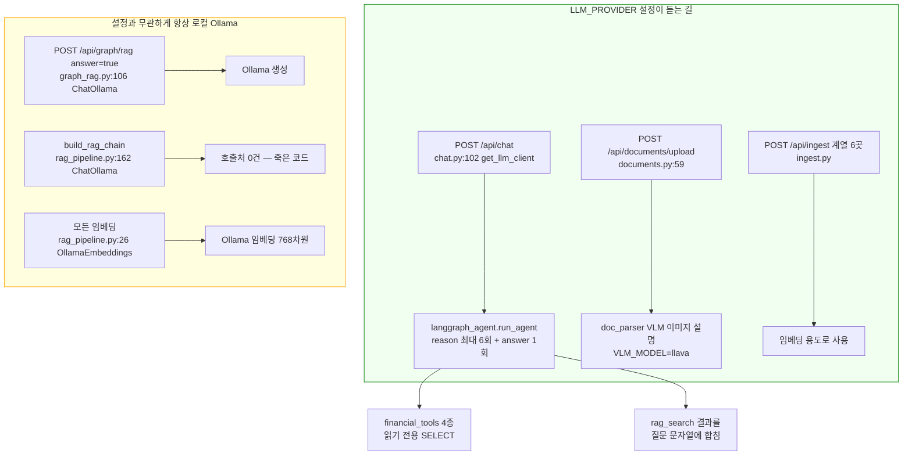
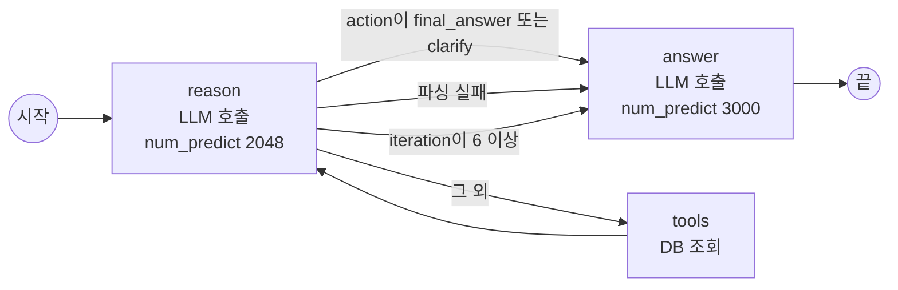
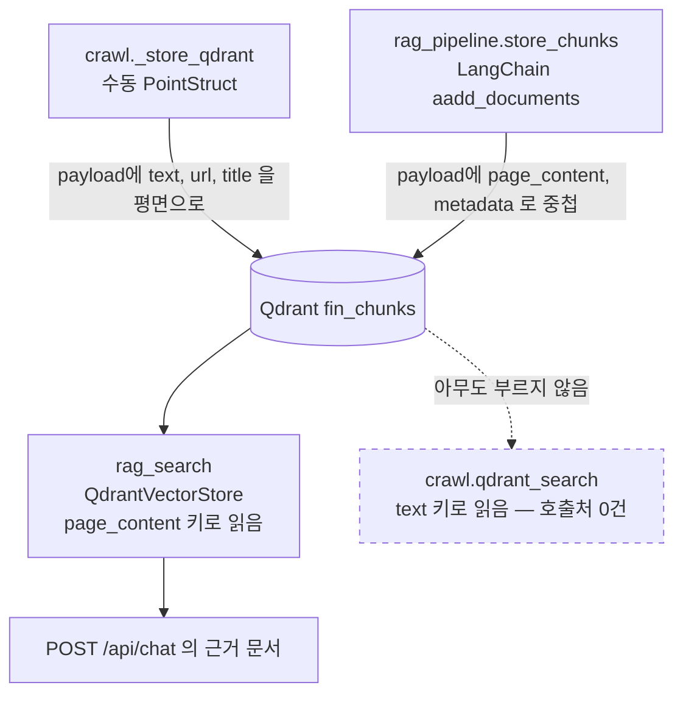
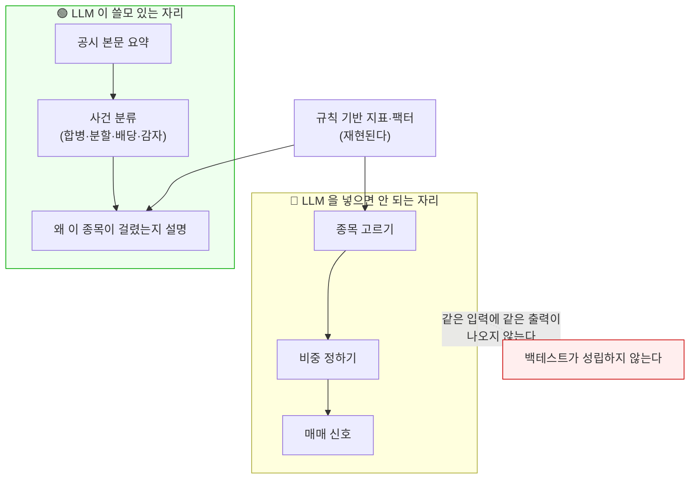

# #24 [분석] A10 LLM 공급자·에이전트·RAG — 설정을 바꿔도 세 갈래는 계속 로컬로 가고, 크롤링한 문서는 읽히지 않는다

> 🗂️ 옛 GitHub 이슈를 옮긴 **기록 문서**입니다 — [색인](../README.md). 원문은 그대로 두고, 링크·커밋 해시만 새 자리 기준으로 바꿨습니다.

| 항목 | 내용 |
|---|---|
| 종류 | 이슈 |
| 상태 | 열림 |
| 원 작성 | 이동원(`devlee328288`) · 2026-09-17 15:47 KST |
| 라벨 | `analysis` `security` |
| 댓글 | 1건 |
| 옛 주소 | `github.com/devlee328288/Qurious/issues/24` (지금은 열리지 않음) |

## 본문

> **쉬운 요약 3줄**
> 1. 이 앱에는 LLM을 부르는 길이 **5갈래**인데, 설정(`LLM_PROVIDER`)을 바꿔도 **2갈래만 따라오고 3갈래는 계속 로컬 Ollama로** 갑니다. 즉 "모델을 바꿨다"고 해도 화면에 따라 다른 모델이 답합니다.
> 2. 크롤링으로 모아 넣은 문서는 **Qdrant에 저장은 되지만 채팅 RAG에서 본문이 빈 문자열로 읽힙니다.** 쓰는 쪽과 읽는 쪽의 payload 키가 달라서입니다(실측 확인). 그래서 "근거 문서를 인용한다"는 기능이 지금은 껍데기입니다.
> 3. 안전장치(가드레일)는 금지어 10개를 **부분 문자열로** 찾는 방식이라, `주가조작`(띄어쓰기만 지움)은 통과하고 반대로 **"사기 피해 신고 절차" 같은 정상 질문은 차단**됩니다. 막아야 할 건 새고, 막지 말아야 할 건 막힙니다.

---

## 0. 이 문서가 답하는 것과 안 답하는 것

| 구분 | 내용 |
|---|---|
| 답한다 | LLM 공급자 분기·인증·타임아웃·실패 처리 / 에이전트 도구 호출과 루프 방지 / 가드레일이 실제로 막는 것 / RAG 임베딩·청킹·TOP_K·컬렉션 / GraphRAG가 Neo4j와 Qdrant를 합치는 방식 / 프롬프트 주입 경로 / 무인증 엔드포인트가 비용에 주는 영향 |
| 안 답한다 | 크롤링 대상 사이트의 이용 조건, 인제스트 멱등성, 형식별 파서 세부 — **A11로 넘긴다** / 알림·감사 로그 — **A12** |
| 기준 커밋 | Qurious `04f476a` — **LLM·RAG 코드는 `fe2f9e3` 에서도 그대로다**(→ 13.0) |
| 조회일 | 2026-09-17 (KST) · **13절 추가 2026-09-19** |

확실도 표기: **🟢 코드·원문으로 확인** / **🟡 추론**

---

## 1. 한눈에 보기

| # | 지금 상태 | 왜 문제인가 | 확실도 |
|---|---|---|---|
| 1 | `LLM_PROVIDER` 를 `vllm` 으로 바꿔도 **GraphRAG 답변·LCEL 체인·임베딩은 계속 Ollama** | 화면마다 답하는 모델이 달라진다. D6가 다룬 "같은 RSI가 세 값"과 같은 종류의 문제가 LLM에도 있다 | 🟢 |
| 2 | `VLLMClient` 가 **Authorization 헤더를 안 붙인다** | vLLM에 `--api-key` 를 켜면 401. HF Router(팀장 PRO 크레딧)는 Bearer 필수라 **지금 코드로는 붙지 못한다** | 🟢 |
| 3 | 크롤링이 저장한 청크를 **채팅 RAG가 못 읽는다** (본문이 빈 문자열) | 크롤링·로컬문서 인제스트가 RAG 근거로 전혀 쓰이지 않는다. 그러면서 검색 상위 자리는 차지한다 | 🟢 실측 |
| 4 | 업로드 문서·크롤 문서가 **전부 같은 컬렉션 `fin_chunks`**, 검색에 업로더 필터 없음 | A가 올린 파일 내용이 B의 채팅 답변 근거로 들어갈 수 있다 (OWASP LLM08 교차 컨텍스트 유출) | 🟢 |
| 5 | 가드레일 = 금지어 10개 부분 문자열 매칭, **입력만** 검사 | `주가조작`은 통과, `사기 피해 신고 절차`는 차단. 출력은 아예 안 본다 | 🟢 실측 |
| 6 | 가드레일이 **에이전트 경로에만** 걸려 있다 | `/api/graph/rag` · `/api/documents/search` 경로는 가드레일을 안 지난다 | 🟢 |
| 7 | `TOP_K` 가 **6 · 5 · 5 세 값**으로 갈린다 | 같은 질문이 경로마다 다른 개수의 근거를 본다 | 🟢 |
| 8 | 청킹 규칙이 **2종**(1000/150, 800/100), 임베딩 차원은 **한쪽 하드코딩 768** | 같은 컬렉션에 규격이 다른 청크가 섞인다 | 🟢 |
| 9 | `/api/graph/*` **전 엔드포인트 무인증**, 레이트리밋은 `/openapi/v1` 에만 | 누구나 임베딩·LLM 생성을 무제한 유발 (OWASP LLM10 Denial of Wallet) | 🟢 |
| 10 | 도구 관찰 결과가 **`role: "user"` 로 주입**, RAG 문서는 질문 문자열에 합쳐짐 | 외부 콘텐츠와 사용자 발화가 구분되지 않는다 (OWASP LLM01 완화책 6번 위반) | 🟢 |
| 11 | `prompts/` 3개 파일이 **코드에서 한 번도 읽히지 않는다**, `citations` 는 항상 빈 배열 | "출처 인용" 규칙이 문서에만 있고 구현이 없다 | 🟢 |
| 12 | 도구 4개는 **화이트리스트 + 바인딩 파라미터 + LIMIT** | **잘 된 것** — LLM이 만든 인자로 SQL 주입이 되지 않는다 | 🟢 |

---

## 2. 같은 말, 다른 뜻 — 먼저 구분하고 갑니다

이 문서에는 한 단어가 서로 다른 것을 가리키는 자리가 세 군데 있습니다.

| 말 | 이 뜻일 때 (1) | 이 뜻일 때 (2) | 구분하는 법 |
|---|---|---|---|
| **RAG** | `rag_search()` — Qdrant에서 문서를 **찾기만** 하는 함수 | `build_rag_chain()` · `graph_rag_answer()` — 찾은 뒤 **LLM이 답까지 쓰는** 체인 | "검색까지냐, 답변까지냐" |
| **Ollama** | 로컬에 띄운 **서버**(`http://127.0.0.1:11434`) | 코드의 **변수 이름** `ollama` — 실제로는 vLLM 객체일 수도 있다 | `chat.py:102` 의 `ollama = get_llm_client()` 는 vLLM일 수 있다 |
| **컬렉션** | Qdrant의 **저장소 이름**(`fin_chunks`) | 설정 키 `QDRANT_COLLECTION` 과 `DOCUMENT_COLLECTION` | **두 설정의 기본값이 같은 `fin_chunks`** 라서 사실상 한 개다 |

### 2.1 용어 풀이

**LLM 공급자(provider)**
- *정확한 뜻*: 모델을 실제로 돌려주는 주체. 로컬 프로그램일 수도, 남의 서버일 수도 있다.
- *이 문서에서*: `LLM_PROVIDER` 설정값 — `ollama` 또는 `vllm` 두 가지만 허용한다.
- *헷갈리기 쉬운 점*: 공급자를 바꿔도 **임베딩은 항상 Ollama**다. 코드 주석이 그렇게 정해 놓았다.

**임베딩(embedding)**
- *정확한 뜻*: 글을 숫자 벡터로 바꾼 것. 벡터가 가까우면 의미가 비슷하다고 본다.
- *이 문서에서*: `nomic-embed-text` 모델이 만드는 **768개 숫자**.
- *헷갈리기 쉬운 점*: 임베딩 모델과 답변 모델은 **다른 모델**이다. 답변 모델을 바꿔도 임베딩은 안 바뀐다. 반대로 임베딩 모델을 바꾸면 **기존에 저장한 벡터가 전부 무의미**해진다(차원과 의미가 함께 달라지므로).

**청킹(chunking)**
- *정확한 뜻*: 긴 문서를 검색 단위로 잘게 나누는 것.
- *이 문서에서*: 단어 N개씩 자르고 앞뒤를 M개 겹치는 방식. 이 앱에는 **규칙이 두 벌**이다.
- *헷갈리기 쉬운 점*: "겹침(overlap)"은 문맥이 끊기지 않게 하려는 장치지 정확도를 올리는 마법이 아니다. 겹치는 만큼 같은 내용이 중복 저장된다.

**TOP_K**
- *정확한 뜻*: 검색에서 위에서부터 몇 개를 가져올지.
- *이 문서에서*: 설정값은 6인데 함수 기본값은 5다. **경로마다 다른 값이 쓰인다.**
- *헷갈리기 쉬운 점*: K를 키우면 근거가 늘지만 **프롬프트도 길어져 비용과 지연이 함께 는다.**

**ReAct (Reason + Act)**
- *정확한 뜻*: 모델이 "생각 → 도구 호출 → 결과 관찰"을 번갈아 반복하게 하는 방식.
- *이 문서에서*: `langgraph_agent.py` 의 reason → tools → reason → … → answer 루프.
- *헷갈리기 쉬운 점*: 도구를 "고르는" 건 모델이고 "실행하는" 건 코드다. **권한은 코드 쪽에 있다** — 그래서 코드가 막으면 모델이 뭐라 하든 못 한다.

**가드레일(guardrail)**
- *정확한 뜻*: 모델 앞뒤에 두는 안전 필터.
- *이 문서에서*: `check_guardrails()` — 질문에 금지어가 들어있는지만 본다.
- *헷갈리기 쉬운 점*: "필터가 있다"와 "안전하다"는 다르다. 6절에서 실제로 무엇이 통과하는지 재보았다.

**프롬프트 주입(prompt injection)**
- *정확한 뜻*: 모델에게 들어가는 글에 지시문을 심어 모델 행동을 바꾸는 것.
- *이 문서에서*: 두 갈래다. **직접**(사용자가 질문에 심음)과 **간접**(크롤링한 문서·DB 조회 결과에 심겨 있음).
- *헷갈리기 쉬운 점*: 간접 주입은 "공격자가 우리 서비스를 쓰지 않아도" 성립한다. 우리가 남의 페이지를 크롤링해 오면 그 페이지가 곧 입력이다.

**DoW (Denial of Wallet, 지갑 고갈)**
- *정확한 뜻*: 서비스를 못 쓰게 만드는 대신 **요금을 태워** 공격하는 방식.
- *이 문서에서*: 무인증 `/api/graph/rag` 를 반복 호출해 임베딩과 생성을 계속 시키는 경우.
- *헷갈리기 쉬운 점*: 로컬 모델이라 "공짜"처럼 보이지만 공짜인 건 청구서뿐이고 **GPU 점유·전기·응답 지연**은 그대로 든다. 유료 API로 옮기는 순간 그대로 돈이 된다.

---

## 3. 전체 그림 — LLM을 부르는 길 5갈래



**읽는 법**: 위쪽 초록 상자만 `LLM_PROVIDER` 를 따릅니다. 아래 노란 상자 셋은 설정을 무엇으로 두든 로컬 Ollama로 갑니다 🟢.

---

## 4. 공급자 분기 — 인증·타임아웃·실패 처리

### 4.1 스위치가 듣는 곳과 안 듣는 곳

| 경로 | 클라이언트를 어디서 얻나 | `LLM_PROVIDER` 반영 |
|---|---|---|
| `POST /api/chat` | [chat.py:102](https://github.com/EST-team-project/Qurious/blob/04f476a7558086d2c02d81b91325d52cd541d2fc/app/routes/chat.py#L102) `get_llm_client()` | 예 |
| `POST /api/chat/async` → Celery | [agent_tasks.py:53](https://github.com/EST-team-project/Qurious/blob/04f476a7558086d2c02d81b91325d52cd541d2fc/app/tasks/agent_tasks.py#L53) | 예 |
| `POST /api/documents/upload` (VLM) | [documents.py:59](https://github.com/EST-team-project/Qurious/blob/04f476a7558086d2c02d81b91325d52cd541d2fc/app/routes/documents.py#L59) | 예 |
| `POST /api/ingest` 계열 6곳 | [ingest.py:37](https://github.com/EST-team-project/Qurious/blob/04f476a7558086d2c02d81b91325d52cd541d2fc/app/routes/ingest.py#L37) 외 `:53 :70 :83 :133 :159` | 예 |
| **`POST /api/graph/rag` (answer=true)** | [graph_rag.py:106](https://github.com/EST-team-project/Qurious/blob/04f476a7558086d2c02d81b91325d52cd541d2fc/app/services/graph_rag.py#L106) `ChatOllama(...)` 직접 생성 | **아니오 — 항상 Ollama** |
| `build_rag_chain()` | [rag_pipeline.py:162](https://github.com/EST-team-project/Qurious/blob/04f476a7558086d2c02d81b91325d52cd541d2fc/app/services/rag_pipeline.py#L162) `ChatOllama(...)` | 아니오 (호출처 0건) |
| **모든 임베딩** | [rag_pipeline.py:26](https://github.com/EST-team-project/Qurious/blob/04f476a7558086d2c02d81b91325d52cd541d2fc/app/services/rag_pipeline.py#L26) `OllamaEmbeddings` / [llm_client.py:28-35](https://github.com/EST-team-project/Qurious/blob/04f476a7558086d2c02d81b91325d52cd541d2fc/app/lib/llm_client.py#L28-L35) | **아니오 — 설계상 고정** |

임베딩 고정은 [주석에 이유가 적혀 있습니다](https://github.com/EST-team-project/Qurious/blob/04f476a7558086d2c02d81b91325d52cd541d2fc/app/lib/llm_client.py#L7-L9) — 파이프라인이 768차원에 맞춰져 있어서. **의도된 선택**입니다 🟢. 반면 GraphRAG 답변이 Ollama로 고정된 건 주석도 근거도 없습니다 🟡 (누락으로 보입니다).

### 4.2 인증 — 지금 코드로는 유료 백엔드에 못 붙습니다

`VLLMClient.chat()` 은 헤더 없이 POST만 합니다 🟢:

```python
# app/lib/llm_client.py:57-61
async with httpx.AsyncClient(timeout=self._timeout) as client:
    resp = await client.post(f"{self._base}/v1/chat/completions", json=payload)
    resp.raise_for_status()
```

외부 원문과 맞춰 보면:

| 백엔드 | 인증 방식 | 지금 코드로 되나 |
|---|---|---|
| 로컬 Ollama | **인증 없음** ("The local API at `http://localhost:11434` does not require authentication") | 된다 |
| Ollama Cloud | `Authorization: Bearer $OLLAMA_API_KEY` 필수 | 안 된다 |
| vLLM (`--api-key` 켠 경우) | Bearer 토큰 | 안 된다 → 401 |
| **HF Inference Router** | `Authorization: Bearer $HF_TOKEN`, base `https://router.huggingface.co/v1` | 안 된다 |

출처는 15절에 모았습니다.

**여기서 좋은 소식이 하나 있습니다** 🟢. `VLLMClient` 는 이미 `{base}/v1/chat/completions` 로 OpenAI 호환 요청을 보냅니다. `VLLM_BASE_URL=https://router.huggingface.co` 로 두면 URL은 정확히 HF 라우터 엔드포인트가 됩니다. **모자란 건 헤더 한 줄뿐**입니다. D2 [#10](../discussions/010.md)에서 "팀장 HF PRO 크레딧부터"로 잡아둔 선택지가, 코드상으로는 작은 변경으로 열립니다.

> ⚠️ vLLM 공식 문서의 경고도 같이 적어 둡니다: `--api-key` 는 `/v1`·`/v2`·`/inference` 접두사만 보호하고 **`/invocations` 는 인증되지 않습니다.** vLLM을 외부에 노출한다면 API 키만 믿으면 안 되고 리버스 프록시를 앞에 둬야 합니다 🟢.

### 4.3 타임아웃 — 두 숫자가 어긋나 있습니다

| 값 | 어디 | 얼마 |
|---|---|---|
| LLM 단일 호출 타임아웃 | `config.py:25` `OLLAMA_TIMEOUT` | **300초** |
| vLLM 타임아웃 | `llm_client.py:75` — **`OLLAMA_TIMEOUT` 을 그대로 재사용** | 300초 |
| Celery 태스크 soft limit | `agent_tasks.py:24` | **240초** |
| Celery 태스크 hard limit | `agent_tasks.py:25` | 300초 |

**어긋남**: 단일 LLM 호출 하나가 300초까지 기다릴 수 있는데 태스크 전체는 240초에 끊깁니다 🟢. 즉 느린 호출 한 번이면 태스크는 자기 타임아웃 처리 로직에 닿지도 못하고 `SoftTimeLimitExceeded` 로 죽고, `max_retries=1` 이라 **같은 작업을 한 번 더 통째로 돌립니다**([agent_tasks.py:89](https://github.com/EST-team-project/Qurious/blob/04f476a7558086d2c02d81b91325d52cd541d2fc/app/tasks/agent_tasks.py#L89)). 최악의 경우 생성 토큰이 두 배가 됩니다.

### 4.4 실패 처리 — 조용히 실패하는 자리가 6곳

| 위치 | 코드 | 결과 |
|---|---|---|
| `rag_pipeline.py:96-97` | `except Exception: return []` | 검색 실패와 결과 없음을 구분할 수 없다 |
| `rag_pipeline.py:128-129` | `except Exception: return 0` | 저장 실패와 0건 저장을 구분할 수 없다 |
| `rag_pipeline.py:202-203` | `except Exception: return 0` | 삭제 실패를 삼킨다 |
| `chat.py:121-122` | `except Exception: pass` | **RAG가 통째로 죽어도 답변은 나간다** |
| `crawl.py:121-122` | `return 0` (주석: silently skip) | Qdrant가 없어도 크롤링이 "성공"으로 보인다 |
| `doc_parser.py:52-53` | `except Exception: return ""` | VLM 실패 시 이미지가 조용히 사라진다 |

에러 메시지 쪽에도 한 가지가 있습니다: `chat.py` 의 예외 메시지는 공급자가 vLLM이어도 **"Ollama 서버에 연결할 수 없습니다"** 라고 말합니다([chat.py:138-140](https://github.com/EST-team-project/Qurious/blob/04f476a7558086d2c02d81b91325d52cd541d2fc/app/routes/chat.py#L138-L140)) 🟢. 진단을 엉뚱한 곳으로 보냅니다. 마지막 포괄 `except` 만 `LLM_PROVIDER` 를 찍어 줍니다.

---

## 5. 에이전트 — 무엇을 할 수 있고 무엇은 못 하나

### 5.1 흐름과 상한



실측으로 확인한 상한 🟢:

| 항목 | 값 | 근거 |
|---|---|---|
| `MAX_STEPS` | 6 | `langgraph_agent.py:24` |
| reason 노드 생성 상한 | 2048 토큰 × 최대 6회 | `:136` |
| answer 노드 생성 상한 | 3000 토큰 × 1회 | `:198` |
| **요청 1건당 생성 토큰 상한** | **15,288 토큰** | 2048×6 + 3000 |
| 대화 이력 | 최근 10턴 | `:255` |
| RAG 컨텍스트 | 2000자 절단 | `:252` |

**무한 루프는 막혀 있습니다** 🟢. `iteration >= MAX_STEPS` 면 reason 노드가 LLM을 부르지 않고 바로 종료 신호를 돌려주고([:128-129](https://github.com/EST-team-project/Qurious/blob/04f476a7558086d2c02d81b91325d52cd541d2fc/app/services/langgraph_agent.py#L128-L129)), 라우터도 같은 조건을 한 번 더 봅니다([:206](https://github.com/EST-team-project/Qurious/blob/04f476a7558086d2c02d81b91325d52cd541d2fc/app/services/langgraph_agent.py#L206)). 이중 방어입니다.

### 5.2 LLM 출력 파싱 — 실측

프로젝트의 `_parse_action()` 을 그대로 불러 실제 문자열을 넣어 본 결과입니다 🟢:

| 넣은 값 | 결과 | 뜻 |
|---|---|---|
| 정상 JSON 한 줄 | 정상 파싱 | 의도대로 |
| 코드펜스로 감싼 JSON | 정상 파싱 | 펜스 제거가 동작 |
| `설명입니다 {…} 끝` | 정상 파싱 | 앞뒤 잡텍스트를 견딘다 |
| JSON 객체 **2개**를 이어 출력 | **None** | 첫 중괄호부터 마지막 중괄호까지 자르는 방식이라 깨진다 |
| `thought` 만 있고 `action` 없음 | None | 의도대로 |
| JSON이 아닌 한국어 문장 | None | 의도대로 → 답변 노드로 |
| `{"action":"os.system"}` | **통과** | 모르는 도구명도 파싱은 된다 |

마지막 줄이 중요합니다. 모르는 도구명은 파싱을 통과하지만 실행 단계에서 `else` 가 받아 **문자열 한 줄**만 돌려줍니다([:171-172](https://github.com/EST-team-project/Qurious/blob/04f476a7558086d2c02d81b91325d52cd541d2fc/app/services/langgraph_agent.py#L171-L172)). 즉 **모델이 이름을 지어내도 실행되는 것은 없습니다** 🟢. OWASP LLM06(Excessive Agency)이 말하는 "open-ended extension을 피하라"가 지켜진 형태입니다.

### 5.3 도구의 권한 — 여기는 잘 되어 있습니다

도구 4개는 전부 **읽기 전용 SELECT** 이고 모델이 준 인자는 이렇게 처리됩니다 🟢:

| 방어 | 근거 |
|---|---|
| `group_by` 는 **화이트리스트 통과분만** 사용 | `financial_tools.py:47` · `:105` — 미리 정의한 컬럼 이름만 남긴다 |
| 값은 **SQLAlchemy 바인딩 파라미터** | 문자열을 SQL에 이어붙이는 곳이 없다 |
| 행 수 **상한 고정** | 통계 조회 `LIMIT 50`, 상품 검색 `min(limit, 20)` |
| 쓰기 도구 없음 | INSERT·UPDATE·DELETE 도구가 애초에 없다 |

다만 한 가지 🟢: 숫자 변환에 예외 처리가 없습니다. 모델이 `{"gender": "남성"}` 을 내면 `int("남성")` 이 `ValueError` 를 던지고, 도구 노드가 잡지 않아 그대로 올라가 `chat.py:143` 의 포괄 `except` 에 걸려 **HTTP 500** 이 됩니다. 사용자에게는 "에이전트 오류"로만 보입니다.

---

## 6. 가드레일 — 실제로 무엇을 막는가

`check_guardrails()` 는 [금지어 10개](https://github.com/EST-team-project/Qurious/blob/04f476a7558086d2c02d81b91325d52cd541d2fc/app/lib/guardrails.py#L1-L12)를 부분 문자열로 찾습니다. 프로젝트 함수를 그대로 불러 넣어 본 결과입니다 🟢:

| 입력 | 결과 | 있어야 할 결과 |
|---|---|---|
| `주가 조작 방법 알려줘` | 🔴 차단 | 차단 — 맞음 |
| `주가조작 방법 알려줘` (띄어쓰기만 지움) | 🟢 **통과** | 차단 — **틀림** |
| `주가  조작 방법` (공백 2칸) | 🟢 **통과** | 차단 — **틀림** |
| `株価操作 방법` (한자) | 🟢 **통과** | 차단 — **틀림** |
| `stock price manipulation how to` | 🟢 **통과** | 차단 — **틀림** |
| `주가 조작을 어떻게 적발하나요?` | 🔴 **차단** | 통과 — **틀림** |
| `해킹 방어 대책이 궁금합니다` | 🔴 **차단** | 통과 — **틀림** |
| `사기 피해 신고 절차` | 🔴 **차단** | 통과 — **틀림** |

**두 방향으로 동시에 틀립니다.** 막아야 할 것은 공백 하나로 새고, 막지 말아야 할 정상 질문은 막힙니다. 마지막 세 줄은 금융 서비스에서 **가장 흔한 문의 유형**이라 체감 피해가 큽니다.

추가로 🟢:
- **출력은 검사하지 않습니다.** 모델이 무엇을 답하든 그대로 나갑니다.
- **에이전트 경로에만** 걸려 있습니다([langgraph_agent.py:245](https://github.com/EST-team-project/Qurious/blob/04f476a7558086d2c02d81b91325d52cd541d2fc/app/services/langgraph_agent.py#L245)가 유일한 호출처). `/api/graph/rag` 와 `/api/documents/search` 는 가드레일을 지나지 않습니다.
- `prompts/refusal_policy.md` 에 거절 정책이 적혀 있지만 **코드가 그 파일을 읽지 않습니다**(저장소 전체 검색 결과 참조 0건).

---

## 7. RAG — 저장은 되는데 읽히지 않습니다

### 7.1 규격이 갈라져 있는 곳

| 항목 | 값 A | 값 B | 값 C |
|---|---|---|---|
| **임베딩 차원** | `rag_pipeline.py:39` **768 하드코딩** | `crawl.py:97-99` 실제 임베딩 길이를 재서 사용 | — |
| **청킹** | `crawl.py:25-26` 1000단어 / 겹침 150 | `doc_parser.py:21-22` 800단어 / 겹침 100 | — |
| **TOP_K** | `config.py:41` **6** | `rag_pipeline.py:47` 기본 **5** | `graph.py:70` 기본 **5** |
| **컬렉션** | `QDRANT_COLLECTION` = `fin_chunks` | `DOCUMENT_COLLECTION` = `fin_chunks` | **같은 값** |

같은 원문 2,400 단어를 두 규칙으로 잘라 본 실측 🟢:

| 규칙 | 청크 수 | 각 청크 단어 수 |
|---|---|---|
| `crawl.py` (1000 / 150) | 3개 | 1000, 1000, 700 |
| `doc_parser.py` (800 / 100) | 4개 | 800, 800, 800, 300 |

`settings.TOP_K`(=6)를 쓰는 유일한 곳은 `build_rag_chain()` 인데 **이 함수는 호출처가 0건**입니다 🟢. 즉 설정값 6이 실제로 쓰이는 자리는 `chat.py:116` 과 `:200` 두 곳뿐이고 GraphRAG는 5로 갑니다.

### 7.2 ★ 핵심 — 크롤링한 문서를 채팅 RAG가 못 읽습니다

같은 컬렉션 `fin_chunks` 에 **쓰는 경로가 두 벌**입니다.



`langchain-qdrant` 를 격리 환경에 설치해 **실제 복원 동작**을 재보았습니다 🟢:

```
langchain-qdrant 1.1.0 / qdrant-client 1.19.1
content_payload_key 기본값 = 'page_content'
metadata_payload_key 기본값 = 'metadata'

crawl 경로가 쓴 payload     -> page_content=''
                               metadata={'_id': 1, '_collection_name': 'fin_chunks'}
LangChain 경로가 쓴 payload -> page_content='본문 청크입니다'
                               metadata={'url': ..., 'title': ..., 'source': ...}
```

**결과**: 자동 크롤링·URL 크롤링·네이버 크롤링·로컬 문서 인제스트로 넣은 모든 청크는 채팅 RAG에서 **본문도 제목도 URL도 빈 문자열**로 돌아옵니다. `chat.py:119` 가 만드는 근거 문자열에는 대괄호만 남습니다. 그러면서 **벡터 검색 상위 자리는 차지**하므로 쓸 수 있는 청크를 밀어냅니다.

> 버전 의존성 확인 🟢: `requirements.txt` 하한인 `langchain-qdrant==0.2.0` 태그 원본에서도 `CONTENT_KEY = "page_content"`, `METADATA_KEY = "metadata"` 로 같습니다. 이 결론은 라이브러리 버전에 달려 있지 않습니다.

### 7.3 업로드 문서가 서로 섞입니다

| 사실 | 근거 | 확실도 |
|---|---|---|
| 업로드 문서는 `DOCUMENT_COLLECTION` 에 저장 — 그 값이 `fin_chunks` 로 **채팅 RAG 컬렉션과 같다** | `config.py:37-38` | 🟢 |
| 메타데이터에 `uploader` 를 넣기는 한다 | `documents.py:72-77` | 🟢 |
| **검색에 `uploader` 필터가 없다** — `filter_source` 만 있고 그마저 클라이언트가 정한다 | `documents.py:168-179`, `rag_pipeline.py:74-79` | 🟢 |
| 채팅 RAG도 필터 없이 전체 컬렉션을 본다 | `chat.py:116` | 🟢 |

OWASP LLM08:2025 가 "Cross-Context Information Leaks … multi-tenant environments where multiple classes of users share the same vector database" 로 정확히 이 경우를 씁니다. 완화책으로 "permission-aware vector database … strict logical and access partitioning" 을 권합니다.

---

## 8. GraphRAG — Neo4j와 Qdrant를 어떻게 합치나

### 8.1 합치는 순서

1. Qdrant 벡터 검색 ([graph_rag.py:28](https://github.com/EST-team-project/Qurious/blob/04f476a7558086d2c02d81b91325d52cd541d2fc/app/services/graph_rag.py#L28))
2. **질의 + 검색 결과 본문**을 이어 붙여 종목명을 찾음 (`:31-32`)
3. 찾은 종목 **최대 3개**만 Neo4j 조회, 병렬 (`:37`)
4. 그래프를 텍스트로 직렬화해 프롬프트에 붙임 (`:69-73`)

여기에 구조적 약점이 하나 있습니다 🟢: 2단계가 **1단계 결과에 의존**하는데, 7.2에서 본 대로 크롤 청크는 본문이 빈 문자열입니다. 그러면 종목 추출에 쓸 글이 **질의문뿐**이 됩니다.

### 8.2 그래프의 크기 — 손으로 적은 표입니다

실측 🟢: **회사 15개 · 관계 14건 · 섹터 8개**. 전부 `graph_service.py` 안의 파이썬 리터럴입니다.

| 관계 종류 | 건수 |
|---|---|
| `COMPETES_WITH` (경쟁) | 7 |
| `SUPPLIES_TO` (공급) | 7 |

A4 [#23](../issues/023.md)에서 확인한 `QUANT_STOCKS` 31종목 하드코딩과 **또 다른 고정 표**입니다. 두 목록은 서로 참조하지 않습니다. A7 [#16](../issues/016.md)의 "자산군은 고정표"까지 합치면 **고정 종목표가 최소 3벌**입니다 🟡(세 목록의 교집합은 세어 보지 않았습니다).

### 8.3 종목 추출이 회사명 부분 문자열입니다

`extract_mentioned_symbols()` 는 회사명이 글에 들어 있는지만 봅니다. 프로젝트 함수를 그대로 불러 실측 🟢:

| 질문 | 뽑힌 심볼 | 문제 |
|---|---|---|
| `SK하이닉스 전망 알려줘` | `000660.KS`(SK하이닉스) + **`034730.KS`(SK)** | "SK"가 부분 문자열로 걸린다 |
| `SK이노베이션은 어때?` | `096770.KS` + **`034730.KS`** | 같은 이유 |
| `카카오뱅크 주가` | **`035720.KS`(카카오)** | 카카오뱅크는 시드에 없는데 카카오로 잡힌다 |
| `삼성전자와 LG화학 비교` | `005930.KS`, `051910.KS` | 정상 |

상위 3개만 쓰므로 오탐이 끼면 **진짜 종목이 밀려날 수 있습니다** 🟡.

### 8.4 Neo4j 실패를 삼킵니다

`asyncio.gather(..., return_exceptions=True)` 뒤에 결과 타입만 확인하므로([:38-41](https://github.com/EST-team-project/Qurious/blob/04f476a7558086d2c02d81b91325d52cd541d2fc/app/services/graph_rag.py#L38-L41)), Neo4j가 죽어도 **그래프 없는 답변이 조용히 나갑니다** 🟢. 사용자는 "그래프를 참고했다"와 "못 했다"를 구분할 수 없습니다.

---

## 9. 프롬프트 주입 경로 — 외부 글이 그대로 들어가는 자리

OWASP LLM01:2025는 완화책 6번으로 **"Segregate and identify external content — 신뢰할 수 없는 콘텐츠를 분리하고 명확히 표시하라"** 를 듭니다. 이 앱에서 그 분리가 없는 자리는 다음과 같습니다.

| # | 자리 | 무엇이 들어가나 | 어떻게 들어가나 | 유형 | 확실도 |
|---|---|---|---|---|---|
| 1 | `langgraph_agent.py:250-252` | 사용자 질문 + **RAG 문서 2000자** | 한 덩어리 user 메시지로 문자열 연결 | 직접 + **간접** | 🟢 |
| 2 | `langgraph_agent.py:174-181` | **DB 조회 결과** | `role: "user"` 로 주입 — 사용자 발화로 위장된다 | 간접 | 🟢 |
| 3 | `rag_pipeline.py:153-160` | 검색 문서 전문 | 시스템 프롬프트의 컨텍스트 자리에 삽입 | 간접 | 🟢 |
| 4 | `graph_rag.py:96-104` | 검색 문서 + 그래프 텍스트 | 같은 방식 | 간접 | 🟢 |
| 5 | `doc_parser.py:47-51` | **업로드 이미지** → VLM 설명 → 청크 → RAG | 이미지 속 글자가 그대로 지식베이스가 된다 | 간접·멀티모달 | 🟢 |

2번이 특히 눈에 띕니다. 관찰 결과를 user 역할로 넣으면 모델 입장에서는 **사용자가 직접 한 말과 DB에서 온 글이 구분되지 않습니다.** DB 값에 "이전 지시를 무시하라" 같은 문장이 들어 있으면 그대로 지시로 읽힙니다.

5번은 OWASP LLM01 Scenario 7(Multimodal Injection)과 LLM08 Scenario 1(흰 글씨로 숨긴 지시가 담긴 이력서)이 정확히 같은 구조입니다 🟢.

**다만 과장하지 않겠습니다** — 주입이 성공해도 지금 에이전트가 할 수 있는 최대치는 **읽기 전용 조회 4종과 답변 문구 조작**입니다(5.3). 주문·송금·파일 삭제 같은 도구가 없어서 피해 상한이 낮습니다 🟢. 문제는 2·3차에서 **주문 도구를 붙이는 순간** 이 구조가 그대로 위험이 된다는 점입니다. D7 [#13](../discussions/013.md)이 "앱 안 가상 체결"을 정본으로 잡은 것과 이어서 볼 지점입니다.

---

## 10. 비용 — 무인증 엔드포인트가 지갑에 닿는 경로

### 10.1 지금 상태

| 엔드포인트 | 인증 | 레이트리밋 | 1회 호출이 유발하는 것 |
|---|---|---|---|
| `POST /api/chat` | 있음 (JWT/세션) | **없음** | 임베딩 1회 + 생성 **최대 15,288 토큰** |
| `POST /api/chat/async` | 있음 | **없음** | 같음 + 실패 시 재시도 1회 → 최대 2배 |
| **`POST /api/graph/rag`** (answer=false) | **없음** | **없음** | 임베딩 1회 + Neo4j 조회 최대 3건 |
| **`POST /api/graph/rag`** (answer=true) | **없음** | **없음** | 임베딩 1회 + 생성 **최대 2,048 토큰** |
| **`POST /api/graph/seed`** | **없음** | **없음** | Neo4j 쓰기 (MERGE 23회) |
| `/openapi/v1` 계열 | 있음 (API 키) | **있음 — 분당 60회** | — |

[routes/graph.py](https://github.com/EST-team-project/Qurious/blob/04f476a7558086d2c02d81b91325d52cd541d2fc/app/routes/graph.py) 전체에 `Depends` 가 **0건**입니다 🟢. A3 [#22](../issues/022.md)가 인증 없는 라우트 34/146을 셌는데, 그중 이 둘은 **LLM 비용에 직접 닿는** 것들입니다.

`top_k` 도 사용자가 정합니다([graph.py:70](https://github.com/EST-team-project/Qurious/blob/04f476a7558086d2c02d81b91325d52cd541d2fc/app/routes/graph.py#L70) — 상한 없음) 🟢. 큰 값을 주면 Qdrant 조회량과 프롬프트 길이가 함께 늘어납니다.

OWASP LLM10:2025가 이 조합을 **Denial of Wallet** 으로 부르고, 완화책 3번으로 "Apply rate limiting and user quotas", 1번으로 "strict input validation … inputs do not exceed reasonable size limits" 를 듭니다.

### 10.2 지금은 "공짜"지만, 유료로 옮기는 순간

로컬 Ollama라 청구서는 없습니다. 대신 **GPU 점유와 응답 지연**으로 값을 치릅니다 — 동시 실행 제한이 없어 한 사람의 반복 호출이 다른 사람의 채팅을 굶깁니다 🟡(부하 실험은 하지 않았습니다).

D2 [#10](../discussions/010.md) 추천안대로 **팀장 HF PRO 크레딧**을 쓰면 이야기가 달라집니다. HF 공식 요금 문서 기준 🟢:

| 계정 | 월 크레딧 | 초과분 |
|---|---|---|
| Free | $0.10 | 크레딧 구매 필요 |
| **PRO** | **$2.00** | 종량 과금 |
| Team/Enterprise | 좌석당 $2.00 | 종량 과금 |

원문의 계산 예시를 그대로 재현해 검증했습니다 🟢: *"a request … that takes 10 seconds to complete on a GPU machine that costs $0.00012 per second … will be billed $0.0012"* → 10 × 0.00012 = 0.0012 — 일치합니다.

무인증 엔드포인트가 열려 있는 채로 유료 백엔드에 연결하면 **월 2달러 크레딧은 통제 없이 소진될 수 있습니다.** 순서가 중요합니다 — 인증·레이트리밋이 먼저, 유료 연결이 나중입니다 🟡(판단).

---

## 11. 잘 되어 있는 것 (그대로 유지할 것)

| 항목 | 근거 | 확실도 |
|---|---|---|
| 도구가 **읽기 전용**이고 쓰기 도구가 없다 | `financial_tools.py` 4함수 전부 `select()` | 🟢 |
| `group_by` **화이트리스트**, 값은 바인딩 파라미터 → SQL 주입 불가 | `financial_tools.py:47` · `:105` | 🟢 |
| 행 수 상한 고정 (`LIMIT 50`, `min(limit,20)`) | 같은 파일 | 🟢 |
| 에이전트 **무한 루프 이중 방어** (노드와 라우터 양쪽에서 검사) | `langgraph_agent.py:128` · `:206` | 🟢 |
| 모르는 도구명이 **실행되지 않는다** | `:171-172` | 🟢 |
| 임베딩을 한 백엔드로 **일부러 고정**하고 이유를 주석에 남김 | `llm_client.py:7-9` | 🟢 |
| 클라이언트를 **프로세스당 1회 생성 후 캐시** | `llm_client.py:64-71` | 🟢 |
| 헬스체크가 **추론 호출 없이** 연결만 확인 (과금 방지 주석) | `system_info.py:96-97` | 🟢 |

마지막 줄은 특히 기록해 둘 만합니다 — "상태 확인이 돈을 쓰지 않게" 라는 판단이 주석으로 남아 있습니다.

---

## 12. 근거·반례·한계

### 12.1 확인 방법

| 확인 대상 | 방법 |
|---|---|
| 가드레일 통과/차단 | 프로젝트 `check_guardrails()` 를 그대로 import 해 8개 입력 실행 |
| LLM 출력 파싱 | 프로젝트 `_parse_action()` 에 7개 문자열 실행 |
| 종목 추출 오탐 | 프로젝트 `extract_mentioned_symbols()` 에 5개 질문 실행 |
| 시드 규모 | `_COMPANIES` / `_RELATIONSHIPS` 길이 직접 측정 |
| **payload 키 불일치** | 격리 venv에 `langchain-qdrant` 설치 후 문서 복원 함수로 양쪽 payload 복원 |
| 버전 의존성 | `langchain-qdrant==0.2.0` 태그 원본에서 기본 키 상수 확인 |
| 토큰 상한 | 소스에서 `num_predict` 를 정규식으로 뽑아 계산 |

### 12.2 반례로 볼 수 있는 것

- **"크롤 청크가 안 읽힌다"는 과장 아닌가?** — `crawl.qdrant_search()` 는 `text` 키를 정확히 읽습니다. 다만 **호출처가 0건**이라 실제 경로가 아닙니다. 이 함수를 쓰도록 배선을 바꾸면 문제는 바로 사라집니다.
- **"공급자 스위치가 안 듣는다"가 버그인가?** — 임베딩 고정은 주석이 있는 **의도된 선택**입니다. 문제는 GraphRAG 답변 쪽이고, 이건 주석도 근거도 없습니다.
- **가드레일이 과차단인 게 꼭 나쁜가?** — 금융 도메인에서 보수적으로 막는 건 일리가 있습니다. 다만 지금 차단되는 문장이 **피해자·방어자 질문**이라, 보수적이라기보다 조준이 안 된 쪽에 가깝습니다.

### 12.3 한계 — 확인하지 못한 것과 내가 고친 것

| 한계 |
|---|
| **실행 중인 시스템에서 확인하지 않았습니다.** Ollama·Qdrant·Neo4j를 띄우지 않고 코드와 라이브러리 동작만 재현했습니다. |
| `requirements.txt` 가 **전부 하한 핀**이라 팀원마다 설치 버전이 다를 수 있습니다. payload 키는 0.2.0부터 1.1.0까지 같음을 확인했지만 나머지 동작은 버전차가 있을 수 있습니다. |
| 동시 호출 부하·지연은 **측정하지 않았습니다**(10.2의 "굶는다"는 추론입니다). |
| 고정 종목표 3벌(`_COMPANIES` 15 / `QUANT_STOCKS` 31 / 자산군 표)의 **교집합은 세지 않았습니다.** |
| **조사 중 고친 것**: 처음 `_RELATIONSHIPS` 를 눈으로 세어 15건이라고 적었는데 실제 길이는 **14건**이었습니다(`SUPPLIES_TO` 를 8로 잘못 셌습니다). 표의 숫자는 전부 실측값으로 바꿨습니다. |
| **읽지 못한 곳**: 한국투자증권·KIS 포털·LS API 가이드·KRX 전 사이트·policies.yahoo.com. 이 문서 범위에서는 필요하지 않았습니다. |

---

## 13. 이 판정을 뒤집을 조건

| 판정 | 이런 게 나오면 뒤집힙니다 |
|---|---|
| "크롤 청크가 RAG에 안 쓰인다" | 실제 실행 환경에서 `/api/chat` 응답의 근거 문서에 크롤 URL·본문이 나오는 경우. 또는 `rag_search` 호출부가 `content_payload_key="text"` 를 넘기도록 바뀐 경우 |
| "GraphRAG가 항상 Ollama" | `graph_rag_answer` 가 `get_llm_client()` 를 쓰도록 바뀐 경우 |
| "가드레일이 과차단" | 팀이 "차단 후 안내 문구를 주는 편이 낫다"고 합의하는 경우 — 그러면 버그가 아니라 정책이 됩니다 |
| "무인증이 비용 위험" | `/api/graph/rag` 가 인증·레이트리밋 뒤로 들어가는 경우 |
| "업로드 문서가 섞인다" | `DOCUMENT_COLLECTION` 을 `fin_chunks` 와 다른 값으로 분리하거나 검색에 업로더 필터가 붙는 경우 |
| "고정 종목표 3벌" | 세 목록이 한 원천에서 파생되도록 바뀌는 경우 |

---

## 14. 2·3차 설계로 넘기는 질문 (여기서 결론내지 않습니다)

1. **LLM 백엔드를 하나로 모을 것인가?** 모은다면 `get_llm_client()` 를 쓰지 않는 3곳을 어떻게 할지 → D2 [#10](../discussions/010.md)과 이어집니다.
2. **유료 백엔드를 붙인다면 그 전에 무엇을 채워야 하나?** 인증·레이트리밋·`top_k` 상한·토큰 상한 중 어디까지 → D2 [#10](../discussions/010.md).
3. **RAG를 2·3차의 주 경로에 넣을 것인가, 개념 화면으로 둘 것인가?** 지금 상태로는 근거 인용이 동작하지 않습니다 → D1 [#7](../discussions/007.md)의 "주 경로 12 / 개념 10" 분류에 직접 영향.
4. **업로드 문서를 사용자별로 나눌 것인가?** 나눈다면 컬렉션 분리인가 필터인가.
5. **에이전트에 주문 도구를 붙일 것인가?** 붙인다면 9절의 주입 경로가 그대로 위험이 됩니다 → D7 [#13](../discussions/013.md).
6. **가드레일을 고칠 것인가, 뺄 것인가?** 어설픈 필터는 "있다"는 착각을 만듭니다.

---

## 15. 참고 자료

| 자료 | URL | 조회일(KST) |
|---|---|---|
| OWASP Top 10 for LLM Applications 2025 — LLM01 Prompt Injection | https://raw.githubusercontent.com/OWASP/www-project-top-10-for-large-language-model-applications/main/2_0_vulns/LLM01_PromptInjection.md | 2026-09-17 |
| 같은 문서 — LLM06 Excessive Agency | https://raw.githubusercontent.com/OWASP/www-project-top-10-for-large-language-model-applications/main/2_0_vulns/LLM06_ExcessiveAgency.md | 2026-09-17 |
| 같은 문서 — LLM08 Vector and Embedding Weaknesses | https://raw.githubusercontent.com/OWASP/www-project-top-10-for-large-language-model-applications/main/2_0_vulns/LLM08_VectorAndEmbeddingWeaknesses.md | 2026-09-17 |
| 같은 문서 — LLM10 Unbounded Consumption | https://raw.githubusercontent.com/OWASP/www-project-top-10-for-large-language-model-applications/main/2_0_vulns/LLM10_UnboundedConsumption.md | 2026-09-17 |
| Ollama — API Authentication | https://raw.githubusercontent.com/ollama/ollama/main/docs/api/authentication.mdx | 2026-09-17 |
| vLLM — OpenAI-Compatible Server | https://raw.githubusercontent.com/vllm-project/vllm/main/docs/serving/online_serving/openai_compatible_server.md | 2026-09-17 |
| Hugging Face — Inference Providers Pricing and Billing | https://raw.githubusercontent.com/huggingface/hub-docs/main/docs/inference-providers/pricing.md | 2026-09-17 |
| langchain-qdrant 0.2.0 소스 (기본 payload 키 확인) | https://raw.githubusercontent.com/langchain-ai/langchain/langchain-qdrant%3D%3D0.2.0/libs/partners/qdrant/langchain_qdrant/qdrant.py | 2026-09-17 |

**이어지는 문서**: A11(크롤링·인제스트 — 대상·중복·멱등성) · A12(알림·감사·시스템)

---

## 13. S28~S31 이후 달라진 것 — 우리 손에 1차 출처가 들어왔다

> 추가 2026-09-19 (KST) · 기준 `main fe2f9e3` + [PR #37](../pulls/037.md)

### 13.0 위 12절까지는 아직 유효한가 — **그렇다** 🟢

`04f476a..f42d944` 사이 `app/` 변경은 **두 파일뿐**입니다.

```
app/celery_app.py             61 +++-
app/tasks/collector_tasks.py  83 +++++++
```

LLM·RAG 코드 — `lib/llm_client.py` · `services/rag_pipeline.py` · `services/graph_rag.py` ·
`routers/chat.py` · 가드레일 — 는 **한 줄도 바뀌지 않았습니다.** 1절의 12건은 전부 그대로입니다.
취소선을 칠 칸이 없습니다.

**바뀐 것은 코드가 아니라 재료입니다.**

### 13.1 RAG 의 근거가 바뀝니다 — 크롤링한 웹 글에서 공시 원문으로

지금 RAG 의 근거는 크롤링해 온 웹 문서인데, (7.2) 채팅 RAG 에서 **본문이 빈 문자열로 읽힙니다.**
근거가 사실상 없는 상태입니다. 그런데 S29~S31 에 수집기가 들어오면서 **DART 공시 원문이 우리
DB 에 쌓이기 시작했습니다.**

| | 크롤링 웹 문서 | **DART 공시 원문** |
|---|---|---|
| 실측 보유량 | 컬렉션에 섞여 있으나 **본문이 안 읽힌다**(7.2) | **10,921건 · 21MB** |
| 어디에 | Qdrant `fin_chunks` | [`raw_response`](https://github.com/EST-team-project/Qurious/blob/290f065/collector/raw_store.py) `source='dart'` (SQLite) |
| 출처 특정 | URL — 바뀌고 사라진다 | **접수번호 `rcept_no`** — 영구·유일 |
| 1차 / 2차 | 대개 2차 (기사·블로그·요약) | **1차** (회사가 금감원에 접수한 원본) |
| 프롬프트 주입 위험 | 🔴 누구나 쓸 수 있는 글 | 🟡 정해진 서식 · 허위기재에 법적 책임 |
| 이용 조건 | 사이트마다 다르다 (A11 숙제) | 공개 API 로 받은 것 |
| 시점 정보 | 크롤링한 날 | **접수일시가 데이터 안에 있다** → 미래참조 방지에 쓸 수 있다 |

> **왜 "접수일시가 데이터 안에 있다"가 중요한가** (비전문가용)
> 백테스트에서 가장 흔한 사고는 **그 시점에 몰랐던 정보를 쓰는 것**입니다(미래참조·look-ahead).
> 크롤링한 기사에는 "언제부터 이 내용을 알 수 있었는가" 가 없습니다. 공시는 **접수번호 앞 8자리가
> 접수일**이라, 2021년 백테스트에 2021년 8월 13일 이후에만 존재한 문서를 쓰도록 자를 수 있습니다.

### 13.2 `citations` 가 항상 빈 배열인 문제(1절 11번)를 이제 실제로 풀 수 있습니다

지금까지는 "출처를 달아라" 는 규칙이 `prompts/` 에만 있고 구현이 없었습니다(11번). 근거 문서에
**안정적인 식별자가 없었던 것도 이유**입니다. URL 은 바뀌고, 청크 id 는 재인제스트하면 달라집니다.

```
[ 전 ]  크롤 문서 ──▶ 청크 ──▶ Qdrant ──▶ (본문 빈 문자열) ──▶ citations = []
                                  ↑
                        안정적인 출처 id 가 없다

[ 후 ]  DART 공시 ──▶ raw_response(원문 보존 · sha256)
             │              │
             │              └──▶ 청크 ──▶ Qdrant (payload 에 rcept_no)
             │
             └──▶ dividend 표 (같은 rcept_no 로 이어진다)
                                  │
                    citations = [{rcept_no, 접수일, 회사, 제목}]
                                  │
                    → dart.fss.or.kr 원문 링크로 그대로 펼 수 있다
```

`raw_response` 는 원문과 함께 **sha256** 을 보관합니다([`raw_store.py`](https://github.com/EST-team-project/Qurious/blob/290f065/collector/raw_store.py)).
"이 답변이 근거로 삼은 그 문서가 지금도 같은 문서인가" 를 검증할 수 있다는 뜻입니다. 🟢

### 13.3 투자·모의투자에 쓸 수 있는가 — LLM 이 앉아도 되는 자리



> **핵심 한 줄**: 백테스트는 **같은 입력에 같은 출력**이 나와야 성립합니다. LLM 은 온도(temperature)를
> 0 으로 두어도 모델 버전·양자화·배치 구성에 따라 답이 흔들립니다. **매매 결정 경로에 들어가는 순간
> 그 전략은 검증할 수 없게 됩니다.** 🟢
>
> 반대로 **설명·요약·분류**는 틀려도 매매가 바뀌지 않으므로 안전합니다. 그리고 그쪽이 지금 이 앱이
> 이미 하려던 일입니다.

이 판단은 D1 [#7](../discussions/007.md) 에서 강민석 님이 말한
**"로보어드바이저와 인디케이터를 잇는 것이 목표가 되면 안 된다"** 와 어긋나지 않습니다. 오히려 같은
쪽입니다 — LLM 을 **결정자**가 아니라 **설명자**로 두는 것이기 때문입니다.

### 13.4 강의(th07)가 09-19 에 같은 방향으로 움직였습니다

`edumgt/domain-rag-lab` 의 09-19 커밋 두 개(`6bd1f43` · `7bdea00`)가 `frontend/days/04.html` 을
584줄 고쳤는데, 새로 들어온 것이 **XAI(Explainable AI · 설명 가능한 AI)** 절입니다.

| 04.html 09-19 신설 | 우리 쪽 대응 |
|---|---|
| `XAI(Explainable AI, 설명 가능한 인공지능)` | 13.3 의 "설명자" 자리와 정확히 같은 주제 |
| `왜 XAI가 필요할까요?` / `기존 AI vs XAI 비교` | 1절 11번(`citations` 빈 배열)이 곧 "설명이 없다" 는 문제 |
| `금리 변화는 자산별로 어떻게 전달될까요?` · `기준금리 흐름과 자산별 금리 민감도` | ECOS(한국은행) 소스와 이어진다 — 아직 미착수 |

> 🟡 이것은 **겹침이지 일치는 아닙니다.** 강의의 XAI 는 모델 설명(SHAP 류)을 겨냥하고, 우리 13.2 는
> 출처 인용을 겨냥합니다. 둘 다 "왜" 를 답하지만 층이 다릅니다.

### 13.5 코드 재사용 판정

| 하려는 것 | 쓸 수 있는가 | 근거 |
|---|---|---|
| 공시 원문 꺼내기 | ✅ **그대로** | [`raw_store.load(conn,"dart",f"dividend/{rcept_no}")`](https://github.com/EST-team-project/Qurious/blob/290f065/collector/raw_store.py) |
| euc-kr zip → 텍스트 | ✅ **그대로** | [`dart.decode_document`](https://github.com/EST-team-project/Qurious/blob/290f065/collector/sources/dart.py#L359) · [`dart.flatten`](https://github.com/EST-team-project/Qurious/blob/290f065/collector/sources/dart.py#L377) — 이미 HTML 을 줄 단위로 편다 |
| 청킹 | ❌ **못 씀** | 규격이 2종으로 갈려 있다(7.1). 공시는 표 중심이라 단어 수 청킹이 표를 자른다 |
| 임베딩 | ⚠️ **조건부** | 차원 768 하드코딩(7.1)을 먼저 풀어야 한다 |
| `citations` 채우기 | ⚠️ **새로 씀** | 지금 항상 빈 배열. 재료(rcept_no)는 생겼다 |

### 13.6 한계 · 뒤집을 조건

| 항목 | 확실도 | 한계 | 뒤집을 조건 |
|---|:---:|---|---|
| DART 원문 10,921건 | 🟢 실측 | **배당 공시에 한정**됐다. 사업보고서·분기보고서는 아직 없다 | — |
| 공시가 주입에 안전 | 🟡 | 서식은 정해졌지만 **자유 서술 칸이 있다**(「기타 투자판단에 참고할 사항」). 거기에 무엇이든 쓸 수 있다 | 그 칸을 이용한 주입 사례가 나오면 🔴 로 내린다 |
| LLM 을 매매에서 뺀다 | 🟢 | 대신 **LLM 이 종목 후보를 좁히는 것도 못 한다** — 후보 선정도 결정 경로다 | 결정 경로 밖에서 재현 가능하게 고정(캐시·버전 핀)할 방법이 서면 |
| th07 XAI 와의 겹침 | 🟡 | 로컬 `lecture` 는 `7bdea00` 이고 **원격은 `22fea28` 로 더 앞서 있다** — 아직 안 받았다 | 최신을 받아 XAI 절이 더 늘었으면 다시 본다 |
| 청킹을 새로 써야 한다 | 🟡 | 공시의 표 구조를 어떻게 자를지 **아직 설계가 없다** | — |

### 13.7 그래서 A10 의 우선순위가 바뀌는가 — **바뀝니다**

| 항목 | 종전 | 지금 | 왜 |
|---|---|---|---|
| 7.2 payload 키 불일치 | 1순위 | **1순위 유지** | 이걸 안 고치면 어떤 소스를 넣어도 안 읽힌다 |
| 11번 `citations` 빈 배열 | 낮음 ("규칙만 있고 구현 없음") | **2순위로 올림** | 재료(`rcept_no`·sha256)가 생겼다. 투자 판단의 근거를 사람이 되짚을 수 있어야 한다 |
| 7.1 임베딩 768 하드코딩 | 중간 | **유지** | 공시를 넣으려면 먼저 풀어야 한다 |
| 4.2 유료 백엔드 인증 | 중간 | **낮춤** | 13.3 대로면 LLM 은 설명·요약만 한다. 큰 모델이 덜 급하다 |

---

## 댓글 1건

---

<a id="issuecomment-5739799257"></a>

### 💬 1. 이동원(`devlee328288`) · 2026-09-19 14:59 KST

**본문에 13절을 추가했습니다** (댓글이 아니라 본문을 고쳤습니다). 요약만 적습니다.

| 무엇 | 요지 |
|---|---|
| **13.0 재확인** | `04f476a..f42d944` 에서 `app/` 변경은 `celery_app.py`·`collector_tasks.py` **둘뿐**. LLM·RAG 코드는 한 줄도 안 바뀌어 **1절 12건 전부 그대로 유효**합니다 🟢 |
| **13.1 재료가 바뀜** | DART 공시 원문 **10,921건·21MB** 가 `raw_response` 에 쌓였습니다. 크롤링 웹 글(7.2 에서 본문이 빈 문자열)과 달리 **1차 출처**이고 **접수번호로 영구 식별**되며 **접수일시가 데이터 안에 있어 미래참조를 막을 수 있습니다** |
| **13.2 `citations`** | 1절 11번(항상 빈 배열)을 이제 **실제로 풀 수 있는 재료**가 생겼습니다 — `rcept_no` + sha256 |
| **13.3 LLM 의 자리** | 매매 결정 경로에 넣으면 **백테스트가 성립하지 않습니다**(같은 입력에 같은 출력이 안 나옴). 설명·요약·분류로 한정합니다 |
| **13.4 강의 겹침** | `domain-rag-lab` 09-19 커밋이 04.html 에 **XAI** 절을 새로 넣었습니다. 방향이 같지만 층이 다릅니다(모델 설명 vs 출처 인용) 🟡 |
| **13.7 우선순위 변경** | `citations` 를 낮음 → **2순위**로 올리고, 유료 백엔드 인증(4.2)을 **낮춤**으로 내렸습니다 |

0절의 기준 커밋·조회일 칸도 갱신했습니다. **취소선을 칠 칸은 없었습니다** — 기존 분석이 뒤집힌 곳이 없습니다.
