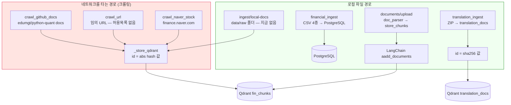
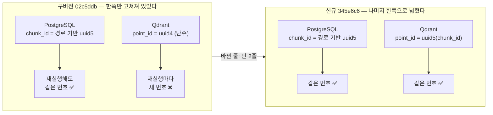
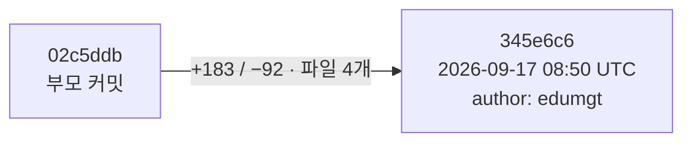
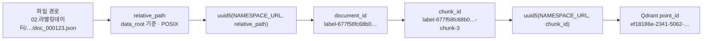
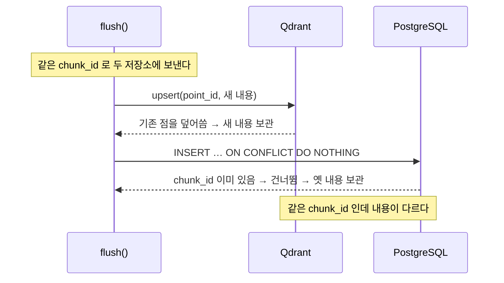
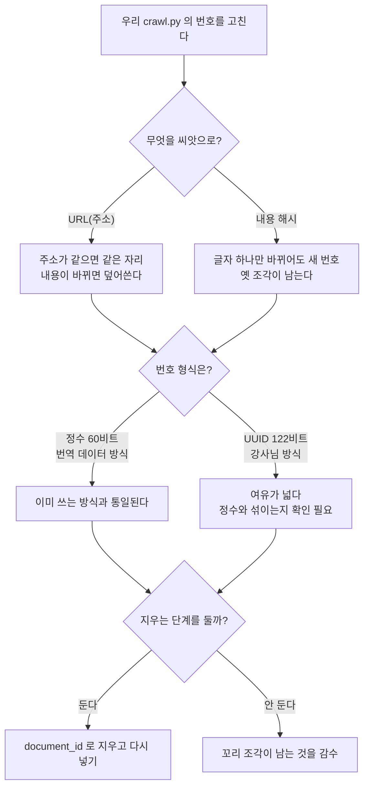
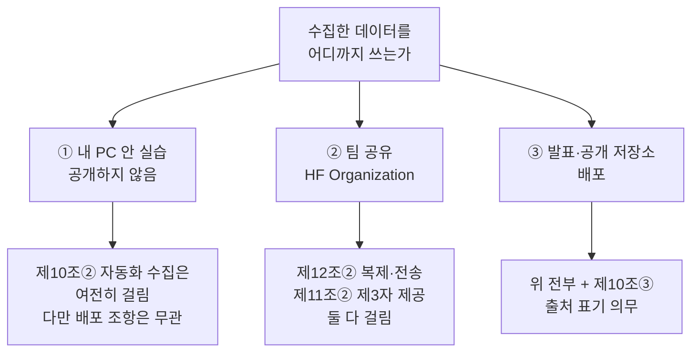
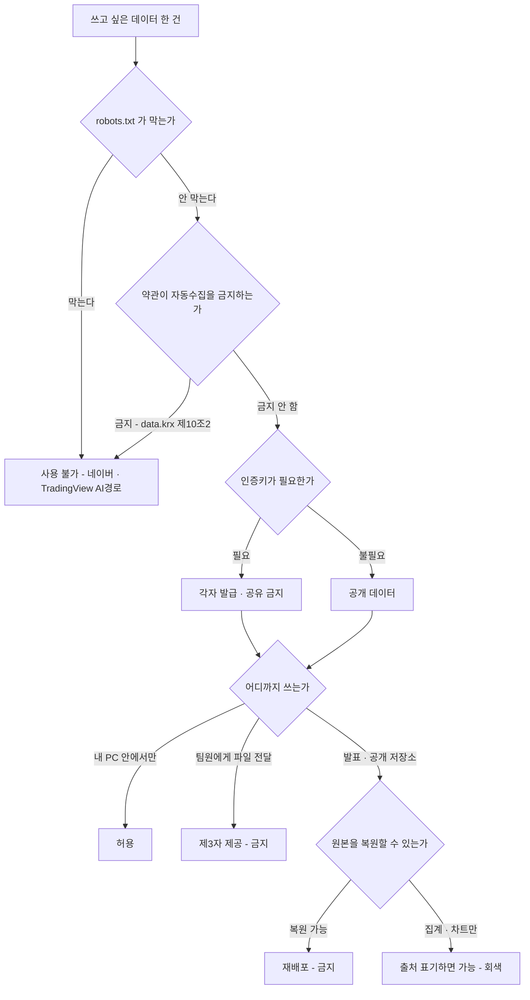

# #25 [분석] A11 크롤링·인제스트 — robots.txt를 확인하지 않고, 같은 저장소 안에 중복 방지의 정답과 오답이 같이 있다

> 🗂️ 옛 GitHub 이슈를 옮긴 **기록 문서**입니다 — [색인](../README.md). 원문은 그대로 두고, 링크·커밋 해시만 새 자리 기준으로 바꿨습니다.

| 항목 | 내용 |
|---|---|
| 종류 | 이슈 |
| 상태 | 열림 |
| 원 작성 | 이동원(`devlee328288`) · 2026-09-17 15:56 KST |
| 라벨 | `analysis` `security` |
| 댓글 | 4건 |
| 옛 주소 | `github.com/devlee328288/Qurious/issues/25` (지금은 열리지 않음) |

## 본문

> **쉬운 요약 3줄**
> 1. 앱에 **네이버 금융 전용 크롤러**가 있고 버튼으로 노출돼 있는데, `finance.naver.com` 의 `robots.txt` 는 **모든 수집을 금지**(`Disallow: /`)합니다. 코드에는 robots.txt를 확인하는 부분이 **한 줄도 없습니다.**
> 2. 같은 저장소 안에 Qdrant id를 만드는 방식이 **두 벌**인데, 하나는 재실행마다 id가 바뀌어 **중복이 쌓이고**(크롤링), 다른 하나는 항상 같은 id라 **덮어써서 깔끔합니다**(번역 데이터). **정답이 이미 옆에 있습니다.**
> 3. 업로드 지원 목록에 `.doc` · `.xls` · `.ppt` 가 적혀 있지만 실제로는 **셋 다 못 엽니다**(실측: `BadZipFile`). 화면은 "허용"이라 안내하고 서버는 422로 거절합니다.

---

## 0. 이 문서가 답하는 것과 안 답하는 것

| 구분 | 내용 |
|---|---|
| 답한다 | 크롤링 대상과 robots.txt·이용 조건 / 중복 제거와 재실행 멱등성 / 텍스트 추출 품질 / `financial_ingest`·`translation_ingest` 경로 / `doc_parser` 가 실제로 처리하는 형식 / 인제스트 경로의 비용·보안 노출면 |
| 안 답한다 | LLM 공급자·에이전트·RAG 읽기 경로 — **A10 [#24](../issues/024.md)에서 다뤘다** / 알림·감사 로그 — **A12** / 법적 판단 (사실만 적고 판단은 팀·강사님 몫으로 남긴다) |
| 기준 커밋 | Qurious `04f476a` |
| 조회일 | 2026-09-17 (KST) |

확실도 표기: **🟢 코드·원문으로 확인** / **🟡 추론**

---

## 1. 한눈에 보기

| # | 지금 상태 | 왜 문제인가 | 확실도 |
|---|---|---|---|
| 1 | 네이버 금융 크롤러가 있고 `robots.txt` 확인 코드는 **0줄** | `finance.naver.com/robots.txt` 는 `Disallow: /` — 전면 금지다 | 🟢 |
| 2 | User-Agent 가 `Mozilla/5.0 (compatible; FinAgent/1.0)`, 네이버 요청엔 `Referer` 까지 붙인다 | 브라우저처럼 보이게 하는 형태다. 연락처·목적 표기가 없다 | 🟢 |
| 3 | `POST /api/ingest/crawl/url` 이 **임의 URL**을 받아 서버가 대신 요청한다. 도메인 허용목록·사설 IP 차단 없음, 리다이렉트 따라감 | 로그인한 사용자 누구나 서버를 통해 내부망을 찔러볼 수 있다 (SSRF) | 🟢 |
| 4 | 크롤 청크 id = `abs(hash(url-i)) % 2**63` | 파이썬 `hash()` 는 프로세스마다 값이 달라진다 → **재실행할 때마다 같은 내용이 새 id로 쌓인다** | 🟢 실측 |
| 5 | 번역 데이터 id = `sha256(zip::doc_no::idx)` | **같은 저장소 안의 올바른 방식.** 재실행해도 같은 id라 덮어쓴다 | 🟢 실측 |
| 6 | HTML 텍스트 추출이 **중첩 태그에서 일찍 풀린다** | `<nav>` 안에 `<script>` 가 있으면 메뉴 글자가 본문에 섞인다 | 🟢 실측 |
| 7 | `.doc` · `.xls` · `.ppt` 가 지원 목록에 있지만 **열리지 않는다** | 안내는 "허용"인데 업로드하면 422 | 🟢 실측 |
| 8 | PDF의 텍스트 희박 페이지마다 **VLM 호출** — 페이지 수 상한 없음, 파일 50MB까지 | 업로드 한 번이 수백 번의 모델 호출이 될 수 있다 | 🟢 |
| 9 | CSV 인제스트가 **전체 DELETE 후 재삽입** | 멱등하지만, 데이터 폴더가 비어 있으면 **다 지우고 0건을 넣는다** | 🟢 |
| 10 | CSV 헤더가 없으면 **위치로 추정**(`len(header)-6` 등) | 컬럼 순서가 바뀐 파일을 조용히 잘못 읽는다 | 🟢 |
| 11 | `data/manifest.json` 에 문서별 `allowed_roles` 가 있는데 **코드가 이 파일을 안 읽는다** | 권한 표가 장식이다. `local-docs` 인제스트는 `data/raw` 전체를 무차별로 넣는다 | 🟢 |
| 12 | `data/raw` 폴더가 **아예 없다** | `POST /api/ingest/local-docs` 는 0건을 넣고 `ok: true` 를 돌려준다 | 🟢 |
| 13 | 번역 데이터(AI 허브) 출처 표기가 저장소에 **없다** | AI 허브 이용정책은 출처 표기를 **의무**로 적고 있다 | 🟢 |
| 14 | 원본 저장은 `content[:5000]` 로 잘리는데 Qdrant에는 전문이 들어간다 | 두 저장소의 내용이 다르다 | 🟢 |

---

## 2. 같은 말, 다른 뜻 — 먼저 구분하고 갑니다

| 말 | 이 뜻일 때 (1) | 이 뜻일 때 (2) | 구분하는 법 |
|---|---|---|---|
| **인제스트** | 외부에서 **가져오는 것**(크롤링) | 이미 로컬에 있는 파일을 **넣는 것**(CSV·ZIP·업로드) | "네트워크를 타느냐"로 나뉜다. 이 앱은 둘 다 `/api/ingest` 아래 있다 |
| **중복 제거** | PostgreSQL 쪽 — `url` 기준 **덮어쓰기** | Qdrant 쪽 — **point id 기준** | 앞은 되고 뒤는 안 된다 (5절) |
| **`_chunk_text`** | `crawl.py` 의 것 (1000단어/겹침 150) | `doc_parser.py` 의 것 (800단어/겹침 100) | **이름이 같은 다른 함수 두 개다** |

### 2.1 용어 풀이

**robots.txt**
- *정확한 뜻*: 사이트가 "자동 수집 프로그램은 여기까지만" 이라고 적어 두는 파일. 웹 표준(RFC 9309)으로 문법이 정해져 있다.
- *이 문서에서*: `https://finance.naver.com/robots.txt` 의 내용.
- *헷갈리기 쉬운 점*: robots.txt는 **기술적 차단이 아니라 요청**이다. 무시해도 접속은 된다. 그래서 "동작하니까 괜찮다"는 근거가 되지 않는다. 반대로 robots.txt가 허용한다고 저작권·이용약관까지 허용되는 것도 아니다. **셋은 별개의 층**이다.

**멱등성(idempotency)**
- *정확한 뜻*: 같은 작업을 여러 번 해도 결과가 한 번 한 것과 같은 성질.
- *이 문서에서*: "크롤링을 두 번 돌리면 청크가 두 배가 되는가?"
- *헷갈리기 쉬운 점*: "덮어쓴다"와 "건너뛴다"는 둘 다 멱등이지만 결과가 다르다. 이 앱의 PostgreSQL 쪽은 **덮어쓰기**(최신으로 갱신), Qdrant 쪽은 **어느 쪽도 아니다**(쌓임).

**SSRF (Server-Side Request Forgery, 서버 측 요청 위조)**
- *정확한 뜻*: 공격자가 준 주소로 **서버가 대신 요청**하게 만드는 것. 서버는 내부망에 있으므로 바깥에서 못 가는 곳에 닿는다.
- *이 문서에서*: `POST /api/ingest/crawl/url` 이 받는 `url`.
- *헷갈리기 쉬운 점*: "로그인해야 쓸 수 있으니 안전하다"가 아니다. 계정 하나만 있으면 되고, 이 앱은 회원가입이 열려 있다(A3 [#22](../issues/022.md)).

**OLE 형식 / OOXML 형식**
- *정확한 뜻*: `.doc`·`.xls`·`.ppt` 는 1990년대 OLE 복합 파일. `.docx`·`.xlsx`·`.pptx` 는 2007년 이후의 **zip으로 압축된 XML**(OOXML).
- *이 문서에서*: `python-docx`·`openpyxl`·`python-pptx` 는 **뒤쪽만** 읽는다.
- *헷갈리기 쉬운 점*: 확장자를 `.docx` 로 바꿔도 안 된다. 내용물 자체가 zip이 아니기 때문이다(7절 실측).

**VLM (Vision-Language Model, 시각-언어 모델)**
- *정확한 뜻*: 이미지를 보고 글로 설명하는 모델. 이 앱은 `llava` 를 쓴다.
- *이 문서에서*: PPT 그림·Word 그림·PDF의 글자 없는 페이지를 설명하게 하는 용도.
- *헷갈리기 쉬운 점*: OCR(글자 인식)이 아니다. "설명"을 지어내므로 표의 숫자를 정확히 옮긴다는 보장이 없다.

---

## 3. 전체 그림 — 데이터가 들어오는 5갈래



**읽는 법**: 빨간 상자 셋이 바깥 사이트를 건드리는 경로입니다. 이 셋이 모두 같은 `_store_qdrant` 를 쓰고, 그 함수의 id 생성 방식이 5절의 문제입니다 🟢.

---

## 4. 크롤링 — 무엇을, 어떤 예의로 가져오나

### 4.1 대상 목록

실측 🟢: `CRAWL_TARGETS` 는 **1개**뿐입니다.

| 이름 | 종류 | 대상 |
|---|---|---|
| python-quant docs (GitHub) | `github_docs` | `edumgt/python-quant` `main` 브랜치의 `docs` 폴더 |

나머지 둘은 목록이 아니라 **사용자가 그때그때 주소를 주는 방식**입니다:

| 엔드포인트 | 무엇을 받나 | 인증 |
|---|---|---|
| `POST /api/ingest/crawl/auto` | 위 목록 실행 | 세션 |
| `POST /api/ingest/crawl/url` | **임의 URL** | 세션 |
| `POST /api/ingest/crawl/naver` | 6자리 종목코드 → `finance.naver.com` | 세션 |

### 4.2 robots.txt — 확인 코드가 없습니다

저장소 전체에서 `robots` 를 찾으면 **0건**입니다 🟢. `urlparse`·허용목록·사설 IP 판별도 전부 0건입니다.

그리고 대상 사이트가 무엇을 말하는지는 이렇습니다.

| 대상 | robots.txt | 확실도 |
|---|---|---|
| `raw.githubusercontent.com` · `api.github.com` | 공개 API로 제공되는 경로 — 이 앱은 **공식 REST API**를 쓴다 | 🟢 |
| **`finance.naver.com`** | **`User-agent: *` / `Disallow: /`** — 전면 금지 | 🟢 |

> 이 robots.txt는 제가 페이지를 받아 읽은 게 아니라, **가져오기 도구가 그 robots.txt 때문에 요청을 거부하면서 내용을 그대로 보여준** 것입니다. 도구 자신이 규칙을 지켜 멈춘 셈이고, 그 멈춤 자체가 증거입니다 🟢.

### 4.3 요청 헤더 — 브라우저처럼 보이게 되어 있습니다

| 함수 | User-Agent | 추가 헤더 |
|---|---|---|
| `crawl_url` | `Mozilla/5.0 (compatible; FinAgent/1.0)` | — |
| `crawl_naver_stock` | 같음 | `Referer: https://finance.naver.com/` |

`Mozilla/5.0` 접두는 브라우저 관행이고, `Referer` 는 "그 사이트 안에서 눌러서 왔다"는 표시입니다 🟢. 연락처(이메일·봇 소개 URL)는 없습니다. 크롤러 관행에서는 보통 그 반대로 합니다 — **자기가 봇임을 밝히고 연락처를 남깁니다** 🟡(관행에 대한 제 판단입니다).

### 4.4 GitHub 쪽은 한도 안에 들어옵니다

GitHub 공식 문서 기준 🟢:

| 인증 | 한도 |
|---|---|
| **무인증** | 시간당 **60회** (IP 기준) |
| 개인 액세스 토큰 | 시간당 5,000회 |

`crawl_github_docs` 는 무인증이고, 한 번 실행에 **contents API 1회**를 씁니다. 파일 본문은 `raw.githubusercontent.com` 이라 이 한도에 안 들어갑니다. 따라서 평소 사용에서는 60회에 닿기 어렵습니다 🟢. 다만 API 실패 시 로그만 남기고 `0` 을 돌려주므로([crawl.py:139-141](https://github.com/EST-team-project/Qurious/blob/04f476a7558086d2c02d81b91325d52cd541d2fc/app/services/crawl.py#L139-L141)) 한도 초과와 "문서가 없음"이 구분되지 않습니다.

### 4.5 임의 URL 크롤링의 노출면

[`crawl_url`](https://github.com/EST-team-project/Qurious/blob/04f476a7558086d2c02d81b91325d52cd541d2fc/app/services/crawl.py#L179-L209) 은 받은 주소를 그대로 요청합니다 🟢:

| 확인 항목 | 있나 |
|---|---|
| 도메인 허용목록 | 없음 |
| `http`/`https` 외 스킴 차단 | 없음 |
| 사설 IP·`localhost`·클라우드 메타데이터 주소 차단 | 없음 |
| 리다이렉트 처리 | `follow_redirects=True` — **따라간다** |
| 응답 크기 상한 | 없음 |
| Content-Type 확인 | 없음 (PDF·바이너리도 `resp.text` 로 읽는다) |

즉 로그인한 사용자가 내부 주소를 넣으면 **서버가 대신 가서 내용을 가져와 DB와 Qdrant에 저장**합니다. 리다이렉트를 따라가므로, 바깥 주소로 시작해 내부로 튕기는 방식도 막히지 않습니다.

**과장하지 않겠습니다** — 지금 이 앱이 클라우드 메타데이터 서비스가 있는 환경에서 돌고 있지는 않습니다(AWS 인프라를 걷어냈습니다). 로컬·사내망 시연에서는 피해가 제한적입니다 🟡. 문제는 **배포 위치가 바뀌면 그날부터 위험해진다**는 점이고, 이건 D2 [#10](../discussions/010.md)의 "어디서 시연하나"와 바로 이어집니다.

---

## 4.6 ★ 2026-09-19 추가 — 라이브러리로 감싸도 판정은 같습니다 (`FinanceDataReader` 🔴)

4.2에서 `finance.naver.com` 을 🔴로 판정했습니다. 그 뒤 **데이터 소스를 새로 고르는 과정**([#33](../issues/033.md))에서 같은 물음이 다른 모양으로 돌아왔습니다 —

> *"직접 크롤링하지 말고 `FinanceDataReader` 같은 **라이브러리**를 쓰면 되지 않나?"*

**아닙니다. 판정이 같습니다.** 설치본(0.9.202) 소스를 열어 **호출 도메인을 전수로 뽑았습니다.**

| 도메인 | FDR 코드 내 등장 | robots.txt 실측 |
|---|--:|---|
| `data.krx.co.kr` | **25회** | 404(robots 없음) — 대신 **KRX 약관 제10조② 자동 수집 금지** |
| `finance.naver.com` | 9회 | **`Disallow: /`** 🔴 (4.2에서 판정한 그 도메인) |
| `navercomp.wisereport.co.kr` | 6회 | 404 |
| `api.stock.naver.com` | 4회 | 404 |
| **`fchart.stock.naver.com`** ← 국내 일별시세 **기본 경로** | 2회 | **`Disallow: /`** 🔴 |
| `kind.krx.co.kr` | 2회 | 웹방화벽이 요청 자체를 차단 |
| `ecos.bok.or.kr` · `fred.stlouisfed.org` | 4회 | 공식 API (키 필요) ✅ |

`fdr.DataReader('005930')` 한 줄이 실제로 부르는 곳은 **`fchart.stock.naver.com/sise.nhn`** 입니다.

```
    우리 코드                     실제로 나가는 요청
  ┌──────────────┐            ┌────────────────────────────┐
  │ crawl_naver  │ ─────────→ │ finance.naver.com           │  4.2에서 🔴
  │ _stock       │            │   robots: Disallow: /       │
  └──────────────┘            └────────────────────────────┘

  ┌──────────────┐            ┌────────────────────────────┐
  │ fdr.Data     │ ─────────→ │ fchart.stock.naver.com      │  같은 🔴
  │ Reader(...)  │   ↑        │   robots: Disallow: /       │
  └──────────────┘   │        └────────────────────────────┘
                     └─ 라이브러리가 한 겹 끼어 있을 뿐,
                        요청은 여전히 **우리 IP에서** 나갑니다.
```

**이 절이 A11에 있어야 하는 이유** — 이 문서의 주제가 *"robots.txt를 확인하지 않는다"* 인데, 라이브러리를 쓰면 그 확인 책임이 라이브러리로 넘어간다고 **착각하기 쉽습니다.** 넘어가지 않습니다. `import` 는 면책이 아닙니다. 🟢

**용어 — 래퍼(wrapper) 라이브러리**
- 뜻: 바깥 서비스를 부르는 코드를 한 겹 감싸서, 쓰는 쪽이 세부를 몰라도 되게 만든 것.
- 이 문서에서: `FinanceDataReader`·`pykrx` 가 여기 해당합니다. 한 줄로 시세를 받아 편하지만, **어디를 부르는지가 안 보입니다.**
- 헷갈리는 점: **"공식 라이브러리"와 "공식 API"는 다릅니다.** FDR은 널리 쓰이는 잘 만든 라이브러리지만, *그 안이 부르는 곳*은 공개 API가 아니라 웹페이지입니다. 별 수(GitHub Star)가 많다고 이용 조건이 달라지지 않습니다.

| 용도 | 판정 |
|---|---|
| 국내 주식·ETF 시세 | 🔴 **사용 불가** — 네이버 + KRX 스크래핑 |
| ECOS·FRED 래퍼 | 🟡 이용 조건은 괜찮지만 **직접 호출이 낫습니다** — 의존성이 줄고, 래퍼가 무엇을 바꾸는지 안 보이는 문제도 없어집니다 |

→ `pykrx` 도 **같은 이유로 같은 결론**입니다. 둘 다 `requirements.txt` 에 넣지 않습니다. 대신 **공공데이터포털 공식 API**로 갔고, 수집기가 이미 섰습니다([#33](../issues/033.md) · PR [#34](../pulls/034.md)·[#35](../pulls/035.md)).

**뒤집을 조건** — FDR이 국내 시세 경로를 **공식 API로 바꾸면** 다시 봅니다. 0.9.202 기준으로는 아닙니다. 🟢

---

## 5. 멱등성 — 정답과 오답이 같은 저장소 안에 있습니다

### 5.1 두 방식 비교 (실측)

```
crawl._store_qdrant 방식   abs(hash(f"{url}-{i}")) % 2**63
  PYTHONHASHSEED=0 -> 3803639896558242036
  PYTHONHASHSEED=1 -> 3770828733683978699
  PYTHONHASHSEED=2 -> 8078877979131445538
  서로 다른 id 3/3  ->  재실행마다 새 id (중복 누적)

translation_ingest._chunk_id 방식   sha256(f"{zip}::{doc_no}::{idx}")[:15]
  3회 호출 결과: [18308122388253697, 18308122388253697, 18308122388253697]
  다른 프로세스(HASHSEED 0/1)에서도 동일
  id 비트 폭: 60비트
```

파이썬의 내장 `hash()` 는 문자열에 대해 **프로세스마다 다른 시드**를 씁니다. 같은 프로세스 안에서는 같은 값이지만, 서버나 Celery 워커를 **재시작하면 값이 바뀝니다** 🟢. A2 [#21](../issues/021.md)이 실측한 "재크롤 3회 → 중복 누적"의 원인이 이것입니다.

### 5.2 저장소별 멱등성 정리

| 경로 | 저장소 | 재실행하면 | 확실도 |
|---|---|---|---|
| 크롤링 | PostgreSQL `crawled_docs` | `url` 유일키로 **덮어쓰기** — 멱등 | 🟢 |
| 크롤링 | Qdrant `fin_chunks` | **쌓임** (워커 재시작 시) | 🟢 |
| 번역 데이터 | Qdrant `translation_docs` | 같은 id로 **덮어쓰기** — 멱등 | 🟢 |
| CSV | PostgreSQL 4개 테이블 | **전체 삭제 후 재삽입** — 멱등이지만 파괴적 | 🟢 |
| 업로드 문서 | Qdrant `fin_chunks` | LangChain이 매번 새 UUID → **쌓임** | 🟡 |

마지막 줄은 라이브러리 기본 동작에 대한 추론입니다(직접 실행해 보지 않았습니다).

### 5.3 왜 이게 조용한 문제인가

중복이 쌓여도 **에러가 나지 않습니다.** 검색은 여전히 결과를 돌려주고, 다만 같은 문장이 여러 번 올라와 **TOP_K 자리를 독차지**합니다. 사용자는 "답이 좀 반복적이네" 정도로만 느낍니다 🟡.

---

## 6. 텍스트 추출 품질 — 건너뛰기가 일찍 풀립니다

`_extract_text` 는 `script`·`style`·`nav`·`footer`·`header` 를 건너뛰려 합니다. 그런데 켜고 끄는 스위치가 **불리언 하나**라, 안쪽 태그가 닫힐 때 바깥쪽 것까지 같이 풀립니다. 실측 🟢:

| 넣은 HTML | 나온 텍스트 | 판정 |
|---|---|---|
| `<p>본문A</p>` | `본문A` | 정상 |
| `<nav>메뉴1 메뉴2</nav><p>본문B</p>` | `본문B` | 정상 |
| `<nav>메뉴3 <script>var x=1</script> 메뉴4</nav><p>본문C</p>` | **`메뉴4 본문C`** | 메뉴가 샌다 |
| `<footer><style>.a{}</style>푸터문구</footer><p>본문D</p>` | **`푸터문구 본문D`** | 푸터가 샌다 |

요즘 사이트는 `<nav>` 안에 `<script>` 를 넣는 일이 흔하므로, 실제 페이지에서는 세 번째·네 번째 줄이 기본값에 가깝습니다 🟡. 이렇게 새어 들어온 메뉴 문구가 그대로 임베딩되어 **RAG 근거로 검색됩니다.**

> 참고: 같은 파일이 `crawl_naver_stock` 에서는 BeautifulSoup을 씁니다([crawl.py:240](https://github.com/EST-team-project/Qurious/blob/04f476a7558086d2c02d81b91325d52cd541d2fc/app/services/crawl.py#L240)). 즉 **더 나은 도구가 이미 의존성에 있는데** 범용 경로만 손수 만든 파서를 씁니다 🟢.

---

## 7. 문서 업로드 — 지원한다고 적고 못 여는 형식이 3개

### 7.1 지원 목록과 실제

| 확장자 | 연결된 파서 | 실제로 열리나 |
|---|---|---|
| `.pptx` | `parse_pptx` (python-pptx) | 열린다 |
| **`.ppt`** | 같은 파서 | **안 열린다** |
| `.docx` | `parse_docx` (python-docx) | 열린다 |
| **`.doc`** | 같은 파서 | **안 열린다** |
| `.xlsx` | `parse_xlsx` (openpyxl) | 열린다 |
| **`.xls`** | 같은 파서 | **안 열린다** |
| `.pdf` | `parse_pdf` (pdfplumber) | 열린다 |
| `.md` · `.txt` | `parse_text` | 열린다 |

격리 환경에서 구형 OLE 시그니처를 넣어 확인했습니다 🟢:

```
python-docx 1.2.0 / openpyxl 3.1.5 / python-pptx 1.0.2
  .doc  -> BadZipFile: File is not a zip file
  .xls  -> BadZipFile: File is not a zip file
  .ppt  -> BadZipFile: File is not a zip file
```

이유는 간단합니다 — `.docx` 계열은 **zip으로 압축된 XML**이고 `.doc` 계열은 그렇지 않습니다. 세 라이브러리 모두 새 형식 전용입니다.

사용자가 보는 것은 [documents.py:49-52](https://github.com/EST-team-project/Qurious/blob/04f476a7558086d2c02d81b91325d52cd541d2fc/app/routes/documents.py#L49-L52) 의 **"허용: .doc, .docx, .pdf, .ppt, .pptx, .txt, .xls, .xlsx, .md"** 안내입니다. 목록에 있는 걸 올렸는데 422가 돌아옵니다.

### 7.2 PDF의 VLM 폴백은 상한이 없습니다

[`parse_pdf`](https://github.com/EST-team-project/Qurious/blob/04f476a7558086d2c02d81b91325d52cd541d2fc/app/services/doc_parser.py#L152-L177) 는 페이지 텍스트가 50자 미만이면 그 페이지를 **150dpi 이미지로 렌더링해 VLM에 보냅니다** 🟢.

| 조건 | 값 |
|---|---|
| 파일 크기 상한 | 50 MB |
| **페이지 수 상한** | **없음** |
| 페이지당 VLM 생성 | 512 토큰 |
| 업로드 엔드포인트 레이트리밋 | **없음** |

스캔본 PDF는 대부분의 페이지가 텍스트 50자 미만이므로, **300쪽 스캔본 하나 = VLM 호출 300회**가 됩니다 🟡(실제 실행은 하지 않았습니다). A10 [#24](../issues/024.md)의 10절에서 본 "무제한 소비" 문제가 업로드 경로에도 있습니다.

### 7.3 이미지 설명이 그대로 지식이 됩니다

VLM 출력은 `[이미지] {설명}` 형태로 청크에 들어가 Qdrant에 저장됩니다. 즉 **모델이 지어낸 문장이 나중에 "근거 문서"로 인용**됩니다 🟢. 청크에 "이건 모델이 만든 설명"이라는 표시가 `[이미지]` 접두 하나뿐이고, 검색 결과에는 그 접두가 본문 안에 섞여 나옵니다.

---

## 8. CSV 인제스트 — 멱등하지만 조심스러운 방식

### 8.1 전체 삭제 후 재삽입

네 함수 모두 같은 모양입니다 🟢:

```python
# app/services/financial_ingest.py:39
await db.execute(delete(PersonalCbStat))
```

| 좋은 점 | 걱정되는 점 |
|---|---|
| 재실행해도 결과가 같다 (멱등) | 폴더가 **비어 있으면 다 지우고 0건을 넣는다** |
| 부분 갱신 로직이 필요 없다 | 인제스트 도중 실패하면 **테이블이 빈 채로 남을 수 있다** 🟡 |

폴더 자체가 없으면 `delete` 전에 빠져나가므로 안전합니다([:36-38](https://github.com/EST-team-project/Qurious/blob/04f476a7558086d2c02d81b91325d52cd541d2fc/app/services/financial_ingest.py#L36-L38)) 🟢. 하지만 **폴더는 있는데 CSV가 없는** 경우는 걸러지지 않습니다.

### 8.2 헤더가 없으면 위치로 추정합니다

```python
# app/services/financial_ingest.py:57-64
idx = {
    "stdt":   h.get("STDT", 0),
    "gender": h.get("GENDER", 2),
    "score":  h.get("SCORE", len(header) - 6),
    ...
}
```

헤더 이름을 못 찾으면 **앞에서 몇 번째 / 뒤에서 몇 번째**로 넘어갑니다 🟢. 컬럼 순서가 다른 파일이 들어오면 **에러 없이 엉뚱한 값**을 신용점수로 읽습니다. `_safe_float` 가 숫자가 아니면 `None` 을 돌려주므로([:15-19](https://github.com/EST-team-project/Qurious/blob/04f476a7558086d2c02d81b91325d52cd541d2fc/app/services/financial_ingest.py#L15-L19)) 조용히 평균에서 빠집니다.

이건 A6 [#14](../issues/014.md)·A2 [#21](../issues/021.md)에서 본 "조용한 실패"와 같은 계열입니다.

---

## 9. 번역 데이터 인제스트 — 이용 조건을 먼저 봐야 합니다

### 9.1 무엇을 넣나

| 항목 | 값 |
|---|---|
| 원본 위치 | `data/1.데이터` 아래 `Training`/`Validation` × `01.원천데이터`/`02.라벨링데이터` |
| 카테고리 5종 | 학술논문 · 규제정보 · 보고서 · 뉴스기사 · 공시정보 |
| 언어 5종 | 영어 · 중국어간체 · 일본어 · 베트남어 · 인도네시아어 |
| 청킹 | **문장 10개**씩, 겹침 없음 |
| 컬렉션 | `translation_docs` (채팅 RAG와 분리됨 — 좋은 점 🟢) |
| 검색 | `POST /api/ingest/translation-search` — 원문 `text` 와 번역 `translation` 을 **그대로 반환** |

폴더 구조(`Training`/`Validation`, `01.원천데이터`/`02.라벨링데이터`)는 **AI 허브 배포본의 표준 형태**입니다 🟡.

### 9.2 AI 허브 이용정책 원문에서 직접 걸리는 조항

[AI 허브 데이터 이용정책](https://www.aihub.or.kr/intrcn/guid/usagepolicy.do) 원문 🟢:

| 조항 (원문 인용) | 이 프로젝트와의 관계 |
|---|---|
| "본 AI데이터 등을 이용할 때에는 **반드시 한국지능정보사회진흥원의 사업결과임을 밝혀야** 하며, 본 AI데이터 등을 이용한 2차적 저작물에도 동일하게 밝혀야 합니다." | 저장소 `readme.md` 에 출처 표기가 **없습니다** 🟢 |
| "제공 받은 AI데이터 등을 … 승인을 받지 않은 다른 법인, 단체 또는 개인에게 **열람하게 하거나** 제공, 양도, 대여, 판매하여서는 안됩니다." | `translation-search` 가 원문·번역을 그대로 돌려줍니다. 외부 공개 시연이면 확인이 필요합니다 🟡 |
| "본 AI데이터는 **인공지능 학습모델의 학습용으로만** 사용할 수 있습니다." | RAG 검색 서비스가 "학습용"에 해당하는지 확인이 필요합니다 🟡 |
| "AI 데이터셋의 **판매 등 상업적 이용**을 희망하는 경우 수행기관과 별도 협의가 필요합니다." | 학습용 프로젝트라 해당 없음으로 보이나 명시해 두는 게 낫습니다 🟡 |
| 다운로드에 "신청자 본인 확인과 정보 제공, 목적을 밝히는 절차"가 필요 | 원본을 저장소에 올리지 않은 것이 이 조항과 맞습니다 🟢 |

**저장소 쪽은 잘 되어 있습니다** 🟢 — `.gitignore` 에 `data/1*/` 가 있어 원본 ZIP이 커밋되지 않습니다.

> **판단은 하지 않겠습니다.** 위 세 개의 🟡 는 "우리가 지금 하려는 사용이 이 조항 안인가"를 **강사님·팀에 확인할 항목**으로 남깁니다. 제가 법적 해석을 내릴 자리가 아닙니다.
>
> 👉 이 건은 **[확인 요청 #26](../issues/026.md)** 으로 따로 올렸습니다. 선택지 A·B·C와 여쭤볼 내용, 그리고 데이터 파트로서 제 입장(쓰는 쪽)이 거기 있습니다. 기한은 다른 논의와 같은 **2026-09-27**입니다.

---

## 10. 잊힌 배선 — 문서는 있는데 코드가 안 읽습니다

A10 [#24](../issues/024.md)에서 `prompts/` 3개 파일이 코드에서 안 읽힌다는 걸 확인했는데, 같은 패턴이 데이터 쪽에도 있습니다 🟢.

| 무엇 | 상태 |
|---|---|
| `data/manifest.json` | 문서 **9건**(법령 4·판례 3·결정 1·해석 1)에 `allowed_roles` 가 붙어 있다 |
| 이 파일을 읽는 코드 | **0건** (저장소 전체 검색) |
| 그 문서들이 놓일 `data/raw` 폴더 | **존재하지 않는다** |
| `POST /api/ingest/local-docs` | `data/raw` 를 순회 → 지금은 **0건 인제스트하고 `ok: true` 반환** |
| `allowed_roles` 값 | 9건 전부 `["user","admin"]` — 구분이 실질적으로 없다 |

즉 "문서별 권한"이라는 설계가 **표에만 있고 어디서도 강제되지 않습니다.** `local-docs` 인제스트는 폴더 안의 모든 `.md` 를 권한 구분 없이 공용 컬렉션 `fin_chunks` 에 넣습니다([ingest.py:91-106](https://github.com/EST-team-project/Qurious/blob/04f476a7558086d2c02d81b91325d52cd541d2fc/app/routes/ingest.py#L91-L106)).

강사님 `domain-rag-lab`(th07) 계보의 흔적으로 보입니다 🟡. **2·3차에서 "문서 권한"을 쓸 생각이라면 이 표를 되살릴지 버릴지 먼저 정해야 합니다.**

---

## 11. 잘 되어 있는 것 (그대로 유지할 것)

| 항목 | 근거 | 확실도 |
|---|---|---|
| **번역 데이터 id를 SHA-256으로** 만든다 — 재실행에 강하다 | `translation_ingest.py:88-90` | 🟢 실측 |
| 번역 데이터를 **별도 컬렉션**(`translation_docs`)에 둔다 | `translation_ingest.py:12` | 🟢 |
| PostgreSQL 크롤 문서는 `url` 유일키 **upsert** | `crawl.py:14-22` | 🟢 |
| 임베딩 차원을 **실제로 재서** 컬렉션을 만든다 (크롤·번역 경로) | `crawl.py:97-99`, `translation_ingest.py:147-152` | 🟢 |
| 번역 인제스트가 **배치 upsert**(32건씩)로 네트워크를 아낀다 | `translation_ingest.py:14`, `flush()` | 🟢 |
| CSV 값 변환이 **비정상값을 걸러낸다** (절댓값 1e14 초과는 `None`) | `financial_ingest.py:15-19` | 🟢 |
| 원본 데이터가 `.gitignore` 로 **커밋되지 않는다** | `.gitignore` `data/1*/` 등 | 🟢 |
| 네이버 파싱에 **BeautifulSoup** 을 쓴다 | `crawl.py:240` | 🟢 |
| GitHub 크롤이 **공식 REST API**를 쓴다 (페이지 스크래핑이 아니다) | `crawl.py:127` | 🟢 |

---

## 12. 근거·반례·한계

### 12.1 확인 방법

| 확인 대상 | 방법 |
|---|---|
| point id 두 방식 | `PYTHONHASHSEED` 를 0·1·2로 바꿔 별도 프로세스에서 실행, 프로젝트 `_chunk_id()` 는 그대로 import |
| 텍스트 추출 버그 | 프로젝트 `_extract_text()` 에 HTML 4종 직접 실행 |
| 구형 오피스 형식 | 격리 venv에 `python-docx`·`openpyxl`·`python-pptx` 설치 후 OLE 시그니처로 열기 시도 |
| 크롤 대상·상수 | 프로젝트 `CRAWL_TARGETS`·`CHUNK_SIZE` 직접 읽기 |
| ZIP 이름 파싱 | 프로젝트 `_parse_zip_name()` 에 4가지 이름 실행 |
| manifest 내용 | `data/manifest.json` 직접 집계 |
| robots.txt · 요금 한도 · 이용정책 | 원문 조회 (15절) |

### 12.2 반례로 볼 수 있는 것

- **"중복이 쌓인다"가 늘 그런가?** — 아닙니다. **같은 프로세스 안에서** 두 번 돌리면 id가 같아 덮어씁니다. 워커를 재시작해야 벌어집니다. 다만 Celery 워커는 자주 재시작되고, `max_retries=1` 재시도도 새 프로세스일 수 있습니다 🟡.
- **"robots.txt를 어겼다"인가?** — 코드가 **확인하지 않는다**는 것이 확인된 사실입니다. 실제로 그 엔드포인트를 호출했는지는 제가 알 수 없습니다. 그래서 "위반했다"가 아니라 **"막는 장치가 없다"** 로 적었습니다.
- **"`.doc` 미지원이 버그인가?"** — 목록에서 빼면 됩니다. 버그라기보다 **안내와 구현이 어긋난 것**입니다.
- **"CSV 전체 삭제가 나쁜가?"** — 통계 스냅샷 성격의 데이터라 합리적인 선택입니다. 다만 "폴더는 있고 파일이 없을 때"만 막으면 됩니다.

### 12.3 한계 — 확인하지 못한 것과 내가 고친 것

| 한계 |
|---|
| **실제로 크롤링을 실행하지 않았습니다.** 네이버·GitHub에 요청을 보내지 않고 코드와 공개 문서만 확인했습니다. |
| 업로드 경로(LangChain `aadd_documents`)의 id 생성은 **라이브러리 기본 동작에 대한 추론**입니다(5.2의 🟡). |
| PDF 300쪽 VLM 호출 수는 **계산이지 측정이 아닙니다.** |
| 번역 데이터 ZIP 실물이 없어 `run_translation_ingest` 를 **끝까지 돌려보지 못했습니다.** |
| AI 허브 조항의 **법적 해석은 하지 않았습니다.** 원문 인용까지만 했습니다. |
| 네이버 쪽은 `robots.txt` 와 일반 이용약관 페이지까지 읽었고, 별도 문서인 "검색결과 수집에 대한 정책" 본문은 **읽지 못했습니다.** |
| **조사 중 고친 것**: 처음에는 "`data/raw` 의 로컬 문서가 권한 없이 인제스트된다"고 적었는데, 확인해 보니 **`data/raw` 폴더 자체가 없어서** 지금은 0건이 들어갑니다. 문제의 성격이 "권한 없이 들어간다"가 아니라 **"아무것도 안 들어가는데 성공이라고 답한다"** 로 바뀌어 10절을 다시 썼습니다. |
| **읽지 못한 곳**: 한국투자증권·KIS 포털·LS API 가이드·KRX 전 사이트·policies.yahoo.com. |

---

## 13. 이 판정을 뒤집을 조건

| 판정 | 이런 게 나오면 뒤집힙니다 |
|---|---|
| "robots.txt 확인이 없다" | 크롤 경로에 `urllib.robotparser` 등 확인 단계가 들어가는 경우 |
| "네이버 수집이 금지돼 있다" | `finance.naver.com/robots.txt` 가 바뀌거나, 네이버가 별도로 허용한 경로·API를 쓰도록 바뀌는 경우 |
| "크롤 청크가 중복 누적된다" | `_store_qdrant` 의 id가 `_chunk_id` 처럼 해시 기반으로 바뀌는 경우 |
| "`.doc` 를 못 연다" | `antiword`·`libreoffice` 변환 같은 단계가 추가되거나 목록에서 빠지는 경우 |
| "manifest가 장식이다" | `allowed_roles` 를 읽어 검색을 거르는 코드가 생기는 경우 |
| "AI 허브 조항이 걸린다" | 팀이 번역 데이터를 쓰지 않기로 하거나, 출처 표기와 비공개 시연으로 조건을 맞추는 경우 |

---

## 14. 2·3차 설계로 넘기는 질문 (여기서 결론내지 않습니다)

1. **크롤링을 2·3차 주 경로에 둘 것인가?** 둔다면 robots.txt 확인·허용목록·요청 간격을 **먼저** 넣어야 합니다 → D1 [#7](../discussions/007.md)의 화면 분류에 영향.
2. **네이버 금융 크롤러를 살릴 것인가, 뺄 것인가?** 뺀다면 종목 정보는 어디서 받나 → A4 [#23](../issues/023.md)의 "국내 ETF 경로 없음"과 같은 갈림길입니다.
3. **임의 URL 크롤링을 남길 것인가?** 남긴다면 어디까지 허용할지 → D2 [#10](../discussions/010.md)의 "어디서 시연하나"와 묶입니다.
4. **번역 데이터를 쓸 것인가?** 쓴다면 출처 표기와 공개 범위를 어떻게 맞출지 → **[확인 요청 #26](../issues/026.md) 으로 따로 올렸습니다.** 기한 2026-09-27.
5. **문서별 권한(`manifest.json`)을 되살릴 것인가?** → A10 [#24](../issues/024.md)의 "업로드 문서가 섞인다"와 한 묶음으로 정하는 게 낫습니다.
6. **업로드 형식 목록을 줄일 것인가?** `.doc`·`.xls`·`.ppt` 를 빼는 게 가장 싼 정답으로 보입니다 🟡.

---

## 15. 참고 자료

| 자료 | URL | 조회일(KST) |
|---|---|---|
| 네이버 금융 robots.txt (`User-agent: *` / `Disallow: /`) | https://finance.naver.com/robots.txt | 2026-09-17 |
| 네이버 서비스 이용약관 (시행일 2025-07-10) | https://policy.naver.com/rules/service.html | 2026-09-17 |
| GitHub Docs — Rate limits for the REST API | https://raw.githubusercontent.com/github/docs/main/content/rest/using-the-rest-api/rate-limits-for-the-rest-api.md | 2026-09-17 |
| 같은 문서 — 무인증 60회/시간 | https://raw.githubusercontent.com/github/docs/main/data/reusables/rest-api/primary-rate-limit-unauthenticated-users.md | 2026-09-17 |
| 같은 문서 — 인증 5,000회/시간 | https://raw.githubusercontent.com/github/docs/main/data/reusables/rest-api/primary-rate-limit-authenticated-users.md | 2026-09-17 |
| AI 허브 — 데이터 이용정책 | https://www.aihub.or.kr/intrcn/guid/usagepolicy.do | 2026-09-17 |

**앞선 문서**: A10 [#24](../issues/024.md) (LLM 공급자·에이전트·RAG 읽기 경로) · A2 [#21](../issues/021.md) (데이터 계층)
**이어지는 문서**: A12 (알림·감사·시스템)

---

## 댓글 4건

---

<a id="issuecomment-5712631266"></a>

### 💬 1. 이동원(`devlee328288`) · 2026-09-17 19:11 KST

## [후속] 강사님이 오늘 같은 문제를 고쳤습니다 — `domain-rag-lab` `345e6c6` 읽기

> **쉬운 요약 3줄**
> 1. 강사님이 오늘(2026-09-17) `domain-rag-lab` 에 올린 커밋 `345e6c6` 은 **A11 5절이 지적한 바로 그 문제를 고친 것**입니다. 벡터 저장소의 조각 번호표를 매번 새로 뽑던 것을, **같은 조각이면 언제나 같은 번호**가 나오도록 바꿨습니다.
> 2. 그 방식은 우리 저장소의 **"정답" 쪽(번역 데이터)과 같은 계열**입니다 — 둘 다 결정론적 해시. 다만 강사님 쪽이 **번호 자릿수가 넓고(122비트 vs 60비트), 경로를 상대경로로 정규화**해서 한 걸음 더 갑니다.
> 3. 그래도 **중복이 전부 사라지지는 않습니다.** 문서가 짧아지거나 파일 이름이 바뀌면 옛 조각이 그대로 남습니다(지우는 코드가 **0줄**). 그래서 **A11의 판정은 그대로 유지**합니다.

---

### 0. 이 댓글이 답하는 것과 안 답하는 것

| 구분 | 내용 |
|---|---|
| 답한다 | 강사님 신규 커밋이 무엇을 고쳤는가 / 그 방식이 A11 5절의 **정답·오답 중 어느 쪽**인가 / 우리가 고칠 때 그대로 베껴도 되는가 |
| 안 답한다 | robots.txt · SSRF · 문서 형식 등 **A11의 나머지 항목** (이 커밋과 무관하다) / 우리 코드를 **언제** 고칠지 (2·3차 설계에서 정한다) |
| 기준 | `edumgt/domain-rag-lab` `345e6c6` (부모 `02c5ddb`) · Qurious `04f476a` |
| 조회일 | 2026-09-17 (KST) · 커밋 작성 시각 2026-09-17 08:50 UTC |

확실도 표기: **🟢 코드·실측으로 확인** / **🟡 추론**

---

### 1. 먼저, 30초 그림 한 장

이 커밋이 무엇을 했는지는 이 그림 하나로 끝납니다.



**"새로 도입"이 아니라 "한쪽에만 있던 것을 나머지로 넓힌 것"** 입니다 🟢. 이 구분이 중요한 이유는 6절에 적었습니다.

---

### 2. 한눈에 보기

| # | 항목 | 내용 | 확실도 |
|---|---|---|---|
| 1 | 커밋 한 줄 | `implement stable IDs for vector upserts` — 벡터 점 번호를 **안정 번호**로 | 🟢 |
| 2 | 바뀐 곳 | `uuid.uuid4()` → `uuid.uuid5(NAMESPACE_URL, chunk_id)` (**단 2줄**) | 🟢 |
| 3 | 재실행 결과 | 같은 조각이 **덮어써진다** — 중복이 쌓이지 않는다 | 🟢 실측 |
| 4 | A11 분류 | 우리 **"정답"(번역 데이터)과 같은 계열** — 결정론적 해시 | 🟢 |
| 5 | 우리보다 나은 점 ① | 번호 폭 **122비트**(uuid5) vs 우리 **60비트**(`sha256[:15]`) | 🟢 |
| 6 | 우리보다 나은 점 ② | 경로를 **상대경로·POSIX로 정규화** → 기계·OS가 달라도 같은 번호 | 🟢 |
| 7 | 남는 문제 ① | **지우는 단계가 없다** — 문서가 짧아지면 꼬리 조각이 영구히 남는다 | 🟢 |
| 8 | 남는 문제 ② | Qdrant는 **덮어쓰기**인데 PostgreSQL은 **무시** — 두 저장소 내용이 갈라진다 | 🟢 |
| 9 | 남는 문제 ③ | **내용이 아니라 경로** 기준 — 파일을 옮기거나 이름을 바꾸면 **새 문서**가 된다 | 🟢 |
| 10 | 곁다리 | `DATA-ROOT` 를 **읽기 전용(`:ro`)** 으로 마운트 · `*.key`·`data/processed/` gitignore 추가 | 🟢 |

---

### 3. 커밋이 한 일



| 파일 | 증감 | 무슨 일 |
|---|---|---|
| `app/services/vector_store.py` | +5 / −1 | **핵심.** 점 번호를 `uuid4` → `uuid5` 로. payload에 `metadata` 추가 |
| `app/ops/ingest_data_root.py` | +173 / −91 | 대상 자료를 3종(금융상품·CoT·소비자)에서 **라벨링 코퍼스 1종**으로 바꾸고 `--dry-run` 추가 |
| `docker-compose.yml` | +2 / −0 | `./DATA-ROOT:/app/data/DATA-ROOT:ro` — **원자료를 읽기 전용으로** 마운트 |
| `.gitignore` | +3 / −0 | `data/processed/` · `*.key` |

핵심은 이 2줄입니다 ([vector_store.py#L47-L49](https://github.com/edumgt/domain-rag-lab/blob/345e6c6/app/services/vector_store.py#L47-L49)) 🟢:

```python
# Stable IDs make a repeated ingestion an upsert instead of adding
# duplicate vectors for the same RAG chunk.
point_id = str(uuid.uuid5(uuid.NAMESPACE_URL, chunk["chunk_id"]))
```

---

### 4. 새 번호는 어떻게 만들어지나



| 마디 | 코드 | 난수가 끼어드나? |
|---|---|---|
| 상대경로 계산 | [#L72](https://github.com/edumgt/domain-rag-lab/blob/345e6c6/app/ops/ingest_data_root.py#L72) | 아니오 |
| `document_id` | [#L77](https://github.com/edumgt/domain-rag-lab/blob/345e6c6/app/ops/ingest_data_root.py#L77) | 아니오 |
| `chunk_id` | [#L129](https://github.com/edumgt/domain-rag-lab/blob/345e6c6/app/ops/ingest_data_root.py#L129) | 아니오 |
| `point_id` | [vector_store.py#L49](https://github.com/edumgt/domain-rag-lab/blob/345e6c6/app/services/vector_store.py#L49) | 아니오 |

**사슬의 어느 마디에도 난수·시각·프로세스 상태가 끼어들지 않습니다** 🟢. 그래서 재실행하면 같은 번호가 나오고, Qdrant `upsert` 가 덮어씁니다.

---

### 5. 실측 — 같은 입력, 서로 다른 프로세스 3회

**어떻게 쟀나**: `PYTHONHASHSEED` 를 0·1·2로 바꿔 **완전히 별개인 프로세스 3번**을 돌렸습니다 (Python 3.12.13). 이렇게 하는 이유는 8절 용어 풀이에 적었습니다 🟢.

| 방식 | 어디 | 3회 결과 | 재실행하면 |
|---|---|---|---|
| `uuid5(NAMESPACE_URL, chunk_id)` | 강사님 **신규** | `ef18186e-2341-5062-a6a6-6ff83047b9bc` **3/3 동일** | 덮어쓰기 ✅ |
| `uuid4()` | 강사님 **구버전** | `0b0d5be2…` / `0fb5a468…` / `fb2da998…` **3/3 상이** | 누적 ❌ |
| `abs(hash(f"{url}-{i}")) % 2**63` | 우리 **오답** | `8524177279447138653` / `8195148555253826516` / `3291606725767063642` **3/3 상이** | 누적 ❌ |
| `int(sha256(…).hexdigest()[:15], 16)` | 우리 **정답** | `1148104302806421937` **3/3 동일** | 덮어쓰기 ✅ |

**이 차이가 실제로 무엇을 뜻하나** — 한 문서가 10조각일 때, 인제스트를 3번 돌리면:

```
              1회차                 2회차                 3회차
난수 번호     ██████████            ████████████████████  ██████████████████████████████
(uuid4)       10점                  20점                  30점        ← 같은 내용이 3벌
안정 번호     ██████████            ██████████            ██████████
(uuid5)       10점                  10점                  10점        ← 늘 10점
```

A11 5.1절의 실측과 같은 결론이고, 여기에 **강사님의 신·구 두 방식이 양쪽 진영에 하나씩 들어간 셈**입니다.

---

### 6. 다섯 지점 총정리 — 우리 3곳 + 강사님 2곳

지금까지 확인한 **모든 벡터 번호 생성 지점**을 한 표에 모았습니다.

| 저장소 | 경로 | 번호 만드는 법 | 결정론? | 재실행하면 | 확실도 |
|---|---|---|:---:|---|:---:|
| Qurious | [`crawl.py#L110`](https://github.com/EST-team-project/Qurious/blob/04f476a/app/services/crawl.py#L110) | `abs(hash(url-i)) % 2**63` | ❌ | **누적** | 🟢 |
| Qurious | [`translation_ingest.py#L85-L87`](https://github.com/EST-team-project/Qurious/blob/04f476a/app/services/translation_ingest.py#L85-L87) | `sha256(zip::doc::idx)[:15]` | ✅ | 덮어쓰기 | 🟢 |
| Qurious | [`rag_pipeline.py#L125`](https://github.com/EST-team-project/Qurious/blob/04f476a/app/services/rag_pipeline.py#L125) | `aadd_documents(docs)` — **`ids=` 를 안 넘긴다** | ❌ | **누적** | 🟡 |
| domain-rag-lab | `vector_store.py` (02c5ddb) | `uuid4()` | ❌ | **누적** | 🟢 |
| domain-rag-lab | [`vector_store.py#L49`](https://github.com/edumgt/domain-rag-lab/blob/345e6c6/app/services/vector_store.py#L49) (345e6c6) | `uuid5(NAMESPACE_URL, chunk_id)` | ✅ | 덮어쓰기 | 🟢 |

> 3번째 줄은 A11에서 🟡로 남겨 둔 항목인데, **이번에 한 단계 좁혔습니다.** `ids=` 인자를 넘기지 않는다는 것은 코드에서 확인했으므로 🟢이고, 그래서 라이브러리가 난수 UUID를 쓴다는 부분이 아직 🟡입니다(실행해 보지 않았습니다).

**5곳 중 3곳이 누적, 2곳이 덮어쓰기.** 고쳐야 할 곳이 더 많습니다.

---

### 7. 우리 저장소의 정답·오답 중 어느 쪽인가 → **정답 쪽**

| | 우리 오답 `crawl.py` | 우리 정답 `translation_ingest.py` | 강사님 신규 `vector_store.py` |
|---|---|---|---|
| 바탕 | 파이썬 내장 `hash()` | SHA-256 | SHA-1 (uuid5의 규격) |
| 프로세스 간 재현 | **안 됨** | 됨 | 됨 |
| 번호 타입·폭 | 정수 63비트 | 정수 **60비트** | UUID **122비트** |
| 씨앗(입력) | `url` + 조각번호 | zip명 + 문서번호 + 조각번호 | **상대경로** + 조각번호 |
| 기계·OS가 바뀌면 | — | 영향 없음 | 영향 없음 |

**계열은 우리 정답과 같습니다.** 다만 두 가지가 더 낫습니다 🟢.

#### 7.1 번호 폭 — 자리 수가 몇 개인가

우리 정답은 SHA-256 결과를 **앞 15자리만 잘라** 써서 60비트입니다. 강사님 방식은 122비트입니다. 감이 잘 안 오니 실제 개수로 적어 봅니다:

| | 서로 다른 번호를 몇 개 만들 수 있나 | 충돌 확률 50%가 되는 조각 수 |
|---|---:|---:|
| **60비트** (우리 정답) | 약 **115경** (1.15 × 10¹⁸) | 약 **12.6억 조각** |
| **122비트** (강사님) | 약 **5.3 × 10³⁶** | 약 **2.7 × 10¹⁸ 조각** |
| 차이 | **46억 배** (2⁶²) | — |

우리 규모에서 우연히 겹칠 확률은 이렇습니다:

| 총 조각 수 | 60비트 (우리 정답) | 122비트 (강사님) |
|---:|---:|---:|
| 10,000 | 4.3 × 10⁻¹¹ | 사실상 0 |
| 100,000 | 4.3 × 10⁻⁹ | 사실상 0 |
| 1,000,000 | 4.3 × 10⁻⁷ | 사실상 0 |
| 10,000,000 | 4.3 × 10⁻⁵ | 사실상 0 |

**결론: 우리 규모(수만~수십만 조각)에서는 60비트도 실질적으로 안전합니다** 🟡. 다만 충돌이 나면 **에러 없이 남의 조각을 덮어쓰므로**(조용한 실패) 여유를 넓혀 두는 쪽이 마음이 편합니다.

#### 7.2 경로 정규화 — 기계가 바뀌어도 같은 번호

강사님 **구버전**은 `str(path)` — **절대경로**였습니다.

| 어디서 돌렸나 | 구버전이 보는 문자열 | 나오는 번호 |
|---|---|---|
| 컨테이너 안 | `/app/data/DATA-ROOT/…/doc.json` | A |
| 내 Windows 노트북 | `C:\Users\…\DATA-ROOT\…\doc.json` | **B (다름)** |
| 팀원 macOS | `/Users/…/DATA-ROOT/…/doc.json` | **C (또 다름)** |

신규는 `path.relative_to(data_root).as_posix()` 로 **기준점 아래 상대경로 + 슬래시 통일**입니다 🟢. 그래서 어디서 돌려도 같은 번호가 나옵니다. **Windows와 컨테이너를 오가는 우리 환경에 그대로 필요한 처리**입니다.

---

### 8. ★ 강사님 구버전 주석이 이미 같은 말을 적어두고 있었습니다

A11이 "정답과 오답이 같은 저장소에 있다"고 적었는데, 강사님 저장소에는 **문제를 적어 둔 주석**까지 있었습니다 ([02c5ddb 기준 #L10-L12](https://github.com/edumgt/domain-rag-lab/blob/02c5ddb/app/ops/ingest_data_root.py#L10-L12)) 🟢:

> Re-running is safe for PostgreSQL (chunk_id is unique, conflicts are skipped) **but Qdrant points get a fresh random id each run, so re-running without clearing the collection will duplicate vectors.**
>
> (재실행은 PostgreSQL 쪽은 안전하다 — chunk_id가 유일키라 충돌은 건너뛴다. **그러나 Qdrant 점은 매 실행마다 새 난수 번호를 받으므로, 컬렉션을 비우지 않고 재실행하면 벡터가 중복된다.**)

정리하면 구조가 이렇습니다:

| | PostgreSQL | Qdrant | 구조 |
|---|---|---|---|
| **domain-rag-lab 구버전** | `uuid5` 로 결정론 ✅ | `uuid4` 난수 ❌ | 한쪽만 고쳐짐 |
| **우리 `crawl.py`** | `url` 유일키로 덮어쓰기 ✅ | `hash()` ❌ | **판박이** |

**우리 `crawl.py` 와 같은 모양**입니다(A11 5.2절 표). 신규 커밋에서 이 경고 문장은 **주석에서 지워졌습니다.** 고쳤기 때문입니다.

> 강사님 피드백 ⑤(주석·개념 기록)의 좋은 예로 봅니다. **아직 못 고친 것을 주석으로 남겨 두니, 고칠 때 무엇을 지워야 하는지가 분명**했습니다. 우리도 A11에서 찾은 것들을 코드 주석에 남겨 두면 같은 효과가 있을 것 같습니다.

---

### 9. 그래도 남는 것 — 반례·한계

#### 9.1 지우는 단계가 없다 🟢

신규 파일 223줄에 `delete`·`purge`·`clear`·`drop` 이 **0건**입니다(실측). 안정 번호는 *같은 자리*를 덮어쓸 뿐, **없어진 자리를 치우지는 않습니다.**

```
1차 수집  문서 A 가 10조각
   chunk-0  chunk-1  …  chunk-6 │ chunk-7  chunk-8  chunk-9
      ↓        ↓            ↓   │    ·        ·        ·
2차 수집  문서 A 가 7조각으로 줄었다
   chunk-0  chunk-1  …  chunk-6 │
   └── 덮어써짐 ✅ ───────────┘ └─ 덮어쓸 상대가 없다
                                  → 옛 내용이 그대로 남는다 ❌
```

검색은 이 꼬리 조각도 그대로 돌려줍니다. **에러가 나지 않는다**는 점까지 A11 5.3절과 같습니다 🟡.

#### 9.2 두 저장소가 갈라진다 🟢

같은 `flush()` 함수 안에서 두 저장소를 **반대 규칙**으로 다룹니다 ([#L158-L170](https://github.com/edumgt/domain-rag-lab/blob/345e6c6/app/ops/ingest_data_root.py#L158-L170)):



| 저장소 | 재수집 시 동작 | 같은 경로의 내용이 바뀌면 | 어느 쪽을 지키나 |
|---|---|---|---|
| Qdrant | `upsert` — **덮어쓴다** | **새 내용** | 마지막에 들어온 것 |
| PostgreSQL | `ON CONFLICT DO NOTHING` — **무시한다** | **옛 내용** | 먼저 들어온 것 |

이 커밋이 *만든* 문제는 아닙니다(구버전에도 `DO NOTHING` 이 있었습니다). 다만 벡터 쪽이 고쳐지면서 **불일치가 또렷해졌습니다**:

| | 벡터 검색이 보는 것 | 키워드 검색이 보는 것 |
|---|---|---|
| 구버전 | 옛 내용 **+** 새 내용 (둘 다 있음) | 옛 내용 |
| 신규 | **새 내용만** | **옛 내용만** |

A11 14번("원본 저장은 잘리는데 Qdrant에는 전문이 들어간다")과 **같은 부류**입니다.

#### 9.3 내용이 아니라 경로 기준 🟢

`document_id` 의 씨앗은 파일 경로입니다. 그래서 갈림길이 생깁니다:

| 씨앗 | 파일 이름을 바꾸면 | 내용만 고치면 | 
|---|---|---|
| **경로** (강사님 방식) | **새 문서**가 된다 → 옛 자리 조각이 남는다 ❌ | 같은 자리에 덮어쓴다 ✅ |
| **내용 해시** | 같은 번호 ✅ | **글자 하나만 바뀌어도 전부 새 번호** → 옛 조각이 남는다 ❌ |

**어느 쪽을 골라도 지우는 단계는 따로 필요합니다** 🟡. 이건 방식의 우열이 아니라, 안정 번호만으로는 풀리지 않는 별개의 문제입니다.

#### 9.4 우리가 확인하지 못한 것 🟡

실제 Qdrant에 두 번 넣어 점 개수를 세어 보지는 **않았습니다.** `DATA-ROOT` 자료가 저장소에 없고(gitignore), 컨테이너를 띄우지 않았습니다.

| 확인 수준 | 내용 |
|---|---|
| 🟢 실측 | 번호가 프로세스를 넘어 **재현된다**는 것 (5절) |
| 🟡 추론 | "그래서 점이 안 늘어난다" — Qdrant `upsert` 규격에 기댄 판단 |

---

### 10. 용어 풀이

#### 10.1 빠른 대조표

| 말 | 한 줄 뜻 | 이 문서에서 |
|---|---|---|
| **청크(chunk)** | 긴 문서를 검색하기 좋게 자른 **한 조각** | 문서 1개 → 조각 여러 개 |
| **점(point)** | Qdrant가 벡터 1개를 담아 두는 **한 칸**. 번호(id)와 내용(payload)을 가진다 | 조각 1개 = 점 1개 |
| **컬렉션(collection)** | 점들을 모아 둔 **표 한 장** | `fin_chunks` 등 |
| **페이로드(payload)** | 점에 같이 붙여 두는 **곁 정보** (제목·원문·분류) | 이번에 `metadata` 가 추가됐다 |
| **인제스트(ingest)** | 자료를 읽어 조각내고 저장소에 **넣는 일** | 이 커밋이 다루는 작업 |
| **결정론적(deterministic)** | 같은 입력이면 **언제나 같은 출력** | 안정 번호의 조건 |
| **멱등성(idempotency)** | 여러 번 해도 **한 번 한 것과 결과가 같은** 성질 | 재실행해도 조각이 안 늘어나는 것 |
| **해시(hash)** | 아무 길이의 글자를 **정해진 길이의 숫자**로 바꾸는 함수 | SHA-256 · SHA-1 |
| **비트 폭** | 그 숫자가 가질 수 있는 **자리 수** | 60비트 vs 122비트 (7.1절) |

#### 10.2 자세히 볼 것

**안정 번호 (stable id)**
- *정확한 뜻*: 같은 대상에 대해 **언제 어디서 계산해도 같은 값**이 나오는 식별자.
- *이 문서에서*: `uuid5(NAMESPACE_URL, chunk_id)`.
- *헷갈리기 쉬운 점*: **"고유하다(unique)"와 다릅니다.** `uuid4()` 도 고유하지만 안정적이지 않습니다 — 매번 새로 고유한 값을 뽑으니 옛 것과 겹치지 않고, 그래서 중복이 쌓였습니다. 우리에게 필요한 건 고유성이 아니라 **안정성**입니다.

**`uuid4` 와 `uuid5`, 그리고 "이름공간"**
- *정확한 뜻*: `uuid4` 는 **난수**로 만드는 UUID. `uuid5` 는 (**이름공간** + **이름**)을 SHA-1로 해시해 만드는 UUID. 규격은 RFC 9562.
- *이름공간(namespace)이란*: "이 이름은 어느 세계의 이름인가"를 뜻하는 고정 UUID입니다. `NAMESPACE_URL` 은 "이 이름은 URL이다"라는 표준값(`6ba7b811-…`)입니다. **같은 이름이라도 이름공간이 다르면 다른 번호**가 나옵니다 — 서로 다른 용도끼리 번호가 섞이지 않게 하는 칸막이입니다.
- *헷갈리기 쉬운 점*: **"SHA-1은 깨졌다는데 괜찮은가?"** — 깨진 것은 *공격자가 일부러 충돌을 만들어 내는* 경우입니다. 여기 입력은 **우리가 만든 경로 문자열**이라 공격자가 고를 수 없고, 우연 충돌 확률은 7.1절 표대로 사실상 0입니다 🟢.

**생일 문제 (birthday problem)**
- *정확한 뜻*: **n개를 무작위로 뽑을 때 그중 둘이 같을 확률**을 따지는 계산. 7.1절 확률표가 이것입니다.
- *이 문서에서*: "조각이 몇 개를 넘으면 번호가 겹치기 시작하나".
- *헷갈리기 쉬운 점*: **생각보다 훨씬 빨리 겹칩니다.** 사람 **23명**만 모여도 생일이 같은 둘이 있을 확률이 **50.7%** 입니다. 365일인데 23명이면 될 것 같지 않지만, 따지는 건 "나와 같은 사람"이 아니라 **"아무 둘"** 이기 때문입니다. 그래서 번호 폭은 "조각 수보다 크면 된다"가 아니라 **훨씬 넉넉해야** 합니다 — 60비트는 115경인데 충돌 50%는 12.6억에서 옵니다(**제곱근 규모**).

**`upsert`**
- *정확한 뜻*: update + insert. 같은 번호가 있으면 갱신, 없으면 삽입.
- *이 문서에서*: Qdrant의 기본 동작.
- *헷갈리기 쉬운 점*: **번호가 안정적일 때만 `upsert` 가 `upsert` 답습니다.** 번호가 매번 달라지면 겹칠 일이 없으니 `upsert` 도 그냥 `insert` 입니다 — 구버전이 정확히 그랬습니다. 함수 이름이 `upsert_chunks` 라 **이름만 보고 안심하기 쉬운 자리**입니다.

**`ON CONFLICT DO NOTHING`**
- *정확한 뜻*: PostgreSQL에서 유일키가 충돌하면 **아무것도 하지 않고 넘어가는** 것.
- *이 문서에서*: `flush()` 의 PostgreSQL 쪽.
- *헷갈리기 쉬운 점*: **이것도 멱등이지만 방향이 반대입니다.** `DO NOTHING` 은 "먼저 들어온 것을 지킨다", `upsert` 는 "마지막에 들어온 것을 지킨다". 둘 다 "여러 번 돌려도 안전"이라 같은 말처럼 들리지만, **한 함수 안에서 같이 쓰면 두 저장소가 갈라집니다**(9.2절).

**`PYTHONHASHSEED`** — 5절 실측을 왜 그렇게 했나
- *정확한 뜻*: 파이썬이 문자열을 `hash()` 할 때 쓰는 **시작값**. 파이썬은 보안상 이 값을 **실행할 때마다 무작위로** 정합니다.
- *이 문서에서*: 이 값을 0·1·2로 **고정해서** 서로 다른 프로세스를 흉내 냈습니다.
- *헷갈리기 쉬운 점*: **한 프로세스 안에서는 `hash()` 도 항상 같은 값**입니다. 그래서 개발 중에는 멀쩡해 보이고, **서버나 워커를 재시작한 뒤에야** 중복이 쌓이기 시작합니다. A11 4번이 "조용한 문제"인 이유가 이것입니다.

**읽기 전용 마운트 (`:ro`)**
- *정확한 뜻*: 컨테이너에 호스트 폴더를 붙일 때 **쓰기를 막는** 옵션.
- *이 문서에서*: `./DATA-ROOT:/app/data/DATA-ROOT:ro`.
- *헷갈리기 쉬운 점*: 보안 장치라기보다 **사고 방지**입니다. 인제스트는 읽기만 하면 되는데 실수로 원자료를 덮어쓰거나 지우는 일을 막습니다. 우리도 원자료를 다룰 때 같은 습관이 필요합니다.

---

### 11. A11 판정에 미치는 영향 — **유지합니다**

| A11 항목 | 이번 커밋으로 바뀌나 | 이유 |
|---|---|---|
| 4번 (크롤 번호가 `hash()` 라 중복 누적) | **안 바뀜** | 우리 `crawl.py#L110` 은 그대로다. 강사님이 고친 건 **다른 저장소**의 코드다 |
| 5번 (번역 데이터 번호는 올바르다) | **안 바뀜** | 오히려 **세 번째 사례가 늘어 뒷받침**된다 |
| 5.2 표 | **한 줄 보강** | 업로드 경로가 `ids=` 를 안 넘긴다는 것을 확인했다(6절) |

바뀌는 것은 **판정이 아니라 참고 기준**입니다. 우리가 4번을 고칠 때 **"어떻게 고칠지"의 본보기가 같은 수업 자료 안에 생겼습니다** — 그것도 우리보다 나은 형태(122비트·상대경로)로.

---

### 12. 이 판정을 뒤집을 조건

| # | 조건 | 무엇이 바뀌나 | 확인 방법 |
|---|---|---|---|
| 1 | `chunk_id` 에 난수·시각이 섞이면 | 4절 사슬이 무너진다 | 다음 커밋에서 `chunk_id` 생성부 재확인 |
| 2 | Qdrant가 문자열 UUID와 정수 번호를 **한 컬렉션에서 다르게** 다루면 | 7절 "그대로 베껴도 되는가"가 달라진다 | Qdrant 문서 확인 — **아직 못 했다** 🟡 |
| 3 | 강사님이 삭제·정리 단계를 추가하면 | 9.1·9.3이 해소된다 | 다음 세션에 원격 HEAD 재확인 |
| 4 | 실제로 두 번 인제스트해 점 개수가 늘면 | 9.4의 추론이 틀린 것이 된다 | 컨테이너를 띄워 세어 본다 |

---

### 13. 2·3차 설계로 넘기는 질문 (여기서 결론내지 않습니다)



1. `crawl.py` 의 번호를 고칠 때 **번역 데이터 방식(정수 60비트)** 과 **강사님 방식(UUID 122비트)** 중 무엇으로 통일할까요? 한 컬렉션에 정수와 UUID가 섞이는 문제를 먼저 확인해야 합니다(12절 2번).
2. **경로(주소) 기준**과 **내용 해시 기준** 중 무엇으로 할까요? 크롤링은 같은 URL의 내용이 계속 바뀌므로 판단이 달라질 수 있습니다.
3. **지우는 단계**를 어디에 둘까요 — 문서 단위로 `document_id` 로 지우고 다시 넣는 방식이 가장 단순해 보입니다 🟡.
4. PostgreSQL 쪽을 `DO NOTHING` 에서 `DO UPDATE` 로 바꿔 **두 저장소의 방향을 맞출까요?**
5. 업로드 경로(`rag_pipeline.py`)에 **`ids=` 를 넘기는 것**만으로 같은 문제가 풀리는지 확인이 필요합니다.

---

*조사 중 고친 것*: 처음에는 이 커밋을 "강사님이 `uuid4` 를 쓰다가 처음으로 결정론을 도입한 것"으로 읽었으나, 구버전을 직접 받아 보니 **관계형 DB 쪽 `document_id` 는 이미 `uuid5` 였고 벡터 저장소만 난수**였습니다. "전면 도입"이 아니라 **"한쪽에만 있던 것을 나머지 한쪽으로 넓힌 것"** 이 정확한 서술입니다(1절 그림).

*조회 방법*: 저장소를 클론하지 않고 `gh api` 로 커밋과 파일 두 버전만 내려받아 비교했습니다.

---

<a id="issuecomment-5727491829"></a>

### 💬 2. 이동원(`devlee328288`) · 2026-09-18 17:41 KST

## A11 후속 — KRX 약관을 처음 본문까지 읽었습니다: **명시적 금지가 있습니다** 🔴

상세 실측은 [#23 댓글](../issues/023.md#issuecomment-5727478793)에 있습니다. 여기에는 **규약에 직접 영향을 주는 부분만** 옮깁니다.

**쉬운 요약 3줄**
1. KRX는 robots.txt가 없어 "금지 명시 없음"으로 봤는데, **약관 제10조②에 "자동화 수단을 이용한 무단 수집" 금지가 명문으로 있었습니다.**
2. 그래서 KRX는 네이버 금융과 **같은 규약으로 묶기 어렵습니다.** 네이버는 robots.txt 차단 + 약관 미확인, KRX는 robots.txt 없음 + **약관 명시 금지**로 정반대 모양입니다.
3. 우리가 쓰는 **OpenAPI 약관 쪽에서도** 새 조문 둘이 걸립니다 — **제11조②(제3자 제공 금지)**, **제10조③(출처 표기 의무)**.

### 사이트별 규약 상태 — 하나로 못 묶는 이유

| 대상 | robots.txt | 약관 금지 조문 | 로그인 | 우리 코드가 부르나 |
|---|---|---|---|---|
| **KRX data.krx** | 없음 | 🔴 **제10조② 명시** | 🔴 필수 | pykrx 경유 |
| **KRX OpenAPI** | — | 🟡 제7조⑤·제11조②·제10조③ | 인증키 | 예 |
| 네이버 금융 2곳 | 🔴 `Disallow: /` | ⬜ 미확인 | 아니오 | 예 (우리·강사님 코드) |
| 공공데이터포털 | ⬜ 미확인 | ⬜ 미확인 | 인증키 | 예 |
| TradingView | 🔴 AI 크롤러 14종 `/scripts/*` 금지 | ⬜ 미확인 | 아니오 | 3차 예정 |

⬜ = 아직 안 읽음. **다섯 곳 중 두 곳만 약관을 읽은 상태**라, 규약을 지금 확정하면 나머지에서 뒤집힐 수 있습니다.

### 새로 확인된 조문 (OpenAPI — 우리가 이미 키로 쓰는 것)

| 조문 | 요지 | 우리에게 |
|---|---|---|
| **제11조②** | 제공받은 정보를 **제3자에게 제공할 수 없다** | HF Organization 공유·발표 자료 배포가 걸립니다. 팀원도 각자 이용계약 당사자가 아니면 제3자입니다 → **각자 키 발급**의 근거 |
| **제11조③** | **이용계약 종료 후에는 이용 불가** | 발표 후 저장소에 데이터를 남기는 문제 |
| **제10조③** | 화면에 **"한국거래소 통계정보"** 사용 명시 | 대시보드·슬라이드에 출처 표기 의무 |
| 제6조② | **비상업적 목적으로만** | 🟢 학습 프로젝트라 해당 없음 |

### 이 논의가 갈라야 할 두 층



**층마다 걸리는 조문이 다릅니다.** "크롤링을 허용할지"를 한 덩어리로 정하면 ①까지 막거나 ③까지 여는 양극단이 되기 쉽습니다.

### 한계
- 네이버 금융·공공데이터포털·TradingView **약관 본문은 아직 안 읽었습니다.** 위 표의 ⬜가 채워지면 판단이 달라질 수 있습니다.
- 약관 위반과 실제 제재는 다릅니다. KRX가 학습 목적 소량 조회를 제재한 사례는 **확인하지 못했습니다.**
- 「마켓데이터 상품 구매 및 이용약관」(data.krx 제12조의2가 가리킴)은 아직 안 읽었습니다.

### 다음에 할 수 있는 것
- 남은 약관 3곳(네이버 금융·포털·TradingView) 읽기 → 위 표의 ⬜ 채우기
- ①②③ 층별로 허용 범위를 정하는 선택지를 이 논의에 추가

결론은 내지 않겠습니다. 기한(09-27)까지 의견 주시면 반영하겠습니다.

---

<a id="issuecomment-5728100506"></a>

### 💬 3. 이동원(`devlee328288`) · 2026-09-18 18:32 KST

## 크롤링·데이터 이용 규약 ② — 남은 약관 3곳 정독 결과와 ①②③ 층 확정안

> **세 줄 요약**
> 1. **네이버는 논쟁할 것도 없이 못 씁니다.** `finance.naver.com/robots.txt` 가 `Disallow: /` (전면 금지)이고, 네이버가 스스로 "robots.txt 로 보호되는 DB 수집을 불허한다"고 별도 정책 문서에 적어 두었습니다.
> 2. **공공데이터포털은 "받아 쓰는 건 자유, 남에게 주는 건 금지"입니다.** 우리가 쓰는 금융위 주식시세정보 API 상세페이지에 *"상업적 목적 여부와 상관 없이 제3자 무단 제공 및 재배포가 엄격히 금지"* 라고 직접 적혀 있습니다.
> 3. 그래서 뜻밖의 결론이 하나 나옵니다 — **팀원끼리 수집한 데이터 파일을 주고받는 것도 "제3자 제공"에 해당합니다.** 한 사람이 모아서 나눠 주는 방식은 쓸 수 없고, **각자 키로 각자 받아야** 합니다.

### 한눈에 보기

| 출처 | 자동 수집 | 재배포·제3자 제공 | 출처 표기 | 상업적 이용 | 우리 판정 | 확실도 |
|---|---|---|---|---|---|---|
| **공공데이터포털** (금융위 API) | ✅ 허용 (한도 10,000/일) | ❌ **금지** (명시) | ⚠️ **의무** (공공누리 4유형) | ❌ 금지 | **주력으로 쓴다** | 🟢 |
| **KRX OpenAPI** (data-dbg) | ✅ 허용 (키 발급) | ❌ 금지 (제11조②) | ⚠️ 의무 (제10조③) | ❌ 금지 | **보조로 쓴다** | 🟢 |
| **data.krx 화면** (pykrx 경유) | ❌ **금지** (제10조②) | ❌ 금지 (제12조②) | — | ❌ | **쓰지 않는다** | 🟢 |
| **네이버 금융** | ❌ **금지** (robots.txt 전면 + 약관) | ❌ 금지 | — | ❌ | **쓰지 않는다** | 🟢 |
| **TradingView** | ❌ **금지** (AI 크롤러 차단 + display-only) | ❌ 금지 | — | ❌ 금지 | **쓰지 않는다** | 🟢 |
| KRX 마켓데이터 유료 상품 | ? | ? | ? | 유료 시 일부 허용 | **미열람 — 구매 검토 전 필독** | 🔴 |

### 용어 빠른 대조표

| 용어 | 한 줄 뜻 |
|---|---|
| robots.txt | 사이트가 "로봇은 여기 들어오지 마라"를 적어 두는 표준 파일 |
| 공공누리 | 공공데이터의 이용 허락 범위를 유형(0~4·AI)으로 표시하는 국가 라이선스 |
| 2차적 저작물 | 원저작물을 번역·편곡·각색 등으로 **새로 만든** 창작물 |
| 제3자 제공 | 내가 받은 데이터를 **다른 사람에게 넘기는 것** (팀원 포함) |
| 공중송신 | 불특정 다수가 받을 수 있게 **올려 두거나 보내는 것** (업로드 포함) |
| non-display usage | 사람이 화면으로 읽는 것 **외의** 모든 사용 (알고리즘 입력 등) |

### 용어 자세히

**공공누리 제4유형**
- *정확한 뜻*: 「출처표시 + 상업적 이용금지 + 변경금지」. 공공저작물 이용 허락 유형 중 **가장 제한적**인 등급입니다. 0·1·2·3·4·AI 여섯 유형 중 4유형은 세 조건이 모두 붙습니다.
- *이 문서에서*: 우리가 쓰는 **금융위원회 주식시세정보 API가 정확히 이 4유형**입니다(상세페이지 명시, 수정일 2026-09-07).
- *헷갈리는 점*: "공공데이터 = 자유 이용"이라는 인상이 있지만 **유형별로 다릅니다.** 0유형은 정말 자유롭고, 4유형은 사실상 "비상업·원형 유지·출처 표기" 조건부입니다. 원천 소유자가 한국거래소라서 이렇게 강합니다.

**변경금지(2차적 저작물 작성 금지)**
- *정확한 뜻*: 저작권법상 원저작물을 **개작해 새 저작물을 만드는 것**을 금지하는 조건입니다.
- *이 문서에서*: "수익률·이동평균·팩터를 계산하는 것이 '변경'인가?"가 쟁점입니다.
- *헷갈리는 점*: 데이터에서 **통계량을 산출**하는 것은 보통 2차적 저작물 작성이 아니라 단순 '이용'으로 봅니다. 다만 KRX가 상세페이지에서 *"가공을 통해 독창성 있는 저작물을 생산"* 을 **유료 구매 시에만 가능한 상업적 활용**으로 적어 두어, 보수적으로 읽으면 걸릴 여지가 있습니다 🟡. 이건 제가 단정할 수 없어 팀 결정으로 넘깁니다.

---

### 근거 1 — 네이버 (🟢 확정)

**① robots.txt — 전면 금지**

```
https://finance.naver.com/robots.txt   (26바이트 전문)
User-agent: *
Disallow: /

https://m.stock.naver.com/robots.txt
User-agent: *
Disallow: /
User-agent: yeti          ← 네이버 자체 검색봇만
Disallow: /
Allow: /$
Allow: /domestic/stock/*/discussion$
Allow: /domestic/fund/
```

자기 회사 봇(`yeti`)에게만 좁은 예외를 주고, 나머지 전부에 `/` 를 막았습니다.

**② 이용약관** (시행 2025-07-10, `policy.naver.com/rules/service.html`)

> 네이버의 **사전 허락 없이 자동화된 수단**(예: 매크로 프로그램, 로봇(봇), 스파이더, 스크래퍼 등)을 이용하여 … 네이버 서비스에 게재된 회원의 아이디(ID), 게시물 등을 수집하거나 … **이용자(사람)의 실제 이용을 전제로 하는 네이버 서비스의 제공 취지에 부합하지 않는 방식으로 네이버 서비스를 이용**하거나 … 기술적 조치를 무력화하려는 일체의 행위를 시도해서는 안 됩니다.

**③ 「검색결과 수집에 대한 정책」 4절 — 이게 가장 직접적입니다**

> 네이버는 네이버 서비스를 이용하여 구축되는 **데이터 베이스에 대하여 robots.txt 파일 등의 소정의 저작권 보호 장치로써 이를 보호**하고 있습니다. **robots.txt 로 보호되고 있는 데이터 베이스를 네이버의 로봇이 아닌 타 검색 로봇이 수집하는 것을 불허합니다.**
> … 네이버의 데이터베이스를 수집해가는 행위는 **고의성의 여부를 불문하고** … 저작권 침해 또는 정보통신망 이용촉진 및 정보보호에 관한 법률 등에 **위반될 수 있습니다.**
> … 계속 데이터를 수집할 경우 … **법적 절차를 포함하여 엄중한 책임을 물을 것입니다.**

→ 네이버는 robots.txt 를 단순 권고가 아니라 **자기 DB의 저작권 보호 장치**로 선언했습니다. `finance.naver.com` 이 정확히 그 전면 금지 상태이므로, **약관 해석 논쟁 없이 결론이 납니다.**

### 근거 2 — 공공데이터포털 (🟢 확정)

**① robots.txt — 의외로 느슨합니다**

```
https://www.data.go.kr/robots.txt
User-agent: Googlebot        ← Googlebot 에게만
Disallow: /tcs/dss/selectDataSetList.do
Disallow: /tcs/vas/
Disallow: /tcs/lms/mpm/
Disallow: /bbs/dnb/
Disallow: /bbs/dsb/
Disallow: /bbs/qna/selectQna.do
```

**`User-agent: *` 항목 자체가 없습니다.** 일반 크롤러에 대한 명시 규칙이 없고, 위 6개 경로에 우리가 쓰는 API 경로(`apis.data.go.kr/...`)는 포함되지 않습니다.

**② 포털 이용약관** (시행 2023-06-08) — **자동화 수집 금지 조항이 아예 없습니다**

제12조 4항의 금지행위 9개를 전부 확인했는데, 해당하는 것은 7)「해킹 또는 유사 프로그램을 실행하거나 정상적인 운영을 방해하는 행위(예: 해킹 또는 바이러스의 유포행위, **디도스 공격 등**)」와 9)「기타 서비스의 **안정적인 운영에 지장을 주거나 줄 우려가 있는** 일체의 행위」뿐입니다. → **정상 한도 내 API 호출은 여기에 걸리지 않습니다.**

**③ 공공데이터 이용정책** — 성격이 다릅니다

> 공공기관은 공공데이터 포털을 통해 **누구든지 공공데이터를 편리하게 이용할 수 있도록 보장**하며, 이용권의 보편적 확대를 위하여 노력하고 있습니다. (공공데이터법 제1조, 제3조)

KRX·네이버는 "내 재산을 지킨다"는 구조인 반면, 공공데이터포털은 **법으로 개방 의무를 진 구조**입니다. 그래서 자동 수집 금지 조항이 없는 게 자연스럽습니다.

**④ ★ 그런데 개별 API 상세페이지에 강한 제약이 따로 있습니다**

`data.go.kr/data/15094808/openapi.do` (금융위원회_주식시세정보, 수정일 2026-09-07) 원문:

> ※ 본 개방데이터는 **공공누리 4유형**임을 참고하시기 바랍니다.
> 이용허락범위 제4유형 : **출처표시 + 상업적 이용금지 + 변경금지**
> 본 데이터는 **상업적 목적 여부와 상관 없이 제3자 무단 제공 및 재배포가 엄격히 금지**됩니다.
> 만약 상업적 목적으로 이용할 경우 원천 소유자인 **한국거래소의 KRX Data Marketplace(data.krx.co.kr)에서 유료로 구매**하여야 합니다. 이 경우에도 아래의 목적으로만 상업적 활용이 가능합니다.
> 1. 가공을 통해 독창성 있는 저작물을 생산  2. 제3자의 방문, 가입을 통한 간접 수익 창출

같은 페이지에서 부수적으로 확인된 것:

- **신청 가능 트래픽: 개발계정 10,000 / 운영계정은 "활용사례 등록 시 신청하면 트래픽 증가 가능"** → 우리가 헤더에서 본 `X-RateLimit-Limit: 10000` 과 정확히 일치합니다 🟢. 그리고 **한도를 올릴 공식 경로가 존재**합니다(백테스트 기간 논의 D5 [#18](../discussions/018.md) 에 영향).
- 갱신 주기: 기준일자로부터 **영업일 하루 뒤 오후 1시 이후**. 금요일 데이터는 차주 월요일.
- 오류 메시지 원문에 *"API 서비스의 **일일** 호출 허용량을 초과했습니다. 호출량이 **초기화**된 이후 다시 이용하거나"* → 공식 문서가 **'일일'** 이라고 말합니다. (자정 고정 창인지 24h 롤링인지는 여전히 미확정 — [#23](../issues/023.md) 에서 계속)

### 근거 3 — TradingView (🟢 확정, 셋 중 가장 강함)

**① robots.txt — AI 크롤러만 골라서 차단합니다**

```
User-agent: *                          ← 일반 크롤러
Disallow: /scripts/search/             ← 검색 경로만 금지, /scripts/* 자체는 허용

User-agent: Google-Extended
User-agent: GoogleOther
User-agent: Google-CloudVertexBot
User-agent: Applebot-Extended
User-agent: Amazonbot
User-agent: meta-externalagent
User-agent: ClaudeBot          ←★ 우리가 쓰는 도구 계열
User-agent: PerplexityBot
User-agent: cohere-training-data-crawler
User-agent: OmgiliBot
User-agent: AI2Bot
User-agent: Bytespider
User-agent: TikTokspider
User-agent: DeepSeekBot
Disallow: /ideas/*
Disallow: /scripts/*           ←★ Pine Script 목록 전면 금지
Disallow: /script/*
Disallow: /v/*
Disallow: /u/*
Disallow: /chart/*
Disallow: /watchlists/*
```

**우리 용도(AI 도구로 Pine Script 참고 자료 수집)가 정확히 이 14종 규칙의 대상**입니다.

**② 이용약관 3절 (Ownership of information; … non-display usage)**

> The content and market data provided on the TradingView platform … are licensed for **exclusive display-only use**. This license is strictly limited to personal or internal business purposes and **explicitly prohibits any form of non-display usage**. Such prohibited uses include … **price referencing, order verification, algorithmic decision-making, algorithmic trading** … or **any machine-driven processes that do not involve the direct, human-readable display of such data**. Such prohibited cases also include **creating products or services based on TradingView content, any processing of TradingView's content** …
> Except as otherwise expressly permitted by separate agreement, **we do not permit commercial usage of any of our services or APIs.**

위반 시 조치도 구체적입니다 — *"conducting audits or investigations into suspected violations, as well as initiating legal proceedings … blocking of the user …, termination of their account, … seek injunctive relief, and demand damages."*

→ 우리 프로젝트는 **정의상 "algorithmic decision-making"** 입니다. TradingView 데이터를 **사람이 화면으로 읽는 것 외에 어떤 방식으로든 쓰는 것이 금지**되므로, 참고 자료로 긁어 오는 것은 robots.txt·약관 **양쪽에** 걸립니다.

### 근거 4 — KRX (🟢 재검증 + 🔴 미열람 1건)

S24 에서 본 조문을 원문으로 다시 확인했습니다 (`MDCINFO003`, **시행 2026-08-29**):

> **제10조(금지행위)** … ② **자동화 수단을 이용하여 정보를 무단 수집·복제·배포하는 행위**
> **제12조(이용자의 의무)** ① … 계정을 타인에게 **양도하거나 대여할 수 없습니다.**
> ② 이용자는 당 사이트의 정보를 거래소의 **사전 허락 없이 복사·복제·배포·전송·공중송신하여서는 아니 됩니다.**
> **제12조의2(마켓데이터 상품 구매 및 이용에 관한 준수사항)** 이용자가 … 마켓데이터 상품을 구매하거나 이용하는 경우, **별도로 정한 「마켓데이터 상품 구매 및 이용약관」을 준수**하여야 하며 …

**「마켓데이터 상품 구매 및 이용약관」 본문은 찾지 못했습니다** 🔴. `MDCINFO004~007` 은 에러 페이지이고, 데이터 상품 소개(`MDCINFO008`)·판매(`MDCDATA100`) 페이지에도 조문이 없습니다. **구매·로그인 절차 안에서만 노출되는 것으로 보입니다.** → **D2 [#10](../discussions/010.md) 에서 유료 구매를 실제로 검토할 때 반드시 먼저 읽어야 할 문서**로 남깁니다.

---

### 종합 — 데이터 한 건이 통과해야 하는 관문



### ①②③ 층 확정안 (S24 제안에 답을 채웠습니다)

```
                     ① 내 PC 실습   ② 팀 공유      ③ 발표·배포
                    ─────────────  ────────────  ──────────────
공공데이터포털 API    🟢 허용        🔴 금지(*1)    🟡 집계만+출처
KRX OpenAPI          🟢 허용        🔴 금지(*1)    🟡 집계만+출처
data.krx / pykrx     🔴 금지        🔴 금지        🔴 금지
네이버 금융           🔴 금지        🔴 금지        🔴 금지
TradingView          🔴 금지        🔴 금지        🔴 금지
수집 코드(우리가 짬)   🟢            🟢             🟢 ← 코드는 우리 저작물

(*1) 각자 키로 각자 수집하면 해결됩니다. "한 사람이 받아서 나눠 준다"가 막히는 것입니다.
```

**핵심은 ② 칸입니다.** 데이터를 한 곳에 모아 팀이 함께 쓰는 게 자연스러워 보이지만, 약관상 그건 **제3자 제공**입니다. 대신 이렇게 하면 됩니다:

```
[막히는 방식]                          [되는 방식]
  동원 ──(parquet 파일)──> 팀원 3명       수집 코드(우리 저작물) ──> 저장소에 공개
   ↑ 제3자 제공 = 금지                      팀원 각자 자기 키로 실행 ──> 각자 로컬에 데이터
                                           → 데이터는 오가지 않고 "재현 절차"만 공유
```

이건 재현 가능성 측면에서도 더 낫습니다. 다만 **팀원 각자 포털·KRX 키를 발급**받아야 합니다(열린 질문에 있던 항목 — 이로써 **"각자 발급"으로 결론이 섭니다**).

### 약관 정독 진행도

```
S24 ████████░░░░░░░░░░░░  2/5  (data.krx 홈페이지 · KRX OpenAPI)
S25 ██████████████████░░  4.5/5 (+ 네이버 3종 · 공공데이터포털 + API상세 · TradingView)
                          └ 남은 0.5 = KRX「마켓데이터 상품 구매 및 이용약관」(비공개 경로)
```

### 반례·한계

1. **네이버 약관의 자동수집 조항이 열거하는 대상은 "회원의 아이디(ID), 게시물"입니다** — 시세 데이터가 명시돼 있지 않습니다. 저는 포괄 문구("제공 취지에 부합하지 않는 방식")와 검색결과수집정책 4절을 근거로 판정했습니다. 다만 **robots.txt 전면 금지 하나만으로도 결론이 나므로**, 이 해석이 틀려도 판정은 바뀌지 않습니다 🟢.
2. **"변경금지"가 지표 계산까지 막는지는 확정할 수 없습니다** 🟡. 통상적 해석으로는 통계량 산출이 2차적 저작물 작성은 아니지만, KRX 가 "가공을 통해 독창성 있는 저작물 생산"을 유료 영역으로 적어 둔 점이 걸립니다.
3. **"집계·차트는 재배포가 아니다"도 회색지대입니다** 🟡. 원본을 복원할 수 없는 요약은 일반적으로 재배포로 보지 않지만 명문 근거는 없습니다. 안전한 선은 **원본 수치를 그대로 싣지 않고, 출처를 표기하는 것**입니다.
4. **Pine Script 소스코드 자체의 저작권 조항은 확인하지 못했습니다** — `/policies/` 종합 페이지에 없고 House Rules 등 별도 문서로 보입니다. 다만 우리 용도는 robots.txt 단계에서 이미 막히므로 실무 결론은 같습니다.
5. **「마켓데이터 상품 구매 및 이용약관」 미열람** 🔴 — 유료 구매 검토 전 필독.
6. 조사 중 고친 것: 처음에 KRX 약관 조 번호를 **제13조**로 읽었는데, 원문 확인 결과 **제12조의2**가 맞았습니다(제13조는 지식재산권). S24 표기가 옳았습니다.

### 판정을 뒤집을 조건

| 판정 | 뒤집히는 조건 |
|---|---|
| 네이버 금지 | `finance.naver.com/robots.txt` 가 바뀌거나, 네이버와 별도 제휴·허락을 받는 경우 |
| 포털 재배포 금지 | 해당 API 가 공공누리 **1유형 또는 AI유형**으로 변경되는 경우 (상세페이지 수정일을 주기적으로 확인) |
| 팀 공유 금지 | 포털·KRX 로부터 "동일 프로젝트 팀원 간 공유"에 대한 명시적 답변을 받는 경우 → **문의해 볼 가치가 있습니다** |
| TradingView 금지 | 별도 상용 계약(`separate agreement`)을 맺는 경우 — 현실성 없음 |
| 트래픽 10,000 한도 | **활용사례를 등록하고 운영계정 증설을 신청**하면 올라갑니다 — 백테스트 기간 논의(D5 [#18](../discussions/018.md))에서 실제로 해 볼 만합니다 |

---

### 이 정리가 남긴 숙제 — 소스가 2개로 줄었습니다

정독의 결과를 뒤집어 보면 이렇습니다. **쓸 수 있는 소스는 공공데이터포털·KRX OpenAPI 둘뿐**이고, 그마저 일 10,000회 한도 · 재배포 금지 · (포털 기준) 6.7년입니다. 퀀트 백테스트에 필요한 항목을 이 둘로 다 채울 수 있는지는 **아직 확인하지 않았습니다.**

```
필요한 것 ─────────────────  지금 있는가
일별 OHLCV                   ✅ 포털 6.7년 / KRX 16.7년
수정주가(분할·증자 반영)       ❓ 미확인 ★ 이게 아니면 수익률이 전부 틀어집니다
상장폐지된 종목               ❓ 미확인 ★ 빠지면 생존편향 (S22 논의와 직결)
재무제표(PER·PBR·ROE)        ❌ 없음
배당                         ❌ 없음
외국인 지분율 · 공매도         ❌ 없음
금리 · 환율                   ❌ 없음
```

그래서 **"데이터 소스 확보"를 별도 과제로 떼어 다음에 다룹니다.** 이번 정리에서 세운 검증 순서(robots.txt → 자동수집 조항 → 재배포·제3자 제공 → 출처표기)를 새 후보에도 그대로 적용하겠습니다.

### 팀에 여쭙니다

1. **②층 "각자 키 발급"** 으로 진행해도 괜찮을까요? (각자 data.go.kr·KRX 가입 + 키 발급이 필요합니다. 10분 정도 걸립니다)
2. **③층에서 "집계·차트 + 출처 표기"** 선까지만 공개하는 것에 동의하시는지요? 원본 시세 파일은 저장소에 올리지 않게 됩니다.
3. **운영계정 트래픽 증설**(활용사례 등록)을 신청해 볼까요? 승인되면 백테스트 가능 기간이 늘어납니다.

*출처: `policy.naver.com/rules/service.html`(2025-07-10 시행) · `policy.naver.com/policy/search_policy.html` · `finance.naver.com/robots.txt` · `m.stock.naver.com/robots.txt` · `data.go.kr/ugs/selectPortalPolicyView.do`(2023-06-08 시행) · `data.go.kr/robots.txt` · `data.go.kr/data/15094808/openapi.do`(수정일 2026-09-07) · `tradingview.com/policies/` · `tradingview.com/robots.txt` · `data.krx.co.kr/contents/MDC/INFO/informationController/MDCINFO003.cmd`(2026-08-29 시행). 모두 2026-09-18 KST 직접 열람.*

---

<a id="issuecomment-5739065126"></a>

### 💬 4. 이동원(`devlee328288`) · 2026-09-19 12:39 KST

**본문을 고쳤습니다 — 4.6 절 신설.** (2026-09-19)

4.2에서 `finance.naver.com` 을 🔴로 판정했는데, 데이터 소스를 새로 고르면서 같은 물음이 다른 모양으로 돌아왔습니다 — *"직접 크롤링 말고 `FinanceDataReader` 같은 **라이브러리**를 쓰면 되지 않나?"*

**판정이 같습니다.** 설치본(0.9.202) 소스를 열어 호출 도메인을 전수로 뽑았습니다.

| 도메인 | 등장 | robots.txt |
|---|--:|---|
| `data.krx.co.kr` | **25회** | KRX 약관 제10조② 자동 수집 금지 |
| `finance.naver.com` | 9회 | **`Disallow: /`** 🔴 ← 4.2의 그 도메인 |
| **`fchart.stock.naver.com`** ← 국내 일별시세 기본 경로 | 2회 | **`Disallow: /`** 🔴 |

`fdr.DataReader('005930')` 한 줄이 실제로 부르는 곳이 **`fchart.stock.naver.com/sise.nhn`** 입니다.

**이 절을 A11에 넣은 이유**는 이 문서의 주제가 *"robots.txt를 확인하지 않는다"* 이기 때문입니다. 라이브러리를 쓰면 그 확인 책임이 라이브러리로 넘어간다고 **착각하기 쉬운데, 넘어가지 않습니다.** 요청은 여전히 우리 IP에서 나갑니다. **`import` 는 면책이 아닙니다.**

**"공식 라이브러리"와 "공식 API"는 다릅니다** — FDR은 널리 쓰이는 잘 만든 라이브러리지만 그 안이 부르는 곳은 공개 API가 아니라 웹페이지입니다. 별 수가 많다고 이용 조건이 달라지지 않습니다.

`pykrx` 도 같은 결론입니다. 둘 다 `requirements.txt` 에 넣지 않고, **공공데이터포털 공식 API**로 갔습니다([#33](../issues/033.md) · PR [#34](../pulls/034.md)·[#35](../pulls/035.md)).

🟡 ECOS·FRED 래퍼로는 조건상 문제가 없지만, **직접 호출을 권합니다** — 의존성이 줄고 래퍼가 무엇을 바꾸는지 안 보이는 문제도 없어집니다.
