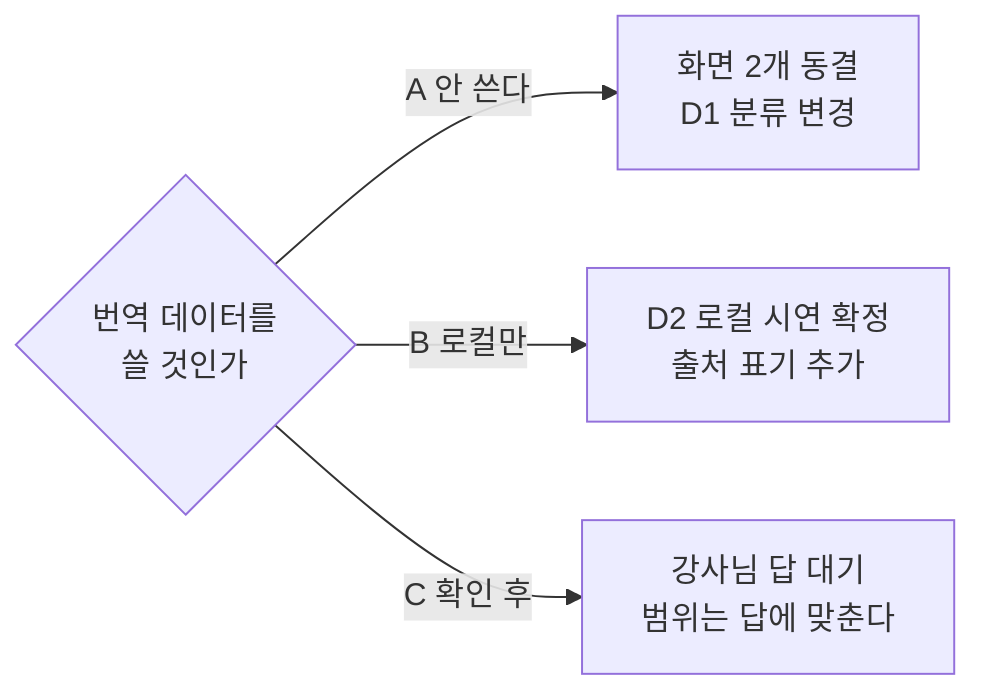

# #26 [확인 요청] 번역 데이터(AI 허브)를 2·3차에 쓸 것인가 — 이용정책 3개 조항 확인 필요

> 🗂️ 옛 GitHub 이슈를 옮긴 **기록 문서**입니다 — [색인](../README.md). 원문은 그대로 두고, 링크·커밋 해시만 새 자리 기준으로 바꿨습니다.

| 항목 | 내용 |
|---|---|
| 종류 | 이슈 |
| 상태 | 열림 |
| 원 작성 | 이동원(`devlee328288`) · 2026-09-17 16:01 KST |
| 옛 주소 | `github.com/devlee328288/Qurious/issues/26` (지금은 열리지 않음) |

## 본문

> **쉬운 요약 3줄**
> 1. 앱에 **다국어 번역 데이터(AI 허브 배포본)를 넣고 검색하는 기능**이 이미 들어 있습니다. 엔드포인트 2개(`/api/ingest/translation-data`, `/api/ingest/translation-search`)가 살아 있습니다.
> 2. AI 허브 이용정책 원문에 **출처 표기 의무 · 제3자 열람 금지 · 학습용 한정** 세 조항이 있습니다. 우리가 지금 하려는 사용이 그 안인지 **저는 판단할 수 없습니다.**
> 3. **데이터 파트 입장에서는 "쓰는 쪽"을 생각하고 있습니다** — 이 기능은 강사님 배포본에 원래 들어 있던 것이고, 수업용으로 그렇게 배포하셨다는 것 자체가 학습 목적 사용은 괜찮다는 뜻으로 읽히기 때문입니다. 다만 확인은 받고 싶어 올립니다. **어떤 형태로 쓸 것인지**(공개 범위·출처 표기)를 정해 주세요.

> 이 문서는 [A11 #25](../issues/025.md) 9절에서 갈라 나온 것입니다. 분석은 그쪽에 있고, 여기는 **결정이 필요한 한 가지**만 담습니다.

---

## 1. 한눈에 보기

| 항목 | 내용 | 확실도 |
|---|---|---|
| 코드가 있나 | 있다 — `app/services/translation_ingest.py` (272줄) + 라우트 2개 | 🟢 |
| 데이터가 저장소에 올라가 있나 | **아니다** — `.gitignore` 의 `data/1*/` 로 제외됨 | 🟢 |
| 지금 로컬에 원본이 있나 | 없다 — `data/` 에 `manifest.json` 하나뿐 | 🟢 |
| 어디에 저장되나 | Qdrant `translation_docs` — 채팅 RAG(`fin_chunks`)와 **분리돼 있다** | 🟢 |
| 검색이 무엇을 돌려주나 | 원문 `text` 와 번역 `translation` **전문 그대로** | 🟢 |
| 출처 표기가 있나 | **없다** — `readme.md` 에 언급 0건 | 🟢 |

확실도: **🟢 코드·원문으로 확인** / **🟡 추론**

---

## 2. 사실 — 이용정책 원문에서 걸리는 조항

[AI 허브 데이터 이용정책](https://www.aihub.or.kr/intrcn/guid/usagepolicy.do) (조회일 2026-09-17 KST) 원문 인용 🟢:

| # | 조항 (원문) | 우리 코드의 어느 부분과 닿나 |
|---|---|---|
| ① | "본 AI데이터 등을 이용할 때에는 **반드시 한국지능정보사회진흥원의 사업결과임을 밝혀야** 하며, 본 AI데이터 등을 이용한 2차적 저작물에도 동일하게 밝혀야 합니다." | `readme.md` · 발표자료에 출처 표기가 없다 |
| ② | "제공 받은 AI데이터 등을 … 승인을 받지 않은 다른 법인, 단체 또는 개인에게 **열람하게 하거나** 제공, 양도, 대여, 판매하여서는 안됩니다." | `POST /api/ingest/translation-search` 가 원문·번역을 그대로 반환한다 |
| ③ | "본 AI데이터는 **인공지능 학습모델의 학습용으로만** 사용할 수 있습니다." | 우리는 학습이 아니라 **검색(RAG)** 에 쓴다 |
| ④ | "AI 데이터셋의 **판매 등 상업적 이용**을 희망하는 경우 수행기관과 별도 협의가 필요합니다." | 학습용 프로젝트라 해당 없어 보이나 기록해 둔다 🟡 |
| ⑤ | 다운로드에 "신청자 본인 확인과 정보 제공, 목적을 밝히는 절차"가 필요 | 원본을 저장소에 올리지 않은 것은 이 조항과 맞는다 🟢 |

**②와 ③이 핵심입니다.** ②는 "누가 볼 수 있느냐"의 문제이고, ③은 "무엇에 쓰느냐"의 문제입니다. 둘은 별개라서 한쪽을 지켜도 다른 쪽이 남습니다.

---

## 3. 선택지

| 안 | 내용 | 얻는 것 | 잃는 것 |
|---|---|---|---|
| **A. 쓰지 않는다** | 인제스트·검색 코드를 2·3차 범위에서 뺀다 (지우지 않고 동결) | 조항을 볼 일이 없다. 화면 2개가 줄어 D1 [#7](../discussions/007.md)의 "동결 25"가 늘어난다 | 다국어 금융 문서라는 소재를 잃는다 |
| **B. 로컬 비공개로만 쓴다** | 팀 PC에서만 인제스트·검색, 시연은 화면 녹화나 정적 결과 페이지로 | ②의 "제3자 열람"을 피한다. D2 [#10](../discussions/010.md)의 "로컬 시연 + 정적 결과 페이지" 추천안과 그대로 맞는다 | ③("학습용으로만")은 여전히 확인이 필요하다 |
| **C. 강사님 확인 후 범위를 정해 쓴다** | 강사님께 ②③의 해석을 여쭙고, 답에 맞춰 공개 범위·출처 표기를 정한다 | 가장 확실하다 | 답을 받기 전까지 이 부분 설계가 멈춘다 |

**어느 안이든 공통으로 해야 할 것** (쓰기로 한다면):
- 출처 표기 문장을 `readme.md` 와 발표자료에 넣는다 (①은 해석의 여지가 적습니다 🟢)

---

## 4. 제 생각 — 데이터 파트로서는 "쓰는 쪽"을 보고 있습니다

먼저 제 입장을 밝히고 질문드리는 게 맞겠습니다.

**이 기능은 우리가 새로 붙인 게 아닙니다** 🟢. `app/services/translation_ingest.py` 는 초기 코드 등록 커밋(`4d0f979`, 강사님 `lumina-invest` 배포본을 그대로 옮긴 커밋)에 들어왔고, 그 뒤로 **우리가 한 줄도 고친 적이 없습니다**(`git log` 결과 커밋 1건). 폴더 구조(`Training`/`Validation` × `01.원천데이터`/`02.라벨링데이터`)와 파일명 규칙(`TL_4. 뉴스기사_3. 일본어.zip`)까지 AI 허브 배포본 그대로를 전제로 코드가 짜여 있습니다.

수업용으로 그렇게 배포하셨다는 것 자체가 **학습 목적 사용은 괜찮다는 판단이 이미 있었다는 뜻**으로 읽힙니다 🟡(제 추측입니다). 그래서 **데이터 파트 입장에서는 이 데이터를 쓰는 쪽(B안)을 생각하고 있습니다.** 다국어 금융 문서는 1차에 없던 소재라 2·3차에서 살릴 값어치가 있다고 봅니다.

다만 ①(출처 표기)은 해석의 여지가 거의 없어 **쓰기로 하면 바로 넣어야 하고**, ②③은 제가 판단할 자리가 아니어서 확인을 부탁드립니다.

### 여쭤보고 싶은 것

**강사님께**
1. 수업 산출물에서 AI 허브 데이터를 **RAG 검색 용도**로 쓰는 것이 ③("학습용으로만")에 들어갑니까?
2. 발표·시연에서 원문이 화면에 보이는 것이 ②("제3자 열람")에 걸립니까? 걸린다면 어느 선까지 괜찮습니까?

**팀원분들께**
3. 위 A · B · C 중 어느 쪽이 좋을까요? (저는 **B**를 기본으로 두고, 강사님 답이 오면 조정하는 쪽을 생각하고 있습니다 — 확정 아닙니다)

---

## 5. 이 결정이 바꾸는 것

- [D1 #7](../discussions/007.md) — 49개 화면의 주 경로·개념·동결 분류
- [D2 #10](../discussions/010.md) — 유료 서비스 범위와 데모 방식
- [A11 #25](../issues/025.md) — 인제스트 경로 분석 (9절)

---

## 6. 한계

| 한계 |
|---|
| **저는 법적 판단을 하지 않습니다.** 원문 인용과 코드 위치까지만 적었습니다. |
| 데이터 원본이 지금 로컬에 없어 `run_translation_ingest` 를 **끝까지 실행해 보지 못했습니다.** 라우트와 코드 경로만 확인했습니다. |
| AI 허브는 데이터셋마다 별도 정책이 붙는 경우가 있습니다. 이 문서는 **첫 번째 일반 정책**을 인용했고, 해당 번역 데이터셋 고유의 추가 조항은 확인하지 못했습니다. |

---

## 7. 기한

**2026-09-27(일) 23:59 KST** — 다른 논의 문서(D0·D1·D2·D4·D5·D6·D7)와 같은 날로 맞췄습니다. 2차 프로젝트 시작일 전날입니다.

의견이 없으면 **B(로컬 비공개)** 를 기본값으로 두고 진행하겠습니다. 반대나 다른 생각이 있으면 댓글로 남겨 주세요.
