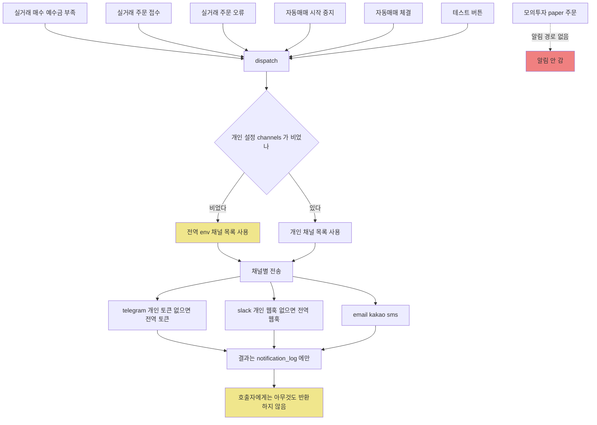
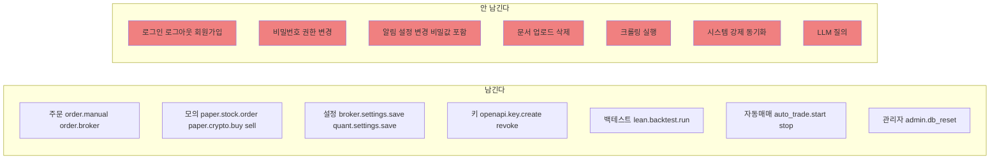

# #27 [분석] A12 알림·감사·시스템 — 알림을 끄면 팀 공용 채널로 나가고, 로그인 기록은 한 줄도 없습니다

> 🗂️ 옛 GitHub 이슈를 옮긴 **기록 문서**입니다 — [색인](../README.md). 원문은 그대로 두고, 링크·커밋 해시만 새 자리 기준으로 바꿨습니다.

| 항목 | 내용 |
|---|---|
| 종류 | 이슈 |
| 상태 | 열림 |
| 원 작성 | 이동원(`devlee328288`) · 2026-09-17 16:31 KST |
| 라벨 | `analysis` `security` |
| 댓글 | 1건 |
| 옛 주소 | `github.com/devlee328288/Qurious/issues/27` (지금은 열리지 않음) |

## 본문

> **쉬운 요약 3줄**
> 1. **알림을 끄면 오히려 더 나갑니다.** 사용자가 알림 채널을 전부 해제하면 코드가 "설정이 없는 것"으로 보고 **팀 공용 `.env` 채널로 대신 보냅니다.** 신규 사용자도 마찬가지라, 내 매매 내역이 팀 슬랙 채널에 뜰 수 있습니다.
> 2. **비밀값이 로그와 API 응답에 그대로 나옵니다.** 텔레그램 봇 토큰은 실패 로그에 **URL째로** 찍히고(실측), 슬랙 웹훅 URL은 `GET /api/notification/settings` 응답에 **마스킹 없이** 실립니다. 슬랙 공식 문서는 이 URL을 "secret"이라고 못박습니다.
> 3. **감사 로그에 로그인 기록이 한 줄도 없습니다.** 주문·설정 저장은 17종을 남기는데 **로그인·로그아웃·회원가입·알림설정 변경·문서 업로드는 0건**이고, 실패하면 `except: pass`로 조용히 사라지며, 관리자 DB 초기화가 **감사 로그 테이블 자체를 지웁니다.**

---

## 한눈에 보기

기준 커밋: Qurious [`04f476a`](https://github.com/EST-team-project/Qurious/commit/04f476a7558086d2c02d81b91325d52cd541d2fc) · 조사일 2026-09-17(KST)
확실도: 🟢 코드·원문으로 확인 / 🟡 추론

| # | 발견 | 어디 | 무슨 일이 생기나 | 확실도 |
|---|------|------|------------------|--------|
| **N1** | 개인 설정이 비면 **팀 공용 설정으로 폴백** | `notification.py:295` · `:46` · `:64` | 알림 끄기 → 전역 채널로 발송. 내 매매가 남의 채널에 | 🟢 실측 |
| **N2** | 봇 토큰·웹훅 URL이 **실패 로그에 평문** | `:57-58` · `:73-74` | `docker logs` 보는 사람 전원이 토큰 획득 | 🟢 실측 |
| **N3** | 슬랙 웹훅 URL이 **API 응답에 평문** | `routes/notification.py:87` | 마스킹 대상에서 빠짐. 슬랙은 secret 취급 요구 | 🟢 |
| **N4** | HTML 이스케이프 없음 → **`<`·`&` 그대로 전송** | `:500-505` · `stock.py:378` | "단기 이평 **<** 중기 이평" 사유가 들어가면 텔레그램 400 | 🟢 코드 / 🟡 실패 여부 |
| **N5** | 발송 **레이트리밋 없음** + 자동매매가 연속 발송 | `auto_trade.py:284` | 슬랙·텔레그램 **초당 1건** 한도 초과 → 429, 재시도 없음 | 🟢 |
| **N6** | 실패가 **사용자에게 안 보임** | `:349-350` | `dispatch()`는 아무것도 반환하지 않음. 화면은 늘 "전송했습니다" | 🟢 |
| **N7** | 카카오·SMS가 **현행 API 규격과 불일치** | `:132-176` · `:194-208` | `type:"FT"`는 없는 값, 인증 `date`가 ISO8601 아님, 80자 검사가 문자 기준 | 🟢 |
| **N8** | **모의투자(paper)에는 알림이 없다** | `routes/paper.py` | 2·3차 주력 경로가 알림 밖. 실거래·자동매매만 알림 | 🟢 |
| **U1** | 감사 로그에 **인증 이벤트 0건** | `routes/auth.py` | 누가 언제 로그인했는지 추적 불가 | 🟢 |
| **U2** | 감사 기록 실패가 **무음** | `audit.py:30-31` | DB가 죽어도 아무도 모름 | 🟢 |
| **U3** | 감사 로그에 **IP·UA·성공여부 없음** | `models/misc.py:14-21` | "어디서" 한 일인지 못 남김 | 🟢 |
| **U4** | 관리자 초기화가 **감사 로그를 지운다** | `routes/admin.py:16,30` | 흔적을 지우는 행위가 흔적을 지움 | 🟢 |
| **S1** | 시스템 상태가 **일반 사용자에게 열림** | `routes/system.py:11-13` | Redis URL·컨테이너 목록·디스크가 로그인만 하면 보임 | 🟢 |
| **S2** | `psutil`이 **requirements에 없음** | `Dockerfile:13-14` | 컨테이너에서 CPU는 항상 `null`, 메모리는 호스트 값 | 🟢 / 🟡 |
| **✅** | 헬스체크가 **추론을 호출하지 않음** | `system_info.py:96-97` | 상태 확인만으로 과금되지 않음 — 잘 된 설계 | 🟢 |

---

## 용어 풀이

### 같은 말이 여러 뜻인 것부터

| 이 문서의 말 | 가리키는 것 | 헷갈리기 쉬운 것 |
|---|---|---|
| **알림(notification)** | 매매 사건을 **밖으로** 보내는 것 (텔레그램·슬랙·메일·카카오·SMS) | 화면 안 토스트 메시지가 아닙니다 |
| **감사 로그(audit)** | `audit_events` 테이블에 쌓이는 **행위 기록** | 서버 콘솔 로그(`logger.warning`)와 다른 것입니다. 이 문서는 둘 다 다루되 항상 구분해 씁니다 |
| **알림 이력(notification_log)** | "무엇을 어느 채널로 보내려 했나" 기록 | 감사 로그와 별개 테이블입니다 |
| **전역 설정 / 개인 설정** | `.env`(서버 전체) / `notification_settings` 테이블(사용자별) | 이 둘이 **필드 단위로 섞이는 것**이 N1입니다 |

### 알림 채널

| 용어 | 정확한 뜻 | 이 문서에서 가리키는 것 | 헷갈리기 쉬운 점 |
|---|---|---|---|
| **봇 토큰(Bot token)** | 텔레그램 봇의 신분증. `123456:AAH...` 형태 | `TELEGRAM_BOT_TOKEN` | **URL 경로에 들어갑니다**(`api.telegram.org/bot<토큰>/sendMessage`). 그래서 URL이 찍히면 토큰이 찍힙니다 |
| **Incoming Webhook** | 슬랙이 발급하는 "이 URL로 POST하면 이 채널에 글이 올라간다"는 주소 | `SLACK_WEBHOOK_URL` | **URL 자체가 비밀번호**입니다. 아는 사람은 누구나 그 채널에 글을 쓸 수 있습니다 |
| **parse_mode=HTML** | 텔레그램이 메시지를 HTML 태그로 해석하는 모드 | `send_telegram`이 쓰는 모드 | 이 모드에서는 태그가 아닌 `<`·`>`·`&`를 **반드시 치환**해야 하고, 안 하면 메시지가 **통째로 거부**됩니다 |
| **알림톡(ATA) / 친구톡(CTA)** | 알림톡 = 채널 미추가자에게도 가는 **정보성** 메시지(카카오 검수 필요) / 친구톡 = 채널 추가자 대상 **광고 가능** 메시지 | 코드 주석은 "알림톡"인데 실제 값은 `"FT"` | 알림톡은 **템플릿을 미리 등록·승인**받아야 하므로, 매매 문구를 자유롭게 보낼 수 없습니다 |
| **발신번호 사전등록제** | 인터넷 발송 문자는 **미리 등록·인증한 번호**로만 보낼 수 있게 한 제도 | SMS 채널을 쓰려면 통과해야 하는 관문 | 2015-10-16 시행, 전기통신사업법 제84조의2 근거. "API 키만 있으면 보낼 수 있다"가 아닙니다 |
| **레이트리밋(rate limit)** | 단위 시간당 허용 호출 수 | 슬랙 웹훅 초당 1건, 텔레그램 채팅당 초당 1건 | 초과하면 429가 오고, **우리 코드는 429를 그냥 실패로 처리하고 버립니다** |
| **HMAC-SHA256 인증** | 비밀키로 "날짜+난수"에 서명해 보내는 방식 | CoolSMS/SOLAPI 인증 헤더 | 서명값이 맞아도 **날짜 형식이 규격과 다르면** 서버가 거부할 수 있습니다 |

### 감사·시스템

| 용어 | 정확한 뜻 | 이 문서에서 가리키는 것 | 헷갈리기 쉬운 점 |
|---|---|---|---|
| **감사 추적(audit trail)** | "누가·언제·무엇을·결과가 어땠나"를 사후에 재구성할 수 있는 기록 | `audit_events` 테이블 | 네 가지 중 하나라도 빠지면 추적이 끊깁니다. 현재는 **결과**와 **어디서(IP)**가 빠져 있습니다 |
| **`except: pass`** | 예외가 나도 아무 일 없던 것처럼 넘어가는 코드 | `audit.py:30-31`, `_log_dispatch` | "안전하게 만든 것"처럼 보이지만, **실패를 영원히 감춥니다** |
| **fire-and-forget** | 결과를 기다리지 않고 던져두는 호출 | `asyncio.create_task(audit(...))` | 앱이 그 직후 종료되면 기록이 **사라질 수 있습니다** |
| **cgroup** | 컨테이너에 할당된 자원 한도 | 컨테이너 메모리 표시가 틀리는 이유 | `/proc/meminfo`는 **호스트 전체**를 보여줍니다 |

---

## 1. 알림 — 무엇이, 언제, 누구에게 가는가

### 1.1 전체 흐름



### 1.2 알림을 만드는 사건은 6가지뿐

| 사건 | 함수 | 호출처 | 2·3차 관련성 |
|---|---|---|---|
| 예수금 부족 | `notify_insufficient_funds` | [`stocks.py:614`](https://github.com/EST-team-project/Qurious/blob/04f476a/app/routes/stocks.py#L614) | 실거래 전용 |
| 주문 접수 | `notify_order_placed` | [`stocks.py:631`](https://github.com/EST-team-project/Qurious/blob/04f476a/app/routes/stocks.py#L631) · [`auto_trade.py:166`](https://github.com/EST-team-project/Qurious/blob/04f476a/app/services/auto_trade.py#L166) | 실거래 + 자동매매 |
| 주문 오류 | `notify_order_error` | [`stocks.py:644`](https://github.com/EST-team-project/Qurious/blob/04f476a/app/routes/stocks.py#L644) · `auto_trade.py:172` | 〃 |
| 자동매매 시작 | `notify_auto_trade_started` | [`auto_trade.py:378`](https://github.com/EST-team-project/Qurious/blob/04f476a/app/services/auto_trade.py#L378) | 〃 |
| 자동매매 중지 | `notify_auto_trade_stopped` | `auto_trade.py:387` | 〃 |
| 자동매매 체결 | `notify_auto_trade_executed` | [`auto_trade.py:284`](https://github.com/EST-team-project/Qurious/blob/04f476a/app/services/auto_trade.py#L284) · `:313` | 〃 |

**알림이 없는 곳** (🟢 `grep`으로 확인, 호출 0건):

- `routes/paper.py` — 모의투자 주식·코인·대체자산 주문 **전부**
- `routes/auth.py` — 로그인·로그아웃
- 자동매매 **사이클 실패**·데이터 동기화 실패·LLM/Qdrant 다운·디스크 부족
- **손실 임계치 초과** (D5 [#18](../discussions/018.md) ⑧에서 논의 중인 MDD −20% 같은 기준을 감시할 자리가 지금은 없습니다)

> **D7 [#13](../discussions/013.md)과 직접 연결**: D7 추천안은 "가상 체결을 정본으로" 잡고 있는데, 그 가상 체결 경로(`paper.py`)에는 알림이 **한 줄도 없습니다.** 2차에서 "모의투자 체결 알림"을 보여주려면 알림 호출을 paper 경로에 새로 붙여야 합니다. (지금은 자동매매만 알림을 냅니다.)

### 1.3 N1 — 알림을 끄면 오히려 더 나간다 🟢 실측

문제의 한 줄:

```python
# app/services/notification.py:295
channels: list[str] = user_cfg.get("channels") or _default_channels()
```

파이썬에서 **빈 리스트 `[]`는 거짓**입니다. 그래서 "채널을 하나도 안 켠 사용자"와 "설정을 만든 적 없는 사용자"가 똑같이 취급되고, 둘 다 **`.env` 전역 채널**로 넘어갑니다.

채널별 토큰에도 같은 폴백이 있습니다.

```python
# :46-47   텔레그램
tok = token or settings.TELEGRAM_BOT_TOKEN
cid = chat_id or settings.TELEGRAM_CHAT_ID
# :64      슬랙
url = webhook_url or settings.SLACK_WEBHOOK_URL
```

**실측** — 전역에 팀 공용 봇/웹훅이 있고 사용자가 각 상태일 때, 실제로 어디로 나가는지 (`dispatch()`를 그대로 호출하고 전송 함수만 가로챔):

| 사용자 상태 | 기대 | **실제 발송** |
|---|---|---|
| ① 채널을 전부 해제 (`channels=[]`) | 아무것도 안 감 | **텔레그램(본인 봇) + 슬랙(팀 공용 웹훅)** ← 2건 |
| ② 채널만 켜고 토큰은 비움 | 발송 실패 또는 건너뜀 | **텔레그램(팀 공용 봇 `TEAM-BOT-TOKEN`, 팀 공용 채팅)** |
| ③ 채널·토큰 모두 본인 값 | 본인에게 | 본인에게 ✅ |
| ④ 설정 행이 없는 신규 사용자 | 아무것도 안 감 | **텔레그램 + 슬랙 모두 팀 공용** |

즉 **①과 ④에서 개인의 매매 내역이 팀 공용 채널로 흘러갑니다.** 팀 프로젝트에서 `.env` 하나를 공유해 쓰면(지금 D2 [#10](../discussions/010.md) 추천안이 "팀 추가 지출 0원 · 로컬 시연"이므로 가능성이 높습니다) 네 사람의 매매가 한 채널에 섞입니다.

**반례를 찾아봤습니다**: `_load_user_settings`가 예외를 삼키고 `{}`를 반환하는 경로([`:260-261`](https://github.com/EST-team-project/Qurious/blob/04f476a/app/services/notification.py#L260-L261))도 같은 결과를 냅니다 — **DB가 잠깐 죽어도 전역 채널로 발송**됩니다. 폴백을 "안전장치"로 본다면 의도된 설계로 읽을 수도 있지만, **끄기를 끄기로 처리하지 않는 것**은 어느 쪽으로도 변호하기 어렵습니다.

### 1.4 N2 — 봇 토큰과 웹훅 URL이 로그에 평문으로 남는다 🟢 실측

```python
# :52-58
r = await cli.post(url, json={...})
r.raise_for_status()
...
except Exception as exc:
    logger.warning("텔레그램 알림 실패: %s", exc)
```

httpx의 `raise_for_status()`가 만드는 예외 메시지에는 **요청 URL 전체**가 들어갑니다. 텔레그램은 토큰을 URL 경로에 넣으므로, 실패 한 번이면 토큰이 로그에 박힙니다.

**실측** (네트워크 없이 `MockTransport`로 401을 만들고 프로젝트 함수를 그대로 호출):

```
텔레그램 알림 실패: Client error '401 Unauthorized' for url
  'https://api.telegram.org/bot123456789:AAH-FAKE-BOT-TOKEN-DO-NOT-USE-xyz/sendMessage'
Slack 알림 실패: Client error '401 Unauthorized' for url
  'https://hooks.slack.com/services/T0FAKE/B0FAKE/SECRETPART1234'
```

이 줄은 **로깅 설정을 하지 않아도 출력됩니다.** 프로젝트 전체에 `logging.basicConfig`·`dictConfig`가 **0건**이라(🟢 `grep`), 파이썬의 최후 핸들러(`lastResort`)가 WARNING 이상을 stderr로 내보냅니다 — 즉 `docker logs`에 그대로 남습니다.

슬랙 공식 문서는 이렇게 씁니다:

> *"Your webhook URL contains a secret. Don't share it online, including via public version control repositories. Slack actively searches out and revokes leaked secrets."*

### 1.5 N3 — 슬랙 웹훅 URL은 API 응답에서도 마스킹되지 않는다 🟢

`GET /api/notification/settings`는 비밀값을 `****`로 가립니다. 그런데 **가리는 목록에 웹훅 URL이 없습니다.**

| 필드 | 마스킹 | 판단 |
|---|---|---|
| `telegram_token` | ✅ `****` | 맞음 |
| `email_password` | ✅ | 맞음 |
| `kakao_api_key` / `kakao_api_secret` | ✅ | 맞음 |
| `sms_api_key` / `sms_api_secret` | ✅ | 맞음 |
| **`slack_webhook_url`** | ❌ **평문** | [`routes/notification.py:87`](https://github.com/EST-team-project/Qurious/blob/04f476a/app/routes/notification.py#L87) — 슬랙 기준으로 이것도 비밀값 |
| `telegram_chat_id` | ❌ 평문 | 비밀은 아니나 수신자 식별자 |
| `kakao_phone` / `sms_to` | ❌ 평문 | **개인 전화번호**입니다 |

저장 쪽([`:129`](https://github.com/EST-team-project/Qurious/blob/04f476a/app/routes/notification.py#L129))도 웹훅 URL에는 `keep_secret`을 쓰지 않으므로, 화면에서 값을 비우고 저장하면 **웹훅이 지워집니다**. 마스킹된 다른 필드는 `"****"`를 보내면 기존 값이 유지되는데(`keep_secret`), 웹훅만 규칙이 다릅니다 — 화면 동작이 필드마다 달라지는 셈입니다.

### 1.6 N4 — `<`·`&`를 이스케이프하지 않는다 🟢 코드 / 🟡 실패 여부

텔레그램 Bot API 원문:

> *"All `<`, `>` and `&` symbols that are not a part of a tag or an HTML entity must be replaced with the corresponding HTML entities (`<` with `&lt;`, `>` with `&gt;` and `&` with `&amp;`)."*

그런데 **우리 신호 엔진이 만드는 사유 문자열에 부등호가 들어 있습니다.**

```python
# app/services/stock.py:375, 378
signals.append("단기 이평 > 중기 이평 (매수 우위)")
signals.append("단기 이평 < 중기 이평 (매도 우위)")
```

그리고 자동매매는 이 사유를 그대로 알림 본문에 넣습니다([`auto_trade.py:284-292`](https://github.com/EST-team-project/Qurious/blob/04f476a/app/services/auto_trade.py#L284-L292) → [`notification.py:500-505`](https://github.com/EST-team-project/Qurious/blob/04f476a/app/services/notification.py#L500-L505)).

**"매도 우위 사유가 붙은 매수 체결"이 가능한가?** — 가능합니다. 점수 합산 방식이라:

| 조건 | 사유 문자열 | 점수 |
|---|---|---|
| RSI < 30 | `RSI 과매도 (매수 신호)` | **+2** |
| 단기 이평 < 중기 이평 | `단기 이평 < 중기 이평 (매도 우위)` | **−1** |
| 합계 | | **+1 → `매수`** ([`stock.py:392`](https://github.com/EST-team-project/Qurious/blob/04f476a/app/services/stock.py#L392)) |

→ 매수 체결 → 알림 발송 → 본문에 `<` 포함.

**실측** — 프로젝트 함수를 그대로 불러 실제 전송 직전의 HTML을 캡처했습니다:

```
📈 <b>[자동매매] 매수 체결</b>

종목: TIGER 미국S&P500 (<code>005930</code>)
수량: 3주 × 19,800원
사유: RSI 과매도 (매수 신호) | 단기 이평 < 중기 이평 (매도 우위)
```

`&`(종목명)와 `<`(사유) 둘 다 날것으로 들어갑니다. 국내 상장 ETF 이름에 `&`는 흔합니다(예: `TIGER 미국S&P500`).

> **한계 — 제가 처음에 예상했다가 틀린 것**: 저는 "이메일에서는 `<` 뒤가 태그로 먹혀 글자가 사라질 것"이라고 예상하고 파이썬 `html.parser`로 확인했는데, **관대한 파서는 `< 중기`를 그냥 텍스트로 남깁니다**(태그로 인식된 건 `<b>`·`<code>` 둘뿐). 즉 "글자가 사라진다"는 제 예상은 파서에 따라 다릅니다. 확실한 것은 **텔레그램 규격이 치환을 요구한다**는 점이고, 실제 400 반환 여부는 봇 토큰이 없어 **실호출로 검증하지 못했습니다**(🟡).

### 1.7 N5 — 발송 속도 제한이 없다 🟢

| 채널 | 공식 한도 | 우리 코드 |
|---|---|---|
| 슬랙 Incoming Webhook | **초당 1건** (짧은 버스트만 허용) | 제한 없음 |
| 텔레그램 (같은 채팅) | **초당 1건 초과 금지**, 초과 시 429 | 제한 없음 |
| 텔레그램 (그룹) | **분당 20건** | 제한 없음 |
| 텔레그램 (벌크) | 초당 약 30건 | — |

자동매매는 종목 루프 안에서 체결마다 **곧바로** 알림을 보냅니다([`auto_trade.py:257`](https://github.com/EST-team-project/Qurious/blob/04f476a/app/services/auto_trade.py#L257) 루프 → `:284`). 한 사이클에 5종목이 체결되면 1초 안에 5건이 나갑니다. 슬랙은 429 + `Retry-After` 헤더로 답하는데, 우리 코드는 **`Retry-After`를 읽지도, 재시도하지도 않고** `logger.warning` 후 `False`를 반환합니다.

그리고 그 `False`는 **아무도 보지 않습니다** — `dispatch()`는 반환값이 `None`입니다([`:280-350`](https://github.com/EST-team-project/Qurious/blob/04f476a/app/services/notification.py#L280-L350)). `POST /api/notification/test`는 결과와 무관하게 항상 이렇게 답합니다:

```python
# routes/notification.py:169
return {"ok": True, "message": "테스트 알림을 전송했습니다."}
```

**"테스트 발송 성공"이라고 떠도 아무 데도 안 갔을 수 있습니다.** 실패 흔적은 `notification_log.channels`의 `{"channel": "telegram", "ok": false}`에만 남고, 그 테이블 기록조차 실패하면 `except: pass`입니다([`:385-386`](https://github.com/EST-team-project/Qurious/blob/04f476a/app/services/notification.py#L385-L386)).

또한 `POST /api/notification/test`에는 **호출 횟수 제한이 없습니다.** 프로젝트 전체에 레이트리밋 미들웨어가 0건(🟢 `grep`)이라, 로그인한 사용자가 버튼을 연타하면 그대로 외부로 나갑니다(SMS는 건당 과금).

### 1.8 N6 — 카카오·SMS는 지금 코드로는 거의 확실히 안 나간다 🟢 규격 대조

공식 파이썬 SDK([`solapi/solapi-python`](https://github.com/solapi/solapi-python) `main`)와 우리 코드를 나란히 놓으면:

| 항목 | 공식 SDK | 우리 코드 ([`:132-176`](https://github.com/EST-team-project/Qurious/blob/04f476a/app/services/notification.py#L132-L176)) | 판정 |
|---|---|---|---|
| 인증 `date` | `datetime.isoformat()` → `2026-09-17T16:16:38+09:00` | `time.strftime("%Y-%m-%d %H:%M:%S", gmtime())` → `2026-09-17 07:16:38` | ❌ **ISO8601 아님** |
| `salt` | `uuid1().hex` (난수) | `str(time.time())` → `1789629398.63089` | ⚠️ 예측 가능 |
| 헤더 키 | `ApiKey=`, `Date=` | `apiKey=`, `date=` | ⚠️ 대소문자 다름 |
| 카카오 메시지 타입 | `ATA`(알림톡) · `CTA`(친구톡) · `CTI` | **`"FT"`** | ❌ **목록에 없는 값** |
| 카카오 옵션 | `kakaoOptions.pfId` + `templateId` + `variables` | 없음. `message.from`에 발신프로필 키를 넣음 | ❌ `from`은 **발신 전화번호** 자리 |

거기에 제도 요건이 더 있습니다.

- **SMS**: 인터넷 문자는 **사전 등록·인증된 발신번호**로만 발송됩니다(2015-10-16 시행, 전기통신사업법 제84조의2 근거). 본인인증 또는 통신서비스 이용증명원 제출이 필요하고, 2026-09-09부터 신규 등록 번호는 24개월 유효, 계정당 최대 5개입니다. → **개인 번호로 등록하면 쓸 수는 있으나 유료이고 절차가 있습니다.**
- **카카오 알림톡**: 카카오톡 채널 개설 → 연동 → **템플릿 등록 → 카카오 검수 승인**을 거친 템플릿만 발송 가능합니다(영업일 1~3일). 즉 **매매 문구를 자유롭게 보내는 용도로는 구조적으로 쓸 수 없습니다.** 승인된 템플릿의 `#{변수}` 자리만 바꿔 넣는 방식입니다.

그리고 80자 검사도 한국어에서 헛돕니다:

```python
# :194-195, :208
if len(message) > 80:            # ← 문자 수 기준
    logger.warning("SMS 메시지가 80자를 초과하여 잘립니다 ...")
"text": message[:80],
```

**실측**: 실제 자동매매 알림 문구(74자)는 EUC-KR로 **108바이트**입니다. 문자 수로는 80을 안 넘으니 경고도, 절단도 일어나지 않습니다. 국내 SMS는 바이트 기준(90바이트)이라 **90바이트를 넘으면 LMS로 전환되거나 거부**됩니다 — 검사 단위가 애초에 잘못 잡혀 있습니다.

---

## 2. 감사 로그 — 무엇을 남기고 무엇을 빠뜨리나

### 2.1 남기는 것: 17종



**인증 이벤트가 0건인 것이 가장 큽니다.** A3 [#22](../issues/022.md)에서 확인한 "로그아웃 한 번이 전 사용자의 JWT를 끊는" 문제가 실제로 일어나도, **누가 언제 로그아웃했는지 감사 로그로는 알 수 없습니다.**

### 2.2 기록의 네 요소 중 둘이 빠져 있다

| 요소 | 현재 | 근거 |
|---|---|---|
| **누가** | `user_id` ✅ (단 `client_id`는 대부분 빈 문자열) | [`models/misc.py:19`](https://github.com/EST-team-project/Qurious/blob/04f476a/app/models/misc.py#L19) |
| **언제** | `created_at` ✅ | `CreatedAtMixin` |
| **무엇을** | `event_type` + `payload` ✅ | `:20-21` |
| **결과** | ❌ 대부분 **성공했을 때만** 기록. 실패는 `order.broker.error` 하나뿐 | `stocks.py:638` vs `:652` |
| **어디서** | ❌ **IP·User-Agent 없음** | 컬럼 자체가 없음 |

잘 된 부분도 있습니다: `broker.settings.save`의 payload는 `{"broker":..., "paper":...}`만 남기고 **API 키를 넣지 않습니다**([`stocks.py:399`](https://github.com/EST-team-project/Qurious/blob/04f476a/app/routes/stocks.py#L399)). `openapi.key.create`도 `key_prefix`만 남깁니다. 이건 의식적으로 잘 만든 부분입니다.

### 2.3 실패가 무음이다

```python
# app/services/audit.py:19-31
async def audit(user_id, client_id, event_type, payload) -> None:
    try:
        ...
        await db.commit()
    except Exception:
        pass  # 감사 로그 실패는 무시
```

감사를 **별도 세션**으로 분리한 것 자체는 맞는 설계입니다(주 트랜잭션이 롤백돼도 기록이 남아야 하니까). 문제는 `pass`입니다 — DB 연결이 끊겨 감사가 통째로 안 쌓여도 **아무 신호가 없습니다.** 최소한 `logger.warning` 한 줄은 있어야 합니다.

자동매매는 한 술 더 뜹니다:

```python
# auto_trade.py:379
asyncio.create_task(audit(_auto_trade_user_id, "", "auto_trade.start", {}))
```

`await` 없이 던지므로, 그 직후 프로세스가 내려가면 기록이 **남지 않을 수 있습니다**(🟡 — 타이밍 의존).

### 2.4 관리자 초기화가 감사 로그를 지운다

```python
# routes/admin.py:16
USER_MODELS = [Chat, Portfolio, Order, BrokerSettings, CrawledDoc, AuditEvent]
#                                                                  ^^^^^^^^^^
# :30-35
for model in FINANCIAL_MODELS + USER_MODELS:
    await db.execute(delete(model))
await db.commit()
await audit(user["id"], "", "admin.db_reset", {...})   # ← 지운 뒤에 1줄 기록
```

전체 감사 이력을 **삭제하고 나서** "초기화했다" 한 줄을 남깁니다. 감사 추적의 기본(기록은 지워지지 않아야 한다)과 정면으로 어긋납니다. 2·3차에 "매매 일지를 축적한다"(D7 [#13](../discussions/013.md) ⑤ 매 거래일 1행)는 목표를 잡는다면, **초기화 버튼 하나로 축적분이 사라지는 구조**를 먼저 손봐야 합니다.

### 2.5 조회 필터가 조용히 전부 거른다

```python
# routes/admin.py:66
stmt = stmt.where(AuditEvent.user_id == _resolve_user_id(user_id))
```

`_resolve_user_id`는 UUID 형식이 아니면 **`None`을 반환**합니다([`audit.py:8-16`](https://github.com/EST-team-project/Qurious/blob/04f476a/app/services/audit.py#L8-L16)). SQL에서 `= NULL`은 **아무 행에도 매치되지 않습니다.** 관리자가 사용자 ID를 오타내면 오류 없이 "0건"이 나오고, "이 사용자는 활동이 없다"로 오독됩니다.

### 2.6 주문 감사에 비용이 들어갔습니다 — `cost_basis` 를 왜 남기나 ([#43](../pulls/043.md) · 2026-09-20)

`order.manual` 감사 payload 에 세 칸이 늘었습니다:

```python
# routes/stocks.py — 이전에는 symbol · order_type · quantity · price · broker 다섯 칸
await audit(user["id"], "", "order.manual", {
    ..., "net_amount": cost.net_amount,      # 실제로 움직인 현금
         "total_cost": cost.total_cost,      # 뗀 비용 합계
         "cost_basis": cost.cost_basis,      # 그 비용이 어디서 온 값인가
})
```

**`cost_basis` 가 감사 로그에 필요한 이유는 표와 로그가 서로 다른 것을 기록하기 때문입니다.**

| | 무엇을 담나 | 나중에 바뀌나 |
|---|---|---|
| `orders` 행 | **현재 상태** | 🟢 바뀐다 — 증권사 체결을 받아 오면 `estimated` → `broker` 로 덮인다 |
| 감사 로그 | **그 시점의 사실** | ❌ 바뀌지 않는다 (바뀌면 감사가 아니다) |

`orders.cost_basis` 만 있으면 "이 주문은 실제 비용으로 기록돼 있다" 는 것은 알아도 **"주문 당시에는 추정이었다"** 는 것은 알 수 없습니다. 나중에 계산이 실제와 어긋난 것이 발견됐을 때, 어느 시점 값으로 판단했는지 되짚을 근거가 감사 로그에 있어야 합니다.

🟡 아직 안 된 것: **자동매매(`auto_trade.py`)와 모의투자(`paper_trading.py`) 경로의 감사 payload 에는 비용이 들어가지 않았습니다.** 두 경로 모두 반환값(`cost`)에는 비용을 싣지만, 감사 기록은 예전 칸 그대로입니다. 자동매매가 사람 손을 거치지 않는 경로라는 점에서 **오히려 여기가 더 필요합니다** — 후속 과제입니다.

이 절은 U1~U4(인증 이벤트 0건 · 무음 실패 · IP·UA·성공여부 없음 · 초기화가 감사를 지움)를 **해결하지 않습니다.** 네 가지는 그대로입니다.

---

## 3. 시스템 상태 — 무엇을 보고하나

### 3.1 로그인만 하면 인프라가 보인다

```python
# routes/system.py:11-13
@router.get("/status")
async def system_status(user=Depends(get_current_user)):   # ← 관리자 검사 없음
    return await get_system_status()
```

`/api/admin/*`는 `_require_admin`으로 `roles`에 `admin`이 있는지 확인하는데([`admin.py:19-22`](https://github.com/EST-team-project/Qurious/blob/04f476a/app/routes/admin.py#L19-L22)), `/api/system/*`는 **로그인한 아무 사용자**에게 열려 있습니다. 응답에 들어가는 것:

| 항목 | 내용 | 위험 |
|---|---|---|
| `services[].url` | `REDIS_URL`·`QDRANT_URL`·`OLLAMA_BASE_URL` **원문** | Redis에 비밀번호를 붙인 구성(`redis://:pw@host`)이면 **비밀번호가 그대로** 노출 |
| `containers[]` | `docker ps` 결과 — 컨테이너 이름·이미지·포트 매핑 | 내부 구성도를 그대로 넘겨줌 |
| `disk`·`host` | 디스크/메모리 사용률 | 낮음 |
| `llm_provider.target` | `VLLM_BASE_URL` | A10 [#24](../issues/024.md)에서 논의한 HF 라우터 전환 시 엔드포인트 노출 |

현재 기본값에는 비밀번호가 없어 **지금 당장 새는 값은 없습니다**(🟢 실측: `REDIS_URL = 'redis://localhost:6379'`). "설정을 그대로 응답에 싣는 구조" 자체가 위험이라는 뜻입니다.

### 3.2 컨테이너에서는 CPU를 못 읽는다

```python
# system_info.py:42-51
try:
    import psutil
    ...
except ImportError:
    # psutil 미설치 시 /proc 직접 읽기
```

그런데 **`psutil`이 `requirements.txt`에 없습니다**(🟢 확인). Dockerfile은 `requirements.txt`만 설치하므로([`Dockerfile:13-14`](https://github.com/EST-team-project/Qurious/blob/04f476a/Dockerfile#L13-L14)), 컨테이너에서는 항상 폴백 경로를 탑니다.

**실측** (psutil import를 막아 컨테이너와 같은 상태를 재현):

| 환경 | `cpu_pct` | `mem_*` |
|---|---|---|
| 로컬 Windows (psutil 있음) | `11.9` | `33.9 / 28.8 GB (84.9%)` |
| psutil 없음 (= 컨테이너) | **`None`** | Windows에선 전부 `None`, 리눅스에선 `/proc/meminfo` 값 |

리눅스 컨테이너에서는 `/proc/meminfo`가 **호스트 전체**를 보여주므로, 컨테이너 메모리 한도와 무관한 숫자가 대시보드에 뜹니다(🟡 — Docker가 없어 실측 불가). `_disk_usage("/")`도 경로가 `"/"`로 고정이라 데이터 볼륨이 따로 붙어 있으면 엉뚱한 디스크를 봅니다.

### 3.3 잘 된 것 ✅

```python
# system_info.py:95-97
"""현재 설정된 LLM_PROVIDER의 연결 상태. 실제 추론 호출은 하지 않고(과금 방지)
가벼운 read-only API로만 확인한다."""
```

상태 확인이 `/api/tags`·`/v1/models` 같은 **읽기 전용** 엔드포인트만 부릅니다. D2 [#10](../discussions/010.md)에서 유료 추론(HF PRO 월 $2 크레딧) 연결을 검토 중인데, **대시보드를 열어둔 것만으로 과금되지는 않습니다.** 이 주석은 의도를 남긴 좋은 예이고, 강사님 피드백 ⑤(주석·개념 기록)에 해당하는 사례로 그대로 쓸 수 있습니다.

`POST /api/system/sync`는 A4 [#23](../issues/023.md)에서 지적한 대로 **횟수 제한이 없습니다**([`system.py:38-42`](https://github.com/EST-team-project/Qurious/blob/04f476a/app/routes/system.py#L38-L42)). 이번 조사로 확인한 것은 **프로젝트 전체에 레이트리밋 장치가 하나도 없다**는 점입니다 — `/sync`만의 문제가 아닙니다.

---

## 4. 2·3차에 무엇을 정해야 하나 (D3로 넘길 안건)

**결론이 아니라 선택지입니다.** D3(아직 만들지 않은 논의 문서)에서 팀이 정할 항목으로 올립니다.

| 안건 | 선택지 | 제 의견(미확정) |
|---|---|---|
| **채널 범위** | (a) 5채널 유지 (b) **텔레그램만** 남기고 나머지 동결 (c) 전부 빼고 화면 내 알림만 | **(b)** — 카카오·SMS는 규격 불일치 + 사업자/발신번호 요건 + 유료. 이메일은 SMTP 앱 비밀번호가 필요해 시연 난이도만 올립니다 |
| **전역 폴백** | (a) 유지 (b) **폴백 제거**(개인 설정만) (c) 폴백은 두되 채널 목록만 개인 우선 | **(b)** — 끄기가 끄기로 동작해야 합니다 |
| **비밀값 취급** | (a) 현행 (b) 웹훅도 마스킹 + 로그에서 URL 제거 | **(b)** — 한 줄 수정으로 끝납니다 |
| **모의투자 알림** | (a) 없음 유지 (b) **paper 체결에도 알림** | D7 결론에 따라 — "가상 체결이 정본"이면 (b) |
| **감사 범위** | (a) 현행 17종 (b) **+ 인증 이벤트** (c) + 인증 + 설정변경 + 업로드 | **(b) 최소**, 여력 되면 (c) |
| **감사 보존** | (a) 현행(초기화 시 삭제) (b) **초기화 대상에서 제외** | **(b)** — D7 ⑤ 매 거래일 1행 축적과 직결 |
| **시스템 상태 노출** | (a) 현행(전체 사용자) (b) **관리자 전용** (c) 공개하되 URL은 호스트만 | **(b)** |

---

## 5. 판정을 뒤집을 조건

| 판정 | 뒤집히는 조건 |
|---|---|
| N1 "알림 끄기가 전역 발송이 된다" | `.env`에 알림 설정을 **아무것도 넣지 않기로** 팀이 확정하면 실질 위험은 사라집니다(코드는 그대로여도 폴백 대상이 없음) |
| N2 "토큰이 로그에 남는다" | 로깅 설정을 추가해 `app.services.notification` 로거를 끄거나, 예외를 `type(exc).__name__`만 찍도록 바꾸면 해소 |
| N4 "텔레그램이 거부한다" | 실제 봇으로 `단기 이평 < 중기 이평`을 보내 **200이 오면 제 추정이 틀린 것**입니다. 텔레그램 파서가 `<` + 공백을 관대하게 처리할 가능성이 남아 있습니다 |
| N6 "카카오·SMS는 못 쓴다" | 팀원 중 사업자등록이 있고 카카오 채널·템플릿 승인을 받을 수 있다면 알림톡은 가능합니다(단 자유 문구는 여전히 불가) |
| S2 "컨테이너에서 CPU가 안 보인다" | `requirements.txt`에 `psutil`을 추가하면 해소 |
| U4 "초기화가 감사를 지운다" | `USER_MODELS`에서 `AuditEvent`를 빼면 해소 |

---

## 6. 한계 — 확인하지 못한 것

1. **실호출 검증 없음.** 텔레그램 봇 토큰·슬랙 워크스페이스·SOLAPI 계정이 없어, N4(400 여부)와 N6(인증 실패 여부)은 **규격 대조까지만** 했습니다. 둘 다 🟡입니다.
2. **`docs.solapi.com` 접속 실패.** API 레퍼런스 원문 대신 **공식 파이썬 SDK 소스**(`solapi/solapi-python`)를 근거로 삼았습니다. SDK가 곧 규격의 구현이므로 신뢰도는 높지만, 서버가 구형 형식을 함께 받아줄 가능성은 배제하지 못합니다.
3. **법령 원문 조문 미확보.** `law.go.kr` DRF로 전기통신사업법 XML(517KB)을 받았지만 제84조의2 **본문 텍스트를 추출하지 못했습니다**(CDATA 구조). 조문 번호와 제도 내용은 SOLAPI 가이드의 인용으로 확인했습니다.
4. **제 예상이 빗나간 것**: 1.6에 적은 대로, "`<` 때문에 이메일 본문 글자가 사라진다"는 제 예상은 파이썬 `html.parser` 실측에서 **성립하지 않았습니다.** 파서마다 관대함이 달라, 확실한 것은 텔레그램 규격 위반뿐입니다.
5. **Docker 미실행 상태**라 `_docker_containers()`는 0건만 확인했고(빈 목록 반환은 정상), 컨테이너 메모리 표시 오류는 추론입니다.

---

## 출처 (조회일 2026-09-17 KST)

- 텔레그램 Bot API — HTML style 규칙: https://core.telegram.org/bots/api
- 텔레그램 Bots FAQ — 발송 한도(채팅당 초당 1건 / 그룹 분당 20건 / 벌크 초당 30건): https://core.telegram.org/bots/faq
- Slack — Incoming webhooks("Your webhook URL contains a secret"): https://docs.slack.dev/messaging/sending-messages-using-incoming-webhooks/
- Slack — Rate limits(Incoming webhooks 1 per second, 429 + Retry-After): https://docs.slack.dev/apis/web-api/rate-limits/
- SOLAPI 공식 파이썬 SDK — 인증 헤더 구현: https://github.com/solapi/solapi-python/blob/main/solapi/lib/authenticator.py
- SOLAPI 공식 파이썬 SDK — 메시지 타입(ATA/CTA/CTI): https://github.com/solapi/solapi-python/blob/main/solapi/model/message_type.py
- SOLAPI 공식 파이썬 SDK — 카카오 옵션(pfId/templateId): https://github.com/solapi/solapi-python/blob/main/solapi/model/kakao/kakao_option.py
- SOLAPI 가이드 — 발신번호 사전등록제: https://solapi.com/senderid
- SOLAPI 가이드 — 카카오 알림톡(채널 개설·템플릿 검수): https://solapi.com/guides/kakao-ata-guide

관련 문서: A3 [#22](../issues/022.md)(인증·권한) · A4 [#23](../issues/023.md)(동기화·캐시) · A10 [#24](../issues/024.md)(LLM·RAG) · A11 [#25](../issues/025.md)(크롤링·인제스트) · D7 [#13](../discussions/013.md)(모의투자 기록) · D5 [#18](../discussions/018.md)(위험 기준) · D2 [#10](../discussions/010.md)(인프라·비용)

---

## 댓글 1건

---

<a id="issuecomment-5747297326"></a>

### 💬 1. 이동원(`devlee328288`) · 2026-09-20 12:23 KST

**본문 갱신 (2026-09-20)** — 2.6 절을 새로 넣었습니다.

주문 감사(`order.manual`)에 `net_amount`·`total_cost`·`cost_basis` 세 칸이 들어갔습니다([#43](../pulls/043.md)).

`cost_basis` 를 감사 로그에까지 남기는 이유를 적었습니다 — **`orders` 행은 현재 상태이고 감사 로그는 그 시점의 사실**입니다. `orders.cost_basis` 는 나중에 증권사 체결을 받아 오면 `estimated` → `broker` 로 덮이므로, "주문 당시에는 추정이었다" 는 감사 로그에만 남습니다. 계산이 실제와 어긋난 것이 나중에 발견될 때 되짚을 근거가 됩니다.

🟡 **자동매매·모의투자 경로의 감사 payload 에는 아직 비용이 없습니다.** 반환값에는 싣지만 감사 기록은 예전 칸 그대로입니다. 자동매매가 사람 손을 거치지 않는 경로라 오히려 더 필요합니다 — 후속.

U1~U4(인증 이벤트 0건 · 무음 실패 · IP·UA·성공여부 없음 · 초기화가 감사를 지움)는 **그대로입니다.**
