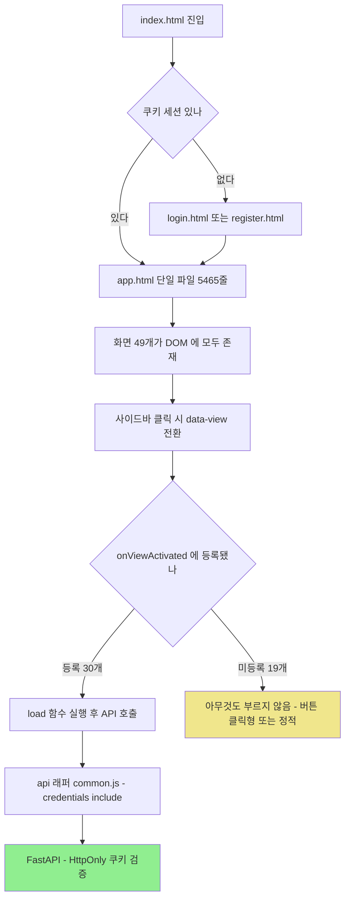
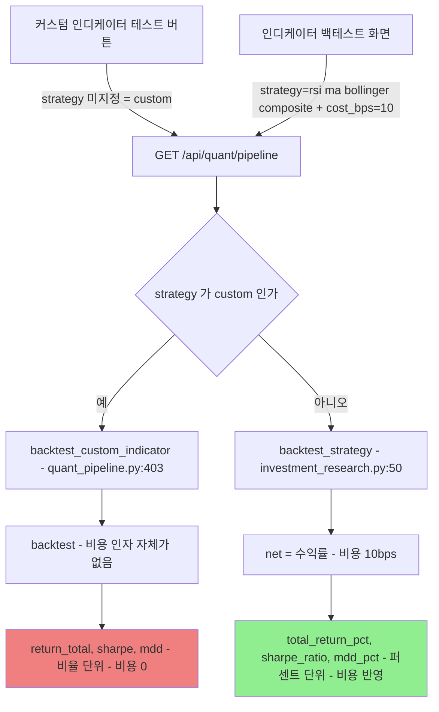

# #28 [분석] A13 프론트엔드 SPA — 3차 산출물인 Pine Script가 지금은 TradingView에서 실행되지 않습니다

> 🗂️ 옛 GitHub 이슈를 옮긴 **기록 문서**입니다 — [색인](../README.md). 원문은 그대로 두고, 링크·커밋 해시만 새 자리 기준으로 바꿨습니다.

| 항목 | 내용 |
|---|---|
| 종류 | 이슈 |
| 상태 | 열림 |
| 원 작성 | 이동원(`devlee328288`) · 2026-09-17 16:42 KST |
| 라벨 | `analysis` `phase-3` |
| 댓글 | 1건 |
| 옛 주소 | `github.com/devlee328288/Qurious/issues/28` (지금은 열리지 않음) |

## 본문

> **쉬운 요약 3줄**
> 1. **3차 결과물인 Pine Script가 지금은 TradingView에서 실행되지 않습니다.** 코드 생성기가 `${ }`를 하나 빠뜨려서 **JavaScript 코드 `parseInt(buyTh)`가 Pine 코드 안에 글자 그대로** 들어갑니다. 4개 전략 전부 그렇습니다(실측).
> 2. **같은 화면의 버튼 두 개가 서로 다른 전략을 만듭니다.** "PineScript 복사"와 "Python 코드 복사"가 내놓는 `macd_bb` 전략의 **매도 조건이 다릅니다** — Pine에는 볼린저 상단 이탈 매도가 있고 Python에는 없습니다.
> 3. ~~**바로 옆에 있는 두 성과 숫자의 계산 규격이 다릅니다.** "커스텀 인디케이터 테스트"는 **거래비용 0원**으로, "인디케이터 백테스트"는 **10bps 비용**으로 계산합니다. 화면에는 그 차이가 어디에도 적혀 있지 않습니다.~~ → ✅ **[#42](../pulls/042.md) 에서 고쳤습니다** (2026-09-20). 두 화면이 같은 비용 모델(`cost_model=real`)을 쓰고, 응답에 `cost`·`gross_return_pct`·`cost_drag_pct` 가 실려 화면이 무엇을 뗐는지 적습니다. 원인 분석은 [#40](../issues/040.md) 입니다.

---

## 한눈에 보기

기준 커밋: Qurious [`04f476a`](https://github.com/EST-team-project/Qurious/commit/04f476a7558086d2c02d81b91325d52cd541d2fc) · 조사일 2026-09-17(KST)
확실도: 🟢 코드·실행으로 확인 / 🟡 추론

| # | 발견 | 어디 | 무슨 일이 생기나 | 확실도 |
|---|------|------|------------------|--------|
| **F1** | Pine 생성기 **`${ }` 누락** | [`app.html:3338`](https://github.com/EST-team-project/Qurious/blob/04f476a/public/app.html#L3338) | 생성된 Pine에 `parseInt(buyTh)`가 그대로 → TradingView 컴파일 불가 (4개 전략 전부) | 🟢 node 실행 |
| **F2** | Pine과 Python이 **다른 전략**을 만든다 | `app.html:3322-3327` vs `:3364-3369` | `macd_bb`의 매도 조건: Pine은 볼린저 상단 이탈 포함, Python은 MACD 데드크로스만 | 🟢 node 실행 |
| **F3** ✅ | ~~나란한 두 성과가 **비용 규격이 다르다**~~ → **[#42](../pulls/042.md) 에서 해결** | `quant_pipeline.py:231` vs `investment_research.py:50` | ~~커스텀 테스트 = **비용 0**, 인디케이터 백테스트 = **10bps**~~ → 둘 다 `trading_cost` 의 같은 모델을 쓴다. 원인·실측은 [#40](../issues/040.md) | 🟢 |
| **F4** | 승률 **툴팁과 계산이 다르다** | `app.html:3417` vs `quant_pipeline.py:253-254` | 화면은 "수익이 난 **거래**의 비율", 실제는 "보유 **일자** 중 상승일 비율" | 🟢 |
| **F5** | 한 엔드포인트가 **두 가지 응답 스키마** | [`stocks.py:733`](https://github.com/EST-team-project/Qurious/blob/04f476a/app/routes/stocks.py#L733) | `strategy=custom`이면 `mdd`(비율), 아니면 `mdd_pct`(%) | 🟢 |
| **F6** | 49개 화면 중 **19개는 진입 시 아무것도 안 부름** | `app.html:3892-3923` | 버튼 클릭형이거나 정적 화면 | 🟢 |
| **F7** | `company-compare`는 **2024Q1 고정 데이터** | [`app.html:3681`](https://github.com/EST-team-project/Qurious/blob/04f476a/public/app.html#L3681) | 삼성전자 73,400원·PER 16.2가 손으로 박혀 있음. 기준일 표시 없음 | 🟢 |
| **F8** | `company-sector`는 **섹터 전망까지 하드코딩** | `app.html:3868-3875` | "반도체 긍정 / 에너지 부정"이 함수 안 상수 | 🟢 |
| **F9** | 미국 주식은 조회 실패 시 **고정 가격으로 대체** | `app.html:4707-4712` | `AAPL 189.3` 등, 화면에 "근사치" 표시 없음 | 🟢 |
| **✅ G1** | 토큰을 **localStorage에 두지 않는다** | `common.js:7` · `auth.py:137` | HttpOnly 쿠키 + `credentials:"include"` — XSS로 토큰 탈취 불가 | 🟢 |
| **✅ G2** | `escHtml`을 **107곳에서 실제로 쓴다** | `common.js:83-90` | 크롤 문서 제목·LLM 답변·종목명 모두 이스케이프 | 🟢 |
| **G3** | 다만 쿠키가 `Secure=False` · `SameSite=lax` · **TTL 7일** | [`config.py:8,76-77`](https://github.com/EST-team-project/Qurious/blob/04f476a/app/config.py#L76-L77) | 로컬 개발엔 맞지만 공개 배포 시 조정 필요 | 🟢 |
| **G4** | 화면은 **지표를 직접 계산하지 않는다** | 프론트 계산 함수 0건 | A5의 "RSI 3종"은 전부 서버 쪽 문제 — 화면은 서버 값을 그대로 표시 | 🟢 |

---

## 용어 풀이

### 화면 구조

| 용어 | 정확한 뜻 | 이 문서에서 가리키는 것 | 헷갈리기 쉬운 점 |
|---|---|---|---|
| **SPA** | Single Page Application. 페이지를 새로 불러오지 않고 한 문서 안에서 화면만 바꾸는 방식 | `public/app.html` 한 파일(5,465줄·313KB) | 주소창이 안 바뀌므로 **새로고침하면 처음 화면으로** 돌아갑니다 |
| **뷰(view)** | 화면 하나 | `<div class="view" data-view="paper-stock">` | 49개가 **전부 한 HTML 안에** 들어 있고, 보이지 않을 뿐 DOM에는 항상 존재합니다 |
| **활성화 훅** | 화면이 켜질 때 실행되는 함수 | `onViewActivated(view)`의 `if (view === ...)` 줄 | 여기 없으면 **화면에 들어가도 아무것도 불러오지 않습니다**(버튼을 눌러야 동작) |
| **템플릿 리터럴** | 백틱으로 감싸 `${식}`을 끼워 넣는 JS 문자열 | 화면 HTML을 만드는 방식 | **`${ }`를 빠뜨리면 식이 글자 그대로 남습니다** — F1이 정확히 그것입니다 |

### 인증·보안

| 용어 | 정확한 뜻 | 이 문서에서 가리키는 것 | 헷갈리기 쉬운 점 |
|---|---|---|---|
| **HttpOnly 쿠키** | JavaScript가 읽을 수 없는 쿠키 | 로그인 세션 토큰 보관 방식 | `localStorage`에 토큰을 두는 방식보다 **안전합니다**. 이 프로젝트는 잘 하고 있습니다 |
| **`credentials: "include"`** | fetch 요청에 쿠키를 함께 보내라는 옵션 | `common.js:7` | 이게 있어야 쿠키 인증이 동작합니다 |
| **`Secure`** | HTTPS에서만 쿠키를 보내는 속성 | `COOKIE_SECURE=False`(현재) | 로컬 http 개발 때문에 꺼둔 것. **공개 배포하면 반드시 켜야** 합니다 |
| **`SameSite=lax`** | 다른 사이트에서 온 요청에 쿠키를 제한적으로만 보냄 | CSRF 방어 | `lax`는 GET에는 쿠키가 실립니다. **상태를 바꾸는 GET이 있으면 위험**합니다 |
| **XSS** | 남의 입력이 내 페이지에서 코드로 실행되는 취약점 | `innerHTML`에 이스케이프 없이 값을 넣을 때 | `escHtml()`을 거치면 막힙니다 |

### 지표·성과

| 용어 | 정확한 뜻 | 이 문서에서 가리키는 것 | 헷갈리기 쉬운 점 |
|---|---|---|---|
| **Pine Script** | TradingView 전용 차트 스크립트 언어 (`//@version=5`) | 3차 산출물로 내보내는 코드 | **JavaScript가 아닙니다.** `parseInt` 같은 JS 함수는 없습니다 |
| **bps (베이시스포인트)** | 0.01%p. 10bps = 0.1% | 거래비용 단위 | 편도인지 왕복인지에 따라 2배 차이 — D4 [#17](../discussions/017.md) ①에서 규격을 정하는 중입니다 |
| **승률(win rate)** | 보통 **이긴 거래 수 ÷ 전체 거래 수** | 화면 툴팁이 말하는 정의 | 이 프로젝트가 실제로 계산하는 건 **보유한 날 중 오른 날의 비율**입니다(F4) |
| **MDD** | 고점 대비 최대 하락률 | `mdd`(0.15) 또는 `mdd_pct`(15.0) | **같은 API가 파라미터에 따라 단위를 바꿉니다**(F5) |

---

## 1. 구조 — 49개 화면이 한 파일에 있다



숫자 근거(🟢 모두 스크립트로 집계):

| 항목 | 값 |
|---|---|
| 화면(`data-view`) | **49개** — D1 [#7](../discussions/007.md)이 쓴 "49개 화면"과 일치 |
| `app.html` | 5,465줄 · 320,464바이트 (JS·HTML·CSS 한 파일) |
| 분리된 JS | `js/paper.js` 590줄 · `js/common.js` 113줄 |
| 프론트가 부르는 API 경로 | **85개** (경로 변수 포함) |
| 화면 진입 시 로딩 훅 | **30개** 등록 / **19개** 미등록 |
| `innerHTML` 사용 | app.html 109곳 · paper.js 47곳 |
| `escHtml` 사용 | app.html 107곳 · paper.js 68곳 |

---

## 2. 화면 전수표 — 어느 화면이 무엇을 부르는가

**진입하면 서버를 부르는 화면 30개** (🟢 라우팅 코드에서 자동 추출)

| 화면 | 로딩 함수 | 호출 API |
|---|---|---|
| `paper-dashboard` | `loadPaperDashboard` | `/api/paper/account` · `/api/paper/stocks/orders/history` · `/api/paper/trade/order/history` · `/api/paper/alternatives/orders/history` |
| `paper-stock` | `loadPaperStock` | `/api/paper/account` |
| `paper-crypto` | `loadPaperCrypto` | `/api/paper/crypto/market-list` |
| `paper-alternative` | `loadPaperAlt` | `/api/paper/alternatives/markets` |
| `paper-openapi` | `loadPaperOpenApi` | `/openapi/v1/docs-summary` |
| `trading-chart` | `loadStockChart` | `/api/stocks/quote` · `/api/stocks/candles` |
| `trading-portfolio` | `loadPortfolio` | `/api/portfolio` |
| `trading-order` | `loadOrderHistory`+`loadBrokerStatus` | `/api/orders` · `/api/broker/settings` |
| `quant-dashboard` | `loadQuantDashboard` | `/api/stocks/market` (하위 함수) |
| `quant-auto` | `loadAutoTradeStatus` | `/api/auto-trade/status` |
| `quant-lean` | `loadLeanView` | `/api/backtests/lean/status` |
| `robo-screening` | `loadRoboScreening` | `/api/stocks/signals` |
| `robo-decision` | `loadRoboDecision` | `/api/quant/auto/status` |
| `indicator-custom` | `loadSavedIndicators` | `/api/custom-indicators` |
| `indicator-backtest` | `loadIndicatorBacktest` | `/api/quant/pipeline` |
| `indicator-api` | `loadIndicatorApiSettings` | `/api/broker/settings` |
| `macro-dashboard` | `loadMacroDashboard` | `/api/macro/indicators` |
| `macro-industry` | `loadMacroIndustry` | `/api/macro/industry` |
| `company-dashboard` | `loadCompanyDashboard` | `/api/stocks/fundamentals` (하위 함수) |
| `company-compare` | `loadCompanyCompare` | **없음 — 하드코딩(F7)** |
| `company-sector` | `loadCompanySector` | **없음 — 하드코딩(F8)** |
| `us-dashboard` | `loadUsDashboard` | `/api/stocks/quote` · `/api/macro/us-stocks` |
| `us-chart` | `loadUsChart` | `/api/stocks/quote` · `/api/stocks/candles` |
| `us-order` | `renderUsOrders` | `/api/portfolio` (하위 함수) |
| `us-portfolio` | `loadUsPortfolio` | `/api/portfolio` · `/api/stocks/quote` |
| `crawl-manual` | `loadCrawlList` | `/api/ingest/crawl/list` |
| `settings` | `loadSettings` | `/api/quant/settings` |
| `notification-settings` | `loadNotificationSettings` | `/api/notification/settings` |
| `sysadmin-dashboard` | `loadSystemDashboard` | `/api/system/status` |
| `sysadmin-logs` | `loadAuditLog` | `/api/admin/audit-log` |

**진입해도 아무것도 부르지 않는 화면 19개**

`agent-chat` · `agent-cb` · `agent-products` · `agent-news` · `crawl-auto` · `crawl-ingest` · `quant-backtest` · `quant-seasonal` · `robo-portfolio` · `indicator-strategy` · `invest-technical` · `invest-fundamental` · `ml-compare` · `ml-regression` · `ml-cluster` · `ml-tune` · `ml-deeplearning` · `fin-products` · `fin-allocation`

이 중 대부분은 **버튼을 눌러야 동작하는 화면**입니다(`agent-chat`은 질문 전송, `ml-*`는 "실행" 버튼). 즉 "빈 화면"이 아니라 "사용자 조작 대기" 상태입니다. **D1 [#7](../discussions/007.md)의 동결 후보를 고를 때 이 목록을 그대로 쓰면 안 됩니다** — 로딩 훅 유무는 화면의 완성도가 아니라 상호작용 방식의 차이입니다.

---

## 3. 3차 직격 — Pine Script 생성기 🟢 node 실행으로 확인

### 3.1 `${ }` 하나가 빠졌다

```javascript
// public/app.html:3334-3338 (생성되는 Pine 코드 템플릿)
short_len = input.int(${short}, "단기 MA 기간")
mid_len   = input.int(${mid},   "중기 MA 기간")
rsi_len   = input.int(${rsiLen}, "RSI 기간")
buy_th    = input.int(${buyTh}, "매수 RSI 임계값")
sell_th   = input.int(100 - parseInt(buyTh), "매도 RSI 임계값")   // ← ${ } 없음
```

바로 아래 Python 생성기에서는 **같은 계산을 `${100 - parseInt(buyTh)}`로 제대로** 씁니다([`app.html:3369`](https://github.com/EST-team-project/Qurious/blob/04f476a/public/app.html#L3369)). 한쪽만 빠진 것입니다.

**실측** — `generatePineCode()`를 원문 그대로 node로 실행한 결과(4개 전략 전부 동일):

```
base = rsi_ma
  [Pine]   sell_th   = input.int(100 - parseInt(buyTh), "매도 RSI 임계값")
  [Python] df["sell_signal"] = df["dead_cross"]   | (df["rsi"] > 65)
```

Pine Script에는 `parseInt`가 없으므로 TradingView에 붙여넣으면 **컴파일 단계에서 실패**합니다. `macd_bb`·`triple_ma`는 `sell_th` 변수를 쓰지 않지만, `input.int(...)` 줄 자체가 컴파일 대상이라 **4개 모두 실패**합니다.

### 3.2 같은 버튼 두 개가 다른 전략을 만든다

`macd_bb`를 고르고 두 버튼을 각각 눌렀을 때(실측):

| | 매수 조건 | 매도 조건 |
|---|---|---|
| **Pine** | `ta.crossover(macd_line, macd_sig) and close < bb_mid` | `ta.crossunder(macd_line, macd_sig)` **`or close > bb_mid + 2 * ta.stdev(close, mid_len)`** |
| **Python** | `(macd > macd_sig) & (macd.shift(1) <= ...) & (Close < bb.iloc[:,1])` | `(macd < macd_sig) & (macd.shift(1) >= ...)` — **볼린저 조건 없음** |

매수는 사실상 같은데 **매도가 다릅니다.** Pine 쪽에는 "볼린저 상단을 뚫으면 판다"가 있고 Python에는 없습니다. 같은 전략이라고 믿고 한쪽은 TradingView에서 눈으로, 다른 쪽은 파이썬으로 백테스트하면 **결과가 갈라지는데 원인을 찾기 어렵습니다.**

나머지 3개(`rsi_ma`·`volume_rsi`·`triple_ma`)는 두 언어의 조건이 서로 맞습니다(실측 확인).

> **D6 [#20](../discussions/020.md)과 직접 연결**: D6은 "같은 RSI 14가 세 벌이라 결론이 58.3% 뒤집힌다"를 다뤘습니다. 여기서 찾은 것은 **한 단계 더 앞** — 같은 화면의 내보내기 버튼 두 개가 **애초에 다른 전략**을 내놓습니다. D6 ②("strategy()로 전환 + app.html:3338 JS 누출 수정")에 **F2(전략 불일치)를 항목으로 추가**하는 것을 제안합니다.

---

## 4. 같은 화면, 다른 규격

### 4.1 비용이 붙은 숫자와 안 붙은 숫자가 나란히 있다

`indicator-custom` 화면의 "성과 테스트"와 `indicator-backtest` 화면은 **같은 엔드포인트** `/api/quant/pipeline`을 부릅니다. 그런데 파라미터에 따라 서버 내부에서 **다른 함수**로 갈라집니다.



`backtest()` 본문에는 비용 항이 아예 없습니다:

```python
# app/services/quant_pipeline.py:239-241
pos = signals.shift(1).fillna(0).reindex(ret.index, fill_value=0)
strat_ret = ret * (pos == 1).astype(float)     # 수수료·세금·슬리피지 없음
```

`indicator-backtest` 화면은 `cost_bps=10`을 **보내지만**, `backtest_custom_indicator`는 그 인자를 **받지 않습니다**([`quant_pipeline.py:403-410`](https://github.com/EST-team-project/Qurious/blob/04f476a/app/services/quant_pipeline.py#L403-L410)). 그래서 커스텀 경로에서는 `cost_bps`가 조용히 무시됩니다.

> **D4 [#17](../discussions/017.md) ①·③과 직접 연결**: D4 추천안은 "비용 A(편도 10bps + 매도세 0.15%)"와 "정본 엔진 `backtest_strategy` 하나"입니다. **커스텀 인디케이터 경로가 정본 엔진을 쓰지 않는다**는 것이 이번에 확인된 사실이고, 3차 산출물이 바로 그 경로를 씁니다. D4 ③을 실행하면 이 화면부터 바뀌어야 합니다.

#### ✅ 해결 경로 ([#42](../pulls/042.md) · 2026-09-20)

"정본 엔진 하나" 가 아니라 **공통 비용 모델 하나**로 풀었습니다. 백테스트 함수는 네 갈래로 두고(각자 시그널 만드는 방식이 다릅니다), 비용만 `app/services/trading_cost.py` 한 곳에서 받습니다.

```
   커스텀 인디케이터 ─┐
   성과 검증        ─┼──▶ trading_cost.build(cost_model) ──▶ KrxCostModel
   ML 파이프라인    ─┘                                        (연도별 · 방향별)
   LEAN             ──▶ 🔴 아직 (IFeeModel 상속이 필요)
```

🔴 **다만 D4 추천안의 "매도세 0.15%" 는 2025년 값입니다.** 2026-01-01부터 0.20% 입니다(대통령령 제36001호). 매도세는 2019년 이후 **여섯 번** 바뀌었습니다 — 0.25% → 0.23% → 0.20% → 0.18% → 0.15% → 0.20%. 상수 하나로 정하면 어느 해에는 반드시 틀립니다. 그래서 구현은 **시행일 구간 표**를 쓰고 날짜로 조회합니다. 근거와 실측은 [#40](../issues/040.md) 5.3 · 9.2 입니다.

남은 것: **F4(승률의 뜻)·F5(응답 스키마 두 가지)는 그대로입니다.** [#42](../pulls/042.md) 는 비용만 손댔고, `mdd`(비율) vs `mdd_pct`(%) 와 "거래 비율 vs 보유일자 비율" 은 여전히 갈립니다.

### 4.2 승률의 뜻이 화면과 코드에서 다르다

화면 툴팁:

```javascript
// app.html:3417
tt("승률", "수익이 난 거래의 비율", "win_rate")
```

실제 계산:

```python
# quant_pipeline.py:253-254
held_rets = strat_ret[pos == 1]
win_rate  = float((held_rets > 0).sum() / max(len(held_rets), 1)) * 100
```

`held_rets`는 **보유한 날의 일간 수익률**입니다. 즉 "보유한 날 중 오른 날의 비율"이지 "이익으로 끝난 거래의 비율"이 아닙니다. `backtest_strategy` 쪽도 같은 방식입니다(`(active > 0).mean()`, [`investment_research.py:76`](https://github.com/EST-team-project/Qurious/blob/04f476a/app/services/investment_research.py#L76)).

**왜 문제인가**: 한 번 사서 100일 들고 있다가 손해 보고 판 경우, 거래 승률은 **0%**인데 이 계산으로는 오른 날이 52일이면 **52%**로 표시됩니다. 실제로 이 프로젝트의 전략은 신호가 바뀔 때까지 포지션을 유지하므로(`regime.ffill()`), **거래 수는 적고 보유일은 많은** 구조입니다 — 두 정의의 차이가 가장 크게 벌어지는 형태입니다.

### 4.3 화면은 지표를 직접 계산하지 않는다 ✅

프론트 코드에서 RSI·SMA·MDD·샤프를 **직접 계산하는 함수는 0건**입니다(🟢 `grep`). 화면은 서버가 준 값을 `toFixed()`로 표시만 합니다.

**따라서 A5 [#19](../issues/019.md)가 찾은 "RSI 3종"과 A7 [#16](../issues/016.md)의 "예상 MDD" 문제는 전부 서버 쪽 문제이고, 화면을 고쳐서 해결되지 않습니다.** 다만 화면은 **어느 서버 함수가 계산했는지 표시하지 않으므로**, 규격이 다른 숫자가 같은 레이아웃으로 나란히 보입니다(4.1). 사용자 입장에서 구분할 방법이 없다는 것이 화면 쪽 책임입니다.

---

## 5. 목업으로 남은 화면

| 화면 | 무엇이 하드코딩인가 | 근거 |
|---|---|---|
| `company-compare` | 5개 기업의 주가·PER·PBR·ROE·분기 실적 전체. 분기 라벨이 **`23Q2`~`24Q1`** | [`app.html:3681-3717`](https://github.com/EST-team-project/Qurious/blob/04f476a/public/app.html#L3681-L3717) |
| `company-sector` | 6개 섹터의 평균 PER·PBR과 **"긍정/중립/부정" 전망까지** | [`app.html:3868-3875`](https://github.com/EST-team-project/Qurious/blob/04f476a/public/app.html#L3868-L3875) |
| `us-dashboard` | 조회 실패 시 `AAPL 189.3` 등 **고정 가격 + 등락률 0%** | [`app.html:4707-4712`](https://github.com/EST-team-project/Qurious/blob/04f476a/public/app.html#L4707-L4712) |

`company-dashboard`는 다릅니다 — 실제로 `/api/stocks/fundamentals`를 부르고, 코드에 **의도를 밝힌 주석**이 있습니다:

```javascript
// app.html:3719-3721
// 대시보드의 종목 선택은 위 5개 목업 데이터에 묶여있지 않고, 검색으로 아무 종목이나
// 추가해 실제 데이터(Yahoo Finance)를 조회한다. COMPANIES/CO_DATA는 "지표 비교 분석"
// 탭에서만 계속 쓴다.
```

이 주석은 "무엇이 진짜이고 무엇이 목업인지"를 코드에 남긴 좋은 예입니다(강사님 피드백 ⑤). **문제는 화면에는 그 구분이 안 보인다는 것**입니다 — 사용자는 `company-compare`의 73,400원을 오늘 시세로 읽습니다.

---

## 6. 인증과 XSS — 여기는 대체로 잘 되어 있다

### 6.1 토큰 보관 ✅

```javascript
// public/js/common.js:4-9
res = await fetch(path, { method, headers: {...}, credentials: "include", body: ... });
```

```python
# app/routes/auth.py:135-138
response.set_cookie(..., httponly=True, samesite=settings.COOKIE_SAMESITE,
                    secure=settings.COOKIE_SECURE, max_age=settings.SESSION_TTL)
```

`localStorage`에 토큰을 넣은 곳은 **한 군데도 없습니다**(🟢 `grep` — localStorage는 화면 가이드 열림 상태와 비교 트레이에만 사용). XSS가 나더라도 세션 토큰은 읽히지 않습니다.

다만 설정값은 배포 시 조정이 필요합니다.

| 설정 | 현재 | 판단 |
|---|---|---|
| `COOKIE_SECURE` | `False` | 로컬 http 개발용. **공개 배포 시 `True`** |
| `COOKIE_SAMESITE` | `"lax"` | GET에는 쿠키가 실림 — 상태를 바꾸는 GET이 없는지 확인 필요 |
| `SESSION_TTL` | `604800` (7일) | 매매 기능이 있는 앱 치고는 긴 편 |

### 6.2 이스케이프 ✅ (일부 예외)

`escHtml()`이 `& < > " '` 다섯 문자를 치환하고([`common.js:83-90`](https://github.com/EST-team-project/Qurious/blob/04f476a/public/js/common.js#L83-L90)), 외부에서 오는 값에는 실제로 적용돼 있습니다 — 크롤 문서 제목(`app.html:4134`), LLM 답변과 추론 단계(`app.html:3941-3946`), 종목명 등.

이스케이프 없이 들어가는 표현식은 남아 있지만(app.html 172건 중 고유 100개), 대부분 **서버가 주는 숫자·색상 코드·내부 변수**입니다. 그중 눈여겨볼 것:

| 표현식 | 어디서 오나 | 위험도 |
|---|---|---|
| `${e.message}` | 서버 `detail` 문자열 | 🟡 서버 오류 메시지에 HTML이 섞이면 깨질 수 있음. A12 [#27](../issues/027.md)에서 본 `f"증권사 API 주문 오류: {e}"`가 이 경로로 들어옵니다 |
| `${o.name}` · `${o.koreanName}` (paper.js) | 업비트·야후 종목명 | 🟡 외부 데이터. 현재는 무해하나 원칙상 이스케이프 대상 |
| `${s.ssh_host}` · `${s.docker_via}` | 서버 설정값 | 🟡 |

**지금 당장 성립하는 XSS 경로는 찾지 못했습니다.** 사용자가 직접 입력한 문자열이 들어가는 자리(채팅·검색어·인디케이터 이름)는 모두 `escHtml`을 거칩니다.

---

## 7. D1·D6으로 넘길 안건

**결론이 아니라 선택지입니다.**

| 안건 | 어디로 | 선택지 | 제 의견(미확정) |
|---|---|---|---|
| Pine 생성기 수정 | **D6 ②** | (a) `${ }` 한 줄만 고침 (b) Pine/Python 전략 정의를 **하나의 표에서 생성** | **(b)** — F2 같은 불일치가 또 생깁니다 |
| 커스텀 백테스트 비용 | **D4 ③** | (a) 현행 유지 (b) `backtest_custom_indicator`도 정본 엔진 경유 | **(b)** — 3차 산출물이 비용 0으로 평가되면 D4 결론이 무의미해집니다 |
| 승률 정의 | **D4 / D6** | (a) 툴팁을 계산에 맞춤("보유일 중 상승일") (b) 계산을 거래 단위로 바꿈 | **(b)** — 팀 밖 독자는 (a)를 이해하기 어렵습니다 |
| 응답 스키마 | D6 ④(저장 12필드)와 함께 | (a) 현행(두 스키마) (b) 한 스키마로 통일 | **(b)** |
| 목업 화면 | **D1 ④** | (a) 동결 (b) 실데이터 연결 (c) **화면에 "예시 데이터·기준일" 배지** | **(c) 최소** — 동결하더라도 오해는 막아야 합니다 |
| 화면 49개 | **D1 ④** | 주 경로 12 선정 시 이 문서 2절 전수표를 근거로 | 로딩 훅 유무를 완성도로 읽지 말 것 |

---

## 8. 판정을 뒤집을 조건

| 판정 | 뒤집히는 조건 |
|---|---|
| F1 "Pine이 컴파일되지 않는다" | TradingView가 `input.int()` 인자를 느슨하게 처리해 통과시키면 — 실제 붙여넣기 테스트로 확인 가능합니다(계정만 있으면 5분) |
| F2 "두 언어가 다른 전략" | `bb.iloc[:, 1]`이 pandas_ta 버전에 따라 상단 밴드를 가리킨다면 매수 조건도 달라집니다. **저는 중간선(BBM)으로 보고 계산했습니다** — 버전별 컬럼 순서 확인이 필요합니다(🟡) |
| F3 "비용 0" | `backtest_custom_indicator`에 비용이 추가되면 해소 |
| F4 "승률 정의 불일치" | 툴팁 문구를 바꾸면 해소(계산은 그대로 두더라도) |
| F7~F9 "목업" | 화면에 기준일·출처 배지를 달면 "목업"이 아니라 "명시된 예시"가 됩니다 |
| G4 "화면은 계산 안 함" | 제가 못 찾은 인라인 계산이 있으면 — `grep`이 함수 정의만 훑었으므로 익명 함수 안의 계산은 놓쳤을 수 있습니다(🟡) |

---

## 9. 한계 — 확인하지 못한 것 / 제가 틀렸던 것

1. **제가 처음에 틀렸던 것**: `ci-test-btn`이 `r.mdd`를, `loadIndicatorBacktest`가 `data.mdd_pct`를 읽는 걸 보고 "**한쪽은 NaN이 뜬다**"고 의심했습니다. 서버를 확인해 보니 **두 경로가 정말로 다른 스키마를 반환**하고 있었고, 프론트는 각각 **맞게** 읽고 있었습니다. 화면은 정상 동작합니다. 남는 문제는 "같은 URL이 두 스키마"라는 설계(F5)와 "규격이 다른 숫자가 나란히"(F3)입니다.
2. **브라우저 실행 검증 없음.** 서버를 띄우지 않아 화면을 실제로 열어보지는 못했습니다. 모든 판정은 코드 읽기와 **node로 함수를 그대로 실행**한 결과입니다.
3. **TradingView 붙여넣기 미검증.** F1은 "Pine에 JS 문법이 들어간다"까지가 확인 사실이고, 컴파일 실패는 언어 명세에 따른 추론입니다(🟡).
4. **pandas_ta `bbands` 컬럼 순서**를 실측하지 않았습니다. F2의 매도 조건 차이는 컬럼 순서와 무관하지만, 매수 조건 일치 여부는 이에 달려 있습니다.
5. **화면 전수표의 "하위 함수" 표기**는 자동 추출이 한 단계까지만 따라간 결과입니다. 더 깊은 호출은 놓쳤을 수 있습니다.

---

## 근거 파일 (기준 커밋 `04f476a`)

- `public/app.html` — 화면 49개·라우팅·Pine/Python 생성기·목업 데이터
- `public/js/common.js` — `api()` 래퍼·`escHtml()`
- `public/js/paper.js` — 모의투자 4개 화면
- `app/routes/stocks.py:733` — `/api/quant/pipeline`
- `app/services/quant_pipeline.py:231, 403` — `backtest()` · `backtest_custom_indicator()`
- `app/services/investment_research.py:50` — `backtest_strategy()` (비용 반영 경로)
- `app/routes/auth.py:135` · `app/config.py:76-77` — 쿠키 정책

관련 문서: A5 [#19](../issues/019.md)(지표 3종) · A6 [#14](../issues/014.md)(성과 엔진 5개) · A7 [#16](../issues/016.md)(자산배분) · A12 [#27](../issues/027.md)(알림·감사) · D1 [#7](../discussions/007.md)(주 경로·동결) · D4 [#17](../discussions/017.md)(비용·검정 규격) · D6 [#20](../discussions/020.md)(3차 인디케이터)

---

## 댓글 1건

---

<a id="issuecomment-5747297222"></a>

### 💬 1. 이동원(`devlee328288`) · 2026-09-20 12:23 KST

**본문 갱신 (2026-09-20)** — F3 이 해결됐습니다.

| 고친 곳 | 무엇 |
|---|---|
| 요약 3번 | 취소선 + ✅ [#42](../pulls/042.md) 에서 해결 |
| **F3** 표 칸 | 취소선 + "둘 다 `trading_cost` 의 같은 모델을 쓴다" |
| 4.1 절 끝 | "✅ 해결 경로" 블록 신설 — 어떻게 풀었는지 + 🔴 **D4 추천안의 "매도세 0.15%" 는 2025년 값**이라는 지적 |

해결 방식이 D4 [#17](../discussions/017.md) ③ 추천안과 다릅니다. **"정본 엔진 하나"가 아니라 "공통 비용 모델 하나"** 로 풀었습니다 — 백테스트 함수는 네 갈래로 두고(시그널 만드는 방식이 서로 다릅니다) 비용만 한 곳에서 받습니다.

**F4(승률의 뜻)·F5(응답 스키마 두 가지)는 그대로입니다.** [#42](../pulls/042.md) 는 비용만 손댔습니다.
