# #31 [알림] 강사님 강의 자료 4곳 신규 확인 (2026-09-17) — KRX·DART 수집 경로와 ML 모델 예제가 2차에 바로 걸립니다

> 🗂️ 옛 GitHub 이슈를 옮긴 **기록 문서**입니다 — [색인](../README.md). 원문은 그대로 두고, 링크·커밋 해시만 새 자리 기준으로 바꿨습니다.

| 항목 | 내용 |
|---|---|
| 종류 | 이슈 |
| 상태 | 열림 |
| 원 작성 | 이동원(`devlee328288`) · 2026-09-17 18:28 KST |
| 라벨 | `analysis` `phase-2` `infra-cost` |
| 댓글 | 13건 |
| 옛 주소 | `github.com/devlee328288/Qurious/issues/31` (지금은 열리지 않음) |

## 본문

> **읽는 순서**: 쉬운 요약 → 한눈에 보기 → 1절 그림 3장 → 궁금한 저장소만 3절 → 5절 묻는 것
> 💬 이 글은 **결론이 아니라 알림과 의견 요청**입니다. 무엇을 가져올지는 팀이 정합니다.

## 쉬운 요약 3줄

- 강사님 강의 자료 **4곳이 새로 확인**됐습니다. 그중 `python-crawling-lab`에 **DART·한국은행 크롤러**가 있습니다(~~KRX~~ **`krx.co.kr` 폴더는 이름만 KRX이고 실제로는 네이버 비공식 API였습니다** — 2절 정정). [A4 #23](../issues/023.md)에서 "국내상장 ETF를 받을 경로가 없다 · 시세가 전량 Yahoo 비공식 API"라고 적었던 문제에 **직접 걸리는 자료**입니다.
- `python-ml-class`에는 ARIMA·LSTM·CNN·Transformer·DQN까지 **주식 주제 ML/DL 실습 23개**가 있고, **파일마다 쉬운 설명 문서가 1:1로** 붙어 있습니다. rfp-2 **Phase 2(패턴 인식·주가 예측)** 와 그대로 대응합니다.
- 나머지 둘(`python-ai-basic-lab` · `stock-ml-dl-project`)은 **오늘 이미 논의 근거로 썼습니다** — [D1 #7 과잉거래 실측](../discussions/007.md#discussioncomment-18479194)의 데이터와 [D2 #10 일지 실행처](../discussions/010.md#discussioncomment-18479112)의 Airflow 배치 예제가 여기서 나왔습니다.

## 한눈에 보기

| 저장소 | 무엇이 들었나 | 걸리는 우리 문서 | 우선순위 |
|---|---|---|---|
| [`python-crawling-lab`](https://github.com/edumgt/python-crawling-lab) | 크롤러 7종(~~KRX~~ **폴더 이름만 KRX**·DART·ECOS·네이버·다음·업비트·Yahoo) + 데이터레이크(MinIO·Qdrant·DuckDB) | A4 [#23](../issues/023.md) · A2 [#21](../issues/021.md) · D2 [#10](../discussions/010.md) · D5 [#18](../discussions/018.md) | 🔴🔴🔴 |
| [`python-ml-class`](https://github.com/edumgt/python-ml-class) | 주식 ML/DL 실습 **23개** + 같은 수의 쉬운 설명 문서 + 클라우드 대응 가이드 | rfp-2 Phase 2 · D0 ⑦ · D5 [#18](../discussions/018.md) | 🔴🔴🔴 |
| [`stock-ml-dl-project`](https://github.com/edumgt/stock-ml-dl-project)<br/>(= `learning/th10`) | Airflow 배치 · Kafka · k8s · SageMaker · LSTM 전략 | D2 ④ · D7 [#13](../discussions/013.md) · A1 [#9](../issues/009.md) | 🟡🟡 |
| [`python-ai-basic-lab`](https://github.com/edumgt/python-ai-basic-lab)<br/>(= `learning/th09`) | 실습 데이터 17종 + 학습 문서 13편 + **주식 AI 용어 사전** | D1 [#7](../discussions/007.md) · D0 ⑦ · A5 [#19](../issues/019.md) · A6 [#14](../issues/014.md) | 🟡🟡 |

---

## 1. 그림 세 장으로 보기

### 1.1 데이터 원천 — 지금과 앞으로

왼쪽이 **오늘의 Qurious**, 가운데가 **`python-crawling-lab`이 가진 크롤러**, 오른쪽이 **실제로 길을 여는 `.env` 공식 키**입니다. 🔄 2026-09-17 [실측](../issues/031.md#issuecomment-5712385662) 반영 — 처음에는 가운데가 열쇠라고 그렸습니다.

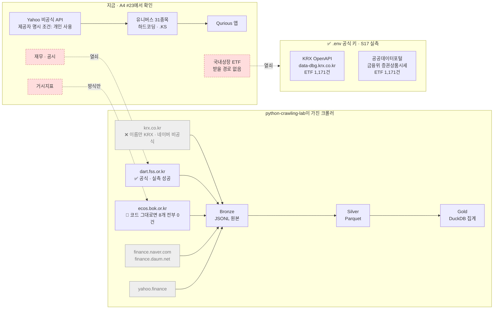

> ⚠️ 경로가 생겨도 **공개 범위 판단은 그대로입니다.** KRX 원자료 재배포 금지 때문에 [D2 #10](../discussions/010.md) 3.5절의 K1(파생 결과만 공개)은 유지됩니다. 🟢

### 1.2 rfp-2 6단계 × 자료 4곳 × 우리 논의

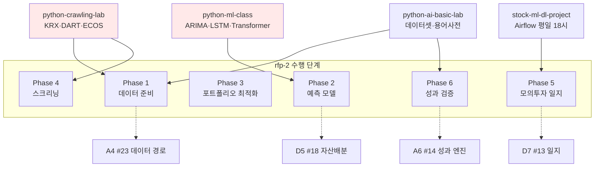

### 1.3 언제 무엇을 볼까 (2차 일정에 얹은 제안)

날짜는 [D2 #10 댓글](../discussions/010.md#discussioncomment-18479112)에서 계산한 가정(2차 시작 09-28 · 발표 10-20 · 휴장 10-05·10-09)을 그대로 씁니다. 🟡 가정

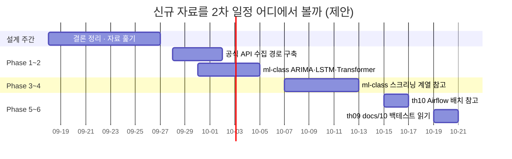

---

## 2. 왜 지금 중요한가 — A4 [#23](../issues/023.md)이 막아 둔 곳에 열쇠가 있습니다

> 📌 **2026-09-17 정정** — 이 글을 올린 뒤 같은 날 `python-crawling-lab` 코드를 직접 열고 `.env` 공식 키로 API를 실제 호출해 봤습니다([검증 댓글](../issues/031.md#issuecomment-5712385662)). **아래 표의 위 두 줄이 뒤집혔습니다.** 원래 적었던 추정은 지우지 않고 취소선으로 남깁니다 — 무엇을 어떻게 잘못 봤는지가 함께 남는 편이 낫다고 보았습니다.

| A4 [#23](../issues/023.md)에서 적은 문제 | 무엇이 푸는가 | 해소 정도 |
|---|---|---|
| **국내상장 ETF를 받을 경로가 없음**(유니버스 31종목 하드코딩 `.KS`, KIND는 상장법인 목록) | ~~`crawlers/krx.co.kr`~~ → **`.env`의 KRX OpenAPI · 공공데이터포털 공식 키** | ████████ **해소 확정** — 실측 ETF **1,171건**(두 경로 수치 일치) 🟢 |
| **시세 전량 Yahoo 비공식 API**(제공자 명시 조건은 *개인 사용*) | ~~`finance.naver.com` · `finance.daum.net` · `krx.co.kr` 로 원천 다변화~~ → **공식 API 2곳** | █████ **부분** — 국내 ETF는 실측 완료 🟢 / 국내 주식·환율·미국 ETF는 **미확인** 🟡 |
| 재무·공시 경로 없음 | `crawlers/dart.fss.or.kr` **방식**(코드는 3곳 보강 필요) | ████████ **해소 확정** 🟢 |
| 거시지표 경로 없음 | `crawlers/ecos.bok.or.kr` — **통계표 목록만** | ███ **방식만** — 코드 그대로면 8개 전부 0건 🟢 |
| **휴장일 처리 0건** · 수익률 결측을 `0.0`으로 | 해당 없음 — 우리가 직접 고쳐야 합니다 | ▏ 없음 🟢 |
| 캐시 TTL 2·3·6·24시간 제각각 | 해당 없음 | ▏ 없음 🟢 |

> ⚠️ **"Yahoo 줄"을 크게가 아니라 부분으로 낮춘 이유**: 실측한 것은 **국내 ETF 1,171건뿐**입니다. `QUANT_STOCKS`의 국내 주식 31종목 · `KRW=X` 환율 · 미국 섹터 ETF 11개(XLK·XLF…)는 공식 경로를 **확인하지 않았습니다.** 여기서 "크게 해소"라고 적으면 이 정정이 잡으려던 것과 같은 종류의 과장이 됩니다. 🟡

## 3. 저장소별 상세

<details>
<summary><b>① python-crawling-lab</b> — 크롤러 7종 + 데이터레이크 (커밋 <code>1572282</code>)</summary>

| 항목 | 내용 |
|---|---|
| 크롤러 | `dart.fss.or.kr` · `ecos.bok.or.kr` · `finance.daum.net` · `finance.naver.com` · `krx.co.kr` · `upbit.com` · `yahoo.finance` |
| 아키텍처 | Bronze(JSONL 원본, MinIO S3) → Silver(Parquet) → Gold(DuckDB 집계) |
| 실행 | `docker compose up -d` — MinIO(9001) + Qdrant(6333) + Crawler API(8400) + UI(8899) |

**우리 구조와 겹치는 지점**

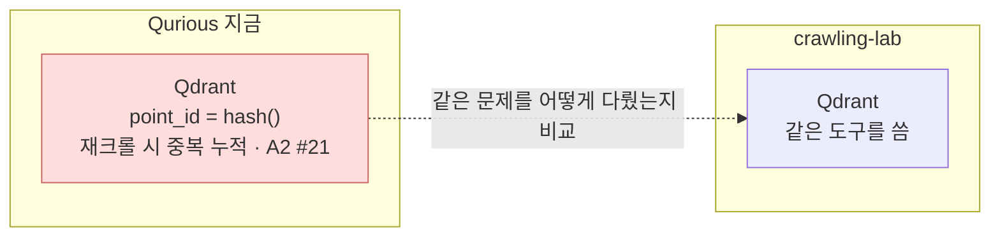

- **비용 관점**: MinIO·Qdrant·DuckDB는 전부 로컬 Docker라 추가 비용이 없습니다. [D2 #10](../discussions/010.md) "유료 클라우드 0원" 추천안과 충돌하지 않습니다. 다만 컨테이너 4개를 동시에 띄우므로 **PC 사양([A1 #9](../issues/009.md))** 에 달렸습니다. 🟡

</details>

<details>
<summary><b>② python-ml-class</b> — 주식 ML/DL 실습 23개 (커밋 <code>e84cf65</code>)</summary>

| 갈래 | 파일 | rfp-2 대응 | 지금 우리에게 |
|---|---|---|---|
| **기초** | `NumpyStockArray` `PandasPortfolio` `YfinanceNormalize` `TimeSeriesAnalysis` `TimeSeriesWindow` | Phase 1 | ██ 이미 하고 있음 |
| **지도학습** | `LinearRegressionReturn` `LinearRegressionFundamental` `LogisticTradeSignal` `SvmTradeSignal` `SvmMarketPhase` | Phase 2·4 | █████ 스크리닝에 직결 |
| **비지도** | `KMeansStockCluster` `PcaStockReduce` `AutoencoderAnomalyDetect` | Phase 3·4 | ████ 섹터 군집·차원축소 |
| **시계열·딥러닝** | `ArimaStockForecast` `LstmStockPyTorch` `RnnBackprop` `CnnTimeSeriesFeature` `CnnCandleChart` `CnnLstmHybrid` `TransformerAttention` | Phase 2 | ███████ **핵심** |
| **강화학습·기타** | `DqnTradingAgent` `HyperparamTuning` `HeatmapRiskMask` `NeuralNetBackprop` | — | ██ DQN은 범위 밖으로 봅니다 |

- **`docs/`에 파일마다 "초등학생 수준 설명 문서"가 1:1로 있습니다.** 강사님 피드백 ③(수행자도 모르는 사람도 이해)·⑤(개념 기록)를 강사님이 직접 실천한 형태라, [D0 #6](../discussions/006.md) ⑦ 설명 기준의 본보기로 쓸 수 있습니다.
- `result/`에는 실행 결과 PNG+MD 44개가 이미 들어 있어, **돌리지 않고도 결과를 먼저 볼 수 있습니다.** 🟢
- `docs/CloudMlMapping.md`는 각 실습의 AWS/GCP 대응표입니다. 우리는 유료 클라우드를 쓰지 않는 쪽이지만(D2), **발표에서 "왜 안 썼는지"** 설명할 때 참고가 됩니다. 🟡

</details>

<details>
<summary><b>③ stock-ml-dl-project (learning/th10)</b> — 배치·MLOps (커밋 <code>09b5823</code>)</summary>

오늘 [D2 #10 댓글](../discussions/010.md#discussioncomment-18479112)에서 근거로 썼습니다.

| 확인한 것 | 우리와의 관계 | 확실도 |
|---|---|:---:|
| `airflow/dags/trading_pipeline.py` — `schedule="0 18 * * 1-5"` (평일 18시 하루 1회) | D2 ④ "장 마감 후 하루 1회"와 **같은 모양** | 🟢 |
| 같은 파일 `catchup=False` | D7 판정 ①("기록 누락 0일")과 **충돌** — 누락일 재계산 규칙이 필요 | 🟢 |
| `public_data_pipeline.py` — `0 * * * *`(매시간) · ECOS → Kafka → Spark → Delta Lake(S3) | 우리 규모에는 과합니다. 구조만 참고 | 🟡 |
| `trading/dl_strategy.py` — Keras LSTM(64 → 32 → Dense 16 → 3분류 SELL/HOLD/BUY) | 3차 인디케이터가 아니라 **2차 예측 모델** 쪽 | 🟡 |
| k8s · SageMaker · Vertex AI 워크플로 문서 | 비용이 드는 경로라 D2 결론(0원)과 어긋납니다. 읽기용 | 🟢 |

</details>

<details>
<summary><b>④ python-ai-basic-lab (learning/th09)</b> — 데이터셋 + 학습 문서 (커밋 <code>b723826</code>)</summary>

오늘 [D1 #7 댓글](../discussions/007.md#discussioncomment-18479194)의 과잉거래 실측이 여기 `data/stock_ohlcv.csv`(260행)로 이뤄졌습니다.

| 자료 | 크기 | 쓸 곳 | 확실도 |
|---|---:|---|:---:|
| `data/stock_ohlcv.csv` (2025-05-12 ~ 2026-05-08) | 12K | 규칙 검증용 **작은 재현 데이터** — 팀원 누구나 같은 숫자를 다시 낼 수 있습니다 | 🟢 |
| `stock_universe.csv` (섹터·모멘텀 3M·변동성 20D·PER·PBR) | 470B | Phase 4 스크리닝 팩터 예시 | 🟢 |
| `dart_fundamentals.csv` · `dart_disclosures.csv` | 13K·9.7K | 재무·공시 팩터 실험 | 🟡 |
| `macro_fred_signals.csv` | 1.8M | 거시 변수 실험 | 🟡 |
| `docs/10.md` **"평가와 백테스트 읽기: 예측 점수와 투자 결과는 다를 수 있어요"** | — | [A6 #14](../issues/014.md)(성과 엔진 5개·시간 누수)와 같은 주제 | 🟢 |
| `docs/voca.md` **주식 AI 용어 사전** | — | D0 ⑦ 용어 풀이의 출발점 | 🟢 |
| `docs/03·04.md` 시계열·최신 시계열 모델 | — | Phase 2 모델 선택 근거 | 🟡 |

</details>

## 4. 오늘 이미 반영한 것

| 어디에 | 무엇을 | 결과 |
|---|---|---|
| [D1 #7 댓글](../discussions/007.md#discussioncomment-18479194) | `python-ai-basic-lab`의 OHLCV 240거래일로 **우리 신호 로직을 그대로 재현** | 연 회전율 **1,516% → 206%** 실측, 현금 37분 소진 확인 |
| [D2 #10 댓글](../discussions/010.md#discussioncomment-18479112) | `stock-ml-dl-project`의 Airflow DAG를 **일지 실행처 레퍼런스**로 인용 | `catchup=False` 충돌까지 확인 |

## 5. 팀에 묻습니다

| # | 질문 | 제 생각 |
|---:|---|---|
| 1 | `python-crawling-lab`의 **KRX·DART·ECOS 수집 경로**를 2차에 가져올까요? | 가져오되 **코드를 옮기지 말고 방식만** 봅니다. 단 ~~KRX 폴더~~는 **가져오지 않습니다**(실측 — 네이버 비공식 · 과거 시세 없음). ETF 경로는 `.env` 공식 키가 이미 풉니다 |
| 2 | `python-ml-class` 23개 중 **어디까지 볼까요?** | Phase 2 범위에서 **ARIMA·LSTM·Transformer 셋만** 먼저. "넓게보다 깊게" 피드백 때문입니다 |
| 3 | 데이터레이크(MinIO·Bronze/Silver/Gold)를 **우리 구조에 넣을까요?** | 지금은 **넣지 않는 쪽**입니다. HF private dataset으로 같은 목적을 이미 달성합니다(D0 ⑥) |
| 4 | `learning/`에 없는 두 곳(`python-ml-class`·`python-crawling-lab`)을 **로컬로 가져올까요?** | 팀장 판단으로 진행합니다. 저장소를 새로 만들지 않고 **읽기 전용**으로만 둡니다 |

<details>
<summary><b>한계</b></summary>

1. ~~**README와 디렉터리 목록까지만 읽었습니다.**~~ → **갱신 2026-09-17**: 두 저장소의 코드를 직접 열고 공식 API를 실측했습니다([crawling-lab 검증](../issues/031.md#issuecomment-5712385662) · [ml-class 검증](../issues/031.md#issuecomment-5712780702)). 2절 표의 🟡는 대부분 🟢로 확정됐고, **위 두 줄은 뒤집혔습니다.** 🟢
2. **라이선스를 확인하지 않았습니다.** 강사님 자료를 우리 Public 저장소로 옮기려면 확인이 필요합니다. 그래서 5절 1번을 "방식만 본다"로 적었습니다. 🟡
3. `stock_ohlcv.csv`는 **1종목 260행**입니다. D1 실측의 일반화 한계는 그 댓글 5절에 적었습니다. 🟢
4. **1.3 간트차트의 날짜는 가정**입니다. 2차 시작일·발표일이 확정되면 다시 그려야 합니다. 🟡
5. 저장소 4곳 모두 **오늘(2026-09-17) 확인한 커밋 기준**입니다. 강사님이 계속 갱신하고 계셔서 내용이 바뀔 수 있습니다. 🟢
</details>

---

## 댓글 13건

---

<a id="issuecomment-5712385662"></a>

### 💬 1. 이동원(`devlee328288`) · 2026-09-17 18:52 KST

## [후속 조사] 질문 1번 자체 검증 — 코드를 직접 열고 API를 실제로 호출해 봤습니다

> **쉬운 요약 3줄**
> 1. `python-crawling-lab`의 **DART는 진짜**입니다. 금융감독원 공식 API를 쓰고, 방금 호출해서 실제 공시가 나왔습니다. 🟢
> 2. 그런데 **KRX는 KRX가 아닙니다.** 폴더 이름만 `krx.co.kr`이고 코드는 **네이버 비공식 API**를 부릅니다. 우리가 [A11 #25](../issues/025.md)에서 문제 삼은 바로 그 `Disallow: /` 사이트입니다. 🟢
> 3. **더 중요한 것** — 팀장님이 `.env`에 넣어 주신 `KRX_API_KEY`·`DATA_GO_KR_API_KEY`로 **공식 경로가 이미 열려 있습니다.** 방금 둘 다 호출해 **ETF 1,171종목**을 받았고, 두 경로의 숫자가 정확히 일치했습니다. A4 [#23](../issues/023.md)의 ETF 문제는 `crawling-lab` 없이 풀립니다. 🟢

[#31 본문 5절 질문 1번](../issues/031.md)에 제가 "가져오되 방식만 본다"고 적었고, 한계 1번에 **"실제 코드를 열어 보지 않았다"**고 적어 두었습니다. 그 한계를 해소한 결과입니다. **2절 표의 🟡 네 줄 중 두 줄은 제가 과대평가했습니다.**

---

## 1. 한눈에 보기 — S16 추정 vs 실측 판정

| A4 [#23](../issues/023.md)이 막아 둔 문제 | S16에서 제가 적은 추정 | **실측 판정** | 바뀜 |
|---|---|---|---|
| 국내상장 ETF를 받을 경로가 없음 | `crawlers/krx.co.kr` — ████████ 크게 🟡 | ▏**해소 아님** — KRX를 부르지 않습니다 🟢 | ⬇️ **뒤집힘** |
| 시세 전량 Yahoo 비공식 API | 네이버·다음·KRX로 **원천 다변화** ███████ 🟡 | ▎**거의 없음** — 비공식→비공식입니다 🟢 | ⬇️ **뒤집힘** |
| 재무·공시 경로 없음 | `crawlers/dart.fss.or.kr` ████████ 🟡 | ████████ **해소 확정** 🟢 | ✅ 유지 |
| 거시지표 경로 없음 | `crawlers/ecos.bok.or.kr` ████████ 🟡 | ███ **방식만 유효** — 코드는 그대로면 0건 🟢 | ⬇️ 하향 |
| 휴장일 처리 0건 | 해당 없음 ▏ | ▏해당 없음 — **공식 API로 바꿔도 우리 몫** 🟢 | ✅ 유지 |

그리고 표에 없던 줄이 하나 생깁니다.

| 새로 확인된 것 | 판정 |
|---|---|
| **`.env`의 `KRX_API_KEY`·`DATA_GO_KR_API_KEY` 공식 경로** | ████████ **ETF 문제를 직접 해결** 🟢 |

---

## 2. 무엇을 어떻게 확인했나

로컬에 저장소를 내려받지 않고, **원격 파일을 읽기 전용으로 열고**(커밋 `1572282` 고정) **API를 실제로 호출**했습니다. 아래 수치는 전부 **2026-09-17 KST 실측값**입니다.

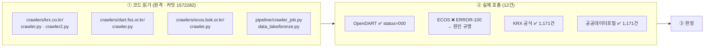

---

## 3. 발견 ① — `krx.co.kr` 폴더는 KRX를 부르지 않습니다 🟢

`crawlers/krx.co.kr/crawler.py`의 맨 윗줄이 스스로 밝히고 있습니다.

```python
# crawlers/krx.co.kr/crawler.py:5-6
# finance.daum.net API는 Kakao 인증이 필요하므로,
# Naver Finance ETF API(etfItemList.nhn)를 통해 KRX 상장 ETF 전종목을 수집합니다.

NAVER_BASE = "https://finance.naver.com"                       # :14
ETF_LIST_API = f"{NAVER_BASE}/api/sise/etfItemList.nhn"        # :15
```
→ [crawler.py#L14-L15](https://github.com/edumgt/python-crawling-lab/blob/1572282/crawlers/krx.co.kr/crawler.py#L14-L15) · v2도 같습니다 → [crawler2.py#L29-L30](https://github.com/edumgt/python-crawling-lab/blob/1572282/crawlers/krx.co.kr/crawler2.py#L29-L30)

**세 가지가 걸립니다.**

| # | 걸리는 점 | 근거 |
|---|---|---|
| 1 | **robots.txt 정면 위반** | `https://finance.naver.com/robots.txt` 실측 → `User-agent: *` / `Disallow: /` (A11 [#25](../issues/025.md)와 동일) |
| 2 | **브라우저 위장** | v2는 크롬 User-Agent와 `Referer`를 붙입니다 → [crawler2.py#L40-L46](https://github.com/edumgt/python-crawling-lab/blob/1572282/crawlers/krx.co.kr/crawler2.py#L40-L46) |
| 3 | **과거 시세가 없습니다** | 받는 값은 "지금 현재가" 스냅샷뿐입니다. **백테스트에 필요한 일별 OHLCV가 없습니다** |

3번이 실무적으로 가장 큽니다. 2차에서 ETF로 백테스트를 하려면 **과거 시세**가 필요한데, 이 경로는 오늘 값만 줍니다.

> ⚠️ 그리고 README 표는 `krx`를 **"한국거래소 ETF 정보 · 인증 불필요"**라고 적습니다. **문서와 구현이 어긋납니다.** 이름만 보고 "KRX 공식이구나" 하고 쓰면 그대로 robots.txt 위반으로 들어갑니다.

---

## 4. 발견 ② — 공식 경로는 이미 우리 손에 있습니다 🟢 **(이번 조사의 결론)**

팀장님이 `.env`에 넣어 주신 키로 **두 개의 공식 경로**를 호출했습니다.

| 경로 | 호출 결과 | 인증 | 제공 항목 |
|---|---|---|---|
| **KRX 공식 OpenAPI** `data-dbg.krx.co.kr` | ✅ **ETF 1,171건** | `AUTH_KEY` 헤더 (`KRX_API_KEY`) | 종가·NAV·거래량 |
| **공공데이터포털** 금융위 증권상품시세 | ✅ **ETF 1,171건** (`resultCode=00`) | `serviceKey` (`DATA_GO_KR_API_KEY`) | 종가·NAV |

**두 경로의 종목 수가 1,171건으로 정확히 일치**했습니다. 서로 다른 기관의 API가 같은 숫자를 주었으므로 **교차검증이 된 셈**입니다.

**그런데 둘은 성격이 다릅니다.** 이 차이가 우리 선택을 가릅니다.

| 비교 항목 | KRX 공식 OpenAPI | 공공데이터포털 |
|---|---|---|
| 조회 단위 | **하루치 전종목** (`basDd`) | **종목별 기간** (`beginBasDt~endBasDt`) |
| 시계열 수집 | 날짜를 하나씩 돌려야 함 | **한 번에 받음** |
| 휴장일 응답 | 행은 오지만 **값이 빈 문자열** | **행 자체가 없음** ✅ |

실측으로 확인한 휴장일 동작입니다 (KODEX 200 = `069500`).

| 요청 `basDd` | 요일 | KRX 공식 응답 | 공공데이터포털 |
|---|---|---|---|
| 20260911 | 금 | 종가 `109500` | 있음 |
| **20260912** | **토** | 행은 옴 · 종가 **`''`(빈 문자열)** | **행 없음** |
| **20260913** | **일** | 행은 옴 · 종가 **`''`** | **행 없음** |
| 20260914 | 월 | 종가 `105410` | 있음 |
| 20260915 | 화 | 종가 `104275` | 있음 |
| 20260916 | 수 | 종가 `106365` | 있음 |

> 💡 **여기에 함정이 하나 있습니다.** KRX 공식은 휴장일에 빈 문자열을 줍니다. `crawling-lab` 코드가 쓰는 `int(item.get("nowVal", 0) or 0)` 같은 패턴([crawler2.py#L120](https://github.com/edumgt/python-crawling-lab/blob/1572282/crawlers/krx.co.kr/crawler2.py#L120))에 그대로 넣으면 **토요일 종가가 `0원`으로 저장됩니다.** A4 [#23](../issues/023.md)이 지적한 *"수익률 결측을 `0.0`으로"* 와 똑같은 사고입니다.

**따라서 제 제안**: 과거 시계열은 **공공데이터포털(기간 조회)**로 받고, KRX 공식은 **당일 전종목 확인용**으로 씁니다. 다만 이건 제 판단일 뿐이고, 6절에 뒤집힐 조건을 적어 두었습니다.

---

## 5. 발견 ③ — DART는 진짜입니다 🟢

```python
# crawlers/dart.fss.or.kr/crawler.py:34-37
DART_BASE = "https://opendart.fss.or.kr/api"
DISCLOSURE_LIST_URL = f"{DART_BASE}/list.json"
```
→ [crawler.py#L34-L37](https://github.com/edumgt/python-crawling-lab/blob/1572282/crawlers/dart.fss.or.kr/crawler.py#L34-L37)

**금융감독원 공식 OpenDART REST API**이고, `crtfc_key` 인증키를 씁니다. 크롤링이 아니라 정식 API 호출입니다.

**실측** — crawler.py와 똑같은 파라미터로 호출:
```
status=000 (정상) · total_count=13
20260916  기아      [기재정정]반기보고서 (2026.06)   stock_code=000270
20260914  한화리츠  반기보고서 (2026.07)            stock_code=451800
```

다만 **그대로 쓰면 걸리는 곳 3개**를 찾았습니다.

| # | 내용 | 근거 | 영향 |
|---|---|---|---|
| 1 | **최대 300건에서 잘립니다** | `_run_dart(max_pages=3)` × `page_count=100` → [crawler_job.py#L260](https://github.com/edumgt/python-crawling-lab/blob/1572282/pipeline/crawler_job.py#L260) | 정기공시 1년치는 수천 건입니다. **조용히 잘립니다** |
| 2 | **`corp_code`를 얻을 길이 없습니다** | 재무제표 수집은 `corp_code` 목록을 인자로 받는데([crawler.py#L192-L198](https://github.com/edumgt/python-crawling-lab/blob/1572282/crawlers/dart.fss.or.kr/crawler.py#L192-L198)), 전체 매핑(`corpCode.zip`)을 받는 코드가 없습니다 | **공시가 뜬 회사만** 재무제표를 받을 수 있습니다 |
| 3 | **키가 없으면 조용히 건너뜁니다** | `_emit({"type":"skip", ...})` → [crawler_job.py#L260-L266](https://github.com/edumgt/python-crawling-lab/blob/1572282/pipeline/crawler_job.py#L260) | 파이프라인이 **"성공"으로 끝납니다.** 데이터가 0건인데 에러가 없습니다 |

---

## 6. 발견 ④ — ECOS는 **지금 상태로 돌리면 8개 전부 0건**입니다 🟢

이게 이번 조사에서 가장 놀란 부분입니다. 코드만 읽었을 땐 멀쩡해 보였는데, **실제로 호출하니 전부 실패**했습니다.

### 6.1 주기 코드가 틀렸습니다

```python
# crawlers/ecos.bok.or.kr/crawler.py:48-57
DEFAULT_STAT_CODES = [
    ("722Y001", "기준금리",   "MM"),   # ← ECOS가 받는 값은 "M"
    ("200Y001", "국내총생산", "QQ"),   # ← "Q"
    ("902Y003", "원달러환율", "DD"),   # ← "D"
    ...
]
```
→ [crawler.py#L48-L57](https://github.com/edumgt/python-crawling-lab/blob/1572282/crawlers/ecos.bok.or.kr/crawler.py#L48-L57)

**실측 대조** (같은 통계, 주기 코드만 바꿈):

| 통계표 | `MM`/`QQ`/`DD` (코드 그대로) | `M`/`Q`/`D` (올바른 값) |
|---|---|---|
| 722Y001 기준금리 | ❌ `ERROR-100` 필수값 누락 | ✅ **44건 수신** (202301~202608) |
| 731Y003 | ❌ `ERROR-100` | 응답은 옴 |
| 200Y001 | ❌ `ERROR-100` | 응답은 옴 |
| 902Y003 | ❌ `ERROR-100` | 응답은 옴 |

> 키가 잘못된 게 아님을 확인했습니다. **잘못된 키는 `INFO-100`**("인증키가 유효하지 않습니다")을 주는데, 우리가 받은 건 **`ERROR-100`**(파라미터 오류)이었습니다. 그리고 가장 단순한 서비스(`StatisticTableList`)는 **839건 정상 수신**했습니다. → **키는 멀쩡하고, 코드가 틀렸습니다.**

### 6.2 통계표 코드도 8개 중 1개만 맞습니다

주기 코드를 고쳐도 끝이 아닙니다. ECOS에 **실제로 어떤 통계표인지** 조회해 봤습니다.

| 코드 | crawler가 붙인 이름 | **ECOS의 실제 통계표** | 판정 |
|---|---|---|---|
| 722Y001 | 기준금리 | 1.3.1. 한국은행 기준금리 및 여수신금리 | ✅ **맞음** |
| 731Y003 | 소비자물가지수 | **3.1.1.3. 원화의 대미달러 환율** | ❌ 다른 통계 |
| 902Y003 | 원달러환율 | **9.1.6.3. 국제상품가격**(원유 WTI 등) | ❌ 다른 통계 |
| 251Y002 | 코스피지수 | **9.2.1.2. 한국/북한 배율**(인구·GNI) | ❌ 다른 통계 |
| 200Y001 | GDP | 없음 (`INFO-200`) | ❌ 존재 안 함 |
| 036Y001 | M2 통화량 | 없음 | ❌ 존재 안 함 |
| 521Y003 | 수출금액 | 없음 | ❌ 존재 안 함 |

> 🚨 **주기 코드만 고치면 오히려 더 위험합니다.** `731Y003`은 실제로 **환율**인데 crawler는 "소비자물가지수"라는 이름표를 붙여 저장합니다. 지금은 항목코드까지 틀려서 빈 값이 오지만, 주기만 고치면 **환율 숫자가 CPI로 둔갑해 저장될 수 있습니다.**

### 6.3 로그에 API 키가 남을 수 있습니다 🟡

ECOS는 인증키를 **URL 경로에** 넣습니다([crawler.py#L103-L107](https://github.com/edumgt/python-crawling-lab/blob/1572282/crawlers/ecos.bok.or.kr/crawler.py#L103-L107)). 그리고 예외를 `logger.error("ECOS API 호출 실패: %s", exc)`로 찍습니다([crawler.py#L130-L132](https://github.com/edumgt/python-crawling-lab/blob/1572282/crawlers/ecos.bok.or.kr/crawler.py#L130-L132)).

실측으로 **어떤 경우에 새는지** 갈라 봤습니다.

| 상황 | 키가 로그에 남는가 |
|---|---|
| 정상 응답 / API 오류 응답 | ❌ 안 남음 — ECOS는 `200 OK`에 오류 JSON을 담아 예외가 안 납니다 |
| **타임아웃·연결 실패** | ✅ **남습니다** — 예외 메시지에 URL 전체가 실립니다 |

실측 출력(키 자리에 `SECRETKEY123`을 넣어 재현):
```
예외형: ConnectionError
키 노출: True
HTTPSConnectionPool(host='...', port=443): Max retries exceeded with url: /api/StatisticSearch/SECRETKEY123/json/...
```

2차에서 ECOS를 쓴다면 **로그에 URL을 찍지 않도록** 감싸야 합니다.

---

## 7. 그래서 질문 1번에 대한 제 답

> **"KRX·DART·ECOS 수집 경로를 2차에 가져올까요?"**

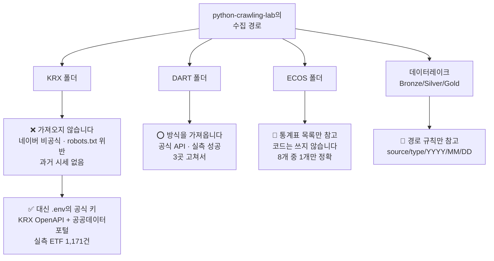

**[#31](../issues/031.md) 본문에 적은 "가져오되 코드를 옮기지 말고 방식만 본다"는 유지합니다.** 다만 이유가 바뀌었습니다. 라이선스 때문이 아니라 **코드가 실제로 돌지 않거나(ECOS), 돌면 안 되는 곳을 부르기 때문(KRX)**입니다.

| 대상 | 결정 | 이유 |
|---|---|---|
| `crawlers/krx.co.kr` | **가져오지 않음** | 네이버 비공식 · robots.txt `Disallow: /` · 과거 시세 없음 |
| `crawlers/dart.fss.or.kr` | **방식 채택** | 공식 API · 실측 성공. 단 300건 상한·`corpCode` 보강 필요 |
| `crawlers/ecos.bok.or.kr` | **통계표 목록만 참고** | 주기 코드·통계표 코드 재작성 필요 |
| ETF 시세 | **공공데이터포털 기간 조회** | 휴장일 행이 없어 A4 [#23](../issues/023.md)의 휴장일 문제가 자연히 빠짐 |
| 데이터레이크 | **[#31](../issues/031.md) 3번 답 유지 — 넣지 않음** | 날짜 파티션 규칙만 참고 |

**A4 [#23](../issues/023.md) 표는 이렇게 고쳐야 합니다** — ETF 줄과 Yahoo 줄의 "해소" 주체를 `crawling-lab`에서 **공식 API**로 바꿉니다. (표 수정은 팀장님 확인 뒤에 하겠습니다.)

---

## 8. 근거 · 반례 · 한계

<details>
<summary><b>이 판정을 뒤집을 조건</b> (강사님 피드백 ④ — 결론에 집착하지 않기)</summary>

| # | 이런 게 확인되면 | 판정이 이렇게 바뀝니다 |
|---|---|---|
| 1 | 공공데이터포털 ETF API에 **호출 한도**가 낮게 걸려 있다 (일 1,000건 등) | 전종목 × 수년치가 불가능 → KRX 공식(하루치 전종목)이 오히려 유리해집니다 |
| 2 | 공공데이터포털 `beginBasDt` 조회가 **과거 몇 년까지만** 지원한다 | 백테스트 기간이 제한됩니다. 별도 확인이 필요합니다 |
| 3 | KRX 공식 OpenAPI 이용약관이 **재배포·상업이용을 금지**한다 | 발표 자료에 수치를 싣는 방식을 조정해야 합니다 |
| 4 | 강사님이 `crawling-lab`을 **수업에서 직접 다루신다** | "안 가져온다"가 아니라 "수업에서 배운 뒤 고쳐 쓴다"로 바뀝니다 |
| 5 | ECOS 통계표 코드가 **제가 조회한 것과 다른 버전**이 있다 | 6.2 표가 바뀝니다 |

</details>

<details>
<summary><b>한계 — 확인하지 못한 것과, 조사 중 제가 틀렸던 것</b></summary>

**확인하지 못한 것**
1. **네이버 API는 일부러 호출하지 않았습니다.** 🟢 `Disallow: /`인 곳을 우리가 부르면 A11 [#25](../issues/025.md)에서 문제 삼은 행위를 우리가 하는 셈입니다. 그래서 "ETF 몇 종목이 나오는지"는 **실측값이 없습니다.** 코드 읽기까지만 했습니다.
2. **API 호출 한도를 확인하지 않았습니다.** 🟡 OpenDART·ECOS·공공데이터포털 모두 일일 한도가 있을 수 있는데, 약관 원문을 열지 않았습니다. 뒤집을 조건 1번과 연결됩니다.
3. **이용약관을 읽지 않았습니다.** 🟡 KRX·공공데이터포털 모두 "호출이 된다"까지만 확인했고, 재배포 조건은 확인하지 못했습니다.
4. **`python-crawling-lab`의 나머지 크롤러**(다음·업비트·Yahoo)는 목록만 보고 코드를 열지 않았습니다. 🟡
5. 실측은 **2026-09-17 KST 한 시점**입니다. 🟢

**조사 중 제가 틀렸다가 고친 것** (기록으로 남깁니다)
1. 휴장일에 KRX 공식이 **직전 영업일 값을 복사해 준다**고 의심했습니다. → 종목 수가 토·일에도 1,168건으로 같아서 그렇게 봤는데, **종가를 직접 꺼내 보니 빈 문자열**이었습니다. 복사가 아니라 빈 값입니다. 4절 표를 그 결과로 고쳤습니다.
2. ECOS 키가 URL에 있으니 **HTTP 오류가 날 때마다 로그에 샌다**고 적으려 했습니다. → 실측해 보니 ECOS는 `200 OK`에 오류를 담아 **예외가 아예 안 납니다.** 실제 유출은 **타임아웃·연결 실패 때만**입니다. 6.3을 그렇게 갈라 적었습니다.
3. OpenDART `fnlttSinglAcnt.json`에 `fs_div`를 넣으면 **오류가 날 것**으로 봤습니다. → 넣으나 빼나 `status=000`에 30건으로 **같았습니다.** 오류가 아니라 **무시**됩니다. 그래서 5절 표에서 뺐습니다. 다만 "연결/별도를 골랐다"고 믿으면 안 됩니다.

**A4 [#23](../issues/023.md) 재확인** — "휴장일 처리 0건"은 **정확했습니다.** 🟢 `app/` 전체에서 휴장일 관련 단어가 9번 나오는데, 전부 *"252거래일"* 같은 **설명 문구**이고 실제 판정 로직은 없습니다. 유니버스도 [`app/services/stock.py:15`](https://github.com/EST-team-project/Qurious/blob/04f476a/app/services/stock.py#L15) `QUANT_STOCKS`에 **31종목**이 하드코딩돼 있고 **ETF는 0개**입니다. 시세는 [`stock.py:9`](https://github.com/EST-team-project/Qurious/blob/04f476a/app/services/stock.py#L9)의 `query2.finance.yahoo.com` 비공식 차트 API를 직접 부릅니다.

</details>

<details>
<summary><b>용어 풀이</b></summary>

| 용어 | 뜻 | 이 문서에서 | 헷갈리는 점 |
|---|---|---|---|
| **공식 API / 비공식 API** | 공식은 기관이 "쓰세요" 하고 문서·키를 주는 통로. 비공식은 웹사이트 화면이 내부적으로 쓰는 주소를 몰래 가져다 쓰는 것 | KRX·DART·ECOS·공공데이터포털 = 공식 / 네이버·다음·Yahoo = 비공식 | **비공식도 잘 돌아갑니다.** 그래서 문제를 못 느끼다가, 어느 날 막히거나 약관 위반이 됩니다 |
| **robots.txt** | 사이트가 "자동 수집 프로그램은 어디까지 와도 된다"를 적어 두는 파일 | 네이버 금융은 `Disallow: /` — **전부 금지** | 법이 아니라 **약속**입니다. 다만 어기면 이용약관 위반 근거가 됩니다 |
| **인증키**(`crtfc_key`·`AUTH_KEY`·`serviceKey`) | 기관이 발급하는 신분증. 누가 얼마나 불렀는지 세는 용도 | `.env`에 보관하고 코드에 적지 않습니다 | **URL에 들어가는 방식**(ECOS)은 로그에 남기 쉽습니다 (6.3절) |
| **NAV** | Net Asset Value. ETF가 담고 있는 자산의 실제 가치 | 시장 가격과 NAV가 벌어진 정도가 **괴리율** | 가격 ≠ NAV입니다. 둘 다 받아 둬야 괴리를 볼 수 있습니다 |
| **통계표 코드 / 항목 코드** | ECOS에서 "어느 표"인지(`722Y001`)와 "그 표의 어느 줄"인지(`0101000`) | 6.2 표의 왼쪽/실제 | **둘 다 맞아야** 데이터가 옵니다. 하나만 틀려도 빈 응답입니다 |
| **주기 코드** | 데이터 간격. 연(`A`)·분기(`Q`)·월(`M`)·일(`D`) | crawler는 `MM`·`QQ`·`DD`로 적어 전부 실패 | 두 글자로 쓰고 싶어지는데 ECOS는 **한 글자**입니다 |
| **스냅샷 / 시계열** | 스냅샷은 "지금 이 순간" 한 장. 시계열은 날짜별로 쌓인 것 | 네이버 ETF API는 스냅샷만 | **백테스트에는 시계열이 필요합니다.** 스냅샷을 매일 모으면 시계열이 되지만, 과거는 못 되돌립니다 |
| **Bronze / Silver / Gold** | 원본 그대로 → 정리된 것 → 집계된 것, 3단 보관 방식 | `crawling-lab`이 쓰는 구조 | 우리는 **도입하지 않습니다**([#31](../issues/031.md) 3번). 날짜 폴더 규칙만 참고합니다 |

</details>

---

## 9. 덧 — 강사님 원본 점검 (2026-09-17 2차 확인)

세션 시작 시 원격만 읽기로 9곳을 다시 확인했습니다. [#15](../issues/015.md) 이후 **1곳이 더 움직였습니다.**

| 저장소 | 이전 | 현재 | 내용 |
|---|---|---|---|
| **domain-rag-lab** | `02c5ddb` | **`345e6c6`** | 커밋 1개 · 파일 4개 |
| 나머지 8곳 | — | 변동 없음 | lumina `6d91401` · investment `2cb9b7f` · stock-coin `ebb40c3` · quant-test `8684a2b` · python-ai-basic `b723826` · stock-ml-dl `09b5823` · python-ml-class `e84cf65` · python-crawling-lab `1572282` |

커밋 메시지: *"feat: update data ingestion process for DATA-ROOT corpus; **implement stable IDs for vector upserts**; enhance docker-compose for read-only access"*

| 변경 파일 | 증감 | 우리와 걸리는 곳 |
|---|---|---|
| `app/ops/ingest_data_root.py` | +173 / −91 | — |
| `app/services/vector_store.py` | +5 / −1 | **[A11 #25](../issues/025.md)** — "중복 방지의 정답과 오답이 같은 저장소에 있다"고 적었던 그 지점입니다 |
| `docker-compose.yml` | +2 / −0 | 읽기 전용 마운트 |
| `.gitignore` | +3 / −0 | — |

**"벡터 upsert에 안정적인 ID를 도입"**이 A11 [#25](../issues/025.md)가 지적한 중복 문제의 정답 쪽입니다. **다음 세션에서 이 4개 파일을 열어 A11 [#25](../issues/025.md)에 덧붙이겠습니다.** 오늘은 여기까지만 적고 분량을 늘리지 않겠습니다.

---

<sub>실측 2026-09-17 KST · `python-crawling-lab` 커밋 `1572282` · Qurious 기준 커밋 `04f476a` · 저장소를 로컬에 복제하지 않고 원격 읽기 전용으로 확인했습니다 · 네이버 API는 의도적으로 호출하지 않았습니다</sub>

---

<a id="issuecomment-5712780702"></a>

### 💬 2. 이동원(`devlee328288`) · 2026-09-17 19:22 KST

## [자체 검증] 질문 2번 — `python-ml-class` 어디까지 볼까요? 실제로 열어 봤습니다

> **쉬운 요약 3줄**
> 1. 위 본문은 **README와 파일 이름만 보고** 쓴 것이라고 적어 두었습니다. 이번에 **코드를 실제로 열어** 확인했더니, 제가 쓴 숫자 **3개가 틀렸습니다**(23개 → **24개** 등). 먼저 정정합니다.
> 2. "ARIMA·LSTM·Transformer 셋만 먼저"는 **방향은 맞았지만 이유가 달랐습니다.** 셋은 난이도 단계가 아니라 **서로 다른 세 가지 과제**였습니다 — 가격 예측(평가 없음) / 가격 회귀 / 상승·하락 분류.
> 3. 그리고 **그대로 쓰면 안 되는 것이 3가지** 있습니다: 기본 종목이 **GS 우선주**(공식 API로 확인 · 거래량이 보통주의 1/82), 데이터를 **yfinance**로 받고(24개 중 17개), **검정 방식이 둘 다 문제**가 있습니다(ARIMA는 평가 자체가 없고, LSTM은 정규화 누수).

---

### 0. 이 댓글이 답하는 것과 안 답하는 것

| 구분 | 내용 |
|---|---|
| 답한다 | 위 본문 **질문 2번**("23개 중 어디까지?")의 자체 검증 / 실습 개수·문서 구성의 **사실 확인** / 세 파일을 **그대로 쓸 수 있는가** |
| 안 답한다 | **무엇을 볼지 최종 결정** (팀 논의 몫입니다) / `python-crawling-lab` (아직 안 열어 봤습니다) / 나머지 21개 실습의 내부 |
| 기준 | `edumgt/python-ml-class` `e84cf65` · 조회일 2026-09-17 (KST) |
| 방법 | 저장소 tarball **1회** 내려받아 로컬에서 읽음(새 저장소를 만들지 않았습니다) · 종목 검증은 **공공데이터포털 공식 API** 실호출 · 모델은 **로컬 CPU로 실제 학습** |

확실도 표기: **🟢 코드·실측으로 확인** / **🟡 추론**

---

### 1. 한눈에 보기

| # | 확인한 것 | 결과 | 확실도 |
|---|---|---|:---:|
| 1 | 실습 개수 | **24개** (제가 쓴 23개는 틀림 — 같은 표의 이름도 24개였습니다) | 🟢 |
| 2 | "파일마다 설명 문서 1:1" | **22/24만.** `AutoencoderAnomalyDetect`·`DqnTradingAgent` 는 **문서도 결과도 없음** | 🟢 |
| 3 | `result/` 파일 수 | **46개** (MD 22 + PNG 24) — 제가 쓴 44개는 틀림 | 🟢 |
| 4 | 세 파일의 관계 | 난이도 단계가 **아님**. **서로 다른 세 과제** | 🟢 |
| 5 | 기본 종목 | `078935.KS` = **GS우(우선주)** — 24개 중 **16개에 하드코딩** | 🟢 |
| 6 | 그 종목의 유동성 | 거래량 **5,304주** vs 보통주 GS **435,642주** → **82배 차이** | 🟢 공식 API |
| 7 | 문서의 종목명 | 강사님 문서는 **"GS피앤엘"** 이라 적었으나, GS피앤엘은 **499790** 이다 | 🟢 공식 API |
| 8 | 데이터 출처 | **yfinance**(야후 비공식) — 24개 중 **17개** | 🟢 |
| 9 | 내려받기 실패 시 | **합성 데이터로 조용히 대체** — 그래프만 봐서는 진짜인지 모름 | 🟢 |
| 10 | ARIMA의 평가 | **out-of-sample 지표 0개.** AIC만 출력 | 🟢 |
| 11 | LSTM의 정규화 | `min/max` 를 **테스트 구간까지 포함해** 계산 → **누수** | 🟢 |
| 12 | 모델 크기 | LSTM **12,961개** · Transformer **7,202개** 파라미터 | 🟢 실측 |
| 13 | 로컬 학습 시간 | LSTM 300에폭 **약 63초** · Transformer 120에폭 **약 71초** (CPU) | 🟢 실측 |
| 14 | 본문이 빠뜨린 것 | **`webapp/` 이 있습니다** — Flask + 프론트 + 예측 API 7종 | 🟢 |
| 15 | 의존성 | `requirements.txt` 가 **`>=` 하한만** — 상한이 없어 재현이 보장되지 않음 | 🟢 |

---

### 2. 먼저, 제가 쓴 것을 정정합니다

위 본문은 마지막 절에 이렇게 적어 두었습니다:

> **README와 디렉터리 목록까지만 읽었습니다.** `python-ml-class`·`python-crawling-lab`은 실제 코드를 열어 보지 않았으므로, "쓸 수 있다"는 판단은 **파일 이름과 README 기준**입니다.

그 단서대로 열어 보니 **세 군데가 틀렸습니다** 🟢.

| 제가 쓴 것 | 실제 | 어떻게 확인했나 |
|---|---|---|
| "주식 주제 ML/DL 실습 **23개**" | **24개** | `src/*.py` 25개 − `korean_font.py`(폰트 설정 헬퍼) |
| "`docs/`에 파일마다 설명 문서가 **1:1로**" | **22개만** | `docs/` 24개 = 실습 문서 22 + `CloudMlMapping.md` + `korean_font.md` |
| "`result/`에 PNG+MD **44개**" | **46개** | MD 22 + PNG 24 |

> 첫 번째는 **제 본문 안에서도 어긋나 있었습니다** — 본문 글은 "23개"인데 바로 아래 접힌 표에 적은 이름은 세어 보면 24개였습니다(5+5+3+7+4). 표가 맞고 글이 틀렸습니다.

**문서가 없는 2개가 무엇인지가 중요합니다** 🟢:

| 실습 | `docs/` 설명 | `result/` 결과 | 본문에서 제가 한 말 |
|---|:---:|:---:|---|
| `AutoencoderAnomalyDetect` | ❌ | ❌ | "비지도 — 섹터 군집·차원축소" 갈래에 넣어 뒀습니다 |
| `DqnTradingAgent` | ❌ | ❌ | "DQN은 범위 밖으로 봅니다" |

DQN을 범위 밖으로 둔 판단은 그대로 두어도 되겠습니다 — **설명 문서와 실행 결과가 아예 없어서** 참고 자료로서의 값도 낮습니다. 반대로 `AutoencoderAnomalyDetect` 는 제가 "쓸 만하다" 쪽으로 적어 뒀는데, **혼자 읽어야 하는 파일**이라는 점을 감안해야 합니다.

---

### 3. 세 파일을 열어 보니 — "세 단계"가 아니라 "세 과제"

제가 "Phase 2 범위에서 셋만 먼저"라고 쓸 때는 **같은 문제를 푸는 난이도 순서**라고 생각했습니다. 아니었습니다 🟢.

```mermaid
flowchart TB
  subgraph A["① ArimaStockForecast"]
    A1["입력: 종가 전체<br/>2020-01-01 ~ 오늘"] --> A2["학습: 전체 구간<br/>분할 없음"] --> A3["출력: 앞으로 22거래일<br/>가격"] --> A4["평가: AIC 뿐<br/>맞았는지 못 잰다"]
  end
  subgraph L["② LstmStockPyTorch"]
    L1["입력: 최근 20일 종가<br/>Min-Max 정규화"] --> L2["학습:테스트 = 80:20<br/>시간순"] --> L3["출력: 다음 날<br/>가격 1개"] --> L4["평가: MAE · RMSE"]
  end
  subgraph T["③ TransformerAttention"]
    T1["입력: 최근 30일 수익률"] --> T2["학습:테스트 = 80:20<br/>시간순"] --> T3["출력: 다음 날<br/>상승 1 / 하락 0"] --> T4["평가: 정확도"]
  end
```

| | ① ARIMA | ② LSTM | ③ Transformer |
|---|---|---|---|
| **무엇을 맞히나** | 앞으로 22일 **가격 곡선** | 다음 날 **가격 1개** | 다음 날 **방향(오름/내림)** |
| 과제 종류 | 시계열 외삽 | **회귀** | **이진 분류** |
| 입력 | 종가 원본 | 종가 → Min-Max 정규화 | **수익률** |
| 창 길이 | — (전체) | 20일 | 30일 |
| 학습/테스트 분할 | **없음** | 80:20 시간순 ✅ | 80:20 시간순 ✅ |
| 평가 지표 | **AIC만** (적합도) | MAE · RMSE | 정확도 |
| 학습 설정 | — | 300에폭 · 배치 32 · Adam 1e-3 | 120에폭 · 배치 32 · Adam 5e-4 + 코사인 |
| 파라미터 수 | (통계 모형) | **12,961개** | **7,202개** |

**셋을 다 보는 값은 여전히 있습니다.** 다만 이유가 바뀝니다 — "쉬운 것부터 차례로"가 아니라, **"2차에서 무엇을 예측할 것인가"를 정하는 데 세 선택지를 다 보여주기 때문**입니다. 가격을 맞힐지, 방향을 맞힐지는 [D5 #18](../discussions/018.md)에서 아직 안 정했습니다.

---

### 4. 그대로 쓰면 안 되는 것 3가지

#### 4.1 기본 종목이 **우선주**입니다 🟢

24개 중 **16개**가 `TICKER = '078935.KS'` 를 그대로 씁니다. 이게 무엇인지 **공공데이터포털 공식 API(금융위원회 주식시세정보)로 직접 조회**했습니다(기준일 2026-09-16):

| 단축코드 | 종목명 | 시장 | 종가 | **거래량** | 시가총액 |
|---|---|---|---:|---:|---:|
| **078935** | **GS우** | KOSPI | 60,700원 | **5,304주** | 1,080억 |
| 078930 | GS | KOSPI | 112,000원 | **435,642주** | 10조 4,043억 |

> **거래량 82.1배 · 시가총액 96.3배 차이** 🟢

그리고 강사님 설명 문서(`result/ArimaStockForecast.md`)는 이 종목을 **"GS피앤엘(078935.KS)"** 이라고 적었는데, 같은 API로 이름을 거꾸로 찾아 보면 **GS피앤엘은 `499790`** 입니다 🟢. **종목명이 잘못 적혀 있습니다.**

왜 문제인가:

| 항목 | 우선주를 쓰면 |
|---|---|
| 유동성 | 하루 5천 주는 **호가가 띄엄띄엄**합니다. 모델이 배우는 "패턴" 상당수가 거래 부재에서 옵니다 🟡 |
| 체결 가정 | 2차·3차에서 모의 체결을 붙일 때 **슬리피지를 무시할 수 없습니다** ([D7 #13](../discussions/013.md)) 🟡 |
| 발표 | 문서를 그대로 인용하면 **틀린 종목명**을 말하게 됩니다 🟢 |

**우리가 쓸 때는 종목을 바꾸면 끝납니다** — 파일 맨 위 `TICKER` 한 줄입니다.

#### 4.2 데이터를 **yfinance**로 받고, 실패하면 **조용히 가짜로 바꿉니다** 🟢

24개 중 **17개**가 `yfinance` 를 씁니다. yfinance는 야후 파이낸스의 **문서화되지 않은 내부 주소**를 읽는 제3자 라이브러리입니다 — [A11 #25](../issues/025.md)에서 우리가 문제 삼은 **네이버 금융 크롤러와 같은 부류**입니다.

더 조심할 것은 **대체 동작**입니다. 세 파일 모두 이 모양입니다:

```python
try:
    import yfinance as yf
    df = yf.download(TICKER, start='2020-01-01', end=date.today().isoformat(), ...)
    ...
    print(f"   ✓ {TICKER}: {len(prices)}일 실제 데이터 로드")
except ...:
    # 내려받기 실패 → 합성 데이터
    prices = (100 + 0.12*t + 6*np.sin(t/18) + np.random.normal(0, 1.5, days))
```

| | 실제 데이터일 때 | 합성 데이터일 때 |
|---|---|---|
| 그래프 모양 | 주가처럼 생김 | **주가처럼 생김** (추세 + 사인파 + 잡음) |
| 콘솔 메시지 | `✓ 078935.KS: N일 실제 데이터 로드` | 다른 메시지 |
| **저장된 PNG만 보면** | — | **구분할 수 없습니다** 🟢 |

`np.sin` 으로 만든 값은 **주기가 일정해서 예측이 잘 됩니다.** 즉 **성능이 좋아 보일수록 가짜일 가능성을 먼저 의심해야 합니다** 🟡. 저장소의 `result/*.png` 가 어느 쪽으로 만들어졌는지는 **PNG만으로는 확인할 수 없었습니다**.

#### 4.3 검정 규격이 서로 다르고, 둘은 문제가 있습니다 🟢

이건 [D4 #17](../discussions/017.md)(검정 규격을 2·3차 공통으로)과 [A6 #14](../issues/014.md)에 바로 걸립니다.

**① ARIMA — 맞았는지 잴 수가 없습니다**

```
전체 데이터(2020-01-01 ~ 오늘)  ─────────────────────▶  전부 학습에 사용
                                                      │
                                                      └▶ 오늘 이후 22거래일 예측
평가: AIC 만 출력  (src/ArimaStockForecast.py:81)
```

AIC는 **가진 데이터를 얼마나 잘 설명하는가**이지 **앞을 얼마나 잘 맞히는가**가 아닙니다. 남겨 둔 구간이 없으니 **예측 정확도를 계산할 자리가 없습니다** 🟢. 강사님 문서도 이 점을 적어 두긴 했습니다 — *"AIC가 낮을수록 데이터를 잘 설명하는 모델이지만, 절대적 예측 정확도와는 다름"*.

**② LSTM — 정규화에 미래가 섞입니다**

```python
p_min, p_max = prices.min(), prices.max()      # ← 테스트 구간까지 포함한 전체에서 계산
norm = (prices - p_min) / (p_max - p_min + 1e-8)
...
split = int(len(X_all) * 0.8)                  # ← 그 다음에 나눈다
```

정규화 기준값을 **나누기 전에, 전체에서** 구했습니다. 학습 시점에는 알 수 없는 **미래의 최고가·최저가**가 스케일에 들어갑니다 🟢.

| | 얼마나 심각한가 |
|---|---|
| 방향 | **누수는 맞습니다.** 시계열 교재가 첫 장에서 경고하는 형태입니다 🟢 |
| 크기 | 다만 새는 것은 **상수 2개(최고·최저)** 지 정답 자체가 아닙니다. 정확도를 크게 부풀리진 않습니다 🟡 |
| 우리에게 | **2·3차에서 그대로 베끼면 안 되는 형태**입니다. 올바른 방법은 **학습 구간에서만** `min/max` 를 구하고 테스트에 그 값을 적용하는 것입니다 |

**③ Transformer — 분할은 맞는데, 비교 기준이 헐겁습니다**

수익률을 쓰므로 정규화 누수는 없습니다 ✅. 분할도 시간순 80:20입니다 ✅. 다만 강사님 문서는 기준선을 **0.5(동전 던지기)** 로 잡습니다. 주가 방향은 보통 **상승일이 조금 더 많아서**, 올바른 비교 대상은 0.5가 아니라 **"항상 상승이라고 찍기"의 정확도(= 상승일 비율)** 입니다 🟡. 이 기준선이 예컨대 0.53이면, 정확도 0.52는 **동전보다 낫지만 무지성 매수보다 못한** 것입니다.

---

### 5. 본문이 빠뜨린 것 — **`webapp/` 이 있습니다** 🟢

위 본문의 접힌 표에는 `src/`·`docs/`·`result/` 만 적었는데, 저장소에는 **동작하는 웹 앱**이 하나 더 있습니다.

```
webapp/
  backend/app.py           Flask — /api/models · /api/stock-data · /api/predict
  backend/stock_models.py  실제 예측 함수 7종
  frontend/index.html · css/style.css · js/app.js · js/charts.js
  start.sh
```

`stock_models.py` 가 제공하는 것 🟢:

| 함수 | 하는 일 | 우리 쪽 연결 |
|---|---|---|
| `technical_analysis` | **RSI(14)** · **MACD(12,26,9)** 계산 | [A5 #19](../issues/019.md)·[D6 #20](../discussions/020.md) — **RSI 구현이 또 한 벌 늘었습니다** |
| `arima_forecast` | ARIMA 22일 예측 | 2차 |
| `lstm_predict` | LSTM (80에폭으로 축소) | 2차 |
| `cnn_lstm_hybrid` | CNN+LSTM (60에폭) | 2차 |
| `logistic_trade_signal` · `svm_market_phase` | 매매 신호 · 국면 분류 | 2차·4단계 |
| `kmeans_cluster` | 종목 군집 | 로보어드바이저 |

**이게 왜 중요한가**: 우리가 2차에서 하려는 일 — *"모델 예측을 화면에 붙인다"* — 의 **가장 작은 완성본**이 이미 있습니다 🟡. 실습 파일은 스크립트라 화면이 없는데, 이건 API까지 있습니다. **본문 표를 이 항목으로 보강해야 합니다.**

> 다만 `lstm_predict` 는 에폭을 300 → 80으로, `cnn_lstm_hybrid` 는 60으로 줄여 놨습니다. **웹 요청 안에서 매번 학습하는 구조**라 그렇습니다 🟡 — 우리가 쓸 구조는 아닙니다(미리 학습해 두고 불러오는 쪽).

---

### 6. 로컬에서 돌릴까요, Colab으로 보낼까요 — 재 봤습니다

우리 규약의 판정표는 "딥러닝 학습 → Colab Pro"입니다. **이 실습들은 예외입니다** 🟢.

모델 정의를 원문 그대로 옮겨 **로컬 CPU에서 실제로 학습**시켰습니다 (torch 2.9.1+cpu · 16 스레드 · 학습 샘플 약 1,100개 — 실습과 같은 규모):

| | 파라미터 수 | 1에폭 | 실습 설정 | **전체 예상** |
|---|---:|---:|---|---:|
| `LSTMStock` | **12,961개** | 0.210초 | 300에폭 | **약 63초** |
| `StockTransformer` | **7,202개** | 0.589초 | 120에폭 | **약 71초** |

```
         0초      30초      60초      90초
LSTM     ████████████████████▏ 63초
Trans    ██████████████████████▊ 71초
                              ← 둘 다 1분 남짓, CPU만으로
```

**둘 다 1분 안팎입니다.** 파라미터가 1만 개 안팎이라 GPU로 보내면 **데이터를 옮기는 시간이 학습보다 오래 걸립니다** 🟡. 우리 판정표가 딥러닝을 Colab으로 보내는 이유는 *"GPU 이득이 큰 실질 후보"* 라는 조건이 붙어 있어서이고, **이 실습들은 그 조건에 해당하지 않습니다.**

> 다만 이건 **실습 크기 기준**입니다. 2차에서 종목을 수백 개로 늘리거나 모델을 키우면 판정이 달라집니다(8절 3번).

---

### 7. 용어 풀이

| 말 | 한 줄 뜻 | 이 문서에서 |
|---|---|---|
| **우선주** | 의결권이 없는 대신 배당을 더 받는 주식. 보통 **거래가 훨씬 적다** | `078935` GS우 |
| **out-of-sample** | 학습에 **쓰지 않고 남겨 둔** 구간. 여기서 재야 진짜 성능 | ARIMA에 없는 것 |
| **AIC** | 모델이 **가진 데이터를 잘 설명하는지**의 점수 | 예측 정확도와 다르다 |
| **에폭(epoch)** | 학습 데이터를 **처음부터 끝까지 한 번** 훑는 것 | LSTM 300회 · Transformer 120회 |
| **파라미터** | 모델이 학습으로 **조정하는 숫자의 개수**. 모델 크기의 척도 | 7천~1만 3천 개 = 아주 작다 |

#### 자세히 볼 것

**데이터 누수 (data leakage)**
- *정확한 뜻*: **학습 시점에는 알 수 없는 정보**가 학습에 섞여 들어가는 것.
- *이 문서에서*: LSTM이 정규화 기준값(`min`·`max`)을 **테스트 구간까지 포함해** 구한 것.
- *헷갈리기 쉬운 점*: **"테스트 데이터를 학습에 넣었다"만 누수가 아닙니다.** 평균·표준편차·최댓값 같은 **요약값 하나만 새어도** 누수입니다. 그래서 눈으로는 잘 안 보입니다 — 코드에서 **`fit` 을 언제 했는가**를 봐야 합니다.

**기준선 (baseline)**
- *정확한 뜻*: "이것보다는 나아야 의미가 있다"는 **최소 비교 대상**.
- *이 문서에서*: Transformer 정확도를 무엇과 비교할 것인가.
- *헷갈리기 쉬운 점*: **이진 분류라고 기준선이 항상 0.5가 아닙니다.** 상승일이 53%인 구간에서는 **"무조건 오른다"고 찍기만 해도 53%** 입니다. 진짜 기준선은 **가장 많은 쪽으로 찍기(다수 클래스)** 입니다.

**합성 데이터 대체 (synthetic fallback)**
- *정확한 뜻*: 진짜 데이터를 못 구했을 때 **비슷하게 생긴 가짜**를 대신 쓰는 것.
- *이 문서에서*: `yf.download` 가 실패하면 `np.sin` + 잡음으로 만든 가격.
- *헷갈리기 쉬운 점*: **교육용으로는 좋은 설계입니다** — 인터넷이 없어도 수업이 돌아갑니다. 문제는 **결과물(PNG)에 어느 쪽인지 안 적힌다**는 것입니다. 우리가 쓸 때는 **"진짜/가짜"를 그래프 제목에 박아 두는 편**이 안전합니다 🟡.

**yfinance**
- *정확한 뜻*: 야후 파이낸스 웹사이트가 내부적으로 쓰는 주소를 읽어 오는 **제3자 파이썬 라이브러리**. 야후가 공식으로 제공하는 API가 아닙니다.
- *이 문서에서*: 24개 중 17개의 데이터 출처.
- *헷갈리기 쉬운 점*: **"잘 되니까 괜찮다"가 근거가 되지 않습니다** — A11 [#25](../issues/025.md)에서 네이버 크롤러를 두고 한 이야기와 같습니다. 또 야후는 한국 종목의 **과거 데이터가 듬성듬성한 경우**가 있어, 정확성 면에서도 KRX 공식 데이터가 낫습니다 🟡.

---

### 8. 그래서 질문 2번에 대한 답은 — **"셋만 먼저"는 유지, 이유와 조건을 바꿉니다**

| | 본문에 쓴 것 | 검증 뒤 |
|---|---|---|
| 무엇을 볼까 | ARIMA · LSTM · Transformer 셋 | **그대로 셋** |
| 왜 | "넓게보다 깊게" | **셋이 서로 다른 과제라, [D5 #18](../discussions/018.md)에서 "무엇을 예측할지" 고르는 재료가 되기 때문** |
| 어떻게 | (안 적음) | **종목·데이터 출처·검정 방식 3가지를 바꿔서** (4절) |
| 추가 | (안 적음) | **`webapp/` 을 같이 봅니다** — 화면에 붙이는 최소 완성본 (5절) |
| 어디서 | (안 적음) | **로컬 CPU.** 1분이면 끝납니다 (6절) |

바꿔야 할 3가지를 정리하면:

| 바꿀 것 | 지금 | 우리 쪽 |
|---|---|---|
| 종목 | `078935.KS` (GS우) | 유동성 있는 종목으로. `TICKER` 한 줄 |
| 데이터 | `yfinance` | **KRX·공공데이터포털 공식 API** (이 댓글의 종목 조회에 쓴 그 경로) |
| 검정 | ARIMA 무평가 · LSTM 누수 | **[D4 #17](../discussions/017.md) 공통 규격**으로 통일 |

---

### 9. 이 판정을 뒤집을 조건

| # | 조건 | 무엇이 바뀌나 |
|---|---|---|
| 1 | `result/*.png` 가 **합성 데이터로 만들어진 것**으로 확인되면 | "돌리지 않고도 결과를 먼저 볼 수 있다"(본문)가 약해집니다. **PNG만으로는 아직 확인 못 했습니다** 🟡 |
| 2 | 강사님이 `TICKER` 를 바꾸거나 데이터 출처를 KRX로 옮기면 | 4.1·4.2가 해소됩니다 |
| 3 | 2차에서 **종목 수백 개 · 모델 확대**로 가면 | 6절의 "로컬이면 된다"가 뒤집힙니다 |
| 4 | `python-crawling-lab` 을 열어 보면 | 본문 2절 표의 "해소 주체"가 또 달라질 수 있습니다 — **아직 안 열어 봤습니다** |
| 5 | 상승일 비율을 실제로 세어 보면 | 4.3 ③의 기준선이 구체적 숫자로 바뀝니다. **아직 안 셌습니다** 🟡 |

---

### 10. 2차 설계로 넘기는 질문 (여기서 결론내지 않습니다)

1. 2차에서 맞힐 것은 **가격인가 방향인가**? 세 실습이 정확히 이 갈림길을 보여줍니다 → [D5 #18](../discussions/018.md)
2. **정규화 기준값을 어디서 구할지**를 D4 공통 규격에 넣을까요? (학습 구간에서만) → [D4 #17](../discussions/017.md)
3. 분류 과제의 **기준선을 무엇으로 할지** — 0.5인가, 다수 클래스인가 → [D4 #17](../discussions/017.md)
4. `webapp/stock_models.py` 의 **RSI·MACD 구현을 셀지** — A5 [#19](../issues/019.md)가 센 "세 벌"에 더해집니다 → [A5 #19](../issues/019.md)
5. 모델을 **요청마다 학습**할지 **미리 학습해 두고 불러올지** (webapp은 전자입니다)

---

### 한계

| 안 한 것 | 이유 |
|---|---|
| 실습 24개를 **실제로 실행**하지 않았습니다 | 시간·yfinance 호출 회피. **코드 읽기 + 모델만 따로 학습**해 실측했습니다 |
| `result/*.png` 를 **열어 보지 않았습니다** | 이미지 24장. 진짜/합성 구분은 **PNG로는 불가능**하다고 판단했습니다 🟡 |
| 나머지 21개 실습은 **이름·갈래만** 확인했습니다 | 질문 2번의 범위가 세 개였습니다 |
| `python-crawling-lab` 은 **손대지 않았습니다** | 별건입니다 |

**조사 중 고친 것**: 처음에는 `078935` 를 강사님 문서대로 "GS피앤엘"로 적으려 했습니다. 공식 API로 조회하니 **GS우**였고, GS피앤엘은 **499790** 인 다른 회사였습니다. **문서에 적힌 것을 그대로 옮기지 않고 한 번 더 확인한 것이 맞았습니다.**

**조회 방법**: 저장소는 tarball **1회**만 내려받아 임시 폴더에서 읽었습니다(새 저장소를 만들지 않았고, 팀 폴더에도 넣지 않았습니다). 종목 검증은 **공공데이터포털 금융위원회 주식시세정보 API**를 직접 호출했습니다. 모델 측정은 **로컬 CPU**에서 했습니다.

---

<a id="issuecomment-5713249020"></a>

### 💬 3. 이동원(`devlee328288`) · 2026-09-17 20:00 KST

## [후속 조사] ETF 시세를 어디서 받을지 확정합니다 — 뒤집을 조건 1~3번 판정

> **쉬운 요약 3줄**
> 1. **과거를 얼마나 주느냐에서 갈렸습니다.** 공공데이터포털은 **2020-01-02부터**(1,647거래일), KRX 공식은 **2010-01-04부터**(약 4,100거래일) — **10년 차이**입니다.
> 2. **[S17에서 제가 적은](../issues/031.md#issuecomment-5712385662) "과거 시계열은 공공데이터포털로"를 뒤집습니다.** 6.7년만 쓸 게 아니라면 KRX가 유일한 경로입니다.
> 3. 그리고 **묻지 않았던 것이 하나 더 나왔습니다** — 2020년에 있던 ETF 450개 중 **100개(22.2%)가 지금 없습니다.** 오늘 상장된 1,171개로만 백테스트하면 성과가 부풀려집니다.

조사일 **2026-09-17(KST)** · 확실도 **🟢 실측·원문 확인 / 🟡 추론·미확인**

---

## 0. 한눈에 보기 — 조건 1~3번 판정

S17 8절에 적어 둔 "이 판정을 뒤집을 조건" 중 1~3번을 닫습니다.

| # | S17에 적은 "이런 게 확인되면" | 확인 결과 | 판정 |
|---|---|---|---|
| 1 | 공공데이터포털에 **호출 한도**가 낮게 걸려 있다(일 1,000건 등) | 개발계정 **일 10,000회** · KRX도 **일 10,000회** | **발동 안 함** — 동률 🟢 |
| 2 | 공공데이터포털이 **과거 몇 년까지만** 지원한다 | **2020-01-02 시작** · KRX는 **2010-01-04** | ✅ **발동** — 제안이 뒤집힙니다 🟢 |
| 3 | KRX 약관이 **재배포·상업이용을 금지**한다 | 제6조②·제11조② **금지 맞음**. 단 **공공데이터포털도 제4유형으로 똑같이 금지** | ⚠️ **발동하되 무승부** 🟢 |

**조건 목록에 없던 것이 2가지 더 나왔습니다.**

| 새로 확인 | 내용 | 무게 |
|---|---|---|
| **생존편향** | 2020-01-02 ETF **450종목** → 2026-09-16 **1,171종목**, 그중 **100종목(22.2%)이 사라짐** | 🔴 백테스트 신뢰도 직결 |
| **인증키 양도 금지**(제7조⑤) | 키 하나를 팀이 돌려쓰면 약관 위반 → **4명 각자 발급** | 🟠 2차 착수 전 처리 |

---

## 1. 제공 기간 — 실측

```
연도   2010   2012   2014   2016   2018   2020   2022   2024   2026
       │      │      │      │      │      │      │      │      │
KRX    ████████████████████████████████████████████████████████████   약 4,100 거래일 · 2010-01-04 ~
포털                                      █████████████████████████   1,647 거래일 · 2020-01-02 ~
                                          ↑ 여기가 벽
```

| 확인한 것 | KRX 공식 OpenAPI | 공공데이터포털 |
|---|---|---|
| 가장 오래된 데이터 | `basDd=20100104` → **50종목**, KODEX 200 종가 **22,710** 🟢 | `069500` 전 기간 `totalCount=1647`, 최古 **20200102** 🟢 |
| 그 직전은? | `20091201` · `20090102` · `20080102` · `20060102` · `20050103` · `20030102` · `20021014` → **전부 0건** 🟢 | `beginBasDt=20100101&endBasDt=20101231` → `resultCode=00`인데 `totalCount=0` (오류가 아니라 **빈 응답**) 🟢 |
| 종목마다 다른가? | — | KODEX 200 · TIGER 200 · KODEX 레버리지 **셋 다 1,647건 · 최古 20200102** → 상장일이 아니라 **API 공통 시작일** 🟢 |
| 한 번에 받을 수 있나 | 하루치 전종목(1,171건)이 1회 | `numOfRows=2000` 요청 → **1,647행 전부 1회 수신** 🟢 |

> 💡 KODEX 200은 **2002-10-14 상장**입니다. 두 경로 모두 상장 이후 전 기간을 주지 않습니다 — KRX도 2010년이 벽입니다. 그 이유는 약관·안내 어디에도 적혀 있지 않아 **경계만 실측했습니다.** 🟡

---

## 2. 생존편향 — 이번 조사에서 가장 무거운 발견 🔴

> **생존편향(survivorship bias)**: 살아남은 것만 보고 판단해 성과를 실제보다 좋게 보는 착각.

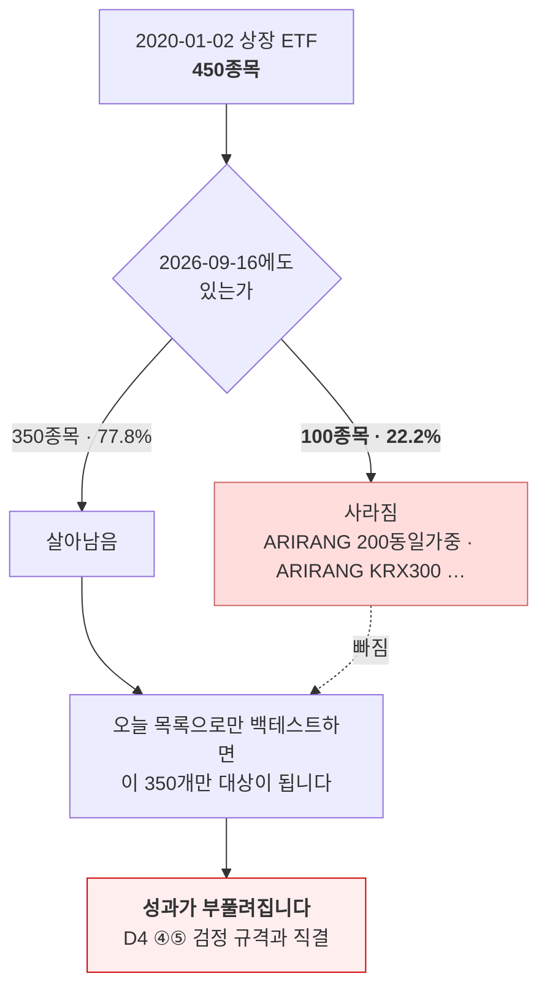

**두 경로가 이 문제를 어떻게 다루는가** — 여기서 제가 한 번 틀렸습니다(3절에 적었습니다).

| | KRX 공식 | 공공데이터포털 |
|---|---|---|
| 과거 그날의 **유니버스** | ✅ `basDd` 조회가 **그날 상장 전종목**을 줌 → 폐지 종목이 저절로 들어옴 🟢 | ❌ 종목코드를 **알아야** 조회 가능 — 목록 자체는 주지 않음 🟢 |
| 폐지 종목의 **데이터** | ✅ 그날 데이터에 포함 | ✅ **있습니다** — `likeSrtnCd=295820` → **1,105행**, 마지막 거래일 **2024-06-25** 🟢 |
| 그래서 | **유니버스 구성이 가능** | 데이터는 있으나 **목록 확보 경로가 따로 필요** |

숫자로 보면 이렇습니다.

```
2020-01-02 ETF 450종목
살아남음  ███████████████████████████████████████████  350 (77.8%)
사라짐    ████████████                                 100 (22.2%)   ← 오늘 목록엔 없습니다
```

---

## 3. 근거 · 반례 · 한계

<details>
<summary><b>조사 중 제가 틀렸다가 고친 것</b> (기록으로 남깁니다)</summary>

폐지 종목을 공공데이터포털에 조회할 때 **단축코드(`295820`)를 `isinCd` 파라미터에 넣었습니다.** `totalCount=0`이 나와 *"공공데이터포털은 폐지 종목을 주지 않는다"*고 결론 낼 뻔했습니다.

→ `likeSrtnCd`로 다시 부르니 **1,105행**이 나왔습니다. **파라미터 오류를 데이터 없음으로 읽은 것**입니다. 🟢

같은 함정이 하나 더 있었습니다 — 처음 호출이 전부 `HTTP 403`이었는데, **이미 URL 인코딩된 키를 한 번 더 인코딩**해서였습니다. 인증 실패가 아니었습니다. 🟢

</details>

<details>
<summary><b>확인하지 못한 것</b></summary>

1. **운영계정 승인 후 한도**는 확인하지 않았습니다 — 포털 표기는 *"활용사례 등록시 신청하면 트래픽 증가 가능"*까지입니다. 🟡
2. **KRX가 2010년 이전을 주지 않는 이유**는 약관·안내에 설명이 없습니다. 경계만 실측했습니다. 🟡
3. **전량 수집 호출 수는 추정**입니다 — KRX 약 4,100회(거래일 수 추정), 포털 약 1,171회 + 폐지 종목분. 실제로 전량을 받아 보지는 않았습니다. 🟡
4. 국내 **주식**(ETF 아님) 시세는 이번에도 확인하지 않았습니다 — 포털의 **별도 API**(주식시세정보)입니다. [A4 #23](../issues/023.md)의 `QUANT_STOCKS` 31종목이 여기 걸립니다. 🟡
5. 실측은 **2026-09-17 KST 한 시점**입니다. 🟢
6. 비공식 API(네이버·다음·Yahoo)는 이번에도 **호출하지 않았습니다** — [A11 #25](../issues/025.md)에서 우리가 문제 삼은 행위입니다. 🟢

</details>

<details>
<summary><b>원문 인용</b> (2026-09-17 KST 직접 조회)</summary>

| 출처 | 조항 | 원문 |
|---|---|---|
| [KRX OPEN API 이용약관](https://openapi.krx.co.kr/contents/OPP/INFO/OPPINFO002.jsp) | 제8조 ④ | *"하나의 키당 1일(매일 0시~24시) 10,000회 이하의 요청으로 제한하며, 이를 초과할 경우 서비스가 중지될 수 있다."* |
| 〃 | 제8조 ⑤ | *"한국거래소에서 발급된 인증키는 **12개월간 미사용시** 사전 공지 없이 삭제될 수 있다."* |
| 〃 | 제6조 ② | *"API 이용자는 API 서비스를 **비상업적인 목적으로만** 이용할 수 있으며, API 서비스를 이용한 결과에 대한 대가를 제3자에게 청구해서는 아니된다."* |
| 〃 | 제7조 ⑤ | 금지사항 — *"**API 인증키의 양도**, 증여 및 담보 목적물 사용"* |
| 〃 | 제10조 ③ | *"API 이용자가 API 서비스를 이용한 결과를 사용하여 화면을 제작한 경우, 해당 화면에 **"한국거래소 통계정보"**를 사용한 결과임을 명시해야 한다."* |
| 〃 | 제11조 ② | *"API 이용자는 한국거래소로부터 제공받은 정보를 **제3자에게 제공할 수 없다.**"* |
| 〃 | 제11조 ③ | *"API 이용자는 이용기간 만료, 해지 등의 사유로 이용계약이 종료된 이후에는 한국거래소로부터 제공받은 정보를 **이용할 수 없다.**"* |
| [공공데이터포털 15094806](https://www.data.go.kr/data/15094806/openapi.do) | 이용허락범위 | *"공공저작물 : 출처표시, **상업적 이용금지, 변경금지** (제4유형)"* |
| 〃 | 일일 트래픽 | *"개발계정 10,000"* · 운영계정은 *"활용사례 등록시 신청하면 트래픽 증가 가능"* |
| 〃 | 갱신 | *"데이터 갱신주기는 일 1회"* · *"기준일자로부터 영업일 하루 뒤 오후 1시 이후에 업데이트"* |

> ⚠️ **조건 3이 두 경로 모두에 걸립니다.** KRX는 약관으로, 포털은 공공누리 제4유형으로 **상업적 이용과 재배포를 금지**합니다. 어느 쪽을 골라도 [D2 #10](../discussions/010.md) 3.5절의 **K1(파생 결과만 공개)** 은 그대로 유지해야 합니다. 발표 자료에 **원자료 표를 그대로 싣는 것은 두 경로 다 안 됩니다.** 🟢

</details>

<details>
<summary><b>용어 풀이</b></summary>

**빠른 대조표**

| 용어 | 한 줄 뜻 |
|---|---|
| 생존편향 | 살아남은 것만 세어 성과를 좋게 보는 착각 |
| 일일 트래픽 | 하루에 API를 몇 번 부를 수 있는지 |
| 개발계정 / 운영계정 | 공공데이터포털의 두 단계 — 시험용 / 실서비스용 |
| 공공누리 제4유형 | 출처표시 + 상업적 이용금지 + 변경금지 |
| 단축코드 / ISIN | `069500` (6자리) / `KR7069500007` (12자리 국제표준) |
| NAV | ETF가 담은 자산의 실제 가치 |

**자세히** — *정확한 뜻 → 이 문서에서 → 헷갈리기 쉬운 점*

| 용어 | 정확한 뜻 | 이 문서에서 | 헷갈리기 쉬운 점 |
|---|---|---|---|
| **생존편향** | 표본에서 중도 탈락한 것이 빠져 결과가 낙관적으로 치우치는 현상 | 2020년 ETF 450개 중 100개가 지금 없습니다 | **"상장폐지된 건 나쁜 ETF니까 빼도 된다"가 아닙니다.** 그 반대입니다 — 성과가 나빠 사라진 것을 빼면 전략이 실제보다 좋아 보입니다 |
| **일일 트래픽** | 인증키 하나가 하루에 호출할 수 있는 상한 | 양쪽 다 **10,000회** | **호출 1회가 받는 양은 다릅니다.** KRX 1회 = 하루치 전종목, 포털 1회 = 한 종목의 여러 해. 같은 10,000회가 같은 값이 아닙니다 |
| **개발계정 / 운영계정** | 포털이 나누는 두 단계. 개발은 자동승인, 운영은 활용사례 등록 뒤 상향 신청 | 우리는 **개발계정 기준**으로 계산했습니다 | 개발계정이라도 **10,000회**입니다. "개발용이라 적을 것"이라는 짐작이 틀렸습니다 |
| **공공누리 제4유형** | 출처표시 + 상업적 이용금지 + 변경금지 | 포털 ETF 시세에 붙은 조건 | **"변경금지"가 분석 금지는 아닙니다.** 저작물 자체를 고쳐 배포하지 말라는 뜻으로 읽는 것이 일반적이지만, 파생 지표 공개 범위는 **보수적으로** 잡는 편이 안전합니다 🟡 |
| **단축코드 / ISIN** | 국내 6자리 / 국제표준 12자리 | 포털은 `likeSrtnCd`(단축) · `isinCd`(국제) 두 파라미터를 따로 받습니다 | **바꿔 넣으면 오류가 아니라 `totalCount=0`이 옵니다.** 제가 이번에 걸렸습니다(3절) |
| **`basDd` / `basDt`** | 기준일자. KRX는 `basDd`, 포털은 `basDt`·`beginBasDt`·`endBasDt` | 두 API의 철자가 다릅니다 | 이름이 비슷해 **코드에서 섞어 쓰기 쉽습니다** |

</details>

---

## 4. 그래서 제 제안 (결론 아님 — 팀이 정합니다)

| 용도 | 제안 경로 | 이유 |
|---|---|---|
| **과거 유니버스 + 과거 시계열** | **KRX 공식 OpenAPI** | 10년 더 길고, **그날의 유니버스를 그대로** 줍니다 |
| 종목 단위 최근 시계열 · ISIN 확보 | 공공데이터포털 | 1,647행을 **1회에** 받았고, 휴장일 행이 **아예 없습니다** |
| 교차검증 | 둘 다 | S17에서 같은 날 종목 수가 **1,171건으로 일치**했습니다 |

> ⚠️ **KRX를 주 경로로 쓰면 [S17이 지적한 함정](../issues/031.md#issuecomment-5712385662)이 그대로 따라옵니다** — KRX는 휴장일에 종가를 **빈 문자열**로 줍니다. `int(x or 0)` 같은 패턴에 넣으면 **토요일 종가가 0원**이 됩니다. A4 [#23](../issues/023.md)이 지적한 *"수익률 결측을 `0.0`으로"* 와 같은 사고입니다.

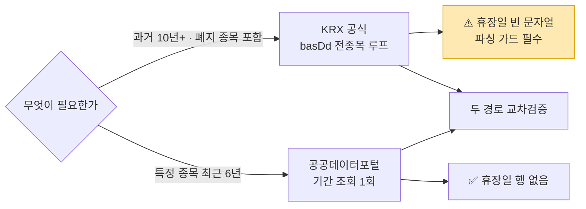

---

## 5. 팀에 묻습니다

| # | 질문 | 제 생각 |
|---:|---|---|
| 1 | **백테스트 기간을 몇 년으로 잡을까요?** 6.7년이면 포털만으로 끝나고, 그보다 길면 KRX가 필요합니다 | [D5 #18](../discussions/018.md)·[D4 #17](../discussions/017.md)에서 정할 일이라 **여기서 정하지 않습니다** |
| 2 | **인증키를 각자 발급받을까요?** | 네 — 제7조⑤가 **양도를 금지**합니다. 4명 각자 발급이 맞습니다 |

---

<sub>다음 세션(S20)에서 [A4 #23](../issues/023.md) 4.1 표의 *"KRX 공식 OpenAPI … 사이트 접근 자체가 막혀 있어 미확인"* 칸을 이 실측으로 고칩니다.</sub>

---

<a id="issuecomment-5724434833"></a>

### 💬 4. 이동원(`devlee328288`) · 2026-09-18 11:51 KST

## [후속] 강사님 원본 점검 · edumgt 53곳 전수 조사 · 질문 3·4 답

> **쉬운 요약 3줄**
> 1. **질문 4는 닫혔습니다.** 두 곳 로컬화를 넘어 **th11~th23 13곳**이 들어왔습니다.
>    edumgt 조직 저장소 **53곳 README를 전부 읽어** 고른 결과입니다.
> 2. **질문 3(데이터레이크)은 "넣지 않는다"를 유지**합니다. 코드를 직접 열어 보니
>    809줄에 **서버 의존성 3개**(MinIO·pyarrow·DuckDB)가 붙고, 그 전제가 D2 [#10](../discussions/010.md)과
>    충돌합니다. 다만 **Silver 층의 경로 규약 하나만 빌리는 절충안**을 새로 제안합니다.
> 3. 강사님 원본 9곳 중 **`domain-rag-lab`만 바뀌었습니다**(`345e6c6` → `3f28a55`).
>    프론트엔드 교육 콘텐츠 3커밋이고 **RAG 백엔드는 그대로**입니다.

조사일 **2026-09-18(KST)** · 확실도 **🟢 실측 / 🟡 추론·미확인**

---

## 1. 강사님 원본 점검 — 9곳 중 1곳 변경

| 저장소 | S19 | 지금 | |
|---|---|---|:--:|
| `domain-rag-lab` | `345e6c6` | **`3f28a55`** | 🔄 |
| `lumina-invest` · `investment-analysis` · `stock-coin-trade` · `quant-test-20260828` · `python-ai-basic-lab` · `stock-ml-dl-project` · `python-ml-class` · `python-crawling-lab` | — | 동일 | ✅ |

`domain-rag-lab` 3커밋 — 파일 9개 · **+1,229 −247**

| 무엇 | 어디 |
|---|---|
| 행동재무 종목·무위험 은행채 금리 레슨에 ID 부여 | `frontend/days/01·03·04.html` |
| Cash Cow · 신용위험 · 성장잠재력 레슨 + 금리추이 모달 차트 | `frontend/days/assets/growth-potential-rate.js` (신규 92줄) |
| 듀레이션 활용사례 시뮬레이터 | `duration-use-case-simulators.js/css` (신규 448줄) |
| 용어집에 '채무증권' 추가 | `glossary-modal.js` |

→ **전부 `frontend/days/` 교육 콘텐츠입니다.** `app/` · Qdrant 인제스트 · LEAN 백테스트
워크플로우는 손대지 않았으므로 **D3 [#30](../discussions/030.md) · A11 [#25](../issues/025.md)의 판단은 바뀌지 않습니다.** 🟢

---

## 2. 질문 4 — 닫힙니다. 범위가 훨씬 넓어졌습니다

> S17 질문 4: *"`learning/`에 없는 두 곳(`python-ml-class`·`python-crawling-lab`)을
> 로컬로 가져올까요?"* → 제 생각: *"팀장 판단으로 진행. 저장소를 새로 만들지 않고
> **읽기 전용**으로만 둔다"*

```
S17 질문 4:  learning 에 없는 2곳을 로컬로 가져올까?
                          ↓
2026-09-18:  th11 python-ml-class      ┐
             th12 python-crawling-lab  ├─ 정식 서브모듈 (강사님 원본 읽기 전용)
             th13 py-util              ┘
             th14 ~ th23 (10곳)        ─── pull 전용 (작업본 저장소 생성 대기)
                          ↑
             edumgt 53곳 README 전수 조사로 고름
```

edumgt 조직 **54곳 중 `.github`을 뺀 53곳의 README를 전부** 읽었습니다
(GraphQL 3회 일괄 수신 — 저장소마다 API를 반복 호출하지 않았습니다). 데이터수집·
퀀트전략·ML/DL·RAG 네 축의 신호에 가중치를 매겨 골랐습니다.

| 새로 들어온 것 | 왜 골랐나 | 우리 논의와 |
|---|---|---|
| **th15 `aihub-rag`** | *"공공데이터포털(data.go.kr): 예) 금융위원회 주식시세 정보 → 주식투자 도메인"* 절이 있음 | **A4 [#23](../issues/023.md) 열린 질문** — 국내 주식(ETF 아님) 공식 경로 `data 15094808` |
| **th18 `langchain-lab`** | **RAG 회귀평가 golden set · LLM-as-Judge · FAISS/BM25/Ensemble/Self-Query** | **D3 [#30](../discussions/030.md) ④⑤** 평가·중복 |
| **th16 `ai-agent-lab`** | Finance AI Agent LLMOps — ragPipeline 8단계 · 공공데이터/API Hub 연계 | D3 [#30](../discussions/030.md) |
| **th19 `multi-db-lab`** | Pinecone · Weaviate · Neo4j · Redis **벡터DB 비교 코드** | **A11 [#25](../issues/025.md)** "왜 Qdrant인가"의 대조군 |
| **th20 `aws-serverless`** | **"주가 데이터 AI/ML 파이프라인(Stock Pipeline)"** Lambda+S3+CI/CD | **D2 [#10](../discussions/010.md)** 유료 서비스 경계 |
| th14 `edumgt-lab-init` | th02 · th09 README가 **"선수 repo"로 직접 지목** | 준비물 |
| th17 `invest-flow` | CRGR(Collect·Refine·Group·Reuse) 금융 파이프라인 + 리밸런싱 캘린더 | D1 [#7](../discussions/007.md) · D4 [#17](../discussions/017.md) |
| th21 `ollama-llava-canvas` · th22 `vdp-agent` | **DART 공시 속보** · **OpenDART 연동** | A4 [#23](../issues/023.md) 공시 경로 |
| th23 `meeting-agent` | 증권사 **애널리스트 리포트 컨센서스** | D5 [#18](../discussions/018.md) 후보 |

<details>
<summary><b>고르지 않은 것과 이유</b> (53곳 중 43곳)</summary>

| 무리 | 저장소 | 왜 뺐나 |
|---|---|---|
| 금융이나 겹침 | `whisper-agent`(심리상담) · `education-counsel`(진로) · `flowise-lab`(노코드) · `chatbot-app`(Lex 종속 33MB) · `huggingface-lab`(yfinance=비공식) · `fortune-ai-agent`(사주) · `pipeline-lab`(제조·회계) · `voice-analyzer`(크롤링이 비공식) · `matlab-class`(화면만) | 도메인이 다르거나 이미 가진 것과 중복 |
| 인프라 | `kubernetes-lab` · `aws-eks-lab` · `k8s-jupyter-lab` · `harbor-lab` · `openstack-private-cloud` · `msa-k8s-lab` · `springboot-lab` · `keycloak-lab` · `aws-polly/transcribe/rekognition/sqs-sns` 등 | 2차 범위 밖 — 필요할 때 **원격 열람**이 낫습니다 |
| 비금융 | `yolo-lab` · `ocr-webapp` · `webrtc-app` · `inquiry-saas` · `ultrasound-report` · `java-lab` · `python-basic-lab` · `fe-vanilla` | 관련 없음 |

</details>

> ⚠️ **작업본 저장소는 아직 없습니다.** GitHub·GitLab 양쪽에 만들어야 정식 편입인데
> 하루 저장소 생성 할당량 탓에 10곳이면 3일이 걸립니다. 그때까지 **읽기 전용 pull만**
> 합니다 — 질문 4에 제가 적었던 *"저장소를 새로 만들지 않고 읽기 전용으로만 둔다"* 와
> 정확히 같은 자리입니다. 🟢

---

## 3. 질문 3 — 데이터레이크는 넣지 않되, 한 층만 빌립니다

> S17 질문 3: *"데이터레이크(MinIO·Bronze/Silver/Gold)를 우리 구조에 넣을까요?"*
> → 제 생각: *"지금은 **넣지 않는 쪽**. HF private dataset으로 같은 목적을 이미
> 달성합니다(D0 ⑥)"*

**이번에 코드를 직접 열었습니다** (커밋 `1572282`). 🟢

| 층 | 무엇을 | 어디에 | 줄수 |
|---|---|---|---:|
| **Bronze** | 원본을 변형 없이 JSONL | MinIO `bronze/{source}/{type}/{Y}/{M}/{D}/{ts}.jsonl` | 150 |
| **Silver** | 정제 후 **Parquet** | MinIO `silver/{type}/{Y}/{M}/{D}/data.parquet` | 195 |
| **Gold** | 집계 테이블 | **DuckDB** `analytics.duckdb` | 277 |
| **Catalog** | 수집 이력·스키마 메타데이터 | `catalog.json` | 173 |
| | | **합계** | **809** |

### 3.1 넣지 않는 이유 셋 — S17의 "HF로 이미 달성"에 실측을 더합니다

| # | 무엇 | 근거 |
|---|---|---|
| 1 | **서버가 전제다** — MinIO(S3 호환) 없이는 팀 공유가 안 된다 | `DATA_LAKE_LOCAL=true` 로컬 fallback이 있지만 그러면 **각자 PC에만 남는다** 🟢 |
| 2 | **의존성 3개 추가** — `minio` · `pyarrow` · `duckdb` | `requirements.txt` 주석까지 확인 🟢 |
| 3 | **전제에 비공식 경로가 깔려 있다** | `DATASET_DEFINITIONS`에 `naver`(`finance.naver.com`) · `daum`이 **1급 소스로 등록** — A11 [#25](../issues/025.md)에서 우리가 문제 삼은 바로 그 경로 🟢 |

3번이 특히 중요합니다. 데이터레이크를 통째로 들여오면 **그 카탈로그 정의까지 따라옵니다.**
쓰지 않을 소스를 스키마에 남겨 두면 나중에 누군가 켭니다.

### 3.2 그래도 빌릴 것 하나 — Silver 층의 경로 규약 🟡

```
silver/{data_type}/{year}/{month}/{day}/data.parquet
        ↑           └──────────────────┘
        무엇을        언제 시점의 자료인가
```

날짜를 경로에 박아 두면 **"이 파일은 언제 시점의 자료인가"가 파일 이름만으로 확정**됩니다.
as-of 정합을 지키는 데 **서버가 필요 없는 부분**이고, HF private dataset 위에도 그대로
얹힙니다.

| | crawling-lab 데이터레이크 | HF private (1차 방식) | **절충안** |
|---|---|---|---|
| 원본 보존 | Bronze JSONL | HF 커밋 | HF 커밋 |
| 정제본 | Silver Parquet | HF parquet | **+ 날짜 경로 규약** |
| 집계 | Gold DuckDB | 필요할 때 계산 | 필요할 때 계산 |
| 메타데이터 | `catalog.json` | 데이터셋 카드 | 데이터셋 카드 |
| 버전 추적 | 날짜 경로 | **git 커밋 해시** | 둘 다 |
| **서버** | **MinIO 필요** | 불필요 | **불필요** |
| **비용** | 호스팅 비용 | 무료 | **무료** |

---

## 4. 용어 풀이

**빠른 대조표**

| 말 | 한 줄 뜻 |
|---|---|
| 데이터레이크 | 원본을 그대로 쌓아 두고 층을 올려 가며 정제하는 저장 구조 |
| Bronze / Silver / Gold | 원본 그대로 / 정제본 / 분석용 집계 — 데이터레이크의 관행적 3층 이름 |
| MinIO | S3와 같은 방식으로 말을 거는 오픈소스 오브젝트 저장소. **서버를 띄워야 한다** |
| Parquet | 열 단위로 저장하는 표 형식 파일. CSV보다 작고 특정 열만 빨리 읽는다 |
| DuckDB | 파일 하나로 도는 분석용 DB. 서버 없이 SQL을 쓴다 |
| as-of 정합 | 행 T를 만들 때 **그 시점에 실제로 알 수 있었던 자료만** 쓰는 것 |

**자세히** — *정확한 뜻 → 이 문서에서 → 헷갈리기 쉬운 점*

- **데이터레이크의 "층"**
  *정확한 뜻*: 같은 자료를 가공 단계별로 따로 보관해, 뒤 단계가 틀려도 앞 단계로 되돌아갈
  수 있게 하는 구조.
  *이 문서에서*: crawling-lab이 Bronze·Silver·Gold 세 층으로 구현해 둔 것을 가리킵니다.
  *헷갈리기 쉬운 점*: **층을 나누는 것과 MinIO를 쓰는 것은 별개입니다.** 층 개념은
  폴더 이름만으로도 지킬 수 있고, 3.2의 절충안이 그 부분만 가져오자는 뜻입니다.

- **"넣지 않는다"의 범위**
  *정확한 뜻*: 그 패키지를 의존성으로 추가하지 않는다는 뜻입니다.
  *이 문서에서*: MinIO·DuckDB를 띄우지 않는다는 말이지, **파일을 Parquet으로 쓰지
  말자는 뜻이 아닙니다.**
  *헷갈리기 쉬운 점*: 1차 AlphaStack도 HF에 parquet으로 올렸습니다. 형식은 이미 쓰고
  있고, 문제는 **그 위에 서버를 얹느냐**입니다.

---

## 5. 한계

1. 2절의 **10곳은 README와 디렉터리 구조까지만** 봤습니다. th15 `aihub-rag`·th18
   `langchain-lab`은 우리 열린 질문에 직결되는데 **코드를 아직 열지 않았습니다.** 🟡
2. 3.2 절충안은 **제안**입니다 — D0 ⑥ · D2 [#10](../discussions/010.md)에서 정할 일이고 이 댓글은 정하지
   않습니다. 🟡
3. `domain-rag-lab` 변경 판단은 **diff stat과 커밋 메시지** 기준입니다. 파일 내용을 한
   줄씩 읽지는 않았으므로 `app/`에 영향이 없다는 것은 **경로 기준 판단**입니다. 🟡
4. 53곳 README 완독은 했으나 **코드까지 본 것은 아닙니다.** 관련도 점수는 README 어휘
   기준이라 **문서가 부실한 저장소가 저평가됐을 수 있습니다.** 🟡
5. 용량 합계 약 365MB를 로컬에 받았습니다. `.gitignore`로 제외해 커밋·push에는 섞이지
   않지만, **팀원이 같은 것을 받으려면 각자 clone해야 합니다.** 🟢

---

## 6. 판정을 뒤집을 조건

1. **th15 `aihub-rag`의 공공데이터포털 코드가 실제로 `주식시세정보`(data 15094808)를
   호출하고 있다면**, A4 [#23](../issues/023.md)의 열린 질문 하나가 바로 닫힙니다. 다음에 확인할 첫 번째입니다.
2. **팀이 MinIO를 이미 띄울 이유가 따로 있다면**(D2 [#10](../discussions/010.md)에서 그렇게 정해지면) 3절 결론이
   바뀝니다 — 서버 비용이 이미 지불된 상태에서는 반대 이유 1·2가 사라집니다.
3. **강사님이 `domain-rag-lab`의 `app/`을 고치시면** 1절 판단을 다시 해야 합니다. 이번
   변경은 프론트엔드에 한정됐을 뿐입니다.

---

<a id="issuecomment-5725033572"></a>

### 💬 5. 이동원(`devlee328288`) · 2026-09-18 13:11 KST

> **S21 실측.** [#31](../issues/031.md) 질문 2에서 *"`python-ml-class` 23개 중 ARIMA·LSTM·Transformer 셋만 먼저"* 로 정했으니, 그중 **Transformer 실습을 열어** 2차에 그대로 쓸 수 있는지 봤습니다. **두 가지를 고쳐야** 합니다. 그리고 열린 질문 하나가 닫혔습니다.

### 쉬운 요약 3줄

1. 강사님 실습은 *"정확도가 **0.5**를 넘으면 모델이 뭔가 배운 것"* 이라고 적고 있는데, **0.5는 이 문제의 기준선이 아닙니다.** 실제로 세어 보니 실습 종목은 **51.23%**, 삼성전자는 **57.72%** 였습니다. 🟢
2. 실습 종목(078935)은 **GS우 — 우선주**이고 하루 거래대금 중앙값이 **1.8억**입니다. GS 보통주의 **1/49**입니다. 그래서 **주가가 안 움직인 날이 9.77%** 나 되는데, 코드는 그걸 전부 "하락"으로 셉니다. 🟢
3. `result/*.png`는 **실제 데이터로 돌린 결과가 맞습니다** — 열린 질문 하나가 닫혔습니다. 🟢

### 한눈에 보기

| 확인 | 결과 | 확실도 |
|---|---|:---:|
| 기준선이 0.5인가 | ❌ **종목마다 다릅니다** (50.00% ~ 57.72%) | 🟢 실측 |
| 실습 종목이 적절한가 | ❌ **우선주 · 거래대금 1.8억** — 보합 9.77% | 🟢 실측 |
| 보합을 어떻게 처리하나 | ⚠️ **전부 "하락"으로 뭉갬** (`> 0` 한 줄) | 🟢 코드 |
| `result/*.png`가 실제 데이터인가 | ✅ **실제입니다** | 🟢 |
| 종목 이름이 맞나 | ❌ 문서는 "GS피앤엘", 실제는 **GS우** | 🟢 실측 |

### 용어 풀이 — 빠른 대조표

| 용어 | 한 줄 뜻 |
|---|---|
| 기준선 (baseline) | "아무것도 안 배운 모델"이 내는 점수. 이걸 넘어야 의미가 있다 |
| 다수 클래스 기준선 | **항상 많은 쪽으로만** 찍는 예측기의 정확도 |
| 클래스 불균형 | 정답이 한쪽으로 치우친 상태. 정확도를 착시로 만든다 |
| 보합 | 전일 대비 가격이 **변하지 않은** 날 |
| 우선주 | 의결권 없이 배당을 더 받는 주식. **보통 거래가 훨씬 적다** |

<details><summary><b>자세히</b> — 왜 0.5가 기준선이 아닌가</summary>

**다수 클래스 기준선 (majority-class baseline)**
- *정확한 뜻*: 학습을 전혀 하지 않고 **"항상 상승"** 또는 **"항상 하락"** 한쪽으로만 찍는 예측기의 정확도. 둘 중 **큰 값**이 기준선입니다.
- *이 문서에서*: 삼성전자 테스트 구간은 상승일이 57.72%이므로, **"항상 상승"이라 찍기만 해도 57.72%** 가 나옵니다. 모델이 55%를 냈다면 **기준선보다 나쁜 것**입니다.
- *헷갈리기 쉬운 점*: "동전 던지기 = 50%"는 **두 클래스가 정확히 반반일 때만** 맞습니다. 주가 방향은 반반이 아닙니다 — 구간에 따라 한쪽으로 치우칩니다. 강사님 문서의 회색 점선 0.5는 **이 가정에 기대고 있습니다.**

**왜 우선주에서 보합이 많은가**
- 거래가 적으면 **호가가 체결되지 않는 날**이 생기고, 종가가 전일과 같아집니다. GS우는 하루 거래대금 중앙값이 1.8억으로 GS 보통주(88억)의 **1/49** 입니다.
- 코드는 `1 if returns[...] > 0 else 0` 이므로 **보합이 전부 0(하락)** 이 됩니다. 하락 클래스가 인위적으로 부풀려지고, 기준선도 함께 흔들립니다.

</details>

---

### 1. 실측 — 종목 3개 비교

같은 전처리(`SEQ_LEN=30` · 8:2 시간순 split)를 그대로 재현하고, 공공데이터포털 금융위 주식시세(2020-01-02 ~ 2026-09-17, 1,648거래일)로 셌습니다. **Yahoo는 호출하지 않았습니다.**

| 종목 | 보합 비율 | 테스트 상승일 | **다수 클래스 기준선** | 하루 거래대금(중앙값) |
|---|---:|---:|---:|---:|
| **GS우** (078935 — 실습 종목) | **9.77%** | 48.77% | **51.23%** | **1.8억** |
| GS 보통주 (078930) | 3.90% | 50.00% | 50.00% | 88.0억 |
| 삼성전자 (005930) | 4.33% | **57.72%** | **57.72%** | 11,460.6억 |

```
기준선 비교  (0.5 = 강사님 문서가 적은 값)
GS우        ████████████████████░ 51.23%
GS 보통주   ████████████████████  50.00%
삼성전자    ███████████████████████ 57.72%   ← 0.5와 7.7%p 차이
```

**삼성전자로 바꿔 실습하면 문제가 더 큽니다.** 테스트 구간이 상승 편향(57.72%)이라, 모델이 55%를 내도 **아무것도 안 배운 예측기보다 못한** 것인데 문서 기준(0.5)으로는 "배웠다"가 됩니다.

### 2. 코드에서 확인한 것

| 위치 | 내용 |
|---|---|
| [`TransformerAttention.py:72`](https://github.com/edumgt/python-ml-class/blob/e84cf65/src/TransformerAttention.py) | `y_list.append(1 if returns[i + SEQ_LEN] > 0 else 0)` — **보합이 하락으로** |
| [`:199-201`](https://github.com/edumgt/python-ml-class/blob/e84cf65/src/TransformerAttention.py) | `acc_test`만 출력 — **기준선을 계산하지도, 보고하지도 않음** |
| `result/TransformerAttention.md` | *"회색 점선(0.5): 동전 던지기와 동일한 무작위 기준선"* · *"학습 정확도가 0.5를 의미 있게 넘어야 모델이 무언가를 배운 것"* |
| [`:43-44`](https://github.com/edumgt/python-ml-class/blob/e84cf65/src/TransformerAttention.py) | `yf.download(..., auto_adjust=True)` — **Yahoo 의존** (A11 [#25](../issues/025.md)에서 우리가 문제 삼은 경로) |
| [`:51-55`](https://github.com/edumgt/python-ml-class/blob/e84cf65/src/TransformerAttention.py) | 실패 시 **가상 데이터 500일**로 조용히 대체 |

### 3. 닫히는 열린 질문 — `result/*.png`는 실제 데이터입니다 🟢

| 근거 | 내용 |
|---|---|
| 파일명 | `TransformerAttention_078935_KS.png` — **티커가 파일명에 박혀 있습니다** |
| 대조군 | 종목 무관 스크립트는 접미사가 없습니다 (`HyperparamTuning.png` · `KMeansStockCluster.png`) |
| 문서 | `TransformerAttention.md` 첫 줄 — *"078935.KS **실제 주가 데이터**로"* |

→ 25개 png 중 종목 접미사가 붙은 것은 **실제 데이터로 돌린 결과**로 판정합니다. 🟢

**다만 종목 이름이 틀렸습니다.** 코드와 문서 모두 078935를 **"GS피앤엘"** 이라 부르는데, 포털·KRX 양쪽 실측 모두 **"GS우"** 입니다(KOSPI). 2차에서 이 코드를 인용할 때 그대로 옮기지 않는 편이 좋겠습니다.

### 4. 2차에 쓸 때의 처방

| # | 무엇 | 어떻게 |
|:--:|---|---|
| 1 | **기준선을 항상 함께 보고** | `baseline = max(y_test.mean(), 1 - y_test.mean())` 한 줄. 정확도와 **나란히** 출력 |
| 2 | **보합을 명시적으로 처리** | ① 3분류(상승/보합/하락) ② 보합 제외 ③ 임계값(±0.1% 등). **뭘 골랐는지 기록**이 중요 |
| 3 | **유동성 필터** | 거래대금 하위 종목·우선주 제외. GS우는 실습에도 부적합합니다 |
| 4 | **정확도 말고 다른 지표도** | 불균형에서는 정확도가 착시입니다. F1·AUC·혼동행렬을 함께 |
| 5 | **데이터 출처 교체** | `yf.download` → 공공데이터포털 (A4 [#23 댓글](../issues/023.md#issuecomment-5724930363)에 수집 코드 함정 정리) |
| 6 | **가상 데이터 대체를 막기** | 조용히 합성 데이터로 넘어가면 결과를 신뢰할 수 없습니다. 예외로 세우는 편이 낫습니다 |

### 5. 한계

1. **Transformer를 실제로 학습시키지 않았습니다.** 기준선만 셌고, 모델이 그 기준선을 넘는지는 **미측정**입니다. 🟡
2. **강사님이 쓴 데이터와 완전히 같지 않습니다.** 코드는 `auto_adjust=True`(배당·분할 반영 수정주가), 저는 포털 **원주가**입니다. GS우는 조사 기간에 **상장주식수 변동이 없어** 분할 왜곡은 없지만, **배당 조정 차이**는 남습니다. 상승일 비율이 소폭 달라질 수 있습니다. 🟡
3. **기간이 다를 수 있습니다.** 강사님 실행 시점의 `date.today()`가 언제였는지 모릅니다. 제 구간은 2020-01-02~2026-09-17입니다.
4. `result/*.png`의 **내용(수치)까지 확인하진 않았습니다.** 파일명·문서·대조군으로 판정했습니다.
5. 나머지 22개 실습은 **열지 않았습니다.** 같은 기준선 문제가 있는지는 미확인입니다. 🟡

### 6. 판정을 뒤집을 조건

- 강사님이 `auto_adjust=True` 로 받은 시계열의 상승일 비율이 **원주가와 크게 다르면** → 1절 숫자를 다시 재야 합니다(방향은 바뀌지 않을 것으로 봅니다).
- 2차에서 **회귀(수익률 예측)** 로 가면 → 분류 기준선 논의 자체가 필요 없어집니다.

---

<a id="issuecomment-5725471163"></a>

### 💬 6. 이동원(`devlee328288`) · 2026-09-18 14:09 KST

> **S22.** th17 `invest-flow`(`81165da` · 2026-07-02)를 열었습니다. th14~th23 중 코드를 연 것은 th15 · th18에 이어 **세 번째**입니다. **2차와 구조가 거의 같아서**(Airflow + FastAPI + PostgreSQL + Claude) 참고가 되는데, **그대로 가져오면 걸리는 것**도 같이 나왔습니다.

## 쉬운 요약 3줄

1. th17은 **우리 2차가 만들려는 것과 같은 모양**입니다. 특히 **Airflow DAG 4개**가 A4 [#23](../issues/023.md)의 *"예약 작업이 한 번도 실행된 적 없다"* 에 대한 강사님식 답입니다. 🟢
2. **robots.txt를 실제로 열어 봤습니다.** 네이버 금융은 `Disallow: /` — **전면 금지**입니다. 우리 쪽은 **A11 [#25](../issues/025.md)가 이미 확인해 둔 사실**이고, 이번에 새로 나온 것은 **강사님 코드도 똑같이 금지 구역(`m.stock.naver.com`)을 긁는다**는 점입니다. 🟢 실측
3. 반대로 **TradingView 블로그는 robots.txt가 막지 않습니다.** 그런데 강사님 코드 주석에는 *"브라우저처럼 위장해 차단 방지"* 라고 적혀 있습니다 — **우리가 두 곳을 거꾸로 알고 있었습니다.** 🟢

## 한눈에 보기

| 확인한 것 | 결과 | 확실도 |
|---|---|:---:|
| th17이 2차와 같은 구조인가 | ✅ Vue3 + FastAPI + PostgreSQL + Claude + **Airflow** | 🟢 |
| 스케줄링을 어떻게 하나 | **Airflow DAG 4개** · cron · `catchup=False` · `max_active_runs=1` | 🟢 코드 |
| `finance.naver.com` robots.txt | **`Disallow: /`** (전면 금지) | 🟢 실측 |
| `m.stock.naver.com` robots.txt | **`Disallow: /`** (네이버 자사 봇 `yeti`만 일부 허용) | 🟢 실측 |
| `tradingview.com/blog/` robots.txt | **막지 않음** (허용) | 🟢 실측 |
| 우리 코드가 금지 구역을 긁나 | ✅ 긁습니다 (`crawl.py:221`) — **A11 [#25](../issues/025.md) 기확인** | 🟢 코드 |
| 강사님 코드가 금지 구역을 긁나 | ✅ **긁습니다** (`earnings_crawler_dag.py:79`) — **이번 신규** | 🟢 코드 |
| 3차 Pine Script 수집에 걸림돌이 있나 | ⚠️ **AI 크롤러에는 `/scripts/*` 전면 금지** | 🟢 실측 |
| 기본값 시크릿 문제가 있나 | ✅ 양쪽 다 있음 (`change-me-secret` / `admin:admin`) | 🟢 코드 |

## 용어 풀이 — 빠른 대조표

| 용어 | 한 줄 뜻 |
|---|---|
| Airflow DAG | 작업 순서를 그래프로 적어 두면 정해진 시각에 돌려 주는 스케줄러 |
| `catchup=False` | 서버가 꺼져 있던 과거 구간을 소급 실행하지 않는다는 설정 |
| `max_active_runs=1` | 앞 실행이 안 끝났으면 다음 것을 시작하지 않는다는 설정 |
| robots.txt | 사이트가 "크롤러는 여기까지" 를 적어 두는 공개 파일 |
| 비공개 API | 문서로 공개하지 않았지만 브라우저가 쓰는 내부 주소 |
| UA(User-Agent) 위장 | 프로그램이 크롬인 척 헤더를 바꿔 보내는 것 |
| 크롤 지연(Crawl-delay) | 요청 사이에 몇 초 쉬라는 robots.txt의 요청 |

<details><summary><b>자세히</b> — 헷갈리기 쉬운 점까지</summary>

**robots.txt**
- *정확한 뜻*: 크롤러에게 접근 범위를 알리는 **업계 관례**(RFC 9309). 사이트 루트의 `/robots.txt` 에 있습니다.
- *이 문서에서*: 네이버 금융 두 곳은 `User-agent: * / Disallow: /` 입니다. **모든 크롤러에게 전 경로 금지**라는 뜻입니다.
- *헷갈리기 쉬운 점*: **robots.txt 위반 = 불법, 이 아닙니다.** 법적 판단은 이용약관·저작권·부정경쟁방지법 등이 따로 봅니다. 다만 **"우리는 확인했고 지켰다"** 를 말할 수 있느냐는 발표에서 별개로 중요합니다. 지금은 확인조차 안 한 상태였습니다.

**비공개 API vs 공식 API**
- *정확한 뜻*: `m.stock.naver.com/api/...` 는 네이버 앱 화면이 쓰는 내부 주소입니다. 문서·약관·SLA가 없습니다.
- *이 문서에서*: 강사님 실적 크롤러(국내)와 우리 `stock.py`(Yahoo)가 둘 다 이 부류입니다.
- *헷갈리기 쉬운 점*: **잘 동작한다 ≠ 써도 된다.** 예고 없이 바뀌고, 막히고, 약관 문제가 남습니다. S21에 확인한 **공공데이터포털·KRX 공식 API**가 대안입니다.

**`catchup=False` 가 왜 중요한가**
- *정확한 뜻*: Airflow는 기본값이 `catchup=True` 라서, `start_date` 부터 지금까지 **빠진 모든 구간을 몰아서 실행**합니다.
- *이 문서에서*: 강사님은 DAG 4개 전부 `catchup=False` 로 껐습니다.
- *헷갈리기 쉬운 점*: 시세 수집에서 이걸 안 끄면 **첫 배포 순간 수백 번의 API 호출**이 한꺼번에 나갑니다. 일일 한도가 있는 공공데이터포털에서는 치명적입니다.

</details>

---

## 1. th17이 무엇인가

**InvestFlow** — *"AI 기반 개인 투자 일정 관리 웹앱"*. 보유 포트폴리오를 관리하고 Claude가 매수·매도·리밸런싱 **일정**을 제안해 캘린더에 넣어 주는 앱입니다.

| 층 | th17 | 우리 Qurious 2.0 |
|---|---|---|
| 프론트 | Vue 3 (9개 `.vue`) | 바닐라 SPA (A13 [#28](../issues/028.md)) |
| 백엔드 | FastAPI (라우터 8개) | FastAPI |
| DB | PostgreSQL | PostgreSQL |
| LLM | Claude API + Ollama(llava) | 다중 공급자 (A10 [#24](../issues/024.md)) |
| **스케줄링** | **Airflow DAG 4개** | **asyncio 루프 1개** |
| 배포 | Docker + **Ansible** | Docker Compose |

README 앞머리에 **CRGR 프레임워크**(Collect → Refine → Group → Reuse)를 금융 데이터 파이프라인의 이정표로 제시합니다. **D0 ⑥(데이터레이크 경로 규약)과 D2 [#10](../discussions/010.md)에서 참고할 만한 틀**입니다 — 특히 Refine 단계에 *가명·익명 처리*, Group 단계에 *벡터 DB 그룹화*가 들어 있어 우리 A11 [#25](../issues/025.md) · D3 [#30](../discussions/030.md) ⑤와 층이 맞습니다.

## 2. 2차에 바로 쓸 수 있는 것 3가지

### ① Airflow DAG 규약 — A4 [#23](../issues/023.md)의 "죽은 예약 작업"에 대한 답

| DAG | 스케줄 | 설정 |
|---|---|---|
| `calendar_app_pipeline` | `0 17 * * *` | `catchup=False` · `retries=1` |
| `earnings_crawler` | `0 22 * * *` *(주석: 매일 07:00 KST)* | `catchup=False` · `max_active_runs=1` |
| `precision_classifier` | `None` *(수동 트리거)* | `catchup=False` |
| `tradingview_news_to_calendar` | `*/5 * * * *` | `catchup=False` · `max_active_runs=1` |

**배울 점 셋.**
- **`catchup=False` 를 전부 명시**했습니다. 안 끄면 첫 실행에 과거 구간이 몰려 나갑니다.
- **`max_active_runs=1`** 로 중복 실행을 막았습니다. 우리 `sync_scheduler.py` 의 asyncio 루프는 [1시간 고정 간격](https://github.com/EST-team-project/Qurious/blob/04f476a/app/services/sync_scheduler.py#L25)이고, 한 사이클이 1시간을 넘으면 어떻게 되는지 규정이 없습니다.
- **UTC↔KST를 주석으로 남겼습니다** — `"0 22 * * *"  # 매일 07:00 KST (UTC 22:00)`. Airflow는 UTC로 돕니다. 우리도 KST 기준을 쓰기로 했으니(전역 규칙) 이 주석 관행이 필요합니다.

> 다만 `calendar_app_pipeline` 의 `0 17 * * *` 에는 KST 주석이 없습니다. UTC 17:00 = **KST 새벽 2시**입니다. 의도한 시각인지 알 수 없습니다 — **주석을 빠뜨리면 바로 이렇게 됩니다.**

### ② 추정값에 플래그를 단다 — 2차 데이터 품질 규약 후보

> 네이버 API는 정확한 발표 예정일을 제공하지 않으므로, 자본시장법상 분기보고서 제출 기한(**분기말 + 45일**)을 기준으로 발표 예정일을 **추정**합니다 (`is_date_estimated=True` 로 저장).
> — `earnings_crawler_dag.py:9-12`

**추정한 값과 받아온 값을 같은 테이블에 섞으면서 플래그로 구분합니다.** 우리 2차에도 그대로 필요합니다 — 예컨대 S22에 확인한 **수정주가 보정값**([#23](../issues/023.md))이 정확히 이 부류입니다. "보정했다/안 했다/판별 불가"를 컬럼으로 남겨야 나중에 되짚을 수 있습니다.

### ③ 무상태 JWT — A3 [#22](../issues/022.md)의 대조군

`security.py` 는 38줄입니다. `sign_jwt` 는 **8시간 만료**를 넣고, `verify_jwt` 는 서명만 검증합니다. **로그아웃으로 토큰을 무효화하는 장치가 아예 없습니다** — 표준적인 무상태 JWT입니다.

우리 A3 [#22](../issues/022.md)는 *"로그아웃 한 번이 전 사용자의 JWT를 끊는다"* 였습니다. **강사님 구현은 반대쪽 끝**입니다(아무도 못 끊음). 둘 다 극단이고, 2차에서 정할 것은 그 사이 어디냐입니다.

> 참고로 `sub` 클레임을 문자열로 저장하고 decode 때 int로 되돌리는 주석([security.py:14](https://github.com/edumgt/invest-flow/blob/81165da/backend/app/security.py#L14))이 있습니다 — PyJWT가 RFC 7519를 강제해서 생기는 실무 함정입니다.

## 3. ★ 그대로 가져오면 걸리는 것 4가지

### ① robots.txt — 우리가 두 사이트를 거꾸로 알고 있었습니다

**2026-09-18 KST에 직접 열어 확인했습니다** (전부 HTTP 200).

| 사이트 | robots.txt | 누가 긁고 있나 |
|---|---|---|
| `finance.naver.com` | **`User-agent: *` / `Disallow: /`** | **우리** [crawl.py:221](https://github.com/EST-team-project/Qurious/blob/04f476a/app/services/crawl.py#L221) |
| `m.stock.naver.com` | **`User-agent: *` / `Disallow: /`** *(네이버 자사 봇 `yeti` 만 일부 `Allow`)* | **강사님** `earnings_crawler_dag.py:79` |
| `tradingview.com/blog/` | **금지 목록에 없음 → 허용** | 강사님 `tradingview_news_to_calendar.py:165` |

**네이버 금융 두 곳은 전면 금지입니다.** 26바이트짜리 파일에 `Disallow: /` 한 줄입니다.

**우리 쪽은 새 사실이 아닙니다** — A11 [#25](../issues/025.md)가 이미 *"`finance.naver.com/robots.txt` 가 `Disallow: /` 인데 전용 크롤러가 있고 robots 확인 코드는 0줄"* 이라고 적어 두었습니다. **이번에 새로 나온 것은 강사님 코드 쪽입니다**: `m.stock.naver.com` 도 똑같이 `Disallow: /` 인데(네이버 자사 봇 `yeti` 만 일부 `Allow`) 실적 크롤러가 **매일 07:00 KST 에 그곳을 부릅니다.** 같은 문제를 **양쪽이 각각** 안고 있는 셈입니다.

반대로 **TradingView 블로그는 허용**인데, 강사님 코드에는 이렇게 적혀 있습니다.

```python
# TradingView 스크래핑 시 전송할 HTTP 헤더
# - User-Agent : 브라우저처럼 위장해 차단(403) 방지
SCRAPE_HEADERS = {"User-Agent": "Mozilla/5.0 (Windows NT 10.0; Win64; x64) ... Chrome/125.0.0.0 ..."}
...
    # SCRAPE_HEADERS로 봇 차단 우회, timeout=20초
```
— `tradingview_news_to_calendar.py:46-55, 164`

**허용된 곳에서는 "우회"를 하고, 금지된 곳은 그냥 긁고 있는 상태입니다.** 앞뒤가 바뀌어 있습니다.

> **정확히 적어 둘 것**: robots.txt 위반이 곧 위법은 아닙니다. 법적 판단은 이용약관·저작권 등이 따로 봅니다. 여기서 확실한 것은 **"사이트가 명시적으로 하지 말라고 적어 둔 곳을 우리가 확인 없이 긁고 있었다"** 는 사실뿐입니다. 우리 저장소는 **Public** 이고, 2차는 **발표**를 합니다.

### ② 3차 Pine Script에 직접 걸리는 규칙이 있습니다 ⚠️

TradingView robots.txt에는 **AI 크롤러 14종**(`ClaudeBot` · `Google-Extended` · `PerplexityBot` · `Bytespider` · `DeepSeekBot` 등)에만 적용되는 별도 블록이 있습니다.

```
User-agent: ClaudeBot          ← 외 13종
Disallow: /ideas/*
Disallow: /scripts/*      ← 3차 Pine Script 공개 스크립트 페이지
Disallow: /script/*
Disallow: /u/*  /chat/*  /chart/*  /watchlists/*
```

일반 크롤러(`User-agent: *`)에는 **`/scripts/search/` 만** 금지입니다. 즉 **"AI 용도로 긁는가"에 따라 허용 범위가 다릅니다.**
**A13 [#28](../issues/028.md)(3차 Pine Script)에서 TradingView의 공개 스크립트를 참고 데이터로 모으려 한다면 여기서 걸립니다.** D6 [#20](../discussions/020.md)에서 3차 설계를 정할 때 확인이 필요합니다.

### ③ 비공개 API 의존 — 양쪽 다

| | 대상 | 성격 |
|---|---|---|
| 강사님 (국내) | `m.stock.naver.com/api/stock/{ticker}/integration` · `/finance/quarter` | 비공개 JSON API |
| 강사님 (미국) | `query2.finance.yahoo.com` + **crumb 세션** | 코드 주석에 *"비공개 JSON API"* 라고 명시 |
| **우리** | `finance.naver.com/item/main.naver` (HTML) + `Referer` 헤더 부착 | 비공개 |
| **우리** | `query2.finance.yahoo.com` ([stock.py:9](https://github.com/EST-team-project/Qurious/blob/04f476a/app/services/stock.py#L9)) | 비공개 |

> **한 가지는 우리 쪽이 낫습니다.** 우리 UA는 `Mozilla/5.0 (compatible; FinAgent/1.0)` 로 **자기 신원을 밝히고** 있습니다([crawl.py:186](https://github.com/EST-team-project/Qurious/blob/04f476a/app/services/crawl.py#L186) · [:226](https://github.com/EST-team-project/Qurious/blob/04f476a/app/services/crawl.py#L226)). 강사님 쪽은 크롬 문자열 그대로입니다. 차단당해도 상대가 누구인지 알 수 있다는 점에서 이쪽이 정직합니다.

**강사님도 비공개 API를 씁니다.** 그러니 *"쓰면 안 된다"* 가 아니라, **실습과 발표·배포를 구분하는 규약**이 필요하다는 쪽이 현실적입니다. S21·S22에 확인한 **공공데이터포털 금융위 주식시세**(2020-01-02~ · 2,870종목)와 **KRX OpenAPI**(2010-01-04~)가 공식 대체 경로로 이미 검증돼 있습니다.

### ④ 기본값 시크릿·사설 IP — 우리도 같은 패턴입니다

| 항목 | th17 `backend/app/config.py` | 우리 `app/config.py` |
|---|---|---|
| JWT 비밀키 | `JWT_SECRET = env("JWT_SECRET", **"change-me-secret"**)` (L4) | `JWT_SECRET: str = **"change-me-jwt-secret-32chars-min!!"**` (L16) |
| CORS | `CORS_ORIGIN` 기본 **`"*"`** (L8) | CORS 미들웨어 없음 |
| Airflow 계정 | `AIRFLOW_USER/PASS` 기본 **`admin` / `admin`** (L17-18) | 해당 없음 |
| 사설 IP | Ollama `172.29.32.1:11300` · Airflow `192.168.253.149:8793` · 백엔드 `192.168.253.1:8301` | 해당 없음 |

**기본값 폴백은 우리도 똑같습니다.** 환경변수를 빠뜨려도 앱이 조용히 뜨고, 그때 쓰이는 키는 저장소에 공개돼 있습니다. **2차에서는 "없으면 뜨지 않게" 하는 쪽을 정해 둘 만합니다.**
사설 IP 3곳은 강사님 실습 네트워크 주소라 **그대로 복사하면 동작하지 않습니다.**

## 4. 어느 논의·이슈에 걸리나

| 발견 | 걸리는 곳 | 성격 |
|---|---|---|
| Airflow DAG 규약 (`catchup=False` 등) | **A4 [#23](../issues/023.md)** · D7 [#13](../discussions/013.md) | 참고할 해법 |
| 추정값 플래그 (`is_date_estimated`) | **D5 [#18](../discussions/018.md)** · A2 [#21](../issues/021.md) | 참고할 해법 |
| 무상태 JWT 8시간 | **A3 [#22](../issues/022.md)** | 대조군 |
| **robots.txt 전면 금지 구역 크롤링** | **A11 [#25](../issues/025.md)** · D1 [#7](../discussions/007.md) | 우리 코드(**A11 기확인**) + 강사님 코드(**신규**) |
| AI 크롤러 `/scripts/*` 금지 | **A13 [#28](../issues/028.md)** · D6 [#20](../discussions/020.md) | 3차 설계 제약 |
| 비공개 API 의존 | A4 [#23](../issues/023.md) · D5 [#18](../discussions/018.md) | 양쪽 공통 |
| 기본값 시크릿 | **A3 [#22](../issues/022.md)** · D2 [#10](../discussions/010.md) | 양쪽 공통 |
| CRGR 프레임워크 | D0 [#6](../discussions/006.md) ⑥ · D2 [#10](../discussions/010.md) | 참고할 틀 |
| Ansible 배포 | **D2 [#10](../discussions/010.md)** | 비용·인프라 선택지 |

## 5. 한계

1. **코드를 다 읽지 않았습니다.** 백엔드 라우터 8개 중 `watchlist.py`(201줄)·`calendar.py`·`investments.py` 는 목록만 봤습니다. 프론트 Vue 9개는 열지 않았습니다. 🟡
2. **실행하지 않았습니다.** Airflow·PostgreSQL을 띄워 보지 않았고, DAG가 실제로 도는지는 확인하지 못했습니다.
3. **robots.txt는 확인했지만 이용약관은 읽지 않았습니다.** 네이버·TradingView 각각의 ToS에 별도 조항이 있을 수 있습니다. **[#26](../issues/026.md)(AI 허브 이용정책)처럼 따로 확인이 필요합니다.** 🟡
4. **`Disallow: /` 의 해석**: 네이버는 자사 검색봇(`yeti`)에만 일부 경로를 여는 구조입니다. "사람이 브라우저로 보는 것"까지 막는 뜻은 아닙니다. **자동 수집만의 문제**입니다.
5. **th16 `ai-agent-lab` 은 열지 못했습니다.** 이번에 th17을 먼저 본 이유는 2차(로보어드바이저)와 구조가 겹쳐서입니다.
6. `precision_classifier` 와 `quality_service.py` 는 **금융이 아니라 이미지 정품/불량 검사**입니다. 2·3차와 직접 관계는 없어 깊게 보지 않았습니다.

**게시 후 정정 (같은 날)**: 이 댓글을 올린 뒤 인덱스 [#1](../issues/001.md) 을 보다가, 우리 쪽 `finance.naver.com` 건은 **A11 [#25](../issues/025.md) 가 이미 확인해 둔 것**임을 알았습니다. 처음 쓴 문장은 그것을 이번에 새로 발견한 것처럼 읽혔습니다. 3-① 과 요약 2번을 고쳤습니다. **이번에 새로 나온 것은 강사님 코드(`m.stock.naver.com`)와 TradingView 두 건**입니다.

**조사 중 틀렸다가 고친 것**: 처음에 `curl` 로 robots.txt를 받으려다 세 곳 모두 `HTTP 000` 으로 실패했습니다. S21에 KRX에서 겪은 것과 같은 Git Bash schannel 문제였고, **python `requests` 로 바꿔** 전부 200으로 받았습니다. 그때 기록해 둔 것이 그대로 쓰였습니다.

## 6. 다음에 볼 것

- **th16 `ai-agent-lab`** — A10 [#24](../issues/024.md)(LLM 공급자·에이전트)와 겹칠 것으로 보입니다.
- th17 `watchlist.py`(201줄) — 관심종목 스키마가 A2 [#21](../issues/021.md)의 "장부가 다섯 군데"와 비교됩니다.
- th17 `ansible/` — D2 [#10](../discussions/010.md)의 배포·비용 선택지.
- **각 사이트 이용약관** — robots.txt 위쪽의 문제입니다. [#26](../issues/026.md)과 같은 방식으로 조항을 짚어야 합니다.

---

<a id="issuecomment-5725807375"></a>

### 💬 7. 이동원(`devlee328288`) · 2026-09-18 14:53 KST

## 📌 th16 ai-agent-lab — A10 [#24](../issues/024.md)와 같은 병을 강사님 코드에서도 찾았습니다 (방향만 반대)

**쉬운 요약 3줄**

1. th16은 RAG 에이전트 실습 저장소로, **오케스트레이터를 `native`·`langchain`·`langgraph` 셋 중에 고르게** 해뒀습니다. A10 [#24](../issues/024.md)와 정확히 같은 영역입니다.
2. 그런데 **기본 `.env` 상태에서 셋 중 둘(`langchain`·`langgraph`)은 LLM을 아예 호출하지 않습니다.** 로컬 LLM(LM Studio)을 쓰도록 돼 있는데, 그 두 갈래는 LM Studio의 존재를 모릅니다.
3. 더 문제는 **고른 이름 그대로 보고한다**는 점입니다. `selected_mode="langgraph"`라고 답하면서 실제로는 LangGraph도 LLM도 안 돌았습니다.

---

### 한눈에 보기

| 항목 | 내용 | 확실도 |
|---|---|---|
| 저장소 | `edumgt/ai-agent-lab` · `7151a88` (2026-06-29) · 추적 파일 9,814개 | 🟢 |
| 핵심 앱 | `Agent/` — FastAPI RAG 에이전트, `app/` 16파일 4,240줄 | 🟢 |
| A10 [#24](../issues/024.md)와 겹침 | **오케스트레이터 선택 · LLM 공급자 전환 · RAG · 라우터** 전부 | 🟢 |
| ★ 발견 | 기본 설정에서 3갈래 중 2갈래가 LLM 미호출 + **거짓 보고** | 🟢 |
| 보안 | `Agent/.env`가 **git 추적됨** (단 키는 빈칸) · 기본 비밀값 2개 | 🟢 |
| 이름과 실제 불일치 | `finance_taxonomy_service.py`는 **금융 분류가 아니라 커리큘럼 인덱스** | 🟢 |

---

### 🔤 용어 풀이

**빠른 대조표**

| 용어 | 한 줄 뜻 |
|---|---|
| 오케스트레이터 | 질문 → 검색 → 답변 흐름을 **무엇으로 엮을지** 정하는 실행기 |
| LM Studio | 내 PC에서 LLM을 돌리고 **OpenAI와 같은 모양의 API**로 열어주는 프로그램 |
| LangChain / LangGraph | LLM 앱 조립 라이브러리 / 그 위에 **그래프(노드·간선)로 흐름**을 그리는 확장 |
| 폴백(fallback) | 원래 길이 막혔을 때 **대신 타는 길** |
| 결정론적 요약 | LLM 없이 **검색 결과를 그대로 잘라 붙인** 답변 |

**자세히**

- **오케스트레이터(orchestrator)**
  - *정확한 뜻*: 같은 RAG 질의를 처리하더라도 "직접 짠 코드로 할지(`native`), LangChain 체인으로 할지, LangGraph 그래프로 할지"를 고르는 층. th16은 `GET /v1/orchestrators`로 선택지를 노출하고 사용자별 기본값도 저장합니다.
  - *이 문서에서*: **선택지를 노출하는 것과 선택이 실제로 반영되는 것은 다르다**는 사례의 주인공입니다.
  - *헷갈리는 점*: 세 갈래는 **답변 품질이 아니라 실행 경로**의 차이입니다. 같은 모델을 쓰면 결과도 비슷해야 정상인데, th16은 **아예 모델을 안 쓰는 경로**가 섞여 있습니다.

- **LM Studio**
  - *정확한 뜻*: 로컬에서 모델을 띄우고 `http://localhost:1234/v1` 같은 **OpenAI 호환 주소**로 열어줍니다. 그래서 OpenAI SDK에 `base_url`만 바꿔 끼우면 그대로 씁니다.
  - *이 문서에서*: `base_url`을 끼우느냐 마느냐가 이번 발견의 핵심입니다.
  - *헷갈리는 점*: **`base_url`을 안 주면 OpenAI 클라우드로 갑니다.** 키가 없으면 그냥 실패합니다 — 조용히 로컬로 가지 않습니다.

---

### ★ 핵심 발견 — 같은 설정, 다른 운명

`Agent/.env`의 `OPENAI_API_KEY`는 **빈칸**입니다. 이 상태가 기본값입니다.

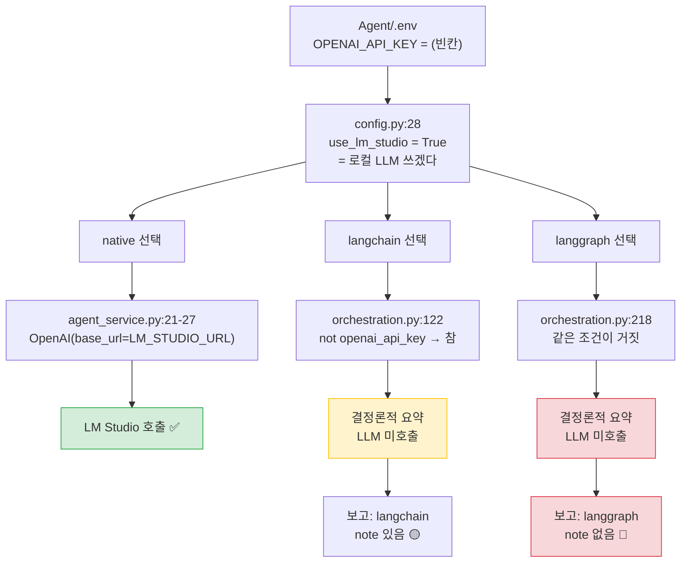

| 고른 것 | 기본 `.env`에서 실제로 하는 일 | 응답에 적히는 이름 | 왜 그랬는지 알려주나 |
|---|---|---|---|
| `native` | **LM Studio 호출** — 의도대로 동작 | `native` | — |
| `langchain` | 검색 결과를 잘라 붙인 **결정론적 요약** | `langchain` ❌ | note로 알려줌 🟡 |
| `langgraph` | 같은 **결정론적 요약** | `langgraph` ❌ | **아무 말 없음** 🔴 |

**왜 이렇게 되나** — `native`는 `base_url`을 갈아끼워 로컬로 갑니다.

```python
# agent_service.py:21-27
if settings.use_lm_studio:
    self._client = OpenAI(base_url=settings.lm_studio_url,     # ← 로컬로 보냄
                          api_key=settings.lm_studio_api_key)
```

반면 `langchain`은 **키가 없으면 아예 포기**하고, 설령 갔더라도 `base_url`이 없습니다.

```python
# orchestration.py:122
if not use_llm or not self._openai_api_key:        # ← 키 없으면 여기서 끝
    ... note="LLM disabled or OPENAI_API_KEY missing, used deterministic summary"

# orchestration.py:159 — 설령 통과해도
llm = self._ChatOpenAI(api_key=..., model=...)     # ← base_url 없음 = LM Studio 못 감
```

`langgraph`도 [`orchestration.py:218`](https://github.com/edumgt/ai-agent-lab/blob/7151a88/Agent/app/orchestration.py#L218)에서 같은 조건을 쓰는데, 여기선 **note조차 남기지 않고** `selected_mode="langgraph"`([`:259`](https://github.com/edumgt/ai-agent-lab/blob/7151a88/Agent/app/orchestration.py#L259))로 반환합니다.

**코드 근거 퍼머링크**

- [`config.py:28`](https://github.com/edumgt/ai-agent-lab/blob/7151a88/Agent/app/config.py#L28) — `use_lm_studio = not bool(openai_api_key)`
- [`agent_service.py:21-31`](https://github.com/edumgt/ai-agent-lab/blob/7151a88/Agent/app/agent_service.py#L21-L31) — native가 `base_url`을 끼우는 곳
- [`orchestration.py:122-135`](https://github.com/edumgt/ai-agent-lab/blob/7151a88/Agent/app/orchestration.py#L122-L135) — langchain이 포기하는 곳
- [`orchestration.py:159-163`](https://github.com/edumgt/ai-agent-lab/blob/7151a88/Agent/app/orchestration.py#L159-L163) — `ChatOpenAI`에 `base_url`이 없는 곳

---

### 🔗 A10 [#24](../issues/024.md)에 주는 함의

우리가 [#24](../issues/024.md)에서 지적한 건 **"설정을 바꿔도 세 갈래가 계속 로컬로 간다"**였습니다. th16은 **방향이 반대인 같은 병**입니다.

| | Qurious(lumina-invest) | th16 ai-agent-lab |
|---|---|---|
| 증상 | 설정을 바꿔도 **로컬로 감** | 로컬로 가라고 했는데 **로컬로도 안 감** |
| 공통 원인 | **설정값이 일부 경로에만 연결됨** | 같음 |
| 공통 결과 | 사용자가 고른 것과 **실제 실행이 다름** | 같음 + **보고까지 다름** |

> 여기서 나오는 설계 원칙 후보 두 가지입니다. 결론이 아니라 제안입니다.
>
> 1. **공급자 선택은 한 곳에서만 해석한다.** `base_url`·`api_key`·`model`을 묶은 클라이언트를 한 번 만들어 모든 경로가 그걸 받아 쓰게 합니다. th16은 `native`만 그렇게 하고 나머지는 각자 만듭니다.
> 2. **실제로 실행된 경로를 응답에 정직하게 적는다.** "요청한 모드"와 "실행된 모드"를 **다른 필드로** 둡니다. th16의 note는 좋은 시도인데 `langgraph` 경로엔 빠져 있습니다.

---

### 그 밖에 본 것

**라우터** (`query_router.py`) — 질문을 3갈래로 나눕니다. **전부 규칙 기반이고 LLM을 쓰지 않습니다.**

| mode | 언제 | 예 |
|---|---|---|
| `concept_definition` | 개념 정의 질문이거나 `aws_*`·devops·mlops 류 | "LLM이 뭐야?" |
| `subject_range` | 과목 + 범위 질문 | "이 과목 몇 차시까지야?" |
| `rag` | 나머지 전부 | 일반 질의 |

**⚠️ 이름과 실제가 다릅니다** — `finance_taxonomy_service.py`의 `FinanceDomainIndex`는 이름과 달리 **금융 분류 체계가 아닙니다.** `curriculum_index.csv`를 읽어 "과목이 몇 차시부터 몇 차시까지인지"를 답하는 **강의 커리큘럼 인덱스**입니다. 우리 쪽에 그대로 가져올 만한 금융 택소노미는 여기 없습니다. **파일명만 보고 기대하면 헛걸음합니다.**

**보안 관찰 3건** (A12 [#27](../issues/027.md) · A11 [#25](../issues/025.md) 참고용)

| 관찰 | 위험도 | 설명 |
|---|---|---|
| `Agent/.env`가 **git에 추적됨** | 🟡 | 현재 `OPENAI_API_KEY`는 **빈칸**이라 유출은 없습니다. 다만 `.gitignore`가 `projectApps/**/.env`만 막고 있어, **키를 채우면 그대로 커밋됩니다.** |
| `auth_secret` 기본값 `"change-me-in-production"` | 🟡 | `config.py:31`. JWT 서명 키가 기본값이면 토큰 위조가 가능합니다 |
| `mariadb_password` 기본값 `"agentpass"` | 🟡 | `config.py:49` |

실습 저장소라 이 자체가 문제는 아니지만, **우리가 같은 구조를 베끼면 그때는 문제입니다.**

---

### 반례·한계

1. **실행해보지 않았습니다.** 코드를 읽어 내린 판단이고, Docker로 띄워 `/v1/ask`를 실제로 불러본 게 아닙니다. 확실도 🟢은 "코드가 그렇게 쓰여 있다"까지입니다.
2. **`use_llm`이 어디서 정해지는지 안 봤습니다.** `main.py`(740줄)를 안 읽었습니다. 요청마다 `use_llm=False`가 기본이라면 native도 결정론적 요약으로 갈 수 있습니다.
3. **강사님이 의도한 것일 수 있습니다.** "OpenAI 키가 있어야 LangChain 실습이 된다"는 전제로 만든 수업 자료라면 자연스러운 구성입니다. 제가 지적하는 건 **설계 선택이 아니라 보고의 불일치**입니다.
4. **`dataVizPrep` 40개 실습(class041~080)은 안 봤습니다.** `Agent/` 하나만 읽었습니다.
5. `rag_engine.py`(398줄) · `rag_booster.py`(274줄) · `user_store.py`(554줄)를 아직 안 읽었습니다. **A11 [#25](../issues/025.md)의 "벡터 중복 방지 방식 통일"과 겹칠 것으로 보여 다음 세션에서 마저 봅니다.**

---

<a id="issuecomment-5727665261"></a>

### 💬 8. 이동원(`devlee328288`) · 2026-09-18 17:57 KST

## th16 ai-agent-lab 나머지 — **같은 병이 세 층에서 반복됩니다** 🔴

S23에서 오케스트레이터(A10 [#24](../issues/024.md)와 같은 병)를 보고 남긴 과제입니다. `rag_engine.py`(398줄) · `rag_booster.py`(274줄) · `user_store.py`(554줄)를 읽고 **전부 실행해 확인**했습니다.

**쉬운 요약 3줄**
1. **RAG 검색이 사실상 죽어 있습니다.** 정규식 이스케이프 실수 한 글자 때문에 **모든 임베딩이 0 벡터**가 되고, 문서가 500개를 넘으면 정답을 **하나도 못 찾습니다(Recall@3 = 0%)**.
2. 그 결과가 연쇄합니다 — 로컬 점수가 구조적으로 낮아져 **웹 검색이 100% 발동**하고, 웹 결과 기본 점수(0.55)가 로컬을 항상 눌러 **저장소 RAG인데 웹만 답합니다.**
3. 사용자 저장소에는 별개로 두 건이 더 있습니다 — `mode="qdrant"`가 실패하면 **메모리로 조용히 떨어져 재시작 때 계정이 사라지고**, MariaDB에서는 **저장한 설정이 절대 복원되지 않습니다.**

### 한눈에 보기

| # | 파일 | 무엇이 | 심각도 | 확인 |
|---|---|---|---|---|
| 1 | `rag_engine.py:67` | `token_pattern` 이스케이프 실수 → **전 벡터 0** | 🔴🔴🔴 | 실행 |
| 2 | 〃 (연쇄) | 문서 500개↑ **Recall@3 = 0%** | 🔴🔴🔴 | 실행 |
| 3 | `rag_engine.py:321-335` | `_split_text` 조건부 텍스트 누락 | 🟡 | 실행 |
| 4 | `rag_booster.py:86` | **웹 검색 폴백 100% 발동** (임계값 0.34 vs 로컬 평균 0.084) | 🔴🔴 | 실행 |
| 5 | `rag_booster.py:208` | 웹 기본점수 0.55가 로컬을 **항상 압도** | 🔴 | 실행 |
| 6 | `rag_booster.py:142` | `used_rerank=True`인데 실제론 어휘 재정렬 | 🟡 | 코드 |
| 7 | `rag_booster.py:66,98` | rerank **이중 호출** → Cohere 비용 2배 | 🟡 | 코드 |
| 8 | `user_store.py:521-554` | `mode="qdrant"` 실패 → **memory 폴백** | 🔴🔴 | 실행 |
| 9 | `user_store.py:466` | MariaDB **설정 영구 미복원** | 🔴🔴 | 실행 |
| 10 | `user_store.py:195-196` | 비밀번호 해시·솔트를 벡터 DB에 저장 | 🟡 | 코드 |
| 11 | `user_store.py` 전반 | user_id 길이가 백엔드마다 다름(24 vs 32) | 🟡 | 코드 |

---

## 1. 벡터가 전부 0입니다 🔴🔴🔴

```python
# rag_engine.py:63-68
self._vectorizer = HashingVectorizer(
    n_features=dim, alternate_sign=False, norm="l2",
    token_pattern=r"(?u)\\b\\w+\\b",   # ← 여기
)
```

**왜 문제인가**: `r"..."`(raw string) 안에서 `\\b`는 **백슬래시 2개 + b**입니다. 정규식으로 읽으면 "리터럴 백슬래시 하나, 그 뒤에 문자 b"가 됩니다. 의도한 `\b`(단어 경계)가 아닙니다.

| | 정규식이 실제로 찾는 것 | 표본 문장에서 |
|---|---|---|
| 원본 `r"(?u)\\b\\w+\\b"` | `\b` + `w`반복 + `\b` (리터럴) | **0개** |
| 의도 `r"(?u)\b\w+\b"` | 단어 | 10개 (`RAG`, `파이프라인은`, `embedding`, …) |

백슬래시가 실제로 들어간 문장(`C:\backup\web\bdir`)으로도 시험했지만 **여전히 0개**입니다.

**실제 출력** (`LocalEmbedding(1024).embed([...])`)
```
  문서0: 차원=1024 · 0이 아닌 값=0 · 합계=0.0   ← 완전한 영벡터
  문서1: 차원=1024 · 0이 아닌 값=0 · 합계=0.0
  L2 노름 = [0. 0.]
```

### 파급 — 후보 선별 자체가 벡터로 이뤄집니다

`RepoRAG.query`는 ChromaDB에서 **최대 80개(raw_k)를 먼저 받아온 뒤** 재점수합니다. 벡터가 전부 같으면(0) 그 80개가 사실상 임의로 뽑힙니다. 문서가 80개를 넘는 순간부터 **정답이 후보에 들어오지 못합니다.**

정답이 분명한 질문 20개로 **Recall@3**을 쟀습니다.

| 문서 수 | 원본(버그) | `token_pattern`만 고침 |
|---:|---:|---:|
| 20 | 60% | **100%** |
| 70 | 20% | **95%** |
| 220 | 10% | **55%** |
| 520 | **0%** | **80%** |
| 1,020 | **0%** | **50%** |

```
 Recall@3        0%       25%       50%       75%      100%
                 ├─────────┼─────────┼─────────┼─────────┤
 문서   20  버그  ████████████████████████                  60%
            수정  ████████████████████████████████████████ 100%
 문서  520  버그  ▏                                          0%   ← 정답을 하나도 못 찾음
            수정  ████████████████████████████████         80%
 문서 1020  버그  ▏                                          0%
            수정  ████████████████████                     50%
```

**th16 저장소 실제 규모는 900자 초과 파일만 6,185개**입니다. 즉 실사용에서는 오른쪽 두 줄(0%)에 해당합니다.

> 수정 버전의 50~80%는 `HashingVectorizer`(해시 기반 단어 가방) 자체의 한계입니다. 의미 임베딩이 아니므로 100%가 나오지 않습니다. 그래도 **0%와는 다른 세계**입니다.

---

## 2. 연쇄 — 검색 실패가 웹 검색 비용으로 번집니다 🔴🔴

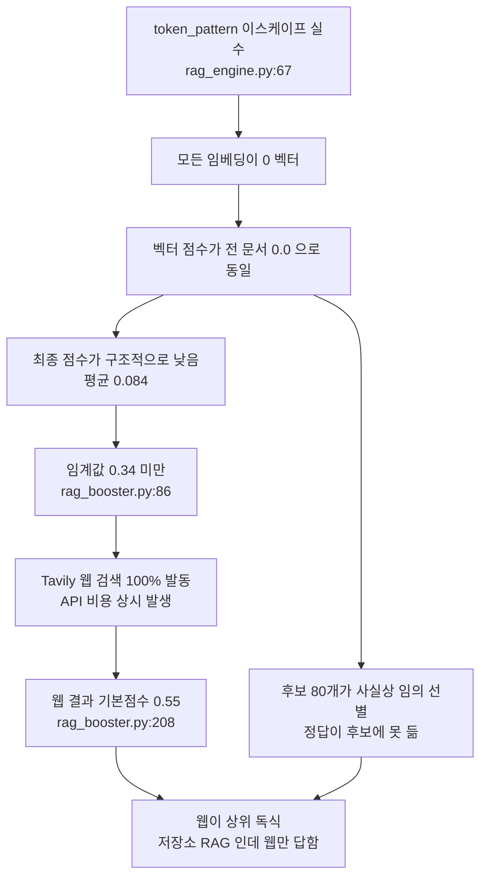

**실측** — 질문 10개, 채움 문서 200개

| | 로컬 최고 점수 평균 | 임계값 0.34 미만 → 웹 발동 | 웹 기본점수 0.55보다 낮음 |
|---|---:|---:|---:|
| 원본(버그) | **0.084** | **10/10 (100%)** | **10/10 (100%)** |
| `token_pattern` 수정 | 0.223 | 7/10 (70%) | 10/10 (100%) |

두 번째 열은 고치면 나아지지만, **세 번째 열은 고쳐도 100%**입니다. 웹 결과의 기본 점수 0.55가 로컬 점수와 **같은 축에서 정렬**되는데 두 값이 애초에 같은 척도가 아니기 때문입니다(`rag_booster.py:111`). 이건 별개의 설계 문제입니다.

---

## 3. 사용자 저장소 — 조용한 폴백과 영구 소실 🔴🔴

### 3.1 `mode="qdrant"`가 실패하면 MariaDB를 건너뜁니다

```python
# user_store.py:521-554 (요지)
if desired == "qdrant":                              # 실패하면 warnings 만 쌓고 통과
    ...
if desired in {"auto", "vector"}:                    # ← "qdrant" 가 없다
    ...
if desired in {"auto", "vector", "mariadb"}:         # ← 여기에도 "qdrant" 가 없다
    ...
warnings.append("fallback to memory user store")     # → 메모리로 직행
```

**실측**

| 설정한 mode | 실제 선택된 backend | 경고 |
|---|---|---|
| `auto` | vector | — |
| `vector` | vector | — |
| **`qdrant`** | **memory** 🔴 | qdrant unavailable → fallback to memory |
| `mariadb` | memory | mariadb unavailable → fallback to memory |

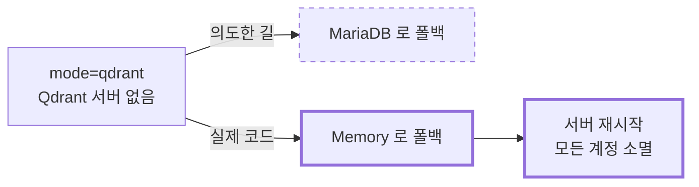

회원가입도 로그인도 **정상 동작하는 것처럼 보입니다.** 재시작 전까지는 아무 증상이 없습니다.

### 3.2 MariaDB 백엔드에서 설정이 절대 복원되지 않습니다

```python
# user_store.py:466 (_from_row 첫 줄)
settings = row.get("settings") if isinstance(row, dict) else {}
```

`get_by_username` 등은 SQLAlchemy `.mappings().first()` 로 **`RowMapping`** 을 받습니다. 이건 **dict의 서브클래스가 아닙니다.**

**실측**
```
  타입                  : <class 'sqlalchemy.engine.row.RowMapping'>
  isinstance(row, dict) = False        ← 항상 False
  row.get('a')          = 'x'          ← .get 자체는 잘 동작한다

  DB 에 저장된 settings : default_top_k=99, persona_name='myown'
  복원된 settings       : default_top_k=6,  persona_name='default'   ← 전부 기본값
```

저장(`update_settings`)은 정상입니다. **읽기만 조용히 버립니다.** 사용자는 설정을 바꾸고 저장 성공 메시지를 본 뒤, 다음 요청에서 기본값으로 되돌아간 것을 봅니다.

### 3.3 그 밖

| 항목 | 내용 |
|---|---|
| 비밀번호 해시·솔트 위치 | ChromaDB 메타데이터 · Qdrant 페이로드에 평문 필드로 저장. Qdrant는 기본 인증이 없어 포트가 열리면 해시 전체가 노출 |
| user_id 길이 불일치 | Memory·Vector·MariaDB는 `uuid4().hex[:24]`(24자), Qdrant만 `uuid4().hex`(32자). **백엔드를 바꾸면 기존 24자 id가 Qdrant에서 `uuid.UUID()` 파싱에 실패해 `None`** → 기존 사용자 로그인 불가 |
| VectorUserStore | `add()`에 `embeddings`를 주지 않아 ChromaDB 기본 임베딩 모델을 내려받습니다. 오프라인이면 **회원가입 시점에** 실패하는데, 폴백은 생성자에서만 걸리므로 잡히지 않습니다 |
| `count_users` (MariaDB) | `SELECT COUNT(*)`가 아니라 전체 행을 가져와 `len()` |

---

## 4. `_split_text` 누락 🟡 — 실재하지만 작습니다

`end`를 줄바꿈 위치로 당긴 뒤에도 `start`는 원래 보폭(750)만큼 전진합니다. 당긴 폭이 540~750 사이면 그 사이가 **어느 청크에도 안 들어갑니다.**

```
   start                    end(당겨짐)      start+750(다음 시작)
     │───────── 청크 ──────────│    구멍    │──────── 다음 청크 ───────
     0                       600         750
```

**th16 저장소 실제 파일 전수 적용**

| | 값 |
|---|---|
| 검사 대상(900자 초과) | 6,185개 · 53,146,758자 |
| 누락이 발생한 파일 | **470개 (7.6%)** |
| 누락 문자 합계 | 71,465자 (**0.13%**) |
| 최악 파일 | `mlDeepDive/class085/class085_quiz.html` 620자(2.22%) |

실재하는 버그지만 **1번에 비하면 영향이 작습니다.** 우선순위를 그렇게 매기는 게 맞습니다.

---

## 5. 같은 병이 세 층에서 반복됩니다

| 층 | 간판 | 실제 | 사용자가 알 수 있나 |
|---|---|---|---|
| 오케스트레이터 (S23) | `langchain` / `langgraph` 선택 | 기본 `.env`에서 **LLM 미호출** | ❌ 고른 이름 그대로 보고 |
| **RAG 검색** | ChromaDB 벡터 검색 | **전 벡터 0 → 어휘·경로만** | ❌ 에러 없이 결과 반환 |
| **재정렬** | `used_rerank: true` | Cohere 키 없으면 **어휘 재정렬** | 🔺 `provider`엔 표시되나 `used`는 참 |
| **사용자 저장소** | `mode=qdrant` | **memory** | 🔺 warnings에만, 응답엔 없음 |
| **MariaDB 설정** | 저장 성공 | **읽을 때 버림** | ❌ 다음 요청에서야 드러남 |

공통점은 **"실패가 조용하다"**는 것입니다. 예외도 없고 로그도 약하며, 겉보기 동작은 정상입니다.

### 설계 원칙 후보 (S23의 2가지에 이어)

| # | 원칙 | 이번에 근거가 된 사례 |
|---|---|---|
| 1 | (S23) 고른 것이 실제로 실행되지 않으면 그 사실을 응답에 싣는다 | 오케스트레이터 |
| 2 | (S23) 구성 요소를 고를 수 있게 만들면 각 선택지마다 **동작 확인 경로**를 둔다 | 오케스트레이터 |
| **3** | **고른 것이 실패하면 조용히 다른 것으로 가지 말고 멈춘다(fail loud)** | `mode=qdrant` → memory |
| **4** | **저장한 값이 그대로 읽히는지 왕복(round-trip) 시험을 둔다** | MariaDB 설정 소실 |
| **5** | **"이 기능이 실제로 기여했는가"를 재는 한 줄 점검을 둔다** | 벡터 점수가 전부 동일 = 기여 0 |

원칙 5가 이번의 핵심입니다. `벡터 점수가 전부 같은 값인가`를 한 번만 확인했어도 **즉시 드러났을 문제**입니다.

### 우리 Qurious 2.0에 주는 함의

| 우리 논의 | 무엇을 가져올 수 있나 |
|---|---|
| **A2 [#21](../issues/021.md)** 장부 분산 | 폴백 체인이 있는 저장소는 **"지금 어디에 저장됐는지"를 응답·헬스체크에 실어야** 합니다. 3.1이 실제 사례입니다 |
| **A11 [#25](../issues/025.md)** 벡터 중복 방지 | 임베딩이 죽어 있으면 중복 방지 자체가 무의미합니다. **중복 방지 방식을 정하기 전에 임베딩 동작 확인이 선행**되어야 합니다 |
| **D3 [#30](../discussions/030.md) ⑤** | 선택지 A~D 어느 쪽이든 원칙 3·4·5를 같이 못 박는 편이 안전합니다 |
| **D0 ⑦** 기록 기준 | 강사님 피드백 ⑤(개념·주석 기록)와 이어집니다 — "이 지표가 실제로 쓰이고 있는가"를 코드 옆에 적어 두는 것 |

### 용어

| 말 | 한 줄 뜻 |
|---|---|
| raw string (`r"..."`) | 백슬래시를 특수문자로 해석하지 않는 문자열 표기 |
| 영벡터 | 모든 성분이 0인 벡터. 방향이 없어 **유사도를 잴 수 없음** |
| Recall@3 | 상위 3개 안에 정답이 들어온 질문의 비율 |
| 폴백(fallback) | 첫 수단이 실패했을 때 대신 쓰는 차선책 |
| RowMapping | SQLAlchemy가 행을 dict처럼 보여주는 객체. **dict는 아님** |

**자세히**
- **raw string** — 정확한 뜻: `r"\b"`는 백슬래시+b 두 글자입니다. 이 문서에서: `r"\\b"`라고 쓰면 백슬래시 **두 개**+b가 되어 정규식이 "진짜 백슬래시"를 찾게 됩니다. **헷갈리는 점**: 정규식을 문자열로 쓸 때 `"\\b"`(raw 아님)와 `r"\b"`가 같은 것이고, `r"\\b"`는 다릅니다. 이 실수가 정확히 그 지점입니다.
- **영벡터** — 이 문서에서: 코사인 거리를 못 재므로 ChromaDB가 모든 문서에 같은 거리를 돌려줍니다. **헷갈리는 점**: 에러가 나지 않습니다. 순위가 매겨지고 결과도 나옵니다 — 다만 **의미가 없을 뿐**입니다.

### 한계 (틀렸다가 고친 것 포함)
- ⚠️ 처음에 `_split_text` 누락을 잴 때 **`doc.find(chunk)`로 위치를 되찾았는데**, 같은 내용이 반복되는 문서에서는 항상 첫 등장 위치를 집어 **커버리지가 81%까지 엉뚱하게 나왔습니다.** 청크의 `(start, end)`를 직접 추적하는 방식으로 다시 재어 0.13%로 정정했습니다.
- ⚠️ 처음엔 "줄 길이와 무관하게 누락이 난다"고 봤으나, 실제로는 **창 안 마지막 줄바꿈 위치가 540~750 사이일 때만** 납니다. 조건부입니다.
- Recall 실험은 **제가 만든 합성 코퍼스**입니다. 실제 질의 분포와 다릅니다. 다만 "문서가 늘수록 0%로 간다"는 경향은 구조에서 나온 것이라 코퍼스에 의존하지 않습니다.
- Tavily·Cohere **네트워크 호출은 하지 않았습니다.** 4·5번은 점수 분포와 임계값 비교로 판정했고, 실제 API 응답의 `score` 분포는 확인하지 못했습니다.
- `main.py`(740줄)에서 `warnings`와 `diagnostics`를 **화면에 어떻게 보여주는지**는 아직 안 읽었습니다. 사용자에게 얼마나 드러나는지는 그걸 봐야 확정됩니다.
- Qdrant·MariaDB 백엔드는 **서버 없이** 판정했습니다(`qdrant_client`·`pymysql` 미설치). 3.2는 SQLite로 같은 SQLAlchemy 경로를 태워 확인했습니다.

### 판정을 뒤집을 조건
- `main.py`가 `warnings`를 사용자 화면에 **눈에 띄게** 띄운다면 3.1의 심각도는 내려갑니다(여전히 버그이되 "조용한" 문제는 아님).
- `EMBEDDING_PROVIDER=openai`로 운영한다면 1·2번은 해당 없습니다 — `OpenAIEmbedding`은 `token_pattern`을 쓰지 않습니다. **다만 기본값은 `local`입니다.**
- Qdrant를 실제로 띄우고 재보면 3.3의 user_id 불일치가 다르게 나올 수 있습니다.

---

<a id="issuecomment-5738660225"></a>

### 💬 9. 이동원(`devlee328288`) · 2026-09-19 11:36 KST

## 강사님 원본 점검 — `domain-rag-lab` 만 움직였습니다 (2026-09-19 11:05 KST)

원격 9곳을 `git ls-remote` 로 확인했습니다.

| 저장소 | 이전 | 지금 | |
|---|---|---|---|
| **domain-rag-lab** | 3f28a55 | **7bdea00** | **2커밋 · 4파일** |
| lumina-invest | 6d91401 | 6d91401 | 변화 없음 |
| investment-analysis | 2cb9b7f | 2cb9b7f | 변화 없음 |
| stock-coin-trade | ebb40c3 | ebb40c3 | 변화 없음 |
| quant-test-20260828 | 8684a2b | 8684a2b | 변화 없음 |
| python-ai-basic-lab | b723826 | b723826 | 변화 없음 |
| stock-ml-dl-project | 09b5823 | 09b5823 | 변화 없음 |
| python-ml-class | e84cf65 | e84cf65 | 변화 없음 |
| python-crawling-lab | 1572282 | 1572282 | 변화 없음 |

### `domain-rag-lab` 변경 내역

| 커밋 | 시각 (KST) | 내용 |
|---|---|---|
| `6bd1f43` | 09-19 10:23 | Day 4 HTML·CSS 정리 — 프로젝트 섹션 갱신, 폐기 레슨 제거 |
| `7bdea00` | 09-19 10:48 | 성장잠재율 차트에 **시나리오 시뮬레이션·이력 로딩** 추가 |

| 파일 | 변경 |
|---|---|
| `frontend/days/04.html` | +271 −313 |
| `frontend/days/assets/growth-potential-rate.js` | +99 −20 |
| `frontend/app.js` | +89 −9 |
| `frontend/style.css` | +17 −0 |

### 판정 — 🟢 지금 가져올 것은 없습니다

네 파일 모두 **강의 페이지 프런트엔드**입니다. 데이터 수집·전처리·분석 어느 쪽과도
겹치지 않습니다. 3절의 저장소별 평가를 **바꿀 이유가 없어** 본문은 그대로 둡니다.

> 다만 "성장잠재율 시나리오 시뮬레이션" 은 이름만 보면 2절의 지표 논의와 닿을 수 있습니다.
> 필요해지면 그때 열어 보겠습니다 — 지금은 수집기 쪽이 급합니다([PR #34](../pulls/034.md)).

---

<a id="issuecomment-5739301408"></a>

### 💬 10. 이동원(`devlee328288`) · 2026-09-19 13:19 KST

**강사님 원본 9곳 원격 확인 — 2026-09-19** (S29 정기 점검)

| 저장소 | 이전 | 지금 | |
|---|---|---|---|
| **`domain-rag-lab`** | `7bdea00` | **`22fea28`** | ⬆️ **1커밋 들어옴** |
| `lumina-invest` | `6d91401` | `6d91401` | — |
| `investment-analysis` | `2cb9b7f` | `2cb9b7f` | — |
| `stock-coin-trade` | `ebb40c3` | `ebb40c3` | — |
| `quant-test-20260828` | `8684a2b` | `8684a2b` | — |
| `python-ai-basic-lab` | `b723826` | `b723826` | — |
| `stock-ml-dl-project` | `09b5823` | `09b5823` | — |
| `python-ml-class` | `e84cf65` | `e84cf65` | — |
| `python-crawling-lab` | `1572282` | `1572282` | — |

**이 이슈가 다루는 4곳은 변화 없습니다.** 본문을 고칠 것이 없어 댓글로만 남깁니다.

---

**`domain-rag-lab` 에 들어온 것** — `2026-09-19` 커밋 1개

```
Update theory-data.js script version to include discount example

  frontend/assets/theory-data.js   +2  / -2
  frontend/days/03.html           +11  / -4
  frontend/days/04.html          +152  / -84   ← 실질 변경은 여기
  frontend/index.html              +1  / -1
```

🟢 **우리 작업에 영향 없습니다.** 네 파일 모두 **교안 프론트엔드**(RAG 이론 설명 페이지)이고,
RAG 파이프라인 코드나 수집·데이터 계층이 아닙니다. A10 [#24](../issues/024.md)(LLM·RAG)에서 참고할 만한
*내용*이 늘었을 수는 있으나, **가져다 쓸 코드가 바뀐 것은 아닙니다.**

⚠️ 다만 `days/04.html` 이 +152/-84 로 실질적으로 다시 쓰였습니다. A10 [#24](../issues/024.md) 를 점검할 때
**이 변경분을 먼저 보겠습니다** — 4일차 주제가 무엇인지에 따라 참고 가치가 달라집니다.

---

<a id="issuecomment-5739640873"></a>

### 💬 11. 이동원(`devlee328288`) · 2026-09-19 14:24 KST

**알려 드립니다 — 제가 [#32](../issues/032.md) 에 이 이슈의 결론과 어긋나는 글을 썼고, 방금 정정했습니다.**

제가 [#32](../issues/032.md) 8.2 에 *"ETF 가 아예 없습니다 🔴 · A4 [#23](../issues/023.md) · [#31](../issues/031.md) 의 ETF 숙제는 이 경로로 해결되지 않습니다"* 라고 적었는데, **뒤쪽 결론이 틀렸습니다.**

| | 사실 |
|---|---|
| 우리가 적재한 `getStockPriceInfo` 에 ETF 가 0건 | 🟢 맞습니다 (2,870종목 실측) |
| ~~그래서 ETF 숙제가 안 풀렸다~~ | 🔴 **틀렸습니다** |

**금융위는 주식 시세와 증권상품시세를 다른 엔드포인트로 냅니다.** ETF 는 뒤쪽에 있고, **이 이슈([#31](../issues/031.md)) 2절이 이미 「해소 확정」으로 적어 두었습니다** — KRX OpenAPI 와 공공데이터포털 양쪽에서 **ETF 1,171건, 두 경로 수치 일치**(S17 실측).

정확히 말하면 이렇습니다.

| | 상태 |
|---|---|
| ETF 를 받을 **경로** | 🟢 **있습니다** ([#31](../issues/031.md) · 증권상품시세 · KRX OpenAPI) |
| ETF 를 **적재했는가** | 🟡 **아직 안 했습니다** — 우리 수집기는 주식 엔드포인트만 붑니다 |

남은 일은 "출처를 찾는 것" 이 아니라 **수집기에 엔드포인트 하나를 더 붙이는 것**입니다. `collector/sources/portal.py` 의 구조(하루치 전종목 → 원문 보존 → 정규화)를 그대로 쓸 수 있을 것으로 보이지만, **응답 필드가 같은지는 확인하지 않았습니다** 🟡.

이 이슈 본문은 그대로 두었습니다 — 2절의 「해소 확정」이 맞습니다. 틀린 쪽은 제가 [#32](../issues/032.md) 에 쓴 글이었고, 거기서 취소선으로 남겨 두었습니다.

---

<a id="issuecomment-5747285018"></a>

### 💬 12. 이동원(`devlee328288`) · 2026-09-20 12:20 KST

**강사님 원본 변화 2곳** (2026-09-20 11:40 KST · 원격 HEAD 만 확인, pull 하지 않았습니다)

| 저장소 | 이전 | 지금 | 새 커밋 |
|---|---|---|---|
| `edumgt/stock-coin-trade` | `ebb40c3` (09-14) | **`f2e3bdf9`** (09-20) | 4건 |
| `edumgt/domain-rag-lab` | `22fea28` (09-19) | **`1c53e135`** (09-19) | 3건 |

나머지 7곳은 그대로입니다 (`lumina-invest 6d91401` · `investment-analysis 2cb9b7f` · `quant-test-20260828 8684a2b` · `python-ai-basic-lab b723826` · `stock-ml-dl-project 09b5823` · `python-ml-class e84cf65` · `python-crawling-lab 1572282`).

### `stock-coin-trade` — ★ 우리 작업과 바로 겹칩니다

```
f2e3bdf9  feat: KIS API 호출 경로 및 설명 추가
7d621dff  Add KIS API Explorer and Chart API backend, and build script for API catalog
3c817e34  1
58caa70b  Remove the KIS module guide HTML file from the frontend learning directory.
```

🟢 **오늘 [#41](../pulls/041.md) 에서 KIS 주문 TR ID 를 신 TR 로 바꿨는데**, 강사님이 같은 날 **KIS API 호출 경로 카탈로그와 Explorer** 를 만들었습니다. 우리가 확인하지 못한 두 가지를 그 카탈로그가 답할 수 있습니다:

- 신 TR(`TTTC0012U`/`0011U`)의 **필수 필드 목록** — 우리는 휴일 응답으로 `EXCG_ID_DVSN_CD` 가 선택임을 추정했을 뿐입니다 ([#41](../pulls/041.md) 9절 한계 🟡)
- **체결 조회**(`inquire-daily-ccld`) 스펙 — [#40](../issues/040.md) 의 남은 할 일 1개가 바로 이것입니다

### `domain-rag-lab` — 위험 지표 수업이 늘었습니다

```
1c53e135  Update risk dashboard visualization with improved metrics explanation and SVG adjustments
05bab151  feat: 추가된 위험 지표 수업 내용 및 시뮬레이터 버튼 구현
00b841c5  Add black swan events visualization and Hangul font scaling
```

🟡 블랙스완 시각화와 위험지표 시뮬레이터가 추가됐습니다. 우리 리스크 지표 쪽([#16](../issues/016.md))과 겹칠 수 있어 **내용을 확인해 볼 가치가 있습니다.**

### 다음 할 일

- [ ] `stock-coin-trade` 의 KIS API 카탈로그를 읽어 **신 TR 필수 필드**와 **체결 조회 스펙** 확인 → [#40](../issues/040.md) 남은 1개에 쓴다
- [ ] `domain-rag-lab` 의 위험 지표 수업 내용 확인 → [#16](../issues/016.md) 과 대조

⚠️ 둘 다 **읽기만** 합니다. 작업본에 얹는 merge 는 하지 않습니다(사용자 지시 · `stock-coin-trade` 는 fork 라 제자리 수정 방식이어서 충돌이 실제로 납니다).

---

<a id="issuecomment-5748521644"></a>

### 💬 13. 이동원(`devlee328288`) · 2026-09-20 16:55 KST

## 강사님 원본 2곳에 새 커밋 (2026-09-20 확인 · 원격 HEAD 만 조회)

9곳 중 **둘이 움직였습니다.** 나머지 7곳은 변화 없습니다.

| 저장소 | 이전 | 지금 | 새 커밋 |
|---|---|---|---:|
| `edumgt/stock-coin-trade` (th03) | `f2e3bdf9` | **`d5a105f0`** | **3** |
| `edumgt/domain-rag-lab` (th07) | `1c53e135` | **`7c6ff805`** | **1** |

### th03 `stock-coin-trade` — ★ 우리 KIS 작업과 겹칩니다

| SHA | 날짜 | 제목 |
|---|---|---|
| `d5a105f0` | 09-20 | feat: Add KB and Alpaca API integration with setup and history pages |
| `906273b8` | 09-20 | feat: Add **KIS API history and real trading practice** pages |
| `3de20f06` | 09-20 | Implement **CSRF protection and authorization checks for KIS account usage** |

**왜 눈여겨볼 만한가** — 우리가 지난 세 세션에서 한 일과 같은 자리입니다.

| 강사님 커밋 | 우리 쪽 대응 작업 | 겹침 |
|---|---|---|
| KIS API history · real trading practice | [PR #45](../pulls/045.md) 증권사 체결 들여오기 · `scripts/sync_fills.py` | 🟢 같은 API·같은 목적 |
| CSRF protection + **authorization checks for KIS account** | [PR #47](../pulls/047.md) revoke 에 인증·소유권 확인 추가([#22](../issues/022.md) 결함 1·2) | 🟢 같은 문제의식 |
| KB · Alpaca 연동 | 없음 | — 우리는 KIS 한 곳만 |

> ⚠️ **읽기만 했습니다.** 원격 HEAD 와 커밋 제목만 조회했고, 코드는 열지 않았습니다.
> 작업본(`projects/stock-coin-trade-study`)에 얹는 일은 하지 않았습니다 —
> merge 는 사용자 요청이 있을 때만 합니다.

**다음에 볼 값어치가 있는 것**: `3de20f06` 의 authorization check 구현 방식.
우리 [#22](../issues/022.md) 에 **인증 없는 라우트 34곳**이 남아 있어 비교 대상이 됩니다 🟡.

### th07 `domain-rag-lab` — 관련 낮음

| SHA | 날짜 | 제목 |
|---|---|---|
| `7c6ff805` | 09-20 | Update submission deadline for seventh learning assessment |

과제 제출 기한 변경 1건입니다. 코드 변화 아닙니다.

### 변화 없는 7곳

`lumina-invest` `6d91401` · `investment-analysis` `2cb9b7f` · `quant-test-20260828` `8684a2b` ·
`python-ai-basic-lab` `b723826` · `stock-ml-dl-project` `09b5823` · `python-ml-class` `e84cf65` ·
`python-crawling-lab` `1572282`

<sub>S37 · 2026-09-20 KST</sub>
