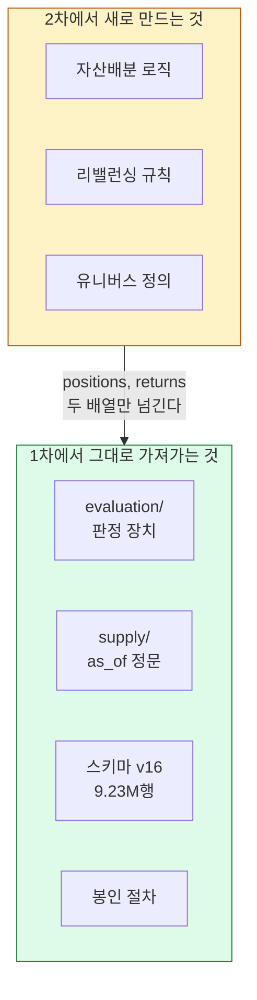
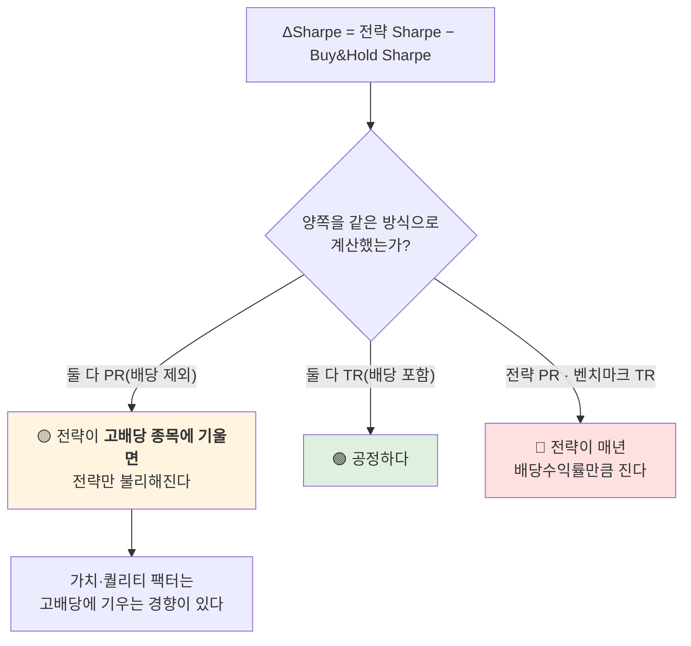

# #32 [인계] 1차 AlphaStack이 2차에 넘기는 것 — 재사용 자산 4종과 숙제 5건

> 🗂️ 옛 GitHub 이슈를 옮긴 **기록 문서**입니다 — [색인](../README.md). 원문은 그대로 두고, 링크·커밋 해시만 새 자리 기준으로 바꿨습니다.

| 항목 | 내용 |
|---|---|
| 종류 | 이슈 |
| 상태 | 열림 |
| 원 작성 | 이동원(`devlee328288`) · 2026-09-18 11:45 KST |
| 라벨 | `documentation` `phase-2` |
| 댓글 | 2건 |
| 옛 주소 | `github.com/devlee328288/Qurious/issues/32` (지금은 열리지 않음) |

## 본문

> **쉬운 요약 3줄**
> 1. 1차 AlphaStack의 **타겟·목표를 한 장으로 정리한 문서**를 만들었습니다 →
>    Alpha_Stack#305
> 2. 2차가 **그대로 가져다 쓸 것이 4종**입니다 — `evaluation/`(판정 장치) ·
>    `supply/`(as_of 정문) · 스키마 v16(9.23M행) · 홀드아웃 봉인 절차.
> 3. 1차가 **못 끝내고 넘긴 숙제가 5건**이고, 그중 3건이 지금 논의 중인 D2·D4·D5와
>    직접 맞물립니다.

작성일 **2026-09-18(KST)** · 확실도 **🟢 문서·코드 확인 / 🟡 계획·미확정**

---

## 0. 왜 이 이슈인가

1차 발표에서 *"무엇을 타겟으로 잡고 무엇을 목표로 했는가"* 를 명확히 답하지 못했다는
피드백이 있었습니다. 그 답을 원문 그대로 정리한 것은 **Alpha_Stack#305** 에 두고,
여기에는 **2차 설계에 직접 필요한 부분만** 옮깁니다.

> 원문에는 이런 것이 더 있습니다 — 성공 기준 6개 · 결론 문장 두 개(데이터 보기 전에 씀) ·
> "왜 지평이 5일인가" · 범위 밖 7건 · 용어 풀이 13개 · 판정을 뒤집을 조건.

---

## 1. 한눈에 보기 — 2차가 상속하는 것

| 자산 | 무엇 | 2차에서 바꿔야 하나 |
|---|---|:--:|
| **`evaluation/`** | 워크포워드 · 기준선 · MDD · Sharpe · 거래비용 | ❌ 그대로 — `models/` 를 import 하는 곳이 **0건** 🟢 |
| **`supply/`** | `as_of` 정문 — 행 T 에 보이는 것은 `known_at ≤ T` 인 것뿐 | ❌ 그대로 |
| **스키마 v16** | 표 23개 · 일별시세 **9,231,938행** (2010-01-04 ~ 2026-09-04) | 🟡 유니버스를 넓히면 칸 추가 |
| **봉인 절차** | 사전등록 ADR → 개봉 **1회** → 확증 판정 | 🟡 gap 을 라벨 지평과 맞춰 **새로 봉인** |



> **`evaluation` 은 무엇이 그 포지션을 만들었는지 모릅니다.** 그 무지(無知)가 재사용의
> 조건이고, 2차가 실제로 이걸 import 하는 것이 1차 설계가 옳았다는 유일한 증명입니다.

---

## 2. 1차가 넘긴 숙제 5건 — 어디서 정할 일인가

| # | 숙제 | 1차 상태 | 2차에서 정할 곳 |
|---|---|---|---|
| ① | **주 검정(비용 반영 ΔSharpe·p값)이 미수행** | 🔴 최종 결과가 분류 지표까지만 | **D4 [#17](../discussions/017.md)** 검정 규격 |
| ② | **gap 5 가 T+6 라벨과 하루 겹침** | 🟢 개봉 뒤 발견 · 고치지 않고 기록 | 새로 봉인할 때 gap=6 |
| ③ | 대시보드가 **화면 안에서 학습** | 🔴 무료 CPU 제한 · 재시작하면 캐시 소실 | **D2 [#10](../discussions/010.md)** 인프라 경계 |
| ④ | 공통 평가 지표 · 비용 규격 미통일 | 🟡 논의 이슈 4건은 닫혔고 설정 공유만 구현 | **D4 [#17](../discussions/017.md)** |
| ⑤ | 유니버스 확장 전제는 풀렸으나 미적용 | 🟢 ADR 0008 — **제안 상태** | **D5 [#18](../discussions/018.md)** |

**①이 가장 무겁습니다.** 1차 성공 기준 1번이 바로 이것이라, 미수행은 곧 **1차 결론이
아직 닫히지 않았다**는 뜻입니다. 분류 지표(정확도·F1·MCC)는 나왔지만, 1차가 스스로
"주 지표"로 정한 것은 정확도가 아니라 **비용 반영 ΔSharpe** 였습니다.

---

## 3. 제약 넷 중 셋이 풀렸습니다 — D5 유니버스 논의의 재료

ADR 0008 — 예측 대상과 포지션의 범위를 다시 정한다 (Alpha_Stack `docs/decisions/0008-%EC%98%88%EC%B8%A1%EB%8C%80%EC%83%81-%ED%99%95%EC%9E%A5-%EC%A0%9C%EC%95%88.md` @ `main`)

| 1차의 제약 | 그때 이유 (원문) | 지금 | |
|---|---|---|:--:|
| 예측 대상 = 지수 하나 | *"개별 종목은 유니버스 구성 순간 생존 편향 논쟁이 열린다"* | 개발구간 중 끊긴 종목 **750개 보존** · 상장 여부를 날짜별로 안다 | ✅ |
| 350종목 횡단면 = 3차 후보 | *"`walk_forward` 가 같은 거래일을 학습·검증으로 쪼갠다"* | **`expanding_group_splits`** — 같은 시점의 행을 한 덩어리로 유지 | ✅ |
| 유니버스 구성 회피 | 리츠·SPAC·우선주를 가릴 방법이 없었다 | 주권종류·증권그룹·소속부 커버리지 **100.0000%** | ✅<br/>🔴 **1차만** |
| **포지션 `{0, +1}`** | *"재개 후 6개월 개인 공매도 비중 1.2%"* | **제도 문제라 시간이 해결하지 않았다** | ❌ |

> 규모 — 2024-08-30 상장 **2,711종목** 중 보통주 **2,595종목**. 1차가 "3차 확장 후보"로
> 미룬 350종목의 **7.4배**입니다.

> 🔴 **셋째 줄의 ✅ 는 AlphaStack 데이터에서만 성립합니다** (S30 · 8.3). Qurious 가 받는
> 포털 응답 15개 필드에는 **주권종류·증권그룹·소속부가 없습니다.** 이름·종목코드로 추정해
> 보았더니 두 방법이 **서로 다른 3건씩을 놓쳤고**, 맞는 답이 몇인지 알 방법이 우리 데이터
> 안에 없었습니다. 2차 기준으로는 아직 ❌ 입니다.

### ⚠️ 두 프로젝트를 섞어 읽지 않도록

위 숫자는 전부 **AlphaStack 의 데이터(KRX OpenAPI · 스키마 v16) 기준**입니다.
~~**Qurious 2.0 의 데이터 경로는 아직 정해지지 않았습니다** — 지금 A4 [#23](../issues/023.md) · [#31](../issues/031.md) 에서
ETF 시세 출처를 확정하는 중이고, 국내 주식(ETF 아님) 공식 경로는 미확인입니다.~~

> 🔴 **바뀌었습니다** (S30 · 8절). **국내 주식(ETF 아님) 경로는 확정되어
> 4,460,710행이 적재됐습니다** — 공공데이터포털 금융위 `getStockPriceInfo`.
> **ETF 도 경로는 이미 확정돼 있습니다** — 다만 *다른* 엔드포인트(금융위 **증권상품시세**)
> 이고, [#31](../issues/031.md) 2절에서 KRX OpenAPI 와
> 함께 **ETF 1,171건**으로 실측돼 있습니다(S17). 남은 것은 **적재**입니다 🟡.

```
AlphaStack (1차)                     Qurious 2.0 (2차)   ← S30 에 갱신
─────────────────────                ─────────────────────
KRX OpenAPI + DART + ECOS      vs    공공데이터포털 + DART   🟢 확정
2010-01-04 ~ · 9.23M행               2020-01-02 ~ · 4.46M행  🟢 적재 완료
스키마 v16 · SQLite 6.7GB            6표 · SQLite 1.86GB    🟢
ETF·지수 포함                        ETF 경로 확정 · 미적재  🟡
                    ↑
        같은 팀이지만 다른 저장소·다른 데이터입니다.
        그리고 2차 데이터가 1차보다 10년 짧습니다 (8.1 ⚠️).
```

---

## 4. 1차 목표 문장이 D1과 어떻게 다른가 🟡

| | 1차 (확정된 것) | 2차 (D1 [#7](../discussions/007.md) — 논의 중) |
|---|---|---|
| 목표 한 줄 | "맞혔다고 말해도 되는지 **판정하는 장치**" | 미확정 |
| 주 지표 | 비용 반영 **ΔSharpe vs Buy&Hold** | 미확정 |
| 사용자 | 1차 = 우리 자신 / 2차부터 = 개인 투자자 | D1에서 정할 일 |
| 예측 대상 | KOSPI200 지수 + 개별종목 패널 | D5 [#18](../discussions/018.md) |

강민석 님이 *"목표가 로보어드바이저와 인디케이터를 잇는 것이 되면 안 된다"* 고 하신 것과
이 표가 겹칩니다 — **1차 목표를 그대로 이어붙이면 그 지적에 정확히 걸립니다.**
이 이슈는 **재료만 놓고, 목표 문장은 D1 [#7](../discussions/007.md) 에서 정합니다.**

---

## 5. 용어 풀이

**빠른 대조표**

| 말 | 한 줄 뜻 |
|---|---|
| `as_of` 정문 | 행 T 를 만들 때 `known_at ≤ T` 인 자료만 보이게 막아 주는 단일 통로 |
| 룩어헤드 편향 | 그 시점에 몰랐을 정보를 써서 성능이 부풀어 오르는 것 |
| gap | 학습 끝과 검증 시작 사이에 버리는 구간. 레이블이 미래를 보는 만큼 둔다 |
| 홀드아웃 봉인 | 처음부터 잠가 두고 **맨 마지막에 한 번만** 여는 평가 구간 |
| ΔSharpe | (전략 Sharpe) − (Buy&Hold Sharpe). **가만히 있는 것보다 나은가** |
| ADR | Architecture Decision Record — 결정과 그 이유를 번호순으로 남기는 문서 |

**자세히** — *정확한 뜻 → 이 문서에서 → 헷갈리기 쉬운 점*

- **판정 장치(`evaluation/`)**
  *정확한 뜻*: 포지션 배열과 수익률 배열만 받아, 룩어헤드 없이 성과를 재고 그 숫자를
  믿어도 되는지 판정하는 독립 패키지.
  *이 문서에서*: 2차가 **수정 없이 그대로 import** 할 대상입니다.
  *헷갈리기 쉬운 점*: 백테스터와 다릅니다. 백테스터는 "얼마 벌었나"를 계산하고, 판정
  장치는 **"그 숫자를 믿어도 되나"** 를 답합니다 — 기준선·시도 횟수·신뢰구간이 들어가는
  자리가 여기입니다.

- **"제약이 풀렸다"**
  *정확한 뜻*: 1차가 어떤 것을 못 한 이유가 사라졌다는 뜻이지, **그것을 해야 한다는
  뜻이 아닙니다.**
  *이 문서에서*: 3절 표의 ✅ 셋이 그렇습니다.
  *헷갈리기 쉬운 점*: ADR 0008은 **제안 상태**이고 팀이 채택하지 않았습니다. "할 수
  있게 됐다"와 "하기로 했다"는 다릅니다.

---

## 6. 한계

1. 3절 숫자는 전부 **AlphaStack 데이터 기준**입니다. Qurious 2.0 의 데이터 경로가
   정해지면 다시 재야 합니다. 🟢
2. **ADR 0008 은 제안 상태**이고 채택되지 않았습니다. 3절을 확정으로 읽지 않습니다. 🟡
3. 2절 ①(주 검정 미수행)은 **1차 결론이 아직 닫히지 않았다**는 뜻입니다. 1차를 "끝난
   것"으로 전제하고 2차를 설계하면 그 구멍을 물려받습니다. 🔴
4. 4절 비교표의 2차 칸은 **전부 미확정**입니다. D1 [#7](../discussions/007.md) 결론이 나오면 갱신합니다. 🟡

---

## 7. 이 이슈로 무엇을 하자는 것이 아닙니다

**결론을 내지 않습니다.** 1차에서 무엇이 넘어오는지 한자리에 모아 둔 것이고,
정하는 자리는 각각 D1 [#7](../discussions/007.md) · D2 [#10](../discussions/010.md) · D4 [#17](../discussions/017.md) · D5 [#18](../discussions/018.md) 입니다.

원문 전체는 → Alpha_Stack#305

---

## 8. ★ Qurious 2.0 의 데이터 경로가 절반 정해졌습니다 (2026-09-19 · S30 갱신)

3절의 ⚠️ 상자에 *"Qurious 2.0 의 데이터 경로는 아직 정해지지 않았습니다"* 라고 적었습니다. **S27~S30 에 절반이 채워졌습니다.** 3절 ASCII 도 함께 고쳤습니다.

### 8.1 채워진 칸 · 비어 있는 칸

| 2차가 필요한 것 | 상태 | 근거 |
|---|---|---|
| 국내 주식 **일별시세** | 🟢 **확정 · 적재 완료** — 공공데이터포털 금융위 `getStockPriceInfo` · **4,460,710행** · 2020-01-02 ~ 2026-09-17 · 1,648 거래일 | [#33](../issues/033.md) 10.1 |
| **수정주가**(분할·권리락) | 🟢 확정 — `vs`(전일대비) 기반 · 조정 이벤트 2,689건 | [#33](../issues/033.md) 10.1.3 |
| **배당**(TR 재료) | 🟢 확정 — DART 공시 본문 · 배당락일 역산 4중 검증 | [#33 10.5](../issues/033.md) · [PR #36](../pulls/036.md) |
| **상장폐지 목록** | 🟢 432종목 확보 (사유는 미확보 🔴) | [#33](../issues/033.md) 10.1.4 |
| **ETF 시세** | 🟡 **경로는 확정 · 적재 안 함** — 금융위 **증권상품시세**(주식 시세와 **다른 엔드포인트**) · [#31](../issues/031.md) 2절에서 **1,171건** 실측 | [#31](../issues/031.md) 2절 |
| 재무제표(가치·퀄리티 팩터) | 🟡 DART 를 쓸 수 있게 됐으나 **미착수** |
| 공식 지수(KOSPI200 등) | 🟡 자체 계산은 되지만 공식값 미확인 |

```
  AlphaStack (1차)                     Qurious 2.0 (2차)   ← S30 에 갱신
  ─────────────────────                ─────────────────────
  KRX OpenAPI + DART + ECOS      vs    공공데이터포털 + DART  🟢 확정
  2010-01-04 ~ · 9.23M행               2020-01-02 ~ · 4.46M행 🟢
  스키마 v16 · SQLite 6.7GB            6표 · SQLite 1.86GB   🟢
  ETF·지수 포함                        ❗ ETF 없음            🔴

        여전히 다른 저장소·다른 데이터입니다. 기간이 1차보다 10년 짧습니다.
```

⚠️ **기간 차이가 검정에 걸립니다.** 1차는 2010년부터라 **코로나 폭락(2020-03)·금리 인상기(2022)** 를 다 품습니다. 2차 데이터는 2020-01-02 부터라 **2020-03 은 들어오지만 2010년대 강세장이 없습니다.** 워크포워드 구간을 몇 개 낼 수 있느냐가 달라지므로, 숙제 ①의 검정 설계(D4 [#17](../discussions/017.md))에서 이 사실을 먼저 놓고 이야기해야 합니다.

---

### 8.2 ⚠️ 우리가 적재한 엔드포인트에는 ETF 가 없습니다 (경로가 없는 것과는 다릅니다)

`getStockPriceInfo` 하루치 전종목을 실측했습니다(2026-09-17).

| | 종목 수 |
|---|---:|
| 전체 | **2,870** |
| KOSPI | 942 |
| KOSDAQ | 1,820 |
| KONEX | 108 |
| **ETF**(`KODEX`·`TIGER`·`KBSTAR`·`ACE`·`RISE`… 접두 검색) | **0** |

~~즉 **A4 [#23](../issues/023.md) · [#31](../issues/031.md) 의 "ETF 시세 출처" 숙제는 이 경로로 해결되지 않습니다.**~~

> 🔴 **제가 처음 이렇게 적었는데 틀렸습니다.** 위 실측(ETF 0건)은 맞지만, 거기서 *"ETF
> 숙제가 안 풀렸다"* 로 넘어간 것이 잘못입니다. **금융위는 주식 시세와 증권상품시세를
> 다른 엔드포인트로 냅니다.** ETF 는 뒤쪽에 있고, [#31](../issues/031.md) 2절이
> KRX OpenAPI 와 함께 **ETF 1,171건(두 경로 수치 일치)** 으로 **이미 해소 확정** 해
> 두었습니다(S17 실측).
>
> 정확히 말하면 이렇습니다:
>
> | | 상태 |
> |---|---|
> | ETF 를 받을 **경로** | 🟢 **있습니다** ([#31](../issues/031.md) · 증권상품시세 · KRX OpenAPI) |
> | ETF 를 **적재했는가** | 🟡 **아직 안 했습니다** — 우리 수집기는 주식 엔드포인트만 붑니다 |
>
> 남은 일은 "출처를 찾는 것" 이 아니라 **수집기에 엔드포인트 하나를 더 붙이는 것**입니다.
> `collector/sources/portal.py` 의 구조(하루치 전종목 → 원문 보존 → 정규화)를 그대로 쓸 수
> 있을 것으로 보이나, **응답 필드가 같은지는 확인하지 않았습니다** 🟡.

---

### 8.3 ❗ 1차의 셋째 제약 해소는 **AlphaStack 데이터에서만** 성립합니다

3절 표의 셋째 줄에 *"유니버스 구성 회피 → 주권종류·증권그룹·소속부 커버리지 100.0000% → ✅"* 라고 적었습니다. **그 100% 는 AlphaStack 스키마 v16 의 이야기입니다.** Qurious 가 받는 포털 응답에는 **그 필드가 아예 없습니다.**

포털이 주는 15개 필드는 `basDt · srtnCd · isinCd · itmsNm · mrktCtg · clpr · vs · fltRt · mkp · hipr · lopr · trqu · trPrc · lstgStCnt · mrktTotAmt` 입니다. **주권종류·증권그룹·소속부가 없습니다.** 그래서 이름과 종목코드로 **추정**해야 하는데, 실측으로 재 보니 양쪽 다 틀립니다.

```
  2026-09-17 · 2,870종목에서 우선주를 골라내 보았다

  방법 ① 이름 규칙  (끝이 '우' · '우B' · '2우B' …)
      114건 잡힘 · 3건 놓침
      놓친 것:  CJ4우(전환)        ← 끝이 '(전환)' 이라 규칙에 안 걸린다
                DL이앤씨2우(전환)
                삼양사우            ← '사우' 를 회사 이름으로 오해해 일부러 뺐다가 놓쳤다

  방법 ② 종목코드 끝자리 ≠ 0
      우선주 114건 중 111건이 비0, 3건이 '0'  → 3건 놓침
      끝자리 분포: 5(79) · K(19) · 7(9) · L(3) · 9(1) · 0(3)

  ❗ 두 방법이 서로 다른 3건을 놓친다. 합집합은 117건인데
     ★ 맞는 답이 몇인지 알 방법이 우리 데이터 안에 없다.
```

같은 문제가 리츠에서도 났습니다. 이름에 `리츠` 가 든 것을 세면 **27건**인데, 그중 **2건이 `메리츠제1호스팩`·`메리츠제2호스팩`** 입니다 — **"메리츠" 안에 "리츠" 가 들어 있습니다.** 스팩을 빼면 25건입니다.

> **용어 — 생존 편향(survivorship bias)**
> - 뜻: 지금 살아남은 종목만으로 과거를 검증해 성과가 실제보다 좋아 보이는 것.
> - 이 문서에서: 1차가 개별 종목을 피한 이유가 이것이었고(3절 첫 줄), **그 문제는 풀렸습니다** — 우리도 상장폐지 432종목을 보존하고 있습니다.
> - 헷갈리는 점: 생존 편향과 **유니버스 구성**은 다른 문제입니다. 폐지 종목을 보존해도, *우선주·리츠·스팩을 섞어 넣을지*는 따로 정해야 합니다. 8.3 이 막힌 곳은 뒤쪽입니다.

**그래서 3절 셋째 줄의 ✅ 는 1차에 대해서는 맞고, 2차에 대해서는 아직 ❌ 입니다.** 필드를 어디서 얻을지가 D5 [#18](../discussions/018.md) 의 재료로 추가됩니다. 후보는 KRX(유료 · 「마켓데이터 상품 이용약관」 미열람 🔴)와 DART(상장 현황 · 미확인 🟡)입니다.

---

### 8.4 숙제 ①(비용 반영 ΔSharpe)에 **배당이 걸립니다**

2절에서 *"①이 가장 무겁다"* 고 적었습니다. S30 에 그 ①에 재료 하나가 붙었고, 동시에 **함정 하나가 드러났습니다.**



**왜 함정인가**: 배당이 없으면 *"둘 다 PR 이니 공정하다"* 고 넘어가기 쉽습니다. 그런데 전략이 **어떤 종목에 기우느냐**에 따라 PR 끼리의 비교도 편향됩니다 — 은행·통신·지주처럼 배당수익률이 높은 쪽을 고르는 전략은 PR 로 재면 체계적으로 불리합니다. S30 에 배당을 확보했으므로 **이제 양쪽을 TR 로 맞출 수 있습니다** 🟢.

🔴 **다만 ①이 여전히 막혀 있는 이유는 배당이 아니라 비용입니다.** `orders` 가 체결가·수수료를 기록하지 않습니다([A2 #21](../issues/021.md) 3.2 · 12.4). *비용 반영* ΔSharpe 인데 비용 자료가 없습니다. 이것이 D4 [#17](../discussions/017.md) 에서 정할 일입니다.

---

### 8.5 이 절이 바꾸지 않은 것

- **1·2·4절**: 그대로입니다. AlphaStack 쪽 사실(재사용 자산 4종 · 숙제 5건 · 1차 목표 문장)은 S30 에 다시 보지 않았습니다.
- **3절 포지션 `{0,+1}` 제약 ❌**: 그대로입니다. 제도 문제라 데이터로 풀리지 않습니다.
- **7절("이 이슈로 무엇을 하자는 것이 아닙니다")**: 그대로입니다. 8절도 **재료를 놓는 것**이고, 목표 문장은 D1 [#7](../discussions/007.md), 유니버스는 D5 [#18](../discussions/018.md), 검정 규격은 D4 [#17](../discussions/017.md) 에서 정합니다.

**갱신 기준 커밋**: `76202d7` · **갱신일**: 2026-09-19 (KST · S30)

---

## 댓글 2건

---

<a id="issuecomment-5739631539"></a>

### 💬 1. 이동원(`devlee328288`) · 2026-09-19 14:23 KST

**본문에 8절을 더하고 3절의 틀린 칸 셋을 고쳤습니다** (S30). 변경 요약만 적습니다 — 내용은 본문에 있습니다.

| 어디 | 무엇을 |
|---|---|
| 3절 ⚠️ 상자 | ~~"데이터 경로 미정"~~ → **국내 주식은 확정·적재 완료, ETF 만 미확정** |
| 3절 ASCII | Qurious 칸 "미정 / 미정 / 미정" → 실측값. **기간이 1차보다 10년 짧다**는 사실 추가 |
| 3절 표 셋째 줄 | ✅ → ✅ **1차만**. 아래 경고 상자 추가 |
| **8절 신설** | 채워진 칸·비어 있는 칸 · ETF 없음 · 유니버스 구성 불가 · 숙제 ① 에 배당이 걸리는 자리 |

**가장 중요한 정정 둘**

**① ETF 가 아예 없습니다** 🔴 — 국내 주식 경로는 닫혔지만(4,460,710행 적재), `getStockPriceInfo` 는 **주식만** 줍니다. 2026-09-17 하루치 2,870종목에 `KODEX`·`TIGER`·`KBSTAR` 류가 **0건**입니다. 즉 A4 [#23](../issues/023.md) · [#31](../issues/031.md) 의 "ETF 시세 출처" 숙제는 이 경로로 해결되지 않습니다.

**② 3절 셋째 줄의 ✅ 는 AlphaStack 에서만 성립합니다** 🔴 — *"주권종류·증권그룹·소속부 커버리지 100%"* 는 스키마 v16 의 이야기입니다. 포털 응답 15개 필드에는 **그 셋이 없습니다.** 이름·종목코드로 추정해 보니 두 방법이 **서로 다른 3건씩을 놓쳤고**, 맞는 답이 몇인지 알 방법이 우리 데이터 안에 없었습니다.

> 이름 규칙이 얼마나 약한지 제 실수로 드러났습니다 — 이름에 `리츠` 가 든 것을 세니 27건인데, 그중 2건이 **`메리츠제1호스팩`·`메리츠제2호스팩`** 이었습니다. "메리츠" 안에 "리츠" 가 들어 있습니다.

**숙제 ① 쪽**: 배당을 확보했으므로 전략과 벤치마크를 **둘 다 TR 로** 맞출 수 있게 됐습니다 🟢. 배당이 없을 때는 *"둘 다 PR 이니 공정하다"* 고 넘기기 쉬운데, 전략이 고배당 종목에 기울면 PR 끼리의 비교도 편향됩니다. 🔴 다만 ①이 **여전히 막혀 있는 이유는 배당이 아니라 비용**입니다 — `orders` 에 체결가·수수료가 없습니다([A2 #21](../issues/021.md) 3.2).

---

<a id="issuecomment-5739642951"></a>

### 💬 2. 이동원(`devlee328288`) · 2026-09-19 14:25 KST

**바로 앞 댓글의 ② ETF 부분을 정정합니다.** 본문 8.2 도 고쳤습니다.

제가 *"ETF 가 아예 없습니다 🔴 · A4 [#23](../issues/023.md) · [#31](../issues/031.md) 의 ETF 숙제는 이 경로로 해결되지 않습니다"* 라고 적었는데, **뒤쪽 결론이 틀렸습니다.**

| | 사실 |
|---|---|
| 우리가 적재한 `getStockPriceInfo` 에 ETF 가 0건 | 🟢 맞습니다 (2,870종목 실측) |
| ~~그래서 ETF 숙제가 안 풀렸다~~ | 🔴 **틀렸습니다** |

**금융위는 주식 시세와 증권상품시세를 다른 엔드포인트로 냅니다.** ETF 는 뒤쪽에 있고, **이 이슈([#31](../issues/031.md)) 2절이 이미 「해소 확정」으로 적어 두었습니다** — KRX OpenAPI 와 공공데이터포털 양쪽에서 **ETF 1,171건, 두 경로 수치 일치**(S17 실측).

정확히 말하면 이렇습니다.

| | 상태 |
|---|---|
| ETF 를 받을 **경로** | 🟢 **있습니다** ([#31](../issues/031.md) · 증권상품시세 · KRX OpenAPI) |
| ETF 를 **적재했는가** | 🟡 **아직 안 했습니다** — 우리 수집기는 주식 엔드포인트만 붑니다 |

남은 일은 "출처를 찾는 것" 이 아니라 **수집기에 엔드포인트 하나를 더 붙이는 것**입니다. `collector/sources/portal.py` 의 구조(하루치 전종목 → 원문 보존 → 정규화)를 그대로 쓸 수 있을 것으로 보이지만, **응답 필드가 같은지는 확인하지 않았습니다** 🟡.

이 이슈 본문은 그대로 두었습니다 — 2절의 「해소 확정」이 맞습니다. 틀린 쪽은 제가 [#32](../issues/032.md) 에 쓴 글이었고, 거기서 취소선으로 남겨 두었습니다.
