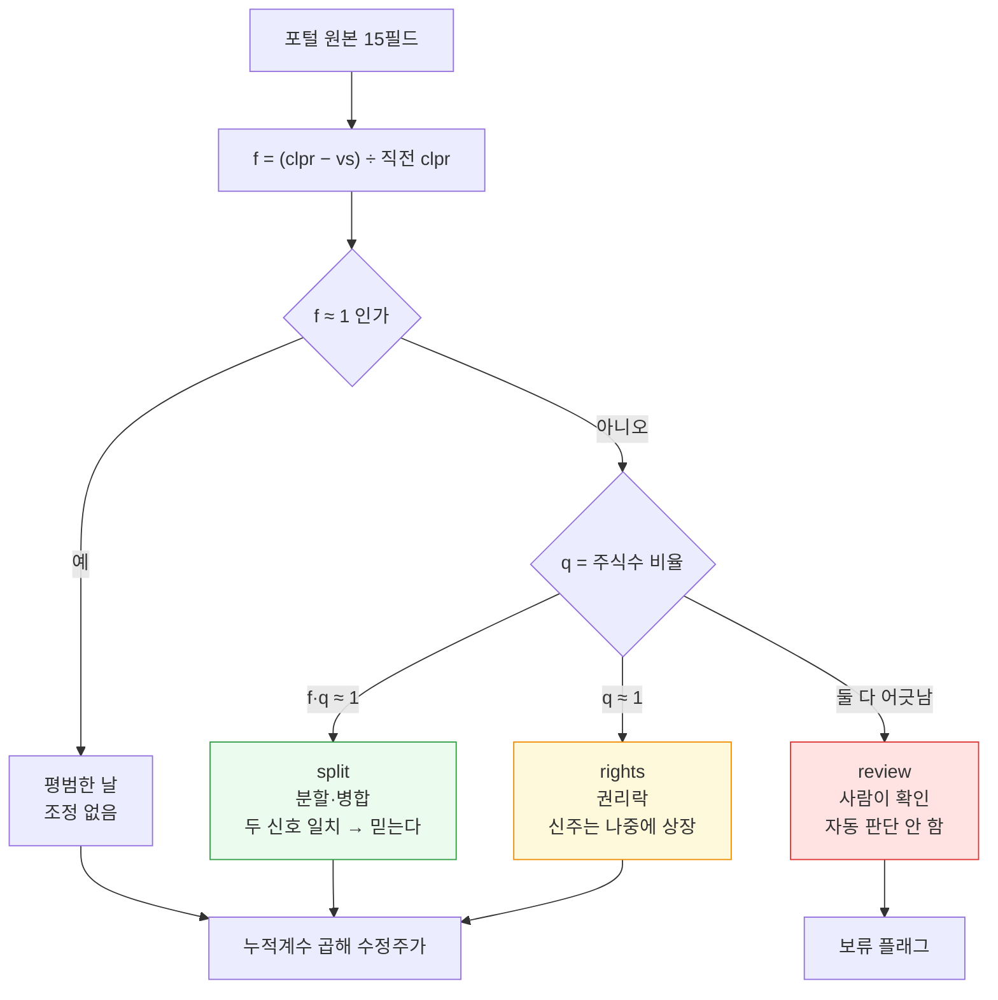
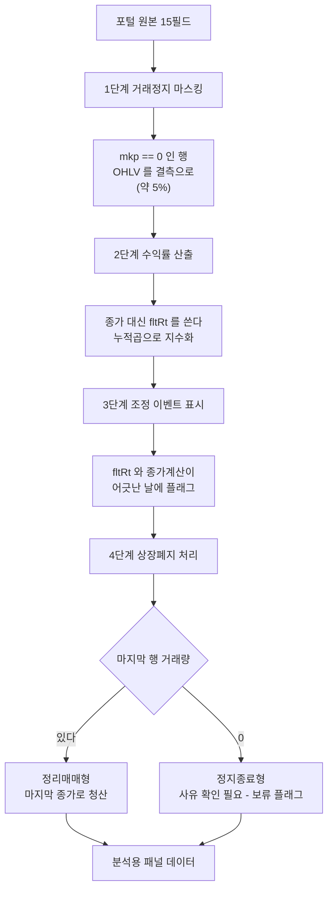
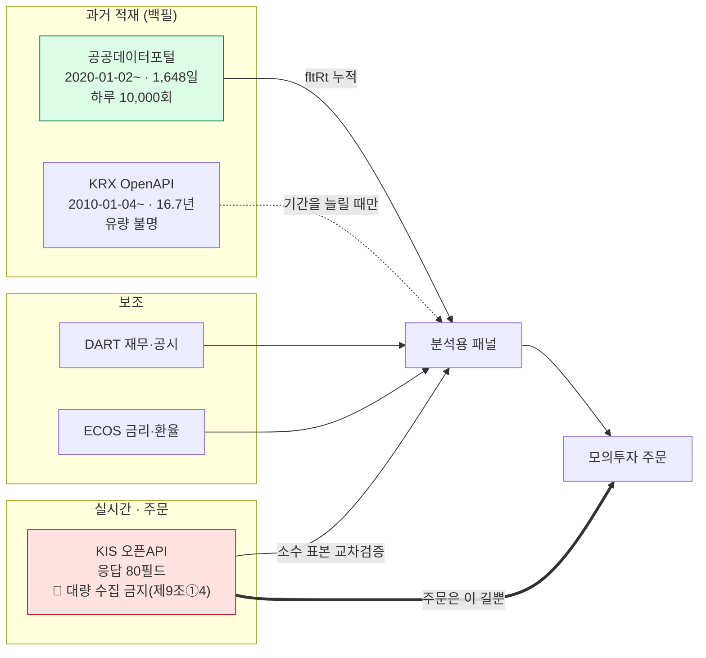
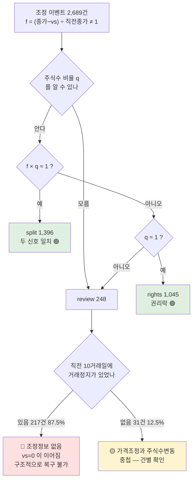
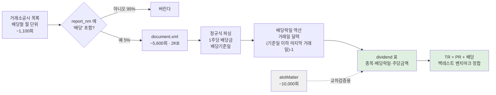
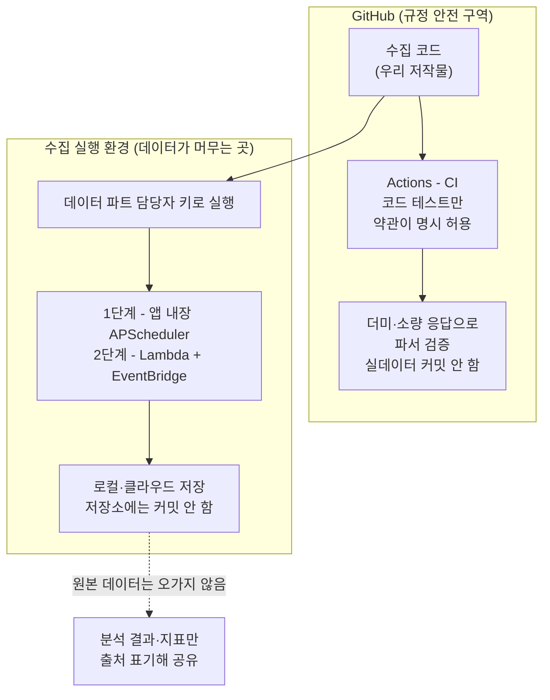
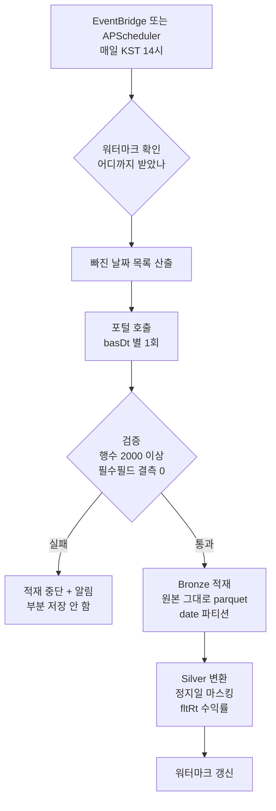

# #33 [분석] 포털 시세 데이터의 실제 구조 — 원주가·거래정지·상장폐지 실측과 전처리 설계

> 🗂️ 옛 GitHub 이슈를 옮긴 **기록 문서**입니다 — [색인](../README.md). 원문은 그대로 두고, 링크·커밋 해시만 새 자리 기준으로 바꿨습니다.

| 항목 | 내용 |
|---|---|
| 종류 | 이슈 |
| 상태 | 열림 |
| 원 작성 | 이동원(`devlee328288`) · 2026-09-18 18:57 KST |
| 라벨 | `analysis` |
| 댓글 | 11건 |
| 옛 주소 | `github.com/devlee328288/Qurious/issues/33` (지금은 열리지 않음) |

## 본문

> **세 줄 요약**
> 1. **종가(`clpr`)는 원주가입니다.** 카카오 액면분할일에 558,000 → 120,500으로 찍혀, 그대로 쓰면 하루 만에 **-78.4%** 손실로 계산됩니다.
> 2. **조정 정보는 데이터 안에 이미 있습니다.** ~~등락률(`fltRt`)을 누적하면 됩니다~~ 🔴 **2026-09-19 개정** — 더 정확한 길은 전일대비 금액 **`vs`** 입니다. 분할일의 `vs` 에 거래소 기준가가 그대로 들어 있습니다(카카오 120,500−8,500=**112,000**). `fltRt` 는 소수 2자리로 잘려 와 누적 시 오차가 쌓입니다. → 5-A절
> 3. 생존편향은 **없습니다**(과거 종목이 그대로 남아 있음). 다만 **왜 사라졌는지**(부실 상폐인지 합병인지)는 이 API가 알려주지 않습니다.

## 한눈에 보기

| 항목 | 현재 상태 | 백테스트에 그대로 쓰면 | 해결책 | 확실도 |
|---|---|---|---|---|
| 종가 `clpr` | **원주가**(미조정) | 분할일 -78% 가짜 손실 | ~~`fltRt` 누적으로 대체~~ → **`vs` 기반 조정계수**(5-A) | 🟢 |
| 등락률 `fltRt` | 조정 완료이나 **소수 2자리 반올림** | 누적 시 오차가 쌓임 | 🔴 **검증용으로만**. 수익률은 조정 종가에서 | 🟢 |
| **전일대비 `vs`** ★ | **정수 · 분할일엔 기준가 반영** | — | **조정계수의 근거**(5-A). 카카오 10곳 전부 정확 | 🟢 |
| **상장주식수 `lstgStCnt`** ★ | 분할 배수가 찍힘 | — | **두 번째 독립 신호로 교차검증**. 79건 → split 54·rights 21·review 4 | 🟢 |
| **거래정지 중 `vs=0`** ★ | 조정 정보가 **없음** | 정지 해제일 조정을 놓침 | 🔴 자동 판단 불가 — `review` 로 사람에게(5-A) | 🟢 |
| 거래정지일 | 종가만 복사, 나머지 0 | 변동성 과소평가 | `mkp==0` 으로 마스킹 | 🟢 |
| 상장폐지 종목 | **남아 있음** | (문제 없음) | 그대로 사용 | 🟢 |
| 상장폐지 사유 | **제공 안 함** | -100%인지 합병인지 모름 | 외부 소스 필요 | 🟢 |
| 배당 | 제공 안 함 | 총수익 과소평가 | 외부 소스 필요 | 🟢 |
| 기간 | 2020-01-02 ~ 2026-09-17 | — | **1,648 거래일 확정** | 🟢 |
| **KIS 수정주가** ★ | **`fltRt` 역산값과 완전 일치**(112,000) | — | **2절 방식이 외부에서 검증됨**(6.2) | 🟢 |
| **`endBasDt`** ★ | **배타적** — 끝날이 빠짐 | 마지막 날 조용히 유실 | 하루치 `basDt` 로 돌거나 +1일(6.4) | 🟢 |
| **거래정지 판별** ★ | 포털 `mkp==0` · **KIS 는 `acml_vol==0`** | 소스를 섞으면 안 걸림 | 소스별로 따로 적음(6.3) | 🟢 |
| **KIS 대량 수집** ★ | 약관 제9조①4 **부하 시 이용 중지** | 계정 정지 | 백필은 포털로, KIS 는 실시간·주문(6.1) | 🟢 |
| `FinanceDataReader` ★ | 국내 경로가 **네이버·KRX 스크래핑** | 약관 위반 | 🔴 미사용(6.5) | 🟢 |

## 용어 빠른 대조표

| 용어 | 한 줄 뜻 |
|---|---|
| 수정주가 | 액면분할·증자 때문에 생기는 가짜 등락을 없앤 주가 |
| 액면분할 | 주식 1주를 여러 주로 쪼개는 것 (가치 총합은 그대로) |
| 생존편향 | 망한 회사가 데이터에서 빠져 성과가 좋아 보이는 착시 |
| 정리매매 | 상장폐지 직전 마지막으로 팔 기회를 주는 기간 |
| 권리락 | 증자·배당 권리가 사라지면서 기준가가 내려가는 것 |
| 총수익(TR) | 주가 변동 **+ 배당**까지 합친 진짜 수익 |

## 용어 자세히

**수정주가**
- *정확한 뜻*: 액면분할·병합·유상증자처럼 **주주의 손익과 무관하게 주가 숫자만 바뀌는 사건**의 영향을 제거해, 과거 가격을 현재 기준으로 환산한 가격입니다.
- *이 문서에서*: 포털은 수정주가를 **주지 않지만**, 등락률(`fltRt`)이 조정되어 있어 **누적하면 같은 효과**를 냅니다.
- *헷갈리는 점*: "수정주가 = 배당까지 반영"으로 오해하기 쉬운데 **다릅니다.** 보통 수정주가는 분할·증자만 반영하고 배당은 빼고 계산합니다. 배당까지 넣은 게 **총수익(Total Return)** 입니다.

**생존편향(survivorship bias)**
- *정확한 뜻*: 현재 살아남은 대상만으로 과거를 분석해 결과가 실제보다 좋게 나오는 편향입니다.
- *이 문서에서*: "2020년 데이터를 조회하면 그때 상장돼 있던 종목이 다 나오는가?"를 실측했습니다 → **나옵니다.**
- *헷갈리는 점*: 생존편향이 없다고 문제가 끝난 게 아닙니다. **사라진 종목을 어떻게 처리할지**(-100%로 볼지, 합병가로 볼지)가 남고, 이게 더 어렵습니다.

---

## 1. 현재 구조 — 데이터가 실제로 어떻게 생겼는가

응답 필드는 **15개**입니다 (삼성전자 2026-09-16 실제 응답):

| 필드 | 값 | 뜻 | 백테스트 사용 |
|---|---|---|---|
| `basDt` | 20260916 | 기준일자 | 인덱스 |
| `srtnCd` | 005930 | 단축코드 | 키 |
| `isinCd` | KR7005930003 | 국제표준코드 | 키(보조) |
| `itmsNm` | 삼성전자 | 종목명 | 표시용 |
| `mrktCtg` | KOSPI | 시장구분 | 유니버스 필터 |
| `clpr` | 253,500 | 종가 | ⚠️ **원주가** |
| `vs` | 5,000 | 전일대비 | ✅ 조정됨 |
| `fltRt` | 2.01 | 등락률(%) | ✅ **조정됨 — 핵심** |
| `mkp` | 248,000 | 시가 | ⚠️ 정지일 0 |
| `hipr` | 254,000 | 고가 | ⚠️ 정지일 0 |
| `lopr` | 247,500 | 저가 | ⚠️ 정지일 0 |
| `trqu` | 11,757,106 | 거래량 | 유동성 필터 |
| `trPrc` | 2,957,721,972,027 | 거래대금 | 유동성 필터 |
| `lstgStCnt` | 5,846,278,608 | 상장주식수 | 이벤트 탐지 |
| `mrktTotAmt` | 1,482,031,627,128,000 | 시가총액 | 규모 필터 |

**검증된 항등식**: `clpr × lstgStCnt = mrktTotAmt` 가 **2,871종목 전부에서 성립**합니다(불일치 0). 시가총액은 독립 데이터가 아니라 **계산된 값**입니다.

**정렬**: 최신순 내림차순. `pageNo` 를 늘리면 과거로 갑니다.

```
데이터 범위 (실측 확정)
├── 시작 : 2020-01-02   ← page 1648 (마지막 페이지)
└── 끝   : 2026-09-17   ← page 1 (최신)
    총 1,648 거래일 / 2,450 달력일 = 6.71년 / 연평균 246 거래일
```

## 2. 발견 ① — 종가는 원주가, 등락률은 조정본 ★ 가장 중요

카카오(035720) 액면분할 5:1, **실제 응답 그대로**:

| 일자 | 종가 `clpr` | 전일대비 `vs` | 등락률 `fltRt` | 상장주식수 `lstgStCnt` |
|---|---:|---:|---:|---:|
| 2021-04-09 | 558,000 | +10,000 | +1.82 | 88,761,861 |
| 2021-04-12 | 558,000 | 0 | 0.00 | 88,761,861 |
| 2021-04-13 | 558,000 | 0 | 0.00 | 88,761,861 |
| 2021-04-14 | 558,000 | 0 | 0.00 | 88,761,861 |
| **2021-04-15** | **120,500** | **+8,500** | **+7.59** | **443,809,305** |
| 2021-04-16 | 119,000 | -1,500 | -1.24 | 443,809,305 |

```
          종가로 계산하면                     등락률 필드를 보면
          ─────────────────                   ─────────────────
2021-04-15  (120,500-558,000)/558,000          fltRt = +7.59%
            = -78.41%                          (역산하면 기준가 112,000원)
            ↑ 하루 만에 -78% 가짜 손실          ↑ 분할이 이미 반영되어 있다
```

**전 구간 검증** (카카오 1,648일 전체):

```
fltRt 와 "종가로 직접 계산한 등락률"이 어긋난 날
  ████                                                    1일 / 1,647일
  └ 2021-04-15 (액면분할일) 단 하루뿐. 나머지 1,646일은 완전 일치.

누적수익률 (2020-01-02 → 2026-09-17)
  종가만 단순 비교   ████████████████████ -78.03%   ← 틀린 값
  fltRt 누적                          ██  +9.53%   ← 조정 반영
  분할배수 손보정                     ██  +9.84%   ← 5배 곱해 손으로 보정
                                          └ 차이 0.31%p = 기준가 반올림(111,600 vs 112,000)
```

**교차 확인** — 삼성전자에서는 어땠나:

| | 삼성전자 | 카카오 |
|---|---|---|
| 상장주식수 변화 | **2일** (2025-03-06 ×0.9916, 2026-04-14 ×0.9876) | 1일 (×5.0000) |
| `fltRt` 불일치 | **0일** | 1일 |

삼성전자의 주식수 변화는 **감소**이고 `fltRt` 는 조정되지 않았습니다. 자사주 소각으로 추정되며(공시 미확인 🟡), 이 경우 **주가를 조정하면 안 되는 게 맞습니다.** 즉 `fltRt` 는 "조정이 필요한 사건에만" 조정되어 있습니다 — 상장주식수 비율로 직접 조정하는 것보다 **정확합니다.**

> **부수 소득 — 조정 이벤트 탐지법**
> `fltRt ≠ 종가로 계산한 등락률` 인 날 = 분할·병합·권리락이 있었던 날.
> 별도 이벤트 테이블 없이 데이터만으로 찾아낼 수 있습니다.

## 3. 발견 ② — 거래정지일은 종가만 복사된다

```
2021-04-12 ~ 04-14 (카카오 분할 전 거래정지 3일)
  시가 mkp   = 0          ┐
  고가 hipr  = 0          │  전부 0
  저가 lopr  = 0          │
  거래량 trqu = 0          │
  거래대금    = 0          ┘
  종가 clpr  = 558,000   ← 직전 영업일 값이 복사됨
  등락률      = 0.00      ← 다행히 0 (누적에 영향 없음)
```

**전종목 빈도**: 2020-01-02 **116종목(4.69%)** / 2026-09-16 **145종목(5.05%)**
(2026-09-16 기준 KOSDAQ 89 · KOSPI 26 · KONEX 30)

→ **판별 규칙이 아주 깨끗합니다**: `mkp == 0` 이면 거래정지·무거래. 종가를 그대로 쓰면 "3일간 무변동"이 되어 변동성이 과소평가되므로 **결측 처리**해야 합니다.

(S24에서 ETF PDF가 휴장일에 직전 영업일을 복사하던 것과 같은 패턴입니다 — **이 API 계열의 공통 성질**로 보입니다.)

## 4. 발견 ③ — 생존편향은 없다, 다만 사유를 모른다

```
2020-01-02 전종목 2,475 ┐
                       ├── 겹치지 않는 종목 294개 (11.9%)
2026-09-16 전종목 2,871 ┘   ISIN 기준·단축코드 기준 모두 294개로 동일
                            (KOSDAQ 168 · KOSPI 75 · KONEX 51)
```

과거 날짜를 조회하면 **그날 상장돼 있던 종목이 지워지지 않고 그대로** 나옵니다 🟢.

**사라진 종목의 마지막 데이터를 5개 표본으로 확인**하니 **두 패턴으로 갈립니다**:

```
패턴 A — 정리매매 후 상폐 (마지막까지 거래가 있다)
  동양3우B      28,450 → 46,000 → 27,350 → 14,750 → 10,050 → 16,750 → 8,000 → 2,095
                                                          마지막 8일 -93%  ↑ 상폐일 2022-07-14
  흥국화재2우B   8,050 → … → 3,180                        마지막 8일 -60%  ↑ 상폐일 2023-07-14

패턴 B — 거래정지 상태로 끝남 (거래량 0으로 멈춘다)
  셀트리온헬스케어  75,900 고정, 거래량 0 × 8일           ↑ 2024-01-11 (합병 추정)
  쌍용양회         7,000 고정, 거래량 0 × 8일            ↑ 2024-07-08 (자진상폐 추정)
  에스케이씨에스      694 고정, 거래량 0 × 8일            ↑ 2024-03-28
```

→ **마지막 행의 거래량 유무로 두 패턴을 구분할 수 있습니다.** 하지만 패턴 B의 *이유*(합병인지 자진상폐인지)는 이 API로 알 수 없습니다. 퀀트에서는 이 차이가 수익률을 가릅니다:

```
부실 상폐   → 정리매매 종가로 청산 (큰 손실)
흡수합병    → 합병비율로 존속법인 주식 전환 (손익 있음)
자진 상폐   → 공개매수가로 현금화 (보통 이익)
```

**전부 -100%로 처리하면 과소평가, 전부 무시하면 과대평가**입니다.

## 5. 그래서 전처리를 이렇게 바꿉니다

> ### 🔴 2026-09-19 (S27) 개정 — 이 절의 핵심이 바뀌었습니다
>
> 아래 원안은 **등락률(`fltRt`) 누적**이었습니다. 실제로 코드를 써서 돌려 보니
> **더 정확한 길이 있었습니다** — 전일대비 금액 `vs` 입니다. 원안은 취소선으로 남기고
> 개정판을 먼저 적습니다. 구현은 [PR #34](../pulls/034.md).

### 5-A. 개정판 — 조정계수는 `vs` 에서 나옵니다 ★ v1

**한 줄로**: 조정계수를 우리가 계산할 필요가 없습니다. **데이터가 이미 알려 주고 있었습니다.**

```
조정계수 f = (종가 − 전일대비) ÷ 직전 거래일 종가
누적계수  = 가장 최근 날부터 거꾸로 곱해 나간다 (오늘 가격은 건드리지 않는다)
```

#### 왜 `fltRt` 가 아니라 `vs` 인가

카카오 2021-04-15 (1:5 액면분할) 실측:

| 계산 방식 | 결과 | |
|---|---:|---|
| 558,000 ÷ 5 (직접 계산) | 111,600 | ❌ |
| `fltRt` 로 역산 | 111,999.3 | ❌ |
| **`vs` 로 역산** (120,500 − 8,500) | **112,000** | ✅ 실제 거래소 기준가 |

기준가가 5로 나눈 값이 아닌 이유는 **호가 단위에 맞춰 조정**되기 때문입니다. 그런데 그
값이 `vs` 에 **이미 들어 있습니다.**

`fltRt` 는 소수 **둘째 자리까지만** 옵니다 — 삼성전자 2026-09-17 은 실제 −0.3945% 인데
`"-.39"` 로 잘려 옵니다. `vs` 는 정수 원 단위라 자를 것이 없습니다.

| 기준일 | `vs` 로 역산 | `fltRt` 로 역산 | 실제 직전 종가 |
|---|---:|---:|---:|
| 20210409 | **548,000.0** | 548,025.9 | 548,000 |
| 20210415 | **112,000.0** | 111,999.3 | 558,000 (분할일) |
| 20210420 | **119,000.0** | 119,000.2 | 119,000 |
| 20210421 | **119,500.0** | 119,505.8 | 119,500 |

카카오 2021-04-08~22 열 곳 중 `vs` 는 **열 곳 모두** 소수점 이하 0 으로 정확히 맞았고,
`fltRt` 는 매번 몇십 원씩 어긋났습니다. 하루 오차가 0.005% 라도 1,648일을 곱해 나가면
쌓입니다.

#### 두 번째 독립 신호로 교차검증합니다

같은 응답의 **상장주식수(`lstgStCnt`)** 가 확인해 줍니다. 분할이면 주식 수가 늘어난
배수만큼 가격이 내려가므로, 가격 계수 `f` × 주식수 비율 `q` = 1 이어야 합니다.



79건에 적용한 결과 (2021-04 + 2026-09 실측):

| 분류 | 조건 | 뜻 | 건수 |
|---|---|---|---:|
| `split` | `f·q ≈ 1` | 분할·병합. 두 신호 일치 → **믿어도 된다** | **54** |
| `rights` | `q ≈ 1`, `f ≠ 1` | **권리락**. 신주는 나중에 상장 | **21** |
| `review` | 둘 다 어긋남 | 자동 판단하지 않는다 | **4** |

**사람이 볼 것이 5% 로 줄었습니다.**

| 기준일 | 종목 | 직전종가 | 기준가 | `f` | `q` | 분류 |
|---|---|---:|---:|---:|---:|---|
| 20210415 | 카카오 | 558,000 | 112,000 | 0.200717 | ×5.00 | `split` ✅ |
| 20210421 | 세기상사 | 61,600 | 6,160 | 0.100000 | ×10.00 | `split` ✅ |
| 20210413 | 현대중공업지주 | 283,000 | 56,600 | 0.200000 | ×5.00 | `split` ✅ |
| 20210423 | 씨젠 | 195,000 | 98,000 | 0.502564 | ×1.00 | `rights` |
| 20210429 | 대한제당 | 7,490 | 3,745 | 0.500000 | ×1.00 | `rights` |
| 20210415 | 한국석유 | 281,000 | 14,550 | 0.051779 | ×10.00 | `review` ⚠️ |
| 20210408 | 아이엠텍 | 214 | 5,350 | 25.0 | ×0.111 | `review` ⚠️ |

**🟢 8절의 열린 질문 하나가 해결됐습니다** — "유상증자 권리락·주식병합에서도 통하는가".
**무상증자 권리락은 통합니다.** 씨젠(2021-04-23)·대한제당(04-29)이 실증합니다. 대한제당은
**같은 종목에 분할(04-14)과 권리락(04-29)이 둘 다** 있는데 둘 다 정확히 잡혔습니다.
다만 권리락일엔 주식수로 교차검증할 수 없습니다(신주 미상장). 유상증자 권리락은 아직입니다.

#### 🔴 새로 찾은 한계 — 거래정지가 만드는 사각지대

```
20210401~07   아이엠텍   종가    214   vs 0   거래량 0   주식수 43,543,747
20210408      아이엠텍   종가  5,350   vs 0   거래량 0   주식수  4,831,715  ← 정지인 채로 값만 바뀜
```

**`vs = 0` 이면 "가격이 이어진다" 와 "조정 정보가 없다" 가 구별되지 않습니다.** 정지
해제일에 가격이 달라져 있으면 그것이 조정 때문인지 실제 등락인지 이 데이터만으로는 알
수 없습니다. 고칠 수 있는 버그가 아니라 **데이터의 한계**라, `review` 로 남기고 사람에게
넘깁니다.

#### 바꾸기 전 / 바꾼 후 (개정판)

```
[S26 규격]                                [S27 규격 — 구현됨]
 ret = fltRt / 100                 →      f = (clpr − vs) / prev_clpr
 ↑ 소수 2자리 반올림 누적                  ↑ 정수 연산, 오차 0

 (조정 이벤트 = fltRt 와 종가가    →      f 와 상장주식수 비율을 교차검증
  어긋난 날)                               split / rights / review 로 분류
 ↑ 한 신호만 본다                          ↑ 두 독립 신호가 서로 확인

 mask = (mkp == 0)                 →      mkp == 0 그리고 trqu == 0
 ↑ 유지 (실측 147/147 일치)                ↑ 둘 다 보아 한쪽만 0 인 날도 잡는다
```

---

### 5-B. ~~원안 (S26) — `fltRt` 누적~~ 🔴 5-A 로 대체됨

> 아래는 기록으로 남깁니다. **틀린 것은 아니지만 덜 정확합니다** — `fltRt` 의 소수 2자리
> 반올림이 1,648일 누적에서 오차로 쌓입니다. 5-A 를 쓰세요.



```
[지금 흔히 짜는 코드]                    [S26 안]
 ret = clpr.pct_change()          →      ret = fltRt / 100
 ↑ 분할일 -78% 가짜 손실                  ↑ 조정 완료된 값

 (거래정지일 그대로 사용)          →      mask = (mkp == 0) ; OHLV[mask] = NaN
 ↑ 변동성 과소평가                        ↑ 정지일 제외

 (현재 상장 종목만 조회)           →      과거 날짜 전종목을 그대로 사용
 ↑ 생존편향 유발                          ↑ 이미 편향 없음, 상폐 처리만 추가
```

## 6. 남은 구멍과 메울 수 있는 소스

`.env` 를 확인해 보니 **DART·ECOS·FRED·KOSIS·금감원 키가 이미 준비되어 있습니다.** DART는 실제 호출해 정상 작동을 확인했습니다(삼성전자 공시 3,592건, 재무제표 30항목 응답 🟢).

| 구멍 | 메울 소스 | 확인 상태 |
|---|---|---|
| 재무제표(PER·PBR·ROE) | **DART** `fnlttSinglAcnt` | 🟢 호출 성공 |
| 합병·분할 사유 | **DART** 주요사항보고서 | 🟡 가능해 보이나 미검증 |
| **부실 상장폐지 사유** | DART로는 부족 — 상장폐지 결정은 **거래소(KIND)** 공시 | 🔴 미확인 |
| 배당 | DART 또는 포털 배당 API | 🔴 미확인 |
| 금리·환율 | **ECOS** | 🔴 미확인 |
| 수정주가 | **불필요** — `fltRt` 로 해결 | 🟢 |

### 6.1 KIS(한국투자증권) 오픈API — 약관 정독 + 모의 키 실측 ★ 2026-09-18 추가

`.env` 에 KIS 키가 있는데 **약관을 한 번도 읽지 않은 상태**였습니다. 포털사이트 푸터의 「고객 이용약관」 팝업에서 전문(21개 조 · 제정 2022-08-08 · 시행 2022-10-01)을 읽었습니다.

| 조항 | 원문 요지 | 우리에게 |
|---|---|---|
| 제3조 (적용범위) | 조회(시세·계좌·잔고·거래내역) **및 매매주문업무** | 주문까지 약관 범위 안 |
| **제5조②** | 앱키·시크릿키를 **제3자에게 대여·위임·양도 또는 누설 금지** | 🔴 팀원에게 키 공유 불가 (이미 지키는 중) |
| **제5조③** ★ | *"회사에서 제공하는 **시세**정보를 고객이 **직접 개발한 프로그램 등 개인의 업무에 한하여** 이용해야 하며, **제3자에게 제공해서는 아니 된다**"* | 🔴 **가장 강한 제약** — 팀 공유·재배포 불가. 포털·KRX와 **같은 결론** |
| 제9조①4 · 제10조①6 | **회사 서버에 일정수준 이상의 부하를 유발**하면 이용 **중지·해지** | 🔴 **KIS 로 대량 백필을 하면 안 됩니다** |
| 제10조①4 | 최근 **1년간 이용 실적이 없으면 해지** | 🟡 발표 뒤 방치 주의 |
| 제11조 | 수수료 부과 (단 **0원이면 해당 없음**) | 🟡 현재 0원 여부 미확인 |
| 제12조 (유량 제어) | 유량 제어 정책은 **회사가 정하여 홈페이지·포털에 게시** | 🟢 게시 수치는 못 찾았으나 **직접 실측했습니다 — 모의는 초당 약 2건**(6.1.1). 포털에 *"Rest API 유량확대 이벤트"* 팝업이 있어 **확대 신청 가능** |
| 제13조 | 연중무휴. **점검시간에는 잔고 조회가 실제와 다를 수 있음** | ⚠️ 모의투자 일지(D7 [#13](../discussions/013.md)) 정합성 주의 |
| 제14조 | 거래기록 **10년 보존**, 고객 요청 시 제공 | ✅ 우리 일지와 대조 가능 |
| 제17조②1 | 키 유출로 인한 부정사용은 **고객 책임** | `.env` 관리 |

**모의 키(`KIS_MOCK_*`)로만 실호출했습니다. 실계좌 키는 읽지도 않았습니다.**

| 검증 | 결과 |
|---|---|
| 토큰 발급 `POST /oauth2/tokenP` | HTTP 200 · `expires_in` **86,400초(24시간)** · Bearer |
| 현재가 `inquire-price` (삼성전자) | HTTP 200 · `rt_cd=0` · 현재가 **259,500** (2026-09-18 19:51 KST) · **응답 필드 80개** |
| 유량 헤더 | **없음** — 포털이 주는 `X-RateLimit-Limit/Remaining/Requested` 3종이 KIS 에는 없습니다 |
| 일별 차트 `inquire-daily-itemchartprice` | HTTP 200 · `output2` 필드 **13개** |

> ⚠️ 도메인을 틀리면 DNS 에서 막힙니다. 모의는 **`openapivts.koreainvestment.com:29443`** 입니다([kis.py:12](https://github.com/EST-team-project/Qurious/blob/04f476a/app/services/brokers/kis.py#L12)). 저장소 코드에 이미 정확히 적혀 있습니다.

---

#### 6.1.1 ★ KIS 유량을 **실측으로 확정**했습니다 (게시 문서가 없어 직접 쟀습니다)

약관 제12조가 *"회사가 정하여 게시"* 라는데 포털·홈페이지에서 수치를 못 찾아, **모의 키로 직접 재봤습니다.**

| 시험 | 결과 |
|---|---|
| A. 단독 호출 (앞뒤 여유) | ✅ 59ms · `rt_cd=0` |
| B. **무휴식 연속 6회** | ✅❌✅❌❌❌ — **6회 중 4회 실패** |
| C. **0.5초 간격 4회** | ✅✅✅❌ — **4회째에 걸림** |

**실패는 이렇게 옵니다.**

```
 HTTP 500  ·  rt_cd = 1  ·  msg_cd = EGW00201
 msg1 = "초당 거래건수를 초과하였습니다."
```

→ 모의투자 도메인은 대략 **초당 2건** 수준입니다. 0.5초 간격도 4회째에 걸렸으므로 **0.6~1.0초 간격**을 권합니다. (실전 도메인은 더 높다고 알려져 있으나 **저희가 잰 것은 모의뿐**입니다 🟡)

> ⚠️ **수집기에 반드시 넣어야 할 것** — 실패가 `rt_cd=1` 로 오고 `output2` 가 **빈 배열**입니다. HTTP 상태만 보거나 `output2` 를 그냥 `or []` 로 받으면 **데이터가 없는 날로 오인**합니다. 실제로 이번 교차검증 1회차에서 카카오만 빈 값이 나왔고, 원인이 이것이었습니다.

```python
# ❌ 조용히 틀린다 — 유량 초과가 "데이터 없음"으로 보인다
rows = resp.json().get('output2') or []

# ✅ rt_cd 를 먼저 본다
d = resp.json()
if d.get('rt_cd') != '0':
    raise KisRateLimited(d.get('msg_cd'), d.get('msg1'))   # EGW00201 이면 쉬고 재시도
rows = d.get('output2') or []
```

#### 6.1.2 3자 교차검증 — KRX · 포털 · KIS (2026-09-16) 🟢

KRX 공식 OpenAPI(`stk_bydd_trd` · 유가증권 **943행** · 필드 15개)까지 넣어 셋을 맞춰 봤습니다.

| 종목 | 항목 | KRX | 포털 | KIS(수정주가) | 판정 |
|---|---|--:|--:|--:|---|
| 삼성전자 | 종가 | 253,500 | 253,500 | 253,500 | ✅ |
| | 시가 | 248,000 | 248,000 | 248,000 | ✅ |
| | 거래량 | 11,757,106 | 11,757,106 | 11,757,106 | ✅ |
| SK하이닉스 | 종가 | 1,759,000 | 1,759,000 | 1,759,000 | ✅ |
| | 시가 | 1,686,000 | 1,686,000 | 1,686,000 | ✅ |
| | 거래량 | 2,857,754 | 2,857,754 | 2,857,754 | ✅ |
| 카카오 | 종가 | 33,500 | 33,500 | 33,500 | ✅ |

**세 기관이 완전히 일치합니다.** 어느 소스를 쓰든 값 자체는 같고, **갈리는 것은 기간·유량·약관뿐**입니다.

> 🟡 KRX 는 시장별로 엔드포인트가 나뉩니다 — `stk_bydd_trd`(유가증권 943행)만 불렀습니다. 전종목을 맞추려면 코스닥·코넥스 엔드포인트를 더 불러야 하며, 포털은 `basDt` 하루치로 **2,871행을 한 번에** 줍니다.
>
> ⚠️ 컬럼명이 다릅니다 — KRX 는 `ISU_CD`·`TDD_CLSPRC`·`ACC_TRDVOL`, 포털은 `srtnCd`·`clpr`·`trqu`, KIS 는 `stck_clpr`·`acml_vol`. 저도 처음에 `ISU_SRT_CD` 로 찾다가 전부 0 이 나왔습니다.


---

### 6.2 ★★ KIS 수정주가가 `fltRt` 역산값과 **정확히 일치**합니다 — 독립 검증

2절에서 *"`fltRt` 를 누적하면 수정주가 수익률이 복원된다"* 고 했는데, 그것을 **다른 기관의 데이터로 확인**했습니다. KIS 는 파라미터 하나로 수정주가/원주가를 골라 줍니다 — `FID_ORG_ADJ_PRC` (`0`=수정주가, `1`=원주가).

카카오 액면분할(2021-04-15) 구간을 두 번 받았습니다.

| 일자 | KIS **수정주가**(`=0`) | KIS **원주가**(`=1`) | 포털 `clpr` | 포털 `fltRt` |
|---|--:|--:|--:|--:|
| 2021-04-12 | **112,000** | 558,000 | 558,000 | 0.00 |
| 2021-04-13 | **112,000** | 558,000 | 558,000 | 0.00 |
| 2021-04-14 | **112,000** | 558,000 | 558,000 | 0.00 |
| **2021-04-15** | 120,500 | 120,500 | 120,500 | **+7.59** |

```
 2절에서 fltRt 로 역산한 기준가        120,500 ÷ 1.0759 = 112,000
 KIS 가 수정주가로 직접 주는 값                        112,000
                                                   ─────────
                                                    완전 일치 ✅
```

**두 기관이 독립적으로 같은 값을 냅니다.** `fltRt` 누적 방식이 옳다는 것을 포털 내부 정합성이 아니라 **바깥에서 확인**한 셈입니다.

> 🟡 덤으로 알게 된 것: **단순 나눗셈이 아닙니다.** 1:5 분할이니 558,000 ÷ 5 = **111,600** 이어야 하는데 실제 기준가는 **112,000** 입니다(400원 차이). 액면분할 기준가는 호가단위 등 거래소 규칙을 타므로, **직접 계산해서 조정하려 들면 틀립니다.** `fltRt`(또는 KIS 수정주가)를 그대로 쓰는 편이 맞습니다.

#### 조정 사유 필드는 있는데 **값이 비어 있습니다** 🔴

KIS 일별 차트 응답에는 조정 이벤트를 알려줄 법한 필드가 넷 있습니다. 그런데 **액면분할 당일에도 전부 비어 있었습니다.**

| 필드 | 이름에서 기대한 것 | 2021-04-15 실제 값 |
|---|---|---|
| `flng_cls_code` | 락(落) 구분 — 권리락·배당락 | `'00'` |
| `prtt_rate` | 분할 비율 | `'0.00'` |
| `revl_issu_reas` | 재평가 사유 | `''` (빈 문자열) |
| `mod_yn` | 수정 여부 | `'N'` |

→ **조정 이벤트 탐지는 여전히 2절의 방법(`fltRt` 와 종가 계산이 어긋난 날)뿐입니다.** 이름만 보고 이 필드를 믿으면 안 됩니다.

---

### 6.3 거래정지일 표현이 두 소스에서 **다릅니다** ⚠️

3절에서 포털의 거래정지일 처리를 정리했는데, KIS 는 **다르게 표현합니다.** 같은 날(카카오 2021-04-12~14, 분할 전 정지)을 두 소스에서 본 결과입니다.

| | 공공데이터포털 | KIS |
|---|---|---|
| 종가 | 직전값 복사 (558,000) | 직전값 복사 (**수정주가 112,000**) |
| 시가 | **0** | 직전값 복사 (112,000) |
| 고가·저가 | **0** | 직전값 복사 |
| 거래량 | 0 | 0 |
| 등락률 | 0.00 | (일별 차트엔 등락률 필드 없음) |
| **판별법** | **`mkp == 0`** | **`acml_vol == 0`** |

> 🔴 **소스를 섞어 쓰면 한쪽 규칙이 다른 쪽에서 안 먹습니다.** KIS 데이터에 `mkp==0` 마스킹을 걸면 **정지일이 하나도 안 걸립니다.** 전처리 규격(`preprocess_spec`)에 **소스별 판별법을 따로 적어야 합니다.**

---

### 6.4 포털 범위 조회의 함정 — `endBasDt` 는 **배타적**입니다 🔴 ★ 새 발견

수집기를 짤 때 바로 물릴 문제라 따로 적습니다. 삼성전자로 실측한 결과입니다.

| 요청 | 받은 날짜 | 건수 |
|---|---|--:|
| `beginBasDt=20260915` `endBasDt=20260917` | 09-15, 09-16 | 2 |
| `beginBasDt=20260915` `endBasDt=20260918` | 09-15, 09-16, **09-17** | 3 |
| `beginBasDt=20260910` `endBasDt=20260917` | 09-10, 09-11, 09-14, 09-15, 09-16 | 5 |

**구간은 `[beginBasDt, endBasDt)` 입니다** — 시작일은 포함, **끝날은 제외**.

```
 ❌ 이렇게 짜면 마지막 날이 조용히 사라집니다
    fetch(begin=시작일, end=종료일)

 ✅ 끝날을 하루 밀거나, 애초에 basDt 하루치씩 부릅니다
    fetch(begin=시작일, end=종료일 + 1일)
    또는  for d in 거래일: fetch(basDt=d)     ← 백필에는 이쪽을 권합니다
```

> 백필을 `basDt` 하루씩 도는 방식으로 권하는 이유가 하나 더 있습니다 — **`basDt` 하루치가 그날의 상장 명단 전체**(2026-09-16 기준 2,871행)를 주기 때문에, 시점 유니버스를 **추가 수집 없이** 만들 수 있습니다. 날짜별 SHA-256 을 남기기도 이쪽이 자연스럽습니다([D0 #6 ⑥-2](../discussions/006.md) 매니페스트).

**교차검증도 함께 했습니다** — 삼성전자 2026-09-15·09-16 을 포털과 KIS 에서 각각 받아 **종가·시가·거래량이 전부 일치**했습니다 ✅.

| 일자 | KIS 종가 | 포털 종가 | KIS 시가 | 포털 시가 | KIS 거래량 | 포털 거래량 |
|---|--:|--:|--:|--:|--:|--:|
| 2026-09-15 | 248,500 | 248,500 ✅ | 248,000 | 248,000 ✅ | 11,435,506 | 11,435,506 ✅ |
| 2026-09-16 | 253,500 | 253,500 ✅ | 248,000 | 248,000 ✅ | 11,757,106 | 11,757,106 ✅ |

포털 갱신 지연도 확인했습니다 — 2026-09-18 19:53 KST 시점에 `basDt=20260917` 이 **2,870종목**으로 들어와 있고 `20260918` 은 **0행**입니다. 즉 **영업일+1** 이 실제로 지켜집니다.

---

### 6.5 `FinanceDataReader` 판정 — 🔴 국내 시세에는 **쓸 수 없습니다**

보류 상태였던 판정을 닫습니다. 설치본(0.9.202)의 소스를 직접 열어 **호출 도메인을 전수**로 뽑았습니다.

| 도메인 | 코드 내 등장 | robots.txt 실측 |
|---|--:|---|
| `data.krx.co.kr` | **25회** | 404 (robots 없음) — 대신 **KRX 약관 제10조②** 자동 수집 금지 |
| `finance.naver.com` | 9회 | **`Disallow: /`** 🔴 |
| `navercomp.wisereport.co.kr` | 6회 | 404 |
| `api.stock.naver.com` | 4회 | 404 |
| **`fchart.stock.naver.com`** ← 국내 일별시세 **기본 경로** | 2회 | **`Disallow: /`** 🔴 |
| `kind.krx.co.kr` | 2회 | **웹방화벽이 요청 자체를 차단** |
| `ecos.bok.or.kr` · `fred.stlouisfed.org` | 4회 | 공식 API (키 필요) ✅ |

`fdr.DataReader('005930')` 의 국내 일별시세는 **`fchart.stock.naver.com/sise.nhn`** 을 부릅니다. 그 도메인의 robots.txt 가 **전면 금지**입니다([#25](../issues/025.md)에서 네이버를 🔴로 판정한 것과 같은 근거).

| 용도 | 판정 |
|---|---|
| 국내 주식·ETF 시세 | 🔴 **사용 불가** (네이버 + KRX 스크래핑) |
| ECOS·FRED 래퍼 | 🟡 약관은 괜찮지만 **직접 호출이 낫습니다** — 의존성 하나를 줄이고, 래퍼가 무엇을 바꾸는지 안 보이는 문제도 없앱니다 |

→ pykrx 와 **같은 이유로 같은 결론**입니다. `requirements.txt` 에 넣지 않습니다.

---

### 6.6 그래서 소스별 역할이 이렇게 갈립니다



| 용도 | 소스 | 왜 |
|---|---|---|
| **과거 전종목 백필** | **포털** | 하루 10,000회 중 1,648회(16.5%)면 끝. `basDt` 하루치가 그날 명단 전부 |
| **실시간 시세 · 주문** | **KIS** | 유일한 경로. 응답 80필드 |
| **수정주가 교차검증** | **KIS (소수 표본)** | `FID_ORG_ADJ_PRC=0`. ⚠️ **백필에 쓰면 제9조①4(부하) 위반 소지** |
| 기간을 16.7년으로 늘릴 때 | KRX OpenAPI | 2010-01-04~. 유량 헤더가 없어 한도 불명 |
| 재무 | DART | 호출 확인됨 |
| 금리·환율 | ECOS | 🔴 아직 미확인 |
| ~~국내 시세 래퍼~~ | ~~FinanceDataReader · pykrx~~ | 🔴 6.5절 |

### 6.7 저장·공유는 어디에 — HF Organization

1차에서 쓰던 **Hugging Face Organization(`qurious-quant`)** 을 2차에도 씁니다. 다만 **원자료를 올릴지**는 약관 해석이 갈려 있어, **매니페스트(날짜별 SHA-256)만 올리고 원자료는 각자 로컬에 두는** 구조로 설계했습니다. 상세는 [D0 #6 ⑥-0~⑥-6](../discussions/006.md)에 있습니다.

- 위 6.1~6.4 가 **`preprocess_spec: "v1"` 의 내용**이 됩니다 — 소스별 정지일 판별법(6.3) · `fltRt` 누적(2절) · `endBasDt` 배타성(6.4).
- 1차 `common/raw_store.py`(300줄)가 이미 **응답을 바이트 그대로 보관하고 sha256 을 저장·검증**하므로, 매니페스트는 그 위에 얇게 얹습니다.

> 🟢 **2026-09-19(S29·S30) 확인 — Organization 이 실제로 있고 권한도 있습니다.**
>
> | 확인 | 결과 |
> |---|---|
> | Organization `qurious-quant` | 🟢 **존재** |
> | 우리 계정 | `data-student` |
> | 역할 | 🟢 **admin** (Private 저장소 생성·공유 가능) |
>
> 즉 *"올릴 수 있는가"* 는 해결됐고, 남은 것은 **올려도 되는가** 뿐입니다. 그 판단은
> 아래 7절의 *"팀원이 제3자인가"*(KIS 약관 제5조②③)에 걸려 있어 **여전히 보류**입니다.
>
> ⚠️ **다만 S30 에 조건이 하나 바뀌었습니다.** 수집기가 쌓은 원문(`raw_response`)은
> 이제 **포털·DART 두 출처**입니다. KIS 원문은 **한 건도 없습니다**(백필을 포털로 했고,
> KIS 는 약관 제5조③ 때문에 애초에 쓰지 않았습니다 — 8절). 즉 **지금 있는 자료만
> 놓고 보면 제5조③ 이 걸리지 않습니다** — 포털은 공공누리, DART 는 공시 정보입니다.
> 🔴 그래도 보류를 풀지 않는 이유는 **공공누리 "변경금지" 조항이 지표 계산까지 막는지
> 미확인**이고(7절), 그쪽이 걸리면 파생 결과 공유도 다시 봐야 하기 때문입니다.

---

### 6.8 ★★ ECOS(한국은행) — 약관 대신 **robots 로 확인**, 그리고 무위험수익률 문제가 풀립니다 (2026-09-19 추가)

`.env` 에 `ECOS_API_KEY` 가 있는데 한 번도 쓰지 않았습니다. 이번에 **실호출까지 했습니다.**

#### 6.8.1 이용 조건 — 다른 소스와 **정반대**입니다 🟢

| 소스 | robots.txt | 판정 |
|---|---|---|
| `finance.naver.com` · `fchart.stock.naver.com` | `Disallow: /` | 🔴 |
| `data.krx.co.kr` | robots 없음 · **약관 제10조② 자동 수집 금지** | 🔴 |
| **`ecos.bok.or.kr`** | **`User-agent: *` / `Disallow:`** ← **빈 값 = 전면 허용** | 🟢 |

`Disallow:` 뒤가 **비어 있는 것**은 "막는 경로가 없다", 즉 **전부 허용**이라는 뜻입니다. `Disallow: /` (전면 금지)와 **한 글자 차이로 정반대**입니다.

🟡 **그래도 약관 본문은 못 읽었습니다** — `ecos.bok.or.kr/api/` 가 자바스크립트로 그려지는 화면이라 내용이 안 나옵니다. 다만 ① robots 가 전면 허용이고 ② **키를 발급받아 쓰는 공식 오픈API** 라는 점에서, 포털·KIS 와 같은 성격으로 봅니다.

#### 6.8.2 실호출 — 전부 동작합니다 🟢

| 호출 | 결과 |
|---|---|
| `StatisticTableList` | HTTP 200 · **통계표 839개** |
| `StatisticItemList/817Y002` (시장금리 일별) | 콜금리 · KORIBOR · **국고채 1·2·5·10·20·30년** |
| `StatisticSearch` 국고채(1년) 2019-12-30~2026-09-09 | **1,650 영업일** 전부 |

#### 6.8.3 ★ 무위험수익률을 **고정값으로 두면 안 됩니다** 🔴

A6 [#14](../issues/014.md)가 *"샤프가 두 벌 — 무위험수익률 **0** vs **2%**"* 라고 지적했고, A7 [#16](../issues/016.md)이 네 번째 구현을 찾았습니다. **어느 쪽이 맞느냐가 아니라, 고정값 자체가 틀렸습니다.**

국고채(1년) 실측 — 우리 백테스트 구간과 **정확히 같은 기간**입니다.

| 연도 | 평균 | 최저 | 최고 |
|---|---:|---:|---:|
| 2020 | 0.840% | 0.649 | 1.355 |
| 2021 | **0.917%** | **0.591** | 1.471 |
| 2022 | 2.645% | 1.341 | **3.930** |
| 2023 | 3.533% | 3.217 | 3.793 |
| 2024 | 3.171% | 2.664 | 3.496 |
| 2025 | 2.433% | 2.240 | 2.674 |
| 2026 (~09) | 3.073% | 2.517 | 3.670 |
| **전 구간** | **2.336%** | **0.591** | **3.930** |

```
국고채(1년) 연평균 · █ = 0.5%p

 2020  0.84 ██
 2021  0.92 ██
 2022  2.65 █████
 2023  3.53 ███████
 2024  3.17 ██████
 2025  2.43 █████
 2026  3.07 ██████
        ─────────────────────────────
 고정 2%  ████            ← 2021년엔 2배 이상 과대
                             2022~23년엔 크게 과소

 최저 0.591% ↔ 최고 3.930% — **6.6배 차이**
```

**샤프에 얼마나 영향을 주나** (설명용 계산 🟡)

샤프 = (연수익률 − 무위험수익률) ÷ 연변동성 입니다. 연변동성 15%인 전략이라면 —

| 무위험수익률 | 샤프 (연수익률 10% 가정) |
|---|---:|
| 0% (A6 샤프-A) | (10 − 0) ÷ 15 = **0.667** |
| 2% 고정 (A6 샤프-B) | (10 − 2) ÷ 15 = **0.533** |
| 2021년 실제 0.917% | (10 − 0.917) ÷ 15 = **0.606** |
| 2022년 실제 2.645% | (10 − 2.645) ÷ 15 = **0.490** |

**같은 전략인데 무위험수익률만으로 샤프가 0.490 ~ 0.667 로 벌어집니다.** D4 [#17](../discussions/017.md) ①이 통일해야 할 "비용 규격"에 **무위험수익률도 들어가야 합니다.**

→ **권고: 고정값 대신 ECOS 국고채(1년) 일별 시계열을 쓴다.** 이미 받아지는 것을 확인했고, 한 번 받아 두면 됩니다. 🟡 *어느 만기를 무위험수익률로 볼지*(1년이냐 3개월이냐)는 D4에서 정할 문제로 남깁니다.

#### 6.8.4 🔴 날짜 축이 다릅니다 — **증시 폐장일에 채권시장은 영업합니다**

같은 기간(2019-12-30~2026-09-09)을 두 소스에서 받아 날짜를 대조했습니다.

| | 날짜 수 |
|---|---:|
| ECOS 국고채(1년) 영업일 | **1,650일** |
| 포털 주식 거래일 | **1,648일** |
| ECOS 에만 있는 날 | **8일** |

그 8일이 **전부 12월 말**이었습니다.

```
  20191230 · 20191231 · 20201231 · 20211231
  20221230 · 20231229 · 20241231 · 20251231
                ↑
       증시는 연말 폐장 · 채권시장은 영업
```

**두 시계열을 그냥 합치면 이 8일에 금리만 있고 주가가 없습니다.** 조인 방식에 따라 그날 수익률이 0으로 채워지거나(A4 [#23](../issues/023.md) 결함 3과 같은 함정) 행이 통째로 빠집니다. **주식 거래일을 기준 축으로 삼고 금리를 붙이는 방향**이어야 합니다. 🟢

**덤으로 확인된 것** — 포털 거래일 수가 **1,648일**로, 이 이슈가 처음에 적었던 *"2020-01-02 ~ 1,648거래일"* 과 **정확히 일치**합니다. 그리고 ECOS 에는 있는 `20191230`·`20191231` 이 포털에는 없어, **포털 자료가 2020-01-02 부터**라는 것이 다시 확인됩니다. 🟢

---

## 7. 한계 · 틀렸던 것

1. **배당은 어떤 방법으로도 복원 불가**합니다 🟢. `fltRt` 는 배당락일에 하락분을 그대로 음수로 기록하므로, 이 데이터만으로는 **총수익(TR) 기준 백테스트를 할 수 없습니다.** 가격수익(PR) 기준임을 명시해야 합니다.
2. **표본이 작습니다** — 분할 검증은 카카오 1건, 상폐 패턴은 5종목입니다 🟡. 다른 조정 사건(유상증자 권리락, 주식병합)에서도 `fltRt` 가 조정되는지는 확인하지 못했습니다.
3. **삼성전자 주식수 감소 2건을 "자사주 소각으로 추정"** 했습니다 — 공시로 확인하지 않았습니다 🟡.
4. **상폐 사유는 전부 추정**입니다 — "합병 추정", "자진상폐 추정"은 데이터가 아니라 제 판단입니다 🟡.
5. **제가 틀렸던 것 두 가지**:
   - HD현대미포·현대홈쇼핑·더존비즈온·두산인프라코어를 "현재도 상장 중"이라고 단정했는데, 2026-09-16 전종목에 **없습니다.** 데이터가 맞고 제 사전 지식이 틀렸습니다.
   - 삼성전자 2026-07-31 **+26.8%** 를 데이터 오류로 의심했으나, OHLC·거래량이 모두 일관되어 **실제 급등**이었습니다(직전 2일 -13.4%, -5.2% 후 반등).
6. KRX OpenAPI와의 교차검증은 **하지 않았습니다** 🔴.

## 8. 판정을 뒤집을 조건

| 판정 | 뒤집히는 조건 |
|---|---|
| `fltRt` 누적으로 충분 | **유상증자 권리락·주식병합**에서 `fltRt` 가 조정되지 않는 사례가 나오면 |
| 거래정지 판별 `mkp==0` | 정지가 아닌데 시가가 0인 종목이 나오면 |
| 생존편향 없음 | 더 오래된 시점(2020 이전)에서는 다를 수 있음 — 확인 불가(데이터 없음) |
| 상폐 2패턴 분류 | 표본 5개라 반례가 나올 수 있음. 294개 전수 확인 필요 |
| **KIS ↔ 포털 일치**(6.2·6.4) | 표본이 **카카오 1종목·삼성전자 2일**뿐입니다. 권리락·병합·다른 종목에서 어긋나면 |
| **`endBasDt` 배타성**(6.4) | 다른 엔드포인트(`getETFPriceInfo` 등)에서는 다를 수 있음 — 미확인 |

## 9. 팀에 여쭙니다

1. **수익률을 `fltRt` 기준으로 통일**해도 될까요? 종가 기반 코드가 이미 있다면 바꿔야 합니다.
2. **가격수익(PR) 기준으로 갈지, 배당 소스를 추가해 총수익(TR)까지 갈지** — 성과 수치가 달라지는 선택입니다.
3. 상장폐지 294종목의 **사유를 전수 조사할지**, 아니면 **보수적으로 전부 정리매매가로 청산 처리**할지.
4. ★ **KIS 유량 확대를 신청할까요?** 게시 수치는 못 찾았지만 실측으로 **모의 초당 약 2건**을 확인했습니다(6.1.1). 포털에 **"Rest API 유량확대 이벤트"** 팝업이 있습니다. 실전 도메인 유량은 **아직 안 재봤습니다**(실계좌 키를 승인 없이 쓰지 않았습니다).
5. ★ **KIS 수수료가 0원인지** 확인이 필요합니다(제11조 — 0원이면 해당 없음).

---

### 후속 예정

- **지속 수집 파이프라인**(GitHub Actions)을 규정에 어긋나지 않게 설계하는 건 별도 후속으로 다룹니다. 강사님 배포 저장소에 선례가 있는지 먼저 확인합니다.
- ~~나머지 소스(ECOS·배당·KIND)와 KIS(한국투자증권) API 검토도 후속입니다.~~ → **KIS 는 2026-09-18 완료(6.1~6.4)**. 남은 것은 **ECOS·배당·KIND** 입니다.

*실측 조건: 공공데이터포털 `getStockPriceInfo` 직접 호출 — 1차 29회(2026-09-18 오전) + **2차 11회(같은 날 19:26~19:55 · 남은 유량 9,759)**. KIS 는 **모의 키(`KIS_MOCK_*`)로만** 6회 호출(실계좌 키 미사용). 기준 커밋 `04f476a`. 관련 — 이용 규약은 [#25](../issues/025.md), 저장 구조는 [D0 #6 ⑥](../discussions/006.md).*

---

## 10. 구현 상태 ★ 2026-09-19 (S27) 추가

이 이슈에서 정리한 규격을 **코드로 옮겼습니다.** → [PR #34](../pulls/034.md)

### 무엇이 돌아가는가

```bash
python -m collector.backfill status     # 현황만 (호출 안 함)
python -m collector.backfill recent     # 최근 2주 빈 날 채우기 ← 일일 수집
python -m collector.backfill backfill --from 20200101 --to 20261231
python -m collector.preprocess          # 수정주가 + 이벤트 분류
python -m collector.manifest write      # 지문 남기기
```

필요한 것은 `.env` 의 `DATA_GO_KR_API_KEY` **하나**입니다. Postgres·Redis·Qdrant·
Neo4j·Ollama 는 **하나도 필요 없습니다** — 스택이 안 뜨는 날 시세를 놓치지 않으려고
일부러 떼어 놓았습니다.

| 파일 | 줄 | 하는 일 |
|---|---:|---|
| `collector/sources/portal.py` | 255 | 포털 하루치 수집 — **백필의 심장** |
| `collector/preprocess.py` | 320 | 수정주가·이벤트 분류·상폐 목록 |
| `collector/backfill.py` | 304 | 러너·재개·휴장 확정·CLI |
| `collector/sources/kis.py` | 241 | KIS 실시간 — `rt_cd` 검사·토큰 캐시 |
| `collector/raw_store.py` | 198 | 원문 gzip + sha256 (Alpha_Stack 이식) |
| `collector/manifest.py` | 155 | 지문 생성·대조·무결성 |
| 그 외 4개 | 499 | 설정·스키마·유량·Celery 어댑터 |

### 실제로 검증한 것

| | 결과 |
|---|---|
| 수집 | 35 거래일 · **93,636행** · 원문 25.7MB → gzip 5.8MB (22.4%) |
| **재개** | 13일 받은 뒤 재실행 → **1회만 호출** (13일 건너뜀) |
| 무결성 | 36건 전부 풀어 sha256 대조 — **손상 0** |
| 멱등성 | `preprocess` 반복 실행 시 같은 결과 |
| KIS 모의 | 삼성전자·SK하이닉스·카카오 조회 성공, 토큰 캐시 동작 |

### 이 이슈의 숙제 중 해결된 것

| 숙제 | 상태 |
|---|---|
| 유량 리셋 창 (S24·S25·S26 미제) | 🟡 **고정 창 확정** — 아래 표 |
| 유상증자 권리락·주식병합에서 `vs` 가 통하는가 | 🟢 **무상증자 권리락 확인** (씨젠·대한제당). 유상은 아직 |
| KRX 코스닥·코넥스 엔드포인트 찾기 | 🟢 **불필요** — 포털이 세 시장을 다 줍니다 (KOSPI 942·KOSDAQ 1,820·KONEX 108) |
| 저장 경로 규약 (D0 ⑥) | 🟢 SQLite 표 5개로 확정 — `raw_response` · `price_daily` · `ingest_day` · `price_adjusted` · `corporate_action` |
| **자료 시작일이 정확히 언제인가** | 🟢 **2026-09-19 실측 — 2020-01-02** (10.1) |
| **상장폐지 목록을 어디서 얻나** (KIND 미확인) | 🟢 **전량 수집이 목록을 냈습니다 — 432종목** (10.1.3). KIND 는 *사유*를 채울 때만 필요합니다 |

### 유량 — 리셋 창 확정 🟡

| 시각 (KST) | 남은 유량 | 읽는 법 |
|---|---:|---|
| 09-18 14:4x | 9,790 | |
| 09-18 19:26 | 9,770 | **4시간 40분 무복구** → 짧은 주기 리셋 배제 |
| 09-18 종료 | 9,757 | |
| **09-19 11:03** | **9,999** | 직전엔 10,000 → **24시간 롤링 배제** |

롤링이라면 09-18 14시 호출분은 09-19 11:03 에 아직 24시간이 안 지나 9,757 근처여야
합니다. **고정 창입니다.** 다만 창이 갈리는 시각은 19:26~11:03 사이로만 좁혀졌습니다.
**그래서 코드는 그 시각을 알 필요가 없게 짰습니다** — 응답 헤더의 남은 횟수만 봅니다.

**백필 예산**: 1,648 거래일 + 공휴일 약 100회 = **하루 한도의 약 17%**. 주말은 부르지
않습니다(−28%). 저장량은 gzip **약 278 MB**. 하루에 끝납니다.

### 🔴 일정 설계가 바뀝니다 — 당일 수집은 성립하지 않습니다

2026-09-19(토) 11:00 KST 실측:

| basDt | 요일 | totalCount | |
|---|---|---:|---|
| 20260917 | 목 | 2,870 | 있다 |
| **20260918** | **금** | **0** | **거래일인데 없다** |
| 20260913 | 일 | 0 | 휴장일 |

포털은 당일 시세를 당일에 주지 않고, **휴장일과 "아직 안 올라온 거래일" 이 똑같이
`resultCode=00` + `totalCount=0`** 으로 옵니다. 구분해 주지 않습니다.

→ 당일 `basDt` 를 찍는 일정은 **영원히 0건**을 받습니다. **최근 2주를 되돌아보며 빈 날만
채우는** 방식으로 바꿨습니다. 지연이 하루든 이틀이든 알아서 메워지고, **지연의 정확한
길이를 알아낼 필요가 없어집니다.**

같은 이유로 **KIS 가 포털의 빈 구간을 메웁니다** — 09-19 에 KIS 는 09-18 금요일 종가
(삼성전자 260,000)를 이미 주고 있었습니다. 6.6 절의 역할 분담이 실측으로 확인된 셈입니다.

### 🔴 원자료 공유는 기본 꺼짐 (`RAW_SHARING`)

6.7 의 HF Organization 은 **보류**합니다. "팀원이 제3자인가"(KIS 약관 제5조③)가
판단되기 전에는 원자료를 밖으로 내보내지 않습니다. **법률 판단이라 우리가 정할 일이
아닙니다 — 강사님께 여쭐 항목입니다.**

그때까지 팀은 **매니페스트(지문)만** 주고받으면 됩니다. 값이 아니라 값의 지문이라
저장소에 올려도 되고, 그것만으로 "같은 자료를 봤는가" 가 확인됩니다.

```bash
python -m collector.manifest compare --theirs ./their_portal.json
```

### 10.1 ★★★ 전량 수집을 **끝냈습니다** (2026-09-19 · S28)

S27에 코드를 세웠고, 이번에 **실제로 다 받았습니다.** 09-22 가동 목표보다 3일 이릅니다.

#### 10.1.1 먼저 — 자료 시작일을 쟀습니다

`DEFAULT_START` 가 `2019-01-01` 이었는데, 그건 **"이 뒤 어딘가"라는 하한 추정**이었습니다. `probe-start` 이분 탐색으로 실제 경계를 찾았습니다.

```
2010-01-01 ├────────────────────────────────────────┤ 2026-09-09
              절반씩 좁히기 · 10단계 · 호출 34회
2019-12-27 ├──┤ 2020-01-02
   0건        자료 있음

→ 2019-12-30 주부터 자료가 있습니다 (2020-01-02 시작을 확인)
```

하루씩 훑었으면 2,400회가 들 일이 **34회**로 끝났습니다. 기존 값대로 두었으면 **자료가 없는 약 250 거래일을 매번 두드려** 유량만 깎았을 것입니다.

#### 10.1.2 전량 수집 결과 🟢

| | 값 |
|---|---:|
| 수집 범위 | **2019-12-30 ~ 2026-09-09** |
| 호출 | **1,720회** (실패 **0**) |
| 자료가 있던 거래일 | **1,613일** |
| 빈 응답(휴장 확정) | **107일** |
| 누적 행 | **4,460,710행** |
| 종목 | **3,302개** |
| 소요 | 약 **21분** |
| 유량 | **8,122 / 10,000 남음** — 하루 한도의 **17.2%** |
| 디스크 | **1.8 GB** |
| 지문 | `9ffb4da823d4c96d7abc2230ec48ad2f3e5471c0beb570662fdf5c388f275587` |

**예상과 맞았습니다.** S27에서 "1,648 + 공휴일 ~100 = 하루 한도의 약 17%, 하루에 끝난다"고 적었는데 실제로 **1,720회 · 17.2% · 21분**이었습니다. 🟢

```
하루 한도 10,000회를 100칸으로 보면

  전량 백필 1회  ████████████████░░░░░░░░░░░░░░░░░░░░░░░░  17.2%
  일일 운영(2주 되돌아보기) ░                                0.14%

  → 전량을 다시 받아야 할 일이 생겨도 하루면 됩니다.
```

#### 10.1.3 수정주가 재계산 — **조정 이벤트 2,689건** ★

| 분류 | 건수 | 비율 | 판정 근거 |
|---|---:|---:|---|
| **분할·병합** (두 신호 일치) | **1,396** | 51.9% | `vs` 기준가 ↔ 상장주식수 변동이 **서로 맞음** |
| **권리락** (주식수 불변) | **1,045** | 38.9% | 기준가는 바뀌는데 주식수는 그대로 |
| ⚠️ **확인 필요** | **248** | **9.2%** | 두 신호가 **어긋남** — 자동 판단 보류 |

**🔴 표본과 비율이 달랐습니다 — 이게 이번의 교훈입니다.**

| | 35거래일 표본 (S27) | 전량 (S28) |
|---|---:|---:|
| 조정 이벤트 | 79건 | **2,689건** |
| 확인 필요 | 4건 (**5.1%**) | 248건 (**9.2%**) |

표본에서 본 5.1%를 그대로 믿었다면 전량에서 약 137건을 예상했을 텐데 **실제로는 248건**, 거의 두 배입니다. 표본이 최근 35일이라 **오래된 구간의 이상 사례가 빠져 있었습니다.** 🟡 전량을 돌려야 알 수 있는 종류였습니다.

**248건을 지우지 않습니다.** 자동 조정에서만 빼고 원문·계수를 그대로 남깁니다 — 나중에 사람이 보고 판정할 수 있어야 하고, 지우면 그 종목의 그 구간이 **말없이 사라지기** 때문입니다.

#### 10.1.4 🟢 상장폐지 목록이 **덤으로 나왔습니다** — 432종목

열린 질문에 *"KIND 상장폐지 사유 — 전량 수집 뒤 목록이 나온다"* 로 적어 둔 항목입니다. 나왔습니다.

> **최근 기준일에 없는 종목 432개** — 과거에는 있었는데 지금은 없는 종목입니다.

```
  3,302 종목 (전 기간에 한 번이라도 등장)
     │
     ├── 2,870 종목 : 최근 기준일에도 있음
     └──   432 종목 : 최근 기준일에 없음  ← 상장폐지·합병·이전상장 등
                       **지우지 않습니다**
```

**왜 지우지 않나 — 생존 편향(survivorship bias)**

| 용어 | 설명 |
|---|---|
| 뜻 | 살아남은 것만 보고 판단해, **성과를 실제보다 좋게** 보게 되는 치우침 |
| 이 문서에서 | 상장폐지 종목을 빼고 백테스트하면 *"망한 회사는 애초에 안 샀다"* 는 전제가 몰래 들어갑니다 |
| 헷갈리는 점 | **데이터를 깨끗하게 만드는 일처럼 보입니다.** "지금 없는 종목이니 지우자"가 자연스러워 보이는데, 그게 바로 편향을 만드는 순간입니다 |

🟡 **한계** — 이 432건은 *"최근 기준일에 없다"* 일 뿐 **사유는 모릅니다.** 상장폐지·합병·이전상장·종목코드 변경이 섞여 있습니다. 사유를 채우려면 KIND 가 필요하고, 그건 **아직 못 읽었습니다**(웹방화벽). 다만 **목록 자체는 이제 있으므로**, 백테스트에서 이들을 포함시키는 것은 지금도 됩니다.

#### 10.1.5 남은 것

| | 상태 |
|---|---|
| 배당 (TR vs PR) | 🟡 **경로 확정**(10.4) — 여전히 **PR** 이지만, 배당기준일·주당배당금을 어디서 어떻게 얻는지 실호출로 확인했습니다. 수집은 아직 안 했습니다 |
| 248건의 실제 사유 | 🟢 **10.2 에서 규명 — 87.5%(217건)가 거래정지**. 나머지 31건 중 1건은 DART 로 완전 규명, 30건 미확정 🔴 |
| 432건의 폐지 사유 | 🔴 KIND 필요 |
| 거래정지 구간 (`vs`=0) | 🔴 자동 판단 불가 (S27에 확인한 한계 그대로) |

### 10.2 ★★ `확인 필요` 248건의 사유를 캤습니다 — **87.5%는 거래정지였습니다** (2026-09-19 · S29)

10.1.3 에서 *"248건의 실제 사유는 사람이 확인해야 한다"* 로 남겨 둔 항목입니다. 전량을
훑어 원인별로 갈랐고, 그중 한 건은 **DART 공시까지 대조해 끝까지 팠습니다.**

**왜 이걸 먼저 했나** — 248건은 자동 조정에서 빠진 구간입니다. 그 종목의 그 날짜를 지나는
전략은 **가짜 등락률을 밟습니다.** 9.2% 가 어떤 성격인지 모르면, 백테스트 결과에 이게
얼마나 섞였는지도 말할 수 없습니다.

---

#### 10.2.1 원인 분류 — 한 장

각 이벤트의 **직전 10거래일**을 다시 읽어, 거래정지가 있었는지부터 갈랐습니다.

| # | 원인 | 건수 | 비율 | 확실도 | 자동 보정 |
|---|---|---:|---:|:--:|---|
| ① | **직전에 거래정지** — `vs`=0 이라 조정정보 자체가 없음 | **217** | **87.5%** | 🟢 | ❌ 불가 (구조적) |
| ② | 정지 없음 · 가격조정과 주식수변동이 **같은 날 겹침** | 31 | 12.5% | 🟡 | ⚠️ 건별 |
| | **합계** | **248** | 100% | | |

①은 **이미 알고 있던 한계**(5-A 의 사각지대)가 숫자로 확인된 것입니다. 새로 안 것은
*"확인 필요 248건의 대부분이 새로운 문제가 아니라 그 한 가지 문제였다"* 는 점입니다.



---

#### 10.2.2 🟢 ① 거래정지 217건 — 왜 구조적으로 못 고치나

`vs`(전일대비)는 **거래가 있어야 생기는 값**입니다. 정지 구간에는 종가만 복사되고
`vs`=0 이 이어집니다(3절에서 확인한 대로). 그러면 재개일의 가격 차이가 **조정 때문인지
실제 등락인지 데이터 안에서 구별되지 않습니다.**

```
정지 전        ── 매매거래정지 (감자·합병·상폐심사 등) ──        재개일
  │                                                              │
  ▼                                                              ▼
 clpr 214      214   214   214   214   214   214              clpr 5,350
 vs   -3       vs=0  vs=0  vs=0  vs=0  vs=0  vs=0             vs   0 ?
                └──── 종가만 복사. 가격 정보 없음 ────┘         └─ 25배 점프
                                                                  이유를 데이터가
                                                                  말해 주지 않는다
  ← 아이엠텍 226350 · 2021-04-08 · f=25.0 · 주식수 ÷9.01 →
```

🔴 **뒤집을 조건** — 정지 구간의 조정 사유를 알려 주는 **다른 소스**를 붙이면 됩니다.
KRX 기업활동 정보나 DART 공시가 후보입니다. 10.2.3 에서 DART 가 실제로 답을 준다는 것을
한 건으로 확인했으니, **217건도 원리상 DART 로 메울 수 있습니다** — 다만 217번의 공시
조회가 필요하고 사유 문구를 기계가 읽어야 합니다. 아직 안 했습니다.

---

#### 10.2.3 🟢 ② 31건 중 한 건 — DART 공시로 **끝까지** 팠습니다

가장 깨끗한 사례를 골랐습니다. **케이피에스**(256940 · 현 킵스파마) 2020-05-20.

```
2020-05-19  종가 48,000원   주식수 4,997,526
                │
                │  ◄── DART 20200506 「주요사항보고서(무상증자결정)」
                │  ◄── DART 20200506 「주권매매거래정지(무상증자)」
                │  ◄── DART 20200519 「권리락(무상증자)」      ← 바로 이 날짜
                ▼
2020-05-20  종가 18,800원   vs +2,800  →  기준가 16,000원
            주식수 5,071,196  (+1.47%)

            f = 16,000 ÷ 48,000 = 0.333333…  =  정확히 1/3   ← 1주당 2주 무상증자
            q = 5,071,196 ÷ 4,997,526 = 1.0147               ← 무상증자 신주가 아직 미상장
                                                                +1.47% 는 다른 사유
                                                                ◄── DART 20200427·0506
                                                                    「주식매수선택권행사」
       ▼ 30거래일 뒤
            주식수 15,216,...  →  q = 3.0442                  ← 그제서야 3배. 신주 상장됨
```

| 두 신호가 어긋난 이유 | 근거 |
|---|---|
| 가격은 **무상증자 권리락**으로 1/3 | DART `20200519 권리락(무상증자)` — 기준일과 정확히 일치 🟢 |
| 주식수는 아직 **안 늘었다**(신주 미상장) | 30거래일 뒤 q=3.0442 로 늘어남 🟢 |
| 그런데 q 가 1.0 도 **아니었다** (1.0147) | DART `주식매수선택권행사` 2건 — **전혀 다른 사건이 같은 날 겹쳤다** 🟢 |
| → `q ≈ 1` 판정(`LSTG_SAME_TOL` = 1%)을 **0.47%p 차이로** 통과 못 함 | [`preprocess.py:103`](https://github.com/EST-team-project/Qurious/blob/76202d7/collector/preprocess.py#L103) |

**한 줄로** — 권리락(가격) + 스톡옵션 행사(주식수)가 **같은 날** 일어나, 서로 무관한 두
사건이 하나의 "어긋남"으로 보였습니다.

> **용어 — 자기주식(自己株式, treasury stock)**
> 뜻 — 회사가 자기 돈으로 사들여 들고 있는 자기 회사 주식.
> 이 문서에서 — 10.2.4 가설②를 깨뜨린 범인입니다. 무상증자를 할 때 **자기주식에는 신주를
> 주지 않으므로**, 실제 주식수 증가 비율이 공시된 비율보다 작아집니다.
> 헷갈리는 점 — "1주당 1주 무상증자면 가격이 정확히 반토막" 이 **아닙니다.** 자사주가
> 5% 있으면 실제 증가는 0.95배분이고 기준가도 그만큼 높게 잡힙니다.

---

#### 10.2.4 🔴 반증 넷 — 제가 세운 가설이 차례로 틀렸습니다

31건을 한 규칙으로 설명하려고 네 번 시도했고 **네 번 다 실패했습니다.** 실패한 쪽을
남겨 둡니다 — 다음 사람이 같은 길을 다시 걷지 않도록.

| 가설 | 근거로 삼으려던 것 | 실측 | 판정 |
|---|---|---|---|
| ① 신규 상장 직후의 아티팩트 | 상장 첫날 `vs` 는 공모가 대비라 이미 예외 처리했음 | 이벤트일이 그 종목의 **몇 번째 거래일**인지 세어 봄 → 중앙값 **512번째**, 3일 이내 **0건** | ❌ 완전히 틀림 |
| ② `f` 가 깔끔한 분수면 무상증자 | 무상증자·분할은 1/2·1/3 처럼 떨어질 것 | 분모 20 까지 허용하면 31건 중 16건이 0.2% 안에 "맞음" — 그런데 **아무 수나 맞는다**. 게다가 제이브이엠 `f`=0.5239 는 **무상증자가 맞는데도** 1/2 에서 4.1% 벗어남 (자기주식 제외 탓) | ❌ 판별력 없음 |
| ③ 주식수가 늦게 반영될 뿐 | 미트박스(S28)·케이피에스가 그랬음 | 31건 전부 **30거래일 뒤** 주식수로 다시 계산 → `f × q ≈ 1` 이 된 건 **1건뿐**(케이피에스). 나머지 30건은 주식수가 그 뒤로 **변하지 않음** | ❌ 예외였지 규칙이 아님 |
| ④ `LSTG_SAME_TOL`(1%)이 너무 빡빡함 | 케이피에스가 0.47%p 차이로 탈락 | 임계값을 넓혀 보니 — 2%→3건, 3%→5건, 5%→7건. **정지 없는 31건 중에서는 5%로 넓혀도 1건만** 구제됨 | ⚠️ 부분적, 효과 미미 |

**가설 ②가 특히 위험했습니다.** 분모 20까지 허용한 분수 근사는 임의의 실수에도 잘 맞습니다.
"16/31건이 일치"라는 숫자가 그럴듯해 보였지만, **반례를 먼저 찾았기에** 폐기할 수 있었습니다.

DART 로 확인한 반례:

| 종목 | 기준일 | f | 1/2 와의 차이 | DART 공시 | 실제 |
|---|---|---:|---:|---|---|
| 노브랜드 145170 | 2024-12-18 | 0.5224 | 4.3% | `20241217 권리락(무상증자)` + 자기주식 처분·취득 4건 | **무상증자 맞음** |
| 제이브이엠 054950 | 2021-03-30 | 0.5239 | 4.1% | `20210329 권리락(무상증자)` + `현금·현물배당결정` | **무상증자 맞음** |

즉 **"분수에서 벗어났으니 무상증자가 아니다" 는 성립하지 않습니다.**

---

#### 10.2.5 ★ 그래서 알게 된 것 — `q`(주식수)는 **한 방향으로만** 쓸 수 있는 신호입니다

전량 통계가 이걸 분명히 보여 줍니다.

| 현재 분류 | 건수 | `q` 의 모습 |
|---|---:|---|
| `rights` (권리락) | 1,045 | `q` **정확히 1.0000 이 1,040건 (99.5%)** · 최대 1.0095 |
| `review` 중 정지 없는 31건 | 31 | `q` 가 1.05~1.34 에 퍼져 있음 (1건만 1.015) |

```
 q 가 말해 주는 것 / 말해 주지 않는 것

   q = 1.0000  ──────────►  "이 날 주식수는 안 변했다"        🟢 믿을 수 있다
                            → 권리락으로 판정해도 안전

   q ≠ 1       ──────────►  "주식수가 변했다"                 🟡 여기까지만
                            그런데 무엇 때문에?
                              · 무상증자 신주 상장?
                              · 스톡옵션 행사?
                              · 전환사채 전환?
                              · 유상증자 신주?
                              · 자기주식 소각?
                            ▶ 데이터 안에 답이 없다
```

**결론** — `q` 는 *"주식수가 안 변했다"* 를 확인하는 데는 쓸 수 있지만, *"변했으니 이런
사건이다"* 로는 쓸 수 없습니다. 지금 코드가 이미 그렇게 쓰고 있습니다
([`classify()`](https://github.com/EST-team-project/Qurious/blob/76202d7/collector/preprocess.py#L130-L143)
— `q≈1` 이면 `rights`, 아니면 `review` 로 보류). **설계가 맞았습니다.** 다만 그 이유를
이제는 근거를 갖고 말할 수 있습니다.

---

#### 10.2.6 코드를 바꿀 것인가 — 재사용 판정표

| 코드 | 위치 | 줄 | 판정 | 근거 |
|---|---|---:|---|---|
| `classify()` — 3분류 로직 | [`preprocess.py:130-143`](https://github.com/EST-team-project/Qurious/blob/76202d7/collector/preprocess.py#L130-L143) | 14 | ✅ **그대로 둔다** | 보류 판정이 옳았음이 확인됨. `q≠1` 을 해석하려 들지 않는 게 정답 |
| `LSTG_SAME_TOL = 0.01` | [`preprocess.py:103`](https://github.com/EST-team-project/Qurious/blob/76202d7/collector/preprocess.py#L103) | 1 | ⏸ **보류** | 넓혀도 1건 구제. 대신 `rights` 1,045건의 99.5%가 정확히 1.0 이라 **넓혀도 오탐 위험은 거의 없음** — 바꿀 이유도 바꾸지 않을 이유도 약하다 |
| `LSTG_CROSS_TOL = 0.05` | [`preprocess.py:100`](https://github.com/EST-team-project/Qurious/blob/76202d7/collector/preprocess.py#L100) | 1 | ✅ 그대로 | 손댈 근거 없음 |
| `factors()` — 계수 계산 | [`preprocess.py:152-190`](https://github.com/EST-team-project/Qurious/blob/76202d7/collector/preprocess.py#L152-L190) | 39 | ✅ 그대로 | 5건(카카오·세기상사·씨젠·대한제당 + 케이피에스)에서 검증됨 |
| **새로 필요** — 정지 이력 기록 | 없음 | ~20 | 🆕 **추가 제안** | 이벤트에 *"직전 10거래일 정지 여부"* 를 함께 저장하면 248건을 다시 훑지 않아도 됨 |
| **새로 필요** — DART 공시 대조 | 없음 | ~60 | 🆕 **다음 단계** | `corp_code` 매핑은 10.3 에서 확보. 사유를 채우려면 이게 유일한 길 |

**바꾸기 전 / 바꾼 후**

```
[지금]                                    [제안 — 이번에 코드는 안 바꿨습니다]

corporate_action                          corporate_action
 ├ factor                                  ├ factor
 ├ lstg_cross                              ├ lstg_cross
 ├ kind = split|rights|review              ├ kind = split|rights|review
 └ needs_review                            ├ needs_review
                                           ├ halted_before  ← 직전 정지 여부 (신규)
   └ review 248건이 왜 review 인지          └ dart_reason    ← 공시에서 읽은 사유 (신규)
      매번 다시 계산해야 한다
                                              └ 217건은 halted_before=1 로 즉시 설명되고
                                                31건만 사람이 본다
```

⚠️ **이번 세션에는 코드를 바꾸지 않았습니다.** 분석만 했습니다 — 위 두 칸은 제안이고,
`dart_reason` 은 DART 호출 217회가 필요해 유량·시간을 먼저 재야 합니다.

---

#### 10.2.7 남은 것 · 확실도

| 항목 | 상태 |
|---|---|
| ① 거래정지 217건 (87.5%) | 🟢 **원인 확정.** 자동 보정은 구조적으로 불가 — DART 를 붙이면 메울 수 있음 |
| ② 케이피에스 1건 | 🟢 **완전 규명** (권리락 + 스톡옵션 행사 중첩) |
| ② 나머지 30건 | 🔴 **미확정.** 가설 넷이 모두 실패. 건별 DART 대조가 남은 유일한 길 |
| 한중엔시에스 20240624 | 🟡 단서만 — DART 에 `20240617 상장폐지결정(코스닥시장 이전상장)` 이 있음. **이전상장**이 기준가를 바꿨는지 미확인 |

**🔴 이 분석을 뒤집을 조건** — ① 정지 판정을 "직전 10거래일"로 잡았습니다. 창을 20일·5일로
바꿨을 때 87.5% 가 크게 흔들리면 이 분류는 창 길이의 산물입니다. ② `halted` 플래그 자체가
포털 값이라, 포털이 정지를 놓친 날이 있으면 ①이 과소 계상됩니다.

---

### 10.3 데이터 곁작업 둘 (2026-09-19 · S29)

#### 10.3.1 🟡 포털 지연 — **T+1 로는 안 됩니다** (실측)

열린 질문의 *"포털 지연이 정확히 며칠인지 미측정(최소 T+1)"* 에 한 칸 더 채웠습니다.

| 기준일 | 요일 | 상태 | 시도 | 마지막 확인 |
|---|---|---|---:|---|
| 2026-09-17 | 목 | `done` 2,870행 | 1 | 09-19 11:22 |
| **2026-09-18** | **금** | **`empty` 0행** | **4** | **09-19 13:04** |

**금요일 자료가 토요일 오후 1시에도 없습니다.** 네 번 시도해 네 번 다 빈 응답이었습니다.

🟡 **다만 단정하면 안 됩니다** — 09-17 자료가 *언제* 생겼는지는 모릅니다(처음 요청한 게
09-19 오전이라). 지금 말할 수 있는 건 **"영업일 기준 T+1 오후까지는 아직 없다"** 까지입니다.
정확한 지연은 **매일 같은 시각에 재야** 나옵니다 → 일일 수집을 돌리면 자동으로 쌓입니다.

⚠️ **일정에 주는 함의** — 2차·3차에서 *"전일 종가로 오늘 신호를 낸다"* 를 쓰려면, 신호
산출 시점이 **T+2 이후**여야 안전합니다. 10절의 *"당일 수집은 성립하지 않는다"* 에 이어
**전일 수집도 장담할 수 없습니다.**

#### 10.3.2 🟢 DART 기업 고유번호 매핑을 확보했습니다 — 배당(TR)의 전제

배당을 넣으려면 종목코드 ↔ DART `corp_code` 매핑이 먼저입니다. 받았습니다.

```
GET https://opendart.fss.or.kr/api/corpCode.xml   →  3.6 MB zip (1회 호출)
     └─ CORPCODE.xml  전체 법인 119,391곳
          └─ 종목코드가 있는 상장사 3,990곳  →  data/collector/dart_corp_code.json
                                                (gitignore 대상 — data/collector/)
```

| | 값 |
|---|---|
| 전체 법인 | 119,391 |
| **상장사(종목코드 보유)** | **3,990** |
| 우리 수집 종목 | 3,302 (2020-01-02 이후 한 번이라도 등장) |
| 호출 | **1회** — 매일 받을 필요 없음 |

🟢 **이것으로 가능해진 것** — ① 조정 이벤트 사유를 공시로 대조(10.2.3 에서 실증),
② **배당 자료 조회**(`alotMatter.json` — 배당에 관한 사항). ②가 PR→TR 을 여는 열쇠입니다.

✅ **같은 세션에 이어서 호출했습니다** → **10.4**. 예상대로 `alotMatter` 는 연 단위였고,
배당기준일은 **공시 본문**에서 따로 얻어야 한다는 것을 확인했습니다.


### 10.4 ★★ 배당(PR→TR) 경로를 **실호출로 확정했습니다** (2026-09-19 · S29)

*"가장 큰 데이터 구멍"* 으로 남겨 둔 배당입니다. **두 경로를 실제로 호출해** 무엇이
나오고 무엇이 안 나오는지 쟀습니다.

> **용어 — PR 과 TR**
> **PR(Price Return, 가격수익)** 뜻 — 주가 변동만으로 계산한 수익률.
> **TR(Total Return, 총수익)** 뜻 — 주가 변동 **+ 받은 배당**까지 합한 수익률.
> 이 문서에서 — 우리 수정주가는 분할·권리락만 반영한 **PR** 입니다.
> 헷갈리는 점 — 배당은 **가격을 고쳐서** 넣는 게 아닙니다. 현금배당은 거래소가 기준가를
> 조정하지 않으므로 `vs` 에도 안 나타납니다. **수익률에 더하는** 별도 항목입니다.

---

#### 10.4.1 경로 ① `alotMatter.json` — 배당금은 나오지만 **날짜가 없습니다** 🟡

삼성전자 2023 사업보고서로 실호출했습니다.

| 항목 | 종류 | 당기 | 전기 | 전전기 |
|---|---|---:|---:|---:|
| **주당 현금배당금(원)** | 보통주 | **1,444** | 1,444 | 1,444 |
| 주당 현금배당금(원) | 우선주 | 1,445 | 1,445 | 1,445 |
| 현금배당수익률(%) | 보통주 | 1.90 | 2.50 | 1.80 |
| 주당 주식배당(주) | 보통주 | – | – | – |
| 현금배당금총액(백만원) | – | 9,809,438 | 9,809,438 | 9,809,438 |

🟢 **좋은 점** — 한 번 호출에 **3개년이 함께** 옵니다(`thstrm`·`frmtrm`·`lwfr`).
보통주·우선주가 나뉘어 있고, 주식배당 칸도 따로 있습니다.

🔴 **결정적 한계 둘**

1. **배당기준일이 없습니다.** 있는 날짜는 결산일(`stlm_dt` = 2023-12-31)뿐입니다.
2. **연간 합계입니다.** 삼성전자는 분기배당(연 4회)을 하는데 `1,444원`은 네 번의 합입니다.
   **언제 얼마를 받았는지 알 수 없습니다.**

---

#### 10.4.2 경로 ② 공시 본문 `document.xml` — **배당기준일이 정확히 나옵니다** 🟢

「현금ㆍ현물배당결정」 공시 본문을 받아 봤습니다. 제이브이엠(054950) 2021-03-08 접수분.

```
응답 2,008 바이트 · zip 1개 · euc-kr        ← 아주 작다

  1. 배당구분              결산배당
  2. 배당종류              현금배당
  3. 1주당 배당금(원)  보통주식  400          ◄── 금액
  4. 시가배당율(%)    보통주식  1.1
  5. 배당금총액(원)          2,303,593,600
  6. 배당기준일            2020-12-31        ◄── ★ 이것이 필요했다
  7. 배당금지급 예정일자        -
 10. 이사회결의일(결정일)      2021-03-08
```

🟢 **표 형식이 고정돼 있어 정규식으로 읽힙니다.** 응답도 2KB 로 가볍습니다.

⚠️ **배당기준일 ≠ 배당락일** — TR 에 더할 날짜는 **배당락일**입니다.

```
  배당기준일 2020-12-31   ← 이 날 주주명부에 있으면 배당을 받는다
       │
       │  L = 기준일 이하의 마지막 거래일 = 2020-12-30
       │  매수일 D 의 결제일은 D+2거래일. 기준일에 주주이려면 D+2거래일 ≤ L
       │  → 배당받는 마지막 매수일 = L-2거래일, 그 다음 날부터 배당이 없다
       ▼
  배당락일  2020-12-29   ← L 의 한 거래일 전. 이 날부터 사면 배당이 없다
                           ★ TR 계산에서 배당을 더해야 하는 날은 여기

  ⚠️ 2024년부터 제도가 바뀌어 배당기준일을 배당액 확정 후로 미룰 수 있습니다.
```

우리에게는 **거래일 달력이 이미 있으므로**(1,648 거래일) 역산 자체는 됩니다.

---

#### 10.4.3 호출 비용 — 전량은 무리, **배당철만 훑으면 하루** 🟡

`list.json` 은 `corp_code` 없이 **기간 + 공시유형**으로 전체 조회가 됩니다. 실측했습니다.

| 조회 | 결과 |
|---|---|
| 기간 3개월 초과 | ❌ `status=100` — **1~3개월 단위로 끊어야** 합니다 |
| 거래소공시(`pblntf_ty=I`) 2021-03 | 12,271건 · 123페이지(100건씩) |
| 거래소공시 2021-02 (배당철) | 6,178건 · 62페이지 · **첫 100건 중 배당 4건** |
| 세부 `I001`(수시공시) 2021-02 | 5,315건 · 54페이지 · 첫 100건 중 배당 5건 |

| 전략 | 호출 수 | 판정 |
|---|---:|---|
| **전량 훑기** (6년 9개월 전 기간) | 목록 ~6,500 + 본문 ~32,000 = **약 39,000회** | 🔴 유량 20,000/일 → **이틀** |
| ~~**배당철만** (2·3월 + 분기배당 4·7·10월)~~ | ~~목록 ~1,100 + 본문 ~5,600 = **약 6,700회**~~ | 🔴 **S30 에 뒤집힘** — 달을 고를 수 없습니다(10.5.9). 열두 달 전부: 목록 ~2,800 + 본문 ~12,000 = **약 15,000회** · 🟢 그래도 하루 안에 |
| `alotMatter` 만 | 3,302종목 ÷ 3년치 ≈ **10,000회** | 🟡 하루 안에 되나 **날짜가 없다** |

---

#### 10.4.4 그래서 이렇게 하려 합니다 (제안)



**두 경로를 다 씁니다 — 서로 검증하기 위해서입니다.** ②로 날짜별 배당을 만들고,
①의 연간 합계와 맞는지 대조합니다. 조정계수를 `vs` 와 상장주식수 **두 신호**로 교차
검증한 것과 같은 방식입니다(10.2.5 에서 그 한계도 배웠지만, 그래도 하나보다 낫습니다).

| 재사용 판정 | 위치 | 판정 |
|---|---|---|
| `RateLimiter` (유량 관리) | [`ratelimit.py`](https://github.com/EST-team-project/Qurious/blob/76202d7/collector/ratelimit.py) | ✅ **그대로 재사용** — 출처만 DART 로 |
| `raw_store` (원문 보존·압축) | [`raw_store.py`](https://github.com/EST-team-project/Qurious/blob/76202d7/collector/raw_store.py) | ✅ **그대로 재사용** — 압축률 22.4% 검증됨 |
| `ingest_day` (중단·재개) | [`db.py`](https://github.com/EST-team-project/Qurious/blob/76202d7/collector/db.py) | ✅ 구조 재사용 — `source='dart_dividend'` 로 |
| `sources/portal.py` | [`portal.py`](https://github.com/EST-team-project/Qurious/blob/76202d7/collector/sources/portal.py) | 🆕 **참고만** — `sources/dart.py` 를 새로 (~150줄) |

⚠️ **아직 안 한 것** — 위는 **제안입니다.** 코드를 쓰지 않았고, 실호출은 표본
**3건**(삼성전자 `alotMatter`, 제이브이엠 `document.xml`, 목록 규모 3종)뿐입니다.

🔴 **뒤집을 조건** — ① 배당 공시의 표 형식이 연도·시장별로 다르면 정규식이 깨집니다
(2021년 코스닥 1건만 봤습니다). ~~② 2024년 이후 배당기준일 제도 변경으로 T-2 역산이
틀릴 수 있습니다.~~ ③ 「현금ㆍ현물배당결정」을 내지 않고 사업보고서로만 처리하는 회사가
있으면 ②경로가 그 종목을 놓칩니다 — ①과 대조해야 알 수 있습니다.

> 🔴 **②는 S30 에서 두 군데가 뒤집혔습니다** (10.5 참고).
> **첫째, "T-2 역산" 자체가 틀린 규칙이었습니다** — 제도 변경과 무관하게, 기준일이
> **거래일**인 분기·중간배당에서 하루씩 어긋납니다. 올바른 규칙은 *(기준일 이하 마지막
> 거래일) − 1거래일* 입니다.
> **둘째, 2024년 제도 변경은 이 공식을 깨지 않습니다** — 공식이 읽는 것은 공시에 적힌
> 기준일이고, 기준일이 3월이든 12월이든 결제 규칙은 같습니다. 다만 배당락 시점의
> **가격 반응**은 다를 수 있어 그쪽은 🟡 로 남깁니다.
> ①은 **표본 12건으로 확인했고**, 실제로 깨지는 경우(정정공시·자회사·명부폐쇄)를
> 셋 찾아 막았습니다.


### 10.5 ★★ 배당 수집기를 **만들었습니다** — 그리고 S29 의 역산 규칙이 틀렸습니다 (2026-09-19 · S30)

10.4 는 *제안*이었습니다. S30 에서 구현했습니다 → **[PR #36](../pulls/036.md)** (`collector/sources/dart.py` 663줄 + `collector/dividend.py` 335줄).

그런데 구현하면서 **10.4 에 제가 적어 둔 "T-2 역산" 이 틀린 규칙임을 찾았습니다.** 먼저 그것부터 씁니다.

---

#### 10.5.1 🔴 "배당락일 = 기준일 T-2" 는 틀렸습니다

10.4.2 의 ASCII 와 10.4.4 의 mermaid 에 *"거래일 달력 T-2"* 라고 적었습니다. **이 규칙은 결산배당에서만 우연히 맞습니다.**

```
  올바른 규칙
  ───────────
    L = 기준일 이하의 마지막 거래일
    배당락일 = L 의 한 거래일 전

    왜: 매수일 D 의 결제일은 D+2거래일이다. 기준일에 주주명부에 있으려면
        D+2거래일 ≤ L 이어야 하므로, 배당받는 마지막 매수일은 L-2거래일이고
        그 다음 날(= L-1거래일)부터 배당이 없다. 그날이 배당락일이다.


  경우 ①  결산배당 · 기준일 2020-12-31 (휴장일)
  ───────────────────────────────────────────
    L = 2020-12-30  (그 해 마지막 거래일)
    올바른 답 = 12-29        달력 T-2 = 12-29     ✅ 우연히 일치
                                                  ▲ S29 는 이 경우만 봤습니다

  경우 ②  분기·중간배당 · 기준일 2021-06-30 (거래일)
  ───────────────────────────────────────────────
    L = 2021-06-30
    올바른 답 = 06-29        달력 T-2 = 06-28     ❌ 하루 틀립니다
```

**왜 이게 중요한가**: 결산배당(기준일 12-31, 휴장일)은 T-2 로도 맞습니다. 그런데 **분기·중간배당은 기준일이 6-30·9-30 처럼 거래일**이라 전부 하루씩 어긋납니다. 실제로 적재한 2021년 7월분 41건 중 **39건이 그 경우**였습니다.

🟢 그리고 **2024년 제도 변경은 이 공식을 깨지 않습니다.** 10.4.2 에 "기준일에서 기계적으로 역산하면 최근 건이 틀릴 수 있다 🔴" 로 적었는데, 공식이 읽는 것은 **공시에 적힌 기준일**이고 기준일이 3월이든 12월이든 결제 규칙은 같습니다. 🟡 다만 배당락 시점의 *가격 반응*은 금액을 이미 알고 있어 다를 수 있습니다 — 그쪽만 열어 둡니다.

---

#### 10.5.2 검증 넷 — 규칙을 바꿨으니 말로 하지 않았습니다

출발점은 공시 본문이 **스스로 적어 놓은 문장**입니다.

> *"시가배당율은 주주명부폐쇄일 2매매거래일 전부터 과거 1주일간 증권시장에서 형성된 최종가격의 산술평균가격에 대한 주당 배당금의 비율"*

즉 시가배당율의 기준 창이 **배당락일에서 과거로** 잡힙니다. 우리에게는 종가가 있으니, 공시가 적은 시가배당율을 재현할 수 있는지 보면 역산이 맞는지 확인됩니다.

**① 기준일을 일부러 밀어 본 대조군** (표본 30건 · 2020~2024 · 코스피·코스닥)

| 밀기(거래일) | 시가배당율 평균 절대오차 | 우리 값 대비 |
|---:|---:|---|
| −10 | 0.052 %p | 1.7배 나쁨 |
| −5 | 0.039 %p | 1.3배 나쁨 |
| −3 | 0.031 %p | 1.0배 |
| −1 | 0.026 %p | 0.9배 |
| **0 (우리 값)** | **0.030 %p** | — |
| +1 | 0.043 %p | 1.4배 나쁨 |
| +3 | 0.082 %p | **2.7배 나쁨** |
| +5 | 0.116 %p | **3.8배 나쁨** |

🟢 **늦게 미는 방향이 확실히 배제됩니다.** 그리고 우리가 틀릴 수 있었던 방향(기준일 자체나 `L` 을 배당락일로 쓰기)이 바로 그 방향입니다. 🟡 앞으로 1~3거래일은 이 검정으로 갈리지 않습니다 — 가격이 천천히 움직여서입니다. 그 자리를 못 박는 것은 ②~④ 입니다.

**② KRX 공표 배당락일과 5년 연속 일치** 🟢

| 연말 기준일 | 그 해 마지막 거래일 | 우리 계산 | KRX 공표 |
|---|---|---|---|
| 2020-12-31 | 12-30 | **12-29** | 12-29 ✅ |
| 2021-12-31 | 12-30 | **12-29** | 12-29 ✅ |
| 2022-12-31 | 12-29 | **12-28** | 12-28 ✅ |
| 2023-12-31 | 12-28 | **12-27** | 12-27 ✅ |
| 2024-12-31 | 12-30 | **12-27** | 12-27 ✅ |

**③ 가격이 실제로 그날 빠집니다** 🟢 (2021년 중간·분기배당 39종목 · 배당락일 2021-06-29)

```
              배당표본 평균등락    시장 전체     초과
   06-28         +0.954%         +0.744%     +0.210%p
   06-29  ◄─     -1.817%         -0.065%     -1.752%p   ← 우리가 구한 배당락일
   06-30         -0.168%         +0.503%     -0.671%p

   ★ 같은 날 시장은 거의 안 움직였습니다(-0.065%).
     하락이 배당 표본에만, 그 하루에만 몰렸습니다.

   시가배당율이 높은 종목이 더 많이 빠졌습니다:
     상관계수 r = +0.609 · 회귀 기울기 +1.23 (n=39)
```

🔴 한계: 표본 39건이 **같은 하루**에 몰려 있습니다. 시장 요인은 초과수익률로 뺐지만, 그날 배당주에만 작용한 다른 요인이 있었다면 구분되지 않습니다.

**④ ★★ 그래서 ③의 한계를 메우는 넷째 검증을 찾았습니다 — `corporate_action` 과의 대조** 🟢

「주식배당결정」 공시를 뒤지다 알게 된 것입니다. **주식배당은 거래소가 배당락일에 기준가를 조정합니다**(주식수가 늘기 때문입니다). 즉 우리 `corporate_action` 표에 **이미 잡혀 있습니다.** 그 날짜와 우리가 역산한 배당락일이 맞는지 보면 됩니다 — ③과 달리 **완전히 다른 메커니즘**(거래소 자신의 기준가 조정)입니다.

| 확인 | 결과 |
|---|---|
| 표본 | 기준일 2020-12-31 「주식배당결정」 공시 **22종목** (고정 목록) |
| 우리가 역산한 배당락일 `20201229` 의 `corporate_action` 에 있는가 | **22 / 22** 🟢 |
| 그날 `corporate_action` 전체 54건 중 주식배당으로 설명되는 비중 | **22건 (41%)** |

---

#### 10.5.3 ★ 그 과정에서 10.2 의 숙제가 하나 풀렸습니다 — 권리락의 **넷째 원인**

10.2.5 에 이렇게 적어 두었습니다: *"rights 1,045건 중 99.5%가 `q`(주식수비율)=1.0000"*. 왜 주식수가 안 변한 채 가격만 끊기는 날이 그렇게 많은지, 원인 하나를 이제 압니다.

```
  주식배당 = 현금 대신 주식을 준다
       │
       │  배당락일에 거래소가 기준가를 조정한다  → f < 1  (가격이 끊긴다)
       │  그런데 신주는 주주총회 뒤에 발행된다   → q = 1  (주식수는 그날 안 변한다)
       ▼
  우리 classify() 가 보는 것:  f<1 이고 q=1
       → 10.2.5 가 말한 "q 는 '안 변했다' 만 말해 주는 신호" 의 실제 사례

  실측: 22종목 중 21종목이 배당락일에 상장주식수 불변 (lstg_before == lstg_after)
```

**🟡 그리고 `kind` 라벨이 이것을 잘못 붙이고 있습니다.**

| `kind` | 주식배당 22종목 중 | 왜 그렇게 붙었나 |
|---|---:|---|
| `split` | **18건** | `LSTG_CROSS_TOL = 0.05`. 주식배당은 보통 2~5% 라 `f≈0.96~0.99` → `f×q` 가 1 에서 5% 안쪽 → **주식수가 안 변했는데도 `split`** |
| `rights` | 4건 | 배당률이 커서 `f < 0.95` 인 것들 (예: 에이리츠 `f=0.8999`) |

⚠️ **가격 조정 자체는 영향이 없습니다.** `factors()` 가 `vs` 로 계수를 구하고 `price_adjusted` 는 `kind` 와 무관하게 그 계수를 곱합니다. `kind` 는 **사람이 보는 라벨**일 뿐입니다. 그래도 라벨이 틀리면 나중에 "split 인데 주식수가 왜 그대로지" 를 다시 조사하게 되므로 적어 둡니다.

🟢 **덤으로**: 10.2.4 에서 *"`f` 값만으로는 유상·무상증자를 가를 수 없다"* 고 했는데, 이제 원인이 하나 더 늘었습니다 — **`f` 만 보면 주식배당도 증자와 구분되지 않습니다.** 가르려면 DART 공시를 봐야 한다는 결론이 더 강해졌습니다.

---

#### 10.5.4 표본 조사에서 찾아 막은 오검출 **셋**

제목에 "배당" 이 있는 공시를 다 받으면 엉뚱한 것이 섞입니다. 표본 12건을 눈으로 보고 찾았습니다.

| 섞여 드는 것 | 왜 위험한가 | 처리 |
|---|---|---|
| 「…결정**(자회사의 주요경영사항)**」 | 본문의 배당금이 **자회사 것**입니다. 공시를 낸 종목코드에 붙이면 **두 종목이 함께 틀립니다.**<br/>실측: **에코프로(086520)** 가 낸 공시의 450원은 **에코프로비엠(247540)** 배당이었습니다 | 제목·본문 **이중** 제외 |
| 「…**주주명부폐쇄(기준일)**결정」 | 기준일만 정하는 공시로 **배당금이 없습니다** | 제외 · 세어서 보고 |
| 「**주식배당**결정」 | 현금이 아닙니다. 게다가 **이미 `corporate_action` 에 있습니다**(10.5.2 ④) → 넣으면 **이중 계상** | 제외 · 세어서 보고 |

---

#### 10.5.5 ⚠️ 기본키 설계 결함을 하나 찾았습니다 (기록용)

`dividend` 표의 기본키를 `(종목, 배당기준일)` 로 잡고, 같은 짝에 공시가 둘 오면 *"접수번호가 큰 쪽이 이긴다"* 로 했습니다. **정정공시에는 맞는 규칙인데, 종류가 다른 공시에는 틀립니다.**

```
  셀트리온 등 22종목 · 기준일 2020-12-31

  「주식배당결정」        접수번호 2021xxxx  ─┐
                                            ├─ 같은 (종목, 기준일)
  「현금ㆍ현물배당결정」  접수번호 2021yyyy  ─┘   → 접수번호 큰 쪽이 덮어쓴다

  ❗ 정정이 아니라 서로 다른 사실인데 하나가 사라진다.
     실제로 주식배당 22건이 16건으로 줄어 있는 것을 보고 알았습니다.
```

**고친 방법**: 주식배당을 제외하니(10.5.4) 이 충돌은 사라집니다 — 남는 것은 「현금ㆍ현물배당결정」과 그 정정뿐이고, 그때는 "나중 접수번호가 이긴다" 가 맞습니다. 그리고 **같은 일이 또 생기면 눈에 띄게** `status` 에 덮어쓰기 수를 띄웠습니다.

---

#### 10.5.6 ⚠️ 파싱이 **조용히** 실패한 버그 (강사님 피드백 ⑤ — 개념 기록)

표본 12건이 **전부** "배당이 안 적혀 있다" 로 나왔습니다. 예외는 하나도 안 났습니다.

```
  공시 본문은 XML 이 아니라 HTML 이고, 태그마다 줄이 바뀌어 있습니다.

    <tr>
      <td> <span>6. 배당기준일</span> </td>      ← 원본 줄바꿈
      <td> <span>2020-12-31</span> </td>        ← 원본 줄바꿈
    </tr>

  줄바꿈을 살려 둔 채 </td>→탭, </tr>→줄바꿈 으로 바꾸면:

    "6. 배당기준일 \t"       ← 라벨만 있는 줄
    "2020-12-31 \t"         ← 값만 있는 줄        ★ 갈라졌다

  → 라벨은 찾히는데 값 칸이 늘 빈다 → "공시에 배당이 없다" 는 잘못된 결론

  고침: 원본 줄바꿈을 먼저 없앤 뒤 태그를 치환한다.
```

덧붙여 본문 8KB 중 **6KB 가 `<style>` 안의 CSS** 였습니다. 태그만 벗기면 CSS 글자가 표 칸으로 섞여 들어옵니다.

**왜 무서운가**: 0건으로 **성공**합니다. 표본을 눈으로 보지 않았다면 배당철 전체를 훑고 *"우리 시장엔 배당이 없다"* 는 결론을 얻었을 것입니다. 10.2.4 에서 가설 넷이 틀렸던 것과 같은 교훈입니다 — **확인하지 않은 것은 모르는 것입니다.**

---

#### 10.5.7 적재 상태 — **81/81 달 완주** (2026-09-19 15:05 KST · S31 갱신)

| | S30 (일곱 달) | **S31 완주 (열두 달)** |
|---|---:|---:|
| 훑은 달 | 41 / 47 | **81 / 81** ✅ |
| `dividend` 행 | 7,568 | **9,188** |
| 종목 | — | **1,618** |
| 보존한 DART 원문 | — | **10,921건 · 21MB** |
| 검토필요 | 1,496 | **17** |
| 기간 | — | 20181231 ~ 20260930 |

##### ★ 열두 달 훑기가 실제로 무엇을 건졌나

| 배당구분 | 일곱 달 | **열두 달** | 증가 |
|---|---:|---:|---:|
| 결산배당 | 8,063 | 8,174 | +111 |
| **분기배당** | 327 | **681** | **+108%** |
| **중간배당** | 128 | **319** | **+149%** |
| (구분 빈칸) | 458 | 14 | −444 |

> **일곱 달 훑기는 분기·중간배당을 절반 넘게 놓치고 있었습니다.** 결산배당(12월 기준일)은 거의 다 잡혔지만, 분기·중간배당은 이사회 결의 시점이 회사마다 흩어져 있어 배당철 바깥으로 새어 나갔습니다. 8월 한 달만 봐도 **2024년 43건 · 2026년 74건**이 새로 잡혔습니다.

비용은 예상보다 훨씬 쌌습니다 — 추가 30달에 **호출 1,284회**(추정 2,800+12,000 대비). 이미 훑은 달의 본문은 다시 받지 않고, 새 달 대부분이 배당 비수기라 대상 건수가 적기 때문입니다.

**검토필요 1,050건 중 1,038건은 파싱 실패가 아닙니다** — 기준일이 2019-12-31 이라 우리 시세 구간(2020-01-02~) 앞이고, 배당락일을 구할 거래일이 없는 것입니다. 그런 배당은 배당락일이 이미 지나 있어 **우리 백테스트 구간에 더해서도 안 됩니다.** 제대로 비어야 하는 칸이라, 진짜 문제와 섞이지 않게 표시를 분리했습니다.

**진짜 파싱 실패는 24건(1.9%)이고 전부 「주식배당결정」** 이었습니다 → 10.5.4 로 제외했습니다.

---

#### 10.5.9 ★★★ 교차검증이 **빠진 배당**을 찾아냈습니다 — 달을 고를 수 있다는 전제가 틀렸습니다

10.4.4 에 *"두 경로를 다 씁니다 — 서로 검증하기 위해서입니다"* 라고 적고 미실시로 남겨 두었습니다. 돌렸고, **버그를 하나 잡았습니다.**

주 경로(공시 본문)는 **공시를 하나라도 놓치면 조용히 적게** 나옵니다. 빠진 자리에 아무 표시도 남지 않습니다. 그래서 다른 경로와 맞춰 보는 것 말고는 알아낼 방법이 없습니다.

표본 8종목 × 5개년을 `alotMatter`(사업보고서 **연간 확정치**)와 대조했습니다.

| 결과 | 건수 |
|---|---:|
| ✅ 일치 | **24** |
| ❗ 어긋남 | 12 |
| 사업보고서에 연도가 없음 | 4 |

**어긋남 12건 중 11건은 설명됩니다.**

| 설명 | 예 |
|---|---|
| 수집 구간(2020-01~) **앞에서 공시된 것** — 2019년 분기배당 공시는 2019년에 나갔습니다 | 삼성전자 2019: 우리 354 vs 1,416 (354×4 중 결산 한 번만) |
| ~~**아직 안 훑은 달** — FY2023 결산배당 공시는 **2024년 2~3월**에 나옵니다~~ 🔴 **틀렸습니다(S31 정정)** — 그 달을 다 훑은 뒤에도 현대차 2023 은 어긋났습니다. 진짜 원인은 **기준일이 2024-02-29 로 이동한 것**입니다(→ 10.5.10 ①) | ~~현대차 2023: 3,000 vs 11,400~~ · KB금융 2023: 1,530 vs 3,060 (**정확히 절반**) |

**❗ 신한지주만 설명이 안 됐습니다.**

```
  신한지주 055550 — 기준 20210630 배당이 우리 표에 없다 (300원 모자람)

  목록을 corp_code + 기간으로 직접 조회:
      2021-07-01 ~ 2021-09-30  →  ★ 2021-08-13  현금ㆍ현물배당결정
      2022-06-01 ~ 2022-08-31  →  ★ 2022-08-12  현금ㆍ현물배당결정
                                         ▲
            8월이다. DIVIDEND_MONTHS = (1,2,3,4,7,10,12) 에 8월이 없었다.
```

**왜 달을 고를 수 없나**: 10.4.3 에서 저는 *"배당 결의는 달이 정해져 있다"* 를 전제로 배당철만 훑는 안을 냈습니다. 그런데 **공시는 기준일이 아니라 이사회 결의일에 나갑니다.** 같은 기준일(6-30) 배당도 **6월에 미리 결의하는 회사 · 7월 · 8월**이 모두 있고, 어느 회사가 어느 달인지는 **미리 알 방법이 없습니다.**

→ 열두 달 전부 훑는 것으로 고쳤습니다. 비용은 목록 약 2,800회 + 본문 약 12,000회로 하루 한도 20,000 안쪽입니다. **여유는 줄지만 놓친 배당은 영영 모릅니다.**

🟢 **그래서 `crosscheck` 를 저장소에 남겼습니다** — `python -m collector.dividend crosscheck`. 이 검증이 실제로 버그를 잡았으므로 일회용 스크립트로 두지 않습니다.

⚠️ `alotMatter` 함정 하나 — 응답의 `bsns_year` 가 **`None` 으로 옵니다**(API 가 요청 값을 되돌려 주지 않습니다). 그것을 믿었다가 표본 8종목이 **통째로 "결측"** 으로 나왔습니다.

🟢 **덤으로 10.4.1 의 숫자가 되맞춰졌습니다.** 10.4.1 에 삼성전자 2023 `alotMatter` = **1,444원**(연간 합계)이라고 적고 *"언제 얼마를 받았는지 알 수 없다"* 고 했습니다. 이제 날짜별로 쪼개집니다.

| 연도 | 우리(날짜별 합계) | 사업보고서 | |
|---|---:|---:|---|
| 2020 | **2,994** (354×3 + 결산 1,932 **특별배당**) | 2,994 | ✅ |
| 2021 | **1,444** (361×4) | 1,444 | ✅ |
| 2022 | **1,444** | 1,444 | ✅ |
| 2023 | **1,444** | 1,444 | ✅ |

#### 10.5.10 ★★★ 완주 뒤에 드러난 것 셋 (2026-09-19 · S31)

81달을 다 훑은 뒤에도 교차검증 어긋남이 6건 남았습니다. **셋을 새로 알았고, 전부 우리가 놓친 것이 아니었습니다.**

##### ① 🔴 기준일 연도가 곧 사업연도가 아닙니다 — 시장이 바뀌고 있습니다

현대차·POSCO 의 FY2023 이 **기말배당만 빠진** 모양이라 공시를 놓친 줄 알았는데, 데이터는 다 있었습니다.

```
현대차  FY2023 결산배당  기준일 2024-02-29 (결의 2024-01-25)  8,400원
POSCO  FY2023 결산배당  기준일 2024-02-29 (결의 2024-01-31)  2,500원
```

2023년 말 **배당절차 개선**(배당액을 먼저 정하고 기준일을 뒤에 두도록 한 것) 이후로, 결산배당 기준일이 **사업연도 밖(이듬해 2~4월)** 으로 나가는 회사가 늘었습니다.

| 연도 | 기준일 12-31 | **그 밖** | 비율 |
|---|---:|---:|---:|
| 2020~2023 | 약 1,100건/년 | 19~25 | 약 2% |
| 2024 | 905 | **128** | **12%** |
| 2025 | 838 | **293** | **26%** |

**그리고 배당락일이 실제로 흩어지는 것이 시세에서 보입니다** (배당락일의 월 분포 · 실측):

```
2020  12월 1,083   06월 52
2021  12월 1,150   06월 66
2022  12월 1,148   06월 82
2023  12월 1,053   06월 84
2024  12월   896   03월 95    06월 81        ← 3월이 생김
2025  12월   832   03월 197   02월 62        ← 3월이 2배
2026  (12월 미도래) 03월 299   02월 82  04:35 05:30 06:58 07:31 08:70
```

> **왜 이것이 집계만의 문제가 아닌가** (비전문가용)
> 배당락일은 기준일에서 역산합니다. 기준일이 2~4월로 옮겨 가면 **배당락일도 연초로 옮겨 갑니다.** "한국 주식은 12월 말에 배당락이 몰린다" 는 통념으로 짠 전략은 2024년 이후 구간에서 어긋나기 시작합니다. 우리 수집기의 문제가 아니라 **시장 관행이 바뀌는 중**입니다. 🟢

`crosscheck` 의 사업연도 매핑을 고쳤습니다 — 결산배당은 기준일이 1~6월이면 전년으로 셉니다. ⚠️ **12월 결산을 가정**하므로 3월·6월 결산법인은 어긋납니다(머리말 ④ 로 적었습니다).

##### ② 🟢 어긋났을 때 **어느 쪽이 틀렸는지**는 총액으로 가립니다

고려아연은 우리 값이 **더 컸습니다**(2019 +3,000 · 2020 +1,000). ① 로도 설명이 안 됩니다. 보존해 둔 공시 원문을 직접 읽었습니다.

```
고려아연 · 접수 20200302800216
  1. 배당구분        결산배당
  3. 1주당 배당금(원)  보통주식  14,000
  5. 배당금총액(원)    247,439,360,000
  6. 배당기준일       2019-12-31
```

그리고 같은 회사 **FY2020** 사업보고서(`stlm_dt=2020-12-31` · 접수 `20210316000528`)의 **당기** 총액이 `247,439백만원` — **위와 같은 값**입니다.

```
    우리(공시 원문)                   사업보고서 alotMatter
    ─────────────────                ──────────────────────
    기준일 2019-12-31                FY2020 보고서
    14,000원                         당기(thstrm)   14,000원
    총액 247,439,360,000원  ═══════  총액 247,439백만원   ← 같은 배당이다
                                     전기(frmtrm)   11,000원
                                     전전기(lwfr)   10,000원

    → 그 보고서가 기준일 2019-12-31 배당을 "당기" 로 적었다.
      한 해 밀린 것은 우리가 아니라 저쪽이다.
```

**주당배당금만 봐서는 가릴 수 없었습니다.** 총액은 그 배당에 단 하나뿐인 값이라 **지문** 노릇을 합니다. `annual_amounts` 를 만들어, 어긋난 해의 사업보고서 총액이 우리 다른 해 총액과 같으면 🔄 로 표시하게 했습니다.

> ⚠️ **자동 보정하지 않습니다. 표시만 합니다.** 잘못된 자동 보정은 틀린 값을 조용히 맞는 값으로 둔갑시킵니다. 처음에는 종목 단위로 *"이 회사는 밀려 적는다"* 고 추정해 보정하려 했는데, **고려아연의 2021~2023 은 어긋나지 않아 그 추정이 틀렸습니다.** 밀린 것은 회사가 아니라 **그 보고서 한 건**입니다. 추정 기반 보정을 걷어내고 총액 대조로 바꿨습니다.
>
> **교훈**: `alotMatter` 는 교차검증의 *기준 경로*지만 **정답이 아닙니다.** 기준 경로도 틀릴 수 있다는 전제로 설계해야 합니다. 🔴

**교차검증 추이**

| 시점 | 대조 | 일치 | 어긋남 | 설명 안 되는 것 |
|---|---:|---:|---:|---|
| 일곱 달 시절 (S30) | 36 | 24 | 12 | 1건 → `DIVIDEND_MONTHS` 결함 |
| 열두 달 완주 | 47 | 41 | 6 | 4건 |
| 사업연도 매핑 수정 | 48 | 44 | 4 | 2건 |
| **총액 대조 추가** | **48** | **44** | **4** | **0건** ✅ |

##### ③ ★★ 검증 ③(배당락일 시장대비)을 **8,058건 · 253일**로 다시 쟀습니다

S30 의 값(−1.75%p · r=+0.609 · 기울기 +1.23)은 **표본 39건이 같은 하루(2021-06-29)에 몰려 있던 것**이었습니다. 그날 시장이 어땠는지와 구분되지 않았습니다. 81달을 다 훑어 배당락일이 흩어졌으므로 다시 쟀습니다.

| | S30 | **S31 재측정** |
|---|---:|---:|
| 표본 | 39건 | **8,058건** |
| 서로 다른 배당락일 | 사실상 1일 | **253일** |
| 평균 배당수익률 | — | 2.193% |
| 평균 시장대비 | −1.75%p | **−1.193%p** |
| 회귀 기울기 | +1.23 | **+0.703** |
| 상관계수 r | +0.609 | **+0.403** |

> **읽는 법** (비전문가용)
> 배당락일에 주가는 배당금만큼 떨어져야 합니다. *기울기* 는 "배당수익률이 1%p 클 때 그날 시장 대비 몇 %p 더 떨어지는가" 입니다. 이론값은 **1.0** 이고, **배당소득세 15.4%** 를 빼면 **0.846** 입니다. 실측 **0.703** 은 그 사이에서 세금·거래비용 쪽으로 조금 더 내려온 값입니다 🟡. 중요한 것은 **양수이고 통계적으로 뚜렷하다**는 점입니다 — 우리가 역산한 배당락일이 엉뚱한 날이었다면 상관이 나오지 않습니다.

**배당구분별** — 여기서 방법론적 사실이 하나 나왔습니다.

| 구분 | 건수 | 배당수익률 | 하락폭 | 기울기 | r | 서로 다른 날 |
|---|---:|---:|---:|---:|---:|---:|
| 결산배당 | 7,062 | 2.30% | 1.23%p | +0.736 | +0.407 | 129 |
| 분기배당 | 680 | 1.36% | 0.83%p | **+0.336** | +0.258 | 87 |
| **중간배당** | 316 | 1.65% | 1.17%p | **+1.076** | **+0.628** | 110 |

**중간배당이 이론값(+1.0)에 가장 가깝습니다.** 날짜가 흩어져 있어(110일) 측정이 깨끗하기 때문으로 보입니다 🟡.

12-29 에는 **1,150종목이 동시에 배당락**이라, 시장 중앙값 자체가 배당락을 반영합니다. 그래서 배당락 종목을 시장 중앙값에서 빼고 다시 쟀습니다:

| | 오염 그대로 | **배당락 종목 제외** |
|---|---:|---:|
| 평균 시장대비 | −0.879%p | **−1.193%p** |
| 회귀 기울기 | +0.709 | +0.703 |
| 상관계수 r | +0.406 | +0.403 |

> **하락폭은 커졌지만 기울기는 사실상 변하지 않았습니다.** 같은 날 모든 배당락 종목에 같은 상수를 더하는 셈이라 **절편만 움직이고 기울기는 움직이지 않기 때문**입니다 🟢. 즉 기울기 0.70 은 오염 탓이 아닙니다. 다만 **평균 하락폭을 인용할 때는 반드시 오염을 뺀 −1.193%p 를 써야 합니다.**

**그래서 배당락일 역산 규칙의 검증은 이제 다섯입니다**: 대조군 · KRX 공표값 5년 · `corporate_action` 22/22 · 시장대비 회귀(**8,058건·253일로 재측정**) · 교차검증(`alotMatter` 48건 중 설명 안 되는 어긋남 0건).

---

#### 10.5.8 남은 것 · 확실도

| | 내용 |
|---|---|
| 🟢 | 기준일·금액·시가배당율·총액 파싱 · 배당락일 역산 · 정정·자회사·명부폐쇄·주식배당 처리 |
| 🟢 | 배당락일 역산을 **네 가지로 검증** (대조군 · KRX 공표값 5년 · 가격 하락 · `corporate_action` 22/22) |
| 🟢 | ~~`alotMatter.json` **교차검증 미실시**~~ → **실시했고 버그를 하나 잡았습니다**(10.5.9) — 표본 8종목 × 5개년 **24건 일치**, 어긋남 12건 중 11건 설명됨, 남은 1건이 `DIVIDEND_MONTHS` 결함 |
| 🟡 | 다만 교차검증은 **표본 8종목**입니다. 전 종목 대조는 종목당 2회 호출이라 약 6,700회로 하루가 더 듭니다 — 적재가 끝난 뒤에 합니다 |
| 🟡 | 우선주 배당(`dps_pref`)을 **우선주 종목코드에 못 붙입니다** — 공시는 보통주 `corp_code` 로만 오고 `corpCode.xml` 이 우선주에 별도 고유번호를 주지 않습니다 |
| 🟡 | `corporate_action.kind` 가 주식배당을 `split` 으로 잘못 붙입니다 (10.5.3 · 계수 자체는 영향 없음) |
| 🟡 | 2024년 제도 변경 — 공식은 안 깨지지만 배당락 **가격 반응**은 다를 수 있습니다 |
| 🔴 | **TR 계산 자체는 아직 없습니다.** `dividend` 표는 그 재료입니다 |
| 🔴 | 현물배당 서식 미대응 (표본에 없었습니다) |

**이 판단을 뒤집을 조건**

- `alotMatter` 연간 합계와 우리 날짜별 합계가 **어긋나면** → 공시를 안 내는 회사가 있다는 뜻이고, 10.4 의 "주 경로" 판단을 다시 씁니다
- 배당철 전체 적재에서 **파싱 실패**(주식배당 제외 후)가 5% 를 넘으면 → 서식 편차가 표본보다 크다는 뜻이고, 파서를 서식 버전별로 나눕니다
- 여러 날로 다시 잰 ③의 회귀 기울기가 **1 에서 크게 벗어나면** → 배당락 반영이 우리 가정과 다르다는 뜻이고, TR 계산식을 짜기 전에 먼저 봅니다

### 아직 모르는 것

- 🔴 **거래정지 중 `vs=0` 구간** 자동 보정 불가 (5-A 참고)
- ~~🟡 **배당 미반영** — 지금 만든 건 여전히 가격수익(PR)입니다. 다만 **경로는 확정**했습니다(10.4)~~ 🟢 **S30 에서 수집기를 만들었습니다**(10.5 · [PR #36](../pulls/036.md)). 배당락일 역산이 KRX 공표값과 **5년 연속 일치**하고, 가격 하락으로도 확인됐습니다. 🔴 다만 **TR 계산 자체는 아직 없습니다** — `dividend` 표는 그 재료입니다. 🟡 남은 불확실: `alotMatter` 교차검증 미실시(공시를 안 내는 회사를 놓치는지 모름), 우선주 배당을 우선주 종목코드에 못 붙임, 현물·주식배당 서식 미대응
- ~~🔴 `review` 4건(한국석유·아이엠텍·코다코·프리티) 실제 사유 미확인~~ 🔴 **표현이 좁았습니다** — 4건이 아니라 **248건**이고, 10.2 에서 **217건(87.5%)은 거래정지로 규명**했습니다. 아이엠텍이 바로 그 정지 사례입니다. 남은 것은 **정지 없는 30건**
- 🔴 포털 **오류 응답이 한도를 깎는지** 미확정
- 🟡 **유상증자** 권리락 여전히 미확인. 무상증자는 이번에 **3건 추가 확증**(케이피에스·노브랜드·제이브이엠 — DART `권리락(무상증자)` 공시 대조)되어 누적 5건. 🔴 다만 **`f` 값만으로는 유상·무상을 가를 수 없음이 확인**되었습니다(10.2.4 가설②) — 자기주식 때문에 무상증자도 계수가 깔끔하지 않습니다. 골라내려면 DART 공시를 역방향으로 뒤져야 합니다
- 🟡 포털 지연 — **한 칸 채웠습니다**(10.3.1). 2026-09-18(금) 자료가 09-19(토) 13:04 까지 **4회 시도 모두 빈 응답**. 즉 영업일 T+1 오후에도 아직 없습니다. 정확한 지연 일수는 일일 수집을 돌리며 계속 측정
- 🟡 Celery Beat 어댑터는 **스택 환경에서 미검증** (로컬에 celery 미설치). 수집 코어는
  celery 없이 완전 동작함을 실증했습니다

---

## 댓글 11건

---

<a id="issuecomment-5728556849"></a>

### 💬 1. 이동원(`devlee328288`) · 2026-09-18 19:13 KST

## 지속 수집 파이프라인 ① — 강사님 선례 4종과 GitHub Actions 규정 검토

> **세 줄 요약**
> 1. **강사님 자료 46개 워크플로 중 cron(정기 실행)을 쓰는 건 0개**입니다. 대신 Airflow · APScheduler · Lambda+EventBridge 세 방식의 선례가 있습니다.
> 2. **GitHub Actions 약관이 "저장소의 소프트웨어 프로젝트와 무관한 활동"을 금지**하고, 위반 시 **계정 정지**까지 명시돼 있습니다. 데이터 수집 전용 Actions 는 여기에 걸릴 위험이 있습니다.
> 3. 게다가 [#25](../issues/025.md) 에서 확인한 **재배포 금지** 때문에 수집 결과를 저장소에 커밋할 수도 없습니다. → **Actions 는 "수집 코드 테스트"에만 쓰고, 수집 자체는 별도 실행 환경**에서 합니다.

### 한눈에 보기

| 방식 | 규정 적합 | 신뢰성 | 비용 | 선례 | 결정 |
|---|---|---|---|---|---|
| **GitHub Actions 정기수집** | 🔴 위험 (3절) | 🟡 지연·드롭 있음 | 무료(public) | **없음** | ❌ 쓰지 않음 |
| **Actions 로 수집코드 테스트** | 🟢 명시적 허용("testing") | 🟢 | 무료 | th07·th14 CI | ✅ **채택** |
| **앱 내장 APScheduler** | 🟢 문제 없음 | 🟢 | 무료 | th03 | ✅ **채택(1단계)** |
| **Lambda + EventBridge** | 🟢 | 🟢 | **영구 무료 범위** | th08 | ✅ **채택(2단계)** |
| Airflow | 🟢 | 🟢 | 인프라 필요 | th10 | 🟡 지금은 과함 |

### 용어 빠른 대조표

| 용어 | 한 줄 뜻 |
|---|---|
| cron | "매일 몇 시에 실행" 같은 정기 실행 규칙을 적는 표준 문법 |
| GitHub-hosted runner | GitHub 이 빌려주는 임시 가상머신 (Actions 가 여기서 돌아감) |
| 멱등성 | 몇 번을 다시 실행해도 결과가 같은 성질 |
| 커서(cursor) | "어디까지 했는지" 기억해 두는 표식 |
| EventBridge | AWS 의 정기 실행 트리거 서비스 |

**멱등성** — *정확한 뜻*: 같은 작업을 1번 하든 5번 하든 최종 상태가 같은 성질입니다. *이 문서에서*: 수집이 중간에 끊겼다 다시 돌아도 데이터가 중복되거나 빠지지 않아야 한다는 뜻입니다. *헷갈리는 점*: "재시도해도 에러가 안 난다"와는 **다릅니다.** 결과가 같아야 멱등입니다.

---

### 1. 강사님 선례 — 4종을 찾았습니다

| 방식 | 위치 | 주기 | 배울 점 |
|---|---|---|---|
| **Airflow DAG** | `th10/airflow/dags/public_data_pipeline.py` | 매시간 정각 | **ECOS 공공데이터 → Kafka → Delta Lake** 3단 파이프라인. `catchup=False` 로 **밀린 과거 실행을 몰아서 하지 않음** ← 유량 폭주 방지 |
| **APScheduler(앱 내장)** | `th03/python-stock-backend/scheduler.py` | 매시간 + 1일 1회 + 10분 간격 | **`timezone="Asia/Seoul"` 명시**. 전체 삭제 후 재적재로 **멱등성 확보**. API 키가 없으면 경고 후 건너뜀 |
| **Lambda + EventBridge** | `th08/deploy/stock-platform/lambda/collector/handler.py` | 장중 1분 + 장마감 | **SSM Parameter Store(SecureString)로 키 관리**. 같은 핸들러가 스케줄 호출과 API 호출을 구분 처리 |
| **cron + 커서 파일** | `th02/scripts/fetch_ohlcv.py` | 1분마다 50종목씩 | **커서 파일로 이어받기.** 이미 받은 건 건너뜀. 주석에 *"hammering ~ all at once"* 를 피하려 점진 수집이라 적혀 있음 ← **레이트 리밋 배려의 모범** |

> ⚠️ 다만 `th02` 는 **yfinance(Yahoo Finance)를 씁니다.** 수집 *구조*(커서·배치·점진)는 배울 만하지만 **소스 선택은 우리 규약([#25](../issues/025.md))에 맞지 않습니다.** 구조만 가져오고 소스는 포털·KRX 로 바꿉니다.

**그리고 없는 것**: `.github/workflows/` 46개 파일을 전수 검색한 결과 **`schedule:`·`cron:` 을 쓰는 워크플로가 0개**입니다. 전부 배포(deploy)·CI·채점용입니다. 즉 **강사님도 GitHub Actions 를 정기 수집에 쓰지 않으셨습니다.**

### 2. 왜 Actions 정기수집이 위험한가 — 규정 원문

**GitHub 추가 제품 약관** (Actions 절):

> Additionally, regardless of whether an Action is using self-hosted runners, **Actions should not be used for**: … If using GitHub-hosted runners, **any other activity unrelated to the production, testing, deployment, or publication of the software project associated with the repository** where GitHub Actions are used.
>
> In order to prevent violations of these limitations and abuse of GitHub Actions, **GitHub may monitor your use of GitHub Actions.** Misuse of GitHub Actions may result in termination of jobs, restrictions in your ability to use GitHub Actions, **disabling of repositories** …, or in some cases, **suspension or termination of your GitHub account.**
>
> **Use for Development and Testing** — You may only access and use GitHub Actions to **develop and test** your application(s).

**GitHub 이용약관(AUP)**:

> We do not allow content or activity on GitHub that is: … **automated excessive bulk activity** …
> using our servers for **any form of excessive automated bulk activity, to place undue burden on our servers through automated means** …
> **Excessive Bandwidth Use** — … we reserve the right to **suspend your Account**, throttle your file hosting, or otherwise limit your activity … We also reserve the right—after providing advance notice—to **delete repositories** that we determine to be placing undue strain on our infrastructure.

**기술적으로도 정기 수집에 안 맞습니다** (GitHub Actions 공식 문서):

> The `schedule` event **can be delayed during periods of high loads** of GitHub Actions workflow runs. **High load times include the start of every hour.** If the load is sufficiently high enough, **some queued jobs may be dropped.**
> In a public repository, **scheduled workflows are automatically disabled when no repository activity has occurred in 60 days.**
> The shortest interval you can run scheduled workflows is **once every 5 minutes.** … Scheduled workflows run on the **latest commit on the default branch.**

```
정시 수집을 기대했을 때 실제로 벌어지는 일
  ┌────────────────────────────────────────────────┐
  │ 매일 18:00 수집 예약                              │
  │   → 정각은 GitHub 전체 부하 최고 시간대             │
  │   → 지연되거나 ❗작업이 통째로 드롭될 수 있음          │
  │   → 그날 데이터가 조용히 빕니다 (에러도 안 납니다)     │
  │                                                 │
  │ 설계 기간이라 60일간 커밋이 없으면                  │
  │   → 워크플로가 ❗자동 비활성화                      │
  └────────────────────────────────────────────────┘
```

### 3. 세 겹으로 겹치는 문제

```
                    GitHub Actions 로 매일 수집해서 저장소에 쌓기
                                   │
        ┌──────────────────────────┼──────────────────────────┐
        ▼                          ▼                          ▼
 ① 데이터 약관 (#25)         ② GitHub Actions 약관        ③ 기술적 신뢰성
 "제3자 무단 제공 및          "소프트웨어 프로젝트와        정각 부하 시 지연·드롭
  재배포가 엄격히 금지"        무관한 활동" 금지            60일 무활동 시 비활성화
        │                          │                          │
 저장소가 Public 이라       "monitor" + "suspension or   조용히 빠진 날을
 커밋 = 공중송신 = 위반      termination of account"      알아채기 어려움
        │                          │                          │
        🔴                         🔴                         🟡
```

①은 [#25](../issues/025.md) 에서 이미 확정된 사실이고, ②는 이번에 원문으로 확인했습니다. **①만으로도 "수집 데이터를 저장소에 커밋"은 불가**합니다.

### 4. 그래서 이렇게 합니다 (결정)



**지킬 것 세 가지:**

| 지킬 것 | 이유 |
|---|---|
| **Actions 는 테스트 전용**, 실 수집 금지 | 약관이 "develop and test" 를 명시 허용 |
| **수집 데이터는 절대 커밋하지 않는다** (`.gitignore`) | [#25](../issues/025.md) 재배포 금지 |
| 수집 코드에 **커서·멱등성·레이트리밋 배려**를 넣는다 | th02 선례 + 포털 일 10,000회 한도 |

### 5. 왜 "나중에"가 아니라 지금 구축하는가 — [#29](../discussions/029.md) 와 맞물립니다

`@rkdalstjr` 님이 [#29](../discussions/029.md) 에서 2차 검증 기준으로 제안하신 **코스콤 RA 테스트베드**의 심사프로세스를 읽어 보니, 요건이 이렇습니다:

> 본심사(포트폴리오 운용 심사) — 사전심사에서 도출된 포트폴리오에 대해 **일정기간(6개월) 동안 실제 자금을 운용**하도록 하여 알고리즘의 안정성을 심사
> ② (운용계좌 수) 3가지 유형별 포트폴리오를 각각 3개 계좌에서 동시 운용 (**총 9개 계좌**)
> ⑤ (심사주기) **일일 운용종료 후 거래내역과 최종 잔고내역을 제출**
> 사후운용심사 — 리밸런싱 주기가 1개월 미만인 경우 **1개월 단위로 리밸런싱 발생내역 제출**

```
 코스콤 기준을 참고하려면        필요한 것
 ──────────────────────        ─────────────────────────────
 6개월 운용 심사           →    긴 기간의 연속 기록
 일일 거래·잔고 제출        →    ★ 하루도 빠지지 않는 일일 적재
 다계좌 동시 운용          →    계좌별 분리 기록
 리밸런싱 내역 제출        →    이벤트 로그
```

즉 **"매일 빠짐없이 쌓는 체계"를 먼저 세워야** 이 기준을 참고한 검증이 가능합니다. 지금 시작해도 2차 발표까지 확보되는 기간이 넉넉하지 않아, **수집 인프라를 선행 과제로 올립니다.**

### 6. 한계

1. **"수집이 저장소 프로젝트와 무관한가"는 해석 여지가 있습니다** 🟡. 우리 저장소가 퀀트 분석 도구이니 "관련 있다"고 볼 수도 있습니다. 다만 **판단 주체가 GitHub 이고 제재가 계정 정지**라 보수적으로 갑니다.
2. **셀프호스티드 러너는 "unrelated" 조항이 GitHub-hosted 에만 걸립니다** 🟡 — 자기 PC 를 러너로 등록하면 이 조항은 피할 수 있습니다. 다만 결국 "내 PC 에서 돌리는 것"이라 로컬 스케줄러와 실익이 같습니다.
3. **강사님 자료는 로컬 사본 기준**이며 각 저장소의 최신 원격 상태는 확인하지 않았습니다 🟡.
4. **GitHub Actions 요금·분 단위 한도 세부는 확인하지 않았습니다** 🔴 — public 저장소는 무료라 당장 문제는 아닙니다.
5. 강사님 코드는 **경로와 방식만 적고 본문은 인용하지 않았습니다** (저작권 고려).

### 7. 판정을 뒤집을 조건

| 판정 | 뒤집히는 조건 |
|---|---|
| Actions 정기수집 회피 | 저장소를 **Private** 로 바꾸고 + 데이터를 커밋하지 않으며 + GitHub 에 용도를 문의해 확인받는 경우 |
| 1단계 APScheduler | 실행 PC 가 꺼져 그날 데이터가 비는 사고가 나면 → 2단계(Lambda)를 앞당김 |
| "커밋 금지" | 포털 API 가 공공누리 1유형·AI유형으로 바뀌면 ([#25](../issues/025.md) 참조) |

### 8. 결정된 것 / 아직 열린 것

**결정**
- ✅ Actions 는 **수집 코드 테스트 전용**, 정기 수집에 쓰지 않는다
- ✅ 스케줄러는 **앱 내장 APScheduler**(th03 방식) — 코드로 남아 재현성이 좋다
- ✅ **수집 인프라를 지금 구축**한다 (2·3차로 미루지 않음)

**열린 질문**
1. `@rkdalstjr` 님 — [#29](../discussions/029.md) 의 코스콤 기준을 참고하려면 **일일 적재**가 전제인데, 이 이해가 맞을까요? 혹시 "운용정보 화면 구현"까지만 참고하고 실제 일일 기록은 범위 밖으로 보셨는지요.
2. 2차에서 **자동매매·리밸런싱을 실제로 돌릴지**(모의투자 계좌), 아니면 시뮬레이션만 할지 — 여기에 따라 필요한 데이터 주기가 달라집니다(일별 vs 실시간).

---

*후속: 구체적인 수집 인프라 구축안(실행 환경 비교·일정·저장 구조)은 이어지는 댓글에 올립니다.*
*조사 조건: 강사님 배포 저장소 로컬 사본 전수 검색(워크플로 46개), GitHub 정책 문서·`ratestbed.kr` 심사프로세스 2026-09-18 KST 직접 열람. 관련 — [#25](../issues/025.md) · [#29](../discussions/029.md).*

---

<a id="issuecomment-5728600949"></a>

### 💬 2. 이동원(`devlee328288`) · 2026-09-18 19:17 KST

## 지속 수집 파이프라인 ② — 구축안 · 09-22 착수 일정 · 코드 재사용처

> **세 줄 요약**
> 1. **과거 데이터 전체(1,648 거래일) 백필이 하루면 끝납니다.** `basDt` 하루치가 1회 호출이고 일 한도가 10,000회라, 1,648회면 **한도의 16.5%** 입니다.
> 2. 매일 수집은 **KST 14:00 이후 1회**가 맞습니다. 포털이 "기준일자로부터 **영업일 하루 뒤 오후 1시 이후**" 갱신한다고 명시하고 있습니다.
> 3. **1단계(APScheduler, 09-22 가동) → 2단계(Lambda+EventBridge, 병행 구축)** 로 갑니다. 처음부터 새로 짜지 않아도 되도록 **강사님 자료에서 가져다 쓸 코드 위치를 6절에 정리**했습니다.

### 한눈에 보기

| | 1단계 (즉시) | 2단계 (병행) |
|---|---|---|
| 실행 | 앱 내장 **APScheduler** | **Lambda + EventBridge** |
| 가동 목표 | **2026-09-22** | 09-말~10-초 |
| 비용 | 0원 | **영구 무료 범위** (월 30~60회 ≪ 100만 회) |
| 위험 | PC 꺼지면 그날 빔 | 없음 |
| 베낄 코드 | `th03/scheduler.py` | `th08/lambda/collector/handler.py` |
| 키 보관 | `.env` (gitignore) | SSM Parameter Store |

### 용어 빠른 대조표

| 용어 | 한 줄 뜻 |
|---|---|
| 백필(backfill) | 과거 데이터를 한꺼번에 채워 넣는 것 |
| 파티션 | 데이터를 날짜 등으로 폴더를 갈라 저장하는 방식 |
| parquet | 표 형태 데이터를 압축해 저장하는 파일 형식 (CSV 보다 작고 빠름) |
| Bronze/Silver | 원본 그대로(Bronze) → 정제본(Silver) 으로 나눠 쌓는 관례 |
| 워터마크 | "어디까지 받았다"를 기록해 두는 표식 |

**Bronze / Silver** — *정확한 뜻*: 데이터레이크에서 원본을 손대지 않고 보관하는 계층(Bronze)과, 정제·표준화한 계층(Silver)을 나누는 관례입니다. *이 문서에서*: [#33](../issues/033.md) 본문의 전처리(거래정지 마스킹 · `fltRt` 수익률)가 **Silver 단계**에 해당합니다. *헷갈리는 점*: 정해진 표준이 아니라 **관례**입니다. 이름을 꼭 Bronze/Silver 로 쓸 필요는 없습니다 — D0 ⑥ 에서 열린 채로 있던 항목이라 여기서는 제안만 드립니다.

---

### 1. 초기 백필 — 계산해 보니 하루면 끝납니다

```
확보 대상  2020-01-02 ~ 2026-09-17 = 1,648 거래일
호출 방식  basDt=YYYYMMDD & numOfRows=3000  →  그날 전종목(약 2,500~2,900행)이 1회에 옴
필요 호출  1,648 회
일 한도    10,000 회

  ├────────────── 하루 한도 10,000 ──────────────┤
  ████████████████                                 백필 1,648회 (16.5%)
                  ░░░░░░░░░░░░░░░░░░░░░░░░░░░░░░░  여유 8,352회

  → 하루 안에 전 구간 백필 가능. 안전하게 3일에 나눠도 충분합니다.
```

데이터 크기도 작습니다 — 하루 약 2,871행 × 15필드, parquet 압축 시 **일 100KB 안팎 / 6.7년 전체 약 150~250MB** 로 예상됩니다(실측 아님 🟡).

### 2. 매일 수집 — 언제 돌려야 하는가

포털 상세페이지 원문: *"데이터 갱신은 **기준일자로부터 영업일 하루 뒤 오후 1시 이후**에 업데이트됩니다. 예를 들어, 금요일 데이터는 차주 월요일에 제공됩니다."*

```
 월요일                     화요일
 ├──────────────────────┤  ├──────────────────────┤
 09:00  장 시작            09:00
 15:30  장 마감            13:00  ← 월요일분이 여기서 올라옴
                          14:00  ★ 수집 실행 (여유 1시간)

 ⚠️ 주의 1 : 오늘 데이터는 오늘 못 받습니다. 항상 하루 지연입니다.
 ⚠️ 주의 2 : 금요일분은 차주 월요일 → 주말 수집은 새 데이터가 없습니다.
 ⚠️ 주의 3 : 공휴일이 끼면 밀립니다 → "며칠치가 비었는지" 확인 후 메우는 로직이 필요합니다.
```

→ **매일 KST 14:00 실행**, 직전 영업일부터 **마지막 성공 지점까지 거슬러 메우는** 방식으로 짭니다(워터마크). 이러면 하루쯤 건너뛰어도 다음 실행에서 자동 복구됩니다.

### 3. 구조



**저장 경로 제안** (D0 ⑥ 열린 질문에 대한 제안입니다):

```
data/                        ← .gitignore 전체 제외
├── bronze/
│   └── portal_price/
│       └── date=20260917/part.parquet     원본 15필드 그대로, 절대 수정 안 함
├── silver/
│   └── daily_panel/
│       └── date=20260917/part.parquet     정지일 마스킹 + ret(fltRt/100) + 플래그
└── _meta/
    ├── watermark.json                     어디까지 받았나
    └── quota_log.jsonl                    날짜별 호출수·남은 유량 기록
```

**왜 Bronze 를 따로 두나**: 전처리 규칙이 바뀌면([#33](../issues/033.md) 본문의 "판정을 뒤집을 조건" 참조) **다시 받지 않고 Silver 만 재생성**할 수 있습니다. 포털 한도를 아끼는 실질적 이유입니다.

### 4. 반드시 넣을 안전장치

| 장치 | 내용 | 근거 |
|---|---|---|
| **유량 기록** | 매 호출 후 `X-RateLimit-Remaining` 을 로그에 남김 | 한도 소진 사고 예방 · [#23](../issues/023.md) |
| **검증 후 적재** | 행 수·결측 검사를 통과해야 저장. 실패 시 **부분 저장 안 함** | S24 th16 교훈(조용한 실패 금지) |
| **fail loud** | 키 없음·응답 이상은 **경고가 아니라 중단** | S24 설계 원칙 후보 ③ |
| **멱등성** | 같은 `basDt` 재수집 시 덮어쓰기 | th03 방식 |
| **백필 분할** | 한 번에 다 받지 않고 나눠 실행 | th02 선례 |
| **KST 고정** | 스케줄러 timezone 명시 | th03 선례 |

### 5. 실시간이 필요하면 — KIS API

*"가장 최신 데이터를 가져와서 바로 예측"* 은 **포털로는 불가능합니다**(항상 하루 지연). 여기엔 KIS(한국투자증권) API 가 필요합니다.

| | 포털 | KRX OpenAPI | **KIS API** |
|---|---|---|---|
| 지연 | 영업일+1 13시 | (미확인) | **실시간** |
| 기간 | 6.7년 | 16.7년 | (미확인) |
| 수정주가 | `fltRt` 로 복원 | (미확인) | **옵션 제공**(미검증) |
| 주문 실행 | ❌ | ❌ | **✅ 모의·실계좌** |
| 약관 | 재배포 금지 | 재배포 금지 | (미확인) |

`.env` 에 **모의투자 키(`KIS_MOCK_*`)가 준비**되어 있습니다. 2차 자동매매·리밸런싱을 실제로 돌리려면 이쪽이 필요합니다. 다만 **KIS 오픈API 이용약관을 아직 안 읽었고**, 실계좌 키(`KIS_MODE=real`)는 손대지 않았습니다.

### 6. ★ 코드는 어디서 가져다 쓸 수 있나

처음부터 새로 짤 필요가 없습니다. **로컬에 이미 받아 둔 강사님 자료**에 필요한 조각이 대부분 있습니다.

#### 6-1. 강사님 배포 저장소 (로컬 `learning/*/lecture/`)

| 가져올 것 | 위치 | 그대로 쓸 수 있는 부분 |
|---|---|---|
| **APScheduler 구성** ★1단계 핵심 | `th03-stock-coin-trade/lecture/python-stock-backend/scheduler.py` | `BackgroundScheduler(timezone="Asia/Seoul")` + `CronTrigger` 구성, 키 부재 시 처리, 전체 재적재로 멱등성 확보하는 패턴 |
| **커서 기반 점진 수집** ★백필 | `th02-docker/lecture/scripts/fetch_ohlcv.py` | 커서 파일 저장·복원(`load_cursor`/`save_cursor`), 배치 크기 분할, 이미 받은 것 건너뛰기 |
| **Lambda 핸들러 골격** ★2단계 핵심 | `th08-aws-ec2-alb-lab/lecture/deploy/stock-platform/lambda/collector/handler.py` | 스케줄 호출과 API 호출을 한 핸들러에서 분기, **SSM Parameter Store(SecureString) 로 키 읽기**, 캐시 |
| **DAG 구성** (3단계로 갈 때) | `th10-stock-ml-dl-project/lecture/airflow/dags/public_data_pipeline.py` | `catchup=False`, 태스크 의존 정의, ECOS 수집 → 적재 흐름 |
| **Celery 비동기 작업** | `th06-lumina-invest/lecture/app/services/sync_scheduler.py`, `app/tasks/sync_tasks.py` | 주기 동기화 작업을 태스크로 분리하는 구조 |
| **퀀트 지표 실습** (3차 인디케이터) | `th05-quant-krx/lecture/` | KRX 기반 퀀트 실습 코드 — [#29](../discussions/029.md) 의 3차 주제와 직결 |

⚠️ **`th02/fetch_ohlcv.py` 는 구조만 가져옵니다.** 이 파일은 **yfinance(Yahoo Finance)** 를 쓰는데 우리 규약([#25](../issues/025.md))에서 쓰지 않기로 한 소스입니다. 커서·배치 **패턴만** 가져오고 호출부는 포털로 교체합니다.

#### 6-2. 우리 저장소 안

- `Qurious_Quant/` — 강사님 `lumina-invest` 를 팀 프로젝트 출발점으로 복사해 둔 것입니다. FastAPI 앱 구조·라우트·태스크가 들어 있어, **APScheduler 를 얹을 자리**가 이미 있습니다.

#### 6-3. 외부 라이브러리 — 쓸 것과 피할 것

| 라이브러리 | 용도 | 판정 |
|---|---|---|
| `APScheduler` | 스케줄링 | 🟢 사용 |
| `requests` | HTTP | 🟢 사용 |
| `pandas` + `pyarrow` | parquet 적재 | 🟢 사용 |
| **`pykrx`** | KRX 데이터 | 🔴 **사용 금지** — data.krx 제10조②(자동화 수집 금지) 위반. UA 위장·중복로그인 우회 확인됨 ([#23](../issues/023.md)) |
| **`FinanceDataReader`** | 종목 목록·시세 | 🟡 **확인 전까지 보류** — `th02` 가 종목 목록에 쓰고 있는데, 내부적으로 네이버·KRX 화면을 긁을 가능성이 있습니다. **어느 엔드포인트를 호출하는지 확인 후 판단**해야 합니다 |
| `OpenBB` 등 집계 래퍼 | 다중 소스 | 🟡 뒤에 있는 **원 소스의 약관이 그대로 따라옵니다** |

#### 6-4. 공식 자료

- **공공데이터포털 활용가이드** — API 상세페이지에서 `금융위원회_주식시세정보_활용자가이드.docx` 를 내려받을 수 있습니다. 파라미터 전체 목록이 들어 있습니다.
- **KIS 공식 오픈API 샘플** — 한국투자증권이 공식 배포하는 예제 저장소가 있습니다(`koreainvestment/open-trading-api`). 토큰 발급·시세 조회·주문 샘플이 포함됩니다. **단, 사용 전 KIS 약관을 먼저 읽습니다**(미열람 🔴).

### 7. 일정 (09-22 착수 역산)

```
09-18 (오늘) ████ 설계 확정 · 규정 검토 완료          ← 지금 여기
09-19        ████ 수집기 구현 (th03·th02 코드 재사용 → Bronze 적재 + 검증 + 워터마크)
09-20        ████ 백필 1,648일 (3회로 분할) · 무결성 점검
09-21        ████ Silver 변환 · APScheduler 연결 · 하루 리허설
09-22 ★      ████ 정기 수집 가동 ── 2차 프로젝트 시작일
09-22~       ░░░░ 2단계 Lambda 병행 구축 (th08 재사용) · KIS 모의 검증
```

### 8. 한계

1. **저장 용량 추정치는 실측이 아닙니다** 🟡 (parquet 압축률 가정).
2. **KRX OpenAPI 는 이번에 건드리지 않았습니다** 🔴 — 16.7년 확보 경로라 중요한데 지연·수정주가 여부가 미확인입니다.
3. **KIS 약관 미열람** 🔴. 실시간·주문 기능은 약관 확인 전까지 설계에 못 넣습니다.
4. **`FinanceDataReader` 판정 보류** 🟡 — 종목 목록 확보에 편한 도구라 결론이 필요합니다.
5. **2단계 Lambda 는 AWS 계정 상태(신규/기존)에 따라 조건이 다릅니다** 🟡. always-free 범위 안이지만 S3 등 부가 서비스는 별도입니다.
6. 이 구축안은 **혼자 실행하는 것을 전제**로 합니다([#25](../issues/025.md) 제3자 제공 회피). 팀 공유 방식이 바뀌면 다시 짜야 합니다.
7. 강사님 코드는 **경로와 방식만 적고 본문은 인용하지 않았습니다**(저작권 고려). 실제 재사용 시에는 로컬 사본을 직접 열어 보시면 됩니다.

### 9. 판정을 뒤집을 조건

| 판정 | 뒤집히는 조건 |
|---|---|
| 백필 하루면 충분 | `basDt` 조회가 페이지네이션을 강제하거나, 3,000행을 넘는 날이 있으면 |
| 14시 수집 | 갱신 시각이 바뀌거나, 공휴일 처리에서 예외가 나오면 |
| 1단계 APScheduler | 실행 PC 가동률이 낮아 결손이 생기면 → 2단계를 앞당김 |
| 포털 주력 | KRX OpenAPI 가 더 길고 실시간이면 주·보조를 바꿈 |
| `FinanceDataReader` 보류 | 호출 엔드포인트가 공식 API 로만 확인되면 사용 가능 |

### 10. 팀에 여쭙니다

1. **저장 경로 규약**(`bronze/silver/_meta`, `date=YYYYMMDD` 파티션)을 이대로 확정해도 될까요? D0 ⑥ 에서 열린 채로 있던 항목입니다.
2. **2차에서 모의투자 계좌로 실제 주문까지 돌릴지** — 돌린다면 KIS 약관 검토와 실시간 데이터가 추가로 필요합니다.
3. 수집 결과를 팀이 확인할 **요약 리포트**(일자별 행 수·결손 여부)를 저장소에 올리는 건 어떨까요? 원본이 아니라 집계라 [#25](../issues/025.md) 기준으로 가능해 보입니다.

---

*조사 조건: 강사님 배포 저장소 로컬 사본 직접 열람, AWS·Oracle 무료 티어 조건은 2026-09 시점 공개 자료 확인. 관련 — [#25](../issues/025.md) · [#29](../discussions/029.md) · [#23](../issues/023.md).*

---

<a id="issuecomment-5729025913"></a>

### 💬 3. 이동원(`devlee328288`) · 2026-09-18 19:58 KST

### 본문을 고쳤습니다 (2026-09-18 저녁) — KIS 약관 정독 + 실측으로 **6.1~6.7절 신설**

댓글로 쌓지 않고 본문에 넣었습니다. **발견 5가지**만 여기 적습니다.

---

#### ① ★★ `fltRt` 방식이 **바깥에서 검증**됐습니다 (6.2)

2절에서 *"`fltRt` 를 누적하면 수정주가가 복원된다"* 고 했는데, 그건 포털 **안에서만** 맞춘 것이었습니다. KIS 는 파라미터 하나(`FID_ORG_ADJ_PRC=0`)로 **수정주가를 직접** 줍니다. 카카오 분할 전날을 물어봤더니

```
 2절에서 fltRt 로 역산한 기준가    120,500 ÷ 1.0759 = 112,000
 KIS 가 수정주가로 직접 주는 값                     112,000   ← 완전 일치 ✅
```

**두 기관이 독립적으로 같은 값**을 냅니다.

> 🟡 덤: **1:5 분할인데 558,000÷5 = 111,600 이 아니라 112,000** 입니다. 액면분할 기준가는 거래소 규칙을 타므로 **직접 계산해 조정하려 들면 틀립니다.**

#### ② 🔴 조정 사유 필드는 **있는데 비어 있습니다** (6.2)

KIS 응답에 `flng_cls_code`(락 구분) · `prtt_rate`(분할 비율) · `revl_issu_reas`(재평가 사유) · `mod_yn` 이 있습니다. **액면분할 당일에도 전부 `'00'` · `'0.00'` · `''` · `'N'`** 이었습니다. 이름만 보고 믿으면 안 됩니다. 조정 이벤트 탐지는 **여전히 2절 방법뿐**입니다.

#### ③ 🔴 거래정지일 표현이 두 소스에서 **다릅니다** (6.3)

| | 포털 | KIS |
|---|---|---|
| 시가·고가·저가 | **0** | **직전값 복사** |
| 판별법 | **`mkp == 0`** | **`acml_vol == 0`** |

→ **KIS 데이터에 `mkp==0` 마스킹을 걸면 정지일이 하나도 안 걸립니다.** 전처리 규격에 소스별로 따로 적어야 합니다.

#### ④ 🔴 `endBasDt` 가 **배타적**입니다 — 수집기가 마지막 날을 조용히 잃습니다 (6.4)

| 요청 | 받은 날짜 |
|---|---|
| `begin=20260915` `end=20260917` | 09-15, 09-16 (09-17 **없음**) |
| `begin=20260915` `end=20260918` | 09-15, 09-16, **09-17** |

구간이 **`[begin, end)`** 입니다. 백필은 **`basDt` 하루치씩** 도는 쪽을 권합니다 — 그날 상장 명단 전체가 한 번에 오고, 날짜별 SHA-256 을 남기기도 자연스럽습니다.

> 교차검증도 했습니다 — 삼성전자 09-15·09-16 을 포털·KIS 에서 각각 받아 **종가·시가·거래량 전부 일치** ✅. 포털 갱신 지연도 확인(`20260917` 2,870종목 있음 / `20260918` 0행 → **영업일+1** 확인).

#### ⑤ 🔴 KIS 로 **백필하면 안 됩니다** · `FinanceDataReader` 도 **탈락** (6.1·6.5)

- KIS 약관 **제5조③** — 시세정보는 *"**개인의 업무에 한하여**"* 이용, **제3자 제공 금지**. 포털·KRX 와 같은 결론(팀 공유 불가).
- KIS 약관 **제9조①4** — *"회사 서버에 일정수준 이상의 **부하**를 유발"* 하면 이용 중지·해지. → **KIS 는 실시간·주문용**, 백필은 포털.
- `FinanceDataReader` 는 국내 일별시세가 **`fchart.stock.naver.com`** 인데 그 도메인 robots.txt 가 **`Disallow: /`** 입니다(직접 확인). 코드 내 도메인 전수에서 `data.krx.co.kr` **25회**. → **pykrx 와 같은 이유로 🔴**, `requirements.txt` 에 넣지 않습니다.

---

### 여쭙는 것 (본문 9절에 4·5로 추가)

- **KIS 유량 수치**를 아시는 분? 약관 제12조가 *"회사가 정하여 게시"* 라는데 못 찾았습니다. 포털에 **"Rest API 유량확대 이벤트"** 팝업이 떠 있어 **신청은 가능**해 보입니다. 🟡
- **KIS 수수료가 0원인지** 확인 필요 (제11조 — 0원이면 해당 없음). 🟡

### 한계

표본이 **카카오 1종목 · 삼성전자 2일**뿐입니다. 권리락·주식병합이나 다른 종목에서 어긋날 수 있습니다(8절에 뒤집을 조건으로 추가했습니다).

*모의 키(`KIS_MOCK_*`)로만 6회 호출했습니다. **실계좌 키는 읽지도 않았습니다.** 포털은 이번 세션 11회(남은 유량 9,759).*

---

<a id="issuecomment-5729055624"></a>

### 💬 4. 이동원(`devlee328288`) · 2026-09-18 20:01 KST

### 덧 — 바로 위 댓글에서 "모르겠다"고 한 것을 **직접 재서 답합니다** (본문 6.1.1·6.1.2 추가)

#### KIS 유량 = 모의 **초당 약 2건** 🟢

게시 문서를 못 찾아 모의 키로 직접 쟀습니다.

| 시험 | 결과 |
|---|---|
| 무휴식 연속 6회 | ✅❌✅❌❌❌ — **6회 중 4회 실패** |
| 0.5초 간격 4회 | ✅✅✅❌ — **4회째에 걸림** |

→ **0.6~1.0초 간격**을 권합니다. 실패는 `HTTP 500` · `rt_cd=1` · **`EGW00201 "초당 거래건수를 초과하였습니다"`**.

> ⚠️ **수집기가 조용히 틀리는 지점입니다.** 유량 초과 시 `output2` 가 **빈 배열**로 옵니다. `resp.json().get('output2') or []` 만 쓰면 **"그날 데이터가 없다"로 오인**합니다. 실제로 제 교차검증 1회차에서 카카오만 빈 값이 나왔고 원인이 이것이었습니다. **`rt_cd` 를 먼저 봐야 합니다.**

#### 3자 교차검증 — KRX · 포털 · KIS가 **완전히 일치**합니다 🟢

| 종목 | KRX | 포털 | KIS(수정주가) |
|---|--:|--:|--:|
| 삼성전자 종가 | 253,500 | 253,500 | 253,500 ✅ |
| SK하이닉스 종가 | 1,759,000 | 1,759,000 | 1,759,000 ✅ |
| 카카오 종가 | 33,500 | 33,500 | 33,500 ✅ |

시가·거래량까지 전부 같습니다. **어느 소스를 쓰든 값은 같고, 갈리는 것은 기간·유량·약관뿐**이라는 뜻입니다.

> 🟡 KRX 는 시장별로 엔드포인트가 나뉘어 `stk_bydd_trd`(유가증권 **943행**)만 불렀습니다. 포털은 `basDt` 하루치로 **2,871행을 한 번에** 줍니다.
>
> ⚠️ 컬럼명이 셋 다 다릅니다 — KRX `ISU_CD`/`TDD_CLSPRC`/`ACC_TRDVOL` · 포털 `srtnCd`/`clpr`/`trqu` · KIS `stck_clpr`/`acml_vol`. 저도 `ISU_SRT_CD` 로 찾다가 전부 0 이 나왔습니다.

**실전 도메인 유량은 안 재봤습니다** — 실계좌 키는 승인 없이 쓰지 않습니다.

---

<a id="issuecomment-5738659084"></a>

### 💬 5. 이동원(`devlee328288`) · 2026-09-19 11:36 KST

## 본문을 고쳤습니다 — 전처리 규격이 바뀌었습니다 (S27 · 2026-09-19)

규격을 **코드로 옮기다가** 더 정확한 길을 찾았습니다. 구현은 [PR #34](../pulls/034.md) 입니다.

### 무엇을 고쳤나

| 위치 | 바뀐 것 |
|---|---|
| 세 줄 요약 2번 | ~~`fltRt` 누적~~ → **`vs` 기반**. 취소선으로 남겼습니다 |
| 한눈에 보기 표 | 종가·등락률 행 정정 + **`vs`·`lstgStCnt`·거래정지 `vs=0`** 3행 신설 |
| **5절 전체** | **5-A 개정판** 신설 (mermaid 분류 흐름 + 실측표), 원안은 **5-B 로 보존**(취소선) |
| **10절 신설** | 구현 상태 · 검증 결과 · 유량 리셋 확정 · 일정 설계 변경 |

### 한 줄 요약

**조정계수를 우리가 계산할 필요가 없었습니다. 데이터가 이미 알려 주고 있었습니다.**

카카오 2021-04-15 분할 기준가는 558,000÷5 = 111,600 이 **아니라 112,000** 입니다(호가
단위 조정). 그런데 그 값이 `vs` 에 그대로 들어 있습니다 — 종가 120,500 − 전일대비
8,500 = **112,000**.

`fltRt` 는 소수 2자리로 잘려 옵니다(삼성전자 실제 −0.3945% → `"-.39"`). 카카오 10곳 중
`vs` 는 **10곳 모두 정확**, `fltRt` 는 매번 몇십 원씩 어긋났습니다.

### 덤으로 열린 질문 하나가 풀렸습니다

8절의 **"유상증자 권리락·주식병합에서도 통하는가"** — **무상증자 권리락은 통합니다.**
씨젠(2021-04-23)·대한제당(04-29)이 실증합니다. 대한제당은 **한 종목에 분할과 권리락이
둘 다** 있는데 둘 다 정확히 잡혔습니다. 유상증자 권리락은 아직입니다.

### 대신 새 한계를 찾았습니다 🔴

**거래정지 구간은 `vs` 가 계속 0** 이라, "가격이 이어진다" 와 "조정 정보가 없다" 가
구별되지 않습니다(아이엠텍 2021-04-08: 214 → 5,350, `vs`=0). 고칠 수 있는 버그가 아니라
데이터의 한계라 `review` 로 남기고 사람에게 넘깁니다.

79건 분류 결과 **split 54 · rights 21 · review 4** — 사람이 볼 것이 5% 로 줄었습니다.

---

<a id="issuecomment-5739144000"></a>

### 💬 6. 이동원(`devlee328288`) · 2026-09-19 12:50 KST

## ★★★ 전량 수집을 **끝냈습니다** — 09-22 목표보다 3일 이릅니다 (2026-09-19)

본문 10.1 절을 새로 넣었습니다. 숙제 표에도 2행을 채웠습니다.

| | 값 |
|---|---:|
| 수집 범위 | **2019-12-30 ~ 2026-09-09** |
| 호출 | **1,720회** (실패 **0**) |
| 거래일 | **1,613일** + 휴장 확정 107일 |
| 누적 행 | **4,460,710행** · 종목 **3,302개** |
| 소요 | 약 **21분** |
| 유량 | **8,122 / 10,000 남음** — 하루 한도의 **17.2%** |
| 지문 | `9ffb4da8…f275587` |

S27에서 "1,648 + 공휴일 ~100 = 약 17%, 하루면 끝난다"고 적었는데 실제로 **1,720회·17.2%·21분** 이었습니다.

**① 자료 시작일을 쟀습니다** — 기존 `2019-01-01` 은 하한 추정이었습니다. 이분 탐색 **34회**로 **2020-01-02 시작**을 확인했습니다(하루씩이면 2,400회). 그대로 뒀다면 **자료 없는 250 거래일을 매번 두드려** 유량만 깎았을 것입니다.

**② 수정주가 재계산 — 조정 이벤트 2,689건**

| 분류 | 건수 | 비율 |
|---|---:|---:|
| 분할·병합 (두 신호 일치) | **1,396** | 51.9% |
| 권리락 (주식수 불변) | **1,045** | 38.9% |
| ⚠️ 확인 필요 | **248** | **9.2%** |

**🔴 표본과 비율이 달랐습니다.** 35거래일 표본에서는 79건 중 4건(**5.1%**)이었는데 전량에서는 **9.2%** — 거의 두 배입니다. 표본이 최근 35일이라 **오래된 구간의 이상 사례가 빠져 있었습니다.** 전량을 돌려야 알 수 있는 종류였습니다.

248건은 **지우지 않습니다.** 자동 조정에서만 빼고 원문·계수를 남깁니다 — 지우면 그 종목의 그 구간이 말없이 사라집니다.

**③ 🟢 상장폐지 목록이 덤으로 나왔습니다 — 432종목**

열린 질문에 *"KIND 상장폐지 사유 — 전량 수집 뒤 목록이 나온다"* 로 적어 둔 항목입니다. **최근 기준일에 없는 종목 432개**가 잡혔고, **지우지 않습니다** — 빼면 *"망한 회사는 애초에 안 샀다"* 는 전제가 몰래 들어가는 **생존 편향**이 됩니다.

🟡 사유는 모릅니다(상장폐지·합병·이전상장·코드 변경이 섞임). 사유를 채우려면 KIND 가 필요한데 아직 못 읽었습니다. **다만 목록이 있으므로 백테스트에 포함시키는 것은 지금도 됩니다.**

**남은 것** 🔴 — 배당 미반영(우리 것은 **PR**, TR 아님 → TR 지수와 비교하면 구조적으로 낮게 나옵니다) · 248건 사유 · 432건 폐지 사유 · 거래정지 구간(`vs`=0).

데이터는 커밋하지 않습니다(`data/collector/` 는 gitignore · 1.8GB).

---

<a id="issuecomment-5739175255"></a>

### 💬 7. 이동원(`devlee328288`) · 2026-09-19 12:55 KST

**본문에 6.8 절을 더 넣었습니다 — ECOS(한국은행) 실호출.** (2026-09-19)

`.env` 에 키가 있는데 한 번도 안 썼던 소스입니다. 이번에 확인했습니다.

**① 이용 조건이 다른 소스와 정반대입니다 🟢**

| 소스 | robots.txt |
|---|---|
| 네이버 계열 | `Disallow: /` 🔴 |
| KRX | 약관 제10조② 자동 수집 금지 🔴 |
| **ECOS** | **`Disallow:`** ← **빈 값 = 전면 허용** 🟢 |

`Disallow:` 뒤가 비어 있으면 "막는 경로 없음", 즉 **전부 허용**입니다. `Disallow: /` 와 **한 글자 차이로 정반대**입니다. 🟡 약관 본문은 화면이 자바스크립트로 그려져 못 읽었습니다.

**② 실호출 전부 동작** — 통계표 839개 · 국고채 1·2·5·10·20·30년 · 우리 구간(2019-12-30~2026-09-09) **1,650 영업일** 전부.

**③ 🔴 무위험수익률을 고정값으로 두면 안 됩니다**

A6 [#14](../issues/014.md)가 *"샤프가 두 벌 — 무위험수익률 0 vs 2%"* 라고 했고 A7 [#16](../issues/016.md)이 네 번째 구현을 찾았는데, **어느 쪽이 맞느냐가 아니라 고정값 자체가 틀렸습니다.**

```
국고채(1년) 연평균 · █ = 0.5%p
 2021  0.92 ██
 2022  2.65 █████
 2023  3.53 ███████
 2026  3.07 ██████
 고정 2%  ████     ← 2021년엔 2배 이상 과대 · 2022~23년엔 크게 과소

 최저 0.591% ↔ 최고 3.930% — 6.6배 차이
```

연변동성 15%·연수익률 10%인 전략이면 무위험수익률만으로 **샤프가 0.490 ~ 0.667 로 벌어집니다.** D4 [#17](../discussions/017.md) ①의 "비용 규격"에 **무위험수익률도 들어가야 합니다.**

→ **권고: 고정값 대신 ECOS 국고채(1년) 일별 시계열.** 이미 받아지는 것을 확인했습니다. 🟡 *어느 만기를 쓸지*(1년/3개월)는 D4에서 정할 문제로 둡니다.

**④ 🔴 날짜 축이 다릅니다 — 증시 폐장일에 채권시장은 영업합니다**

같은 기간에서 ECOS **1,650일** vs 포털 **1,648일**. 차이 8일이 **전부 12월 말**이었습니다(20191230·20201231·20221230·…).

**그냥 합치면 그 8일에 금리만 있고 주가가 없습니다.** 조인 방식에 따라 수익률이 0으로 채워지거나(A4 [#23](../issues/023.md) 결함 3과 같은 함정) 행이 빠집니다. **주식 거래일을 기준 축으로 삼고 금리를 붙여야 합니다.**

**덤** 🟢 — 포털 거래일이 **1,648일**로 이 이슈가 처음에 적었던 *"2020-01-02 ~ 1,648거래일"* 과 정확히 일치했고, ECOS 에 있는 `20191230`·`20191231` 이 포털엔 없어 **시작일 2020-01-02 가 다시 확인**됐습니다.

---

<a id="issuecomment-5739294722"></a>

### 💬 8. 이동원(`devlee328288`) · 2026-09-19 13:17 KST

**본문 갱신 — 10.2 · 10.3 신설** (2026-09-19 · S29)

10.1.3 에 *"사람이 확인해야 한다"* 로 남겨 둔 **`확인 필요` 248건의 사유를 캤습니다.**

| 무엇 | 결과 |
|---|---|
| **① 거래정지 217건 (87.5%)** | 🟢 원인 확정. 이미 알던 사각지대(5-A)가 숫자로 확인됨 |
| **② 정지 없는 31건 중 1건** | 🟢 DART 공시까지 대조해 **완전 규명** — 케이피에스 2020-05-20 은 무상증자 권리락(`f`=1/3)과 스톡옵션 행사(주식수 +1.47%)가 **같은 날 겹친 것** |
| ② 나머지 30건 | 🔴 **미확정** |

**세운 가설 넷이 모두 틀렸습니다** — 실패한 쪽도 본문(10.2.4)에 남겼습니다.
특히 *"`f` 가 깔끔한 분수면 무상증자"* 는 그럴듯했지만, **자기주식에는 신주를 주지 않아**
무상증자도 계수가 깔끔하지 않다는 반례(노브랜드·제이브이엠)로 폐기했습니다.

**곁작업 둘**
- 🟡 **포털 지연** — 09-18(금) 자료가 09-19(토) 13:04 까지 4회 시도 모두 빈 응답. **T+1 오후에도 아직 없습니다.**
- 🟢 **DART 고유번호 매핑 확보**(상장사 3,990곳, 1회 호출) — 배당(PR→TR)의 전제입니다.

⚠️ **코드는 바꾸지 않았습니다.** 분석만 했고, `classify()` 의 보류 판정이 **옳았음**이 확인돼
그대로 둡니다. 바꿀 것 두 가지(정지 이력 기록 · DART 사유 대조)는 제안으로만 적었습니다.

---

<a id="issuecomment-5739349609"></a>

### 💬 9. 이동원(`devlee328288`) · 2026-09-19 13:28 KST

**본문 갱신 ② — 10.4 배당(PR→TR) 경로 신설** (같은 세션 이어서)

바로 위 댓글에서 *"배당 API 는 다음 세션에 호출"* 로 적었는데, **이어서 호출했습니다.**

| 경로 | 실호출 결과 |
|---|---|
| `alotMatter.json` (사업보고서 배당사항) | 🟡 주당배당금은 나옴(삼성전자 2023 = **1,444원**), 한 번에 **3개년**. 그러나 **배당기준일이 없고 연간 합계**라 분기배당을 가를 수 없음 |
| **공시 본문 `document.xml`** | 🟢 **배당기준일이 정확히 나옴** — 제이브이엠 2021-03-08 접수분에서 `1주당 배당금 400원` · `배당기준일 2020-12-31` 을 2KB 응답에서 파싱 |

**호출 비용도 쟀습니다** — `list.json` 은 `corp_code` 없이 기간+유형으로 전체 조회가 되고,
**기간은 3개월을 넘기면 `status=100` 으로 거부**됩니다.

- 전량 훑기 ≈ **39,000회** 🔴 (유량 20,000/일 → 이틀)
- **배당철(2·3월 + 분기배당월)만 ≈ 6,700회** 🟢 (하루 안에)

⚠️ **배당기준일 ≠ 배당락일** — TR 에 더할 날짜는 기준일의 **2거래일 전**입니다.
거래일 달력은 이미 있으니 역산은 되지만, **2024년부터 배당기준일 제도가 바뀌어**
최근 건은 역산이 틀릴 수 있습니다. 🔴 미검증으로 남깁니다.

**아직 코드는 없습니다.** 실호출 표본 3건으로 경로만 확인했고, `RateLimiter`·`raw_store`·
`ingest_day` 는 **그대로 재사용** 가능하다는 판정까지 적었습니다.

---

<a id="issuecomment-5739568330"></a>

### 💬 10. 이동원(`devlee328288`) · 2026-09-19 14:12 KST

**본문에 10.5 절을 더하고, 10.4 의 틀린 칸을 고쳤습니다** (S30). 변경 요약만 적습니다 — 내용은 본문에 있습니다.

| 어디 | 무엇을 |
|---|---|
| **10.5 신설** | 배당 수집기 구현([PR #36](../pulls/036.md)) · 검증 넷 · 권리락의 넷째 원인 · 오검출 셋 · 기본키 결함 · 조용한 파싱 버그 |
| 10.4.2 ASCII | 배당락일 규칙을 정확히 다시 씀. 2024년 제도 변경 경고(🔴)는 **공식과 무관**하므로 뺌 |
| 10.4.4 mermaid | `거래일 달력 T-2` → `(기준일 이하 마지막 거래일)-1` |
| 10.4.4 뒤집을 조건 ② | ~~취소선~~ + 🔴 로 남기고, 무엇이 왜 뒤집혔는지 같은 칸에 적음 |
| 「아직 모르는 것」 배당 줄 | 🟡 미반영 → 🟢 수집기 있음 / 🔴 TR 계산은 아직 없음 으로 갈라 씀 |

가장 중요한 것 하나만 여기 옮기면 — **S29 에 제가 적은 "배당락일 = 기준일 T-2" 가 틀렸습니다.** 결산배당(기준일 12-31, 휴장일)에서는 우연히 맞고, **분기·중간배당(기준일 6-30·9-30, 거래일)에서는 하루씩 어긋납니다.** 올바른 규칙은 *(기준일 이하 마지막 거래일) − 1거래일* 입니다. 적재한 2021년 7월분 41건 중 39건이 그 경우였습니다.

그리고 10.2 의 숙제가 하나 풀렸습니다. *"rights 1,045건 중 99.5%가 `q`=1.0000"* 의 원인 하나가 **주식배당**입니다 — 배당락일에 기준가는 조정되는데(f<1) 신주는 주주총회 뒤에 나오므로 그날 주식수는 안 변합니다(q=1). 2020-12-29 하루의 `corporate_action` 54건 중 **22건(41%)** 이 이것으로 설명됩니다.

---

<a id="issuecomment-5739877351"></a>

### 💬 11. 이동원(`devlee328288`) · 2026-09-19 15:16 KST

**본문을 고쳤습니다** (10.5.7 갱신 · 10.5.9 정정 · **10.5.10 신설**). 요약만 적습니다.

### 적재 완주 — 81/81 달

| | S30 | **S31** |
|---|---:|---:|
| 훑은 달 | 41/47 | **81/81** ✅ |
| `dividend` 행 | 7,568 | **9,188** |
| 검토필요 | 1,496 | **17** |
| **분기배당** | 327 | **681** (+108%) |
| **중간배당** | 128 | **319** (+149%) |

일곱 달 훑기는 **분기·중간배당을 절반 넘게 놓치고 있었습니다.**

### 새로 알아낸 것 셋 (10.5.10)

| | 요지 | 확실도 |
|---|---|:---:|
| **① 기준일이 사업연도 밖으로** | 2023년 말 배당절차 개선 이후 결산배당 기준일이 이듬해 2~4월로 나가는 비율이 **2% → 12%(2024) → 26%(2025)**. 배당락일도 따라 연초로 이동 — 2026년 **3월에 299건**. "12월 말 배당락" 통념이 깨지는 중입니다 | 🟢 |
| **② `alotMatter` 도 틀릴 수 있다** | 고려아연 FY2020 사업보고서가 **기준일 2019-12-31 배당을 당기로 적었습니다**(총액 247,439백만원이 우리 원문값과 일치해 확정). 주당배당금만으로는 못 가립니다 — **총액이 지문 노릇**을 합니다. 자동 보정하지 않고 표시만 합니다 | 🟢 |
| **③ 검증 ③ 재측정** | S30 의 39건은 **같은 하루(2021-06-29)** 에 몰려 있었습니다. **8,058건 · 253일**로 다시 재니 하락폭 −1.75 → **−1.193%p**, 기울기 +1.23 → **+0.703**, r +0.609 → **+0.403** | 🟢 |

**③ 의 기울기 0.703 은 이론값 1.0 과 세후 0.846 사이**입니다. 배당락 종목을 시장 중앙값에서 빼도 **기울기는 0.709→0.703 으로 불변**이고 하락폭만 커집니다(같은 날 상수를 더하는 셈이라 절편만 움직임). 즉 0.70 은 측정 오염 탓이 아닙니다.

**배당구분별로 갈립니다** — 중간배당 **+1.076**(이론값) · 결산배당 +0.736 · 분기배당 +0.336. 날짜가 흩어진 쪽이 깨끗하게 측정됩니다 🟡.

### 정정한 것

10.5.9 의 *"현대차 2023 이 어긋난 이유 = 아직 안 훑은 달"* 은 **틀렸습니다.** 그 달을 다 훑은 뒤에도 어긋났고, 진짜 원인은 **기준일이 2024-02-29 로 이동한 것**이었습니다. 취소선으로 남겨 두었습니다.

코드는 [PR #37](../pulls/037.md) 입니다.
