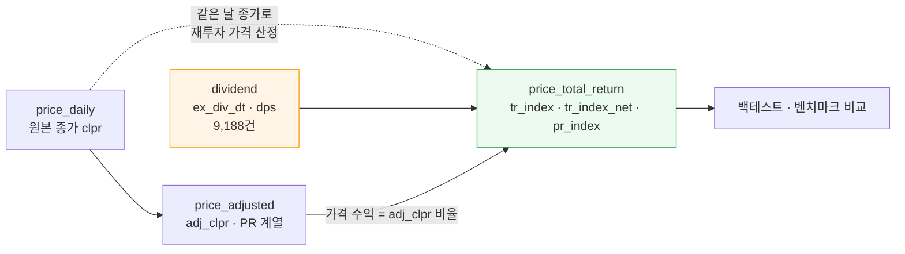

# #38 TR(총수익) 계열 계산 — 설계·구현·검증

> 🗂️ 옛 GitHub 이슈를 옮긴 **기록 문서**입니다 — [색인](../README.md). 원문은 그대로 두고, 링크·커밋 해시만 새 자리 기준으로 바꿨습니다.

| 항목 | 내용 |
|---|---|
| 종류 | 이슈 |
| 상태 | 닫힘(완료) · 2026-09-19 15:51 |
| 원 작성 | 이동원(`devlee328288`) · 2026-09-19 15:49 KST |
| 라벨 | `analysis` `phase-1` |
| 옛 주소 | `github.com/devlee328288/Qurious/issues/38` (지금은 열리지 않음) |

## 본문

> **작업 이슈입니다.** 이 이슈는 "TR 계산" 한 가지만 다루고, 끝나면 닫습니다.
> 배당 수집 자체는 [#33](../issues/033.md), 수집기 전반은 [#31](../issues/031.md) 입니다.
>
> 기준 커밋 `main` **[`9a3d320`](https://github.com/EST-team-project/Qurious/commit/9a3d32017d8036f4cd9d78ec5c74e66fdf839fa7)** · 작성 2026-09-19 (KST)

---

## 0. 한 줄로

**주가 차트는 배당을 보여 주지 않는다.** 우리가 지난 세 세션 동안 모은 배당 9,188건을
수정주가와 합쳐, "실제로 번 돈" 계열을 만들었다. 현대차를 2020년에 사서 들고 있었다면
가격만 보면 +207.63% 지만 배당까지 세면 **+287.56%** 다. 80%p 차이는 전략 비교를
뒤집을 수 있는 크기다.

---

## 1. 왜 지금인가

| 세션 | 무엇이 채워졌나 | 남은 것 |
|---|---|---|
| S26~S28 | 시세 수집 · 수정주가(`vs` 기반) | 배당이 없다 🔴 |
| S29~S30 | 배당 공시 파싱 · 배당락일 역산 | 열두 달 중 일곱 달만 훑었다 🔴 |
| **S31** | **81/81달 완주 · 9,188건** | **TR 계산 자체가 없다** 🔴 |
| **S32 (이번)** | **TR 계열** | 거래비용 · 벤치마크 🔴 |

재료가 다 찼으므로 이번에는 본론이다.

---

## 2. 용어 — 두 층으로

**PR (Price Return, 가격수익)**
- 뜻 — 가격 변동만으로 계산한 수익.
- 이 문서에서 — 우리가 이미 가진 것(`price_adjusted`). 새 표의 `pr_index` 칸.
- 헷갈리는 점 — **"수정주가"는 PR 이다.** 분할을 고쳤다고 총수익이 되는 게 아니다.
  수정주가는 *가짜 폭락*을 지웠을 뿐, *진짜 수익*인 배당은 손도 대지 않았다.

**TR (Total Return, 총수익)**
- 뜻 — 가격 변동 + 배당을 함께 센 수익.
- 이 문서에서 — `tr_index` 칸.
- 헷갈리는 점 — 배당금을 현금으로 쌓아 두는 게 아니라 **그 종목을 더 샀다고 가정**한다.
  재투자 가정이 없으면 "배당 받아서 뭘 했는지"가 사람마다 달라져 비교가 불가능해진다.

**배당락(配當落, ex-dividend)**
- 뜻 — 이 날부터 사면 이번 배당을 못 받는다는 경계일.
- 이 문서에서 — `dividend.ex_div_dt`. 이 날 배당 계수를 곱한다.
- 헷갈리는 점 — 이론상 배당락일에 주가가 배당금만큼 떨어져야 하지만, 우리 실측
  기울기는 **0.703** 이었다([#33](../issues/033.md) 검증 ③ · 8,058건). 이론값 1.0 도, 세후 기대치 0.846 도
  아니다. **그래서 TR 은 실제 하락폭이 아니라 공시된 배당금으로 계산한다.**

**재투자 가정(reinvestment assumption)**
- 뜻 — 받은 배당금으로 같은 종목을 그날 종가에 다시 산다는 가정.
- 이 문서에서 — `div_factor = 1 + DPS ÷ 그날 종가`.
- 헷갈리는 점 — 실제로는 배당금이 배당락일이 아니라 **두세 달 뒤**에 들어온다.
  그 시차를 무시하는 것이 국제 표준이고, 이 계열도 무시한다(9절 한계).

---

## 3. 판단 ① — 수정주가로는 왜 안 되나 🟢 실측

거래소는 현금배당으로 기준가를 **조정하지 않는다.** §5 규격의 조정계수는
`vs`(전일대비)에서 나오는데, `vs` 가 배당을 전혀 모른다.

삼성전자 배당락일 두 곳을 재 봤다.

| 배당락일 | 주당배당금 | 전일 종가 | 당일 종가 | `vs` | `clpr − vs` (기준가) | 판정 |
|---|---:|---:|---:|---:|---:|---|
| 2024-12-27 | 363원 | 53,600 | 53,700 | +100 | **53,600** | 전일 종가와 **정확히 같다** |
| 2025-12-29 | 566원 | 117,000 | 119,500 | +2,500 | **117,000** | 전일 종가와 **정확히 같다** |

분할·권리락이었다면 여기서 기준가가 달라져 계수가 잡혔을 것이다. 잡히지 않았다.

> 🟢 **결론**: `price_adjusted` 는 배당을 **구조적으로** 담을 수 없다. 담아서도 안 된다.
> 배당은 가격에 섞는 값이 아니라 수익률에 **더하는** 값이다.

---

## 4. 판단 ② — 계산 식, 그리고 쪼개기의 공짜 이득 🟢

표준 TR 의 정의는 하나다.

```
그날 수익률 = (당일 종가 + 그날 받은 배당금) ÷ 전일 종가 − 1
```

이 식을 둘로 쪼개면 이미 가진 것과 맞물린다.

```
 (P_d + D_d)          P_d                D_d
 ───────────   =    ─────────    ×   (1 + ───)
   P_{d-1}           P_{d-1}              P_d
                   └────┬────┘        └────┬────┘
               price_adjusted 이         이 파일이
               미 만들어 둔 값           새로 만드는 값
               (분할·권리락 반영)         (배당 계수)
```

왼쪽 괄호는 `price_adjusted.adj_clpr` 의 비율, 오른쪽 괄호가 배당 계수다.
**곱하기만 하면 된다.**

### ★ 공짜 이득 — 분할 조정과 간섭하지 않는다

`D_d ÷ P_d` 는 **같은 날의 두 값**을 나눈 것이다. 1:5 분할이 있었다면 배당금도 주가도
똑같이 1/5 이 되므로 **비율은 그대로**다.

```
        분할 전 기준          분할 후 기준          비율
DPS       1,000원      →        200원          ÷5
종가     50,000원      →     10,000원          ÷5
────────────────────────────────────────────────────
DPS/종가    0.02        =        0.02          그대로 ✅
```

그래서 *"분할 전에 공시된 배당금을 분할 후 기준으로 고치는"* **별도 규칙이 필요 없다.**
그런 규칙이 필요했다면 새 오류의 온상이 됐을 것이다 — 어느 시점 기준으로 공시된
금액인지, 정정공시는 어느 쪽인지를 매번 따져야 했을 테니까.

---

## 5. 판단 ③ — 누적 방향이 `price_adjusted` 와 **반대**다 ⚠️

| | `price_adjusted` (PR) | `price_total_return` (TR) |
|---|---|---|
| 누적 방향 | **뒤 → 앞** | **앞 → 뒤** |
| 1.0 이 되는 날 | **오늘** | 각 종목의 **첫 거래일** |
| 왜 | 과거를 고치는 일이다. 오늘 가격이 바뀌면 어제 본 화면과 오늘 본 화면의 현재가가 달라진다 | 누적 수익이 얼마인지가 곧 답이다. 시작점이 고정돼야 읽을 수 있다 |

둘 다 "이미 본 구간이 나중에 달라지지 않는다"를 만족한다. 방향만 다르다.

**이 점을 문서에 못 박아 둔 이유**: 두 표를 나란히 읽는 사람이 `cum_factor` 와
`tr_index` 를 같은 종류로 착각하면 값을 거꾸로 해석한다.

---

## 6. 판단 ④ — 세전과 세후를 **둘 다** 낸다

한국 배당소득세는 **15.4%**(소득세 14% + 지방소득세 1.4%, 원천징수)다.

| 칸 | 가정 | 쓰는 곳 |
|---|---|---|
| `tr_index` | 세전(gross). 배당금 전액 재투자 | **벤치마크 비교.** KRX TR 지수가 세전이라, 세후로 만들면 나란히 놓을 수 없다 |
| `tr_index_net` | 세후. `DPS × (1 − 0.154)` 재투자 | **실제 계좌.** 개인이 직접 굴리면 손에 들어오는 것은 세후다 |
| `pr_index` | 배당 없음 | 배당 기여가 얼마인지 같은 기준으로 보려고 |

세전을 기본으로 삼은 이유는 **세율이 투자자마다 다르기 때문**이다 — 개인·법인·외국인·
연금계좌가 전부 다르고, 금융소득종합과세 대상이면 15.4%가 아니다. 그래서 세율을
`--tax` 로 바꿔 다시 만들 수 있게 했다(연금계좌 저율과세 5.5% 등).

> 🟡 **S31 의 회귀 기울기 0.703 과는 별개다.** 그 숫자는 "배당락일에 주가가 실제로
> 얼마나 떨어졌나"이고, 세후 기대치 0.846 보다도 낮았다. **TR 계산에는 쓰지 않는다** —
> 하락폭으로 계산하면 시장의 변덕이 수익률에 섞여 들어온다. 다만 "왜 0.703인가"는
> 여전히 열린 질문이다([#33](../issues/033.md)).

---

## 7. ⚠️ 함정 — 정정공시가 **기준일을 바꾸면** 배당이 두 번 계산된다

`dividend` 의 기본키는 (종목, 기준일)이다. 정정공시가 기준일까지 고쳐 올라오면
원본과 정정본이 **서로 다른 행**으로 남는다. 실측 2건.

| 종목 | 기준일 | 접수번호 | 제목 | 주당 | 배당락일 |
|---|---|---|---|---:|---|
| 대신증권 003540 | 20211231 | 20220228800680 | 현금ㆍ현물배당결정 | 1,400 | 20211229 |
| 대신증권 003540 | **20220101** | 2022022880**1106** | **[기재정정]**현금ㆍ현물배당결정 | 1,400 | 20211229 |
| 우진플라임 049800 | 20211231 | 2022022880**1305** | **[기재정정]**현금ㆍ현물배당결정 | 50 | 20211229 |
| 우진플라임 049800 | **20220101** | 20220228800663 | 현금ㆍ현물배당결정 | 50 | 20211229 |

배당락일이 같으므로 그냥 `SUM` 하면 대신증권이 **2,800원**이 된다. 배당을 두 번 준
셈이고, **백테스트가 조용히 틀린다.**

**해결** — 같은 (종목, 배당락일)에 여러 건이면 **접수번호가 가장 큰 것 하나만** 쓴다.
`sources/dart.py` 의 upsert 규칙("나중 접수번호가 이긴다")과 같은 규칙이다.

> ⚠️ 우진플라임을 보면 **기준일이 늦은 쪽이 정정본이 아니다.** 기준일로 고르면 틀린다.
> 접수번호로 골라야 맞는다.

---

## 7-b. 🔴 sanity 검사가 **자회사 배당**을 하나 잡아냈다 — 이번 세션 최대 소득

전 종목 빌드에서 배당수익률 **104.39%** 짜리가 하나 나왔다. 2위(24.59%)와 네 배 넘게
벌어져 있어 원문을 열어 봤더니, **파싱 오류가 아니라 이 종목의 배당이 아니었다.**

**KC그린홀딩스 009440 · 배당락일 2022-12-28 · 주당 2,949원 · 종가 2,825원**

공시 본문 「11. 기타 투자판단과 관련한 중요사항」이 스스로 적고 있다.

```
1. 본 공시는 지주회사의 자회사에 대한 주요경영사항 신고입니다.
   - 주요자회사명 : 케이씨환경서비스㈜ [비상장]
2. 상기 '4. 시가배당율(%)'은 비상장회사이므로 기재하지 않았습니다.
3. 발행주식총수는 보통주 1,373,130주 우선주 152,570주입니다.
```

**총액이 증명한다.**

```
자회사 발행주식총수   1,373,130 (보통주) + 152,570 (우선주) = 1,525,700주
                                                      × 2,949원
                                          ─────────────────────────
                                            = 4,499,289,300원
공시된 배당금총액                              4,499,289,300원   ← 원 단위까지 일치 ✅

참고: KC그린홀딩스 자신의 상장주식수는 22,434,980주 (자회사의 14.7배)
```

2,949원은 **비상장 자회사 주식 1주당 금액**이고, KC그린홀딩스 주주는 이 돈을 받지
않는다. 그냥 뒀다면 이 종목 TR 이 **104% 부풀어 있었을 것이다.**

### ⚠️ 왜 [#33](../issues/033.md) 의 자회사 필터 두 겹을 다 빠져나갔나

| 방어선 | 무엇을 보나 | 왜 통과됐나 |
|---|---|---|
| `DIVIDEND_EXCLUDE` (제목) | 「…(자회사의 주요경영사항)」 | 제목이 **그냥 「현금ㆍ현물배당결정」**이다. 꼬리표가 안 붙었다 |
| `_SUBSIDIARY_BODY` (본문 머리행) | `자회사인｜종속회사인｜자회사의 주요경영사항` | 표시가 머리행이 아니라 **본문 11번 항목**에 있고, 문구도 "자회사**에 대한**"이라 정규식에 안 걸린다 |

두 번째 것은 **일부러 머리행만 보게 만든 설계**다 — 11번 항목은 자유 서술이라 본문
전체를 뒤지면 멀쩡한 배당을 버린다는 판단이 있었다. 그 판단 자체는 옳다. 대신 여기서
**세 번째 방어선**을 둔다.

### 판정 규칙 — 두 신호가 **함께** 어긋날 때만 버린다

배당수익률이 크다는 것만으로는 오류인지 진짜 고배당인지 구별되지 않는다. 구별해 주는
두 번째 독립 신호가 공시 안에 있다 — 회사가 직접 적은 「4. 시가배당율(%)」이다.
`preprocess.classify` 가 가격 계수와 상장주식수 두 신호를 쓰는 것과 같은 구조다.

```
배당수익률 = dps ÷ 종가  >  50% ?
      │
      ├─ 아니다 ───────────────────────────> 적용한다 (신호 하나로는 판정하지 않는다)
      │
      └─ 그렇다 ─> 공시 시가배당율이 뒷받침하나?
                        │
                        ├─ 계산값 ÷ 공시값 ∈ [0.5, 2.0] ──> 적용한다 (진짜 고배당)
                        │                                  예) 필옵틱스 24.59% vs 공시 21.3%
                        └─ 없거나 크게 어긋남 ───────────> ⚠️ 적용하지 않고 보고
                                                           예) 009440 104.39% vs 공시 없음
```

임계값은 **추측하지 않고 실측으로** 정했다.

| 검사 | 값 | 근거 (실측 2026-09-19 · 8,086건) |
|---|---|---|
| 배당수익률 상한 | **50%** | 실측 2위가 24.59%, 1위가 104.39%. 그 사이에 둔다 |
| 시가배당율 대조 | **[0.5, 2.0]** | 시가배당율이 있는 8,033건의 중앙값 **1.0111**. 5%~95% 분위가 0.9079~1.1024. **[0.5,2.0] 밖은 6건(0.07%)** 뿐이고 전부 배당수익률 3% 미만이라 이 판정에 걸리지 않는다 |

검증 — 고배당 상위가 어떻게 갈리는지:

| 종목 | 배당락일 | 계산 수익률 | 공시 시가배당율 | 판정 |
|---|---|---:|---:|---|
| **KC그린홀딩스 009440** | 20221228 | **104.39%** | **없음** | 🔴 **적용 안 함** |
| 필옵틱스 161580 | 20231227 | 24.59% | 21.3% | ✅ 적용 |
| 락앤락 115390 | 20220929 | 24.20% | 23.0% | ✅ 적용 |
| 일성신약 003120 | 20221228 | 23.17% | 22.2% | ✅ 적용 |
| 예림당 036000 | 20260629 | 22.44% | 20.57% | ✅ 적용 |

### ★ 총액 대조를 **쓰지 않은 이유** — 재 보니 거짓 양성이 더 많았다

직관적으로는 `총액 ÷ dps` 를 상장주식수와 견주는 것이 맞아 보인다(S31 의 "총액이
지문" 원리). **실측하면 아니다.**

| `(총액÷dps) ÷ 상장주식수` | 건수 | 비중 | |
|---|---:|---:|---|
| < 0.5 | 37 | 0.46% | ← 여기에 009440 이 있다 |
| 0.5 ~ 0.9 | 1,168 | 14.44% | 자기주식이 많은 회사 |
| **0.9 ~ 1.1** | **6,627** | **81.96%** | 정상 |
| 1.1 ~ 2.0 | 245 | 3.03% | |
| ≥ 2.0 | 9 | 0.11% | 전부 배당수익률 5% 미만 — 총액 칸 쪽 문제 |

`< 0.5` 인 37건 중 **009440 을 뺀 36건은 배당이 멀쩡하고 총액 칸이 일부만 담긴**
경우였다.

| 종목 | 배당락일 | 총액비 | 배당수익률 | 실제 |
|---|---|---:|---:|---|
| 교보증권 030610 | 20240328 | 0.143 | 4.9% | 🟢 정상 배당 |
| 대양제지공업 006580 | 20221228 | 0.045 | 1.2% | 🟢 정상 배당 |
| LK삼양 225190 | 20240627 | 0.323 | 0.6% | 🟢 정상 배당 (총액 칸이 4년 내내 같은 값) |

> 🔴 **총액으로 걸렀다면 정상 배당 36건을 버리고 009440 하나를 잡았을 것이다.**
> 걸러내는 규칙을 만들 때는 그 규칙이 **무엇을 잘못 버리는지**를 먼저 재야 한다.

### 근본 해결은 이쪽이 아니다

여기서 막은 것은 **증상**이다. 원인은 `sources/dart.py` 의 자회사 필터이고, 그쪽을
고치면 `dividend` 표에서 아예 빠진다(`reparse` 는 네트워크를 타지 않으므로 비싸지 않다).
**별도 작업으로 분리한다** — 본문 11번 항목을 보는 것은 오검출 위험이 있어, 어떤 문구를
어디까지 잡을지 따로 재야 한다.

---

## 7-c. 무엇을 적용했고 무엇을 안 했나 — 전 종목 실측

| 사유 | 건수 | 성격 |
|---|---:|---|
| 배당락일이 2019년 이전 | 1,036 | 🟢 **정상.** 시세가 2020-01-02 부터라 우리 구간 밖이다 |
| `dps` 가 NULL | 49 | 🟡 현물배당 서식 등. 17건은 `needs_review` |
| `dps` 가 0원 | 3 | 🟡 |
| 정정공시 중복 (7절) | 2 | 🟢 접수번호가 큰 쪽만 남겼다 |
| 그날 시세 없음 (상장 전 등) | 14 | 🟢 대부분 상장 직후 기업 |
| **두 신호가 어긋나 적용 안 함 (7-b)** | **1** | 🔴 **자회사 배당** |
| **실제로 적용된 배당** | **8,083** | 2020-02-27 ~ 2026-09-16 |
| 합계 | 9,188 | `dividend` 표 전체 |

---

## 8. 바꾸기 전 / 후

```
[전]  price_daily ──(vs 로 계수)──> price_adjusted ──> 분석·백테스트
                                        (PR)
      dividend  ──────────────────────────────────────> 🔴 아무도 안 씀
      (9,188건을 모아 두고 쓰지 못하는 상태)


[후]  price_daily ──(vs 로 계수)──> price_adjusted ─┐
           │                            (PR)       │
           │  (같은 날 종가 =                       ├──> price_total_return ──> 분석
           │   재투자 가격)                         │        tr_index      (TR)
           └────────────────────────────┐          │        tr_index_net
                                        │          │        pr_index
      dividend ──(배당락일 → 배당계수)───┴──────────┘
```



### 새 표

```sql
CREATE TABLE price_total_return (
    bas_dt       TEXT NOT NULL,
    srtn_cd      TEXT NOT NULL,
    tr_index     REAL,   -- 총수익 지수 (세전). 첫 거래일 = 1.0
    tr_index_net REAL,   -- 총수익 지수 (세후 15.4%)
    pr_index     REAL,   -- 가격수익 지수. 같은 기준 — 비교용
    div_factor   REAL NOT NULL DEFAULT 1.0,  -- 1 + DPS ÷ 그날 종가
    dps_applied  REAL,   -- 그날 실제로 더한 주당 배당금(원)
    PRIMARY KEY (bas_dt, srtn_cd)
);
```

**왜 `price_adjusted` 에 칸을 더하지 않았나** — 둘은 **다시 만드는 조건이 다르다.**
수정주가는 시세가 새로 들어오면 다시 만들고, TR 은 거기에 더해 배당 공시가 들어오거나
세율 가정이 바뀌면 다시 만든다. 한 표에 섞으면 배당 한 건 때문에 수정주가 전체를 다시
계산하게 되고, 반대로 수정주가만 고쳤는데 TR 이 옛 배당 가정을 물고 있는 일이 생긴다.

---

## 9. 코드 재사용 판정

| 가져온 곳 | 줄 수 | 판정 | 무엇을·왜 |
|---|---:|---|---|
| [`collector/preprocess.py` `rebuild()`](https://github.com/EST-team-project/Qurious/blob/9a3d320/collector/preprocess.py#L207-L266) | 60 | 🟢 **구조 모방** | `BEGIN IMMEDIATE` → 종목별 `DELETE`+`INSERT` → `COMMIT`, `tally` 로 집계, `verbose` 로 의심 건 출력. **몇 번을 돌려도 같은 결과**가 되는 성질까지 그대로 |
| [`collector/preprocess.py` `cumulative()`](https://github.com/EST-team-project/Qurious/blob/9a3d320/collector/preprocess.py#L193-L205) | 12 | 🔴 **쓰지 않음** | 누적 계수라는 발상은 같지만 **방향이 반대**다(5절). 억지로 공용 함수로 묶으면 읽는 쪽이 방향을 착각한다 |
| [`collector/sources/dart.py` `upsert()`](https://github.com/EST-team-project/Qurious/blob/9a3d320/collector/sources/dart.py#L614-L620) | — | 🟢 **규칙만 재사용** | "나중 접수번호가 이긴다". 7절의 중복 제거가 이 규칙을 그대로 쓴다 |
| [`collector/dividend.py` `main()`](https://github.com/EST-team-project/Qurious/blob/9a3d320/collector/dividend.py#L482-L501) | 20 | 🟢 **패턴 모방** | `argparse` 서브모드(`build`/`status`/`verify`), `--codes`, `--quiet` |
| `Alpha_Stack/backtest/backtest_strategies.py` (Alpha_Stack `backtest/backtest_strategies.py#L495` @ `c0ac6fc`) | 635 | 🔴 **쓰지 않음** | `total_return` 이라는 이름이 있지만 **포트폴리오 총수익**이지 배당 포함 TR 이 아니다. 이름만 같다 |
| [`app/services/quant_pipeline.py` `backtest()`](https://github.com/EST-team-project/Qurious/blob/9a3d320/app/services/quant_pipeline.py#L230-L245) | 476 | 🟡 **갈아끼울 대상** | 아래 참고 |

### 🟡 본체 백테스트가 PR 로 재고 있다 — 갈아끼울 자리

[`app/services/quant_pipeline.py:237`](https://github.com/EST-team-project/Qurious/blob/9a3d320/app/services/quant_pipeline.py#L237-L243) 의 `backtest()` 는 이렇게 시작한다.

```python
ret = df["close"].pct_change().fillna(0)
...
bh_ret = ret          # Buy & Hold 벤치마크도 같은 값
```

**배당이 없다.** 전략도 벤치마크도 둘 다 PR 이라, **배당수익률이 다른 종목 사이의
비교가 왜곡된다.** 고배당주를 고르는 전략은 실제보다 나쁘게 나온다.

> 이번 PR 에서는 **갈아끼우지 않았다.** 이유: ① `df["close"]` 가 수정주가인지부터
> 확인해야 하고 ② 그 함수는 본체 API 가 물고 있어 결과가 바뀌면 화면이 바뀐다.
> **별도 작업으로 분리한다.**

---

## 10. 검증 — 서로 다른 두 경로가 같은 수에 닿는가 🟢

`build` 가 날마다 누적해 만든 `tr_index ÷ pr_index` 와, 표에서 곧바로 다시 곱한
`∏(1 + DPS ÷ 종가)` 가 같아야 한다. 누적 과정에 새는 곳이 있으면 여기서 갈라진다.

```bash
python -m collector.total_return verify
```

표본 4종목 (2020-01-02 ~ 2026-09-17) — **소수 10자리까지 일치**.

| 종목 | 배당 | PR | TR(세전) | TR(세후) | 배당 기여(세전) | 대조 |
|---|---:|---:|---:|---:|---:|---|
| 삼성전자 005930 | 26회 | +357.43% | +433.34% | +420.92% | **+16.60%p** | ✅ |
| SK하이닉스 000660 | 20회 | +1742.66% | +1862.76% | +1843.81% | +6.52%p | ✅ |
| 현대차 005380 | 18회 | +207.63% | +287.56% | +274.13% | **+25.98%p** | ✅ |
| 카카오 035720 | 6회 | +9.44% | +10.11% | +10.01% | +0.61%p | ✅ |

```
현대차 005380 — 배당을 세느냐 마느냐

PR (가격만)        │████████████████████                     │ +207.63%
TR (세전)          │████████████████████████████             │ +287.56%
TR (세후 15.4%)    │███████████████████████████              │ +274.13%
                   └────────┴────────┴────────┴────────┴─────┘
                   0       100      200      300      400   (%)
```

**읽는 법** — 배당을 빼고 보면 현대차는 6년 9개월에 +207%지만, 배당까지 세면 +287%다.
80%p 차이는 전략 비교를 뒤집을 수 있는 크기다.

### 세 번째 독립 확인 — 배당수익률 누적과 대조

삼성전자의 `TR÷PR = 1.1660`. 공시된 시가배당율을 연도별로 더해 보면:

| 구간 | 배당 | 대략 배당수익률 |
|---|---|---:|
| 2020 | 354×3 + 1,932(특별배당 포함) | ~4.3% |
| 2021~2024 | 매년 361×4 ≈ 1,444원 | 연 ~2.2% × 4년 |
| 2025 | 365+367+370+566 = 1,668원 | ~2% |
| 2026 (9월까지) | 372+374 = 746원 | ~0.5% |
| | | **합 ≈ 15.6% → 복리 16.6%** |

계산된 16.60%p 와 맞는다. 🟢

### 전 종목 실측 — **배당 기여는 종목마다 80%p 까지 벌어진다**

```
price_total_return   4,460,710행 · 3,302종목 · 2020-01-02 ~ 2026-09-17
배당이 적용된 날     8,083건
```

배당 기여(`TR ÷ PR − 1`) 상위 10:

| | 종목 | 배당 기여 |
|---|---|---:|
| 1 | INVENI 015360 | **+80.55%p** |
| 2 | 삼성카드 029780 | +77.11%p |
| 3 | 서호전기 065710 | +71.64%p |
| 4 | 크레버스 096240 | +66.26%p |
| 5 | 동남합성 023450 | +59.36%p |
| 6 | 레드캡투어 038390 | +58.56%p |
| 7 | 한국쉘석유 002960 | +57.64%p |
| 8 | 한양증권 001750 | +56.27%p |
| 9 | 정상제이엘에스 040420 | +56.23%p |
| 10 | 이크레더블 092130 | +54.85%p |

```
배당 기여가 이만큼 벌어진다 (6년 9개월 누적)

INVENI      │████████████████████████████████████████│ +80.55%p
삼성카드     │██████████████████████████████████████  │ +77.11%p
현대차       │█████████████                           │ +25.98%p
삼성전자     │████████                                │ +16.60%p
SK하이닉스   │███                                     │  +6.52%p
카카오       │▌                                       │  +0.61%p
            └────────┴────────┴────────┴────────┴────┘
            0       20       40       60       80  (%p)
```

> 🔴 **이것이 왜 중요한가** — 배당 기여가 종목마다 0.61%p 에서 80.55%p 까지 벌어진다.
> **PR 끼리 비교하면 고배당주가 실제보다 나쁘게 나온다.** 전략이 고배당에 기울어 있든
> 기울어 있지 않든, 그 사실 자체를 PR 로는 알 수 없다. 전략과 벤치마크를 **둘 다** TR 로
> 맞춰야 한다는 [#32 8.4](../issues/032.md) 의 지적이
> 이 숫자로 확인됐다.


---

## 11. 무엇을 하지 않았나 — 그리고 뒤집을 조건

| | 내용 | 왜 | 뒤집을 조건 |
|---|---|---|---|
| ✖ | 배당금 **지급 시차** 미반영 | 결산배당은 주주총회 뒤 두세 달 지나 들어온다. 배당락일에 곧바로 재투자한 것으로 친다 — 국제 표준 | 실계좌 시뮬레이션을 할 때. 시차를 넣으면 TR 이 약간 낮아진다 |
| ✖ | **거래비용** 미반영 | 재투자 매수에도 수수료가 든다 | 🔴 **1차 결론([#32](../issues/032.md) 숙제 ①)을 막는 것은 배당이 아니라 이쪽이다.** `orders` 에 체결가·수수료 칸이 없다([#21](../issues/021.md) 3.2) |
| ✖ | **우선주 배당**(`dps_pref`) 미사용 | 공시가 보통주 corp_code 로만 와서 우선주 종목코드에 붙일 수가 없다 | 🟡 **우선주 종목의 TR 은 배당 0인 채로 계산된다 — 실제보다 낮다.** 종목코드 매핑을 찾으면 |
| ✖ | 배당락일의 **실제 하락폭**으로 계산 | 하락폭은 시장 변덕이 섞인다(기울기 0.703) | 공시 금액 쪽이 틀렸다는 증거가 나오면 |
| ✖ | **2019년 이전 배당** 1,036건 | 시세가 2020-01-02 부터라 배당락일을 역산할 거래일이 없다 | 시세를 2019년 이전으로 확장하면 |

### 적용하지 못한 배당 — 조용히 버리지 않는다

→ **7-c 절의 표**를 본다. 하나도 조용히 버리지 않고 전부 세어 보고한다.

---

## 12. 쓰는 법

```bash
# 1) 만든다 (네트워크를 타지 않는다. preprocess·dividend 가 먼저 끝나 있어야 한다)
python -m collector.total_return build

# 2) 세율을 바꿔 다시 만든다 (예: 연금계좌 저율과세)
python -m collector.total_return build --tax 5.5

# 3) 검증 — TR÷PR 이 배당 계수의 곱과 맞는가
python -m collector.total_return verify --codes 005930,005380

# 4) 현황
python -m collector.total_return status
```

---

## 13. 다음 (이 이슈 밖)

| | 할 일 | 어디 |
|---|---|---|
| 🔴 | **벤치마크** — KOSPI TR 과 비교할 공식값이 없다. 시장지수 자체 계산이 선행 | [#16](../issues/016.md) 6.3.1 |
| 🔴 | **거래비용** — `orders` 에 체결가·수수료 칸 추가 | [#21](../issues/021.md) 3.2 |
| 🟡 | **본체 백테스트를 TR 로** — `quant_pipeline.backtest()` 갈아끼우기 | 9절 |
| 🟡 | 우선주 배당 매핑 | [#33](../issues/033.md) |

---

<sub>확실도 — 🟢 확인함 · 🟡 근거는 있으나 표본이 좁음 · 🔴 모름</sub>
