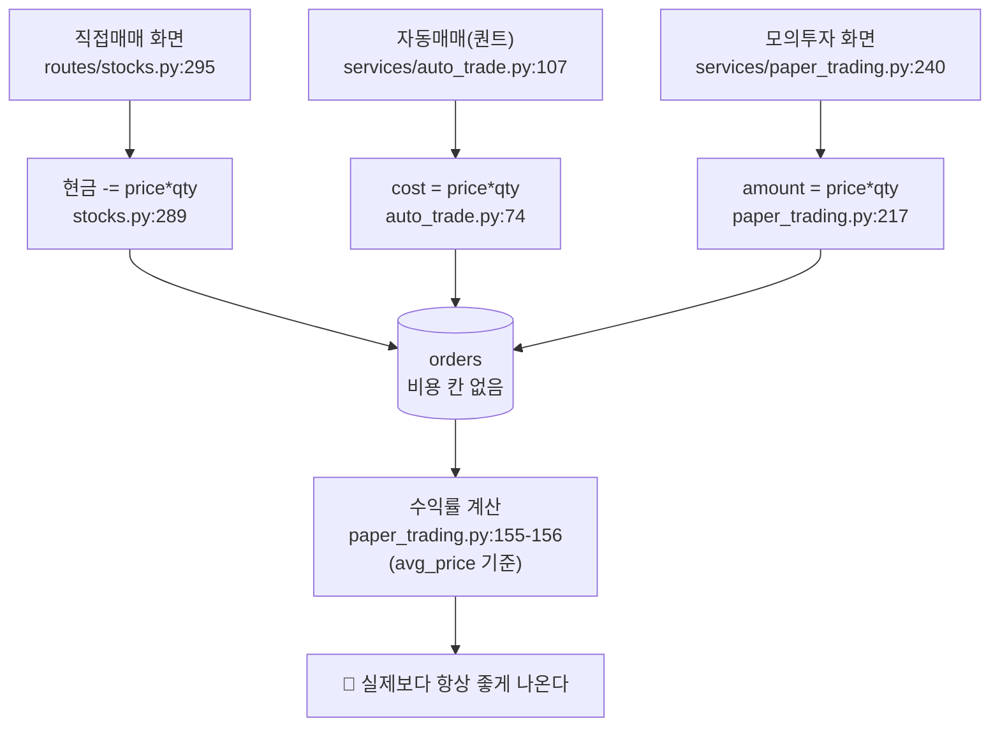
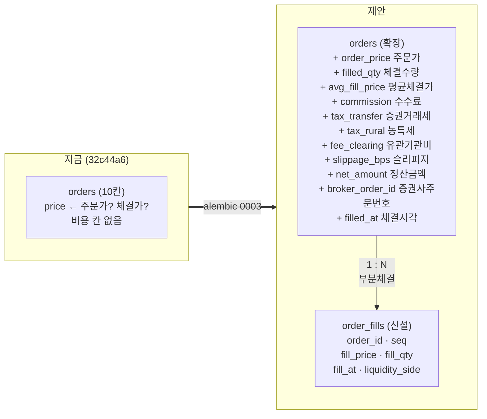

# #40 [작업] 거래비용 — 체결·수수료·세금·슬리피지를 저장하고 백테스트에 반영한다

> 🗂️ 옛 GitHub 이슈를 옮긴 **기록 문서**입니다 — [색인](../README.md). 원문은 그대로 두고, 링크·커밋 해시만 새 자리 기준으로 바꿨습니다.

| 항목 | 내용 |
|---|---|
| 종류 | 이슈 |
| 상태 | 닫힘(완료) · 2026-09-20 12:57 |
| 원 작성 | 이동원(`devlee328288`) · 2026-09-19 16:51 KST |
| 라벨 | `analysis` `phase-1` |
| 댓글 | 2건 |
| 옛 주소 | `github.com/devlee328288/Qurious/issues/40` (지금은 열리지 않음) |

## 본문

> **작업 이슈입니다.** 이 이슈는 "거래비용" 한 가지만 다루고, 끝나면 닫습니다.
> 저장소 전반은 [#21](../issues/021.md), 백테스트·LEAN 은 [#14](../issues/014.md), 주문·자동매매는 [#12](../issues/012.md), 모의투자 실행은 D7 [#13](../discussions/013.md) 입니다.
>
> 기준 커밋 `main` **[`32c44a6`](https://github.com/EST-team-project/Qurious/commit/32c44a6ca3755ade596842e0e32758e66e53eca0)** · 작성 2026-09-19 (KST)

---

## 0. 한 줄로

**우리 백테스트는 공짜로 사고판다.** 수수료도 세금도 슬리피지도 세지 않는다.
표본 300종목에 이동평균 교차 전략을 걸어 재 보니, 비용을 제대로 넣는 순간
**수익률 중앙값이 28.09% → 2.81% 로 떨어지고, 이익이던 189종목 중 33종목이 손실로 뒤집힌다.**
슬리피지를 20bp 로 잡으면 전략 전체의 중앙값이 **음수(−6.95%)** 가 된다.

S32 에서 배당(TR)을 해결했으니, **1차 결론을 막는 것은 이제 이것 하나**다.

---

## 1. 쉬운 요약 (3줄)

1. 주식을 사고팔면 돈이 세 군데로 샌다 — 증권사 **수수료**, 나라에 내는 **세금**(팔 때만), 그리고 사려는 가격보다 비싸게 사게 되는 **슬리피지**. 우리 코드는 이 셋 중 어느 것도 세지 않거나, 세더라도 뭉뚱그린다.
2. 특히 **세금은 팔 때만** 붙고 **연도마다 세율이 달랐다**. 2020년 0.25% → 2025년 0.15% → 2026년 0.20%. 백테스트 구간(2020~2026) 안에서 **여섯 번** 바뀐다. 상수 하나로 쓰면 최대 0.10%p 틀린다.
3. 비용을 세려면 먼저 **얼마에 체결됐는지**를 알아야 하는데, `orders` 표에는 체결가 칸이 없고 증권사 API 에서 체결을 받아 오는 코드도 없다. 그래서 **스키마부터 고쳐야** 한다.

---

## 2. 한눈에 보기

| 무엇 | 지금 | 있어야 할 것 | 확실도 |
|---|---|---|:---:|
| `orders` 에 체결가 | ❌ 없음 (`price` 가 주문가) | 주문가와 체결가를 나눈다 | 🟢 |
| `orders` 에 수수료·세금 | ❌ 없음 | 수수료·거래세·농특세·유관기관비 4칸 | 🟢 |
| 주문 3경로의 현금 증감 | `price × quantity` 그대로 | 비용을 뺀 정산금액 | 🟢 |
| 본체 백테스트 비용 | ❌ 인자조차 없음 | 매수/매도 비대칭 비용 | 🟢 |
| 보조 백테스트 비용 | 🔸 대칭 `cost_bps` 1개 | 연도별 세율 + 슬리피지 | 🟢 |
| 증권사 체결 조회 | ❌ 계약에 메서드 없음 | `inquire-daily-ccld` 연동 | 🟢 |
| KIS 주문 TR ID | 🔴 **구 TR** (막힐 수 있음) | 신 TR 로 교체 | 🟢 |

---

## 3. 용어 풀이

어려운 말을 피하지 않고 쓰되, **뜻 → 이 문서에서 → 헷갈리는 점** 순으로 적습니다.

| 용어 | 뜻 | 이 문서에서 | 헷갈리는 점 |
|---|---|---|---|
| **위탁수수료** | 증권사가 주문을 대신 내 주고 받는 값 | 뱅키스 계좌 기준 편도 0.0140527% | "수수료 무료" 이벤트가 있어도 **유관기관 제비용은 남는다** |
| **유관기관 제비용** | 거래소·예탁결제원이 증권사에 물리고, 증권사가 그대로 넘기는 비용 | 편도 0.0036396% | 수수료와 **별개 항목**. 매수·매도 **양쪽**에 붙는다 |
| **증권거래세** | 주식을 **팔 때만** 나라에 내는 세금 | 2026년 코스피 0.05% | 살 때는 0원. 이익이 나든 손해가 나든 **판 금액 기준** |
| **농어촌특별세** | 증권거래세에 얹히는 별개 세목 | 0.15% (**코스피만**) | 코스닥·코넥스에는 **안 붙는다**. 대신 코스닥은 거래세가 높아 합계는 같다 |
| **슬리피지 (slippage)** | 내려던 가격과 실제 체결가의 차이 | 편도 10~20bp 로 가정해 실측 | 수수료와 달리 **영수증에 안 찍힌다**. 추정할 수밖에 없다 |
| **bp (베이시스포인트)** | 0.01% | 20bp = 0.20% | "10bps" 가 편도인지 왕복인지 코드마다 다르다 — 우리 코드는 **회전 1회당** |
| **회전(turnover)** | 포지션이 바뀐 양 | 진입 1 + 청산 1 = 2 | 왕복 1번이 회전 2회. 비용도 두 번 |
| **체결가 (fill price)** | 실제로 거래가 성사된 가격 | `orders` 에 없는 것 | **주문가**(내가 부른 값)와 다르다. 지정가 주문은 아예 체결 안 될 수도 |
| **부분체결** | 1,000주 주문에 300주만 체결되는 것 | 주문 1건 : 체결 N건 | 한 주문에 여러 체결가가 생긴다 → 평균가로 뭉개면 정보가 사라진다 |
| **TR (총수익)** | 배당까지 더한 수익률 | S32 에서 만든 `price_total_return` | 여기에 비용을 빼야 **실제로 손에 쥐는 돈**이 된다 |

**확실도 표시**: 🟢 코드/원문에서 사실로 확인 · 🟡 읽고 추론(검증 필요) · 🔴 미확인·위험

---

## 4. 지금 코드가 무엇을 안 세는가 (🟢 전부 직접 읽음)

### 4.1 비용이 들어갈 자리가 아예 없다

[`app/models/trading.py#L23-L36`](https://github.com/EST-team-project/Qurious/blob/32c44a6/app/models/trading.py#L23-L36) — `orders` 표는 칸이 10개다.

```
user_id · symbol · name · order_type · quantity · price · status · broker · source · created_at
                                                  ↑
                                    이 하나가 주문가인지 체결가인지 구분이 없다
```

**없는 것**: 체결가, 체결수량(부분체결), 체결시각, 수수료, 거래세, 농특세, 유관기관비, 정산금액, 증권사 주문번호.

### 4.2 주문 세 경로가 전부 `가격 × 수량` 그대로 현금을 옮긴다



- [`stocks.py#L288-L301`](https://github.com/EST-team-project/Qurious/blob/32c44a6/app/routes/stocks.py#L288-L301) — `delta = -body.price * body.quantity`
- [`auto_trade.py#L74`](https://github.com/EST-team-project/Qurious/blob/32c44a6/app/services/auto_trade.py#L74) · [`#L120`](https://github.com/EST-team-project/Qurious/blob/32c44a6/app/services/auto_trade.py#L120) · [`#L126`](https://github.com/EST-team-project/Qurious/blob/32c44a6/app/services/auto_trade.py#L126)
- [`paper_trading.py#L217`](https://github.com/EST-team-project/Qurious/blob/32c44a6/app/services/paper_trading.py#L217) · [`#L224`](https://github.com/EST-team-project/Qurious/blob/32c44a6/app/services/paper_trading.py#L224) · [`#L232`](https://github.com/EST-team-project/Qurious/blob/32c44a6/app/services/paper_trading.py#L232)

저장소 전체에서 `commission`·`수수료`·`거래세`·`slippage` 를 찾으면 **계산 코드는 0건**이고,
걸리는 것은 [`lean_backtest.py#L212`](https://github.com/EST-team-project/Qurious/blob/32c44a6/app/services/lean_backtest.py#L212) 의 자백 문구뿐이다 —
*"배당·세금·수수료·슬리피지·데이터 품질과 실제 체결은 반영하지 않으며"*.

### 4.3 백테스트가 네 갈래인데 비용을 세는 것은 하나뿐 🔴

| 갈래 | 진입 함수 | 위치 | 비용 |
|---|---|---|---|
| ① 커스텀 인디케이터 (3차 산출물) | `backtest_custom_indicator` → `backtest` | [quant_pipeline.py#L456](https://github.com/EST-team-project/Qurious/blob/32c44a6/app/services/quant_pipeline.py#L456) → [#L231](https://github.com/EST-team-project/Qurious/blob/32c44a6/app/services/quant_pipeline.py#L231) | **0** |
| ② ML 파이프라인 | `run_pipeline` → `backtest` | [quant_pipeline.py#L376](https://github.com/EST-team-project/Qurious/blob/32c44a6/app/services/quant_pipeline.py#L376) | **0** |
| ③ 전략 백테스트 | `backtest_strategy` | [investment_research.py#L60](https://github.com/EST-team-project/Qurious/blob/32c44a6/app/services/investment_research.py#L60) | 🔸 대칭 `cost_bps` |
| ④ LEAN | `lean_backtest` | [lean_backtest.py#L212](https://github.com/EST-team-project/Qurious/blob/32c44a6/app/services/lean_backtest.py#L212) | **0** (자백) |

`backtest()` 는 시그니처에 비용 인자가 **아예 없다**:

```python
def backtest(df: pd.DataFrame, signals: pd.Series) -> dict:   # quant_pipeline.py:231
    ret = df["close"].pct_change().fillna(0)                  # :237
    strat_ret = ret * (pos == 1).astype(float)                # :241  ← 비용 차감 없음
```

### 4.4 같은 API 인데 화면에 따라 비용 모델이 다르다 🔴

두 화면 모두 `/api/quant/pipeline` ([stocks.py#L733](https://github.com/EST-team-project/Qurious/blob/32c44a6/app/routes/stocks.py#L733)) 을 부르는데:

```
public/app.html:3411  커스텀 인디케이터 화면
   → strategy 를 안 보냄 → 서버 기본값 "custom" → backtest_custom_indicator → 비용 0
   → cost_bps 도 안 보냄

public/app.html:3510  성과 검증 화면
   → strategy = rsi|ma|bollinger|composite + cost_bps=10 → backtest_strategy → 10bps 대칭
```

즉 **`strategy=custom` 으로 오면 `cost_bps` 파라미터가 조용히 버려진다**
([stocks.py#L756-L759](https://github.com/EST-team-project/Qurious/blob/32c44a6/app/routes/stocks.py#L756-L759) 가 `cost_bps` 를 넘기지 않음).
그런데 화면의 도움말([app.html#L2773](https://github.com/EST-team-project/Qurious/blob/32c44a6/public/app.html#L2773))은
*"실전에서는 반드시 차감해야 현실적인 수익률이 나옵니다"* 라고 적혀 있어, **사용자는 반영됐다고 믿는다.**

### 4.5 체결을 받아 올 방법이 없다 🔴

[`brokers/base.py#L48-L68`](https://github.com/EST-team-project/Qurious/blob/32c44a6/app/services/brokers/base.py#L48-L68) 의 `BrokerClient` 추상 계약은
`get_token`·`get_price`·`get_balance`·`place_order`·`get_daily_ohlcv` **다섯 개뿐**이고 **체결 조회가 없다**.

[`brokers/kis.py#L135-L160`](https://github.com/EST-team-project/Qurious/blob/32c44a6/app/services/brokers/kis.py#L135-L160) 의 `place_order` 는
주문 접수 응답 JSON 을 그대로 돌려줄 뿐이다. KIS 주문 응답에는 **주문번호(ODNO)만 있고 체결가가 없다.**
게다가 `ORD_DVSN: "00"`(지정가) 고정이라 **미체결로 남을 수 있는데도** 코드는 `status="filled"` 로 기록한다.

> 🔴 **덤으로 찾은 것 — KIS TR ID 가 구버전이다.**
> 코드는 `TTTC0802U`(매수)·`TTTC0801U`(매도)를 쓴다([kis.py#L142-L144](https://github.com/EST-team-project/Qurious/blob/32c44a6/app/services/brokers/kis.py#L142-L144)).
> KIS 공식 스펙의 `tr_id` 설명에 *"※ 구TR은 사전고지 없이 막힐 수 있으므로 반드시 신TR로 변경이용 부탁드립니다"* 와 함께
> `(구)TTTC0801U → (신)TTTC0011U`, `(구)TTTC0802U → (신)TTTC0012U` 매핑이 적혀 있다.
> 모의도 `VTTC0011U`·`VTTC0012U` 다. **이건 비용과 무관하게 지금 고쳐야 한다.**
> 출처: [order-cash 스펙](https://apiportal.koreainvestment.com/api/apis/public/detail?accessUrl=%2Fuapi%2Fdomestic-stock%2Fv1%2Ftrading%2Forder-cash) (스펙 필드 기준일 2026-09-14)

---

## 5. 비용은 얼마인가 — 조사한 실제 수치

전부 1차 출처를 열어 확인하고, 별도 검증 단계에서 다시 대조했습니다(224건 중 CONFIRMED 198 · CORRECTED 25 · REFUTED 1).

### 5.1 위탁수수료 (한국투자증권) 🟢

| 계좌 | 온라인(HTS·MTS·API) | 비고 |
|---|---|---|
| **뱅키스(BanKIS)** | **0.0140527%** (KRX) / 0.0130527% (NXT) | 은행·비대면·다이렉트 개설 |
| 영업점계좌 | 0.147% (KRX) / 0.146% (NXT) | **10배 이상 차이** |
| ARS | 0.2471487% | |
| 오프라인(직원 주문) | 0.491% | |

- **API 주문에 별도 요율이 없다.** KIS Open API 안내: *"매매수수료 : HTS 사용수수료와 동일하며, API 사용에 따른 별도 이용료는 없음"* → 계좌 종류가 요율을 정한다. 🟢
- 국내주식에 **최소수수료 조항이 없고, 거래대금 구간별 차등도 없다**(단일 요율). 🟢
- 출처: [한국투자증권 수수료안내](https://securities.koreainvestment.com/main/customer/guide/_static/TF04ae010000.jsp) (페이지 기준일 2025-10-27)
- ⚠️ 이 도메인은 `robots.txt` 가 로봇 수집을 전면 차단한다(Googlebot 등만 예외) — **자동 재확인 파이프라인에 넣으면 막힌다.** 🟢

### 5.2 유관기관 제비용 🟢 / 🟡

| 항목 | 값 | 비고 |
|---|---|---|
| KRX 주권 유관기관 제비용 (원가) | **0.0036396%** | 증권사 8곳 고지 일치 🟢 |
| 한국투자증권 고지값 (2026-02-19~) | 0.00368330% | 원가보다 0.0000437%p 높다 🟡 |
| 부과 방향 | **매수·매도 양쪽** | 왕복 0.0072792% 🟢 |

- 🟡 **한시 인하 구간이 있었다**: 2025-12-15 ~ 2026-02-13 사이 KRX 거래수수료가 Maker 0.00134%/Taker 0.00182% 로 대체돼 합계가 0.0027033%~0.0031833% 로 내려갔다. **2020~2026 내내 불변이 아니다.**
- 🔴 KRX 가 인하 연장·재시행을 검토 중이라는 보도가 있다 → **앞으로도 상수로 두면 안 된다.**

### 5.3 매도 세금 — 연도별로 여섯 번 바뀐다 🟢 (이번 조사의 가장 중요한 발견)

| 기간 | 코스피 거래세 | 농특세 | **코스피 합계** | **코스닥 합계** | 코넥스 | 근거 |
|---|---:|---:|---:|---:|---:|---|
| 2019-06-03 ~ 2020-12-31 | 0.10% | 0.15% | **0.25%** | **0.25%** | 0.10% | 대통령령 제29788호 |
| 2021-01-01 ~ 2022-12-31 | 0.08% | 0.15% | **0.23%** | **0.23%** | 0.10% | 대통령령 제31290호 |
| 2023-01-01 ~ 2023-12-31 | 0.05% | 0.15% | **0.20%** | **0.20%** | 0.10% | 대통령령 제33209호 |
| 2024-01-01 ~ 2024-12-31 | 0.03% | 0.15% | **0.18%** | **0.18%** | 0.10% | 같은 영 단서 |
| 2025-01-01 ~ 2025-12-31 | **0%** | 0.15% | **0.15%** | **0.15%** | 0.10% | 금투세 전제 인하 |
| **2026-01-01 ~ 현재** | 0.05% | 0.15% | **0.20%** | **0.20%** | 0.10% | **대통령령 제36001호** (2025-12-31 공포) |

- **매도에만** 붙는다. 매수는 0원. 🟢
- **농특세는 코스피에만** 붙는다(농특세법 제5조 제1항 제5호 + 시행령이 유가증권시장으로 한정). 코스닥은 거래세가 그만큼 높아 **합계는 같다**. 🟢
  → 그래서 **합계만 쓰면 시장 구분이 필요 없지만, 두 세목을 한 칸에 합치면 나중에 검증·재계산이 불가능해진다.**
- 🔴 **2025년 구간에 0.20% 를 쓰면 매도 비용을 33% 과대계상한다.** 반대로 2026년에 0.15% 를 쓰면 과소계상한다.
- ETF 는 증권거래세가 면제된다(조세특례제한법 제117조 제1항 제21호 — 기한 제한 없는 항구 면제). 🟢

### 5.4 슬리피지 🟡

호가단위(tick size)가 구조적 하한을 만든다 — 현행 7단계(2023-01-25 시행):

```
    2,000원 미만 →   1원        50,000~200,000원 → 100원
 2,000~ 5,000원 →   5원      200,000~500,000원 → 500원
 5,000~20,000원 →  10원       500,000원 이상   → 1,000원
20,000~50,000원 →  50원
```

- 1틱이 밴드 하단에서 20~25bp, 상단에서 5~10bp → **최소 호가스프레드 약 5~25bp, 반스프레드(편도) 2.5~12.5bp**. 🟡
- 실증 추정치: **대형주 11.21bp vs 소형주 21.27bp**, 공매도 커버 매수 19.5bp vs 일반 매수 12.2bp. 🟡
- 일봉만 있을 때 스프레드를 추정하는 방법: **Corwin-Schultz(2012)** 고가-저가 추정량, **Abdi-Ranaldo(2017)** CHL 추정량 `S² = 4·(c_t − η_t)·(c_t − η_{t+1})`, **EDGE**(Ardia et al. 2024, JFE). 🟡
  > ⚠️ 검증 단계에서 잡힌 것: Abdi-Ranaldo 공식을 `(c_t − c_{t−1})` 로 적은 자료가 돌아다니는데 **틀렸다**. 두 번째 항은 **다음 날**의 고저 중간값 `η_{t+1}` 이다. Roll 식과 뒤섞인 형태이며 그대로 코딩하면 전혀 다른 값이 나온다.
- 소형주 경험칙(인텔리퀀트): 100만원 0.2% / 1,000만원 0.5% / 5,000만원 2.5% / 1억원 5% → **종목당 1,000만원이 사실상 한계**. 🟡

### 5.5 모의투자는 어떤가 🟢

KIS 모의투자 규정 원문([vts3 rule_tab1.html](https://vts3.koreainvestment.com/vts/partials/info_rule/rule_tab1.html)):

- 수수료 **0.0142%**(주식) · 0.0148%(ETF/ETN/ELW), 세금 **0.20%** — 즉 **모의도 비용을 뗀다.** 🟢
- *"단, 수수료 등 제비용은 장 마감 후 결제"* → **체결 즉시가 아니다.** 🟢
- 유리한 가격이라도 **실제 시장에서 체결이 나야** 체결되고, 상한가매수·하한가매도는 `{(실제체결량/총호가잔량)×주문수량}×0.1` 로 축소 체결(단주 미만 절사). 🟢
- 제한: 1,000원 미만 매수 금지 · 발행주식수 10만주 미만 매매 금지 · 시간외 불가 · 신용/공매도 불가 · 조건부지정가·IOC·FOK 미적용 · 3일 결제. 🟢
- 🔴 **수수료·세금을 API 로 받을 수 없다.** 금액 칸이 있는 `TTTC8715R`(일별손익)·`TTTC8708R`·`TTTC8494R` 은 **셋 다 모의투자 미지원**이다 → 모의에서는 **직접 계산**하는 수밖에 없다.

---

## 6. 그래서 얼마나 틀리는가 — 실측 (🟢 우리 데이터로 직접 계산)

S32 에서 만든 `price_total_return` 에 **5/20 이동평균 교차 롱온리** 전략을 걸었습니다.
표본은 거래일 1,200일 초과 종목 중 300개, 매매횟수 중앙값 101회.

| 시나리오 | 수익률 중앙값 | 무비용 대비 | 손실 종목 | **이익→손실 뒤집힘** |
|---|---:|---:|---:|---:|
| 무비용 (현 `backtest()`) | **28.09%** | — | 111개 | — |
| 현행 `cost_bps=10` (대칭) | 16.62% | −11.47%p | 125개 | 14개 |
| 실제 비용 (수수료+유관+연도별 세금) | 14.37% | −13.71%p | 131개 | **20개** |
| + 슬리피지 편도 10bp | 2.81% | −25.27%p | 144개 | **33개** |
| + 슬리피지 편도 20bp | **−6.95%** | −35.04%p | 165개 | **54개** |

```
수익률 중앙값 (%)
무비용        ████████████████████████████  28.09
현행 10bps    ████████████████▌             16.62
실제 비용     ██████████████▍               14.37
+슬립 10bp    ██▊                            2.81
+슬립 20bp   ▌                              -6.95   ← 전략이 통하지 않는다
             └────────────────────────────
```

**읽는 법**

- 무비용에서 이익이던 189종목 중 **최대 54종목(28.6%)의 결론이 뒤집힌다.** 🟢
- 현행 `cost_bps=10` 은 우연히 왕복 20bp 가 되어 **얼추 비슷해 보이지만**, 실제와 중앙값 2.20%p 차이가 나고 슬리피지를 넣으면 **12.86%p** 벌어진다. 🟢
- 🔴 **슬리피지 20bp 에서 전략 중앙값이 음수가 된다.** 이 전략은 비용을 넣으면 "안 통한다"가 답일 수 있다 — 그런데 지금 코드로는 그 답에 **도달할 수가 없다.**

> **강사님 피드백 ④ "결론에 집착하지 말 것"에 따라** — 이 표는 "이동평균 교차가 나쁜 전략이다"를 말하지 않습니다.
> 말하는 것은 하나입니다: **비용을 넣지 않으면 어떤 전략이든 좋아 보인다.**

### 6.1 구현으로 재현했습니다 ([#42](../pulls/042.md) · 2026-09-20) 🟢

| 시나리오 | 위 표 (S33) | 구현 재현 | 차이 | 손실 종목 | 이익→손실 |
|---|---:|---:|---:|---:|---:|
| 무비용 | 28.09% | **27.75%** | −0.34%p | **111** (일치) | — |
| 현행 flat 10bps | 16.62% | 16.15% | −0.47%p | 123 | 12 |
| 실제 비용 | 14.37% | **13.82%** | −0.55%p | 129 | 18 |
| + 슬립 10bp | 2.81% | 2.50% | −0.31%p | 143 | 32 |
| + 슬립 20bp | −6.95% | **−7.47%** | −0.52%p | **165** (일치) | **54** (일치) |

**손실 종목 수(111 · 165)와 뒤집힘(54개)과 무비용 이익 종목(189개)이 정확히 같습니다.**
중앙값만 0.3~0.6%p 낮은데, 위 표를 만든 스크립트가 남아 있지 않아 표본 선정 규칙을
대조할 수 없습니다 🟡 — 그래서 이번 계산은
[`scripts/verify_trading_cost.py`](https://github.com/EST-team-project/Qurious/blob/feat/trading-cost/scripts/verify_trading_cost.py)
에 파일로 남겼습니다(`--repro`).

단일 종목에서도 뒤집힙니다 — 삼성전자 커스텀 `volume_rsi` 전략이 **무비용 +3.42% →
실제 −5.41%** 입니다. 🟢

---

## 7. 스키마 설계 — 바꾸기 전/후

### 7.1 표준 관행 조사 결과 🟢

| 시스템 | 주문/체결 분리 | 수수료를 어디에 | 시각 필드 |
|---|---|---|---|
| **FIX 4.4 / 5.0SP2** | `ExecutionReport` 1 메시지 = 1 사건. `OrderQty = CumQty + LeavesQty` | `Commission(12)` + `CommType(13)` | `TransactTime(60)` 별도 |
| **NautilusTrader** | `order` / `order_event` 2표 | `order.commissions` 는 `TEXT[]`, `order_event.commission` 은 단일 | `ts_event` / `ts_init` |
| **Freqtrade** | `Order` 26칸 (`average` ≠ `price`, `filled`/`remaining`) | `fee_open`/`fee_close` 등 **6칸으로 분리** | `order_date`/`order_filled_date`/`order_update_date` **3개** |
| **LEAN** | `Order` / `OrderEvent`(`FillPrice`·`FillQuantity`) | `OrderFee` **단일 금액** (세목 구분 없음) | — |

핵심 두 가지:

1. **부분체결이 있으면 수수료는 체결 행 기준이어야 한다.** NautilusTrader 가 `liquidity_side` 를 주문·체결 **양쪽**에 두는 이유 — 한 주문이 부분적으로 메이커/테이커일 수 있다. 🟢
2. **세목을 한 칸에 합치면 검증이 불가능해진다.** 농특세는 코스피에만 붙으므로, 합계만 저장하면 나중에 "이 값이 맞나" 를 되짚을 수 없다. 🟢

### 7.2 우리의 선택 — `orders` 확장 + `order_fills` 신설

> **판단**: LEAN 처럼 단일 금액 1칸으로 가면 지금은 편하지만, 5.3 의 세율 이력 검증과 5.5 의 모의/실전 대조를 할 수 없다.
> Freqtrade 처럼 **세목을 쪼개되**, 부분체결은 별도 표로 받는다.



**정산금액(`net_amount`) 정의** — 이 한 줄이 이 이슈의 결론입니다:

```
매수: net_amount = avg_fill_price × filled_qty + commission + fee_clearing
매도: net_amount = avg_fill_price × filled_qty − commission − fee_clearing
                                               − tax_transfer − tax_rural
```

현금 증감은 `price × quantity` 가 아니라 **`net_amount`** 로 한다.

### 7.3 왜 `orders` 에도 합계를 두는가 (비정규화를 일부러 남긴다)

부분체결이 흔하지 않은 우리 규모에서는 `order_fills` 를 매번 조인하는 비용이 크다.
그래서 **`orders` 에 집계값(`filled_qty`·`avg_fill_price`·비용 4칸)을 두고, 근거는 `order_fills` 에 남긴다.**
FIX 가 `CumQty`·`AvgPx`(집계)와 `LastQty`·`LastPx`(개별)를 **둘 다** 두는 것과 같은 구조다. 🟢

---

## 8. 마이그레이션 초안 (`alembic/versions/0003_trading_cost.py`)

현재 체인은 `0001` → `0002` 이므로 `down_revision = "0002"`.
[`0002_paper_trading.py`](https://github.com/EST-team-project/Qurious/blob/32c44a6/alembic/versions/0002_paper_trading.py) 의 헬퍼 스타일(`_uuid_pk()`·`_user_fk()`·`_created_at()`)을 그대로 따릅니다.

```python
revision: str = "0003"
down_revision: Union[str, None] = "0002"

def upgrade() -> None:
    # ── orders 확장 ─────────────────────────────────────────
    # 기존 행 보호: 전부 nullable 또는 server_default. price 는 건드리지 않는다.
    op.add_column("orders", sa.Column("order_price", sa.Float, nullable=True))
    op.add_column("orders", sa.Column("filled_quantity", sa.Integer, nullable=False, server_default="0"))
    op.add_column("orders", sa.Column("avg_fill_price", sa.Float, nullable=True))
    op.add_column("orders", sa.Column("commission",    sa.Float, nullable=False, server_default="0"))
    op.add_column("orders", sa.Column("tax_transfer",  sa.Float, nullable=False, server_default="0"))
    op.add_column("orders", sa.Column("tax_rural",     sa.Float, nullable=False, server_default="0"))
    op.add_column("orders", sa.Column("fee_clearing",  sa.Float, nullable=False, server_default="0"))
    op.add_column("orders", sa.Column("slippage_bps",  sa.Float, nullable=True))
    op.add_column("orders", sa.Column("net_amount",    sa.Float, nullable=True))
    op.add_column("orders", sa.Column("broker_order_id", sa.String(40), nullable=True))
    op.add_column("orders", sa.Column("filled_at", sa.DateTime(timezone=True), nullable=True))
    op.add_column("orders", sa.Column("cost_basis", sa.String(20), nullable=False, server_default="none"))
    #   cost_basis: none | estimated | broker  ← 이 비용이 추정인지 실제인지 구분

    # 기존 행 이행: price 를 주문가이자 체결가로 본다(그 시절엔 구분이 없었다)
    op.execute("""UPDATE orders SET order_price = price, avg_fill_price = price,
                         filled_quantity = quantity, net_amount = price * quantity
                   WHERE order_price IS NULL""")

    # ── order_fills 신설 ───────────────────────────────────
    op.create_table(
        "order_fills",
        _uuid_pk(),
        sa.Column("order_id", postgresql.UUID(as_uuid=True),
                  sa.ForeignKey("orders.id", ondelete="CASCADE"), nullable=False),
        sa.Column("seq",        sa.Integer, nullable=False),
        sa.Column("fill_price", sa.Float,   nullable=False),
        sa.Column("fill_quantity", sa.Integer, nullable=False),
        sa.Column("fill_at",    sa.DateTime(timezone=True), nullable=False),
        sa.Column("liquidity_side", sa.String(10), nullable=True),   # maker | taker
        sa.Column("broker_exec_id", sa.String(40), nullable=True),
        _created_at(),
        sa.UniqueConstraint("order_id", "seq", name="uq_order_fills_order_seq"),
    )
    op.create_index("ix_order_fills_order", "order_fills", ["order_id"])
```

**`cost_basis` 칸이 중요합니다** — 우리 비용에는 세 층이 있습니다:

| 값 | 뜻 | 언제 |
|---|---|---|
| `none` | 비용을 안 뗐다 | 기존 행 · 마이그레이션 직후 |
| `estimated` | 요율표로 계산했다 | 모의투자·백테스트 (API 가 안 주므로) |
| `broker` | 증권사가 준 실제 금액 | 실전 `TTTC8715R` 연동 후 |

이 칸이 없으면 나중에 **"이 수익률이 추정 비용인지 실제 비용인지"** 를 구분할 수 없습니다.

---

## 9. 백테스트 쪽 — 비용 함수 하나로 모은다

### 9.1 코드 재사용 판정표

| 기존 코드 | 줄 수 | 판정 | 이유 |
|---|---:|---|---|
| [`investment_research.backtest_strategy`](https://github.com/EST-team-project/Qurious/blob/32c44a6/app/services/investment_research.py#L50-L82) | 33줄 | 🔸 **부분 재사용** | `turnover` 계산 구조는 맞다. `cost_bps` 대칭 가정만 교체 |
| [`quant_pipeline.backtest`](https://github.com/EST-team-project/Qurious/blob/32c44a6/app/services/quant_pipeline.py#L231-L276) | 46줄 | 🔸 **시그니처 확장** | 본문은 그대로, `cost=` 인자를 받게만 |
| [`quant_pipeline.backtest_custom_indicator`](https://github.com/EST-team-project/Qurious/blob/32c44a6/app/services/quant_pipeline.py#L403-L470) | 68줄 | ✅ **그대로** | `backtest()` 호출부에 인자만 전달 |
| [`lean_backtest._algorithm_source`](https://github.com/EST-team-project/Qurious/blob/32c44a6/app/services/lean_backtest.py#L561) | — | 🆕 **신규** | LEAN 은 `IFeeModel` 상속으로 따로 (9.3) |
| [`brokers/base.BrokerClient`](https://github.com/EST-team-project/Qurious/blob/32c44a6/app/services/brokers/base.py#L48-L68) | 21줄 | 🆕 **메서드 추가** | `get_daily_fills()` 추상 메서드 신설 |
| `collector/` 전체 | 2,493줄 | ✅ **무관** | 수집기는 시세·배당만 다룬다. 비용은 본체 쪽 |

### 9.2 비용 함수 (신설 `app/services/trading_cost.py`) — 🔴 **구현에서 설계가 바뀌었습니다**

> 🔴 **아래 초안(연도 dict)은 쓸 수 없었습니다.** 구현하며 찾은 것:
> **화면 기본값이 `period="10y"`** 라서 2016~2019 상반기 데이터가 실제로 들어옵니다.
> 그러면 `SELL_TAX.get(year, .0020)` 의 기본값이 그 구간에 0.20% 를 쓰는데 **실제는
> 0.30%** 입니다(2019-06-03 인하 전). 게다가 5.3 표의 첫 구간 경계가 **연중**(2019-06-03)
> 이어서 연도 키로는 표현할 수 없습니다. → **시행일 구간 표**로 바꿨습니다.

~~```python~~
~~# 연도별 매도 세율 (증권거래세 + 농어촌특별세). 코스피·코스닥 합계가 같다.~~
~~SELL_TAX = {2020: .0025, 2021: .0023, …, 2026: .0020}~~
~~def cost_rate(side: str, year: int, slippage_bps: float = 10.0) -> float:~~
~~    return base + (SELL_TAX.get(year, .0020) if side == "sell" else 0.0)~~
~~```~~

**실제로 들어간 것** ([`trading_cost.py`](https://github.com/EST-team-project/Qurious/blob/feat/trading-cost/app/services/trading_cost.py)):

```python
# 시행일별 (코스피 거래세, 코스닥 거래세, 코넥스 거래세). 농특세는 코스피만 별도 0.15%.
TAX_SCHEDULE = (
    (date(1900, 1, 1), 0.0015, 0.0030, 0.0010),  # 🟡 2019-06-02 까지 — 재확인 필요
    (date(2019, 6, 3), 0.0010, 0.0025, 0.0010),
    (date(2021, 1, 1), 0.0008, 0.0023, 0.0010),
    (date(2023, 1, 1), 0.0005, 0.0020, 0.0010),
    (date(2024, 1, 1), 0.0003, 0.0018, 0.0010),
    (date(2025, 1, 1), 0.0000, 0.0015, 0.0010),
    (date(2026, 1, 1), 0.0005, 0.0020, 0.0010),
)
RURAL_TAX = 0.0015

def cost_rate(side, when, slippage_bps=10.0, market="KOSPI", is_etf=False) -> float:
    """편도 비용률. when 은 date · 'YYYYMMDD' · Timestamp 를 받는다."""
```

바뀐 점 셋: ① **연도 → 날짜** ② **세목 분리**(거래세/농특세를 따로 — 합치면 검증 불가)
③ **시장 구분**(코넥스는 합계가 0.10% 로 낮다) + ETF 면제.

**대칭 `cost_bps` 대신 이 함수를 쓰는 것이 이 이슈의 핵심 변경**입니다.

### 9.3 LEAN 쪽 — 선례가 있다 🟢

LEAN 에 KRX 전용 `FeeModel` 은 **없습니다**(`Common/Orders/Fees` 36개 파일 확인).
그러나 **`IndiaFeeModel` 이 정확히 우리가 필요한 구조**입니다 —
`bool isSell = orderValue < 0;` 으로 방향을 판정해 **STT(증권거래세)는 매도일 때만** 더합니다.
`ZerodhaFeeModel` 이 그것을 상속해 요율만 덮어씁니다.

→ 우리도 `FeeModel` 을 상속해 `GetOrderFee` 에서 같은 방식으로 `KisKrxFeeModel` 을 만들면 됩니다.
슬리피지는 `FillModel` 이 이미 방향별로 반영합니다(`Buy` 면 `FillPrice += slip`, `Sell` 이면 `-=`). 🟢

---

## 10. 할 일 (이 이슈의 범위) — **7 / 8 완료**

- [x] `alembic 0003` — `orders` 확장 + `order_fills` 신설 (8절) → **[#43](../pulls/043.md)** (임시 Postgres 로 왕복 검증)
- [x] `app/services/trading_cost.py` — 연도별 비용 함수 (9.2) → **[#42](../pulls/042.md)** (설계 변경은 9.2 참조)
- [x] 주문 3경로가 `net_amount` 로 현금을 옮기게 (4.2 의 세 곳) → **[#43](../pulls/043.md)**
- [x] `quant_pipeline.backtest()` 에 비용 인자 (4.3 ①②) → **[#42](../pulls/042.md)** (②ML 파이프라인도 함께)
- [x] `investment_research.backtest_strategy()` 를 비대칭 비용으로 (4.3 ③) → **[#42](../pulls/042.md)**
- [x] `stocks.py:756` 이 `custom` 경로에도 비용을 넘기게 (4.4) → **[#42](../pulls/042.md)** (화면 문구도 고쳤다)
- [ ] `BrokerClient.get_daily_fills()` + KIS `inquire-daily-ccld` 연동 (4.5) — **남음**
- [x] 🔴 **KIS TR ID 를 신 TR 로 교체** (4.5 덤) → **[#41](../pulls/041.md)** (모의계좌로 확인)

**남은 1개(`get_daily_fills`)는 11절 한계 ①과 한 묶음**입니다 — 체결을 받아 와야
`cost_basis="broker"` 를 채울 수 있고, 그래야 요율표 계산이 실제 정산액과 맞는지
확인할 수 있습니다.

### 구현하며 새로 찾은 것

| 발견 | 확실도 | 어디 |
|---|---|---|
| **연도 dict 로는 안 된다** — `period="10y"` 가 2016~2019 를 데려온다 | 🟢 | 9.2 (설계 변경) |
| **자동매매가 잔고를 넘기는 주문을 만들 수 있었다** — `int(cash // price)` 가 수수료를 빼먹는다. 현금 700,000원·단가 70,000원이면 10주를 주문하는데 정산금액이 700,123.85원이다 | 🟢 | [#43](../pulls/043.md) 6절 |
| `build("none")` 이 `None` 을 돌려주자 `backtest_strategy` 가 그것을 "인자를 안 줬다"로 읽어 **무비용을 고를 수 없었다** | 🟢 | [#42](../pulls/042.md) 7절 |
| KIS **신 TR 에 `EXCG_ID_DVSN_CD` 는 필수가 아니다**(휴일 응답으로 판정 🟡). 다만 비우면 KRX/NXT 요율(0.0140527% vs 0.0130527%)이 갈려 명시했다 | 🟡 | [#41](../pulls/041.md) 5·6절 |
| 모의 주문 API 에도 **초당 유량 제한**(`EGW00201`)이 있다 — 자동매매 다종목 주문이 같은 벽에 부딪힌다 | 🟢 | [#41](../pulls/041.md) 6절 |
| `alembic check` 가 **`orders` 밖에서 기존 불일치 4건**을 잡는다 — 인덱스가 마이그레이션에는 있고 모델에는 없다. `create_all` 로 만든 DB 와 스키마가 달라진다 | 🟢 | [#43](../pulls/043.md) 11절 |
| 커스텀 화면 **기본 전략 `rsi_ma` 가 삼성전자 6년간 진입 0회** (`골든크로스 AND RSI<35` 동시 성립). 비용과 무관한 전략 자체 문제 | 🟢 | [#42](../pulls/042.md) 6절 |

**이 이슈에서 하지 않는 것**: 벤치마크(KOSPI TR), 세후 수익률(양도소득세·배당소득세), 신용·공매도 비용, 환전 비용.

---

## 11. 근거 · 한계 · 뒤집을 조건

**근거**
- 코드는 전부 `32c44a6` 에서 직접 읽고 줄 번호를 확인했습니다.
- 외부 수치는 공식 홈페이지·법령·API 스펙 원문을 열어 확인하고, **별도 검증 단계에서 각 사실을 반증 시도**했습니다(224건 중 25건이 정정, 1건 반증).
- 6절 실측은 우리 `price_total_return` 4,460,710행에서 표본 300종목을 뽑아 직접 계산했습니다.

**한계** 🔴
- **모의투자에서 수수료가 실제로 얼마나 떼이는지 실측하지 않았습니다.** 규정 표(0.0142%·0.20%)는 읽었지만 계좌로 확인한 것은 아닙니다. → 모의 계좌로 1주 매수·매도해 잔고 차액을 대조하면 확정됩니다.
- **슬리피지는 가정입니다.** 10bp·20bp 는 문헌 범위에서 고른 값이고 우리 종목·금액에서 잰 값이 아닙니다. 호가 데이터가 없어 직접 측정이 불가능합니다.
- 6절 실측은 **전략 하나(5/20 교차)·표본 300종목**입니다. 저회전 전략에서는 영향이 훨씬 작습니다.
- **원 단위 절사 규칙을 확정하지 못했습니다.** KIS 가 국내주식 수수료의 절사·절상을 공시하지 않습니다(해외 미니스탁만 "원미만 절사"). 1건당 오차 1원 미만이라 실무 영향은 없지만, 증권사 명세와 원 단위까지 맞추려면 필요합니다.
- **2026-09-14 KRX 애프터마켓 개장**(닷새 전)으로 16:00~20:00 거래가 생겼습니다. `ORD_DVSN` 에 41~47 코드가 추가됐고, 시간외 체결이 늘면 수수료·유관기관비 재확인이 필요합니다. 🔴
- 유관기관 제비용의 **증권사별 편차**를 다 재지 못했습니다(K-OTC 는 회사마다 0.09%~0.0999187% 로 갈립니다).

**뒤집을 조건**
1. **모의투자 실측에서 비용이 안 떼인다면** → 모의 경로는 `cost_basis='none'` 으로 두고 백테스트 쪽만 고칩니다.
2. **팀이 계좌를 영업점계좌로 쓰기로 하면** → 수수료가 10배(0.0140527% → 0.147%)가 되어 왕복 비용이 23.54bp → 50.13bp 로 뜁니다. 6절 표의 결론이 더 나빠집니다.
3. **D7 [#13](../discussions/013.md) 에서 "모의투자를 KIS 가 아니라 자체 가상체결로 한다"** 로 정해지면 → `order_fills` 는 우리가 직접 채우게 되고 `broker_exec_id` 가 불필요해집니다.
4. **부분체결이 실제로 거의 없다면** → `order_fills` 표를 미루고 `orders` 확장만으로 갑니다(7.3 의 집계값이 이미 있으므로).
5. 🔴 **세율이 또 바뀌면** — 2026년 인상은 금투세 도입을 전제로 낮췄던 것을 되돌린 것입니다. 금투세 정책이 다시 바뀌면 세율도 따라 움직입니다. **그래서 상수가 아니라 연도별 표로 둡니다.**

---

## 12. 관련 Issue · Discussion

- 인덱스 **[#1](../issues/001.md)** · 저장소·데이터 계층 **[#21](../issues/021.md)** · 백테스트·ML **[#14](../issues/014.md)** · 주문·자동매매 **[#12](../issues/012.md)** · 증권사 브로커 **[#11](../issues/011.md)**
- 1차 인계 **[#32](../issues/032.md)**(숙제 ① 비용 반영 검정) · TR 계열 **[#38](../issues/038.md)**(선행 작업, 완료)
- 논의: **D7 [#13](../discussions/013.md)** 모의투자 체결 방식 · **D4 [#17](../discussions/017.md)** 비용·누수·검정 규격 · **D6 [#20](../discussions/020.md)** 커스텀 인디케이터 평가
- 기준 커밋: `main` **[`32c44a6`](https://github.com/EST-team-project/Qurious/commit/32c44a6ca3755ade596842e0e32758e66e53eca0)**

---

## 댓글 2건

---

<a id="issuecomment-5747284913"></a>

### 💬 1. 이동원(`devlee328288`) · 2026-09-20 12:20 KST

**본문 갱신 (구현 완료 · 2026-09-20)** — 설계가 한 곳 바뀌었습니다.

| 고친 절 | 무엇 |
|---|---|
| **9.2** | 🔴 **연도 dict 초안을 취소선으로 남기고 시행일 구간 표로 교체.** 화면 기본값이 `period="10y"` 라 2016~2019 상반기가 실제로 들어오고, `SELL_TAX.get(year, .0020)` 이 그 구간에 0.20% 를 씁니다(실제 0.30%). 5.3 표의 첫 경계가 연중(2019-06-03)이라 연도 키로는 표현할 수도 없습니다 |
| **6.1** (신설) | 구현으로 실측을 재현한 결과. 손실종목(111·165)·뒤집힘(54개)·이익종목(189개)은 **정확히 일치**, 중앙값만 0.3~0.6%p 낮습니다 |
| **10절** | 할 일 8개 중 **7개 완료** 체크 + PR 링크. 구현하며 새로 찾은 것 7건을 표로 |

**PR 3건** — 순서대로 머지해야 합니다 ([#43](../pulls/043.md) 의 base 가 [#42](../pulls/042.md) 입니다).

| PR | 무엇 | 검증 |
|---|---|---|
| [#41](../pulls/041.md) | KIS 주문 TR ID 를 신 TR 로 (`TTTC0012U`/`0011U`) + `EXCG_ID_DVSN_CD="KRX"` | 모의계좌 실호출 6건 — 없는 TR 은 게이트웨이가 `IGW00009` 로 자르고 신 TR 은 업무단계 도달 |
| [#42](../pulls/042.md) | `trading_cost.py` 신설 + 백테스트 세 갈래 연결 + 화면 문구 | 요율표 8구간 대조 · 300종목 실측 재현 · 두 화면 경로 end-to-end |
| [#43](../pulls/043.md) | `alembic 0003` + 주문 3경로가 `net_amount` 로 | 임시 Postgres 16 으로 순차 적용·이행·제약·CASCADE·downgrade 왕복 · `alembic check` |

**구현 중 찾은 것 중 가장 큰 것**: 자동매매의 `int(cash_balance // price)` 가 수수료를 빼먹어 **잔고를 넘기는 주문을 만들 수 있었습니다.** 가용현금 700,000원·단가 70,000원이면 10주를 주문하는데 정산금액이 700,123.85원입니다. 설계 단계에서는 안 보였던 것이고, 비용을 계산하게 되면서 드러났습니다.

남은 1개(`BrokerClient.get_daily_fills()`)는 11절 한계 ①(모의계좌로 실제 비용 대조)과 한 묶음이라 따로 다룹니다 — 체결을 받아 와야 `cost_basis="broker"` 를 채울 수 있고, 그래야 요율표가 실제 정산액과 맞는지 확인됩니다.

---

<a id="issuecomment-5747452970"></a>

### 💬 2. 이동원(`devlee328288`) · 2026-09-20 12:51 KST

## S35 — 남은 할 일 1개(`get_daily_fills`)를 구현했습니다 → PR [#45](../pulls/045.md)

`Closes #40` 이 걸려 있어 머지되면 이 이슈가 닫힙니다. 본문은 고치지 않고, **새로
알게 된 사실만** 여기 적습니다.

### 강사님 KIS 카탈로그에서 확인한 것

`learning/th03-stock-coin-trade/lecture` 의 `kis_api_catalog.json` 은 **KIS 공식
저장소**(`koreainvestment/open-trading-api` 의 `examples_llm/domestic_stock`)에서
생성된 것이라 1차 출처에 가깝습니다. 읽기만 했고 작업본에 merge 하지 않았습니다.

| 그동안 | 확인 결과 |
|---|---|
| `EXCG_ID_DVSN_CD` 가 선택인 줄 알았다 (🟡 휴일 응답으로 추정) | 🟢 **`required: true`** — 필수입니다. 우리는 [#41](../pulls/041.md) 에서 이미 `KRX` 로 보내고 있어 **결과적으로 맞았습니다** |
| 체결조회 스펙 모름 | 🟢 `GET /uapi/domestic-stock/v1/trading/inquire-daily-ccld`<br>**기간으로 TR 이 갈립니다** — `TTTC0081R`(3개월 이내) · `CTSC9215R`(3개월 이전), 모의는 `V` 접두사 |
| 모의 지원 여부 모름 | 🟢 지원 (`VTTC0081R` · `VTSC9215R`) |
| 제비용 제공 여부 모름 | 🟢 **`prsm_tlex_smtl`(추정제비용합계)** 가 응답 39칸 중에 있습니다 ← 11절 한계 ①을 닫을 열쇠 |

⚠️ 카탈로그의 **한글 라벨 일부가 필드명과 어긋납니다.** `prsm_tlex_smtl` 에
"총체결금액", `pchs_avg_pric` 에 "추정제비용합계" 가 붙어 있습니다. 필드명
(`prsm` 추정 · `tlex` 제비용 · `smtl` 합계)이 자명하므로 **라벨이 아니라 필드명을
따랐고**, 응답 원문을 `FillInfo.raw` 에 통째로 보존했습니다.

### 🔴 구현하면서 버그 2건을 더 찾았습니다

모의계좌를 실제로 두드려 보고 나온 것들입니다.

**① 거부된 주문이 "성공"으로 올라갔습니다.** KIS 는 실패해도 HTTP 200 을 줍니다.
성공 여부는 본문 `rt_cd` 에 있는데 코드는 `raise_for_status()` 만 보고 있었습니다.

```json
{"rt_cd": "1", "msg_cd": "40100000", "msg1": "모의투자 영업일이 아닙니다."}
```

이 응답이 화면에 `{"ok": true}` 로 뜨고 **"주문 완료" 알림까지 나갔습니다.**
자동매매가 이걸 받으면 있지도 않은 체결을 전제로 다음 판단을 합니다.
→ 모든 KIS 호출(현재가·잔고·주문·일봉·체결조회 5곳)이 `_check()` 를 지나게 했습니다.

**② 잔고 조회가 계속 HTTP 500 이었습니다.** 계좌번호는 종합계좌번호(8) + 상품코드(2)
인데, `.env` 값이 8자리라 `ACNT_PRDT_CD` 가 **빈 칸**으로 나갔습니다.
→ `_split_account()` 가 8자리일 때 `01`(종합위탁)을 채웁니다. 수정 후 예수금
10,000,000원이 정상 조회됩니다.

### 11절 한계 ①(실제 정산액 대조)은 아직 열려 있습니다 🔴

**오늘이 일요일이라 주문을 낼 수 없었습니다.** 모의계좌에도 주문 이력이 없어 대조할
체결이 0건입니다. 조회 경로가 도는 것까지만 확인했습니다.

영업일에 아래 한 줄이면 닫힙니다.

```bash
PYTHONPATH=. python scripts/sync_fills.py --days 90
```

1주 매수·매도를 낸 뒤 이 스크립트를 돌리면, 증권사가 실제로 뗀 금액과 우리 요율표가
**처음으로 맞대어집니다.**
