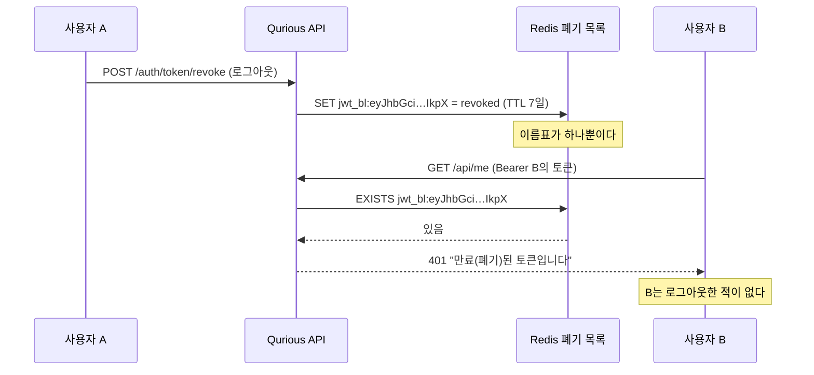
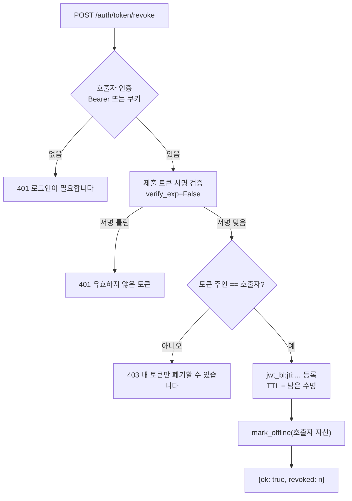

# #46 [작업] JWT 폐기가 전 사용자를 끊는다 — 이름표를 jti 로, 폐기 API 에 인증을 ([#22](../issues/022.md) 결함 1·2)

> 🗂️ 옛 GitHub 이슈를 옮긴 **기록 문서**입니다 — [색인](../README.md). 원문은 그대로 두고, 링크·커밋 해시만 새 자리 기준으로 바꿨습니다.

| 항목 | 내용 |
|---|---|
| 종류 | 이슈 |
| 상태 | 닫힘(완료) · 2026-09-20 16:39 |
| 원 작성 | 이동원(`devlee328288`) · 2026-09-20 13:26 KST |
| 라벨 | `security` `phase-1` |
| 옛 주소 | `github.com/devlee328288/Qurious/issues/46` (지금은 열리지 않음) |

## 본문

> **쉬운 요약 3줄**
> 1. 지금 우리 서비스는 **아무나 한 번 요청을 보내면 전 사용자의 API 로그인이 최대 7일 막힙니다.** 로그아웃한 토큰을 적어 두는 "폐기 목록"의 이름표가 사람마다 다르지 않고 **전원이 똑같은 글자 하나**였기 때문입니다.
> 2. 게다가 그 폐기 요청에는 **로그인 확인이 없어서**, 계정이 없어도 부를 수 있었습니다. 더 나쁜 것은 서명 열쇠(`JWT_SECRET`)가 **공개 저장소에 그대로 올라가 있어** 토큰을 지어낼 수도 있다는 점입니다.
> 3. 이 이슈는 그 세 가지를 함께 닫습니다. 고치고 나서 **실제 Redis 를 띄워 16가지를 재 봤고 전부 통과**했습니다.

**대상**: [#22](../issues/022.md) (A3 인증·세션·권한) 의 결함 **1·2**, 그리고 그 둘을 실제 공격으로 만드는 결함 **10**(기본 비밀값) 일부
**기준 커밋**: `3b98645` · 작업일 **2026-09-20(KST)** · 확실도 **🟢 코드·실측 / 🟡 추론 / 🔴 미확인**

---

## 1. 왜 지금인가

2차 프로젝트 시작이 **09-27, 일주일 뒤**입니다. [#22](../issues/022.md) 에서 찾은 11건 중 이것이 가장 위험한데
사흘 동안 그대로였습니다. 고치는 데 필요한 코드는 **두 파일**이고, 되돌리기도 쉽습니다.

---

## 2. 무엇이 잘못됐었나 — 그림으로

### 2.1 폐기 목록의 이름표가 전원 공통이었다

JWT 는 점(`.`)으로 나뉜 세 토막입니다. **앞 토막은 "무슨 알고리즘을 썼는지"만 적힌 머리말**이라,
같은 설정을 쓰는 한 **모든 사람의 토큰에서 글자까지 똑같습니다.**

```
                         ← 폐기 목록 이름표로 쓰던 앞 32자 →
┌────────────────────────────────────┬──────────────────────────┬────────────┐
│ eyJhbGciOiJIUzI1NiIsInR5cCI6IkpXVCJ9│ eyJzdWIiOiJ1c2VyLWEi...  │ K3xT9v...  │
│ ①  머리말 (알고리즘·타입)           │ ② 알맹이 (누구인지)      │ ③ 서명     │
│    ← 누구나 똑같다 · 36자 →         │    ← 여기부터 달라진다   │            │
└────────────────────────────────────┴──────────────────────────┴────────────┘
   0        8        16       24    31│32      36
                                      └─ 32자에서 끊으면 ①  안에서 끝난다
```

그래서 A 가 로그아웃하면 Redis 에 `jwt_bl:eyJhbGciOiJIUzI1NiIsInR5cCI6IkpX` **딱 하나**가
켜지고, 그 뒤로는 B·C·D 의 토큰을 검사해도 **같은 이름표**를 찾으므로 전원이 막혔습니다.



### 2.2 폐기 요청에 로그인 확인이 없었다

| | 예전 | 지금 |
|---|---|---|
| 호출자 인증 | **없음** — 누구나 | Bearer 토큰 또는 세션 쿠키 필요 |
| 누구 토큰인지 확인 | **없음** | 제출한 토큰의 주인 == 호출자 |
| 토큰 종류 확인 | **없음** — 리프레시를 `access_token` 칸에 넣을 수 있었다 | 주인 확인이 먼저라 무의미해짐 |
| `mark_offline` 대상 | **본문 토큰의 id** — 남을 오프라인으로 | **호출자 자신** |
| 실패했을 때 응답 | 조용히 `{"ok": true}` | 401/403 으로 정직하게 |

리프레시 토큰을 `access_token` 칸에 넣으면 TTL 이 **15분이 아니라 7일**로 잡혔습니다.
전역 이름표 + 7일 = **요청 한 번으로 일주일치 마비**입니다.

### 2.3 그런데 토큰은 지어낼 수도 있었다 🟢

`JWT_SECRET` 이 `app/config.py:16` 의 기본값 `change-me-jwt-secret-32chars-min!!` 그대로이고,
`.env` · `.env.dev` · `.env.prod` 어디에도 이 항목이 **없습니다**(각 0건). 그리고 이 저장소는 **Public** 입니다.
즉 위 공격에 **계정조차 필요 없었습니다.** 폐기 목록만 고치면 반쪽짜리라서 함께 닫습니다.

---

## 3. 어떻게 고쳤나

### 3.1 이름표를 `jti` 로 — 토큰마다 새로 만드는 일련번호

**용어 두 층 풀이**

| 말 | 뜻 | 이 문서에서 | 헷갈리기 쉬운 점 |
|---|---|---|---|
| **JWT** | 서명이 붙은 출입증 문자열 | 우리 API 의 로그인 증표 | 암호화가 아니다 — **알맹이는 누구나 읽을 수 있다.** 서명은 "위조 방지"지 "비밀 유지"가 아니다 |
| **jti** (JWT ID) | 토큰마다 붙이는 고유 일련번호 | 폐기 목록의 이름표 | RFC 7519 §4.1.7 상 **선택 항목**이라 자동으로 안 생긴다 — 직접 넣어야 한다 |
| **폐기 목록** (denylist) | 아직 안 만료됐는데 무효로 칠 토큰 명단 | Redis `jwt_bl:` 네임스페이스 | "블랙리스트"라고도 부른다. 만료와 다르다 — **만료는 시계가, 폐기는 명단이** 결정한다 |
| **malleability** | 뜻은 그대로인데 글자를 바꿀 수 있는 성질 | 서명 토막의 base64 는 한 서명을 여러 글자로 쓸 수 있다 | **토큰 전체를 해싱하면** 변조본이 이름표를 비켜 간다 |

**왜 `sha256(토큰 전체)` 가 아니라 `jti` 인가** 🟢

OWASP JWT Cheat Sheet 는 폐기 목록 키로 `(jti, iss)` 를 권하고, **토큰 원문이나 그 SHA-256 을
키로 쓰지 말라**고 명시합니다 — 위 malleability 때문입니다. 조사 중 python-jose 3.5.0 · HS256 에서
**같은 서명이 서로 다른 여러 토큰 문자열로 통과**하는 것을 실측했습니다.

`jti` 가 없는 **옛 토큰**은 `sha256(머리말.알맹이)` 로 떨어뜨립니다 — 서명 토막을 빼는 이유는
그 앞부분이 **서명이 덮는 바이트 그 자체**여서, 한 글자만 달라도 서명 검증에서 먼저 걸리기 때문입니다.

### 3.2 바꾸기 전 / 후 구조

```
[ 전 ]  요청 ──> is_revoked(토큰 앞 32자)  ──> decode(서명검증)  ──> 통과
                 └─ 서명도 안 본 문자열로 이름표를 만든다 (공격자가 지목 가능)
                 └─ 이름표가 전원 공통

[ 후 ]  요청 ──> decode(서명검증 · exp 필수) ──> type 확인 ──> is_revoked(jti) ──> 통과
                 └─ 서명이 검증된 알맹이에서만 이름표를 꺼낸다
                 └─ 이름표가 토큰마다 다르다
```



`verify_exp=False` 는 **액세스가 이미 만료된 채로 로그아웃하는 흐름**을 살리려는 것입니다.
서명은 그대로 검증하므로 위조는 통하지 않습니다.

### 3.3 같이 걸려 있던 함정 셋 (안 고치면 결함이 모양만 바꿔 되살아난다) 🟢

| # | 함정 | 안 고쳤다면 |
|---|---|---|
| ① | `create_token_pair` 가 **같은 payload 를 두 번** 쓴다 | 액세스와 리프레시가 같은 `jti` → 하나 폐기하면 둘 다 죽는다 |
| ② | refresh 가 알맹이를 통째로 복사한다 (`type/iat/exp` 만 뺌) | 리프레시의 `jti` 가 새 액세스에 상속 → **한 사용자의 모든 토큰이 한 이름표**를 공유 |
| ③ | python-jose 는 `exp` 가 없으면 만료 검사를 **건너뛴다** | `exp` 없는 토큰은 만료도 폐기도 안 되는 영구 출입증 |

①은 `jti` 를 **생성 함수 안에서** 만들어 해결했고(호출부가 넣어도 덮어씀),
②는 제외 목록에 `jti` 를 넣었으며, ③은 `options={"require_exp": True}` 로 막았습니다.

---

## 4. 코드 재사용 판정표

| 무엇 | 어디 | 줄 | 판정 | 왜 |
|---|---|---:|---|---|
| `RedisCache("jwt_bl")` | [redis_cache.py#L160](https://github.com/EST-team-project/Qurious/blob/3b98645/app/lib/redis_cache.py#L160) | 1 | ♻️ **그대로 쓴다** | 네임스페이스·TTL 이 이미 맞다. 키 **값**만 문제였다 |
| `RedisCache.set/exists` | [redis_cache.py#L67-L79](https://github.com/EST-team-project/Qurious/blob/3b98645/app/lib/redis_cache.py#L67-L79) | 13 | ♻️ **그대로** | TTL 지원·직렬화 모두 충분 |
| `get_current_user_any` | [jwt_auth.py#L131-L151](https://github.com/EST-team-project/Qurious/blob/3b98645/app/lib/jwt_auth.py#L131-L151) | 21 | ♻️ **그대로 쓴다** | revoke 인증에 재사용. 쿠키 사용자도 로그아웃할 수 있다 |
| `mark_offline` | [user_state.py](https://github.com/EST-team-project/Qurious/blob/3b98645/app/lib/user_state.py) | — | ♻️ **호출 대상만** 바꿈 | 본문 토큰 id → 호출자 id |
| `_bl_key` | [jwt_auth.py#L83-L85](https://github.com/EST-team-project/Qurious/blob/3b98645/app/lib/jwt_auth.py#L83-L85) | 3 | ✍️ **다시 씀** | 결함의 본체 |
| `decode_token` | [jwt_auth.py#L68-L80](https://github.com/EST-team-project/Qurious/blob/3b98645/app/lib/jwt_auth.py#L68-L80) | 13 | ✏️ **고쳐 씀** | `require_exp` + `verify_exp` 인자 추가 |
| `revoke_tokens` 라우트 | [auth.py#L234-L242](https://github.com/EST-team-project/Qurious/blob/3b98645/app/routes/auth.py#L234-L242) | 9 | ✍️ **다시 씀** | 인증·소유권이 통째로 없었다 |
| `verify_fill_sync.py` 형식 | [scripts/verify_fill_sync.py](https://github.com/EST-team-project/Qurious/blob/3b98645/scripts/verify_fill_sync.py) | 134 | ♻️ **본떠 씀** | S35 에서 만든 관례를 그대로 따랐다(도커 1개 + 항목별 통과/실패) |

**손대지 않은 곳** — `Depends(get_current_user_any)` 를 쓰는 **39곳**은 함수 시그니처가 그대로라
한 줄도 안 바뀝니다. `public/` 프런트엔드는 **JWT 를 아예 쓰지 않고**(쿠키 세션 전용) `/auth/token/revoke`
호출자가 저장소 전체에 **0건**이라 화면 영향이 없습니다. DB·alembic 변경도 없습니다. 🟢

---

## 5. 어떻게 확인했나 — 실측 16건

임시 Redis(`redis:7-alpine`) 한 개를 띄우고 `scripts/verify_jwt_revocation.py` 를 돌렸습니다.
**통과 16 · 실패 0.** 중요한 것은 이 검사가 *"고쳤다"* 가 아니라 **"예전 코드였다면 실패했을 것"**
까지 함께 잰다는 점입니다.

| # | 재는 것 | 결과 |
|---|---|---|
| 1 | A·B 의 폐기 이름표가 다르다 / 옛 방식이었다면 같았다 | 🟢🟢 |
| 2 | A 로그아웃 뒤에도 **B 는 멀쩡하다** | 🟢🟢 |
| 3 | 액세스·리프레시가 다른 `jti` · 액세스를 폐기해도 리프레시 생존 | 🟢🟢 |
| 4 | 리프레시의 `jti` 가 새 액세스에 안 묻는다 (넣어 줘도 덮어씀) | 🟢🟢 |
| 5 | 서명부만 바꾼 변조본도 **같은 이름표**로 떨어진다 | 🟢 |
| 6 | `exp` 없는 토큰이 401 로 거절된다 | 🟢 |
| 7 | 자리표시자 비밀값이면 발급이 막힌다 / 탈출구는 동작한다 | 🟢🟢 |
| 8 | A 가 B 의 토큰을 폐기하면 **403** · B 토큰 그대로 · 자기 것 2개는 폐기됨 | 🟢🟢🟢🟢 |

```
── 결과: 통과 16 · 실패 0 ──
```

---

## 6. 같이 한 작은 것

- `python-jose[cryptography]>=3.3.0` → **`>=3.4.0`**. 하한이 CVE-2024-33663·33664 영향 버전이었습니다.
  🟡 두 CVE 모두 JWE·비대칭키 경로라 우리(HS256 대칭키 + `algorithms` 명시)의 **실제 노출은 아닙니다.**
  상한도 락파일도 없어 빌드 시점마다 버전이 달라지므로 바닥만 올려 둡니다.
- `.env.example` 에 "이 값 그대로면 앱이 토큰 발급을 거부한다"는 안내와 탈출구를 적었습니다.

---

## 7. 한계 — 이 PR 이 **안** 고치는 것 🔴

| 남은 것 | 왜 안 했나 |
|---|---|
| **리프레시 회전(rotation)** 없음 | RFC 9700 §4.14.2 가 권고하나 **클라이언트 변경**을 부른다. `jti` 가 생겼으니 다음에 할 수 있다 |
| 리프레시를 폐기해도 **이미 나간 액세스는 최대 15분** 산다 | 사용자 단위 폐기(`epoch`)가 있어야 한다 — 별도 작업 |
| refresh 가 **DB 를 다시 안 본다** → 권한 강등·탈퇴가 7일 반영 안 됨 | [#22](../issues/022.md) 결함 7. 구조 변경이라 분리 |
| 쿠키 로그아웃이 **JWT 를 안 끊는다** | 두 인증 체계를 잇는 설계 판단이 필요 |
| **레이트 리밋 0곳** | [#22](../issues/022.md) 결함 9. 미들웨어가 하나도 없어 도입 자체가 별건 |
| Redis 가 죽으면 인증 전체 **500** | 🟢 fail-**closed** 라 안전한 쪽이다. 다만 방침이 문서화돼 있지 않다 |
| 폐기 목록이 **RDB 스냅샷에만** 남는다 | 🟡 AOF 가 꺼져 있어 비정상 종료 시 폐기가 되살아날 수 있다 |
| `JWT_SECRET` 을 **실제로 채우는 일** | 🔴 코드가 막아 줄 뿐, 값은 사람이 넣어야 한다. 아래 참고 |

### ⚠️ 머지 뒤에 꼭 해야 하는 일

```bash
# .env (또는 .env.dev) 에 추가
openssl rand -hex 32     # 나온 값을 아래에 넣는다
JWT_SECRET=<그 값>
```
**안 넣으면 JWT 발급·검증이 500 으로 막힙니다.** 웹 화면(쿠키 세션)은 영향받지 않습니다.
급할 때는 `JWT_ALLOW_INSECURE_SECRET=true` 로 넘길 수 있지만 **운영에서는 켜지 마세요.**

---

## 8. 뒤집을 조건

- 🔴 **`jti` 없는 옛 토큰의 폴백이 문제가 되면** — 지금은 `sha256(머리말.알맹이)` 로 떨어뜨립니다.
  옛 토큰을 아예 거절하는 편이 낫다고 판단되면 폴백을 지우고 401 로 바꿉니다(최대 7일 재로그인 발생).
- 🔴 **소유권 검사가 정상 흐름을 막으면** — 예컨대 서버 간 호출에서 대리 폐기가 필요해지면,
  관리자 역할에 한해 예외를 둬야 합니다. 지금은 그런 호출자가 **0건**이라 좁게 잠갔습니다.
- 🟡 **`require_exp: True` 가 외부 발급 토큰을 깨면** — 현재 토큰 발급자는 우리뿐이라 안전합니다.
- 🟡 **`JWT_SECRET` 가드가 팀원 로컬을 막으면** — `JWT_ALLOW_INSECURE_SECRET=true` 로 즉시 풀립니다.
  그래도 번거롭다는 의견이 모이면 가드를 경고 로그로 낮춥니다.

---

## 9. 다음

- [#22](../issues/022.md) 본문의 결함 1·2 칸을 ✅ 로 갱신합니다 (결함 10 은 JWT 부분만 부분 해결).
- 남은 결함 중 다음 후보는 **3번(docker.sock + root 실행)** 과 **6번(인증 없는 라우트 34곳)** 입니다.
