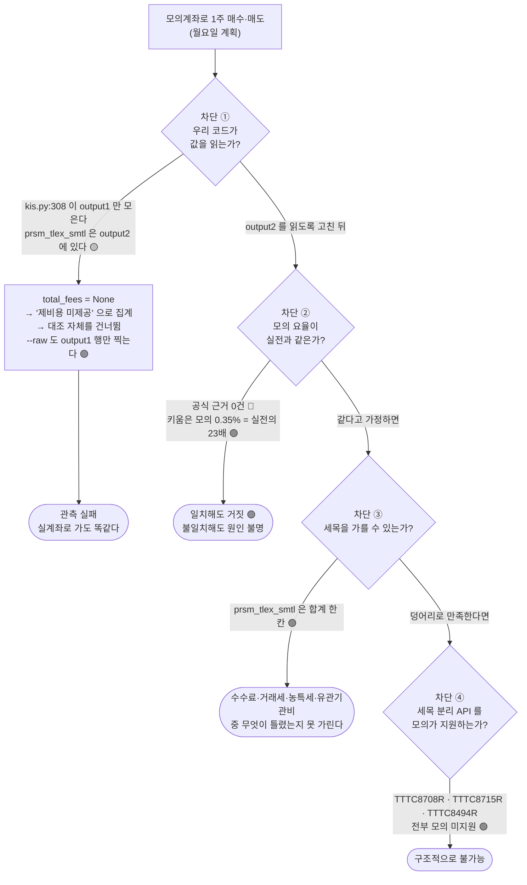

# #51 [분석] 요율표 실측 판정 — 모의 체결로는 검증할 수 없다: 4중 차단과 output2 누락, 2026 법정요율 대조 ([#40](../issues/040.md) 후속)

> 🗂️ 옛 GitHub 이슈를 옮긴 **기록 문서**입니다 — [색인](../README.md). 원문은 그대로 두고, 링크·커밋 해시만 새 자리 기준으로 바꿨습니다.

| 항목 | 내용 |
|---|---|
| 종류 | 이슈 |
| 상태 | 열림 |
| 원 작성 | 이동원(`devlee328288`) · 2026-09-20 17:41 KST |
| 라벨 | `analysis` |
| 옛 주소 | `github.com/devlee328288/Qurious/issues/51` (지금은 열리지 않음) |

## 본문

> **세션** S38 (2026-09-20 일) · **기준 커밋** `f3ed455` · **후속** [#40](../issues/040.md)
> **주문 0건 · 실계좌 접근 0회 · 파일 수정 0건** 으로 조사만 했습니다.
> 일요일이라 장이 닫혀 실측을 또 못 했습니다(네 세션째). 그래서 **실측의 전제 자체**를 검증했고,
> 그 결과 전제가 무너졌습니다. 아래 0절이 결론입니다.

---

## 0. 결론 먼저 — 전제가 두 번 무너졌다

**모의 체결로 요율표를 검증하는 것은 의미가 없다.** 🔴 4세션을 기다린 이 작업의 전제는 무너졌다. 정직하게 적는다.

그런데 무너진 것이 하나가 아니라 **둘**이다. 네 갈래 조사를 합치면서 아무 갈래도 혼자서는 보지 못한 것이 드러났다:

| # | 무너진 전제 | 근거 | 확실도 |
|---|---|---|---|
| 1 | "모의 수수료·세금은 실전과 같다" | KIS 어디에도 공식 근거가 없다. 업계 사례는 정반대 — 키움 모의 0.35% = 실전의 23배 | 🔴 근거 부재 / 🟢 반례 존재 |
| 2 | **"어쨌든 모의로 값은 받아볼 수 있다"** | **우리 코드가 `prsm_tlex_smtl` 을 `output1` 에서 읽는데 그 칸은 `output2` 에 있다. `--raw` 조차 `output1` 행만 찍는다 → 월요일 절차서대로 해도 값 자체가 안 보인다** | 🟡→🟢 (코드는 🟢, 필드 위치는 🟡) |

2번이 이번 합본의 핵심이다. 조사 1이 필드 위치를 짚었고, 조사 3이 코드 구조를 훑었고, 조사 4가 월요일 절차서를 썼는데 — **그 절차서대로 하면 「제비용 미제공」 만 뜨고 끝난다.** 실계좌로 옮겨가도 같은 버그로 똑같이 조용히 건너뛰어진다.

그래서 월요일에 할 일은 "요율표 검증" 이 아니라 **"관측 장치부터 고치고, 주문 0건으로 두 가지를 먼저 확인하는 것"** 이다. 아래 4절.

---

## 1. 어려운 말 풀이

**`output1` · `output2`**
- **뜻**: KIS 체결조회 응답이 두 덩어리로 온다. `output1` 은 주문 한 건씩의 배열, `output2` 는 조회기간 전체의 요약 한 덩어리.
- **이 문서에서**: 우리가 찾는 제비용 칸(`prsm_tlex_smtl`)이 `output2` 쪽에 있는 것으로 보인다. 우리 코드는 `output1` 만 모은다(`kis.py:308`).
- **헷갈리는 점**: 이름이 1·2 라서 "1이 본문, 2가 덤" 으로 읽히지만, **비용 정보는 2에만 있다.** 잔고조회(`kis.py:161`)에서는 우리 코드가 이미 `output2` 를 제대로 읽고 있어서, 체결조회만 빠진 것이다.

**`prsm_tlex_smtl` (추정제비용합계)**
- **뜻**: prsm=추정 · tlex=제비용 · smtl=합계. 증권사가 "대략 이만큼 뗄 것 같다" 고 알려주는 **합계 한 칸**.
- **이 문서에서**: 우리가 요율표와 맞대는 유일한 증권사 값이다.
- **헷갈리는 점 셋**: (a) **추정**이지 확정 정산액이 아니다. (b) **합계**라 수수료·거래세·농특세·유관기관비를 갈라낼 수 없다. (c) KIS 공식 예제와 강사님 카탈로그가 이 칸에 **"총체결금액"** 이라는 엉뚱한 한글 라벨을 붙여 놨다(아래 2.3 확인). 라벨을 믿으면 제비용 자리에 체결금액이 들어간다.

**`cost_basis`**
- **뜻**: 이 숫자가 "우리 요율표로 추정한 것"(`estimated`)인지 "증권사가 준 것"(`broker`)인지 표시하는 칸.
- **이 문서에서**: `fill_sync.py:162` 가 합계가 맞으면 `broker` 로 바꾼다.
- **헷갈리는 점**: `broker` 가 붙어도 **"증권사가 실제로 뗀 금액"이 아니다.** 증권사의 *추정*과 우리 *추정*이 같다는 뜻일 뿐이다. 라벨이 실제보다 강하다.

**탄력세율(彈力稅率)**
- **뜻**: 법률이 정한 기본세율(증권거래세 0.35%)을 대통령령으로 내렸다 올렸다 할 수 있게 한 것.
- **이 문서에서**: 2026-01-01 대통령령 제36001호가 코스피를 0%→0.05%, 코스닥을 0.15%→0.20% 로 **올렸다**. 우리 `TAX_SCHEDULE` 마지막 줄이 그것이다.
- **헷갈리는 점**: 증권사 홈페이지가 못 따라온다. 한국투자증권 '매매관련 세금' 페이지는 아직 2021~2022년 값(0.08%+0.15%)이다 🟢. **증권사 페이지는 수수료에만 쓰고 세율에는 쓰지 않는다.**

**유관기관 제비용**
- **뜻**: 거래소(KRX)·예탁결제원(KSD)이 떼는 원가성 비용. 증권사 수수료와 **별개**로 고객이 낸다. 매수·매도 **양쪽** 다 붙는다.
- **이 문서에서**: `FEE_CLEARING = 0.000036396` (0.0036396%).
- **헷갈리는 점**: 자료마다 분해가 다르다 — "거래소 0.0027209 + 예탁원 0.0009187" 과 "거래소 0.0022763 + 예탁원 0.0013633" 이 같이 돌아다니는데 **합계는 둘 다 0.0036396% 로 같다** 🟢. 분해값이 다르다고 불일치로 판단하지 말 것.

**메이커 / 테이커 (NXT)**
- **뜻**: 호가를 걸어 놓고 기다린 쪽(메이커)과 그 호가를 쳐서 즉시 체결시킨 쪽(테이커)에 다른 요율을 매기는 방식.
- **이 문서에서**: NXT 유관기관비가 메이커 0.0027033% · 테이커 0.0031833% 로 갈린다 🟢.
- **헷갈리는 점**: **우리가 받는 데이터로는 어느 쪽이었는지 알 수 없다.** NXT 를 열려면 보수적으로 테이커로 가정해야 한다.

---

## 2. [질문 1] 모의 체결로 요율표를 검증하는 것이 의미가 있는가 → **없다**

### 2.1 4중 차단



### 2.2 차단 ① — 이번 조사에서 새로 확정한 것 (전/후 구조)

```
[ KIS 응답 구조 ]                       [ 우리 코드가 하는 일 ]

 body
  ├─ output1 : [ 주문 1, 주문 2, ... ]   ──▶  rows.extend(output1)      kis.py:308
  │    ord_dt, odno, pdno, prdt_name,          for row in rows:
  │    ord_qty, ord_unpr, tot_ccld_qty,            row.get("prsm_tlex_smtl")   ← ✗ 없다
  │    avg_prvs, tot_ccld_amt, cncl_yn,            → "" → total_fees = None    kis.py:342
  │    ...  (여기에 제비용 칸이 없다)
  │                                            fill_sync.py:149  no_fee_info += 1
  └─ output2 : { 조회기간 합계 1건 }      ──▶  ✗ 아무도 안 읽는다
       tot_ord_qty      총주문수량             sync_fills.py:150  "없음" 만 출력
       tot_ccld_qty     총체결수량             sync_fills.py:157  matched=0, mismatched=0
       pchs_avg_pric    매입평균가격           → "🟢 일치" 도 "🔴 불일치" 도 안 찍힌다
       tot_ccld_amt     총체결금액                (조용히 아무 말 없이 끝난다)
       prsm_tlex_smtl   추정제비용합계  ★ 여기
```

**고친 뒤에 이렇게 되어야 한다:**

```
  ├─ output1 ──▶ 건별 정보 (지금 그대로)
  └─ output2 ──▶ summary 로 따로 보관
                 · 조회 창을 주문 1건만 포함하게 좁힌다
                   (같은 날 + 같은 종목 + ODNO 지정)
                 · 그러면 "기간 합계" 가 사실상 "건별 값" 이 된다
                 · --raw 는 body 전체를 찍는다 (output2 포함)
```

근거 🟢 (코드): `app/services/brokers/kis.py:308` `rows.extend(body.get("output1") or [])` · 같은 파일 `:328` `row.get("prsm_tlex_smtl")` · `scripts/sync_fills.py:150` `print("    원문:", json.dumps(f.raw, ...))` 이고 `f.raw` 는 output1 행(`kis.py:346`).
근거 🟡 (필드 위치): KIS 공식 예제 `chk_inquire_daily_ccld.py` 의 `COLUMN_MAPPING` 꼬리가 `tot_ccld_amt / tot_ord_qty / prsm_tlex_smtl / pchs_avg_pric` 이고 output1·output2 에 **하나의 병합 매핑**을 적용한다(원문 확인). `tot_ord_qty`(총주문수량)·`pchs_avg_pric`(매입평균가격)은 건별 배열에 있을 수 없는 요약 칸이므로, 같은 꼬리 묶음의 `prsm_tlex_smtl` 도 output2 소속으로 본다. **다만 output1/output2 를 명시적으로 갈라 적은 1차 스펙은 확인하지 못했다 → 🟡.**

> 💡 **중요**: 이 🟡 는 조치를 미룰 이유가 되지 않는다. **"둘 다 읽는다" 는 수정은 어느 쪽이 맞든 무조건 옳다.** output1 에 있으면 손해가 없고, output2 에 있으면 그것만이 유일한 길이다.

### 2.3 라벨 어긋남 — 로컬에서 직접 확인했다 🟢

| 필드명 | 필드명이 말하는 뜻 | KIS 공식 예제 라벨 | 강사님 카탈로그 라벨 | 판정 |
|---|---|---|---|---|
| `tot_ccld_amt` | 총체결금액 | 총체결금액 | **매입평균가격** | 🔴 카탈로그가 틀림 |
| `tot_ord_qty` | 총주문수량 | 총주문수량 | 총주문수량 | 🟢 |
| `prsm_tlex_smtl` | **추정제비용합계** | **총체결금액** | **총체결금액** | 🔴 양쪽 다 틀림 |
| `pchs_avg_pric` | 매입평균가격 | **추정제비용합계** | **추정제비용합계** | 🔴 양쪽 다 틀림 |

확인 경로: `C:\Users\kik32\workspace\EST-Camp-AI-Quant\projects\stock-coin-trade-study\python-stock-backend\kis_api_catalog.json:425,446-448` (로컬 실제 확인) + KIS 공식 `chk_inquire_daily_ccld.py` 원문 조회.
→ **우리 코드가 라벨이 아니라 필드명을 따른 것(`kis.py:325-327`)이 옳았다.** 이 판단은 유지한다.

### 2.4 그래서 판정

| 목적 | 모의로 되는가 | 근거 |
|---|---|---|
| **요율표(수수료율·세율) 검증** | ❌ **의미 없음** | 차단 ②③④ |
| 절사 방식(원 단위) 확정 | ❌ 의미 없음 | 모의 요율이 다르면 절사도 다르다 |
| 세목 배분(농특세 코스피 전용) 검증 | ❌ **원리적으로 불가** | 코스피·코스닥 합계가 설계상 같다 |
| **`prsm_tlex_smtl` 이 어느 output 에 있는가** | ✅ **된다 · 무료** | 필드 위치는 실전·모의가 같다(엔드포인트 동일) |
| **그 칸이 언제 채워지는가** (장중/마감후) | ✅ **된다** | 모의 체결 1건이면 관측된다 |
| 배관(토큰·TR·파라미터·rt_cd·연속조회) | ✅ 된다 | 원래 모의의 올바른 용도 |
| **모의 수수료가 0원인가** | ✅ **된다 · 주문 0건** | 매수가능조회 역산 (4절 Phase B) |

**한 줄 판정**: 모의는 **저울의 눈금을 읽는 도구가 아니라, 저울이 켜지는지 보는 도구**다. 월요일에는 저울을 켜는 일까지만 한다.

---

## 3. [질문 2] 대안 경로 — 값어치 순

값어치 = (얻는 것의 확실도 × 범위) ÷ (돈 + 승인 비용 + 위험).

| 순위 | 경로 | 비용 | 주문 | 얻는 것 | 확실도 | 승인 |
|---|---|---|---|---|---|---|
| **1** | **문서 대조 정리** (5절) — 법령·KRX 를 1차 출처로 고정, 증권사 페이지는 대조용으로 강등 | 0원 | 0건 | 세율 7구간 전부 + 근거의 층위 | 🟢 | 불필요 |
| **2** | **`output2` 파싱 수정** (`kis.py:308`) + `--raw` 를 body 전체로 | 0원 | 0건 | **나머지 모든 경로의 선행조건**. 이거 없으면 실계좌도 헛수고 | 🟢 필요성 | 불필요 |
| **3** | **모의 매수가능조회 역산** (VTTC8908R) | 0원 | **0건** | "모의 수수료가 0원인가 / 얼마인가" — 모의 무용론의 실증 | 🟡 | 토큰 캐시 읽기 허용만 |
| **4** | **모의 1주 매수·매도** (월요일) | 0원 | 모의 2건 | ① `prsm_tlex_smtl` 의 output 위치 확정 ② 채워지는 시각 ③ 주문→체결→조회 배관 | 🟢 (배관 한정) | 불필요 |
| **5** | **과거 실계좌 체결이 있다면** TTTC8708R (일별 합산) | 0원 | **0건** | **수수료와 제세금이 분리된 채로** 온다 → 세목 대조 완결 | 🟢 | 실계좌 조회 승인 |
| **6** | **실계좌 1주 매매 + TTTC8715R** | 아래 계산 | 실 2~6건 | **유일한 정본.** 세목별 분리 검증 | 🟢 | **필수** |
| 7 | 모의로 요율표 검증 | — | — | **없음** | 🔴 | — |

### 3.1 실계좌 1주 매매의 실제 저울질 — 숫자를 바로잡는다

> ⚠️ **임무문의 "삼성전자 1주 약 7~9만원" 은 옛 시세다.** 2026-09-19(금) 종가 기준 **260,000원** 이다 🟢 (모의 도메인 현재가 조회 실측, 조사 4).

| 항목 | 금액 | 비고 |
|---|---|---|
| 투입 원금 (삼성전자 1주) | 260,000원 | **회수된다** — 손실이 아니다 |
| 확정 손실 (왕복 비용) | 약 612원 | 매수 46.0 + 매도 566.0 |
| 스프레드 손실 (호가 1틱 = 500원) | 최대 1,000원 | 매수 시 +1틱, 매도 시 −1틱 |
| **실제 기대 손실** | **약 1,000~1,600원** | 수 분 내 왕복 시 |

**그런데 저가주로 바꾸면 검증이 안 된다 — 이것이 비직관적인 함정이다.**

```
           체결금액에 따른 "요율 분해능"  (허용오차 1원 기준)

  체결금액     수수료+유관(0.0176923%)   0.0140527% vs 0.015% 차이
  ─────────────────────────────────────────────────────────────
     5,000원            0.88원  ← 절사되면 0원      0.05원   ✗ 못 가림
    50,000원            8.85원                      0.47원   ✗ 못 가림
   260,000원           46.00원                      2.46원   ✓ 가려진다
 1,000,000원          176.92원                      9.47원   ✓ 여유
 ─────────────────────────────────────────────────────────────
  0.0140527% vs 0.0140% (마지막 자리) 는 1,000만원 체결에서도 5.3원 →
  🔴 위탁수수료의 끝자리는 실측으로 영영 못 가린다. 문서 대조 영역이다.
```

**따라서 실계좌 검증의 권고 설계**는 "저가주 3종목" 이 아니라:

| 표본 | 종목 성격 | 확인하는 것 | 필요 금액 |
|---|---|---|---|
| ① | **코스피 20~30만원대 1주** | 거래세 0.05% + 농특세 0.15% 합계 0.20%, 수수료 실효율 | ~26만원 (회수됨) |
| ② | 코스닥 10만원 이상 1주 | 거래세 0.20% 단독(농특세 없음) — **합계가 같아 실측으로는 구분 안 됨** 🔴 | ~10만원 |
| ③ | ETF 1종목 (10만원 이상) | **증권거래세 0% 확인** + `_is_etf()` 규칙 검증 | ~10만원 |

②는 합계가 ①과 같으므로 **세목 배분 검증에는 쓸모가 없다.** 정직하게 말하면 실계좌로도 확인되는 것은 ①의 합계와 ③의 면제 두 가지다. 세목 분리는 **TTTC8715R 이 `fee` 와 `tl_tax` 를 따로 줄 때만** 가능하다 🟢 — 즉 실계좌의 값어치는 "1주 매매" 가 아니라 **"모의가 못 쓰는 API 3종을 쓸 수 있다"** 는 데 있다.

---

## 4. [질문 3] 월요일 절차서 — 목적을 바꾼 버전

> **이 절차서의 목적은 요율표 검증이 아니다.** ①관측 장치 수리 ②주문 0건 확인 2건 ③모의 체결로 배관과 필드 위치 확정. 이 세 가지다.
> **모든 KIS 호출 사이에 3초 이상**을 둔다(유량 제한 `EGW00201`). 주문 전후는 5초.
> ⚠️ **`--real` 은 절대 쓰지 않는다.** 그리고 `auto_trade._place_live_order()` 는 `paper=False` 고정이므로 **작업 전에 앱·스케줄러를 내린다** 🟢.

### Phase 0 — 개장 전 (08:50)

| # | 할 일 | 성공 판정 | 실패 대처 |
|---|---|---|---|
| 0-1 | `git status --short` | 다른 워크플로의 작업물이 섞여 있지 않다 | 섞였으면 그 작업부터 정리 |
| 0-2 | 실행 중인 Qurious 컨테이너·스케줄러 종료 | `docker ps` 에 없다 | — |
| 0-3 | `.env` 는 건드리지 않는다. 인라인 코드는 **반드시 `paper=True` · `KIS_MOCK_*`** | — | — |

### Phase A — 주문 0건, 값 0원: **관측 장치 수리** (09:00, 5분)

| # | 할 일 | 성공 판정 | 실패 대처 |
|---|---|---|---|
| A-1 | `PYTHONIOENCODING=utf-8 PYTHONPATH=. python scripts/sync_fills.py --days 1` | 「토큰: 캐시 재사용」 또는 「새로 발급」 + 「받은 행 0건 … rt_cd=0」 | 토큰 오류면 `.kis_token_mock.json` 삭제 후 **1분 뒤** 재실행 (KIS 재발급 분당 1회) |
| A-2 | **★ `kis.py:308` 을 고친다** — `output2` 를 따로 파싱해 보관, `sync_fills.py --raw` 가 `body` 전체(output1+output2)를 찍게 한다 | 코드가 통과하고 A-3 이 가능해진다 | 이 단계를 건너뛰면 **Phase C 가 무의미해진다** |
| A-3 | 체결 0건 상태로 `--raw` 재실행 | **`output2` 딕셔너리에 `prsm_tlex_smtl` 키가 존재하는지 본다.** 체결이 0건이어도 키는 온다 | 키가 output1 쪽에 있으면 조사 3의 해석이 맞았던 것 — 그대로 기록 |

> 🎯 **A-3 이 이번 작업 최대의 수확 후보다.** 주문 한 건 없이, 돈 한 푼 없이 **필드 위치 🟡 → 🟢** 이 확정된다. 여기서 끝나면 Phase C 를 안 해도 된다.
> ⚠️ 단, 오늘은 파일 수정이 금지(다른 워크플로가 같은 저장소를 쓴다)라 **A-2 는 월요일에 한다.** 브랜치를 따로 파고 `Closes #N` 규칙(7절 PR)을 따른다.

### Phase B — 주문 0건: **모의 수수료가 0원인가 역산** (09:10, 10분)

모의계좌 **매수가능조회 `VTTC8908R`** 은 모의 지원 API 다 🟢. 주문을 내지 않고 수수료의 존재와 크기를 역산한다.

| # | 할 일 | 성공 판정 | 실패 대처 |
|---|---|---|---|
| B-1 | `VTTC8908R` 을 단가 260,000 으로 1회 호출, 응답 전체를 기록 | `ord_psbl_cash`(주문가능현금) · `max_buy_amt`(최대매수금액) · `nrcvb_buy_amt`(미수없는매수금액) · `nrcvb_buy_qty` 가 온다 | 필드명이 다르면 원문 그대로 기록 |
| B-2 | **`ord_psbl_cash / max_buy_amt − 1` 을 계산한다** | 예: 10,000,000 / 9,998,231 − 1 = **0.00017693** → 수수료+유관 0.0176923% 와 일치 → 실전 요율과 같다 🟢 / `= 0` 이면 **모의 수수료 0원** 🟢 / `≈ 0.00015` 면 모의 전용 0.015% 🟢 | 두 값이 같으면(차이 0) 이 필드가 수수료를 안 먹는 것일 수 있다 → B-3 |
| B-3 | (B-2 가 무의미할 때만) **경계 탐색**: 단가를 263,111~263,158 사이로 바꿔 2~3회 호출 | 예수금 1,000만 기준, 수수료 0 이면 최대수량 **38**, 수수료 반영이면 **37** 로 갈린다 | 계속 같으면 「매수가능조회가 수수료를 반영하지 않는다」로 기록하고 종료 |

> **이 Phase 의 값어치**: 조사 1이 "🔴 모의 수수료 0원설은 확인 불가" 로 남긴 칸을, **주문 없이 무료로** 🟢 또는 🔴 로 닫는다. 그리고 결과가 "실전과 다르다" 로 나오면 **Phase C 의 비용 대조는 아예 할 필요가 없어진다.**

### Phase C — 모의 체결 2건: **배관 + 채워지는 시각** (09:20~, 30분)

> ⚠️ **이 Phase 는 요율표를 검증하지 않는다.** 나오는 숫자를 요율표 판정에 쓰지 않는다.

| # | 할 일 | 성공 판정 | 실패 대처 |
|---|---|---|---|
| C-1 | `get_price('005930')` 로 현재가 확인 | `acml_vol`(거래량)이 금요일 값에서 **갱신**돼 있다 | 안 갱신이면 3초 간격 재확인 |
| C-2 | 매수 지정가 계산 = `현재가 × 1.005` 를 **500원 단위로 올림**(20만~50만원 구간은 500원 틱) | 500의 배수이고 상한가(+30%) 안 | 우리 저장소에 호가단위 코드가 **없다** — 손으로 계산 |
| C-3 | `make_client(paper=True)` 경유 → `place_order(account,'005930','buy',1,<가>)` | `output.ODNO` · `KRX_FWDG_ORD_ORGNO` 수신 → **받아 적는다** | `[40100000] 모의투자 영업일이 아닙니다` → 휴장, 중단 · `[EGW00201]` → 3초 쉬고 1회만 재시도 |
| C-4 | 5초 후 `sync_fills.py --start <오늘> --end <오늘> --symbol 005930 --raw` | 1행, `tot_ccld_qty=1`, `avg_prvs` 가 채워짐 | 미체결이면 3초 간격 5회까지 재조회 → 안 되면 C-9 취소 |
| C-5 | **★ `--raw` 원문에서 `output2.prsm_tlex_smtl` 이 채워졌는지 본다** | 값이 있다 → **필드 위치 🟢 확정 + 채워지는 시각 = 장중 즉시** | 비었다 → C-8 로 (마감 후 재확인) |
| C-6 | 매도 지정가 = `현재가 × 0.995` 를 500원 단위로 **내림** → `place_order(...,'sell',1,...)` | ODNO 수신 | `매도가능수량` 오류 → **당일 매수분 당일 매도가 모의에서 막힌 것.** 세금 관측은 화요일로 넘긴다 |
| C-7 | 5초 후 C-4 반복 | 매도 행이 붙고 매수/매도의 제비용 **구조 차이**(세금 유무)가 보인다 | — |
| C-8 | **15:40 마감 후 같은 조회 1회** | 장중과 마감 후 `prsm_tlex_smtl` 이 달라지는지 두 원문을 나란히 기록 | — |
| C-9 | (미체결 시) 취소 — **우리 저장소에 취소 함수가 없다.** KIS 모의투자 웹/앱에서 직접 취소가 가장 안전 | 재조회 시 `cncl_yn='Y'` | 코드로 할 경우 `/order-rvsecncl` + `VTTC0013U` |

**Phase C 의 산출물은 "맞았다/틀렸다" 한 줄이 아니라 재현 가능한 관측 기록이다** — 명령·원문·시각(KST)을 그대로 남긴다.

### 절대 하지 말 것

- ❌ Phase C 의 숫자로 요율표를 판정하는 것 (2절 전체)
- ❌ `--real`
- ❌ HTTP 200 을 성공으로 읽는 것 — KIS 는 거부해도 200 을 준다. `rt_cd`·`msg_cd`·`msg1` 을 본다 🟢
- ❌ 강사님 `broker_test.py` 를 그대로 따라 하기 — 그 코드는 현재가의 **90%** 로 **일부러 체결을 피하는** 안전 테스트다(`_KIS_ORDER_TEST_PRICE_RATIO = 0.90`). 우리는 정반대가 필요하다 🟢

---

## 5. [질문 4] 코드 요율표 vs 2026년 법정 요율 — 항목별 대조

### 5.1 세금 (`trading_cost.py:78-86` `TAX_SCHEDULE` + `:59` `RURAL_TAX`)

| 시행일 | 코드 코스피 | 법정 코스피 | 코드 코스닥 | 법정 코스닥 | 코드 코넥스 | 법정 코넥스 | 판정 |
|---|---|---|---|---|---|---|---|
| 1900-01-01 | 0.15% | 0.15%(추정) | 0.30% | 0.30%(추정) | 0.10% | **조항 부존재** | 🟡 / 🟡 / **🔴** |
| 2019-06-03 | 0.10% | 0.10% 🟢 | 0.25% | 0.25% 🟢 | 0.10% | **조항 부존재** | ✅ / ✅ / **🔴** |
| 2021-01-01 | 0.08% | 0.08% 🟢 | 0.23% | 0.23% 🟢 | 0.10% | 0.10% 🟢 | ✅ |
| 2023-01-01 | 0.05% | 0.05% 🟢 | 0.20% | 0.20% 🟢 | 0.10% | 0.10% 🟢 | ✅ |
| 2024-01-01 | 0.03% | 0.03% 🟢 | 0.18% | 0.18% 🟢 | 0.10% | 0.10% 🟢 | ✅ |
| 2025-01-01 | 0.00% | 0.00% 🟢 | 0.15% | 0.15% 🟢 | 0.10% | 0.10% 🟢 | ✅ |
| **2026-01-01** | **0.05%** | **0.05%** 🟢 (대통령령 제36001호) | **0.20%** | **0.20%** 🟢 | 0.10% | 0.10% 🟢 | ✅ |
| 농특세 (코스피만) | 0.15% | 0.15% 🟢 (농특세법 §5①5 별표) | 없음 | 없음 🟢 | 없음 | 없음 🟢 | ✅ |

> 🔴 **새로 발견한 오류 후보**: 코넥스 0.10% 조항(시행령 제5조제2호)은 **2021-01-01 대통령령 제31290호로 신설**됐다 🟢. 그런데 코드는 `date(1900,1,1)` 행과 `2019-06-03` 행에도 코넥스 0.0010 을 넣는다. **2021 이전 코넥스에 무슨 세율이 적용됐는지 확인하지 못했다 🔴.** 코넥스 종목을 백테스트하지 않으면 실해는 없지만, 값은 근거가 없다.

**2026년 매도 세금 총부담 판정: 코드와 법정이 일치한다 ✅ 🟢** — 코스피 0.20%(0.05+0.15) · 코스닥 0.20% · 코넥스 0.10%.

### 5.2 수수료·제비용·기타

| 항목 | 코드 (줄) | 코드값 | 1차 출처값 | 판정 | 고칠 곳 |
|---|---|---|---|---|---|
| 위탁수수료 KRX | `:42` `FEE_ONLINE_KRX` | 0.0140527% | 뱅키스 온라인 KRX 0.0140527% 🟢 | ✅ 값은 맞다 | **시점이 없다** — 2016년 거래에도 2025-10-27 요율이 붙는다 🔴 |
| 위탁수수료 NXT | `:44` `FEE_ONLINE_NXT` | 0.0130527% | 0.0130527% 🟢 | ✅ 값은 맞다 | **참조 0건 — 죽은 상수** |
| 영업점 | `:46` `FEE_BRANCH_KRX` | 0.147% | 0.147% 🟢 | ✅ | 참조 0건 |
| 유관기관 제비용 KRX | `:53` `FEE_CLEARING` | 0.0036396% | KRX 0.0036396% 🟢 | ✅ 값은 맞다 | **2025-12-15~2026-02-13 한시 인하 미반영** 🔴 (코드가 `:50-52` 에서 자인) · 한투 고지 0.00368330% 과 0.0000437%p 차 🟡 |
| **유관기관 제비용 NXT** | **없음** | — | 테이커 0.0031833% / 메이커 0.0027033% 🟢 | **🔴 상수 자체가 없다** | NXT 를 열면 수수료만 바꿔선 틀린다 (7절) |
| ETF 면제 | `:162-166` | 거래세·농특세 0 | 결과는 맞다 🟢 | ✅ 값 / 🟡 **근거** | 주석은 「조특법 §117①21 **면제**」인데, 1차 출처는 「ETF 는 투자신탁 수익증권이라 **주권이 아니어서 과세대상 자체가 아니다**」(증권거래세법 §1-2·§2, KRX 규정안내) 🟢. **결과는 같지만 "면제"는 일몰 위험이 있고 "과세대상 아님"은 없다** — 주석을 바꿔야 한다 |
| 슬리피지 | `:94` | 10bp 편도 | **가정** | 🟡 코드도 가정이라 표기 | 실측·문서 대조 둘 다 불가 |
| 원 단위 절사 | `:257,275` `round_to_won=False` | 꺼져 있음 | 국고금관리법 §47 = **버림**(반올림 규정 없음) 🟢 / 증권사 절사 규정 원문 🔴 | 🟡 | 6절 권고 |
| 허용오차 | `fill_sync.py:40` | 1.0원 | — | 🟡 **절사 시 최대 4원과 충돌** | 6절 권고 |
| 허용오차 (스크립트) | `sync_fills.py:143` | `1.0` 하드코딩 | — | 🔴 상수와 따로 논다 | 참조로 교체 |

### 5.3 2026년 실제 계산값 (삼성전자 260,000원 1주)

| | 코드 계산 | 내역 |
|---|---|---|
| 매수 총비용 | **46.00원** | 수수료 36.54 + 유관 9.46 |
| 매도 총비용 | **566.00원** | 46.00 + 거래세 130 + 농특세 390 |
| 왕복 비용률 (슬리피지 **제외**, 주문 금액 경로) | **23.54bp** | 현행 flat 20bp 대비 1.18배 |
| 왕복 비용률 (슬리피지 10bp **포함**, 백테스트 비율 경로) | **43.54bp** | 현행 flat 20bp 대비 **2.18배** |

> ⚠️ **같은 "비용" 이라는 말이 두 경로에서 다른 것을 가리킨다** 🟢 — 백테스트(`cost_rate`, `:196`)는 슬리피지를 넣고, 주문 금액(`order_costs`, `:260-261`)은 넣지 않는다. 백테스트 결과(43.54bp)와 실제 주문 정산(23.54bp)을 직접 비교하면 어긋난다. 설계 의도는 맞지만 **문서에 못박아 둬야** 한다.

---

## 6. [질문 5] 실측 없이 **지금 당장** 고칠 수 있는 것

실측 대기 중에 놀 필요가 없다. 아래는 전부 문서 대조·코드 수정만으로 끝난다.

| 우선 | 고칠 것 | 위치 | 왜 지금인가 | 확실도 |
|---|---|---|---|---|
| **1** | **`output2` 파싱 추가** + `--raw` 를 body 전체로 | `brokers/kis.py:308` · `scripts/sync_fills.py:150` | 모든 실측의 선행조건. 이거 없이 실계좌로 가면 똑같이 조용히 건너뛴다 | 🟢 |
| **2** | **`no_info` 만 나올 때 🔴 경고 출력** | `scripts/sync_fills.py:157` (`if mismatched: … elif matched: …` → 둘 다 0이면 **아무 말도 안 한다**) | 09-20 TIL 「조용한 성공」과 똑같은 구조. 실패가 실패처럼 보여야 한다 | 🟢 |
| **3** | **`is_etf` 배선 완성** — 지금 ETF 면제가 체결동기화 경로에만 걸려 있다 | `stocks.py:290` · `auto_trade.py:79,122` · `paper_trading.py:221` · `stocks.py:773` | **ETF 매도 정산이 0.20%p 과대 계상 중이다** | 🟢 |
| **4** | `_is_etf` 를 `trading_cost` 로 옮기고 브랜드 목록 보강 | `fill_sync.py:43-53` | 현재 13개 브랜드로 `startswith`. **1Q·BNK·TRUSTON·VITA·KCGI·파워·마이티 등 누락** 🟡. `'ETN' in n` 은 부분문자열이라 양방향 오류 | 🟡 |
| **5** | **허용오차 하드코딩 제거** | `scripts/sync_fills.py:143` → `fill_sync.DEFAULT_TOLERANCE_WON` | 상수를 바꿔도 스크립트가 안 따라가 두 경로 판정이 갈린다 | 🟢 |
| **6** | **절사 양쪽 계산** — `round_to_won` True/False 두 값을 다 구해 둘 중 하나가 맞으면 「일치(절사방식 미상)」로 보고 | `fill_sync.py:152` | **1회 체결로 절사 방식까지 갈린다.** [#40](../issues/040.md) 의 열린 질문을 가장 싸게 닫는 지점 | 🟢 |
| **7** | **ETF 면제 근거 주석 교체** — 「조특법 §117①21 면제」 → 「증권거래세법 §1-2·§2 상 **주권이 아니어서 과세대상 아님**」 | `trading_cost.py:162-163` | "면제" 는 일몰 위험이 있고 "과세대상 아님" 은 없다. 잘못된 근거는 잘못된 경보를 부른다 | 🟢 |
| **8** | **리츠·인프라펀드 경고 추가** | `trading_cost.py` / `_is_etf` 주변 | 리츠·선박투자회사·인프라펀드는 **특별법상 법인의 주권이라 과세대상** 🟢. '상장상품' 으로 묶어 면세 처리하면 리츠 백테스트가 과대평가된다 | 🟢 |
| **9** | 수수료·유관기관비에 **시행일 구조** 도입 (`TAX_SCHEDULE` 과 같은 튜플) | `:42`, `:53` | 첫 입주자가 이미 있다 — 한시 인하 구간(`:50-52`) | 🟢 |
| **10** | `TAX_SCHEDULE[0]` 미검증 구간을 `describe()` note 에 싣기 | `:79` · `:406-418` | 화면 기본 `period=10y` 면 실제로 쓰이는데 경고가 화면에 안 나간다 | 🟢 |
| 11 | 「증권사 고지값은 대조 대상이지 정답이 아니다」를 주석에 명시 | `:20-25` | 한투 '매매관련 세금' 페이지가 아직 2021~2022년 세율 🟢 | 🟢 |
| 12 | `cost_basis="broker"` 라벨 재고 (`broker_estimate` 등) | `fill_sync.py:162` | `prsm` = **추정**. 라벨이 실제보다 강하다 | 🟡 |
| 13 | `fill_time_basis` 칸 추가 (주문시각 대체 표시) | `fill_sync.py:56-73` | 후속 분석이 `filled_at` 이 실제 체결시각이 아님을 알 길이 없다 | 🟢 |

> **3번이 지금 실제로 돈을 틀리게 하고 있는 유일한 항목이다.** 실측을 기다릴 이유가 전혀 없다.

---

## 7. [질문 6] 애프터마켓·NXT 가 요율표에 주는 영향

### 7.1 요약표

| 항목 | 요율표에 주는 영향 | 코드 현황 | 확실도 |
|---|---|---|---|
| **KRX 애프터마켓** (2026-09-14 개장, 16:00~20:00) | **세율 영향 없음** — 시행령 제5조는 *시장*으로만 구분하고 시간대 구분 조문이 없다 | 전용 코드 없음 (문제 아님) | 🟡 (조문 **부존재**를 근거로 한 추론) |
| 애프터마켓 유관기관 제비용 | 전용 요율 고지를 확인하지 못함 → 정규장과 같은 0.0036396% 로 보임 | 그대로 쓰면 됨 | 🟡 |
| 애프터마켓 **대상 종목** | **ETF·ETN 은 아예 제외** 🟢 (대상: 주권·외국주권·DR·리츠·선박·투자회사·인프라펀드) | — | 🟢 |
| 애프터마켓 **데이터 성격** | 지정가만 허용(시장가 없음), 유동성 얇음, ±30% | **요율이 아니라 여기가 진짜 위험** — 일봉 종가가 15:30 인지 20:00 인지 데이터 제공자별 확인 필요 | 🟢 |
| **NXT 위탁수수료** | 0.0130527% (KRX 0.0140527%보다 낮다) | `FEE_ONLINE_NXT` 정의만, **참조 0건** | 🟢 |
| **NXT 유관기관 제비용** | **테이커 0.0031833% / 메이커 0.0027033% / 단일가 0.0029433%** — KRX 보다 12~26% 낮다 | **🔴 상수 자체가 없다** | 🟢 |
| **NXT 세율의 법적 근거** | 시행령 제5조제1호 문언은 "**유가증권시장**에서 양도되는 주권" 인데 NXT 는 다자간매매체결회사다. 증권사는 KRX 와 같게 안내하지만 연결 조문을 못 찾았다 | — | **🔴 미확인** |
| **주문 거래소 고정** | `EXCG_ID_DVSN_CD="KRX"` — 의도적 고정, 근거 주석 있음 | ✅ **현재로선 올바른 선택** | 🟢 |
| **체결조회 거래소 고정** | `kis.py:292` 도 `"KRX"` | **🔴 NXT 체결이 생기면 통째로 누락된다.** "체결이 없다" 와 "KRX 체결이 없다" 가 구분되지 않는다 | 🟢 |

### 7.2 NXT 를 열려면 — **네 군데를 함께 바꿔야 한다**

```
  지금 (NXT 닫힘, 일관적)             NXT 를 어설프게 열면 (조용히 틀림)
  ─────────────────────────           ────────────────────────────────
  주문     EXCG_ID_DVSN_CD = KRX      주문     = SOR 또는 NXT
  체결조회 EXCG_ID_DVSN_CD = KRX      체결조회 = KRX  ← ✗ 체결이 안 보인다
  수수료   FEE_ONLINE_KRX             수수료   FEE_ONLINE_KRX ← ✗ 틀린 요율
  유관기관 FEE_CLEARING (KRX)         유관기관 FEE_CLEARING   ← ✗ 상수가 아예 없다
  FillInfo.exchange ─ 받아만 두고      FillInfo.exchange ─ 여전히 안 쓴다 ← ✗
                     버린다                                     요율 선택에 연결해야 한다
```

**권고**: 지금은 **명시적으로 "NXT 미지원" 으로 닫는다.** `FEE_ONLINE_NXT` 옆에 「배선되어 있지 않다 · 열려면 ①체결조회 거래소 ②NXT 유관기관비 상수 신설 ③`FillInfo.exchange` → 요율 선택 배선 ④메이커/테이커 미상 → 테이커 가정, 네 가지를 함께」라고 적어 둔다. 상수만 있고 배선이 없는 지금 상태가 가장 위험하다 — **다음 사람이 "상수가 있으니 되는 줄" 알고 한 군데만 연다.**

---

## 8. 모르는 것 — 닫지 않고 남긴다

| # | 열린 질문 | 왜 못 닫았나 | 닫는 법 | 비용 |
|---|---|---|---|---|
| 1 | `prsm_tlex_smtl` 이 output1 인가 output2 인가 | 필드를 output 별로 갈라 적은 1차 스펙을 못 봤다 (공식 예제는 병합 매핑) | **월요일 Phase A-3** | 0원·0주문 |
| 2 | 모의 수수료가 0원인가, 실전과 같은가, 다른 값인가 | 오늘 토큰 캐시 읽기가 권한 정책으로 차단 | **월요일 Phase B** | 0원·0주문 |
| 3 | `prsm` (추정) 이 정확히 무슨 뜻인가 — 장중 값과 마감 후 값이 다른가 | 관측한 적이 없다 | 월요일 Phase C-5·C-8 | 모의 2주문 |
| 4 | 증권사 절사가 세목별인가 합계인가 | 규정 원문 미확인 (국세청 훈령 「증권거래세사무처리규정」 절사 조항 유무 미확인) | 6절-6번(양쪽 계산) + 실계좌 체결 1건 | — |
| 5 | NXT 체결분에 코스피/코스닥 탄력세율을 적용하는 **법적 근거** | 시행령 제5조 문언이 "유가증권시장" 이다 | 기재부 금융세제과 질의회신 검색 | 0원 |
| 6 | KRX 애프터마켓 전용 유관기관 수수료 | 증권사 수수료표에 행이 없다 | KRX 보도자료 · 회원관리규정 시행세칙 별표 | 0원 |
| 7 | 2021 이전 코넥스 증권거래세율 | 0.10% 조항이 2021 신설이라 그 이전이 비어 있다 | 시행령 개정 연혁 추적 | 0원 |
| 8 | 2019-06-02 이전 세율 (`TAX_SCHEDULE[0]`) | [#40](../issues/040.md) 조사 범위 밖 | law.go.kr 제·개정문 (`lsRvsDocListP.do` 경로가 평문으로 나온다 🟢) | 0원 |
| 9 | 모의계좌에서 **당일 매수분 당일 매도**가 되는가 | 해 본 적 없다 | 월요일 Phase C-6 | — |
| 10 | 주문→체결→조회 반영 **지연** | 측정한 적 없다 | 월요일 Phase C 시각 기록 | — |

---

## 9. 이번 합본에서 갈래끼리 어긋났던 곳 — 어떻게 갈랐나

| 쟁점 | 조사 1 | 조사 3 | 판정 근거 | 결론 |
|---|---|---|---|---|
| `prsm_tlex_smtl` 의 위치 | **output2** (기간 합계) | **output1** (건별) | 로컬 카탈로그 꼬리(`tot_ord_qty`·`pchs_avg_pric` 와 한 묶음) + 공식 `COLUMN_MAPPING` 이 두 output 에 **병합 매핑**을 적용 | **조사 1 손 · 🟡** (Phase A-3 에서 🟢 로) |
| 체결조회 TR ID | TTTC0081R/VTTC0081R (신) | 같음 | 코드 `kis.py:242-243` 도 같음 | 임무문의 TTTC8001R 은 **옛 코드** |
| 삼성전자 주가 | — | — | 조사 4 실측 260,000원 🟢 | **임무문의 "7~9만원" 은 옛 시세** |
| NXT 를 열 때 바꿀 것 | 언급 없음 | 수수료 상수 + 거래소 코드 | 조사 2 가 **NXT 유관기관비가 따로 있음**을 밝혔다 | **네 군데** (7.2) — 어느 갈래도 혼자서는 못 봤다 |
| 모의로 요율 검증 가능성 | 🔴 의미 없음 | 🟡 부분 가능 | 조사 1의 4중 차단 + 본 조사의 관측 차단 | **🔴 의미 없음** |

---

## 10. 마지막 한 줄

이번 작업은 "요율표가 맞다/틀리다" 를 답하지 못했다. 대신 **"왜 지금 방법으로는 답할 수 없는가"** 와 **"답할 수 있게 만들려면 무엇을 먼저 고쳐야 하는가"** 를 답했다.

09-20 TIL 이 적은 대로 — **저울을 만든 것이지 계량을 끝낸 것이 아니다.** 그런데 이번에 저울의 바늘이 눈금판 뒤에 숨어 있었다는 것을 알았다. 월요일에는 바늘부터 꺼낸다.

---

<details>
<summary>확인에 쓴 파일 (전부 읽기 전용, 수정 없음)</summary>

- `C:\Users\kik32\workspace\EST-Camp-AI-Quant\team_project\Qurious\app\services\brokers\kis.py` (239~348)
- `C:\Users\kik32\workspace\EST-Camp-AI-Quant\team_project\Qurious\app\services\trading_cost.py` (1~130, 155~300)
- `C:\Users\kik32\workspace\EST-Camp-AI-Quant\team_project\Qurious\app\services\fill_sync.py` (25~199)
- `C:\Users\kik32\workspace\EST-Camp-AI-Quant\team_project\Qurious\scripts\sync_fills.py` (95~161)
- `C:\Users\kik32\workspace\EST-Camp-AI-Quant\projects\stock-coin-trade-study\python-stock-backend\kis_api_catalog.json` (409~450)
- KIS 공식 저장소 `examples_llm/domestic_stock/inquire_daily_ccld/inquire_daily_ccld.py` · `chk_inquire_daily_ccld.py`

주문 0건 · KIS 실계좌 접근 0회 · 파일 수정 0건 · git 쓰기 0건.
</details>
