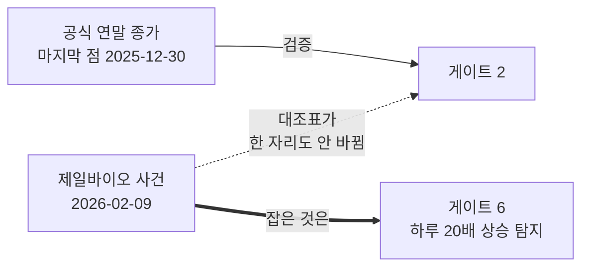

# #52 [작업] 벤치마크 지수를 자체 계산한다 — KOSPI 평균 0.066% 재현, 감자 1건 보정

> 🗂️ 옛 GitHub 이슈를 옮긴 **기록 문서**입니다 — [색인](../README.md). 원문은 그대로 두고, 링크·커밋 해시만 새 자리 기준으로 바꿨습니다.

| 항목 | 내용 |
|---|---|
| 종류 | 이슈 |
| 상태 | 닫힘(완료) · 2026-09-21 14:23 |
| 원 작성 | 이동원(`devlee328288`) · 2026-09-21 09:32 KST |
| 라벨 | `phase-1` |
| 옛 주소 | `github.com/devlee328288/Qurious/issues/52` (지금은 열리지 않음) |

## 본문

전략이 좋은지 나쁜지는 **무엇과 비교하느냐**로 정해진다. 기준선이 없으면 백테스트 결과는 숫자일 뿐 판정이 아니다. 그런데 우리는 **KRX 공식 지수를 쓸 수 없다** — 약관 검토로 소스가 두 곳으로 줄었고([#23](../issues/023.md) · [#33](../issues/033.md)) 거기에 지수 시계열이 없다.

그래서 **가지고 있는 종목별 시세로 지수를 다시 만든다.**

## 1. 무엇을 만드는가

```
price_daily (4,460,710행)  →  benchmark_index (19,776행)
  종목 × 날짜                   시장 × 계열 × 날짜
```

| 축 | 값 |
|---|---|
| 시장 | KOSPI · KOSDAQ · KONEX |
| 계열 | PR · TR · TRN · EW |
| 합계 | 3 × 4 = **12계열** |

> **용어 — PR · TR · TRN · EW**
> - **PR**(Price Return) 가격만 본 수익. 배당 제외
> - **TR**(Total Return) 배당을 재투자했다고 본 수익
> - **TRN**(TR Net) 배당소득세를 뗀 뒤의 TR
> - **EW**(Equal Weight) 시가총액이 아니라 모든 종목에 **똑같이** 투자한 지수
>
> **이 이슈에서는** 전략의 기준선을 말한다.
> **헷갈리는 점**: 뉴스의 "코스피 지수" 는 **PR** 이다. 배당이 빠져 있어, 배당을 받는 전략을 PR 과 비교하면 내 전략이 실제보다 좋아 보인다.

## 2. 검증 — 공식 연말 종가 대조

| 기준일 | 공식 | 재현 | 오차 |
|---|---|---|---|
| 20221229 | 2236.40 | **2236.41** | 0.0004% |
| 6점 평균 | | | **0.066%** 🟢 |
| 6점 최대 | | | 0.166% |

일별 등락률이 소수 **둘째 자리까지** 일치. 2026-07-31 의 +17.91%(역대 최대 상승)도 재현.

🟡 **코스닥은 평균 0.871%** 로 13배 어긋난다 → 별도 이슈로 분리한다.

## 3. 편입 규칙 — 빼는 게 늘 좋지는 않았다

| 규칙 | 코스피 평균 오차 |
|---|---|
| **우선주만 제외** (현행) | **0.066%** 🟢 |
| + 리츠 제외 | 0.167% (2.5배 악화) |
| + 인프라펀드까지 제외 | 0.230% (3.5배 악화) |

KRX 는 **스팩·리츠·인프라펀드를** 코스피에 **넣고 있다.** 뺄수록 단계적으로 멀어진다
([`benchmark.py:1366`](https://github.com/EST-team-project/Qurious/blob/799d2f7/collector/benchmark.py#L1366) 의 1회성 실측).

덤: 리츠·인프라펀드를 가리려면 **종목명 규칙**이 필요했는데 그 필터가 통째로 사라졌다 → '617종목 개명' 함정도 함께 소멸. 이름으로 자산을 분류하는 규칙은 언제 깨질지 모른다.

## 4. 🔴 치명 결함 1건 — 감자가 폭등으로 들어가 있었다

```
제일바이오 052670
  2026-02-06  종가   2,080원   상장주식수 29,129,064
  2026-02-09  종가 625,000원   상장주식수     19,419
                    ↑ 300배        ↑ 1,500 : 1 감자
```

조정계수가 놓쳤다 — **거래정지 중이라 `vs`(기준가)가 0** 이었고, 0 이면 계수가 1.0(조정 없음)이 된다(「아이엠텍 사각지대」).

결과: 코스닥 지수에 **가짜 +3.060%p 영구 각인**.

```
KOSDAQ PR  1261.84  →  1225.78
```

## 5. ⚠️ 힌트를 그대로 믿으면 1,881건이 부서진다

자연스러운 보정 규칙은 「가격비 ρ 가 주식수비 c 와 맞아떨어지면 감자」다. 제일바이오에는 완벽히 맞는다. **전 구간에 돌리면 재앙이다.**

| 빠진 조건 | 부서지는 것 |
|---|---|
| ② 주식수 변화 | **진짜 폭락**. 카프로 −94.9% · 에코바이브 −97.7% 는 c=1.000000 인 실제 등락 |
| ③ 가격제한폭 | **상한·하한가 날** 104건. 에코마이스터 −29.2% → **+7.6%** 로 뒤집힘 |
| ①④ | **유상증자 신주상장 1,881건**. 바른전자 20200113 은 ρ=1.000 · c=38.59 → 하루 **+3,759%** |

유상증자는 **현금을 받고 주식을 찍는 것**이라 시총 증가가 수익이 아니다.

### 네 조건 동시충족으로 좁힌다

```
① cum_factor 가 그날 안 움직였다      (조정을 한 건도 안 걸었다)
② 그런데 주식수는 움직였다             (c ≠ 1)
③ 가격비가 가격제한폭의 두 배 밖이다   (|ρ−1| > 0.60 · 제도상 하루 ±30%)
④ c 를 곱하면 1 에 훨씬 가까워진다     (로그거리 2배 이상 감소)
```

```
    보정 대상 (전 구간 · 전 시장)
    ─────────────────────────────────────────────
    조건 없음        ████████████████████  1,881+건  ← 전부 파괴
    ②만             ███████████████        1,985건
    ②③             ██                       139건
    ②③①④          ▏                          1건  ← 제일바이오만
```

여유도 충분하다 — 제일바이오는 `v·v=24.9 ≤ w=300.5` 로 **12배 여유**, 가장 가까운 탈락자 코스온 20231011(실제 −88%)은 `v·v=75.9 > w=8.2` 로 **9배 모자람**. KOSPI 는 후보 0건이라 한 값도 안 바뀐다.

④ 는 `ln()` 없이 쓴다 — SQLite 3.53.2 에 `ln()` 이 없다(실측). `v=max(ρc,1/ρc)`, `w=max(ρ,1/ρ)`, `s=max(c,1/c)` 로 두면 `v·v ≤ w AND v < s` 가 정확히 같은 말이다.

## 6. 바깥 기준점은 언제나 과거에 있다



**게이트 2(연말 대조)는 이 버그를 못 잡았다.** 여섯 해의 코스피 대조를 통과하면서도 코스닥에 +3.060%p 가 들어 있었다. 검증 기준점은 과거에만 있고, **가장 최근 데이터는 아무도 확인해 주지 않는다.**

그래서 기준점 없이 판정하는 **게이트 6**(하루 20배 넘게 오른 종목이 있는가)을 뒀다. 감자 미흡수는 반드시 *위로* 튀므로 그 방향만 막는다. 아래로 튀는 것은 정리매매의 진짜 −99% 와 구별할 수 없고, 구별하려 들면 **진짜 손실을 지우게 된다.**

**±60% 클리핑을 하지 않는다** — 남는 것은 전부 감자·정리매매·거래재개의 실제 등락이다. 지우면 벤치마크가 실제보다 좋아 보인다. 세기만 한다.

## 7. 코드 재사용 판정

| 출처 | 판정 | 근거 |
|---|---|---|
| `Alpha_Stack` 지수 코드 | 🔴 **없음** | 그쪽에 지수 계산이 없다 |
| `collector/preprocess.py` | 🟢 **입력으로 사용** | `cum_factor`·`adj_clpr` 을 그대로 읽는다 |
| `collector/total_return.py` | 🟢 **입력으로 사용** | TR 계열의 배당 재투자분 |
| 외부 지수 라이브러리 | 🔴 **쓰지 않음** | pykrx·FDR 은 약관으로 배제([#23](../issues/023.md) · [#33](../issues/033.md)) |

`collector/benchmark.py` **1,452줄 신규**. 조정계수를 **직접 다시 계산하지 않고** 기존 산출물을 읽는다 — 단 한 군데 예외가 감자 보정(5절)이다.

## 8. 전후 구조

```
[전]  백테스트 ──?──> (기준선 없음)
                       전략 수익률만 있고 비교 대상이 없다

[후]  백테스트 ────> benchmark_index ──> KOSPI TR 과 ΔSharpe 비교
                       12계열 · 19,776행
```

## 9. 게이트 6개

실패하면 **비영 종료코드**를 낸다 — 전에는 항상 0 이라 CI 가 감지하지 못했다.

## 10. 한계 · 뒤집힐 조건

- 🟡 **이 계열은 KRX 공식 지수가 아니다.** 자체 재현치다. 기준일 레벨 1000.0 은 임의값이다
- 🔴 **코스닥은 코스피와 같은 신뢰도로 쓰면 안 된다** (평균 0.871%)
- 🔴 **원천 표는 아직 오염돼 있다** — 지수만 고쳤다
- ③ 이 0.60 이라 *흡수되지 않은 2:1 액면분할*(ρ=0.5)은 못 잡는다. 현재 0건이나 생기면 규칙 재검토
- 코스피 0.066% 는 **연말 6점** 대조다. 연중 전 구간이 그 정확도라는 뜻은 아니다
