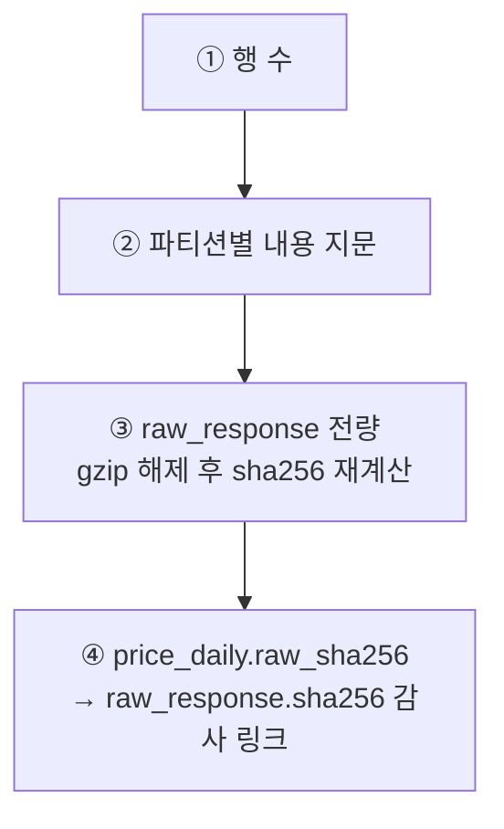

# #53 [작업] HF 백업 경로 — 파케이만으로 SQLite 를 되살린다 (복원 실측 13,428,316행)

> 🗂️ 옛 GitHub 이슈를 옮긴 **기록 문서**입니다 — [색인](../README.md). 원문은 그대로 두고, 링크·커밋 해시만 새 자리 기준으로 바꿨습니다.

| 항목 | 내용 |
|---|---|
| 종류 | 이슈 |
| 상태 | 열림 |
| 원 작성 | 이동원(`devlee328288`) · 2026-09-21 09:33 KST |
| 라벨 | `phase-1` |
| 댓글 | 1건 |
| 옛 주소 | `github.com/devlee328288/Qurious/issues/53` (지금은 열리지 않음) |

## 본문

수집한 자료가 **로컬 SQLite 한 벌뿐**이다. 디스크가 죽으면 포털 하루 10,000건 한도로 1,648 거래일을 처음부터 다시 긁어야 한다. 백업 경로를 연다.

## 1. 무엇을 올리는가

| 표 | 파일 | 용량 | 행수 |
|---|---|---|---|
| `price_daily` | 7 (연도별) | 119.6 MB | 4,460,710 |
| `price_adjusted` | 7 (연도별) | 50.4 MB | 4,460,710 |
| `price_total_return` | 7 (연도별) | 99.8 MB | 4,460,710 |
| `dividend` | 1 | 546.3 KB | 9,188 |
| `corporate_action` | 1 | 107.9 KB | 2,689 |
| `benchmark_index` | 1 | 355.8 KB | 19,776 |
| **`raw_response`** | 2 | **284.8 MB** | 12,697 |
| **`ingest_day`** | 1 | 17.4 KB | 1,836 |
| **합계** | **27** | **555.6 MB** | |

굵은 둘이 이번 설계의 핵심이다.

## 2. 왜 원자료까지 올리는가 — 백업의 완전성

처음 설계는 `raw_response`·`ingest_day` 를 **제외**했다. 파케이로 바꾸면 297.3MB → 298.6MB 로 오히려 커지고, 분석에 쓰이지도 않기 때문이다.

그런데 그러면 백업이 **"부분 사본"** 이 된다.

```
[전]  HF 백업 = 파생물만
      → 로컬을 지우면 감사 근거(raw_response)와
        수집 이력(ingest_day)이 영구 손실
      → 즉 "백업" 이라 부를 수 없다

[후]  HF 백업 = 전부
      → 파케이만으로 SQLite 를 통째로 되살릴 수 있다
      → 로컬 삭제가 비로소 선택지가 된다
```

## 3. 복원 실측 — 행 수만 맞는 사본은 백업이 아니다

```
restore 실측 : 13,428,316행 · 2.2GB · 184.6초
원문 sha256  : 12,697 / 12,697 일치 (gzip 해제 후 재계산)
```

`verify` 는 네 겹으로 본다.



③ 이 있어야 **"로컬을 지워도 된다"** 고 말할 수 있다. ①만 보는 검증은 내용이 깨진 사본을 통과시킨다.

## 4. 약관 — 프레이밍이 무너진 자리

기존 논거는 「`RAW_SHARING` 은 원자료 스위치이고, HF 는 **파생물** 반출이니 다른 문제」였다. **2026-09-20 에 이 구분이 무너졌다** — 원자료를 대상에 넣었기 때문이다.

남는 근거는 하나뿐이다: **저장소가 private 이고 공유 범위가 팀(org `qurious-quant`) 안으로 한정된다.**

팀 결정(코드에 `SHARING_DECISION` 으로 박혀 있다):

- 팀원은 제3자가 아니다 — 같은 프로젝트의 구성원이고 공유 대상은 팀 안으로 한정한다
- 공공누리 '변경금지' 항목은 **학습 용도로 private Organization 안에 두고 공유·회수**하는 방식으로 다룬다
- 그래서 저장소는 **반드시 private** 이어야 한다. 업로드 직전에 원격 공개 범위를 실제로 조회하고 public 이면 멈춘다
- 이것은 학습 프로젝트 범위의 운영 판단이며 **법률 자문이 아니다**

⚠️ **KIS 자료는 한 건도 들어 있지 않다** (DB 실측: `raw_response` 출처별 portal 1,767 · dart 10,930 · **kis 0**). KIS 약관 제5조③(제3자 제공 금지)은 이번 범위 밖이다. KIS 값을 표에 넣게 되면 이 판단을 다시 해야 한다.

⚠️ **저장소를 public 으로 바꾸면 그 순간 원자료 재배포가 된다** 🔴

## 5. 게이트

`QURIOUS_RAW_SHARING` 이 꺼져 있으면 `export`·`upload` 가 **실행되지 않는다.** 2026-09-21 업로드가 실제로 여기서 한 번 멈췄다 — 설계대로다.

**환경변수로만 켜진다. `.env` 에 적어도 켜지지 않는다** (`collector/manifest.py:45` 가 `os.environ` 만 읽는다). 실수로 켜진 채 커밋되는 것을 막는 설계다.

```bash
export QURIOUS_RAW_SHARING=1
PYTHONPATH=. python scripts/hf_dataset.py upload --yes
```

🟡 다만 **막힌 실행이 종료코드 0 으로 끝난다** — "막혔다" 가 아니라 "하지 않았다" 로 취급한다. CI 에서 성공과 구분하려면 출력을 봐야 한다. → 후속 과제.

## 6. hf_xet — 없으면 556MB 를 매번 다시 올린다

| 상태 | 업로드 방식 | 파케이 한 줄 수정 시 |
|---|---|---|
| hf_xet 없음 | LFS | **556MB 전체 재업로드** |
| hf_xet 있음 🟢 | Xet 청크 | 바뀐 블록만 |

`is_xet_available() = True` 확인(2026-09-21). `requirements.txt` 에 `pyarrow`·`huggingface_hub`·`hf_xet` 셋을 넣었다 — **없으면 새로 clone 한 팀원은 백업을 복원조차 못 한다.**

## 7. 아찔했던 것 — 556MB 가 Public 에 들어갈 뻔했다

`data/hf_export/` 가 `.gitignore` 에 없었다. 이 저장소는 **Public** 이다.

> ⚠️ `.gitignore` 의 해당 줄 위가 빈 줄이면 `git check-ignore` 가 **가짜 exit 0** 을 준다.
> 판정은 `git status --short` 로 해야 한다.

## 8. 코드 재사용 판정

| 출처 | 줄수 | 판정 | 근거 |
|---|---|---|---|
| `Alpha_Stack/scripts/upload_to_hf.py` | 890 | 🔴 **쓰지 않음** | 설계가 다르다 |
| `Alpha_Stack/supply/hf_model_data.py` | 278 | 🔴 **쓰지 않음** | 모델 산출물용 |
| `Alpha_Stack/scripts/check_hf_access.py` | 160 | 🔴 **쓰지 않음** | 접근 확인만 |
| `collector/manifest.py` | — | 🟢 **연동** | `RAW_SHARING` 을 게이트로 읽는다 |

`scripts/hf_dataset.py` **2,099줄 신규** (Alpha_Stack 코드 참조 0건). 다른 점: 파케이 연도 파티션 · Xet 청크 중복제거 · **dry-run 이 기본**.

## 9. 한계 · 뒤집힐 조건

- 🔴 **올리기 전에 로컬을 지우지 않는다.** 순서는 `export` → `upload --yes` → `verify` → (원하면) 삭제
- 🟡 파케이가 SQLite 보다 크다(`raw_response` 297.3 → 298.6MB). gzip BLOB 이라 압축 이득이 없다
- 출처 약관이 바뀌거나 저장소 공개 범위가 바뀌면 **4절 판단을 처음부터 다시 한다**
- 종료코드 0 문제(5절)는 이 PR 범위 밖 — 자동화에 붙이기 전에 고쳐야 한다

---

## 댓글 1건

---

<a id="issuecomment-5755714851"></a>

### 💬 1. 이동원(`devlee328288`) · 2026-09-21 14:13 KST

## ✅ 업로드 완료 (2026-09-21) — 그리고 4시간 반을 먹은 버그 하나

**555.6 MB · 32파일 전량 · `private=True` 확인 · 스냅샷 태그 `snapshot-2026-09-21`**

| 표 | 파일 | 용량 |
|---|---|---|
| `price_daily` | 7/7 | 119.6 MB |
| `price_adjusted` | 7/7 | 50.4 MB |
| `price_total_return` | 7/7 | 99.8 MB |
| **`raw_response`** | **2/2** | **284.8 MB** |
| `dividend` · `corporate_action` · `benchmark_index` · `ingest_day` | 각 1/1 | 0.9 MB |
| 기타(README · `.gitattributes` · `meta/*.json` 3) | 5 | — |

`raw_response` 2/2 가 올라갔으므로 **이 이슈 2절의 「백업의 완전성」이 실제로 달성됐습니다.**

---

### 🔴 그런데 처음 실행은 4시간 24분간 아무것도 올리지 못했습니다

원인은 네트워크도 파일 크기도 아니었습니다. **데이터셋 README 의 YAML 머리말 한 줄**입니다.

```yaml
license_name: "공공데이터포털·OpenDART 파생 — 출처별 이용약관 준수"
```

HF 서버는 이 칸을 `/^[a-z0-9-.]+$/` 로 검사합니다 — **소문자·숫자·하이픈·점만.**

```
Failed to commit: Invalid metadata in README.md.
- "license_name" must only contain lowercase characters
Failed to commit 11 files at once. Will retry with less files in next batch.
   ↑ 이 네 줄이 4시간 24분간 반복
```

**그리고 종료코드 0 으로 끝났습니다.** 파일 21/27(221.7MB)에서 멈춘 채로요.

| 무엇이 문제였나 | 왜 발견이 늦었나 |
|---|---|
| YAML `license_name` 에 한글 | 이 칸만 slug 를 요구한다 — `pretty_name` 과 본문은 한글이 된다 |
| `upload_large_folder` 가 **조용히 재시도** | 실패가 화면에 반복되지만 예외를 던지지 않는다 |
| **종료코드 0** | 자동화·CI 에서 성공과 구분되지 않는다 |

고친 뒤 같은 명령이 **11.3초**에 끝났습니다. 커밋 `e82c736`.

- `license_name` → `kogl-type1-and-opendart-derived`
- 이용 조건 설명은 **README 본문으로** (공공누리 제1유형 · OpenDART · 팀 내 학습용)
- 어느 칸이 한글을 받고 어느 칸이 안 받는지 **주석으로 남김**

### ⚠️ 이것은 이 이슈 5절에 이미 적어 둔 문제의 재발입니다

5절에 *「게이트에 막혀 아무것도 올리지 않은 실행이 종료코드 0 을 낸다」* 를 🟡 남은 문제로 적어 두었습니다. **같은 계열이고, 이번엔 그게 4시간을 먹었습니다.** 조용히 재시도하고 0 으로 끝나는 구조 자체는 아직 그대로입니다 — 별도 이슈로 다룰 값이 있습니다.

### 🔴 아직 로컬 SQLite 를 지우지 마십시오

올라간 것은 확인했지만 **이 업로드분에 대해 `verify` 를 돌리지 않았습니다**(원문 sha256 12,697건 재계산). 이 이슈 3절이 못 박은 순서는 `export` → `upload --yes` → **`verify`** → (원하면) 삭제입니다.

덧붙여 스크립트가 스스로 알려준 것 하나 — **매니페스트가 한 박자 늦습니다**: *"방금 올린 매니페스트에는 이 업로드 기록이 아직 없다(기록이 업로드보다 뒤다)"*. 원격 정본 판정은 `status --remote` 로 합니다.
