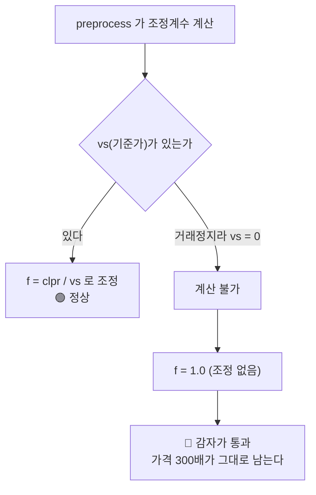

# #55 [결함] 원천 표가 아직 오염돼 있다 — 052670 감자가 adj_clpr·tr_index 에 300배로 남아 있다 ([#52](../issues/052.md) 는 지수만 고쳤다)

> 🗂️ 옛 GitHub 이슈를 옮긴 **기록 문서**입니다 — [색인](../README.md). 원문은 그대로 두고, 링크·커밋 해시만 새 자리 기준으로 바꿨습니다.

| 항목 | 내용 |
|---|---|
| 종류 | 이슈 |
| 상태 | 열림 |
| 원 작성 | 이동원(`devlee328288`) · 2026-09-21 09:36 KST |
| 라벨 | `phase-1` |
| 옛 주소 | `github.com/devlee328288/Qurious/issues/55` (지금은 열리지 않음) |

## 본문

[#52](../issues/052.md) 에서 제일바이오 1,500:1 감자를 **벤치마크 지수에서는** 걷어냈다. 그러나 **원천 표는 그대로 오염돼 있다.** 지수만 고친 것이다.

## 1. 지금 표에 들어 있는 값

```sql
-- price_adjusted
SELECT bas_dt, srtn_cd, adj_clpr, cum_factor
  FROM price_adjusted WHERE srtn_cd='052670' AND bas_dt IN ('20260206','20260209');
```

| 날짜 | `adj_clpr` | 실제 의미 |
|---|---|---|
| 20260206 | 2,080 | 감자 전 종가 |
| 20260209 | **625,000** | 감자 후 종가 — **300.48배** |

```sql
-- price_total_return
```

| 날짜 | `tr_index` |
|---|---|
| 20260206 | 0.5848 |
| 20260209 | **175.71** |

**하루 +29,948%.** 회사 가치는 그대로고 1,500주가 1주로 합쳐졌을 뿐인데, 수정주가 계열이 이를 폭등으로 기록하고 있다.

## 2. 왜 놓쳤나 — 「아이엠텍 사각지대」



`vs` 는 감자 전 종가(2,080)를 기준으로 한 값이라 평소에는 `clpr − vs ≈ 2,080` 으로 사건을 잡아낸다. **그런데 거래정지 중이면 `vs` 가 0 이고**, 0 으로는 나눌 수 없으니 계수가 1.0 이 된다.

구멍은 **"장기 거래정지 + 감자"** 조합에서만 열린다.

> **용어 — 조정계수 (adjustment factor)**
> 분할·감자·권리락처럼 **주가는 변하지만 가치는 안 변하는** 사건이 일어났을 때, 과거 가격을 오늘 기준으로 환산하는 배수.
> **이 이슈에서는** `cum_factor`(누적 조정계수)를 말한다.
> **헷갈리는 점**: 조정계수는 "주가를 고친다" 가 아니라 **"비교 가능하게 만든다"** 이다. 고치지 않으면 감자가 수익으로 계산된다.

## 3. 영향 범위

| 무엇 | 상태 |
|---|---|
| `benchmark_index` | 🟢 **고쳤다** ([#52](../issues/052.md) · 네 조건 동시충족 보정) |
| `price_adjusted.adj_clpr` | 🔴 **오염** |
| `price_adjusted.cum_factor` | 🔴 **오염** |
| `price_total_return.tr_index` | 🔴 **오염** |
| **HF 백업** | 🔴 **이 값이 그대로 실린다** ([#53](../issues/053.md)) |

⚠️ 백테스트가 `price_adjusted` 를 직접 읽으면 **제일바이오를 보유한 전략이 하루에 300배를 번다.**

## 4. 어디를 고쳐야 하나

`collector/preprocess.py` 의 `factors` / `classify`.

```
[전]  vs == 0  →  계수 계산 불가  →  f = 1.0  →  사건 통과 🔴

[후]  vs == 0  →  대체 신호를 본다
                  · 상장주식수 변화 c
                  · 가격비 ρ
                  · #52 의 네 조건과 같은 판정
              →  f = c 로 보정 🟢
```

**[#52](../issues/052.md) 에 이미 판정 로직이 있다.** `collector/benchmark.py` 의 네 조건(①cum_factor 부동 ②주식수 변동 ③|ρ−1|>0.60 ④ρ·c 가 1 에 수렴)을 그대로 쓸 수 있는지 먼저 확인한다.

## 5. 코드 재사용 판정

| 대상 | 판정 | 근거 |
|---|---|---|
| `benchmark.py` 의 네 조건 판정 | 🟡 **이식 후보** | 같은 사건을 같은 근거로 가린다. 다만 지수는 **일별 등락률**에, 전처리는 **누적 계수**에 적용하므로 적용 지점이 다르다 |
| `benchmark.py` 의 게이트 6 | 🟢 **개념 재사용** | "하루 20배 상승" 탐지를 전처리 검증에도 둘 수 있다 |
| `preprocess.py` 의 `vs` 경로 | 🟢 **유지** | 정상 종목에는 잘 동작한다. `vs=0` 분기만 더한다 |

## 6. ⚠️ 주의 — 재계산 범위

`cum_factor` 는 **누적**이다. 한 날을 고치면 그 이후 전부가 바뀐다.

```
052670  … 20260206  f=1.0    ← 여기까지는 그대로
        → 20260209  f=1/1500 ← 여기를 고치면
        → 20260210~ 이후 전 구간 재계산 필요
```

`price_adjusted` · `price_total_return` 을 **해당 종목 전 구간** 다시 만들어야 하고, 그러면 HF 백업도 다시 올려야 한다.

## 7. 확인해야 할 것

- [ ] `vs = 0` 인 종목-일이 전 구간에 몇 건인가 (제일바이오 말고 또 있는가)
- [ ] 그중 상장주식수가 함께 변한 건은 몇 건인가
- [ ] [#52](../issues/052.md) 의 네 조건을 `preprocess` 에 그대로 옮길 수 있는가, 아니면 누적 계수용으로 고쳐야 하는가
- [ ] 고친 뒤 `benchmark` 를 다시 돌리면 코스피 0.066% 가 유지되는가 (**악화되면 보정이 틀린 것이다**)
- [ ] 재계산 후 HF 재업로드 (`hf_xet` 이 켜져 있으니 바뀐 청크만 간다)

## 8. 한계 · 뒤집힐 조건

- 🔴 **거래정지 중 `vs=0` 은 자동 보정이 원리적으로 불가능한 경우가 있다** — 주식수 변화가 없는 진짜 폭락과 구별할 신호가 없을 때
- 🟡 [#52](../issues/052.md) 의 조건 ③(|ρ−1| > 0.60)은 *흡수되지 않은 2:1 액면분할*(ρ=0.5)을 못 잡는다. 현재 0건
- 이 이슈는 **코스닥 재현 오차(별도 이슈)와 무관하다.** 그쪽 가설 2개는 이미 기각됐다
- 🟡 고치는 것이 늘 옳지는 않다 — 정리매매의 진짜 −99% 를 지우면 백테스트가 **실제보다 좋아 보인다.** 위로 튀는 것만 막는다
