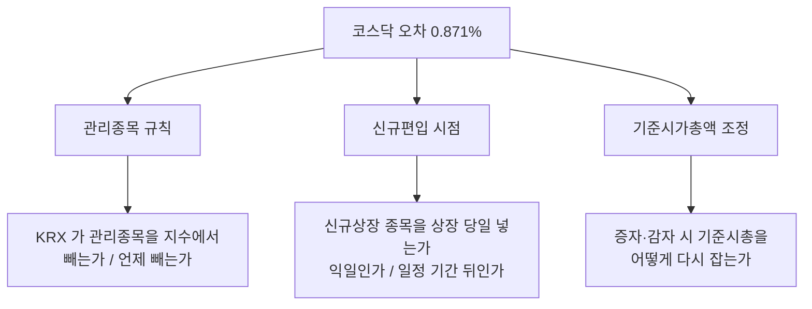

# #56 [결함] 코스닥 재현 오차 평균 0.871% — 코스피의 13배, 가설 2개는 기각됐다

> 🗂️ 옛 GitHub 이슈를 옮긴 **기록 문서**입니다 — [색인](../README.md). 원문은 그대로 두고, 링크·커밋 해시만 새 자리 기준으로 바꿨습니다.

| 항목 | 내용 |
|---|---|
| 종류 | 이슈 |
| 상태 | 열림 |
| 원 작성 | 이동원(`devlee328288`) · 2026-09-21 09:36 KST |
| 라벨 | `phase-1` |
| 옛 주소 | `github.com/devlee328288/Qurious/issues/56` (지금은 열리지 않음) |

## 본문

[#52](../issues/052.md) 에서 벤치마크를 자체 계산했다. **코스피는 맞았고 코스닥은 안 맞는다.**

| 시장 | 평균 오차 | 최대 오차 | 판정 |
|---|---|---|---|
| KOSPI | **0.066%** | 0.166% | 🟢 쓸 만하다 |
| KOSDAQ | **0.871%** | 1.896% | 🔴 **13배** |

```
    공식 연말 종가 대비 오차
    ────────────────────────────────────────
    KOSPI   ▏0.066%
    KOSDAQ  ██████████████ 0.871%   ← 13배
```

⚠️ **제일바이오([#55](../issues/055.md))와는 무관한 별개 결함이다.** 그 건은 이미 고쳤고, 고친 **뒤에** 남은 수치가 위 표다.

## 1. 왜 문제인가

전략을 코스닥 지수와 비교할 때 **연 0.871%가 기준선에서 어긋난다.** 수수료·세금(왕복 약 0.24%)보다 큰 값이라, 이 벤치마크로 판정한 초과수익은 신뢰할 수 없다.

> **용어 — 재현 오차**
> 우리가 다시 만든 지수와 KRX 공식 지수의 차이.
> **이 이슈에서는** 공식 연말 종가 대비 퍼센트 차이를 말한다.
> **헷갈리는 점**: 오차가 작다고 "지수가 맞다" 는 뜻은 아니다. 연말 6점만 대조했고, 연중에 서로 반대 방향으로 어긋났다가 연말에 우연히 만날 수도 있다.

## 2. 기각된 가설 2개

### 가설 A — "상장폐지를 −100% 로 안 쳐서" 🔴 기각

소멸성 폐지 92종목의 **잔존 시가총액이 전체의 0.06%** 다. 전부 −100% 로 처리해도 0.871% 를 만들 수 없다.

```
    필요한 설명력  ████████████████  0.871%
    가설 A 의 최대  ▏              0.06%   ← 14배 모자람
```

### 가설 B — "잔존 이상치 138건" 🔴 기각 (부호가 반대)

누적 기여가 **−1.766%** 다. 우리 지수가 공식보다 **낮게** 나오는 방향이므로, 이걸 제거하면 오차가 **더 커진다.**

| 가설 | 예상 방향 | 실제 | 판정 |
|---|---|---|---|
| A 폐지 미처리 | 우리가 높다 | 0.06% 뿐 | 크기 부족 |
| B 이상치 | 우리가 높다 | **−1.766%** | **부호 반대** |

## 3. 남은 후보 — KRX 의 편입·제외 시점 규칙

코스피와 코스닥의 차이는 **종목 구성의 변동성**이다. 코스닥은 신규상장·관리종목 지정·폐지가 훨씬 잦다.



| 후보 | 왜 의심하나 | 확인 방법 |
|---|---|---|
| **관리종목 처리** | 코스닥에 훨씬 많다. KRX 가 지수에서 빼는지 불명 | 관리종목 지정일 자료가 우리에게 없다 → 먼저 확보해야 한다 |
| **신규편입 시점** | 코스닥 신규상장이 잦다. 상장 당일 편입이면 초기 급등이 지수에 들어간다 | 상장일 기준 ±5일로 넣어 보며 오차 변화를 본다 |
| **기준시총 조정** | 증자가 잦을수록 어긋남이 누적된다 | 증자 당일 시총 점프를 세어 본다 |

## 4. 확인 순서 (비용이 낮은 것부터)

- [ ] **① 오차의 시간 분포를 본다** — 여섯 해에 고르게 퍼져 있나, 특정 해에 몰려 있나. 몰려 있으면 그해에 무슨 제도 변경이 있었는지 찾는다
- [ ] **② 오차의 부호를 본다** — 우리가 늘 높은가 늘 낮은가. 한 방향이면 구조적 규칙 차이, 들쭉날쭉하면 개별 종목 사건
- [ ] **③ 신규편입 시점을 ±5일 흔들어 본다** — 자료 추가 없이 가능하다. 오차가 줄면 원인 확정
- [ ] **④ 상위 기여 종목 20개를 뽑는다** — 특정 종목이 대부분을 설명하면 개별 사건이다
- [ ] ⑤ 관리종목 자료 확보 (①~④ 로 안 풀릴 때만 — 새 소스가 필요해 비용이 크다)

## 5. 코드 재사용 판정

| 대상 | 판정 | 근거 |
|---|---|---|
| `benchmark.py` 의 `verify` | 🟢 **그대로 쓴다** | 이미 시장별 오차를 계산한다. 진단 출력만 늘리면 된다 |
| `benchmark.py` 의 편입 규칙 | 🟡 **여기를 고칠 것** | 현재 "우선주만 제외". 코스닥에 다른 규칙이 필요할 수 있다 |
| 게이트 2(연말 대조) | 🟢 **판정 기준으로 사용** | 고친 뒤 코스피 0.066% 가 유지되는지 확인하는 안전망 |
| 공식 지수 API | 🔴 **없다** | 소스가 두 곳으로 줄었다([#23](../issues/023.md) · [#33](../issues/033.md)). 대조점은 연말 6개뿐 |

## 6. ⚠️ 검증의 한계 — 대조점이 6개뿐이다

```
    2020 ─── 2021 ─── 2022 ─── 2023 ─── 2024 ─── 2025    2026
     ●        ●        ●        ●        ●        ●        ✗
    연말     연말     연말     연말     연말     연말   대조점 없음
```

연중 어디서 어긋나는지 **알 수 없다.** 6점을 맞추는 보정이 연중을 더 망칠 수도 있다. 그래서 4절 ①(시간 분포)이 첫 순서다 — 대조점이 적을수록 **과적합**이 쉽다.

## 7. 한계 · 뒤집힐 조건

- 🔴 **대조점 6개로 규칙을 추정하는 것은 과적합 위험이 크다.** 오차가 줄어도 "맞췄다" 가 아니라 "6점에 맞췄다" 일 수 있다
- 🟡 코스닥 벤치마크는 그때까지 **코스피와 같은 신뢰도로 쓰면 안 된다.** 현재 `status` 가 이 경고를 출력한다
- 🟡 KONEX 는 아예 대조점이 없어 검증되지 않았다
- 가설 A·B 의 기각은 **현재 데이터 기준**이다. [#55](../issues/055.md)(원천 표 오염)를 고치면 이상치 집합이 바뀌므로 B 는 다시 세어야 한다
- 원인이 KRX 내부 규칙이고 공개되지 않았다면, **재현 불가를 인정하고 한계를 명시하는 것**이 답일 수 있다
