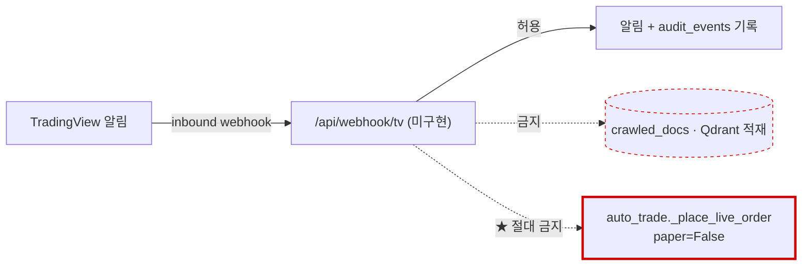

# #61 [분석] 강사님 4일차 요구사항 격차 지도 — 242항목 대조 (있다 29% · 부분 32% · 없다 38%)

> 🗂️ 옛 GitHub 이슈를 옮긴 **기록 문서**입니다 — [색인](../README.md). 원문은 그대로 두고, 링크·커밋 해시만 새 자리 기준으로 바꿨습니다.

| 항목 | 내용 |
|---|---|
| 종류 | 이슈 |
| 상태 | 닫힘(완료) · 2026-09-21 15:07 |
| 원 작성 | 이동원(`devlee328288`) · 2026-09-21 10:37 KST |
| 라벨 | `analysis` |
| 옛 주소 | `github.com/devlee328288/Qurious/issues/61` (지금은 열리지 않음) |

## 본문

> **대조 기준** — 강사님 4일차 자료(`http://localhost/static/days/04.html` · **2026-09-21 09:05 갱신본**)를 직접 읽어 대조했습니다. 강의자료는 **저장소로 복사하지 않았습니다**(커밋 금지 규칙).
> **방법** — 요구 242항목을 8축으로 나눠 **파일을 직접 열어** 판정하고, 각 판정을 **반증 검증**에 넣었습니다. 그 과정에서 **20건이 뒤집혀 정정**됐습니다(7.2절).

## 0. 이 지도를 읽기 전에 — 확정된 팀 결정 6가지

아래 결정이 격차 판정의 **기준**입니다. 특히 1번 때문에 **AWS 14항목의 "없다"는 결함이 아니라 의도**입니다.

| # | 결정 | 날짜 | 근거 |
|---|---|---|---|
| 1 | **AWS 우선 제외** — 로컬·오픈소스로 완성한 뒤 배포 | 09-21 | 비용 보전 방안이 아직 협의 전(요구사항 「유의사항」에 협의 항목으로 명시) · 완성 후 배포해도 무리 없다는 판단. 코드에도 이미 반영돼 있습니다(`app/lib/llm_client.py:11` "AWS 백엔드는 팀 비용 정책에 따라 제거했다 · 2026-09-15") |
| 2 | **팀 4명 구성 완료** | 09-21 | 09-30 마감·10-01 자동 배치는 우리에게 해당 없음. 요구사항의 **4MM(4명 × 1개월)이 정확히 우리 규모**입니다 |
| 3 | 매일 2회 보고(09:00 · 17:30)는 **요청 시 통합 이슈**로 | 09-21 | |
| 4 | **크롤링은 적재까지 한다** | 09-21 | 요구사항 세부2가 「크롤링 및 **적재**」이고, RAG·자료실이 그 문서를 소비합니다 |
| 5 | **HF private + 추가 배포 없음** | 09-21 | 코드가 강제합니다(`_assert_private()` 가 업로드 직전 원격을 조회해 public 이면 중단) |
| 6 | **멀티 DB** — Postgres · Qdrant · Redis · Neo4j | 09-21 | 요구사항 「데이터·지식 저장: RDBMS · VectorDB · Redis」와 대응 |

⚠️ **AWS 도입 여부는 별도 이슈에서 비용과 함께 다룹니다** — 요금제별 월 비용과 "AWS 를 끈 뒤에도 프로젝트가 남는 설계"를 조사 중입니다.

---

# Qurious 2.0 — 강사님 4일차 요구사항 대조 **격차 지도**

> 출처: `C:/Users/kik32/workspace/EST-Camp-AI-Quant/learning/th07-domain-rag-lab/lecture/frontend/days/04.html`
> (= `http://localhost/static/days/04.html` · **오늘 2026-09-21 09:05 갱신본**을 직접 읽어 대조했습니다. 우리 저장소로 복사하지 않았습니다)
> 대상: `C:/Users/kik32/workspace/EST-Camp-AI-Quant/team_project/Qurious` · 브랜치 `fix/kis-fee-observability`
> 방식: 요구 242항목을 8축으로 나눠 **파일을 직접 열어** 판정 → 반증 검증에서 **20건이 뒤집혀 정정**됨(7절 참조)

---

## 1. 한 줄 요약

> **엔진은 있고, 배선·검증·문서가 없습니다.** 기능 요구 179항목 중 "있다"는 67개(37%)지만 그중 상당수가 **강사님 원본(lumina-invest)에서 상속한 코드**이고, 우리가 S30~S39에 직접 만든 것(수집기·요율표·벤치마크)은 **앱 코드가 한 줄도 읽지 않습니다**(`app/`에서 `benchmark_index` 참조 **0건** · 수집 DB 참조 **0건**). 문서·운영 요구 63항목 중 "있다"는 **3개**입니다.

| 구분 | 항목 수 | 🟢 있다 | 🟡 부분 | 🔴 없다 | ⚪ 불명 |
|---|---:|---:|---:|---:|---:|
| P01 로보 어드바이저 (4목표) | 89 | 32 (36%) | 22 | 35 | 0 |
| P02 투자 인디케이터 (5목표) | 90 | 35 (39%) | 29 | 26 | 0 |
| **기능 소계** | **179** | **67 (37%)** | **51 (29%)** | **61 (34%)** | 0 |
| 산출물 10단계 · 팀 운영 | 63 | **3 (5%)** | 27 | 31 | 2 |
| **합계** | **242** | **70 (29%)** | **78 (32%)** | **92 (38%)** | **2** |

핵심 왜곡 셋 — 이 표를 그대로 믿으면 안 되는 이유:

1. **AWS 지정 스택 14항목은 전부 "없다"** 이고, 그것은 실수가 아니라 팀 결정입니다(`app/lib/llm_client.py:11` "AWS 백엔드는 팀 비용 정책에 따라 제거했다 (2026-09-15)").
2. **문서 "있다" 3개 중 과업지시서는 강사님 배포 원문**입니다(`docs/rfp-1.md` ↔ lecture 원본 diff 0줄).
3. **"있다"로 센 기능의 데이터 입구가 Yahoo Finance** 입니다(`app/services/stock.py:9`) — 계획서 v1.1:77이 "쓰지 않습니다"라고 못 박은 소스입니다.

---

## 2. 이미 덮은 것 — S30~S39 산출물 → 요구 항목 대응

**우리가 직접 만든 것**만 골라 요구 문면에 맞춰 붙였습니다.

| 우리 산출물 (S30~S39) | 실측 규모 | 대응하는 강사님 요구 | 확실도 |
|---|---|---|---|
| 수집기 `collector/sources/portal.py` (공공데이터포털 `getStockPriceInfo`) | 시세 **4,460,710행** · 2020-01-02~ · 3시장 3,302종목 | P01-①-세부2 "가격·**거래량** 수집" | 🟢 |
| 원문 gzip+sha256 보관 · `ingest_day` 상태표 | 원문 12,697건 · 최종갱신 2026-09-20T17:08 | P01-①-세부4 "금융정보 **갱신일**·문서 버전" (데이터 쪽) | 🟢 |
| 수정주가 `preprocess.py` | 4,460,710행 · `corporate_action` 2,689 | P01-①-세부2 "**전처리**" | 🟢 |
| 배당 `sources/dart.py` (OpenDART 공시 **본문** 파싱) | **9,188건** (배당기준일·배당락일·DPS) | P01-①-세부2 "전처리" / P01-③-세부3 "**배당금 기반** 리밸런싱"의 **재료** | 🟢 |
| 총수익(TR) 계열 `total_return.py` | 4,460,710행 | P02-④ "성과 검증"의 기준 시계열 | 🟢 |
| 자체 벤치마크 `benchmark.py` | **19,776행 · 12계열**(3시장×PR/TR/TRN/EW) | P02-④-세부2 "성과지표 분석"의 **비교 기준선** | 🔴 **app/ 참조 0건 — 화면에 닿지 않음** |
| 매매비용 요율표 `trading_cost.py` | 연도별 세율 6구간 · 제비용 · 슬리피지 10bps | **P01-④-세부1** "거래비용·슬리피지 반영 수익률·MDD·샤프" | 🟢 |
| ETF·ETN 거래세 면제 배선 (커밋 `a32b085`) | 4경로 · 매도 0.20%p 과대계상 제거 | 같은 항목 — **어제까지 틀린 숫자였음** | 🟢 |
| 체결 대조 `fill_sync.py` (`prsm_tlex_smtl` · `cost_basis`) | 허용오차 1원 · `order_fills` 부분체결 | **요구에 없는 초과 달성** (재현성 근거) | 🟡 앱 호출처 0건, 스크립트 전용 |
| 모의투자 원장 `paper_trading.py` | 비용 차감 정산 · 행 잠금 | P01-④-세부3 "모의 주문 체결 및 포트폴리오 운용" | 🟢 |
| KIS 어댑터 `brokers/kis.py` 5기능 | 시세·잔고·주문·체결·토큰 | P02-⑤-세부1 "증권사 API의 **계좌·시세·주문**" | 🟢 |

**상속받아 이미 갖춰진 것**(우리 공적으로 계상하면 안 되는 것 — `app/services/ta_utils.py`는 lecture 원본과 **바이트 동일**):
`ta_utils.py` 지표 6종 · `quant_pipeline.py` 룩어헤드 방지 백테스트 · LEAN 실행기 3모드 · Qdrant+Ollama RAG · ApexCharts 3인스턴스 · 화면 49개.

> ✅ **요구 문면을 넘어선 곳은 딱 하나** — 거래비용입니다. 강사님은 "반영"만 요구했는데 우리는 **연도별 세율표 + ETF 면제 + 증권사 실제 정산액 대조**까지 있습니다. 발표 차별점은 여기입니다.

---

## 3. 가장 큰 구멍 5개

### 🔴 1위 — 요구를 충족한다고 말할 근거가 **금지된 소스 위에** 서 있다
| | |
|---|---|
| **증거** | `app/services/stock.py:9` `YAHOO_CHART=query2.finance.yahoo.com` → `:56 _yahoo_chart` → `:214 get_candles`. 이 함수를 `routes/ml.py:28,46,76,122` · `routes/quant.py:31,57` · `routes/stocks.py:67,156,771`이 전부 호출. `lean_backtest.py:100`도 Yahoo 직접 호출. 반대로 `app/`에서 수집 DB(`market.sqlite3`) 참조 **0건** |
| **걸린 요구** | P01-②(지표·신호 전부) · P01-③(최적화·스크리닝) · P01-④(성과지표) · P02-①②④(백테스트) — **8축 중 6축** |
| **왜 지금 중요한가** | 지금 상태로 "지표·신호·백테스트 있습니다"라고 보고하면 **팀이 약관 근거로 배제한 소스([#23](../issues/023.md)·[#31](../issues/031.md))에 의존한 결과를 우리 성과로 제출**하게 되고, 나중에 소스를 갈면 그 숫자 전부가 무효가 됩니다. |

### 🔴 2위 — 프로젝트 제목이 "로보 어드바이저"인데 **리밸런싱 3종이 전무**
| | |
|---|---|
| **증거** | 저장소 전체에서 '리밸런싱'은 `public/app.html:1835` 설명 문구와 `docs/` 학습노트뿐. `app/models/trading.py:15-23` Portfolio에 `target_weight`·허용이탈률 칸 없음. 입출금 엔드포인트 없음(`routes/paper.py:41,49` 조회·초기화만). alembic 3판에 리밸런싱 표 없음 |
| **걸린 요구** | **P01 목표기능 ③ 전체**(세부1 시간 기반 · 세부2 이탈률 기반 · 세부3 입출금·배당 기반) + UI/UX 필수 5요소 중 "리밸런싱" |
| **왜 지금 중요한가** | 강사님이 UI/UX 필요 요소에 이름을 박아 둔 5개 중 하나가 화면부터 없고, 자산군 배분은 위험성향 3택 **하드코딩 고정표**(`routes/ml.py:96`)입니다 — 발표에서 "모델"이라 부를 수 없습니다. |

### 🔴 3위 — **시험·성과 검증 단계가 통째로 비어 있다** (1차 미완이 2차에서도 미완)
| | |
|---|---|
| **증거** | `test_*.py`·`conftest.py`·`pytest.ini` **0건**, `requirements.txt`에 pytest 없음, `.github/` 디렉터리 **자체가 없음**. 백테스트 보고서(ΔSharpe·p값) 없음 — 계획서 v1.1:153-168 진척표 ⑪ 주 검정 🔴 미수행 |
| **걸린 요구** | 산출물 9단계 5종 전부 · P02-②-세부2 "**단위 테스트**가 가능한 지표 함수" · P02-④-세부3 "GitHub Actions" · rfp-1.md:35 **필수 산출물** "백테스트/모의투자 성과 보고서" |
| **왜 지금 중요한가** | 1차 발표가 닫히지 않은 이유가 정확히 이것(비용 반영 ΔSharpe 미측정)이고, 2차 주제 선정 이유 ㉯에 우리가 직접 적어 둔 항목입니다. **같은 자리에서 두 번 넘어지는 중**입니다. |

### 🔴 4위 — **TradingView·PineScript 목표기능 전체 미충족** + 생성 코드가 컴파일조차 안 된다
| | |
|---|---|
| **증거** | `public/app.html:3334`가 `indicator(...)`를 생성 → Strategy Tester가 켜지지 않음(`strategy()`·`strategy.entry` grep 0건). `public/app.html:3340`이 `sell_th = input.int(100 - parseInt(buyTh), ...)` — **`${}` 보간 누락**으로 JS 코드가 Pine 출력에 문자열로 박혀 Pine Editor에서 컴파일 실패(같은 함수의 Python 생성기 `:3367`은 `${100 - parseInt(buyTh)}`로 제대로 됨). TradingView 성과를 담는 필드·표·모델 0건 |
| **걸린 요구** | **P02 목표기능 ③ 전체**(세부1 Pine 지표·전략 · 세부2 Strategy Tester→LEAN 교차검증 · 세부3 알림·Webhook) + P02-④-세부3 |
| **왜 지금 중요한가** | 팀 규칙(TradingView 호출 금지)과 **정면으로 부딪히는 유일한 목표기능**이라 가름이 먼저 필요하고(4절), 그 전에 **교차검증 대상이 구조적으로 성립하지 않습니다** — LEAN이 받는 전략은 `lean_backtest.py:35-40` `buy_hold·ma_cross·dca·momentum` 4종 고정인데 Pine 생성기는 `rsi_ma·macd_bb·volume_rsi·triple_ma`를 씁니다. **두 집합이 하나도 겹치지 않습니다.** |

### 🔴 5위 — 위험관리가 **0건인데 실전 주문 경로는 열려 있다**
| | |
|---|---|
| **증거** | `idempot|dedup|loss_limit|max_loss|stop_loss|kill_switch` — `app/` 전체 **0건**. 반면 `app/services/auto_trade.py:187` `get_broker_client(..., paper=False)` — 화면에서 '실전투자(Live)'를 고르면(`public/app.html:1282`) 유일한 차단이 `auto_trade.py:178` `quant_mode != "live"` 한 줄이고 그 값은 DB·화면에서 켜집니다. 10분 주기(`:25`)로 같은 신호가 유지되면 같은 종목을 계속 재매수합니다 |
| **걸린 요구** | P02-⑤-세부2 "중복 주문 방지·손실 한도·비상 정지" · 기술스택 **Redis**(현재 세션·레이트리밋·JWT에만 쓰이고 매매 코드에서 참조 0건) · UI "자동매매 모니터링"의 위험통제 부분 |
| **왜 지금 중요한가** | 요구 미충족이면서 **동시에 사고 위험**입니다. `~/.claude/CLAUDE.md`와 `readme.md:305`가 "실계좌는 승인 후"라고 적었지만 그 규칙이 **스크립트에만 적용되고 앱 경로에는 적용돼 있지 않습니다.** 기능 개발보다 먼저 막아야 합니다. |

**다음 5개(차점)**: ⑥ 수집 446만 행을 **조회·검색할 API·화면 0건**(갱신일도 CLI뿐) ⑦ RAG 응답 `citations` 항상 빈 배열(`langgraph_agent.py:247,275` 확인) ⑧ 분봉·주봉 소비자 0건 → P01-②-세부3의 "**종합**"이 성립 안 함 ⑨ 용어사전 DB·API·화면 전무(텍스트는 두 벌 있음) ⑩ 캔들패턴·지지선·저항선 탐지 코드 0건.

---

## 4. 기존 결정과 부딪히는 항목 — 전부

### 4.1 충돌 지도

| # | 요구사항 | 부딪히는 우리 결정 | 걸린 축 | 가름 |
|---|---|---|---|---|
| A | 지표·신호·백테스트 데이터 | 소스를 공공데이터포털·OpenDART **둘로 축소**([#23](../issues/023.md)·[#31](../issues/031.md)) — 현 코드는 Yahoo·네이버 | 6축 | **코드를 고친다** (결정이 옳고 배선이 밀렸음) |
| B | SageMaker(SHAP·Training·추론) · Bedrock · EventBridge · Batch · Lambda · ECR · API GW · EC2 · CloudWatch — **14항목** | AWS 백엔드 **제거** (`llm_client.py:11` · `main.py:68`, 2026-09-15 비용 정책) | 5축 | **문서로 대체 근거를 쓴다** — 도입은 사용자 결정 사안 |
| C | **TradingView · Pine Script · Strategy Tester · Webhook** | TradingView **호출 금지** | P02-③④ | **4.2에서 세부별로 가름** |
| D | 증권사 실계좌 연동 | 실계좌는 승인 후 · 검증은 `KIS_MOCK_*`만 | P02-⑤ | **코드에 게이트를 박는다**(현재 규칙이 앱에 미적용) |
| E | 10단계 산출물 55종 | 강의자료·교재 **커밋 금지** — `docs/01~05.md`·`rfp-1/2.md`·`onprem.md`·`pipeline.md`가 **추적 중이고 lecture 원본과 diff 0줄** | 산출물축 | **사용자 결정 필요** — 정리할지, 출처 표기로 남길지 |
| F | 4단계 화면 설계 5종(IA·흐름도·와이어프레임·UI명세·프로토타입) | 계획서 §2.2 "**화면을 늘리지 않습니다**"(강사님 "넓게보다 깊게") | 산출물축 | **as-is 기술까지만** — 신규 화면 설계는 하지 않음 |
| G | "R&R을 **주담당·보조담당 2인 이상**으로 배분" | 계획서 §1 팀원 칸이 **1인 1역할**, 그마저 전원 찬성 필요 안건인데 **3/4 미응답** | 팀 운영 | **임의 수정 금지** — 09-27 기한 후 재상정 |
| H | Apache Airflow | 스케줄러가 이미 둘(Celery Beat · FastAPI asyncio 루프) | P01-③ | **Beat로 채우고 Airflow는 대응표에만** |
| I | 분봉 데이터 | KIS 약관 검토 결과 "이 파일로 과거 시세를 백필하지 않는다"(`collector/sources/kis.py:1-17`). 포털은 T+1 일봉만 | P01-② | **주봉은 리샘플로, 분봉은 요구에서 빼거나 무저장 실시간만** |
| J | 브랜치 전략 문서화 | 상위 규칙은 "모든 저장소 main 직커밋, PR 금지" / 이 저장소 실제 운영은 브랜치→PR([#34](../pulls/034.md)~[#50](../pulls/050.md)) | 산출물축 | **이 저장소 정본을 먼저 정한다** |
| K | "출처를 포함한" RAG | `prompts/system.md:16`이 출처 규칙을 적었는데 **이 파일이 어디서도 로드되지 않음**(grep 0건). 실제 프롬프트는 `langgraph_agent.py:53-76` | P01-① | **규칙이 있다고 오판하지 않기** |
| L | 데이터 흐름도·아키텍처 | `readme.md:317`이 스스로 "옛 MongoDB/SQLite 기준이 남아 있다"고 적고, `onprem.md:22`는 bedrock·sagemaker를 "선택 가능"으로, `:26`은 수집을 "Yahoo·KRX KIND"로 적음 | 산출물축 | **이 문서들을 근거로 판정하면 틀린다** |

### 4.2 ★ TradingView·PineScript를 어떻게 가를 것인가 — 네이버 선례 적용 판단

**네이버 선례(2026-09-21 · Issue [#59](../issues/059.md))의 논리 구조를 분해하면:**

```
금지 이유  = 약관상 데이터의 재이용·재배포
타협 지점  = 응답을 우리 표·벡터DB에 "적재하지 않는다"
허용 범위  = 화면에 보여주기만 하는 데모
```

즉 **금지의 대상은 "호출"이 아니라 "데이터를 우리 자산으로 삼는 것"** 입니다. 이 잣대를 P02-③ 세 세부기능에 각각 대면 결과가 **갈립니다.**

| 세부기능 | 데이터가 누구 것인가 | 누가 누구를 호출하는가 | 우리 표에 적재되는 것 | 선례 적용 | 판단 |
|---|---|---|---|---|---|
| **세부1** Pine Script로 지표·전략 구현, 차트에 신호 표시 | TradingView 데이터를 **사용자 브라우저에서 TradingView가** 쓴다 | **호출 없음** — 우리는 코드 **문자열**만 만들어 클립보드에 준다 | 없음 | **선례보다 안전** | 🟢 **즉시 진행** — 규칙 위반 아님 |
| **세부2** Strategy Tester 1차 성과 → LEAN 교차검증 | 성과 **요약 숫자**(수익률·MDD·샤프)는 TradingView 시세가 아니라 **우리 전략의 결과** | 사람이 눈으로 읽어 **손으로 입력** | 요약 숫자 4~6개 (원자료 0행) | **적용됨** (적재 대상이 시세가 아님) | 🟡 **조건부** — ① 시세·봉 데이터 0행 ② 요약 수치만 ③ 출처·수집일 표기 |
| **세부3** 조건 충족 시 알림 + **Webhook**으로 신호 전달 | 페이로드에 TradingView **시세가 실릴 수 있다** | **방향이 반대** — TradingView가 우리 서버를 호출(inbound) | 페이로드 전체가 들어올 위험 | **적용 안 됨** — 성질이 다름 | 🔴 **조건 미충족 시 보류** |

**세부3에만 추가로 걸리는 것 — 규칙 D(실계좌)와 겹칩니다:**



> **권고 결론** — 세부1은 지금 하고, 세부2는 "손 입력 + 원자료 0행" 조건으로 하고, **세부3은 수신 엔드포인트를 만들되 (가) 페이로드 적재 금지 (나) 주문 경로와 코드 수준 분리 (다) 공유 비밀 토큰 인증**을 전제로 합니다. 이 셋을 못 지키면 세부3은 "미구현 + 근거 문서"로 남기는 편이 규칙과 맞습니다.
>
> ⚠️ **다만 이 논쟁보다 먼저 고칠 것이 있습니다** — 세부2의 교차검증은 지금 **대상이 없어서** 불가능합니다(LEAN 4전략 ↔ Pine 4전략 교집합 0). 그리고 Pine 코드는 `:3340` 보간 버그로 **붙여넣어도 컴파일되지 않습니다**. 이 버그는 lecture 원본 `public/app.html:3338`에 이미 있는 **상속 버그**입니다 — 우리가 만든 것이 아니지만 우리가 고쳐야 합니다.

---

## 5. 일정 판단 — 계획서 「기간」 칸을 어떻게 채우는가

### 5.1 세 가지 고정점

| 고정점 | 원문 근거 | 우리 상태 |
|---|---|---|
| **2차 시작 09-27(일)** | 계획서 v1.1:73 (확정) | 🟢 |
| **9월 30일까지 팀 구성** | 04.html "9월 30일까지 팀을 구성하는데" | 🔴 **역할표 3/4 미응답 · 기한 09-27** |
| **10월 1일 잔여 인력 자동 배치** | 같은 줄 "인원수 모자른 팀에 자동 배치" | 🟡 우리 4명이 유지되면 무관, 이탈 시 편입 대상 |
| **AI 기반 4MM = 4명 × 1개월** | 04.html "개발 인력 산정 및 AI 기반 수행안" | 🔴 계획서에 인력 산정 언급 **0건** |

### 5.2 종료일 후보 3안

| 안 | 종료일 | 근거 | 판단 |
|---|---|---|---|
| ㉠ **4MM 액면** | **10-26(월)** | 09-27 + 1개월. 강사님이 스스로 제시한 공수 기준 | 🟢 **권고** — 강사님 문서에 근거가 있는 유일한 안 |
| ㉡ 1차 선례 2주 | 10-11(토) | 1차 09-01~09-15 | 🟡 추정. 4MM과 모순(2주면 2MM) |
| ㉢ 미정 유지 | — | 현재 상태 | 🔴 **가장 나쁘다** — 종료일이 없으면 WBS·간트·완료보고 시점이 전부 못 정해지고, 산출물 3단계가 통째로 막힙니다 |

### 5.3 권고 문안 — 계획서 v1.2 「기간」 칸 (복붙용)

```markdown
| **기간** | **2026-09-27(일) ~ 2026-10-26(월) · 4주** 🟡 잠정 |
강사님 4일차 자료의 **AI 기반 수행안 4MM(4명 × 1개월)** 을 그대로 역산한 값입니다
(learning/th07-.../days/04.html "개발 인력 산정 및 AI 기반 수행안").
🔴 **발표일·모의투자 기간은 아직 못 여쭸습니다**(#1 5절) — 확인되면 이 칸을 🟢 로 올립니다.
참고로 1차는 2주(09-01~09-15)였고 그대로면 10-11 경이지만, 그것은 2MM 이라
강사님 4MM 기준과 맞지 않아 본표에는 4주를 적습니다.
⚠️ **09-30 팀 구성 마감 · 10-01 잔여 인력 자동 배치** 가 이 기간 안에 있습니다 — 7절 일정표에 리스크로 올렸습니다 |
```

### 5.4 함께 넣어야 할 것

1. **09-30 마감 역산 — 사흘 남았습니다.** 역할표(D0 [#6](../discussions/006.md) ⑤)가 전원 찬성 안건인데 3/4이고 기한이 **09-27**입니다. 기한을 지나 미응답이면 **09-29까지 팀장 잠정 확정 → 09-30 보고**로 처리해야 합니다. 그대로 두면 09-30을 넘겨 자동 배치 판단 대상이 됩니다.
2. **10-01 자동 배치는 위협이 아니라 기회일 수 있습니다.** 강사님이 요구한 "**R&R 주담당·보조담당 2인 이상**"(충돌 G)은 현 4명 1인 1역할로는 구조적으로 불가능합니다. 인원이 늘면 이 요구가 저절로 풀립니다 — 자동 배치를 리스크로만 적지 말고 **보조담당 배치 시나리오**를 함께 적습니다.
3. **4MM 전제가 이미 깨져 있을 가능성.** `docs/TIL/README.md:88-90`에 팀원 3명 TIL **0편**, 논의 응답 2/4~3/4입니다. 실투입이 4MM이 아니라 **1~1.5MM**이면 6절 우선순위표의 P2 이하는 기간 안에 들어가지 않습니다. 기간 칸에 종료일과 함께 **"실투입 가정"**을 적어야 정직합니다.
4. **주 단위 마일스톤 4개**로 쪼갭니다(현 §7 일정표는 09-27 이후가 비어 있음): W1 배선·게이트 / W2 리밸런싱·위험관리 / W3 성과 보고서·테스트 / W4 문서·발표.

---

## 6. 우선순위표 — 지금부터 착수 순서

`재사용` = 이미 있는 것을 잇거나 노출 · `신규` = 새로 만듦 · `결정` = 코드가 아니라 사용자·팀 판단

### P0 — 오늘~2일 (사고 방지 · 되돌리기 비용이 계속 커지는 것)

| # | 할 일 | 성격 | 근거·자리 | 덮는 요구 |
|---|---|---|---|---|
| 0-1 | **실전 주문 경로 이중 게이트** — 환경변수 승인 없으면 `paper=True` 강제 | 신규(작음) | `auto_trade.py:187` 한 줄 + 설정 1개 | (요구 아님 · 규칙 D) |
| 0-2 | 강사님 원본 문서(`docs/01~05.md`·`rfp-*.md`·`onprem.md`·`pipeline.md`) 처리 방침 | **결정** | git ls-files 추적 중, lecture와 diff 0줄 | 충돌 E |
| 0-3 | 네이버 크롤러 **적재 호출 실제 제거**([#59](../issues/059.md)는 설계만, 코드는 아직 적재) | 재사용(삭제) | `crawl.py:270-271` | 충돌 A |
| 0-4 | TradingView 3세부 가름 확정(4.2 표를 팀에 올림) | **결정** | — | 충돌 C |

### P1 — 첫 주 (있는 것을 이어서 요구 충족률이 가장 크게 오르는 구간)

| # | 할 일 | 성격 | 자리 | 덮는 요구 |
|---|---|---|---|---|
| 1-1 | **`get_candles` → 수집 DB(`price_adjusted`) 어댑터** ★ | **재사용(배선)** | `stock.py:214` 한 함수 교체 → 호출자 11곳이 따라옴 | **6축 동시** |
| 1-2 | 수집 자료 조회 API + **갱신일 화면** | 재사용(노출) | `ingest_day`·`manifest.py`가 이미 있음 | P01-①-세부2·4 |
| 1-3 | **`citations` 배선 2곳** | 재사용(2줄) | `langgraph_agent.py:275` 반환 + `app.html:3944-3974` 렌더 | P01-①-세부3 **핵심** |
| 1-4 | `cost` 인자 3경로 배선 + **LEAN 수수료 모델** + **샤프 정의 통일** | 재사용 | `quant.py:36,59` / `lean_backtest.py` `set_brokerage_model` 추가 / `ta_utils.py`로 통일 | P01-④-세부1 · P02-④-세부1 "**동일 수수료**" |
| 1-5 | 주문 미리보기 비용 + 화면 비용 내역 표시 | 재사용 | `paper_trading.py:185-206` · `paper.js:90-107` | P01-④-세부3 |
| 1-6 | `benchmark_index` → 성과 화면 연결 (초과수익) | 재사용(배선) | 19,776행이 이미 있음 | P02-④-세부2 |

### P2 — 2~3주 (새로 만들지만 재료가 있는 것)

| # | 할 일 | 성격 | 재료 | 덮는 요구 |
|---|---|---|---|---|
| 2-1 | **리밸런싱 3종** + 목표비중·이탈률 칸 + 리밸런싱 화면 | **신규**(재료 있음) | 현재비중 `paper_trading.py:143` · 배당 9,188건 · `apply_cash` | **P01-③ 전체** |
| 2-2 | **위험관리 3종**(중복주문 키·손실한도·킬스위치) | **신규**(자리 있음) | `redis_cache.py:78-93 incr/exists/expire` · `auto_trade.py:367-376 pnl_pct` | P02-⑤-세부2 |
| 2-3 | **pytest + GitHub Actions** (순수함수 `ta_utils`부터) | 신규 | `verify_*.py` 4개의 기대값을 케이스로 승격 | P02-②-세부2 · 산출물 9단계 |
| 2-4 | Pine `strategy()` 전환 + **`:3340` 보간 버그** + `alertcondition` | 재사용(수정) | `app.html:3317-3390` 생성기 | P02-③-세부1·2·3 |
| 2-5 | LEAN 전략 집합 ↔ Pine 전략 집합 **일치시키기** | 신규 | 둘 다 있는데 교집합 0 | P02-③-세부2 전제 |
| 2-6 | **비용 차감 성과 보고서**(ΔSharpe·p값·워크포워드) ★주 지표 | 신규 | 1-1·1-4 완료 후에만 유효 | rfp-1 필수 산출물 |
| 2-7 | 주봉 리샘플 + 신호·신뢰도 **DB 테이블** | 신규 | 일봉 446만 행 · alembic 패턴 | P01-②-세부3 |

### P3 — 마지막 주 (문서·발표)

| # | 할 일 | 성격 |
|---|---|---|
| 3-1 | 산출물 2·3·4단계 최소 세트(요구사항정의서·WBS·간트·as-is IA) | 신규 |
| 3-2 | ERD·테이블 명세서 **기계 생성** (`collector/db.py` + alembic 3판) | 재사용 |
| 3-3 | ADR 번호 부여 — 내용은 이미 ADR 수준(`collector/README.md:106-121,276-297,298-367,483-491`) | 재사용 |
| 3-4 | **AWS 대응표 문서** (요구 14항목 ↔ 우리 대체물 + 제거 근거) | 신규(문서) |
| 3-5 | 용어사전 테이블·API·화면 (텍스트 52+38항목 이미 있음) | 재사용→승격 |
| 3-6 | 결함대장(산문 6건 → 표) · 팀 운영 규칙 **제안** 초안 | 재사용 |

> **가장 값싼 승리 4개**를 따로 뽑으면: `citations` 2줄 · `cost` 인자 3줄 · 갱신일 화면 1장 · `benchmark_index` 배선. 네 개가 **P01-①-세부3, P01-④-세부1, P01-①-세부4, P02-④-세부2**를 각각 '없다/부분' → '있다'로 올립니다.

---

## 7. 정직한 한계

### 7.1 확인하지 못한 것 (unverifiable)

| 항목 | 어디까지 확인했나 |
|---|---|
| **GPU** (P01-①-세부3 지정 스택) | 저장소 안 GPU 배선 0건은 확정. 그러나 Ollama가 컴포즈 밖 외부 호스트(`config.py:26`)라 **실행 호스트 GPU 유무는 저장소만으로 판정 불가** |
| Celery 컨테이너가 정본 SQLite를 갱신하는가 | 코드·compose 정합으로는 "빈 named volume을 채운다"가 확정적(`docker-compose.yml:136-137` vs `collector/config.py:31-37` 하드코딩). **실제로 띄워 파일 생성까지는 확인 안 함** |
| HF 스냅샷 태그 | 태그를 **만드는 코드**(`scripts/hf_dataset.py:1959-2011`)까지. 원격 상태 미조회 |
| LEAN이 끝까지 돌아 `summary.json`을 남기는가 | 코드 3경로 + 이미지(`quantconnect/lean:latest` 42.5GB) 확인. `data/lean-workflows` 없고 캡처도 없어 **성공 산출물 미확인** |
| KIS **모의** 주문 실제 체결 · **실전** 요율 | TR·URL 배선만. 실전은 **예수금 0원**으로 미측정 (규칙상 실계좌 미호출) |
| KB증권 OAuth 실동작 | 코드만. 키 없어 미호출 |
| GitHub Issues·Discussions·PR 리뷰 기록 | 로컬 git으로 머지 14건 확인. **gh 활성 계정이 팀 계정(devlee328288)인지 확인하지 않아 조회하지 않음** → 백로그·리뷰 기록은 **⚪ 불명** |
| 09:00 스크럼 · 17:30 보고 실제 이행 | 문서화 부재만 확정(40개 키워드 grep 0건) |
| 화면 실동작 | **HTML·JS 정적 확인만.** 브라우저를 띄워 클릭하지 않음 → 모든 `[UI]` 판정은 "소스에 요소·배선이 있다" 수준 |

### 7.2 판정이 틀렸을 수 있는 지점

1. **반증 검증에서 20건이 뒤집혔습니다** (8축 correction_count 합계). 뒤집힌 방향은 대체로 **1차 판정이 관대했던 쪽**입니다 — 예: 인프라 구성도·배포 구성도·장애 대응 절차서가 "있다"→"부분"(강사님 Lumina 문서였음), 체결 대조가 "대조 구조가 있다"까지로 축소(앱 호출처 0건), ECR "부분"→"없다". **남은 222건에도 같은 비율(약 8%)의 오판이 있을 수 있습니다.**
2. **"있다"를 우리 공적으로 읽으면 과대평가입니다.** Qurious 자체가 lumina-invest 원본의 사본입니다 — `public/app.html:6` `<title>Lumina Invest…`가 원본과 같고, `ta_utils.py`는 원본과 **바이트 동일**하며, `docker-compose.yml`·`start.sh`도 diff 0줄입니다. 발표에서 이걸 우리 산출물로 계상하면 재현성 평가에서 역효과입니다.
3. **줄번호 일부가 대략치**입니다(예: `routes/stocks.py:147-191` signals). 기능 판정에는 영향 없으나 인용 시 재확인이 필요합니다.
4. **요구 원문 해석 한 곳** — 과제 지시의 "3차 필수 요구사항"을 04.html의 **P02 세 번째 목표기능(트레이딩뷰 플랫폼)**으로 읽었습니다. "3차 프로젝트"를 뜻한다면 4.2의 시급성 판단이 달라집니다.
5. **요구사항 원문이 오늘 09:05에 갱신됐습니다.** 어제 기준 판정이 이미 한 번 밀렸다는 뜻이고, 발표 전까지 또 바뀔 수 있습니다 — 이 격차 지도에 **대조 기준 시각**을 함께 적어 두었습니다.
6. **"부분" 판정의 경계가 주관적입니다.** 규칙 4(API만 있고 화면 없으면 부분)를 엄격히 적용했지만, 같은 논리를 더 밀면 "있다" 중에도 화면이 결과를 버리는 것들(백테스트 수익곡선 `cum_returns` 미차트화, `confidence` 값 미표시)이 "부분"으로 내려갑니다.
