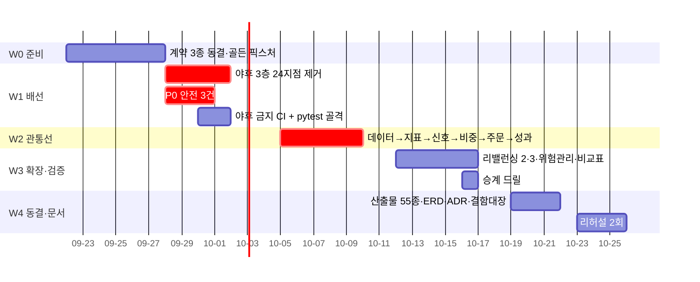

# #62 [작업] 강사님 요구 29개 → 4파트 역할 분배안 v1.0 (심사 4안 중 합성 · Assignee 비움)

> 🗂️ 옛 GitHub 이슈를 옮긴 **기록 문서**입니다 — [색인](../README.md). 원문은 그대로 두고, 링크·커밋 해시만 새 자리 기준으로 바꿨습니다.

| 항목 | 내용 |
|---|---|
| 종류 | 이슈 |
| 상태 | 열림 |
| 원 작성 | 이동원(`devlee328288`) · 2026-09-21 11:02 KST |
| 라벨 | `analysis` |
| 댓글 | 1건 |
| 옛 주소 | `github.com/devlee328288/Qurious/issues/62` (지금은 열리지 않음) |

## 본문

> **⚠️ 이 문서는 제안입니다.** Assignee 를 비워 뒀습니다. 기존 A안([D0 #6 ⑤](../discussions/006.md))에 근거가 있는 배정만 이름을 적었고, A안에 주인이 없던 영역은 전부 `팀 결정` 으로 남겼습니다.
> **만든 방법** — 서로 다른 원칙으로 분배안 4개를 설계하고, 각각을 5기준(요구 커버리지·병목 처리·2인 규칙·부하 균형·실현성) 50점으로 채점한 뒤 1위 안에 나머지 안의 장점을 접목했습니다.
> **2026-09-21 갱신** — **PR 머지 필수 승인자를 두지 않기로** 결정했습니다(작업 시간대가 달라 머지가 멈춥니다). §5.0 이 그 결정과 대체 장치이고, 규칙 2·3·4 를 그에 맞게 고쳤습니다.

| 순위 | 안 | 총점 | 이 안에서 가져온 것 |
|---|---|---|---|
| 1 | **㉢ 이탈 내구성안** | **40** | 보조담당을 **지명하지 않고 도출**하는 소비자 우선 규칙 · W2 말 관통선 = 발표 가능선 · 골든 픽스처 W0 커밋 |
| 2 | ㉠ 기존 역할 최대 존중안 | 37 | 병렬화 조건을 「어댑터 완성」이 아니라 **「계약+픽스처 공개」**로 · 병목 작업의 **성공 판정을 본인이 하지 않는다** · 축소 순서 사전 고정 |
| 3 | ㉡ 병목 우선 해소안 | 35 | 계약을 먼저 **얼린다** · 변형 플래그를 측정에서 도출 · 보조담당 의무 3개로 좁히기 |
| 4 | ㉣ 학습·평가 균형안 | 34 | 보조담당 = **그 파트의 블랙박스 테스트를 쓰는 사람** · 야후 참조 금지 **grep 게이트** · 승계 드릴 1일 |

---

# 🧭 강사님 요구 27개(실 열거 29개) → 4파트 역할 분배안 v1.0

> **⚠️ Assignee 는 비워 둡니다.** 기존 A안(D0 [#6](../discussions/006.md) ⑤)에 근거가 있는 배정만 이름을 적었고, A안에 주인이 없는 영역은 전부 `팀 결정` 으로 남겼습니다. 이 문서는 **제안**이며, 09-27 역할표 찬반 마감 결과에 따라 확정됩니다.

---

## 1. 쉬운 요약 3줄

1. **지금 우리 앱은 우리가 모은 데이터를 한 줄도 쓰지 않고, 우리가 "안 쓴다"고 정한 외부 소스(Yahoo Finance)로 돌아갑니다.** 그래서 첫 주는 새 기능을 만들지 않고 **데이터 배관을 우리 것으로 갈아 끼우는 일**만 합니다 — 이게 안 끝나면 그 뒤에 만드는 수익률·샤프 숫자가 전부 무효입니다.
2. **기존 역할표(A안)는 그대로 쓰고**, 거기에 강사님 요구 29개를 하나씩 붙였습니다. 사람을 옮긴 곳은 없고, A안에 주인이 없던 영역(주문·보안·배포)만 새 파트로 떼어 **주 단위 당번**으로 돌립니다.
3. **강사님이 요구한 "한 역할당 2인 이상"은 사람을 더 뽑을 수 없으니 규칙으로 채웁니다** — "그 파트 산출물을 제일 먼저 쓰는 파트의 담당이 자동으로 보조담당"이 되고, 그 사람이 **모든 PR의 필수 리뷰어 + 그 파트 테스트 1개를 직접 작성**합니다. 말이 아니라 PR 기록으로 증빙됩니다.

---

## 2. 왜 지금 역할을 다시 보는가

### 2.1 A안을 **폐기하는 게 아니라 잇습니다**

D0 [#6](../discussions/006.md) ⑤ A안("1차 역할을 이어 2.0 영역을 붙인다")은 이 문서의 **출발점**입니다. 아래 표에서 사람 이름이 적힌 칸은 **전부 A안 문구에서 그대로 따온 것**이고, 새 영역으로 사람을 옮긴 곳은 **한 곳도 없습니다.**

| A안 담당 영역 (원문) | 이 문서의 파트 | 이동 여부 |
|---|---|---|
| 이동원 — 데이터 수집·저장·정제 · 모의투자 원장 · 문서·ADR | **P-A 데이터 관문** | 이동 없음 |
| 강민석 — 비용 차감 검증 엔진 · 성과 보고 · 화면 | **P-D 비용·성과·교차검증** | 이동 없음 |
| 오준영 — 자산배분·스크리닝 모델 · 선정 규칙 | **P-C 배분·리밸런싱** | 이동 없음 |
| 신장환 — 커스텀 인디케이터·PineScript · look-ahead 계약 | **P-B 지표·패턴·신호·Pine** | 이동 없음 |
| *(해당 없음)* | **P-E 안전·실행·운영** | **A안에 주인이 없는 영역** |

🟡 **다만 A안 자체가 아직 확정이 아닙니다.** 전원 명시 찬성이 필요한 안건인데 현재 **3/4**이고 기한이 **09-27**입니다. 그래서 이 문서는 **요구사항을 사람이 아니라 파트 단위로 배정**했습니다 — A안이 확정되지 않아도 파트 구조와 규칙은 그대로 살아남습니다.

### 2.2 다시 보는 이유 세 가지

**① 강사님 요구가 세부 단위로 구체화됐습니다.** PROJECT 01 목표기능 4개(세부 14개) + PROJECT 02 목표기능 5개(세부 13~15개). A안은 "영역"으로만 적혀 있어서 **어느 세부기능이 누구 것인지 판정할 수 없습니다.** 산출물 10단계 55종을 만들려면 이 매핑이 먼저 있어야 합니다.

**② A안 네 칸에 안 붙는 영역이 실재합니다.** 팀이 명시해 둔 대로 **실행 환경 · 보안 · 브로커 · 주문 · 알림 · 인프라**가 "그때그때 정한다"로 남아 있습니다. 그런데 강사님 요구 **P02-⑤(증권사 연동 자동화) 세부 3개 전부**와 **P01-④-세부3(모의 주문 체결)**이 여기에 걸립니다. 즉 **요구 4개가 주인 없는 영역에 떠 있습니다.**

**③ 격차 진단([#61](../issues/061.md))이 A안에 없던 요구 4종을 드러냈습니다.** RAG 근거문서(P01-①-3) · 용어사전(①-1) · XAI(①-5) · 캔들패턴 인식(②-1,2) — 이 넷은 A안 어느 칸의 문구에도 없습니다. 아래 §3에서 **"그 파트 코드가 이미 만지고 있다"는 근거를 붙여서만** 배정했습니다.

### 2.3 그리고 근거를 정직하게 갈라 둡니다 🟢

`docs/rfp-2.md` §3.2는 데이터 소스로 *"KRX, Yahoo Finance, FinanceDataReader 등 공개 데이터 활용"*을 **허용합니다.** 즉 Yahoo 를 쓰는 것 자체가 강사님 요구 위반은 아닙니다. 배제는 우리가 약관 검토([#23](../issues/023.md)·[#31](../issues/031.md))로 **스스로 좁힌 기준**입니다.

따라서 배선 작업의 진짜 근거는 **"요구 충족"이 아니라 이것**입니다 — **우리가 모은 446만 행이 앱에서 한 번도 쓰이지 않습니다.** 우리 최대 자산이 발표에서 증명되지 않는 상태라는 것이 이 작업의 근거이고, 발표에서도 이렇게 말해야 합니다. (반대로 `rfp-2.md` §4.2는 *"실제 증권 계좌를 통한 실거래 자동 주문 실행"*을 **제외 범위로 명시**합니다 → 아래 P0 항목은 위험 항목이기 **전에 요구사항 위반**입니다.)

---

## 3. 요구사항 → 파트 대응표

### 3.0 먼저 개수를 맞춥니다 🟡

강사님 문서 머리글은 **P01 세부 14개 + P02 세부 13개 = 27개**인데, **열거된 항목을 세면 P02 가 ①~⑤ 각 3개씩 15개**라 합계 **29개**입니다.

- 이 표는 **열거된 29개 전부**를 배정했습니다 (누락보다 과배정이 안전).
- 🔴 **확인 필요**: P02 에서 어느 2개가 원문상 묶인 것인지. 개수가 틀리면 **산출물 대장과 시험 단계 항목 번호가 전부 어긋납니다.** → §9 결정 항목 1번.

### 3.1 PROJECT 01 — 로보 어드바이저 (세부 14개)

| # | 요구 세부기능 | 주담당 파트 | 보조 | 이미 있는 자산 | 새로 만들 것 |
|---|---|---|---|---|---|
| ①-1 | 용어사전·연관개념 탐색 | **P-A** | P-B | Neo4j·Qdrant 가동 중 | 용어 DB·API·화면 (시드 50항목) — 현재 전무 |
| ①-2 | 가격·거래량·재무·뉴스 수집·분류·전처리·검색(적재) | **P-A** | P-B | 수집기 시세 446만행·배당 9,188·수정주가·TR·벤치 12계열 | 조회 API·검색 엔드포인트·뉴스 분류 (조회 API 0건) |
| ①-3 | 근거문서·출처 포함 RAG 질의응답 | **P-A** | P-B | Qdrant+Ollama 체인 | `citations` 실제 채우기 2곳 (`langgraph_agent.py:247,275` 항상 `[]`) |
| ①-4 | 갱신일·문서버전·캘린더·정기배치 | **P-A** | P-B | Celery Beat · `ingest_day` 1,836행 | 갱신일 화면 · 문서버전 필드 |
| ①-5 | XAI 로 추천 이유를 쉬운 말로 설명 | **P-D** | P-A | 성과 계산 경로 | 규칙 기반 설명 템플릿 + 화면 (근거: "쉬운 말"은 성과 보고의 표현 계층) |
| ②-1 | MA·RSI·MACD·볼린저·거래량 지표 | **P-B** | P-C | `ta_utils` 6종 — ⚠️ **원본과 바이트 동일** | 계약 입력 순수함수화 + 단위테스트 (우리 공적으로 계상 금지) |
| ②-2 | 캔들패턴·지지·저항·돌파·골든크로스 탐지 | **P-B** | P-C | 없음 (탐지 0건) | **전부 신규** |
| ②-3 | 분·일·주봉 종합 → 신호 + **신뢰도** | **P-B** | P-C | 분봉·주봉 수집은 됨 (소비자 0건) | 리샘플 · 멀티TF 종합 · 신뢰도 테이블 |
| ③-1 | **시간 기반** 리밸런싱 (월·분기·연) | **P-C** | P-D | 없음 | **전부 신규** — `app/`·`public/` 에 `rebalanc` **0건**(실측) |
| ③-2 | **이탈률 기반** 리밸런싱 | **P-C** | P-D | 없음 | **전부 신규** — `target_weight`·`drift_tolerance` 칸 자체가 없음 |
| ③-3 | **입출금·배당금 기반** 리밸런싱 | **P-C** | P-D | `dividend` 9,188건 | 입출금 엔드포인트(없음) · 배당 재투자 경로 |
| ④-1 | 거래비용·슬리피지 반영 수익률·MDD·샤프 | **P-D** | P-A | 연도별 요율표 · ETF 면제 배선 완료 | `cost` 인자 3경로 배선 · **샤프 정의 통일**(현재 4개 공존) |
| ④-2 | 신호 → 매수·매도·보유 **의견** 변환 | **P-C** | P-D | 신호 일부 | 의견 변환 규칙 테이블 |
| ④-3 | 모의 주문 체결·포트폴리오 운용 | **P-E** | P-A | 모의투자 원장 · KIS 어댑터 5기능 | ⚠️ **체결가 소스 교체** (`paper_trading.py:168,568` 이 야후 직접 사용) + 운용 로그 |

### 3.2 PROJECT 02 — 인디케이터·자동화 (열거 15개)

| # | 요구 세부기능 | 주담당 파트 | 보조 | 이미 있는 자산 | 새로 만들 것 |
|---|---|---|---|---|---|
| ①-1 | 기본 인디케이터 지표계산 | **P-B** | P-C | `ta_utils` 6종 | 계약 입력 전환 |
| ①-2 | 조건조합·손절·익절·**포지션크기** | **P-B** | P-D | 없음 | 전부 신규 — 🟡 포지션크기는 P-C 경계, D1 계약회의에서 가름 |
| ①-3 | 백테스트로 기준전략 선정 | **P-D** | P-B | LEAN 실행기 3모드 | 선정 하네스 · 기준표 |
| ②-1 | 커스텀 인디케이터 정규화 산식 | **P-B** | P-C | 없음 | 전부 신규 |
| ②-2 | **미래데이터 참조 방지**·실시간갱신·**단위테스트** ★ | **P-B** | P-D | 없음 — `test_*.py` **0개**(실측) | 전부 신규. **3차 채점 항목이라 이 파트의 1순위** |
| ②-3 | 인디케이터 API 제공·버전 저장 | **P-B** | P-A | FastAPI 라우트 구조 | 버전 테이블 · API |
| ③-1 | Pine 지표·전략 구현 | **P-B** | P-D | 생성기 있음 (단 `indicator()`) | `strategy()` 전환 + `app.html:3340` 보간 버그 (현재 컴파일 실패) |
| ③-2 | Strategy Tester → LEAN 교차검증 | **P-D** | P-B | LEAN 실행기 | **전략집합 교집합 0 → 최소 2종** + 대조표 |
| ③-3 | 알림·Webhook | **P-B** | P-E | 없음 | 앱 내부 알림까지만 — **수신부는 보류** (§3.3) |
| ④-1 | 동일 데이터·기간·**수수료** 조건 ★ | **P-A**(데이터·기간) + **P-D**(수수료) | 상호 | 수집DB · 요율표 | ⚠️ **`lean_backtest.py:100` 야후 직호출 제거** — 이게 3층이라 §6 참조 |
| ④-2 | 누적수익률·MDD·샤프·승률 | **P-D** | P-C | LEAN 리포트 | 승률 산출 · 정의 통일 |
| ④-3 | TradingView vs LEAN 비교 | **P-D** | P-B | 없음 | 대조표 1장 |
| ⑤-1 | 신호 → 계좌·시세·주문 | **P-E** | P-D | KIS 어댑터 5기능 | 배선 |
| ⑤-2 | **중복주문 방지·손실한도·비상정지** ★ | **P-E** | P-A | 없음 — `idempot\|dedup\|loss_limit\|kill_switch` **0건** | **전부 신규. 사고 방지라 W1 D1** |
| ⑤-3 | 실행일정·배포·로그·장애알림 | **P-E** | 당번 | Celery Beat · docker-compose · 멀티DB | 절차서 · 장애알림. **AWS 는 대응표 문서로 갈음** |

### 3.3 UI/UX 필수 10요소

| 프로젝트 | 요소 | 주담당 파트 | 근거 |
|---|---|---|---|
| P01 | 투자성향진단 | **P-C** | 진단 결과가 곧 목표비중 입력 |
| P01 | 시각적 포트폴리오 | **P-C** | 비중 산출 주체 |
| P01 | 시뮬레이션 | **P-D** | 성과 계산 경로 |
| P01 | 목표수익률 모의 | **P-C** | 배분 목적함수 |
| P01 | 리밸런싱 | **P-C** | 규칙 3종 주담당 |
| P02 | **전략 설정** | **P-B** | 조건조합·손절익절 파라미터의 입력 화면 (심사에서 지적된 누락 칸 — 보완) |
| P02 | 지표 차트 | **P-B** | 지표 산출 주체 |
| P02 | 백테스트 | **P-D** | LEAN·하네스 주담당 |
| P02 | 성과 대시보드 | **P-D** | 성과 보고 |
| P02 | 자동매매 모니터링 | **P-E** | 실행·안전 |

> 화면 49개 뷰가 이미 있으므로 **새 화면보다 "우리 데이터로 다시 그려진 화면"이 산출물**입니다. 모든 화면 상단에 P-A 가 제공하는 **출처·수집일·행수 배너 공통 컴포넌트**를 박습니다.

### 3.4 못 붙인 것 — 이유와 함께

| 항목 | 왜 안 붙였는가 | 처리 |
|---|---|---|
| **AWS 클라우드 배포** (P02-⑤-3 의 '배포') | 팀이 AWS 우선 제외를 결정했고, `rfp-2.md` §4.2 도 상용 배포를 제외 범위로 둠 — **두 근거가 같은 방향** | 로컬 `docker-compose` 로 대체 + W4 에 **"AWS 대응표"**(옮기면 무엇이 어디로 가는가) 제출. 🟡 이 갈음이 인정 안 되면 결손 |
| **실계좌 실주문 실행** | 배정 대상이 아니라 **차단 대상.** `rfp-2.md` §4.2 명시 제외인데 `auto_trade.py:187` 이 `paper=False` 를 넘김 | P0 이중게이트로 막는다 (§6·§7) |
| **TradingView Webhook 수신부** (P02-③-3 절반) | 방향이 반대(TradingView → 우리)라 페이로드에 시세가 실릴 수 있음 → 약관 가름이 🔴 **보류** | 설계 문서 + 비활성 코드까지만. 가름이 🟢 로 바뀌면 W3 에 P-B 정식 항목으로 승격 |
| **강의자료 커밋 처리** (`docs/01~05.md`·`rfp-1.md`·`rfp-2.md`·`onprem.md`·`pipeline.md`) | lecture 원본과 diff 0줄이고 커밋 금지 규칙과 부딪힘. **지울지/출처 표기로 남길지는 사용자 결정 사안** | 역할 분배로 처리할 성질이 아님. 결정 후 P-A 가 집행 |
| **환율·원자재 일부** (`macro.py:15,88`) | 벤치마크 12계열로 덮이지 않는 계열은 **수집기에 소스가 없다** → 어느 파트도 못 메움 | 소스 확보 리서치 결과 대기. 그때까지 화면에서 출처 명시 |
| **산출물 55종 중 사람 손이 필요한 문서** | 인원이 1~4명 사이로 안 정해진 상태에서 55를 4로 나누면 어느 시나리오에도 안 맞음 | 3분류로 나눔 → **기계생성**(ERD·API 스펙·커버리지·결함대장) / **관통선 부산물**(화면·데이터·인터페이스 설계서) / **사람이 써야 함**(착수·요구사항·일정). 마지막 묶음만 §8 판정 후 배정 |
| **타 팀과의 Merge** (강사님 유의사항) | 우리가 배정할 수 있는 작업이 아님 | 판단 시점만 **G3(10-18)** 로 못 박음 |

---

## 4. 파트별 상세

### P-A — 데이터 관문 (수집DB·출처·정기배치·RAG 근거)

| | |
|---|---|
| **주담당** | 이동원 — A안 *"데이터 수집·저장·정제 · 문서·ADR"* 을 그대로 이음 (이동 없음) |
| **보조** | P-B 담당 (소비자 우선 규칙 → §5) |
| **덮는 요구** | P01-①-1,2,3,4 / P02-④-1(데이터·기간) / 전 화면 출처 배너 |
| **첫 주** | W0 에 `MarketCandles` 계약 동결 + **골든 픽스처**(3종목×2년 parquet + 기대값 CSV) 커밋 → W1 에 야후 관문 **3층 24지점** 순차 제거 + 회귀 방지 테스트 |
| **의존** | **없음.** 5파트 중 유일하게 선행 의존이 없다 → 여기서 시작한다 |
| **발표에서 보여줄 것** | 아무 차트를 눌러도 **"출처·수집일·행수·해시"** 배너가 우리 수집DB(446만 행)를 가리키는 화면 + `grep` 결과 0건 캡처 |
| **면접 한 문장** | "앱이 쓰던 외부 시세 경로 24곳을 우리가 직접 적재한 446만 행 DB로 갈아 끼우고, 되돌아오지 않게 CI 회귀 테스트로 잠갔습니다." |

### P-B — 지표·패턴·신호·커스텀 인디케이터·PineScript

| | |
|---|---|
| **주담당** | 신장환 — A안 *"커스텀 인디케이터·PineScript · look-ahead 계약"* 과 완전 일치 |
| **보조** | P-C 담당 |
| **덮는 요구** | P01-②-1,2,3 / P02-①-1,2 · ②-1,2,3 · ③-1,3 / UI 전략설정·지표차트 |
| **첫 주** | **구현보다 테스트가 먼저인 유일한 파트** — 픽스처로 look-ahead 계약 테스트 12케이스. 병행해 Pine `indicator()`→`strategy()` 전환 + `app.html:3340` 보간 버그 |
| **의존** | P-A 계약만. **어댑터 완성은 안 기다린다** (픽스처로 코딩 → W2 월 실데이터 스위치) |
| **발표에서 보여줄 것** | **일부러 미래 봉을 먹인 테스트가 빨갛게 떨어지는 화면.** 지표 6종은 원본 바이트 동일이라 "검증 대상"으로만 쓰고 공적으로 계상하지 않는다 |
| **면접 한 문장** | "지표가 미래 데이터를 훔쳐보지 않는다는 것을 주장이 아니라 실패하는 테스트로 증명했습니다." |

### P-C — 자산배분·스크리닝·리밸런싱·투자의견

| | |
|---|---|
| **주담당** | 오준영 — A안 *"자산배분·스크리닝 모델 · 선정 규칙"*. 🟢 **리밸런싱 3종은 선정 규칙을 시간축·이탈률축·현금흐름축으로 확장한 것**이라 새 영역 이동이 아님 (근거 명시) |
| **보조** | P-D 담당 |
| **덮는 요구** | P01-③-1,2,3 · ④-2 / UI 4요소 |
| **첫 주** | **코드보다 스키마가 먼저.** `target_weight`·`drift_tolerance`·`cash_flow` 세 칸이 DB 에 아예 없다 → alembic 리비전 1개 + 입출금 POST 스텁까지. 로직은 W2 관통선에서 시간 기반 1종만 |
| **의존** | 스키마·화면은 **무의존**(실측: `rebalanc` 0건 → 처음부터 만든다). 배당 연결은 P-A 3층 이후 |
| **발표에서 보여줄 것** | 같은 포트폴리오에 세 규칙을 각각 걸었을 때 **거래 시점·회전율·비용이 달라지는 비교 화면** — 위험성향 3택 하드코딩표 대체의 증거 |
| **면접 한 문장** | "리밸런싱을 세 축(달력·이탈폭·현금흐름)으로 나눠 구현하고, 같은 포트폴리오에서 회전율과 비용이 어떻게 갈리는지 수치로 비교했습니다." |

### P-D — 비용차감 검증·성과·LEAN 교차검증·XAI·대시보드

| | |
|---|---|
| **주담당** | 강민석 — A안 *"비용 차감 검증 엔진 · 성과 보고 · 화면"*. 🟢 XAI 는 *"추천 이유를 쉬운 말로"* 이므로 **성과 보고의 표현 계층**으로 보고 이 파트에 둠 (근거 명시) |
| **보조** | P-A 담당 |
| **덮는 요구** | P01-④-1 · ①-5 / P02-①-3 · ③-2 · ④-1(수수료),2,3 / UI 3요소 |
| **첫 주** | **샤프 정의를 문서 1장으로 못 박는 일부터.** 실측으로 4개가 공존한다 — `ml.py:132` rf=0 / `lean_backtest.py:402` rf=0.02 하드코딩 / `ta_utils` rf 인자 없음. 이어서 `cost` 인자 3경로 + LEAN 수수료 모델 + 주문 미리보기 비용 |
| **의존** | P-A(데이터·기간) + P-B(전략집합) + P-C(비중·거래내역). 단 위 3건은 데이터 무관 → W1 병행 |
| **발표에서 보여줄 것** | **비용 전/후 두 열이 나란히 선 성과표 + ΔSharpe + p값.** 1차가 끝내지 못한 바로 그 항목이라 "2차에서 무엇이 나아졌는가"의 답 |
| **면접 한 문장** | "수수료·세금·슬리피지를 빼면 샤프가 얼마나 내려가는지, 그 차이가 우연이 아니라는 것까지 p값으로 제시했습니다." |

### P-E — 안전·실행·운영 **(A안 공백 영역)**

| | |
|---|---|
| **주담당** | 🔴 **팀 결정.** A안에 근거가 없는 영역(팀이 "그때그때 정한다"로 남겨 둠). **단 P0 실전주문 이중게이트만 팀장이 임시 대행** — 근거: 주문 경로가 `auto_trade.py` → `paper_trading.py` 로 붙어 있고 모의투자 원장이 A안에서 팀장 담당이므로 **새 영역 배정이 아니라 기존 담당 영역의 경계 안** |
| **보조** | **주 단위 순환 당번 1인** (매주 월 스크럼에서 지명 · 4주간 4명이 1주씩) |
| **덮는 요구** | P01-④-3 / P02-⑤-1,2,3 · ③-3(보조) / UI 자동매매 모니터링 |
| **첫 주** | D1 에 이중게이트부터: ① 환경변수 `QURIOUS_ALLOW_LIVE=0` 기본값 ② DB `quant_mode` **와** 환경변수가 **둘 다** live 여야 실주문 경로 실행(AND 조건) ③ `app.html:1282` 실전 옵션 비활성 + 사유 툴팁. 이어 중복주문 방지(신호 해시 + 유니크 제약) |
| **의존** | **없음.** 데이터·지표와 완전히 무관 → 09-28 당일 착수. 오히려 **다른 모든 작업의 선행 조건**(사고가 나면 프로젝트가 멈춘다) |
| **발표에서 보여줄 것** | **비상정지 버튼을 눌러 주문 루프가 멈추는 시연** + 같은 신호를 두 번 먹여도 주문이 하나만 나가는 로그. 실측상 현재 차단은 `auto_trade.py:178` 한 줄뿐이라 **산출물 전부가 신규** |
| **면접 한 문장** | "자동매매에 중복주문 방지·손실한도·비상정지 세 겹을 넣고, 실계좌로 가는 길은 환경변수와 DB 플래그가 동시에 켜져야만 열리게 잠갔습니다." |

> **P-E 만 순환제로 둔 이유는 분량이 아니라 위험입니다.** 한 사람에게 묶으면 그 사람이 빠질 때 **안전장치가 무주공산**이 되고, 나머지 3주는 유휴가 됩니다. 순환이면 전원이 최소 1주는 손을 대므로 "2인 이상"도 자동 충족됩니다.
> 🟡 반대 위험도 적어 둡니다 — 순환제는 **아무도 깊이 모르는 영역**을 만들 수 있습니다. 하필 실전 주문·비상정지가 거기라는 게 불편해서, **P0 이중게이트만 팀장 고정**으로 빼 두었습니다.

---

## 5. ★ "주담당·보조담당 2인 이상"을 어떻게 지키는가

> 강사님 유의사항 첫 줄: *"각 R&R 은 한 사람이 독점하지 않고 주담당·보조담당 2인 이상으로 배분한다"*

**4명이 5파트를 맡으므로 1인1역할로는 구조적으로 불가능합니다.** 사람을 새로 지명하지 않고 **규칙으로 보조담당을 도출**합니다.

### 5.0 ⛔ PR 머지 **필수 승인자는 두지 않습니다** (2026-09-21 결정)

> **근거(사용자 결정)**: *"PR merge 필수 승인자는 두지 않겠습니다. 그 이유는 작업의 속도가 달라지기 때문입니다 — 머지하려면 상시 그 사람이 있어야 되는데 **작업 시간대가 다르기** 때문!"*

타당합니다. 그리고 지금 팀 실태가 그 판단을 뒷받침합니다 — 논의 응답이 **14세션 연속 0건**입니다. 필수 승인자를 두면 **2인 규칙을 형식적으로 지키는 대가로 머지가 멈춥니다.**

**그래서 원칙을 하나 세웁니다.**

> **사람의 대기를 만드는 장치는 쓰지 않습니다. 사람을 막던 자리는 기계가 대신합니다.**

| 무엇이 막는가 | 시간대 의존 | 채택 |
|---|:--:|---|
| 사람의 승인 클릭 | 🔴 있다 — 상대가 깨어 있어야 한다 | ❌ **버립니다** |
| **CI 게이트**(pytest · 야후 참조 금지 grep) | 🟢 없다 — 기계는 자는 시간이 없다 | ✅ **이것이 승인을 대신합니다** |
| **테스트 1개 직접 작성** | 🟢 없다 — 언제 써도 된다 | ✅ 유지 (증빙의 핵심) |
| **사후 리뷰 코멘트** | 🟢 없다 — 머지를 막지 않는다 | ✅ 유지 |
| 이탈 시 인수 | 🟢 없다 | ✅ 유지 |

즉 **품질 문턱은 낮추지 않고 대기만 없앱니다.** 머지를 막을 자격은 사람이 아니라 **초록/빨강이 명확한 자동 검사**에만 줍니다.

⚠️ 대신 조건이 붙습니다 — **CI 가 실제로 있어야 이 설계가 성립합니다.** 지금 `pytest` 0건 · `.github/` 디렉터리 자체가 없으므로(격차 3), **W1 에 최소 CI 잡을 세우는 일이 선택이 아니라 전제**가 됩니다. §7 에서 W1 로 올렸습니다.

### 규칙 1 — 소비자 우선 규칙 (보조담당을 "지명"하지 않고 "도출"한다)

> **어떤 파트의 보조담당은 그 파트 산출물을 가장 먼저 쓰는 파트의 담당이다.**

```
     [P-A 데이터] ──캔들 계약──▶ [P-B 지표] ──신호 테이블──▶ [P-C 배분]
          ▲                                                      │
          │                                                   비중·거래내역
      성과표·ADR                                                 │
          │                                                      ▼
     [P-D 성과] ◀──────────────────────────────────────────────────┘

     [P-E 안전] ← 주 단위 순환 당번 (4주 × 1인 = 전원 1주씩)
```

| 파트 | 주담당 | **보조담당(자동 도출)** | 도출 근거 |
|---|---|---|---|
| P-A 데이터 | 이동원 | **P-B 담당** | 캔들 계약의 첫 소비자가 지표 파트 |
| P-B 지표 | 신장환 | **P-C 담당** | 신호 테이블의 첫 소비자가 배분 파트 |
| P-C 배분 | 오준영 | **P-D 담당** | 비중·거래내역의 첫 소비자가 성과 파트 |
| P-D 성과 | 강민석 | **P-A 담당** | 성과표의 첫 소비자가 문서·발표 자료 |
| P-E 안전 | 팀 결정 | **주 순환 당번** | 주담당 1 + 경험자 3 |

**임의 짝짓기보다 나은 이유 세 가지**
1. 보조가 그 코드를 읽을 **실제 동기**가 있다 — 자기 파트의 입력이다.
2. 이탈 시 **인수 학습비용이 최소**다.
3. 파트 경계의 계약(DTO·테이블 스키마)이 **항상 두 눈을 통과**한다.

결과적으로 **4명 × (주 1 + 보 1) = 8칸 = 4파트 × 2인.** 남는 칸도, 3인이 몰리는 칸도 없습니다.

### 규칙 2 — 보조담당의 의무를 셋으로 **좁게** 못 박는다

넓게 두면 부하가 2배가 되고, 안 두면 서류상 이름만 남습니다.

| 의무 | 무엇을 하는가 | 이게 동시에 닫는 것 |
|---|---|---|
| ~~① **필수 승인자** — 그 파트의 모든 PR 을 승인한다~~ | ❌ **두지 않습니다** (2026-09-21 결정 · 아래 5.0) | — |
| ①' **사후 리뷰 (비차단)** | 머지를 **막지 않고**, 보조담당이 나중에 그 PR 에 리뷰 코멘트를 남긴다. 기한은 **다음 스크럼까지** | "2인 이상"의 증빙이 **PR 코멘트 기록**으로 축적 |
| ② **테스트 1개 직접 작성** ★ | 그 파트 pytest 를 최소 1개 쓴다. **내부 구현을 읽지 않는 블랙박스(입출력 계약)로 제한** | 격차 3(pytest 0건) · P02-②-3(단위테스트) · 산출물 9단계(시험) |
| ③ **최소 제출선 인수** | 주담당 이탈 시 그 파트 floor 를 인수한다 | 강사님 *"이탈 시 남은 팀원이 대체"* |

②가 핵심입니다 — **"서로 리뷰한다"가 말이 아니라 커밋으로 남습니다.** 주담당이 쓴 코드를 보조가 검증하므로 독점이 실질적으로 깨집니다.

그리고 ① 을 뺀 뒤에도 증빙은 남습니다. **오히려 더 정직해집니다** — 승인 클릭은 읽지 않고도 누를 수 있지만, **테스트는 읽지 않으면 쓸 수 없습니다.**

### 규칙 3 — **병목 작업의 성공 판정을 본인이 하지 않는다**

P-A 의 어댑터 교체는 성과 숫자를 바꿉니다. 그래서 `shadow` 대조표(구 경로 vs 신 경로를 나란히 찍은 차이표)를 **산출물로 못 박고, 그 표의 검수는 P-D(성과·비용)가** 합니다. 병목 작업의 자기채점을 구조적으로 막는 장치입니다.

🟢 **이것은 머지를 막지 않습니다** (5.0 과 충돌하지 않음). 검수는 **"배선 완료"를 선언할 수 있는 조건**일 뿐이고, 코드는 그 전에 머지됩니다. 즉 **작업은 안 멈추고, 선언만 두 사람을 거칩니다.**

### 규칙 4 — 사후 리뷰가 밀릴 때 (안전판을 팀장 밖에 둔다)

5.0 에서 승인 차단을 없앴으므로 **리뷰 대기로 작업이 멈추는 일은 이제 구조적으로 없습니다.** 남는 문제는 "증빙이 안 쌓이는 것" 하나입니다.

- 사후 리뷰가 **3근무일** 안에 없으면 → **링 다음 순서의 담당이 대리 리뷰**하고 사유를 결함대장에 적습니다.
- 팀장이 아닙니다 — 안전판이 전부 팀장에서 끝나면 팀장이 곧 단일 장애점입니다. 팀장 대리는 링이 **2노드 이하로 접힌 뒤에만** 발동합니다.
- 🔴 그래도 증빙이 비면 **그 사실을 숨기지 않고** 결함대장과 주간보고에 적습니다. "2인 규칙을 지켰다"고 적는 것보다 "지키지 못한 주가 있었고 이유는 이것" 이 평가에서 낫습니다.

> **리뷰가 밀리는 것**보다 **작업이 멈추는 것**이 나쁩니다. 그래서 막는 쪽을 없앴습니다.

### 규칙 5 — 승계 드릴 1일 (W3 10-16 금)

보조가 하루 동안 주담당 자리에서 **실제 커밋 1개**를 냅니다. *"이탈 시 대체"*를 문서가 아니라 **훈련으로 증명**하고, 실제 승계 비용을 미리 잽니다. 계약(인터페이스)이 이미 동결돼 있어 승계 비용이 낮다는 것이 전제입니다.

### 🔴 1인 시나리오에서의 정직한 한계

팀장 단독이 되면 이 요구는 **어떤 설계로도 충족할 수 없습니다.** 그때 할 일은 규칙을 우회하는 것이 아니라 **강사님 유의사항이 이미 명시한 경로 — 타 팀과의 Merge 협의를 먼저 요청하는 것**입니다. 판단 시점을 **G3(10-18)** 로 미리 정해 둡니다. 그 이후에 Merge 를 논의하면 남은 8일로는 합쳐진 팀이 발표를 만들 수 없습니다.

---

## 6. ★ 병목 — `get_candles` 배선을 누가 언제

### 6.1 먼저 [#61](../issues/061.md) 의 수치를 실측으로 정정합니다 🟢 (2026-09-21 이 저장소 직접 측정)

> [#61](../issues/061.md) 의 *"`get_candles` 한 함수를 바꾸면 호출자 11곳이 따라온다"* 는 **절반만 맞습니다.** 야후 의존은 **3층 · 24지점**입니다.

```
┌─ 1층 ── get_candles() 호출  14곳 ────────────────── ✅ 한 함수 교체로 따라온다
│   ml.py 6 (28·46·76·122·278·295) · stocks.py 3 (67·156·771)
│   quant.py 2 (31·57) · paper_trading.py 1 (168)
│   stock.py 1 (315) · sync_scheduler.py 1 (174)
│
├─ 2층 ── _yahoo_chart() 직접 호출  5곳 ─────────────── ❌ get_candles 를 우회한다
│   macro.py:15 · macro.py:88 · paper_trading.py:568
│   sync_scheduler.py:97 · stock.py:72
│
└─ 3층 ── 함수를 아예 안 거치는 독립 URL  5곳 ─────────── ❌ 별도 작업
    stocks.py:107 (종목검색) · data_cache.py:19 (헬스프로브)
    lean_backtest.py:100 (LEAN 시세) ★ · stock.py:104 (crumb) · stock.py:149 (quoteSummary)
```

**이 정정이 배분을 바꿉니다.** 특히 **`lean_backtest.py:100` 이 LEAN 백테스트용 시세를 야후에서 직접 내려받습니다** — 즉 **P02-④-세부1 "동일 데이터·기간·수수료 조건"이 1층이 아니라 3층에 걸려 있습니다.** 1층만 고치고 "배선 끝"이라 보고하면 **성과검증 축 전체가 여전히 배제 소스로 돌아갑니다.**

부수로 확인된 두 가지도 배분에 걸립니다:
- `paper_trading.py:168,568` → **모의 체결가가 배제 소스 값**이다 → P01-④-3 이 배선 전에는 통째로 무효
- `sync_scheduler.py:97,174` → **정기배치가 배제 소스를 긁고 있다** → P01-①-4 도 같이 걸림

### 6.2 계약의 핵심 칸 — **변형 플래그** 🟢

수집DB 실측에서 `price_daily` · `price_adjusted` · `price_total_return` 이 **행수가 똑같이 4,460,710** 입니다. 즉 **어느 변형을 줄 것인지 플래그가 없으면 어댑터를 만들 수 없습니다.** 이것은 추측이 아니라 측정에서 나온 설계 제약이고, `MarketCandles` 계약의 필수 칸입니다.

### 6.3 누가 — **P-A 주담당, 검수는 P-D**

수집DB 스키마·조정계수(vs 기준)·배당기준일 예외·TR 분할 규칙을 만든 사람이 어댑터를 쓰는 것이 가장 빠릅니다. 단 **성공 판정은 본인이 하지 않습니다**(§5 규칙 3).

**3층은 소비자가 각자 옮깁니다** — `lean_backtest.py` → P-D · `paper_trading.py:568` → P-E · `macro.py` → P-A. 3층을 한 명에게 몰면 그것이 새 병목이 되고, 나누면 각 파트가 자기 데이터 경로를 직접 이해하게 되어 이탈 내구성이 올라갑니다.

### 6.4 어떻게 — 3단계

1. `app/services/market_source.py` 에 `MarketSource` 프로토콜 + 수집DB 구현체를 두고 **`get_candles` 의 내부만** 교체 → **시그니처 `(symbol, period, interval) -> dict` 유지 → 호출부 14곳 한 줄도 수정하지 않는다.** 그래서 이 작업이 며칠에 끝난다.
2. 2·3층을 같은 프로토콜로 흡수. 야후 경로는 **삭제하지 않고** `QURIOUS_ALLOW_YAHOO=0` 기본 차단 + 옵트인으로 남긴다 (삭제하면 어댑터 버그 시 되돌아갈 곳이 없다).
3. 회귀 방지 — `tests/test_no_yahoo.py` 가 `app/` 전체를 grep 해 야후 문자열이 허용 목록 밖에 있으면 실패. **이걸 GitHub Actions 최소 잡에 넣고, 초록이 되기 전에는 W2 신규 기능에 착수하지 않는다.**

### 6.5 첫 3일 시간표 — 시간 단위

> 매일 **09:00~09:15 스크럼** / **17:30~17:50 진행·리스크·명일계획 보고** (강사님 유의사항 그대로)

**D1 · 09-28(월)**

| 시각 | P-A 데이터 | P-B 지표·Pine | P-C 배분 | P-D 성과 | P-E 안전 |
|---|---|---|---|---|---|
| 09:00 | 스크럼 — **계약 3종 15분 리뷰로 승인** (`MarketCandles`·`SignalRow`·`CostSpec`) | 참석 | 참석 | 참석 | 참석 |
| 09:30~12:00 | **골든 픽스처 커밋**(3종목×2년 parquet + 기대값 CSV) + 계약 검증 스크립트 | `app.html:3340` 보간 버그 수정 | 리밸런싱 3종 스펙 1장 | 샤프 정의 문서 착수 | **P0 이중게이트 PR**(90분) |
| 13:00~17:00 | 1층 어댑터 본체 착수 (변형 플래그 포함) | Pine `indicator()`→`strategy()` 전환 | DB 칸 설계 (`target_weight`·`drift_tolerance`·`cash_flow`) | `cost` 인자 3경로 조사 | 호출자 14곳 목록화 + pytest 골격 |
| 17:30 | 보고 — 픽스처 pull 확인 (전원) | | | | |

**D2 · 09-29(화)**

| 시각 | P-A | P-B | P-C | P-D | P-E |
|---|---|---|---|---|---|
| 오전 | 1층 어댑터 완성 + 대조 테스트 | 픽스처로 look-ahead 테스트 12케이스 | alembic 리비전 작성 | **★ 3층 `lean_backtest.py:100` 이관 착수** | 중복주문 방지 설계 |
| 오후 | 2층 5곳 (`macro`·`stock.py:72` 등) | `ta_utils` 계약 입력 순수함수화 | 목표비중 입력 화면 | LEAN 수수료 모델 인자 | 신호 해시 + 유니크 제약 |
| **17:30 게이트** | **어댑터가 픽스처 대조 테스트를 통과했는가?** ❌ 면 D3 에 P-C 담당이 배선 합류(3인 투입) · P-C 는 W2 로 하루 밀린다 | | | | |

> 🟢 **`lean_backtest.py:100` 을 D2 에 앞당긴 이유**: 여기는 LEAN 이 요구하는 데이터 포맷 변환이 끼어 **단순 치환이 아닙니다.** 가장 어려운 것을 가장 먼저 두지 않으면 밀렸을 때 G1 이 깨지고, 그러면 §7 의 핵심 전제(W2 말 발표 가능선)가 W3 로 밀립니다.

**D3 · 09-30(수)**

| 시각 | P-A | P-B | P-C | P-D | P-E |
|---|---|---|---|---|---|
| 오전 | 3층 잔여(`stocks.py:107`·`data_cache.py:19`·`stock.py:104,149`) | 캔들패턴 탐지 착수 | 입출금 엔드포인트 스텁 | `lean_backtest` 이관 완료 + **shadow 대조표 검수** | 손실한도 파라미터 |
| 오후 | `tests/test_no_yahoo.py` + `.github/workflows` 최소 잡 · `pipeline.md:74` 문서 모순 수정 | Strategy Tester 실행 확인 | 이탈률 계산 함수 | 주문 미리보기 비용 | 비상정지 엔드포인트 |
| **17:30 판정** | `grep -rn "finance.yahoo.com\|_yahoo_chart" app/` → **허용 목록 1곳 외 0건**인가? ❌ 면 D4~D5 를 배선 보충에 쓴다 | | | | |

### 6.6 **기다리는 사람은 몇 명이고, 그 사이 무엇을 하는가** (요구된 답)

| 파트 | 기다리는 것 | **실제 대기** | 대기 중 하는 일 |
|---|---|---|---|
| P-A | 계약 승인 | **0** (D1 09:00 15분에 끝남) | — |
| P-B | 계약만 | **0** | look-ahead 테스트·Pine 전환은 픽스처와 TradingView 에서 돌아 데이터와 무관 |
| P-C | 없음 | **0** | 리밸런싱은 `rebalanc` 0건이라 **처음부터 만든다** — 시세 소스와 무관 |
| P-D | 어댑터 시그니처 | **0** | 샤프 정의·`cost` 배선·LEAN 수수료 모델은 데이터 무관. 3층 이관은 자기 파일 |
| P-E | 없음 | **0** | 이중게이트·중복주문 방지는 완전 독립. **오히려 다른 작업의 선행** |

> **결론: 어댑터 완성을 기다려야 하는 파트가 하나도 없습니다.** 병렬화의 조건이 "어댑터 완성"이 아니라 **"계약 + 픽스처 공개"** 이기 때문이고, 그래서 임계 경로가 며칠이 아니라 **D1 오전 하루**입니다.
>
> **유휴가 생기면 규칙** — ① 자기 파트 pytest 를 쓴다(현재 0개라 무한히 있다) ② 보조담당 파트 PR 을 리뷰한다 ③ W4 문서를 앞당긴다. 이 셋은 어떤 시점에도 의존이 없습니다.

### 6.7 완료 판정 (DoD) — 이 4개가 다 맞아야 "배선 완료"라고 말한다

| | 조건 | 현재 |
|---|---|---|
| ⓐ | `grep -rn "finance.yahoo.com\|_yahoo_chart" app/` 이 허용 목록 1곳 외 **0건** | 24지점 |
| ⓑ | `app/` 에서 **수집DB 참조 ≥1** 및 **`benchmark_index` 참조 ≥1** | 둘 다 **0건** |
| ⓒ | 어댑터 출력과 수집DB 원본의 **행수·종가·수정계수 일치** 대조 테스트 통과 | 없음 |
| ⓓ | 호출부 14곳 스모크 **200 OK** | — |

---

## 7. W1~W4 주 단위 계획

### 7.1 달력 전제 🟢

| 구간 | 기간 | 비고 |
|---|---|---|
| **W0** | 09-22(화) ~ 09-27(일) | 09-24~26 **추석 연휴** → 회의 강요 없이 비동기. **09-27 = 2차 시작일 · A안 찬반 기한** |
| **W1** | 09-28(월) ~ 10-04(일) | 10-03(토) 개천절 |
| **W2** | 10-05(월) ~ 10-11(일) | 10-09(금) 한글날 → **실작업 4일로 계획** |
| **W3** | 10-12(월) ~ 10-18(일) | 10-16(금) 승계 드릴 |
| **W4** | 10-19(월) ~ 10-26(월) | 10-21(수) 기능 동결 · 10-26(월) 발표 |



### 7.2 격차 지도 P0~P3 의 주 배치

| 격차 우선순위 | 배치 | 이유 |
|---|---|---|
| **P0** 사고방지·결정 | **W0 + W1 D1** | 실전주문 이중게이트는 D1 오전(90분). 강의자료 커밋·TradingView 가름은 **사용자 결정 대기**로 W0 에 분리 |
| **P1** 배선 | **W1 전체** | ★`get_candles`→수집DB · 조회API+갱신일화면 · `citations` 2곳 · `cost` 3경로+LEAN 수수료+샤프 통일 · 주문 미리보기 비용 · `benchmark_index`→성과화면 |
| **P2** 신규 | **W2(관통선) + W3(확장)** | 리밸런싱 3종 · 위험관리 3종 · pytest+Actions · Pine `strategy()`+보간버그 · LEAN↔Pine 교집합 · ΔSharpe·p값 · 주봉 리샘플+신뢰도 |
| **P3** 문서 | **W4** | 산출물 2·3·4단계 · ERD 기계생성 · ADR 번호 · AWS 대응표 · 용어사전 승격 · 결함대장 |

### 7.3 주별 목표와 게이트

**W0 (09-22~27) — 코드 없는 준비 주**
- 계약 3종 동결(`MarketCandles`·`SignalRow`·`CostSpec`)을 **이슈로 먼저 올린다** → D1 회의 참석이 미달해도 비동기 승인으로 얼릴 수 있게 하는 보험
- 골든 픽스처 추출 스크립트 작성 · **A안 찬반 마감 재공지(09-27)**
- 산출물 55종 **기계생성 스크립트 착수** — 🟢 1인 시나리오에서 실제로 프로젝트를 죽이는 것은 코드가 아니라 문서량이다

**W1 (09-28~10-04) — 배선 주.** 산출물은 "새 기능"이 아니라 **"숫자가 우리 것이 됐다는 증거"**.
- **이 주에는 새 기능을 만들지 않는다** — 배선 전 숫자는 폐기 대상이라 만들면 두 번 만든다
- **G1 게이트(10-02 금)**: 야후 grep 0건 · 수집DB 참조 ≥1 · pytest ≥12 통과 · `.github/workflows` 생성(현재 `tests/`·`.github/` **둘 다 없음**) · 이중게이트 2중 이상
- ❌ 하나라도 미달 → **W2 신규 착수를 멈추고 W2 D1~D2 를 보충에 쓴다**

**W2 (10-05~10-11) — 관통선 주 ★ 이 계획의 핵심**

> **관통선(貫通線)** = 한 종목·한 전략이 **데이터 → 지표 → 신호 → 비중 → 모의주문 → 성과**까지 **끝까지 한 번 흐르는 경로**. 폭(기능 개수)보다 **깊이**를 먼저 확보한다는 뜻입니다.

- 리밸런싱은 **시간 기반 1종만**, 성과는 **비용 전/후 1장만**
- **G2(10-10): 스크립트 1개로 관통선 전체가 재현되면 통과**
- 🟢 **이 시점 이후로는 누가 빠져도 발표가 됩니다.** 이것이 W2 를 첫 주가 아니라 둘째 주에 둔 이유 — W1 배선이 안 끝난 관통선은 **야후 숫자로 만든 가짜 관통선**입니다

**W3 (10-12~10-18) — 확장·검증 주**
- 리밸런싱 이탈률·입출금 / 캔들패턴 탐지 / 주봉 리샘플·멀티TF 신뢰도 / **LEAN↔Pine 전략집합 일치(현재 교집합 0)** 와 비교표 / ΔSharpe·p값 / 위험관리 3종 완성 / RAG `citations` 2곳 / 용어사전 승격
- 10-16(금) **승계 드릴 1일**
- **G3(10-18): 티어 판정일.** 실제 참여 인원을 보고 S/A/B 확정. **이 날 이후 신규 기능 착수 금지.** 1인 시나리오면 이 날 타 팀 Merge 협의 요청

**W4 (10-19~10-26) — 동결·문서 주**
- **10-21(수) 기능 동결** — 이후 버그 수정과 문서만
- 산출물 2·3·4단계 · ERD 기계생성 · ADR 번호 · AWS 대응표 · 결함대장 · 시험 결과서
- **각 파트가 자기 영역의 단계 문서를 직접 쓴다** — 팀장이 55종을 몰아 쓰면 그 사람만 4MM 을 쓰게 되고 강사님 *"독점 금지"* 에도 어긋난다
- 리허설 **2회(10-23 금 · 10-25 일)**. 순서: 배선 전/후 캔들 비교 → 지표·신호 → 리밸런싱 → 비용 차감 성과 → 위험관리 차단 로그
- **G4(10-25): 리허설에서 "있다/부분/없다"를 우리 입으로 정확히 말할 수 있다.** 물려받은 코드를 우리 공적으로 계상하지 않는다

### 7.4 매일 리듬 (강사님 유의사항 그대로)

| 시각 | 무엇 | 누가 |
|---|---|---|
| **09:00~09:15** | 스크럼 — 각 파트 1줄(어제 / 오늘 / 막힌 것) | 팀장 진행 |
| **17:30~17:50** | 진행·리스크·명일계획 보고 + **"내가 리뷰한 PR" 한 줄** | **당번(P-E)이 리스크 3줄 취합** → 팀장이 보고 |

> 취합을 당번에게 둔 이유: 팀장이 P-A 주담당까지 겸해 병목입니다. 그리고 "내가 리뷰한 PR" 한 줄이 **§5 규칙 2 ①의 증빙**을 매일 축적합니다.

---

## 8. 참여가 고르지 않을 때 — 세 시나리오

### 8.1 전제 (사실만 적습니다)

| 관측 | 사실 |
|---|---|
| 논의 9건 응답 | 강민석 님 09-15 · 신장환 님 09-18 → 이후 **14세션 연속 새 반응 0건** |
| 팀원 TIL 폴더 | 오준영·신장환·강민석 **0편** / 이동원 10편 |
| A안 찬반 | **3/4** (전원 찬성 필요) · 기한 09-27 |

**이것을 비난으로 쓰지 않습니다.** 취업 활동은 강사님 유의사항이 이미 인정한 정당한 사유이고, 이 절의 목적은 **"4MM 전제가 실제로는 1~1.5MM 일 수 있다"는 가능성을 설계 전제로 다루는 것**뿐입니다. 아래 판정은 **사유를 묻지 않고 산출물 범위만 조정**합니다.

### 8.2 판정 트리거 — **더 이른 신호로 앞당깁니다** 🟢

| | 트리거 | 언제 |
|---|---|---|
| **1차 (조기)** | **09-27 A안 찬반 마감 결과 그 자체** — 찬성 수 · 응답한 사람 수 | 09-27 |
| **2차** | **W1 종료(10-02) 시점의 파트별 커밋 수** | 10-02 |
| **3차 (확정)** | 스크럼 3연속 무응답 **+** 커밋 0 | 상시 → **G3(10-18) 확정** |

> ⚠️ 1위 안은 판정을 "스크럼 3연속 무응답"에만 걸었는데, **스크럼 자체가 돌지 않으면 강등이 발동하지 않습니다.** 그래서 **09-27 찬반 마감 결과**를 조기 신호로 추가했습니다 — 이미 관측 가능한 사실로, 회의 참석을 전제하지 않습니다.
>
> 또한 **무반응이 길어져도 재촉하지 않습니다.** 판정은 10-06(월)에 **딱 한 번** 공지하고, 그 뒤로는 데이터 작업에 시간을 씁니다.

### 8.3 시나리오별 — 무엇을 지키고 무엇을 포기하는가

#### ① 4명 (S티어)

**지킨다: 전부.** P01 14개 + P02 15개. 리밸런싱 3종 · 위험관리 3종 · pytest+Actions · ΔSharpe·p값 · LEAN↔Pine 비교표 · UI 필수 10요소.
**포기: 둘뿐.** TradingView Webhook 수신부(약관 보류) · AWS 배포(팀 결정 → 대응표 문서).

#### ② 2명 (A티어)

| 지킨다 | 버린다 |
|---|---|
| **데이터 관문 전체** — 우리 소스임의 증명이 프로젝트 정체성 | 캔들패턴 탐지 → **골든크로스·돌파만** |
| 지표 6종 + 일봉·주봉 신호·신뢰도 | 리밸런싱 이탈률·입출금 → **계산·리포트만, 실행 없음** |
| 리밸런싱 **시간 기반 1종** | XAI → LLM 대신 **규칙 기반 문장 템플릿** |
| 비용차감 성과 + ΔSharpe | Strategy Tester↔LEAN 교차검증 → **요약 표 1장** |
| 모의주문 체결·원장 | 용어사전 → DB 없이 **정적 JSON** |
| **안전 3종** (중복·손실한도·비상정지) | Webhook **완전 제외** |
| look-ahead 단위테스트 · Pine 코드 생성 · pytest+Actions | |

→ 2인 규칙은 남은 두 사람이 **서로의 보조**가 되어 PR 상호 리뷰로 충족(링이 A↔B 2노드로 축소).

#### ③ 1명 · 팀장 단독 (B티어 — **관통선 하나만**)

**지킨다**: 관통선 1개 = 수집DB → 지표 6종 → 일봉 신호·신뢰도 → 위험성향별 비중 → 시간 기반 리밸런싱 → 모의주문 → 비용차감 성과 1장. 여기에 **출처 배너 · 안전 이중게이트 · pytest 12케이스 · 문서 기계생성**(ERD·API 스펙·결함대장·커버리지).

**버린다**: 리밸런싱 세부2·3 · 캔들패턴 · 멀티TF 종합 · Pine 교차검증·Webhook · RAG 고도화 · 용어사전 화면 · 성과 대시보드 고도화. → P02 는 ①·④ 최소 경로 + ② 단위테스트만 남고 **③·⑤ 는 설계 문서로 대체**.

**설계 포인트**: **문서가 발표를 막지 않게 한다.** 55종을 사람 손으로 쓰는 전제를 버리고 W0 부터 생성 가능한 것을 스크립트로 만들어 둡니다.

🔴 이 경우 강사님 2인 요구는 **충족 불가**입니다. **10-18 에 타 팀 Merge 협의를 요청하고 그 요청 기록 자체를 산출물로 제출**합니다.

### 8.4 축소 순서를 **지금 미리 못 박습니다**

그때 정하면 감정 문제가 됩니다. 순서:

| 순 | 뺄 것 | 근거 |
|---|---|---|
| 1 | P02-③-3 Pine **Webhook** | 이미 보류 판단 |
| 2 | P01-③-3 **입출금·배당 리밸런싱** | 3종 중 2종이면 요구 취지는 선다 |
| 3 | P01-①-1 **용어사전 화면** | API 까지만, 화면은 W4 문서로 대체 |
| 4 | P01-①-5 **XAI 자연어 문구** | 숫자는 남기고 설명만 뒤로 |

🔴 **불가침 넷 — 축소해도 건드리지 않습니다**: ① P-A 배선 ② P-D 비용차감 비교표 ③ P-B look-ahead 단위테스트 ④ P-E 위험관리 3종. **이 넷이 빠지면 발표할 것이 없습니다.**

---

## 9. 지금 당장 정해야 할 것

| # | 결정 항목 | 누가 | 기한 | 안 정하면 |
|---|---|---|---|---|
| 1 | **A안 역할표 찬반 마감** (현재 3/4) | 전원 | **09-27(일)** | 파트 구조만 쓰고 **사람 칸을 전부 비운다.** 그래도 이 문서는 작동하지만 §5 링이 종이 구조가 된다 |
| 2 | **P-E(안전·실행·운영) 주담당** — A안에 주인이 없는 영역 | 팀 | **09-28(월) 스크럼** | 주 순환 당번만으로 굴린다. P0 이중게이트는 팀장 임시 대행 (§4 근거) |
| 3 | **P02 세부기능 개수** 27 vs 29 — 머리글 13 vs 열거 15 | 강사님 확인 | **09-29(화)** | 🔴 산출물 대장·시험 단계 항목 번호가 전부 어긋난다 |
| 4 | **강의자료 커밋 처리** (`docs/01~05.md`·`rfp-1.md`·`rfp-2.md`·`onprem.md`·`pipeline.md` — lecture 원본과 diff 0줄) | **사용자 결정** | **09-27(일)** | 커밋 금지 규칙과 계속 부딪힌다. 결정 후 P-A 가 집행 |
| 5 | **TradingView 가름** — Pine 🟢 / Strategy Tester 요약 🟡 / Webhook 🔴 확정 | 팀 + 사용자 | **09-28(월)** | P02-③ 3세부의 티어가 안 정해져 P-B 첫 주 범위가 흔들린다 |
| 6 | **계약 3종 승인** (`MarketCandles`·`SignalRow`·`CostSpec`) | 전원 (비동기 승인 허용) | **09-28 09:15** | 🔴 이게 밀리면 §6 병렬화가 무너진다. 미달 시 팀장이 단독 확정하고 이슈에 사실로 기록 |
| 7 | **포지션 크기**를 P-B(전략 규칙)가 낼지 P-C(배분)가 낼지 | 계약 회의 | **09-28 09:15** | 경계가 겹쳐 두 번 만들거나 둘 다 안 만든다 |
| 8 | **주 순환 당번 순서** (P-E 4주) | 팀 | **09-28(월)** | 월요일 스크럼에 사람이 와야 지명된다 → 안 오면 팀장 → §4 위험 |
| 9 | **샤프 정의 1개 확정** (현재 4개 공존) | P-D 주 · P-A 보조 | **10-02(금)** | 나중에 경로마다 숫자가 어긋나 비교표가 성립하지 않는다 |
| 10 | **산출물 55종 사람 손 묶음 배정** | 팀 | **G3 10-18** | 인원이 안 정해진 상태의 배정은 어느 시나리오에도 안 맞는다 |

---

## 10. 한계와 뒤집을 조건

| 확실도 | 지점 | 뒤집을 조건 |
|---|---|---|
| 🟢 | **야후 3층 24지점** 지도와 `get_candles` 14곳 · `rebalanc` 0건 · `tests/`·`.github/` 부재 · `auto_trade.py:178,187` · `app.html:3340` 보간 버그 | **없음** — 2026-09-21 이 저장소에서 직접 측정했다. 단 **다른 축의 [#61](../issues/061.md) 수치도 같은 방향(과소평가)일 가능성**이 있다 → W1 D1 에 각 파트가 자기 축을 30분씩 재실측하기를 권한다 |
| 🟢 | 배선의 근거가 **강사님 요구가 아니라 팀 자체 기준**이라는 점 (`rfp-2.md` §3.2 는 Yahoo 를 허용) | 발표에서 "요구 충족"으로 계상하면 **틀린 보고**다. 우선순위를 낮추자는 반론이 나오면 "**446만 행이 앱에서 한 번도 쓰이지 않는다**"로 답한다 |
| 🟡 | **진도가 늦어 보인다** — 관통선 우선이라 W2 말까지 기능 개수가 거의 안 늘어난다 | 중간 점검이 W1~W2 사이에 있으면 다른 조보다 산출물이 적어 보인다. 완화: W1 성과를 "기능"이 아니라 **"야후 0건 · 수집DB 446만 행 연결"** 한 장으로 보고. 이 설명이 통하지 않으면 첫 2주가 그대로 약점이 된다 |
| 🟡 | **보조담당이 주담당과 같은 주에 바쁘다** | 소비자 우선 규칙은 인수 비용은 낮추지만 리뷰 시점이 겹친다. 3근무일 **링 다음 순서 대리 리뷰**로 막았으나, 링이 실제로 돌지 않으면 결국 팀장으로 기운다 |
| 🟡 | **W1 1주로 3층 24지점이 안 끝날 수 있다** | 특히 `lean_backtest.py:100` 은 LEAN 포맷 변환이 끼어 단순 치환이 아니다. **D2 로 앞당겨** 완화했지만, 여기가 밀리면 G1 → 관통선 → **W2 말 발표 가능선**이 연쇄로 밀린다 |
| 🟡 | **P-E 가 주인 없는 코드가 될 수 있다** | 순환 당번은 지식 고립을 막는 대신 **아무도 깊이 모르는 영역**을 만든다. 하필 실전 주문·비상정지가 거기다. P0 이중게이트만 팀장 고정이 유일한 방어 → §9-2 가 정해지면 뒤집힌다 |
| 🟡 | **팀장 부하** — P-A 주 + P-D 보조 + 팀장 + P-E P0 임시 + 문서·ADR | A안을 존중하는 한 구조적이다. 완화 셋: ① 3층을 소비자 파트에 분담 ② 17:30 취합을 당번에게 ③ W4 단계 문서를 각 파트가 직접. 그래도 남으면 **A안 1칸 수정**(P-B 의 P02-③ 일부를 P-D 로)을 팀에 제안한다 |
| 🟡 | **골든 픽스처 3종목×2년으로는 전량 446만 행의 쿼리 성능을 못 잡는다** | 픽스처로 통과하고 실데이터에서 느려지는 시나리오가 실재 → **W2 월요일 스위치 때 전량 부하 시험**을 별도 항목으로 잡는다 |
| 🟡 | **티어 강등 규칙이 사기를 떨어뜨릴 수 있다** | "빠질 경우"를 먼저 문서화하는 행위가 불신으로 읽힐 소지가 있다. 표현을 **제도(산출물 범위)로만** 쓰고 사람·태도에 쓰지 않는다. 그래도 오해가 남을 수 있다 |
| 🔴 | **1인 시나리오는 강사님 요구와 정면 충돌한다** | "주담당·보조담당 2인 이상"을 어떤 설계로도 채울 수 없다 → 10-18 Merge 협의. **타 팀이 받아주지 않으면 대안이 없다** |
| 🔴 | **세로 슬라이스(각자 풀스택) 는 채택하지 않았다** | 발표에서 네 사람이 각자 "내가 이걸 했다"를 말하는 그림은 매력적이지만, 전원에게 수집→계산→API→화면→테스트를 요구해 **프론트 미경험자가 화면 칸에서 멈춘다.** 대신 파트별 소유 + 소비자 보조로 갔다. 팀이 학습 균형을 더 원하면 **W3 승계 드릴을 2일로 늘리는 것**이 같은 목적의 저비용 대안이다 |

---

## 부록 — 용어 풀이

| 용어 | 뜻 | 이 문서에서 | 헷갈리는 점 |
|---|---|---|---|
| **관통선** (vertical slice) | 한 기능이 입력부터 출력까지 끝까지 한 번 흐르는 최소 경로 | W2 의 목표. 폭보다 깊이를 먼저 확보 | "MVP"와 비슷하지만, MVP 는 제품 범위이고 관통선은 **배관 연결 확인**이다 |
| **골든 픽스처** | 고정된 소량 테스트 데이터 + 정답값 | 3종목×2년 parquet + 기대값 CSV. 어댑터를 안 기다리고 코딩하는 수단 | 샘플 데이터와 달리 **기대값이 함께** 있어야 테스트가 된다 |
| **어댑터** | 바깥 규격을 우리 규격으로 바꿔 주는 중간층 | `get_candles` 내부를 수집DB 로 바꾸는 것. **시그니처는 그대로** 두므로 호출부 14곳은 무수정 | "래퍼"와 거의 같은 뜻으로 쓴다 |
| **look-ahead** | 그 시점에 알 수 없었던 미래 데이터를 지표가 참조하는 것 | P02-②-2 의 채점 항목. **일부러 미래 봉을 먹여 테스트가 깨지는지**로 증명 | 데이터 누출(leakage)의 시간축 버전 |
| **멱등 / 중복주문 방지** (idempotent) | 같은 요청을 몇 번 보내도 결과가 한 번과 같은 성질 | 신호 해시 + DB 유니크 제약. **실측: `idempot` 관련 0건** | `auto_trade.py:216` 의 `idempotent` 주석은 가상계좌 초기화 주석으로, 주문 중복방지와 무관 |
| **MDD** (Maximum Drawdown) | 최고점 대비 최대 하락폭 | P01-④-1 · P02-④-2 | 변동성과 다르다 — **최악의 한 구간**만 본다 |
| **샤프 지수** | (수익률 − 무위험수익률) ÷ 변동성 | 🔴 현재 **4개 정의가 공존** → §9-9 로 통일 | 무위험수익률·연율화 기준이 다르면 **같은 전략인데 숫자가 달라진다** |
| **ΔSharpe · p값** | 비용 차감 전후 샤프 차이 / 그 차이가 우연일 확률 | P-D 의 핵심 산출물. 1차가 못 닫은 항목 | p값이 작다 = 우연이 아닐 가능성이 높다 (인과관계 증명은 아니다) |
| **링(ring)** | 보조담당을 원형으로 한 칸씩 미는 배치 | 4명 × (주1+보1) = 8칸 = 4파트 × 2인 | 짝짓기와 달리 **누가 누구 보조인지 계산으로 나온다** |
| **MM** (man-month) | 인월 — 1명이 1개월 일하는 양 | 4MM = 4명 × 1개월 | 사람 수와 기간을 곱한 값이라, **2명 × 2개월도 4MM** 이다 |
| **DoD** (Definition of Done) | 완료의 정의 — 반증 가능한 조건 목록 | §6.7 의 ⓐ~ⓓ | "다 했다"는 주장을 **grep·테스트로 대체**하는 장치 |
| **shadow 대조** | 구 경로·신 경로를 나란히 돌려 차이를 찍는 것 | 어댑터 교체의 검수 산출물. **검수는 P-D 가 한다** | 자기 작업을 자기가 판정하지 않게 하는 장치 |

---

*이 문서는 4개 분배안을 설계·채점한 뒤 1위 안(이탈 내구성안)을 뼈대로, 나머지 3안의 검증된 장치(계약 우선 공개 · 링 방향 근거 · 보조 의무 3항 · 야후 금지 CI 게이트 · 승계 드릴 · 축소 순서 사전 확정 · 검수자 분리)를 접목해 합성했습니다. 실측 수치는 2026-09-21 이 저장소에서 직접 측정했습니다.*

---

## 댓글 1건

---

<a id="issuecomment-5754489646"></a>

### 💬 1. 이동원(`devlee328288`) · 2026-09-21 11:08 KST

**변경 요약 (2026-09-21)** — 본문 §5 를 고쳤습니다.

- ⛔ **PR 머지 필수 승인자를 두지 않습니다.** 근거: 팀원 작업 시간대가 달라 상시 대기가 불가능하고, 그러면 머지가 멈춥니다. 논의 응답이 14세션 연속 0건인 실태가 이 판단을 뒷받침합니다.
- 그래서 원칙을 하나 세웠습니다 — **사람의 대기를 만드는 장치는 쓰지 않고, 사람을 막던 자리는 기계가 대신합니다.** 머지를 막을 자격은 초록/빨강이 명확한 **CI 게이트**(pytest · 야후 참조 금지 grep)에만 줍니다.
- 보조담당 의무 ① 필수 승인자 → **①' 사후 리뷰(비차단)** 로 교체. ② 테스트 1개 직접 작성 · ③ 이탈 시 인수는 유지합니다 — 셋 다 시간대와 무관합니다.
- 증빙은 그대로 남고 **오히려 더 정직해집니다**: 승인 클릭은 읽지 않고도 누를 수 있지만, 테스트는 읽지 않으면 쓸 수 없습니다.
- 규칙 3(병목 자기채점 금지)은 유지하되 **머지를 막지 않음**을 명시했습니다 — 검수는 「배선 완료」 선언 조건일 뿐입니다.
- 규칙 4 안전판을 「리뷰 대기」용에서 「증빙 누락」용으로 조정했습니다.

⚠️ 조건이 하나 붙습니다 — 이 설계는 **CI 가 실제로 있어야** 성립합니다. 지금 pytest 0건 · `.github/` 없음이라, **W1 최소 CI 구축이 선택이 아니라 전제**가 됐습니다.
