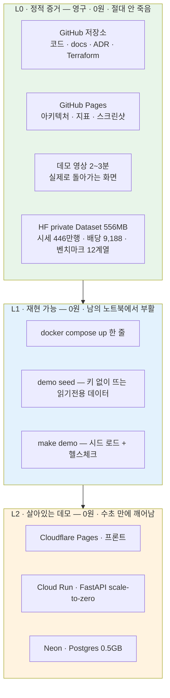

# #63 [분석] AWS 요금제별 월 비용과 출구 전략 — 전체 24/7 은 월 305만원, 증빙 전략은 실질 0원 (검증 정정 47건)

> 🗂️ 옛 GitHub 이슈를 옮긴 **기록 문서**입니다 — [색인](../README.md). 원문은 그대로 두고, 링크·커밋 해시만 새 자리 기준으로 바꿨습니다.

| 항목 | 내용 |
|---|---|
| 종류 | 이슈 |
| 상태 | 열림 |
| 원 작성 | 이동원(`devlee328288`) · 2026-09-21 11:20 KST |
| 라벨 | `analysis` `infra-cost` |
| 옛 주소 | `github.com/devlee328288/Qurious/issues/63` (지금은 열리지 않음) |

## 본문

> **의뢰 배경** — *"AWS 를 계속 사용할 수 없는 상황이다. 완성을 하더라도 그럴 경우 **포트폴리오나 유지보수**에 대해서 고민이 필요한 상황이라 이 부분이 가장 걱정된다."*
> **팀 결정(2026-09-21)** — AWS 는 **우선 제외**하고 로컬·오픈소스로 완성한 뒤 배포합니다. 비용 보전 방안이 아직 협의 전이고(요구사항 「유의사항」에 협의 항목으로 명시), 완성 후 배포해도 무리 없다는 판단입니다. 코드에도 이미 반영돼 있습니다(`app/lib/llm_client.py:11` — AWS 백엔드는 2026-09-15 에 제거).
> **조사 방법** — 요금 6축(컴퓨팅 · AI/ML · 데이터 · 오케스트레이션 · 보안관제 · 이관네트워크)을 서울 리전 기준으로 조사하고, **각 축을 반증 검증**에 넣었습니다. 그 과정에서 **47건이 정정**됐습니다(7.1절에 결론을 바꾼 5건).
> 환율은 **1 USD = 1,400 KRW** 추정입니다.

## 0. 세 줄 먼저

1. 🔴 **"AWS 를 계속 못 쓴다"는 걱정은 가정이 아니라 신규 계정의 기본 경로입니다.** 2025-07-15 이후 만든 계정은 **6개월 뒤 또는 크레딧 소진 시 스스로 닫히고**, 90일 안에 유료 전환하지 않으면 **계정과 콘텐츠가 영구 삭제**됩니다. 즉 AWS 에만 올려 둔 데모 URL 은 **취업 활동 시기에 정확히 맞춰 사라집니다.**
2. 🟢 **그런데 우리는 락인이 없습니다.** `grep boto3 app collector` 결과가 **0건**입니다. 코드는 GitHub 에, 데이터 556MB 는 HF private org 에 이미 있고, `docker compose` 7서비스는 AWS 고유 API 를 쓰지 않습니다. **AWS 에만 있는 것은 "지금 켜져 있는 서버" 하나뿐입니다.**
3. ✅ **그래서 답은 「AWS 를 기반이 아니라 증빙으로 쓴다」입니다.** 평가 주에 2~3일만 켜서 IaC 코드·스크린샷·실제 청구서를 저장소에 내려받고 끕니다. 상설 공개 URL 은 월 0원 무료 스택으로 유지합니다. **인프라는 사라지지만 재현 가능한 기록은 남습니다.**

---

# AWS 요금 · 출구 전략 종합 — 강사님 요구 스택 6축 실측 조사

> **조사일** 2026-09-21 (KST) · **리전** 서울 `ap-northeast-2` · **환율** 1 USD = 1,400 KRW(추정치)
> **월 환산** 24/7 = **730시간** (AWS 공식 계산기 기준. 30일=720h 로 계산한 값은 1.4% 낮게 나온다)
> **출처 등급** 🟢 AWS 공식 요금표/문서 직접 확인 · 🟡 2차 출처 · 🔴 미확인(추측하지 않음)
>
> 단가는 AWS **Price List API 의 서울 리전 원본 파일**을 직접 내려받아 파싱했습니다. 요금 웹페이지는 JavaScript 로 서울 값을 렌더링해서 그대로 읽으면 미국 값이 나옵니다 — 인터넷에 돌아다니는 "t3.medium 월 3만원"류는 전부 버지니아 기준이고 **서울은 25% 더 비쌉니다.** 6축 전부 1차 조사 후 **반증 검증**을 한 번 더 거쳐, 뒤집힌 항목은 7장에 정리했습니다.

---

## 1. 한 줄 답

**"AWS 를 계속 못 쓴다"는 걱정은 가정이 아니라 신규 계정의 기본 경로입니다 — 그리고 그건 이 프로젝트에 치명적이지 않습니다. 단, 지금 설계를 그대로 두면 치명적이 됩니다.**

세 문장으로 풀면:

1. **AWS 는 6개월 뒤 계정을 스스로 닫습니다.** 2025-07-15 이후 만든 계정의 무료 플랜은 *"개설 6개월 뒤 또는 크레딧 소진 시 중 먼저 오는 때에 계정이 스스로 닫히고"*, 이후 90일 안에 유료 전환하지 않으면 **계정과 콘텐츠가 영구 삭제**됩니다 🟢. 즉 AWS 에만 올려둔 데모 URL은 취업 활동 시기에 정확히 맞춰 사라집니다.
2. **그런데 이 프로젝트에서 AWS 에만 있는 건 "지금 켜져 있는 서버" 하나뿐입니다.** 코드·문서는 GitHub 에, 데이터 556MB 는 HF private org(100GB 무료 🟢)에 이미 있습니다. `docker compose` 7서비스는 AWS 고유 API 를 쓰지 않습니다 — `grep boto3 app collector` 결과가 **0건**입니다.
3. **그래서 답은 "AWS 를 포트폴리오의 기반이 아니라 증빙으로 쓴다"입니다.** 로컬로 완성하고, 평가 주에 2~3일만 켜서 **IaC 코드·스크린샷·실제 청구서**를 저장소에 내려받고 끕니다. 상설 공개 URL은 월 0원짜리 무료 스택으로 유지합니다. 인프라는 사라지지만 **재현 가능한 기록은 저장소에 영구히 남습니다.**

> 📌 **면접에서 더 강한 쪽은 "돌아가는 서버"가 아니라 "월 305만원을 왜 안 썼는지 숫자로 설명할 수 있는 사람"입니다.** 이 문서 자체가 그 증빙이 됩니다.

---

## 2. 요금제별 월 비용 — 시나리오 4개

### 2.0 먼저 용어 세 개

| 용어 | 뜻 | 이 문서에서 왜 중요한가 |
|---|---|---|
| **유휴 과금(idle charge)** | 요청이 0건이어도 "띄워 둔 시간"만으로 나가는 요금 | 이 문서의 3장 전체가 이 얘기입니다. AWS 비용 사고의 90%가 여기서 납니다 |
| **scale-to-zero** | 요청이 없으면 인스턴스를 0개로 줄여 과금이 멈추는 방식 | "잠잘 때 0원"의 근거. 무료가 아니라 **깨어날 때 수초~1분 지연(콜드 스타트)** 을 대가로 냅니다 |
| **락인(lock-in)** | 특정 벤더 API 에 코드가 묶여 옮기는 비용이 커진 상태 | "AWS 를 쓰면 락인"이 아닙니다. **경계를 안 두고 쓰면** 락인입니다 (4.2절) |

### 2.1 네 시나리오 비교표

| | **A. 로컬 전용** | **B. 최소 배포** | **C. 요구사항 권장** | **D. 요구사항 전체 24/7** |
|---|---|---|---|---|
| **한 달 총액 (USD)** | **$0** | **$182.32** | **$292.89** | **$2,178** |
| **한 달 총액 (KRW)** | **0원** | **255,248원** | **410,046원** | **3,049,200원** |
| **1인당 (4명 분담)** | 0원 | 63,812원 | 102,512원 | **762,300원** |
| **$200 크레딧으로 버티는 기간** | — | 33일 | 20일 | **2.8일** |
| 공개 URL | ❌ | ✅ | ✅ | ✅ |
| 강사님 요구 충족 | 문서·IaC 증빙만 | 배포 1항목 | **대부분 (대체 근거 문서화)** | 전부 |
| GPU / LLM | 로컬 Ollama | 없음 | Bedrock Nova Lite | g4dn + SageMaker GPU |
| 끄고 잊었을 때 | **위험 0** | 월 255,248원 무한 | 월 410,046원 무한 | **월 305만원 무한** |

> ⚠️ **B 를 "평일 주간만" 쓰면 $48.81 = 68,334원**(m5.xlarge 176시간)입니다. 하지만 아래 표의 EBS·IPv4·Route 53 은 **꺼도 전액 나갑니다.**

### 2.2 시나리오별 내역

<details>
<summary><b>A. 로컬 전용 — $0 / 0원</b> (현재 팀 결정)</summary>

| 항목 | 구성 | 월액 |
|---|---|---|
| 앱 스택 | `docker compose`: FastAPI·Postgres·Redis·Qdrant·Neo4j·Ollama·Celery(worker·beat) | 0원 |
| 데이터 | 로컬 SQLite 2.25 GiB + HF private 556MB (100GB 무료) | 0원 |
| 배치 | Celery Beat 5개 스케줄 | 0원 |
| 문서·코드 | GitHub | 0원 |

**끄고 잊었을 때의 위험: 없음.** 이 시나리오의 유일한 위험은 **비용이 아니라 평가**입니다 — 강사님 요구사항의 AWS 지정 항목이 빈 칸으로 남습니다. 5장의 "증빙 전략"으로 메웁니다.
</details>

<details>
<summary><b>B. 최소 배포 — $182.32 / 255,248원</b> (남에게 보여줄 최소선)</summary>

| 항목 | 단가 🟢 | 월액(USD) | 월액(KRW) | 꺼도 나가나? |
|---|---|---|---|---|
| EC2 m5.xlarge (4vCPU/16GB) 24/7 | $0.236/h | $172.28 | 241,192원 | 끄면 준다 |
| EBS gp3 50GB | $0.0912/GB-월 | $4.56 | 6,384원 | 🔴 **전액 나간다** |
| 공인 IPv4 1개 | $0.005/h | $3.65 | 5,110원 | 🔴 EIP 남기면 나간다 |
| Route 53 호스팅 영역 | $0.50/월 | $0.50 | 700원 | 🔴 **부분 월 비례배분 없음** |
| .com 도메인 (연 $16 월할) | $16/년 | $1.33 | 1,867원 | 연 선결제 |
| 인터넷 아웃바운드 100GB 이내 | 100GB 무료 | $0 | 0원 | — |
| **합계** | | **$182.32** | **255,248원** | |

**왜 t3.medium(4GB)이 아니라 m5.xlarge(16GB)인가:** 저장소 `docker-compose.yml` 에 서비스가 7개입니다. Neo4j 커뮤니티 혼자 힙+페이지캐시로 2GB 급을 쓰고 celery-worker 는 pandas 작업에 메모리가 튑니다. Qdrant 까지 얹으면 OS 포함 **6.5~7.5GB**라 4GB 로는 OOM 으로 실패합니다 🟡(프로파일링 실측이 아니라 이미지 구성 기반 추정 — 6.3절).

**t3.xlarge 는 함정입니다.** 같은 4vCPU/16GB 인데 $0.208/h 로 더 싸 보이지만, T3 는 **기본값이 unlimited 모드**여서 CPU 를 계속 쓰면 초과분을 $0.05/vCPU-시간으로 따로 받습니다 🟢. Celery 가 상시 도는 우리 구조에서 100% 부하면 **$239.44 로 m5.xlarge($172.28)보다 39% 비싸집니다.**

**끄고 잊었을 때: 월 255,248원이 무한히.** 6개월 = 153만원.
</details>

<details>
<summary><b>C. 요구사항 권장 — $292.89 / 410,046원</b> ⭐ 낭비 없이 요구를 충족하는 구성</summary>

| 축 | 구성 | 월액(USD) | 비고 |
|---|---|---|---|
| 앱 서버 | EC2 m5.xlarge 24/7 | $172.28 | |
| 스토리지 | gp3 100GB | $9.12 | |
| 로드밸런서 | **ALB** $16.43 + LCU ≈$0 + 공인 IPv4 2개 $7.30 | $23.73 | th08 실습 항목 |
| RDS | db.t3.small **단일 AZ** + gp3 20GiB | $43.50 | 다중 AZ 는 정확히 2배 |
| 캐시 | **ElastiCache Valkey Serverless** (최소 100MB) | $7.37 | ⭐ 아래 주석 |
| S3 | Standard 10GB + 요청 | $0.30 | |
| Secrets Manager | 비밀 15건 | $6.00 | 실측: `.env.example` 에 15개 |
| KMS | **AWS 관리형 키** 사용 | $0 | 고객관리키(CMK) 3개면 +$3 |
| CloudWatch | 로그 3GB·지표 10개·알람 10개·대시보드 1개 | **$0** | 전부 상시 무료 한도 내 🟢 |
| CloudTrail | 첫 트레일(관리 이벤트) | **$0** | 켜지 않을 이유가 없다 |
| SNS | Slack/이메일 알림 | **$0** | 무료 한도의 0.1% |
| Route 53 + 도메인 | | $1.83 | |
| SageMaker | **Serverless Inference** $1.20 + Training 10h $2.83 + Studio 120h·EBS $9.99 | $14.02 | ⭐ CPU 모델 한정 |
| Bedrock | **Nova Lite** 1,000만 토큰 | $1.35 | ⚠️ 서울에 Claude 없음 |
| EventBridge Scheduler | 월 840회 | **$0** | 무료 1,400만/월의 0.006% |
| AWS Batch | 요금 없음 | **$0** | |
| Fargate | 배치 실사용(야간 3종 + 시간당 동기화) | $6.47 | 상시면 $41.45 |
| Step Functions | 월 1,500 전이 | **$0** | 무료 4,000/월 **무기한** 🟢 |
| Airflow | **MWAA Serverless** (또는 로컬 컨테이너 $0) | $6.24 | ⚠️ mw1.small 은 $411 |
| ECR | 5GB | $0.50 | |
| Lambda + API GW(HTTP) | | **$0** | Lambda 상시 무료 한도 내 |
| DMS / DataSync / MGN | 단발 6h / 556MB / 무료기간 | $0.18 | |
| **NAT Gateway** | **만들지 않는다** (공인 서브넷 + 보안그룹) | **$0** | 만들면 +$46.72 |
| **WAF** | **제외** (3장 판단) | **$0** | 켜면 +$10.30 |
| **합계** | | **$292.89** | **410,046원** |

⭐ **캐시 선택이 검증에서 뒤집혔습니다.** 1차 조사는 "ElastiCache Serverless 금지"였는데, AWS 공식 요금 페이지에 엔진별로 나뉘어 있습니다 🟢 — *"Minimum metered data storage: **100 MB** per cache for ElastiCache Serverless for **Valkey** and **1 GB** for Memcached and Redis OSS."* Redis OSS 서버리스는 요청 0건에도 월 $110.23 이지만 **Valkey 서버리스는 $7.37** 로, 가장 싼 노드($14.02)보다도 절반입니다. **ElastiCache 노드는 정지 기능이 아예 없어서(삭제만 가능) 24/7 을 각오해야 하므로**, 우리처럼 수십 MB 쓰는 경우 Valkey 서버리스가 최적해입니다.

⭐ **SageMaker Serverless Inference 는 GPU 를 지원하지 않습니다** 🟢. 메모리 상한 6GB, 컨테이너 10GB, 실시간→서버리스 전환 자체 불가입니다. 즉 LightGBM·sklearn 같은 **CPU 모델만** 이 자리에 들어갑니다. LLM 자체 서빙은 여기로 대체 못 합니다.

**끄고 잊었을 때: 월 410,046원.** 특히 RDS 는 **최대 7일만 정지되고 7일 뒤 AWS 가 자동으로 켭니다** 🟢.
</details>

<details>
<summary><b>D. 요구사항 전체 24/7 — $2,178 / 3,049,200원</b> 🔴 이 선택지는 존재하지 않습니다</summary>

| 축 | 주요 항목 | 월액(USD) |
|---|---|---|
| 컴퓨팅 | m5.xlarge $172.28 + **g4dn.xlarge $472.31** + gp3 200GB·스냅샷·ECR·IPv4·Lambda·API GW REST·egress 200GB | $690.73 |
| 네트워크 | ALB $23.73 + **NAT Gateway $43.07 + EIP $3.65 + 처리 50GB $2.95** | $73.40 |
| AI/ML | **SageMaker 실시간 엔드포인트 ml.g4dn.xlarge $661.38** + Studio $45.26 + EBS·Training·Processing $17.63 | $724.27 |
| Bedrock | Nova Pro 1,000만 토큰 | $18.05 |
| 데이터 | RDS db.t3.small **다중 AZ** $87.00 + ElastiCache Redis 2노드 $71.54 + S3/Glacier/Backup $1.32 | $159.86 |
| 오케스트레이션 | **MWAA mw1.small $411.43** + 메타DB $1.20 + Step Functions $2.60 + Fargate 상시 $41.45 + EventBridge | $456.69 |
| 보안·관제 | Secrets 15건 $6.02 + KMS 3키 $3.00 + **WAF $10.30** + 지표 50개 $12.00 + 알람 20개 $1.00 + CloudTrail | $32.47 |
| 이관·DNS | DMS 24/7 $20.44 + Route 53·도메인 $1.87 + DataSync·MGN·CloudFront | $22.32 |
| **합계** | | **≈$2,178** |

```
D 시나리오 $2,178 의 정체 — 세 줄이 71%
════════════════════════════════════════════════════════════════
SageMaker GPU 엔드포인트  ████████████████████████  $661  30.4%
EC2 g4dn.xlarge (Ollama)  █████████████████         $472  21.7%
MWAA mw1.small (Airflow)  ███████████████           $411  18.9%
──────────────────────────────────────────────────────  소계 71%
그 외 40여 개 항목 전부    ██████████████████████    $634  29.1%
════════════════════════════════════════════════════════════════
```

**끄고 잊었을 때: 월 305만원.** 이 중 **SageMaker 엔드포인트·MWAA·NAT Gateway 는 "중지" 버튼이 없습니다 — 삭제만 가능합니다.** 신규 계정 크레딧 $200 은 **2.8일**에 소진되고, 그 뒤부터 개인 카드로 청구됩니다.

> 🔴 **게다가 D 는 애초에 실행조차 안 됩니다.** 신규 계정의 `Running On-Demand G and VT instances` 기본 쿼터가 **0 vCPU** 입니다 🟢 — g4dn/g5/g6 는 Service Quotas 증설 요청과 심사 대기 없이는 실행 자체가 불가합니다. 스팟도 기본 0 이라 우회도 안 됩니다. 한 달 일정에서 이건 비용이 아니라 **착수 지연 리스크**입니다.
</details>

---

## 3. 🔴 비용을 터뜨리는 상위 5개

> 판정 기준: **"요청이 0건이어도 나가는가"** + **"중지 버튼이 있는가"**. 둘 다 아니면 최상위입니다.

### 🥇 1위 — SageMaker 실시간 추론 엔드포인트 (`ml.g4dn.xlarge` 월 926,000원)

| 항목 | 내용 |
|---|---|
| 단가 🟢 | $0.906/시간 → 730h = **$661.38 = 926,000원/월** |
| 왜 위험한가 | ① 요청 0건에도 **초 단위 과금** ② 콘솔에 "중지"가 아니라 **"삭제"**만 있다 ③ 팀 4명 중 한 명이 금요일에 지우는 걸 잊으면 주말 48시간에 **84,700원**이 그냥 나간다 |
| 프리티어 | **GPU 는 어떤 SageMaker 프리티어에도 없다.** 무료 125시간은 m4/m5.xlarge 한정 🟢 |
| 🟡 완화책 | **2024-11 부터 Scale Down to Zero 가 지원된다** 🟢 — Inference Components 로 배포하고 `MinInstanceCount=0`, 각 컴포넌트 최소 용량 0 으로 등록하면 유휴 시 인스턴스가 0으로 내려간다. 팀 규칙은 "금요일에 지우기"가 아니라 **"처음부터 scale-to-zero 로 만들기"** 여야 한다 |
| ⚠️ 스펙 오류 | **강사님이 지정한 `ml.t3.medium` 실시간 엔드포인트는 존재하지 않는다.** 서울 가격표 1,736행에 `APN2-Host:ml.t3.medium` SKU 가 없고, **버지니아(2,591행)에도 없다** — Hosting 컴포넌트에 t3 계열이 아예 없는 전 리전 공통 사양이다. 리전을 바꿔도 안 되고 **`ml.t2.medium`($0.069/h) 또는 `ml.m5.large`($0.142/h)로 사양을 바꿔야 한다** 🟢. 모르고 착수하면 첫 `create_endpoint` 에서 `ValidationException` 으로 시간을 태운다 |

### 🥈 2위 — MWAA (관리형 Airflow) mw1.small 월 576,000원 · **끌 수 없음**

| 항목 | 내용 |
|---|---|
| 단가 🟢 | $0.563597/시간 → 730h = **$411.43 = 576,000원/월**. 여기에 **NAT Gateway 가 강제로 따라와** 실질 최소 **$459.35 = 643,100원** |
| 왜 최악인가 | **일시정지 API 가 없다. `DeleteEnvironment` 만 있다** 🟢. 그리고 삭제하면 **메타DB(실행 이력·Variables·Connections)가 함께 사라진다** — 관리형 Aurora 라 `pg_dump` 도 못 뜬다. AWS 자신이 *"there is no automatic way to stop an MWAA environment when not in use and deleting an environment causes metadata loss, customers often run it continually and pay the full cost"* 라고 쓰고, S3 백업→삭제→재생성→복원 우회책을 블로그로 문서화했다 🟢 |
| 이중 함정 | **MWAA 를 삭제해도 NAT Gateway 와 EIP 는 남는다.** MWAA 요건상 프라이빗 서브넷 2개가 강제여서 NAT 회피가 사실상 불가하다(뒤 5장 참조). "Airflow 지웠는데 왜 돈이 나가지"의 정체가 이것 |
| 프리티어 | **없다.** 환경을 만든 순간부터 초 단위 과금 🟢 |
| 대안 | **MWAA Serverless $0.104/시간, 최소 1분 과금** → 우리 부하로 **월 $6.24 = 8,700원** 🟢. 관리형 Airflow 중 유일하게 "필요할 때만"이 성립한다. 또는 로컬 `apache/airflow` 컨테이너($0) |
| micro 로 낮추면? | mw1.micro $243.50/월. 그런데 **오토스케일링 미지원 + 동시 태스크 3개 상한** 🟢 — 종목 2,800개를 훑는 우리 배치가 밤새 안 끝난다. **싸게 만들려다 실패하는 구간** |

### 🥉 3위 — NAT Gateway 월 60,300원 · 만든 기억이 없는데 청구된다

| 항목 | 내용 |
|---|---|
| 단가 🟢 | $0.059/시간 → **$43.07/월** + 처리 $0.059/GB + **EIP 강제 $3.65/월** = **$46.72 = 65,400원** |
| 숨은 이중 과금 | 🟢 AWS 원문: *"You also incur **standard AWS data transfer charges** for all data transferred via the NAT gateway."* 즉 처리 $0.059/GB 위에 인터넷 아웃바운드 $0.126/GB 가 **추가**된다 → 실효 **GB당 $0.185**. 월 100GB 무료 한도를 넘기는 순간 3.1배가 된다 |
| 왜 안 보이나 | **VPC 마법사·CDK·Terraform 기본 템플릿이 사설 서브넷을 만들면서 NAT 를 자동 생성한다.** 고가용성 권고(AZ당 1개)를 따르면 2배 |
| 중지 | 없음. 삭제만 |
| 회피 | **공인 서브넷 + 보안그룹 + S3 Gateway Endpoint(무료)** 로 대부분 대체된다. 단 MWAA 는 회피 불가 — 프라이빗 라우팅으로 바꾸면 VPC 인터페이스 엔드포인트 6~8개($0.013/h 각)로 **월 $57~76 이 되어 NAT 보다 비싸고**, EIGW 는 IPv6 전용이라 공공데이터포털·DART·KIS 가 IPv6 를 지원해야 한다 🟢 |

### 4위 — EC2 g4dn.xlarge (Ollama GPU) 월 661,000원 · 이 규모에서 40~800배 손해

```
월 1,000만 토큰(리포트 500건 × 2만 토큰)을 처리하는 비용
────────────────────────────────────────────────────────────
로컬 Ollama (현재)         ▏                        현금 0원
Bedrock Nova Micro         ▏                        1,091원
Bedrock Nova Lite  ⭐      ▏                        1,889원
Bedrock Nova Pro           ▎                       25,270원
EC2 g4dn.xlarge 24/7       ████████████████████   661,000원
────────────────────────────────────────────────────────────
손익분기: Nova Lite 기준 월 48.4억 토큰 · Nova Pro 기준 3.61억 토큰
우리 규모는 Nova Pro 분기점의 2.8%, Nova Lite 분기점의 0.2%
→ GPU 자체 서빙이 유리해지는 구간이 이 프로젝트에 존재하지 않는다
```

### 5위 — CloudWatch Logs "서울 프리미엄" + 커스텀 지표 카디널리티

| 위험 | 내용 |
|---|---|
| **서울 로그 수집 $0.76/GB** 🟢 | 버지니아 $0.50/GB 보다 **52% 비싸다.** 대부분의 블로그·계산기가 버지니아 기준이라 청구서가 1.5배로 온다 |
| 무료 한도 | **월 5GB 수집 + 5GB 보관이 매달 재발되는 상시 무료** 🟢(`CW-MonthlyFree-DataProcessing`). 12개월 한정 아님 → 우리 실측 규모(3GB/월)는 **$0** |
| 새는 시나리오 | DEBUG 방치 30GB → 27,900원 · 재시도 루프(2KB 스택×10회/초) 52GB → 52,300원 · **SQLAlchemy `echo=True` + 재시도 동시 150GB → 160,900원** |
| 🟢 좋은 소식 | 저장소 코드에 `echo=True`·`DEBUG` 하드코딩이 **없다**. 기본값은 건전하다 |
| **지표 카디널리티** | 지표 1개당 $0.30/월(10개 무료). **차원(dimension)에 `종목코드`를 넣으면** 2,800종목 × 지표 3종 = 8,400지표 = **월 $2,520 = 353만원**. 이 축 최대의 단일 사고 가능성 |
| 조회는 싸다 | Logs Insights 스캔 서울 $0.0076/GB — 수집료의 **1/100**. **넣는 게 비싸고 보는 건 싸다** |

### 그 외 "끄고 잊는" 목록 — 프로젝트 종료 시 삭제 확인표

| 항목 | 월액 | 인스턴스만 지우면? |
|---|---|---|
| NAT Gateway | 65,400원 | 🔴 남는다 |
| ALB | 23,000원 (+IPv4 10,220원) | 🔴 남는다 |
| EBS gp3 100GB | 12,768원 | 🔴 stop 해도 전액 |
| 유휴 Elastic IP 1개 | 5,110원 | 🔴 release 안 하면 남는다 ("유휴는 무료"는 2024년에 폐지 🟢) |
| Route 53 호스팅 영역 | 700원 | 🔴 부분 월 비례배분 없음 |
| RDS 수동 스냅샷 · "자동 백업 유지" | 용량 비례 | 🔴 DB 를 지워도 남는다 |
| S3 Glacier Deep Archive | 28원 | 🔴 **180일 최소 보관** — 한 달 프로젝트엔 쓸 이유 없음 |
| Secrets Manager 삭제 예약 중 | — | 🟢 **과금 없음** (7절 정정) |
| KMS 키 삭제 예약 중 | — | 🟢 **과금 없음** (7절 정정) |

---

## 4. AWS 를 끈 뒤에도 남는 설계 — 걱정에 대한 직답

### 4.1 포트폴리오를 3층으로 나눕니다



**원리: 아래 층은 위 층이 죽어도 남습니다.** L2 가 죽어도 L1 이 있으면 "돌려볼 수 있는 프로젝트"고, L1 이 깨져도 L0 가 있으면 "설명할 수 있는 프로젝트"입니다.

> **지금 이 프로젝트는 L0 만 있고 L1·L2 가 없습니다.** 이게 걱정의 실체입니다 — AWS 때문이 아니라 L1 이 없어서 불안한 겁니다.

**호스팅 후보 — 보여주는 것 / 포기하는 것**

| 후보 | 월 비용 | 보여줄 수 있는 것 | **포기하는 것** | 등급 |
|---|---|---|---|---|
| **Cloudflare Pages** | 0원 | 정적 + 프리뷰 무제한, 빌드 500회/월 | 서버 로직 | 🟢 |
| **Google Cloud Run** ⭐ | 0원 | **컨테이너 그대로**, 월 200만 요청·36만 GiB초, scale-to-zero | **카드 등록 필수** | 🟢 |
| **Neon** (Postgres) ⭐ | 0원 | 0.5GB, 5분 후 자동 정지, **영구·카드 불필요** | 용량 0.5GB | 🟡 |
| Render 무료 | 0원 | Git push 배포, 카드 불필요 | 15분 무활동 시 sleep(복귀 ~1분), **무료 Postgres 는 30일 후 소멸** 🟢 → 정본 DB 로 쓰지 말 것 | 🟢 |
| Supabase | 0원 | 500MB | **7일 무활동 시 프로젝트 일시정지** → 면접관이 열었을 때 죽어 있다 | 🟡 |
| **Oracle Always Free** | 0원 | **2 OCPU / 12GB RAM + 200GB + egress 10TB** → compose 통째로 | **7일간 CPU·네트워크·메모리 95p 가 모두 20% 미만이면 회수** 🟢. 2026-06-15 에 4 OCPU/24GB → 2/12 로 **반토막난 전례** 🟡. 12GB 에 Ollama 까지는 무리 | 🟢 |
| **Cloudflare R2** | 0원 | 10GB + **egress 전액 무료** (S3 대체) | | 🟢 |
| **HF Spaces** | Static 0원 / **Docker·Gradio 는 유료** | 우리 Dockerfile 그대로 | ⚠️ **Gradio·Docker Space 생성에 유료 플랜 필요** — 개인 PRO $9, **조직은 Team $20/인** 🟢. 무료 개인계정은 ZeroGPU Gradio 2개(Gradio 전용) | 🟢 |
| **GitHub Actions cron** | 0원 | Celery Beat 대체 배치 | **public 저장소는 60일 무활동 시 스케줄이 자동 비활성화** 🟢 · 최소 간격 5분 · 정각은 수십 분 밀린다 | 🟢 |
| Vercel Hobby | 0원 | Next.js 프론트 | **비상업 개인용만** 허용 🟢 | 🟢 |
| Fly.io | **최소 $5** | — | 2024-10 무료 티어 폐지 | 🟡 |

**권고 조합 — 월 0원**

```
프론트     Cloudflare Pages      0원   ← 콜드 스타트 없음, 항상 즉시 응답
API        Cloud Run (FastAPI)   0원   ← 컨테이너 그대로, 안 쓰면 0
읽기전용DB  Neon Postgres 0.5GB   0원   ← 영구, 카드 불필요
데이터원본  HF private Dataset    0원   ← 100GB 무료 / 현재 556MB
문서·지표   GitHub Pages          0원
배치       GitHub Actions cron   0원   ← 단 60일마다 커밋 1회 필요
─────────────────────────────────────
합계                             0원/월
```

### 4.2 락인을 만들지 않는 추상화 — **코드에서 정확히 어디를 감싸야 하는가**

> 🟢 **좋은 소식: 이 팀은 이미 이 패턴을 두 번 성공했습니다.**

| 기존 자산 | 위치 | 패턴 | 재사용 판정 |
|---|---|---|---|
| `BrokerClient(ABC)` + `factory.py` + `mock.py` | `app/services/brokers/base.py` | 추상 기반 클래스 + 팩토리 + 목 어댑터 (증권사 9곳: kis/kiwoom/ebest/daishin/kb/shinhan/meritz…) | ✅ **그대로 본뜬다.** 신규 포트의 설계 표준으로 채택 |
| `LLMClient(Protocol)` + `get_llm_client()` | `app/lib/llm_client.py` | Protocol + 환경변수 스위치 (`LLM_PROVIDER=ollama\|vllm`) | ✅ **Bedrock 어댑터를 이 파일 한 곳에 추가**하면 끝. 도메인 코드 변경 0 |
| `docker-compose.yml` 7서비스 | 루트 | 컨테이너 정본 | ✅ ECS·Fargate·Cloud Run·Oracle 모두 같은 이미지 |
| `Celery Beat` 5개 스케줄 | `app/celery_app.py:51` | 앱 내장 스케줄러 | ✅ EventBridge 로 나갔다 돌아올 수 있는 유일한 이유 |
| `grep -rn boto3 app collector` | — | **결과 0건** | ✅ **지금이 경계를 세울 마지막 순간** |

**전/후 구조**

```
[나쁜 미래]                              [권고 구조]
app/services/quant_pipeline.py           app/services/quant_pipeline.py
  └ import boto3 ──────────┐               └ from app.lib.ports import ObjectStore
  └ s3.put_object(...)     │                        │ (도메인은 포트만 안다)
app/services/rag_pipeline.py             app/lib/ports/__init__.py
  └ import boto3 ──────────┤               ├ ObjectStore  (Protocol)
  └ bedrock.invoke(...)    │               ├ Scheduler    (Protocol)
app/tasks/sync_tasks.py    │               ├ VectorIndex  (Protocol)
  └ import boto3 ──────────┘               └ SecretStore  (Protocol)
     ↑ boto3 가 12곳에 흩어짐            app/lib/adapters/
     = 뽑아낼 때 12곳 수정                 ├ store_local.py   / store_s3.py
                                           ├ sched_beat.py    / sched_eventbridge.py
                                           ├ vec_pgvector.py  / vec_opensearch.py
                                           └ secret_env.py    / secret_asm.py
                                          ↑ boto3 는 이 폴더 안에만 존재
                                          = 뽑아낼 때 파일 삭제 + 환경변수 1줄
```

```python
# app/lib/ports/__init__.py  — 기존 LLMClient 와 같은 형태로 통일
from typing import Protocol

class ObjectStore(Protocol):
    """파일 저장소. 로컬 FS · S3 · R2 · HF Dataset 이 모두 이 모양으로 보인다."""
    async def put(self, key: str, data: bytes) -> str: ...   # 반환: 불투명 핸들(URL 아님)
    async def get(self, key: str) -> bytes: ...
    async def exists(self, key: str) -> bool: ...

class VectorIndex(Protocol):
    """RAG 검색. pgvector · OpenSearch · FAISS 파일이 모두 이 모양."""
    async def upsert(self, ids, vecs, meta) -> None: ...
    async def search(self, vec, k: int): ...
    async def dump_parquet(self, path: str) -> None: ...   # ★ 탈출구를 인터페이스에 박아둔다
```

```python
# app/lib/adapters/factory.py  ← app/lib/llm_client.py:get_llm_client() 와 동일 패턴
def get_object_store() -> ObjectStore:
    kind = settings.OBJECT_STORE.lower()          # local | s3 | hf
    if kind == "s3":
        from .store_s3 import S3Store; return S3Store(settings.S3_BUCKET)
    return LocalStore(settings.DATA_DIR)          # 기본값은 항상 로컬
```

**세 가지 규칙 — 이게 실질적 방어입니다**

1. **기본값은 언제나 로컬.** 환경변수가 비어 있으면 AWS 없이 뜬다 → 평가자·팀원·미래의 나에게 `docker compose up` 이 항상 동작한다.
2. **CI 가드**: `grep -rn "boto3\|botocore" app collector | grep -v "app/lib/adapters/"` 결과가 있으면 **빌드 실패**. 락인은 리뷰로 못 막고 문법으로 막는다.
3. **탈출구를 인터페이스에 포함**: `dump_parquet()`·`export_schedule_yaml()` 같은 "빼내기" 메서드를 포트에 넣어 두면, 어댑터를 새로 쓸 때 이전 경로가 강제된다.

**서비스별 "뽑아내기" 난이도 — 무엇을 조심해서 쓸지의 지도**

| AWS 서비스 | 난이도 | 왜 | 끈 뒤의 대체물 |
|---|---|---|---|
| S3 / ECS / Fargate / ECR / EventBridge | ★ | 산출물이 OCI 이미지·cron 한 줄·표준 객체 API | R2 · Cloud Run · Celery Beat |
| RDS Postgres / ElastiCache | ★★ | 엔진 호환. `pgvector` 버전·파라미터그룹만 유의 | 로컬 Postgres · Neon · Upstash |
| Lambda | ★★ | 핸들러 시그니처·15분 제한에 로직이 스며든다 | uvicorn. **핸들러는 5줄 껍데기로** |
| **Step Functions** | ★★★ | 워크플로가 ASL(JSON)로 나가 **코드가 아니게 된다** → 로컬에서 못 돈다 | **LangGraph(이미 있음)** · Celery chain |
| Cognito / OpenSearch Serverless | ★★★ | 유저풀 이전 불가 · 쿼리 방언 | 표준 OIDC · **pgvector(이미 있음)** |
| **Bedrock** | ★★★★ | 모델 ID·프롬프트·응답 포맷 종속. **끄면 동등 품질을 로컬에서 못 낸다(GPU 없음)** | `LLMClient` 에 어댑터 1개 + **모든 LLM 출력물을 DB/파일에 캐시** → 캐시가 곧 데모 |
| **SageMaker 실시간 엔드포인트** | ★★★★★ | 컨테이너 규약(`/invocations`·`/ping`)·`model.tar.gz`·IAM 롤이 한 덩어리 | **BYOC 로 만들어 같은 이미지가 로컬에서도 뜨게.** 학습은 Colab Pro·로컬 22코어 |

### 4.3 끄는 순간 무엇이 죽는가

```
D-0   AWS 종료
  │
  ├─ 즉시 죽음 ───────────────────────────────────────────
  │   ✖ 살아있는 데모 URL        → 링크를 누른 평가자가 404
  │   ✖ 실시간 시세 조회(KIS)     → 서버가 없으니 토큰 발급 불가
  │   ✖ LLM 리포트 실시간 생성    → Ollama 는 로컬에만, GPU 없음
  │
  ├─ 몇 시간~1일 내 ─────────────────────────────────────
  │   ✖ Celery Beat 5개 스케줄    → 18:00 portal_recent 부터 순차 누락
  │   ✖ 모의투자 주문/체결 동기화  → fill_sync 중단, 포지션 정지
  │
  ├─ 서서히 썩음 ───────────────────────────────────────
  │   ⚠ RAG 인덱스 신선도        → 새 공시 미반영(인덱스 자체는 남음)
  │   ⚠ 수정주가 조정계수         → 배당·분할 미반영 → 백테스트 왜곡
  │
  └─ 절대 안 죽음 ✅ ────────────────────────────────────
      ✔ 코드·문서·ADR·Terraform (GitHub)
      ✔ 데이터 446만행·배당 9,188·벤치마크 12계열 (HF private 100GB 무료)
      ✔ 재현 절차 (docker compose)
```

| 죽는 것 | 왜 | 대안 (권고순) | 대안이 포기하는 것 |
|---|---|---|---|
| **실시간 시세** | 토큰 발급·조회에 상시 서버 필요 | ① 고정 스냅샷 + `as of 2026-09-19` 배너 ② GH Actions 가 1일 1회 공개데이터만 갱신해 정적 JSON 커밋 | "실시간"이라는 주장. ②는 🔴 **미국 러너 IP 에서 국내 공공 API 가 열리는지 미확인** |
| **정기 배치 5종** | 워커·브로커가 상시 프로세스 | ① **GH Actions cron**(public 무료) → 산출물 HF push ② MWAA Serverless $6.24 | Actions 는 최소 5분 간격·정각 지연·**60일 무활동 자동 비활성화** |
| **RAG 검색** | **질의도 임베딩이 필요** → 임베딩 모델이 죽으면 검색 자체 불가 | ① 문서 임베딩 parquet 덤프 + **사전 정의 질문 N개의 임베딩까지 고정** → 정답 캐시 재생 ② Bedrock Titan Embeddings V2($0.0246/100만 토큰 — 1,000만 토큰 344원) | 임의 질문 대응. 데모는 "골든 질문 10개"로 축소 |
| **모의투자 주문** | 브로커 토큰·주문 세션 | **`brokers/mock.py` 로 결정적 리플레이** (어댑터 이미 존재 ✅) | 실주문 증거. 대신 **"9개 증권사 어댑터 + 목 구현"이라는 설계 증거**가 남는다 |
| **LLM 리포트** | 무료 티어에 LLM 을 얹을 수 없다(GPU 없음) | ① **모든 LLM 출력물을 생성 시점에 캐시** → 캐시가 곧 데모 ② Bedrock Nova Lite 월 1,889원만 붙이기 | 새 종목·새 질문 생성. **이 캐시 습관을 오늘부터 들여야 나중에 데모가 있다** |

### 4.4 유지보수 월 0~5천원 구성

| 시나리오 | 구성 | 월 비용 | 수명 |
|---|---|---|---|
| **A. 완전 무료 (권고)** | Cloudflare Pages/Workers/R2 + Cloud Run + Neon + Upstash + HF private + GH Actions | **0원** | **무기한** (Oracle 을 쓰면 정책 변동 리스크 실재) |
| B. 무료 + GPU 실험 | A + Colab Pro $9.99 (+ 필요 시 HF PRO $9) | 14,000~26,600원 | 무기한 |
| 진짜 고정비 | **.com 도메인만** (연 $16 = 22,400원) | **1,867원** | 연 선결제 |

**무료 유지의 유지보수 작업 — 연 3회 이하**

1. GH Actions public 저장소 예약 워크플로 **60일 무활동 자동 비활성화** 🟢 → 월 1회 keepalive 커밋.
2. Neon 은 5분 자동 정지가 **정상 동작**이라 조치 불필요 🟡. Supabase 는 7일 정지라 안 씀.
3. HF private 100GB 한도 점검 — 556MB, 여유 99%.

> **비교: AWS 를 방치하면 NAT + ALB 둘만으로 월 88,400원 · 6개월 530,400원. 로컬/무료 스택 방치는 0원이고, 2년 뒤에도 `docker compose up` 으로 되살아납니다.**

---

## 5. 권고 — 한 달 프로젝트의 현실적 경로

### 5.1 주 단위 일정 — "언제 켜고 언제 끄는가"

| 주 | 할 일 | AWS 상태 | 그 주 AWS 비용 |
|---|---|---|---|
| **W0 (이번 주)** | ① **강사님께 AWS Academy 회원 여부·비용 보전 정책 확인** ② `app/lib/ports/` + `adapters/` 스켈레톤 + **boto3 격리 CI 룰** ③ **GPU 쓸 거면 Service Quotas 증설 요청** (G/VT 기본 0 vCPU · 심사 대기) | **꺼짐** | **0원** |
| **W1** | 로컬로 기능 완성. `make demo`(키 없이 뜨는 읽기전용 시드) 만들기 = **L1 확보**. **LLM 출력물 캐시 켜기** | 꺼짐 | 0원 |
| **W2** | 로컬 완성 이어가기. `docker stats` 로 피크 메모리 **1회 실측**(예산의 마지막 불확실성 제거). Beat 스케줄 5개를 YAML 단일 소스로 뽑아 GH Actions 미러 추가 | 꺼짐 | 0원 |
| **W3** | **L2 무료 스택 구축** — Cloudflare Pages + Cloud Run + Neon 에 상설 데모 올리기. `docs/aws/terraform/` 작성 + `terraform plan` | 꺼짐 (plan 만) | 0원 |
| **W4 (평가 주)** | **① 화 09:00 `terraform apply` → ② 48~72시간 증빙 수집 → ③ 목 18:00 `terraform destroy`** ④ 데모 영상 녹화 ⑤ README 에 "AWS 버전 / 무료 버전" 두 실행법 병기 | **2~3일만 켜짐** | **약 $15 = 21,000원** (크레딧 내 실질 0원) |
| **W4 말** | ⑥ **끄기 리허설**: AWS 를 실제로 전부 파괴하고 무료 스택에서 전 기능 확인 → 이 순간 유지보수 불안이 사라진다 | 꺼짐 | 0원 |

**W4 의 72시간 증빙 창 — 계산 근거**

```
m5.xlarge 48h    $11.33  (15,859원)
g4dn.xlarge 4h    $2.59  ( 3,626원)   ← 쿼터 증설이 끝났다면
ALB 48h           $1.08  ( 1,512원)
RDS t3.small 48h  $2.69  ( 3,765원)
gp3 · IPv4 · 기타 ~$2    ( 2,800원)
─────────────────────────────────────
합계          약 $20 ≈ 28,000원 — 신규 계정 크레딧 $200 안
```

### 5.2 "짧게 켜서 증빙" 전략은 성립하는가 — **성립합니다. 조건 두 개.**

**조건 1 — 증빙을 반드시 저장소(git)로 내려받는다** 🔴 **이게 가장 중요합니다.**

무료 플랜 계정은 6개월 뒤 닫히고 90일 뒤 콘텐츠가 삭제됩니다 🟢. **증빙을 콘솔·CloudWatch 에만 남기면 증빙까지 같이 사라집니다.**

```
docs/aws/
├── terraform/                  ← ★ 가장 강한 증빙. 코드는 계정이 닫혀도 남는다
│   ├── main.tf  vpc.tf  ecs.tf  rds.tf
│   └── plan-2026-10-XX.txt     ← plan 출력 전문 (적용 전에도 "설계 가능" 증명)
├── apply-log-2026-10-XX.txt    ← apply 실제 로그 (ARN 일부 마스킹)
├── screenshots/                ← ECS 태스크 RUNNING · RDS Available · CloudWatch 로그
├── cost/
│   ├── cost-explorer.png
│   └── daily-cost.csv          ← 실제 청구 금액 = "비용을 관리했다"의 증거
├── architecture.md (+ mermaid)
└── teardown-log.txt            ← destroy 로그. ★ "끌 줄도 안다"가 운영 역량 증거
```

**조건 2 — 유휴 과금 지뢰를 켜기 전에 제거한다.** NAT Gateway·EIP·ALB·EBS·SageMaker 엔드포인트. NAT 하나만 방치해도 65,400원이 크레딧을 갉아먹습니다.

**솔직한 감점 위험 — 그리고 완화책**

| 감점 위험 | 왜 | 완화 |
|---|---|---|
| 스크린샷은 "**돌았다**"만 증명하고 "**운영했다**"는 증명 못 함 | 72시간은 장애·스케일·비용최적화를 경험할 시간이 아니다 | 72시간 안에 **의도적 장애 1회**(태스크 강제 종료 → 자동 복구)를 만들어 로그로 남긴다 |
| 평가자가 링크를 눌렀을 때 죽어 있으면 감점 | 끈 뒤엔 URL 이 없다 | README 최상단에 **살아있는 L2 데모 링크(무료 스택)** 를 두고, AWS 는 "증빙" 섹션으로 분리 |
| 요구사항 체크리스트에 빈 칸이 생긴다 | 실제로 상시 사용하지 않음 | **요구사항 ↔ 증빙 대응표**를 만들어 항목마다 `.tf` 파일·스크린샷 링크를 건다 |
| IaC 만 있고 실행 안 하면 "동작 미검증" 의심 | plan 은 검증이 아니다 | **`terraform apply` 는 반드시 1회 실제 실행.** plan 만으로 끝내지 않는다 |
| **강사님 지정 스펙 3건이 실제로 불가능하다** | ① `ml.t3.medium` 엔드포인트 전 리전 부재 ② 서울 Bedrock 에 Claude 없음 ③ G/VT 쿼터 기본 0 | **비용 얘기보다 먼저 스펙 확인으로 여쭙는다.** "안 했다"가 아니라 "확인해 보니 이렇습니다"가 된다 |

### 5.3 강사님께 드릴 3+3 질문

**돈 문제 (요구사항 「유의사항」의 비용 보전 협의)**
1. **"이스트소프트/학원이 AWS Academy 회원인가요? Learner Lab 클래스를 열어주실 수 있나요?"** — 학생 1인당 **$100 크레딧** 🟢, 4명이면 $400 ≈ 56만원. **가장 큰 금액, 가장 빠른 길.**
2. **"기관 계정을 주시나요, 우리 계정에 쓰고 정산하나요?"** — 후자면 **상한선을 문서로** 받는다.
3. **"프로젝트 종료 후 계정/리소스는 언제 닫히나요?"** — **포트폴리오 수명이 여기서 결정됩니다.**

> 🔶 추측이지만 강하게 권합니다: **개인 카드를 AWS 에 등록하는 선택지는 마지막에 둡니다.** 정산이 안 되면 그대로 개인 채무가 되고, 프리티어 초과 과금은 사후 취소가 보장되지 않습니다.

**스펙 문제 (모르고 착수하면 시간을 태움)**
4. **`ml.t3.medium` 실시간 엔드포인트는 전 리전에 존재하지 않습니다** — `ml.t2.medium`($0.069/h) 또는 `ml.m5.large`($0.142/h)로 바꿔도 될까요?
5. **서울 Bedrock 에 Anthropic Claude 가 없습니다**(가격표 135행 중 0건 · 공식 리전 호환 표로도 미지원) — Amazon Nova Lite 또는 도쿄 리전으로 대체해도 될까요? 참고로 **Nova 계열도 서울에서 In-Region 이 아니라 Geo 라우팅이라 요청이 서울을 떠납니다** 🟢 — 금융 데이터에서는 이게 비용보다 중요한 판단입니다.
6. **"실시간 추론 엔드포인트"를 scale-to-zero 설정 또는 Serverless Inference 로 구현해도 요구 충족으로 봐주실까요?** — 월 $661 → $1.20 입니다. (단 GPU 모델은 Serverless 불가라 scale-to-zero 쪽)

---

## 6. 지금 당장 해야 할 일 — 돈을 쓰기 전에

### 6.1 Budgets 알림 — 숫자로 제시

| 예산 이름 | 금액 | 임계값 | 액션 | 수신자 |
|---|---|---|---|---|
| `qurious-total` | **$20 / 월** | 50% ($10) · 80% ($16) · **100% ($20) → IAM deny 액션** | 100% 에서 `Deny` SCP/IAM 정책 부착 | **팀 4명 전원 이메일** |
| `qurious-daily` | **$3 / 일** | 100% | 알림만 | 4명 전원 |
| `qurious-forecast` | 예측 **$50 / 월** | 100% | 알림만 | 4명 전원 |

**요금** 🟢: Budgets 모니터링·알림은 **무료**. **액션 연동은 예산 2개까지 무료**, 이후 개당 $0.10/일. Reports 는 건당 $0.01.

> 🔴 **가장 중요한 한계 — Budgets 는 회로 차단기가 아닙니다.** AWS 공식 문서 원문: *"AWS Budgets information is updated **up to three times a day**. Updates typically occur **8–12 hours** after the previous update"* / *"You might incur additional costs or usage that **exceed your budget notification threshold before AWS Budgets can notify you**"* 🟢.
> **즉 알림이 오기까지 반나절 새는 걸 못 막습니다.** GPU 인스턴스는 반나절에 크레딧 $200 을 태울 수 있습니다. → **Budgets 는 마지막 그물이고, 1차 방어는 "애초에 만들지 않는 것"입니다.**

### 6.2 착수 전 체크리스트

```
[계정]
□ 팀 AWS 계정 개설일 확인 (2025-07-15 이전/이후) ← 이 축 비용을 절반으로 가르는 값
□ 플랜은 Paid 를 고른다 (Free 플랜은 6개월 뒤 계정 영구 폐쇄 + 일부 서비스 접근 차단)
□ 루트 계정 MFA + 결제 알림 이메일 4명 전원 등록
□ 팀 전용 계정 1개로 분리 (개인 상용 계정과 섞지 않는다 — 사고 시 격리)
□ Cost Anomaly Detection 활성화 (무료로 보임 🟡)

[리소스]
□ 리전을 ap-northeast-2 한 곳으로 고정 · 다른 리전 사용 금지를 팀 규칙으로
□ 모든 리소스에 Project=Qurious / Owner=<이름> / TTL=<날짜> 태그 강제
□ IaC(Terraform)로만 만든다 — 콘솔 수동 생성 금지 (destroy 한 줄로 확실히 지우기)
□ NAT Gateway 를 만들지 않는다 (공인 서브넷 + S3 Gateway Endpoint 무료)
□ Elastic IP 를 보유하지 않는다
□ SageMaker 엔드포인트는 만들 때부터 MinInstanceCount=0
□ ElastiCache 를 쓰면 Valkey Serverless (Redis OSS 서버리스는 1GB 최소 = 월 $110)
□ CloudWatch 로그 그룹에 보존기간 7~14일 지정 (기본값 '만료 없음')
□ 커스텀 지표 차원에 종목코드를 절대 넣지 않는다 (8,400지표 = 월 353만원)
□ S3 Versioning 을 켜면 비현행 버전 만료 라이프사이클을 세트로

[운영 습관]
□ 아침 `make aws-up` (terraform apply) / 저녁 `make aws-down` (destroy)
□ 밤·주말엔 AWS 에 아무것도 남기지 않는다 (평가 주만 예외)
□ 주 1회 30분 비용 리뷰: Cost Explorer 일별 + 전 리전 리소스 스캔 + 태그 없는 리소스 0건

[코드 — 가장 급함]
□ app/lib/ports/ + adapters/ 스켈레톤
□ CI: grep boto3 가 adapters/ 밖에서 잡히면 빌드 실패
□ LLM 출력물 캐시 저장 켜기 (끈 뒤의 데모 재료가 오늘부터 쌓인다)
□ docker stats 로 피크 메모리 1회 실측
```

### 6.3 프로젝트 종료 시 삭제 확인 — **인스턴스만 지우면 안 됩니다**

```
① EC2 terminate         → ② EBS 볼륨 남았나?      → ③ 스냅샷 남았나?
④ Elastic IP release    → ⑤ NAT Gateway 삭제      → ⑥ ALB 삭제
⑦ RDS 삭제 시 '자동 백업 유지' 체크 해제 + 수동 스냅샷 전부 삭제
⑧ ElastiCache 클러스터 삭제 (정지 기능이 없다)
⑨ SageMaker 엔드포인트 delete (중지가 아니라 삭제)
⑩ MWAA 환경 삭제 + VPC 스택까지 삭제 (NAT·EIP 가 따라 남는다)
⑪ Route 53 호스팅 영역 삭제 (월 $0.50)
⑫ S3 버전 포함 완전 비우기 · Deep Archive 는 180일 최소 보관이므로 애초에 안 쓴다
⑬ 3일 뒤 Cost Explorer 로 0원 수렴 확인
```

---

## 7. 한계와 확실도

### 7.1 검증에서 뒤집힌 항목 — **결론을 바꾸는 5건**

| # | 1차 조사 | 정정 🟢 | 영향 |
|---|---|---|---|
| **1** | "ElastiCache Serverless 금지 — 노드보다 6배 비싸다" | **Valkey 는 최소 100MB, Redis OSS/Memcached 만 1GB** (공식 요금 페이지 원문) → Valkey 서버리스 **월 $7.37** 로 가장 싼 노드($14.02)의 절반 | **캐시 권장안이 뒤집힘.** 노드는 정지 기능이 없으니 Valkey 서버리스가 최적 |
| **2** | "SageMaker 실시간 엔드포인트는 유휴 자동 종료가 없다 · 삭제만 가능" | **2024-11 부터 Scale Down to Zero 지원** (Inference Components + `MinInstanceCount=0`) | **강사님 요구를 그대로 두고도 유휴 비용을 없앨 길이 있다.** 스펙 변경 제안보다 마찰이 적다 |
| **3** | "엔드포인트를 Serverless 로 바꾸면 $652 → $1.20" | **Serverless Inference 는 GPU 미지원 · 메모리 6GB 상한 · 실시간→서버리스 전환 불가** | 231배 절감은 **"CPU 모델일 때"** 라는 조건부. GPU 는 scale-to-zero 쪽 |
| **4** | "Nova 는 서울 In-Region 이라 데이터가 국내에 남는다" | 공식 리전 호환 표에서 서울은 Nova Lite·Micro·Pro **셋 다 In-Region ❌ / Geo ✅** → **어느 Nova 든 요청이 서울을 떠난다** | **금융 데이터 소재 논거가 성립하지 않는다.** Bedrock 데모는 합성·공개 데이터로 |
| **5** | "Secrets Manager·KMS 는 삭제 예약 후에도 7~30일 과금" | **둘 다 과금 없다** — *"There is no charge for secrets that you have marked for deletion"* / *"no charge for customer managed KMS keys ... scheduled for deletion"* | **"보안·관제 축은 끌 수 없다"는 논거가 무너진다.** 이 축은 심사 주에만 켜면 거의 0원 |

**그 외 정정 (결론은 유지, 숫자만)**

| 항목 | 정정 |
|---|---|
| 월 환산 | 720h → **730h** (AWS 표준). 전 항목 1.4% 과소 계상이었다. MWAA 요금 페이지 공식 예시는 **744h** 를 쓴다 — 예산 문서에 기준을 명시할 것 |
| 누락 항목 | **NAT Gateway 의 EIP $3.65/월**(MWAA 는 강제) · **NAT 통과 트래픽의 표준 데이터 전송료**(처리료와 별개) · **ALB $16.43** 이 컴퓨팅 총액에서 빠져 있었다 |
| `ml.t3.medium` | "서울에 없다" → **버지니아에도 없다.** 전 리전 공통 사양이라 리전을 바꿔도 안 된다 |
| Bedrock Claude | "도쿄에도 없다" → **도쿄는 지원한다.** 가격표 부재를 가용성 부재로 오독했다 |
| CloudWatch 대시보드 | $3.00 → **요금 페이지 현재 표기 $0.10/대시보드/월** (Price List API 에 항목 부재). 3개 무료라 실무 영향 없음 |
| SageMaker Processing | "첫 2개월 25시간 무료" → **독립 Processing 무료 항목이 없다.** Data Wrangler 25시간만 있다 |
| Logs Insights | "서울만 이례적 저가($0.0076 vs 버지니아 $0.50)" → 버지니아 스캔은 **$0.005**. 수집료와 스캔료를 섞었다. 서울도 1.52배 프리미엄이다 (다만 서울 내 수집:스캔 = 100:1 이라는 결론은 유효) |
| CloudWatch Live Tail | "분당 $0.01 로 샌다" → **월 1,800분(30시간) 무료.** 과장이었다 |
| Grok 4.6 | "표준 단가 특정 불가" → usageType 접미사에 명시돼 있다. 서울 표준 입력 $0.0022 / 출력 $0.0066 per 1K |
| 빠진 모델 | 서울 Bedrock 에 **Titan Text Embeddings V2** 가 있다($0.0246/100만 토큰). Qdrant RAG 축에 중요 |
| Free 플랜 | "6개월 뒤 무조건 계정이 닫힌다" → **무료 플랜에 해당.** 유료 전환하면 닫히지 않는다. 정확히는 **"돈을 내지 않으면 6개월 안에 닫힌다"** |
| Savings Plans | m5.large·g5.xlarge 요율 오류. 실제 범위는 1년 31~40% · 3년 57~62%. **최소 약정 1년이라 결론은 불변** |

### 7.2 확인하지 못한 값 — 🔴 추측하지 않았습니다

| # | 미확인 항목 | 왜 중요한가 | 어디서 확인 |
|---|---|---|---|
| **1** | **팀 AWS 계정 개설일** (2025-07-15 이전/이후) | 🔴 **이 문서 전체에서 가장 큰 변수.** 구 모델이면 EC2·RDS·ElastiCache 750시간 12개월 무료 → C 시나리오가 절반이 된다 | **팀에 물어 가장 먼저 확정** |
| **2** | **이스트소프트/학원의 실제 비용 보전 정책·상한·절차** | 이번 의사결정의 최대 변수 | **강사님께 직접** (5.3절) |
| **3** | **이스트소프트/학원이 AWS Academy 회원인지** | $400 상당 크레딧이 여기서 갈린다 | 강사님 / 보조강사 |
| **4** | 우리 앱의 **실제 피크 메모리** | m5.xlarge(16GB) 판단이 이미지 구성 기반 추정. 8GB 로 충분하면 C 가 월 86,000원 싸진다 | `docker stats` 로 24시간 1회 측정 — **예산의 마지막 불확실성** |
| **5** | 신규 Free 플랜에서 **EC2 750시간 등 12개월 단기 체험이 실제로 제공되는지** | AWS 문서가 *"Paid plan accounts **might** have Short-term trial ... active"* 라고만 하고 목록을 열거하지 않는다 | 🔴 **예산을 750시간에 걸지 말 것** |
| **6** | Free 플랜이 **어떤 서비스 접근을 차단하는지** | *"free account plans **don't have access to certain AWS services** that would rapidly consume the entire credit"* 🟢. GPU 가 이 목록에 있으면 "$200 으로 g4dn 을 몇 시간" 계획이 가입 단계에서 막힌다 | 계정 개설 후 콘솔 |
| **7** | **Bedrock 현행 Claude 의 AWS 청구 단가** | 요금 페이지가 Claude 3.5 Sonnet 까지만 노출. **Anthropic 1차 단가($1/$5 등)를 Bedrock 예산으로 전용하면 안 된다** | 콘솔 직접 확인 |
| **8** | **GitHub Actions 러너(미국 IP)에서 국내 공개 API(KRX·포털·DART) 호출 가능 여부** | 배치 이관의 전제 | 러너에서 1회 테스트 |
| **9** | SageMaker **Spot Training 실제 할인율** (가격표는 온디맨드와 동일값) · **Bedrock Provisioned Throughput 서울 단가**(항목 부재) | 대안 검토 | AWS 콘솔 |
| **10** | Neo4j AuraDB Free **비활성 정지/삭제 기준일** · Cloudflare Pages 무료 **대역폭 상한**(공식 문서에 명시 없음) · HF 무료 Space **정확한 sleep 시간**(48시간은 🟡) | 포트폴리오가 조용히 죽는지 | 각 콘솔/지원 |

### 7.3 요금이 바뀔 수 있는 부분

| 🟢 안정 | 🟡 주의 | 🔴 실제로 바뀌었음 |
|---|---|---|
| EC2·RDS·S3·Lambda·전송 단가 (수년간 안정) | Bedrock 모델 단가 (모델 교체가 빠르다) | **AWS 프리티어** — 2025-07-15 크레딧 모델로 전면 교체 |
| Step Functions 무료 4,000 전이 (**무기한** 명시) | HF 플랜 정책 (Docker/Gradio Space 유료화가 이미 일어났다) | **Oracle Always Free** — 2026-06-15 자로 4 OCPU/24GB → **2 OCPU/12GB 반토막**, 공지 없이 문서만 수정 |
| CloudFront 1TB/1,000만 요청 (**perpetual** 명시) | GHCR "currently free" 표기 | **.com 도메인** — 2026-07-01 자로 $15 → **$16/년** |
| CloudWatch 상시 무료 한도 (`Monthly free usage of ...` 그룹) | Fly.io (2024-10 무료 폐지 전례) | **공인 IPv4** — 2024-02 부터 사용 중에도 과금 ("유휴는 무료"는 옛 상식) |

### 7.4 조사 방법과 신뢰도

**🟢 강함 (단가):** 6축 40여 개 서울 단가를 Price List API 원본(JSON·CSV)에서 직접 파싱하고, 반증 검증에서 재조회했습니다. **단가 착오·단위 착오(100만 건당 vs 1,000건당, GB vs GB-월)·리전 착오는 거의 없었습니다** — us-east-1 과 대조해 서울이 일관되게 25~56% 비싼 값으로 쓰인 것까지 확인했습니다.

**🟡 중간 (규모 가정):** 지표 50개·알람 20개·로그 3GB/월·비밀 15건·egress 200GB 는 설계 추정입니다(비밀 15건만 `.env.example` 실측). 로그는 유사 스택 5컨테이너 49분 = 50KB 만 실측했습니다.

**🔴 약함:** 7.2절의 10개 항목. 특히 **[#1](../issues/001.md)(계정 개설일)과 [#4](../issues/004.md)(피크 메모리)** 두 개만 확정하면 C 시나리오의 금액 불확실성이 대부분 사라집니다.

---

## 부록 — 주요 출처

**AWS 1차 (🟢 전부 직접 확인)**
Price List API 서울 원본: [EC2](https://pricing.us-east-1.amazonaws.com/offers/v1.0/aws/AmazonEC2/current/ap-northeast-2/index.csv) · [SageMaker](https://pricing.us-east-1.amazonaws.com/offers/v1.0/aws/AmazonSageMaker/20260920025606/ap-northeast-2/index.csv) · [Bedrock](https://pricing.us-east-1.amazonaws.com/offers/v1.0/aws/AmazonBedrock/20260917231609/ap-northeast-2/index.csv) · [RDS](https://pricing.us-east-1.amazonaws.com/offers/v1.0/aws/AmazonRDS/current/ap-northeast-2/index.csv) · [ElastiCache](https://pricing.us-east-1.amazonaws.com/offers/v1.0/aws/AmazonElastiCache/current/ap-northeast-2/index.csv) · [MWAA](https://pricing.us-east-1.amazonaws.com/offers/v1.0/aws/AmazonMWAA/current/ap-northeast-2/index.json) · [ECS/Fargate](https://pricing.us-east-1.amazonaws.com/offers/v1.0/aws/AmazonECS/current/ap-northeast-2/index.json) · [CloudWatch](https://pricing.us-east-1.amazonaws.com/offers/v1.0/aws/AmazonCloudWatch/current/ap-northeast-2/index.json) · [VPC](https://pricing.us-east-1.amazonaws.com/offers/v1.0/aws/AmazonVPC/current/ap-northeast-2/index.csv) · [ELB](https://pricing.us-east-1.amazonaws.com/offers/v1.0/aws/AWSELB/current/ap-northeast-2/index.csv) · [DMS](https://pricing.us-east-1.amazonaws.com/offers/v1.0/aws/AWSDatabaseMigrationSvc/current/ap-northeast-2/index.json) · [DataSync](https://pricing.us-east-1.amazonaws.com/offers/v1.0/aws/AWSDataSync/current/ap-northeast-2/index.json) · [MGN](https://pricing.us-east-1.amazonaws.com/offers/v1.0/aws/AWSApplicationMigrationSvc/current/ap-northeast-2/index.json) · [Secrets Manager](https://pricing.us-east-1.amazonaws.com/offers/v1.0/aws/AWSSecretsManager/current/ap-northeast-2/index.json) · [KMS](https://pricing.us-east-1.amazonaws.com/offers/v1.0/aws/awskms/current/ap-northeast-2/index.json) · [WAF](https://pricing.us-east-1.amazonaws.com/offers/v1.0/aws/awswaf/current/ap-northeast-2/index.json) · [CloudTrail](https://pricing.us-east-1.amazonaws.com/offers/v1.0/aws/AWSCloudTrail/current/ap-northeast-2/index.json) · [SNS](https://pricing.us-east-1.amazonaws.com/offers/v1.0/aws/AmazonSNS/current/ap-northeast-2/index.json) · [Route 53](https://pricing.us-east-1.amazonaws.com/offers/v1.0/aws/AmazonRoute53/current/index.json) · [Data Transfer](https://pricing.us-east-1.amazonaws.com/offers/v1.0/aws/AWSDataTransfer/current/ap-northeast-2/index.csv)

공식 문서·요금 페이지: [AWS Free Tier](https://aws.amazon.com/free/) · [Free Tier Terms](https://aws.amazon.com/free/terms/) · [Billing 프리티어](https://docs.aws.amazon.com/awsaccountbilling/latest/aboutv2/billing-free-tier.html) · [Calculator Assumptions(730h)](https://aws.amazon.com/calculator/calculator-assumptions/) · [EC2 Instance Quotas](https://docs.aws.amazon.com/ec2/latest/instancetypes/ec2-instance-quotas.html) · [Burstable Credits](https://docs.aws.amazon.com/AWSEC2/latest/UserGuide/burstable-credits-baseline-concepts.html) · [SageMaker Pricing](https://aws.amazon.com/sagemaker/ai/pricing/) · [Serverless Inference(GPU 미지원)](https://docs.aws.amazon.com/sagemaker/latest/dg/serverless-endpoints.html) · [Scale-to-zero](https://docs.aws.amazon.com/sagemaker/latest/dg/endpoint-auto-scaling-zero-instances.html) · [Bedrock 리전 호환](https://docs.aws.amazon.com/bedrock/latest/userguide/models-region-compatibility.html) · [ElastiCache Pricing(Valkey 100MB)](https://aws.amazon.com/elasticache/pricing/) · [RDS Stop(7일)](https://docs.aws.amazon.com/AmazonRDS/latest/UserGuide/USER_StopInstance.html) · [Aurora 자동 일시중지](https://docs.aws.amazon.com/AmazonRDS/latest/AuroraUserGuide/aurora-serverless-v2-auto-pause.html) · [S3 Versioning](https://docs.aws.amazon.com/AmazonS3/latest/userguide/Versioning.html) · [MWAA 네트워킹](https://docs.aws.amazon.com/mwaa/latest/userguide/networking-about.html) · [MWAA 정지 우회책](https://aws.amazon.com/blogs/compute/automating-stopping-and-starting-amazon-mwaa-environments-to-reduce-cost/) · [VPC Pricing](https://aws.amazon.com/vpc/pricing/) · [Budgets Pricing](https://aws.amazon.com/aws-cost-management/aws-budgets/pricing/) · [Budgets 갱신 지연](https://docs.aws.amazon.com/cost-management/latest/userguide/budgets-managing-costs.html) · [Secrets 삭제 무과금](https://docs.aws.amazon.com/secretsmanager/latest/userguide/manage_delete-secret.html) · [KMS Pricing](https://aws.amazon.com/kms/pricing/) · [Route 53 도메인 요금 PDF](https://d32ze2gidvkk54.cloudfront.net/Amazon_Route_53_Domain_Registration_Pricing_20140731.pdf) · [공인 IPv4 과금](https://aws.amazon.com/blogs/aws/new-aws-public-ipv4-address-charge-public-ip-insights/) · [AWS Academy Learner Lab PDF](https://d1.awsstatic.com/AWS%20Academy%20Learner%20Lab%20Educator%20Guide.pdf)

**대안 클라우드 1차 (🟢)**
[Oracle Always Free](https://docs.oracle.com/en-us/iaas/Content/FreeTier/freetier_topic-Always_Free_Resources.htm) · [GCP Free Tier](https://docs.cloud.google.com/free/docs/free-cloud-features) · [Render Free](https://render.com/docs/free) · [Cloudflare Workers](https://developers.cloudflare.com/workers/platform/pricing/) · [Cloudflare Pages](https://developers.cloudflare.com/pages/platform/limits/) · [R2](https://developers.cloudflare.com/r2/pricing/) · [HF Spaces](https://huggingface.co/docs/hub/en/spaces-overview) · [HF Storage(100GB)](https://huggingface.co/docs/hub/en/storage-limits) · [HF Pricing](https://huggingface.co/pricing) · [GitHub Actions 과금](https://docs.github.com/en/billing/concepts/product-billing/github-actions) · [GH Actions schedule(60일)](https://docs.github.com/en/actions/reference/workflows-and-actions/events-that-trigger-workflows) · [GitHub Pages Limits](https://docs.github.com/en/pages/getting-started-with-github-pages/github-pages-limits) · [Vercel Fair Use](https://vercel.com/docs/limits/fair-use-guidelines) · [Colab FAQ(12h·상시서버 금지)](https://research.google.com/colaboratory/faq.html) · [Qdrant](https://qdrant.tech/pricing/) · [GitHub Student Pack](https://education.github.com/pack)

**2차 출처 (🟡 — 단독 근거로 쓰지 않았음)**
[InfoQ · Oracle 프리티어 반감](https://www.infoq.com/news/2026/07/oracle-cloud-free-tier-limits/) · [Linuxiac · 동일](https://linuxiac.com/oracle-quietly-cuts-free-tier-ampere-a1-resources-in-half/) · [Neon vs Supabase](https://agentdeals.dev/neon-vs-supabase) · [Supabase 2026](https://dev.to/nayankyada/supabase-pricing-2026-free-tier-limits-compute-costs-when-to-upgrade-52af) · [PointFive · AWS 요금 급등 원인](https://www.pointfive.co/guides/why-your-aws-bill-jumped-2026-guide) · [코드잇 KDT 가이드](https://sprint.codeit.kr/blog/kdt-career-guide-kdt-application) · [메가존클라우드 KDT](https://www.cloudclass.co.kr/kdt-in/index.html)

**코드 근거 (로컬 실측)**
`app/services/brokers/base.py` (`BrokerClient(ABC)` + 증권사 9곳 + `mock.py`) · `app/lib/llm_client.py` (`LLMClient(Protocol)` + `LLM_PROVIDER` 스위치) · `app/celery_app.py:51` (Beat 5개 스케줄) · `docker-compose.yml` (7서비스) · `.env.example` (비밀 15건) · `data/collector/market.sqlite3` 2.25 GiB · `data/hf_export` 556MB · `grep -rn boto3 app collector` = **0건**
