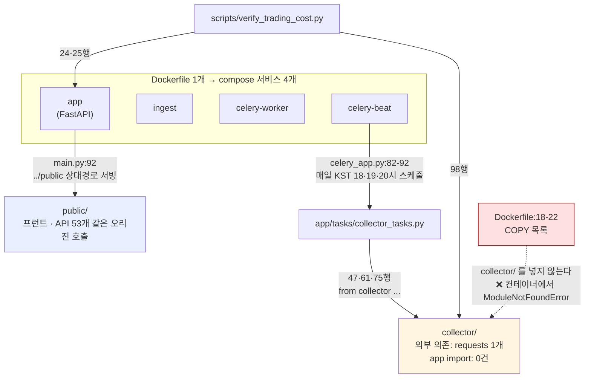

# #64 [분석] Organization 신설·저장소 이관·멀티레포 분리 판단 — 옮기는 건 쉽고, 쪼개는 건 하지 말아야 한다 (검증 정정 32건)

> 🗂️ 옛 GitHub 이슈를 옮긴 **기록 문서**입니다 — [색인](../README.md). 원문은 그대로 두고, 링크·커밋 해시만 새 자리 기준으로 바꿨습니다.

| 항목 | 내용 |
|---|---|
| 종류 | 이슈 |
| 상태 | 열림 |
| 원 작성 | 이동원(`devlee328288`) · 2026-09-21 11:41 KST |
| 라벨 | `analysis` |
| 옛 주소 | `github.com/devlee328288/Qurious/issues/64` (지금은 열리지 않음) |

## 본문

> **의뢰 질문** — *"그렇게 되면 Organization 을 파서 레포지토리를 분리해야 될까? 이 부분이 제일 문제네... 뭔가 스케일이 너무 커서 분리해야 될까 싶네. (근데 지금 그냥 일반 레포지토리라 옮기는게 가능한지도 모르겠고)"*
> **조사 방법** — 6축(이관 메커니즘 · org 무료 한도 · 분리 타당성 · 대안 · 우리 제약 · 포트폴리오)을 조사하고, GitHub 동작 사실 축은 **공식 문서로 반증 검증**했습니다. **32건이 정정**됐습니다(9.1절).
> 🔴 **실행은 하지 않았습니다.** 저장소 이관·조직 생성·권한 변경은 팀 규칙상 **사용자가 웹 UI 에서 직접** 하는 항목입니다(계정 정지 이력). 이 문서는 조사와 절차 설계까지입니다.

## 0. 질문이 셋으로 갈립니다

사용자 질문에 **서로 독립인 세 사안**이 섞여 있습니다. 하나로 묶어 결정하면 값싼 것과 비싼 것을 함께 사게 됩니다.

| | 질문 | 성격 | 답 |
|---|---|---|---|
| ① | Organization 을 파야 하나 | 팀 권한·표현 | **지금은 아닙니다** |
| ② | 저장소를 분리해야 하나 | 코드 구조 | **아닙니다 — 경계가 코드에 없습니다** |
| ③ | 지금 저장소를 옮길 수 있나 | GitHub 사실 | **옮길 수 있습니다** (Discussion 만 확인 필요) |

**그리고 조사 중 더 급한 것이 나왔습니다** — §5.4. 「필수 승인자 대신 CI 게이트가 막는다」는 방금의 결정이 **구현 0**이고, 지금 **main 직푸시도 막히지 않습니다.**

---

# Organization 을 파야 하나 · 저장소를 분리해야 하나 · 지금 저장소를 옮길 수 있나

> **이 문서의 성격**: 의뢰인 질문("스케일이 커서 분리해야 하나, 그리고 일반 저장소를 옮기는 게 가능한지도 모르겠다")에 대한 6축 조사 + 반증 검증 결과 종합입니다.
> **실행은 전혀 하지 않았습니다.** 읽기 전용 단발 조회(`gh api` · `git log` · 로컬 grep)와 공식 문서 확인만 했습니다. 저장소 이관 · org 생성 · 권한 변경 · 공개범위 변경은 팀 규칙(계정 정지 이력)에 따라 **사용자가 웹 UI 에서 직접** 합니다.
> **확실도 표기**: 🟢 공식 문서·실측으로 확인 / 🟡 추정(근거는 있으나 직접 문장 없음) / 🔴 불명(확인 못 함 — 사실처럼 쓰지 않았습니다)

---

## 1. 쉬운 요약 3줄

| # | 질문 | 답 |
|---|---|---|
| ① | **Organization 을 파야 하나?** | **지금은 아닙니다.** 파도 되고 무료지만(🟢), 우리가 org 로 새로 얻는 기능은 "여러 명이 실제로 PR 을 올릴 때"부터 값이 나옵니다. 지금 커밋은 50개 중 50개가 한 사람입니다. |
| ② | **저장소를 분리해야 하나?** | **아닙니다. 분리하면 지금 없는 문제가 새로 생깁니다.** 프런트(`public/`)를 백엔드(`app/`) 없이 바꾼 커밋이 50개 중 **0건**입니다 — 나눌 경계가 코드에 없습니다. |
| ③ | **지금 저장소를 옮길 수 있나?** | **옮길 수 있습니다.** 일반 저장소도 Settings → Danger Zone 에서 org 로 이관됩니다(🟢). 이슈·PR·Wiki·Star·커밋 이력이 따라오고 옛 링크는 리다이렉트됩니다. 단 **Discussion 9건이 따라오는지는 공식 문서에 한 줄도 없습니다(🔴)** — 이것만 확인하면 위험은 거의 0입니다. |

**한 줄로**: 옮기는 건 쉽고, 쪼개는 건 하지 말아야 하고, **지금 급한 건 둘 다 아니라 "머지를 막는 장치가 아직 0개"라는 사실**입니다(아래 §5.4).

---

## 2. 먼저 "스케일"을 실측으로 본다

### 2.1 저장소 물리 규모 — 결론: **크지 않습니다**

| 항목 | 실측값 | 판정 |
|---|---|---|
| 원격 저장소 크기 | **2,428 KB (2.4MB)** | 이메일 첨부 가능한 크기 |
| 추적 파일 수 | **180개** | 분할 압력 없음 |
| 커밋 수 | **50개** | — |
| 저장소 생성일 | **2026-09-15** (엿새 전) | — |
| 브랜치 | 15~20개 | 이미 브랜치 단위로 잘게 굴러감 |
| 태그 · 릴리스 · 마일스톤 | **0 · 0 · 0** | — |
| Fork · LFS · 서브모듈 | **0 · 없음 · 없음** | 이관을 어렵게 만드는 요소가 없음 |
| `.github/` 워크플로 | **없음** (과거 `deploy.yml` 삭제, 실행 이력 2건·둘 다 실패) | CI 는 아직 0줄 |
| 브랜치 보호 · 룰셋 | **0 · `[]` (빈 배열)** | 아무것도 머지를 막지 않음 |
| Pages | `has_pages: false` | — |
| Star · Watcher · Fork | 2 · **0** · 0 | (REST 의 `watchers_count`=2 는 star 의 별칭입니다. 실제 watcher 는 `subscribers_count: 0`) |

**줄수는 나눠서 봐야 합니다** — 과제 전제의 "약 37,000줄"은 **사람이 쓴 코드**이고, 추적 파일 전체는 **179,026줄**입니다. 차이는 벤더링된 참조 데이터 두 개입니다.

| 구분 | 줄수 |
|---|---|
| 저자 코드 (app 14,305 · public 6,616 · collector 6,353 · scripts 3,413 · alembic 682 · prompts 27) | **약 31,400줄** |
| 문서 (`docs/`) | 약 5,800줄 |
| **벤더링 데이터** (`app/services/lean_reference_data/market-hours/market-hours-database.json` 124,881줄 + `symbol-properties-database.csv` 10,416줄) | **약 135,300줄** |

17.9만 줄이 **2.4MB · 180파일**에 들어간다는 게 핵심입니다. 모노레포를 쪼개게 만드는 통상 압력(GB 단위 저장소, 수만 파일, 빌드 시간 폭발, 팀별 릴리스 주기 분리)은 **하나도 발생하지 않았습니다.**

### 2.2 그런데 의뢰인의 감각은 틀리지 않았습니다 — 큰 것은 다른 쪽입니다

```
[ 실제로 큰 것 ]                          [ 크지 않은 것 ]
━━━━━━━━━━━━━━━━━━━━━━━━━━━━━━━━━━      ━━━━━━━━━━━━━━━━━━━━━━━━━
요구사항 범위                              저장소 물리 규모
  · 세부기능       29개                      · 2.4MB
  · 산출물     10단계 55종                   · 파일 180개
  · 화면           49뷰                      · 커밋 50개
                                             · 엿새
관리 표면
  · 열린 항목 36건(PR 포함)                 나눌 경계
  · 발급 번호 최대 #63                       · public 단독 변경 0/5
  · Discussion 9건                           · 단일 Docker 이미지로 4서비스
  · 문서 상호참조 203개                      · 릴리스 주기 분기 0

인력 집중
  · 커밋 50/50 이 한 사람
  · TIL 10편 전부 한 폴더
  · 논의 응답 14세션 연속 0건
```

**무거운 건 코드가 아니라 "29개 기능 × 55종 산출물"이 이슈 트래커 하나에 평평하게 쌓여 있는 탐색 비용, 그리고 그걸 혼자 밀고 있다는 사실입니다.**

이건 저장소 경계로 푸는 문제가 아닙니다. 저장소를 5개로 쪼개도 29개 기능은 그대로 남고, 오히려 조율 지점이 1곳에서 5곳으로 늘어납니다. 같은 부담은 **라벨 축 · 마일스톤 · Projects 뷰 · 이슈 템플릿**으로 풉니다(§6, ㉠의 내역).

> 📌 **용어**
> - **모노레포 / 멀티레포**: 한 저장소에 모든 코드를 두는 방식 / 기능별로 저장소를 쪼개는 방식.
> - **이관(transfer)**: 저장소의 **소유자만** 바꾸는 기능. 복사가 아니라 같은 저장소 레코드가 그대로 움직입니다(우리 저장소 내부 ID `1370711733` 동일).
> - **리다이렉트**: 옛 주소로 들어와도 새 주소로 자동 전달되는 것. 웹 링크와 `git clone/fetch/push` 모두 해당합니다.
> - **잔디(contribution graph)**: GitHub 프로필의 초록 사각형. 커밋 **이메일**을 따라갑니다.
> - **룰셋 / 브랜치 보호**: "main 에 직접 push 금지", "CI 통과해야 머지" 같은 규칙을 저장소가 강제하는 장치. 신형이 룰셋, 구형이 브랜치 보호입니다.
> - **CODEOWNERS**: "이 파일은 누구 담당" 을 적어 두면 그 파일을 바꾸는 PR 에 자동으로 리뷰 요청이 가는 파일.
> - **Projects v2**: 지금의 GitHub Projects. **저장소가 아니라 사용자/조직이 소유**합니다(중요 — §3 참조).

---

## 3. 저장소를 옮길 수 있는가 — 이관의 사실관계

### 3.1 할 수 있습니다. 전제 조건 4개 🟢

| 조건 | 공식 문구 | 우리 상태 |
|---|---|---|
| 저장소 admin 권한 | "To transfer a repository you must have administrator access to the repository." | ✅ `devlee328288` 이 소유자 |
| 대상 org 에 저장소 생성 권한 | "you must have permission to create a repository in the target organization." | ⚠️ **`devlee328288` 은 현재 어느 org 에도 속해 있지 않습니다**(devlee 토큰으로 `user/orgs` → 0건, 그 토큰에 `read:org` 스코프 있음 확인). 기존 org 10곳은 전부 `mygithub05253` 소유입니다 → **devlee 로 org 를 새로 만들어야** 조건이 자동 충족됩니다 |
| 같은 이름 저장소·fork 없음 | "The target account must not have a repository with the same name, or a fork in the same network." | ✅ 새 org 는 비어 있음 |
| GitHub.com → GitHub.com | "Repositories on GitHub.com can only be transferred to other owners on GitHub.com." | ✅ (GitLab 은 애초에 대상이 아님) |

출처: <https://docs.github.com/en/repositories/creating-and-managing-repositories/transferring-a-repository>

### 3.2 따라오는 것 / 따라오지 않는 것 / 조건부

| 항목 | 판정 | 확실도 | 근거·비고 |
|---|---|---|---|
| 커밋 이력 · 브랜치 15개 · 태그 | **따라온다** | 🟢 | "Git information about commits, including contributions, is preserved" |
| **이슈** | **따라온다** | 🟢 | "its issues, pull requests, wiki, stars, and watchers are also transferred" |
| **Pull Request (리뷰 코멘트 포함)** | **따라온다** | 🟢 | 같은 문장. 리뷰는 PR 의 일부 |
| Wiki · Star 2 · Watcher | **따라온다** | 🟢 | 같은 문장 |
| 라벨 16개 · 마일스톤 | **따라온다** | 🟡 | 이슈 종속 객체. 이관 문서가 'labels' 를 명시하지 않음 → 이관 후 눈으로 확인 |
| 웹훅 · 시크릿 · Deploy key | **따라온다** | 🟢 | "they will remain associated after the transfer is complete" (우리는 전부 0건이라 무영향) |
| Actions 워크플로 파일 | 따라온다 | 🟢 | 저장소 안의 파일이므로 (우리는 아직 없음) |
| Git LFS 객체 | 따라온다(백그라운드) | 🟢 | 우리는 미사용 |
| Fork 관계 | 유지 | 🟢 | 우리는 fork 아님(`isFork: false`), fork 0개 |
| **이슈·PR 번호 (최대 [#63](../issues/063.md))** | **유지된다** | 🟡 | 번호 유지를 **직접 말한 문장은 없습니다.** 근거 사슬: ① 이관은 복사가 아니라 같은 레코드의 소유자 변경 ② "All links to the previous repository location are automatically redirected" 가 `…/issues/52` → `…/issues/52` 가 아니면 성립 불가 ③ 반대로 **개별 이슈를 다른 저장소로 옮기는 기능은 번호가 새로 부여됩니다**(대조 근거) |
| **Discussion 9건** | **🔴 불명** | 🔴 | **이관 문서 전문에 'discussion' 이라는 단어가 없습니다**(따라오는 목록에도, 안 따라오는 목록에도). 구조적으로는 저장소 자식 객체이고 실측상 이슈·PR 과 **같은 번호 수열**([#6](../discussions/006.md)·[#7](../discussions/007.md)·[#10](../discussions/010.md)·[#13](../discussions/013.md)·[#17](../discussions/017.md)·[#18](../discussions/018.md)·[#20](../discussions/020.md)·[#29](../discussions/029.md)·[#30](../discussions/030.md))을 씁니다 → 따라와야 맞지만 **문서 근거가 없습니다** |
| **Projects (보드)** | **따라오지 않는다** | 🟡 | Projects v2 는 "at the user or organization level" 소유이고, 저장소에 프로젝트를 나열할 때 "You can **only** list projects that are owned by the same user or organization that owns the repository" → 저장소만 옮기면 개인 소유 보드는 소유자 불일치로 떨어집니다. ⚠️ "Projects(classic) 이면 괜찮다" 는 퇴로는 **2024-08-23 sunset 이후 존재하지 않습니다**. **저장소+프로젝트를 함께 옮기는 공식 경로는 계정 Settings 쪽 하나뿐입니다**(§7 경로 B) |
| **이슈 담당자(assignee)** | **조건부 — 지워진다** | 🟢 | "issues assigned to members in the organization remain intact, and **all other issue assignees are cleared**" → **팀원이 org 초대를 수락한 뒤에** 이관해야 배정이 살아남습니다 |
| 새 담당자 지정 권한 | **🔴 문서 상충** | 🔴 | 이관 문서: "Only owners in the organization are allowed to create new issue assignments." / 저장소 역할표: Triage·Write·Maintain·Admin 에 "assign all issues and pull requests" ✓ → 두 공식 문서가 어긋납니다. 이관 직후 실제로 배정이 되는지 눈으로 확인해야 합니다 |
| GitHub Pages 사이트 | **따라오지만 주소는 리다이렉트되지 않는다** | 🟢 | "we **don't** redirect GitHub Pages associated with the repository." 주소가 `<owner>.github.io/<repo>` 라 소유자가 바뀌면 옛 데모 링크가 죽습니다. **우리는 `has_pages: false` 라 지금은 무영향 → 순서가 중요**(§7) |
| 패키지 | 레지스트리에 따라 링크 소실 가능 | 🟢 | 우리는 패키지 0건 |
| 브랜치 보호 규칙·룰셋 | **🔴 언급 없음** | 🔴 | 이관 문서가 말하지 않습니다. 우리는 둘 다 0개(`protected: false`)라 실무 영향 없음 — 단 **이관 후에 만들어야** 한다는 순서 제약 |
| 잔디(기여 그래프) | **유지된다 (조건부)** | 🟢 | 조건: 이메일 연결 + fork 아님 + default 브랜치 + **"collaborator 이거나 그 org 의 멤버"**. 이관 시 "The original owner of the repository is added as a collaborator" 로 자동 충족. ⚠️ 나중에 협업자 목록을 정리하면서 org 멤버로 두지 않으면 **과거 커밋의 잔디가 빠질 수 있습니다** |
| 옛 URL 리다이렉트 | **된다 (웹 + git 3종)** | 🟢 | "When you use `git clone`, `git fetch`, or `git push` on a transferred repository, these commands will redirect" — 팀원이 아무것도 안 해도 기존 clone 이 계속 동작합니다 |
| 리다이렉트 유효 기간 | 🔴 명시 없음 | 🔴 | 기간 만료 서술이 문서 전문에 **없습니다**. 끊기는 조건으로 제시된 것은 사건 하나뿐입니다(아래) |

### 3.3 리다이렉트가 깨지는 조건 — 그리고 우리에게 적용되는 반전 🟢

공식 경고: **"If you create a new repository or fork at the previous repository location, the redirects to the transferred repository will be permanently deleted."**

그런데 같은 문서에 **이름 영구 은퇴** 조항이 있습니다:

> "If the transferred repository contains an action listed on GitHub Marketplace, **or had more than 100 clones or more than 100 uses of GitHub Actions in the week prior to the transfer**, GitHub **permanently retires** the owner name and repository name combination … 'The repository REPOSITORY_NAME has been retired and cannot be reused.'"

**실측: 최근 7일 클론 260건 / 고유 128건** (09-19 하루 172건, 09-15 66건). 100건을 크게 넘습니다.

| 결과 | 의미 |
|---|---|
| 🟢 **좋은 쪽** | `devlee328288/Qurious` 이름이 은퇴되어 **아무도(우리 자신 포함) 다시 만들 수 없습니다** → 하드코딩 153곳의 리다이렉트를 죽일 수단이 존재하지 않습니다. "옛 이름 재생성 금지" 를 규칙으로 막을 필요조차 없어집니다 |
| 🔴 **나쁜 쪽** | **되돌릴 때 같은 이름으로 못 돌아올 가능성이 큽니다.** org → 개인 계정 재이관 자체는 공식 지원(🟢)이지만, 은퇴된 `devlee328288/Qurious` 조합을 되살리는 동작은 **문서에 없습니다(🔴)**. 즉 이관은 "언제든 원상복구" 가 아니라 **실질적으로 비가역**으로 봐야 합니다 |

### 3.4 되돌리기 🟢 / 🔴

| 항목 | 판정 |
|---|---|
| org → 개인 계정 재이관 가능? | 🟢 가능 — "you can transfer a repository owned by your organization to your personal account or to another organization" |
| 되돌릴 때 잃는 것 | 🟢 읽기 전용(read-only) 협업자는 따라오지 않음 / 모든 issue type 제거 |
| 개인→개인 이관은 1일 내 수락 필요 | 🟢 (개인→개인 문맥에만 붙은 문장) |
| org → 개인 재이관도 1일 만료가 붙는지 | 🔴 문서에 서술 없음 |
| 되돌릴 때 옛 이름 재사용 | 🔴 **은퇴 조항과 충돌 — 불명** ← 위 3.3 |

### 3.5 우리 저장소의 "이관 표면" — 문서가 '안 따라온다'고 한 것 중 우리에게 있는 것

| 문서가 경고한 항목 | 우리 상태 |
|---|---|
| Pages 사이트 리다이렉트 안 됨 | **없음** (`has_pages: false`) |
| 패키지 링크 소실 | **없음** (패키지 0) |
| `/releases/latest` 링크 깨짐 | **없음** (릴리스 0) |
| LFS 이동 지연 | **없음** (미사용) |
| Marketplace action | **없음** |
| 읽기전용 협업자 / issue type 소실 | 역방향 이관에만 해당 |
| **Projects v2** | **🔴 존재 여부 미확인** — `hasProjectsEnabled: true` 지만 이건 탭 플래그이고, GraphQL `projectsV2` 조회는 토큰에 `read:project` 스코프가 없어 403. **사용자가 웹 UI 에서 직접 봐야 합니다** |
| **Discussion** | **🔴 9건 — 유일한 큰 미지** |

**정리: 이관을 막는 실질 리스크는 Discussion 하나이고, 확정된 파손은 "org 밖 사람의 이슈 담당 배정 삭제" 하나입니다. 둘 다 순서와 백업으로 막힙니다.**

---

## 4. 분리(멀티레포)는 하지 말아야 한다

### 4.1 결론 먼저

**하지 마십시오. 4주 안에는 물론이고, 지금 구조에서는 분리가 경계를 "반영"하는 게 아니라 "발명"하는 작업입니다.**

업계 문헌에 **정량적 임계점은 존재하지 않습니다.** Nx 공식 문서가 분리 계기로 드는 것은 크기가 아니라 조직 조건 두 개입니다 — ① "저장소 수준의 엄격한 접근 제어가 필수 요구사항일 때" ② "팀들이 코드를 거의 공유하지 않고 함께 움직일 이유가 없을 때". 규모 언급은 "수백 명(hundreds of developers)" 뿐입니다. 우리는 4명이 한 제품을 같은 주기로 냅니다.

### 4.2 나눌 경계가 코드에 있는가 — 커밋 50개 전수 조사

| 후보 | 그 영역만 바꾼 커밋 | 판정 |
|---|---|---|
| **`public/` (프런트)** | **0건 / 5건** — 한 번도 `app/` 없이 바뀐 적 없음 | 경계가 **없다** |
| `app/` (백엔드) | 6건 / 15건 (40%) | 경계 아님 |
| `docs/` | 8건 / 12건 (67%) | 쪼개도 이득 없음 |
| `collector/` (수집기) | 12건 / 16건 (**75%**) | **유일한 실재 후보** |

경계를 **가로지른** 커밋: 영역을 건드린 36커밋 중 **10건(28%)**. 분리하면 이 10건이 각각 저장소 2~3곳에 나뉜 PR + 별도 리뷰 + 별도 CI + 병합 순서 조정이 됩니다.

### 4.3 코드 근거



| 발견 | 파일·행 | 의미 |
|---|---|---|
| 프런트/백엔드 분리 불가 | `app/main.py:92,94,102,106,110` — `os.path.join(__file__, "..", "public")` 로 앱 밖을 서빙, `login.html`·`app.html` 직접 반환 | 쪼개면 **CORS · 별도 정적 호스팅 · 배포 동기화가 새로 생깁니다** |
| collector 는 안쪽으로 독립 | `collector/` → `app` import **0건**, 외부 의존 `requests` **하나**, 독립 CLI 6개, `collector/README.md:37` "Postgres·Redis·Qdrant·Neo4j·Ollama 는 하나도 필요 없다" | 진짜 후보 |
| 그런데 단방향 의존이 있다 | `app/tasks/collector_tasks.py:47,61,75` · `app/celery_app.py:26,82,87,92` | app 이 collector 를 씁니다 |
| **경계가 이미 깨진 채 배포된다** | `Dockerfile:18-22` 가 `collector/` 를 COPY 하지 않는데 beat 가 매일 collector 태스크 3개를 돌립니다 | 🔴 **컨테이너에서 `ModuleNotFoundError` 가 날 구조** — 로컬 저장소 루트에서만 우연히 동작 |
| 경로 가정 | `collector/config.py:31` `ROOT = Path(__file__).resolve().parents[1]` → `ROOT/.env`, `ROOT/data/collector` | 분리하면 경로가 전부 깨짐 |
| scripts 는 양쪽을 가로지른다 | `scripts/verify_trading_cost.py:24,25,98` | 어느 저장소로도 온전히 못 보냄 |
| 릴리스 주기 분기 0 | `docker-compose.yml:52,87,116,147` 네 서비스가 전부 `build: context: .` | 분리의 핵심 전제가 없음 |

> **가장 강한 분리 반대 근거**: 지금 **한 저장소 안에서도 지켜지지 않는 경계**를 저장소로 갈라 놓으면, 이 종류의 고장이 예외가 아니라 일상이 됩니다.

### 4.4 분리 비용 vs 이득

| 구분 | 항목 | 크기 |
|---|---|---|
| 💰 비용 | 문서 내 `#NN` 상호참조 **142개** + 커밋 메시지 **61개** = **203개** 가 저장소 경계를 넘는 순간 `owner/repo#NN` 로 다시 써야 함 | 큼 |
| 💰 비용 | **개별 PR 은 이관 기능이 아예 없습니다**(저장소 통째 이관 때만 딸려 감) → 강사님 평가 항목 "코드 리뷰 기록" 을 옮길 방법이 없음 | 치명적 |
| 💰 비용 | 개별 이슈 이관은 **"같은 소유자 저장소 사이에서만"** + **번호 재부여** → 참조가 깨지는 게 아니라 **조용히 엉뚱한 대상을 가리킵니다** | 치명적 |
| 💰 비용 | 경계 교차 커밋 28% → 저장소 2~3곳 나뉜 PR + 수동 조정. **논의 응답 14세션 0건인 팀에 수동 조정 전제 구조** | 큼 |
| 💰 비용 | **org 단위 룰셋은 Free org 에서 못 씁니다** → 같은 규칙을 저장소 수만큼 따로 걸고 따로 유지 | 중 |
| 💰 비용 | Actions 동시 잡 한도(Free 20)는 저장소를 쪼개도 늘지 않음(적용 단위는 🔴 불명이나 늘어날 근거가 없음) | 소 |
| 💰 비용 | 4주 일정 · 강사님 산출물 8단계가 **하나의 GitHub/Issues/PR/Projects 체계**를 지정 | 큼 |
| ✅ 이득 | collector 만 떼면 `requirements.txt` 40+ 패키지 대신 `requests` 하나로 CI 가 몇 초 | 중 — **단 `requirements-collector.txt` 분리 + 경로 필터로 모노레포에서 더 싸게 얻음** |
| ✅ 이득 | 수집기 API 키(`DATA_GO_KR_API_KEY`·`DART_API_KEY`) 접근을 저장소 단위로 격리 | 중 — **단 환경변수 주입 경로 분리로 대체 가능** |
| ✅ 이득 | 포트폴리오에서 "독립 실행 수집기" 로 보임 | 소 — **`collector/README.md` 이미 있음** |
| ❌ 없는 이득 | "CI 가 빨라진다" | **근거 0.** `.github/workflows/` 가 없어 줄일 CI 시간이 **0분**이고, Public 이라 표준 러너가 무료 무제한 |

### 4.5 나중에 분리할 신호(trigger) — 크기가 아니라 조건

| # | 조건 | 지금 값 |
|---|---|---|
| 1 | collector 가 app 배포와 무관하게 **주 1회 이상 독립 배포**돼야 할 때 | 단일 이미지 4서비스, 분기 **0** |
| 2 | collector 를 다른 팀원이 **단독 소유**하고 app 리뷰 없이 머지해야 할 때 | 커밋 50/50 한 사람, 소유권 분리 불가 |
| 3 | `collector → app` import 가 0건을 벗어나 **반복 위반**될 때 | **0건** |
| 4 | 경계 교차율이 폴더 정리 후에도 **40% 초과**(경계 설계 자체가 틀림) / **10% 미만**(분리가 싸짐) | **28%** |
| 5 | 단일 CI 파이프라인이 **10분 초과**, 또는 저장소를 **Private 으로 전환**해 Free 2,000분 한도가 걸릴 때 | 워크플로 **0개**, Public 무제한 |
| 6 | 실투자 API 키를 **특정인만 봐야 하는** 단계 진입 (Nx 가 꼽은 정당 사유) | 아직 아님 |

**재평가 시점: 2차 프로젝트 종료 후(2026-10-26 이후).** 4주 안에 1~6 어느 것도 발생하지 않을 전망입니다.

### 4.6 대신 지금 하면 "나중 분리가 하루 작업"이 되는 3건

| # | 작업 | 대상 | 시간 |
|---|---|---|---|
| 1 | `Dockerfile` 에 `COPY collector/ ./collector/` 추가 | `Dockerfile:18-22` | 5분 (**지금 깨진 버그 수정**) |
| 2 | `collector` 가 `app` 을 import 하지 못하게 하는 CI 검사 1개 | 새 워크플로 | 30분 |
| 3 | `ROOT = parents[1]` 저장소루트 가정을 환경변수로 뺀다 | `collector/config.py:31` | 30분 |

---

## 5. Organization — 만들 이유와 만들지 않을 이유

### 5.0 먼저: **분리와 org 는 완전히 별개 사안입니다**

```
      "스케일이 커서 분리해야 하나?"
                  │
      ┌───────────┴────────────┐
      ▼                        ▼
 ① org 를 팔까?          ② 저장소를 쪼갤까?
 · 무료 (🟢)             · 203개 참조 재작성
 · 되돌리기 어려움(3.3)   · PR 이관 불가
 · 실작업 30분           · 나눌 경계가 없음
 · 얻는 것: 권한 구조     · 4주에 불가
      ▼                        ▼
   "지금은 아님 ·          "아님 · trigger
    조건 충족 시"           1~6 관측 시"
```

org 를 파도 저장소는 하나로 남길 수 있고, 저장소를 쪼개도 개인 계정에서 할 수 있습니다. **두 질문을 붙여서 답하면 안 됩니다.**

### 5.1 org 는 무료이고 한도는 우리보다 4~5자리 큽니다 🟢

| 항목 | Free org |
|---|---|
| org 생성·사용 | **$0** — "You can use organizations for free, with GitHub Free" |
| 멤버 · public 저장소 | 사실상 무제한 — "unlimited collaborators on unlimited public repositories with a **full feature set**" |
| org 당 저장소 상한 | 100,000개 (우리: 1개) |
| Actions (**Public**) | **무료 무제한** — "The use of standard GitHub-hosted runners is free: In public repositories" · 소유자 유형·플랜 무관 |
| Actions (private) | 2,000분/월 · 아티팩트 500MB · 캐시 10GB |
| 동시 잡 | 20 (Free) |
| org 감사 로그 | **180일** (Git 이벤트 7일, 기본 표시 3개월) — 개인 계정에는 없는 기능 |
| Codespaces | org 플랜에 무료 할당 **없음** — 단 **Public 저장소에서는 개인이 본인 부담으로 계속 생성 가능** ("they can still create codespaces from public repositories in the organization, but the user will pay") |

**Team 플랜($4/user/월 — 요금 페이지 표기는 "first 12 months", 13개월차 가격 🔴 불명)은 사지 마십시오.** Team 이 우리에게 추가로 주는 것은 실질적으로 org 단위 룰셋 하나이고, 그마저 **Team 인지 Enterprise 인지 공식 문서 두 곳이 어긋납니다(🔴)**.

### 5.2 CI 게이트 설계와의 정합 — Public 이면 문제 없습니다 🟢

우리 결정: **"PR 머지 필수 승인자를 두지 않는다(작업 시간대가 다름). 대신 CI 게이트가 막는다."**

| 필요한 것 | 개인 계정 Public | Free **org** Public |
|---|---|---|
| Actions 표준 러너 | 🟢 무료 무제한 | 🟢 무료 무제한 |
| 브랜치 보호 / 저장소 룰셋 | 🟢 됨 ("available in public repositories with GitHub Free") | 🟢 됨 |
| "PR 필수 + 필수 승인 **0**" | 🟢 됨 — "Required approvals can be set from 0 … the team will be added for visibility, but the team does not need to approve" | 🟢 됨 |
| 필수 상태 체크 | 🟢 됨 (플랜 게이팅 문장 자체가 없음, "full feature set" 간접 근거 → 🟡) | 🟢/🟡 동일 |
| CODEOWNERS (표시용 자동 리뷰어) | 🟢 됨 — 개인 저장소 collaborator 권한에 "Act as a code owner" 명시 | 🟢 됨 (+팀 핸들 `@org/team` 사용 가능) |
| **누가 push 할 수 있는지 제한** | ❌ **안 됨** — "You can enable branch restrictions in public repositories owned by a **GitHub Free organization**" (org 전용, Free org 는 무료) | 🟢 됨 |
| **다중 리뷰어 · 팀 리뷰 요청** | ❌ **안 됨** — 게이팅 문구에 개인 `GitHub Free` 가 빠져 있고 `GitHub Free for organizations` 만 있음 | 🟢 됨 |
| 코드 리뷰 자동 배정 | ❌ org 전용 | 🟢 됨 |
| Merge queue | ❌ org 전용 | 🟢 됨 |
| 우회 허용자 지정 · 리뷰 각하 권한 제한 | ❌ org 전용 | 🟢 됨 |
| **소유자 본인을 게이트가 막는가** | 🔴 **불명·우려** — 개인 저장소 소유자 능력 표에 "Merge a pull request on a protected branch, **even if there are no approving reviews**" 가 있습니다. "Do not allow bypassing" 토글이 개인 소유자까지 막는지는 문서에 없습니다 | 🟡 org 는 우회 허용자를 명시 지정 |
| ⚠️ Private 전환 시 | 브랜치 보호·룰셋 상실 + Actions 2,000분 한도 | 동일하게 상실 |

> 🔴 **Public 유지가 CI 게이트 설계의 전제입니다.** Private 으로 바꾸는 순간 Free 에서 룰셋이 꺼지고 게이트가 무력화됩니다. 이 사실을 규칙 문서에 박아야 합니다.
>
> 🟢 **2026년 과금 변경 확인**: 2026-01-01 hosted 러너 가격 인하, 2026-03-01 부터 self-hosted 사용에 분당 $0.002 cloud platform charge 신설. 단 **"Runner usage in public repositories will remain free"** 는 양쪽 다 유지. larger runner 는 public 에서도 항상 과금 → 워크플로는 `ubuntu-latest` 로 고정.

> 🔴 **함정 (설계 전에 알아야 함)**: 워크플로에 `paths:` 필터를 걸고 그 체크를 required 로 만들면, 다른 파트만 고친 PR 이 **영구 Pending 으로 머지 불가**가 됩니다. 공식 금지 권고: "You should not use path or branch filtering to skip workflow runs if the workflow is **required** to pass before merging." → **워크플로는 항상 실행시키고 job 마다 `if` 로 분기**하십시오("If a job … is skipped due to a conditional, it will report its status as Success"). 필수 승인자를 없앤 우리 설계와 최악으로 맞물리는 지점입니다.

### 5.3 org 를 만들 이유 / 만들지 않을 이유

| 만들 이유 | 확실도 |
|---|---|
| **버스 팩터** — 개인 저장소는 권한이 owner/collaborator **2단계뿐**이고, collaborator 초대 · 공개범위 변경 · 기본 브랜치 이름 · 보안 설정 · webhook · 삭제가 **전부 owner 전용**입니다. 지금 팀원 3명은 CI 게이트를 고칠 권한이 없고, `devlee328288` 이 단일 실패점입니다. **계정 정지 이력**이 있는 상황에서 이슈 36건·논의 9건·PR 기록이 한 개인 계정에 묶여 있습니다 | 🟢 |
| 돈 없이 열리는 기능 5개 — branch restrictions · 다중/팀 리뷰어 · 리뷰 자동 배정 · merge queue · 감사 로그 180일 | 🟢 |
| org 소유 Projects 로 여러 저장소·55종 산출물을 한 보드에서 추적 | 🟢 |
| 남의 개인 계정 저장소 핀(Pin)은 커뮤니티 실패 보고가 많고, **org 저장소 핀은 성공 보고가 일관적** | 🟡 |
| ToS — "One person or legal entity may maintain **no more than one free Account**". 현재 `mygithub05253`·`devlee328288` 둘 다 무료 개인 계정이고 정지 이력이 있습니다. org 는 맥락 분리를 위해 **ToS 가 인정하는 수단**입니다. (단정 아님 — devlee 가 팀 공용 계정인지 개인의 두 번째 계정인지에 따라 해석이 갈리고, 판단은 사용자만 할 수 있습니다) | 🟡 |
| HF org `qurious-quant` 와 이름 일치 가능 — `github.com/qurious-quant` 가 **404(비어 있음)** | 🟢 |

| 만들지 않을 이유 | 확실도 |
|---|---|
| **org 효과의 핵심이 팀원 행동에 의존합니다.** People 탭에 4명이 보이려면 각자 초대를 수락하고 **본인 멤버십을 Public 으로 직접 전환**해야 합니다(기본값 Private). **논의 응답 14세션 연속 0건**인 팀에서 2단계 행동을 전제하면 빈 org 가 남습니다 | 🟢 |
| **협업 증거 부실이 org 로 오히려 노출됩니다.** People 4명 vs Contributors 1명이면 면접에서 "나머지 세 분은 뭘 하셨나요" 가 먼저 나옵니다. 지금은 1인 저장소라 그 질문 자체가 안 생깁니다 | 🟢 |
| 이관 후 핀(Pin) 자격 후퇴 위험 — 규정은 "own the repository **or** contributions within the last year". 지금 `devlee328288` 은 소유자라 **기간 제한 없이** 핀 가능하지만, 이관하면 collaborator 로 내려오고 **org owner 가 "own the repository" 에 해당하는지 문서에 없습니다** → 최악의 경우 4명 전원이 '1년 만료' 조건 | 🔴 |
| 채용 관점 자료 중 **org 소유가 개인 소유보다 유리하다고 말한 것이 하나도 없었습니다.** 평가축은 README 품질 · 3~5개 정예 프로젝트 · 의사결정 설명 · 핀 고정 · 기여 그래프였습니다 | 🟡 |
| **잔디에 org 는 필요 없습니다** — 계상 조건이 "You are a **collaborator on the repository** or are a member of the organization that owns the repository" 로 둘을 나란히 둡니다. org 이관은 누구의 잔디도 1칸 늘리지 않습니다 | 🟢 |
| **"개인 계정은 Issues·PR 기능이 제한적" 은 거짓입니다** — 우리 개인 저장소에서 Issues 36 · Discussion 9 · Wiki · Projects 가 이미 다 돌고 있습니다. 강사님 지정 4도구가 전부 작동 중 | 🟢 |
| 4주 일정(09-27~10-26) + 이관이 실질 비가역(§3.3) | 🟢 |

### 5.4 🔴 org·분리보다 급한 것 — 지금 아무것도 머지를 막지 않습니다

| 실측 | 값 |
|---|---|
| 룰셋 | `[]` (빈 배열) |
| main 브랜치 보호 | `404 Branch not protected` |
| `.github/workflows/` | 없음 |

**"필수 승인자 대신 CI 게이트가 막는다" 는 방금의 결정이 구현 0입니다.** main 직푸시도 막히지 않습니다. org 를 파는 것보다 이걸 먼저 켜야 합니다(룰셋 1개 30분).

### 5.5 포트폴리오 — org 보다 큰 리스크가 따로 있습니다

| 실측 | 내용 |
|---|---|
| 커밋 author | **50커밋 전부 `312804146+devlee328288@users.noreply.github.com`** (표시 이름만 `devlee328288`/`devdongwonlee328288` 로 갈림) |
| 팀원 3명 커밋 | **0건** (collaborator 권한은 이미 있음: `rkdalstjr`·`GoonGuMa`·`janghwan-god` 전원 `push: true`) |
| 개인 정본 계정 `mygithub05253` 의 Qurious 기여 | **0** |

이 ID형 noreply 는 계정 ID 에 묶이고(`312804146` = `devlee328288`), 팀 폴더는 `includeIf` **경로 기준**으로 그 이메일에 고정돼 있습니다. **org 로 옮겨도 이건 1mm 도 바뀌지 않습니다.**

🔴 **계정 병합으로 풀려 하면 안 됩니다** — "If you merged multiple personal accounts, issues, pull requests, and discussions **will not be attributed to the new account and will not appear on your contribution graph**." 이슈 36건·논의 9건 귀속이 영구 소실됩니다. 이력서에 두 계정을 병기하는 편이 손실이 없습니다.

🔴 **AWS 출구 전략과의 시한**: Pages 는 리다이렉트되지 않습니다. **이관을 할 거라면 Pages 를 켜기 전, 데모 링크를 배포하기 전에** 해야 합니다. 역순으로 가면 이력서·발표자료 링크가 전부 죽고 되돌릴 수 없습니다.

또한 org 와 무관하게 지금 저장소가 포트폴리오 본체로 쓰일 준비가 안 돼 있습니다: `licenseInfo: null`(LICENSE 없음) · `homepageUrl: ""` · `readme.md` **925줄**에 팀원·역할 섹션이 없고 스크린샷 15장이 **633행부터** 시작하며 Terraform/Ansible/CloudFormation 비교 보고서가 **803~849행**에 섞여 있음 · `docs/계획서/*.docx` 2개가 Public 에 추적 중(`.gitignore:70` 예외).

---

## 6. 권고 — 세 가지 경로

| | ㉠ 지금 그대로 둔다 (+위생 작업) | ㉡ org 만 만들고 이관한다 | ㉢ org + 분리 |
|---|---|---|---|
| **작업량** | **1일 이내** (룰셋 30분 · CODEOWNERS 30분 · 라벨 10분 · 이슈 폼 1~1.5h · Projects 보드 2~3h · CI job-if 설계 2~4h · Dockerfile 5분) | **반나절~1일** (Discussion 백업 30분 · 예비 테스트 5분 · org 생성·초대·수락 대기 · 이관 클릭 · remote 갱신 4명 · 문서 1줄) + **팀원 수락 대기 시간(예측 불가)** | **며칠~수주** |
| **얻는 것** | 머지 게이트 실작동 · 파트 귀속 표시 · WBS/칸반 1보드 · 깨진 collector 경계 수정 · 링크·번호 **전부 보존** | 위 전부 + branch restrictions · 다중/팀 리뷰어 · 리뷰 자동배정 · merge queue · 감사로그 180일 · **owner 2명(버스 팩터)** · HF 와 이름 일치 | ㉡ + collector 의존 격리 · API 키 저장소 단위 분리 |
| **잃는 것 / 위험** | org 기능 5개 못 씀 · `devlee328288` 단일 실패점 유지 · ToS 2계정 상태 유지 | 🔴 Discussion 9건(불명) · 🔴 실질 비가역(이름 은퇴) · 🔴 핀 자격 후퇴 가능 · 🟢 org 밖 사람 이슈 배정 삭제 · Projects v2 별도 처리 · People 4명 vs Contributors 1명 노출 | ㉡ 전부 + **203개 참조 재작성** · **PR 이관 불가** · 이슈 번호 재부여 · org 룰셋 유료 · 교차 PR 수동 조정 |
| **4주 일정 영향** | ✅ 첫날 반나절, 나머지는 기능 구현 | ⚠️ 이관 자체는 짧지만 **팀원 수락이 병목**. 09-27 전에 못 끝내면 프로젝트 중간에 주소가 흔들림 | ❌ 들어가지 않음 |
| **되돌리기** | ✅ 자유 (파일·라벨·룰셋 삭제) | ⚠️ org→개인 재이관은 가능하나 **옛 이름 재사용 불명** | ❌ 사실상 불가 |

### ✅ 권고: **㉠ — 2차 프로젝트 4주간은 지금 저장소를 그대로 두고, 위생 작업에 반나절을 쓴다**

**왜 지금 이게 최선인가**

1. **org 가 주는 기능 5개는 "여러 명이 실제로 PR 을 올릴 때" 값이 나옵니다.** 다중 리뷰어·리뷰 자동배정·merge queue·push 제한 — 전부 커밋하는 사람이 2명 이상이어야 의미가 있습니다. 지금은 **50/50 이 한 사람**이고 팀원 3명은 이미 push 권한을 갖고 있는데도 커밋 0건입니다. **막고 있는 건 권한이 아니라 참여이고, org 는 참여를 만들지 않습니다.**
2. **실제로 급한 건 "머지를 막는 장치가 0개" 입니다.** 룰셋 `[]`, main 보호 404, 워크플로 0개. 이건 개인 계정 Public 에서 30분이면 켜집니다.
3. **이관은 실질적으로 비가역입니다.** 주간 클론 260건 때문에 옛 이름이 은퇴되어 되돌릴 때 같은 이름으로 못 돌아올 가능성이 큽니다(🔴). 논의 응답이 14세션 0건인 상태에서 4명의 수락을 전제로 비가역 결정을 하지 않습니다.
4. **의뢰인이 느낀 무거움은 요구 범위와 1인 집중에서 옵니다.** org 도 분리도 29개 기능·55종 산출물을 줄이지 않습니다. 라벨 축 · 마일스톤 · Projects 보드 하나가 같은 문제에 직접 작용합니다.
5. **㉠ 은 ㉡ 의 반대가 아니라 ㉡ 의 준비입니다.** ㉠ 을 하고 나면 org 이관은 여전히 30분이고, 그때는 Discussion 백업도 되어 있고 팀원 활동 여부도 판명돼 있습니다.

**단, 이관에 유리한 반대 논거도 정직하게**: `.github/` · Pages · 릴리스 · 보호규칙이 전부 "아직 없음" 이라 **이관 비용이 지금 가장 낮습니다.** 나중에 Pages 데모를 켠 뒤 옮기면 링크가 죽습니다. 그래서 아래 두 시점에 이 판단을 반드시 다시 봅니다.

**언제 이 판단을 다시 보는가**

| 시점 | 트리거 | 그때 하는 판단 |
|---|---|---|
| **Pages 데모를 켜기 직전** | AWS 를 끄고 저장소가 포트폴리오 본체가 될 때 | **옮길 거면 여기서 마지막 기회.** Pages 주소는 리다이렉트되지 않음 |
| **2026-10-26 (2차 종료)** | 팀원 2명 이상이 실제로 PR 을 머지했는가? | 예 → ㉡ 재검토(버스 팩터·리뷰어 기능이 값을 냄) / 아니오 → 계속 ㉠ |
| **분리는 별도** | §4.5 trigger 1~6 중 하나 관측 | 그때만 검토 |

---

## 7. 만약 이관한다면 — 절차 체크리스트

> 🔴 **실행은 사용자가 웹 UI 에서 직접 합니다.** 에이전트는 명령을 대신 실행하지 않고 GitHub API 를 반복 호출하지 않습니다(팀 규칙 2.1절 · 계정 정지 이력).

### 7.0 경로 선택 — **경로 B 를 쓰십시오**

| 경로 | 위치 | 옮겨지는 것 |
|---|---|---|
| A. 저장소 Settings | 저장소 → Settings → Danger Zone → Transfer | **저장소만** |
| **B. 계정 Settings (권장)** | 프로필 사진 → Settings → 사이드바 **Access → Organizations** → **"Move work to an organization"** → Move to an organization → Go to your organization | **"any of your repositories and projects"** — 저장소 **+ Projects** |

**Projects v2 는 저장소가 아니라 사용자/조직 소유**여서 경로 A 로는 따라오지 않습니다. 강사님 산출물 요구가 GitHub Projects 를 지정하므로 경로 B 를 써야 합니다. (독립적인 '프로젝트 이관' 문서는 docs.github.com 에 존재하지 않습니다.)

### 7.1 이관 전 (되돌리기 가능 ✅)

| # | 단계 | 되돌리기 | 비고 |
|---|---|---|---|
| 1 | **Discussion 9건(D0~D7 + 의견공유) 본문·댓글을 마크다운으로 내려 `docs/` 에 커밋** | ✅ | 🔴 **필수 관문.** 이관 시 따라오는지 문서 근거가 없고, 개별 discussion 이관은 "같은 소유자" 제약이 있어 사후 수단이 마땅치 않습니다. 30분 |
| 2 | 버릴 저장소 1개에 Discussion 1건을 만들어 버릴 org 로 이관해 보는 **5분 예비 테스트** | ✅ | 유일한 확정 수단 |
| 3 | `read:project` 스코프로 **`devlee328288` 의 Projects v2 존재 여부 확인**, 있으면 export 백업 | ✅ | 웹 UI 에서 프로필 → Projects 탭으로도 확인 가능 |
| 4 | 문서 13개 파일 · **`devlee328288/Qurious` 153곳** 일괄 치환 커밋 (리다이렉트 의존도를 0 으로) | ✅ | `sed` 1커밋. 분포: 계획서 v1.1 24 · v1.0 19 · TIL 8편 합계 86 · TIL README 15 · collector/README.md 9. **코드·설정·스크립트에는 0건** |
| 5 | **org 를 `devlee328288` 계정으로 생성** (이름 권고: `qurious-quant` — GitHub 404 확인, HF org 와 일치) | ⚠️ org 삭제는 사용자 웹 UI | devlee 가 owner 여야 이관 요건 충족. `mygithub05253` 의 기존 org 를 쓰면 팀/개인 계정 분리가 무너짐 |
| 6 | **org 기본 저장소 권한(base permission) 을 먼저 정한다** | ✅ | 🟢 "the organization's default repository permission settings and default membership privileges will **apply** to the transferred repository." Write 로 두면 모든 org 멤버가 main 에 push 가능 → CI 게이트 전제가 조용히 무너짐 |
| 7 | **팀원 4명 org 초대 → 전원 "수락 완료" 확인** (발송만으론 부족) | ✅ | 🟢 수락 전 이관하면 그 사람에게 배정된 이슈의 **담당이 지워집니다** |
| 8 | 각자 **멤버십을 Public 으로 전환** 안내 (기본값 Private) | ✅ | People 탭 표시용. 잔디와는 무관 |
| 9 | 저장소 이름은 **`Qurious` 유지** | — | 이름까지 바꾸면 치환·리다이렉트가 복잡해짐. ⚠️ 이관 중 이름 변경은 "You must be an **owner** of the target organization to rename the repository" |

### 7.2 이관 실행 (되돌리기 ⚠️ — §3.3)

| # | 단계 |
|---|---|
| 10 | 경로 B 실행 → 저장소 + (있다면) 프로젝트 지정 → 확인 문구 입력 |

### 7.3 이관 후 (되돌리기 ✅)

| # | 단계 | 명령 / 확인 |
|---|---|---|
| 11 | 로컬 remote 갱신 (팀원 4명 각자) | `git remote set-url origin https://github.com/qurious-quant/Qurious.git` — 🟢 안 바꿔도 리다이렉트로 동작하지만 문서가 강하게 권고. **GitLab 원격은 손대지 않습니다** |
| 12 | **GitLab 미러는 그대로 둡니다** | 저장소 안에 `gitlab.com`·`mygithub05253` 하드코딩 **0건**, `origin/main` = `gitlab/main` = `f3ed455` 동기. GitLab 이관은 손실 항목이 더 많고(상속 멤버 접근 상실 · 티어 하향 시 access token 폐기 · pipeline subscription/test case 삭제) 되돌리기 근거가 문서에 없어 **이번 범위에서 뺍니다.** 계획서 v1.0·v1.1 **78행 비고칸 1줄만** 갱신 |
| 13 | 커밋 신원은 그대로 | 🟢 `~/.gitconfig` 의 `includeIf "gitdir/i:…/team_project/"` 가 **경로 기준**이고, 이 저장소 `.git/config` 에도 같은 이메일이 들어 있어 이중 고정. 폴더를 옮기지 않는 한 무영향 |
| 14 | **확인 목록** (눈으로) | ☐ Discussion 9건 있는가 (없으면 1번 백업으로 복원) ☐ 이슈·PR 번호가 [#63](../issues/063.md) 까지 그대로인가 ☐ 라벨 16개 ☐ 이슈 담당 배정 살아 있는가 ☐ **팀원이 새 담당 지정을 할 수 있는가**(문서 상충 항목) ☐ Wiki ☐ Star 2 ☐ 커밋 이력 50개 + 잔디 ☐ Projects 보드 |
| 15 | 그 다음에 룰셋 + CI 게이트를 만든다 | 브랜치 보호·룰셋은 이관 여부가 🔴 불명이므로 **이관 후에** 만듭니다. 시크릿은 따라오므로(🟢) 순서 강제는 아니지만, 지금 0개라 재작업이 없습니다 |
| 16 | 그 다음에 Pages 를 켜고 데모 링크를 배포한다 | 🔴 **순서 역전 금지.** Pages 주소는 리다이렉트되지 않습니다 |
| 17 | **Public 유지** 를 설계 전제로 문서에 명문화 | Private 전환 시 Free org 에서 룰셋·브랜치 보호가 꺼지고 Actions 가 2,000분 한도 |

---

## 8. 지금 당장 정해야 할 것

| # | 결정 항목 | 기한 | 정하지 않으면 막히는 것 |
|---|---|---|---|
| 1 | **㉠ / ㉡ / ㉢ 중 하나** (권고: ㉠) | **09-26** | 09-27 이후에 결정하면 프로젝트 중간에 주소가 흔들립니다. ㉡ 은 "지금 아니면 Pages 켜기 직전" 두 창만 있습니다 |
| 2 | **저장소를 계속 Public 으로 둘 것인가** | **09-26** | Public 이 CI 게이트(룰셋·브랜치 보호)와 Actions 무료의 전제입니다. 이걸 정하지 않으면 §7.15 의 룰셋 설계를 시작할 수 없습니다 |
| 3 | **룰셋을 지금 켤 것인가** (PR 필수 + 필수 승인 **0** + 상태 체크) | **09-26** | 🔴 지금 아무것도 머지를 막지 않습니다. "승인자 없이 CI 로 막는다" 는 결정이 구현 0입니다 |
| 4 | **팀원 3명 GitHub 핸들 ↔ 실명 대응 확정** | **09-24** | CODEOWNERS 를 못 씁니다. `rkdalstjr`→강민석, `janghwan-god`→신장환 은 **키보드 배열 추정일 뿐 근거 없습니다.** 잘못 적으면 엉뚱한 사람에게 리뷰가 가고, 없는 사용자는 조용히 무시됩니다 |
| 5 | **역할표(4명 파트) 확정** — 현재 3/4 찬성 | **09-27** (계획서 기한) | CODEOWNERS 소유자 배정 · `area:*` 라벨 축 · Projects 파트 필드가 전부 여기 의존합니다 |
| 6 | (㉡ 선택 시) **org 이름** — `qurious-quant` 권고 | 결정 즉시 생성 | `github.com/qurious-quant` 가 **지금 404(비어 있음)** → 결정과 생성 사이에 시간을 두면 선점될 수 있습니다 |
| 7 | (㉡ 선택 시) **org 기본 저장소 권한(base permission)** | 이관 전 | Write 로 두면 모든 org 멤버가 main 에 직접 push 가능 → 게이트 무력화 |
| 8 | **Projects v2 존재 여부 확인** (사용자가 웹 UI 에서) | 09-26 | 있으면 이관 시 개인 계정에 남습니다. 강사님 산출물 항목 |
| 9 | **본인 포트폴리오 계정 정리 방침** — 이력서에 `devlee328288`/`mygithub05253` 어느 쪽을 적을지 | 10-26 이후 | org 여부보다 큰 리스크입니다. 🔴 **계정 병합은 하지 마십시오** — 이슈·PR·Discussion 귀속이 영구 소실됩니다 |
| 10 | **README 재구성 · LICENSE 추가 · `homepageUrl` 설정 · `.docx` 2개 처리** | 10-26 | 채용 관점 자료가 만장일치로 1순위로 꼽은 항목이 가장 약합니다(925줄, 팀원·역할 섹션 없음, 스크린샷 633행) |
| 11 | **`Dockerfile` 에 `COPY collector/` 추가** (지금 깨진 버그) | **즉시** | Celery beat 가 매일 18·19·20시에 collector 태스크를 돌리는데 컨테이너에 모듈이 없습니다 |

---

## 9. 한계와 확실도

### 9.1 반증 검증에서 **정정된** 1차 조사 내용 (틀렸던 것)

| 1차 주장 | 정정 |
|---|---|
| "Projects(classic) 이면 따라온다" | **classic 이라는 선택지는 2024-08-23 sunset 이후 존재하지 않습니다.** 남은 건 v2 뿐이고 v2 는 user/org 소유 → 저장소 이관으로 옮겨지지 않습니다. 그래서 경로 B 를 써야 합니다 |
| "옛 이름 재생성 금지를 규칙으로 못 박아야 한다 (최대 실행 리스크)" | 주간 클론 **260건 > 100건** 이라 **이름이 영구 은퇴**되어 아무도 재생성할 수 없습니다. 대신 **이관이 실질 비가역**이라는 다른 성격의 제약이 들어섭니다 |
| "이관이 깨뜨리는 것은 Discussion 하나뿐" | **두 번째가 있습니다** — "all other issue assignees are cleared". 그리고 "Only owners in the organization are allowed to create new issue assignments" 문장을 1차가 누락했습니다 |
| "게이트는 org 없이 오늘 전부 걸 수 있다 / org 이득은 권한 구조 하나뿐" | **틀렸습니다.** Free org 로 옮기면 무료로 열리는 것이 5개(branch restrictions · 다중/팀 리뷰어 · 리뷰 자동배정 · merge queue · 감사로그 180일)입니다 |
| "Codespaces 무료 할당 상실 (🔴 블로커)" | **과장입니다.** Public 저장소에서는 개인이 본인 부담으로 계속 생성 가능합니다. 막히는 건 org 대납·org 정책 |
| "Private 전환 시 Packages 500MB 라 Docker 이미지 한 개도 안 들어간다" | **현재는 틀립니다.** GHCR 컨테이너 이미지 저장·대역폭은 현재 무료(정책 변경 시 1개월 전 통지). Private 전환의 실제 비용은 Actions 2,000분 + 아티팩트 500MB |
| "Free org 감사 로그 보존기간 불명" | **문서에 있습니다 — 180일** (Git 이벤트 7일, 기본 표시 3개월). `fpt` 버전으로 게시 → Free 도 사용 가능. **org 찬성 근거였습니다** |
| "Actions 동시 잡 20개는 계정 단위" | **적용 단위가 문서에 없습니다** → 불명으로 낮춥니다(결론은 다른 근거로 유지) |
| "docs 안 `#NN` 참조 157개" | **142개** 입니다(커밋 메시지 61개는 일치 → 합계 **203개**). 157 은 `devlee328288` 하드코딩 총계와 혼입된 값 |
| "Watcher 2 · 열린 이슈 35개" | 실제 watcher 는 **`subscribers_count: 0`**(REST `watchers_count`=2 는 star 별칭), `open_issues_count: 36` 은 **열린 PR 포함** 수치 |
| "총 코드 37,000줄" | 저자 코드로는 맞지만 추적 파일 전체는 **179,026줄**(벤더링 데이터 135,300줄 포함). 나눠 적어야 합니다 |
| "Team $4 는 상시 가격" | 요금 페이지 표기는 **"first 12 months"** — 프로모션. 13개월차 🔴 불명 |
| "Draft PR 가용성 문구" | 1차가 인용한 게이팅 문장을 **현행 문서에서 찾지 못했습니다.** 현행은 플랜 게이팅 없이 서술하며, org 쪽에는 "you may need to request access to draft pull requests from an organization owner" 라는 마찰이 있습니다 |
| "self-hosted 러너 무료" | **2026-03-01 부터 분당 $0.002 cloud platform charge.** 단 "Runner usage in **public** repositories will remain free" 는 유지 |

### 9.2 확인 못 한 것 (unknown) — **추측을 사실처럼 쓰지 않았습니다**

| # | 미확인 항목 | 왜 중요한가 | 확인 방법 |
|---|---|---|---|
| 1 | 🔴 **Discussion 9건이 저장소 이관 시 따라오는가** | 이관의 유일한 큰 위험. 설계 근거 본체 | 버릴 저장소 + 버릴 org 로 5분 예비 테스트 |
| 2 | 🔴 **이슈·PR 번호(최대 [#63](../issues/063.md)) 유지 여부의 직접 문장** | 문서 203곳 참조가 걸림 (근거 사슬은 강함 → 🟡) | 예비 테스트에서 함께 확인 |
| 3 | 🔴 **Projects v2 의 실제 존재 여부·개수** | 강사님 산출물 항목 | 사용자가 웹 UI 프로필 → Projects, 또는 `read:project` 스코프 |
| 4 | 🔴 **이관 후 팀원이 새 담당 지정을 할 수 있는가** | 이관 문서와 역할표가 상충 | 이관 직후 실제로 배정해 보기 |
| 5 | 🔴 **은퇴된 이름으로 되돌아올 수 있는가** (org → `devlee328288/Qurious`) | 되돌리기 가능성의 핵심 | 문서에 없음. GitHub Support 문의 |
| 6 | 🔴 **org owner 가 핀 규정의 "own the repository" 에 해당하는가** | 4명의 포트폴리오 영속성 | 문서에 없음 |
| 7 | 🔴 **남의 개인 계정 저장소를 collaborator 가 핀할 수 있는가** | org 찬성 근거 중 유일하게 실측 가능한 것 | **팀원 1명이 지금 시도 — 비용 0** |
| 8 | 🔴 **"Do not allow bypassing" 이 개인 저장소 소유자까지 막는가** | CI 게이트가 1인에게 구속력이 있는가 | 문서에 없음 |
| 9 | 🔴 **required status checks 의 Free org public 게이팅 확정 문장** | "full feature set" 간접 근거만 | 실제로 켜 보기 |
| 10 | 🔴 브랜치 보호 규칙·룰셋이 이관을 따라가는가 | 현재 0개라 실무 영향 없음 | — |
| 11 | 🔴 Actions **변수(variables)** · Dependabot · Environment 시크릿 이관 여부 | 현재 전부 0건 | — |
| 12 | 🔴 이관 소요 시간 · 진행 중 접근 가능 여부 | 2.4MB·LFS 0 이면 즉시일 것으로 보이나 근거 없음 | — |
| 13 | 🔴 이관 후 원 소유자가 받는 collaborator 의 **권한 레벨** | "collaborator 로 추가된다" 만 있고 admin/write/read 중 무엇인지 없음 | 이관 후 확인 |
| 14 | 🔴 org 단위 룰셋이 Team 인지 Enterprise 인지 | 공식 문서 두 곳 상충 (Team 을 살 이유가 사라질 수도) | 결제 전 확인 |
| 15 | 🔴 한 개인 계정이 만들 수 있는 org 개수 상한 · 생성 남용 방지 한도 | 저장소 생성 할당량에 걸린 전례 | 문서에 없음. 한 번에 1건씩 |
| 16 | 🔴 Wiki 에 실제 페이지가 있는지 | `has_wiki: true` 는 플래그일 뿐 | 웹 UI |
| 17 | 🔴 개인 Codespaces 120 core-hours 가 org 저장소의 user-owned codespace 에도 적용되는지 | 과금 주체가 개인이라는 문구까지만 확인 | — |
| 18 | 🔴 GitLab 프로젝트 이관을 되돌릴 수 있는지 · GitLab Free Group 한도 | 이번 권고가 GitLab 을 건드리지 않아 보류 | — |
| 19 | 🔴 채용 담당자가 org 저장소를 실제로 더 높게 평가한다는 **1차 데이터** | 조사한 영어·한국어 자료 어디에도 소유자 유형별 비교가 없었습니다 | — |
| 20 | 🔴 강사님이 "Organization 소유의 팀 저장소" 를 별도로 요구하는가 | 요구 문구는 **도구**(GitHub·Issues·PR·Projects)만 지정하고 소유 형태를 말하지 않습니다 | **강사님께 직접 묻는 편이 이관보다 훨씬 쌉니다** |
| 21 | 🔴 팀원 3명이 어느 영역을 만지는지 | '소유권 분기' trigger 를 인원으로 검증 불가(커밋 0건) | 2차 프로젝트에서 판명 |

### 9.3 2026년 이후 바뀔 수 있는 것

- **Actions 과금 구조** — 2026-01-01 hosted 인하, 2026-03-01 self-hosted 에 cloud platform charge 신설. "public 무료" 는 유지되지만 이 축은 변경이 잦습니다.
- **Team 플랜 가격** — "first 12 months" 프로모션. 13개월차 가격 미확정.
- **GHCR 컨테이너 저장 무료** — "currently free … you'll be informed at least one month in advance of any change".
- **이슈 폼(YAML)** — 문서에 "currently in public preview and subject to change" 표기. Markdown 템플릿이 더 안전합니다.
- **이관 동작 세부** — Discussion·Projects 처리는 문서화 공백이 있는 영역이고 github/docs 에 이슈로 제기된 바 있습니다. **결정 시점에 다시 확인하십시오.**

### 9.4 검증 방법에 관한 주의

이관 동작 주장은 요약 페이지가 아니라 **`github/docs` 저장소의 원문 마크다운**(`raw.githubusercontent.com/github/docs/main/content/...`)으로 대조했습니다. **WebFetch 요약본에서는 '이름 영구 은퇴' 조항과 '담당자 clear' 조항이 통째로 빠져 나왔습니다** — 이 주제에서 요약 경유 확인은 신뢰할 수 없습니다.

또한 `gh api user/orgs` 는 **활성 계정 기준**으로 나갑니다. "devlee328288 은 어느 org 에도 없다" 는 devlee 토큰으로 `gh api user` → 계정 확인 후 `user/orgs` → 0건, 그 토큰에 `read:org` 스코프가 있음을 확인해 재검증한 값입니다.

---

### 부록: 핵심 출처

| 주제 | URL |
|---|---|
| 저장소 이관 (전제·따라오는 것·리다이렉트·은퇴·담당자) | `docs.github.com/en/repositories/creating-and-managing-repositories/transferring-a-repository` |
| **저장소+프로젝트 함께 옮기기 (경로 B)** | `docs.github.com/en/account-and-profile/how-tos/account-management/moving-your-work-to-an-organization` |
| 개별 이슈 이관 (같은 소유자 · 번호 재부여) | `docs.github.com/en/issues/tracking-your-work-with-issues/administering-issues/transferring-an-issue-to-another-repository` |
| Discussion 이관 제약 | `docs.github.com/en/discussions/managing-discussions-for-your-community/managing-discussions` |
| Projects (user/org 소유 · 같은 소유자만 나열) | `docs.github.com/en/issues/planning-and-tracking-with-projects/learning-about-projects/about-projects` · `.../managing-your-project/adding-your-project-to-a-repository` |
| Projects classic sunset (2024-08-23) | `github.blog/changelog/2024-05-23-sunset-notice-projects-classic/` |
| 브랜치 보호 (branch restrictions = org 전용) | `docs.github.com/en/repositories/configuring-branches-and-merges-in-your-repository/managing-protected-branches/about-protected-branches` |
| 룰셋 (저장소 단위 Free OK · org 단위 유료) | `.../managing-rulesets/about-rulesets` · `docs.github.com/en/organizations/managing-organization-settings/creating-rulesets-for-repositories-in-your-organization` |
| 필수 체크 + paths 필터 함정 | `.../defining-the-mergeability-of-pull-requests/troubleshooting-required-status-checks` |
| CODEOWNERS | `docs.github.com/en/repositories/managing-your-repositorys-settings-and-features/customizing-your-repository/about-code-owners` |
| 개인 저장소 권한 2단계 | `docs.github.com/en/repositories/managing-your-repositorys-settings-and-features/repository-access-and-collaboration/permission-levels-for-a-personal-account-repository` |
| 플랜 (Free org = public full feature set) | `docs.github.com/en/get-started/learning-about-github/githubs-plans` |
| Actions 과금 | `docs.github.com/en/billing/concepts/product-billing/github-actions` · `github.blog/changelog/2026-01-01-reduced-pricing-for-github-hosted-runners-usage/` |
| Packages / Codespaces 과금 | `docs.github.com/en/billing/concepts/product-billing/github-packages` · `.../github-codespaces` |
| org 감사 로그 180일 | `docs.github.com/en/organizations/keeping-your-organization-secure/managing-security-settings-for-your-organization/reviewing-the-audit-log-for-your-organization` |
| 잔디 계상 조건 · 병합 경고 | `docs.github.com/en/account-and-profile/reference/profile-contributions-reference` |
| 핀(Pin) 자격 | `docs.github.com/en/account-and-profile/reference/profile-reference` |
| Pages 리다이렉트 안 됨 | `docs.github.com/en/pages/getting-started-with-github-pages/what-is-github-pages` |
| ToS (무료 개인 계정 1개) | `docs.github.com/en/site-policy/github-terms/github-terms-of-service` |
| 모노레포 vs 폴리레포 (분리 계기 = 접근제어·주기분기) | `nx.dev/docs/kb/monorepo-vs-polyrepo` |

🤖 Generated with [Claude Code](https://claude.com/claude-code)
