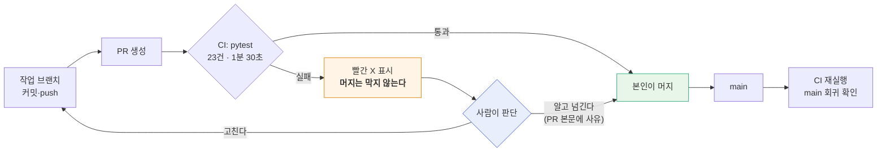

# #67 [작업] ~~CI 를 신호등으로 전환~~ → CI 워크플로 제거 + 형태를 D8 [#69](../discussions/069.md) 에서 논의

> 🗂️ 옛 GitHub 이슈를 옮긴 **기록 문서**입니다 — [색인](../README.md). 원문은 그대로 두고, 링크·커밋 해시만 새 자리 기준으로 바꿨습니다.

| 항목 | 내용 |
|---|---|
| 종류 | 이슈 |
| 상태 | 닫힘(완료) · 2026-09-21 15:36 |
| 원 작성 | 이동원(`devlee328288`) · 2026-09-21 15:26 KST |
| 옛 주소 | `github.com/devlee328288/Qurious/issues/67` (지금은 열리지 않음) |

## 본문

> ## ⚠️ 2026-09-21 갱신 — **결론이 바뀌었습니다**
>
> 이 이슈는 CI 를 **신호등으로 유지**하는 것으로 정리됐고 PR [#68](../pulls/068.md) 이 머지됐습니다.
> 그 뒤 **워크플로를 아예 걷어내고 「어떤 식으로 세울까」를 먼저 논의**하기로 다시 정했습니다.
>
> | | 이 이슈가 처음 제안한 것 | **지금 결정** |
> |---|---|---|
> | 워크플로 | 유지 (신호등) | 🔴 **삭제** |
> | 룰셋 | 안 검 | 안 검 (동일) |
> | 시험 23건 | 유지 | 🟢 유지 (동일) |
> | 다음 | — | 💬 **논의 [D8 #69](../discussions/069.md)** |
>
> **되돌린 것은 기술 판단이 아니라 순서입니다.** 아래 §1~§3 의 분석(사람 리뷰와 자동 시험이
> 보는 범위가 다르다는 것)은 취소되지 않았고, **논의의 재료로 넘어갔습니다.**
> 틀렸던 것은 그 분석을 근거로 **팀이 쓸 공용 장치를 혼자 세운 것**입니다.
>
> 아래 §4 「결정」과 §8 은 **취소선으로 표시**했습니다. 경위 전문은
> `docs/ADR/ADR-0003-CI를-걷어내고-먼저-논의한다.md` 에 있습니다.
>
> 관련: PR [#70](../pulls/070.md)(삭제) · 논의 [#69](../discussions/069.md) · ~~PR [#68](../pulls/068.md)(머지 후 되돌림)~~

---

## 요약

S40 에서 CI 를 세우며 **저장소 룰셋에 필수 상태 검사를 등록해 병합 게이트로 만들자**고
계획했다(CI/CD 명세 v1.0 §4). 그 계획을 **철회**하고, CI 를 **막지 않는 신호등**으로 둔다.

## 1. 왜 철회하나

### 1.1 게이트가 막는 대상이 우리 자신이다

v1.0 의 논리는 이랬다.

> 팀원 넷의 작업 시간대가 달라 PR 에 사람 승인을 필수로 걸면 병합이 멈춘다.
> 그래서 사람 대신 CI 가 막는다.

**이 두 문장은 이어지지 않는다.** 승인을 못 거는 이유는 *기다릴 사람*이 없어서인데,
게이트는 기다릴 사람이 아니라 **기다릴 조건**을 만든다. 승인자를 0명으로 두어도
필수 상태 검사가 빨간색이면 병합 버튼은 잠긴다.

우리 팀은 **작업자가 올리고 작업자가 머지하되, 이슈·PR 확인 요청으로 이중 검증**한다.
게이트는 그 흐름을 정면으로 가로막는다.

### 1.2 그렇다고 지우면 죽는 것이 있다

시험 23건 중 **3건은 저장소 전체를 걸어다니는 스캔**이다.

| 시험 | 훑는 범위 | 지키는 것 |
|------|-----------|-----------|
| `test_저장소_어디에도_paper_False_하드코딩이_남아있지_않다` | `app/**/*.py` 전체 | ADR-0001 실거래 차단 |
| `test_야후_참조가_기준선과_같다` | 저장소 전체 | 야후 의존 봉인선 ([#61](../issues/061.md) P1-1) |
| `test_기준선에_없는_파일이_야후를_쓰지_않는다` | 저장소 전체 | 새 파일의 야후 반입 |

이 3건은 **PR 리뷰로 원리상 잡히지 않는다.** 리뷰어는 diff 를 본다. diff 는
「이 변경이 맞는가」를 보여 줄 뿐 「저장소가 여전히 맞는가」를 보여 주지 않는다.

### 1.3 추측이 아니라 이 저장소의 전력이다

ADR-0001 이 막은 `paper=False` 하드코딩을 추적했다.

```
2e2d3f8  강사님 lumina-invest 최신본 반영 + AWS 걷어내기
            └─ auto_trade.py 의 paper=False 가 이때 들어옴
                      ▼
2e3cccc  주문이 정산금액으로 현금을 옮긴다 — orders 확장 + order_fills 신설
            └─ 같은 파일을 또 건드렸는데도 안 잡힘
                      ▼
ed0abb4  실거래로 나가는 문이 셋이었다 (2026-09-21 · S40)
            └─ 전수 조사를 해서야 발견
```

**실거래로 나가는 코드가 여러 차례 사람 눈앞을 지나갔다.** 리뷰가 게을러서가 아니다.
`2e3cccc` 는 「주문 정산」을 보는 PR 이었고 `paper=False` 는 그 관심사 밖의 줄이었다.

## 2. 두 검증은 대체재가 아니라 보완재

```
        사람 이중 검증 (PR·이슈)              CI (pytest 23건)
        ─────────────────────────            ─────────────────────────
보는 것  ┌───────────────┐                    ┌───────────────────────┐
         │  이 PR 의 diff │                    │  저장소 전체의 현재 상태 │
         └───────────────┘                    └───────────────────────┘
             ↑ 좁고 깊다                          ↑ 넓고 얕다

잡는 것  · 설계 의도가 맞는가                  · 지난번에 고친 게 되돌아왔나
         · 요구를 충족하는가                   · 전역 약속이 아직 지켜지나

못 잡음  · 다른 파일에 **이미 있던** 문제        · 의도가 옳은지
```

## 3. 검토한 선택지

| # | 안 | 자기 머지 | 회귀 탐지 | 시험 산출물 | 채택 |
|---|-----|:--------:|:--------:|:----------:|:----:|
| A | **워크플로 유지 + 룰셋 미설정 (신호등)** | ✅ 그대로 | ✅ 빨간 X | ✅ 유지 | **✅** |
| B | 워크플로 제거 | ✅ 그대로 | ❌ 없음 | ❌ 소멸 | |
| C | 워크플로 + 룰셋 (게이트) | ⚠️ 잠김 | ✅ 강제 | ✅ 유지 | |

**B 를 버린 이유** — pytest 파일은 남지만 아무도 자동으로 돌리지 않는다. 로컬 실행은
기억에 의존하고, 기억은 바쁠 때 가장 먼저 무너진다. §1.2 의 전역 스캔 3건이 사실상 죽고,
강사님 산출물 10구분의 「시험」 칸에서 실행 증거가 사라진다.

**C 를 버린 이유** — 급할 때 우회하려면 룰셋을 껐다 켜야 한다. 그렇게 우회되는 게이트는
**켜져 있다는 착각만 남기고 실제로는 막지 않는다.** ADR-0001 §1.1 의 `ebest` 와 같은
실패 양상이다 — *막았다고 믿는데 막히지 않는 것은 막지 않은 것보다 나쁘다.*

## ~~4. 결정 — 이후 흐름~~  ← **철회** (머리말 참조)



| 구성 요소 | 결정 |
|-----------|------|
| `ci.yml` 워크플로 | **유지** (비용 0 — Public 저장소는 Actions 무제한 무료) |
| pytest 23건 | **유지** |
| 저장소 룰셋 `main-gate` | **만들지 않음** |
| 필수 상태 검사 | **등록하지 않음** |
| PR 확인 요청·이슈 | **그대로 정본** |

> ⚠️ **위 표는 철회됐습니다.** `ci.yml` 은 삭제됐고(PR [#70](../pulls/070.md)), 재도입 여부·형태는 논의 [D8 #69](../discussions/069.md) 에서 정합니다.

> **용어 — 룰셋(ruleset) / 필수 상태 검사(required status check)**
> **룰셋**은 GitHub 저장소 설정에서 브랜치에 거는 규칙 묶음이다. **필수 상태 검사**는 그중 하나로,
> 「이 이름의 검사가 성공해야만 병합 가능」을 등록한 것.
> **헷갈리는 점**: 워크플로(`.github/workflows/*.yml`)와는 **다른 물건**이다.
> 워크플로는 *검사를 실행할 뿐*이고 병합을 잠그는 것은 룰셋이다.
> 워크플로만 두면 아무것도 막히지 않는다 — 이번 결정이 노리는 상태가 정확히 그것이다.

## 5. 감수하는 위험

공짜가 아니다. 솔직하게 적는다.

| 위험 | 완화책 |
|------|--------|
| 빨간 X 를 보고도 그냥 머지 | main push 에서도 CI 가 돌아 **다음 사람이 즉시 본다**. 넘긴 판단은 PR 본문에 남긴다 |
| 빨간 X 에 익숙해져 아무도 안 봄 | 시험이 23건뿐이라 실패는 드물게 나야 정상. 상시 빨간 상태가 되면 게이트를 재검토 |
| 팀원이 CI 존재를 모름 | ADR-0002 · CI/CD 명세 v1.1 을 산출물목록에 올림 |

**신호등이 게이트보다 약하다는 것을 부정하지 않는다.** 다만 약한 장치가 실제로 쓰이는 것이,
강한 장치가 우회되는 것보다 낫다고 판단했다.

## 6. 되돌릴 조건

| 조건 | 왜 그때는 게이트가 필요한가 |
|------|---------------------------|
| 빨간 X 인 채로 머지된 PR **2건 이상** 누적 | 신호등이 작동하지 않는다는 증거 |
| 팀원 PR 이 리뷰 없이 머지되는 일이 반복 | 자기 검증 전제가 깨진다 |
| 실거래·자금 이동이 **실제 계좌**에 닿는 단계 | 돌이킬 수 없는 손실 |
| 강사님이 병합 게이트를 **산출물로 요구** | 요구사항이 바뀐다 |

절차는 **CI/CD 명세 v1.1 부록 A** 에 보존했다.

## 7. 산출물

| 산출물 | 구분 (10구분) | 상태 |
|--------|--------------|------|
| `docs/ADR/ADR-0002-CI를-게이트가-아니라-신호로-둔다.md` | 시스템 설계 → ADR | 신규 |
| `docs/배포/CI-CD명세_v1.1.md` | 배포·운영·인수 → CI/CD 명세 | v1.0 → v1.1 |
| `docs/산출물목록.md` | (정본 인덱스) | v1.0 → v1.1 |
| TIL 1장 | 개발·형상 관리 → 변경이력 | 신규 |

## ~~8. 이 결정으로 없어진 숙제~~  ← **여전히 유효** (룰셋은 지금도 걸지 않습니다)

~~Settings → Rules → New branch ruleset → 필수 상태 검사 `pytest` · 승인자 0명~~
→ **하지 않는다.** S40 프롬프트 [2] 항목은 닫힌다.

---

관련: [#61](../issues/061.md) P2-3 · [#62](../issues/062.md) §5.0 · ADR-0001
