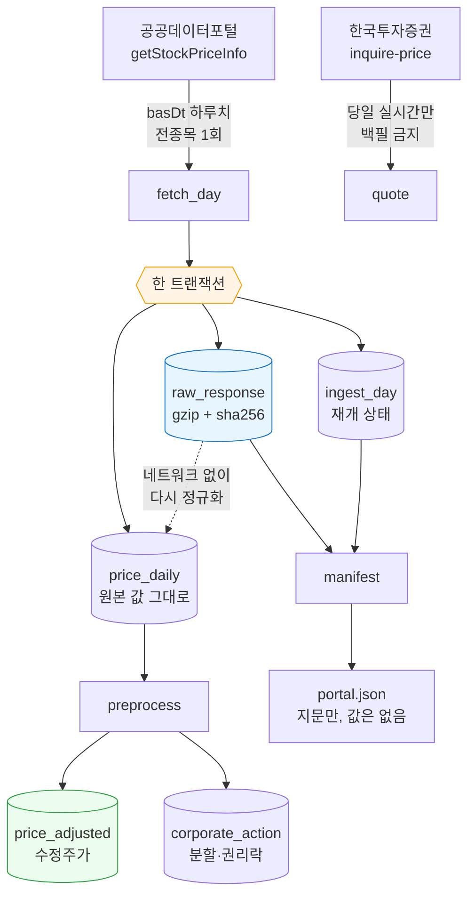

# #34 feat: 시세 수집기 — 원문 보존·vs 기반 수정주가·중단 재개 (09-22 가동)

> 🗂️ 옛 GitHub PR을 옮긴 **기록 문서**입니다 — [색인](../README.md). 원문은 그대로 두고, 링크·커밋 해시만 새 자리 기준으로 바꿨습니다.

| 항목 | 내용 |
|---|---|
| 종류 | PR |
| 상태 | 머지됨 · 2026-09-19 11:33 |
| 원 작성 | 이동원(`devlee328288`) · 2026-09-19 11:32 KST |
| 브랜치 | `feat/collector-portal-backfill` → `main` |
| 머지 커밋 | [`dd673f9`](https://github.com/EST-team-project/Qurious/commit/dd673f9543e5669837a0e79f15f2c10adba5d25a) |
| 바뀐 내용 | [비교 보기](https://github.com/EST-team-project/Qurious/compare/04f476a7558086d2c02d81b91325d52cd541d2fc...e591b3ad0a5f06dbc9923caa61658699cb7495f9) |
| 옛 주소 | `github.com/devlee328288/Qurious/pull/34` (지금은 열리지 않음) |

## 본문

09-22 데이터 수집 가동을 위해 **시세 수집기**를 세웁니다. 코드 1,972줄이고, 실제로 돌려
35 거래일 · 93,636행을 받았습니다.

이 PR 의 모든 수치는 **2026-09-19 에 직접 호출해 얻은 실측값**입니다. 추측한 값은 없고,
확인하지 못한 것은 "모른다" 라고 적었습니다.

---

## 1. 왜 앱 스택과 따로 도는가

Qurious 본체는 Postgres·Redis·Qdrant·Neo4j·Ollama 가 떠 있어야 `import` 조차 됩니다
(`app/config.py`). 수집은 그 중 **아무것도 필요 없습니다** — API 키와 디스크뿐입니다.

수집기를 스택에 묶으면 **스택이 안 뜨는 날의 시세를 통째로 놓칩니다.** 놓친 시세는
사람이 기억해서 메꿔야 하고, 결국 안 메꿉니다.

```
바꾸기 전 (스택에 묶인 모양)                바꾼 뒤 (이 PR)
────────────────────────────                ────────────────────────────
app/config.py                               collector/config.py
  ├─ Postgres  ─┐                             └─ .env 한 줄만 읽는다
  ├─ Redis      │  하나라도 안 뜨면
  ├─ Qdrant     ├─ import 실패              collector/db.py
  ├─ Neo4j      │                             └─ SQLite 파일 하나
  └─ Ollama    ─┘
       ↓                                           ↓
  수집 태스크                                 python -m collector.backfill
  (스택 없이는 못 돈다)                       (아무 것도 없이 돈다)
                                                   ↓
                                            app/tasks/collector_tasks.py
                                              └─ 스택이 있을 때만 얹는 얇은 어댑터
```

**코어가 스케줄러도 DB 스택도 모릅니다.** 그래서 CLI·Windows 작업 스케줄러·Celery Beat
어디에 붙여도 같은 코드가 돕니다.

## 2. 데이터가 흐르는 길



셋이 **한 트랜잭션**에 들어갑니다. 원문만 남고 상태가 안 남으면 다음 실행이 같은 날을 또
받아 유량을 두 배로 씁니다. 상태만 남고 원문이 안 남으면 재정규화가 불가능해집니다.

---

## 3. ★ 수정주가 규격이 바뀝니다 — `fltRt` 누적 → `vs` 기반

S26 까지의 규격은 **등락률(`fltRt`) 누적**이었습니다. 실측해 보니 그쪽이 덜 정확합니다.

### 카카오 2021-04-15 (1:5 액면분할) 실측

| 계산 방식 | 결과 | |
|---|---:|---|
| 558,000 ÷ 5 (직접 계산) | 111,600 | 틀림 |
| `fltRt` 로 역산 | 111,999.3 | 틀림 |
| **`vs`(전일대비 금액)로 역산** | **112,000** | 실제 기준가 |

거래소 기준가는 **112,000** 입니다. 호가 단위에 맞춰 조정되기 때문에 단순히 5로 나눈
값이 아닙니다. 그런데 `vs` 에 그 값이 **이미 들어 있습니다** — 종가 120,500 − 전일대비
8,500 = 112,000.

**조정계수를 추정할 필요가 애초에 없었습니다.**

### `fltRt` 는 왜 부정확한가

소수 **둘째 자리까지만** 옵니다. 삼성전자 2026-09-17 은 실제 −0.3945% 인데 `"-.39"` 로
잘려 옵니다. `vs` 는 정수 원 단위라 자를 것이 없습니다.

| 기준일 | `vs` 로 역산 | `fltRt` 로 역산 | 실제 직전 종가 |
|---|---:|---:|---:|
| 20210409 | **548,000.0** | 548,025.9 | 548,000 |
| 20210415 | **112,000.0** | 111,999.3 | 558,000 (분할일) |
| 20210421 | **119,500.0** | 119,505.8 | 119,500 |

열 곳 중 `vs` 는 **열 곳 모두** 소수점 이하 0 으로 정확히 맞았습니다.

### 두 번째 독립 신호로 교차검증

같은 응답의 **상장주식수(`lstgStCnt`)** 가 확인해 줍니다. 분할이면 주식 수가 늘어난
배수만큼 가격이 내려가므로, 가격 계수 `f` × 주식수 비율 `q` = 1 이어야 합니다.

| 분류 | 조건 | 뜻 | 79건 중 |
|---|---|---|---:|
| `split` | `f·q ≈ 1` | 분할·병합. 두 신호 일치 → **믿어도 된다** | **54** |
| `rights` | `q ≈ 1`, `f ≠ 1` | **권리락**. 신주는 나중에 상장 | **21** |
| `review` | 둘 다 어긋남 | 자동 판단하지 않는다 | **4** |

**사람이 볼 것이 5% 로 줄었습니다.**

| 기준일 | 종목 | 직전종가 | 기준가 | `f` | `q` | 분류 |
|---|---|---:|---:|---:|---:|---|
| 20210415 | 카카오 | 558,000 | 112,000 | 0.200717 | ×5.00 | `split` |
| 20210421 | 세기상사 | 61,600 | 6,160 | 0.100000 | ×10.00 | `split` |
| 20210423 | 씨젠 | 195,000 | 98,000 | 0.502564 | ×1.00 | `rights` |
| 20210429 | 대한제당 | 7,490 | 3,745 | 0.500000 | ×1.00 | `rights` |
| 20210415 | 한국석유 | 281,000 | 14,550 | 0.051779 | ×10.00 | `review` ⚠️ |
| 20210408 | 아이엠텍 | 214 | 5,350 | 25.0 | ×0.111 | `review` ⚠️ |

**🟢 S26 열린 질문 해결** — "권리락에서도 `vs` 가 통하는가". 통합니다. 씨젠(무상증자
권리락)·대한제당이 실증합니다. 대한제당은 **같은 종목에 분할(04-14)과 권리락(04-29)이
둘 다** 있는데 둘 다 정확히 잡혔습니다. 다만 권리락일엔 주식수로 교차검증할 수 없습니다.

### 🔴 거래정지가 만드는 사각지대

```
20210401~07   아이엠텍   종가    214   vs 0   거래량 0
20210408      아이엠텍   종가  5,350   vs 0   거래량 0   ← 정지인 채로 값만 바뀜
```

**`vs = 0` 이면 "가격이 이어진다" 와 "조정 정보가 없다" 가 구별되지 않습니다.** 고칠 수
있는 버그가 아니라 데이터의 한계라, `review` 로 남기고 사람에게 넘깁니다.

---

## 4. ★ 일정 설계가 바뀝니다 — 당일 수집은 성립하지 않습니다

원래 계획은 "매일 KST 14:00 당일 시세 수집" 이었습니다. **성립하지 않습니다.**

2026-09-19(토) 11:00 KST 실측:

| basDt | 요일 | totalCount | |
|---|---|---:|---|
| 20260917 | 목 | 2,870 | 있다 |
| **20260918** | **금** | **0** | **거래일인데 없다** |
| 20260913 | 일 | 0 | 휴장일 |
| 20260912 | 토 | 0 | 휴장일 |

포털은 당일 시세를 당일에 주지 않고, 더 곤란하게도 **휴장일과 "아직 안 올라온 거래일" 이
똑같이 `resultCode=00` + `totalCount=0`** 으로 옵니다. 구분해 주지 않습니다.

그래서 **최근 2주를 되돌아보며 빈 날만 채우는** 방식으로 바꿨습니다. 지연이 하루든
이틀이든 알아서 메워지고, **지연의 정확한 길이를 알아낼 필요가 없어집니다.**

같은 이유로 **KIS 가 포털의 빈 구간을 메웁니다** — 09-19 에 KIS 는 09-18 금요일 종가
(삼성전자 260,000)를 이미 주고 있었습니다. 둘은 겹치지 않고 서로를 채웁니다.

---

## 5. ★ 유량 리셋 창 확정 (S24·S25·S26 미제)

| 시각 (KST) | 남은 유량 | 읽는 법 |
|---|---:|---|
| 09-18 14:4x | 9,790 | |
| 09-18 19:26 | 9,770 | **4시간 40분 무복구** → 짧은 주기 리셋 배제 |
| 09-18 종료 | 9,757 | |
| **09-19 11:03** | **9,999** | 직전엔 10,000 → **24시간 롤링 배제** |

롤링이라면 09-18 14시 호출분은 09-19 11:03 에 아직 24시간이 안 지나 9,757 근처여야
합니다. **🟡 고정 창입니다.** 다만 창이 갈리는 시각은 19:26~11:03 사이로만 좁혀졌습니다.
**그래서 코드는 그 시각을 알 필요가 없게 짰습니다** — 헤더가 주는 남은 횟수만 봅니다.

### 백필 예산

| 항목 | 값 |
|---|---:|
| 하루치 응답 | 2,870행 · 784,012 B |
| 시장 내역 | KOSPI 942 · KOSDAQ 1,820 · **KONEX 108** |
| gzip 후 | 176,719 B (22.5%) |
| 1,648 거래일 저장량 | **약 278 MB** |
| 필요한 호출 | 1,648 + 공휴일 약 100 (주말 제외로 −28%) |
| 하루 한도 대비 | **약 17% — 하루에 끝납니다** |

> 부수 효과: 포털이 **코스피·코스닥·코넥스를 다 줍니다.** KRX Open API 코스닥 엔드포인트를
> 따로 찾을 이유가 없어졌습니다 ([#23](../issues/023.md) 숙제 하나 해소).

---

## 6. KIS 는 백필에 쓰지 않습니다 — 약관 근거

| 조항 | 내용 | 영향 |
|---|---|---|
| 제9조①4 | **서버 부하 시 이용 중지** | 수천 번 호출하는 백필이 정확히 그 모양 → **금지** |
| 제12조 | 유량은 "회사가 정하여 게시" — **수치 없음** | 직접 실측: 모의 **초당 약 2건** |
| 제5조③ | 시세는 개인 업무 한정 · **제3자 제공 금지** | 원자료 공유 기본 꺼짐 |
| 제13조 | **점검 시간엔 잔고가 실제와 다를 수 있다** | 자동매매가 이 창을 피해야 함 (D7 [#13](../discussions/013.md)) |

### `rt_cd` 를 먼저 보는 이유

KIS 는 실패해도 HTTP 200 으로 주는 경우가 있고, 유량 초과(`EGW00201`)는 **HTTP 500 에
`output2` 가 빈 배열**로 옵니다. 상태 코드만 보거나 `output` 을 바로 꺼내면 **빈 결과를
참으로 받아들입니다.** 기존 `app/services/brokers/kis.py` 가 그 경로입니다
(L66-L67 에서 `raise_for_status()` 뒤 `r.json()["output"]` 을 바로 꺼냅니다).

---

## 7. 코드 재사용 판정

| 가져온 곳 | 줄 | 판정 | 무엇을·왜 |
|---|---:|---|---|
| `Alpha_Stack/common/raw_store.py` | 300 | 🟢 **이식** → `raw_store.py` (198) | gzip+sha256 보존·무결성·통계 그대로. **바꾼 곳**: 연결을 스스로 열던 길을 막고 `conn` 을 반드시 받게 함(트랜잭션 묶기) · `ALLOWED_SOURCES` 교체 · `common.paths` 의존 제거 |
| `app/services/brokers/kis.py` | 190 | 🟡 **규격만** → `sources/kis.py` (241) | 엔드포인트·TR ID(`FHKST01010100`·`VTTC8434R`)·필드명 재사용. 코드는 재작성 — 원본은 `httpx` 비동기 + `app.config` 의존이라 스택 없이 못 돌고, **`rt_cd` 검사가 없음** |
| `app/celery_app.py` | 74 | 🟢 **그대로 얹음** | Beat 3줄 추가. `timezone="Asia/Seoul"` 이 이미 있음 |
| `app/tasks/ingest_tasks.py` | 151 | 🟢 **패턴 모방** → `collector_tasks.py` (83) | 태스크 안에서 늦게 import 하는 방식 |
| th03 `scheduler.py` (APScheduler) | 72 | 🔴 **안 씀** | 이 저장소엔 **이미 Celery Beat 가 돌고 있습니다.** 스케줄러를 하나 더 들이면 같은 일을 하는 물건이 둘이 되고 "어느 쪽이 안 돌았나" 를 찾는 일이 늡니다 |
| `Alpha_Stack` HF 3종 | 1,328 | ⏸ **보류** | "팀원이 제3자인가" 가 판단되기 전엔 원자료를 안 내보냅니다 (§8) |

1,972줄 중 이식·모방이 약 **480줄**입니다.

---

## 8. 원자료 공유는 기본 꺼짐 🔴

`RAW_SHARING` 은 환경변수로만 켜집니다. 켜기 전에 답해야 할 것:

- 🔴 **"팀원이 제3자인가"** — 1차 주석은 "private 저장소면 제3자 제공 아님", S25 정독은
  "팀원도 제3자일 수 있음". **법률 판단이라 우리가 정할 일이 아닙니다 — 강사님께 여쭐 항목.**
- 🔴 **공공누리 "변경금지"가 지표 계산까지 막는가** — 미확정

그때까지 팀은 **매니페스트(지문)만** 주고받으면 됩니다. 값이 아니라 값의 지문이라 저장소에
올려도 되고, 그것만으로 "같은 자료를 봤는가" 가 확인됩니다.

---

## 9. 검증한 것

| | 결과 |
|---|---|
| 수집 | 35 거래일 · 93,636행 · 원문 25.7MB → gzip 5.8MB (22.4%) |
| **재개** | 13일 받은 뒤 재실행 → **1회만 호출** (13일 건너뜀) |
| 무결성 | 36건 전부 풀어 sha256 대조 — **손상 0** |
| 멱등성 | `preprocess` 반복 실행 시 같은 결과 |
| KIS 모의 | 삼성전자·SK하이닉스·카카오 조회 성공, 토큰 캐시 동작 |
| 매니페스트 | 전체 지문 생성·대조·검증 동작 |

## 10. 모르는 것 (정직하게)

- 🔴 거래정지 중 `vs=0` 구간 자동 보정 불가
- 🔴 **배당 미반영** — 이건 가격수익(PR)이지 총수익(TR)이 아닙니다
- 🔴 `review` 4건(한국석유·아이엠텍·코다코·프리티) 실제 사유 미확인
- 🔴 포털 **오류 응답이 한도를 깎는지** 미확정
- 🟡 유상증자 권리락 미확인 (무상은 확인됨)
- 🟡 포털 지연이 **정확히 며칠인지** 미측정 (최소 T+1)
- 🟡 **Celery Beat 어댑터는 스택 환경에서 미검증** (로컬에 celery 미설치). 수집 코어는
  celery 없이 완전 동작함을 실증했습니다

### 이 설계를 뒤집을 조건

- `vs` 기반 조정이 **유상증자 권리락**에서 기준가와 어긋나면 → 3절을 다시 씁니다
- 포털이 **하루치 3,000행을 넘는 날**을 주면 → `fetch_day` 가 예외로 막습니다. 조용히
  잘리지 않으니 그날 압니다
- 유량이 고정 창이 아닌 것으로 드러나도 → 헤더만 보므로 코드는 그대로 둬도 됩니다

---

## 11. ⚠️ 추가 커밋 — Celery 가 태스크를 **하나도** 등록하지 못하고 있었습니다

`redis:7-alpine` 컨테이너를 띄워 어댑터를 실제로 돌려 봤습니다. 처음에는 **셋 다
`NotRegistered`** 로 실패했고, 워커의 `[tasks]` 목록이 **비어 있었습니다.**

원인은 제가 추가한 코드가 아니라 **기존 `app/celery_app.py`** 였습니다.

```python
celery_app.autodiscover_tasks(["app.tasks"])   # app/tasks/tasks.py 를 찾는다
```

`autodiscover_tasks` 는 기본적으로 각 패키지 아래 **`tasks` 라는 이름의 모듈**을 찾습니다
(`related_name="tasks"`). `app/tasks/tasks.py` 는 없습니다. 그래서 **기존 태스크 7개도
전부 등록되지 않고 있었습니다** — `ingest.*` 4개, `sync.*` 2개, `agent.run`.

조용히 실패하는 종류입니다. 워커는 `ready` 라고 찍고 정상처럼 떠 있는데 아무 일도
일어나지 않습니다. Beat 가 스케줄을 쏘아도 그대로 버려집니다.

**고친 방법**: `Celery(include=[...])` 로 모듈을 직접 적었습니다.

| | 고치기 전 | 고친 뒤 |
|---|---:|---:|
| 워커 `[tasks]` 등록 수 | **0** | **10** (기존 7 + 수집기 3) |

### 그런데 버그가 하나 더 겹쳐 있었습니다 — [#23](../issues/023.md) A4 가 지적한 그것

등록을 고쳐도 **기존 Beat 작업 2개는 여전히 안 돕니다.** Beat 가 부르는 이름이 등록
이름과 다르기 때문입니다.

```python
"task": "app.tasks.sync_tasks.sync_market_data"   # 모듈 경로 (틀림)
#        실제 등록 이름은 @celery_app.task(name="sync.market_data")
```

이름이 어긋나면 Beat 가 쏜 메시지를 워커가 모르는 태스크로 보고 버립니다. **A4 ([#23](../issues/023.md)) 가
*"Celery Beat 태스크 2개가 한 번도 실행된 적 없음"* 으로 지적한 그 결함**이고, 위의
`include` 문제와는 **별개의 버그**입니다. 하나만 고쳐서는 안 돕니다.

둘 다 고친 뒤:

| Beat 항목 | 부르는 이름 | 도달? |
|---|---|---|
| `sync-market-data-hourly` | `sync.market_data` | ✅ |
| `sync-candles-daily` | `sync.stock_candles` | ✅ |
| `collector-portal-recent` | `collector.portal_recent` | ✅ |
| `collector-rebuild-adjusted` | `collector.rebuild_adjusted` | ✅ |
| `collector-write-manifest` | `collector.write_manifest` | ✅ |

**불일치 0건.** 다만 `sync.*` 두 개는 **이름만 맞췄고 실행하지 않았습니다** — 그 경로가
A4 가 문제 삼은 **Yahoo 비공식 API** 를 타기 때문입니다. 실행은 그 소스 판단이 끝난 뒤에
하는 것이 맞다고 봅니다.

### 검증 결과

| 태스크 | 결과 |
|---|---|
| `collector.write_manifest` | 기준일 36일 · 지문 `26688522…` |
| `collector.rebuild_adjusted` | 종목 3,140 · 행 93,636 · 이벤트 2,378 |
| `collector.portal_recent` | 최근 5일 확인, 빈 날 1일 재시도 |

```bash
docker run -d --name qurious-redis-test -p 6399:6379 redis:7-alpine
REDIS_URL=redis://localhost:6399 python -m celery -A app.celery_app worker --pool=solo
#   Windows 에서는 --pool=solo 가 필요합니다 (기본 prefork 는 안 돕니다)
docker stop qurious-redis-test && docker rm qurious-redis-test   # 끝나면 반드시
```

> 덤으로 한 번 더 걸렸습니다: 첫 워커를 `pkill` 로 죽였다고 생각했는데 Windows 에서는
> 안 죽어, 구·신 워커가 같은 큐를 나눠 먹으며 **3건 중 1건만** 성공했습니다.
> `Get-CimInstance` 로 확인해 확실히 종료한 뒤에야 3/3 이 됐습니다.

---

자세한 내용은 [`collector/README.md`](https://github.com/EST-team-project/Qurious/blob/dd673f9543e5669837a0e79f15f2c10adba5d25a/collector/README.md) 와
[TIL](https://github.com/EST-team-project/Qurious/blob/dd673f9543e5669837a0e79f15f2c10adba5d25a/docs/TIL/이동원/2026-09-19-데이터가-알려주는-조정계수.md) 에 있습니다.

관련: [#1](../issues/001.md) · [#23](../issues/023.md) · [#33](../issues/033.md) · D7 [#13](../discussions/013.md)

🤖 Generated with [Claude Code](https://claude.com/claude-code)
