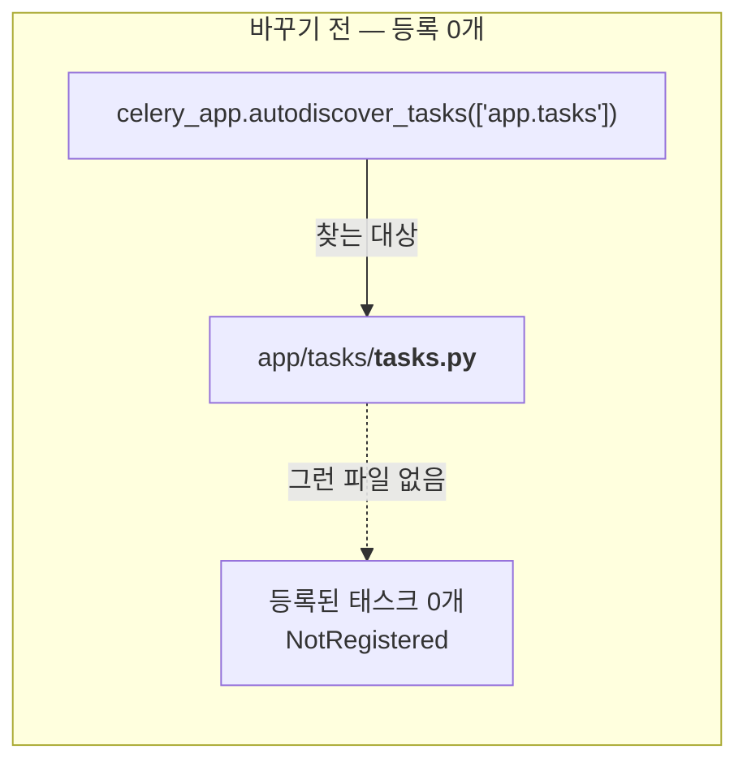
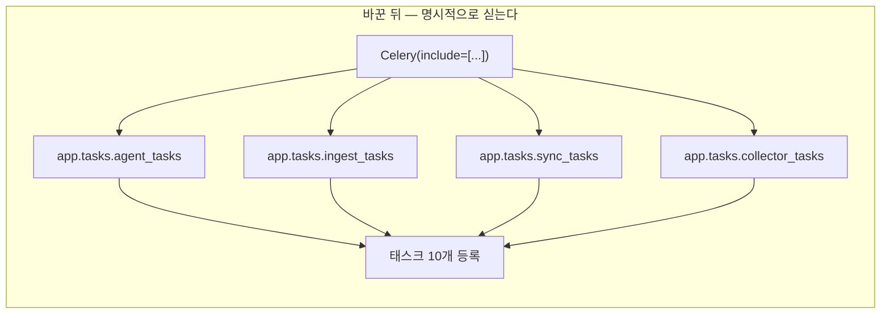

# #35 fix: PR [#34](../pulls/034.md) 이후 누락분 — Celery 태스크 등록·Beat 이름·수집 시작일 실측

> 🗂️ 옛 GitHub PR을 옮긴 **기록 문서**입니다 — [색인](../README.md). 원문은 그대로 두고, 링크·커밋 해시만 새 자리 기준으로 바꿨습니다.

| 항목 | 내용 |
|---|---|
| 종류 | PR |
| 상태 | 머지됨 · 2026-09-19 12:26 |
| 원 작성 | 이동원(`devlee328288`) · 2026-09-19 12:25 KST |
| 브랜치 | `fix/celery-tasks-and-start-date` → `main` |
| 머지 커밋 | [`76202d7`](https://github.com/EST-team-project/Qurious/commit/76202d70514971f0215c98d5d46c54b678e0a179) |
| 바뀐 내용 | [비교 보기](https://github.com/EST-team-project/Qurious/compare/dd673f9543e5669837a0e79f15f2c10adba5d25a...c1e183e025042fd5f16d218bce6c0fea2ae4eb25) |
| 옛 주소 | `github.com/devlee328288/Qurious/pull/35` (지금은 열리지 않음) |

## 본문

## 한 줄 요약

PR [#34](../pulls/034.md) 가 머지된 **8분 뒤**에 올라간 커밋 2건이 main 에 들어가지 못했습니다. 그 2건(Celery 결함 수정)과, 오늘 실측으로 확인한 수집 시작일 1건을 담아 다시 올립니다.

---

## 1. 왜 이 PR 이 따로 필요한가 — 시간 순서 문제

PR [#34](../pulls/034.md) 를 웹에서 머지하신 시각과, 제가 브랜치에 커밋을 더 올린 시각이 어긋났습니다. **PR 은 "머지 버튼을 누른 순간의 브랜치"를 가져갑니다.** 그 뒤에 같은 브랜치로 올린 커밋은 PR 에 자동으로 따라붙지 않습니다(PR 이 이미 닫혔기 때문입니다).

```
2026-09-19 (KST)

11:30  e591b3a  feat: 시세 수집기를 세운다            ─┐
                                                      ├─ PR #34 가 가져간 범위
11:33  ★ PR #34 머지 (웹)  ───────────────────────────┘
                                                       ↓ main = dd673f9

11:41  3201640  fix: Celery 가 태스크를 하나도 등록…   ─┐
11:44  6a8e8e7  fix: Beat 가 부르는 태스크 이름을…      ├─ 브랜치에만 남음 (미반영)
                                                      ─┘
12:2x  c1e183e  fix: 수집 시작일 실측 반영              ← 이번에 새로 추가

        → 이 PR = 위 3건을 main 위에 다시 얹음
```

확실도 🟢 — `git merge-base --is-ancestor 6a8e8e7 main` 이 거짓을 돌려주는 것으로 확인했습니다.

**용어 — `cherry-pick`**
- 뜻: 다른 브랜치에 있는 특정 커밋 하나를, 그 커밋만 골라 지금 브랜치에 똑같이 다시 적용하는 것.
- 이 PR 에서: 이미 만들어 둔 [`3201640`](https://github.com/EST-team-project/Qurious/commit/32016405f593180ba151def4e3ae205c4f28ef80)·[`6a8e8e7`](https://github.com/EST-team-project/Qurious/commit/6a8e8e7a89c7f54d38577d7f7e05d46a0b473204) 를 main 위에 옮겨 담는 데 썼습니다. 내용은 그대로이고 커밋 해시만 새로 붙습니다([`6ec7e02`](https://github.com/EST-team-project/Qurious/commit/6ec7e02c82ced811c7e2ecf280d8d5ca4d93e499)·[`b582c11`](https://github.com/EST-team-project/Qurious/commit/b582c11aa5fb8aecb3a044714cb5bbbb956d9ec9)).
- 헷갈리는 점: 원본 커밋이 사라지지는 않습니다. `feat/collector-portal-backfill` 브랜치에는 그대로 남아 있고, 이 PR 이 머지되면 같은 내용이 main 에도 생기는 구조입니다.

---

## 2. 담긴 변경 3건

| # | 커밋 | 무엇이 고장나 있었나 | 증상 | 확실도 |
|---|------|---------------------|------|--------|
| ① | `6ec7e02` | Celery 가 **태스크를 하나도 등록하지 못함** | 워커가 정상 기동해 `ready` 를 찍는데, 태스크를 보내면 `NotRegistered` | 🟢 Redis 컨테이너로 실측 |
| ② | `b582c11` | Beat 가 부르는 이름 ≠ 태스크 등록 이름 | Beat 가 쏜 메시지를 워커가 모르는 태스크로 보고 **조용히 버림** | 🟢 실측 |
| ③ | `c1e183e` | 수집 시작일이 추정값(2019-01-01) | 자료 없는 1년치를 매번 두드려 유량만 소모 | 🟢 `probe-start` 34회 호출로 확인 |

**①과 ②는 별개의 버그입니다.** 하나만 고치면 여전히 돌지 않습니다 — ①만 고치면 태스크는 등록되지만 Beat 가 없는 이름을 부르고, ②만 고치면 이름은 맞지만 등록된 태스크가 애초에 없습니다.

### ② 는 A4([#23](../issues/023.md))가 지적한 그 결함입니다

[#23](../issues/023.md) 의 A4 항목에 "Beat 태스크 2개가 한 번도 실행된 적 없음" 으로 적어 둔 것이 바로 이것입니다. 원인까지 확인해 고쳤으므로 [#23](../issues/023.md) 본문도 갱신하겠습니다.

---

## 3. 무엇이 어떻게 달라지나 — 전/후 구조

### ① 태스크 등록 경로





`autodiscover_tasks` 가 기본으로 찾는 것은 각 패키지 아래의 **`tasks` 라는 이름의 모듈**, 즉 `app/tasks/tasks.py` 입니다. 우리 구조는 `app/tasks/sync_tasks.py` 처럼 이름이 달라서 하나도 걸리지 않았습니다.

**용어 — `autodiscover_tasks`**
- 뜻: Celery 가 "이 패키지들 안을 알아서 뒤져서 태스크를 찾아라" 라고 시키는 함수.
- 이 문서에서: 그 "알아서"의 규칙이 우리 파일 이름과 안 맞았다는 것이 ①의 원인입니다.
- 헷갈리는 점: **실패해도 오류를 내지 않습니다.** 못 찾으면 그냥 0개를 등록하고 넘어갑니다. 워커는 멀쩡히 뜨기 때문에 로그만 봐서는 정상으로 보입니다.

### ② 이름 대조

| Beat 가 부르던 이름 (전) | 태스크의 실제 등록 이름 | 고친 뒤 |
|---|---|---|
| `app.tasks.sync_tasks.sync_market_data` | `sync.market_data` | `sync.market_data` ✅ |
| `app.tasks.sync_tasks.sync_stock_candles` | `sync.stock_candles` | `sync.stock_candles` ✅ |

등록 이름은 데코레이터에서 직접 지정한 값입니다 — `app/tasks/sync_tasks.py:16` 의 `@celery_app.task(name="sync.market_data", ...)`. 모듈 경로와 무관하게 이 이름이 정본입니다.

---

## 4. 코드 재사용 판정

새로 만든 코드가 아니라 **기존 파일을 고친 것**이고, 태스크 본체는 한 줄도 건드리지 않았습니다.

| 파일 | 줄 수 | 이 PR 에서 | 판정 | 링크 |
|------|------|-----------|------|------|
| `app/celery_app.py` | 101 | 등록 방식·Beat 이름 수정 (+35/−5) | 🟢 수정 | [app/celery_app.py](https://github.com/EST-team-project/Qurious/blob/c1e183e/app/celery_app.py) |
| `app/tasks/sync_tasks.py` | 62 | **손대지 않음** — 이름 정본 제공 | 🟢 그대로 재사용 | [sync_tasks.py:16](https://github.com/EST-team-project/Qurious/blob/c1e183e/app/tasks/sync_tasks.py#L16) |
| `app/tasks/collector_tasks.py` | 88 | **손대지 않음** — include 에 추가만 | 🟢 그대로 재사용 | [collector_tasks.py:39](https://github.com/EST-team-project/Qurious/blob/c1e183e/app/tasks/collector_tasks.py#L39) |
| `collector/backfill.py` | 306 | `DEFAULT_START` 1줄 + 주석 | 🟢 수정 | [backfill.py:54](https://github.com/EST-team-project/Qurious/blob/c1e183e/collector/backfill.py#L54) |
| `collector/README.md` | — | Celery 실행법 절 추가 (+68) | 🟢 문서 | [collector/README.md](https://github.com/EST-team-project/Qurious/blob/c1e183e/collector/README.md) |

---

## 5. ③ 수집 시작일 — 어떻게 재게 됐나

`probe-start` 는 하루씩 훑지 않고 **이분 탐색**으로 경계를 좁힙니다. 하루씩이면 2,400회가 드는 일이 34회로 끝났습니다.

```
2010-01-01 ├──────────────────────────────────────────┤ 2026-09-09
              ↓ 절반씩 좁히기 (10단계)
2019-12-27 ├──┤ 2020-01-02      ← 6일까지 좁히고 종료
   0건        자료 있음

결론: 2019-12-30 주부터 자료가 존재
      → DEFAULT_START = 2019-12-30 (2019년 마지막 거래일)
```

기존 값 `2019-01-01` 은 "이 뒤 어딘가에 시작점이 있다" 는 하한 추정이었습니다. 그대로 두면 자료가 없는 약 250 거래일을 매번 두드리게 됩니다.

**한계 🟡** — 탐색은 "그 주에 자료가 있는가"로 판정하므로, 2019-12-30 과 2020-01-02 중 정확히 어느 날이 첫날인지는 이 탐색만으로 구분되지 않습니다. 그래서 더 이른 쪽(12-30)을 시작으로 잡았습니다. 실제로 12-30 이 비어 있다면 그날은 0건으로 기록되고 넘어갈 뿐, 손해가 없습니다. **지금 돌고 있는 전량 백필의 첫 줄이 이 답을 확정해 줍니다.**

---

## 6. 검증

- ① ② : 2026-09-19 `redis:7-alpine` 컨테이너를 띄우고 워커(`--pool=solo`)를 기동해 확인했습니다. 고치기 전 `[tasks]` 목록이 비어 있었고, 고친 뒤 태스크 10개가 등록되어 보낸 3건이 3건 모두 실행됐으며 Beat 항목 5개가 전부 워커에 도달했습니다.
- ③ : `python -m collector.backfill probe-start` 실제 실행. 위 5절.
- ⚠️ `sync.*` 두 태스크는 **이름만 맞추고 실행하지 않았습니다.** 그 구현이 Yahoo 비공식 API 경로를 타기 때문입니다(우리 규칙상 호출 금지). 이름 불일치라는 결함은 해소됐지만, 그 태스크를 실제로 쓸지는 D7([#13](../discussions/013.md))에서 소스를 확정한 뒤 결정할 문제로 남습니다.

## 7. 이 판단을 뒤집을 조건

- `app/tasks/tasks.py` 를 실제로 만들게 되면 `include` 없이 autodiscover 만으로 돌 수 있습니다. 다만 그때도 **명시적 include 가 더 안전합니다** — 실패가 조용하기 때문입니다.
- 포털이 2019-12-30 이전 자료를 나중에 개방하면 `DEFAULT_START` 를 다시 내려야 합니다. 지금 값은 2026-09-19 기준 실측입니다.

🤖 Generated with [Claude Code](https://claude.com/claude-code)
