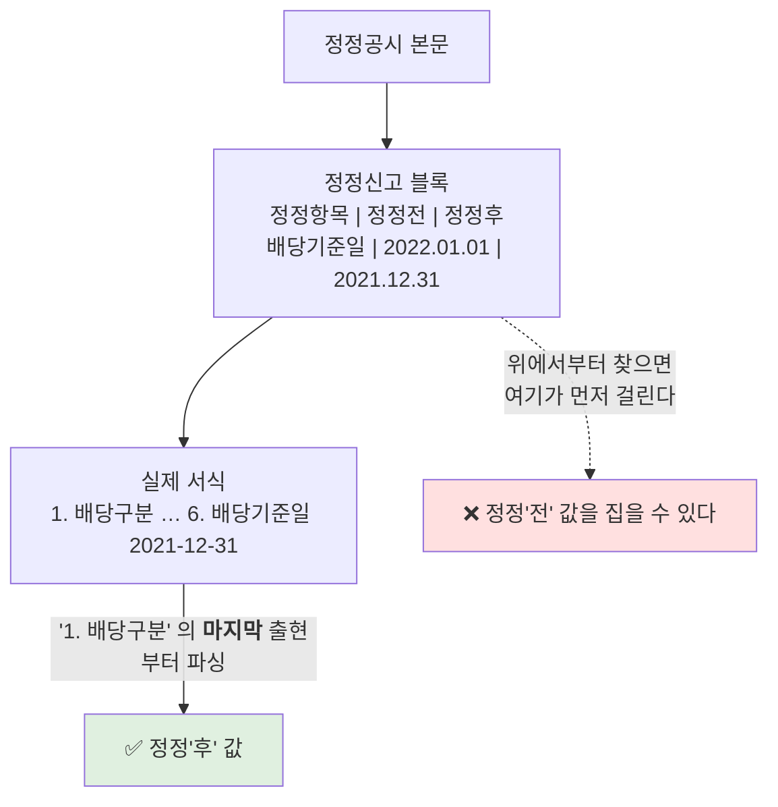
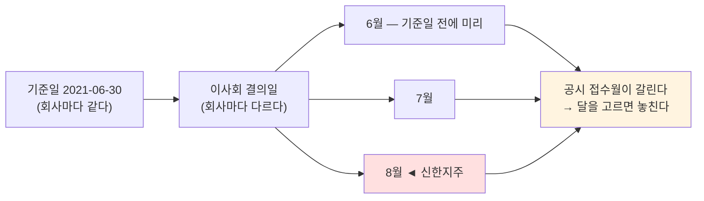

# #36 feat: 배당 수집기 — PR(가격수익)에서 TR(총수익)의 재료까지, 그리고 S29 'T-2 역산' 정정

> 🗂️ 옛 GitHub PR을 옮긴 **기록 문서**입니다 — [색인](../README.md). 원문은 그대로 두고, 링크·커밋 해시만 새 자리 기준으로 바꿨습니다.

| 항목 | 내용 |
|---|---|
| 종류 | PR |
| 상태 | 머지됨 · 2026-09-19 14:10 |
| 원 작성 | 이동원(`devlee328288`) · 2026-09-19 14:02 KST |
| 브랜치 | `feat/collector-dart-dividend` → `main` |
| 머지 커밋 | [`fe2f9e3`](https://github.com/EST-team-project/Qurious/commit/fe2f9e3eeaf0855a09bc07ccc5f110a6040decec) |
| 바뀐 내용 | [비교 보기](https://github.com/EST-team-project/Qurious/compare/76202d70514971f0215c98d5d46c54b678e0a179...d12e3ce59a9bee368f9955a8048bdbcc16152761) |
| 댓글 | 2건 |
| 옛 주소 | `github.com/devlee328288/Qurious/pull/36` (지금은 열리지 않음) |

## 본문

## 한 줄 요약

**배당 수집기를 만들었습니다.** 지금까지의 수정주가는 배당이 빠진 **가격수익(PR)** 이었고, 그래서 배당수익률이 높은 종목을 고르는 전략은 성과가 **체계적으로 낮게** 나왔습니다. DART 공시 본문에서 배당기준일·주당배당금을 읽어 `dividend` 표에 쌓습니다.

그리고 이 PR 의 절반은 **검증**입니다. 배당락일 역산이 맞는지 **서로 다른 네 가지 방법**으로 확인했고, 그 과정에서 **S29 에 제가 적어 둔 "T-2 역산" 이 틀렸다는 것**을 찾았습니다.

---

## 0. 먼저 — 용어 셋

> **PR (Price Return, 가격수익)**
> - 뜻: 주가 변동만으로 계산한 수익률.
> - 이 문서에서: 지금까지 만든 `price_adjusted` 표가 이것입니다. 분할·권리락만 반영했습니다.
> - 헷갈리는 점: "수정주가" 라는 말이 배당까지 반영한 것처럼 들립니다. 아닙니다.

> **TR (Total Return, 총수익)**
> - 뜻: 주가 변동 **+ 받은 배당**까지 합한 수익률.
> - 이 문서에서: 이번에 만든 `dividend` 표가 TR 의 **재료**입니다. TR 계산 자체는 아직 없습니다.
> - 헷갈리는 점: 배당은 **가격을 고쳐서** 넣는 게 아닙니다. 현금배당은 거래소가 기준가를 조정하지 않으므로 `vs`(전일대비)에도 안 나타나고 `corporate_action` 표에도 안 잡힙니다. **수익률에 더하는** 별도 항목입니다.

> **배당기준일 / 배당락일**
> - 배당기준일: 이 날 주주명부에 있으면 배당을 받습니다. **공시에 적혀 있는 날짜입니다.**
> - 배당락일: 이 날부터 사면 배당이 없습니다. 그래서 주가가 배당만큼 빠집니다. **공시에 안 적혀 있고, 우리가 계산해야 합니다.**
> - 헷갈리는 점: TR 에 배당을 더해야 하는 날은 **배당락일**입니다. 기준일에 더하면 이틀 어긋납니다.

---

## 1. 무엇이 비어 있었나

```
  지금까지 (PR)                        이번에 더한 것 (TR 의 재료)

  포털 일별시세 ──► price_daily          DART 공시 ──► dividend
       │                                     │
       │  vs(전일대비)로 조정                 │  본문에서 기준일·금액을 읽고
       ▼                                     ▼  배당락일을 역산
  corporate_action ──► price_adjusted    배당락일 · 주당배당금
  (분할·권리락)          = 가격수익(PR)
                                         ┌──────────────────────────┐
  ❗ 현금배당은 이 경로에 아예 없다.  ───►│ 둘을 합치면 총수익(TR)    │
     거래소가 기준가를 조정하지 않아      │ ★ 계산 자체는 아직 없다   │
     vs 에도 나타나지 않기 때문이다.      └──────────────────────────┘
```

**무엇이 틀렸었나**: 은행·통신·지주처럼 배당수익률이 높은 종목을 고르는 전략은 매년 배당수익률만큼 성과가 깎여 나옵니다. 벤치마크 비교도 성립하지 않습니다 — KOSPI **TR** 과 우리 **PR** 을 견주면 지는 것이 당연합니다.

---

## 2. 경로 둘을 재 보고 골랐습니다

S29([#33](../issues/033.md) 10.4)에서 두 경로를 실호출해 두었습니다. 이번에 그 판단대로 구현했습니다.

| 경로 | 나오는 것 | 판정 |
|---|---|---|
| `alotMatter.json`<br/>(사업보고서 배당 항목) | 주당 배당금 **3개년이 한 번에** | 🔴 **배당기준일이 없습니다** · 연간 합계라 분기배당을 못 가릅니다<br/>(삼성전자 `1,444원` 은 네 번의 합) → **교차검증용** |
| `document.xml`<br/>(「현금ㆍ현물배당결정」 본문) | 기준일 · 주당배당금 · 시가배당율 · 총액 | 🟢 **기준일이 정확히 나옵니다** · 응답 2KB · 표 형식 고정 → **주 경로** |

### 왜 달 단위로 훑나 — 그리고 왜 **열두 달 전부**인가

`list.json` 은 회사를 안 지정하고 기간+공시유형으로 전체 조회가 됩니다. 다만 기간이 3개월을 넘으면 거부되고(`status=100`), **한 달 수시공시가 2,151~6,809건**이라 100건씩 22~69쪽입니다(실측). 그래서 **달 단위**로 끊습니다.

~~배당 결의는 달이 정해져 있습니다 — 결산배당 1~3월, 분기·중간배당 4·7·10월, 이사회를 미리 여는 곳이 12월. 그 달만 훑으면 하루 안에 끝납니다.~~

> 🔴 **이 전제가 틀렸습니다.** 교차검증이 잡아냈습니다 — 5.6절. **공시는 기준일이 아니라 이사회 결의일에 나가고, 그 달은 회사마다 다릅니다.** 지금은 **열두 달 전부** 훑습니다(목록 약 2,800회 + 본문 약 12,000회 = 하루 한도 20,000 안쪽).

---

## 3. ★ S29 의 "T-2 역산" 은 틀렸습니다

S29 에 저는 이렇게 적었습니다: *"배당락일 = 배당기준일 T-2 역산"*. **이 규칙은 우연히 맞는 경우가 있어서 틀린 줄 몰랐습니다.**

```
  올바른 규칙
  ───────────
    L = 기준일 이하의 마지막 거래일
    배당락일 = L 의 한 거래일 전

    왜: 매수일 D 의 결제일은 D+2거래일이다. 기준일에 주주명부에 있으려면
        D+2거래일 ≤ L 이어야 하므로, 배당받는 마지막 매수일은 L-2거래일이고
        그 다음 날(= L-1거래일)부터 배당이 없다. 그날이 배당락일이다.


  경우 ①  기준일 2020-12-31 (휴장일)        경우 ②  기준일 2021-06-30 (거래일)
  ─────────────────────────────────        ─────────────────────────────────
    L = 12-30 (2020 마지막 거래일)            L = 06-30
    올바른 답 = 12-29                         올바른 답 = 06-29
    달력 T-2  = 12-29   ✅ 우연히 맞음         달력 T-2  = 06-28   ❌ 하루 틀림
                                                                   ▲
    S29 는 이 경우만 봤습니다.  ──────────────────────────────────┘
                                             분기·중간배당은 기준일이
                                             거래일인 경우가 대부분입니다.
```

**왜 이게 중요한가**: 결산배당(기준일 12-31, 휴장일)은 T-2 로도 맞습니다. 그런데 **분기·중간배당은 기준일이 6-30·9-30 처럼 거래일**이라 전부 하루씩 어긋납니다. 이 PR 이 실제로 담은 2021년 7월분 41건 중 **39건이 그 경우**였습니다.

거래일 달력은 새로 만들지 않았습니다 — `price_daily` 에 쌓인 **1,648 거래일**이 그것입니다. 틀린 달력을 따로 들고 있지 않으려는 것은 `portal.weekdays` 와 같은 태도입니다.

---

## 4. 검증 넷 — 공시가 스스로 적은 숫자로, 가격으로, 그리고 거래소의 조정으로

역산 규칙을 바꿨으니 "이번엔 맞다" 를 말로 하면 안 됩니다. 네 가지로 쟀습니다.

공시 본문에 이렇게 적혀 있는 것이 출발점이었습니다:

> *"시가배당율은 주주명부폐쇄일 2매매거래일 전부터 과거 1주일간 증권시장에서 형성된 최종가격의 산술평균가격에 대한 주당 배당금의 비율"*

즉 **시가배당율의 기준 창이 배당락일에서 과거로** 잡힙니다. 우리에게는 종가가 있으니, 공시가 적어 놓은 시가배당율을 우리가 재현할 수 있는지 보면 역산이 맞는지 확인됩니다.

### ① 기준일을 일부러 밀어 본 대조군 (표본 30건 · 2020~2024 · 코스피·코스닥)

창을 고정하고 **기준일만** 거래일 단위로 밀었습니다.

| 밀기(거래일) | 시가배당율 평균 절대오차 | 우리 값 대비 |
|---:|---:|---|
| −10 | 0.052 %p | 1.7배 나쁨 |
| −5 | 0.039 %p | 1.3배 나쁨 |
| −3 | 0.031 %p | 1.0배 |
| −1 | 0.026 %p | 0.9배 |
| **0 (우리 값)** | **0.030 %p** | — |
| +1 | 0.043 %p | 1.4배 나쁨 |
| +3 | 0.082 %p | **2.7배 나쁨** |
| +5 | 0.116 %p | **3.8배 나쁨** |

🟢 **늦게 미는 방향은 확실히 배제됩니다.** 그리고 **우리가 틀릴 수 있었던 방향이 바로 그 방향입니다** — 기준일 자체나 `L` 을 배당락일로 쓰는 실수는 모두 "늦게" 쪽입니다.

🟡 **앞으로 1~3거래일은 이 검정으로 갈리지 않습니다.** 가격이 천천히 움직여서 창을 하루 앞으로 밀어도 평균이 비슷합니다. 그 자리를 못 박는 것은 아래 ②·③ 입니다. (−1 이 0 보다 0.9배로 살짝 좋은 것도 이 잡음 안입니다.)

### ② KRX 공표 배당락일과 5년 연속 일치

| 연말 기준일 | 그 해 마지막 거래일 | 우리 계산 | KRX 공표 |
|---|---|---|---|
| 2020-12-31 | 12-30 | **12-29** | 12-29 ✅ |
| 2021-12-31 | 12-30 | **12-29** | 12-29 ✅ |
| 2022-12-31 | 12-29 | **12-28** | 12-28 ✅ |
| 2023-12-31 | 12-28 | **12-27** | 12-27 ✅ |
| 2024-12-31 | 12-30 | **12-27** | 12-27 ✅ |

### ③ 가격이 실제로 그날 빠집니다 (2021년 중간·분기배당 39종목)

```
              배당표본 평균등락    시장 전체     초과
   06-28         +0.954%         +0.744%     +0.210%p
   06-29  ◄─     -1.817%         -0.065%     -1.752%p   ← 우리가 구한 배당락일
   06-30         -0.168%         +0.503%     -0.671%p

   ★ 같은 날 시장은 거의 안 움직였습니다(-0.065%).
     하락이 배당 표본에만, 그 하루에만 몰렸습니다.
```

그리고 **시가배당율이 높은 종목이 더 많이 빠졌습니다**:

| 지표 | 값 | 뜻 |
|---|---|---|
| 상관계수 `r` | **+0.609** | 배당이 클수록 더 빠졌다 |
| 회귀 기울기 | **+1.23** | 1.0 이면 배당만큼 정확히 빠졌다는 뜻 |
| 표본 | n=39 | 배당락일 2021-06-29 하루 |

🟡 기울기가 1 을 넘습니다(배당보다 조금 더 빠졌습니다). n=39 의 잡음일 수도, 실제 현상일 수도 있습니다 — 표본을 늘려 다시 봅니다.

🔴 **한계**: ③은 표본 39건이 **같은 하루**에 몰려 있습니다. 시장 대비 초과수익률로 시장 요인은 뺐지만, 그날 배당주에만 작용한 다른 요인이 있었다면 구분되지 않습니다. 배당철 전체 적재가 끝나면 여러 날로 다시 잽니다.

### ④ `corporate_action` 과의 대조 — ③의 한계를 메웁니다

적재 중에 「주식배당결정」 공시를 들여다보다 찾은 검증입니다. **주식배당은 거래소가 배당락일에 기준가를 조정합니다**(주식수가 늘기 때문입니다). 즉 우리 `corporate_action` 표에 **이미 잡혀 있습니다.** ③과 달리 이것은 **거래소 자신의 조정**이라 가격 움직임 해석이 끼어들지 않습니다.

| 확인 | 결과 |
|---|---|
| 표본 | 기준일 2020-12-31 「주식배당결정」 공시 **22종목** (고정 목록) |
| 우리가 역산한 배당락일 `20201229` 의 `corporate_action` 에 있는가 | **22 / 22** 🟢 |
| 그날 `corporate_action` 전체 54건 중 주식배당으로 설명되는 비중 | **22건 (41%)** |

즉 **네 가지 서로 다른 근거**가 같은 날짜를 가리킵니다: 공시가 적은 시가배당율, KRX 공표값, 시장 대비 가격 하락, 거래소의 기준가 조정.

---

## 5. 찾아 막은 오검출 셋

제목에 "배당" 이 있는 공시를 다 받으면 **세 종류가 섞여 들어옵니다.** 앞의 둘은 표본 12건을 눈으로 보고, 셋째는 적재를 돌려 보고 찾았습니다.

| 섞여 드는 것 | 왜 위험한가 | 처리 |
|---|---|---|
| 「…결정**(자회사의 주요경영사항)**」 | 본문의 배당금이 **자회사 것**입니다. 공시를 낸 종목코드에 붙이면 **두 종목이 함께 틀립니다.**<br/>실측: **에코프로(086520)** 가 낸 공시의 450원은 **에코프로비엠(247540)** 배당이었습니다 | 제목·본문 **이중**으로 제외. 자회사가 상장사면 자기 공시를 따로 내므로 잃는 것이 없습니다 |
| 「현금ㆍ현물배당을위한**주주명부폐쇄(기준일)**결정」 | 기준일만 정하는 공시로 **배당금이 안 적혀 있습니다.** 금액은 나중에 따로 나옵니다 | 제외하되 **세어서 보고**합니다 (🟡 기준일 교차검증에 쓸 수 있습니다) |
| 「**주식배당**결정」<br/>★ 적재 중에 찾았습니다 | 현금이 아니라 **주식**을 줍니다. 서식이 달라 금액 칸이 없고, 무엇보다 **거래소가 배당락일에 기준가를 조정하므로 이미 `corporate_action` 에 있습니다** → 배당 표에 또 담으면 **이중 계상**입니다 | 제외 · 세어서 보고 |

목록 단계(제목)에서 걸러 **본문 호출을 아낍니다.** 2021-07 실측으로 대상 41건 · 제목제외 29건이었습니다 — 거르지 않으면 호출이 70% 늘어납니다.

### 정정공시 함정 — 하마터면 정정'전' 값을 담을 뻔했습니다



같은 (종목, 기준일)에 정정공시가 오면 **접수번호가 큰 쪽이 이깁니다.** 그냥 덮어쓰면 처리 순서에 따라 옛 공시가 최종값이 될 수 있어 조건을 SQL 에 박았습니다.

---

## 5.5 ★ 적재를 돌려 보고 찾은 것 셋

첫 적재에서 **검토필요가 83%(1,060/1,273)** 로 나왔습니다. 파서가 무너진 줄 알았는데 두 가지가 섞여 있었습니다.

### ① 1,038건은 파싱 실패가 아니었습니다 — 표시를 분리했습니다

기준일이 **2019-12-31**(FY2019 결산배당)이라 우리 시세 구간(2020-01-02~) 앞이고, 배당락일을 구할 거래일이 없는 것입니다.

```
  FY2019 결산배당:  배당락일 2019-12-27 ─── 우리 시세 구간 시작 2020-01-02
                              ▲                        │
                    이미 지나간 날                       │
                                                       ▼
   → 2020-01-02 에 산 사람은 이 배당을 못 받는다
   → 우리 백테스트 구간 수익률에 <b>더해서도 안 된다</b>
   → 제대로 비어야 하는 칸이다 (파싱 실패가 아니다)
```

`needs_review` 를 세우면 **진짜 문제가 1,000여 건에 묻힙니다.** 그래서 둘을 갈랐습니다.

| 표시 | 뜻 | 대응 |
|---|---|---|
| `needs_review = 1` | 본문에서 필요한 칸을 **못 읽었다.** 진짜 문제 | 원문을 보고 파서를 고친 뒤 `reparse` |
| `ex_div_dt = ''` + note | 기준일이 **시세 구간 앞**이다 | **정상.** 위 그림의 경우 |

### ② 진짜 파싱 실패 24건(1.9%)은 전부 「주식배당결정」이었습니다

그리고 이것이 4절 ④의 검증과 5절의 세 번째 제외 사유로 이어졌습니다. **못 읽는 게 문제가 아니라, 넣으면 안 되는 값이었습니다.**

★ 여기서 **[#33](../issues/033.md) 10.2 의 숙제도 하나 풀렸습니다.** 10.2.5 에 *"rights 1,045건 중 99.5%가 `q`(주식수비율)=1.0000"* 이라고 적어 두고 왜 그런지 몰랐습니다.

```
  주식배당 = 현금 대신 주식을 준다
       │
       │  배당락일에 거래소가 기준가를 조정한다  → f < 1  (가격이 끊긴다)
       │  그런데 신주는 주주총회 뒤에 발행된다   → q = 1  (주식수는 그날 안 변한다)
       ▼
  classify() 가 보는 것: f<1 이고 q=1   → 10.2.5 가 말한 그 신호

  실측: 22종목 중 21종목이 배당락일에 상장주식수 불변
```

🟡 그리고 `kind` 라벨이 이것을 잘못 붙입니다.

| `kind` | 주식배당 22종목 중 | 왜 |
|---|---:|---|
| `split` | **18건** | `LSTG_CROSS_TOL = 0.05`. 배당률 2~5% 면 `f≈0.96~0.99` → `f×q` 가 1 에서 5% 안쪽 → **주식수가 안 변했는데도 `split`** |
| `rights` | 4건 | 배당률이 커서 `f < 0.95` 인 것들 (에이리츠 `f=0.8999` 등) |

⚠️ **가격 조정 자체는 영향이 없습니다.** `price_adjusted` 는 `kind` 와 무관하게 계수를 곱합니다. `kind` 는 사람이 보는 라벨일 뿐입니다. 그래도 라벨이 틀리면 나중에 *"split 인데 주식수가 왜 그대로지"* 를 다시 조사하게 되므로 적어 둡니다.

### ③ ⚠️ 기본키 설계 결함 — 종류가 다른 공시가 같은 짝을 씁니다

*"접수번호가 큰 쪽이 이긴다"* 는 **정정공시에는 맞고, 종류가 다른 공시에는 틀립니다.**

```
  같은 종목 · 같은 기준일 2020-12-31

  「주식배당결정」        접수번호 2021xxxx  ─┐  같은 (종목, 기준일)
  「현금ㆍ현물배당결정」  접수번호 2021yyyy  ─┘  → 접수번호 큰 쪽이 덮어쓴다

  ❗ 정정이 아니라 서로 다른 사실인데 하나가 사라진다.
     주식배당 22건이 16건으로 줄어 있는 것을 보고 알았습니다.
```

주식배당을 제외하니 이 충돌은 사라집니다 — 남는 것은 「현금ㆍ현물배당결정」과 그 정정뿐이고, 그때는 "나중 접수번호가 이긴다" 가 맞습니다. 그래도 **같은 일이 또 생기면 눈에 띄게** `status` 가 덮어쓰기 수를 띄웁니다(달별 저장 합계 vs 표에 남은 행).

### 그리고 46달 훑기를 멈춰 세운 상태 코드 하나

`status=014 파일이 존재하지 않습니다` — 목록에는 있는데 본문을 못 주는 공시가 2020-01 에 있었습니다. 우리가 고칠 수 없는 결손인데 **한 건 때문에 전체가 멈췄습니다.** 별도 예외로 빼고 세어서 보고하게 했습니다. 조용히 넘기지는 않습니다 — 그러면 "그 달엔 배당이 없었다" 로 둔갑합니다.

---

## 5.6 ★★★ 교차검증이 **빠진 배당**을 찾아냈습니다 — 달을 고를 수 있다는 전제가 틀렸습니다

2절에 *"배당 결의는 달이 정해져 있다"* 고 적고 일곱 달만 훑었습니다. **틀렸습니다.**

### 어떻게 알았나 — 두 경로를 맞춰 보는 것 말고 방법이 없습니다

주 경로(공시 본문)는 **공시를 하나라도 놓치면 조용히 적게** 나옵니다. 빠진 자리에 아무 표시도 남지 않습니다. 그래서 [#33](../issues/033.md) 10.4.4 에 *"두 경로를 다 쓴다 — 서로 검증하기 위해서"* 라고 적어 두었고, 이번에 실제로 돌렸습니다.

표본 8종목 × 5개년을 `alotMatter`(사업보고서 **연간 확정치**)와 맞춰 봤습니다.

| 결과 | 건수 |
|---|---:|
| ✅ 일치 | **24** |
| ❗ 어긋남 | 12 |
| 사업보고서에 연도가 없음 | 4 |

**어긋남 12건 중 11건은 설명이 됐습니다.**

| 설명 | 예 |
|---|---|
| **수집 구간(2020-01~) 앞에서 공시된 것** — 2019년 분기배당 공시는 2019년에 나갔습니다 | 삼성전자 2019: 우리 354 vs 1,416 (= 354×4 중 결산 한 번만 있음) |
| **아직 안 훑은 달** — FY2023 결산배당 공시는 **2024년 2~3월**에 나옵니다 | 현대차 2023: 3,000 vs 11,400 · KB금융 2023: 1,530 vs 3,060(정확히 절반) |

### ❗ 그런데 신한지주만 설명이 안 됐습니다

```
  신한지주 055550 — 우리가 가진 기준일과 그 공시가 접수된 달

    기준 20211231  결산 1,400원   공시 202202
    기준 20210930  분기   260원   공시 202110
    기준 20210630  ??????        ← 없다              우리 합계 1,660
                                                     사업보고서   1,960   차이 300원

  목록을 직접 조회했다 (corp_code + 기간)

    2021-07-01 ~ 2021-09-30  →  ★ 2021-08-13  현금ㆍ현물배당결정
    2022-06-01 ~ 2022-08-31  →  ★ 2022-08-12  현금ㆍ현물배당결정
                                       ▲
              8월이다. DIVIDEND_MONTHS = (1,2,3,4,7,10,12) 에 8월이 없었다.
```

### 왜 달을 고를 수 없나

**공시는 기준일이 아니라 이사회 결의일에 나갑니다.** 같은 기준일(6-30) 배당도 **6월에 미리 결의하는 회사 · 7월에 하는 회사 · 8월에 하는 회사**가 모두 있습니다. 어느 회사가 어느 달에 결의하는지는 **미리 알 방법이 없습니다.**



**고침**: `DIVIDEND_MONTHS = tuple(range(1, 13))`. 비용은 목록 약 2,800회 + 본문 약 12,000회로 하루 한도 20,000 안쪽입니다. 여유가 줄지만 **놓친 배당은 영영 모릅니다.**

### 그래서 `crosscheck` 를 일회용 스크립트로 두지 않았습니다

```bash
python -m collector.dividend crosscheck [--codes 005930,033780]
```

이 검증이 실제로 버그를 잡았으므로 **저장소에 남깁니다.** 머리말에 *"어긋남이 곧 결함은 아니다"* 와 설명되는 세 경우(구간 앞 · 안 훑은 달 · 인적분할)를 적어 두었습니다 — 다음 사람이 ❗ 를 보고 놀라지 않게.

### ⚠️ `alotMatter` 파싱 함정 하나

응답의 `bsns_year` 가 **`None` 으로 옵니다** — API 가 요청 값을 되돌려 주지 않습니다. 그것을 믿었다가 표본 8종목이 **통째로 "결측"** 으로 나왔습니다. 연도는 우리가 요청한 값으로 셉니다.

### 🟢 덤으로 얻은 확증

**삼성전자**가 우리 날짜별 합계와 사업보고서가 정확히 맞습니다.

| 연도 | 우리(날짜별 합계) | 사업보고서 | |
|---|---:|---:|---|
| 2020 | **2,994** (354×3 + 결산 1,932 특별배당) | 2,994 | ✅ |
| 2021 | **1,444** (361×4) | 1,444 | ✅ |
| 2022 | **1,444** | 1,444 | ✅ |
| 2023 | **1,444** | 1,444 | ✅ |

**이 1,444원이 [#33](../issues/033.md) 10.4.1 에 적어 둔 그 값입니다.** S29 에 *"alotMatter 는 연간 합계라 언제 얼마를 받았는지 알 수 없다"* 고 적은 그 숫자를, 이제 **날짜별로 쪼개서 되맞출 수 있습니다.**

---

## 6. ⚠️ 파싱이 조용히 실패한 버그 하나 (기록용)

강사님 피드백 ⑤(주석·개념 기록)에 따라 남깁니다. **표본 12건이 전부 "배당이 안 적혀 있다" 로 나왔습니다.**

```
  공시 본문은 XML 이 아니라 HTML 이고, 태그마다 줄이 바뀌어 있습니다.

  <tr>
    <td> <span>6. 배당기준일</span> </td>      ← 줄바꿈
    <td> <span>2020-12-31</span> </td>        ← 줄바꿈
  </tr>

  줄바꿈을 살려 둔 채 </td>→탭, </tr>→줄바꿈 으로 바꾸면:

    "6. 배당기준일 \t"        ← 라벨만 있는 줄
    "2020-12-31 \t"          ← 값만 있는 줄      ★ 갈라졌다

  → 라벨은 찾히는데 값 칸이 늘 빈다
  → "공시에 배당이 안 적혀 있다" 는 잘못된 결론

  고침: 원본 줄바꿈을 <b>먼저</b> 없앤 뒤 태그 치환을 한다.
```

덧붙여 본문 8KB 중 **6KB 가 `<style>` 안의 CSS** 였습니다. 태그만 벗기면 CSS 글자가 표 칸으로 섞여 들어옵니다 — `<style>`·`<script>` 는 통째로 버립니다.

**왜 이 버그가 무서운가**: 예외가 안 납니다. "0건" 으로 조용히 성공합니다. 표본을 눈으로 보지 않았다면 배당철 전체를 훑고 나서 "우리 시장엔 배당이 없다" 는 결론을 얻었을 것입니다.

---

## 7. 코드 재사용 판정

| 대상 | 위치 | 줄 | 판정 |
|---|---|---:|---|
| `RateLimiter` (간격·한도) | [`ratelimit.py`](https://github.com/EST-team-project/Qurious/blob/76202d7/collector/ratelimit.py) | 102 | ✅ **한 줄도 안 고치고 재사용** — 출처만 DART 로 |
| `raw_store` (원문 보존·검증) | [`raw_store.py`](https://github.com/EST-team-project/Qurious/blob/76202d7/collector/raw_store.py) | 198 | ✅ **그대로** — `ALLOWED_SOURCES` 에 `dart` 가 이미 있었습니다 |
| `ingest_day` (중단·재개) | [`db.py`](https://github.com/EST-team-project/Qurious/blob/76202d7/collector/db.py#L82) | — | ✅ **표 구조 재사용** — `source='dart_dividend'`, `bas_dt` 칸에 `YYYYMM`. 표를 새로 만들지 않았습니다 |
| `sources/portal.py` | [`portal.py`](https://github.com/EST-team-project/Qurious/blob/76202d7/collector/sources/portal.py) | 255 | 🆕 **참고만** → `sources/dart.py` (663줄). 포털은 "하루=한 호출" 인데 DART 는 "목록→본문" 두 단계라 구조가 다릅니다 |
| `backfill.py` 러너 | [`backfill.py`](https://github.com/EST-team-project/Qurious/blob/76202d7/collector/backfill.py) | 305 | 🆕 **패턴 모방** → `dividend.py` (335줄). 재개·한도·CLI 골격은 같고 단위가 날짜→달입니다 |

S29 의 재사용 예상([#33](../issues/033.md) 10.4.4)은 `~150줄` 이었습니다. 실제는 **998줄**입니다 — 정정공시·자회사·명부폐쇄·`status=014` 처럼 **표본을 보고서야 알게 된 경우**가 늘렸습니다.

### 바뀐 것 · 안 바뀐 것

| 파일 | 전 | 후 | 무엇을 |
|---|---:|---:|---|
| `collector/sources/dart.py` | — | **663** | 🆕 목록·본문·파싱·배당락일 역산 |
| `collector/dividend.py` | — | **335** | 🆕 러너·재개·재파싱·CLI |
| `collector/db.py` | 149 | 197 | `dividend` 표 추가. **기존 5개 표는 손대지 않았습니다** |
| `collector/config.py` | 158 | 197 | DART 주소·상수·키. ⚠️ **DART 키는 `unquote` 하지 않습니다**(40자 16진수) |
| `collector/README.md` | 419 | 592 | §13 신설 |

---

## 8. 쓰는 법

```bash
# 0) 종목코드↔기업고유번호 매핑 (호출 1회, 처음에 한 번)
python -m collector.dividend corp-code

# 1) 배당철을 훑는다. 끊겨도 다시 실행하면 이어서 간다
python -m collector.dividend scan

# 2) 파싱 규칙을 고쳤을 때 — 네트워크를 한 번도 안 타고 다시 읽는다
python -m collector.dividend reparse

# 3) 현황
python -m collector.dividend status
```

`reparse` 가 이 설계의 요점입니다. **파싱 규칙은 틀리고**(6절이 그 증거입니다), 고치면 전부 다시 읽어야 합니다. 원문을 남겨 두었으므로 그때 하루 한도를 쓰지 않습니다.

### 재개가 기대는 두 층

```
  1층  달   ingest_day (source='dart_dividend')
           └ 끝까지 훑은 달만 done. 중간에 멈춘 달은 안 남긴다
             → 다음 실행이 그 달을 다시 훑는다 (목록 호출만 손해)

  2층  공시 한 건   raw_response 에 원문이 있으면 네트워크를 안 탄다
           └ 그래서 1층이 다시 훑어도 본문은 다시 받지 않는다
             → 손해가 목록 호출로만 한정된다
```

---

## 9. 지금 상태와 남은 것

적재는 **돌고 있습니다**(배당철 47달). 이 PR 을 올리는 시점의 실측:

| | 값 |
|---|---|
| 훑은 달 | **36 / 47** (일곱 달 기준. 열두 달로 바꿨으니 **전체 대상은 81달**입니다) |
| `dividend` 행 | **6,363건** |
| 보존한 DART 원문 | 약 **8,000건** |
| 진짜 파싱 실패율 | **1.9%** (전부 주식배당 → 이제 제목 단계에서 제외) |
| 교차검증 | 표본 8종목 × 5개년 → **24건 일치** · 어긋남 12건 중 11건 설명됨 (5.6절) |

> 적재가 끝나면 이 **본문의 이 표를 갱신**하고 댓글에 요약만 남깁니다.

### 남은 것 · 확실도

| | 내용 |
|---|---|
| 🟢 | 기준일·금액·시가배당율·총액 파싱 · 배당락일 역산 · 정정·자회사·명부폐쇄 처리 |
| 🟢 | 배당락일 역산이 KRX 공표값과 **5년 연속 일치**, 가격 하락으로도 확인 |
| 🟢 | ~~`alotMatter.json` **교차검증 미실시**~~ → **실시했고 버그를 하나 잡았습니다**(5.6절). 표본 8종목 × 5개년에서 **24건 일치**, 어긋남 12건 중 11건은 설명됨, 남은 1건이 `DIVIDEND_MONTHS` 결함이었습니다 |
| 🟡 | 다만 교차검증은 **표본 8종목**입니다. 전 종목 대조는 `alotMatter` 호출이 종목당 2회라 약 6,700회로 따로 하루가 듭니다 — 적재가 끝난 뒤에 합니다 |
| 🟡 | 2024년 배당기준일 제도 변경 — 공식 자체는 깨지지 않습니다(공시에 적힌 기준일을 읽으므로). 다만 배당락 시점의 **가격 반응**은 다를 수 있습니다 |
| 🟡 | 우선주 배당(`dps_pref`)을 **우선주 종목코드에 붙이지 못합니다** — 공시는 보통주 `corp_code` 로만 오고 `corpCode.xml` 이 우선주에 별도 고유번호를 주지 않습니다 |
| 🟡 | `corporate_action.kind` 가 주식배당을 `split` 으로 잘못 붙입니다 (5.5절 ② · 계수 자체는 영향 없음) |
| 🔴 | ~~현물배당·주식배당은 서식이 달라 금액 칸을 못 읽습니다~~ 🔴 **주식배당은 못 읽는 게 아니라 넣으면 안 되는 값이었습니다**(5.5절 ②) → 제외했습니다. **현물배당**은 표본에 없어 여전히 미확인입니다 |
| 🔴 | **TR 계산 자체는 아직 없습니다.** 이 표는 그 재료입니다 |

### 이 판단을 뒤집을 조건

- `alotMatter` 연간 합계와 우리 날짜별 합계가 **어긋나면** → 공시를 안 내는 회사가 있다는 뜻이고, 2절의 "주 경로" 판단을 다시 씁니다
- ~~배당철 전체 적재에서 `needs_review` 가 **10% 를 넘으면**~~ 🔴 **이 기준은 쓸 수 없었습니다** — 첫 적재에서 83% 가 나왔지만 그중 98% 는 파싱 실패가 아니라 "기준일이 시세 구간 앞" 이었습니다(5.5절 ①). 고친 기준: **주식배당을 뺀 뒤의 파싱 실패가 5% 를 넘으면** → 서식 편차가 표본보다 크다는 뜻이고, 파서를 서식 버전별로 나눕니다 (현재 1.9%)
- 여러 날로 다시 잰 ③의 회귀 기울기가 **1 에서 크게 벗어나면** → 배당락 반영이 우리 가정과 다르다는 뜻이고, TR 계산식을 짜기 전에 먼저 봅니다

---

## 10. 검토 부탁드릴 곳

1. **3절의 규칙** — 배당락일 = (기준일 이하 마지막 거래일) − 1거래일. 실무로 아시는 것과 다르면 알려 주세요. 여기가 틀리면 TR 이 전부 이틀씩 어긋납니다.
2. **5절의 자회사 제외** — 자회사가 상장사면 자기 공시를 따로 낸다고 보고 걸렀습니다. 안 내는 경우를 아시면 알려 주세요.
3. **9절 🟡 우선주** — 우선주 배당을 우선주 종목에 붙이는 방법을 아시면 알려 주세요. 지금은 보통주 행에 `dps_pref` 로만 담고 있습니다.

🤖 Generated with [Claude Code](https://claude.com/claude-code)

---

## 댓글 2건

---

<a id="issuecomment-5739590430"></a>

### 💬 1. 이동원(`devlee328288`) · 2026-09-19 14:16 KST

**2차 커밋(`3744403`)을 올리고 본문을 갱신했습니다.** 변경 요약만 적습니다 — 내용은 본문에 있습니다.

적재를 돌려 보니 **검토필요가 83%(1,060/1,273)** 로 나왔습니다. 파서가 무너진 줄 알았는데, 두 가지가 섞여 있었습니다.

| | 무엇이었나 | 결론 |
|---|---|---|
| **1,038건** | 기준일이 **2019-12-31**(FY2019 결산배당)이라 시세 구간(2020-01-02~) 앞이고, 배당락일을 구할 거래일이 없다 | **파싱 실패가 아니다.** 그런 배당은 배당락일이 이미 지나 우리 구간 수익률에 더해서도 안 된다 → 표시를 분리했다 |
| **24건 (1.9%)** | 전부 「주식배당결정」 | **못 읽는 게 아니라 넣으면 안 되는 값이었다** → 제외 |

★ 주식배당을 파다가 **배당락일 역산의 넷째 검증**이 나왔습니다. 주식배당은 주식수가 늘어 **거래소가 배당락일에 기준가를 조정**하므로 이미 `corporate_action` 에 있습니다. 기준일 2020-12-31 주식배당 공시 **22종목이 22/22 전부** 우리가 역산한 배당락일 `20201229` 에 들어 있었습니다. ③(가격 하락)과 달리 가격 움직임 해석이 끼어들지 않는 대조입니다.

★ 그리고 [#33](../issues/033.md) 10.2 의 숙제가 하나 풀렸습니다 — *"rights 1,045건 중 99.5%가 `q`=1.0000"* 의 원인 하나가 주식배당입니다. 기준가는 조정되는데(f<1) 신주는 주주총회 뒤에 나오므로 그날 주식수가 안 변합니다(q=1). 22종목 중 21종목이 그랬습니다. 🟡 `kind` 라벨이 이것을 `split` 으로 잘못 붙입니다(18/22) — 다만 **가격 조정 자체는 영향이 없습니다.**

본문에서 고친 칸 둘은 ~~취소선~~ 으로 남겼습니다.

- 9절 「현물배당·주식배당 금액 못 읽음 🔴」 → 주식배당은 제외로 해결, **현물배당만 미확인**
- 「뒤집을 조건」의 `needs_review 10%` 기준 → **쓸 수 없는 기준이었습니다**(83%가 나왔지만 98%가 파싱 실패가 아니었음). **주식배당 제외 후 파싱 실패 5%** 로 고쳤습니다 (현재 1.9%)

그 밖에 `status=014`(파일이 존재하지 않습니다)가 46달 훑기를 멈춰 세우던 것, `(종목, 기준일)` 기본키에 종류가 다른 공시가 겹쳐 덮어쓰던 것을 고쳤습니다. 적재는 계속 돌고 있습니다(**15/47달 · 2,399건**).

---

<a id="issuecomment-5739705486"></a>

### 💬 2. 이동원(`devlee328288`) · 2026-09-19 14:38 KST

**3차 커밋(`41359d4`)을 올리고 본문에 5.6절을 더했습니다.** 이번 것이 데이터 정확성 면에서 이 PR 의 **가장 중요한 수정**입니다.

## 달을 고를 수 있다는 전제가 틀렸습니다

제가 2절에 *"배당 결의는 달이 정해져 있다 — 결산 1~3월, 분기·중간 4·7·10월, 12월"* 이라고 적고 **일곱 달만** 훑었습니다. 교차검증이 잡아냈습니다.

`alotMatter`(사업보고서 **연간 확정치**)와 우리 **날짜별 합계**를 표본 8종목 × 5개년으로 맞춰 봤습니다 — **24건 일치 · 어긋남 12건**. 어긋남 중 11건은 설명됐습니다(수집 구간 앞에서 공시된 2019년분 · FY2023 결산배당은 2024년 2~3월 공시라 아직 안 훑음). **신한지주만 설명이 안 됐습니다.**

```
  신한지주 — 기준 20210630 배당이 우리 표에 없다 (300원 모자람)

  목록을 직접 조회:  2021-08-13  현금ㆍ현물배당결정
                     2022-08-12  현금ㆍ현물배당결정
                          ▲
        8월이다. DIVIDEND_MONTHS = (1,2,3,4,7,10,12) 에 8월이 없었다.
```

**왜 고를 수 없나**: 공시는 **기준일이 아니라 이사회 결의일**에 나갑니다. 같은 기준일(6-30) 배당도 6월에 미리 결의하는 회사 · 7월 · 8월이 모두 있고, **어느 회사가 어느 달인지는 미리 알 방법이 없습니다.**

→ `DIVIDEND_MONTHS = tuple(range(1, 13))`. 목록 약 2,800회 + 본문 약 12,000회로 하루 한도 안쪽입니다. 여유는 줄지만 **놓친 배당은 영영 모릅니다.**

## `crosscheck` 를 저장소에 남겼습니다

```bash
python -m collector.dividend crosscheck [--codes 005930,033780]
```

주 경로는 공시를 하나라도 놓치면 **조용히 적게** 나오고 빠진 자리에 아무 표시도 남지 않습니다. 다른 경로와 맞춰 보는 것 말고는 알아낼 방법이 없다는 것이 이번에 증명됐으므로, 일회용 스크립트로 두지 않았습니다.

⚠️ `alotMatter` 함정 하나 — 응답의 `bsns_year` 가 **`None` 으로 옵니다**(API 가 요청 값을 되돌려 주지 않습니다). 그것을 믿었다가 표본 8종목이 **통째로 "결측"** 으로 나왔습니다.

## 🟢 덤으로 얻은 확증 — 삼성전자

| 연도 | 우리(날짜별 합계) | 사업보고서 | |
|---|---:|---:|---|
| 2020 | **2,994** (354×3 + 결산 1,932 특별배당) | 2,994 | ✅ |
| 2021~2023 | **1,444** (361×4) | 1,444 | ✅ |

**이 1,444원이 [#33](../issues/033.md) 10.4.1 에 적어 둔 그 값입니다.** S29 에 *"연간 합계라 언제 얼마를 받았는지 알 수 없다"* 고 적은 숫자를 이제 **날짜별로 쪼개서 되맞출 수 있습니다.**

---

적재는 계속 돌고 있습니다(**36/47달 · 6,363건**). ⚠️ 러너가 **옛 코드로 떠 있어** 열두 달 확장과 주식배당 제외가 아직 적용되지 않습니다 — 끝난 뒤 `scan` 한 번(새 달 추가분) + `scan --rescan`(주식배당 정리 · 본문은 보존본 재사용) 이 필요합니다.
