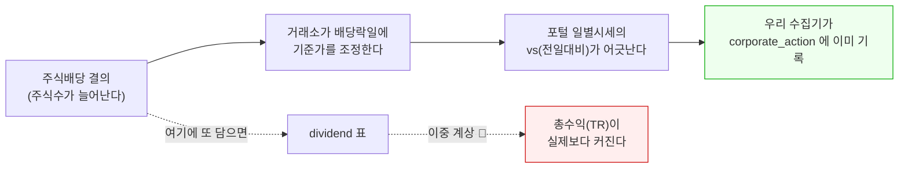

# #37 fix: 배당 수집기 후속 수정 — 열두 달 훑기·주식배당 제외·reparse 버그 ([#36](../pulls/036.md) 에서 누락된 3커밋)

> 🗂️ 옛 GitHub PR을 옮긴 **기록 문서**입니다 — [색인](../README.md). 원문은 그대로 두고, 링크·커밋 해시만 새 자리 기준으로 바꿨습니다.

| 항목 | 내용 |
|---|---|
| 종류 | PR |
| 상태 | 머지됨 · 2026-09-19 15:21 |
| 원 작성 | 이동원(`devlee328288`) · 2026-09-19 14:55 KST |
| 브랜치 | `fix/dividend-twelve-months` → `main` |
| 머지 커밋 | [`9a3d320`](https://github.com/EST-team-project/Qurious/commit/9a3d32017d8036f4cd9d78ec5c74e66fdf839fa7) |
| 바뀐 내용 | [비교 보기](https://github.com/EST-team-project/Qurious/compare/fe2f9e3eeaf0855a09bc07ccc5f110a6040decec...6618f6dcb80eabafd90b711683c31fb2d6a3ac55) |
| 옛 주소 | `github.com/devlee328288/Qurious/pull/37` (지금은 열리지 않음) |

## 본문

배당 수집기의 **후속 수정 3건 + 오늘 찾은 버그 1건 + 교차검증 수정 2건**입니다. 원래 [#36](../pulls/036.md) 에 담겨야 했는데 **push 가 누락돼 올라가지 않았습니다.** 그래서 `main` 에는 수집기의 첫 커밋(`d12e3ce`)만 들어가 있고, **교차검증이 잡아낸 수정이 빠진 상태**입니다.

---

## 1. 왜 별도 PR 인가 — [#36](../pulls/036.md) 에서 3커밋이 새어 나갔다

S30 세션에서 커밋 4개를 만들었지만, **첫 1개만 원격에 올라간 채 PR 이 머지**됐습니다.

```
로컬 브랜치 (S30 작업 결과)            GitHub PR #36 이 실제로 본 것
─────────────────────────────         ─────────────────────────────
d12e3ce  수집기 본체            ───→   d12e3ce  수집기 본체   ✅ 머지됨
3744403  주식배당 제외           ✗                              ← 올라가지 않음
41359d4  일곱 달 → 열두 달       ✗                              ← 올라가지 않음
ff59ba0  README                 ✗                              ← 올라가지 않음
                                        head_sha = d12e3ce
                                        commits  = 1
```

`gh api .../pulls/36` 의 `head_sha` 가 `d12e3ce`, `commits` 가 `1` 인 것으로 확인했습니다.
잃은 것은 없습니다 — 로컬 객체가 살아 있어 `main` 위에 그대로 얹었습니다.

> **지금 `main` 의 상태가 왜 위험한가** 🔴
> 수집기는 돌지만 **배당철 일곱 달만 훑고**(8월 배당을 통째로 놓침) **주식배당을 배당 표에
> 이중 계상**합니다. 즉 지금 `main` 으로 적재하면 조용히 틀린 데이터가 쌓입니다.

---

## 2. 주식배당을 배당 표에서 뺀다 — 이중 계상이었다

첫 적재에서 "검토필요" 가 83%(1,060/1,273)로 나왔습니다. 파서가 무너진 줄 알았는데 **두 가지가
섞여 있었습니다.**

| 무엇 | 건수 | 진단 | 처리 |
|---|---:|---|---|
| 기준일이 시세 구간(2020-01-02~) **앞** | 1,038 | 파싱 실패가 **아니다.** 배당락일을 구할 거래일이 달력에 없을 뿐 | 별도 칸(`배당락일 미정`)으로 분리 |
| 「주식배당결정」 공시 | 24 | 서식이 달라 "1주당 배당금(원)" 칸이 **없다** | **표에서 제외** |
| 그 밖의 진짜 파싱 실패 | 0 | — | — |

주식배당을 뺀 이유는 파싱이 안 돼서가 아닙니다. **넣으면 안 되는 값**이기 때문입니다.



**덤으로 배당락일 역산의 넷째 검증을 얻었습니다.** 기준일 2020-12-31 주식배당 공시 22종목이
**22/22 전부** 우리가 역산한 배당락일 `20201229` 의 `corporate_action` 에 있었습니다. 가격 움직임
해석이 끼어들지 않는, **거래소 자신의 조정과의 대조**입니다. 그날 `corporate_action` 54건 중
22건(41%)이 이것으로 설명됩니다. 🟢

코드: [`sources/dart.py:204`](https://github.com/EST-team-project/Qurious/blob/290f065/collector/sources/dart.py#L204) `exclude_reason` — 제외 사유를 **이름으로** 돌려줍니다.
건수만 세면 "무엇을 왜 버렸나" 가 사라지고, 특히 주식배당은 *버리는 것*이 아니라 *다른 표가 이미
가진 것*이라 그 구분이 보고에 남아야 하기 때문입니다.

---

## 3. "배당철만 훑으면 된다" 가 틀렸다 — 교차검증이 잡았다

사업보고서의 배당 항목(`alotMatter`)이 주는 **연간 확정치**와, 우리가 날짜별로 모은 **합계**를
8종목에 대해 맞춰 봤습니다. 24건 일치, 12건 어긋남. 어긋남 대부분은 설명이 됐습니다.

| 어긋난 사유 | 결함인가 | 설명 |
|---|---|---|
| 2019년분 | ❌ 아니다 | 수집 구간(2020-01~) **앞**에서 공시된 것 |
| 2023년분 | ❌ 아니다 | 결산배당 공시가 2024년 2~3월에 나오는데 그 달을 아직 안 훑었다 |
| **신한지주 2021·2022** | ✅ **결함** | 각각 300·400원 모자람 → **원인이 따로 있었다** |

목록을 직접 조회해 보니 원인이 나왔습니다.

```
신한지주 2분기 배당 공시 접수일
  2021-08-13   ← 8월
  2022-08-12   ← 8월

DIVIDEND_MONTHS = (1, 2, 3, 4, 7, 10, 12)
                              ↑
                        8월이 없다
```

### 왜 달을 고를 수 없나 (핵심)

> **공시는 기준일이 아니라 이사회 결의일에 나갑니다.**
> 같은 기준일(6-30) 배당도 **6월에 미리 결의하는 회사, 7월에 하는 회사, 8월에 하는 회사가 모두**
> 있습니다. 어느 회사가 어느 달에 결의하는지는 **미리 알 방법이 없습니다.**

그래서 **열두 달 전부** 훑습니다. ([`sources/dart.py:99`](https://github.com/EST-team-project/Qurious/blob/290f065/collector/sources/dart.py#L99))

| | 전 | 후 |
|---|---|---|
| 훑는 달 | 7달 × 7년 = 47달 | **12달 × 7년 = 81달** |
| 목록 호출 | 약 1,600회 | 약 2,800회 |
| 본문 호출 | 약 10,000회 | 약 12,000회 |
| 하루 한도(20,000) 대비 | 58% | **74%** |

여유가 줄지만, **놓친 배당은 영영 모릅니다.** 조용히 적게 나오고 빠진 자리에 아무 표시도 남지
않기 때문입니다.

**이번 scan 실측으로 즉시 확인됐습니다** — 새로 훑은 `202108` 에서 **27건**이 나왔습니다.
일곱 달 목록이었다면 통째로 놓쳤을 건들입니다. 🟢

---

## 4. `crosscheck` 를 CLI 모드로 넣는다

주 경로(공시 본문)는 **공시를 하나라도 놓치면 조용히 적게 나오고 빠진 자리에 표시가 남지
않습니다.** 다른 경로와 맞춰 보는 것 말고는 알아낼 방법이 없습니다 — 이번에 그것이 증명됐으므로
일회용 스크립트로 두지 않았습니다.

```
python -m collector.dividend crosscheck [--codes 005930,033780]
```

[`dividend.py:301`](https://github.com/EST-team-project/Qurious/blob/290f065/collector/dividend.py#L301) `run_crosscheck`

> **함정 하나** ⚠️ `alotMatter` 응답의 `bsns_year` 는 **`None` 으로 옵니다**(API 가 요청 값을
> 되돌려 주지 않습니다). 그것을 믿었다가 표본 8종목이 통째로 "결측" 으로 나왔습니다.
> **연도는 우리가 요청한 값으로 셉니다.** ([`dart.py:680`](https://github.com/EST-team-project/Qurious/blob/290f065/collector/sources/dart.py#L680) `annual_dps`)

**얻은 확증**: 삼성전자 2021~2023 이 우리 날짜별 합계 `361원 × 4 = 1,444원`으로 `alotMatter` 와
정확히 일치합니다. [#33 10.4.1](../issues/033.md) 에 적어 둔 그 값입니다. 2020년은 특별배당이 낀 2,994원까지 맞습니다. 🟢

---

## 5. (오늘 추가) `reparse` 가 첫 행에서 죽었다

`run_reparse` 는 제외 규칙이 바뀐 행을 `(srtn_cd, record_dt)` 로 지우는데, **SELECT 절에
`record_dt` 를 넣지 않아** 첫 prune 대상에서 `IndexError` 로 죽었습니다. `dividend` 의 기본키가
`(srtn_cd, record_dt)` 이므로 두 칸이 다 있어야 합니다. ([`db.py:175`](https://github.com/EST-team-project/Qurious/blob/290f065/collector/db.py#L175))

**S30 에서 이 경로를 한 번도 실행해 보지 않고 커밋한 탓입니다.** 고친 뒤 실측:

```
보존 원문 8,945건 재파싱 → 저장 8,945건 (검토필요 402건 · 원문없음 0건)
  · 제외 규칙이 바뀌어 58건을 표에서 지웠다  ← 주식배당
  · 배당락일 없음 1,036건 — 기준일이 시세 구간 앞이다. 파싱 실패가 아니다
```

| | reparse 전 | reparse 후 |
|---|---:|---:|
| 검토필요 | 1,496건 | **402건** |
| 표에 남은 행 | 8,976 | 8,945 |
| 주식배당 잔존 | 58건 | **0건** |

`reparse` 는 **네트워크를 0회** 씁니다. 보존해 둔 원문(`raw_response`)만 다시 읽기 때문입니다.
제외 규칙이 뒤에 바뀌어도 이미 담긴 행이 표에 영원히 남지 않도록, **재파싱이 스스로 치웁니다.**

---

## 5.5 「배당기준일 변경 안내」 399건을 걸러낸다 (커밋 `5540707`)

완주 뒤 남은 검토필요 403건 중 **399건이 같은 종류**였습니다.

```
「기타경영사항(자율공시)(배당기준일 변경 안내)」
```

기준일을 알리는 공시라 금액이 없습니다. **연도 분포가 원인을 말해 줍니다** —
2023년 85건 → **2024년 154건 → 2025년 159건**. 위 9.5① 의 배당절차 개선과 같은 사건의
다른 얼굴입니다.

> 🟡 **버리지만 아깝습니다.** *어느 회사가 언제 기준일을 옮겼는지* 가 여기 있습니다.
> 원문은 `raw_response` 에 남으므로 9.5① 을 더 팔 때 **1차 자료**가 됩니다.

**이제 진짜 파싱 실패는 3건(8,787건 중 0.03%)** 입니다.

| 건 | 진단 |
|---|---|
| 현물배당 2건 | 서식이 달라 "1주당 배당금(원)" 칸이 없다. **알려진 한계** |
| 웅진씽크빅 (기준일 2020-01-15) | ★ 파싱 실패가 아니라 **취소된 배당**이다. 정정 사유가 *"기준일 주주명부 미확정으로 인한 배당금 미지급"* 이고 정정후 칸이 전부 비어 있다. **파서가 0원을 채우지 않은 것이 옳았다** — 0원으로 담겼다면 실재하지 않는 배당이 백테스트에 들어갔을 것이다 |

---

## 6. 코드 재사용 판정표

| 쓰려던 것 | 파일 | 판정 | 근거 |
|---|---|---|---|
| 유량 제한기 | [`ratelimit.py`](https://github.com/EST-team-project/Qurious/blob/290f065/collector/ratelimit.py) | ✅ **그대로 재사용** | 포털 수집기가 쓰던 것. DART 도 같은 모양의 일일 한도 |
| 원문 보존 | [`raw_store.py`](https://github.com/EST-team-project/Qurious/blob/290f065/collector/raw_store.py) | ✅ **그대로 재사용** | `raw_store.load/save` 가 소스 이름만 바꿔 동작 |
| 거래일 달력 | `price_daily` 조회 | ✅ **재사용** ([`dart.py:519`](https://github.com/EST-team-project/Qurious/blob/290f065/collector/sources/dart.py#L519)) | 포털이 채운 시세 표가 곧 달력 |
| 목록 페이징 | `sources/portal.py` | ❌ **못 씀** | 엔드포인트·응답 필드가 다르다(`list.json` 은 `page_no`/`total_page`) |
| 본문 파서 | — | ❌ **새로 씀** | DART 본문은 euc-kr zip 안의 XML. 선례 없음 |

새로 쓴 줄 수: `sources/dart.py` 663줄 · `dividend.py` 336줄. 재사용으로 아낀 것은 유량·원문
보존·달력 3개 모듈입니다.

---

## 7. 바꾸기 전 / 후 구조

```
[ 전 ]  scan → 배당철 7달 → 본문 파싱 → dividend 표
                  ↑ 8월 누락 🔴          ↑ 주식배당 섞임 🔴
        (검증 경로 없음 — 틀려도 모른다)

[ 후 ]  scan → 열두 달 81달 → 제외 규칙 → 본문 파싱 → dividend 표
                                  ↓                        ↑
                          주식배당은 corporate_action       │
                          이 이미 갖고 있다                 │
                                                           │
        reparse  ──(네트워크 0회 · 보존 원문)──────────────┘
                     제외 규칙이 바뀌면 스스로 치운다
                                                           │
        crosscheck ──(alotMatter 연간 확정치와 대조)────────┘
                     주 경로가 조용히 적게 나오는 것을 잡는다
```

---

## 8. 용어 (두 층으로)

| 용어 | 한 줄 뜻 | 이 문서에서 | 헷갈리기 쉬운 것 |
|---|---|---|---|
| **배당락일** | 이날 사면 배당을 못 받는 첫날 | 기준일에서 **거래일 달력으로 역산**한 값. 공시에 적힌 값이 아니다 | "기준일 −2일" 이 **아니다** — 분기·중간배당에서 어긋난다 |
| **기준일(record date)** | 주주명부를 닫는 날 | 공시 본문에 적혀 온다 | 배당락일과 다르다 |
| **이사회 결의일** | 배당을 정한 날 | **공시가 나가는 시점을 정하는 것은 이쪽** | 기준일과 무관하게 흩어진다 → 달을 고를 수 없는 이유 |
| **`alotMatter`** | 사업보고서의 배당 항목 | 연간 **확정치**. 교차검증의 기준 경로 | `bsns_year` 가 `None` 으로 온다 |
| **PR / TR** | 가격수익 / 총수익 | PR = 주가만, TR = 주가 + 배당 | 이 PR 은 **TR 의 재료**까지다. TR 계산 자체는 아직 없다 🔴 |
| **이중 계상** | 같은 효과를 두 번 세는 것 | 주식배당을 `corporate_action` 과 `dividend` 양쪽에 넣는 것 | — |

---

## 9. 적재 현황 — **81/81 달 완주** (2026-09-19 15:05 KST)

| 항목 | S30 종료 시 | reparse 후 | **완주 후** |
|---|---:|---:|---:|
| 훑은 달 | 41 / 47 | 51 / 81 | **81 / 81** ✅ |
| `dividend` 행 | 7,568 | 8,945 | **9,188** |
| 종목 | — | 1,592 | **1,618** |
| 검토필요 | — | 402 | **17** |
| 배당락일 미정 | — | 1,036 | 1,036 *(정상 — 기준일이 시세 구간 앞)* |
| 기간 | — | ~20260415 | 20181231 ~ **20260930** |

### ★ 열두 달 훑기가 실제로 무엇을 건졌나

| 배당구분 | 일곱 달 시절 | **열두 달 완주** | 증가 |
|---|---:|---:|---:|
| 결산배당 | 8,063 | 8,174 | +111 |
| **분기배당** | 327 | **681** | **+108%** |
| **중간배당** | 128 | **319** | **+149%** |
| (구분 빈칸) | 458 | 14 | −444 |

> **일곱 달 훑기는 분기·중간배당을 절반 넘게 놓치고 있었습니다.** 결산배당(12월 기준일)은
> 거의 다 잡혔지만, 분기·중간배당은 이사회 결의 시점이 회사마다 흩어져 있어 배당철 바깥으로
> 새어 나갔습니다. 8월 한 달만 봐도 **2024년 43건 · 2026년 74건**이 새로 잡혔습니다.

비용은 예상보다 훨씬 쌌습니다 — 추가 30달에 **호출 1,284회**(추정 2,800+12,000 대비). 이미
훑은 달의 본문은 다시 받지 않고, 새 달 대부분이 배당 비수기라 대상 건수가 적기 때문입니다.

---

## 9.5 완주 뒤에 드러난 것 — 교차검증이 또 두 가지를 잡았다

열두 달을 다 훑은 뒤에도 어긋남이 6건 남았습니다. **둘 다 우리가 놓친 것이 아니었습니다.**

### ① 기준일 연도가 곧 사업연도가 아니다 🟢

현대차·POSCO 의 FY2023 이 **기말배당만 빠진** 모양이라 공시를 놓친 줄 알았는데, 데이터는 다
있었습니다.

```
현대차  FY2023 결산배당  기준일 2024-02-29 (결의 2024-01-25)  8,400원
POSCO  FY2023 결산배당  기준일 2024-02-29 (결의 2024-01-31)  2,500원
```

2023년 말 **배당절차 개선**(배당액을 먼저 정하고 기준일을 뒤에 두도록 한 것) 이후로, 결산배당
기준일이 **사업연도 밖(이듬해 2~4월)** 으로 나가는 회사가 늘었습니다.

| 연도 | 기준일 12-31 | **그 밖** | 비율 |
|---|---:|---:|---:|
| 2020~2023 | 약 1,100건/년 | 19~25 | 약 2% |
| 2024 | 905 | **128** | **12%** |
| 2025 | 838 | **293** | **26%** |

> **왜 집계만의 문제가 아닌가** (비전문가용)
> 배당락일은 기준일에서 역산합니다. 기준일이 2~4월로 옮겨 가면 **배당락일도 연초로 옮겨
> 갑니다.** "한국 주식은 12월 말에 배당락이 몰린다" 는 통념으로 짠 전략은 2024년 이후 구간에서
> 어긋나기 시작합니다. 이건 우리 수집기의 문제가 아니라 **시장이 바뀌고 있는 것**입니다.

### ② 어긋났을 때 **어느 쪽이 틀렸는지**는 총액으로 가린다 🟢

고려아연은 우리 값이 **더 컸습니다**(2019 +3,000 · 2020 +1,000). ① 로도 설명이 안 됩니다.
보존해 둔 공시 원문을 직접 읽었습니다.

```
고려아연 · 접수 20200302800216
  1. 배당구분     결산배당
  3. 1주당 배당금(원)  보통주식  14,000
  5. 배당금총액(원)   247,439,360,000
  6. 배당기준일     2019-12-31
```

그리고 같은 회사 **FY2020** 사업보고서(`stlm_dt=2020-12-31` · 접수 `20210316000528`)의 **당기**
총액이 `247,439백만원` — **위와 같은 값**입니다.

```
    우리(공시 원문)                  사업보고서 alotMatter
    ─────────────────               ──────────────────────
    기준일 2019-12-31               FY2020 보고서
    14,000원                        당기(thstrm) 14,000원
    총액 247,439,360,000원  ═══════ 총액 247,439백만원   ← 같은 배당이다
                                    전기(frmtrm) 11,000원
                                    전전기(lwfr) 10,000원

    → 그 보고서가 기준일 2019-12-31 배당을 "당기" 로 적었다.
      한 해 밀린 것은 우리가 아니라 저쪽이다.
```

주당배당금만 봐서는 가릴 수 없었습니다. **총액은 그 배당에 단 하나뿐인 값이라 지문 노릇을
합니다.** `annual_amounts` 를 만들어, 어긋난 해의 사업보고서 총액이 우리 다른 해 총액과 같으면
🔄 로 표시하게 했습니다.

> ⚠️ **자동 보정하지 않습니다. 표시만 합니다.** 잘못된 자동 보정은 틀린 값을 조용히 맞는 값으로
> 둔갑시킵니다. 처음에는 종목 단위로 "이 회사는 밀려 적는다" 고 추정해 보정하려 했는데,
> **고려아연의 2021~2023 은 어긋나지 않아 그 추정이 틀렸습니다.** 밀린 것은 회사가 아니라
> 그 보고서 한 건입니다. 추정 기반 보정을 걷어내고 총액 대조로 바꿨습니다.

### 교차검증 추이

| 시점 | 대조 | 일치 | 어긋남 | 설명 안 되는 것 |
|---|---:|---:|---:|---|
| 일곱 달 시절 | 36 | 24 | 12 | 1건 → `DIVIDEND_MONTHS` 결함 |
| 열두 달 완주 | 47 | 41 | 6 | 4건 |
| 사업연도 매핑 수정 | 48 | 44 | 4 | 2건 |
| **총액 대조 추가** | **48** | **44** | **4** | **0건** ✅ |

남은 4건: 고려아연 2건(**보고서가 밀림** — ② 로 확정) · POSCO·현대차 2019(**수집 구간 앞**).

---

## 10. 한계 · 확실도 · 뒤집을 조건

| 항목 | 확실도 | 한계 | 뒤집을 조건 |
|---|:---:|---|---|
| 배당락일 역산 규칙 | 🟢 | 네 가지로 검증(대조군·KRX 공표값 5년·시장대비 −1.75%p·`corporate_action` 22/22) | 거래소가 역산과 다른 날을 쓴 반례 1건 |
| 열두 달 훑기 | 🟢 | 비용이 한도의 74%로 오름 | 한도 초과가 잦아지면 목록만 먼저 훑어 대상 달을 좁히는 2단 방식 |
| 교차검증 표본 | 🟡 | **8종목뿐.** 전 종목은 종목당 2회 ≈ 6,700회 = 하루치 | 표본을 늘려 새 유형의 어긋남이 나오면 |
| 사업연도 매핑 | 🟡 | **12월 결산을 가정**한다. 3월·6월 결산법인은 어긋난다 | 3월 결산법인 표본을 넣어 확인하면 |
| `alotMatter` 를 정답으로 삼기 | 🔴 | **틀린 사례가 나왔다**(고려아연 FY2020 보고서). 기준 경로도 완벽하지 않다 | — 이래서 총액 대조를 넣었다 |
| 주식배당 제외 | 🟢 | `corporate_action.kind` 가 이를 `split` 으로 **잘못 붙인다**(18/22) — 가격 조정 자체는 영향 없음 | — (별건으로 [#33 10.5.3](../issues/033.md) 에 기록) |
| 우선주 배당 | 🟡 | 공시가 보통주 `corp_code` 로만 와서 **우선주 종목코드에 못 붙인다** | 우선주 매핑 경로를 찾으면 |
| 현물배당 서식 | 🔴 | **표본에 없었다.** 대응하지 않았다 | 현물배당 공시가 실제로 잡히면 |
| TR 계산 | 🔴 | **없다.** 이 PR 은 재료까지다 | — (다음 작업) |

---

## 11. 검증 방법

```bash
# 1) 주식배당이 표에 없는지
python -m collector.dividend status      # "주식배당" 이 div_type 에 없어야 한다

# 2) 네트워크 0회 재파싱이 도는지 (이 PR 의 5절 버그)
python -m collector.dividend reparse

# 3) 교차검증
python -m collector.dividend crosscheck
#    대조 48 · 일치 44 · 어긋남 4 (전부 설명됨)
#    고려아연 2020 줄에 🔄 총액 진단이 붙어야 한다

# 4) 배당절차 개선 추세 (SQL)
#    결산배당 중 기준일이 12-31 이 아닌 비율: 2024 12% · 2025 26%
```

---

🤖 Generated with [Claude Code](https://claude.com/claude-code)
