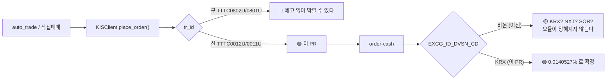

# #41 fix: KIS 주문 TR ID 를 신 TR 로 바꾼다 — 구 TR 은 사전고지 없이 막힌다

> 🗂️ 옛 GitHub PR을 옮긴 **기록 문서**입니다 — [색인](../README.md). 원문은 그대로 두고, 링크·커밋 해시만 새 자리 기준으로 바꿨습니다.

| 항목 | 내용 |
|---|---|
| 종류 | PR |
| 상태 | 머지됨 · 2026-09-20 12:30 |
| 원 작성 | 이동원(`devlee328288`) · 2026-09-20 11:46 KST |
| 브랜치 | `fix/kis-tr-id` → `main` |
| 머지 커밋 | [`7384a74`](https://github.com/EST-team-project/Qurious/commit/7384a740d6f6e4f511a58c0da7e8159958b5b26c) |
| 바뀐 내용 | [비교 보기](https://github.com/EST-team-project/Qurious/compare/32c44a6ca3755ade596842e0e32758e66e53eca0...6aa54d89ee4ac258f1a1b0f5aaa5b125c893ffd0) |
| 옛 주소 | `github.com/devlee328288/Qurious/pull/41` (지금은 열리지 않음) |

## 본문

## 0. 한 줄로

주문 TR ID 가 **KIS 가 "막힐 수 있다"고 명시한 구버전**이었습니다. 신 TR 로 바꾸고, 모의계좌로 실제 호출해 확인했습니다.

Refs [#40](../issues/040.md) (8절 할 일 중 "🔴 KIS TR ID 를 신 TR 로 교체" 한 항목 — 나머지는 후속 PR)

---

## 1. 쉬운 요약 (3줄)

- 증권사 API 는 주문 종류마다 **전표 번호 같은 코드(`tr_id`)** 를 붙여 보냅니다. 우리 코드의 그 번호가 구버전이었습니다.
- KIS 문서에 *"구TR은 사전고지 없이 막힐 수 있다"* 고 적혀 있습니다 — 어느 날 갑자기 주문이 안 나갈 수 있다는 뜻입니다.
- 바꾸는 것은 두 줄이지만, **안 바꾸면 자동매매가 조용히 멈춥니다.** 그래서 비용 작업([#40](../issues/040.md))보다 먼저 올립니다.

---

## 2. 한눈에 보기

| | 값 |
|---|---|
| 바꾼 파일 | `app/services/brokers/kis.py` 1개 (+11 −2) |
| 바꾼 것 | 주문 `tr_id` 4개 · `EXCG_ID_DVSN_CD` 1칸 추가 |
| 검증 | 🟢 모의계좌(`KIS_MOCK_*`)로 실제 호출 6건 |
| 실계좌 | ❌ 호출하지 않았습니다 |
| 동작 변화 | 주문 경로만. 시세·잔고·일봉 조회는 그대로 |

---

## 3. 용어 풀이

| 용어 | 뜻 | 이 PR 에서 | 헷갈리는 점 |
|---|---|---|---|
| **`tr_id`** (거래ID) | KIS API 가 "어떤 업무인가"를 구분하는 코드. HTTP 헤더에 넣는다 | 이것이 구버전이었다 | URL 은 그대로인데 `tr_id` 만 다르면 **다른 업무**가 된다. 주소가 같으니 괜찮다고 볼 수 없다 |
| **구 TR / 신 TR** | KIS 가 주문 API 를 개편하며 새 코드를 냈다. 구 코드는 과도기 동안만 살려 둔다 | `TTTC0802U` → `TTTC0012U` | "지금 되니까 괜찮다"가 함정이다. 예고 없이 막는다고 문서에 적혀 있다 |
| **`EXCG_ID_DVSN_CD`** (거래소ID구분코드) | 주문을 **어느 거래소**로 보낼지. `KRX` / `NXT` / `SOR` | `KRX` 로 고정했다 | 이 칸은 수수료 문제다. 거래소마다 요율이 달라서(아래 5절) 비워 두면 비용이 정해지지 않는다 |
| **NXT** (넥스트레이드) | 2025년 출범한 국내 두 번째 정규 거래소. KRX 와 같은 종목을 거래한다 | 우리는 KRX 만 쓴다 | KRX 의 "시간외"가 아니다. **별개 거래소**이고 수수료 체계가 따로 있다 |
| **SOR** (최선주문집행) | 두 거래소 중 유리한 쪽으로 자동 라우팅 | 쓰지 않는다 | 가격은 유리해질 수 있지만 **체결 거래소가 사후에 정해져** 비용을 미리 계산할 수 없다 |

---

## 4. 무엇이 문제였나

`place_order` 가 쓰던 `tr_id` 는 KIS 공식 스펙이 교체를 요구한 구버전입니다.

```
app/services/brokers/kis.py:142-144  (기준 32c44a6)

    if side == "buy":
        tr_id = "VTTC0802U" if self.paper else "TTTC0802U"   ← 구
    else:
        tr_id = "VTTC0801U" if self.paper else "TTTC0801U"   ← 구
```

KIS `order-cash` 스펙의 `tr_id` 설명에 그대로 적혀 있습니다 (스펙 필드 기준일 2026-09-14):

> ※ 구TR은 사전고지 없이 막힐 수 있으므로 반드시 신TR로 변경이용 부탁드립니다
> (구)TTTC0801U → (신)TTTC0011U · (구)TTTC0802U → (신)TTTC0012U

🔴 이것이 막히면 **자동매매(`auto_trade.py`)와 직접매매 화면의 실주문이 동시에 멈춥니다.** 그리고 우리 코드는 주문 응답을 검사하지 않고 `status="filled"` 로 기록하므로([#40](../issues/040.md) 4.5), **막힌 것을 알아차리지도 못합니다.**

---

## 5. 왜 `EXCG_ID_DVSN_CD` 까지 넣는가 — 비용 때문입니다

이 칸이 이 PR 에서 유일하게 "새로 추가"한 것입니다. 이유는 하나입니다:

| 거래소 | 뱅키스 온라인 위탁수수료 (편도) | 차이 |
|---|---:|---|
| **KRX** | **0.0140527%** | 기준 |
| NXT | 0.0130527% | −0.001%p |

🟢 이 칸을 비우면 주문이 어느 거래소로 가는지 모릅니다. 그런데 **요율이 다릅니다.** [#40](../issues/040.md) 이 설계한 비용 계산은 KRX 요율을 상수로 쓰므로, 거래소가 흔들리면 계산값과 실제 정산액이 어긋납니다. 거래소를 못 박아 **비용이 결정적으로 정해지게** 합니다.

> 🟡 NXT 를 쓰면 수수료가 더 싸지만, 이 PR 은 그 선택을 하지 않습니다. NXT 는 유동성·호가 사정이 다르고 슬리피지가 바뀔 수 있어([#40](../issues/040.md) 5.4) 별도 판단거리입니다. 지금 필요한 것은 "정해져 있음"입니다.

---

## 6. 검증 — 모의계좌로 실제 호출했습니다 🟢

오늘(2026-09-20)은 일요일이라 체결은 불가능합니다. 그래서 **체결이 아니라 "TR 이 라우팅되는가"** 를 봤습니다. 대조군을 넣어 갈림이 분명해졌습니다.

| 호출 | HTTP | `msg_cd` | 메시지 | 읽는 법 |
|---|---:|---|---|---|
| 구 매수 `VTTC0802U` | 200 | `40100000` | 모의투자 영업일이 아닙니다 | 업무단계 도달 = TR 살아 있음 |
| **신 매수 `VTTC0012U`** | 200 | `40100000` | 모의투자 영업일이 아닙니다 | 🟢 **업무단계 도달** |
| 신 매수 + `EXCG=KRX` | 200 | `40100000` | 모의투자 영업일이 아닙니다 | 🟢 칸을 넣어도 통과 |
| **신 매도 `VTTC0011U`** | 200 | `40100000` | 모의투자 영업일이 아닙니다 | 🟢 **업무단계 도달** |
| 신 매도 + `EXCG=KRX` | 200 | `40100000` | 모의투자 영업일이 아닙니다 | 🟢 |
| 구 매도 `VTTC0801U` | 200 | `40100000` | 모의투자 영업일이 아닙니다 | 대조군 |
| **없는 TR `VTTC9999U`** | **500** | **`IGW00009`** | 응답전문 구성 중 오류 | 🟢 **게이트웨이가 먼저 자른다** |

**이 표의 핵심은 마지막 줄입니다.** 존재하지 않는 `tr_id` 는 게이트웨이(`IGW…`)에서 HTTP 500 으로 잘립니다. 신 TR 은 그 관문을 통과해 **업무 서버까지 가서** 휴일 검사에 걸렸습니다. 두 실패는 층이 다릅니다.

```
   요청 ──▶ [게이트웨이]  ──▶ [주문 업무]  ──▶ [체결]
              IGW00009         40100000        (휴일이라 도달 못함)
                 ▲                ▲
                 │                └─ 신TR·구TR 6건이 모두 여기까지 왔다  🟢
                 └─ 없는TR VTTC9999U 만 여기서 잘렸다  (대조군)

   ∴ tr_id 가 무효면 관문에서 잘린다. 신 TR 은 잘리지 않았다 → 라우팅된다.
```



또 하나 확인된 사실: 🟡 **모의 주문 API 에도 초당 유량 제한이 있습니다.** 연속 호출하면 `EGW00201`("초당 거래건수를 초과하였습니다")로 막혀 응답이 가려집니다. 첫 시도에서 3건이 이 때문에 가려져, 호출 간격을 3초로 벌려 다시 받았습니다. 자동매매가 여러 종목을 한 번에 주문하면 **같은 벽에 부딪힙니다** — 후속 과제로 남깁니다.

---

## 7. 코드 재사용 판정표

| 기존 코드 | 줄 수 | 판정 | 이유 |
|---|---:|---|---|
| [`kis.place_order`](https://github.com/EST-team-project/Qurious/blob/32c44a6/app/services/brokers/kis.py#L135-L160) | 26줄 | 🔸 **부분 수정** | 호출 구조·헤더 헬퍼(`_headers`)는 그대로. `tr_id` 두 줄과 본문 1칸만 |
| [`kis._headers`](https://github.com/EST-team-project/Qurious/blob/32c44a6/app/services/brokers/kis.py#L24-L35) | 12줄 | ✅ **그대로** | `tr_id` 를 인자로 받는 구조라 손댈 것이 없었다 |
| [`brokers/base.BrokerClient`](https://github.com/EST-team-project/Qurious/blob/32c44a6/app/services/brokers/base.py#L48-L68) | 21줄 | ✅ **그대로** | 추상 계약은 `tr_id` 를 모른다 (구현 세부) |
| 다른 증권사 8곳 (`kiwoom`·`ebest`·`daishin`·`kb`·`shinhan`·`meritz`·`mock`) | — | ✅ **무관** | 저장소 전체에서 `TTTC`·`VTTC` 를 찾으면 `kis.py` 2줄뿐이었다 |

전체 검색으로 확인한 결과 **구 TR 이 쓰인 곳은 이 두 줄이 전부**입니다(문서·HTML 포함 0건). 누락된 호출부가 없습니다. 🟢

---

## 8. 바꾸기 전 / 후

```diff
- if side == "buy":
-     tr_id = "VTTC0802U" if self.paper else "TTTC0802U"
- else:
-     tr_id = "VTTC0801U" if self.paper else "TTTC0801U"
+ # 신 TR ID 를 쓴다. 구 TR 은 "사전고지 없이 막힐 수 있다"고 스펙에 적혀 있다.
+ if side == "buy":
+     tr_id = "VTTC0012U" if self.paper else "TTTC0012U"
+ else:
+     tr_id = "VTTC0011U" if self.paper else "TTTC0011U"

  json={
      ...
      "ORD_UNPR": str(int(price)),
+     # 거래소를 KRX 로 못 박는다 — 비우면 요율이 갈린다(KRX 0.0140527% / NXT 0.0130527%)
+     "EXCG_ID_DVSN_CD": "KRX",
  }
```

---

## 9. 한계 · 뒤집을 조건

| 한계 | 확실도 | 뒤집을 조건 |
|---|---|---|
| **영업일 실체결을 확인하지 못했다.** 휴일 검사가 먼저 걸려, 그 뒤 단계의 필드 검증까지 도달하지 않았을 수 있다 | 🟡 | 영업일에 모의로 1주 주문 → `rt_cd=0` + `ODNO` 수신 확인 ([#40](../issues/040.md) 11절 한계 ①과 같은 작업) |
| 실계좌 도메인에서 확인하지 않았다 (모의만) | 🟡 | 사용자 승인 후 실계좌 1주로 확인. 모의·실전은 TR 접두사만 다르므로 위험은 낮다 |
| `EXCG_ID_DVSN_CD` 가 **신 TR 에서 선택**임을 휴일 응답으로 판정했다 | 🟡 | 영업일에 이 칸 없이 주문이 접수되는지 확인 |
| `ORD_DVSN="00"`(지정가) 고정이라 **미체결로 남을 수 있는데 `status="filled"`** 로 기록한다 | 🔴 | 이 PR 범위 밖 — [#40](../issues/040.md) 의 주문 경로 작업에서 다룬다 |
| 모의 주문에도 초당 유량 제한이 있다 (`EGW00201`) | 🟢 | 자동매매 다종목 주문 시 간격 제어가 필요 — 후속 |

> **강사님 피드백 ④ "결론에 집착하지 말 것"** — 이 PR 은 "신 TR 이 구 TR 보다 낫다"를 주장하지 않습니다. 둘 다 오늘은 동작합니다. 주장하는 것은 하나입니다: **공급자가 막겠다고 예고한 코드를 계속 쓸 이유가 없다.**

---

🤖 Generated with [Claude Code](https://claude.com/claude-code)
