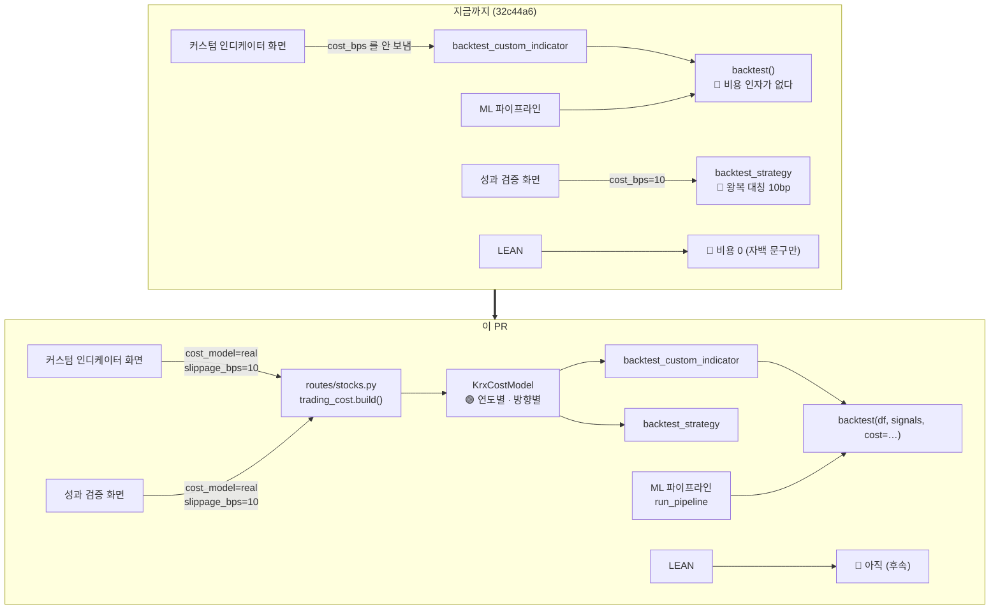

# #42 feat: 매매비용을 코드로 옮긴다 — 백테스트 세 갈래가 같은 요율표를 쓴다

> 🗂️ 옛 GitHub PR을 옮긴 **기록 문서**입니다 — [색인](../README.md). 원문은 그대로 두고, 링크·커밋 해시만 새 자리 기준으로 바꿨습니다.

| 항목 | 내용 |
|---|---|
| 종류 | PR |
| 상태 | 머지됨 · 2026-09-20 12:30 |
| 원 작성 | 이동원(`devlee328288`) · 2026-09-20 12:04 KST |
| 브랜치 | `feat/trading-cost` → `main` |
| 머지 커밋 | [`1e86074`](https://github.com/EST-team-project/Qurious/commit/1e8607490e3cc7ca989398d06c0e3681597c9f66) |
| 바뀐 내용 | [비교 보기](https://github.com/EST-team-project/Qurious/compare/7384a740d6f6e4f511a58c0da7e8159958b5b26c...88e00b32baaa11dbc400a2e176c2f69249cc8e57) |
| 옛 주소 | `github.com/devlee328288/Qurious/pull/42` (지금은 열리지 않음) |

## 본문

## 0. 한 줄로

[#40](../issues/040.md) 이 설계한 매매비용을 **코드로 옮겼습니다.** 백테스트 세 갈래가 같은 요율표를 쓰고, 응답이 무엇을 뗐는지 말합니다.

Refs [#40](../issues/040.md) (8절 할 일 8개 중 5개 — 나머지는 DB 스키마가 먼저입니다. 아래 10절)

---

## 1. 쉬운 요약 (3줄)

- 주식을 팔 때 내는 세금은 **해마다 세율이 바뀝니다**(2024년 0.18% → 2025년 0.15% → 2026년 0.20%). 살 때는 0원입니다.
- 지금까지 백테스트는 "사고팔 때 똑같이 0.1%씩"이라고 가정했습니다. 실제 왕복 비용은 그 **2.18배**입니다.
- 실데이터로 재보니 **무비용 27.75% → 실제 비용 13.82% → 슬리피지까지 −7.47%**. 이익이던 189종목 중 54개의 결론이 뒤집힙니다.

---

## 2. 한눈에 보기

| | |
|---|---|
| 새 파일 | `app/services/trading_cost.py` (449줄) · `scripts/verify_trading_cost.py` (176줄) |
| 고친 파일 | `quant_pipeline.py` · `investment_research.py` · `routes/stocks.py` · `public/app.html` · `readme.md` |
| 합계 | +792 −23 |
| 검증 | 🟢 요율표 자체검증 8구간 + 🟢 300종목 실측 재현 + 🟢 두 화면 경로 end-to-end |
| 하위호환 | 🟢 비용 인자를 생략하면 예전 동작 그대로 |
| 고친 버그 | 🔴 `cost_model=none` 이 `flat` 과 같은 값을 내던 것 (구현 중 발견) |

---

## 3. 용어 풀이

| 용어 | 뜻 | 이 PR 에서 | 헷갈리는 점 |
|---|---|---|---|
| **위탁수수료** | 증권사가 주문 대행 대가로 받는 돈 | 뱅키스 온라인 0.0140527% (편도) | 요율을 정하는 것은 **주문 수단이 아니라 계좌 종류**다. API 주문에 별도 요율이 없고, 같은 API 라도 영업점계좌면 0.147% — 10배 이상이다 |
| **유관기관 제비용** | 거래소·예탁원 등이 받는 원가성 비용 | 0.0036396% (편도) | 수수료와 별개다. **매수·매도 양쪽**에 붙는다 |
| **증권거래세** | 주식을 팔 때 내는 세금 | 연도별 0~0.10% (코스피) | 사는 쪽은 0원이다. "거래세"라는 이름이 왕복처럼 들리지만 **매도 전용**이다 |
| **농어촌특별세** | 증권거래세에 부가되는 세목 | 0.15% (코스피만) | 코스닥에는 없다. 대신 코스닥 거래세가 그만큼 높아 **합계는 같다** — 그래서 합계만 보면 구분이 필요 없지만, 한 칸에 합치면 검증이 불가능해진다 |
| **슬리피지** | 주문 낸 가격과 실제 체결가의 차이 | 가정값 편도 10bp | **측정값이 아니라 가정이다.** 호가 데이터가 없으면 직접 구할 수 없다 |
| **bp** (베이시스포인트) | 0.01% | 10bp = 0.1% | "왕복 10bp"와 "편도 10bp"는 두 배 차이다. 예전 코드의 `cost_bps=10` 은 왕복이었다 |
| **turnover** (회전) | 포지션이 바뀐 양 | 이 값에 비용률을 곱한다 | 보유 중에는 0 이다. 비용은 **바뀌는 날에만** 든다 |
| **`cost_basis`** | 그 비용이 어디서 온 값인가 | `none` / `estimated` / `broker` | 금액이 아니라 **출처 표시**다. 이 칸이 없으면 나중에 "이 수익률이 추정 비용인지 실제 비용인지" 를 구분할 수 없다 |

---

## 4. 무엇을 고쳤나 — 네 갈래가 서로 달랐다



**핵심은 두 화면이 같은 답을 하게 된 것**입니다. 예전에는 같은 엔드포인트인데 커스텀 화면은 비용 0, 성과 검증 화면은 대칭 10bp 였습니다. 그런데 화면의 도움말은 *"실전에서는 반드시 차감해야 현실적인 수익률이 나옵니다"* 라고 적혀 있어, **사용자는 반영됐다고 믿었습니다.**

---

## 5. 요율표 — 시행일 구간으로 바꿨습니다 (설계 변경)

[#40](../issues/040.md) 9.2 의 초안은 **연도 dict** 였습니다:

```python
SELL_TAX = {2020: .0025, 2021: .0023, …, 2026: .0020}
def cost_rate(side, year, slippage_bps=10.0):
    return base + (SELL_TAX.get(year, .0020) if side == "sell" else 0.0)
```

구현하며 이것으로는 안 되는 것을 찾았습니다 🔴 — **화면 기본값이 `period="10y"`** 입니다. 그러면 2016~2019 상반기 데이터가 실제로 들어오고, `.get(year, .0020)` 이 그 구간에 0.20% 를 씁니다. **실제는 0.30%** 입니다(2019-06-03 인하 전). 한 해 안에서 세율이 바뀐 경계(2019-06-03)도 연도 키로는 표현할 수 없습니다.

그래서 **시행일 구간 표**로 바꿨습니다:

| 시행일 | 코스피 거래세 | 농특세 | **코스피 합계** | **코스닥 합계** | 코넥스 | 확실도 |
|---|---:|---:|---:|---:|---:|:---:|
| (2019-06-02 까지) | 0.15% | 0.15% | 0.30% | 0.30% | 0.10% | 🟡 |
| 2019-06-03 | 0.10% | 0.15% | **0.25%** | **0.25%** | 0.10% | 🟢 |
| 2021-01-01 | 0.08% | 0.15% | **0.23%** | **0.23%** | 0.10% | 🟢 |
| 2023-01-01 | 0.05% | 0.15% | **0.20%** | **0.20%** | 0.10% | 🟢 |
| 2024-01-01 | 0.03% | 0.15% | **0.18%** | **0.18%** | 0.10% | 🟢 |
| 2025-01-01 | 0% | 0.15% | **0.15%** | **0.15%** | 0.10% | 🟢 |
| 2026-01-01 | 0.05% | 0.15% | **0.20%** | **0.20%** | 0.10% | 🟢 |

첫 줄은 🟡 입니다 — [#40](../issues/040.md) 조사 범위 밖이라 1차 출처로 재확인하지 않았습니다. 코드 주석에도 그렇게 적어 뒀습니다.

### 방향별 편도 비용률 (2026년 · 슬리피지 10bp)

```
            수수료      유관기관     거래세     농특세    슬리피지     합계
 매수    0.0140527% + 0.0036396% +      0 +      0 +   0.10%  = 0.1177%
 매도    0.0140527% + 0.0036396% +  0.05% +  0.15% +   0.10%  = 0.3177%
                                                        왕복  = 0.4354%
                                  예전 대칭 가정(왕복 10bp)  = 0.2000%
                                                          → 2.18배
```

---

## 6. 실측 — 구현이 [#40](../issues/040.md) 의 결론을 재현하는가 🟢

300종목 5/20 이동평균 교차 롱온리, TR 계열 기준. `scripts/verify_trading_cost.py --repro` 로 언제든 다시 돌릴 수 있습니다.

| 시나리오 | 이 PR | [#40](../issues/040.md) (S33) | 차이 | 손실 종목 | 이익→손실 |
|---|---:|---:|---:|---:|---:|
| 무비용 | **27.75%** | 28.09% | −0.34%p | **111** | — |
| 예전 flat 10bps | 16.15% | 16.62% | −0.47%p | 123 | 12 |
| 실제 비용 (슬립 0) | **13.82%** | 14.37% | −0.55%p | **129** | 18 |
| + 슬립 편도 10bp | 2.50% | 2.81% | −0.31%p | 143 | 32 |
| + 슬립 편도 20bp | **−7.47%** | −6.95% | −0.52%p | **165** | **54** |

```
수익률 중앙값 (%)
무비용        ████████████████████████████  27.75
예전 flat     ████████████████▏             16.15
실제 비용     █████████████▊                13.82
+슬립 10bp    ██▌                            2.50
+슬립 20bp   ▊                              -7.47   ← 중앙값이 음수
             └────────────────────────────
```

**대조 결과**: 중앙값은 0.3~0.6%p 낮은데, **손실 종목 수(111 · 165)와 뒤집힘(54개)과 무비용 이익 종목(189개)은 정확히 같습니다.** 🟢 표본 선정 규칙이 S33 의 일회용 스크립트와 같은지 확인할 수 없어(그 스크립트가 남아 있지 않습니다) 중앙값 오차는 남는 것으로 봅니다. 그래서 이번에는 **계산을 `scripts/` 에 파일로 남겼습니다.**

### 단일 종목에서도 뒤집힙니다

삼성전자(2020-01-02~2026-09-17, 1,648일) 커스텀 인디케이터 4종:

| 전략 | 무비용 | 실제 비용 | 깎인 폭 | 거래 |
|---|---:|---:|---:|---:|
| `triple_ma` | 223.93% | 194.23% | −29.70%p | 44회 |
| **`volume_rsi`** | **+3.42%** | **−5.41%** | −8.83%p | 40회 |
| **`macd_bb`** | −3.96% | **−11.66%** | −7.70%p | 38회 |
| `rsi_ma` | 0.00% | 0.00% | — | **0회** 🔴 |

`volume_rsi` 가 이익에서 손실로 뒤집히는 실제 사례입니다. 🟢

> 🔴 **덤으로 찾은 것**: 커스텀 화면의 **기본 전략 `rsi_ma` 가 삼성전자 6년간 진입을 한 번도 하지 않습니다.** 조건이 `골든크로스 AND RSI<35` 동시 성립이라 사실상 일어나지 않습니다. 비용과 무관한 전략 자체의 문제라 이 PR 에서 손대지 않았고, 후속 과제로 남깁니다.

---

## 7. 고치는 중에 찾은 버그 🔴

`cost_model=none` 이 `flat` 과 **똑같은 값**을 냈습니다.

```
build("none") → None 을 반환
                  ↓
backtest_strategy(cost=None) → "인자를 안 넘겼구나" 로 읽고 기본 FlatCostModel 로 되돌림
                  ↓
              무비용을 고를 수 없다
```

`None` 이 "안 넘겼다"와 "없다고 정했다" 두 뜻으로 읽힌 것입니다. `NoCostModel` 을 만들어 `build()` 가 **절대 `None` 을 돌려주지 않게** 했습니다.

```
고친 뒤:  none 220.68%  ·  flat 188.97%  ·  real 155.18%  ·  (인자 생략) 188.97%
```

---

## 8. 코드 재사용 판정표

| 기존 코드 | 줄 수 | 판정 | 실제로 한 것 |
|---|---:|---|---|
| [`quant_pipeline.backtest`](https://github.com/EST-team-project/Qurious/blob/32c44a6/app/services/quant_pipeline.py#L231-L276) | 46줄 | 🔸 **시그니처 확장** | 본문 유지. `cost` 인자 추가 + `held` 를 변수로 뽑아 비용·승률·매매횟수가 같은 기준을 쓰게 |
| [`quant_pipeline.backtest_custom_indicator`](https://github.com/EST-team-project/Qurious/blob/32c44a6/app/services/quant_pipeline.py#L403-L470) | 68줄 | ✅ **거의 그대로** | 시그널 계산부 무수정. `cost=cost` 전달 + 응답 3칸 추가 |
| [`quant_pipeline.run_pipeline`](https://github.com/EST-team-project/Qurious/blob/32c44a6/app/services/quant_pipeline.py#L360-L400) | 41줄 | ✅ **거의 그대로** | `cost` 인자만 받아 그대로 넘긴다 |
| [`investment_research.backtest_strategy`](https://github.com/EST-team-project/Qurious/blob/32c44a6/app/services/investment_research.py#L50-L82) | 33줄 | 🔸 **부분 재사용** | [#40](../issues/040.md) 판정대로 `turnover` 구조를 재사용. 대칭 곱셈만 `cost.turnover_cost()` 로 교체 |
| [`routes/stocks.py#L733-L764`](https://github.com/EST-team-project/Qurious/blob/32c44a6/app/routes/stocks.py#L733-L764) | 32줄 | 🔸 **파라미터 3개 추가** | 분기 구조 유지. `cost_model`·`slippage_bps`·`market` |
| [`alembic/versions/0002_paper_trading.py`](https://github.com/EST-team-project/Qurious/blob/32c44a6/alembic/versions/0002_paper_trading.py) | 139줄 | ⏸ **다음 PR** | 스키마는 DB 가 필요해 따로 |
| [`lean_backtest._algorithm_source`](https://github.com/EST-team-project/Qurious/blob/32c44a6/app/services/lean_backtest.py#L561) | — | ⏸ **후속** | `IFeeModel` 상속이 필요 — 파이썬 쪽과 구조가 다르다 |
| `collector/` 전체 | 2,493줄 | ✅ **무관** | 수집기는 시세·배당만 다룬다 ([#40](../issues/040.md) 판정과 동일) |

[#40](../issues/040.md) 9.1 의 판정을 따랐고, 한 곳만 달라졌습니다 — `backtest()` 를 "본문은 그대로" 로 봤지만, `trade_count` 를 `pos` 로 세던 것이 비용을 세는 기준(`held`)과 어긋나 함께 고쳤습니다.

---

## 9. 바꾸기 전 / 후

```diff
  # quant_pipeline.backtest
- def backtest(df, signals) -> dict:
-     strat_ret = ret * (pos == 1).astype(float)
-     bh_ret    = ret
+ def backtest(df, signals, cost=None) -> dict:
+     held      = (pos == 1).astype(float)
+     gross_ret = ret * held
+     strat_ret = gross_ret
+     bh_ret    = ret
+     if cost is not None:
+         strat_ret = strat_ret - cost.turnover_cost(held)   # 방향별 · 연도별
+         bh_ret    = bh_ret - cost.buy_hold_cost(ret.index) # 벤치마크도 같은 잣대
      ...
      return {
          "total_return_pct": …,
+         "gross_return_pct": …,   # 비용 전
+         "cost_drag_pct":    …,   # 깎인 폭
+         "cost":             tcost.describe(cost),
      }

  # routes/stocks.py — 예전에는 custom 경로에 cost_bps 가 조용히 버려졌다
- result = backtest_custom_indicator(candles=candles, base=base, …)
+ cost = trading_cost.build(cost_model, slippage_bps=…, market=market or _market_of(symbol))
+ result = backtest_custom_indicator(candles=candles, base=base, …, cost=cost)

  # public/app.html — 이 문구는 커스텀 화면에서 사실이 아니었다
- <p>매매비용 왕복 기준 10bp를 반영했으며, …</p>
+ <p>매매비용: ${data.cost.label} — 비용 전 ${gross}% 에서 ${drag}%p 를 뺀 값입니다. …</p>
```

**응답이 스스로 말합니다** — 비용을 넣지 않으면 `cost.model` 이 `"none"`, 라벨이 `"비용 미반영 — 실제 성과보다 낙관적이다"` 로 나갑니다. 무비용 수치가 아무 표시 없이 화면에 나갈 수 없습니다.

---

## 10. [#40](../issues/040.md) 할 일 진행 상황

| # | 항목 | 상태 |
|---|---|---|
| 1 | `app/services/trading_cost.py` — 연도별 비용 함수 | ✅ 이 PR |
| 2 | `quant_pipeline.backtest()` 에 비용 인자 | ✅ 이 PR |
| 3 | `investment_research.backtest_strategy()` 비대칭화 | ✅ 이 PR |
| 4 | `stocks.py` 가 custom 경로에도 비용을 넘기게 | ✅ 이 PR |
| 5 | (추가) ML 파이프라인 `run_pipeline` 도 비용을 받게 | ✅ 이 PR |
| 6 | `alembic 0003` — `orders` 확장 + `order_fills` | ⏸ **다음** (Postgres 필요) |
| 7 | 주문 3경로가 `net_amount` 로 현금을 옮기게 | ⏸ 6번 이후 |
| 8 | `BrokerClient.get_daily_fills()` + KIS 연동 | ⏸ 후속 |
| 9 | 🔴 KIS TR ID 교체 | ✅ [#41](../pulls/041.md) |

`order_costs()`/`OrderCost`(세목별 금액·`net_amount`)는 이 PR 에 이미 들어 있습니다 — 6·7번이 그것을 쓰면 됩니다. 요율표를 비율(백테스트)과 금액(주문)이 **나눠 갖지 않게** 하려고 함께 넣었습니다.

---

## 11. 한계 · 뒤집을 조건

| 한계 | 확실도 | 뒤집을 조건 |
|---|---|---|
| **슬리피지는 가정이다.** 호가 데이터가 없어 측정 불가 | 🔴 | 호가 데이터 확보, 또는 Corwin-Schultz·Abdi-Ranaldo·EDGE 로 일봉에서 추정 ([#40](../issues/040.md) 5.4) |
| 유관기관 제비용을 상수로 뒀다. 한시 인하 구간(2025-12-15~2026-02-13)이 실제로 있었다 | 🟡 | 구간별 값이 확정되면 세율표처럼 시행일 구간으로 |
| 2019-06-03 이전 세율을 1차 출처로 재확인하지 않았다 | 🟡 | 증권거래세법 시행령 개정 이력 확인. `period="10y"` 에서 실제로 쓰인다 |
| 원 단위 절사 규칙을 확인하지 않았다 (`round_to_won=False` 기본) | 🟡 | 모의계좌 체결 1건과 정산액 대조 ([#40](../issues/040.md) 11절 한계 ①) |
| 실측 중앙값이 S33 과 0.3~0.6%p 다르다 | 🟡 | S33 표본 선정 규칙 확인 — 그 스크립트가 남아 있지 않다 |
| 요율이 **뱅키스 온라인 계좌 기준**이다 | 🟢 | 영업점계좌면 0.147% 로 10배 — `fee_rate` 인자로 바꿀 수 있게 열어 뒀다 |
| LEAN(④)은 아직 비용 0 이다 | 🔴 | `IFeeModel` 상속 ([#40](../issues/040.md) 9.3 의 `IndiaFeeModel` 선례) |
| 백테스트가 여전히 **PR(수정주가) 계열**로 돈다 | 🟡 | `quant_pipeline.py:237` 의 `df["close"]` 를 TR 로 (별도 과제) |

> **강사님 피드백 ④ "결론에 집착하지 말 것"** — 이 PR 은 "이동평균 교차가 나쁘다"를 말하지 않습니다. 말하는 것은 하나입니다: **비용을 넣지 않으면 어떤 전략이든 좋아 보이고, 지금까지는 그 답에 도달할 방법이 없었습니다.** 이제 `cost_model` 을 바꿔 세 답을 나란히 볼 수 있습니다.

---

🤖 Generated with [Claude Code](https://claude.com/claude-code)
