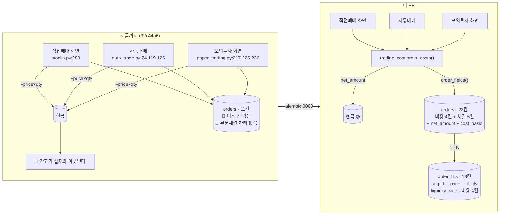

# #43 feat: 주문이 정산금액으로 현금을 옮긴다 — orders 확장 + order_fills 신설

> 🗂️ 옛 GitHub PR을 옮긴 **기록 문서**입니다 — [색인](../README.md). 원문은 그대로 두고, 링크·커밋 해시만 새 자리 기준으로 바꿨습니다.

| 항목 | 내용 |
|---|---|
| 종류 | PR |
| 상태 | 머지됨 · 2026-09-20 12:30 |
| 원 작성 | 이동원(`devlee328288`) · 2026-09-20 12:17 KST |
| 브랜치 | `feat/order-cost-schema` → `feat/trading-cost` |
| 머지 커밋 | [`474c911`](https://github.com/EST-team-project/Qurious/commit/474c911d6e7f44a4645d8b21a0f9a2d72ea57e73) |
| 바뀐 내용 | [비교 보기](https://github.com/EST-team-project/Qurious/compare/88e00b32baaa11dbc400a2e176c2f69249cc8e57...2e3ccccda2c4c6302f3ce91b5c374f46c03434b4) |
| 옛 주소 | `github.com/devlee328288/Qurious/pull/43` (지금은 열리지 않음) |

## 본문

## 0. 한 줄로

주문이 **정산금액(`net_amount`)으로 현금을 옮기게** 했습니다. 비용을 적을 칸과 부분체결을 받을 자리를 만들고, 임시 Postgres 로 마이그레이션을 실제로 돌려 확인했습니다.

**Closes [#40](../issues/040.md)** — 8절 할 일 8개 중 7개 완료 (남은 1개는 11절)
⚠️ **이 PR 은 [#42](../pulls/042.md) 위에 쌓였습니다.** base 가 `feat/trading-cost` 입니다 — **[#42](../pulls/042.md) 를 먼저 머지**해 주세요.

---

## 1. 쉬운 요약 (3줄)

- 주식을 살 때는 **주식값보다 조금 더** 나가고(수수료), 팔 때는 **조금 덜** 들어옵니다(수수료+세금).
- 지금까지 세 곳의 주문 코드가 전부 `주식값 × 수량` 만큼만 현금을 옮겼습니다. 그래서 잔고가 실제와 어긋났습니다.
- 그 차이 때문에 **자동매매가 잔고를 넘기는 주문을 만들 수 있었습니다** — 아래 6절에서 실제 숫자로 확인했습니다.

---

## 2. 한눈에 보기

| | |
|---|---|
| 새 파일 | `alembic/versions/0003_trading_cost.py` (104줄) |
| 고친 파일 | `models/trading.py` · `routes/stocks.py` · `auto_trade.py` · `paper_trading.py` · `trading_cost.py` · `readme.md` |
| 합계 | +297 −30 |
| `orders` 칸 | 11개 → **23개** |
| 새 표 | `order_fills` (13칸) |
| 검증 | 🟢 임시 Postgres 16 으로 순차 적용·이행·제약·CASCADE·downgrade 왕복 · `alembic check` |
| 고친 버그 | 🔴 자동매매가 잔고를 넘기는 주문을 만들 수 있었다 |
| Docker | 🟢 보유 이미지(`pgvector/pgvector:pg16`) 사용 · 작업 뒤 `stop`+`rm` 확인 |

---

## 3. 용어 풀이

| 용어 | 뜻 | 이 PR 에서 | 헷갈리는 점 |
|---|---|---|---|
| **정산금액** (`net_amount`) | 실제로 계좌에서 나가거나 들어오는 돈 | 현금 증감의 기준 | 체결금액(`가격 × 수량`)과 다르다. **매수는 더 나가고 매도는 덜 들어온다** — 방향이 반대다 |
| **부분체결** | 주문 100주가 60주+40주처럼 나눠 체결되는 것 | `order_fills` 한 행 = 한 번의 체결 | 체결마다 가격이 다를 수 있다. 그래서 주문에 "평균체결가"가 따로 필요하다 |
| **집계 vs 개별** | 주문 단위 합계 / 체결 단위 낱개 | `orders` 에 집계, `order_fills` 에 개별 | 둘 중 하나만 두면 안 된다 — 합계만 두면 근거가 없고, 개별만 두면 매번 조인해야 한다 |
| **`cost_basis`** | 그 비용이 어디서 온 값인가 | `none` / `estimated` / `broker` | 금액이 아니라 **출처 표시**다. 이 칸이 없으면 마이그레이션 전 행(비용 0)과 계산된 행을 섞어 보게 된다 |
| **FK CASCADE** | 부모 행이 지워지면 자식도 함께 지워짐 | 주문을 지우면 그 체결도 지워진다 | 없으면 주인 없는 체결 행이 남는다 |
| **`alembic check`** | 모델 선언과 실제 DB 스키마를 대조 | 차이 0건이어야 통과 | "마이그레이션이 돌았다"와 "모델과 같다"는 다른 얘기다 |
| **매입부대비용** | 사면서 함께 드는 비용(수수료 등) | 평균단가에 **넣지 않았다** | 회계 기준으로는 취득원가에 넣는 것이 정석이지만, 화면의 "평균단가"가 체결가와 달라지는 부작용이 있다 (9절) |

---

## 4. 바꾸기 전 / 후



### 정산금액의 정의 — 이 한 줄이 [#40](../issues/040.md) 의 결론입니다

```
매수:  net_amount = 체결가 × 수량 + 수수료 + 유관기관비
매도:  net_amount = 체결가 × 수량 − 수수료 − 유관기관비 − 증권거래세 − 농어촌특별세
```

```
   체결금액 7,000,000원 (70,000원 × 100주 · 2026년 · 코스피)

   매수 ──▶  7,000,000 + 983.69 + 254.77                       = 7,001,238.46  (나가는 현금)
             ↑체결      ↑수수료   ↑유관기관비

   매도 ──▶  7,000,000 − 983.69 − 254.77 − 3,500.00 − 10,500.00 = 6,984,761.54  (들어오는 현금)
             ↑체결      ↑수수료   ↑유관     ↑거래세     ↑농특세

   왕복 차액  16,476.92원  (체결금액의 0.2354%)  ← 예전 코드는 이것을 0원으로 봤다
```

---

## 5. 스키마 — 왜 두 표로 나누는가

FIX 프로토콜이 `CumQty`·`AvgPx`(집계)와 `LastQty`·`LastPx`(개별)를 **둘 다** 두는 것과 같은 구조를 택했습니다([#40](../issues/040.md) 7.1 조사).

| 표 | 무엇 | 왜 |
|---|---|---|
| `orders` | 집계 — `filled_quantity` · `avg_fill_price` · 비용 4칸 · `net_amount` | 부분체결이 드문 규모에서 매번 조인하는 비용이 크다. **비정규화를 일부러 남긴다** |
| `order_fills` | 개별 — `seq` · `fill_price` · `fill_quantity` · `liquidity_side` · 비용 4칸 | 근거가 없으면 집계값을 검증할 수 없다. `liquidity_side` 를 체결 행에 둔 이유는 한 주문이 부분적으로 메이커이고 부분적으로 테이커일 수 있어서다 |

**세목을 쪼갠 이유는 검증입니다.** 농특세는 코스피에만 붙고 코스닥은 거래세가 그만큼 높아 합계가 같습니다. 합계 한 칸에 합치면 나중에 "이 값이 맞나" 를 되짚을 수 없습니다.

`price` 는 **건드리지 않았습니다** — 읽는 코드가 여럿이라 뜻을 바꾸면 조용히 어긋납니다. 주문가·체결가를 구분해야 할 때는 새 칸(`order_price`·`avg_fill_price`)을 씁니다.

---

## 6. 고친 실제 버그 🔴 — 자동매매가 잔고를 넘길 수 있었다

```python
# auto_trade.py:76 (기준 32c44a6)
max_qty = int(cash_balance // price) if price > 0 else 0
```

단가로만 나누어 **수수료를 빼먹습니다.** 실제 숫자로:

| 가용현금 | 단가 | 예전 계산 | 그 정산금액 | 판정 | 이 PR |
|---:|---:|---:|---:|---|---:|
| 700,000원 | 70,000원 | **10주** | **700,123.85원** | 🔴 **123.85원 초과** | 9주 (630,111.46원) |
| 1,000,000원 | 70,000원 | 14주 | 980,173.38원 | 여유 있음 | 14주 (같음) |

고친 방법 — 수수료율로 먼저 근사하고, 넘으면 한 주씩 줄입니다:

```python
buy_rate = trading_cost.cost_rate("buy", today, slippage_bps=0.0, market=market)
max_qty = int(cash_balance // (price * (1 + buy_rate))) if price > 0 else 0
while max_qty > 0 and _net("buy", max_qty) > cash_balance:
    max_qty -= 1
```

8개 조합에서 **"잔고를 넘지 않고, 한 주 더하면 넘는다"**(최대성)를 확인했습니다 🟢 — 경계값(69,999 / 70,012 / 단가가 현금보다 큰 경우 / 2,999주)까지 포함했습니다.

---

## 7. 검증 — 임시 Postgres 로 실제로 돌렸습니다 🟢

Docker 규약대로 **보유 이미지**(`pgvector/pgvector:pg16` — Postgres 16 기반)를 썼고, 작업 뒤 `stop`+`rm` 하고 `docker ps -a` 로 비었음을 확인했습니다.

| 검증 | 결과 |
|---|---|
| `0001 → 0002 → 0003` 순차 적용 | 🟢 성공 · `orders` 11칸 → **23칸** |
| 기존 행 2건 이행 | 🟢 `order_price=price` · `avg_fill_price=price` · `filled_quantity=quantity` · `net_amount=price×quantity` · `cost_basis="none"` |
| **`alembic check`** (모델↔DB 대조) | 🟢 **`orders`·`order_fills` 차이 0건** |
| 부분체결 2건 삽입 (taker 6주 + maker 4주) | 🟢 정상 |
| 같은 `(order_id, seq)` 중복 | 🟢 `uq_order_fills_order_seq` 가 거부 |
| 주문 삭제 시 체결 | 🟢 CASCADE 로 함께 삭제 (남은 체결 0건) |
| `downgrade 0002` 왕복 | 🟢 23칸 → 11칸 → 23칸, `order_fills` 삭제·재생성, 이행 재실행 |

```
    0001 ──▶ 0002 ──▶ 0003        orders 11칸 ──▶ 23칸 · order_fills 생성
                        │
                        ├─ 기존 행 2건: price → order_price · avg_fill_price
                        │                net_amount = price × quantity
                        │                cost_basis = "none"   ← 비용을 뗀 적 없음이 남는다
                        │
                        └─ downgrade ──▶ 0002 ──▶ 다시 upgrade ──▶ 0003
                              23→11칸          11→23칸  🟢 왕복 성공
```

> **로컬에 `alembic`·`asyncpg` 가 없었습니다** — 앱이 Docker 로 도는 구조여서 설치되지 않은 상태였습니다. `requirements.txt` 에 명시된 의존성이라 설치해 검증했습니다. (참고: 프로젝트 루트에 `alembic/` 폴더가 있어 루트를 cwd 로 두면 설치된 `alembic` 패키지가 가려집니다 — 다른 디렉터리에서 실행해야 합니다.)

---

## 8. 코드 재사용 판정표

| 기존 코드 | 줄 수 | 판정 | 실제로 한 것 |
|---|---:|---|---|
| [`alembic/versions/0002_paper_trading.py`](https://github.com/EST-team-project/Qurious/blob/32c44a6/alembic/versions/0002_paper_trading.py) | 139줄 | 🔸 **패턴 재사용** | `_uuid_pk()`·`_created_at()` 헬퍼 스타일을 그대로 따랐다. 칸 목록은 상수 튜플로 빼서 `upgrade`/`downgrade` 가 같은 목록을 쓰게 |
| [`models/trading.py` `Order`](https://github.com/EST-team-project/Qurious/blob/32c44a6/app/models/trading.py#L23-L36) | 14줄 | 🔸 **칸 추가** | 기존 9칸 무수정. `price` 의 뜻을 바꾸지 않았다(주석으로 명시) |
| [`routes/stocks.py` `place_order`](https://github.com/EST-team-project/Qurious/blob/32c44a6/app/routes/stocks.py#L280-L306) | 27줄 | 🔸 **부분 수정** | 트랜잭션·포트폴리오 갱신 구조 유지. 현금 delta 와 Order 생성 인자만 |
| [`services/auto_trade.py` `_execute_virtual_trade`](https://github.com/EST-team-project/Qurious/blob/32c44a6/app/services/auto_trade.py#L48-L136) | 89줄 | 🔸 **부분 수정** | 잔고 부족 처리·포지션 갱신 구조 유지. 수량 판정과 현금 증감만 |
| [`services/paper_trading.py` `stock_order`](https://github.com/EST-team-project/Qurious/blob/32c44a6/app/services/paper_trading.py#L207-L245) | 39줄 | 🔸 **부분 수정** | 락·포지션 검사 구조 유지. `amount` → `net_amount` |
| `app/services/trading_cost.py` ([#42](../pulls/042.md)) | 449줄 | 🔸 **확장** | `order_costs()` 는 [#42](../pulls/042.md) 에 이미 있다. 이 PR 은 `market_of`·`today_kst`·`order_fields` 세 헬퍼만 추가 |
| [`models/paper.py`](https://github.com/EST-team-project/Qurious/blob/32c44a6/app/models/paper.py) 암호화폐·대체투자 주문 | — | ✅ **손대지 않음** | `crypto_orders`·`alternative_orders` 는 별도 표다. 국내주식 요율이 그대로 적용되지 않는다(후속) |

`order_fields()` 헬퍼를 만든 이유는 **같은 칸을 세 곳에서 채워야** 하기 때문입니다. 세 곳이 따로 채우면 어긋납니다.

---

## 9. 일부러 하지 않은 것

| 하지 않은 것 | 이유 |
|---|---|
| `portfolio.avg_price` 에 매입비용 포함 | 회계 기준으로는 취득원가에 넣는 것이 정석이지만, 화면의 "평균단가"가 체결가와 달라져 읽는 사람이 혼동한다. 비용은 주문 행에 남고, **현금이 그만큼 덜 남으므로 총자산에는 이미 반영된다.** 종목별 손익률(`avg_price` 기준)에만 비용이 빠진다 🟡 |
| `price` 칸의 뜻 변경 | 읽는 코드가 여럿이다. 조용히 어긋나는 것이 가장 나쁘다 |
| 암호화폐·대체투자 주문 | 국내주식 요율이 그대로 적용되지 않는다. 업비트 수수료·세제가 다르다 |
| `alembic check` 가 잡은 기존 불일치 4건 | 이 PR 범위 밖 (아래 11절) |
| `status="filled"` 고정 | 주문 응답을 검사해야 고칠 수 있다 — `get_daily_fills()` 이후 |

---

## 10. [#40](../issues/040.md) 할 일 — 7 / 8 완료

| # | 항목 | 상태 |
|---|---|---|
| 1 | `trading_cost.py` 연도별 비용 함수 | ✅ [#42](../pulls/042.md) |
| 2 | `quant_pipeline.backtest()` 비용 인자 | ✅ [#42](../pulls/042.md) |
| 3 | `backtest_strategy()` 비대칭화 | ✅ [#42](../pulls/042.md) |
| 4 | `stocks.py` 가 custom 경로에도 비용을 넘기게 | ✅ [#42](../pulls/042.md) |
| 5 | `alembic 0003` — `orders` 확장 + `order_fills` | ✅ **이 PR** |
| 6 | 주문 3경로가 `net_amount` 로 현금을 옮기게 | ✅ **이 PR** |
| 7 | 🔴 KIS TR ID 신 TR 교체 | ✅ [#41](../pulls/041.md) |
| 8 | `BrokerClient.get_daily_fills()` + KIS `inquire-daily-ccld` | ⏸ **남음** |

8번은 [#40](../issues/040.md) **11절 한계 ①**(모의계좌로 실제 비용 대조)과 한 묶음입니다 — 체결을 받아 와야 `cost_basis="broker"` 를 채울 수 있고, 그래야 요율표 계산이 실제 정산액과 맞는지 확인할 수 있습니다. 별도로 다룹니다.

---

## 11. 한계 · 뒤집을 조건 · 새로 알게 된 것

| 항목 | 확실도 | 뒤집을 조건 / 할 일 |
|---|---|---|
| **비용이 전부 추정값이다** (`cost_basis="estimated"`) | 🟡 | 8번(`get_daily_fills`) 이후 `broker` 로 대조 |
| 원 단위 절사 규칙을 확인하지 않았다 (`round_to_won=False`) | 🟡 | 모의계좌 체결 1건과 정산액 대조 |
| 종목별 손익률에는 비용이 빠진다 (`avg_price` 기준) | 🟡 | 손익 계산부를 `net_amount` 기준으로 — 화면 파급이 있어 따로 |
| `status="filled"` 고정 — 미체결이 될 수 있는데 체결로 기록 | 🔴 | 주문 응답 검사 + 8번 |
| `order_fills` 를 아직 아무도 쓰지 않는다 (표만 있다) | 🟢 | 8번이 채운다. 스키마를 먼저 둔 것은 의도다 |
| **🔴 새로 알게 된 것**: `alembic check` 가 `orders` 밖에서 **4건**을 잡는다 — `ix_api_keys_user`·`ix_portfolio_user_id` 가 마이그레이션에는 있고 모델에는 없다. `users.client_id` 는 마이그레이션이 unique index, 모델이 unique constraint 다 | 🟢 | `create_all` 로 만든 DB 와 마이그레이션으로 만든 DB의 스키마가 달라진다. 별도 과제 |
| 암호화폐·대체투자 주문은 그대로다 | 🟢 | 업비트 요율·세제를 따로 조사해야 한다 |

> **강사님 피드백 ⑤ "주석과 개념을 기록"** — `0003_trading_cost.py` 머리말에 *왜 두 표로 나누는지* · *왜 세목을 쪼개는지* · *왜 `price` 를 건드리지 않는지* 를 적어 뒀습니다. 칸 이름만 보고는 알 수 없는 판단들입니다.

---

🤖 Generated with [Claude Code](https://claude.com/claude-code)
