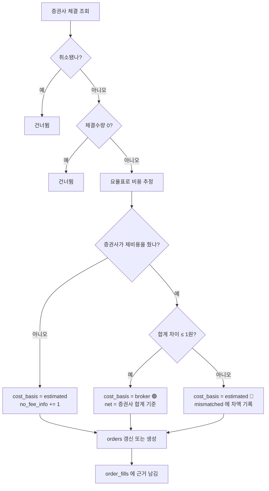

# #45 feat: 증권사 체결을 들여온다 — 비용이 처음으로 추정을 벗어난다 (+ 주문 버그 2건)

> 🗂️ 옛 GitHub PR을 옮긴 **기록 문서**입니다 — [색인](../README.md). 원문은 그대로 두고, 링크·커밋 해시만 새 자리 기준으로 바꿨습니다.

| 항목 | 내용 |
|---|---|
| 종류 | PR |
| 상태 | 머지됨 · 2026-09-20 12:57 |
| 원 작성 | 이동원(`devlee328288`) · 2026-09-20 12:51 KST |
| 브랜치 | `feat/broker-daily-fills` → `main` |
| 머지 커밋 | [`3b98645`](https://github.com/EST-team-project/Qurious/commit/3b98645c65a927b206a8ee5d40a98e1f516d8d3a) |
| 바뀐 내용 | [비교 보기](https://github.com/EST-team-project/Qurious/compare/298ae90aa0b3163aafbd1af6d9316902e5421e06...c43c66bdfca710da4130ed3f022f7be62bf52a8c) |
| 옛 주소 | `github.com/devlee328288/Qurious/pull/45` (지금은 열리지 않음) |

## 본문

`Closes #40`

## 한 줄 요약

**우리가 계산한 매매비용이 맞는지, 증권사에 물어볼 수 있게 됐다.** 그 과정에서 주문
경로의 버그 2건을 찾아 고쳤다 — 하나는 **거부된 주문이 성공으로 표시되던 것**이다.

---

## 1. 무엇이 문제였나

### 1.1 비용이 전부 "추정"이었다

S34 에서 요율표(`app/services/trading_cost.py`)를 만들었지만, 그 값이 맞는지는
**한 번도 확인한 적이 없다.** 모든 주문의 `cost_basis` 가 `estimated` 였다.

```
                    우리 요율표                 증권사 실제 정산
                  ┌──────────────┐            ┌──────────────┐
                  │ 수수료 98.37 │            │              │
                  │ 유관   25.48 │     ???    │      ?       │
                  │ ─────────── │ ◀────────▶ │              │
                  │ 합계  123.85 │            │              │
                  └──────────────┘            └──────────────┘
                                  맞대어 본 적이 없다
```

### 1.2 실전 주문은 DB 에 기록조차 없었다

더 근본적인 문제를 이번에 발견했다. 증권사에 실제로 주문을 내는 두 경로는
**주문만 내고 `orders` 테이블에 아무것도 남기지 않는다.**

| 경로 | 파일 | 증권사 주문 | `orders` 기록 |
|---|---|---|---|
| 직접매매 화면 → 증권사 | [`stocks.py:639`](https://github.com/EST-team-project/Qurious/blob/c43c66b/app/routes/stocks.py#L639) | ○ | ✗ **없음** |
| 자동매매 → 증권사 | [`auto_trade.py:185`](https://github.com/EST-team-project/Qurious/blob/c43c66b/app/services/auto_trade.py#L185) | ○ | ✗ **없음** |
| 직접매매 화면 (가상) | [`stocks.py:290`](https://github.com/EST-team-project/Qurious/blob/c43c66b/app/routes/stocks.py#L290) | ✗ | ○ |
| 모의투자 화면 (가상) | [`paper_trading.py:221`](https://github.com/EST-team-project/Qurious/blob/c43c66b/app/services/paper_trading.py#L221) | ✗ | ○ |

즉 **가상 주문만 기록되고 진짜 주문은 기록되지 않았다.** 그래서 체결 조회는 단순한
보조 기능이 아니라, 실제 거래의 **유일한 기록 경로**다.

---

## 2. 바꾸기 전 / 후 구조

### 전

```
사용자 ──▶ place_order() ──▶ KIS ──▶ (끝)
                              │
                              └─ 체결됐는지, 얼마를 뗐는지 아무도 모른다

백테스트 ──▶ trading_cost (추정) ──▶ orders.cost_basis = "estimated"
```

### 후

```
사용자 ──▶ place_order() ──▶ KIS ──▶ 주문번호(ODNO)
                                        │
                        ┌───────────────┘
                        ▼
        get_daily_fills() ──▶ FillInfo (+ 추정제비용합계)
                        │
                        ▼
        sync_daily_fills() ──┬──▶ orders      (주문번호로 갱신 · 중복 없음)
                             └──▶ order_fills (근거)
                        │
                        ▼
              우리 요율표와 대조
                ├─ 맞음  → cost_basis = "broker"   🟢 검증됨
                └─ 틀림  → cost_basis = "estimated" + 차액 보고 🔴
```



---

## 3. 코드 재사용 판정표

새로 만든 것보다 **이미 있는 것에 이어 붙인 부분이 더 많다.**

| 무엇 | 판정 | 근거 | 줄 수 |
|---|---|---|---|
| 비용 계산 (`order_costs`) | ♻️ **그대로 재사용** | [`trading_cost.py:248`](https://github.com/EST-team-project/Qurious/blob/c43c66b/app/services/trading_cost.py#L248) — 세목·시행일·시장 구분이 이미 있다 | 0줄 추가 |
| 시장 판별 (`market_of`) | ♻️ **그대로 재사용** | [`trading_cost.py:111`](https://github.com/EST-team-project/Qurious/blob/c43c66b/app/services/trading_cost.py#L111) | 0줄 |
| `OrderCost` 자료형 | ♻️ **그대로 재사용** | [`trading_cost.py:211`](https://github.com/EST-team-project/Qurious/blob/c43c66b/app/services/trading_cost.py#L211) | 0줄 |
| `orders` · `order_fills` 스키마 | ♻️ **그대로 재사용** | [#43](../pulls/043.md) 에서 만든 23칸 + 신설 테이블. 마이그레이션 **불필요** | 0줄 |
| KIS 스펙 (TR·필드) | ♻️ **강사님 카탈로그 재사용** | `th03-stock-coin-trade` 의 `kis_api_catalog.json` (KIS 공식 저장소에서 생성) | 0줄 |
| `BrokerClient` 인터페이스 | ➕ **확장** | [`base.py:100`](https://github.com/EST-team-project/Qurious/blob/c43c66b/app/services/brokers/base.py#L100) 메서드 1개 추가 | +41 |
| `FillInfo` | 🆕 신규 | [`base.py:49`](https://github.com/EST-team-project/Qurious/blob/c43c66b/app/services/brokers/base.py#L49) | (위 포함) |
| KIS 체결 조회 | 🆕 신규 | [`kis.py:257`](https://github.com/EST-team-project/Qurious/blob/c43c66b/app/services/brokers/kis.py#L257) | +110 |
| 체결 동기화 | 🆕 신규 | [`fill_sync.py:93`](https://github.com/EST-team-project/Qurious/blob/c43c66b/app/services/fill_sync.py#L93) | +245 |
| 버그 수정 2건 | 🔧 수정 | [`kis.py:26`](https://github.com/EST-team-project/Qurious/blob/c43c66b/app/services/brokers/kis.py#L26) · [`kis.py:43`](https://github.com/EST-team-project/Qurious/blob/c43c66b/app/services/brokers/kis.py#L43) | +32 |
| 검증 스크립트 2개 | 🆕 신규 | `scripts/verify_fill_sync.py` · `scripts/sync_fills.py` | +298 |

**마이그레이션이 없다.** [#43](../pulls/043.md) 에서 만든 스키마가 그대로 맞아떨어졌다.

---

## 4. 🔴 버그 2건 — 둘 다 모의계좌를 실제로 두드려 보고 찾았다

### 4.1 거부된 주문이 "성공"으로 올라갔다

일요일에 모의계좌로 주문을 내 봤더니 이런 응답이 왔다.

```json
{"rt_cd": "1", "msg_cd": "40100000", "msg1": "모의투자 영업일이 아닙니다."}
```

그런데 **HTTP 상태코드는 200** 이었다. 코드는 `raise_for_status()` 만 보고 있었으므로
이 응답을 성공으로 처리했다.

```
                    거부된 주문의 여정 (수정 전)

  KIS ──[HTTP 200 + rt_cd=1]──▶ raise_for_status() 통과 ──▶ return r.json()
                                                                  │
   화면: {"ok": true}  ◀───────────────────────────────────────────┤
   알림: "주문 완료"   ◀───────────────────────────────────────────┘
                              ↑ 주문은 접수되지도 않았다
```

자동매매가 이 응답을 받으면 **있지도 않은 체결을 전제로 다음 판단을 한다.**

수정: 모든 KIS 호출이 [`_check()`](https://github.com/EST-team-project/Qurious/blob/c43c66b/app/services/brokers/kis.py#L43) 를 지난다 (현재가·잔고·주문·일봉·체결조회 5곳).
이제 `HTTPException(502, "증권사 API 주문 오류: KIS buy 주문 실패 [40100000] 모의투자
영업일이 아닙니다.")` 로 올라간다.

> **확실도 🟢** — 실제로 재현하고 수정 후 예외가 나오는 것까지 확인했다.

### 4.2 잔고 조회가 계속 HTTP 500 이었다

KIS 는 계좌번호를 **종합계좌번호(8자리)** 와 **계좌상품코드(2자리)** 로 나눠 받는다.
코드는 `account_no[:8]` · `account_no[8:]` 로 잘랐는데, `.env` 의 계좌번호가 8자리라
상품코드가 **빈 문자열**로 나갔다.

```
  .env: KIS_MOCK_ACCOUNT_NO=50201820   (8자리)
                │
                ├─ CANO         = "50201820"  ✅
                └─ ACNT_PRDT_CD = ""          ❌ → HTTP 500
```

수정: [`_split_account()`](https://github.com/EST-team-project/Qurious/blob/c43c66b/app/services/brokers/kis.py#L26) 가 `50201820-01` · `5020182001` · `50201820` 을 모두
받아들이고, 상품코드가 없으면 `01`(종합위탁)을 채운다.

수정 후: `예수금 10,000,000원 · 보유 0종목` 🟢

---

## 5. 강사님 KIS 카탈로그에서 확인한 것

`learning/th03-stock-coin-trade/lecture` 에 새로 들어온 `kis_api_catalog.json` 은
**KIS 공식 저장소**(`koreainvestment/open-trading-api` 의 `examples_llm/domestic_stock`)
에서 생성된 것이라 1차 출처에 가깝다. 읽기만 했고 작업본에 merge 하지 않았다.

| 확인 대상 | S34 까지 | 카탈로그 확인 결과 |
|---|---|---|
| `EXCG_ID_DVSN_CD` | 🟡 "휴일 응답으로 보아 선택인 듯" | 🟢 **`required: true`** — 필수다 (우리는 이미 `KRX` 로 보내고 있었다) |
| 체결조회 TR | ❓ 모름 | 🟢 `TTTC0081R`(3개월 이내) · `CTSC9215R`(3개월 이전) — **기간으로 TR 이 갈린다** |
| 모의 지원 | ❓ 모름 | 🟢 지원 (`VTTC0081R` · `VTSC9215R`) |
| 제비용 제공 | ❓ 모름 | 🟢 **`prsm_tlex_smtl`(추정제비용합계)** 가 응답에 있다 ← 이 PR 의 출발점 |
| 거래소 선택지 | ❓ 모름 | 🟡 `KRX / NXT / SOR / ALL` — 넥스트레이드가 선택지에 있다 |

⚠️ 다만 카탈로그의 **한글 라벨 일부가 필드명과 어긋난다.** `prsm_tlex_smtl` 에
"총체결금액" 이, `pchs_avg_pric` 에 "추정제비용합계" 가 붙어 있다. 필드명
(`prsm` 추정 · `tlex` 제비용 · `smtl` 합계)이 자명하므로 **라벨이 아니라 필드명을 따랐고**,
응답 원문을 `FillInfo.raw` 에 통째로 보존해 해석이 틀려도 되돌릴 수 있게 했다.

---

## 6. 용어 — 두 층으로

**TR ID**
- *뜻*: 한국투자증권 API 에서 "어떤 업무를 요청하는지" 를 가리키는 코드. HTTP 헤더에
  넣는다.
- *이 문서에서*: 같은 주소(`/inquire-daily-ccld`)라도 TR ID 에 따라 **최근 3개월**
  이냐 **그 이전**이냐가 갈린다. 하나만 알면 과거 체결을 못 본다.
- *헷갈리는 점*: 실전과 모의가 접두사만 다르다(`T` → `V`). 그래서 "모의에서 됐으니
  실전도 되겠지" 가 대체로 맞지만, **모의가 지원하지 않는 API 도 있다**(카탈로그의
  `demoSupported`).

**제비용 (諸費用)**
- *뜻*: 수수료·세금 등 매매에 따라붙는 비용을 통틀어 부르는 말.
- *이 문서에서*: KIS 가 주는 `prsm_tlex_smtl` 는 이것들의 **합계 한 칸**이다. 세목이
  나뉘어 있지 않다.
- *헷갈리는 점*: 이름에 "추정"(`prsm`)이 붙어 있다. 증권사도 체결 직후에는 확정
  정산액이 아닌 추정치를 준다는 뜻으로 읽힌다 — 🟡 **이 점은 아직 확인하지 못했다.**

**`cost_basis`**
- *뜻*: 이 주문의 비용이 **어디서 온 값인지** 를 적는 칸.
- *이 문서에서*: `none`(안 뗌) · `estimated`(우리 요율표) · `broker`(증권사 대조 통과).
- *헷갈리는 점*: `broker` 라고 해서 세목까지 증권사가 준 것은 아니다. **합계만**
  대조했고 세목은 여전히 우리 요율표 값이다.

---

## 7. 설계 판단 하나 — 어긋났을 때 무엇을 믿는가

증권사 합계와 우리 추정이 다를 때 `net_amount`(현금 증감)에 무엇을 쓸 것인가.

| 선택 | 장점 | 단점 | 채택 |
|---|---|---|---|
| 증권사 합계를 쓴다 | 현금이 실제와 맞는다 | `net = 체결금액 ± 세목합` 이 깨진다 → **어느 세목이 틀렸는지 영영 모른다** | ✗ |
| 우리 추정을 쓰고 차액을 보고 | 불변식이 지켜져 원인 추적 가능 | 그 행의 현금이 일시적으로 틀리다 | ✓ |

요율표를 고친 뒤 다시 동기화하면 그때 `broker` 로 바뀐다. **틀린 값을 잠깐 두는 대신
틀린 이유를 알 수 있게** 했다.

---

## 8. 검증

### 8.1 DB 왕복 (임시 Postgres 16 · `pgvector/pgvector:pg16`)

체결 5건(일치 1 · 불일치 1 · 제비용 미제공 1 · 취소 1 · 미체결 1)을 넣고 두 번 동기화.

```
[1회차]  fetched 5 · created 3 · verified 1 · no_fee_info 1
         skipped_cancelled 1 · skipped_unfilled 1 · mismatch_count 1
         불일치: 0002 sell 증권사 2045.62 vs 우리 1545.62 (차 +500.00원 · +7.04bp)

[2회차]  created=0  updated=3        ← 같은 체결을 다시 넣어도 행이 늘지 않는다
         orders 3행 · order_fills 3행

    주문번호   구분  수량     체결가        정산금액     수수료    거래세    농특세    유관        근거
      0001   buy   10  70,000   700,123.85    98.37     0.00    0.00  25.48     broker
      0002  sell   10  71,000   708,454.38    99.77   355.00 1065.00  25.84  estimated
      0003   buy    5  50,000   250,044.23    35.13     0.00    0.00   9.10  estimated

    세목합 검산 (net = 체결금액 ± 세목합)
      0001  700,000 + 123.85 = 700,123.85 vs net 700,123.85 → OK
      0002  710,000 − 1545.62 = 708,454.38 vs net 708,454.38 → OK
      0003  250,000 + 44.23  = 250,044.23 vs net 250,044.23 → OK
```

컨테이너는 검증 후 `stop` + `rm` 했다 (`docker ps -a` 비어 있음).

### 8.2 KIS 모의계좌 실호출

| 호출 | 결과 |
|---|---|
| 토큰 발급 | 🟢 성공 (파일 캐시 — 발급 간격 제한 때문) |
| 현재가 조회 | 🟢 삼성전자 260,000원 |
| 잔고 조회 | 🟢 예수금 10,000,000원 (**수정 전에는 HTTP 500**) |
| 체결 조회 | 🟢 정상 응답 · 0건 (계좌에 주문 이력이 없다) |
| 주문 | 🟢 거부가 **예외로** 올라옴 (**수정 전에는 성공으로 표시**) |

---

## 9. 한계 — 무엇을 아직 모르는가

| # | 한계 | 확실도 | 닫는 법 |
|---|---|---|---|
| ① | **요율표가 실제와 맞는지 여전히 모른다** | 🔴 | 영업일에 모의계좌로 1주 매수·매도 → `scripts/sync_fills.py` |
| ② | 체결시각이 아니라 **주문시각**을 쓴다 | 🟡 | KIS 가 체결시각을 주지 않는다. 실시간 체결통보(WebSocket)로만 가능 |
| ③ | `order_fills` 가 **집계 1행**이다 | 🟡 | 일별조회는 주문 단위 집계만 준다. 진짜 부분체결은 체결통보로 |
| ④ | ETF 판정이 **종목명 규칙**에 기댄다 | 🔴 | 상품 구분을 적재해야 한다 ([#32](../issues/032.md) 8.3) |
| ⑤ | 코스닥·코넥스를 **코스피로 본다** | 🟡 | KIS 가 접미사 없는 6자리만 준다. 코스피·코스닥은 합계가 같아 값은 맞지만 코넥스는 어긋난다 |
| ⑥ | "추정제비용"의 **추정이 무슨 뜻인지** 모른다 | 🟡 | 실제 정산액과 대조해야 안다 |
| ⑦ | 3개월 경계를 **90일로 근사**한다 | 🟡 | 경계를 걸친 기간은 호출하는 쪽이 나눠야 한다 |
| ⑧ | 동기화를 **부르는 화면·스케줄이 없다** | 🟢 | 다음 PR. 지금은 스크립트로만 부른다 |

## 10. 이 PR 을 뒤집을 조건

- 영업일 실측에서 **증권사 제비용이 우리 요율표와 크게 어긋나면** → 요율표([#40](../issues/040.md) 6.1)를
  다시 봐야 한다. 그때 이 PR 의 대조 장치는 그대로 쓰되 요율만 고친다.
- `prsm_tlex_smtl` 이 **실제 정산액이 아니라 주문 시점 추정치**로 밝혀지면 → 대조
  기준을 정산 조회(별도 API)로 옮겨야 한다.

🤖 Generated with [Claude Code](https://claude.com/claude-code)
