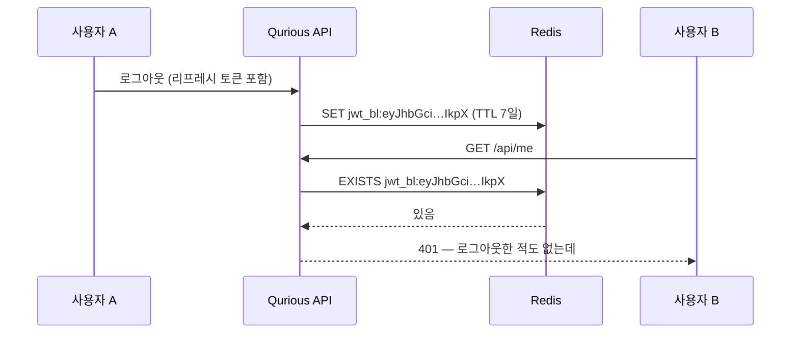

# #47 fix: 로그아웃 한 번이 전 사용자를 끊던 것을 멈춘다 — 폐기 이름표를 jti 로 ([#22](../issues/022.md) 결함 1·2)

> 🗂️ 옛 GitHub PR을 옮긴 **기록 문서**입니다 — [색인](../README.md). 원문은 그대로 두고, 링크·커밋 해시만 새 자리 기준으로 바꿨습니다.

| 항목 | 내용 |
|---|---|
| 종류 | PR |
| 상태 | 머지됨 · 2026-09-20 16:39 |
| 원 작성 | 이동원(`devlee328288`) · 2026-09-20 13:27 KST |
| 브랜치 | `fix/jwt-revocation-scope` → `main` |
| 머지 커밋 | [`d115a4f`](https://github.com/EST-team-project/Qurious/commit/d115a4fdece583275748a22cba470eed9b857d47) |
| 바뀐 내용 | [비교 보기](https://github.com/EST-team-project/Qurious/compare/3b98645c65a927b206a8ee5d40a98e1f516d8d3a...11d6562fafaca9d5b853b4529dfc288a8917ab3a) |
| 옛 주소 | `github.com/devlee328288/Qurious/pull/47` (지금은 열리지 않음) |

## 본문

Closes [#46](../issues/046.md)
Refs [#22](../issues/022.md) (결함 **1·2** 해결 · 결함 **10** 의 JWT 부분 해결)

> **쉬운 요약 3줄**
> 1. 누구든 로그아웃 요청 한 번으로 **전 사용자의 API 로그인을 최대 7일 막을 수 있던 것**을 고쳤습니다.
> 2. 원인은 폐기 목록의 이름표가 **전원 공통 글자 하나**였던 것 + 그 요청에 **로그인 확인이 없던 것** 두 가지였고, 여기에 서명 열쇠가 **공개 저장소에 그대로** 올라가 있어 계정조차 필요 없었습니다.
> 3. 고친 뒤 임시 Redis 로 **16가지를 재서 전부 통과**했습니다. 화면(`public/`)·DB·다른 39개 엔드포인트는 **한 줄도 안 바뀝니다.**

---

## 1. 무엇이 문제였나

JWT 는 점으로 나뉜 세 토막인데, **앞 토막은 "무슨 알고리즘인지"만 적힌 머리말**이라 모두의 토큰에서 같습니다.

```
                         ← 폐기 이름표로 쓰던 앞 32자 →
┌────────────────────────────────────┬─────────────────────┬───────────┐
│ eyJhbGciOiJIUzI1NiIsInR5cCI6IkpXVCJ9│ eyJzdWIiOiJ1c2Vy... │ K3xT9v... │
│ ① 머리말 — 누구나 똑같다 · 36자     │ ② 알맹이(누구인지)  │ ③ 서명    │
└────────────────────────────────────┴─────────────────────┴───────────┘
                                   31│32
                                     └─ 32자에서 끊으면 ① 안에서 끝난다
```

Redis 에는 `jwt_bl:eyJhbGciOiJIUzI1NiIsInR5cCI6IkpX` **하나**만 존재했습니다.



그리고 그 요청에는 인증이 없었고, `JWT_SECRET` 은 `app/config.py:16` 의 기본값
`change-me-jwt-secret-32chars-min!!` 그대로였습니다(`.env`·`.env.dev`·`.env.prod` 각 **0건**).
이 저장소는 Public 이므로 **계정 없이 토큰을 지어내 위 공격을 할 수 있었습니다.**

## 2. 바꾸기 전 / 후

```
[ 전 ]  요청 → is_revoked(토큰 앞 32자) → decode(서명검증) → 통과
               └ 서명도 안 본 문자열로 이름표 · 이름표가 전원 공통

[ 후 ]  요청 → decode(서명검증 + exp 필수) → type 확인 → is_revoked(jti) → 통과
               └ 검증된 알맹이에서만 이름표 · 토큰마다 다름
```

| | 예전 | 지금 |
|---|---|---|
| 폐기 이름표 | `token[:32]` — **전원 공통** | `jti`(uuid4). 옛 토큰은 `sha256(머리말.알맹이)` |
| 폐기 검사 시점 | 서명 검증 **전** | 서명 검증 **후** |
| revoke 호출자 인증 | **없음** | Bearer 또는 세션 쿠키 |
| 누구 토큰인지 | **확인 안 함** | 주인 == 호출자, 아니면 403 |
| `mark_offline` 대상 | 본문 토큰의 id (남을 오프라인으로) | **호출자 자신** |
| `exp` 없는 토큰 | 만료도 폐기도 안 됨 | 401 거절 (`require_exp`) |
| 기본 `JWT_SECRET` | 그대로 서명 | 발급·검증 차단 (탈출구 있음) |

**왜 `sha256(토큰 전체)` 가 아닌가** — OWASP JWT Cheat Sheet 가 폐기 키로 토큰 원문·그 SHA-256 을
쓰지 말라고 명시합니다. 서명 토막의 base64 는 서명이 덮는 범위 밖이라 **뜻은 같고 글자만 다른 변조본**을
만들 수 있고(malleability), 그러면 이름표를 비켜 갑니다. 조사 중 python-jose 3.5.0·HS256 에서
같은 서명이 여러 문자열로 통과하는 것을 실측했습니다. `머리말.알맹이` 는 HMAC 입력 바이트 그 자체라
한 바이트만 달라도 서명 검증에서 먼저 걸립니다.

## 3. 같이 걸려 있던 함정 셋 — 안 고치면 모양만 바꿔 되살아납니다

| # | 함정 | 안 고쳤다면 | 어떻게 |
|---|---|---|---|
| ① | `create_token_pair` 가 같은 payload 를 두 번 쓴다 | 액세스·리프레시가 **같은 jti** → 하나 폐기하면 둘 다 죽음 | `jti` 를 **생성 함수 안에서** 민팅 (호출부 값은 덮어씀) |
| ② | refresh 가 클레임을 통째로 복사(`type/iat/exp`만 뺌) | 리프레시 jti 가 새 액세스에 상속 → **사용자 단위 전역 키** 재현 | 제외 목록에 `jti` 추가 |
| ③ | python-jose 는 `exp` 없으면 만료 검사를 건너뜀 | `exp` 없는 **영구 출입증** | `options={"require_exp": True}` |

## 4. 코드 재사용 판정

| 무엇 | 줄 | 판정 | 왜 |
|---|---:|---|---|
| `RedisCache("jwt_bl")` · `set/exists` | 14 | ♻️ 그대로 | 네임스페이스·TTL 이 이미 맞다. **키 값만** 문제였다 |
| `get_current_user_any` | 21 | ♻️ 그대로 | revoke 인증에 재사용 — 쿠키 사용자도 로그아웃 가능 |
| `mark_offline` | — | ♻️ 대상만 교체 | 본문 id → 호출자 id |
| `verify_fill_sync.py` 형식 | 134 | ♻️ 본떠 씀 | S35 관례(도커 1개 + 항목별 통과/실패)를 따름 |
| `_bl_key` | 3 | ✍️ 다시 씀 | 결함의 본체 |
| `decode_token` | 13 | ✏️ 고쳐 씀 | `require_exp` · `verify_exp` 인자 |
| `revoke_tokens` 라우트 | 9 | ✍️ 다시 씀 | 인증·소유권이 통째로 없었다 |

**안 건드린 곳** 🟢 — `Depends(get_current_user_any)` **39곳** 무수정(시그니처 동일) ·
`public/` 프런트엔드는 JWT 를 아예 안 쓰고(쿠키 세션 전용) `/auth/token/revoke` 호출자 **0건** ·
DB·alembic 변경 **없음**.

## 5. 검증 — 실측 16건 통과 · 0건 실패

```bash
docker run -d --name qurious-jwt-test -p 16380:6379 redis:7-alpine
PYTHONPATH=. python scripts/verify_jwt_revocation.py
docker stop qurious-jwt-test && docker rm qurious-jwt-test   # 실행 후 정리 완료
```

이 검사는 *"고쳐졌다"* 뿐 아니라 **"예전 코드였다면 실패했을 것"** 까지 함께 잽니다.

| # | 재는 것 | |
|---|---|---|
| 1 | A·B 의 이름표가 다르다 / **옛 방식이었다면 같았다** | 🟢🟢 |
| 2 | A 로그아웃 뒤에도 **B 는 멀쩡하다** | 🟢🟢 |
| 3 | 액세스·리프레시 jti 가 다르다 / 액세스 폐기해도 리프레시 생존 | 🟢🟢 |
| 4 | 리프레시 jti 가 새 액세스에 안 묻는다 (넣어 줘도 덮어씀) | 🟢🟢 |
| 5 | 서명부 변조본도 **같은 이름표**로 떨어진다 | 🟢 |
| 6 | `exp` 없는 토큰 401 | 🟢 |
| 7 | 자리표시자 비밀값이면 발급 차단 / 탈출구 동작 | 🟢🟢 |
| 8 | A 가 B 토큰 폐기 시 **403** · B 토큰 그대로 · 자기 것 2개는 폐기 | 🟢🟢🟢🟢 |

## 6. ⚠️ 머지 뒤에 꼭 해야 하는 일

```bash
openssl rand -hex 32        # 나온 값을
# .env (또는 .env.dev) 에
JWT_SECRET=<그 값>
```

**안 넣으면 JWT 발급·검증이 500 으로 막힙니다.** 웹 화면(쿠키 세션)은 영향 없습니다.
급할 때 `JWT_ALLOW_INSECURE_SECRET=true` 로 넘길 수 있지만 **운영에서는 켜지 마세요.**

가드를 `import` 가 아니라 **토큰을 다루는 시점**에 둔 이유는, `app.config` 를 함께 쓰는
수집기(`collector/`)와 스크립트가 JWT 와 무관한데도 못 돌게 되는 일을 피하려는 것입니다.

## 7. 한계 — 이 PR 이 **안** 고치는 것 🔴

| 남은 것 | 왜 |
|---|---|
| 리프레시 **회전** 없음 (RFC 9700 §4.14.2 권고) | 클라이언트 변경을 부른다. `jti` 가 생겼으니 다음에 가능 |
| 리프레시를 폐기해도 **이미 나간 액세스는 15분** 산다 | 사용자 단위 폐기(epoch)가 별도로 필요 |
| refresh 가 **DB 를 다시 안 본다** → 권한 강등·탈퇴가 7일 미반영 | [#22](../issues/022.md) 결함 7 · 구조 변경 |
| 쿠키 로그아웃이 **JWT 를 안 끊는다** | 두 인증 체계를 잇는 설계 판단 필요 |
| **레이트 리밋 0곳** | [#22](../issues/022.md) 결함 9 · 미들웨어가 하나도 없어 별건 |
| 폐기 목록이 **RDB 스냅샷에만** 남는다 🟡 | AOF 가 꺼져 있어 비정상 종료 시 되살아날 수 있다 |
| Redis 장애 시 인증 **500** | 🟢 fail-**closed** 라 안전한 쪽. 다만 방침이 문서화 안 됨 |

**같이 한 작은 것**: `python-jose` 하한 `>=3.3.0` → `>=3.4.0` (CVE-2024-33663·33664).
🟡 두 CVE 모두 JWE·비대칭키 경로라 우리(HS256 + `algorithms` 명시)의 실제 노출은 아니지만,
상한도 락파일도 없어 빌드마다 버전이 달라지므로 바닥만 올려 둡니다.

## 8. 뒤집을 조건

- 🔴 **소유권 검사가 정상 흐름을 막으면** — 서버 간 대리 폐기가 필요해지면 관리자 역할에 예외를 둡니다.
  지금은 그런 호출자가 **0건**이라 좁게 잠갔습니다.
- 🔴 **`jti` 없는 옛 토큰 폴백이 문제가 되면** — 폴백을 지우고 401 로 바꿉니다(최대 7일 재로그인).
- 🟡 **`JWT_SECRET` 가드가 팀원 로컬을 막으면** — `JWT_ALLOW_INSECURE_SECRET=true` 로 즉시 풀립니다.
  번거롭다는 의견이 모이면 가드를 경고 로그로 낮춥니다.

🤖 Generated with [Claude Code](https://claude.com/claude-code)
