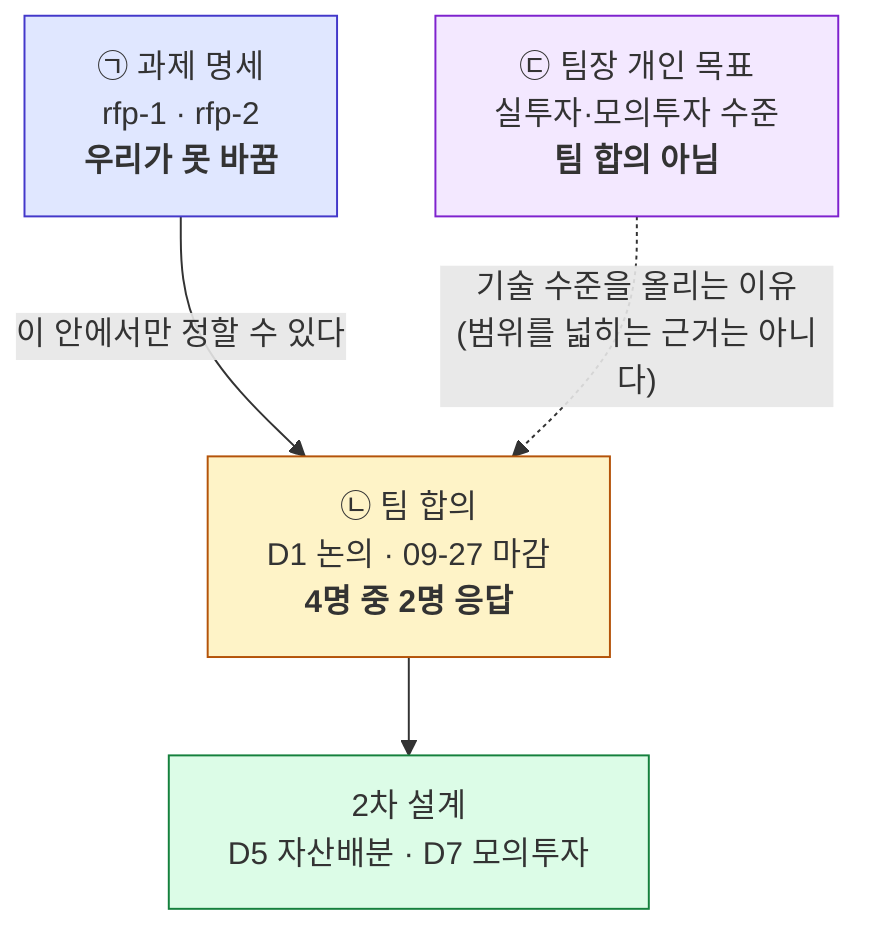

# #50 docs: 프로젝트 계획서 v1.0 — 양식 9칸을 실측으로 채우고, 정본 .md + 제출용 .docx 로 낸다

> 🗂️ 옛 GitHub PR을 옮긴 **기록 문서**입니다 — [색인](../README.md). 원문은 그대로 두고, 링크·커밋 해시만 새 자리 기준으로 바꿨습니다.

| 항목 | 내용 |
|---|---|
| 종류 | PR |
| 상태 | 머지됨 · 2026-09-20 17:04 |
| 원 작성 | 이동원(`devlee328288`) · 2026-09-20 16:53 KST |
| 브랜치 | `docs/project-plan-v1` → `main` |
| 머지 커밋 | [`f3ed455`](https://github.com/EST-team-project/Qurious/commit/f3ed4559b87b72a3546866ba65015b0614e2d84f) |
| 바뀐 내용 | [비교 보기](https://github.com/EST-team-project/Qurious/compare/3b597af7c791ba56c2cd2e54196ab6150ff226fd...61e5bc7d345e09c7c62c88bc7fb6cff2cc5540f3) |
| 옛 주소 | `github.com/devlee328288/Qurious/pull/50` (지금은 열리지 않음) |

## 본문

> **쉬운 요약 3줄**
> 1. 강사님 양식(9행 3열)에 맞춘 **프로젝트 계획서 v1.0** 을 썼습니다 — **정본 `.md` + 제출용 `.docx`**, 그리고 `.md → .docx` 변환 스크립트.
> 2. 9칸을 **추측 없이 오늘 다시 잰 숫자로** 채웠습니다 — 시세 4,460,710행 · 배당 9,188건 · 조정 이벤트 2,689건 · 코드 19,139줄.
> 3. **비어 있는 것도 본표에 적었습니다** — 벤치마크 없음 🔴 · 1차 주 검정 미수행 🔴 · ETF 0행 🟡 · 모의투자 즉시 체결 🔴.

`Closes #49` · 기준 커밋 [`3b597af`](https://github.com/EST-team-project/Qurious/commit/3b597af) · 확실도 **🟢 실측 / 🟡 미확정 / 🔴 없음**

---

## 1. 무엇을 했나

| 파일 | |
|---|---|
| `docs/계획서/프로젝트계획서_v1.0.md` | **정본** — 사람이 고치는 것 |
| `docs/계획서/프로젝트계획서_v1.0.docx` | **제출본** — 스크립트가 만드는 것 (제목 27 · 표 14 · 코드블록 8) |
| `scripts/build_plan_docx.py` | `.md → .docx` 변환기 |
| `docs/TIL/이동원/2026-09-20-계획서의-빈칸이-계획이다.md` | TIL |
| `.gitignore` | 강사님 배포 양식만 막고 **우리 계획서는 예외로 통과** |

커밋 3개 — [`4fb735b`](https://github.com/EST-team-project/Qurious/commit/4fb735b) 계획서 · [`8cd206c`](https://github.com/EST-team-project/Qurious/commit/8cd206c) TIL · [`61e5bc7`](https://github.com/EST-team-project/Qurious/commit/61e5bc7) docx·쉬운 설명

### 1.1 왜 `.md` 가 정본이고 `.docx` 는 생성물인가

제출은 Word 로 해야 하지만, **두 벌을 손으로 맞추면 반드시 어긋납니다.** 계획서는
세션마다 숫자가 바뀌고, 어긋나는 쪽이 제출본일 때가 가장 나쁩니다.

| | Markdown | .docx |
|---|---|---|
| 변경 이력 | ✅ `git diff` 로 **어느 칸이 바뀌었는지** 보임 | ❌ 압축 바이너리 — 통째로 바뀐 것으로 보임 |
| 충돌 해결 | ✅ 줄 단위 병합 | ❌ 불가 |
| 제출 | ❌ 양식 문서로 부적합 | ✅ 필요 |

```bash
$ python scripts/build_plan_docx.py
만들었습니다: docs/계획서/프로젝트계획서_v1.0.docx
  제목 27 · 표 14 · 코드블록 8 · 문단 43
```

**변환에서 부딪힌 둘**

| 문제 | 해결 |
|---|---|
| 한글이 다른 글꼴로 나옴 | `run.font.name` 은 **라틴 문자에만** 걸립니다. `w:rFonts` 의 `w:eastAsia` 까지 XML 로 지정해야 한글이 따라옵니다 |
| mermaid 흐름도 | Word 가 못 그립니다. **버리되** `[그림] 흐름도 — 원본 Markdown 에서 볼 수 있습니다` 한 줄을 남겼습니다. 조용히 사라지면 읽는 사람이 빠진 줄 모릅니다 |

### 1.2 `.gitignore` — 막을 것과 통과시킬 것

강사님 배포 양식은 **강의자료**라 커밋 금지 규칙에 걸립니다. 그런데 처음에
`docs/계획서/*.docx` 를 통째로 막으니 **우리 제출본까지 막혔습니다.**

```gitignore
docs/계획서/*.docx
!docs/계획서/프로젝트계획서_v*.docx   ← 우리 것만 예외
```

| 파일 | 결과 |
|---|---|
| `프로젝트계획서양식_AI퀀트예시.docx` (강사님) | 🟢 **차단** |
| `프로젝트계획서_v1.0.docx` (우리) | 🟢 **통과** — `git status` 에 `??` 로 보임 |

> ⚠️ `git check-ignore -v` 는 부정 패턴(`!`)이 매칭돼도 **종료코드가 0** 입니다.
> 판정 기준은 `git status` 쪽입니다.

### 1.3 설명을 쉽게 풀었습니다

비전공자도 따라올 수 있게 두 곳을 더했습니다(강사님 피드백 ③ *"수행자·비전문가 모두 이해"*).

| 어디 | 무엇 |
|---|---|
| **0절 쉬운 요약** | 다섯 줄 요약 · 그림 한 장(재료 → 본 과제 → 판정) · 자주 나오는 말 셋 |
| **6절 용어 풀이** | 빠른 대조표 **32개** + 헷갈리기 쉬운 **여섯**을 *정확한 뜻 → 이 문서에서 → 헷갈리는 점* 세 층으로 |

풀어 쓴 예 — 한계 ①:

> **벤치마크가 없습니다.** 비교 기준이 없다는 뜻입니다. "우리 전략이 연 8% 벌었다"고
> 해도 **같은 기간 코스피가 12% 올랐으면 진 것**입니다.

## 2. 가장 어려웠던 칸 — "프로젝트 목표"

*"우리 목표"* 라는 말 하나에 **성격이 다른 셋**이 들어 있었습니다.



| 층 | 누가 정하나 | 지금 |
|---|---|---|
| ㉠ 과제 명세 | 강사님 | 🟢 고정 |
| ㉡ 팀 합의 | 4명 전원 찬성 필요 | 🔴 **2/4** — ④ 안건은 팀장 S1 vs `@rkdalstjr` 님 S3 로 갈림 |
| ㉢ 팀장 개인 목표 | 이동원 | 🟡 팀 합의 아님을 명시 |

**셋을 한 칸에 섞지 않고 ㉠㉡㉢ 로 나눠 적었습니다.** 확정된 것처럼 쓰면 09-27 이후
팀원이 *"언제 정해졌나"* 를 물을 때 답할 근거가 없습니다.

## 3. 역할 칸 — 새로 정하지 않았습니다

[D0 #6 ⑤](../discussions/006.md) 역할표(1차 역할을 잇는 A안)를 **그대로 옮기고 찬성 3/4 임을 표시만** 했습니다.

| 안건 | `@rkdalstjr` | `@janghwan-god` | `@GoonGuMa` | 상태 |
|---|:--:|:--:|:--:|---|
| ⑤ 역할 분담 | ✅ | ✅ | ⬜ | **3/4** |

## 4. 숫자는 전부 다시 쟀습니다

문서에 적은 값과 측정 명령을 함께 뒀습니다(계획서 §3.4). 재현하실 수 있습니다.

| 무엇 | 값 | 명령 |
|---|---:|---|
| 일별 시세 | **4,460,710행** · 1,648 거래일 | `collector.backfill status` |
| 배당 | **9,188건** · 1,618종목 · 81/81달 | `collector.dividend status` |
| 총수익(TR) | **4,460,710행** · 3,302종목 | `collector.total_return status` |
| 조정 이벤트 | **2,689건** (split 1,396 · rights 1,045 · review 248) | `corporate_action` 직접 조회 |
| 코드 | **19,139줄** (`collector/` 3,779) | `wc -l` |
| 저장소 | 커밋 40 · PR 13 · 이슈 26 · 논의 9 · TIL 7 | `gh` · `git` |

## 5. 코드 재사용 판정 (계획서 §4)

| 파일 | 줄 수 | 2차에서 | 근거 |
|---|---:|:--:|---|
| [`collector/`](https://github.com/EST-team-project/Qurious/tree/main/collector) | 3,779 | ✅ 그대로 | 앱 스택과 독립 🟢 |
| [`app/services/trading_cost.py`](https://github.com/EST-team-project/Qurious/blob/main/app/services/trading_cost.py) | 509 | ✅ 그대로 | 백테스트 세 갈래가 같은 요율표를 이미 부름 🟢 |
| [`app/services/lean_backtest.py`](https://github.com/EST-team-project/Qurious/blob/main/app/services/lean_backtest.py) | 637 | 🟡 연결 확인 | 비용 반영 경로 재확인 필요 |
| [`app/services/paper_trading.py`](https://github.com/EST-team-project/Qurious/blob/main/app/services/paper_trading.py) | 718 | 🟡 규칙 교체 | `status="filled"` 즉시 체결이 D7 ⑥ 과 충돌 🔴 |
| [`scripts/sync_fills.py`](https://github.com/EST-team-project/Qurious/blob/main/scripts/sync_fills.py) | 164 | ✅ 그대로 | 영업일 주문만 하면 됨 |
| [`app/services/quant_pipeline.py`](https://github.com/EST-team-project/Qurious/blob/main/app/services/quant_pipeline.py) | 506 | 🔴 재작성 | 2차 자산배분이 들어갈 자리 |
| 1차 `Alpha_Stack/evaluation/` | — | ✅ import | `models/` 참조 0건 ([#32](../issues/032.md)) 🟢 |

### 바꾸기 전 / 후

```
[ 지금 ]                          [ 2차 ]

Alpha_Stack    Qurious            collector → TR
evaluation/    collector/              ↓
supply/        trading_cost      ★ 자산배분·스크리닝 (새로)
   ↑              ↑                    ↓ positions, returns
주 검정 🔴    자산배분 🔴         evaluation/ + trading_cost
                                       ↓
                                  벤치마크 비교 🔴 ← 비어 있다
```

## 6. 한계 — 계획서가 감추지 않은 것

| # | 한계 | 확실도 |
|---:|---|:--:|
| ① | **벤치마크 없음** — KOSPI TR 공식값 미확보. 주 지표 ΔSharpe 의 분모가 없음 | 🔴 |
| ② | **요율표 실측 못 함** — 09-20 이 일요일이라 3세션 연속 밀림 | 🔴 |
| ③ | **1차 주 검정 미수행** — 1차 결론이 닫히지 않은 채로 물려받음 | 🔴 |
| ④ | 데이터가 1차보다 **10년 짧음** (2020-01-02~) | 🟢 |
| ⑤ | ETF 0행 — 자산배분을 주식만으로 해야 함 | 🟡 |
| ⑥ | 모의투자 **즉시 체결** — 성과가 실제보다 좋게 나옴 | 🔴 |
| ⑦ | 팀원 반응 **12세션째 0건** — 전원 찬성 안건 둘이 09-27 에 확정 못 될 수 있음 | 🟢 |
| ⑧ | 슬리피지 10bp 는 **가정** | 🔴 |

### 이 계획을 뒤집을 조건

| 조건 | 결과 |
|---|---|
| D1 에서 타깃이 B 가 아닌 것으로 결론 | 목표·주제 칸 전면 수정 → **v2.0** |
| ④ 안건이 S3 로 확정 | 계획서를 2차 전용으로 좁힘 → **v2.0** |
| 강사님이 발표일을 주심 | 기간 칸 확정 → **v1.1** |
| 요율표 실측에서 차이 발견 | 분석 방법 ⑤ 에 실측 반영 → **v1.1** |

## 7. 버전 규칙을 문서 안에 넣었습니다 (계획서 §8)

| 구분 | 언제 |
|---|---|
| **Major (+1.0)** | 목표·분석 방법·예상 산출물의 **성격**이 바뀔 때 |
| **Minor (+0.1)** | 숫자·진척·상태 갱신, 내용 보강 |

+ **틀린 칸은 지우지 않고** 취소선 + 🔴 + 이유를 같은 칸에 남깁니다.
+ 갱신 때마다 §8.1 변경 이력 표에 한 줄, 머리말 **기준 커밋**도 함께 갱신합니다.

## 8. 이 PR 이 하지 않는 것

- **목표를 확정하지 않습니다** — 정하는 자리는 [D1 #7](../discussions/007.md), 기한 09-27
- **역할을 새로 정하지 않습니다** — [D0 ⑤](../discussions/006.md) 표를 옮기고 3/4 표시만
- **발표일을 추측해 적지 않습니다** — 강사님께 여쭐 열린 질문으로 남김

---

🤖 Generated with [Claude Code](https://claude.com/claude-code)
