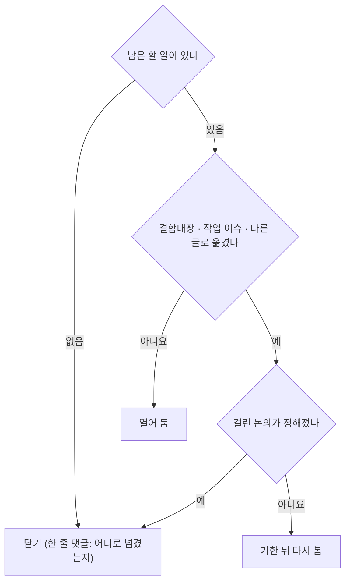

# GitHub 글 갱신 대장 — 올린 글도 최신으로

| 항목 | 내용 |
|---|---|
| **판** | **v0.7 · 2026-10-04 (KST) · S88** — S87 PR = #105(머지 `c8c07fd`) · 점검 이슈 넷 올림(#106 모의투자 · #107 인디케이터 · #108 자산배분 · #109 주인 미정 — 목록 페이지로 확인) · #50 · #57 갱신 02 는 아직(이슈 목록의 댓글 수 1) — #50 갱신 02 는 게시 전이라 본문을 고침(근거 검색 0.974 · DF-59 고친 줄 · 「게시 전 갱신」) ← **v0.6 · 2026-10-04 (KST) · S87** — S86 PR = #104(머지 `92a8288`) · 크롤 분석 A11(#57)에 갱신 02(점 번호 고침 · DF-03 닫힘 — 올릴 것) · 새 이슈 초안 넷(기능 완성도 점검 — 인디케이터 · 자산배분 · 모의투자 · 주인 미정 화면) ← **v0.5 · 2026-10-04 (KST) · S86** — 10-04 올린 글 셋(#99 댓글 01 · 이슈 #103 백테스트 결과 칸 · #6 추적 댓글 09) · S85 PR = #102 · 옛 A10(#50)에 갱신 02(채팅 RAG · 숨은 문맥 — 올릴 것) ← **v0.4 · 2026-10-03 (KST) · S83** — 새 논의 번호 **#99**(강사님 기초 코드 `9478811` 반영) · 그 💬2(첫 화면 · 메뉴)가 정해져 댓글 01 · 강사님 자료 추적 댓글 09(화면 쪽 반영 · 기준점 `9478811`) · S82 글 셋을 올림(#6 08 · #88 03 · #99) ← **v0.3 · 2026-10-03 (KST) · S82** — 6.2절에 닫는 조건 둘(#88 QFRS 확인 · 강사님 `9478811` 확인 논의) · 「매 세션 판 올리기」(사용자 10-03) ← **v0.2 · 2026-09-29 (KST) · S61** — 새 번호 23건을 채우고(논의 9 · 이슈 14) 갱신 댓글이 실제로 붙었는지 적었다 · **6절 닫기 점검 신설**(사용자 요청) · D3 끝 문단 결정 반영 · 옛 `#1` 인덱스 v2 초안 ← v0.1 · 09-28 · S58 (S59 보정) |
| **왜** | 옛 글 75건은 09-15~09-23 에 쓴 그대로 새 저장소에 다시 올라간다. 그 사이 일정 · 코드 · 결정이 바뀌어, 그대로 읽으면 팀원이 **옛 사실로 움직인다.** 1차 프로젝트는 문서가 늦어 충돌이 많았다(사용자 · S58) |
| **무엇을** | 글마다 「올린 뒤(또는 올리기 전) 바뀐 것」을 **댓글 파일** `01-2026-09-28-갱신.md` 로 그 글 폴더에 둔다. 결론이 크게 바뀐 글은 **새 판**(닫고 v2)으로. 할 일이 끝난 글은 **닫는다**(6절) |
| **누가 올리나** | 이동원이 웹에서 한 건씩(전역 규칙 10절 · [README 2절](README.md)). Claude 는 파일만 쓴다 |
| **색인** | 글 목록 · 새 번호는 [README 3절](README.md). 이 문서는 **갱신 상태와 닫기**만 본다 |

---

## 0. 한 장 요약 (09-29 S61)

| 묶음 | 건수 | 게시 | 이번 조치 |
|---|--:|---|---|
| 논의 (원 작성 09-15~09-17) | 9 | ✅ 올림 · 갱신 댓글 **9/9 🟢**(페이지로 확인) | D3 는 끝 문단(v2 제안)을 **그대로** 올렸다 → ①④⑦⑧ 은 v2 에서 다시 |
| 이슈 (원 작성 09-15) | 8 | ✅ 올림 · 갱신 댓글 5 🟡 · 0 3 | 옛 `#1` 인덱스는 **v2 본문을 썼다**(S61) — 올린 뒤 #4 닫기 |
| 이슈 (원 작성 09-17 · S61 에 올라간 것 확인) | 6 | ✅ 올림(#38 · #40 · #41 · #43 · #44 · #45) · 갱신 댓글 🟡 | #40 은 **지금 닫아도 된다**(6절) |
| 이슈 · 논의 (원 작성 09-17~09-21 · 열림) | 21 | ⏳ 안 올림 | 갱신 댓글 20 · 그대로 1 — 올릴 때 본문 + 댓글 한 쌍. **그중 6건은 다시 올리지 않는 쪽을 권장**(2.3 ⑦ · 6.3) |
| 이슈 (닫힘 · 완료 작업) | 7 | ⏳ 안 올림 | **다시 올리지 않음**(권장) — 기록 파일로 충분 |
| PR (머지됨 23 · 열림 1) | 24 | — | **올리지 않는다** — 코드는 이미 main 에 있고, 기록 파일이 남는다 |

```
옛 글 75 ─┬─ 올림 23 ─────▶ 갱신 댓글: 논의 9 🟢 · 이슈 11 🟡 · 이슈 3 ⏳ (#4 · #5 · #6)
          ├─ 안 올림 21 ──▶ 올릴 15 (본문 + 갱신 댓글 한 쌍) · 올리지 않음 권장 6 (닫기 제안 글)
          ├─ 닫힘 7 ──────▶ 다시 올리지 않음(권장)
          └─ PR 24 ───────▶ 기록만 (README 3절)
```

**확인 방법 (S61)** — 로그인하지 않은 페이지 읽기(한 건씩). 논의는 댓글이 페이지에 나와 제목(「올린 뒤 바뀐 것 N가지」)과 끝 문단을 로컬 파일과 맞췄다 🟢.
**이슈 페이지는 로그인하지 않으면 댓글을 그리지 않는다**(#7 · #38 에서 확인) — 그래서 이슈는 검색 `is:issue comments:>0` 에 걸리는지로만 보았다 🟡(댓글이 **있다**는 것까지 · 내용은 못 봄).

## 1. 올린 글 23건 — 새 번호와 갱신 댓글

> **S63 (09-29)** — 옛 `#23` A4 → **#49** · 옛 `#24` A10 → **#50** · 인덱스 v2 → **#47** 이 올라간 것을 확인했다(사용자 `Github-링크.md` 12:31 · 이슈 목록 페이지). 올린 옛 글은 **25건**. 두 글의 갱신 댓글이 붙었는지는 비로그인 페이지로 알 수 없어 🟡 · #40 은 닫힘.
>
> **S68 (09-30)** — 옛 `#25` A11 → **#57** · `#26` 번역 데이터 → **#58** · `#27` A12 → **#59**(09-29) · `#28` A13 → **#61**(09-30) 이 올라간 것을 확인했다(이슈 페이지 한 건씩 · 제목과 옛 주소). 넷 다 검색 `comments:>0` 에 걸려 갱신 댓글도 붙은 것으로 본다 🟡. D8(#54 · S65)까지 더해 올린 옛 글은 **30건**. #35 · #47 (2) · D9 갱신 댓글과 **#7 닫기**(닫기 댓글 포함)는 사용자 확인.
>
> **S70 (09-30)** — 옛 `#51` 요율 판정 → **#67** 이 올라간 것을 확인했다(사용자 `Github-링크.md` · 이슈 페이지 한 건 · 제목 「요율표 실측 검증 — 모의 정산으로 검증 못 함 …」). 올린 옛 글은 **31건**. ⑥ 점검 — 계정 관리(이메일 대소문자 · 비밀번호 규칙 · 수정 · 탈퇴 · 인증 시험 0 → 21)로 서술이 바뀐 올린 글 둘에 갱신 댓글 파일: A3 #45 [`02-2026-09-30-갱신.md`](2026-09-17/이슈-022/02-2026-09-30-갱신.md) · 사용법 #70 [`01-2026-09-30-갱신.md`](2026-09-30/이슈-로컬실행-사용법/01-2026-09-30-갱신.md)(개발 모드 · 점검 56건) — 둘 다 **계정 관리 PR 머지 뒤** 게시(본문 링크가 `main` 의 문서를 연다).
>
> **S71 (09-30)** — 계정 관리 PR = **#75**(머지 `90dde10`) · 작업 이슈 = **#76**(PR 이 닫음) · 위 갱신 댓글 둘(#45 (2) · #70 01)과 강사님 자료 추적 댓글 03(#6)을 **올렸다**(사용자 보고). ⑥ 점검 — 통합본 반입 · 용어사전(서버 쪽)으로 서술이 바뀐 올린 글 둘에 갱신 댓글 파일: 역할 희망 D9 #52 [`02-2026-09-30-갱신.md`](2026-09-29/논의-기능목록-역할희망/02-2026-09-30-갱신.md)(카드 `P01-①-1` 🔴 → 🟡 · 통합본 묶음 19 · 화면 설계 절차) · 사용법 #70 [`02-2026-09-30-갱신.md`](2026-09-30/이슈-로컬실행-사용법/02-2026-09-30-갱신.md)(`rag-lab/` 58MB · 점검 62건 · 시험 367건 · 마이그레이션 `0011`) — 둘 다 **통합본 반입 PR 머지 뒤** 게시. 옛 분석 글(A11 #57 · A13 #61 등)의 「용어가 화면 상수 51개」 는 새 작업 이슈가 대신한다 — 인덱스 #47 의 다음 갱신 댓글에 새 글(#76 · 통합본 작업 이슈)을 넣는다. ⑦ 닫기 점검 — **#14**(IA v0.1)의 닫는 조건 「IA v0.3 을 올리면」 이 채워졌다(6.1).

> **S72 (10-01)** — 통합본 반입 PR = **#77**(머지 `a9b3737` · 09-30 17:11). **역할 확정**(팀 · 2026-10-01) — ⑥ 점검: 역할을 「희망을 모으는 중」 으로 적은 올린 글 D9 #52 에 [마무리 댓글 03](2026-09-29/논의-기능목록-역할희망/03-2026-10-01-역할확정.md)(역할 표 · 따라오는 카드 제안 · 닫기) · 「2026 매도세 🟡 재대조」 를 적은 올린 글 #67(옛 `#51`)에 [갱신 댓글 02](2026-09-20/이슈-051/02-2026-10-01-갱신.md)(대통령령 제36001호 · 코드가 맞음 · 법령 DB 「현행」 표시판의 함정) — 둘 다 **S72 PR 머지 뒤**(링크가 `main` 의 계획서 v2.0 · 설계서를 연다). D4 #20 ① · D7 #13 ⑥-1 의 2026 매도세는 결정 대장 v1.0 에 0.20% 로 적는다(따로 댓글 없음 — 쓰기 줄이기). 옛 `#62` 분배안은 **다시 올리지 않는다**(역할 확정이 대신함 · 2.3 ① 닫힘). ⑦ 닫기 점검 — D9 #52 (마무리 댓글과 함께) · #14 (S71 부터 · 닫았는지 확인 전). 인덱스 #47 의 다음 갱신 댓글 (3) 에 묶을 것(급하지 않음 — 다음 새 번호와 함께): 역할 확정 · 계획서 v2.0 · 목표 기능 ① 상세 설계서 · #75 · #76 · #77 · 통합본 작업 이슈(번호 확인 전).

> **S87 (10-04)** — S86 PR = **#104**(10-04 14:46 머지 · `92a8288` · origin = gitlab). 10-04 쓰기는 다섯(#99 01 · #103 · #6 09 · PR #104 · 머지)으로 찼다. ⑥ 점검 — 기능 완성도 점검에서 크롤 조각 점 번호(`hash()`)를 고쳐 결함 DF-03 을 닫았다 → 옛 분석 A11 **#57** 에 [갱신 02](2026-09-17/이슈-025/02-2026-10-04-갱신.md)(바뀐 것 1 · 이슈는 나머지 항목이 남아 열어 둠). 새 글 넷은 이슈 초안(웹에서 · Assignee 비움): [인디케이터 점검](2026-10-04/이슈-점검-인디케이터-화면/00-본문.md) · [자산배분 · 리밸런싱 · 자동매매 점검](2026-10-04/이슈-점검-자산배분-리밸런싱-자동매매/00-본문.md) · [모의투자 · 성과 · 테스트베드 점검](2026-10-04/이슈-점검-모의투자-성과-테스트베드/00-본문.md) · [주인 미정 화면 · 배지 규칙](2026-10-04/이슈-점검-주인미정-화면-배지규칙/00-본문.md). 올리는 차례(하루 다섯 · 건 사이 10분): 10-05 = #50 갱신 02 · S87 PR · 머지 · 이슈 둘 / 10-06 = 이슈 둘 · #57 갱신 02.
>
> **S86 (10-04)** — S85 PR = **#102**(10-03 22:18 머지 · `163923a`) · 10-04 올린 글 셋: #99 [댓글 01 화면 결정](2026-10-03/논의-강사님기초코드-9478811-반영/01-2026-10-03-화면-결정.md) · 백테스트 결과 칸 요청 = **#103**(이슈 · 강민석 님) · #6 [추적 댓글 09](2026-09-28/이슈-강사님자료-변경추적/09-2026-10-03-th06-9478811-화면-반영.md)(사용자 확인). ⑥ 점검 — 근거 답 화면을 붙이며 채팅의 문서 검색 방향(DF-57)을 정하고 숨은 지난 대화(DF-60)를 찾았다. 채팅 RAG 를 다룬 옛 분석 글 A10 **#50** 에 [갱신 02](2026-09-17/이슈-024/02-2026-10-04-갱신.md)(1,944자 · 바뀐 것 4) — 이날 쓰기가 다섯(올린 글 셋 + S86 PR 생성 · 머지)이라 **10-05 이후**. 대화방 글은 S81 ~ S86 열둘이 아직 안 올라갔다.
>
> **S83 (10-03)** — S82 PR = **#98**(10-03 16:23 머지 · `33ca906`) · 새 논의 = **#99**(「강사님 기초 코드 9478811 반영」 · 설계 범주 · 댓글 0) · 올린 글: #6 강사님 자료 추적 댓글 08 · #88 갱신 03(사용자 확인). 이날 GitHub 쓰기는 9건이라(S81 넷 + #98 생성 · 머지 + #99 + 댓글 둘) **새 글 둘 — #99 댓글 [01 화면 결정](2026-10-03/논의-강사님기초코드-9478811-반영/01-2026-10-03-화면-결정.md) · #6 [추적 댓글 09](2026-09-28/이슈-강사님자료-변경추적/09-2026-10-03-th06-9478811-화면-반영.md) — 은 10-04 이후**(하루 5건 · 10분 간격). 대화방 글 넷(S81 둘 · S82 둘)은 아직 안 올림.
>
> **S77 (10-02)** — 강사님 자료 추적 댓글 05(th06 compose · S76) · 06(th03 · th06 `289bfb5` · th07)을 #6 에 올릴 차례(06 은 머지 뒤 링크가 맞는다). ⑥ 점검 — 의견 기한이 지나 [결정 대장 v1.0](../계획서/논의결정대장_v1.0.md)으로 D0 ~ D7 의 상태가 바뀌었다. 논의 여덟에 각각 달면 쓰기 8건이라 **인덱스 v2 #47 에 [댓글 03](2026-09-29/이슈-로드맵-인덱스-v2/03-2026-10-02-결정대장-v1.md) 한 건**으로 묶었다(PR 머지 뒤 — 링크가 main 을 가리킨다). S75 PR = **#84**(머지 `1732cd3`).
>
> **S75 (10-01)** — S74 OHLCV PR = **#81**(머지 `09a5e9b`). ⑥ 점검 — 「강의 사이트 · 10단원 교재는 보류」 라고 적은 올린 글은 S71 「통합본 반입 · 용어사전」 작업 이슈 하나다(번호 확인 전). 그날 강의 · 교재를 「금융 필수 지식」 강의실 · 주제 화면으로 이었고 #77 이 이미 머지돼, 그 이슈를 올렸다면 [닫기 댓글 01](2026-09-30/이슈-통합본-반입-용어사전/01-2026-10-01-닫기.md)로 닫고 고친다(쓰기 1건 · 올리지 않았다면 건너뛴다). 다른 올린 글에는 이번에 바뀐 사실이 없다 — ⑦ 닫아도 되는 글은 그 작업 이슈뿐.
>
> **S68 ⑥ 점검 — 강사님 기초 코드 반영으로 옛 서술이 바뀐 올린 글**: D7 #13 ③(「C1 이 I14 로 절반 구현」) · A9 #18 · A2 #44(「현금 장부 하나」) · A7 #41 · A5 #43 · A13 #61(투자 성향 · 리밸런싱 · 수식 지표 · 화면 파일 구조). 글마다 갱신 댓글을 달면 쓰기가 6건 늘어, **새 논의 한 건**([`2026-09-30/논의-강사님최신-반영/`](2026-09-30/논의-강사님최신-반영/00-본문.md) 4절)에 목록으로 모았다 — 그 논의를 올리면 위 글들의 해당 칸은 그 글이 대신한다. 인덱스 #47 은 다음 갱신 댓글 때 이 논의를 넣는다. → **#69 올림**(09-30 · 설계 · S69 확인 — 사용자 `Github-링크.md` · 페이지 한 건 · 댓글 0) — 이제 위 여섯 글의 해당 칸은 #69 가 대신한다. ⚠️ D8 의 **옛** 번호도 `#69` 였다(지금 #54) — 옛 기록 속 `#69` 는 D8 이다.

모든 파일은 `post_check.py` 통과 · 링크는 절대 주소 · 옛 번호는 백틱. 「갱신 댓글」 칸 · 🟢 페이지에서 본문 대조 / 🟡 검색상 댓글 1개 이상(내용 미확인) / ⏳ 댓글 0.
날짜는 페이지 표시(UTC)라 KST 로는 하루 늦을 수 있다.

| 글 | 새 번호 | 조치 | 바뀐 것 | 가장 중요한 변경 | 글자 | 갱신 댓글 |
|---|---|---|--:|---|--:|---|
| [옛 `#1` 로드맵 인덱스](2026-09-15/이슈-001/01-2026-09-28-갱신.md) | #4 | **새 판** — [v2 본문](2026-09-29/이슈-로드맵-인덱스-v2/00-본문.md)(S61) → 올린 뒤 [닫기 댓글](2026-09-15/이슈-001/02-2026-09-29-v2-로-옮김.md) | 8 | 2차 09-27 → 공식 10-01~10-21 · 본문 대부분이 옛 번호 목록이라 댓글로 못 고침 → v2 | 1,600 | ⏳ 0 — **01 은 올리지 않는다**(v2 에 합침) · ✅ **#4 닫힘**(09-29 · S64 페이지 확인) |
| [옛 `#3` A16 유산](2026-09-15/이슈-003/01-2026-09-28-갱신.md) | #5 | 댓글 | 5 | HF 결과 표 6개가 public 이었음 → 전부 private | 1,340 | ⏳ 0 |
| [옛 `#4` A17 강사님 자료](2026-09-15/이슈-004/01-2026-09-28-갱신.md) | #6 | 댓글 | 5 | 3차 세부 요구(P02 15개) · 공식 일정표 | 1,337 | ⏳ 0 — 추적 댓글 `02-2026-09-29-th03-전체-다시보기.md` 도 아직 · 추적 댓글 `03-2026-09-30-th06-기능-추가.md` 는 **올림**(S71 사용자 보고) |
| [옛 `#5` A15 격차표](2026-09-15/이슈-005/01-2026-09-28-갱신.md) | #7 | 댓글 | 7 | 수집 DB 다리(#33) · 시험 0 → 102 · 실거래 관문 | 1,640 | 🟡 |
| [옛 `#8` A14 인프라](2026-09-15/이슈-008/01-2026-09-28-갱신.md) | #8 | 댓글 | 5 | CI 는 넣었다 걷어냄(D8) · 매일 수집 = 작업 스케줄러 12:30 | 1,305 | 🟡 |
| [옛 `#9` A1 실행 환경](2026-09-15/이슈-009/01-2026-09-28-갱신.md) | #9 | 댓글 | 5 | 「수집기 ↔ 앱 미착수」 → 일봉 다리 완료 | 1,311 | 🟡 |
| [옛 `#11` A8 브로커](2026-09-15/이슈-011/01-2026-09-28-갱신.md) | #17 | 댓글 | 6 | 신 TR · `rt_cd` 검사 · live 관문 — 결함 1·2·9·16 해결 | 1,449 | 🟡 |
| [옛 `#12` A9 주문·장부](2026-09-15/이슈-012/01-2026-09-28-갱신.md) | #18 | 댓글 | 7 | 현금 장부 하나(#25) · **다리 뒤 자동매매 체결가 = 어제 종가(E-1)** | 1,616 | 🟡 |
| [D0 옛 `#6`](2026-09-15/논의-006/01-2026-09-28-갱신.md) | #10 | 댓글 | 8 | 기한 09-30 · HF public 사건 · 역할 4칸은 축이 다름 · `docs/회의/` | 1,746 | 🟢 09-28 |
| [D1 옛 `#7`](2026-09-15/논의-007/01-2026-09-28-갱신.md) | #11 | 댓글 | 6 | **③ 동결 25 중 5개가 강사님 공식 산출물** | 1,578 | 🟢 09-28 |
| [D2 옛 `#10`](2026-09-15/논의-010/01-2026-09-28-갱신.md) | #12 | 댓글 | 6 | 실행처 선례(작업 스케줄러) · 일지 거래일 많아야 5일 🟡 | 1,492 | 🟢 09-28 |
| [D7 옛 `#13`](2026-09-15/논의-013/01-2026-09-28-갱신.md) | #13 | 댓글 | 6 | ③ C1 이 #25 로 절반 구현 · 다리 뒤 체결가 어제 종가 | 1,623 | 🟢 09-28 |
| [D4 옛 `#17`](2026-09-17/논의-017/01-2026-09-28-갱신.md) | #20 | 댓글 | 5 | 「백테스트는 야후 위」 → 수집 DB 위 · 「10y」 = 실제 6.7년 · DF-01 2곳 **고침**(S59) | 1,735 | 🟢 09-28 (고친 판) |
| [D5 옛 `#18`](2026-09-17/논의-018/01-2026-09-28-갱신.md) | #21 | 댓글 | 5 | 자산배분 칸 10-08 오후 · ETF · 채권 시세는 여전히 0건 | 1,585 | 🟢 09-28 |
| [D6 옛 `#20`](2026-09-17/논의-020/01-2026-09-28-갱신.md) | #22 | 댓글 | 3 | 3차 날짜 확정 · #26 B1 가짜 볼린저 | 1,051 | 🟢 09-28 |
| [옛 `#29` 의견 공유](2026-09-17/논의-029/01-2026-09-28-갱신.md) | #31 | 댓글 | 6 | 🔴 이동원 답글의 「D5 ④ 확정」 정정(2/4 · 미확정) | 1,277 | 🟢 09-29 |
| [D3 옛 `#30`](2026-09-17/논의-030/01-2026-09-28-갱신.md) | #32 | **새 판 예고** | 6 | **⑦ 을 뒤집는 조건이 실제로 일어남**(작업 스케줄러) · 강사님 산출물이 ①④ 전제를 바꿈 | 1,859 | 🟢 09-29 · **끝 문단 그대로** |
| [옛 `#14` A6 ML·백테스트](2026-09-17/이슈-014/01-2026-09-28-갱신.md) | #38 | 댓글 | 6 | 비용은 두 화면에 배선(LEAN 만 0원) · 교차검증 누수 코드는 그대로 | 1,700 | 🟡 |
| [옛 `#15` 강사님 원본 점검](2026-09-17/이슈-015/01-2026-09-28-갱신.md) | #40 | 댓글 · **닫기** | 5 | 점검은 `lecture_scan.py` · 새 #6 으로 넘어감 | 1,759 | 🟡 — 댓글을 확인한 뒤 닫기(6.1) |
| [옛 `#16` A7 자산배분](2026-09-17/이슈-016/01-2026-09-28-갱신.md) | #41 | 댓글 | 6 | 스크리닝 여전히 31종목 · 자체 지수 완성 · 10-08 칸 | 1,718 | 🟡 |
| [옛 `#19` A5 지표](2026-09-17/이슈-019/01-2026-09-28-갱신.md) | #43 | 댓글 | 6 | `cost_bps` 무시 고쳐짐 · 가짜 볼린저(#26 B1) | 1,651 | 🟡 |
| [옛 `#21` A2 데이터 계층](2026-09-17/이슈-021/01-2026-09-28-갱신.md) | #44 | 댓글 | 6 | 장부 하나로 · orders 비용 칸 · 일지 표는 아직 | 1,647 | 🟡 |
| [옛 `#22` A3 인증](2026-09-17/이슈-022/01-2026-09-28-갱신.md) | #45 | 댓글 | 6 | 실거래 관문 · D3 ③⑥ 초안 · 인증 시험 0건 | 1,555 | 🟡 — S61 검색에서 처음 봄 · **(2) [`02-2026-09-30`](2026-09-17/이슈-022/02-2026-09-30-갱신.md) 올림**(인증 시험 0 → 21 · 계정 관리 · S70 · S71 사용자 보고) |

**검토(Claude · S58)**: 17건을 읽고 숫자 넷을 원문과 대조했다 — 동결 25 중 5(IA v0.1 18행) · 믿을 수 있는 화면 4(IA v0.2 17행) ·
일지 거래일 많아야 5(결정 대장 269행) · HF 태그 `snapshot-2026-09-28`(원격 조회) 모두 🟢. 고친 곳 2 — 옛 `#5` 의 행 수(446만 → 447만) ·
옛 `#29` 표에 「이동원 답글」 명시(팀원 글을 지적하는 것으로 읽히지 않게).

### 1.1 사용자가 정할 것 — 둘 다 정해짐 (S61)

| 글 | 제안 | 결과 |
|---|---|---|
| D3 옛 `#30` → #32 | ①④⑦⑧ 은 **09-30 에 확정하지 않고 v2 에서 다시 묻는다** · ②③⑤-1⑥ 은 그대로 09-30 까지 | ✅ **끝 문단을 그대로 올렸다**(09-29 · 페이지 확인). 팀에는 제안으로 걸렸다 — 이의가 없으면 결정 대장 v1.0 에 「①④⑦⑧ → D3 v2」 로 적는다. D3 v2 는 10-01 주 |
| 옛 `#1` 인덱스 → #4 | v2 를 새로 올리고 옛 글을 닫는다 | ✅ **v2 본문을 썼다**(S61) — 새 번호 목록 · 공식 일정 · 논의 현황 · 분석 A1~A17 한 줄 현황 · **닫는 조건**. 순서: v2 올림 → 10분 → #4 에 [닫기 댓글](2026-09-15/이슈-001/02-2026-09-29-v2-로-옮김.md) → #4 닫기 → ✅ **#4 닫힘**(09-29 · S64 확인) |

## 2. 아직 안 올린 28건 — 다시 올릴 때 한 쌍으로

두 번째 점검(S58 · 에이전트 1개 → Claude 가 사실 넷을 원문과 대조: 공식 휴일 10-05 · 10-09 · 팀원 명시 의견 14건 · 시험 102건 구성 · 네이버 학습용 허용 — 모두 🟢).
올릴 때는 **본문(`00-기록.md`) → 10분 → 갱신 댓글** 을 같은 날 연달아 올린다. 본문이 65,536자를 넘는 글(post_check ❌)은 전처럼 나눠 올린다.

### 2.1 열린 글 21건 — 갱신 댓글 20 · 그대로 1

S61: 옛 `#14` · `#15` · `#16` · `#19` · `#21` · `#22` 6건은 올라가서 1절로 옮겼다.

| 글 | 조치 | 바뀐 것 | 가장 중요한 변경 | 글자 |
|---|---|--:|---|--:|
| [옛 `#23` A4 시장 데이터](2026-09-17/이슈-023/01-2026-09-28-갱신.md) → **#49 올림**(S63 확인 · 댓글 🟡 → 검색 `comments:>0` 에 있음 · S64) | 댓글 | 6 | 「시세 전량 Yahoo」 → 국내 일봉은 수집 DB · ETF 0건 | 1,632 |
| [옛 `#24` A10 RAG](2026-09-17/이슈-024/01-2026-09-28-갱신.md) → **#50 올림**(S63 확인 · 댓글 🟡 → 검색 `comments:>0` 에 있음 · S64) · **S86 [갱신 02](2026-09-17/이슈-024/02-2026-10-04-갱신.md)(채팅 RAG 0.026 · 근거 답 화면 · DF-57 결정 · DF-60 — 올릴 것)** | 댓글 | 5 + 4 | 공식 일정표의 RAG 대화 · 지식 검색 화면이 D1 ③ 동결과 충돌 | 1,690 |
| [옛 `#25` A11 크롤링](2026-09-17/이슈-025/01-2026-09-28-갱신.md) → **#57 올림**(09-29 · S68 확인 · 댓글 🟡 검색 `comments:>0`) · **S87 [갱신 02](2026-09-17/이슈-025/02-2026-10-04-갱신.md)(점 번호 고침 · DF-03 닫힘 · 올릴 것)** | 댓글 | 5 | 「팀 공유 금지 — 각자 키」 → HF private 공유 운영 방침(🟡 조건부) | 1,755 |
| [옛 `#26` AI허브 번역](2026-09-17/이슈-026/01-2026-09-28-갱신.md) → **#58 올림**(09-29 · S68 확인 · 댓글 🟡 검색 `comments:>0`) | 댓글 | 4 | 기한 09-27 이 지나 B 가 기본값 · 결정 대장 §5 목록에 없음 | 1,078 |
| [옛 `#27` A12 알림](2026-09-17/이슈-027/01-2026-09-28-갱신.md) → **#59 올림**(09-29 · S68 확인 · 댓글 🟡 검색 `comments:>0`) | 댓글 | 5 | D3 초안 있음 · 공식 알림 · 운영 관제 화면과 충돌 | 1,338 |
| [옛 `#28` A13 SPA](2026-09-17/이슈-028/01-2026-09-28-갱신.md) → **#61 올림**(09-30 · S68 확인 · 댓글 🟡 검색 `comments:>0`) | 댓글 | 6 | 브라우저 검증(12화면) · #26 18건 · Pine 결함 그대로 | 1,578 |
| [옛 `#31` 강사님 자료 4곳](2026-09-17/이슈-031/01-2026-09-28-갱신.md) | ~~댓글 · 닫기 제안~~ → **다시 올리지 않음 권장**(6.3) | 5 | 공식 일정 · 포털 6.7년 확정 · 키 각자 발급 → HF 공유 | 1,444 |
| [옛 `#32` 1차 인계](2026-09-18/이슈-032/01-2026-09-28-갱신.md) | 댓글 | 6 | 숙제 ① 을 막던 「비용 없음」이 풀림 · 1차는 다시 계산하지 않음(D4 ⑥) | 1,413 |
| [옛 `#33` 포털 구조](2026-09-18/이슈-033/01-2026-09-28-갱신.md) | 댓글 | 6 | Lambda 계획 대신 작업 스케줄러 · DF-01 2곳 **고침**(S59) · 원인 정정 | 1,686 |
| [옛 `#51` 요율 판정](2026-09-20/이슈-051/01-2026-09-28-갱신.md) | 댓글 — ✅ **#67 로 올림**(09-30 · S70 확인) · 갱신 댓글은 확인 전 | 6 | 🟡 **「2026 매도세 일치 ✅」가 다시 다툼**(코드 0.20 vs 법령 DB 0.15) | 1,400 |
| [옛 `#53` HF 백업](2026-09-21/이슈-053/01-2026-09-28-갱신.md) | ~~댓글 · 닫기 제안~~ → **다시 올리지 않음 권장**(6.3) | 5 | 매일 verify → 증분 업로드 · 결과 표 6개 public 이었음 | 1,694 |
| [옛 `#54` 요율 관측](2026-09-21/이슈-054/01-2026-09-28-갱신.md) | ~~댓글 · 닫기 제안~~ → **다시 올리지 않음 권장**(6.3) | 4 | 옛 `#58` 이 main 에 빠졌다가 `#65` 로 이어짐 · 실전 요율은 아직 | 1,105 |
| [옛 `#55` DF-01 오염](2026-09-21/이슈-055/01-2026-09-28-갱신.md) | ~~댓글 · 닫기 제안~~ → **다시 올리지 않음 권장**(6.3) | 5 | 원인 정정 · 086460 추가 · **S59 에 고침**(#39) · 결함대장 DF-01 닫힘 | 1,482 |
| [옛 `#56` 코스닥 오차](2026-09-21/이슈-056/00-기록.md) | 그대로 | — | 결함대장 DF-02 로 열려 있고 틀린 서술 없음 | — |
| [옛 `#59` 수집 데모](2026-09-21/이슈-059/01-2026-09-28-갱신.md) | 댓글 | 5 | 착수 전 · 「데이터 관제 화면」 칸 후보 🟡 | 1,565 |
| [옛 `#60` ETF 면제](2026-09-21/이슈-060/01-2026-09-28-갱신.md) | ~~댓글 · 닫기 제안~~ → **다시 올리지 않음 권장**(6.3) — 남은 두 줄은 옛 `#51` 과 결함대장으로 | 5 | 배선은 main 에(`a32b085`) · 백테스트 경로 · 소급 정정이 남음 | 1,035 |
| [옛 `#62` 분배안 v1.0](2026-09-21/이슈-062/01-2026-09-28-갱신.md) | **새 판 예고** + 댓글 | 6 | W0~W4 달력 · 6.5 시간표는 못 씀 → v1.1 · 「14세션 0건」 계측 오류 정정 | 2,216 |
| [옛 `#63` AWS 비용](2026-09-21/이슈-063/01-2026-09-28-갱신.md) | 댓글 | 5 | Actions cron 안 쓰기로 · 요금 분석 자체는 유효 | 1,606 |
| [옛 `#64` org 판단](2026-09-21/이슈-064/01-2026-09-28-갱신.md) | ~~댓글 · 닫기 제안~~ → **다시 올리지 않음 권장**(6.3) | 4 | ① 「org 지금은 아님」이 뒤집힘(09-23 이전) | 1,450 |
| [옛 `#71` RTM](2026-09-21/이슈-071/01-2026-09-28-갱신.md) | 댓글 | 5 | 시험 138건인데 RTM 은 다시 안 잼 · 6-2 · 6-3 미결정 | 1,460 |
| [D8 옛 `#69` CI](2026-09-21/논의-069/01-2026-09-28-갱신.md) → **#54 올림**(09-29 · 본문 + 갱신 댓글 · 사용자 보고 · S65 채움) | 댓글 | 5 | 기한 09-30 · 시험 138건(S62) · CI · 룰셋은 여전히 없음 | 1,316 |

### 2.2 닫힌 이슈 7건 — 다시 올리지 않는다 (권장)

끝난 작업이고 기록 파일이 남는다. 새 저장소에 닫힌 채 다시 올리면 쓰기만 7건 늘고, 옛 사실이 다시 퍼질 수 있다(옛 `#49`).

| 글 | 다시 올릴까 | 이유 |
|---|:-:|---|
| [옛 `#38` TR 계열](2026-09-19/이슈-038/00-기록.md) | 아니요 | 끝난 작업 · 내용은 `collector/README.md` §14 |
| [옛 `#40` 거래비용](2026-09-19/이슈-040/00-기록.md) | 아니요 | 옛 `#42`·`#43` 으로 끝남 · 매도세 다툼은 051 · 054 · 060 댓글에 |
| [옛 `#46` JWT](2026-09-20/이슈-046/00-기록.md) | 아니요 | 022 본문 · 댓글이 요약 |
| [옛 `#49` 계획서 v1.0](2026-09-20/이슈-049/00-기록.md) | 아니요 | v1.2 로 대체 — 다시 올리면 「2차 09-27 시작」이 다시 퍼진다 |
| [옛 `#52` 벤치마크](2026-09-21/이슈-052/00-기록.md) | 아니요 | 결과는 유효 · 016 · 032 · 055 댓글이 인용 |
| [옛 `#61` 격차 지도](2026-09-21/이슈-061/00-기록.md) | 아니요 | 상태는 낡았지만 RTM v1.0 · 062 댓글이 덮음 |
| [옛 `#67` CI 걷어냄](2026-09-21/이슈-067/00-기록.md) | 아니요 | D8 · ADR-0003 으로 대체 |

### 2.3 사용자가 정할 것

| # | 무엇 | 왜 |
|:-:|---|---|
| ~~1~~ | ~~**옛 `#62` 분배안 v1.1** 을 쓸지 — 일정 부분만(3 · 4 · 5절 파트 대응표와 규칙은 그대로)~~ → **S72 닫힘 — 2026-10-01 팀이 역할을 정했다**(계획서 v2.0 4절 · 요구 대장 담당 칸). 옛 `#62` 는 다시 올리지 않는다(대체됨) | ~~7절 W0~W4 · 6.5 시간표가 공식 25칸과 통째로 다르다. D0 ⑤ 기한(09-30) 뒤 · 10-01 첫 스크럼 전~~ |
| ~~2~~ | ~~**2026 매도세 재대조** — 누가 · 언제 (051 · 054 · 060)~~ → **S72 닫힘 🟢** — 코드 0.20% 가 맞다(대통령령 제36001호 · 2026-01-01 시행). 「0.15%」 는 법령 DB 가 「현행」 으로 표시한 판(제35947호)의 본문을 읽은 것 · [#67 갱신 댓글 02](2026-09-20/이슈-051/02-2026-10-01-갱신.md) | ~~코드 0.20% vs 법령 DB 판독 0.15%. D4 ① · D7 ⑥-1 초안의 기준이다~~ → 두 초안의 2026 매도세는 0.20% |
| 3 | 옛 `#25` · `#53` 의 「팀원은 제3자가 아니다」를 **팀 운영 방침(🟡 조건부)** 으로 알려도 되나 | D0 ⑥-1 초안이 조건부다 |
| 4 | 옛 `#26`(AI허브) · 옛 `#63`(AWS 비용)을 결정 대장 §5 「여쭐 것」에 넣을지 | 목록에 빠져 있다 |
| 5 | D1 ③ 동결을 다시 물을지 | 공식 산출물과 충돌 — 024 · 027 · 028 · 059 가 #14 Q2 · Q3 로 이어져 있다 |
| 6 | 옛 `#71` RTM 6-2(사각지대 8개를 요구로 인정) | 미결정 |
| 7 | ~~올린 뒤 **닫기** 제안 7건을 받을지~~ → **S61 제안 바꿈**: 015 는 #40 으로 올라갔으니 **지금 닫는다**(6.1). 안 올린 6건(031 · 053 · 054 · 055 · 060 · 064)은 **다시 올리지 않는다**(6.3) — 올려서 바로 닫으면 쓰기가 12~18건 느는데, 읽을 사람에게 남는 것은 기록 파일과 같다 | GitHub 쓰기를 줄이는 쪽(09-23 flagged 선례) · 2.2 와 같은 논리 |

## 3. 올리는 순서와 간격

⚠️ 09-23 에 옛 글 약 20건을 26분에 다시 올린 직후 계정이 flagged 됐다(원인 추정). **댓글도 쓰기 한 건**이다.
권장: 하루 5건 이내 · 건 사이 **10분 이상** · 한 건 올리고 화면에서 확인한 뒤 다음.

⚠️ **S61 관찰(09-29)** — 09-28~29 에 쓰기가 약 25건 붙었다 🟡: 논의 댓글 9 · 이슈 본문 6(#38 · #40 · #41 · #43 · #44 · #45) · 이슈 댓글 최대 10(검색상) · PR #42.
페이지 날짜가 UTC 라 KST 하루에 몇 건이 몰렸는지는 정확히 모른다. **남은 글은 하루 5건 원칙으로 되돌린다.**

| 순서 | 무엇 | 쓰기 | 언제 | 상태 (S61) |
|:-:|---|--:|---|---|
| 0 | 이 PR 머지 — 댓글 여러 건이 이 PR 로 들어오는 폴더(HF 이슈 · 「다리 뒤 기준일」)를 `main` 링크로 가리킨다 | — | 먼저 | ✅ #36 · #39 · #42 |
| 1 | **기한이 걸린 논의 댓글** — D0 → D1 → D4 → D7 → D5 | 5 | 09-29(화) | ✅ 5/5 (페이지) |
| 2 | D2 → D6 → D3(1.1 결정 뒤) → 옛 `#29` · **D8 옛 `#69` 본문 + 댓글**(아직 안 올림) | 6 | 09-30(수) 오전 — 23:59 기한 전 | ✅ 4/4 · ~~**D8 ⏳ 남음 (본문 + 댓글 2건)**~~ ✅ **D8 = #54**(09-29 · General · 본문 + 갱신 댓글 · 사용자 보고 · S65 채움) |
| 3 | 옛 `#62` 분배안(본문 + 댓글 — **v1.1 을 쓸지 먼저** 2.3 ①) · ~~옛 `#55` DF-01(본문 + 댓글 · 올린 뒤 닫기)~~ → 다시 올리지 않음(6.3) | 2 | 10-01 첫 스크럼 전후 | ⏳ · **S72 — 옛 `#62` 는 올리지 않는다(역할 확정이 대신함)** |
| 4 | 올린 이슈 댓글 7건(옛 `#3`~`#12`) | 7 | 10-01 이후 하루 몇 건 | 🟡 5건 붙은 것으로 보임 · **남은 것 #5 · #6**(#4 는 v2 로) |
| 5 | 안 올린 글 묶음 — 원자료 공유(~~`#25`~~ · ~~`#53`~~) → ~~`#64`~~ → D3 묶음(~~`#27`~~ · ~~`#22`~~ · ~~`#24`~~) → 엔진 · 지표(~~`#14`~~ · ~~`#19`~~ · ~~`#28`~~) → 데이터(~~`#23`~~ · `#33` · `#32`) → 비용(`#51` · ~~`#54` · `#60`~~) → ~~`#16` · `#21`~~ · `#71` → `#59` · `#63` · ~~`#26`~~ → ~~`#15` · `#31`~~ · `#56` | 각 2 | 하루 2쌍 안팎 | 취소선 = 올렸거나(S61 · S63 · S68) 올리지 않기로 권장 — **남은 것 8**: `#33` · `#32` · `#51` · `#71` · `#59` · `#63` · `#56` + 순서 3 의 `#62` |
| 6 | ~~옛 `#1` 인덱스 v2~~ ✅ **#47** · 옛 `#62` v1.1 · D3 v2 — 새 번호를 받은 뒤 | — | 10-01 주 | 인덱스 v2 = **#47**(09-29 올림 · S63 확인) · [갱신 댓글](2026-09-29/이슈-로드맵-인덱스-v2/01-2026-09-29-갱신.md)(#49 · #50 · D9) 준비 → 🟡 검색 `comments:>0` 에 #47 있음(S64 · 09-29) — 올라간 것으로 보인다(이슈 댓글 내용은 비로그인으로 안 보임) · ⏳ [갱신 댓글 (2)](2026-09-29/이슈-로드맵-인덱스-v2/02-2026-09-29-갱신.md) — 본문 2절 D8 「아직 안 올림」 → **#54**(S65) · **S66 에 두 줄 더함**: 산출물 표 ERD · 사전 v1.1 → **v1.2**(표 속성 대장 · 코드 정의) · 테스트계획서 시험 138 · 결함 16 → **177 · 17**(DF-17) — ⚠️ **ERD · 사전 v1.2 PR 이 머지된 뒤** 올린다(링크가 `main` 의 v1.2 파일을 가리킨다) · 급하지 않음 — 다음 새 번호(D3 v2 · 분배안 v1.1)가 생길 때 **한 댓글로 묶어** 올린다 → ✅ **(2) 올림**(S66 PR 머지 뒤 · S68 사용자 확인) |
| 7 | **#35 갱신 댓글** — 다리 앞 라우트 캐시(DF-17 · ~~후보~~ S64 고침) · [`01-2026-09-29-갱신.md`](2026-09-28/이슈-DF08-다리-뒤-기준일/01-2026-09-29-갱신.md) | 1 | ~~**S63 PR 머지 뒤**~~ **S64 PR(DF-17) 머지 뒤** — 댓글이 「고쳤습니다」 를 말하므로 고친 코드가 `main` 에 있어야 한다 · 급하지 않음 | ~~⏳ **게시 전 갱신**(S64 · 고침 반영 · 표 1개) — 올리지 않은 것 확인: 검색 `comments:>0` 에 #35 없음(09-29)~~ → ✅ **올림**(S68 사용자 확인) |
| 8 | **D9 역할 희망 논의**(새 글 · 사용자 요청) — [`00-본문.md`](2026-09-29/논의-기능목록-역할희망/00-본문.md) 15,658자 + Discord 안내(`docs/회의/2026-09-29-역할-희망-받기-안내.md`) · 인덱스 v2(#47 · 올림)에는 [갱신 댓글](2026-09-29/이슈-로드맵-인덱스-v2/01-2026-09-29-갱신.md)로 D9 · #49 · #50 을 알림 | 1 | **S63 PR 머지 뒤** · 2차 착수(10-01) 전후 — 7번보다 먼저 | ✅ **#52**(General · 09-29 게시 · S64 페이지 확인 · 작성자 댓글 1) — C1 카드의 「DF-17 도 여기」 는 S64 에 끝났다 → 따로 댓글 없이 **조율안 본문 수정 때 함께** 고친다 · ✅ [갱신 댓글](2026-09-29/논의-기능목록-역할희망/01-2026-09-29-갱신.md)(일정표 요구 5 · 차트 라이브러리) **올림**(S68 사용자 확인) |

## 4. 앞으로 — 세션마다

- 세션 끝 확인(산출물목록 0.2절)에 **⑥ 「이번에 바뀐 사실이 적힌 올린 글」** 을 더한다 — 찾으면 그 글 폴더에 `NN-날짜-갱신.md`.
  찾는 법: 바뀐 것의 옛 표현(예: 「야후」 · 「09-27」 · 「CI 게이트」)을 `grep -rl` 로 `docs/github-archive/` 에서 찾는다.
- **⑦ 닫기 점검 (S61~)** — 이번 세션에 결함이 닫혔거나 PR 이 머지됐거나 논의가 정해졌으면, 그 글의 닫는 조건(6절 · 인덱스 v2 3절)이 채워졌는지 보고 **닫아도 되는 글**을 보고에 적는다.
- 크게 바뀌면(댓글이 쌓이거나 결론이 뒤집히면) 새 판 — 닫고 v2 ([이슈 버전 관리 규칙](README.md) · 작은 갱신은 본문 수정 + 취소선).

## 5. 기록 폴더 밖 문서의 옛 저장소 링크 (S58)

옛 저장소 `devlee328288/Qurious` 는 09-23 부터 404 다. **지금 판 문서 5개의 28곳**을 고쳤다 — 이슈 · PR 번호는 같은 번호의 기록 파일로,
코드 링크는 [커밋 대응표](../commit-map-2026-09-23.tsv)로 새 해시를 찾아 조직 저장소로(검사 34곳 · 깨짐 0).

| 문서 | 고친 곳 |
|---|--:|
| `collector/README.md` | 5 |
| `docs/TIL/README.md` | 17 |
| `docs/요구사항/RTM_v1.0.md` | 3 |
| `docs/배포/CI-CD명세_v1.2.md` | 2 (룰셋 설정 주소 1 포함) |
| `docs/산출물목록.md` | 1 |

**그대로 둔 곳 148곳(18파일)** — 옛 판(계획서 v1.0 · v1.1 · ERD v1.0 · 사전 v1.0 · CI/CD 명세 v1.0 · v1.1)과 TIL 본문. 그날의 기록이라 내용은 두고,
링크만 깨진 채다. 필요하면 같은 변환기로 한 번에 고칠 수 있다(내용은 안 바뀐다).

## 6. 닫아도 되는 글 — 닫기 점검 (S61 신설 · 사용자 요청)

> 「작업하다 보면 해결되거나 마무리된 이슈·논의가 생긴다 — 닫아도 되는 것을 알려 달라」(사용자 · 09-29).
> 닫기도 **쓰기 한 건**이라, 닫을 때 「어디로 옮겼는지」 한 줄 댓글과 같은 날 묶어 한 번에 한다(3절 간격 규칙 그대로).

판정 기준은 인덱스 v2 0절과 같다 — **남은 결함이 결함대장 · 작업 이슈로 옮겨졌고, 걸린 논의가 정해졌으면** 닫는다.



### 6.1 지금 닫아도 되는 글 — 4건 (셋은 닫힘 · S68 / #14 는 S71 에 조건이 채워짐)

| 글 | 왜 | 닫는 법 |
|---|---|---|
| **#40** (옛 `#15` 강사님 원본 점검 알림) | 점검은 `scripts/lecture_scan.py` 가 대신하고 결과는 #6 에 남긴다. 갱신 댓글 끝 문단이 「올린 뒤 닫고 #6 에서 이어 가겠습니다」 라고 이미 말한다. 5절 질문 1(휴장일 판정)은 D7 ⑤ 로 넘어갔다 | 갱신 댓글이 붙었는지 화면에서 확인(검색상 🟡) → 닫기. 추가 댓글은 필요 없다 |
| **#4** (옛 `#1` 인덱스 v1) | 본문 대부분이 옛 번호 · 옛 일정이다 | **v2 를 올린 뒤** → 10분 → [닫기 댓글](2026-09-15/이슈-001/02-2026-09-29-v2-로-옮김.md) → 닫기 — ✅ **닫힘**(09-29 · S64 확인) |
| **#7** (옛 `#5` A15 격차표) | 닫는 조건 「RTM v1.1 이 8절 행을 옮기면」 을 RTM v1.1 이 채운다(S67) — 제안요청서 35칸은 RTM 1.2절 표 3 · 3차 잠정 행은 원문 3차 세부 기능 15 · 일정표 기능 칸 16 으로 · 행별 확인은 요구 대장 한 줄 수정으로 | **RTM v1.1 PR 머지 뒤** → [닫기 댓글](2026-09-15/이슈-005/02-2026-09-29-닫기.md) 을 붙이며 닫기(Close with comment · 쓰기 1건) — ✅ **닫힘**(RTM v1.1 = PR #60 머지 뒤 · S68 사용자 확인) |
| **#14** (화면 IA v0.1 · 새 글) | 닫는 조건 「IA v0.3 을 올리면」 이 채워졌다 — IA v0.3 이 PR #75 로 main 에 있고, 본문의 Q1~Q6 과 v0.2 의 Q7 은 IA v0.3 10절 표 12(Q1~Q9)가 이어받았다(S71 점검) | [닫기 댓글](2026-09-28/이슈-화면IA-v0.1/02-2026-09-30-닫기.md) 을 붙이며 닫기(Close with comment · 쓰기 1건) — ⏳ 사용자 판단(질문을 새 판 이슈로 잇고 싶으면 닫지 않고 새 글을 먼저) |
| **#52** (D9 역할 희망 논의) | 2026-10-01 팀이 역할을 정했다 — 희망을 모으는 글의 할 일이 끝났다 | S72 PR 머지 뒤 [마무리 댓글 03](2026-09-29/논의-기능목록-역할희망/03-2026-10-01-역할확정.md)을 「Close with comment」 로 — 댓글과 닫기를 한 번에(쓰기 한 건) |

### 6.2 조건이 채워지면 닫는 글 — 이번엔 열어 둔다

| 글 | 남은 것 | 닫는 조건 | 언제쯤 |
|---|---|---|---|
| 논의 D0~D7 (#10 · #11 · #12 · #13 · #20 · #21 · #22) | ~~의견 기한~~ → 팀 대화방 의견 | ~~결정 대장 v1.0 에 안건이 모두 확정 · 잠정으로 적힘 → 결론 댓글 → 닫기~~ → v1.0(10-02 · 규칙 적용판)은 나왔지만 **팀 대화방 의견을 보지 못했다** — 의견을 받아 v1.1 로 고친 뒤 결론 댓글 · 닫기(지금 닫으면 반대할 자리가 사라진다) | v1.1 뒤 |
| D3 #32 | ①④⑦⑧ 재질문 | D3 v2 를 올린 뒤 v1 닫기 | 10-01 주 |
| 의견 공유 #31 | D5 · D6 로 이어짐 | D5 · D6 결론 뒤 「어디에 반영됐는지」 한 줄 → 닫기(원 작성은 `rkdalstjr` — 닫기 전에 한마디 묻는 편이 좋다) | 10-01 주 |
| #8 A14 인프라 | D2 · D8 | 두 논의 결론 | D8 을 올리고 정한 뒤 |
| ~~#14 IA v0.1~~ | ~~Q7 답~~ | ~~IA v0.3 을 올리면(새 판 이슈로 잇거나 닫기)~~ → 조건이 채워져 6.1 로 옮김(S71) | — |
| 계정 관리 작업 이슈 #76 · 통합본 반입 작업 이슈(번호는 올린 뒤) | — | 작업 이슈는 그 PR 이 `Closes` 로 닫는다 — #76 은 PR #75 머지로 닫힘 | PR 머지 때 |
| #9 A1 · #17 A8 · #18 A9 · #38 A6 · #41 A7 · #43 A5 · #44 A2 · #45 A3 · #5 A16 · #49 A4 · #50 A10 (S63) | 인덱스 v2 3절 「남은 것」 | 인덱스 v2 3절 「닫는 조건」 | 2차 중 |
| #6 A17 | 강사님 자료 추적 댓글 자리 | 3차 끝 | 11-11 뒤 |
| #26 · #35 · #37 | 체크리스트 | 체크리스트가 다 채워지면 | 파트별 |
| #88 QFRS 확인 (S82 추가) | 확인 댓글 02 의 3절 체크리스트 다섯 + `portfolio` 외래키 CASCADE 마이그레이션 — 번호는 이제 `0014`(갱신 03 · `0013` 은 실주문 추적 표가 씀) | 체크리스트가 다 채워지고 `alembic check` 가 깨끗하면 | 강민석 님 몫 |
| **#99** 강사님 기초 코드 `9478811` 반영 논의 (S82 · 10-03 올림) | ~~첫 화면과 메뉴(💬2)~~ → **정해짐**(댓글 01 · 결정 대장 v1.2 표 3) · 남은 것 — KIS 사용자별 확인(본문 2절 ①) · 💬1 실주문 추적 표 둘 · 💬3 미국주식 탭 서버 키 · 💬4 게이트웨이를 켤 때 | 남은 💬 셋에 답이 오고 결정 대장에 옮기면 | 2차 중 |

### 6.3 다시 올리지 않고 기록으로 끝내는 글 — 6건 (권장 · 2.3 ⑦)

S58 은 「올린 뒤 닫기」 로 적었다. 그런데 올리자마자 닫는 글은 **본문 + 댓글 + 닫기 = 쓰기 2~3건**이 들면서 읽는 사람에게는 기록 파일 이상을 주지 않는다.
2.2(닫힌 7건)와 같은 논리로 **다시 올리지 않는 것**을 권장한다. 남은 한두 줄은 아래 「넘길 곳」 에서 이어 간다.

| 글 | 끝난 이유 | 남은 것 → 넘길 곳 |
|---|---|---|
| 옛 `#31` 강사님 자료 4곳 알림 | 점검이 `lecture_scan.py` · #6 으로 넘어감 | ETF 적재 0건 → 옛 `#23` A4 댓글(이미 적혀 있음) |
| 옛 `#53` HF 백업 | 목표(파케이만으로 되살리는 백업) 달성 · 매일 verify → 증분 업로드 | `upload_large_folder` 조용한 재시도 → 결함대장 DF-04 「일부 닫힘」 · 공개 범위 → #37 |
| 옛 `#54` 요율 관측 | 관측 장치 수리 main 반영(옛 `#65`) | 실계좌 요율 1회 측정 → 옛 `#51` 을 올릴 때 갱신 댓글에 |
| 옛 `#55` DF-01 오염 | **S59 에 고침**(#39) · 결함대장 DF-01 닫힘 | 없음 — 결과는 #39 PR 본문과 테스트계획서 v1.2 |
| 옛 `#60` ETF 면제 | 배선 main 반영(`a32b085`) | 백테스트 경로 미배선 · 소급 정정 판단 → 옛 `#51` 갱신 댓글 + ✅ 테스트계획서 v1.3 결함대장 **DF-19**(S67 · 코드로 다시 확인 — 지표 백테스트 API 가 ETF 여부를 넘기지 않는다) |
| 옛 `#64` org 판단 | 질문 ①③ 이 09-23 사건으로 답 남 | 「머지를 막는 장치 0개」 → D8 |

**정할 것**: 이 권장을 받으면 3절 순서 5에서 6건이 빠지고(쓰기 12~18건 절약), 옛 `#60` 의 두 줄을 옛 `#51` 갱신 댓글로 옮기는 일이 생긴다(다음 세션 · 파일만).
