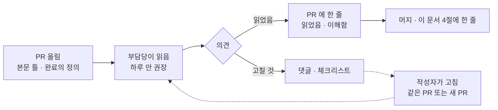

# 코드 리뷰 기록 v0.1 — Qurious

| 문서 정보 | |
|---|---|
| **판 · 상태** | v0.1 · 초안(검토 전) · 기록 칸은 비어 있다(4절 · 채울 사람과 때를 적었다) |
| **구분** | 8. 개발·형상 관리 — 코드 리뷰 기록 |
| **작성** | 초안 이동원(팀장) · 기록 채우기는 각 PR 기능의 부담당 · 판 올리기와 검수 이동원 |
| **검토** | 검토 전 |
| **최종 수정** | 2026-10-03 (KST) |
| **기준** | 머지된 PR #1 ~ #100(조직 저장소) · [계획서 v2.0](../계획서/프로젝트계획서_v2.0.md) 4절 역할 · [코딩 표준 v0.1](코딩표준_v0.1.md) 12절 ③ |
| **관련 문서** | [코딩 표준 v0.1](코딩표준_v0.1.md) · [산출물목록](../산출물목록.md) 14절(강사님 유의사항 ①) · [릴리스 노트 v0.1](../배포/릴리스노트_v0.1.md) |
| **최근 개정** | 새 문서 |

> **이 문서로 알 수 있는 것**
> 1. 누가 누구의 PR 을 어떻게 리뷰하나?
> 2. 리뷰 한 건은 무엇을 보고 무엇을 남기나?
> 3. 지금까지 리뷰가 어떻게 남았고, 앞으로 누가 언제 채우나?

## 요약

리뷰는 **그 기능의 부담당이 먼저** 읽고, 머지를 막지 않는 「읽었음 한 줄」 을 PR 에 남기는 방식을 제안한다(코딩 표준 12절 ③ · 팀 결정 전). 지금까지 머지된 PR 에는 팀원끼리 남긴 리뷰 승인 · 변경 요청이 확인되지 않아 4절의 기록 칸은 비어 있다. 강사님 유의사항 ①(주담당 · 부담당 2인)의 증빙이 이 기록이므로, 10-06(화) 오후 「개발 표준 · DoD」 칸에서 방식을 정한 뒤 PR 마다 채운다.

---

## 1. 누가 누구를 리뷰하나

리뷰어는 새로 지명하지 않고 2026-10-01 에 정한 부담당을 그대로 쓴다.

**<표 1> 리뷰 짝** · 2차 역할(계획서 4.2절)

| PR 의 기능 | 작성(주담당) | 먼저 리뷰(부담당) |
|---|---|---|
| ① 데이터 · 지식(용어 · 수집 · 근거 RAG · 일정 · 배치) | 이동원 | 오준영 · 신장환 · 강민석 중 한 명 |
| ①-5 XAI · ② 패턴 예측 | 신장환 | 오준영(①-5) · 강민석(②) |
| ③ 자산배분 · 리밸런싱 | 오준영 | 이동원 |
| ④ 성과 · 모의투자 | 강민석 | 신장환 |
| 공통(강사님 기초 코드 반영 · 문서) | 이동원 | 누구든 한 명 |

---

## 2. 리뷰 한 건의 흐름

리뷰 한 건은 <그림 1> 과 같이 흐른다. 리뷰는 머지를 막지 않고, 질문의 답은 PR 댓글이 아니라 코드 · 문서에 넣는다.

**<그림 1> 리뷰 흐름** · 범례: 실선 = 차례 · 점선 = 고칠 것이 나왔을 때

---

## 3. 무엇을 보나 — 리뷰 체크리스트

**<표 2> 리뷰 체크리스트** · 코딩 표준의 필수 규칙과 완료의 정의에서 뽑았다

| # | 볼 것 | 근거 |
|:-:|---|---|
| ① | 실거래 · 비밀값 — 증권사 호출이 실거래 차단 지점을 지나나 · 키 · 비밀번호가 코드나 로그에 없나 | 코딩 표준 3절 · ADR-0001 · ADR-0004 |
| ② | 공유 파일(`app.html` · `core.js` · `main.js` · `app.css`)에 자동 서식으로 바뀐 줄이 없나 | 코딩 표준 4절 |
| ③ | 마이그레이션 끝이 하나인가(`alembic heads`) | 코딩 표준 5절 |
| ④ | 새 기능 · 고친 결함에 시험이 있나 · 전체 시험이 통과했나 | 코딩 표준 6 · 10절 |
| ⑤ | 화면은 진입 훅 모양 · API 상한 · 화면 글자(내부 용어 없음)를 지켰나 | 코딩 표준 4절 |
| ⑥ | 문서 변경 노트 · 판 올리기 · TIL 이 있나 | 완료의 정의 ⑤ ⑥ |
| ⑦ | 이름 · 주석이 「왜」 를 말하나(세션 번호 없음) | 코딩 표준 2절 |

---

## 4. 기록

**<표 3> 리뷰 기록** · 칸이 비어 있는 동안은 「정해지면 채울 칸」 이다

| PR | 날짜 | 작성 | 리뷰 | 본 범위 | 의견 수 | 결론 | 반영 |
|---|---|---|---|---|---|---|---|
| (정해지면 채울 칸) | | | | | | 읽었음 · 고칠 것 | 커밋 |

**<표 4> 채울 사람과 때**

| 칸 | 누가 | 언제 |
|---|---|---|
| 리뷰 방식 확정(읽었음 한 줄 · 승인 필수 중 하나) | 네 명 | 10-06(화) 오후 「개발 표준 · DoD」 칸 |
| <표 3> 한 줄 | 그 PR 기능의 부담당 | PR 마다(머지 전 · 늦어도 다음 날) |
| 주간 집계(리뷰 수 · 평균 걸린 시간) | 이동원 | 주간보고 때 |

---

## 5. 지금까지 — 확인한 것

| 항목 | 값 | 확실도 |
|---|---|---|
| 조직 저장소에서 머지된 PR | #1 ~ #100 중 머지 47건(2026-10-03 PR 목록) | 확인 |
| 팀원끼리 남긴 리뷰 승인 · 변경 요청 | 확인되지 않음(2026-10-03 산출물목록 13.1절 집계) — PR 마다 다시 확인한다 | 추정 |
| 대신 남은 확인 흔적 | PR 본문의 시험 결과 · 문서 판 · 머지 전 기능 점검 | 확인 |

---

## 부록 A. 용어

| 말 | 뜻 |
|---|---|
| 코드 리뷰 | 다른 사람이 바뀐 코드를 읽고 의견을 남기는 것 |
| 리뷰 승인(Approve) · 변경 요청 | GitHub PR 화면의 리뷰 결과 두 가지 |
| 읽었음 한 줄 | 머지를 막지 않고 「읽었고 이해했다」 만 남기는 가벼운 리뷰 |

## 부록 B. 개정 이력

| 판 | 날짜 | 무엇이 바뀌었나 | 왜 | 근거 |
|---|---|---|---|---|
| v0.1 | 2026-10-03 | 추가 — 새 문서(리뷰 짝 · 흐름 · 체크리스트 · 빈 기록 칸 · 채울 사람과 때) | 강사님 산출물 표 8구분 「코드 리뷰 기록」 이 비어 있었다 · 리뷰가 0건이라 칸을 비워 둔다(팀장 결정) | 역할 표 · 코딩 표준 |
