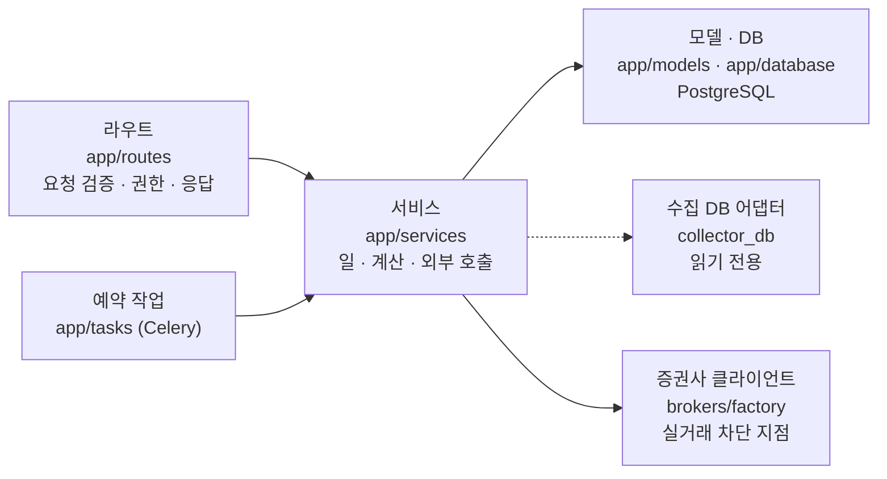
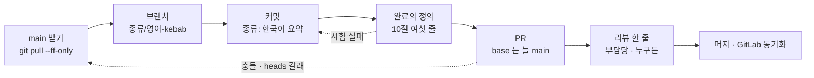
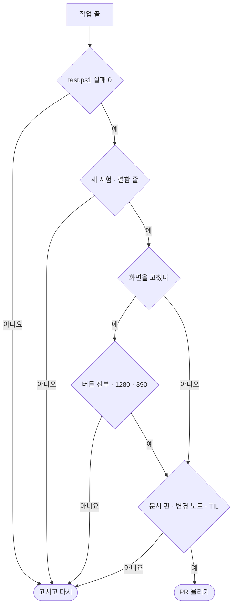

# 코딩 표준 v0.1 — Qurious (개발 표준 · 완료의 정의 포함)

| 문서 정보 | |
|---|---|
| **판 · 상태** | v0.1 · 초안(제안 · 팀 검토 전) — 강사님 일정 「개발 기반」 칸(10-06(화) 오후 · 개발 표준 · DoD)에서 정한다 |
| **구분** | 8. 개발·형상 관리 — 코딩 표준(개발 표준 · 완료의 정의 DoD) |
| **작성** | 초안 이동원(팀장) · 팀 결정 뒤 판 올리기는 네 명 · 검수 이동원 |
| **검토** | 검토 전 — 네 명 모두(팀 공용 규칙이라 논의 먼저) |
| **최종 수정** | 2026-10-03 (KST) |
| **기준** | 코드 `main` `7afe5e9` · 실측 2026-10-03(파이썬 239파일 · 화면 자바스크립트 42파일 · 부록 B) |
| **관련 문서** | [문서 작성 기준 v0.2](../문서작성기준_v0.2.md)(글) · [테스트 계획서 v1.5](../시험/테스트계획서_v1.5.md) · [ADR-0001 실거래 차단](../ADR/ADR-0001-실거래-주문-경로-차단.md) · [ADR-0004 KIS 자격증명](../ADR/ADR-0004-KIS-자격증명은-사용자마다.md) · [코드 리뷰 기록 v0.1](코드리뷰기록_v0.1.md) · [로컬 실행 안내서 v0.1](../배포/로컬실행안내서_v0.1.md) |
| **최근 개정** | 새 문서 |

> **이 문서로 알 수 있는 것**
> 1. 이 저장소의 코드(파이썬 · 화면 · 마이그레이션 · 스크립트)는 어떤 모양으로 쓰나?
> 2. 브랜치 · 커밋 · PR 은 어떻게 내나?
> 3. 「다 했다」 는 무엇을 갖췄을 때인가 — 완료의 정의(DoD)?
> 4. 지금 코드는 이 표준과 얼마나 맞나?
>
> **읽는 순서** — 팀원: 요약 → 1절 등급 → 10절 DoD → 자기 언어 절 · 강사님: 요약 → 10절 → 11절 실측 · 처음 온 사람: 요약 → 부록 A 용어

## 요약

1. 이 표준은 새 규칙을 만들기보다 **지금 코드가 이미 따르는 관례를 재서 글로 옮긴 것**이다 — 파이썬은 4칸 들여쓰기 · 한글 주석(주석 줄의 84%) · 라우트 → 서비스 계층, 화면은 2칸 들여쓰기 · `const` · 화면 진입 훅 모양이다.
2. 등급은 셋이다. **필수**는 사고가 났거나 되돌리기 어려운 것(실거래 · 비밀값 · 공유 파일 자동 서식 · 화면 진입 훅 모양 · 마이그레이션 하나의 줄기 · 스택 PR 금지), **권장**은 새 코드부터 지키는 것(타입 힌트 · 독스트링 · 응답 모델 · 줄 길이), **(팀 결정)**는 팀이 정할 것이다.
3. 완료의 정의(DoD)는 여섯 줄이다 — 전체 시험 통과 · 새 기능의 시험 · 기능 점검 · 화면은 버튼을 모두 눌러 봄 · 문서(변경 노트 또는 판) · PR 본문과 TIL. 화면 PR 과 문서 PR 은 10절에서 더하고 뺀다.

---

## 1. 등급과 적용 범위


**<표 1> 등급**

| 등급 | 뜻 | 어기면 | 예 |
|---|---|---|---|
| **필수** | 사고가 났거나 되돌리기 어려운 것 | PR 에서 고친 뒤 머지 | 실거래 경로 · 비밀값 · 공유 파일 자동 서식 · 마이그레이션 갈래 |
| **권장** | 새로 쓰는 코드부터 지킨다 — 옛 코드는 손댈 때 함께 | 리뷰 의견으로 남김(머지는 막지 않음) | 타입 힌트 · 독스트링 · 응답 모델 |
| **팀 결정** | 아직 정하지 않음 — 12절 | — | 자동 서식 도구 · 커밋 머리말 강제 |

적용 범위: 저장소의 `app/` · `collector/` · `scripts/` · `tests/` · `public/` · `alembic/`. **`rag-lab/`(통합본 반입 폴더)과 강사님 원본 사본은 고치지 않는다** — 고치면 다음 반입 · 병합 때 충돌이 생긴다(반입 대장 · NOTICE).

---

## 2. 공통 — 언어 · 이름 · 주석

**<표 2> 이름 규칙** · 확실도: 확인 = 지금 코드가 대부분 이렇게 쓴다

| 대상 | 규칙 | 예 | 확실도 |
|---|---|---|:-:|
| 파이썬 함수 · 변수 · 모듈 | `snake_case` | `fetch_close_series` · `collector_db.py` | 확인 (함수 2,716 중 2,541) |
| 파이썬 클래스 | `PascalCase` | `LeanBacktestService` | 확인 |
| 상수 | `UPPER_SNAKE_CASE` | `MAX_LIMIT` · `MENU_PRIORITY` | 확인 |
| 자바스크립트 함수 · 변수 | `camelCase` | `fitGnbTabs` · `drawerItem` | 확인 |
| 화면 키 | 영어 소문자 `kebab-case` — IA 의 화면 키를 그대로 | `macro-dashboard` · `fin-lectures` | 확인 |
| API 경로 | `/api/<묶음>/<자원>` 소문자 | `/api/kb/search` · `/api/data/ohlcv` | 확인 |
| DB 표 · 칸 | `snake_case` · 표는 복수형이 많다 | `paper_accounts` · `glossary_terms` | 확인 |
| 브랜치 | `종류/영어-소문자-kebab` · 세션 번호 없음 | `feat/kb-search-eval` | 확인 (8절) |

- **주석은 한국어로 「왜」 를 쓴다(필수)** — 코드를 읽으면 보이는 「무엇」 이 아니라, 왜 이렇게 했는지 · 무엇을 피하려는지. 지금 주석 줄 2,539 중 2,133 줄(84%)이 한국어다.
- **주석에 세션 번호 · 내 작업 용어를 쓰지 않는다(필수)** — 팀원은 회차를 모른다. 날짜 · PR 번호 · 결함 번호(DF-NN) · ADR 번호를 쓴다. 지금 13줄이 남아 있다(손댈 때 고친다).
- **강사님 기초 코드에는 주석을 늘리지 않는다(필수)** — 다음 3-way 병합의 충돌이 늘어난다. 설명은 [기능별 동작 원리서](../설계/기능동작원리_v0.1.md)에 쓴다.
- 시각은 **KST(Asia/Seoul)** 로 다루고 날짜 문자열은 `YYYY-MM-DD` 다(지금 19개 파일이 Asia/Seoul 을 쓴다).
- 파일은 UTF-8 이다. **이미 있는 파일의 줄 끝(CRLF · LF)을 바꾸지 않는다** — 바꾸면 모든 줄이 바뀐 것으로 보여 리뷰와 병합이 깨진다.

---

## 3. 파이썬 — 앱 · 수집기 · 스크립트


**<그림 1> 앱의 계층** · 범례: 실선 = 부름 · 점선 = 읽기만



라우트는 얇게 두고 일은 서비스에 둔다. 수집 DB 는 어댑터 한 길로만 읽고, 증권사 호출은 실거래 차단 지점 한 곳만 지난다.

**<표 3> 파이썬 규칙**

| 규칙 | 등급 | 지금 | 까닭 |
|---|:-:|---|---|
| 들여쓰기 4칸 · 탭 금지 | 필수 | 탭 0줄 | PEP 8 · 지금 코드 전부 |
| 증권사 주문은 `brokers/factory.get_broker_client` 만 지난다 · 실거래는 환경 변수가 켜져 있어도 차단 지점을 거친다 | **필수** | ADR-0001 · 시험 TC-LT | 실거래 자동 주문은 과제의 제외 범위다 |
| KIS 자격증명은 **사용자마다** — 서버 계좌 하나를 모두가 쓰는 길을 새로 켜지 않는다 | **필수** | ADR-0004 | 남의 계좌로 주문이 나간다 |
| 비밀값은 `.env` · 설정(`app/config.py`)으로만 — 코드 · 로그 · 문서 · 시험 고정값에 값을 쓰지 않는다 | **필수** | 시험 고정값의 키 · 전화번호를 지운 선례 | 공개 저장소다 |
| 수집 DB 는 수집 DB 어댑터로만 읽는다 · 앱에서 쓰지 않는다 | 필수 | `./data` 를 읽기 전용으로 붙임 | 하루 한 번 갱신하는 원본을 앱이 망가뜨리지 않게 |
| 라우트는 검증 · 권한 · 응답만, 일은 `app/services` | 권장 | 라우트 224 | 시험하기 쉽다 · 같은 일을 두 곳에 쓰지 않는다 |
| 새 함수는 인자 · 반환 타입 힌트 | 권장 | 반환 타입 57% | 읽는 사람이 응답 모양을 안다 |
| 서비스 · 공개 함수에 한국어 독스트링 한 줄 이상 | 권장 | 45% | 동작 원리서 발췌의 재료 |
| 새 API 는 응답 모델(Pydantic)을 둔다 | 권장 | **0 / 224** | API 명세서의 응답 칸을 코드에서 뽑을 수 있다 |
| 오류는 `HTTPException(status_code, detail="한국어 문장")` | 권장 | 160곳 · 형식이 둘 섞여 있다(API 명세서 F9) | 화면이 `detail` 을 그대로 보인다 — (팀 결정) 하나로 모을지 |
| 출력은 `logging`(앱) · 수집기는 `collector/console.py` | 권장 | `logging` 24 · `print` 7 | 컨테이너 로그에서 수준별로 거른다 |
| 한 줄 120자 안 | 권장 | 넘는 줄 491 / 56,688 | 리뷰 화면에서 가로로 밀리지 않게 |

---

## 4. 화면 — HTML · Vanilla JS · CSS (`public/`)

**<표 4> 화면 규칙**

| 규칙 | 등급 | 지금 | 까닭 |
|---|:-:|---|---|
| **공유 파일에 자동 서식(Prettier 등)을 돌리지 않는다** — `app.html`(3,014줄) · `core.js` · `main.js` · `app.css` | **필수** | 2026-10-01 자동 서식 PR 둘이 이 파일들의 거의 모든 줄을 바꿔 다른 PR 과 충돌했다 | 바뀐 줄이 실제 변경만 보여야 리뷰 · 병합이 된다 |
| 화면 진입 훅은 화면 키를 글자 그대로: `if (view === "키")` · `if (view !== "키") return;` · 함수 이름은 파일마다 다르게 | **필수** | 44곳 | 화면 스캐너가 이 모양으로 API 명세서 「부르는 화면」 칸을 채운다 |
| 화면이 API 상한(`limit` 등)을 넘겨 부르지 않는다 · 상한은 시험으로 묶는다 | 필수 | 결함 DF-44(분류 카드 422) | 화면을 만든 날부터 오류였다 |
| 들여쓰기 2칸 · `const` 먼저 · `var` 금지 | 권장 | `const` 1,495 · `let` 126 · `var` 0 | 지금 코드 |
| 문자열은 큰따옴표 · 문장 끝 세미콜론 | 권장 | 큰따옴표가 다섯 배 · 세미콜론 75% | 지금 코드의 다수 |
| 새 화면은 화면별 조각 파일(`public/js/<화면>.js`)에 | 권장 | 26개 | `app.html` 충돌을 줄인다(IA 결정) |
| 색 · 간격 · 글꼴은 `app.css` 의 토큰을 쓴다 | 권장 | — | 화면마다 색이 갈리지 않게 |
| 화면 글자는 실제 서비스 말투 — 요구 ID · 차수 · 담당 · 세션 · 내부 용어를 보이지 않는다 | 필수 | 서버 응답 글자도 화면이다(DF-50 · 51 · 55) | 사용자가 보는 글이다 |
| 화면을 만들거나 고치면 **모든 버튼 · 카드를 한 번씩 누르고**, 창 · 서랍을 연 채 다른 화면으로 옮겨 본다 | 필수 | DF-44 | 시험이 못 잡는 화면 결함 |
| CSS · JS 를 고친 뒤 브라우저 확인은 캐시를 의심한다(`?v=` · 강력 새로고침) | 권장 | — | 고친 파일이 화면에 안 실린 채 「된다」 고 보고한 적이 있다 |

---

## 5. 데이터베이스 · 마이그레이션 (`alembic/`)


**<그림 2> 지금 마이그레이션 줄기(2026-10-03)** · 범례: `─` 이어짐 · `┬ ┴` 갈래와 합침 · (merge) = 내용 없는 합치기 마이그레이션

```
  0011 ─ 9d4a38 ─ 320128 ─┬─ 0012 ──────────┬─ c3d81e (merge) ─┬─ 17e868 (merge) ─ 0013 ─ (다음 0014)
                          └─ afeb0a ─┬──────┘                  │
                                     └─ 2c44bb ─ 6a66f7 ────────┘
  ▶ 한 부모(320128 · afeb0a)에 마이그레이션 둘이 달려 head 가 둘이 됐다 → 합치기 마이그레이션 두 개로 묶었다
  ▶ head 가 둘이면 앱이 켜질 때 「upgrade head」 에서 멈춘다 · git 은 이 충돌을 못 잡는다 — 머지 전에 alembic heads
```

| 규칙 | 등급 | 확인 |
|---|:-:|---|
| 머지 전 `alembic heads` 가 **하나** · 갈래면 빈 merge 마이그레이션(`down_revision = (a, b)`) | **필수** | 2026-10-02 팀원 PR 에서 갈래가 났다 |
| `alembic check` 로 모델 ↔ DB 를 맞춘다 | 필수 | 지금 어긋남 1(portfolio 외래키 CASCADE · 이슈 #88) |
| 파일 이름 = 번호 `00NN_짧은_설명.py`(다음 `0014`) | 팀 결정 | 지금 번호 13 · 해시 7 — 이슈 #88 에서 안건으로 |
| `downgrade()` 를 쓴다 · 아직 머지 안 한 마이그레이션을 고쳤으면 컨테이너에서 downgrade → upgrade | 권장 | — |
| 표 · 칸 주석(설명)을 모델에 단다 | 권장 | 데이터 사전이 주석에서 설명을 뽑는다(앱 DB 설명 21%) |

---

## 6. 시험 (`tests/`)

| 규칙 | 등급 | 지금 · 까닭 |
|---|:-:|---|
| pytest · 파일 `tests/test_*.py` · 함수 `test_*` | 필수 | `pytest.ini` |
| 시험 묶음 이름 `TC-XX` 는 [시험-요구 대장](../요구사항/시험-요구대장.tsv)에서 **비어 있는지 먼저** 확인한다 | 필수 | `TC-DS` 가 이미 있어 `TC-DST` 로 바꾼 적이 있다 |
| 전체 시험은 `.\scripts\personal\test.ps1` — DB 시험은 일회용 DB 로 돈다 | 필수 | 675 통과 · 2 건너뜀(2026-10-03) |
| 결함을 고칠 때는 **고치기 전에 실패하는 시험**(재현)과 **고친 뒤에도 바뀌면 안 되는 것을 지키는 시험**(보존 확인)을 함께 | 권장 | 결함대장의 「확인 방법」 칸 |
| 다른 PC(Windows)에서만 깨지는 시험은 코드보다 시간 · 환경 가정부터 본다 | 권장 | DF-48(연결 거부 대기 시간) |
| 품질 지표(검색 평가 등)는 바꾸기 전에 기준선을 재고, 바꾼 뒤 다시 잰다 | 권장 | 근거 검색 평가셋 v0 |

---

## 7. 스크립트 — PowerShell · bash

| 규칙 | 등급 | 까닭 |
|---|:-:|---|
| PowerShell 은 **5.1 에서 돈다**(`&&` · `?:` 없음) · 공통 함수는 `scripts/personal/_common.ps1` | 필수 | 팀원 PC 의 기본 PowerShell |
| 멈출 때는 **무엇을 해야 하는지까지** 찍는다(막다른 길 금지) | 필수 | 처음 쓰는 팀원이 혼자 풀 수 있게 |
| bash 블록은 `set -eu` · Git Bash 확인(WSL 의 bash 가 아닌지) | 필수 | WSL 에서 경로가 달라 모든 단계가 멈춘 적이 있다 |
| 파이썬 출력은 Windows 콘솔(cp949)에서 깨지지 않게 — 이모지 · 특수 기호를 피하거나 `PYTHONIOENCODING` 없이 한 번 돌려 본다 | 권장 | 사용자 셸에서 `UnicodeEncodeError` |
| 매일 12:30 ~ 13:10(일일 갱신 중)에는 `collector/` · `scripts/` 를 고치지 않는다 | 필수 | 단계마다 새 프로세스가 그때의 파일을 읽는다 |

---

## 8. 형상 — 브랜치 · 커밋 · PR


**<그림 3> 브랜치에서 main 까지** · 범례: 실선 = 차례 · 점선 = 막히면 돌아감



| 규칙 | 등급 | 지금 · 까닭 |
|---|:-:|---|
| **main 에 직접 커밋하지 않는다** — 브랜치 → PR → 머지 | 필수 | 계획서 9절 |
| 브랜치 = `feat/` · `fix/` · `docs/` · `chore/` + 영어 소문자 kebab · 세션 번호 없음 | 권장 | 최근 머지 60건: docs 18 · feat 15 · fix 8 · feature 8 · chore 5 |
| 커밋 메시지 = `종류: 한국어 요약`(feat · fix · docs · chore · refactor · test) | 팀 결정 | 최근 커밋 29건 중 23건이 이 모양 |
| **스택 PR 금지 — PR 의 base 는 늘 main** | **필수** | base 가 다른 PR 의 브랜치였던 PR 이 main 에 안 들어간 사고가 두 번 있었다 |
| PR 본문 = 무엇을 · 바뀐 것 · 시험 · 문서(판) · 팀에 + `Closes #N` | 권장 | 지금 PR 본문 틀 |
| **PR 하나 = TIL 한 장**(`docs/TIL/<작성자>/`) | 권장 | [TIL 규칙](../TIL/README.md) |
| PR 을 만든 뒤 같은 브랜치에 커밋을 쌓지 않는다(새 PR 로) | 권장 | 리뷰한 것과 머지된 것이 달라진다 |
| GitHub 쓰기(PR · 이슈 · 댓글)는 사람이 하루 몇 건씩 | 필수 | 계정 정지 이력 — 자동화 · 몰아 쓰기 금지 |

---

## 9. 보안 · 데이터

- `.env` 의 값은 **커밋 · 출력 · 문서에 쓰지 않는다**(필수). 새 설정을 더하면 `.env.example` 에 이름만 더한다.
- 데이터 원본 · 파케이는 커밋하지 않는다(필수) — 비공개 Hugging Face 데이터셋에 둔다(계획서 7절).
- 공공 API 응답을 저장 · 출력하기 전에 응답에 실려 온 키를 지운다(필수) — 법령 API 목록 응답에 키가 실려 온다.
- 강사님 자료 원본(`learning/*/lecture`)과 반입 폴더(`rag-lab/`)는 고치지 않는다(필수).

---

## 10. 완료의 정의 (DoD)

「다 했다」 는 아래를 **모두** 갖췄을 때다. 표 5 는 PR 종류마다 무엇을 확인하나에 답한다.

**<표 5> 완료의 정의** · 완료 해당 · — 해당 없음

| # | 항목 | 확인 방법 | 코드 PR | 화면 PR | 문서 PR |
|:-:|---|---|:-:|:-:|:-:|
| ① | 전체 시험 통과 | `.\scripts\personal\test.ps1` — 실패 0 | 완료 | 완료 | — |
| ② | 새 기능 · 고친 결함의 시험 | 묶음 이름을 시험-요구 대장에 · 결함은 결함대장 줄 | 완료 | 완료 | — |
| ③ | 기능 점검 | `.\scripts\personal\check.ps1` — 실패 0 | 완료 | 완료 | — |
| ④ | 화면을 손으로 | 모든 버튼 · 카드 · 창을 누름 · 폭 1280 · 390 | — | 완료 | — |
| ⑤ | 문서 | 닿은 산출물의 판을 올렸거나 변경 노트 · [산출물목록](../산출물목록.md) 줄 · API · ERD 가 바뀌면 스캐너로 다시 채움 | 완료 | 완료 | 완료 |
| ⑥ | PR 과 기록 | PR 본문 틀 · `Closes #N` · TIL 한 장 · 비밀값 · 데이터 원본 없음(`git status`) | 완료 | 완료 | 완료 |

그림 4 는 같은 기준을 PR 을 올리기 직전의 순서로 보인다.

**<그림 4> PR 을 올리기 직전** · 범례: 마름모 = 확인 · 둥근 끝 = 다음 단계



---

## 11. 지금 코드는 얼마나 맞나 — 실측

목표는 **새 코드부터**이고, 옛 코드는 손댈 때 함께 맞춘다.

**<표 6> 실측**

| 항목 | 지금 | 목표 | 확실도 |
|---|---|---|:-:|
| 파이썬 탭 들여쓰기 | 0줄 | 0 | 확인 |
| 한국어 주석 비율 | 84% (2,133 / 2,539) | 새 주석 전부 | 확인 |
| 주석 속 세션 번호 | 13줄 | 0 — 손댈 때 고친다 | 확인 |
| 함수 반환 타입 힌트 | 57% (1,541 / 2,716) | 새 함수 전부 | 확인 |
| 함수 독스트링 | 45% (1,233 / 2,716) | 서비스 · 공개 함수 전부 | 확인 |
| 라우트 응답 모델 | 0 / 224 | 새 API 부터 | 확인 |
| 120자 넘는 줄 | 491 / 56,688 | 새 줄 0 | 확인 |
| 자바스크립트 `var` | 0 | 0 | 확인 |
| 화면 진입 훅(스캐너가 읽는 모양) | 44곳 | 화면마다 | 확인 |
| 번호 이름이 아닌 마이그레이션 | 7 / 20 | 팀 결정 | 확인 |

```
  한국어 주석     ████████████████▊    84%
  반환 타입 힌트  ███████████▍         57%
  독스트링        █████████            45%
  응답 모델                             0%   ← 새 API 부터
                  (한 칸 = 5%)
```

---

## 12. 팀이 정할 것

| # | 질문 | 안 | 추천 | 까닭 |
|:-:|---|---|---|---|
| ① | 자동 서식 도구(ruff · Prettier)를 쓸까 | 안 씀 / 새 파일만 / 전부 | **새 파일만** | 공유 파일 전체 서식은 병합을 깬다(4절 필수) · 새 파일은 처음부터 맞추면 손해가 없다 |
| ② | 커밋 머리말(`feat:` 등)을 강제할까 | 강제 / 권장 | **권장** | 지금 대부분 지킨다 · 검사 장치(CI)는 논의 중이다(ADR-0003) |
| ③ | PR 머지 전에 리뷰 승인을 꼭 받을까 | 승인 필수 / 읽었음 한 줄(막지 않음) | **읽었음 한 줄** | 머지를 막으면 2차 일정이 밀린다 · 기록은 [코드 리뷰 기록](코드리뷰기록_v0.1.md)에 |
| ④ | 마이그레이션 이름 | 번호 / 해시 | **번호(다음 0014)** | 순서가 이름에 보인다 · 이슈 #88 안건 |
| ⑤ | 줄 길이 | 100 / 120 / 없음 | **120** | 지금 넘는 줄이 1% 안팎 |

---

## 부록 A. 용어

| 말 | 뜻 | 이 문서에서 |
|---|---|---|
| 완료의 정의(DoD · Definition of Done) | 「다 했다」 고 말하려면 갖춰야 할 조건 목록 | 10절 여섯 줄 |
| 계층 | 요청을 받는 함수 → 일을 하는 함수 → 저장소로 나눈 구조 | 라우트 · 서비스 · 모델 |
| 응답 모델 | API 가 돌려주는 자료의 모양을 코드로 정한 것(Pydantic) | 지금 0 |
| 마이그레이션 head | 마이그레이션 줄기의 끝 — 둘이면 어느 쪽으로 올릴지 모른다 | 5절 |
| 스택 PR | 다른 PR 의 브랜치를 base 로 둔 PR | 8절 — 금지 |
| 자동 서식 | 도구가 들여쓰기 · 따옴표 · 줄바꿈을 한꺼번에 바꾸는 것 | 공유 파일엔 금지 |

## 부록 B. 만든 방법

- 파이썬: `app/` · `collector/` · `scripts/` · `tests/` 의 `.py` 239개를 `ast` 로 읽어 함수 · 타입 힌트 · 독스트링 · 이름을 세고, 줄 단위로 들여쓰기 · 주석 · 길이를 셌다.
- 화면: `public/` 의 `.js` 42개에서 들여쓰기 · 선언 · 따옴표 · 세미콜론 · `if (view === "` 를 셌다(외부 라이브러리 폴더 제외).
- 라우트 · 오류 · 로그: `app/routes` 의 `@router.` 데코레이터 · `response_model=` · `HTTPException(` 과 `app/services` · `app/routes` 의 `logging.getLogger` · `print(` 를 셌다.
- 형상: `git log` 최근 60건의 머지 브랜치 접두사 · 커밋 머리말.
- 뒤집을 조건: 팀이 12절을 정하면 등급을 바꾼다 · 자동 서식 도구를 들이면 4절 · 11절을 다시 잰다.

## 부록 C. 변경 노트 — 다음 판(v0.2)에 넣을 것

| 날짜 | 종류 | 무엇 | 옮길 곳 | 근거 |
|---|---|---|---|---|

## 부록 D. 개정 이력

| 판 | 날짜 | 무엇이 바뀌었나 | 왜 | 근거 |
|---|---|---|---|---|
| v0.1 | 2026-10-03 | 추가 — 새 문서(이름 · 주석 · 파이썬 · 화면 · 마이그레이션 · 시험 · 스크립트 · 형상 · 보안 · 완료의 정의 · 실측 · (팀 결정) 다섯) | 강사님 산출물 표 8구분 「코딩 표준」 이 비어 있었다 · 10-06 오후 「개발 표준 · DoD」 칸 | 실측(부록 B) |
