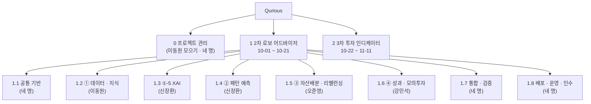
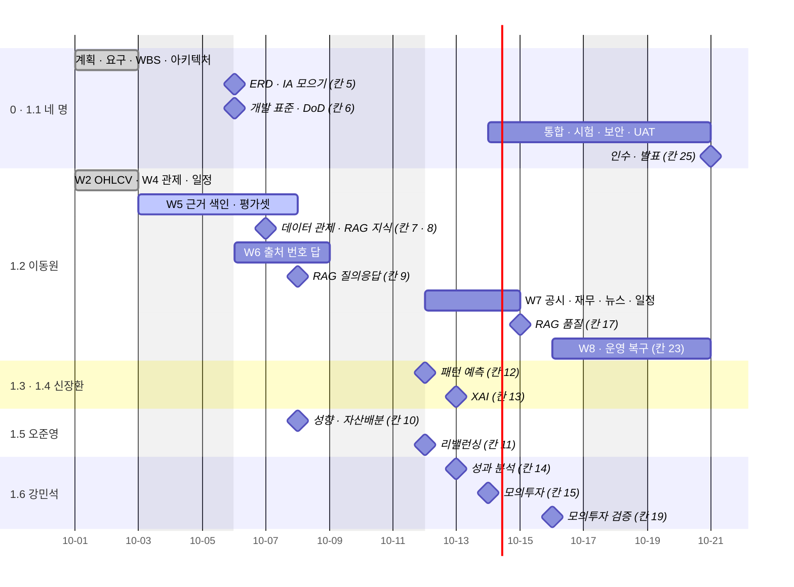

# WBS(작업 분해 구조) v0.1 — Qurious

| 문서 정보 | |
|---|---|
| **판 · 상태** | v0.1 · 초안(검토 전) — 담당은 2026-10-01 팀이 정한 역할 그대로 · 날짜는 강사님 일정 칸 |
| **구분** | 3. 일정·업무 관리 — WBS(작업 분해 구조) |
| **작성** | 초안 이동원(팀장) · 4단계 쪼개기와 판 올리기는 각 주담당 · 검수 이동원 |
| **검토** | 검토 전 — 네 명 모두 자기 줄을 확인 |
| **최종 수정** | 2026-10-03 (KST) |
| **기준** | 코드 `main` `7afe5e9` · [요구 대장](../요구사항/대장/요구-대장.tsv) 59줄 · [RTM v1.3](../요구사항/지난판/RTM_v1.3.md) 「진행」 칸 · [계획서 v2.0](프로젝트계획서.md) 5.1절 25칸 |
| **관련 문서** | [계획서 v2.0](프로젝트계획서.md) · [스프린트 계획 v0.1](스프린트계획.md) · [RTM v1.3](../요구사항/지난판/RTM_v1.3.md) · [산출물목록](../산출물목록.md) · [목표 기능 ① 설계서 v0.1](../설계/지난판/목표기능1-데이터지식-설계_v0.1.md) |
| **최근 개정** | 새 문서 |

> **이 문서로 알 수 있는 것**
> 1. 2차 · 3차에 해야 할 일 전체를 어떤 묶음으로 나누고, 누가 맡나?
> 2. 각 묶음은 무엇을 내고, 강사님 일정의 어느 칸(날짜)에 보이나?
> 3. 지금 어디까지 왔나 — 무엇을 근거로?
>
> **읽는 순서** — 팀원: 그림 1 → 3절에서 자기 줄 → 4절 일정 · 강사님: 요약 → 그림 1 → 5절 · 처음 온 사람: 요약 → 부록 A

## 요약

1. 일은 **산출물 기준**으로 나눴다 — 0 관리 · 1 2차(공통 기반 · 목표 기능 ①~④ · 통합 검증 · 배포 인수) · 2 3차. 3단계 작업 묶음 하나는 **요구 하나 또는 강사님 칸 하나**이고, 2차 범위의 요구 29개(원문 14 · UI 5 · 제안요청서 8 · 일정표 2)가 빠짐없이 어느 묶음엔가 들어 있다.
2. 담당은 2026-10-01 팀이 정한 역할 그대로다. 4단계(묶음 안의 작업)는 **그 주담당이 자기 설계서에서 쪼갠다** — 이 문서는 이동원 몫(1.2)만 4단계까지 적었다.
3. 지금 상태는 RTM 의 「진행」 칸(코드 · 시험 흔적)으로 적었다 — 2차 요구 29개 중 시험 있음 11 · 시험 일부 3 · 흔적 있음 15 · 구현 전 0. **흔적은 강사님 기초 코드에서 온 것도 포함**하므로 「누가 다 했다」 는 뜻이 아니다.

---

## 1. 나눈 원칙

**<표 1> WBS 규칙**

| 규칙 | 뜻 | 까닭 |
|---|---|---|
| 산출물 기준 | 묶음 이름은 「무엇이 나오나」(화면 · API · 문서) — 「무엇을 하나」 가 아니다 | 끝났는지 산출물로 확인한다 |
| 100% 규칙 | 2차 범위의 일은 모두 어느 묶음에 들어 있고, 범위 밖의 일은 넣지 않는다(6절에 따로) | 빠진 일 · 숨은 일을 막는다 |
| 3단계 = 요구 하나 또는 강사님 칸 하나 | 요구 ID 가 있는 일은 요구 ID 로, 공통 칸은 강사님 칸 번호(1~25)로 | RTM · 일정표와 바로 이어진다 |
| 4단계는 주담당 | 묶음 안을 어떻게 쪼갤지는 주담당이 자기 설계서에 | 남의 칸을 대신 설계하지 않는다(계획서 4.1절) |
| ID 는 바꾸지 않는다 | `1.2.3` 처럼 점 번호 · 지워도 번호를 다시 쓰지 않는다 | 문서 작성 기준 원칙 ⑤ |

---

## 2. 한눈에


**<그림 1> WBS 2단계** · 범례: 괄호 = 주담당



---

## 3. WBS 표

칸: **WBS** · **작업 묶음(산출물)** · **요구 · 칸** · **주담당 / 부담당** · **강사님 칸(날짜)** · **상태**. 상태는 완료 · 진행 · 예정으로 적고, 요구가 있는 묶음은 「RTM」 뒤에 그 요구의 RTM 진행 칸 값을 적었다.

### 3.1 0 프로젝트 관리 — 이동원 모으기 · 네 명

| WBS | 작업 묶음 | 요구 · 칸 | 주담당 | 강사님 칸 | 상태 |
|---|---|---|---|---|---|
| 0.1 | 프로젝트 계획서 · 역할 확정 | 칸 1 | 이동원 · 네 명 | 10-01 오전 | 완료 v2.0 |
| 0.2 | 요구사항정의서(요구 대장) · RTM | 칸 2 | 이동원 · 네 명 | 10-01 오후 | 완료 요구 59 · RTM v1.3 |
| 0.3 | WBS · 스프린트 계획 · 위험 | 칸 3 | 이동원 · 네 명 | 10-02 오전 | 진행 이 문서 · [스프린트 계획 v0.1](스프린트계획.md) · 위험은 계획서 8절 |
| 0.4 | 결정 대장 · 회의 · 주간보고 | — | 이동원 · 네 명 | 매주 | 진행 결정 대장 v1.2 · [주간보고 1주](../회의/주간보고/2026-10-01주_주간보고.md) |
| 0.5 | 산출물 관리(10구분 · 판 올리기) | — | 이동원 | 매 PR | 진행 [산출물목록](../산출물목록.md) |

### 3.2 1.1 공통 기반 — 네 명

| WBS | 작업 묶음 | 요구 · 칸 | 주담당 / 부담당 | 강사님 칸 | 상태 |
|---|---|---|---|---|---|
| 1.1.1 | 아키텍처 · 동작 원리 | 칸 4 | 네 명 | 10-02 오후 | 완료 아키텍처 그림 v2.0 · 동작 원리서 v0.1 · [인프라 · 네트워크 구성도 v0.1](../설계/인프라-네트워크구성도.md) |
| 1.1.2 | ERD · 데이터 사전 · IA · 와이어프레임 모으기 | 칸 5 | 이동원(모으기) · 각 주담당 | 10-06 오전 | 진행 ERD v1.4 · IA v1.0 — 각 주담당의 새 표 · 화면을 모은다 |
| 1.1.3 | 개발 표준 · 완료의 정의 · 로컬 실행 · 시험 틀 | 칸 6 | 네 명 | 10-06 오후 | 진행 [코딩 표준 v0.1](../개발/코딩표준.md)(제안) · 로컬 실행 스크립트 완료 · 시험 675 완료 |
| 1.1.4 | C1 데이터 관문 — 앱이 시세를 수집 DB 하나로 | `P01-①-2` | 이동원 | — | 완료 국내 주식 일봉 |
| 1.1.5 | C2 지표 정의 한 곳 | `P01-②-1` | 신장환 | — | 예정 (설계서에서) |
| 1.1.6 | C3 비용 모델 · C4 성과 정의 | `P01-④-1` | 강민석 | — | 예정 (설계서에서) |
| 1.1.7 | C5 모의투자 장부 · 일지 | `P01-④-3` | 강민석 | — | 진행 장부 하나(I14) · 스냅샷(QFRS) |
| 1.1.8 | C6 위험 관문 | `P01-④-3` · `P02-⑤-2` | 2차 강민석 · 3차 오준영 (팀 결정) | — | 예정 |

### 3.3 1.2 ① 데이터 · 지식 — 이동원 (부: 오준영 · 신장환 · 강민석)

이동원 몫만 4단계(설계서의 구현 묶음 W1~W8)까지 적었다.

| WBS | 작업 묶음 | 요구 · 칸 | 강사님 칸 | 상태 |
|---|---|---|---|---|
| 1.2.1 | **용어사전 · 연관 개념** | `P01-①-1` RTM 시험 일부 | 칸 8 (10-07 오후) | 진행 |
| 1.2.1.1 | 용어 755 · API · 화면 · 모든 화면의 용어 설명 | | | 완료 |
| 1.2.1.2 | 연관 개념(관계 30) · 후보 용어 공개 5 | | | 완료 |
| 1.2.1.3 | 작은 관계 지도 · 교재 밑줄 · 보류 용어 2 | | | 예정 |
| 1.2.2 | **투자 자료 수집 · 분류 · 전처리** | `P01-①-2` RTM 시험 있음 · `SCH-DQ` RTM 시험 있음 | 칸 7 (10-07 오전) | 진행 |
| 1.2.2.1 | W2 OHLCV 공통 규격 · ETF · 지수 · 주봉 · 분봉 · HF `krx-ohlcv` | | | 완료 남은: KRX 구성종목 파일 · 1분봉 |
| 1.2.2.2 | W4 데이터 상태 API · 데이터 관제 화면 | | | 완료 |
| 1.2.2.3 | 팀원 자료 받기 · 검사 · 비교 | | | 예정 받은 자료 없음 |
| 1.2.3 | **근거 문서 RAG 질의응답** | `P01-①-3` RTM 시험 있음 | 칸 8 · 9 · 17 | 진행 |
| 1.2.3.1 | W5 법령 · 감독규정 색인 · 근거 찾기 API · 평가셋 v0 | | 10-07 오후 | 진행 첫 판(낱말 + 벡터 R@5 0.868) · 남은: 동의어 · 재순위 · 평가셋 50 |
| 1.2.3.2 | W6 출처 번호가 달린 답 · 답 아래 출처 화면 | | 10-08 오전 | 예정 |
| 1.2.3.3 | W8 평가셋 50 · 모델 비교 · RAG 품질 보고서 | | 10-15 오전 | 예정 |
| 1.2.4 | **갱신일 · 문서 판 · 금융 일정 · 정기 배치** | `P01-①-4` RTM 시험 있음 | 칸 7 · 23 | 진행 |
| 1.2.4.1 | 매일 12:30 일일 갱신 · 상태 조회 · HF 백업 | | | 완료 |
| 1.2.4.2 | W4 거래일 달력 · 금융 일정 · 일정 화면 | | | 완료 |
| 1.2.4.3 | W7 공시 · 재무 · 뉴스 · 실적 · 주총 · 금통위 · FOMC 일정 | | 10-14 | 예정 |
| 1.2.4.4 | 운영 · 복구 — 복원 리허설 · 관제 기준 | | 10-20 오전 | 진행 복원 리허설 1회 완료 |
| 1.2.5 | **세부 기능 1 개선** — 개념 학습을 앱 안 화면으로 · 표 · 비율 정리 | (사용자 요청) | 10-16 | 예정 |
| 1.2.6 | **화면 요청** — 국내 주식 대시보드 · 로그인 · 랜딩 · 내 정보 | (사용자 요청 · IA N11 · N12) | 10-14 · 10-19 | 예정 |

### 3.4 1.3 ~ 1.6 다른 목표 기능 — 각 주담당이 4단계를 쪼갠다

| WBS | 작업 묶음 | 요구 (RTM 진행 칸) | 주담당 / 부담당 | 강사님 칸 |
|---|---|---|---|---|
| 1.3 | ①-5 XAI — 추천 이유를 차트 · 표 · 쉬운 말로 | `P01-①-5` 시험 있음 | 신장환 / 오준영 | 칸 13 (10-13 오전) |
| 1.4 | ② 패턴 인식 예측 — 지표 · 차트 패턴 · 다중 주기 신호 | `P01-②-1` 흔적 · `②-2` 시험 있음 · `②-3` 흔적 | 신장환 / 강민석 | 칸 12 (10-12 오후) |
| 1.5 | ③ 자산배분 · 리밸런싱 · 스크리닝 | `P01-③-1` 시험 일부 · `③-2` · `③-3` 흔적 · `RFP2-3.1.3-①` 시험 일부 · `②~④` 흔적 · `RFP2-3.1.4-①~④` 흔적 | 오준영 / 이동원 | 칸 10 (10-08 오후) · 11 (10-12 오전) |
| 1.5.u | ③ 화면 — 투자성향진단 · 시각적 포트폴리오 · 리밸런싱 | `U1` 시험 있음 · `U2` · `U5` 흔적 | 오준영 / 이동원 | 칸 10 · 11 |
| 1.6 | ④ 성과 해석 · 모의투자 | `P01-④-1` · `④-2` · `④-3` 시험 있음 | 강민석 / 신장환 | 칸 14 (10-13 오후) · 15 (10-14 오전) |
| 1.6.u | ④ 화면 — 시뮬레이션 · 목표 수익률 모의 | `U3` 흔적 · `U4` 시험 있음 | 강민석 / 신장환 | 칸 14 · 15 |

### 3.5 1.7 통합 · 검증 · 1.8 배포 · 운영 · 인수 — 네 명

| WBS | 작업 묶음 | 요구 · 칸 | 주담당 | 강사님 칸 | 상태 |
|---|---|---|---|---|---|
| 1.7.1 | 화면 · API 통합 — 주 경로 하나로 | 칸 16 | 네 명 | 10-14 오후 | 예정 |
| 1.7.2 | RAG 품질 검증 | 칸 17 | 이동원 | 10-15 오전 | 예정 (1.2.3.3) |
| 1.7.3 | 스트레스 검증 | `SCH-STR` 흔적 · 칸 18 | 오준영 · 강민석 (팀 결정) | 10-15 오후 | 예정 |
| 1.7.4 | 모의투자 검증 | 칸 19 | 강민석 | 10-16 오전 | 예정 |
| 1.7.5 | 단위 · 통합 시험 · 결함대장 | 칸 20 | 네 명 | 10-16 오후 | 진행 시험 675 · 결함 56 |
| 1.7.6 | 보안 · 성능 | 칸 21 | 네 명 | 10-19 오전 | 예정 |
| 1.7.7 | UAT · 파일럿 | 칸 24 | 네 명 | 10-20 오후 | 예정 |
| 1.8.1 | 배포(AWS 는 선택 · 로컬 배포본이 대체) | 칸 22 | 팀 결정 → 이동원 모으기 | 10-19 오후 | 예정 [배포계획서 v0.1](../배포/배포계획서.md) 빈 칸 |
| 1.8.2 | 운영 · 복구 | 칸 23 | 이동원 | 10-20 오전 | 진행 (1.2.4.4) |
| 1.8.3 | 인수 · 지식 이전 · 완료보고 · 최종 발표 | 칸 25 | 네 명 | 10-21 오전 | 예정 [완료보고서 v0.1](완료보고서.md) 틀 |

### 3.6 2 3차 — 역할만 정했다(10-22 착수)

| WBS | 작업 묶음 | 요구 | 주담당 / 부담당 |
|---|---|---|---|
| 2.1 | ① 기본 인디케이터 전략 · ② 커스텀 인디케이터 | `P02-①-1~3` · `P02-②-1~3` | 신장환 / 강민석 |
| 2.2 | ③ TradingView · Pine Script 성과 확인 · 웹훅 | `P02-③-1~3` | 이동원 / 강민석 |
| 2.3 | ④ QuantConnect LEAN 성과 검증 | `P02-④-1~3` | 강민석 / 오준영 |
| 2.4 | ⑤ 증권사 API 연동 자동화 | `P02-⑤-1~3` | 오준영 / 강민석 |
| 2.5 | 3차 화면(`U6`~`U10`) · 강건성 · 주문 정정 · 실시간 | `U6`~`U10` · `SCH-ROB` · `SCH-ORD` · `SCH-RT` | 계획서 4.4절 제안 |

---

## 4. 일정

막대는 이동원 몫의 작업 기간(제안)이고, ◆ 는 강사님 칸(보여 주는 날)이다. 다른 주담당의 막대는 각 설계서가 정한다.

**<그림 2> 2차 일정** · 범례: 막대 = 작업 · ◆ = 강사님 칸 · 주말 · 10-05 · 10-09 휴일 제외



이동원 몫은 10-07 ~ 10-08 에 강사님 칸 셋(7 · 8 · 9)이 몰려 W5 · W6 를 10-06 까지 첫 모습으로 둔다. 다른 기능은 10-08 오후부터 칸이 이어지므로, 10-06 오전 칸(ERD · IA)에 각 설계서의 표 · 화면이 모여야 통합(10-14 오후)이 제때 된다.

---

## 5. 지금 어디까지 — 근거와 함께

값은 RTM v1.3 의 「진행」 칸(코드 · 시험 흔적)이다. **흔적은 강사님 기초 코드에서 온 것도 포함한다** — 그 주담당이 만들었다는 뜻도, 인수 기준을 채웠다는 뜻도 아니다.

**<그림 3> 2차 요구의 진행 칸 — 주담당별** · 범례: █ 시험 있음 · ▓ 시험 일부 · ░ 흔적 있음 · 한 칸 = 요구 하나

```
  이동원   █████▓          시험 있음 4 · 시험 일부 1 (+ SCH-DQ 시험 있음 1)  = 6
  신장환   ██░░            시험 있음 2 · 흔적 2                              = 4
  오준영   █▓▓░░░░░░░░░░░  시험 있음 1 · 시험 일부 2 · 흔적 11               = 14
  강민석   ████░           시험 있음 4 · 흔적 1                              = 5
  오준영 · 강민석  ░        흔적 1 (SCH-STR)                                 = 1
```

| 진행 칸 값 | 뜻 (RTM 3절) | 2차 요구 수 |
|---|---|---:|
| 시험 있음 | 그 요구의 동작을 재는 시험이 있고 통과한다 | 11 |
| 시험 일부 | 전제나 일부만 재는 시험 | 3 |
| 흔적 있음 | 요구 이름이 코드에 보인다(동작은 모름) | 15 |
| 구현 전 | 흔적도 없다 | 0 |

2차 요구 29개 모두 코드 흔적은 있다(강사님 기초 코드 덕분). **남은 일의 대부분은 「흔적 → 시험 → 인수 기준」 으로 올리는 것**이고, 그 일은 각 주담당의 설계서에서 시작한다(계획서 4.1절).

---

## 6. 범위 밖 후보 — WBS 에 넣지 않은 일

| 후보 | 왜 범위 밖인가 | 언제 볼까 | 누가 |
|---|---|---|---|
| 관리자 기능(강사님 `fe-vanilla` 관리자 모드 화면을 Qurious 에 맞게) | 목표 기능 · 세부 기능에 없다 | 이동원 몫(1.2 · 2.2)이 끝난 뒤 | 이동원 |
| AWS 배포 | 비목표(로컬에서 다 만든 뒤 고른다) | 팀 결정 시 1.8.1 로 들어온다 | 팀 |

---

## 7. 이 WBS 를 고치는 조건

| 조건 | 고칠 곳 |
|---|---|
| 주담당이 설계서에서 4단계를 쪼갠다 | 그 묶음 아래 줄을 더한다(v0.2) |
| 역할 · 강사님 일정이 바뀐다 | 3절 담당 · 4절 그림 |
| RTM 판이 오른다 | 3절 RTM 칸 · 5절 그림 3 |
| 범위 밖 후보가 범위로 들어온다 | 6절 → 3절 |

---

## 부록 A. 용어

| 말 | 뜻 | 이 문서에서 |
|---|---|---|
| WBS (Work Breakdown Structure) | 프로젝트의 일 전체를 산출물 중심으로 나눈 계층 구조 | 0 · 1 · 2 아래 점 번호 |
| 작업 묶음 | WBS 의 맨 아래 단위 — 담당과 산출물이 정해진 일 | 3단계(요구 하나 · 강사님 칸 하나) · 이동원 몫은 4단계 |
| 100% 규칙 | 범위의 일은 모두 WBS 에, 범위 밖의 일은 넣지 않는다 | 6절이 범위 밖 |
| 진행 칸 | RTM 이 요구마다 적는 코드 · 시험 흔적의 단계 | 5절 |

## 부록 B. 만든 방법

- 담당: 요구 대장의 `주담당` · `부담당` 칸(2026-10-01 확정 29 · 나머지는 제안).
- 날짜: 계획서 v2.0 5.1절의 25칸(강사님 일정표 달력 규칙).
- 상태: RTM v1.3 3절 「진행」 칸을 요구 대장과 이어 셌다(2차 범위 = `P01-*` · `U1`~`U5` · `RFP2-3.1.*` · `SCH-STR` · `SCH-DQ`). 이동원 몫 4단계는 목표 기능 ① 설계서 10절 · 산출물목록 12.1절.

## 부록 C. 변경 노트 — 다음 판(v0.2)에 넣을 것

| 날짜 | 종류 | 무엇 | 옮길 곳 | 근거 |
|---|---|---|---|---|

## 부록 D. 개정 이력

| 판 | 날짜 | 무엇이 바뀌었나 | 왜 | 근거 |
|---|---|---|---|---|
| v0.1 | 2026-10-03 | 추가 — 새 문서(원칙 · 2단계 그림 · WBS 표 · 일정 · 진행 · 범위 밖 후보) | 강사님 산출물 표 3구분 「WBS」 가 계획서 일정 절로만 있었다 · 칸 3(일정 · 분담) | 요구 대장 · RTM v1.3 · 계획서 v2.0 |
