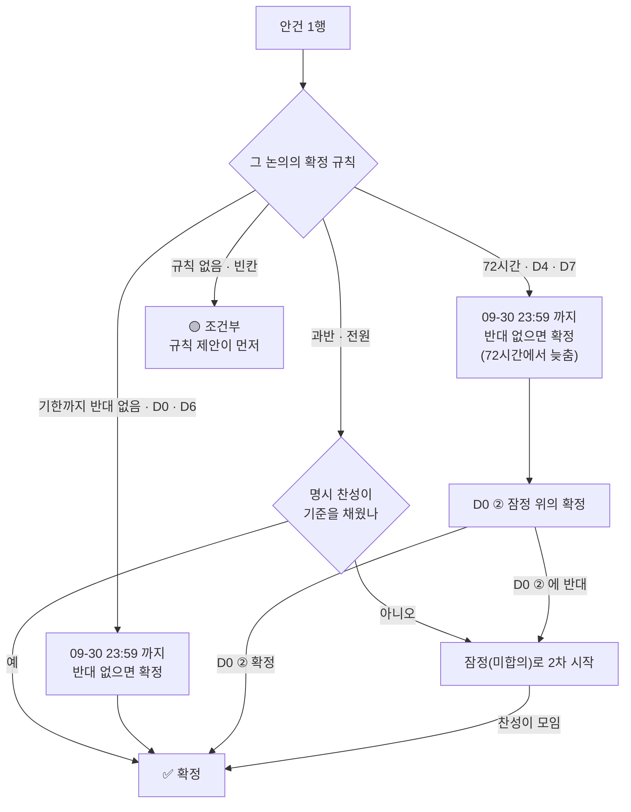
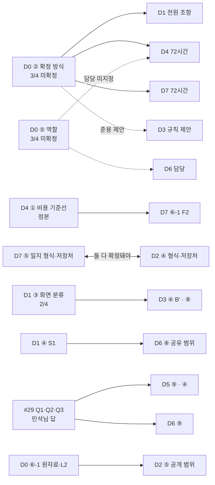

# 논의 결정 대장 — Qurious 2.0

| 항목 | 내용 |
|------|------|
| **문서 버전** | **v0.9** — 결론 **초안** 단계. ~~09-27(일) 23:59~~ **09-30(수) 23:59** KST 기한이 지나면 확정분을 반영해 **v1.0** 으로 올린다 |
| **작성** | 2026-09-23 (KST) · S43 · 이동원 |
| **보정** | 2026-09-23 (KST) · S50 — 기한 연장(09-30) 반영 · 옛 저장소 링크를 기록 문서 상대 경로로 (아래 ⚠️) |
| **목적** | GitHub Discussions 10건에 흩어진 **안건별 결론 · 확정 규칙 · 찬성 현황**을 한 장에 모은다 |
| **정본** | 각 논의 **본문의 결론 절**이다. 이 문서는 색인이고, §1·§3 의 표는 `scripts/discussion_scan.py --md` 가 본문에서 다시 읽어 만든다 (09-23 시점 본문은 [기록 문서](../github-archive/README.md)에 있다 — 아래 ⚠️ 3) |
| **산출물 구분** | 1 착수·과업 정의(범위) · 8 개발·형상 관리(기술 의사결정 기록) — `docs/산출물목록.md` |

> 이 문서만 보고 결정을 판단하지 않는다. 결론마다의 근거·반례·뒤집을 조건은 각 논의 본문에 있다.
> 표의 숫자를 손으로 고치지 않는다 — 본문을 고친 뒤 스캐너를 다시 돌려 옮긴다.

> ⚠️ **S50 보정 — 이 문서를 쓴 뒤(09-23 S43) 달라진 것 세 가지**
> 1. **의견 기한이 09-30(수) 23:59 KST 로 늦춰졌다**(S49 · Discord 로 알림). 옛 기한 09-26(토) 18:00(D4·D7)과 09-27(일) 23:59(나머지)를 모두 이 값으로 바꿨다. §2 표·§2.1 정본 문장·§7 에는 옛 값을 취소선으로 남겼다.
> 2. **2차 시작일 09-27 은 그대로다**(인덱스 #1 · 09-15 확인). 그래서 "09-27 에는 잠정(미합의)으로 2차를 시작"처럼 **2차 시작일을 가리키는 09-27 은 고치지 않았다.** 이제 기한이 시작일보다 뒤라, 기한까지 반대가 없으면 확정되는 안건(🟢)은 2차가 시작된 **뒤에** 확정된다.
> 3. **옛 저장소(`devlee328288/Qurious`)가 닫혔다.** 논의 원문은 [`docs/github-archive/`](../github-archive/README.md) 에 09-23 시점 그대로 옮겼고, 이 문서의 논의 링크도 그쪽으로 바꿨다. 스캐너는 옛 저장소 전용이라 **다시 돌릴 수 없어** §1·§3 숫자는 09-23 13:10 값에 멈춰 있다. 의견은 이제 팀 대화방(Discord)으로 받고, §7 의 v1.0 절차는 v1.0 때 새로 쓴다.

---

## 0. 쉬운 요약 (3줄)

1. 2차 개발이 시작되는 **09-27** 전에 정해야 할 논의 **8건(D0~D7)** 에 **결론 초안**을 올렸다. 안건은 모두 **64행**이다.
2. 확정 규칙이 논의마다 다르다 — "초안 뒤 72시간 반대 없음", "기한까지 반대 없음", "과반", "전원 명시 찬성". 그래서 같은 날 올려도 **26행은 반대가 없으면 확정되고, 26행은 찬성이 더 필요하고, 8행은 조건이 붙어 있다.**
3. 팀원 명시 의견은 **강민석 12건 · 신장환 2건 · 오준영 0건**(답글까지 전수). 기한까지 모이지 않는 안건은 **"잠정(미합의)"으로 2차를 시작**하자고 제안했다 — **무응답을 찬성으로 세지 않는다.**

```
안건 64행 — 09-23 13:10 KST 스캐너 집계
🟢 확정 예정  ██████████████████████████  26   반대가 없으면 확정
⏳ 대기       ██████████████████████████  26   찬성이 더 필요
🟡 조건부     ████████                     8   규칙 빈칸 · 전제
⏸️ 연기       ████                         4   다른 결정 뒤
✅ 확정                                    0   아직 없음
```

---

## 1. 한눈에 — 논의 10건의 반응 (스캐너 출력)

> 조회 2026-09-23 13:10 KST · `scripts/discussion_scan.py` · ~~기한 09-27 23:59 까지 4일 10시간~~ → 기한 **09-30(수) 23:59**(S49 연장 · 숫자는 13:10 값 그대로)

| # | 논의 | 댓글 | 답글 | 이동원 | 강민석 | 신장환 | 오준영 | 팀원 마지막 발언 |
|---:|---|---:|---:|---:|---:|---:|---:|---|
| [#6](../github-archive/discussions/006.md) | D0 | 6 | 6 | 8 | 3 | 1 | 0 | 09-21 14:33 |
| [#7](../github-archive/discussions/007.md) | D1 | 6 | 2 | 5 | 2 | 1 | 0 | 09-23 09:22 |
| [#10](../github-archive/discussions/010.md) | D2 | 4 | 2 | 4 | 2 | 0 | 0 | 09-21 14:48 |
| [#13](../github-archive/discussions/013.md) | D7 | 2 | 3 | 3 | 2 | 0 | 0 | 09-21 17:18 |
| [#17](../github-archive/discussions/017.md) | D4 | 5 | 3 | 6 | 2 | 0 | 0 | 09-21 17:21 |
| [#18](../github-archive/discussions/018.md) | D5 | 3 | 0 | 3 | 0 | 0 | 0 | — |
| [#20](../github-archive/discussions/020.md) | D6 | 2 | 0 | 2 | 0 | 0 | 0 | — |
| [#29](../github-archive/discussions/029.md) | — | 1 | 2 | 2 | 1 | 0 | 0 | 09-21 14:26 |
| [#30](../github-archive/discussions/030.md) | D3 | 3 | 0 | 3 | 0 | 0 | 0 | — |
| [#69](../github-archive/discussions/069.md) | D8 | 0 | 0 | 0 | 0 | 0 | 0 | — |

| # | 논의 | 안건 | 확정 | 확정 예정 | 대기 | 조건부 | 연기 | 이견 |
|---:|---|---:|---:|---:|---:|---:|---:|---:|
| #6 | D0 | 9 | 0 | 5 | 2 | 1 | 1 | 0 |
| #7 | D1 | 4 | 0 | 0 | 4 | 0 | 0 | 0 |
| #10 | D2 | 8 | 0 | 0 | 7 | 0 | 1 | 0 |
| #13 | D7 | 9 | 0 | 8 | 0 | 0 | 1 | 0 |
| #17 | D4 | 7 | 0 | 7 | 0 | 0 | 0 | 0 |
| #18 | D5 | 9 | 0 | 0 | 9 | 0 | 0 | 0 |
| #20 | D6 | 9 | 0 | 6 | 2 | 1 | 0 | 0 |
| #30 | D3 | 9 | 0 | 0 | 2 | 6 | 1 | 0 |

- #29 는 강민석님이 연 **의견 공유** 글이라 결론표가 없다. 다만 거기서 답하신 Q1·Q3 가 D5 ⑨·④, Q2 가 D6 ⑨ 의 교차 투표다(§4).
- #69(D8 · CI)는 *"무응답을 찬성으로 읽지 않겠습니다"* 라고 적어 둔 논의라 결론 초안을 올리지 않았다.

**용어 — 전수 조회**
- 뜻: 논의의 댓글과 **댓글에 달린 답글까지** 전부 받아 사람별로 세는 것.
- 이 문서에서: §1 첫 표. `discussion_scan.py` 가 GraphQL 1회로 한다.
- 헷갈리는 점: Discussion 은 답글이 댓글 목록에 안 들어온다. 마지막 댓글만 보면 팀원 답이 **0건으로 보인다** — S26~S41 의 "16세션 무반응"이 그 오류였다(S42 발견).

---

## 2. 확정 규칙 — 논의마다 다르다

| 논의 | 확정 규칙 (본문 원문 요약) | 기대는 곳 | 확정 시각 | 모자라면 |
|---|---|---|---|---|
| D0 #6 | ②⑤ 는 4명 전원 명시 찬성 · 나머지는 기한까지 반대가 없으면 추천안 | 자체 | ~~09-27 23:59~~ **09-30 23:59** | ②⑤ 잠정(미합의) 제안 |
| D1 #7 | 4명 전원 명시 찬성 | D0 ② 제안 | ~~09-27 23:59~~ **09-30 23:59** | 잠정(미합의) 제안 |
| D2 #10 | 0원 항목은 과반(3/4) + 반대 없음 · 비용 드는 항목은 전원 | 자체 | ~~09-27 23:59~~ **09-30 23:59** | 잠정(미합의) 제안 |
| D7 #13 | 결론 초안 뒤 72시간 반대 없으면 확정 | **D0 ② (미확정)** | ~~09-26 18:00~~ **09-30 23:59** | "D0 ② 잠정 위의 확정" |
| D4 #17 | D0 ② 제안에 따름 (72시간) | **D0 ② (미확정)** | ~~09-26 18:00~~ **09-30 23:59** | 같음 |
| D5 #18 | ②③④ 전원 의견 · ①⑤⑥⑦⑧ 과반 · 안 모이면 "미합의" 표시 | 자체 | ~~09-27 23:59~~ **09-30 23:59** | ⑨ 는 규칙 빈칸 → 과반 제안 |
| D6 #20 | ①⑤ 전원 명시 찬성 · 나머지는 기한까지 반대 없으면 | 자체 | ~~09-27 23:59~~ **09-30 23:59** | ⑨ 는 규칙 빈칸 → "나머지" 제안 |
| D3 #30 | **본문에 규칙 없음** | — | — | D0 ② 준용을 **제안** — 스스로 통과시키지 않음 |
| D8 #69 | 무응답을 찬성으로 읽지 않음 · 기한을 한 번 더 둠 | 자체 | ~~09-27~~ 09-30 | (결론 초안 없음) · 본문 §6 이 기한을 "D0~D7 과 같은 날"로 맞춰 함께 옮김 |

> 확정 시각은 S49 에 전부 **09-30(수) 23:59** 로 늦췄다. D4·D7 의 "72시간"은 규칙 원문이라 그대로 적지만, 확정 시각은 늦춘 기한을 따른다.



### 2.1 세는 법 — 8건에 똑같이 적용했다

범례 — **제안** = 제안자(이동원, 찬성으로 셈) · **✅ X (MM-DD)** = 명시 찬성 · **✅ᶜ** = 조건부 찬성(조건에 제안자가 답함 · 투표자 재확인 없음 · n/4 에 넣지 않고 "+ ✅ᶜ n" 으로 따로 적음) · **💬** = 이 논의 안건을 향한 말이지만 선택지를 고르지 않음(세지 않음) · **—** = 이 논의에서 발언 없음 · **🔴** = 반대. **n/4 는 제안과 ✅ 만 센 값입니다.**

- 다른 논의에서 **이 논의 선택지를 직접 고른** 발언만 교차 투표로 센다(예: #29 Q3 → D5 ④). 취지만 닿는 말은 칸에 넣지 않는다.
- 투표 **뒤에** 안건 문구가 바뀌었으면 상태 칸 끝에 적는다(예: D0 ⑥ "두 분 찬성은 ⑥ 재작성 전").
- 정본 문장 두 개 — 8건 모두 같은 글자로 적었다(기록 문서의 본문에는 옛 기한이 그대로 있다):
  - **잠정(미합의)**: 09-27 에는 "잠정(미합의)"으로 2차를 시작하고, 전원 찬성이 모이면 확정 · 반대가 나오면 되돌린다 · 무응답을 찬성으로 세지 않는다.
  - **D0 ② 잠정 위**: ~~09-26(토) 18:00~~ **09-30(수) 23:59** KST 까지 반대(사유 포함)가 없으면 확정하되, 기대는 규칙(D0 #6 ②)이 아직 명시 찬성 3/4 라 "D0 ② 잠정 위의 확정"으로 표시합니다. D0 ② 가 확정되면 이 꼬리표를 떼고, D0 ② 에 반대가 나오면 이 안건들은 "잠정(미합의)"으로 내립니다.

**용어 — 느슨한 합의(lazy consensus)**
- 뜻: 정한 기간 안에 반대가 없으면 통과로 보는 규칙.
- 이 문서에서: D4·D7(72시간)과 D0·D6 의 "기한까지 반대 없음".
- 헷갈리는 점: **"모두 찬성했다"가 아니다.** 그래서 상태 칸에 "명시 n/4 · 반대 0"을 따로 적는다 — D4 는 명시 1/4(제안자만)로 확정 예정이다.

---

## 3. 안건별 결론 초안 (스캐너 출력 — 본문 결론표 모음)

> 상태 칸의 확정 시각은 S50 에 늦춘 기한(**09-30 23:59**)으로 바꿨다. "09-27 잠정 제안"·"09-27 부터 잠정(미합의) 후보"의 09-27 은 2차 시작일이라 그대로 뒀다(⚠️ 2).

| 논의 | 안건 | 결론(초안) | 상태 |
|---|---|---|---|
| #6 D0 | ① 기록 위치 | A — 사실·작업=Issue · 결정 과정=Discussion · 되돌리기 어려운 결정=ADR · 과정=TIL · 개념=개념 노트 | 🟢 확정 예정 (09-30 23:59) · 명시 3/4 · 반대 0 |
| #6 D0 | ② 확정 방식 | A — 결론 초안 뒤 72시간 반대 없으면 확정, 목표·비용·역할만 전원 명시 찬성 | ⏳ 전원 찬성 대기 3/4 · 09-27 잠정 제안(7.4) |
| #6 D0 | ③ ADR | A — 되돌리기 어려운 결정만 · 되돌릴 조건 절 필수. 경로는 실제대로 `docs/ADR/ADR-NNNN-제목.md` | 🟢 확정 예정 (09-30 23:59) · 명시 3/4 · 반대 0 · 경로는 투표 뒤 현행화(7.6) |
| #6 D0 | ④ 작업 추적 | A — Assignee 1명 + Project 보드 + 템플릿 3종 PR | 🟢 확정 예정 (09-30 23:59) · 명시 3/4 · 반대 0 · Assignee 예외는 투표 뒤 추가(7.6) |
| #6 D0 | ⑤ 역할 분담 | A — 1차 역할을 잇는 표. 오준영님 칸은 본인 확인 전 Assignee 비움 | ⏳ 전원 찬성 대기 3/4 · 09-27 잠정 제안(7.4) |
| #6 D0 | ⑥ 허브 유지 | A — HF org `qurious-quant` private 허브 유지 · 올리기 직전 private 재확인 | 🟢 확정 예정 (09-30 23:59) · 명시 3/4 · 반대 0 · 두 분 찬성은 ⑥ 재작성(09-18 19:48) 전 |
| #6 D0 | ⑥-1 원자료(L0·L1) | 팀 org 안 private 공유 — 09-18 재작성의 "기본 끔"을 거두고 원래 A 로 되돌리자는 제안 · 09-20~21 업로드는 투표 뒤 생긴 일이라 이 표로 추인하지 않음(7.5) | 🟡 조건부 — 업로드 추인에 대한 명시 찬성 0 · 본문 ⑥-5 "팀·강사님 확인 후에만" · 기한까지 반대가 없어도 강사님 ③ 답 전까지 잠정 |
| #6 D0 | ⑥-1 파생 지표(L2) | 종목별 순위·z점수는 올리지 않음 · 자체 지수(`benchmark_index`)는 이미 올라가 있음 — 강사님 ④ 답 뒤 판정 | ⏸️ 연기 — 강사님 ④ 답 · 지표 담당(장환·준영님) 의견 뒤 |
| #6 D0 | ⑦ 설명·기록 기준 | A — 두 층 쓰기 · 분석 필수 절 · 개념 노트 · 주석 규칙 | 🟢 확정 예정 (09-30 23:59) · 명시 3/4 · 반대 0 |
| #7 D1 | ① 타깃 사용자 | B — 자기 투자 규칙을 가진 개인투자자 | ⏳ 전원 찬성 대기 3/4 |
| #7 D1 | ② 목적 한 문장 | P2 — 그 규칙을 믿어도 되는지 판단하게 돕는다 (문장 원문 그대로) | ⏳ 전원 찬성 대기 3/4 |
| #7 D1 | ③ 깊게의 범위 | 주 경로 12 깊게 · 최소 요건 2 · 개념 10 · 동결 25 (삭제는 D3) | ⏳ 전원 찬성 대기 2/4 |
| #7 D1 | ④ 2·3차 이야기 | S1 — 기능은 잇지 않고 같은 질문으로 각각 발표 · 검증 엔진과 모의투자 일지 공유 | ⏳ 전원 찬성 대기 2/4 + ✅ᶜ 1 |
| #10 D2 | ① 유료 클라우드 | 쓰지 않음 — 팀 추가 월 0원 (AWS·Lightsail·HF Team 없음) | ⏳ 과반 대기 2/4 · 강사님 답이 없어도 0원 유지(§6) |
| #10 D2 | ② 데모 방식 | 발표 PC 로컬 시연 + 정적 결과 페이지(GitHub Pages) + 녹화 영상 백업 · HF Space는 주 경로 뒤 선택 | ⏳ 과반 대기 2/4 |
| #10 D2 | ③ 유료 LLM API | 쓰지 않음 — L0 LLM 동결 유지 | ⏳ 과반 대기 2/4 |
| #10 D2 | ④-1 일지 형식 | D7 ⑤ 와 같은 답 — J2 매 거래일 1행 · 장 마감 뒤 하루 1회 · 추가만 하는 기록 | ⏳ 과반 대기 1/4 + ✅ᶜ 1 · D7 ⑤ 와 연동 |
| #10 D2 | ④-2 일지 저장처 | D7 ⑤·⑧ · D0 ⑥ L5 와 같은 답 — 앱 DB(화면용) + HF private 원장 `qurious-paper-log`(보관용) | ⏳ 과반 대기 2/4 · D7 ⑤ 와 연동 |
| #10 D2 | ④-3 일지 실행처 | 기본값 = 담당 1명 로컬 PC · 장 마감 뒤 하루 1회 스크립트 · 자동화는 2차 중반에 정함 | ⏸️ 연기 — 기본값만 둠 · 연기에 명시 찬성 2/4 |
| #10 D2 | ⑤ 공개 범위 | K1 — 공개 위치(Pages·저장소·Space)에는 원자료 0 · 전략 수준 성과 요약(수익률 곡선·MDD 등)만 · 종목별 순위·z점수 같은 L2 는 D0 ⑥-1 L2 결론(강사님 ④) 전까지 공개하지 않음 · 원자료는 HF private | ⏳ 과반 대기 2/4 · 민석 찬성은 2.6 근거 갱신(09-18 20:05) 전 · 강사님 ③④ 답에 걸림 |
| #10 D2 | ⑥ 강사님 확인 | 확인한다 — 따로 묻지 않고 결정 대장 목록(⑥ 신설)에 모아서 한 번에 | ⏳ 과반 대기 2/4 |
| #13 D7 | ① 실계좌 주문 | L1 — live 경로를 코드로 차단 (서버 관문 ✅ · 화면·저장 거부 남음) | 🟢 확정 예정 (09-30 23:59) · 명시 2/4 · 반대 0 · D0 ② 잠정 위 |
| #13 D7 | ② 체결처 | V1 앱 안 가상 체결이 정본 · V3(KIS 모의 병행)는 선택 확장 | 🟢 확정 예정 (09-30 23:59) · 명시 2/4 · 반대 0 · D0 ② 잠정 위 |
| #13 D7 | ③ 계좌·쓰기 막기 | C1 — `paper_accounts` 하나 + 봉인 전용 사용자 · 쓰기는 일지 실행기만 | 🟢 확정 예정 (09-30 23:59) · 명시 2/4 · 반대 0 · D0 ② 잠정 위 |
| #13 D7 | ④ 10분 자동매매 | R2 — 기록 매 거래일 1회 · 매매는 규칙 주기 · 10분 반복 동결 · 사람 해석 주 1회 | 🟢 확정 예정 (09-30 23:59) · 명시 2/4 · 반대 0 · D0 ② 잠정 위 |
| #13 D7 | ⑤ 일지 형식·저장처 | J2 매 거래일 1행(관망 포함 · 설계) · 결정일/체결 확정일 · 추가만 · 앱 DB + HF private 원장 | 🟢 확정 예정 (09-30 23:59) · 명시 1/4 + ✅ᶜ 1 · 반대 0 · D0 ② 잠정 위 · D2 ④ 도 확정돼야 확정 |
| #13 D7 | ⑥-1 비용 | F2 — 매도세는 연도별 법령 세율표 + 수수료·슬리피지 가정 · 민감도 기준선은 D4 #17 ① 결론(1차 4수준 그대로)을 따름 | 🟢 확정 예정 (09-30 23:59) · 명시 1/4 + ✅ᶜ 1 · 반대 0 · D0 ② 잠정 위 |
| #13 D7 | ⑥-2 체결가 | P3 다음 거래일 시가 (명시 찬성은 P3 까지) · 출처는 포털(2.6.2 A · 🟡 제안) → 일지 행 T+1 확정 | 🟢 확정 예정 (09-30 23:59) · 명시 2/4 · 반대 0 · D0 ② 잠정 위 |
| #13 D7 | ⑦ 봉인 판정 | E2 — 사전등록 · 주 판정은 운영 일관성·괴리 · 성과는 기술 통계 + MinTRL | 🟢 확정 예정 (09-30 23:59) · 명시 2/4 · 반대 0 · D0 ② 잠정 위 |
| #13 D7 | ⑧ 실행처·준비물 | 기본값 담당 1명 PC(로컬) · 최종은 D2 ④ 와 함께 · 담당 미정 · Actions 백업안 취소 | ⏸️ 연기 — 기본값만 둠 · 명시 2/4 · 반대 0 · Actions 취소는 투표 뒤 |
| #17 D4 | ① 비용 규격 | A 구조(매수·매도 편도 따로 · 매도세는 매도에만 · **연도별 법령 세율표**) · 주 결과 슬리피지 10bp 가정 · **민감도 기준선 = 1차 4수준 그대로** + 무비용 대조 | 🟢 확정 예정 (09-30 23:59) · 명시 1/4 · 반대 0 · D0 ② 잠정 위 |
| #17 D4 | ② label_horizon | **A — 6.** gap ≥ 6 을 기본값으로 | 🟢 확정 예정 (09-30 23:59) · 명시 1/4 · 반대 0 · D0 ② 잠정 위 |
| #17 D4 | ③ 정본 엔진 | ~~A 엔진 하나~~ → **C′** 파이썬 경로는 그대로 두고 **비용 모델·지표 정의만 한 곳**. LEAN(야후·무비용)은 정본에서 뺌 | 🟢 확정 예정 (09-30 23:59) · 명시 1/4 · 반대 0 · D0 ② 잠정 위 |
| #17 D4 | ④ 누수 차단 | **A + 종목축** — 3곳을 `gap ≥ label_horizon` 으로 교체, 어기면 예외. 유니버스는 **날짜별 명단**(시점 유니버스) | 🟢 확정 예정 (09-30 23:59) · 명시 1/4 · 반대 0 · D0 ② 잠정 위 |
| #17 D4 | ⑤ 주 검정 | **A — 절차만 공통**: stationary block bootstrap · 기대 블록 10거래일 · B 10,000 · 시드 20260901. **주 지표·방향은 프로젝트별**(D5 ⑨ · D6 ⑨) | 🟢 확정 예정 (09-30 23:59) · 명시 1/4 · 반대 0 · D0 ② 잠정 위 |
| #17 D4 | ⑥ 1차 재계산 | **A — 하지 않음.** 1차 주 검정 미수행과 **비용 2배 계산**(9.4 ①)을 1차 보고서의 한계로 남김 | 🟢 확정 예정 (09-30 23:59) · 명시 1/4 · 반대 0 · D0 ② 잠정 위 |
| #17 D4 | ⑦ 시도 횟수 기록 | **A — 필수**(사전등록 + 시도 조합 수) + 상위 조합은 봉인 구간에서 순위 유지를 한 번 더 확인 | 🟢 확정 예정 (09-30 23:59) · 명시 1/4 · 반대 0 · D0 ② 잠정 위 |
| #18 D5 | ① 투자 대상 | B 국내주식 + 국내상장 ETF (자산군당 1~2개 · 합쳐 8~12개, 종목 선정은 별도 Issue) | ⏳ 과반 대기 1/4 |
| #18 D5 | ② 계산 도구 | B Riskfolio-Lib 하나를 정본 | ⏳ 전원 찬성 대기 1/4 |
| #18 D5 | ③ 리밸런싱 | C 월 1회 확인 + 5%p 밴드 | ⏳ 전원 찬성 대기 1/4 |
| #18 D5 | ④ 벤치마크 | B 성향별 혼합 벤치마크를 주 + KOSPI(자체 재현치) 병기 · 비중표는 '제안'으로 둠 | ⏳ 전원 찬성 대기 2/4 · 민석 찬성은 'KOSPI(자체 재현치)' 표기·비중표 '제안' 보탬 전 |
| #18 D5 | ⑤ 판정 형식 | 결과를 보기 전에 판정표 양식을 Issue로 사전등록 | ⏳ 과반 대기 1/4 |
| #18 D5 | ⑥ 성향 검증 | 순서성 + 구분성 두 가지 (합격선은 ① 확정 뒤 실제 데이터로) | ⏳ 과반 대기 1/4 |
| #18 D5 | ⑦ 음수 현금 | 2차 첫 주에 ①②와 함께 (①②가 둘 다 뒤집히면 즉시 단독 패치) | ⏳ 과반 대기 1/4 |
| #18 D5 | ⑧ MDD 합격선 | 포트폴리오 −20% · 개별 전략 −15% (강사님께 여쭐 것 ⑧ 대기) | ⏳ 과반 대기 1/4 |
| #18 D5 | ⑨ 운용정보 범위 | 나 — 운용정보 화면 항목 + 일일 거래내역·잔고 기록 | ⏳ 과반 대기 2/4 · ⑨ 규칙 빈칸 → 과반 제안 |
| #20 D6 | ① 지표 정의 통일 | A — TradingView 정의 (RSI=Wilder·SMA 시드, 표준편차=모집단) | ⏳ 전원 찬성 대기 1/4 · 반대 0 |
| #20 D6 | ② PineScript | B — `strategy()` 로 바꾸고 `parseInt` 누출 수정 | 🟢 확정 예정 (09-30 23:59) · 명시 1/4 · 반대 0 |
| #20 D6 | ③ P7 대조 절차 | C — 3단계(신호일 겹침 → 부호 → 순위) | 🟢 확정 예정 (09-30 23:59) · 명시 1/4 · 반대 0 |
| #20 D6 | ④ 저장 칸 | B — 재현 가능한 수준, **기존 6 + 새 8 = 14칸** (🔴 본문 "12개"는 셈 착오) | 🟢 확정 예정 (09-30 23:59) · 명시 1/4 · 반대 0 |
| #20 D6 | ⑤ 파라미터 범위 | A 원칙(사전에 고정한 격자 · MinBTL 상한 이내) 유지 · 🔴 **576은 10년 전제** → 수집 DB 6.7년이면 상한 118, 격자 재산정 | ⏳ 전원 찬성 대기 1/4 · 반대 0 |
| #20 D6 | ⑥ 수급 데이터 | C — 3차 범위에서 뺀다 | 🟢 확정 예정 (09-30 23:59) · 명시 1/4 · 반대 0 |
| #20 D6 | ⑦ 합격선 | B — 교안 기준 + 3조건(PF 추가 · 거래 단위 · 비용 차감 후) | 🟢 확정 예정 (09-30 23:59) · 명시 1/4 · 반대 0 |
| #20 D6 | ⑧ 3차 범위 | A — 3차를 독립 주제로. 2차와 공유하는 것은 D1 ④ S1 대로 비용·검정 규격(D4) + 검증 엔진 + 모의투자 일지 형식(D7 ⑤). 결합 대시보드는 목표가 아니라 D1 ④ "S2 선택 확장" 조건에서만 | 🟢 확정 예정 (09-30 23:59) · 명시 1/4 · 반대 0 |
| #20 D6 | ⑨ 3차 주 지표 | B — 조건부 분포 차이 + 민석님 제안 **"조합 순위"를 보조 산출물로** | 🟡 조건부 — ⑨ 규칙 빈칸 · "나머지" 적용 제안 · 명시 2/4 · 반대 0 |
| #30 D3 | ① 알림 채널 | **B** 텔레그램만 남기고 4종 동결 · 전역 폴백 제거 · Slack 마스킹 1줄 | 🟡 조건부 — 규칙 제안(§10.2)이 받아들여지면 09-30 23:59 확정 예정 · 명시 1/4 · 반대 0 |
| #30 D3 | ② 감사·로그 | **B+** 로깅 1줄 · 인증 이벤트 · 초기화에서 감사 제외 (C 의 실거래 감사는 불필요) | 🟡 조건부 — 규칙 제안(§10.2)이 받아들여지면 09-30 23:59 확정 예정 · 명시 1/4 · 반대 0 |
| #30 D3 | ③ 권한 경계 | **B** system 은 엔드포인트 단위 admin(sync-status 제외) · tasks 인증 · 자동매매 소유자 검사 | 🟡 조건부 — 규칙 제안(§10.2)이 받아들여지면 09-30 23:59 확정 예정 · 명시 1/4 · 반대 0 |
| #30 D3 | ④ RAG·크롤링 | 🔴 추천 변경 ~~C~~ → **B′** RAG 는 P01-①-3 최소 요건(citations 배선) · 임의 URL 크롤링 폐기 · 죽은 함수 3개 삭제 · 🟡 전제: D1 ③ 에서 AI 투자 상담을 동결 → 최소 요건으로(아니면 C) | ⏳ 전원 찬성 대기 1/4 · 09-27 부터 잠정(미합의) 후보 |
| #30 D3 | ⑤ 문서 저장 구조 | ④ 확정 뒤 A·B·C·D(D = 09-18 댓글의 전체 재적재) 중 선택 | ⏸️ 연기 (④ 확정 뒤) |
| #30 D3 | ⑤-1 id 생성 | `point_id` 를 `sha256` 으로 (3줄 · ④ 와 무관) | 🟡 조건부 — 규칙 제안(§10.2)이 받아들여지면 09-30 23:59 확정 예정 · 명시 1/4 · 반대 0 |
| #30 D3 | ⑥ 인증 구조 | 🔴 추천 변경 ~~㉰~~ → **현행 유지**(#46 로 ㉯ + 기본 비밀값 차단 적용됨) · ㉰ 는 2차 중 재검토 | 🟡 조건부 — 규칙 제안(§10.2)이 받아들여지면 09-30 23:59 확정 예정 · 명시 1/4 · 반대 0 |
| #30 D3 | ⑦ 죽은 것 정리 | 🔴 추천 변경 ~~B~~ → **B′** Celery 는 수집기 배치 전용 · Beat `sync.*` 2개 제거 · 미호출 라우터 해제 · 인덱스 3건 · 문서 머리말 | ⏳ 전원 찬성 대기 1/4 · 09-27 부터 잠정(미합의) 후보 |
| #30 D3 | ⑧ 화면 표기 | 🔴 추천 변경 **B′** 거짓 `● LIVE` 제거 · 라벨 교정 · 목업 표기 3곳 · 도움말 문구 교정 · `company-compare` 교체는 뺌(야후) · 자산배분 문구는 RTM #71 §6 결정 3 을 따름(D3 에서 정하지 않음) · D1 ③ 이 확정되면 A(거짓 배지·라벨만), 그 전까지 B′ 중 표기 수정만 잠정 | 🟡 조건부 — 규칙 제안(§10.2)이 받아들여지면 09-30 23:59 확정 예정 · 명시 1/4 · 반대 0 |

---

## 4. 논의 사이 연결 — 한 곳이 바뀌면 따라 바뀌는 곳



| 연결 | 규칙 | 적힌 곳 |
|---|---|---|
| D0 ② → D1·D4·D7·(D3 제안) | D0 ② 가 3/4 인 동안 D4·D7 확정은 "D0 ② 잠정 위". D0 ② 에 반대가 나오면 잠정으로 내린다 | D0 §7.4 · D4 §9.3 · D7 §7.2 |
| D7 ⑤ ↔ D2 ④ | 같은 내용을 다른 규칙(72시간 / 과반)으로 센다 → **둘 다 확정돼야 확정**, 한쪽만이면 잠정 | D7 §7.3 ⑤ · D2 §7.4 |
| D4 ① → D7 ⑥-1 | 비용 기준선 값은 D4 ① 에 한 번만 적는다 | D4 §9.4 · D7 §7.4 |
| D1 ③ → D3 ④⑧ | D1 ③ 은 2/4 미확정 — D3 ⑧ 은 "D1 ③ 확정 시 A", ④ B′ 는 AI 투자 상담을 최소 요건으로 옮기는 전제 | D1 §9.9 · D3 §10.1 |
| D1 ④ → D6 ⑧ | 공유 범위 = 비용·검정 규격 + 검증 엔진 + 모의투자 일지 형식 | D6 §10.4 · 본문 취소선 |
| D0 ⑤ → D4·D6 | ⑤ 가 잠정인 동안 두 논의는 담당을 지정하지 않는다 | D0 §7.4 |

---

## 5. 강사님께 여쭐 것 — 모아서 한 번에 (정본 번호 ①~⑩)

각 논의 본문은 이 번호로만 가리킨다. **한 번에 여쭙는다** — 논의마다 따로 여쭙지 않는다.

| # | 질문 | 걸린 곳 | 답에 따라 바뀌는 것 |
|---|---|---|---|
| ① | 발표일·모의투자 기간 (+ 2·3차 발표를 따로 하는지 한 번에 하는지 · 모의투자 일지를 며칠 쌓아야 하는지) | D0 ④ · D1 ④ · D2 ④ · D4 ⑦ · D5 ⑨ · D6 · D7 ⑦ | 봉인 기간 · MinTRL · 시도 상한 |
| ② | P02 요구 개수 — 머리글 13 vs 열거 15 (+ `P02-③-2`·`④-3` 의 "LEAN" 이 엔진 지정인지) | RTM #71 · D6 ②③⑦ | RTM 개수 · 대조 엔진 |
| ③ | 공공누리 — 팀 private 공유가 제3자 제공인가 (+ **이미** `raw_response` 까지 HF org private `qurious-quant/krx-daily-market` 에 올려 둔 현 상태를 함께 적어 여쭙는다) | D0 ⑥-1 · D2 ⑤ · D5 ⑨ · D6 ③ · D7 ⑤ | "제3자 제공"이면 원자료를 내리고 각자 수집 + 매니페스트 대조 |
| ④ | 파생 지표(순위·z점수 · 자체 계산 지수 `benchmark_index` · 공개 페이지의 성과 요약)가 "변경금지"에 걸리는가 | D0 ⑥-1 L2 · D2 ⑤ · D5 ⑨ · D6 ⑥ · D7 ⑤ | 3차 지표 전부 · 공개 페이지 범위 |
| ⑤ | 3차 명세·평가표가 "사용자 맞춤 추천 서비스" 형태를 요구하는가 | D1 | D1 뒤집을 조건 1 |
| ⑥ | 2차 발표에서 공개 URL 을 상시로 띄워야 하나, 로컬 시연 + 정적 결과 페이지로 충분한가 | D2 ①② | 유료 인프라 재검토 |
| ⑦ | rfp-2 "모의 투자 의사결정 직접 수행"을 규칙 사전등록 + 주 1회 사람 해석(R2)으로 충족하는가 | D7 ④ | R2 → R1 |
| ⑧ | 합격선 묶음 — 교안 05.md:58-59 와 rfp-2 §7.1 중 무엇이 기준인가: 2차 MDD 대상(D5 ⑧) · 3차 합격선이 제출 필수인지(D6 ⑦) · "우연이 아님"을 통계 검정으로 보여야 하는지(D4 ⑤) | D4 ⑤⑦ · D5 ⑧ · D6 ⑦⑨ | 합격선 · 검정 필요 여부 |
| ⑨ | rfp-2 §7.1 "벤치마크(KOSPI) 대비 초과수익"을 성향별 혼합 벤치마크 주 + 자체 재현 KOSPI 병기로 해도 되는가 | D5 ④ | 벤치마크 · 베타 |
| ⑩ | P01-①-3 "근거문서·출처 포함 RAG 질의응답"이 2차 채점 항목인가 | D3 ④ | ④ 가 A / B′ / C |

---

## 6. 이번 정리에서 새로 드러난 것

| 무엇 | 확실도 | 근거 | 반영한 곳 |
|---|:-:|---|---|
| **1차 비용 민감도는 라벨의 2배 비용으로 계산됐다** — "왕복 0.23%"로 적은 값을 매수·매도 양쪽에서 뗐다. 보수 쪽 오류라 1차 성과가 부풀지는 않았지만, 1차가 보고한 손익분기 비용은 왕복 기준으로 **절반**으로 적혀 있다 | 🔴 코드 | Alpha_Stack `backtest/run_cost_sensitivity.py:20-32 · 95-115` + `backtest/backtest_strategies.py:353-382` (`2a268d9`) | D4 ① ⑥ · D7 ⑥-1 |
| 1차 "비용 4수준"의 실체 = `etf` 0.05 · `stock_min` 0.23 · `stock_slip` 0.30 · `stress` 0.50% (왕복 라벨). 2차 기준선은 이 **뜻을 그대로** 쓴다 | 🟢 코드 | 같은 파일 | D4 ① |
| **2026 매도세 판독이 충돌한다** — 코드 `TAX_SCHEDULE` 는 0.20%(대통령령 제36001호 인용), 법령 DB 현행 증권거래세법 시행령 제5조(2025-12-30 공포 제35947호 · 2026-01-02 시행판 · 09-23 조회)는 코스피 영(零)·코스닥 1만분의 15 → 농특세 포함 **0.15%**. 코드가 인용한 호수는 조회로 확인되지 않았다. 법령 DB 가 맞으면 코드가 2026 매도 비용을 0.05%p 과대계상한다 | 🟡 | `app/services/trading_cost.py:61-86` · law.go.kr DRF | D4 ①·§9.9 · D7 ⑥-1 · 파생 작업 |
| **원자료를 D0 ⑥ 결론 전에 HF private 에 올렸다** — 09-18 에 "기본 끔"으로 고쳐 쓴 뒤, 09-20 담당자 판단으로 보류를 풀고 09-21 에 `raw_response` 포함 556MB 를 올렸다. 같은 날 "L3·L4 만으로 진행" 답글은 사실과 달랐다 | 🔴 기록 | `collector/README.md §9.2` · `scripts/hf_dataset.py:218-235` · TIL 09-21 | D0 ⑥-1 🟡 조건부 |
| `benchmark_index`(자체 계산 지수)도 이미 올라가 있다 — L2 에 가깝다 | 🔴 | `scripts/hf_dataset.py:282` | 강사님 ④ |
| 규칙보다 앞서 "확정·합의"라고 적은 곳 — D1 ④ "합의"(3곳), D7 "여섯은 합의"·"닫혔습니다", D4 "D7 ⑥ 이 이미 정해졌다", #29 "D5 ④ 그대로 확정" | 🔴 | 각 스레드 | 본문은 취소선, 댓글은 결론 절 정정 기록 |
| 규칙이 빈 곳 — D3 전체, D5 ⑨, D6 ⑨ | 🟢 | 각 본문 8절 | 제안으로만 채움(🟡) |
| 본문 쓴 뒤 사실이 바뀐 곳 — D6 2.5(비용 연결, PR #42) · ⑤(상한 724 → 6.7년이면 118) · ⑨(1차에 검정 코드 없음) · D3 ⑥(#46) · ⑦(Celery 7개 · 09-19 수정) | 🟢 | 각 본문 취소선 | D3·D6 결론 |

```
팀원 명시 의견 (답글까지 전수 · 09-23 13:10)
강민석  ████████████  12
신장환  ██             2
오준영                 0
```

---

## 7. 확정까지의 시간표 · v1.0 로 올리는 절차

```
 09-23 12:51~13:10  결론 초안 8건 게시 (본문 + 요약 댓글)
 09-23 13:10        #1 에 팀원 알림 1회 (@멘션 3명)
 09-23 오후         옛 저장소가 닫힘 → 논의 원문을 docs/github-archive 로 옮김
 09-23 S49          기한을 09-30 으로 늦춤 → 팀 대화방에 재검토 요청
 09-27(일)          2차 시작 (날짜 그대로)
 09-30(수) 23:59    기한 — D0~D7 전부(D4·D7 포함) · 규칙대로 확정 · 잠정 · 연기
 09-30 뒤           v1.0 (절차는 아래 — v1.0 때 새로 쓴다)
```

> 옛 시간표(S43): ~~09-26(토) 18:00 D4·D7 확정 → 09-27(일) 23:59 나머지 기한 → 09-28(월) v1.0~~

> ⚠️ **아래 1·3·4 와 2 의 Answer 표시는 지금 쓸 수 없다**(S50) — 옛 저장소가 닫혔고, S46(09-23)부터 GitHub 에 이슈·논의를 새로 만들지 않는다. v1.0 절차는 팀 대화방 의견을 옮기는 방식으로 v1.0 때 새로 쓴다. 옛 절차는 기록으로 남긴다.

1. ~~`GH_TOKEN=$(gh auth token --user devlee328288) python scripts/discussion_scan.py --md` — §1·§3 을 다시 뽑는다(GraphQL 1회).~~
2. 각 본문 결론표의 상태 칸을 규칙대로 갱신한다(🟢 → ✅ · 모자란 것은 "잠정(미합의)"). ~~확정된 논의는 **Answer 표시**(General 인 D0 는 "해결됨").~~
3. ~~인덱스 #1 「결정 요약」에 논의마다 한 줄.~~
4. ~~파생 작업 Issue 를 **한 건씩** 만든다(각 본문 파생 작업 표).~~
5. 이 문서를 v1.0 으로 올리고 `docs/산출물목록.md` 를 고친다.

---

## 8. 한계 · 이 문서를 뒤집을 조건

- 결론은 **초안**이다. 표에 ✅ 확정은 0행이다.
- 스캐너는 "누가 몇 번 말했나"와 "본문 표에 적힌 상태"를 셀 뿐이다. **발언을 안건에 대응시키는 판단**(예: #29 Q3 → D5 ④, D1 ④ 조건부 찬성)은 사람이 했고, 그 근거는 각 본문 범례 아래에 적었다.
- 본문 편집 이력(revision)은 보지 않았다. "투표 뒤 문구가 바뀌었나"는 제안자의 "본문을 고쳤습니다" 댓글 시각과 대조했다 🟡.
- 이모지 반응(👍)은 세지 않았다 — 각 논의의 반응 방법이 댓글이다.
- **뒤집을 조건**: ① D0 ② 에 반대가 나오면 D4·D7 확정 예정분 15행(D7 8 · D4 7)이 모두 잠정으로 내려간다. ② 강사님 ③ 답이 "제3자 제공"이면 D0 ⑥-1 · D2 ⑤ 의 원자료 공유가 무너진다. ③ 2026 세율 재대조 결과는 D4 ① 의 **값** 한 줄만 바꾼다(구조는 그대로).

---

## 9. 참조

- 논의: [D0 #6](../github-archive/discussions/006.md) · [D1 #7](../github-archive/discussions/007.md) · [D2 #10](../github-archive/discussions/010.md) · [D7 #13](../github-archive/discussions/013.md) · [D4 #17](../github-archive/discussions/017.md) · [D5 #18](../github-archive/discussions/018.md) · [D6 #20](../github-archive/discussions/020.md) · [#29](../github-archive/discussions/029.md) · [D3 #30](../github-archive/discussions/030.md) · [D8 #69](../github-archive/discussions/069.md)
- 팀원 알림: [인덱스 #1 댓글 (09-23)](../github-archive/issues/001.md#issuecomment-5788882988)
- 논의 기록 색인: [`docs/github-archive/README.md`](../github-archive/README.md) — 옛 저장소가 닫혀 09-23 에 옮긴 원문
- 스캐너: `scripts/discussion_scan.py` · 시험 `tests/test_discussion_scan.py` — 옛 저장소 전용(`저장소_주인 = "devlee328288"`)이라 지금은 돌리지 않는다(S46 에 고치지 않기로 함)
- 관련 문서: `docs/요구사항/RTM_v1.0.md`(결정 3건 · #71) · `docs/데이터/ERD_v1.0.md` · `docs/ADR/`
