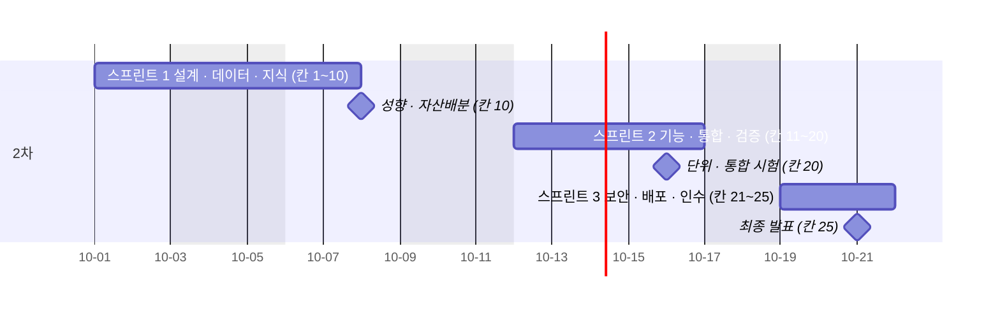

# 스프린트 계획 v0.1 — Qurious

| 문서 정보 | |
|---|---|
| **판 · 상태** | v0.1 · 초안(검토 전) — 스프린트 경계는 강사님 일정의 단계(설계 · 기능 · 검증)에 맞춘 제안 |
| **구분** | 3. 일정·업무 관리 — 스프린트 계획 |
| **작성** | 초안 이동원(팀장) · 스프린트 백로그 채우기와 판 올리기는 각 주담당 · 검수 이동원 |
| **검토** | 검토 전 — 네 명 모두(팀 일하는 방식이라 논의 먼저) |
| **최종 수정** | 2026-10-03 (KST) |
| **기준** | 코드 `main` `7afe5e9` · 머지된 PR #78 ~ #100(2026-10-01 ~ 10-03) · [WBS v0.1](WBS_v0.1.md) · [계획서 v2.0](프로젝트계획서_v2.0.md) 5.1절 |
| **관련 문서** | [WBS v0.1](WBS_v0.1.md) · [코딩 표준 v0.1](../개발/코딩표준_v0.1.md) 10절(완료의 정의) · [주간보고](../회의/주간보고/2026-10-01주_주간보고.md) · [일일 기록 양식(제안)](../회의/양식-일일-스크럼-보고.md) |
| **최근 개정** | 새 문서 |

> **이 문서로 알 수 있는 것**
> 1. 2차 · 3차를 어떤 스프린트로 나누고, 스프린트마다 목표는 무엇인가?
> 2. 스프린트 안에서 무엇을 언제 하나(스크럼 · 보고 · 리뷰 · 회고)?
> 3. 일이 스프린트에 들어오고(준비됨) 나가는(완료) 조건은 무엇인가?
> 4. 지금 스프린트 1 은 어디까지 왔나?
>
> **읽는 순서** — 팀원: 그림 1 → 2절 스프린트 1 · 2 → 3절 · 강사님: 요약 → 그림 1 · 처음 온 사람: 요약 → 부록 A

## 요약

1. 2차를 **스프린트 셋**으로 나눈다 — 스프린트 1 「설계 · 데이터 · 지식」(10-01 ~ 10-08 · 강사님 칸 1 ~ 10), 스프린트 2 「기능 · 통합 · 검증」(10-12 ~ 10-16 · 칸 11 ~ 20), 스프린트 3 「보안 · 배포 · 인수」(10-19 ~ 10-21 오전 · 칸 21 ~ 25). 3차는 셋을 같은 방식으로 10-22 에 짠다.
2. **스프린트 리뷰는 강사님 칸**이다 — 칸마다 그 칸의 주담당이 산출물을 보인다. 매일 09:00 스크럼과 17:30 보고는 강사님 유의사항 그대로이고, 기록은 일일 기록 양식(제안)에 남긴다.
3. 스프린트 1 은 10-03(토)까지 PR 20개가 머지됐다 — 계획 · 요구 · 아키텍처 칸은 냈고, 남은 것은 10-06 오전 「ERD · IA 모으기」 · 오후 「개발 표준 · DoD」 와 10-07 ~ 10-08 의 이동원 칸 셋이다.

---

## 1. 스프린트를 나눈 방식

**<그림 1> 2차 스프린트** · 범례: 막대 = 스프린트 · ◆ = 스프린트 리뷰를 겸하는 마지막 칸 · 주말 · 10-05 · 10-09 휴일 제외

**<표 1> 나눈 까닭**

| 기준 | 내용 |
|---|---|
| 강사님 단계 | 일정표가 이미 「착수 → 요구 → 분담 → 아키텍처 → 데이터 · 화면 → 개발 기반 → 기능 칸 → 통합 · 검증 → 보안 · 배포 · 운영 → 인수」 로 흐른다 — 단계가 바뀌는 곳(10-08 / 10-16)에서 끊었다 |
| 휴일 | 10-05(월) · 10-09(금) 휴일이 스프린트 1 · 2 사이에 있다 |
| 크기 | 일할 날 — 스프린트 1 : 5일(10-01 · 02 · 06 · 07 · 08) · 2 : 5일 · 3 : 2.5일 |
| 사람 시간 | 2차 반나절 25칸 × 4시간 = 한 사람 100시간(계획서 1절) |

---

## 2. 스프린트 셋

### 2.1 스프린트 1 — 설계 · 데이터 · 지식 (10-01(목) ~ 10-08(목) · 칸 1 ~ 10)

**목표** — 네 주담당이 자기 설계서 v0.1 을 두고, 공통 산출물(ERD · IA · 개발 표준)을 모으며, 이동원 몫의 데이터 · 지식이 강사님 칸 7 · 8 · 9 에서 첫 모습을 보인다.

**<표 2> 스프린트 1 백로그** · 상태: 완료 · 진행 · 예정

| WBS | 일 | 주담당 | 칸 | 상태 |
|---|---|---|---|---|
| 0.1 · 0.2 | 계획서 v2.0 · 역할 · 요구 대장 · RTM | 이동원 · 네 명 | 1 · 2 | 완료 |
| 0.3 | WBS · 스프린트 계획 · 위험 | 이동원 · 네 명 | 3 | 진행 이 문서 · WBS v0.1 |
| 1.1.1 | 아키텍처 · 동작 원리 · 인프라 구성도 | 네 명 | 4 | 진행 이동원 몫 완료 |
| 1.3 ~ 1.6 | 각 주담당 설계서 v0.1 | 신장환 · 오준영 · 강민석 | 3 · 4 | 예정 (각자) |
| 1.1.2 | ERD · 사전 · IA · 와이어프레임 모으기 | 이동원 · 각 주담당 | 5 (10-06 오전) | 진행 이동원 몫 ERD v1.4 · IA v1.0 |
| 1.1.3 | 개발 표준 · DoD | 네 명 | 6 (10-06 오후) | 진행 [코딩 표준 v0.1](../개발/코딩표준_v0.1.md) 제안 |
| 1.2.2 | W2 OHLCV · W4 데이터 관제 | 이동원 | 7 (10-07 오전) | 완료 |
| 1.2.1 · 1.2.3.1 | 용어 연관 개념 · W5 근거 색인 · 평가셋 | 이동원 | 8 (10-07 오후) | 진행 첫 판 |
| 1.2.3.2 | W6 출처 번호가 달린 답 | 이동원 | 9 (10-08 오전) | 예정 |
| 1.5 | 성향진단 · 자산배분 | 오준영 | 10 (10-08 오후) | 예정 |

**스프린트 1 에 머지된 PR(10-01 ~ 10-03)** — WBS 묶음별로 묶었다.

| WBS | PR |
|---|---|
| 0.1 계획 | #78 |
| 1.1 공통(강사님 기초 코드 반영 · 마이그레이션 정리) | #96 · #98 · #100 |
| 1.2 ① 데이터 · 지식 | #80 · #81 · #84 · #87 · #89 · #91 · #93 · #97 |
| 1.6 ④ 모의투자 · 성과(QFRS · 모의계좌 · 로보어드바이저 기준) | #82 · #83 · #85 · #86 · #90 · #92 · #94 · #95 |

### 2.2 스프린트 2 — 기능 · 통합 · 검증 (10-12(월) ~ 10-16(금) · 칸 11 ~ 20)

**목표** — 각 목표 기능이 강사님 칸에서 보이고(리밸런싱 · 패턴 · XAI · 성과 · 모의투자), 10-14 오후에 주 경로 하나로 이어지며, 10-16 에 결함대장과 시험 결과가 나온다.

| WBS | 일 | 주담당 | 칸 |
|---|---|---|---|
| 1.5 | 리밸런싱 | 오준영 | 11 (10-12 오전) |
| 1.4 | 패턴 예측 | 신장환 | 12 (10-12 오후) |
| 1.3 | XAI 설명 | 신장환 | 13 (10-13 오전) |
| 1.6 | 성과 분석 · 모의투자 | 강민석 | 14 · 15 |
| 1.2.4.3 · 1.2.6 | W7 공시 · 재무 · 뉴스 · 일정 · 국내 주식 대시보드 | 이동원 | (10-14) |
| 1.7.1 | 화면 · API 통합 | 네 명 | 16 (10-14 오후) |
| 1.7.2 | RAG 품질 검증 | 이동원 | 17 (10-15 오전) |
| 1.7.3 | 스트레스 검증 | 오준영 · 강민석 (팀 결정) | 18 (10-15 오후) |
| 1.7.4 | 모의투자 검증 | 강민석 | 19 (10-16 오전) |
| 1.7.5 | 단위 · 통합 시험 · 결함대장 | 네 명 | 20 (10-16 오후) |

### 2.3 스프린트 3 — 보안 · 배포 · 인수 (10-19(월) ~ 10-21(수) 오전 · 칸 21 ~ 25)

**목표** — 보안 · 성능을 점검하고, 배포본(로컬 · AWS 는 팀 결정)과 운영 · 복구를 보이며, 완료보고와 최종 발표로 2차를 닫는다.

| WBS | 일 | 주담당 | 칸 |
|---|---|---|---|
| 1.7.6 | 보안 · 성능 | 네 명 | 21 (10-19 오전) |
| 1.8.1 | 배포(AWS 선택) | 팀 결정 → 이동원 모으기 | 22 (10-19 오후) |
| 1.8.2 | 운영 · 복구 | 이동원 | 23 (10-20 오전) |
| 1.7.7 | UAT · 파일럿 | 네 명 | 24 (10-20 오후) |
| 1.8.3 | 인수 · 완료보고 · 최종 발표 | 네 명 | 25 (10-21 오전) |

---

## 3. 스프린트 안의 하루와 한 주

**<그림 2> 스프린트의 리듬** · 범례: 실선 = 차례 · 점선 = 되돌아감

**<표 3> 정해진 일**

| 일 | 언제 | 누가 | 남는 곳 |
|---|---|---|---|
| 스프린트 계획 | 스프린트 첫날 오전 15분 | 네 명 | 이 문서 2절(판 올림) |
| 일일 스크럼 — 어제 · 오늘 · 막힌 것 한 줄씩 | 매일 09:00 ~ 09:15 | 네 명 · 진행 이동원 | [일일 기록](../회의/양식-일일-스크럼-보고.md)(제안) |
| 진행 · 위험 · 내일 계획 보고 | 매일 17:30 ~ 17:50 | 네 명 | 일일 기록 |
| 스프린트 리뷰 | 강사님 칸마다 | 그 칸의 주담당 | 산출물 · 시연 |
| 회고 | 스프린트 마지막 날 | 네 명 | [주간보고](../회의/주간보고/2026-10-01주_주간보고.md) 「배운 것」 |

---

## 4. 들어오고 나가는 조건

**<표 4> 준비됨(DoR)과 완료(DoD)**

| | 조건 | 까닭 |
|---|---|---|
| **준비됨** — 일이 스프린트에 들어오려면 | ① 요구 ID 또는 강사님 칸 번호가 있다 ② 주담당 설계서의 절이 있다(설계 → 산출물 → 코드) ③ 화면 일은 Figma 에서 정했다 ④ 시험 묶음 이름을 시험-요구 대장에 잡았다 | 계획서 4.1절 「설계 → 산출물 → 코드」 · 화면은 Figma 결정 뒤 |
| **완료** — 일이 끝났다고 하려면 | [코딩 표준 v0.1](../개발/코딩표준_v0.1.md) 10절 여섯 줄(전체 시험 · 새 시험 · 기능 점검 · 화면 손 확인 · 문서 · PR 과 TIL) | 같은 기준으로 「다 했다」 를 말한다 |

---

## 5. 위험

| 위험 | 대응 |
|---|---|
| 이동원 칸 셋(7 · 8 · 9)이 10-07 ~ 10-08 에 몰린다 | W5 · W6 를 10-06 까지 첫 모습으로 · 그 밖의 이동원 일(화면 요청 · 개념 학습)은 스프린트 2 로 |
| 다른 주담당 설계서가 10-06 오전 칸까지 없으면 ERD · IA 모으기가 이동원 몫만 된다 | 설계서 틀(목표 기능 ① 설계서) 공유 · 10-06 오전에 모을 수 있는 것만 모으고 나머지는 스프린트 2 첫날 |
| 일일 기록을 남길 곳이 아직 제안이다 | 일일 기록 양식 v0.1 을 팀이 정할 때까지 대화방에 남긴다 |
| 휴일 둘(10-05 · 10-09)로 스프린트 1 · 2 가 짧다 | 스프린트 2 에 칸 10개가 몰린다 — 각 주담당이 자기 칸 전날까지 PR 을 올린다 |

---

## 부록 A. 용어

| 말 | 뜻 | 이 문서에서 |
|---|---|---|
| 스프린트 | 정해진 기간 안에 목표 하나를 이루는 반복 단위 | 2차 셋 · 3차 셋 |
| 스프린트 리뷰 | 스프린트에서 만든 것을 보이는 자리 | 강사님 칸 |
| 회고 | 일하는 방식을 돌아보고 고칠 것을 정하는 자리 | 주간보고 「배운 것」 |
| 준비됨(DoR) · 완료(DoD) | 일이 스프린트에 들어오는 조건 · 끝났다고 하는 조건 | 4절 |

## 부록 B. 만든 방법

- 스프린트 경계: 계획서 v2.0 5.1절 25칸의 단계와 휴일(달력 규칙)에서 정했다.
- 머지된 PR: GitHub 저장소 PR 목록(2026-10-03 · 비로그인 읽기)과 로컬 `git log --merges` 를 대조했다.
- 뒤집을 조건: 팀이 다른 길이(주 단위 등)를 고르면 1 · 2절을 다시 쓴다.

## 부록 C. 변경 노트 — 다음 판(v0.2)에 넣을 것

| 날짜 | 종류 | 무엇 | 옮길 곳 | 근거 |
|---|---|---|---|---|

## 부록 D. 개정 이력

| 판 | 날짜 | 무엇이 바뀌었나 | 왜 | 근거 |
|---|---|---|---|---|
| v0.1 | 2026-10-03 | 추가 — 새 문서(스프린트 셋 · 백로그 · 리듬 · 준비됨 · 완료 · 위험) | 강사님 산출물 표 3구분 「스프린트 계획」 이 세션 계획으로만 있었다 · 칸 3 | 계획서 v2.0 · WBS v0.1 · 머지된 PR |
