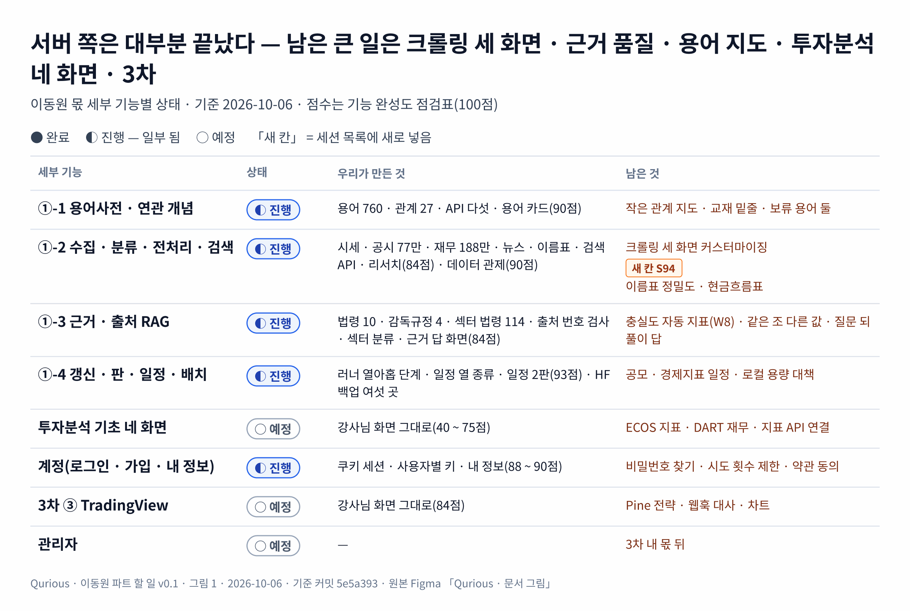

# 이동원 파트 할 일 v0.1 — 강사님 틀 · 우리가 바꾼 것 · 남은 것

| 문서 정보 | |
|---|---|
| **판 · 상태** | v0.1 · 초안(이동원 검토 전) |
| **구분** | 3. 진척 관리 — 담당 범위 할 일 목록(작업 계획 보조). 세션 순서는 [산출물 목록](../산출물목록.md) 12절이 정본이고, 이 문서는 「무엇이 있고 무엇이 빠졌나」 의 정본이다 |
| **작성** | 이동원(2차 목표 기능 ① 세부 1 ~ 4 주담당 · 3차 ③ 주담당) |
| **검토** | 이동원 — 「더함 · 고침 · 뺌」 칸의 판단을 확정한다 |
| **최종 수정** | 2026-10-06 (KST) |
| **기준** | 코드 `main` `5e5a393` + 이 판의 작업 트리 · 기능 완성도 점검표(`docs/시험/기능완성도-점검표.tsv` · 이동원 몫 29줄) · [목표 기능 ① 상세 설계서 v1.5](../설계/목표기능1-데이터지식-설계_v1.5.md) 2 · 3절 |
| **관련 문서** | [WBS v0.1](WBS_v0.1.md) · [스프린트 계획 v0.1](스프린트계획_v0.1.md) · [화면 IA v1.2](../화면/화면IA_v1.2.md) · [기능 완성도 점검 v0.1](../시험/기능완성도-점검_v0.1.md) |
| **최근 개정** | 새 문서 |

> **이 문서로 알 수 있는 것**
> 1. 강사님이 준 틀(기초 코드 화면 · 기술 스택 칸)에서 무엇을 그대로 두고, 무엇을 바꾸고, 무엇을 뺐나?
> 2. 이동원 몫 기능마다 지금 어디까지 됐고, 무엇이 빠졌나?
> 3. 더하거나 고칠 수 있는 것은 무엇이고, 어느 세션 칸에 들어가나?
>
> **읽는 순서** — 이동원: 요약 → 2절 표 → 6절 정할 것 · 팀원: 요약 → 2절 · 처음 온 사람: 부록 A 용어 → 요약

## 요약

1. 이동원 몫은 2차 목표 기능 ① 의 세부 1 ~ 4(용어 · 수집 · 근거 답 · 갱신 · 일정)와 그 화면, 투자분석 기초 네 화면의 기초 구현, 계정 화면, 3차 ③(TradingView)이다. 화면으로는 29개다(점검표 기준).
2. **서버 쪽은 세부 1 ~ 4 가 대부분 끝났다.** 매일 12:30 러너 열아홉 단계가 시세 · 공시 · 재무 · 뉴스 · 일정 · 검색 색인을 갱신하고, HF private 데이터셋 여섯 곳에 백업한다(2026-10-06 에 근거 DB · 검색 색인 두 곳을 더함).
3. **강사님 틀의 화면 셋 — 자동 크롤링 · 수동 크롤링 · 데이터 인제스트 — 은 아직 우리 수집기와 이어져 있지 않다.** 지금도 강사님 예제(GitHub 문서 → 강사님 RAG · 네이버 종목 · 신용평가 CSV)를 그대로 돈다. 우리 세부 기능 2 는 이 세 화면 밖(데이터 관제 · 투자 정보 리서치 · 러너)에 따로 만들어져 있다. 이 셋을 우리 프로젝트에 맞게 바꾸는 일을 세션 목록에 새로 넣는다(5절 · S95 ①).
4. 남은 큰 묶음은 다섯이다 — ① 근거 품질 보고(W8 · 진행) ② 크롤링 세 화면 커스터마이징(새 칸) ③ 용어사전 남은 것(작은 관계 지도 · 교재 밑줄) ④ 투자분석 기초 네 화면(공식 출처 연결) ⑤ 3차 ③.
5. 강사님 틀에서 **뺀 것**은 이유가 있는 것만이다 — 언론사 기사 본문 저장(저작권 · 약관) · 네이버 검색 API 저장(약관 2.3) · AWS 인프라(로컬 완성 뒤). **뺄지 정할 것** 셋은 6절에 있다(네이버 종목 크롤링 · 신용평가 CSV 인제스트 · GitHub 문서 자동 크롤링).

---

## 1. 범위

이동원 몫과 다른 주담당 몫의 경계는 <표 1> 과 같다. 경계 밖 결함은 고치지 않고 이슈 초안으로 넘긴다.

**<표 1> 이 문서가 다루는 범위**

| 묶음 | 요구 ID | 이동원 몫 | 다른 주담당 몫(다루지 않음) |
|---|---|---|---|
| 2차 목표 기능 ① | `P01-①-1` ~ `①-4` | 용어 · 수집 · 근거 답 · 갱신 · 일정 · 그 화면 | `P01-①-5` XAI(신장환) |
| 투자분석 기초 네 화면 | — | 기초 구현(공식 출처 연결) | 각 주담당의 변형 |
| 계정 | — | 로그인 · 가입 · 내 정보 | — |
| 3차 | `P02-③` | TradingView 연동 · Pine · 웹훅 · 알림 · Open API | 3차 ① ② ④ |
| 관리자 | — | 강사님 관리자 화면 반영(3차 내 몫 뒤) | — |

---

## 2. 한눈에 — 세부 기능마다 틀 · 우리 것 · 남은 것

서버 쪽은 대부분 끝났고, 남은 큰 일은 크롤링 세 화면 · 근거 품질 · 용어 지도 · 투자분석 네 화면 · 3차다. <그림 1> 은 세부 기능마다 상태와 남은 것을 한 장에 보인다.

**<그림 1> 이동원 몫 상태 지도** · 범례: ● 완료 · ◐ 진행(일부 됨) · ○ 예정 · 「새 칸」 = 세션 목록에 새로 넣음

원본: [Figma · Qurious · 문서 그림 · 그림 1](https://www.figma.com/design/6lstWS4YwuhJPhGB9XoBMD?node-id=2-2) · 그림 판 v0.1 · 기준 `5e5a393` · 2026-10-06 · 같은 내용의 글은 <표 2>

세부 기능별 상태는 <표 2> 와 같다. 「상태」 는 완료 · 진행 · 예정 · 안 함 넷이다. 점수는 기능 완성도 점검표(배점표 100점)다.

**<표 2> 이동원 몫 세부 기능 상태** · 기준 2026-10-06

| 세부 기능 | 강사님 틀(기초 코드 · 기술 스택 칸) | 우리가 만든 것 | 상태 | 남은 것 |
|---|---|---|---|---|
| ①-1 용어사전 · 연관 개념 | 통합본 용어 자료 · 개념 학습 사이트 | 용어 760 · 분류 22 · 관계 27 · API 다섯 · 용어 카드 연관 칩 · 모든 화면 용어 설명(점검 90점) | 진행 | 작은 관계 지도 · 교재 밑줄 · 보류 용어 둘 · 「법령에서는」 줄 · ECOS 통계용어 이용 조건 조사 |
| ①-2 투자 자료 수집 · 분류 · 전처리 · 검색 | python-crawling-lab 크롤링 · 적재 / 기초 코드 화면 셋(자동 · 수동 크롤링 · 데이터 인제스트) | 시세(일 · 주 · 분봉) · ETF · 지수 · 공시 77만 · 재무 188만 · 정책뉴스 · 언론사 메타데이터 · 이름표 · 수집 자료 검색 API · 투자 정보 리서치 화면(84점) · 데이터 관제(90점) | 진행 | **크롤링 세 화면 커스터마이징(5절)** · 이름표 정밀도 표본 200 · 전체 재무제표(현금흐름) · 뜻으로 찾기 · 검색어를 지우면 처음 목록으로(사용자 요청 2026-10-06) |
| ①-3 근거 · 출처가 있는 RAG 질의응답 | 기초 코드 채팅 RAG(`fin_chunks`) · Bedrock 또는 Ollama | 근거 문서 법령 10 · 감독규정 4 · 섹터 법령 114 · 출처 번호 검사 · 섹터 질문 분류(낱말 2판) · 「없다」 단정 거름 · 질문 되풀이 거름 · 실패 발췌 화면 안 B · 근거 답 화면(84점) | 진행 | 근거 충실도 자동 지표(W8 · llama3.1 은 사람 판정을 가르지 못함 · exaone 결과 뒤 결정) · 같은 조의 다른 값 고르기(DF-59 꼴) · 분류는 걸렸는데 검색이 놓친 조(U10 · U13) · 공시 · 뉴스 근거 답 평가 · 협회 · 거래소 규정 |
| ①-4 갱신일 · 문서 판 · 캘린더 · 정기 배치 | EventBridge · Batch(→ 작업 스케줄러로 대신) · 통합본 캘린더 | 러너 열아홉 단계 · 거래일 달력 · 일정 열 종류 · 일정 2판 화면(93점) · 문서 판 · HF 백업 여섯 곳 | 진행 | 공모(청약 · 상장) · 경제지표 일정 · 문서 판 주 1회 대조 · 로컬 용량 대책(조사 중) |
| 투자분석 기초 네 화면 | 거시 · 산업 · 재무 · 기술 화면(목업 · 설명 전용) | 손대지 않음(40 ~ 75점) | 예정 | ECOS 100대 지표 · DART 재무(`API-DATA-04`) · 지표 API 연결 · 기준일 표시 |
| 계정 | 로그인 · 가입 · 마이페이지 | 쿠키 세션 · 사용자별 키 · 내 정보(88 ~ 90점) | 진행 | 비밀번호 찾기 · 시도 횟수 제한 · 약관 동의 · 돌아올 주소 · 투자 성향 칸 |
| 3차 ③ TradingView | Pine 생성기 · 웹훅 · 교차 검증 화면(84점) | 손대지 않음 | 예정 | Pine 전략(strategy · 비용 · 손절 익절) · 웹훅 대사 · 차트(Lightweight Charts) |
| 관리자 | fe-vanilla 관리자 화면 | — | 예정 | 3차 내 몫 뒤 |

---

## 3. 세부 기능마다 할 일

할 일은 「더함」(새로) · 「고침」(있는 것을 바꿈) · 「뺌」(쓰지 않음) 셋으로 나눈다. 「칸」 은 산출물 목록 12절의 세션 칸이다.

### 3.1 ①-1 용어사전 · 연관 개념

**<표 3> ①-1 할 일**

| 할 일 | 종류 | 지금 | 근거 | 칸 |
|---|---|---|---|---|
| 작은 관계 지도(용어 카드 안 · 관계 셋까지) | 더함 | API(`API-GLOS-05`)만 있음 | R01 결정 · 점검표 「100%까지」 | R01 남은 것 |
| 교재 밑줄(개념 학습 본문의 용어에 카드 연결) | 더함 | 없음 | R01 결정 | R01 남은 것 |
| 보류 용어 둘 · 「법령에서는」 줄 | 더함 | 보류 | R01 결정 | R01 남은 것 |
| ECOS 통계용어사전을 용어 출처로 쓸지 | 조사 | 이용 조건 확인 전 | 시장조사 5절 | R01 남은 것 |
| 개념 학습을 앱 안으로(공용 셸) | 고침 | 별도 사이트 `/learn/` | 조사서 「학습 · API 문서 앱 통합」 안 C | 리팩터링 세션 |

### 3.2 ①-2 투자 자료 수집 · 분류 · 전처리 · 검색

강사님 기술 스택 칸은 「python-crawling-lab 등을 활용한 크롤링 및 적재」 다. 우리는 그 예제에서 층 이름(Bronze · Silver · Gold)과 DART · ECOS 경로를 빌리고, 시세 이력 · 법령 · 뉴스는 새로 설계했다(설계서 1.3절). 그래서 수집은 화면이 아니라 매일 러너가 하고, 화면은 그 결과를 보인다.

**<표 4> ①-2 할 일**

| 할 일 | 종류 | 지금 | 근거 | 칸 |
|---|---|---|---|---|
| **자동 크롤링 화면 → 「수집 일정 · 단계」** — 러너 열아홉 단계 · 마지막 결과 · 다음 회차 · 단계별 다시 돌리기(관리자) | 고침 | 강사님 예제(GitHub python-quant 문서 → 강사님 RAG `fin_chunks`) 그대로 · 63점 | 사용자 요청 2026-10-06 | **S95 ①** |
| **수동 크롤링 화면 → 「자료 직접 받기」** — 종목 · 기간을 골라 시세 · 공시 · 재무 받기, URL 은 허용 목록 · robots 표시 | 고침 | 강사님 URL · 네이버 종목 크롤링 그대로 · 61점 · 빈 회색 칸 | 사용자 요청 · 옛 분석 A11(SSRF · robots) | **S95 ①** |
| **데이터 인제스트 화면 → 「적재 · 백업」** — 팀원 자료 받기 검사 보고서 · HF 백업 여섯 곳 상태 · 대조 · 복원 리허설 | 고침 | 강사님 신용평가 CSV 인제스트 · DB 초기화 그대로 · 68점 · 화면 글은 「MongoDB」(실제는 PostgreSQL) | 사용자 요청 | **S95 ①** |
| 투자 정보 리서치: 검색어를 지우면 처음 목록(최신순)으로 | 고침 | 검색을 다시 눌러야 돌아감 | 사용자 요청 2026-10-06 | 작은 것 |
| 이름표 정밀도 표본 200(뉴스 포함) | 더함 | 없음 | 설계서 2.1 기준 6 | 공시 · 뉴스 평가 |
| 뜻으로 찾기(낱말 + 벡터) | 더함 | 낱말 색인만 | 점검표 | 작은 것 뒤 |
| 전체 재무제표(현금흐름) | 더함 | 주요계정만 | 설계서 3.1 | 정할 것 |
| 로컬 용량 대책(HF 원격 저장 · 필요할 때 받기) | 조사 → 더함 | 조사 중(2026-10-06) | 사용자 요청 | 조사서 뒤 |

### 3.3 ①-3 근거 · 출처가 있는 RAG 질의응답

**<표 5> ①-3 할 일**

| 할 일 | 종류 | 지금 | 근거 | 칸 |
|---|---|---|---|---|
| 근거 충실도 자동 지표를 사람 판정과 맞추기 → 50문항으로 | 더함 | 진행 — 평가 도구 · 사람 판정 61 · llama3.1 은 가르지 못함(50 으로 넓히지 않음) · exaone 은 이어서 | 조사서 「근거 충실도 자동 지표」 v0.2 · 테스트 계획서 v1.14 4.7절 | W8 |
| 같은 조의 다른 값 고르기(소주 100분의 30 · 사망 처벌 ②항) | 고침 | 열림(DF-59 꼴) | 근거답 · 섹터 평가 | W8 다음 |
| 답이 질문을 되풀이(출처 번호만 붙임) | 고침 | **닫힘**(2026-10-06 · 질문 되풀이 거름 → 근거 발췌 · TC-KA-15 · 16 · 지난 답 388 중 U13 만) | 표본 밖 U13 | 끝 |
| 공시 · 뉴스를 근거 답에 넣기 평가 10문항 | 더함 | 없음 | 설계서 14.1 | 공시 · 뉴스 평가 |
| 협회 · 거래소 규정 · 행정규칙(고시) | 더함 | 정할 것 | 설계서 3.1 | 정할 것 |

### 3.4 ①-4 갱신일 · 문서 판 · 캘린더 · 정기 배치

**<표 6> ①-4 할 일**

| 할 일 | 종류 | 지금 | 근거 | 칸 |
|---|---|---|---|---|
| 공모(청약 · 상장) · 경제지표(물가 · 고용) 일정 | 더함 | 없음 | 점검표 「100%까지」 | 정할 것 |
| 공시 보관본을 러너가 주 1회 이어 올리기 | 더함 | 손으로(2026-10-06 이어 올림) | 사용자 결정 2026-10-06 | 작은 것 |
| 주총 「본문 없음」 을 날마다 다시 부르지 않기 | 고침 | 날마다 다시 부름 | 설계서 3.1 | 작은 것 |
| 수집 DB 를 롤백 저널로 바꿀지 | 정할 것 | WAL | DF-74 와 같은 위험 | 정할 것 |

---

## 4. 강사님 틀에서 바꾼 것 · 뺀 것 · 더한 것

강사님이 준 틀과 지금 우리 것의 차이는 <표 7> 과 같다. 「뺌」 은 까닭이 확인된 것만 적었다.

**<표 7> 틀과의 차이**

| 구분 | 무엇 | 까닭 · 근거 |
|---|---|---|
| 바꿈 | 채팅 RAG(`fin_chunks` · LangChain) → 근거 답(법령 · 감독규정 · 출처 번호 검사 · 따로 된 근거 DB) | 같은 평가셋에서 채팅 RAG 길 정답률 0.026(설계서 5.3.6) |
| 바꿈 | 캘린더(통합본) → 일정 2판(열 종류 · 한 달 요약 · 그날 목록) | Figma 결정 2026-10-05 |
| 바꿈 | 뉴스 검색 → 정책브리핑 정책뉴스(공공누리 제1유형 본문) + 언론사 메타데이터(제목 · 주소만) | 네이버 검색 API 약관 2.3(저장 · AI 입력 금지) |
| 바꿈 | EventBridge · Batch → 작업 스케줄러 + 러너 | 로컬 완성 먼저(AWS 는 뒤) |
| 뺌 | 언론사 기사 본문 저장 · AI 입력 | 저작물 · 약관 |
| 뺌 | AWS 인프라 · 배포 코드 | 1차 결정(로컬 완성 뒤 다시 고름) |
| 더함 | 매일 러너 열아홉 단계 · HF private 백업 여섯 곳 · 공시 · 재무 시점 고정(pit) · 섹터 법령 · 데이터 관제 · API 문서 화면 | 설계서 4 · 5절 |
| 아직 그대로 | 자동 · 수동 크롤링 · 데이터 인제스트 화면 | 5절에서 바꾼다 |

---

## 5. 새 칸 — 크롤링 세 화면 커스터마이징 (S95 ①)

세 화면은 강사님 예제를 돈다. 이름은 「크롤링」 이지만 우리 수집은 화면 단추가 아니라 매일 러너가 한다. 그래서 세 화면을 「우리 수집이 무엇을 언제 했고, 사람이 언제 손으로 더 받거나 올리나」 를 보이는 화면으로 바꾸는 것을 제안한다. 확정은 화면 설계 절차대로 Figma 에서 지금 화면 · 바꿀 화면을 나란히 두고 한다.

**<표 8> 세 화면 바꾸기 제안(Figma 전)**

| 지금 화면 | 지금 하는 일 | 바꿀 일(제안) | 강사님 기능은 |
|---|---|---|---|
| 자동 크롤링 | GitHub 문서를 강사님 RAG 에 넣음 | **수집 일정 · 단계** — 러너 단계 열아홉의 마지막 결과 · 걸린 시간 · 다음 회차 · 단계 설명, 관리자만 한 단계 다시 돌리기 | 개념 학습 자료로 옮기거나 뺌(정할 것 ③) |
| 수동 크롤링 | URL 하나 · 네이버 종목 긁기 · 목록 | **자료 직접 받기** — 종목 · 기간을 골라 시세 · 공시 · 재무 · 정책뉴스를 받기(과거분 메우기) · 받은 결과와 출처 · 이용 조건 표시. URL 은 허용 목록 · 사설 주소 막기 · robots 표시 | 네이버는 학습용 표시로 남기거나 뺌(정할 것 ①) |
| 데이터 인제스트 | 신용평가 CSV 를 DB 에 넣기 · DB 초기화 | **적재 · 백업** — 팀원 자료 받기(검사 보고서 · 통과분만 정제) · HF 백업 여섯 곳(마지막 올림 · 태그 · 대조 · 복원 리허설) · 로컬 용량 | CSV 인제스트의 쓰임을 팀에 묻고 남기거나 뺌(정할 것 ②) |

- 강사님 파일(`agent.js`)에는 단추를 부르는 갈림 몇 줄만 두고 새 기능은 새 파일에 둔다 — 다음 기초 코드 반영 때 충돌을 줄인다.
- 서버 쪽(단계 상태 · 받기 · 백업 상태 API)은 화면 결정을 기다리지 않고 먼저 만들 수 있다 — 러너 상태 · HF 상태는 이미 명령줄에 있다(`daily_update.py status` · `hf_dataset.py status --remote`).

---

## 6. 정할 것

**<표 9> 이동원이 정할 것**

| # | 정할 것 | 선택지 | 판단 재료 |
|:-:|---|---|---|
| ① | 네이버 종목 크롤링을 남길지 | 학습용 표시로 남김 · 뺌 | `finance.naver.com/robots.txt` 가 전면 금지 · 팀 결정 「학습용 허용」 |
| ② | 신용평가(개인 · 기업 CB) CSV 인제스트를 남길지 | 남김 · 뺌 · 팀에 묻기 | 우리 기능에서 쓰는 곳 확인 전 |
| ③ | GitHub python-quant 문서 자동 크롤링을 어디에 | 개념 학습 자료로 · 뺌 | 강사님 RAG(`fin_chunks`)는 근거 답이 쓰지 않는다 |

---

## 부록 A. 용어

| 용어 | 뜻 | 이 문서에서 | 헷갈리는 점 |
|---|---|---|---|
| 러너 | 매일 12:30 작업 스케줄러가 돌리는 수집 순서표 | `scripts/daily_update.py run --upload` · 열아홉 단계 | 화면의 「자동 크롤링」 단추와 다르다 |
| 틀 | 강사님이 준 기초 코드 화면과 요구 원문의 기술 스택 칸 | 2 · 4절 | 틀을 따르되 우리 데이터 · 약관에 맞게 바꿨다 |
| 커스터마이징 | 틀의 화면 · 기능을 우리 프로젝트의 자료 · 흐름에 맞게 바꾸는 일 | 5절 | 새로 만드는 것과 다르다 — 자리와 이름은 틀을 따른다 |

## 부록 B. 개정 이력

| 판 | 날짜 | 무엇이 바뀌었나 | 왜 | 근거 |
|---|---|---|---|---|
| v0.1 | 2026-10-06 | 새 문서 — 범위 · 세부 기능별 상태 · 할 일(더함 · 고침 · 뺌) · 틀과의 차이 · 크롤링 세 화면 바꾸기 제안 · 정할 것 | 세션 목록만으로는 무엇이 빠졌고 무엇을 더하거나 뺐는지 가리기 어렵다는 이동원 의견 | 사용자 요청 2026-10-06 |
