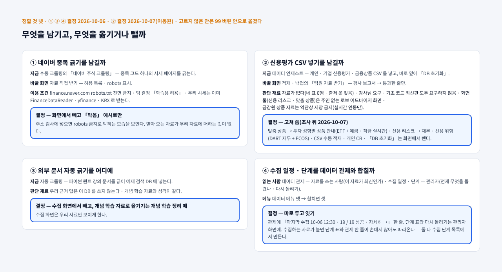

# 이동원 파트 할 일 v0.3 — 강사님 틀 · 우리가 바꾼 것 · 남은 것

| 문서 정보 | |
|---|---|
| **판 · 상태** | v0.3 · 초안(이동원 검토 전) |
| **구분** | 3. 진척 관리 — 담당 범위 할 일 목록(작업 계획 보조). 세션 순서는 [산출물 목록](../산출물목록.md) 12절이 정본이고, 이 문서는 「무엇이 있고 무엇이 빠졌나」 의 정본이다 |
| **작성** | 이동원(2차 목표 기능 ① 세부 1 ~ 4 주담당 · 3차 ③ 주담당) |
| **검토** | 이동원 — 「더함 · 고침 · 뺌」 칸의 판단을 확정한다 |
| **최종 수정** | 2026-10-07 (KST) |
| **기준** | 코드 `main` `13a6ae9`(PR #126 머지) + 이 판의 작업 트리 · 기능 완성도 점검표(`docs/시험/기능완성도-점검표.tsv` · 이동원 몫 29줄) · [목표 기능 ① 상세 설계서 v1.6](../설계/목표기능1-데이터지식-설계_v1.6.md) 2 · 3절 · Figma [「Qurious · 데이터 수집 화면 — 수집 일정 · 직접 받기 · 적재 백업」](https://www.figma.com/design/AfiCh50uOwrSq5F2Tk2JLZ) 05 결정 기록(2026-10-06) |
| **관련 문서** | [WBS v0.1](WBS_v0.1.md) · [스프린트 계획 v0.1](스프린트계획_v0.1.md) · [화면 IA v1.3](../화면/IA_v1.3.md) · [UI 명세서 v0.3](../화면/UI명세서_v0.3.md) 5절 · [기능 완성도 점검 v0.1](../시험/기능완성도-점검_v0.1.md) |
| **최근 개정** | v0.2 → v0.3: 크롤링 세 화면의 설계를 Figma 에서 정했다(2026-10-06) — 5절 <표 8> 을 제안에서 결정으로 · <그림 2> 결정 기록 · 6절 <표 9> ① ③ ④ 결정 · ② 신용평가 CSV 는 결정 A(고쳐 씀 · 2026-10-07) / 역할 재확정(2026-10-07) — 7절 주인 없는 화면 22 를 이동원 몫으로 2차 · 3차에 나눔 · 로보 어드바이저 먼저 |

> **이 문서로 알 수 있는 것**
> 1. 강사님이 준 틀(기초 코드 화면 · 기술 스택 칸)에서 무엇을 그대로 두고, 무엇을 바꾸고, 무엇을 뺐나?
> 2. 이동원 몫 기능마다 지금 어디까지 됐고, 무엇이 빠졌나?
> 3. 더하거나 고칠 수 있는 것은 무엇이고, 어느 세션 칸에 들어가나?
>
> **읽는 순서** — 이동원: 요약 → 2절 표 → 6절 정할 것 · 팀원: 요약 → 2절 · 처음 온 사람: 부록 A 용어 → 요약

## 요약

1. 이동원 몫은 2차 목표 기능 ① 의 세부 1 ~ 4(용어 · 수집 · 근거 답 · 갱신 · 일정)와 그 화면, 투자분석 기초 네 화면의 기초 구현, 계정 화면, 3차 ③(TradingView)이다. 화면으로는 29개다(점검표 기준).
2. **서버 쪽은 세부 1 ~ 4 가 대부분 끝났다.** 매일 12:30 러너 열아홉 단계가 시세 · 공시 · 재무 · 뉴스 · 일정 · 검색 색인을 갱신하고, HF private 데이터셋 여섯 곳에 백업한다(2026-10-06 에 근거 DB · 검색 색인 두 곳을 더함).
3. **강사님 틀의 화면 셋 — 자동 크롤링 · 수동 크롤링 · 데이터 인제스트 — 을 바꾸는 설계를 정했다(2026-10-06 · Figma · 5절).** 지금 셋은 강사님 예제(GitHub 문서 → 강사님 RAG · 네이버 종목 · 신용평가 CSV)를 그대로 돌고, 우리 수집은 화면 밖 러너가 한다. 바꾼 뒤에는 「수집 일정 · 단계」 · 「자료 직접 받기」 · 「적재 · 백업」 — 관리자가 우리 수집을 보고 메우고 백업하는 화면 셋이 된다. 서버(API · 표 · 배치)와 구현이 남았다.
4. 남은 큰 묶음은 다섯이다 — ① 근거 품질 보고(W8 · 진행) ② 크롤링 세 화면(설계 결정 · 서버 · 구현 남음) ③ 용어사전 남은 것(작은 관계 지도 · 교재 밑줄) ④ 투자분석 기초 네 화면(공식 출처 연결) ⑤ 3차 ③.
5. 강사님 틀에서 **뺀 것**은 이유가 있는 것만이다 — 언론사 기사 본문 저장(저작권 · 약관) · 네이버 검색 API 저장(약관 2.3) · AWS 인프라(로컬 완성 뒤) · **네이버 종목 긁기 단추**(robots.txt 전면 금지 — 주소 검사의 「막음」 예시로만 남김 · 결정 ①) · **외부 강의 문서 자동 긁기**(수집 화면에서 뺌 — 개념 학습 자료로 옮기는 일은 리팩터링 세션 · 결정 ③). 신용평가 CSV 인제스트는 CSV 수동 적재 · 개인 CB 를 빼고, 그 자료를 읽던 화면 둘(맞춤 상품 추천 · 신용 리스크 분석)은 우리 자료로 고쳐 쓴다(결정 ② A · 2026-10-07 · 6절).
6. **역할을 다시 확정했다(2026-10-07).** 이동원 몫은 2차 세부 기능 1 ~ 4(세부 5 XAI 는 신장환 — 2026-10-07 사용자 확인)와 3차 TradingView · Pine 세부 1 ~ 3 이고, **화면에 있는데 주인이 없거나 요구 밖인 기능은 모두 이동원이 구현한다** — 주인 없는 화면 22개를 2차 · 3차로 나눴다(7절). 세션 순서는 **2차 로보 어드바이저를 10-21 까지 먼저 완전히** 구현하는 것이다.

---

## 1. 범위

이동원 몫과 다른 주담당 몫의 경계는 <표 1> 과 같다. 경계 밖 결함은 고치지 않고 이슈 초안으로 넘긴다.

**<표 1> 이 문서가 다루는 범위**

| 묶음 | 요구 ID | 이동원 몫 | 다른 주담당 몫(다루지 않음) |
|---|---|---|---|
| 2차 목표 기능 ① | `P01-①-1` ~ `①-4` | 용어 · 수집 · 근거 답 · 갱신 · 일정 · 그 화면 | `P01-①-5` XAI(신장환 — 2026-10-07 다시 확인) · 목표 기능 ② 패턴(신장환) · ③ 자산배분 · 리밸런싱(오준영) · ④ 성과 · 모의투자(강민석) |
| 투자분석 기초 네 화면 | — | 기초 구현(공식 출처 연결) | 각 주담당의 변형 |
| 계정 | — | 로그인 · 가입 · 내 정보 | — |
| **주인 없는 화면 22** | — | 2026-10-07 사용자 — 주인이 없거나 요구 밖인 화면은 모두 이동원이 구현 · 2차 · 3차로 나눔(7절) | 주인이 「(추정)」 인 둘(투자 대시보드 · 주가 차트)은 확인 뒤 |
| 3차 | `P02-③` | TradingView 성과 확인 · Pine 지표 · 전략 · 신호 / Strategy Tester + LEAN 교차 검증 / 알림 · 웹훅 · Open API | 3차 ① ② 인디케이터(신장환) · ④ LEAN 성과 검증(강민석) · ⑤ 증권사 연동(오준영) |
| 관리자 | — | 강사님 관리자 화면 반영(3차 내 몫 뒤) | — |

---

## 2. 한눈에 — 세부 기능마다 틀 · 우리 것 · 남은 것

서버 쪽은 대부분 끝났고, 남은 큰 일은 크롤링 세 화면 · 근거 품질 · 용어 지도 · 투자분석 네 화면 · 3차다. <그림 1> 은 세부 기능마다 상태와 남은 것을 한 장에 보인다.

**<그림 1> 이동원 몫 상태 지도** · 범례: ● 완료 · ◐ 진행(일부 됨) · ○ 예정 · 「새 칸」 = 세션 목록에 새로 넣음

원본: [Figma · Qurious · 문서 그림 · 그림 1](https://www.figma.com/design/6lstWS4YwuhJPhGB9XoBMD?node-id=2-2) · 그림 판 v0.1 · 기준 `5e5a393` · 2026-10-06 · 같은 내용의 글은 <표 2> · v0.3 에서 그림은 그대로 — 크롤링 세 화면은 그 뒤 설계를 정했다(5절 <그림 2>)

세부 기능별 상태는 <표 2> 와 같다. 「상태」 는 완료 · 진행 · 예정 · 안 함 넷이다. 점수는 기능 완성도 점검표(배점표 100점)다.

**<표 2> 이동원 몫 세부 기능 상태** · 기준 2026-10-06

| 세부 기능 | 강사님 틀(기초 코드 · 기술 스택 칸) | 우리가 만든 것 | 상태 | 남은 것 |
|---|---|---|---|---|
| ①-1 용어사전 · 연관 개념 | 통합본 용어 자료 · 개념 학습 사이트 | 용어 760 · 분류 22 · 관계 27 · API 다섯 · 용어 카드 연관 칩 · 모든 화면 용어 설명(점검 90점) | 진행 | 작은 관계 지도 · 교재 밑줄 · 보류 용어 둘 · 「법령에서는」 줄 · ECOS 통계용어 이용 조건 조사 |
| ①-2 투자 자료 수집 · 분류 · 전처리 · 검색 | python-crawling-lab 크롤링 · 적재 / 기초 코드 화면 셋(자동 · 수동 크롤링 · 데이터 인제스트) | 시세(일 · 주 · 분봉) · ETF · 지수 · 공시 77만 · 재무 188만 · 정책뉴스 · 언론사 메타데이터 · 이름표 · 수집 자료 검색 API · 투자 정보 리서치 화면(84점) · 데이터 관제(90점) | 진행 | **크롤링 세 화면 — 설계 결정(5절) · 서버 · 구현 남음** · 이름표 정밀도 표본 200 · 전체 재무제표(현금흐름) · 뜻으로 찾기 · 검색어를 지우면 처음 목록으로(사용자 요청 2026-10-06) |
| ①-3 근거 · 출처가 있는 RAG 질의응답 | 기초 코드 채팅 RAG(`fin_chunks`) · Bedrock 또는 Ollama | 근거 문서 법령 10 · 감독규정 4 · 섹터 법령 114 · 출처 번호 검사 · 섹터 질문 분류(낱말 2판) · 「없다」 단정 거름 · 질문 되풀이 거름 · 실패 발췌 화면 안 B · 근거 답 화면(84점) | 진행 | 근거 충실도 자동 지표(W8 · 판정 모델 둘 다 사람 판정을 가르지 못함 → 품질 지표로 쓰지 않음 · 사람 판정 표본과 서버 거름으로) · 같은 조의 다른 값 고르기(DF-59 꼴) · 분류는 걸렸는데 검색이 놓친 조(U10 · U13) · 공시 · 뉴스 근거 답 평가 · 협회 · 거래소 규정 |
| ①-4 갱신일 · 문서 판 · 캘린더 · 정기 배치 | EventBridge · Batch(→ 작업 스케줄러로 대신) · 통합본 캘린더 | 러너 열아홉 단계 · 거래일 달력 · 일정 열 종류 · 일정 2판 화면(93점) · 문서 판 · HF 백업 여섯 곳 | 진행 | 공모(청약 · 상장) · 경제지표 일정 · 문서 판 주 1회 대조 · 로컬 용량 대책(조사 중) |
| 투자분석 기초 네 화면 | 거시 · 산업 · 재무 · 기술 화면(목업 · 설명 전용) | 손대지 않음(40 ~ 75점) | 예정 | ECOS 100대 지표 · DART 재무(`API-DATA-04`) · 지표 API 연결 · 기준일 표시 |
| 계정 | 로그인 · 가입 · 마이페이지 | 쿠키 세션 · 사용자별 키 · 내 정보(88 ~ 90점) | 진행 | 비밀번호 찾기 · 시도 횟수 제한 · 약관 동의 · 돌아올 주소 · 투자 성향 칸 |
| 3차 ③ TradingView | Pine 생성기 · 웹훅 · 교차 검증 화면(84점) | 손대지 않음 | 예정 | Pine 전략(strategy · 비용 · 손절 익절) · 웹훅 대사 · 차트(Lightweight Charts) |
| 관리자 | fe-vanilla 관리자 화면 | — | 예정 | 3차 내 몫 뒤 |

---

## 3. 세부 기능마다 할 일

할 일은 「더함」(새로) · 「고침」(있는 것을 바꿈) · 「뺌」(쓰지 않음) 셋으로 나눈다. 「칸」 은 산출물 목록 12절의 세션 칸이다.

### 3.1 ①-1 용어사전 · 연관 개념

**<표 3> ①-1 할 일**

| 할 일 | 종류 | 지금 | 근거 | 칸 |
|---|---|---|---|---|
| 작은 관계 지도(용어 카드 안 · 관계 셋까지) | 더함 | API(`API-GLOS-05`)만 있음 | R01 결정 · 점검표 「100%까지」 | R01 남은 것 |
| 교재 밑줄(개념 학습 본문의 용어에 카드 연결) | 더함 | 없음 | R01 결정 | R01 남은 것 |
| 보류 용어 둘 · 「법령에서는」 줄 | 더함 | 보류 | R01 결정 | R01 남은 것 |
| ECOS 통계용어사전을 용어 출처로 쓸지 | 조사 | 이용 조건 확인 전 | 시장조사 5절 | R01 남은 것 |
| 개념 학습을 앱 안으로(공용 셸) | 고침 | 별도 사이트 `/learn/` | 조사서 「학습 · API 문서 앱 통합」 안 C | 리팩터링 세션 |
| 외부 강의 문서(파이썬 퀀트 문서)를 개념 학습 자료로 옮기기 | 더함 | 자동 크롤링 화면이 강사님 예제 검색 DB(`fin_chunks`)에 넣음 — 근거 답은 쓰지 않는다 | Figma 결정 ③(2026-10-06) — 수집 화면에서 빼고 개념 학습을 정리할 때 옮긴다 | 리팩터링 세션 |

### 3.2 ①-2 투자 자료 수집 · 분류 · 전처리 · 검색

강사님 기술 스택 칸은 「python-crawling-lab 등을 활용한 크롤링 및 적재」 다. 우리는 그 예제에서 층 이름(Bronze · Silver · Gold)과 DART · ECOS 경로를 빌리고, 시세 이력 · 법령 · 뉴스는 새로 설계했다(설계서 1.3절). 그래서 수집은 화면이 아니라 매일 러너가 하고, 화면은 그 결과를 보인다.

**<표 4> ①-2 할 일**

| 할 일 | 종류 | 지금 | 근거 | 칸 |
|---|---|---|---|---|
| **자동 크롤링 화면 → 「수집 일정 · 단계」** — 러너 열아홉 단계 · 마지막 결과 · 걸린 시간 · 다음 회차 · 한 단계만 다시 돌리기(관리자) · 데이터 관제에는 한 줄 + 「자세히 →」 · **단계 표와 관제 한 줄은 러너 단계 목록에서 만들어, 수집하는 자료가 늘면 손대지 않아도 따라온다** | 고침 | 강사님 예제(GitHub python-quant 문서 → 강사님 RAG `fin_chunks`) 그대로 · 63점 | 사용자 요청 2026-10-06 · Figma 결정 ④(따로 두고 잇기 · 자동 반영) | 크롤링 세 화면 — 서버 → 구현 |
| **수동 크롤링 화면 → 「자료 직접 받기」** — 종목 · 기간을 골라 시세 · 공시 · 재무 · 정책뉴스를 받기(받을 범위를 먼저 보임) · 출처 · 이용 조건 표시 · 주소로 받기는 허용 목록만(내부망 주소 · robots 금지는 받기 전에 막음) · **네이버 종목 긁기는 빼고 주소 검사의 「막음」 예시로만** | 고침 | 강사님 URL · 네이버 종목 크롤링 그대로 · 61점 · 빈 회색 칸 | 사용자 요청 · 옛 분석 A11(SSRF · robots) · Figma 결정 ① | 크롤링 세 화면 — 서버 → 구현 |
| **데이터 인제스트 화면 → 「적재 · 백업」** — HF 백업 여섯 곳 상태(마지막 올림 · 대조 · 복원 리허설 · 로컬 원본을 지워도 되나) · 이 PC 용량 · CSV 자료 올리기 · 「DB 초기화」 칸은 두지 않는다(결정 ② A) | 고침 | 강사님 신용평가 CSV 인제스트 · DB 초기화 그대로 · 68점 · 화면 글은 「MongoDB」(실제는 PostgreSQL) | 사용자 요청 · Figma 설계 3 · 결정 ② A(2026-10-07) | 크롤링 세 화면 — 서버 → 구현 |
| 투자 정보 리서치: 검색어를 지우면 처음 목록(최신순)으로 | 고침 | 검색을 다시 눌러야 돌아감 | 사용자 요청 2026-10-06 | 작은 것 |
| 이름표 정밀도 표본 200(뉴스 포함) | 더함 | 없음 | 설계서 2.1 기준 6 | 공시 · 뉴스 평가 |
| 뜻으로 찾기(낱말 + 벡터) | 더함 | 낱말 색인만 | 점검표 | 작은 것 뒤 |
| 전체 재무제표(현금흐름) | 더함 | 주요계정만 | 설계서 3.1 | 정할 것 |
| 로컬 용량 대책(HF 원격 저장 · 필요할 때 받기) | 조사 → 더함 | 조사 중(2026-10-06) | 사용자 요청 | 조사서 뒤 |

### 3.3 ①-3 근거 · 출처가 있는 RAG 질의응답

**<표 5> ①-3 할 일**

| 할 일 | 종류 | 지금 | 근거 | 칸 |
|---|---|---|---|---|
| 근거 충실도 자동 지표를 사람 판정과 맞추기 → 50문항으로 | 더함 | 끝 — 평가 도구 · 사람 판정 61 · llama3.1(AUC 0.576) · exaone3.5:2.4b(AUC 0.658) 모두 가르지 못함 → 판정 점수를 품질 지표로 쓰지 않고 50 으로 넓히지 않음(다시 시도는 오답 10 이상 판정표로) | 조사서 「근거 충실도 자동 지표」 v0.3 · 테스트 계획서 v1.15 4.7절 | W8 |
| 같은 조의 다른 값 고르기(소주 100분의 30 · 사망 처벌 ②항) | 고침 | 열림(DF-59 꼴) | 근거답 · 섹터 평가 | W8 다음 |
| 답이 질문을 되풀이(출처 번호만 붙임) | 고침 | **닫힘**(2026-10-06 · 질문 되풀이 거름 → 근거 발췌 · TC-KA-15 · 16 · 지난 답 388 중 U13 만) | 표본 밖 U13 | 끝 |
| 공시 · 뉴스를 근거 답에 넣기 평가 10문항 | 더함 | 없음 | 설계서 14.1 | 공시 · 뉴스 평가 |
| 협회 · 거래소 규정 · 행정규칙(고시) | 더함 | 정할 것 | 설계서 3.1 | 정할 것 |

### 3.4 ①-4 갱신일 · 문서 판 · 캘린더 · 정기 배치

**<표 6> ①-4 할 일**

| 할 일 | 종류 | 지금 | 근거 | 칸 |
|---|---|---|---|---|
| 공모(청약 · 상장) · 경제지표(물가 · 고용) 일정 | 더함 | 없음 | 점검표 「100%까지」 | 정할 것 |
| 공시 보관본을 러너가 주 1회 이어 올리기 | 더함 | 손으로(2026-10-06 이어 올림) | 사용자 결정 2026-10-06 | 작은 것 |
| 주총 「본문 없음」 을 날마다 다시 부르지 않기 | 고침 | 날마다 다시 부름 | 설계서 3.1 | 작은 것 |
| 수집 DB 를 롤백 저널로 바꿀지 | 정할 것 | WAL | DF-74 와 같은 위험 | 정할 것 |

---

## 4. 강사님 틀에서 바꾼 것 · 뺀 것 · 더한 것

강사님이 준 틀과 지금 우리 것의 차이는 <표 7> 과 같다. 「뺌」 은 까닭이 확인된 것만 적었다.

**<표 7> 틀과의 차이**

| 구분 | 무엇 | 까닭 · 근거 |
|---|---|---|
| 바꿈 | 채팅 RAG(`fin_chunks` · LangChain) → 근거 답(법령 · 감독규정 · 출처 번호 검사 · 따로 된 근거 DB) | 같은 평가셋에서 채팅 RAG 길 정답률 0.026(설계서 5.3.6) |
| 바꿈 | 캘린더(통합본) → 일정 2판(열 종류 · 한 달 요약 · 그날 목록) | Figma 결정 2026-10-05 |
| 바꿈 | 뉴스 검색 → 정책브리핑 정책뉴스(공공누리 제1유형 본문) + 언론사 메타데이터(제목 · 주소만) | 네이버 검색 API 약관 2.3(저장 · AI 입력 금지) |
| 바꿈 | EventBridge · Batch → 작업 스케줄러 + 러너 | 로컬 완성 먼저(AWS 는 뒤) |
| 뺌 | 언론사 기사 본문 저장 · AI 입력 | 저작물 · 약관 |
| 뺌 | AWS 인프라 · 배포 코드 | 1차 결정(로컬 완성 뒤 다시 고름) |
| 뺌(결정 · 구현 전) | 네이버 종목 긁기 단추 — 주소 검사의 「막음」 예시로만 남김 | `finance.naver.com/robots.txt` 전면 금지 · 그 시세는 이미 FinanceDataReader · yfinance · KRX 로 받는다(Figma 결정 ①) |
| 옮김(결정 · 구현 전) | 외부 강의 문서 자동 긁기 — 수집 화면에서 빼고 개념 학습 자료로 | 근거 답은 강사님 예제 검색 DB(`fin_chunks`)를 쓰지 않는다 · 개념 학습 자료와 성격이 같다(Figma 결정 ③) |
| 더함 | 매일 러너 열아홉 단계 · HF private 백업 여섯 곳 · 공시 · 재무 시점 고정(pit) · 섹터 법령 · 데이터 관제 · API 문서 화면 | 설계서 4 · 5절 |
| 바꿈(설계 결정 · 구현 전) | 자동 · 수동 크롤링 · 데이터 인제스트 화면 → 수집 일정 · 단계 · 자료 직접 받기 · 적재 · 백업 | 5절 — Figma 결정 2026-10-06 |

---

## 5. 크롤링 세 화면 — 설계 결정 (2026-10-06)

세 화면은 강사님 예제를 돈다. 이름은 「크롤링」 이지만 우리 수집은 화면 단추가 아니라 매일 러너가 한다. 그래서 세 화면을 「우리 수집이 무엇을 언제 했고, 사람이 언제 손으로 더 받거나 올리나」 를 보이는 관리자 화면 셋으로 바꾸기로 했다. 화면 설계 절차대로 Figma 에서 지금 화면 셋과 바꿀 화면 셋을 나란히 두고, 경우 표(상태 × 폭 · 권한)와 정할 것 넷을 거쳐 이동원이 정했다(2026-10-06). 바꾼 결과는 <표 8> 과 같다.

**<표 8> 세 화면 바꾸기 — 결정** · 화면 요소는 [UI 명세서 v0.3](../화면/UI명세서_v0.3.md) 5절 · 상태 = 2026-10-07 기준

| 지금 화면 | 지금 하는 일 | 바꿀 화면(결정) | 강사님 기능은(결정) | 상태 |
|---|---|---|---|---|
| 자동 크롤링 | GitHub 문서를 강사님 RAG 에 넣음 | **수집 일정 · 단계** — 러너 열아홉 단계의 마지막 회차 결과 · 걸린 시간(같은 눈금 막대) · 자료 기준일 · 다음 회차, 관리자만 한 단계 다시 돌리기(수집 중에는 막음) | 수집 화면에서 뺀다 · 강의 문서는 개념 학습 자료로 옮긴다(리팩터링 세션 · 결정 ③) | 설계 결정 · 서버 · 구현 남음 |
| 수동 크롤링 | URL 하나 · 네이버 종목 긁기 · 목록 | **자료 직접 받기** — 자료 종류 · 종목 · 기간 · 출처를 골라 받을 범위(이미 있는 날 · 빈 날 · 받을 행)를 먼저 보이고 받기 · 출처 · 이용 조건 표 · 주소로 받기는 허용 목록만(내부망 주소 · robots 금지는 받기 전에 막음) | 네이버 종목 긁기는 화면에서 빼고 주소 검사의 「막음」 예시로만(결정 ①) | 설계 결정 · 서버 · 구현 남음 |
| 데이터 인제스트 | 신용평가 CSV 를 DB 에 넣기 · DB 초기화 | **적재 · 백업** — HF 데이터셋마다 마지막 올림 · 기본 대조 · 깊은 대조 · 복원 리허설 · 「로컬 원본을 지워도 되나」 판정 · 이 PC 용량 · CSV 자료 올리기 · 「DB 초기화」 칸은 두지 않는다 | CSV 수동 적재 · 개인 CB · 「DB 초기화」 는 뺀다(모든 사용자 기록을 지움) · 그 자료를 읽던 화면 둘은 우리 자료로 고쳐 쓴다(결정 ② A · 2026-10-07 · 7절) | 설계 결정(그림의 자료 올리기 · 위험 구역 칸은 다음 Figma 손질에서 뺌) · 서버 · 구현 남음 |

세 화면에 공통으로 정한 것은 넷이다.

- **관리자 화면이다** — 일반 사용자에게는 메뉴가 보이지 않는다. 데이터 관제에는 「마지막 수집 10-06 12:30 · 19 / 19 성공 · 자세히 →」 한 줄만 두고, 단계 표와 다시 돌리기는 「수집 일정 · 단계」 에 둔다(결정 ④ — 따로 두고 잇기).
- **수집하는 자료가 늘면 화면이 따라온다** — 단계 표와 관제 한 줄을 러너 단계 목록(`scripts/daily_update.py` 의 `STEPS`)과 마지막 회차 기록에서 만든다. 단계를 하나 더하면 화면을 고치지 않아도 줄이 는다(사용자 2026-10-06).
- **화면 단추로 매일 수집 전체를 돌리지 않는다** — 전체를 돌리면 12:30 회차와 겹치고 한 시간 가까이 걸린다(10-06 회차 56분). 다시 돌리기는 단계 하나씩만 둔다(Figma 99 버린 안).
- **화면 안 글은 실제 서비스 말로 쓴다** — 저장소 · DB 이름이나 작업 말을 화면에 쓰지 않는다. 지금 세 화면에 있는 그런 문구는 신용평가 CSV 리서치 조사서에 바꿀 목록으로 둔다.

결정 기록은 <그림 2> 와 같다.

**<그림 2> 정할 것 넷과 결정** · 범례: 진한 파란 테두리 = 고른 안 · 고르지 않은 안은 99 버린 안 페이지로 옮김

원본: [Figma · 데이터 수집 화면 · 05 정할 것](https://www.figma.com/design/AfiCh50uOwrSq5F2Tk2JLZ?node-id=10-2) · 그림 판 v0.1 · 기준 `13a6ae9` · 2026-10-07

다음 차례는 셋이다.

1. **서버 먼저** — 단계 목록 · 마지막 회차 · 회차 기록 · 한 단계 다시 돌리기 · 받을 범위 · 받기 · 주소 검사 · 백업 상태를 API 로 만든다. 화면 결정을 기다리지 않는다 — 러너 상태 · HF 상태는 이미 명령줄에 있다(`daily_update.py status` · `hf_dataset.py status --remote`).
2. **Figma 손질** — 경우 표 좁은 칸의 낱말 끊김 · 화면 안 「예시 값」 꼬리표를 화면 밖 주석으로 · 출처 이름 끊김 · 표지와 지금 화면 설명의 작업 말 · ② 결정에 따른 「자료 올리기(CSV)」 칸.
3. **구현** — 강사님 화면 파일(`app.html` · `agent.js`)에는 화면을 부르는 갈림 몇 줄만 두고 새 기능은 새 파일에 둔다 — 다음 기초 코드 반영 때 충돌을 줄인다.

---

## 6. 정할 것

**<표 9> 이동원이 정할 것** · 상태 = 2026-10-07 기준

| # | 정할 것 | 선택지 | 결정 · 상태 | 판단 재료 |
|:-:|---|---|---|---|
| ① | 네이버 종목 크롤링을 남길지 | 화면에서 빼고 「막음」 예시로만 · 학습용 표시로 남김 · 지금 그대로 | **결정(2026-10-06)** — 화면에서 빼고, 「주소로 받기」 검사에 넣으면 robots 금지로 막히는 「막음」 예시로만 | `finance.naver.com/robots.txt` 가 전면 금지 · 팀 결정 「학습용 허용」 · 그 시세는 이미 FinanceDataReader · yfinance · KRX 로 받는다 |
| ② | 신용평가(개인 · 기업 CB) CSV 인제스트 · 「DB 초기화」 를 어떻게 | A 고쳐 씀(상품 안내 · 재무 · 신용 위험으로) · B 상품 안내만 · C 제거 | **결정(2026-10-07) — A 고쳐 씀** — 맞춤 상품 추천 → 투자 성향별 상품 안내(ETF = 우리 수집 · 예금 · 적금 · 연금저축 = 금감원 실시간 연동) · 신용 리스크 분석 → 재무 · 신용 위험(DART 재무 안정성 + ECOS) · 채팅 조회 도구 바꿈 · CSV 수동 적재 · 개인 CB · 데이터 화면의 「DB 초기화」 는 뺌(결함 후보) · [조사서 v0.1](../조사/신용평가CSV-인제스트-조사_v0.1.md) | 자료 없음(네 표 0행 · 출처 없음) · 강사님 요구 · th06 최신판 모두 요구하지 않음 · 화면 둘은 주인 없는 로보 어드바이저 화면(7절) · 금감원 상품 자료는 약관 제9조로 저장 금지(실시간 연동만) |
| ③ | GitHub python-quant 문서 자동 크롤링을 어디에 | 수집 화면에서 빼고 개념 학습 자료로 · 그냥 뺌 · 수집 단계로 남김 | **결정(2026-10-06)** — 수집 화면에서 빼고, 개념 학습 자료로 옮기는 일은 리팩터링(개념 학습 통합) 세션에서 | 강사님 RAG(`fin_chunks`)는 근거 답이 쓰지 않는다 · 개념 학습 자료와 성격이 같다 |
| ④ | 수집 일정 · 단계를 데이터 관제와 합칠지 | 따로 두고 잇기 · 합침(관제 아래 단계 표) · 관제를 대신 | **결정(2026-10-06)** — 따로 두고 잇기(관제에 「마지막 수집 · 결과 · 자세히 →」 한 줄 · 단계 표와 다시 돌리기는 관리자 화면) + 수집하는 자료가 늘면 단계 표 · 관제 한 줄이 자동으로 따라오게(러너 단계 목록에서 만든다) | 데이터 관제는 자료를 쓰는 사람(이 자료가 최신인가) · 수집 일정 · 단계는 관리자(언제 무엇을 돌렸나 · 다시 돌리기)가 읽는다 |

---

## 7. 주인 없는 화면 — 이동원이 맡는다 (2026-10-07)

사용자가 2 · 3차 역할을 다시 확정하며 정했다 — 「화면에 있는데 주인이 정해지지 않았거나 요구에 없는 기능은 이동원이 전부 구현하고, 2차와 3차에 알맞게 나눈다」 · 「세션 우선순위는 로보 어드바이저를 먼저 완전히 구현(기간이 정해져 있기 때문)」. 기능 완성도 점검표(`docs/시험/기능완성도-점검표.tsv`)에서 주담당이 「—」 인 화면은 22개다. 나눈 결과는 <표 10> 과 같다.

**<표 10> 주인 없는 화면 22 → 이동원 · 2차 / 3차** · 점수 = 점검표 · 「먼저 볼 강사님 자료」 = 같은 기능이 있을 법한 곳(아직 열어 보지 않은 후보 — 그 화면을 시작할 때 찾아 보이고, 가져와 커스터마이징할지 사용자에게 묻는다) · 화면은 Figma 결정 뒤 구현

| 차수 | 화면 키 · 화면명 | 묶음 | 점수 | 무엇으로 바꾸나(한 줄 방향) | 먼저 볼 강사님 자료 |
|---|---|---|--:|---|---|
| 2차 | `agent-products` 맞춤 상품 추천 | 로보 어드바이저 | 62 | 투자 성향별 상품 안내(결정 ② A) — 자산군마다 ETF(우리 수집) · 안전자산 칸 예금 · 적금 · 연금저축(금감원 실시간 연동 · 저장 금지) | th06 최신 리밸런싱(섹터 · 종목 2단 목표) · th07 4일차 자산배분 |
| 2차 | `agent-cb` 신용 리스크 분석 | 로보 어드바이저 | 60 | 재무 · 신용 위험(결정 ② A) — 상장사 재무 안정성(우리 DART 재무 · 시점 고정) + 거시 신용(ECOS) | th07 4일차 금융 모형 · th10 재무 예제 |
| 2차 | `quant-seasonal` 계절성 분석 | 금융 필수 지식 › 요약 | 74 | 우리 수집 시세로 계절성 · 요약 화면 둘(금융상품 이해 · 자산배분 모델)과 함께 세부 기능 1 개선 | th01 교재 · th07 강의 |
| 2차 | `ml-compare` 모델 비교 · `ml-cluster` 종목 군집화 | ML·딥러닝 | 77 · 72 | 「AI 기반」 의 모델 쪽 — 우리 수집 자료로 다시 돌린다 · XAI(세부 5 · 신장환)와 겹치는 곳은 팀 글로 경계를 정함 | th09 · th10 · th11 ML 예제 |
| 2차 후반 · 3차 | `ml-regression` · `ml-tune` · `ml-deeplearning` | ML·딥러닝 | 72 · 70 · 40 | 개념 설명 화면 — 개념 학습 정리(리팩터링 세션)와 함께 · 딥러닝은 설명 전용 그대로 둘지 | th10 · th11 |
| 3차 | `quant-backtest` 전략 분석 | 퀀트자동매매 | 90 | 「10년 Mockup」 · 백테스트 결과 없음(IA I9 · W9 🔴) — 성과 검증 화면과 합칠지 정함 | th03 전략 · th06 |
| 3차 | `company-dashboard` 지표 대시보드 · `company-compare` 비교 · `company-sector` 섹터 | 투자 인디케이터 | 75 · 45 · 42 | 고정 재무(23Q2 ~ 24Q1) · 섹터 전망 상수 → 우리 섹터 파일 11섹터 · DART 재무 · 지표 정의(TradingView 꼴) | th05 krx-aggrid · th03 |
| 3차 | `trading-portfolio` 포트폴리오 · `trading-order` 주문/매매 | 직접매매 | 72 · 61 | 증권사 연동(오준영 3차)과 경계를 먼저 정함 — 실주문은 관문(ADR-0001) | th03 KIS · th06 게이트웨이 |
| 3차 뒤쪽 | `us-dashboard` · `us-chart` · `us-order` · `us-portfolio` 미국주식 | 미국주식 | 72 · 78 · 58 · 68 | 거짓 「● LIVE」(IA I9) 정리 · 미국 시세 출처 · 이용 조건 | th03 |
| 3차 뒤쪽 | `paper-crypto` 코인 · `paper-alternative` 대체자산 | 모의투자 | 68 · 66 | 모의투자 장부(강민석)와 경계 확인 뒤 | th03 · th06 |
| 관리자 기능(3차 내 몫 뒤) | `sysadmin-dashboard` 서버 대시보드 · `sysadmin-logs` 감사 로그 | 시스템관리 | 72 · 74 | th25 관리자 예제 반영 · 감사 로그를 지우는 「DB 초기화」 정리 | th25 fe-vanilla |

- **확인할 것 둘** — 투자 대시보드(`dashboard` · 점검표 「강민석(추정)」)와 주가 차트(`trading-chart` · 「신장환(추정)」)는 주인이 추정이다. 사용자 규칙대로라면 정해지지 않은 화면이라 이동원 몫이 되지만, 두 팀원의 기능(성과 · 모의투자 / 지표)과 맞닿아 있어 팀에 묻고 정한다.
- **세부 기능 5(XAI)** 는 신장환 주담당이 맞다(2026-10-07 사용자 확인 · 정본 계획서 v2.0 4절 · 요구 대장 그대로) — 이동원 몫에서 뺀다.
- 점검표의 주담당 칸(「—」)은 다음 기능 완성도 점검 때 이 표대로 고친다(점검표가 배지의 정본이라 따로 고치지 않는다).
- 차수 안에서의 차례는 [산출물 목록](../산출물목록.md) 12절이 정본이다 — 2차는 로보 어드바이저를 10-21 까지 먼저 완전히.

---

## 부록 A. 용어

| 용어 | 뜻 | 이 문서에서 | 헷갈리는 점 |
|---|---|---|---|
| 러너 | 매일 12:30 작업 스케줄러가 돌리는 수집 순서표 | `scripts/daily_update.py run --upload` · 열아홉 단계 | 화면의 「자동 크롤링」 단추와 다르다 |
| 러너 단계 목록 | 러너가 차례로 도는 단계의 정본 목록(`scripts/daily_update.py` 의 `STEPS`) — 단계마다 이름 · 명령 · 제한 시간 · 실패하면 뒤를 멈추는가 | 5절 · <표 9> ④ | 화면의 단계 표는 이 목록에서 만든다 — 화면에 단계 이름을 따로 적지 않는다 |
| 「막음」 예시 | 주소로 받기 전에 하는 검사(허용 목록 · 내부망 주소 · robots)에서 막히는 주소를 보이는 줄 | 5절 · <표 9> ① | 네이버 종목 긁기를 실행하는 단추가 아니다 — 막히는 모습만 보인다 |
| 위험 구역 | 표를 비우는 것처럼 되돌릴 수 없는 일을 모아 접어 둔 칸 · 표 이름을 쳐야 실행된다 | 5절 · <표 8> 적재 · 백업 | 지금 화면의 「DB 초기화」 단추(실행 단추 바로 옆)를 옮긴 자리다 |
| 틀 | 강사님이 준 기초 코드 화면과 요구 원문의 기술 스택 칸 | 2 · 4절 | 틀을 따르되 우리 데이터 · 약관에 맞게 바꿨다 |
| 커스터마이징 | 틀의 화면 · 기능을 우리 프로젝트의 자료 · 흐름에 맞게 바꾸는 일 | 5절 | 새로 만드는 것과 다르다 — 자리와 이름은 틀을 따른다 |

## 부록 B. 개정 이력

| 판 | 날짜 | 무엇이 바뀌었나 | 왜 | 근거 |
|---|---|---|---|---|
| v0.3 | 2026-10-07 | 변경 — 5절을 제안에서 결정으로(<표 8> · 공통 넷 · 다음 차례) · 6절 <표 9> 에 결정 · 상태 칸(① ③ ④ 결정 · ② 결정 A — 2026-10-07) · 요약 3 ~ 6 · <표 1> 범위(주인 없는 화면 · 3차 세부 셋 · 세부 5 는 신장환) · <표 2> ①-2 · <표 4> 크롤링 세 줄(세션 번호 칸 → 「서버 → 구현」) · <표 7> / 추가 — 7절 주인 없는 화면 22(<표 10> · 2차 · 3차 나눔 · 확인할 것 둘) · <그림 2>(Figma 05 결정 기록) · <표 3> 외부 강의 문서 줄 · 용어 셋 / 정정 — 관련 문서의 IA 링크(파일 이름) | 크롤링 세 화면의 설계를 Figma 에서 정했다(2026-10-06 · 이동원) · 사용자가 2 · 3차 역할을 다시 확정하고 「주인 없거나 요구 밖인 화면은 이동원이 구현 · 로보 어드바이저 먼저」 를 정했다(2026-10-07) | [Figma 05 결정 기록](https://www.figma.com/design/AfiCh50uOwrSq5F2Tk2JLZ?node-id=10-2) · [IA v1.3](../화면/IA_v1.3.md) · [UI 명세서 v0.3](../화면/UI명세서_v0.3.md) 5절 · [조사서 신용평가 CSV v0.1](../조사/신용평가CSV-인제스트-조사_v0.1.md) · 점검표 TSV |
| v0.2 | 2026-10-06 | 변경 — ①-3 근거 답 줄 · 할 일 「근거 충실도 자동 지표」 줄을 끝으로(판정 모델 둘 다 사람 판정을 가르지 못함 · 품질 지표로 쓰지 않음 · 50 으로 넓히지 않음) · 머리표 | exaone3.5:2.4b 결과를 본 뒤 정하기로 한 W8 결정을 닫았다 | [조사서 근거 충실도 v0.3](../조사/근거충실도-자동지표-조사_v0.3.md) 6절 · [테스트 계획서 v1.15](../시험/테스트계획서_v1.15.md) 4.7절 |
| v0.1 | 2026-10-06 | 새 문서 — 범위 · 세부 기능별 상태 · 할 일(더함 · 고침 · 뺌) · 틀과의 차이 · 크롤링 세 화면 바꾸기 제안 · 정할 것 | 세션 목록만으로는 무엇이 빠졌고 무엇을 더하거나 뺐는지 가리기 어렵다는 이동원 의견 | 사용자 요청 2026-10-06 |
