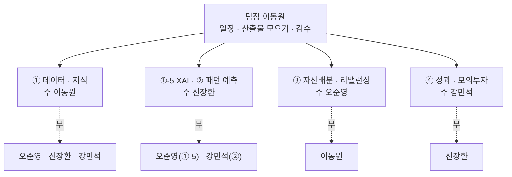
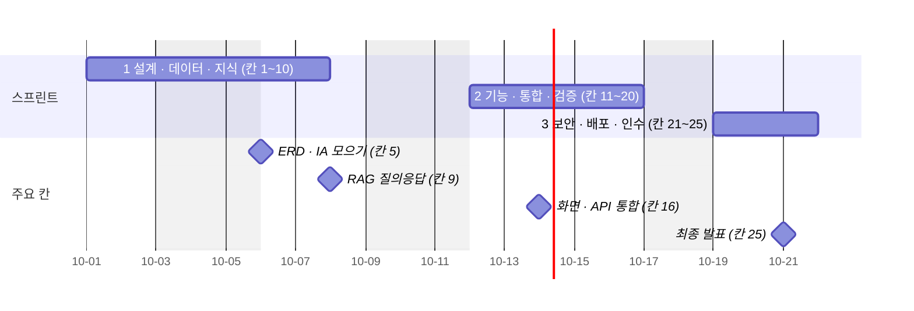

# 착수보고서 v0.1 — Qurious 2차 「나만의 로보 어드바이저 개발 및 성과 검증」

| 문서 정보 | |
|---|---|
| **판 · 상태** | v0.1 · 초안(검토 전) — 2차 착수(2026-10-01) 시점의 보고 |
| **구분** | 1. 착수·과업 정의 — 착수보고서 |
| **작성** | 초안 이동원(팀장) · 자기 목표 기능 줄 채우기와 판 올리기는 각 주담당 · 검수 이동원 |
| **검토** | 검토 전 |
| **최종 수정** | 2026-10-03 (KST) |
| **기준** | [프로젝트 계획서 v2.0](프로젝트계획서.md)(2026-10-01) · 착수 시점 실측(계획서 6절) · 코드 `main` `a9b3737`(10-01) |
| **관련 문서** | [계획서 v2.0](프로젝트계획서.md) · [WBS v0.1](WBS.md) · [스프린트 계획 v0.1](스프린트계획.md) · [이해관계자 목록 v0.1](이해관계자목록.md) · [산출물목록](../산출물목록.md) |
| **최근 개정** | 새 문서 |

> **이 문서로 알 수 있는 것**
> 1. 2차에서 무엇을 왜 만들고, 무엇을 만들지 않나?
> 2. 누가 무엇을 맡고, 어떤 차례 · 일정으로 진행하나?
> 3. 무엇을 산출물로 내고, 품질과 위험은 어떻게 관리하나?

## 요약

2차는 2026-10-01(목)에 착수해 10-21(수) 오전에 끝나는 반나절 25칸의 일정이다. 목표는 **자기 투자 규칙을 가진 개인투자자가 그 규칙을 믿어도 되는지 판단하게 돕는 로보 어드바이저**를 만들고, 비용까지 뺀 성과로 검증하는 것이다. 네 명이 목표 기능을 하나씩 맡아 각자 설계 → 산출물 → 코드 순서로 진행하고, 착수 시점에 일봉 447만 행 · 시험 367건 · API 189개 · 화면 54개가 준비돼 있었다.

---

## 1. 사업 개요

**<표 1> 사업 개요**

| 항목 | 내용 |
|---|---|
| 과제명 | 나만의 로보 어드바이저 개발 및 성과 검증(2차) · 나만의 투자 인디케이터 개발 및 성과 검증(3차) |
| 팀 · 제품 | 팀 Qurious · 제품 Qurious(AI Financial Quant Platform) |
| 기간 | 2차 2026-10-01(목) ~ 10-21(수) 오전 · 평일 13일(휴일 10-05 · 10-09) · 25칸 / 3차 10-22(목) ~ 11-11(수) · 30칸 |
| 배경 | 1차 발표에서 「누구에게, 무슨 목적으로 만든 것인지 불명확하다」 는 의견을 받았고, 비용을 뺀 성과 검정을 끝내지 못했다 |
| 목적 | 개인투자자가 자기 규칙을 믿어도 되는지 판단하게 돕는다 — 같은 데이터 · 같은 비용 · 같은 지표 정의 위에서 성과를 잰다 |
| 범위(2차) | 강사님 원문 세부 기능 14 · UI 필수 요소 5 · 제안요청서의 자산배분 · 스크리닝 8 · 일정표 요구 2 · 공통 비기능 4 |
| 하지 않는 것 | 실계좌 실거래 자동 주문 · 상용 서비스 운영 · 타인 자산 운용 · AWS 배포 필수화 · 유료 LLM · 뉴스 본문 저장 |

---

## 2. 추진 전략과 방법

| 전략 | 방법 |
|---|---|
| 기능마다 주인이 끝까지 | 목표 기능 하나에 주담당 한 명 · 부담당은 질문을 먼저 받는다 · 확인은 네 명 모두 |
| 설계 → 산출물 → 코드 | 주담당이 설계서 v0.1 을 먼저 쓰고, ERD · API · 화면 · 시험 칸을 채운 뒤 코드를 쓴다 |
| 같은 바닥 위에서 성과를 잰다 | 수집 DB 한 곳의 데이터 · 연도별 실제 비용 · 하나의 성과 정의 |
| 로컬에서 먼저 완성 | 각자 PC 에서 도커로 전부 돌린 뒤 배포 방식을 고른다 · 데이터는 비공개 데이터셋에 |
| 문서와 형상 | 산출물은 문서 작성 기준을 따른다 · 모든 변경은 PR · 문서 판은 작업마다 올린다 |

---

## 3. 추진 체계

팀의 체계는 <그림 1> 과 같다.

**<그림 1> 2차 추진 체계** · 범례: 실선 = 주담당 · 점선 = 부담당

**<표 2> 역할(2026-10-01 확정)**

| 사람 | 2차 주담당 | 2차 부담당 | 3차 주담당 |
|---|---|---|---|
| 이동원(팀장) | ① 세부 1 ~ 4(용어사전 · 투자 자료 수집 · 근거 RAG · 일정과 배치) | ③ | ③ TradingView · Pine |
| 신장환 | ①-5 XAI · ② 패턴 인식 예측 | ① · ④ | ① · ② 인디케이터 |
| 오준영 | ③ 자산배분 · 스크리닝 · 리밸런싱 | ①-5 | ⑤ 증권사 연동 |
| 강민석 | ④ 성과 해석 · 모의투자 | ① · ② | ④ LEAN 성과 검증 |

---

## 4. 추진 일정

2차는 스프린트 셋으로 나눠 진행한다. 일정의 큰 흐름은 <그림 2> 와 같다.

**<그림 2> 2차 일정** · 범례: 막대 = 스프린트 · ◆ = 강사님 칸

칸별 담당과 산출물은 [계획서 v2.0](프로젝트계획서.md) 5.1절 · [WBS](WBS.md) · [스프린트 계획](스프린트계획.md)에 있다.

---

## 5. 산출물 계획

강사님이 제시한 산출물 10구분마다 2차에 낼 주요 산출물과 착수 시점의 상태는 <표 3> 과 같다(현재 상태는 [산출물목록](../산출물목록.md)).

**<표 3> 산출물 계획** · 착수 시점 = 2026-10-01

| 구분 | 주요 산출물 | 착수 시점 | 낼 때 |
|---|---|---|---|
| 1 착수 | 계획서 · 이해관계자 목록 · 착수보고서 · 결정 대장 | 계획서 v2.0 | 칸 1 · 3 |
| 2 요구사항 | 요구 대장 · RTM · 유스케이스 · 인수 기준 | 요구 대장 59 · RTM v1.1 | 칸 2 |
| 3 일정 · 업무 | WBS · 스프린트 계획 · 주간보고 | 계획서 일정 절 | 칸 3 · 매주 |
| 4 화면 | IA · 와이어프레임 · UI 명세서 | IA · 와이어프레임 v0.4 | 칸 5 |
| 5 데이터 | ERD · 데이터 사전 · 코드 정의 | v1.3 | 칸 5 |
| 6 시스템 | 아키텍처 · 설계서 · 인프라 · 배포 구성도 · ADR | 아키텍처 그림 v2.0 · ADR 3 | 칸 4 |
| 7 인터페이스 | API 명세서 · 인터페이스 정의 | v0.1(146 → 189) | 칸 9 · 16 |
| 8 개발 · 형상 | 코딩 표준 · 코드 리뷰 기록 · 변경 이력 | — | 칸 6 |
| 9 시험 · 성과 | 테스트 계획 · 결과서 · 결함대장 · 백테스트 보고서 | 시험 367 · 결함 19+ | 칸 14 · 20 |
| 10 배포 · 운영 | 배포계획서 · 장애 대응 · 운영 매뉴얼 · 릴리스 노트 · 완료보고서 | 로컬 실행 안내서 | 칸 22 ~ 25 |

---

## 6. 품질 · 위험 관리

**품질** — 완료의 정의(전체 시험 · 새 시험 · 기능 점검 · 화면 확인 · 문서 · PR 과 기록)를 지킨 것만 「끝」 으로 본다. 문서는 문서 작성 기준을, 코드는 코딩 표준을 따른다.

**<표 4> 착수 시점의 주요 위험** · 전체는 계획서 8절

| 위험 | 대응 |
|---|---|
| ① 데이터 · 지식 칸 셋이 10-07 ~ 10-08 에 몰린다 | 데이터 → 관제 → 근거 색인 → 질의응답 순서 · 일정 · 뉴스는 그다음 주 |
| 로컬 언어 모델이 CPU 전용이라 느리다 | 근거를 먼저 보이고 답은 짧게 · 대량 임베딩만 외부 GPU |
| 법령 「현행」 판이 최신 개정을 놓칠 수 있다 | 시행일 판으로 받고 기준일에 맞는 판을 고른다 |
| 한 사람에게 담당이 몰린다 | 부담당 · 따라오는 칸 조정 |
| 1차의 주 성과 검정이 비어 있다 | 목표 기능 ④ 칸에서 비용을 뺀 성과로 |

---

## 7. 보고 · 협의 체계

| 무엇 | 언제 | 어디에 |
|---|---|---|
| 일일 스크럼(어제 · 오늘 · 막힌 것) | 매일 09:00 ~ 09:15 | 일일 기록(양식 제안) · 대화방 |
| 진행 · 위험 · 내일 계획 보고 | 매일 17:30 ~ 17:50 | 같은 곳 |
| 주간보고 | 매주 금요일 | `docs/회의/주간보고/` |
| 스프린트 리뷰 | 강사님 칸마다 | 시연 · 산출물 |
| 결정 · 논의 | 필요할 때 | GitHub 논의 · 이슈 · 결정 대장 |

---

## 8. 착수 시점 현황 (2026-10-01 실측)

| 항목 | 값 |
|---|---|
| 일봉 OHLCV | 4,477,927행 · 2020-01-02 ~ 2026-09-29 · 3,308종목(상장폐지 포함) |
| 수정주가 · 총수익 · 배당 | 각 4,477,927행 · 배당 9,189건 |
| 자동 갱신 | 매일 12:30 · 2026-09-30 회차 29분 · 9단계 성공 |
| 코드 | 커밋 128 · 머지된 PR 49 · 시험 367 · API 189 · 화면 54 |

---

## 부록 A. 만든 방법

- 내용은 계획서 v2.0(2026-10-01)에서 착수 보고에 필요한 것만 골라 실무 착수보고 목차(사업 개요 → 추진 전략 → 추진 체계 → 일정 → 산출물 계획 → 품질 · 위험 → 보고 체계)로 다시 엮었다([문서 작성 기준 v0.2](../문서기준/문서작성기준.md) 12.2절).
- 숫자는 계획서 6절의 착수 시점 실측을 그대로 썼다.

## 부록 B. 개정 이력

| 판 | 날짜 | 무엇이 바뀌었나 | 왜 | 근거 |
|---|---|---|---|---|
| v0.1 | 2026-10-03 | 추가 — 새 문서(사업 개요 · 추진 전략 · 추진 체계 · 일정 · 산출물 계획 · 품질 · 위험 · 보고 체계 · 착수 시점 현황) | 강사님 산출물 표 1구분 「착수보고서」 가 계획서가 겸하는 것으로만 있었다 | 계획서 v2.0 |
