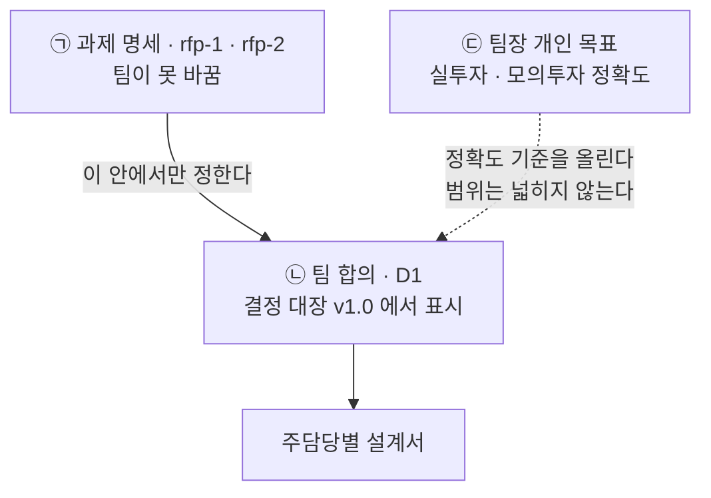
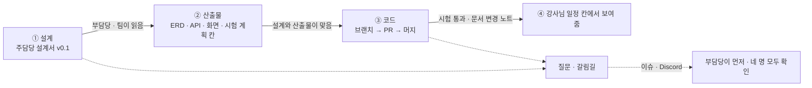
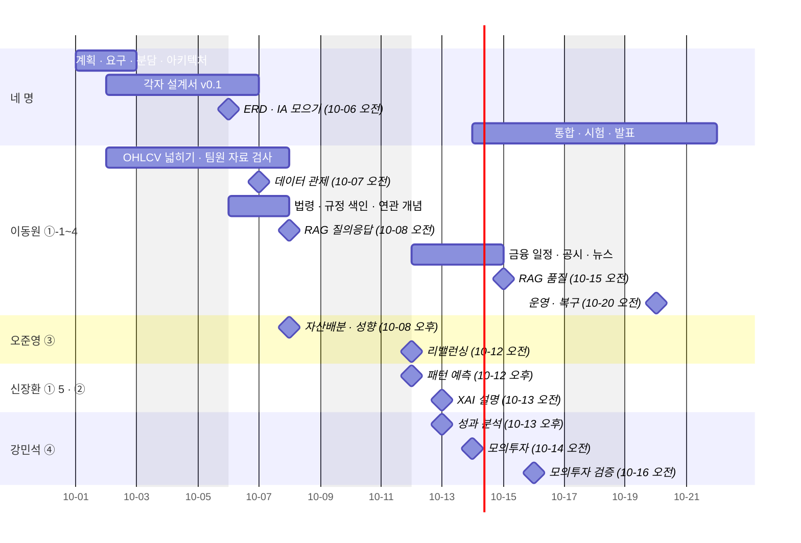

# 프로젝트 계획서 v2.0 — Qurious

| 문서 정보 | |
|---|---|
| **판 · 상태** | v2.0 · 초안(검토 전) — 4절 역할 표는 팀이 2026-10-01 에 정한 것을 옮겼다 |
| **구분** | 1. 착수·과업 정의 — 프로젝트 계획서(사업수행계획서의 범위 · 조직 · 일정 · 위험) |
| **작성** | 이동원(팀장 · 2차 목표 기능 ① 세부 1~4 주담당) |
| **검토** | 검토 전 — 판을 올리는 PR 에 팀원 한 명 이상의 「읽었음」 을 받는다 |
| **최종 수정** | 2026-10-01 (KST) |
| **기준** | 코드 `main` `a9b3737` · 수집 데이터 기준일 2026-09-29(시세) · 숫자는 2026-10-01 에 다시 쟀다(부록 B) |
| **관련 문서** | [목표 기능 ① 상세 설계서 v0.1](../설계/지난판/목표기능1-데이터지식-설계_v0.1.md) · [RTM v1.1](../요구사항/지난판/RTM_v1.1.md) · [기능 설계서 v0.1](../설계/기능설계.md) · [논의 결정 대장 v0.9](지난판/논의결정대장_v0.9.md) · [산출물목록](../산출물목록.md) · [문서 작성 기준 v0.1](../문서기준/지난판/문서작성기준_v0.1.md) |
| **최근 개정** | v1.2 → v2.0: 2차 착수 — 역할 확정 · 일하는 방식 · 25칸 담당 · 데이터 출처 정책 · RAG 근거 범위 · 문서 작성 기준 틀 (부록 D) |

> **이 문서가 답하는 질문**
> 1. 2차(10-01~10-21)에 누가 무엇을 맡고, 어떤 순서로 일하나?
> 2. 무엇을 만들고(목표), 무엇을 하지 않나(비목표)?
> 3. 강사님 일정 25칸마다 어떤 산출물을 누가 내나?
> 4. 무엇이 위험하고, 무엇이 바뀌면 이 계획을 다시 쓰나?
>
> **읽는 순서** — 팀원: 4절 역할 → 5절 일정 → 2절 목표 · 비목표 · 강사님: 1절 본표 → 4절 → 5절 → 8절 위험 · 처음 온 사람: 요약 → 1절 → 부록 A 용어
>
> **확실도** — 🟢 저장소 · 데이터 · 공식 원문에서 직접 확인 / 🟡 추정이거나 팀 확인 전 / 🔴 없거나 검증 안 됨

## 요약

1. 2차 「나만의 로보 어드바이저 개발 및 성과 검증」은 2026-10-01(목)에 시작해 10-21(수) 오전에 끝난다 — 반나절 25칸이다. 3차 「나만의 투자 인디케이터」는 10-22(목)~11-11(수) 30칸이다.
2. 역할은 2026-10-01 팀이 정했다. 2차는 **목표 기능 ① 세부 1~4(용어 · 수집 · RAG · 일정과 배치) 이동원 · ①-5 XAI 와 ② 패턴 예측 신장환 · ③ 자산배분 오준영 · ④ 성과와 모의투자 강민석**이다. 주담당은 자기 몫을 **설계 → 산출물 → 코드** 순서로 하고, 부담당은 질문을 먼저 받지만 확인은 네 명 모두 한다.
3. 재료는 갖춰져 있다 — 전 종목 일봉 OHLCV 4,477,927행(2020-01-02~2026-09-29) · 배당 9,189건 · 수정주가 · 총수익 · 벤치마크 12계열이 매일 12:30 에 자동으로 갱신된다. 앱은 시험 367건 · API 189개 · 화면 54개다.
4. 이번 판에서 방법이 셋 바뀌었다 — ① 데이터는 비공개(HF private)로 두면 출처를 가리지 않는다(강사님 확인) ② RAG 의 근거는 2026년에 시행 중인 법령 · 감독규정 · 협회 기준 · 공시 · 뉴스다(강사님 보충 설명) ③ AWS 는 로컬에서 다 만든 뒤 고른다.
5. 3차는 역할만 정했고, 2차에 집중한다.

---

## 1. 계획서 본표

강사님 배포 양식(`프로젝트계획서양식_AI퀀트예시.docx`)의 9행 3열(구분 · 내용 · 비고)을 따른다. 양식 원본은 강의자료라 저장소에 커밋하지 않고, 제출용 `.docx` 는 이 문서에서 스크립트로 만든다(부록 B).

**표 1. 계획서 본표**

| 구분 | 내용 | 비고 |
|---|---|---|
| **팀명** | **Qurious** | 1차부터 쓰던 팀명이다. 1차 프로젝트명은 `Alpha_Stack` 이었다 🟢 |
| **팀원(역할)** | **이동원**(팀장) — 2차 목표 기능 ① 세부 1~4(용어사전 · 투자 자료 수집 · 근거 RAG · 일정과 정기 배치) 주담당 · ③ 부담당 · 3차 ③ TradingView 주담당<br>**신장환** — 2차 ①-5 XAI · ② 패턴 인식 예측 주담당 · ④ 부담당 · 3차 ① · ② 인디케이터 주담당<br>**오준영** — 2차 ③ 자산배분 · 스크리닝 · 리밸런싱 주담당 · ①-5 부담당 · 3차 ⑤ 증권사 연동 주담당<br>**강민석** — 2차 ④ 성과 해석 · 모의투자 주담당 · ② 부담당 · 3차 ④ LEAN 성과 검증 주담당 | 🟢 **확정(2026-10-01 · 팀)**. 전체 표는 4절이다.<br>부담당은 형식상 지정이고 **확인은 네 명 모두** 한다 |
| **기간** | **2차 2026-10-01(목) ~ 10-21(수) 오전** — 평일 13일(휴일 10-05 · 10-09) · 반나절 **25칸** × 4시간 = 개인 100시간<br>**3차 2026-10-22(목) ~ 11-11(수)** — 평일 15일 · **30칸** = 개인 120시간 | 🟢 강사님 공식 일정(강의 사이트 일정표 `day4-project-schedule.js`).<br>🟡 발표일은 추정이다 — 마지막 칸(2차 10-21 오전 · 3차 11-11 오후)의 산출물이 「최종 발표자료」다 |
| **프로젝트 명** | **2차 — 나만의 로보 어드바이저 개발 및 성과 검증**<br>**3차 — 나만의 투자 인디케이터 개발 및 성과 검증** | 과제 명세의 제목을 그대로 쓴다([rfp-1](../rfp-1.md) · [rfp-2](../rfp-2.md)). 제품 이름은 Qurious 다 |
| **주제 선정 이유** | ㉮ 1차 발표에서 **「누구에게, 무슨 목적으로 만든 것인지 불명확하다」** 는 피드백을 받았다.<br>㉯ 1차는 스스로 정한 주 지표(비용 반영 ΔSharpe)를 재지 못해 결론이 닫히지 않았다.<br>㉰ 그래서 2차는 「누구의 어떤 문제인가」 를 먼저 정하고, 성과를 **비용까지 빼고** 재는 장치 위에 로보 어드바이저를 올린다.<br>㉱ 개인 주식 소유자 1,442만 명 중 459만 명(31.5%)이 한 종목만 보유하고, 2020~2022년 표본에서 순수익률이 양(+)인 비율은 국내 28% 였다 — 문제는 종목 고르기보다 **자기 규칙을 믿어도 되는지 판단할 방법이 없는 것**에 가깝다 | 외부 수치 출처: 한국예탁결제원 · 한국은행 · 자본시장연구원(2026-04) — [D1 기록 §2.3](../github-archive/2026-09-15/논의-007/00-기록.md) 🟢 |
| **프로젝트 목표** | **㉠ 과제 명세(고정)** — 로보 어드바이저를 직접 개발하고 성과를 검증하는 역량. 평가 기준은 재현성 · 로직 타당성 · 검증 충실도 · 해석의 논리성<br>**㉡ 팀 합의** — 「자기 투자 규칙을 가진 개인투자자가 그 규칙을 믿어도 되는지 판단하게 돕는다」(D1 추천안)<br>**㉢ 팀장 개인 목표** — 실제 투자나 모의투자에 그대로 쓸 수 있는 정확도 | 셋을 섞지 않는다(2.4절).<br>🟡 ㉡ 의 의견 기한(09-30 23:59)이 지났다 — 확정 표시는 [결정 대장](지난판/논의결정대장_v0.9.md) v1.0 에서 한다. 이 판은 v0.9 기준이다 |
| **분석 방법** | ① **수집** — 공공데이터포털 전 종목 일봉(원문 보관 → 정규화) + **OHLCV 넓히기**: ETF · 지수 일봉 · 주봉(일봉에서 계산) · 분봉(1 · 5 · 60분). 팀원이 모은 자료도 같은 규격이면 검사 · 정제해 쓴다<br>② **수정주가 · 배당 · 총수익(TR) · 벤치마크** — 전일대비 금액으로 조정계수를 역산하고, 배당은 공시 본문에서 읽는다<br>③ **지식** — 2026년 시행 법령 · 감독규정 · 협회 기준(국가법령정보센터 Open API 의 시행일 판) + 공시(DART) + 뉴스를 조문 · 문단 단위로 색인해, 답마다 출처 번호를 단다<br>④ **일정 · 배치** — 배당 · 휴장 · 파생 만기 · 금통위 · 실적 일정과 데이터 갱신일 · 문서 판을 하루 한 번 갱신해 화면에 보인다<br>⑤ **매매비용** — 수수료 · 증권거래세 · 농특세를 연도별 법령 세율로(2026년 = 대통령령 제36001호)<br>⑥ **지표 · 패턴 · 신호**(신장환) ⑦ **자산배분 · 스크리닝 · 리밸런싱**(오준영) ⑧ **성과 · 모의투자**(강민석) ⑨ **XAI** — 쉬운 말과 시각 자료로 먼저, SHAP 은 그다음(신장환) | ① 일봉 · ② · ⑤ 는 **돌아가는 상태** 🟢<br>① 넓히기 · ③ · ④ 는 [목표 기능 ① 상세 설계서 v0.1](../설계/지난판/목표기능1-데이터지식-설계_v0.1.md) 🟡<br>⑥~⑨ 는 각 주담당이 설계서를 쓴다(4.1절)<br>데이터 출처 정책은 7절 |
| **예상 산출물** | **① 이미 있는 것** — 수집기(5,456줄) · 일봉 · 수정주가 · TR 각 4,477,927행 · 배당 9,189건 · 벤치마크 19,848행 · 용어 755개 · 시험 367건 · API 189개 · 화면 54개 · 매일 12:30 자동 갱신 · HF private 데이터셋<br>**② 2차에 만들 것** — 주담당별 설계서 · OHLCV 공통 규격과 데이터셋 · 근거 RAG · 금융 일정 · 패턴 예측 · 자산배분과 리밸런싱 · 비용 차감 성과 보고서 · 모의투자 일지 · XAI 설명 · 최종 발표자료<br>**③ 지금 비어 있는 것** 🔴 — 1차 주 검정 · ETF · 분봉 · 근거 문서 색인 · 리밸런싱 엔진 · 모의투자 일지 | 수치는 6절의 실측이다 🟢<br>강사님 산출물 10구분의 칸별 상태는 [산출물목록](../산출물목록.md) |
| **비고** | 저장소 [EST-team-project/Qurious](https://github.com/EST-team-project/Qurious) (공개 · GitLab 미러) · 커밋 128 · 머지된 PR 49 · TIL 42장<br>모든 설계 결정은 이슈 · 논의 · 결정 대장에 근거와 함께 남긴다 | 원자료 · 파케이는 공개 저장소에 커밋하지 않는다(7절) |

---

## 2. 배경 · 목표 · 비목표

### 2.1 배경

1차(Alpha_Stack)는 모델과 백테스트를 만들었지만, 발표에서 「누구의 어떤 문제를 푸는가」 를 답하지 못했고 비용을 뺀 성과 검정을 끝내지 못했다. 2차는 강사님 요구 14개 세부 기능(목표 기능 ①~④)과 UI 필수 요소 5개를 갖춘 로보 어드바이저를 만들되, **같은 데이터 · 같은 비용 · 같은 지표 정의** 위에서 성과를 재는 것을 바닥으로 삼는다.

### 2.2 목표 — 이번 차수에 하는 것

표 2 는 「목표 기능마다 무엇이 되면 끝인가」 에 답한다. 인수 기준의 자세한 줄은 각 주담당의 설계서에 둔다.

**표 2. 2차 목표와 끝난 모습**

| 목표 기능 | 주담당 | 끝난 모습 (요지) |
|---|---|---|
| ① AI 로보 어드바이저 — 데이터 · 지식 (세부 1~4) | 이동원 | 화면의 용어를 누르면 뜻과 연관 개념이 나온다 · 일봉 · 주봉 · 분봉 · ETF · 지수가 한 규격으로 쌓이고 팀원 자료도 검사해 받는다 · 질문에 2026년 시행 법령 · 규정 · 공시 · 뉴스를 근거 번호와 함께 답한다 · 배당일 등 금융 일정과 데이터 갱신일이 매일 갱신돼 화면에 보인다 |
| ① AI 로보 어드바이저 — XAI (세부 5) | 신장환 | 추천 이유를 차트 · 표와 쉬운 말로 설명한다(XAI 가 어려우면 이것을 먼저 · 강사님 권장) · 모델이 생기면 SHAP 기여도를 더한다 |
| ② 패턴 인식 예측 | 신장환 | 같은 정의의 지표(이동평균 · RSI · MACD · 볼린저 · 거래량) · 차트 패턴 탐지 · 분봉 · 일봉 · 주봉을 묶은 매수 · 매도 · 관망 신호와 신뢰도 |
| ③ 자산배분 · 스크리닝 | 오준영 | 시간 · 이탈률 · 현금흐름 기반 리밸런싱 · 포트폴리오 최적화와 스크리닝(제안요청서 8항목) |
| ④ 결과 해석 · 모의투자 | 강민석 | 거래비용 · 슬리피지를 뺀 수익률 · MDD · 샤프 · 신호를 매수 · 매도 · 보유 의견으로 · 모의 주문과 운용 |

### 2.3 비목표 — 하지 않는 것

| 하지 않는 것 | 까닭 | 근거 |
|---|---|---|
| 실제 증권 계좌로 실거래 자동 주문 | 제안요청서 제외 범위 · 서버가 실거래 경로를 막고 있다 | `RFP2-4.2-①` · ADR-0001 |
| 상용 서비스로 배포 · 운영 · 타인 자산 운용 | 제안요청서 제외 범위 | `RFP2-4.2-②③` |
| AWS 배포를 필수로 두기 | 로컬에서 다 만든 뒤 고른다 — 안 할 수도 있다 | 2026-10-01 사용자 · [기능 설계서](../설계/기능설계.md) 8절 대체표 |
| 유료 LLM API | 비용 합의 전 · 로컬 Ollama 로 만든다 | D2 ③ |
| 뉴스 본문을 저장 · 재배포 | 기사는 저작물이다 — 제목 · 요약 · 주소만 쓴다(설계서에서 팀이 정할 갈림길) | 저작권법 제7조 · 설계서 💬 |
| 3차 기능 구현 | 2차에 집중한다 — 3차는 역할만 정했다 | 2026-10-01 팀 |

### 2.4 목표가 세 층인 까닭

「우리 목표」 라는 말 하나에 성격이 다른 셋이 들어 있다. 그림 1 은 「누가 무엇을 바꿀 수 있나」 에 답한다.

**그림 1. 목표의 세 층** · 범례: 실선 = 제약, 점선 = 영향



결론은 글에도 적는다 — ㉢ 은 데이터 정확도(배당락일 검증 · 법령 세율 대조)를 올리는 근거일 뿐 화면이나 기능을 늘리는 근거가 아니다. 강사님 피드백이 「넓게보다 깊게」 였다.

---

## 3. 범위

표 3 은 「요구 몇 개가 이번 차수에 들어오고 무엇이 빠지나」 에 답한다. 요구 ID 는 [RTM v1.1](../요구사항/지난판/RTM_v1.1.md) 과 [요구 대장](../요구사항/대장/요구-대장.tsv)의 것이다.

**표 3. 범위 — 포함과 제외**

| 묶음 | 요구 | 수 | 2차 | 비고 |
|---|---|:-:|:-:|---|
| 강사님 원문 세부 기능 (2차) | `P01-①-1` ~ `P01-④-3` | 14 | ✅ | 4절 역할 표 |
| UI 필수 요소 (2차) | `U1` ~ `U5` | 5 | ✅ | 주담당은 4.4절 제안 |
| 목표 기능 ③ 머리글이 받는 제안요청서 요구 | `RFP2-3.1.3-①~④` · `RFP2-3.1.4-①~④` | 8 | ✅ | ③ 주담당 · 요구로 셀지는 RTM 7절 ① |
| 공식 일정표에서 온 요구 | `SCH-STR` · `SCH-DQ` | 2 | ✅ | 4.4절 |
| 비기능 (공통) | `RFP2-3.2-①~④` | 4 | ✅ | 공개 데이터 · Python 3.10+ · 재현성 · 문서화 |
| 제외 범위 | `RFP2-4.2-①~③` | 3 | ⛔ | 2.3절 |
| 3차 | `P02-*` 15 · `U6`~`U10` · `SCH-ROB` · `SCH-ORD` · `SCH-RT` | 23 | — | 10-22 착수 · 역할만(4.3절) |

---

## 4. 조직 · 역할 — 2026-10-01 확정

### 4.1 일하는 방식

표 4 는 「주담당과 부담당은 무엇이 다른가」 에 답한다.

**표 4. 주담당 · 부담당**

| | 주담당 | 부담당 |
|---|---|---|
| 하는 일 | 그 기능의 **설계 → 산출물 → 코드**를 끝까지 맡는다 | 주담당이 헷갈리거나 의견을 묻는 이슈 · 질문을 **먼저** 받아 확인한다 |
| 산출물 | 그 기능의 설계서(문서 작성 기준 5.6 틀) · 시험 · 해당 산출물 칸 | 판을 올리는 PR 에 「읽었음」 한 줄(머지를 막지 않는다) |
| 비고 | 주담당인 부분만 **확실하게** 설계한다 — 남의 칸을 대신 설계하지 않는다 | 형식상 지정이다. **확인은 네 명 모두** 한다 |

그림 2 는 「한 기능이 어떤 순서로 진행되나」 에 답한다.

**그림 2. 주담당의 작업 순서** · 범례: 상자 = 단계, 화살표 위 글 = 넘어가는 조건



결론: 코드는 설계서와 그 기능의 산출물 칸이 생긴 뒤에 쓴다. 설계서의 본보기는 [목표 기능 ① 상세 설계서 v0.1](../설계/지난판/목표기능1-데이터지식-설계_v0.1.md)이다 — 다른 주담당도 같은 틀(맥락 · 목표와 비목표 · 지금 상태 · 설계 · 대안 · 뒤집을 조건)을 쓰면 서로 읽기 쉽다(제안).

### 4.2 2차 역할 — 나만의 로보 어드바이저

**표 5. 2차 역할 (확정)**

| 목표 기능 | 세부 기능 | 요구 ID | 주담당 | 부담당 | 강사님 보충 설명 |
|---|---|---|:-:|:-:|---|
| ① AI 기반 자동화 로보 어드바이저 모델 | 1 용어사전과 연관 개념 탐색 | `P01-①-1` | 이동원 | 오준영 · 신장환 · 강민석 | — |
| | 2 가격 · 거래량 · 재무 · 뉴스 수집 · 분류 · 전처리 · 검색 | `P01-①-2` | 이동원 | 오준영 · 신장환 · 강민석 | OHLCV 를 모아 HF Organization 에 private 데이터셋으로 두고, 지금 데이터와 비교해 구조를 맞춰 써도 된다 |
| | 3 근거 문서와 출처를 포함한 RAG 질의응답 | `P01-①-3` | 이동원 | 오준영 · 신장환 · 강민석 | 근거 · 출처는 **실제 업종의 외부 기준이나 법률**이다 — 실제 자료를 모으고 **2026년 기준**으로 판단한다 |
| | 4 갱신일 · 문서 판 · 캘린더 일정 · 정기 배치 | `P01-①-4` | 이동원 | 오준영 · 신장환 · 강민석 | (팀) 배당일 같은 실제 금융 정보를 가져와 보여 준다 — 실시간이 아니어도 하루 한 번 갱신 |
| | 5 XAI 로 추천 이유를 쉬운 말로 | `P01-①-5` | 신장환 | 오준영 | XAI 가 어려우면 실제 분석 결과를 차트 · 표와 AI 같지 않은 쉬운 말로 먼저 설명하고, 그다음 XAI 로 넘어간다 |
| ② 패턴 인식 주식 시장 예측 | 1~3 지표 · 차트 패턴 · 다중 주기 신호 | `P01-②-1~3` | 신장환 | 강민석 | — |
| ③ 자산배분 · 포트폴리오 최적화 · 스크리닝 | 1~3 시간 · 이탈률 · 현금흐름 리밸런싱 (+ 머리글 8항목) | `P01-③-1~3` | 오준영 | 이동원 | — |
| ④ 퀀트 모델 결과 해석 · 모의 투자 의사결정 | 1~3 비용 반영 성과 · 의견 변환 · 모의 주문 | `P01-④-1~3` | 강민석 | 신장환 | — |

### 4.3 3차 역할 — 나만의 투자 인디케이터

**표 6. 3차 역할 (확정 · 구현은 10-22 부터)**

| 목표 기능 | 요구 ID | 주담당 | 부담당 |
|---|---|:-:|:-:|
| ① 기본 인디케이터 전략 설계 · ② 커스텀 인디케이터 | `P02-①-1~3` · `P02-②-1~3` | 신장환 | 강민석 |
| ③ TradingView · Pine Script 성과 확인 | `P02-③-1~3` | 이동원 | 강민석 |
| ④ QuantConnect LEAN 성과 검증 | `P02-④-1~3` | 강민석 | 오준영 |
| ⑤ 증권사 API 연동 자동화 | `P02-⑤-1~3` | 오준영 | 강민석 |

### 4.4 따라오는 칸 — 제안 (팀 확인 필요)

강사님 원문의 세부 기능 말고도 주인이 필요한 칸이 있다 — 여러 기능이 함께 쓰는 공통 부품 C1~C6, UI 필수 요소 U1~U10, 공식 일정표 요구 SCH-*. 표 7 은 「그 칸을 어느 주담당에게 붙이면 자연스러운가」 에 대한 **제안**이다. 사람 이름은 4.2 · 4.3 절의 확정에서 따라온 것이고, 팀이 바꿀 수 있다.

**표 7. 따라오는 칸 (제안)**

| 칸 | 무엇 | 제안 | 따라온 까닭 |
|---|---|:-:|---|
| C1 데이터 관문 | 앱이 시세를 수집 DB 하나로 읽고 기준일을 싣는다 | 이동원 | `P01-①-2` |
| C2 지표 정의 한 곳 | RSI · 이동평균 · 볼린저 · MACD · ATR 한 모듈 | 신장환 | `P01-②-1` |
| C3 비용 모델 · C4 검증 엔진 · 성과 정의 | 수수료 · 세금 · 슬리피지 · 샤프 · 승률 · MDD 한 정의 | 강민석 | `P01-④-1` |
| C5 모의투자 장부 · 일지 | 매 거래일 1행 일지 | 강민석 | `P01-④-3` |
| C6 위험 관문 | 중복 주문 · 손실 한도 · 비상 정지 | 2차 강민석 · 3차 오준영 | `P01-④-3` · `P02-⑤-2` — 💬 한 사람으로 모을지 |
| U1 투자성향진단 · U2 시각적 포트폴리오 · U5 리밸런싱 | 설문 → 성향 → 목표 비중 · 비중 그림 · 리밸런싱 화면 | 오준영 | 목표 기능 ③ (강사님 칸 10-08 오후 「성향 · 자산배분」) |
| U3 시뮬레이션 · U4 목표 수익률 모의 | 과거 구간 수익 분포 · 목표 달성 확률 | 강민석 | 목표 기능 ④ — 💬 U4 는 ③ 과도 닿는다 |
| U6 전략 설정 · U7 지표 차트 | 3차 | 신장환 | `P02-①` · `P02-②` |
| U8 백테스트 · U9 성과 대시보드 | 3차 · 2차 성과 화면 | 강민석 | `P01-④` · `P02-④` |
| U10 자동매매 모니터링 | 3차 | 오준영 | `P02-⑤` |
| SCH-DQ 데이터 품질 | 결측 · 중복 · 정합성 | 이동원 | `P01-①-2` |
| SCH-STR 스트레스 검증 | 급락 · 금리 · 환율 시나리오 (10-15 오후 칸) | 오준영 · 강민석 | 배분 강건성(③) · 손실 한도(④) — 💬 |
| SCH-ROB · SCH-ORD · SCH-RT | 강건성 · 주문 정정 · 실시간 엔진 (3차) | 강민석 · 오준영 · 신장환 | `P02-④` · `P02-⑤` · `P02-②-2` |
| 문서 — IA · 와이어프레임 · ERD 통합본 · 산출물목록 | 각자 칸을 쓰고 한 문서로 모은다 | 이동원(모으기) | 지금까지의 작성자 · 각 기능 화면 · 표는 주담당이 쓴다 |
| 문서 — 발표 자료 | 2차 10-21 오전 | 네 명 모두 | 각자 자기 기능 장표 |

### 4.5 사람별 한눈 표

표 8 은 「한 사람이 2차에 무엇을 몇 개 지나」 에 답한다(따라오는 칸 제외).

**표 8. 사람별 담당 수**

| 사람 | 2차 주담당 | 2차 부담당 | 3차 주담당 | 3차 부담당 |
|---|---|---|---|---|
| 이동원 | `P01-①-1~4` (4) | ③ (3 + 머리글 8) | ③ (3) | — |
| 신장환 | `P01-①-5` · ② (4) | ①-1~4 · ④ (7) | ① · ② (6) | — |
| 오준영 | ③ (3 + 머리글 8) | ①-1~5 (5) | ⑤ (3) | ④ (3) |
| 강민석 | ④ (3) | ①-1~4 · ② (7) | ④ (3) | ① · ② · ③ · ⑤ (12) |

### 4.6 강사님 일정표의 네 역할과의 관계

강사님 일정표는 칸마다 네 역할(① 금융 Product Owner ② PM · 아키텍처 ③ 데이터 · 퀀트 · SA ④ 풀스택)의 산출물을 나란히 둔다. 우리는 역할 대신 **기능별 주담당**으로 나눴다 — 칸의 주제가 한 기능이면 그 주담당이 네 역할의 산출물을 함께 진다(5.1절 「우리 주담당」 칸). 공통 칸(착수 · 요구 · 분담 · 아키텍처 · 데이터 · 화면 설계 · 개발 기반 · 통합 · 시험 · 인수)은 네 명이 자기 기능 몫을 낸다.

---

## 5. 일정 · 산출물 계획

### 5.1 2차 25칸

표 9 는 「반나절 칸마다 강사님이 무엇을 보고, 우리 쪽 누가 무엇을 내나」 에 답한다. 날짜는 강사님 일정표의 달력 규칙(주말 · 10-05 · 10-09 휴일 제외 · 10-21 오후 제외)으로 계산했다(부록 B).

**표 9. 2차 일정 — 강사님 25칸과 우리 담당**

| 칸 | 날짜 | 강사님 단계 | 그 칸의 산출물(네 역할) | 우리 주담당 | 우리 산출물 · 상태 |
|:-:|---|---|---|---|---|
| 1 | 10-01(목) 오전 | 착수 · 범위 | 과업지시서 · 헌장 · 기술 · 데이터 인벤토리 · 퀀트 KPI · 칸반 | 네 명 | **이 계획서 v2.0** · 역할 확정 🟢 |
| 2 | 10-01(목) 오후 | 요구사항 | 요구사항정의서 · 데이터 소스 목록 · 모델 평가기준 · 사용자 스토리 맵 | 네 명 | RTM v1.1 · 요구 대장 59 · 담당 칸 🟢 · 데이터 소스 목록 = 설계서 3절 |
| 3 | 10-02(금) 오전 | 일정 · 분담 | WBS · 위험대장 · 인터페이스 작업계획 · 실험계획 · 스프린트 | 네 명 | 이 문서 5 · 8절 · 주담당 설계서 착수 |
| 4 | 10-02(금) 오후 | 아키텍처 | 시스템 아키텍처 · ADR · 데이터/API 구성도 · AI · 분석 아키텍처 · 배포 아키텍처 | 네 명 | 기능별 동작 원리서 v0.1 · 설계서 4절(자료 흐름) |
| 5 | 10-06(화) 오전 | 데이터 · 화면 설계 | 보안 · 데이터 정책 · **ERD · 데이터 사전** · 피처 · 지표 사전 · **IA · 와이어프레임** | 네 명 (모으기 이동원) | ERD · 사전 v1.3 · IA · 와이어프레임 v0.4 — 각 주담당의 새 표 · 화면을 모은다 |
| 6 | 10-06(화) 오후 | 개발 기반 | 개발 표준 · DoD · 백엔드 · 퀀트 스캐폴드 · UI 골격 · CI | 네 명 | 문서 작성 기준 · 로컬 실행 스크립트 · 시험 367 🟢 |
| 7 | 10-07(수) 오전 | 금융 데이터 수집 | 수집 인수 기준 · 수집 · 전처리 파이프라인 · 데이터 품질 규칙 · 데이터 관제 화면 | **이동원** | OHLCV 넓히기 · 팀원 자료 검사 · 데이터 상태 API · 관제 화면 |
| 8 | 10-07(수) 오후 | RAG 지식 구축 | 용어 · 문서 분류체계 · VectorDB 인덱스 · 검색 평가셋 · 지식 검색 UI | **이동원** | 법령 · 규정 수집과 색인 · 용어 연관 개념 · 검색 평가셋 |
| 9 | 10-08(목) 오전 | RAG 질의응답 | RAG 응답 정책 · RAG API · 프롬프트 · 평가 · RAG 대화 화면 | **이동원** | 출처 번호가 달린 답 · 답변 정책 |
| 10 | 10-08(목) 오후 | 성향 · 자산배분 | 성향진단 규칙 · 프로필 · 포트폴리오 API · 자산배분 모델 · 성향진단 · 배분 화면 | **오준영** | ③ 설계서 · U1 · U2 |
| 11 | 10-12(월) 오전 | 리밸런싱 | 리밸런싱 정책 · 서비스 · 알고리즘 시험 · 리밸런싱 UI | **오준영** | `P01-③-1~3` · U5 |
| 12 | 10-12(월) 오후 | 패턴 예측 | 모델 거버넌스 · OHLCV 피처 파이프라인 · 패턴 모델 학습 · 검증 · 패턴 시각화 | **신장환** | `P01-②-1~3` (OHLCV 는 이동원의 공통 규격을 받는다) |
| 13 | 10-13(화) 오전 | XAI 설명 | 설명 가능성 기준 · XAI API · SHAP 모듈 · XAI 설명 UI | **신장환** | `P01-①-5` — 쉬운 설명 먼저 |
| 14 | 10-13(화) 오후 | 성과 분석 | 성과평가 기준 · 성과 데이터마트 · 성과지표 계산서 · 성과 대시보드 | **강민석** | `P01-④-1` · U9 |
| 15 | 10-14(수) 오전 | 모의투자 | 모의투자 위험정책 · 모의주문 엔진 · 신호 변환 규칙 · 모의투자 화면 | **강민석** | `P01-④-2~3` · C5 일지 |
| 16 | 10-14(수) 오후 | 화면 · API 통합 | 통합 시나리오 · 통합 API 빌드 · 계산 검증표 · 통합 화면 | 네 명 | 주 경로 하나로 잇기 |
| 17 | 10-15(목) 오전 | RAG 품질 검증 | 답변 안전 기준 · RAG 평가 파이프라인 · RAG 품질 보고서 · RAG UI 시험서 | **이동원** | 검색 평가셋으로 재기 · 오답 · 근거 표시 회귀 시험 |
| 18 | 10-15(목) 오후 | 스트레스 검증 | 스트레스 시나리오 · 실행 서비스 · 분석서 · 위험 리포트 | 오준영 · 강민석 (💬) | `SCH-STR` |
| 19 | 10-16(금) 오전 | 모의투자 검증 | 통제 체크리스트 · 모의거래 시험서 · 전략 검증 결과 · 사용성 시험 | **강민석** | 일지 거래일 5일 안팎 🟡 |
| 20 | 10-16(금) 오후 | 단위 · 통합 시험 | 결함대장 · 백엔드 · 분석 · QA 결과 | 네 명 | 테스트 계획서 v1.4 |
| 21 | 10-19(월) 오전 | 보안 · 성능 | 보안 점검표 · 보안 · 성능 시험 · 성능 · 비용 보고 | 네 명 | — |
| 22 | 10-19(월) 오후 | AWS 배포 | 배포 계획 · 운영 배포본 · 이관 · CI/CD | 네 명 | 로컬 배포본(대체) — AWS 는 선택 |
| 23 | 10-20(화) 오전 | 운영 · 복구 | 운영 · DR 계획 · 복구 시험 · 관제 기준 · 운영 관제 화면 | **이동원** | 일일 배치 상태 · HF 복원 리허설 · 관제 화면 |
| 24 | 10-20(화) 오후 | UAT · 파일럿 | UAT 결과 · 수정 빌드 · 재검증 · 파일럿 결과 | 네 명 | — |
| 25 | 10-21(수) 오전 | 인수 · 지식이전 | 완료보고 · 인수인계 · 모델 카드 · 성과보고서 · **최종 발표자료** | 네 명 | 발표 🟡 |

### 5.2 주담당별 2차 흐름

그림 3 은 「주담당마다 무엇이 언제 보여야 하나」 에 답한다. 막대는 작업 기간의 **제안**이고, ◆ 는 강사님 칸(보여 주는 날)이다. 이동원 줄은 [설계서](../설계/지난판/목표기능1-데이터지식-설계_v0.1.md) 10절의 순서이고, 다른 줄은 각 주담당이 설계서에서 고친다.

**그림 3. 2차 주담당별 흐름 (제안)** · 범례: 막대 = 작업, ◆ = 강사님 칸



결론: 이동원 몫은 10-07~10-08 에 강사님 칸 세 개가 몰린다. 그래서 설계서의 순서는 **데이터(OHLCV) → 관제 → 근거 색인 → 질의응답**이고, 일정 · 공시 · 뉴스는 그 뒤(10-12 주)로 둔다. 다른 주담당은 10-06 오전 칸(ERD · IA) 전에 자기 설계서 v0.1 을 두면 표와 화면을 한 번에 모을 수 있다(제안).

### 5.3 3차 — 개요

3차는 10-22(목)에 착수하고, IA · 와이어프레임 칸이 10-26(월) 오전, 최종 발표가 11-11(수) 오후다. 이동원의 3차 주담당(③ TradingView · Pine Script)은 강사님 칸 「TradingView」 · 「Pine 교차검증」 에 닿는다. 3차 설계는 2차 발표 뒤에 시작한다.

---

## 6. 지금 상태 — 2026-10-01 실측

### 6.1 데이터

**표 10. 수집 데이터 (로컬 수집 DB · HF private 사본)**

| 무엇 | 수량 | 기간 · 범위 | 확실도 |
|---|---:|---|:-:|
| 일봉 OHLCV (시가 · 고가 · 저가 · 종가 · 거래량 · 거래대금 · 상장주식수 · 시총) | 4,477,927행 | 2020-01-02 ~ 2026-09-29 · 3,308종목(코스피 1,021 · 코스닥 2,123 · 코넥스 211 · 상장폐지 포함) · 마지막 거래일 2,872종목 | 🟢 |
| 수정주가 · 총수익(TR) | 각 4,477,927행 | 같은 기간 | 🟢 |
| 배당 (공시 본문) | 9,189건 | 배당기준일 2018-12-31 ~ 2026-10-13 · 배당락일 · 이사회일 포함 | 🟢 |
| 조정 이벤트 | 2,710건 | 분할 · 병합 · 증자 · 감자 | 🟢 |
| 벤치마크 (자체 재현 12계열) | 19,848행 | 코스피 평균 오차 0.066% · 코스닥 0.871% | 🟡 |
| ETF · 공식 지수 · 주봉 · 분봉 | 0 | — | 🔴 (설계서 5.1절) |
| 법령 · 규정 · 공시 · 뉴스 색인 | 0 | — | 🔴 (설계서 5.3절) |

매일 12:30 에 작업 스케줄러가 시세 → 배당 → 수정주가 → TR → 벤치마크 → 매니페스트 → 내보내기 → 검증 → HF 업로드를 돈다. 2026-09-30 회차는 29분 만에 9단계 모두 성공했다 🟢.

### 6.2 코드 · 시험 · 문서

**표 11. 저장소 실측**

| 무엇 | 값 | 확실도 |
|---|---|:-:|
| 커밋 · 머지된 PR · TIL | 128 · 49 · 42장 | 🟢 |
| 자동 시험 | 367건 (DB 있으면 367/367) | 🟢 |
| API · 화면 · 앱 DB 표 | 189 · 54 · 39 | 🟢 |
| 용어사전 | 용어 755 · API 넷(서버 쪽) · 화면은 아직 화면 상수 55 | 🟢 |
| 로컬 실행 | `scripts/personal/start.ps1 -Dev` — 꺼진 상태에서 34초 (2026-10-01) | 🟢 |
| 강사님 산출물 10구분 채움 | [산출물목록](../산출물목록.md) 0절 | 🟢 |

---

## 7. 데이터 출처 · 이용 조건 정책

표 12 는 「어떤 자료를 어디에 두고 어디에 보여도 되나」 에 답한다. 2026-10-01 에 강사님이 「OHLCV 를 모아 HF Organization 에 private 데이터셋으로 두고 지금 데이터와 비교해 쓰는 것은 문제없다」 고 했고, 팀은 이것을 **비공개로 두면 출처를 가리지 않는다**로 정했다(사용자 결정). 그 전까지는 야후 · 네이버 · pykrx 를 「적재 금지」 로 다뤘다.

**표 12. 출처 정책 (v2.0)**

| 자료 | 출처 예 | 저장 | 공개 저장소(GitHub) | 화면 · 발표 |
|---|---|---|---|---|
| 시세 OHLCV | 공공데이터포털 · KRX · 야후 · FinanceDataReader · pykrx · 팀원 수집 | 로컬 DB · **HF private** | ⛔ 원자료 · 파케이 커밋 금지 | 파생 결과 + 출처 표기 |
| 공시 · 재무 | DART Open API | 로컬 · HF private | ⛔ | 요약 · 공시 링크 |
| 뉴스 | 검색 API 의 제목 · 요약 · 주소 | 로컬 · HF private (본문 없음) | ⛔ | 제목 · 링크 |
| 법령 · 감독규정(고시) | 국가법령정보센터 Open API | 로컬 · HF | 🟢 허용 — 법령 · 고시는 저작권 보호를 받지 않는다(저작권법 제7조) | 조문 인용 + 시행일 |
| 협회 · 거래소 규정 | 금융투자협회 · 한국거래소 | 로컬 · HF private | 🟡 이용 조건 확인 전에는 ⛔ | 조문 인용 + 출처 |
| 강의 자료 · 교재 | 강사님 저장소 | 반입 폴더(`rag-lab/`) | 🟡 강사님 서면 확인 전 | 출처 표기 |

결론: 출처 제한이 풀린 것은 **비공개 저장**에 대해서다. 공개 저장소 · 발표 화면에는 여전히 원자료를 올리지 않는다.

---

## 8. 위험 · 가정 · 제약

**표 13. 위험과 대응**

| # | 위험 | 왜 문제인가 | 대응 | 확실도 |
|:-:|---|---|---|:-:|
| ① | 이동원 몫의 강사님 칸 셋이 10-07~10-08 에 몰린다 | 데이터 · 지식 · 질의응답이 엿새 안에 첫 모습을 갖춰야 한다 | 설계서 10절 순서(데이터 → 관제 → 색인 → 질의응답) · 일정 · 뉴스는 10-12 주로 | 🟢 |
| ② | 로컬 LLM 이 CPU 전용이다 | 이 PC 는 GPU 없이 22코어 · RAM 31.6GB · Ollama 모델은 `llama3.1` 8B 하나 — 답이 느리고 한국어가 약할 수 있다 | 근거를 먼저 보이고 답은 짧게 · 한국어 임베딩 모델 · 대량 임베딩만 Colab | 🟢 |
| ③ | 법령 DB 의 「현행」 판이 최신 개정을 놓칠 수 있다 | 증권거래세법 시행령 「현행」(제35947호 · 2026-01-02 시행) 본문은 옛 세율인데, 실제 2026년 세율은 그보다 하루 늦게 공포된 제36001호(2026-01-01 시행)에 있다 | 조문을 시행일 판으로 받고 「시행일 ≤ 기준일 중 공포가 가장 늦은 판」 을 고른다 · 시험으로 고정 | 🟢 |
| ④ | 팀원이 모은 자료의 품질이 제각각이다 | 수정주가 여부 · 시간대 · 종목 코드가 다르면 지표가 달라진다 | OHLCV 공통 규격 · 검사 · 비교 도구(설계서 5.1절) | 🟡 |
| ⑤ | 외부 출처가 막히거나 바뀐다 | 야후 · 네이버는 비공식 경로다 | 출처 대장 · 대체 출처 · 원문 해시 보관 | 🟡 |
| ⑥ | 한 사람에게 담당이 몰린다 | 원문 세부 기능으로 신장환 님은 2차 주담당 4 · 3차 6, 오준영 님은 2차 3 에 ③ 머리글 8항목(최적화 · 스크리닝)이 붙는다. 요구 대장 전체(따라오는 칸 제안 포함)로는 주담당이 이동원 8 · 신장환 13 · 오준영 20 · 강민석 12 다 | 부담당 · 따라오는 칸 조정(💬) · 머리글 8항목을 요구로 셀지(RTM 7절 ①) | 🟡 |
| ⑦ | 논의 결론이 표시되지 않았다 | 결정 대장이 v0.9(잠정)다 | 결정 대장 v1.0 | 🟢 |
| ⑧ | 1차 주 검정을 아직 못 했다 | 1차가 정한 주 지표가 비어 있다 | 목표 기능 ④ 칸 | 🔴 |
| ⑨ | 벤치마크가 자체 재현이다 | 코스닥 오차 0.871% | 이제 공식 지수 일봉을 비공개로 받아 대조할 수 있다(설계서 5.1절) | 🟡 |

**가정** — 팀원은 각자 PC 에서 로컬 실행 스크립트로 앱을 띄운다 · HF Organization `qurious-quant` 은 비공개로 유지된다 · 강사님 일정은 바뀌지 않는다.

**제약** — GitHub 계정 보호를 위해 이슈 · 논의 · PR 쓰기는 사람이 웹이나 git bash 에서 하루 몇 건씩만 한다 · 생성형 AI 는 로컬 작업만 한다.

### 8.1 이 계획을 다시 쓸 조건

| 조건 | 그러면 |
|---|---|
| 팀이 역할을 바꾼다 | 4절 → v2.1 |
| 결정 대장 v1.0 에서 D1 타깃이 B 가 아닌 것으로 정해진다 | 1절 목표 · 주제 선정 이유 → v3.0 |
| 강사님이 일정 · 발표일을 바꾼다 | 1절 기간 · 5절 → v2.1 |
| AWS 배포를 하기로 정한다 | 2.3절 비목표 · 5.1절 22칸 → v2.1 |
| 강사님이 강의 자료의 공개 저장을 허락하지 않는다 | 7절 마지막 줄 · 반입 폴더 → v2.1 |

---

## 9. 보고 · 표준화 · 품질

| 항목 | 방법 | 근거 |
|---|---|---|
| 일일 보고 | Discord(팀) · 일일 기록 양식 v0.1(제안) · 주 1회 PR 로 묶기 | [docs/회의/](../회의/) |
| 문서 표준 | [문서 작성 기준 v0.1](../문서기준/지난판/문서작성기준_v0.1.md)(제안 · 의견 기한 10-02(금) 17:30) — 공통 머리표 · 답하는 질문 · 부록 A~D | 문서 작성 기준 5.1 |
| 검토 | 판을 올리는 PR 에 부담당(또는 누구든) 「읽었음」 한 줄 — 머지를 막지 않는다 | 문서 작성 기준 4.4 |
| 시험 | 주담당이 자기 기능 시험을 쓴다 · `scripts/personal/test.ps1` 로 전체를 돌린다 | [테스트 계획서 v1.3](../시험/지난판/테스트계획서_v1.3.md) |
| 형상 | 기능 브랜치 → PR → 머지 · main 직접 커밋 금지 | 저장소 기여 규칙 |
| GitHub 쓰기 | 사람이 웹 · git bash 에서 · 하루 몇 건 · 한 건 올리고 확인한 뒤 다음 건 | 계정 보호 |

---

## 부록 A. 용어

| 말 | 뜻 |
|---|---|
| **주담당 · 부담당** | 주담당은 그 기능의 설계 · 산출물 · 코드를 맡는 사람, 부담당은 질문을 먼저 받는 사람이다(확인은 네 명 모두) |
| **OHLCV** | 시가(Open) · 고가(High) · 저가(Low) · 종가(Close) · 거래량(Volume). 차트 한 봉을 이루는 다섯 값 |
| **일봉 · 주봉 · 분봉** | 봉 하나가 하루 · 한 주 · 1(5 · 60)분 동안의 OHLCV 인 것 |
| **수정주가** | 액면분할 · 권리락으로 생긴 가격 점프를 지운 가격 |
| **총수익(TR)** | 가격 변동에 배당 재투자까지 합친 수익 |
| **RAG** | 검색 증강 생성 — 질문과 비슷한 문서 조각을 먼저 찾아 그것을 근거로 답을 만드는 방식 |
| **시행일 판** | 법령이 개정될 때마다 생기는 판 중 「그날 효력이 있는 판」. 공포일과 다르다 |
| **HF private 데이터셋** | Hugging Face Organization `qurious-quant` 안의 비공개 데이터 저장소 |
| **벤치마크** | 비교 기준. 보통 「지수를 그냥 사서 들고 있었다면」 |
| **샤프 · MDD · ΔSharpe** | 위험 한 단위당 수익 · 고점 대비 최대 하락 · 전략 샤프에서 기준 샤프를 뺀 값 |
| **XAI · SHAP** | 설명 가능한 AI · 각 입력이 예측에 얼마나 기여했는지 나눠 보이는 방법 |
| **배당락일** | 이날 이후에 사면 이번 배당을 못 받는 날 |

공용 용어집은 [문서 작성 기준](../문서기준/지난판/문서작성기준_v0.1.md) 8절이다.

## 부록 B. 만든 방법

**숫자 다시 재기** (저장소 루트에서)

```bash
python scripts/daily_update.py status                     # 데이터 기준일 · 마지막 갱신
python -m pytest --collect-only -q                        # 시험 수 (파일별 합)
git rev-list --count HEAD                                 # 커밋 수
git log --merges --oneline | grep -c "Merge pull request" # 머지된 PR 수
python scripts/api_scan.py                                # API 수
python scripts/view_scan.py                               # 화면 수
```

수집 DB 행 수는 `sqlite3` 읽기 전용(`file:data/collector/market.sqlite3?mode=ro`)으로 `select count(*)` 를 표마다 쟀다.

**일정 25칸** — 강사님 일정표 `rag-lab/frontend/assets/day4-project-schedule.js` 의 `createCalendar('2026-10-01', '2026-10-21', {'2026-10-21-PM'})` 규칙(주말 · `projectHolidays` 제외 · 하루 오전 · 오후 두 칸)과 `roboRows = baseRows.slice(0, 15).concat(roboClosingRows)` 의 단계 이름을 칸 순서대로 맞췄다.

**제출용 .docx**

```bash
python scripts/build_plan_docx.py --src docs/계획서/프로젝트계획서.md
```

Mermaid 그림은 Word 가 그리지 못해 「그림 설명」 한 줄로 바뀐다.

**한계** — 4.4절 따라오는 칸 · 5.2절 막대 기간은 제안이다. 6절 숫자는 2026-10-01 오전 값이고 매일 12:30 에 데이터가 늘어난다.

## 부록 C. 변경 노트 — 다음 판(v2.1)에 넣을 것

| 날짜 | 종류 | 무엇 | 옮길 곳 | 근거 |
|---|---|---|---|---|
| — | — | (아직 없음) | — | — |

## 부록 D. 개정 이력

| 판 | 날짜 | 무엇이 바뀌었나 | 왜 | 근거 |
|---|---|---|---|---|
| **v2.0** | 2026-10-01 | 추가 — 4절 역할(2 · 3차 확정 · 따라오는 칸 제안 · 일하는 방식) · 5.1절 25칸 담당 · 7절 출처 정책 · 강사님 보충 설명 셋 · 위험 ③(법령 DB 시행일 판). 변경 — 본표 팀원 · 분석 방법 · 예상 산출물 · 6절 숫자 다시 잼(일봉 4,460,710 → 4,477,927행 · 배당 9,188 → 9,189건 · 시험 · API · 화면). 변경 — 문서 작성 기준 틀(머리표 · 요약 · 부록 A~D). 삭제 — v1.2 의 3.3 진척 · 4절 재사용 판정 · 6.2 용어 자세히(지난 판에 남김) | 2차 착수 · 역할 확정(Major — 분석 방법과 산출물의 성격이 바뀜) | 2026-10-01 팀 · 사용자 결정 |
| v1.2 | 2026-09-28 | 기간을 강사님 공식 일정으로 확정(2차 10-01~10-21 · 3차 10-22~11-11) · 논의 기한 09-30 · 옛 저장소 링크를 기록 문서로 | 공식 일정 확인 | [v1.2](지난판/프로젝트계획서_v1.2.md) |
| v1.1 | 2026-09-21 | 벤치마크 자체 재현 12계열 · 요율표 관측 장치 | 마지막 구멍(벤치마크)을 메움 | [v1.1](지난판/프로젝트계획서_v1.1.md) |
| v1.0 | 2026-09-20 | 최초 작성 — 강사님 양식 9칸 + 부록 · 모든 수치 실측 | 2차 계획 | [v1.0](지난판/프로젝트계획서_v1.0.md) |
