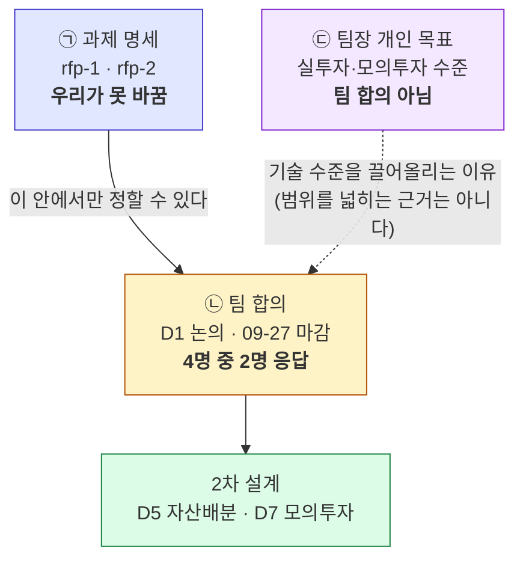
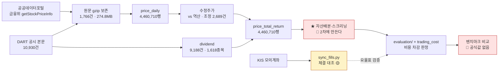

# 프로젝트 계획서 — Qurious 2.0

**v1.0** · 작성일 **2026-09-20(일) KST** · 작성 이동원 · 기준 커밋
[`cc32983`](https://github.com/devlee328288/Qurious/commit/cc32983)

> **이 문서를 읽는 순서**
> 1. **1절 계획서 본표** — 강사님 양식 9칸. 이것만 읽어도 됩니다.
> 2. 목표 칸이 왜 세 층인지 궁금하면 → **2절**
> 3. "그래서 지금 뭐가 돼 있나" 가 궁금하면 → **3절 진척**
> 4. 같이 작업할 분이면 → **4절 코드 재사용 판정** · **7절 남은 일정**
>
> **확실도 표기**: 🟢 저장소·API 에서 직접 확인 / 🟡 추정이거나 미확정 / 🔴 없거나 검증 안 됨

> ⚠️ **이 문서의 모든 수치는 2026-09-20 에 직접 다시 잰 값입니다.** 추측한 값은 없고,
> 확인하지 못한 것은 "모른다" 라고 적었습니다. 재는 방법은 [3.4](#34-이-숫자를-직접-다시-재는-법)에 있습니다.

---

## 1. 계획서 본표

> 강사님 배포 양식 `프로젝트계획서양식_AI퀀트예시.docx` 의 9행 3열(구분·내용·비고)을 따릅니다.
> **양식 원본은 강의자료라 저장소에 커밋하지 않습니다**(`.gitignore`). 이 Markdown 이 우리 정본입니다.

| 구분 | 내용 | 비고 |
|---|---|---|
| **팀명** | **Qurious** | 1차부터 쓰던 팀명입니다. 1차 **프로젝트명**은 `Alpha_Stack`, 팀명은 `Qurious` 로 서로 다릅니다 — 2차에서 저장소 이름이 `Qurious` 가 되면서 겹쳐 보입니다 🟢 |
| **팀원(역할)** | **이동원**(팀장) — 데이터 수집·저장·정제, 모의투자 원장, 문서·ADR<br>**강민석** — 비용 차감 검증 엔진, 성과 보고, 화면<br>**오준영** — 자산배분·스크리닝 모델, 선정 규칙<br>**신장환** — 커스텀 인디케이터·PineScript, look-ahead 계약 | 🟡 **확정 아닙니다.** [D0 #6 ⑤](https://github.com/devlee328288/Qurious/discussions/6) 역할표(1차 역할을 잇는 A안)이고 **전원 찬성이 필요한 안건인데 3/4** 입니다(@GoonGuMa 님 미응답, 기한 09-27).<br>실행 환경·보안·브로커·주문·알림·인프라는 **어느 파트에도 안 붙습니다** — 그때그때 정합니다 |
| **기간** | **2026-09-27(일) 시작** ~ 🔴 **종료일 미정** | 시작일만 확정입니다. **발표일·모의투자 기간을 강사님께 아직 못 여쭸습니다**([#1](https://github.com/devlee328288/Qurious/issues/1) 5절 열린 질문).<br>참고로 1차는 2026-09-01 ~ 09-15 **2주**였습니다(koreaIT 노원 B강의실). 같은 2주라면 10-11 경이지만 **추정이라 본표에 적지 않습니다** 🟡 |
| **프로젝트 명** | **Qurious 2.0 — 나만의 로보 어드바이저 개발 및 성과 검증** | 과제 명세의 2차 제목을 그대로 씁니다([rfp-1](https://github.com/devlee328288/Qurious/blob/cc32983/docs/rfp-1.md)). 🟡 제품 이름(1차의 `Alpha_Stack` 에 해당하는 것)은 **아직 없습니다** — [D1 #7](https://github.com/devlee328288/Qurious/discussions/7) 결론 뒤에 정합니다 |
| **주제 선정 이유** | 1차 발표에서 **"누구에게, 무슨 목적으로 만든 것인지 불명확하다"** 는 피드백을 받았습니다. 동시에 1차는 스스로 정한 주 지표(**비용 반영 ΔSharpe**)를 끝내 재지 못해 **결론이 닫히지 않은 채** 끝났습니다.<br>그래서 2차는 새 모델을 얹기 전에 **그 두 구멍부터** 메웁니다 — ㉠ 누구의 무슨 문제인지 한 문장으로 정하고, ㉡ 성과를 **비용까지 차감해** 재는 장치를 실제로 돌립니다.<br>밖을 봐도 같은 방향이었습니다. 개인 주식 소유자 **1,442만 명** 중 **459만 명(31.5%)이 한 종목만** 보유하고, 2020~2022년 10만 2천 명 표본에서 **순수익률이 양(+)인 비율은 국내 28%** 였습니다. 문제는 종목을 못 고르는 것보다 **자기 규칙을 믿어도 되는지 판단할 방법이 없는 것** 쪽에 가깝습니다 | 외부 수치 출처는 [D1 #7 §2.3](https://github.com/devlee328288/Qurious/discussions/7)(한국예탁결제원·한국은행·자본시장연구원 26-04, 조회일 2026-09-15) 🟢<br>1차 미수행 근거는 [#32 §2 ①](https://github.com/devlee328288/Qurious/issues/32) 🔴 |
| **프로젝트 목표** | **㉠ 과제 명세(고정)** — 로보 어드바이저 모델을 **직접 개발**하고 성과를 **검증**하는 역량 확보. 평가 기준은 재현성·로직 타당성·검증 충실도·해석의 논리성<br>**㉡ 팀 합의(🔴 미확정 · 4명 중 2명 응답)** — 추천안은 *"자기 투자 규칙을 가진 **투자 경험 있는 개인투자자**가, 그 규칙을 **믿어도 되는지 판단**하게 돕는다"*<br>**㉢ 팀장 개인 목표(팀 합의 아님)** — *"실제 투자 혹은 모의투자에 그대로 쓸 수 있는 수준"*. 데이터 정확도·비용 반영·체결 검증을 실사용 기준으로 끌어올리는 근거가 이 목표입니다 | ⚠️ **셋을 섞지 않습니다.** ㉠은 우리가 못 바꾸고, ㉡은 [D1 #7](https://github.com/devlee328288/Qurious/discussions/7)에서 **09-27까지 전원 찬성**이 필요하며, ㉢은 팀장 한 사람 기준입니다.<br>🔴 ㉡ 안에서 **④ 안건(2·3차를 한 줄기로 볼 것인가)이 갈려 있습니다** — 팀장 S1, 강민석 님 S3(*"목표가 둘을 잇는 것이 되면 안 된다"*). 2절 참조 |
| **분석 방법** | ① **수집** — 공공데이터포털 금융위 `getStockPriceInfo` 일별 전종목. 원문 gzip 보존 후 정규화<br>② **수정주가** — 전일대비(`vs`)로 분할·권리락 역산<br>③ **배당** — DART 공시 **본문**에서 배당금·배당기준일을 읽고 배당락일을 4중 검증으로 역산<br>④ **총수익(TR) 계열** — ②+③ 을 합쳐 배당 재투자 지수를 만듦. 배당을 빼고 재면 고배당주가 체계적으로 불리해짐<br>⑤ **매매비용** — 위탁수수료·유관기관 제비용·증권거래세·농특세를 **연도별 세율표**로 계산. 백테스트 세 갈래가 같은 요율표를 씀<br>⑥ **증권사 체결 대조** — KIS **모의계좌** 체결 내역을 받아 우리 추정 비용과 맞는지 대조<br>⑦ **백테스트** — LEAN 엔진(Docker) + 자체 워크포워드<br>⑧ **자산배분·스크리닝** — 🔴 **아직 없습니다.** 2차의 본 과제이고 [D5 #18](https://github.com/devlee328288/Qurious/discussions/18)에서 모델을 정합니다 | ①~⑦은 **코드가 돌아가는 상태**입니다(4절 판정표) 🟢<br>⑧만 새로 만듭니다.<br>⚠️ 네이버·다음·Yahoo·pykrx·FinanceDataReader 는 **약관 검토 결과 쓰지 않습니다**([#23](https://github.com/devlee328288/Qurious/issues/23) · [#31](https://github.com/devlee328288/Qurious/issues/31)) |
| **예상 산출물** | **① 이미 있는 것** — 수집기(3,779줄) · 시세 **4,460,710행** · 배당 **9,188건** · TR 계열 **4,460,710행** · 매매비용 요율표 · 체결 대조 장치 · 모의투자 엔진<br>**② 2차에 만들 것** — 자산배분 모델(평균분산·리스크패리티 중 1개 이상) · 스크리닝 규칙 · **비용 차감 성과 보고서**(수익률·MDD·Sharpe·ΔSharpe·p값) · 모의투자 의사결정 로그 · 최종 발표자료<br>**③ 지금 비어 있는 것** 🔴 — **벤치마크**(KOSPI TR 공식값 미확인) · **1차 주 검정 미수행** · ETF 시세 미적재 · `trading_journal` 테이블 없음 | ①의 숫자는 3절에서 다시 잰 실측입니다 🟢<br>③이 **가장 중요한 칸**입니다 — 벤치마크가 없으면 ②의 성과 보고서가 *"무엇보다 나은가"* 를 답하지 못합니다. 5절 한계 참조 |
| **비고** | 저장소 [github.com/devlee328288/Qurious](https://github.com/devlee328288/Qurious) (PUBLIC · GitLab 미러) · 커밋 **40** · PR **13** · 분석 이슈 **26** · 논의 **9**<br>모든 설계 결정은 이슈·논의에 근거와 함께 남기고, 작업마다 TIL 을 씁니다(현재 **7편**) | 1차와 **다른 저장소·다른 데이터**입니다. 2차 데이터는 2020-01-02 부터라 1차(2010-01-04~)보다 **10년 짧습니다** — 워크포워드 구간 수가 달라지므로 검정 설계에서 먼저 짚어야 합니다 ⚠️ |

---

## 2. 목표 칸이 왜 세 층인가

계획서에서 가장 틀리기 쉬운 칸이라 따로 풉니다. **"우리 목표"** 라는 말 하나에 성격이
다른 셋이 들어 있습니다.



### 2.1 ㉡ 팀 합의는 어디까지 왔나

| 안건 | 팀장 추천 | 강민석 | 신장환 | 오준영 | 상태 |
|---|---|:--:|:--:|:--:|---|
| ① 타깃 사용자 | **B** 투자 경험 있는 개인투자자 | ✅ B | ⬜ | ⬜ | 2/4 |
| ② 목적 한 문장 | **P2** 참고 근거를 더해준다 | ✅ P2 | ⬜ | ⬜ | 2/4 |
| ④ 2·3차 이야기 | **S1** 기능은 안 잇되 발표는 한 줄기 | ⚠️ **S3** | ⬜ | ⬜ | 🔴 **갈림** |

④가 갈린 지점은 좁혀져 있습니다. S1도 기능은 잇지 않으므로, **실제 차이는 "발표를
한 줄기로 묶는가" 하나**입니다. 팀장이 [09-18 댓글](https://github.com/devlee328288/Qurious/discussions/7)에서
강민석 님께 그 확인을 여쭌 상태이고, 아직 답이 오지 않았습니다.

> 💡 **계획서는 이 갈림을 확정으로 쓰지 않습니다.** 확정처럼 적으면 09-27 이후 팀원이
> *"언제 정해졌나"* 를 묻게 되고, 그 질문에 답할 근거가 없습니다.

### 2.2 ㉢ 개인 목표는 무엇을 바꾸고 무엇을 안 바꾸는가

| | 바꿉니다 | 바꾸지 않습니다 |
|---|---|---|
| **무엇** | 데이터 **정확도 기준** — 배당락일을 4중 검증하고, 비용을 증권사 정산과 대조하는 이유 | **범위** — "실투자에 쓰려면 기능이 더 필요하다" 는 논리로 화면을 늘리지 않습니다 |
| **왜** | 모의투자라도 숫자가 틀리면 의사결정이 틀립니다 | 강사님 피드백이 *"넓게보다 깊게"* 였습니다 |

---

## 3. 지금 무엇이 있나 — 2026-09-20 실측

### 3.1 데이터

| 무엇 | 수량 | 기간 | 확실도 |
|---|---:|---|:--:|
| 일별 시세 `price_daily` | **4,460,710행** · 1,648 거래일 | 2020-01-02 ~ 2026-09-17 | 🟢 |
| 시장별 종목 수 | KOSDAQ 2,117 · KOSPI 1,021 · KONEX 211 | — | 🟢 |
| 배당 `dividend` | **9,188건** · 1,618종목 · 81개월 완주 | 2018-12-31 ~ 2026-09-30 | 🟢 |
| 총수익 계열 `price_total_return` | **4,460,710행** · 3,302종목 · 배당 적용 8,083건 | 2020-01-02 ~ 2026-09-17 | 🟢 |
| 원문 보존 | 포털 1,766건(1,224.6MB → 274.8MB · 22.4%) · DART 10,930건(22.5MB) | — | 🟢 |
| DB 크기 | **2.3GB** (`data/collector/market.sqlite3`) | — | 🟢 |
| ETF 시세 | **0행** — 경로는 확정(금융위 증권상품시세), 적재만 남음 | — | 🟡 |
| 공식 지수(KOSPI200 등) | **0행** — 자체 계산은 되나 공식값 미확인 | — | 🔴 |

### 3.2 코드

| 영역 | 줄 수 | 주요 파일 |
|---|---:|---|
| 수집기 `collector/` | **3,779** | `sources/dart.py` 789 · `dividend.py` 527 · `total_return.py` 457 |
| 앱 본체 `app/` | 나머지 | `routes/stocks.py` 873 · `services/paper_trading.py` 718 |
| **Python 합계**(마이그레이션 제외) | **19,139** | 테이블 32개 · alembic 리비전 3개 |

### 3.3 진척 — 2차가 필요한 것 기준

```
                                        0%        50%       100%
 ① 시세 수집·적재         🟢 완료    ████████████████████  4.46M행
 ② 수정주가              🟢 완료    ████████████████████  조정 2,689건
 ③ 배당 수집             🟢 완료    ████████████████████  81/81달
 ④ 총수익(TR) 계열        🟢 완료    ████████████████████  4.46M행
 ⑤ 매매비용 요율표        🟡 코드○   ████████████████░░░░  실측 대조 남음
 ⑥ 증권사 체결 대조       🟡 장치○   ██████████░░░░░░░░░░  영업일 주문 필요
 ⑦ 백테스트 엔진         🟡 동작○   ████████████░░░░░░░░  비용 연결 확인 필요
 ⑧ ETF 적재             🟡 경로○   ████░░░░░░░░░░░░░░░░  엔드포인트 추가
 ⑨ 자산배분·스크리닝      🔴 없음    ░░░░░░░░░░░░░░░░░░░░  ★ 2차 본 과제
 ⑩ 벤치마크(지수 TR)      🔴 없음    ░░░░░░░░░░░░░░░░░░░░  ★ 마지막 구멍
 ⑪ 주 검정(ΔSharpe·p값)  🔴 미수행   ░░░░░░░░░░░░░░░░░░░░  ★ 1차가 넘긴 숙제
```

> ⑨⑩⑪ 셋이 2차의 실제 일감입니다. ①~④ 가 끝난 것은 **재료가 준비됐다**는 뜻이지
> **결론이 나왔다**는 뜻이 아닙니다.

### 3.4 이 숫자를 직접 다시 재는 법

```bash
PYTHONPATH=. python -m collector.backfill status       # 3.1 시세·원문 보존
PYTHONPATH=. python -m collector.dividend status       # 3.1 배당
PYTHONPATH=. python -m collector.total_return status   # 3.1 TR
find . -name '*.py' -not -path './.git/*' -not -path '*/__pycache__/*' \
  -not -path './alembic/versions/*' | xargs wc -l | tail -1   # 3.2 코드 줄 수
```

Postgres·Redis·Qdrant·Neo4j 는 **하나도 필요 없습니다** — 수집기는 SQLite 와
표준 라이브러리만 씁니다([collector/README.md](../../collector/README.md)).

---

## 4. 코드 재사용 판정 — 2차에서 무엇을 그대로 쓰나

| 파일 | 줄 수 | 2차에서 | 판정 근거 |
|---|---:|:--:|---|
| [`collector/`](../../collector/) 전체 | 3,779 | ✅ **그대로** | 앱 스택과 독립. 수집 대상이 늘어도 구조는 같음 🟢 |
| [`app/services/trading_cost.py`](../../app/services/trading_cost.py) | 509 | ✅ **그대로** | 백테스트 세 갈래가 이미 같은 요율표를 부름 🟢 |
| [`app/services/lean_backtest.py`](../../app/services/lean_backtest.py) | 637 | 🟡 **연결 확인** | 동작하나 비용 반영 경로 재확인 필요 |
| [`app/services/paper_trading.py`](../../app/services/paper_trading.py) | 718 | 🟡 **규칙 교체** | `status="filled"` 즉시 체결이 D7 ⑥ *"다음 거래일 시가"* 와 충돌 🔴 |
| [`scripts/sync_fills.py`](../../scripts/sync_fills.py) | 164 | ✅ **그대로** | 체결 대조. 영업일 주문만 하면 됨 |
| [`app/services/brokers/kis.py`](../../app/services/brokers/kis.py) | 348 | ✅ **그대로** | 모의계좌 경로 검증됨 |
| [`app/services/quant_pipeline.py`](../../app/services/quant_pipeline.py) | 506 | 🔴 **재작성** | 2차 자산배분이 들어갈 자리. 지금은 고정표 |
| 1차 `Alpha_Stack/evaluation/` | — | ✅ **import** | `models/` 를 참조하는 곳이 **0건**이라 그대로 가져옴([#32 §1](https://github.com/devlee328288/Qurious/issues/32)) 🟢 |

### 4.1 바꾸기 전 / 후 구조

```
[ 지금 — 1차와 2차가 갈라져 있다 ]

  Alpha_Stack                     Qurious
  ┌──────────────┐                ┌──────────────┐
  │ evaluation/  │  판정 장치      │ collector/   │ 4.46M행 + 배당
  │ supply/      │  as_of 정문     │ trading_cost │ 요율표
  │ 9.23M행      │  2010~          │ 2020~        │
  └──────────────┘                └──────────────┘
         ↑                                ↑
   주 검정 미수행 🔴              자산배분 없음 🔴


[ 2차 — 둘을 잇되 기능은 안 섞는다 ]

  ┌──────────────────────────────────────────────┐
  │  collector/  →  price_total_return (TR)      │  ← 재료
  └───────────────────────┬──────────────────────┘
                          ↓
  ┌──────────────────────────────────────────────┐
  │  ★ 자산배분 · 스크리닝  (새로 만든다)          │  ← 2차 본 과제
  └───────────────────────┬──────────────────────┘
                          │ positions, returns 두 배열만
                          ↓
  ┌──────────────────────────────────────────────┐
  │  evaluation/ (1차 그대로) + trading_cost      │  ← 판정
  │   → ΔSharpe · MDD · p값 · 비용 차감           │
  └───────────────────────┬──────────────────────┘
                          ↓
              ⑩ 벤치마크와 비교 🔴 ← 여기가 비어 있다
```

> `evaluation/` 은 **무엇이 그 포지션을 만들었는지 모릅니다.** 그 무지가 재사용의
> 조건입니다 — 자산배분이든 인디케이터든 같은 판정 장치를 통과시킬 수 있습니다.

### 4.2 데이터 흐름



---

## 5. 한계 — 계획서가 감추면 안 되는 것

| # | 한계 | 왜 문제인가 | 확실도 |
|---:|---|---|:--:|
| ① | **벤치마크가 없습니다** | KOSPI TR(총수익) 공식값을 확보하지 못했습니다. 자체 계산은 되지만 공식값과 대조하지 못했습니다. 벤치마크 없이는 *"가만히 있는 것보다 나은가"* 를 못 답하고, 그것이 1차가 정한 주 지표(ΔSharpe)의 분모입니다 | 🔴 |
| ② | **요율표가 실제와 맞는지 모릅니다** | 대조 장치는 만들었습니다. **주문을 넣어 확인하는 일만** 남았는데 09-20 이 일요일이라 또 못 했습니다(3세션 연속) | 🔴 |
| ③ | **1차 주 검정 미수행** | 1차가 스스로 "주 지표"로 정한 비용 반영 ΔSharpe·p값을 끝내 재지 않았습니다. 1차를 "끝난 것"으로 전제하면 그 구멍을 그대로 물려받습니다 | 🔴 |
| ④ | **데이터가 1차보다 10년 짧습니다** | 2020-01-02 부터라 코로나 폭락(2020-03)은 들어오지만 2010년대 강세장이 없습니다. 워크포워드 구간 수가 줄어 검정력이 떨어집니다 | 🟢 |
| ⑤ | **ETF 시세 0행** | 자산배분은 보통 ETF 로 합니다. 경로는 확정돼 있고 적재만 남았지만, 지금 상태로는 **주식만으로** 자산배분해야 합니다 | 🟡 |
| ⑥ | **모의투자가 즉시 체결됩니다** | `status="filled"` 로 바로 채워져 D7 ⑥ *"다음 거래일 시가 체결"* 규칙과 충돌합니다. 성과가 실제보다 좋게 나옵니다 | 🔴 |
| ⑦ | **팀원 반응이 12세션째 없습니다** | 논의 9건이 09-27 마감인데 응답은 강민석 님(09-15)·신장환 님(09-18) 둘뿐입니다. 목표·역할이 **전원 찬성 안건**이라 이대로면 09-27 에 확정이 안 됩니다 | 🟢 |
| ⑧ | **슬리피지는 가정입니다** | 10bp 를 상수로 씁니다. 실제 호가 데이터로 재지 않았습니다 | 🔴 |

### 5.1 이 계획을 뒤집을 조건

| 조건 | 그러면 무엇이 바뀌나 |
|---|---|
| D1 #7 에서 타깃이 B 가 아닌 것으로 결론 | 1절 "주제 선정 이유"·"목표" 칸 전면 수정 → **v2.0** |
| ④ 안건이 S3(발표까지 따로)로 확정 | 2·3차를 한 문서로 묶지 않음. 계획서도 2차 전용으로 좁힘 → **v2.0** |
| 강사님이 발표일·모의투자 기간을 주심 | "기간" 칸 확정 → **v1.1** |
| 요율표 실측에서 차이가 나옴 | "분석 방법" ⑤ 에 실측 수치와 보정 이력 추가 → **v1.1** |
| ETF 적재 완료 | 자산배분 대상이 바뀜 → **v1.1** (모델 선택이 바뀌면 v2.0) |

---

## 6. 용어 풀이

*정확한 뜻 → 이 문서에서 가리키는 것 → 헷갈리기 쉬운 점* 순서입니다.

| 말 | 한 줄 뜻 |
|---|---|
| 총수익(TR) | 배당을 다시 투자한다고 보고 잰 수익률 |
| 수정주가 | 분할·권리락으로 생긴 가격 점프를 지워 과거와 비교할 수 있게 만든 가격 |
| ΔSharpe | (전략 Sharpe) − (기준선 Sharpe). **가만히 있는 것보다 나은가** |
| 워크포워드 | 과거로 학습하고 그 다음 구간으로 검증하기를 앞으로 밀며 반복하는 방식 |
| bp(베이시스포인트) | 0.01%p. 100bp = 1%p |

**자세히**

- **총수익(TR, Total Return)**
  *정확한 뜻*: 가격 변동에 **배당을 재투자한 효과**를 더해 잰 수익률.
  *이 문서에서*: `price_total_return` 테이블(4,460,710행)이 그것입니다.
  *헷갈리기 쉬운 점*: **배당을 빼고 재면 고배당주가 체계적으로 불리해집니다.** 우리
  데이터에서 배당 기여가 큰 종목은 6년 누적으로 **+80%p** 까지 차이가 났습니다
  (INVENI). 자산배분에서 고배당주를 다루려면 TR 이 필수입니다.

- **슬리피지(slippage)**
  *정확한 뜻*: 주문을 낼 때 기대한 가격과 **실제 체결된 가격의 차이**.
  *이 문서에서*: 비용 계산에 10bp 를 상수로 넣고 있습니다.
  *헷갈리기 쉬운 점*: **수수료가 아닙니다.** 수수료는 고지된 요율이라 정확히 알 수
  있지만, 슬리피지는 그때 호가창 상태에 달려 있어 사후에만 알 수 있습니다. 우리는
  아직 재지 못했습니다(한계 ⑧).

- **벤치마크(benchmark)**
  *정확한 뜻*: 전략 성과를 비교할 **기준이 되는 수익률**.
  *이 문서에서*: KOSPI 의 총수익 지수를 말합니다.
  *헷갈리기 쉬운 점*: **KOSPI 지수(PR)와 KOSPI TR 은 다릅니다.** 흔히 보는 "코스피
  3,000" 은 배당을 뺀 값입니다. 배당 재투자한 우리 전략을 배당 없는 지수와 비교하면
  **우리 쪽이 부당하게 유리**해집니다.

---

## 7. 남은 일정 — 09-27 시작까지 7일

| 날짜 | 할 일 | 상태 |
|---|---|:--:|
| 09-20(일) | **이 계획서 v1.0** | 🟢 |
| 09-22(월) | **요율표 실측** — 첫 영업일. 모의계좌 매수·매도 각 1주 → `sync_fills.py` 대조 | ⏳ |
| 09-22 ~ 26 | 논의 9건 결론 초안 게시(D0 → D1 순서) · 팀원 회신 대기 | ⏳ |
| 09-24 경 | 벤치마크 — 시장지수 자체 계산 초안([#16](https://github.com/devlee328288/Qurious/issues/16) 6.3.1) | ⏳ |
| 09-26 경 | ETF 적재(금융위 증권상품시세 엔드포인트 추가) | ⏳ |
| **09-27(일)** | **논의 9건 마감 · 2차 프로젝트 시작** | 🔴 |

> ⚠️ **09-27 에 목표가 확정되지 않을 가능성이 높습니다.** 전원 찬성이 필요한 안건이
> 둘인데 오준영 님이 12세션째 미응답입니다. 그때는 lazy consensus(72시간 무반대 시
> 확정)로 넘길지 다시 논의해야 합니다.

---

## 8. 버전 규칙

이 문서는 작업마다 숫자가 바뀝니다. **갱신 기준을 문서 안에 둡니다.**

| 구분 | 언제 | 예 |
|---|---|---|
| **Major (+1.0)** | 1절 본표의 **목표·분석 방법·예상 산출물** 중 하나가 **성격이 바뀔 때** | D1 결론으로 타깃이 바뀜 · 자산배분 모델을 다른 것으로 교체 · 과제 범위 변경 |
| **Minor (+0.1)** | 숫자·진척·상태 갱신, 칸 안의 내용 보강, 오탈자 | 적재 행수 갱신 · 요율표 실측 반영 · 기간 칸 확정 · 한계 해소 |

**규칙**

1. **본문을 고치고, 틀린 칸은 지우지 않습니다.** 취소선 + 🔴 + 이유를 같은 칸에 남깁니다.
   나중에 *"왜 이렇게 바뀌었나"* 를 추적할 수 있어야 합니다.
2. 갱신할 때마다 **아래 변경 이력 표에 한 줄**을 더합니다.
3. 머리말의 **기준 커밋**을 함께 갱신합니다 — 숫자가 어느 시점 것인지가 문서의 신뢰도입니다.
4. 강사님 양식의 **9칸 구조는 바꾸지 않습니다.** 덧붙일 것은 부록(2절 이후)으로 갑니다.

### 8.1 변경 이력

| 버전 | 날짜 | 기준 커밋 | 무엇이 바뀌었나 |
|---|---|---|---|
| **v1.0** | 2026-09-20 | [`cc32983`](https://github.com/devlee328288/Qurious/commit/cc32983) | 최초 작성. 강사님 양식 9칸 + 부록 7절. 모든 수치 실측 |

---

<sub>작업 이슈 [#49](https://github.com/devlee328288/Qurious/issues/49) · 인덱스 [#1](https://github.com/devlee328288/Qurious/issues/1)</sub>
