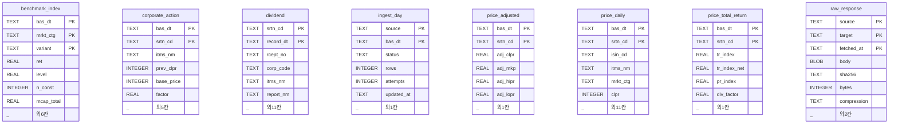

# ERD v1.0 — 이 프로젝트의 데이터는 어떻게 생겼나

> **구분**: 데이터 설계 (강사님 산출물 10구분 중 하나 · `docs/산출물목록.md`)
> **실측 도구**: `python scripts/schema_scan.py` — 이 문서의 **모든 표 이름·칸 이름·행 수는
> 그 출력에서 왔다.** 손으로 옮겨 적은 숫자는 없다. 의심스러우면 다시 돌리면 된다.
> **기준 커밋**: `b861859` · **작성일** 2026-09-21 (KST)

---

## 0. 한눈에

| | 수집기 DB | 앱 DB |
|---|---|---|
| 무엇 | 시세·배당·지수 **원자료** | 사용자·주문·대화 **서비스 데이터** |
| 엔진 | SQLite (`data/collector/market.sqlite3`) | PostgreSQL |
| 표 | **8개** | **26개** |
| 칸 | **88개** | **259개** |
| 행 | **13,431,190행** 🟢 실측 | 🟡 **측정 못 함** (아래 §5.3) |
| 스키마 출처 | 실제 파일을 열어 읽음 | SQLAlchemy 모델 정의 |
| 확실도 | 🟢 **실측** | 🟡 **정의** — 실제 DB 가 이 모양이라는 보장은 아니다 |

**용어 — ERD (Entity-Relationship Diagram · 개체관계도)**
- 뜻: 어떤 표(=개체)가 있고 그 표들이 서로 **어떻게 이어져 있는지** 그린 그림입니다.
- 이 문서에서: 표의 *모든 칸*은 그리지 않습니다. 키와 대표 칸만 그리고, 칸 전체는
  [데이터사전_v1.0.md](데이터사전_v1.0.md) 가 맡습니다. ERD 가 답해야 하는 질문은
  "이 표는 무엇과 이어지는가" 이기 때문입니다.
- 헷갈리는 점: ERD 에 선이 있다 = **DB 가 그 관계를 강제한다**는 뜻입니다. 선이 없어도
  사람 머릿속에서는 이어져 있을 수 있습니다 — 이 프로젝트가 정확히 그렇습니다(§2).

---

## 1. 🔴 가장 먼저 봐야 할 것 — 두 DB 는 **이어져 있지 않다**

1,343만 행을 모았습니다. 그런데 **앱 화면은 그 데이터를 한 번도 읽지 않습니다.**

```
┌─────────────────────────────┐        ┌──────────────────────────────┐
│  수집기 DB (SQLite)          │        │  앱 DB (PostgreSQL)           │
│  13,431,190행               │        │  사용자 · 주문 · 대화          │
│  ├ price_daily    4,463,579 │        │  ├ users                      │
│  ├ price_adjusted 4,460,710 │        │  ├ orders                     │
│  ├ price_total_r. 4,460,710 │        │  └ … 26표                     │
│  ├ benchmark_idx     19,776 │        └──────────────┬───────────────┘
│  ├ dividend           9,188 │                       │
│  └ … 8표                    │                       │ 화면이 시세를 물으면
└──────────────┬──────────────┘                       ▼
               │                          ┌──────────────────────────┐
               │  ❌ 읽는 경로가 없다      │  🌐 Yahoo Finance        │
               │                          │  app/services/stock.py   │
               ▼                          │  get_candles()           │
        (celery 가 수집기를               └──────────────────────────┘
         *실행*만 한다 —                          ▲
         app/tasks/collector_tasks.py)           │
                                        화면·백테스트·ML 이 전부 여기서
```

**확인한 방법** 🟢:

| 물음 | 확인 | 결과 |
|---|---|---|
| 앱이 `market.sqlite3` 를 여는가 | `grep -rn "market.sqlite3" app/` | **0건** |
| 앱이 수집기를 부르는가 | `grep -rn "collector\." app/` | 있음 — 단 **`celery` 작업 실행뿐** (`collector.portal_recent` 등) |
| 화면의 시세는 어디서 오는가 | `app/routes/ml.py:28` · `app/routes/macro.py:15` | `get_candles()` · `_yahoo_chart()` → **야후** |

즉 지금 구조는 **"모으는 쪽"과 "보여 주는 쪽"이 서로를 모릅니다.** 수집기는 앱이 켜 주는
스케줄러로 돌지만, 모은 결과는 앱으로 돌아오지 않습니다.

→ 이 다리를 놓는 작업이 **Issue #61 P1-1 `get_candles` → 수집 DB 어댑터** 입니다.
   ERD 로 보면 왜 그것이 P1(최우선)인지가 분명해집니다. **이 다리가 없으면 1,343만 행은
   발표에서 "모았다"고 말할 수는 있어도 화면에서는 한 줄도 쓰이지 않습니다.**

---

## 2. 수집기 DB — 시세·배당·지수 🟢 실측

<!-- 아래 그림과 연결축 표는 `python scripts/schema_scan.py --erd` 의 출력을
     그대로 붙인 것이다. 손으로 고치지 말 것 — 고치면 다음 실행에서 어긋난다. -->



이 DB 는 **외래키를 선언하지 않는다.** 위 그림에 연결선이 없는 이유다. 실제로는 아래 칸들이 표를 잇는 축이다 — 선언이 아니라 **이름으로 추론한 것**이다.

| 연결 축 | 이 칸을 기본키로 쓰는 표 |
|---|---|
| `bas_dt` (6표) | `benchmark_index`, `corporate_action`, `ingest_day`, `price_adjusted`, `price_daily`, `price_total_return` |
| `source` (2표) | `ingest_day`, `raw_response` |
| `srtn_cd` (5표) | `corporate_action`, `dividend`, `price_adjusted`, `price_daily`, `price_total_return` |

### 2.1 왜 외래키가 없는가 — 그리고 그 대가

대량 적재에서는 제약이 순서를 강제합니다. 배당 공시를 먼저 받았는데 그 종목의 시세가
아직 안 들어왔다면, 외래키가 있으면 **적재가 거부됩니다.** 그래서 이 DB 는 제약을 걸지
않고, 대신 각 수집기가 스스로 검증합니다.

**대가는 분명합니다** — 무결성을 DB 가 지켜 주지 않습니다. `price_daily` 에 없는 종목이
`dividend` 에 있어도 DB 는 아무 말도 하지 않습니다. 그래서 `collector/*/verify` 명령들이
따로 존재합니다.

### 2.2 세 개의 시세 표는 왜 나뉘어 있나

```
price_daily          원본 그대로. 공공데이터포털이 준 값 (정수 원 단위)
  │                  └ 액면분할이 있으면 그 전후가 불연속이다 (그게 사실이니까)
  ├──▶ price_adjusted   분할·감자를 되돌린 값 (실수)
  │                     └ 가격만 맞춘다. 배당은 빠져 있다
  └──▶ price_total_return  배당까지 재투자한 값
                        └ "실제로 내 계좌가 얼마나 늘었나" 에 가장 가깝다
```

세 표의 행 수가 거의 같은 것(4,463,579 / 4,460,710 / 4,460,710)은 **같은 (날짜, 종목)에
대해 세 가지 값을 각각 저장**하기 때문입니다. 한 표에 칸을 늘리지 않은 이유는, 조정값이
**나중에 다시 계산되기 때문**입니다 — 새 분할이 들어오면 과거 전체가 바뀝니다. 원본을
건드리지 않고 파생만 다시 만들려면 표가 갈라져 있어야 합니다.

---

## 3. 앱 DB — 사용자·주문·대화 🟡 모델 정의

26개 표 **전체**입니다. 한 화면에 안 들어올 만큼 크지만, 일부만 골라 그리면 그 순간
**어느 표를 뺐는지가 기록되지 않습니다** — 빠진 표는 없는 표처럼 보입니다. 그래서
스캐너 출력을 그대로 둡니다. 각 표의 전체 칸은 [데이터사전_v1.0.md](데이터사전_v1.0.md) 에
있고, 관계만 빠르게 보려면 **아래 §3.1 의 요약**을 먼저 보십시오.

### 3.1 관계 요약 — 20개 중 18개가 `users` 에서 뻗습니다

```
users ──┬──▶ orders ──▶ order_fills      (주문 1건 : 체결 여러 건)
        ├──▶ portfolio                   보유 종목
        ├──▶ paper_accounts              모의 현금 계좌
        ├──▶ broker_settings · api_keys  증권사 연결 · 발급 키
        ├──▶ conversations ──▶ chats     대화 1건 : 메시지 여러 건
        ├──▶ crypto_orders · crypto_holdings
        ├──▶ alternative_orders · alternative_positions
        ├──▶ custom_indicators           3차 커스텀 지표
        ├──▶ lean_backtest_runs          백테스트 실행 기록
        └──▶ audit_events                감사 로그
```

`users` 에서 뻗지 않는 관계는 **둘뿐**입니다 — `conversations → chats`,
`orders → order_fills`. 나머지 표(`bank_products`·`fund_products`·`data_cache` 등)는
**사용자에 매이지 않는 참조 데이터**라 관계선이 없습니다.

```mermaid
erDiagram
  alternative_orders {
    UUID user_id FK
    UUID id PK
    VARCHAR_30 symbol
    VARCHAR_100 name
    VARCHAR_20 category
    VARCHAR_4 order_type
    _ 외6칸
  }
  alternative_positions {
    UUID user_id FK
    UUID id PK
    VARCHAR_30 symbol
    VARCHAR_20 category
    INTEGER quantity
    FLOAT avg_price
    _ 외1칸
  }
  api_keys {
    UUID user_id FK
    UUID id PK
    VARCHAR_100 label
    VARCHAR_16 key_prefix
    VARCHAR_64 key_hash
    BOOLEAN is_active
    _ 외3칸
  }
  audit_events {
    UUID user_id FK
    UUID id PK
    VARCHAR_64 client_id
    VARCHAR_80 event_type
    JSONB payload
    DATETIME created_at
  }
  bank_products {
    UUID id PK
    VARCHAR_20 bank_code
    VARCHAR_100 bank_name
    VARCHAR_50 product_code
    VARCHAR_300 product_name
    _ 외11칸
  }
  broker_settings {
    UUID user_id FK
    UUID id PK
    VARCHAR_20 broker
    VARCHAR_200 app_key
    VARCHAR_200 app_secret
    VARCHAR_50 account_no
    _ 외9칸
  }
  chats {
    UUID user_id FK
    UUID conversation_id FK
    UUID id PK
    VARCHAR_32 client_id
    TEXT question
    TEXT answer
    JSONB steps
    _ 외2칸
  }
  conversations {
    UUID user_id FK
    UUID id PK
    VARCHAR_200 title
    INTEGER message_count
    DATETIME created_at
    DATETIME updated_at
  }
  corporate_cb_stats {
    UUID id PK
    VARCHAR_20 bs_dt
    VARCHAR_10 sic_cd
    INTEGER wg_gb
    INTEGER cnt
    _ 외2칸
  }
  crawled_docs {
    UUID id PK
    VARCHAR_1000 url
    VARCHAR_500 title
    TEXT content
    VARCHAR_200 source
    _ 외1칸
  }
  crypto_holdings {
    UUID user_id FK
    UUID id PK
    VARCHAR_30 market_code
    VARCHAR_100 korean_name
    FLOAT quantity
    FLOAT avg_price
    _ 외2칸
  }
  crypto_orders {
    UUID user_id FK
    UUID id PK
    VARCHAR_30 market_code
    VARCHAR_100 korean_name
    VARCHAR_4 order_type
    FLOAT quantity
    _ 외4칸
  }
  custom_indicators {
    UUID user_id FK
    UUID id PK
    VARCHAR_60 name
    VARCHAR_20 base
    INTEGER short_window
    INTEGER mid_window
    _ 외3칸
  }
  data_cache {
    UUID id PK
    VARCHAR_200 key
    JSONB data
    DATETIME updated_at
  }
  fund_products {
    UUID id PK
    VARCHAR_20 eval_date
    VARCHAR_50 fund_code
    VARCHAR_300 fund_name
    VARCHAR_200 company_name
    _ 외11칸
  }
  lean_backtest_runs {
    UUID user_id FK
    UUID id PK
    VARCHAR_20 ticker
    VARCHAR_20 strategy
    VARCHAR_60 engine
    VARCHAR_10 start_date
    _ 외6칸
  }
  notification_log {
    UUID user_id FK
    UUID id PK
    VARCHAR_300 subject
    VARCHAR_500 message
    JSONB channels
    DATETIME created_at
  }
  notification_settings {
    UUID user_id FK
    UUID id PK
    JSONB channels
    VARCHAR_200 telegram_token
    VARCHAR_100 telegram_chat_id
    VARCHAR_300 slack_webhook_url
    _ 외15칸
  }
  order_fills {
    UUID order_id FK
    UUID id PK
    INTEGER seq
    FLOAT fill_price
    INTEGER fill_quantity
    DATETIME fill_at
    _ 외7칸
  }
  orders {
    UUID user_id FK
    UUID id PK
    VARCHAR_20 symbol
    VARCHAR_100 name
    VARCHAR_10 order_type
    INTEGER quantity
    _ 외17칸
  }
  paper_accounts {
    UUID user_id FK
    UUID id PK
    FLOAT cash
    FLOAT initial_cash
    DATETIME created_at
    DATETIME updated_at
  }
  personal_cb_stats {
    UUID id PK
    VARCHAR_20 stdt
    INTEGER gender
    INTEGER age_band
    INTEGER cnt
    _ 외4칸
  }
  portfolio {
    UUID user_id FK
    UUID id PK
    VARCHAR_20 symbol
    VARCHAR_100 name
    INTEGER quantity
    FLOAT avg_price
    _ 외1칸
  }
  quant_virtual_accounts {
    UUID user_id FK
    UUID id PK
    FLOAT initial_capital
    FLOAT cash_balance
    DATETIME created_at
    DATETIME updated_at
  }
  uploaded_docs {
    UUID user_id FK
    UUID id PK
    VARCHAR_300 filename
    VARCHAR_320 uploader
    VARCHAR_400 source_key
    INTEGER chunks
    _ 외3칸
  }
  users {
    UUID id PK
    VARCHAR_200 name
    VARCHAR_320 email
    VARCHAR_200 password_hash
    VARCHAR_32 client_id
    _ 외2칸
  }
  users ||--o{ alternative_orders : "user_id"
  users ||--o{ alternative_positions : "user_id"
  users ||--o{ api_keys : "user_id"
  users ||--o{ audit_events : "user_id"
  users ||--o{ broker_settings : "user_id"
  users ||--o{ chats : "user_id"
  conversations ||--o{ chats : "conversation_id"
  users ||--o{ conversations : "user_id"
  users ||--o{ crypto_holdings : "user_id"
  users ||--o{ crypto_orders : "user_id"
  users ||--o{ custom_indicators : "user_id"
  users ||--o{ lean_backtest_runs : "user_id"
  users ||--o{ notification_log : "user_id"
  users ||--o{ notification_settings : "user_id"
  orders ||--o{ order_fills : "order_id"
  users ||--o{ orders : "user_id"
  users ||--o{ paper_accounts : "user_id"
  users ||--o{ portfolio : "user_id"
  users ||--o{ quant_virtual_accounts : "user_id"
  users ||--o{ uploaded_docs : "user_id"
```



관계는 **20개**가 선언돼 있고, 그중 **18개가 `users` 에서 뻗습니다.** 나머지 둘은
`conversations → chats`, `orders → order_fills` 입니다.

### 3.2 `orders` 와 `order_fills` 가 나뉜 이유 — D7 논의와 직결됩니다

주문 1건이 **여러 번에 나눠 체결**될 수 있습니다. 그래서 주문(`orders`)과 체결
(`order_fills`)이 따로 있습니다. 여기에 D7 [#13](https://github.com/devlee328288/Qurious/discussions/13)
⑥-1 에서 합의한 **비용 출처 구분**이 들어갑니다:

| 칸 | 값 | 뜻 |
|---|---|---|
| `orders.cost_basis` | `none` | 비용을 안 뗐다 (무비용 대조용) |
| | `estimated` | **우리 요율표**(`trading_cost.py`)로 계산했다 |
| | `broker` | **증권사가 실제로 뗀** 금액이다 |

같은 표 · 같은 행에서 두 출처가 **칸 하나로 구분**되므로 섞이지 않습니다.

---

## 4. 이 ERD 가 드러낸 것 — 발견 4개

| # | 발견 | 근거 | 심각도 |
|---|---|---|:--:|
| **1** | **두 DB 가 이어져 있지 않다.** 1,343만 행을 모았는데 화면은 야후를 본다 | §1 · `grep "market.sqlite3" app/` **0건** | 🔴 |
| **2** | `benchmark_index` 가 **`collector/db.py` 의 SCHEMA 상수에 없다.** `collector/benchmark.py` 가 따로 만든다 | 스캐너 대조 출력 | 🟡 |
| **3** | 수집기 DB 는 **외래키를 하나도 선언하지 않는다.** 무결성이 코드에만 있다 | `PRAGMA foreign_key_list` 전 표 **0건** | 🟡 |
| **4** | 앱 DB 의 **실제 행 수를 모른다.** 모델 정의만 읽었다 | §5.3 | 🟡 |

**발견 2 가 왜 문제인가**: 스키마를 한곳에서 읽을 수 없습니다. `collector/db.py` 만 보고
"이 DB 에는 7개 표가 있다"고 믿으면 틀립니다. 실제로는 8개입니다. 새로 합류한 사람이
가장 먼저 여는 파일이 `db.py` 라는 점에서, 이것은 **문서가 아니라 코드의 문제**입니다.

---

## 5. 한계 — 이 문서가 답하지 **않는** 것

### 5.1 값이 옳은지는 보지 않았습니다

칸이 있다는 것과 그 칸에 맞는 값이 들어 있다는 것은 다릅니다. 실제로 **이미 알려진
오염이 있습니다** — `price_adjusted.adj_clpr` 의 종목 `052670` 이 300배로 남아 있습니다
([#55](https://github.com/devlee328288/Qurious/issues/55)). ERD 는 이것을 잡지 못합니다.

### 5.2 쓰이는지도 보지 않았습니다

아무도 읽지 않는 칸도 똑같이 세었습니다. 앱 DB 의 26표 중 화면이 실제로 쓰는 것이
몇 개인지는 이 문서의 범위 밖입니다(RTM [#71](https://github.com/devlee328288/Qurious/issues/71) 이 다룹니다).

### 5.3 앱 DB 는 🟡 "정의" 입니다 — 실물을 보지 못했습니다

수집기 DB 는 파일이 있어 **열어서 셌습니다**. 앱 DB 는 PostgreSQL 이고 지금 띄워 두지
않았으므로, **SQLAlchemy 모델에 그렇게 적혀 있다**는 것까지만 확인했습니다.

다만 **모델과 마이그레이션은 대조했고 일치합니다**:

```
모델이 선언한 표        26개
마이그레이션이 만드는 표 26개   (0001:18 + 0002:7 + 0003:1)
일치                    26개   ✅ 어긋나는 곳 없음
```

⚠️ 이 대조는 **정적 파싱**입니다(`op.create_table("x"` 문자열을 셈). 실제 DB 가 모델과
같은지는 `alembic check` 가 판정합니다 — 이 문서는 그 자리를 대신하지 않습니다.

---

## 6. 다시 만드는 법

```bash
python scripts/schema_scan.py          # 사람이 읽는 요약 + 어긋난 곳
python scripts/schema_scan.py --erd    # 이 문서의 그림
python scripts/schema_scan.py --md     # 데이터 사전
python scripts/schema_scan.py --json   # 기계용
```

수집기 DB 파일(`data/collector/market.sqlite3`)은 `.gitignore` 대상이라 저장소에 없습니다.
파일이 없으면 스캐너는 **수집기 부분을 건너뛰고 앱 부분만** 출력합니다 — 멈추지 않습니다.

---

## 7. 관련 문서 · 이슈

- [데이터사전_v1.0.md](데이터사전_v1.0.md) — 34개 표 **347칸 전체**
- [RTM v1.0](../요구사항/RTM_v1.0.md) — 요구사항 추적 (PR #73 으로 main 에 올라감)
- [#61](https://github.com/devlee328288/Qurious/issues/61) P1-1 — `get_candles` → 수집 DB 어댑터 (§1 의 다리)
- [#55](https://github.com/devlee328288/Qurious/issues/55) — `adj_clpr` 052670 오염 (§5.1)
- [#56](https://github.com/devlee328288/Qurious/issues/56) — 코스닥 재현 오차 0.871%
- [D7 #13](https://github.com/devlee328288/Qurious/discussions/13) — `cost_basis` 가 쓰이는 논의 (§3.1)
