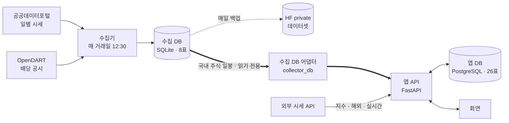
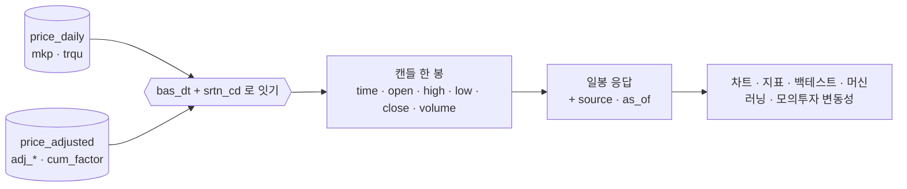
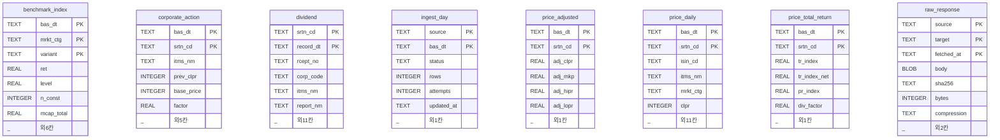
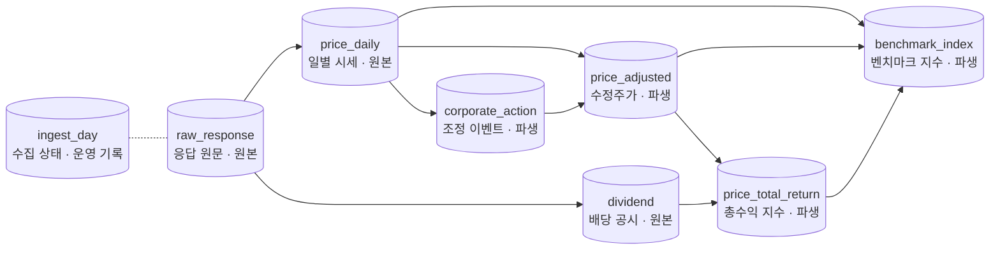
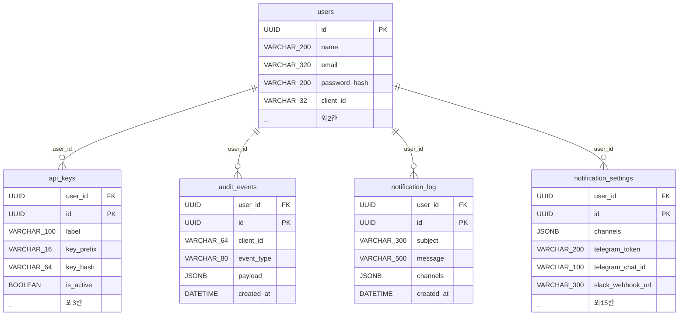
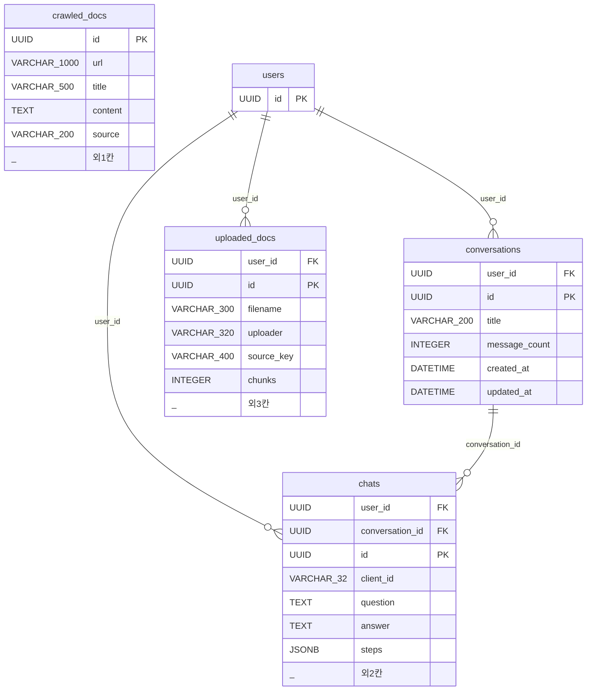
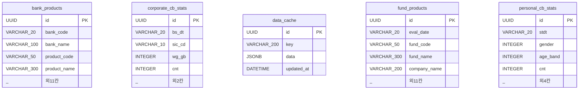

# ERD v1.2 — Qurious

| 문서 정보 | |
|---|---|
| **판 · 상태** | v1.2 · 초안(검토 전) |
| **구분** | 5. 데이터 설계 — ERD(개체 관계도) · 두 DB 의 표와 관계 |
| **작성** | 이동원(데이터 파트) |
| **검토** | 검토 전 — 판을 올리는 PR 에 읽는 파트 한 명이 댓글 한 줄(문서 작성 기준 4.4 · 제안) |
| **최종 수정** | 2026-09-29 (KST) |
| **기준** | 코드 `main` `42fc3e6` + 이 판과 같은 PR 의 스캐너 수정 · 수집 DB 데이터 기준일 2026-09-28 · 행 수는 2026-09-29 실측 |
| **관련 문서** | [데이터 사전 v1.2](데이터사전_v1.2.md) · [표 속성 대장](표-속성대장.tsv) · [API 명세서 v0.1](../인터페이스/API명세서_v0.1.md) · [테스트 계획서 v1.2](../시험/테스트계획서_v1.2.md) · [문서 작성 기준 v0.1](../문서작성기준_v0.1.md) |
| **최근 개정** | v1.1 → v1.2: 문서 작성 기준의 틀로 옮김 · 조정 이벤트 네 종류와 감자 결함(DF-01) 해결을 반영 · 앱 DB 그림을 업무 영역 넷으로 나눔 — 전체는 부록 D |

> **이 문서가 답하는 질문**
> 1. 이 프로젝트의 데이터는 어느 DB 의 어떤 표에 있고, 표끼리 어떻게 이어지나 (1절 · 3절 · 4절)
> 2. 두 DB 는 어디서 만나고, 앱은 수집한 시세를 어떻게 읽나 (2절)
> 3. 이 그림이 답하지 않는 것은 무엇이고, 그 답은 어디에 있나 (5절)
>
> **읽는 순서** — 팀원: 요약 → 1절 → 자기 업무 영역의 그림(4.2절) · 강사님: 요약 → 1절 → 2절 → 5절 · 처음 온 사람: 부록 A 용어 → 1절 → 3.2절

## 요약

1. 데이터는 **두 DB** 에 나뉘어 있다 — 수집 DB(SQLite · 8표 · 13,471,460행)는 시세 · 배당 · 지수를, 앱 DB(PostgreSQL · 26표)는 사용자 · 주문 · 대화를 담는다.
2. 두 DB 는 **한 곳에서만** 만난다 — 앱의 수집 DB 어댑터가 국내 주식 일봉을 읽기 전용으로 읽고, 그 요청은 앱의 캐시 표를 거치지 않아 매일 12:30 갱신이 바로 보인다. 지수 · 해외 · 실시간 시세는 외부 API 에서 온다.
3. 수집 DB 는 외래키 없이 기준일과 종목코드로 이어지고, 앱 DB 는 관계 20개 중 18개가 `users` 에서 뻗는다. 앱 DB 의 모델과 마이그레이션은 인덱스 선언 4곳이 어긋나 있다(동작에는 영향이 없다).

---

## 1. 한눈에 — 데이터는 어디에 있나

표 1 은 「두 DB 는 무엇이 다른가」 에 답한다.

**표 1. 두 DB** · 기준: 수집 DB 는 2026-09-29 실측 · 앱 DB 는 모델 정의

| | 수집 DB | 앱 DB |
|---|---|---|
| 담는 것 | 시세 · 배당 · 지수 — 공공데이터포털 · OpenDART 에서 받은 값과 거기서 계산한 값 | 사용자 · 주문 · 대화 · 설정 — 앱을 쓰며 생기는 데이터 |
| 엔진 · 위치 | SQLite · `data/collector/market.sqlite3` (저장소 밖 · `.gitignore`) | PostgreSQL · `docker-compose.yml` 의 `postgres` 서비스 |
| 표 · 칸 | 8표 · 88칸 | 26표 · 259칸 |
| 행 | **13,471,460** 🟢 | 모른다 — 운영 DB 가 없다(배포 환경 보류) |
| 누가 채우나 | 매 거래일 12:30 일일 갱신(작업 스케줄러) | 앱 — 사용자 동작마다 |
| 관계 | 외래키 선언 0 · 기준일(`bas_dt`) · 종목코드(`srtn_cd`)로 이어진다 | 외래키 20 · 그중 18개가 `users` 에서 |
| 백업 · 공개 | HF private 데이터셋에 매일 백업 · 원자료 재배포 금지 | 백업 절차 없음 🟡 · 개인정보와 자격 증명이 들어 있다 |
| 확실도 | 🟢 실제 파일을 열어 잰다 | 🟡 모델 정의 · 마이그레이션은 빈 DB 에 올려 대조했다(4.5절) |

그림 1 은 「데이터가 어디서 와서 어디에 쌓이고, 앱은 어느 길로 읽나」 에 답한다. 시스템을 컨테이너(실행 단위 · 저장소) 단계로 그렸다.

**그림 1. 데이터가 흐르는 길 — 컨테이너 단계** · 범례: 원통 = 저장소 · 화살표 = 데이터가 가는 방향 · 굵은 선 = 두 DB 가 만나는 유일한 길 · 점선 = 백업



두 DB 는 수집 DB 어댑터 한 곳에서만 만나고, 그 길로 오는 것은 국내 주식 일봉뿐이다.

---

## 2. 두 DB 가 만나는 곳 — 수집 DB 어댑터

**수집 DB 어댑터**는 앱이 수집 DB 를 읽으려고 둔 읽기 전용 연결 모듈이다(`app/services/collector_db.py`). 앱에서 수집 DB 파일을 여는 곳은 이 모듈 하나다.

### 2.1 어댑터가 읽는 칸 — 수집 DB 88칸 중 11칸

표 2 는 「앱은 수집 DB 의 어느 칸을 읽나」 에 답한다.

**표 2. 수집 DB 어댑터가 읽는 칸** · 기준: `collector_db` 의 조회문 하나

| 표 | 칸 | 앱에서 되는 것 |
|---|---|---|
| `price_adjusted` | `bas_dt` · `srtn_cd` · `adj_clpr` · `adj_mkp` · `adj_hipr` · `adj_lopr` · `cum_factor` | 캔들의 날짜 · 시가 · 고가 · 저가 · 종가(수정주가) · 거래량을 나눌 계수 |
| `price_daily` | `bas_dt` · `srtn_cd` (두 표를 잇는 열쇠) · `mkp` · `trqu` | 그날 거래가 있었나(시가 0 = 거래 없음) · 거래량 |

그림 2 는 「두 표의 칸이 어떻게 캔들 한 봉이 되나」 에 답한다.

**그림 2. 일봉 한 봉이 만들어지는 길** · 범례: 원통 = 수집 DB 의 표 · 육각형 = 잇기(조인)



어댑터는 수정주가 표와 일별 시세 표를 같은 날 · 같은 종목으로 이어 캔들을 만들고, 거래량은 누적 조정 계수로 나눈다.

### 2.2 어댑터를 거치는 요청과 거치지 않는 요청

표 3 은 「어떤 요청이 수집 DB 에서 오고, 어떤 요청이 외부 API 에서 오나」 에 답한다. 판정은 `collector_db.handles()` 가 한다 — 국내 주식 기호(6자리 · `.KS` · `.KQ`) · 일봉 · 아는 기간 · 수집 DB 파일이 있음, 넷을 다 만족하면 어댑터가 먼저 받는다.

**표 3. 요청별 출처와 캐시** · 기준: 결함 DF-17 해결 뒤(`1108c02`)

| 요청 | 어디서 오나 | 앱 캐시 표(`data_cache`) | 확실도 |
|---|---|---|:-:|
| 국내 주식 일봉 · 아는 기간 · 수집 DB 파일이 있는 PC | 수집 DB (어댑터) | 읽지도 쓰지도 않는다 — 12:30 갱신이 바로 보인다 | 🟢 시험 TC-DF17 |
| 국내 6자리 기호지만 수집 DB 에 행이 없는 것(ETF 등) | 외부 시세 API | 라우트 캐시 6시간 · 같은 키 | 🟢 TC-DF17-03 |
| 지수 · 환율 · 해외 · 주봉 | 외부 시세 API | 라우트 캐시 6시간 · 매시간 캐시 예열 | 🟢 TC-DF17-06 |
| 수집 DB 파일이 없는 PC(팀원 PC 등) | 외부 시세 API — 예전과 같다 | 라우트 캐시 6시간 | 🟢 TC-DF17-05 · 07 |
| 실시간 시세(현재가) | 외부 시세 API | — | 🟢 수집 DB 는 다음 날 낮에 전일 값을 받는다 |

### 2.3 기준일 — 어댑터가 주는 마지막 봉은 직전 거래일이다

수집 DB 는 공공데이터포털이 다음 날 낮에 주는 값을 받는다. 그래서 어댑터가 주는 일봉의 마지막 봉은 오늘이 아니라 **직전 거래일**이고, 응답에는 기준일(`as_of`)과 출처(`source`) 칸이 실린다. 마지막 봉의 종가를 「현재가」 로 쓰는 곳이 다섯 곳 남아 있다 — 결함 DF-15 · 이슈 [#35](https://github.com/EST-team-project/Qurious/issues/35)(자동매매 체결가가 가장 급하다).

---

## 3. 수집 DB — 시세 · 배당 · 지수 🟢

### 3.1 표와 연결 축

아래 그림과 연결 축 표는 「수집 DB 의 표 여덟 개는 무엇을 기본키로 삼고, 어느 칸으로 이어지나」 에 답한다. 스캐너 출력이라 제목에 번호가 없다(부록 B).

<!-- schema_scan:erd-수집 -->
**수집 DB — 시세 · 배당 · 지수 · 8표** 🟢 실측 · 범례: PK 기본키 · `_ 외N칸` 그리지 않은 칸 수 · 선이 없다 = 외래키를 선언하지 않는다



이 DB 는 **외래키를 선언하지 않는다.** 위 그림에 연결선이 없는 이유다. 실제로는 아래 칸들이 표를 잇는 축이다 — 선언이 아니라 **이름으로 추론한 것**이다.

| 연결 축 | 이 칸을 기본키로 쓰는 표 |
|---|---|
| `bas_dt` (6표) | `benchmark_index`, `corporate_action`, `ingest_day`, `price_adjusted`, `price_daily`, `price_total_return` |
| `source` (2표) | `ingest_day`, `raw_response` |
| `srtn_cd` (5표) | `corporate_action`, `dividend`, `price_adjusted`, `price_daily`, `price_total_return` |
<!-- /schema_scan:erd-수집 -->

수집 DB 의 여덟 표는 선언된 관계 없이 기준일(`bas_dt` · 6표)과 종목코드(`srtn_cd` · 5표)로 이어진다.

### 3.2 원본 · 파생 · 운영 기록 — 무엇을 지우고 다시 만드나

수집 DB 의 표는 세 가지다. **원본**은 밖에서 받은 값 그대로라 지우지 않는다. **파생**은 원본에서 계산한 값이라 매일 지우고 다시 만든다. **운영 기록**은 수집이 어디까지 됐는지를 남긴다. 원본에 계산 결과를 덮어쓰지 않는 이유는, 계산 규칙이 바뀌면 파생을 전부 다시 만들어야 하는데 원본을 덮어쓰면 되돌릴 근거가 없어지기 때문이다.

그림 3 은 「어느 표가 어느 표의 재료이고, 매일 무엇을 다시 만드나」 에 답한다.

**그림 3. 수집 DB 의 재료와 파생** · 범례: 화살표 = 재료 → 만든 것 · 원통 이름 아래 = 유형 · 점선 = 상태를 적을 뿐 재료가 아니다



표 4 는 「유형마다 언제 만들고 무엇을 지우나」 에 답한다. 표마다의 발생 주기 · 보존 기간 · 공개 여부는 [데이터 사전 v1.2](데이터사전_v1.2.md) 1절에 있다.

**표 4. 수집 DB 표의 유형** · 기준: `scripts/daily_update.py` 의 단계 · `collector/` 의 삭제문

| 유형 | 표 | 매일 12:30 에 | 지우는가 |
|---|---|---|---|
| 원본 | `raw_response` · `price_daily` · `dividend` | 새 거래일 시세와 최근 2달 공시를 받아 더한다 | 지우지 않는다 — 같은 날 · 같은 종목(배당은 같은 기준일)은 덮어쓴다 |
| 파생 | `corporate_action` · `price_adjusted` · `price_total_return` · `benchmark_index` | 종목(벤치마크는 시장 · 계열)마다 지우고 다시 만든다 | 매일 — 재료가 있으면 언제든 다시 만들 수 있다 |
| 운영 기록 | `ingest_day` | 출처 · 기준일마다 상태 한 줄(done · empty · holiday · error) | 지우지 않는다 — 중단한 자리에서 다시 시작하는 근거 |

### 3.3 시세 세 표는 왜 나뉘어 있나

그림 4 는 「같은 날 · 같은 종목의 가격이 왜 세 표에 따로 있나」 에 답한다.

**그림 4. 시세 세 표의 관계** · 범례: 화살표 = 재료 → 만든 것

```
price_daily            포털이 준 값 그대로 (정수 · 원)
  │                    └ 분할이 있으면 그 전후가 끊긴다
  ├──▶ price_adjusted       분할 · 병합 · 권리락을 이은 값
  │                         └ 배당은 빠짐 · 가장 최근 날 = 1.0
  └──▶ price_total_return   배당까지 재투자한 값
                            └ 계좌가 늘어난 만큼 · 첫날 = 1.0
```

세 표의 행 수는 **4,475,055** 로 같다 — 같은 (날짜, 종목)에 세 값을 따로 둔다. 한 표에 칸을 늘리지 않은 이유는 조정값이 나중에 다시 계산되기 때문이다. 새 분할이 들어오면 과거 전체가 바뀌므로, 원본을 건드리지 않고 파생만 다시 만들려면 표가 갈라져 있어야 한다. 수정주가(오늘 = 1.0)와 총수익 지수(첫날 = 1.0)는 **누적 방향이 반대**다 — 둘을 섞어 계산하지 않는다.

### 3.4 조정 이벤트의 네 종류 — `corporate_action.kind`

`corporate_action` 은 가격이 끊긴 날과 그 계수를 적는다. 거래소가 조정 사유를 알려 주지 않으므로 사유 칸은 없고, **가격 계수와 주식 수 비율이 맞는지**로 네 종류를 가른다.

표 5 는 「가격이 끊긴 날을 어떻게 가르고, 각각 몇 건인가」 에 답한다.

**표 5. 조정 이벤트의 종류** · 기준: 2026-09-29 실측 · 뜻은 `collector/db.py` 의 칸 주석

| `kind` | 뜻 | 건수 |
|---|---|--:|
| `split` | 주식 수 변화와 가격 계수가 맞는다 — 분할 · 병합 | 1,408 |
| `rights` | 주식 수는 그대로인데 가격이 끊겼다 — 권리락 | 1,045 |
| `review` | 두 신호(가격 계수 · 주식 수 비율)가 어긋난다 — 사람이 본다(`needs_review` = 1) | 249 |
| `shares` | 거래정지 뒤 첫 거래일에 전일 대비(`vs`)는 조용한데 주식 수가 줄었다 — 주식 수로 조정한다 | 2 |
| **합계** | | **2,704** |

`shares` 는 장기 거래정지 뒤 감자 · 병합을 잡는다. 이런 날은 포털이 기준가를 정지 전 종가로 남겨 두어 전일 대비(`vs`)와 등락률이 함께 틀린다. 그래서 가격이 아니라 **주식 수**로 계수를 정한다. 표 6 은 「그 두 곳의 수익률이 지금 어떻게 계산되나」 에 답한다.

**표 6. 장기 정지 뒤 감자 두 곳** · 기준: 2026-09-29 실측(읽기 전용 조회 — 부록 B)

| 종목 · 재개일 | 상장 주식 수 | 조정 이벤트 | 그날 조정 수익률 | 포털 등락률(쓰지 않음) |
|---|---|---|--:|--:|
| 052670 제일바이오 · 2026-02-09 | 29,129,064 → 19,419 | `shares` · 계수 1,500 | **−79.97%** | +29,948.08% |
| 086460 큐러블 · 2025-08-07 | 2,939,400 → 146,970 | `shares` · 계수 20 | **−95.70%** | −14.03% |

두 곳 모두 결함 DF-01 로 잡혔던 날이고, 지금은 주식 수로 조정돼 있다. 전 종목에서 「상장 주식 수가 하루에 5분의 1 아래로 줄었는데 조정 이벤트가 없는 날」 은 **0곳**이다 🟢.

### 3.5 외래키가 없는 대가 — 무결성은 누가 보나

대량 적재에서 외래키는 적재 순서를 강제한다. 배당 공시를 먼저 받았는데 그 종목의 시세가 아직 없으면 외래키가 적재를 거부한다. 그래서 수집 DB 는 제약을 걸지 않고, 무결성을 DB 밖에서 본다.

**표 7. 수집 DB 의 무결성을 보는 곳**

| 무엇을 | 어디서 | 언제 |
|---|---|---|
| 백업으로 내보낸 파일이 온전한가 — 빠진 표 · 끊긴 파일 · 파일 지문(SHA-256) · 값 게이트(큰 세 표는 `--deep` 때만) | `scripts/hf_dataset.py verify` | 매일 12:30 일일 갱신의 verify 단계 |
| 벤치마크 지수의 게이트 6개(`collector/README.md`) | `python -m collector.benchmark verify` | 벤치마크 산식을 고칠 때 사람이 돌린다 — 일일 갱신 단계에는 없다 |
| 감자 뒤 조정 계수 · 주식 수 급감인데 이벤트가 없는 날 | 시험 TC-DF01 · TC-CD | 코드를 고칠 때(PR 마다 사람이 돌린다) |

### 3.6 표 모양을 바꿀 때 함께 고칠 곳

`benchmark_index` 는 `collector/db.py` 의 스키마 상수가 아니라 `collector/benchmark.py` 가 만든다. 그래서 수집 DB 의 표 모양은 **두 파일**에 적혀 있고, 어댑터(`app/services/collector_db.py`)도 표 이름과 칸 이름을 스스로 안다. 표 모양이 바뀌면 이 세 곳을 함께 고친다.

- 스키마 스캐너는 두 파일의 CREATE 문을 모두 읽고, 코드와 DB 파일이 **칸 단위로** 어긋나면 알린다(`python scripts/schema_scan.py`). 2026-09-29 에는 칸 설명이 다른 칸이 6개(`benchmark_index` 4 · `corporate_action.kind` · `dividend.div_type`)이고, 칸 목록은 같다 — 설명은 코드 쪽이 맞다(데이터 사전 v1.2 2.2절).
- 어댑터의 시험은 수집기의 실제 스키마로 시험용 DB 를 만들어, 표 모양이 어긋나면 실패한다(TC-CD).

---

## 4. 앱 DB — 업무 영역별 🟡

### 4.1 한눈에 — 업무 영역 넷

앱 DB 의 26표는 쓰임새로 네 영역에 묶인다. 영역은 [표 속성 대장](표-속성대장.tsv) 의 「업무 영역」 칸이고, **담당 파트가 아니다** — 파트는 역할 결정(논의 D9) 뒤에 정한다.

표 8 은 「앱 DB 는 어떤 묶음으로 나뉘고, 묶음마다 무엇을 담나」 에 답한다.

**표 8. 앱 DB 의 업무 영역**

| 업무 영역 | 표 | 관계 | 담는 것 |
|---|--:|--:|---|
| 모의투자·주문·전략 | 12 | 12 | 주문 · 체결 · 보유 · 모의 현금 · 증권사 연결 · 코인과 대체자산 모의투자 · 커스텀 지표 · 백테스트 기록 |
| 계정·알림·감사 | 5 | 4 | 사용자 · 발급 API 키 · 감사 기록 · 알림 설정 · 알림 발송 기록 |
| 대화·문서 | 4 | 4 | 대화 · 메시지 · 업로드 문서 목록 · 크롤링 문서 |
| 참조·캐시 | 5 | 0 | 은행 · 펀드 상품 · 신용(CB) 통계 · 외부 조회 캐시 — 사용자에 매이지 않는다 |
| **합계** | **26** | **20** | |

그림 5 는 「관계가 어디서 뻗나」 에 답한다.

**그림 5. 앱 DB 의 관계 요약** · 범례: `──▶` 하나 대 여럿 · 괄호 = 업무 영역

```
(모의투자·주문·전략)
users ──┬──▶ orders ──▶ order_fills        주문 1건 : 체결 여러 건
        ├──▶ portfolio · paper_accounts     보유 종목 · 모의 현금
        ├──▶ broker_settings                증권사 연결 설정
        ├──▶ crypto_orders · crypto_holdings
        ├──▶ alternative_orders · alternative_positions
        ├──▶ custom_indicators · lean_backtest_runs
        ├──▶ quant_virtual_accounts         쓰지 않는 표 (4.4절)
(계정·알림·감사)
        ├──▶ api_keys · audit_events
        ├──▶ notification_settings · notification_log
(대화·문서)
        ├──▶ conversations ──▶ chats        대화 1건 : 메시지 여러 건
        └──▶ chats · uploaded_docs
```

관계 20개 중 18개가 `users` 에서 뻗는다. `users` 에서 뻗지 않는 관계는 `conversations → chats` 와 `orders → order_fills` 둘이다(`chats` 는 `users` 에도 매인다).

### 4.2 그림 — 업무 영역마다 하나

아래 네 그림은 영역마다 「그 영역의 표는 무엇을 기본키로 삼고, 어느 표에 매이나」 에 답한다. 26표를 한 그림에 넣으면 선이 엉켜 읽을 수 없어 영역마다 나눴다(문서 작성 기준 6.3). 다른 영역의 표(`users`)는 기본키 한 칸만 그렸다. 스캐너 출력이라 제목에 번호가 없다.

<!-- schema_scan:erd-앱 -->
**앱 DB — 모의투자·주문·전략 · 12표 · 관계 12개** 🟡 모델 정의 · 범례: PK 기본키 · FK 외래키 · `||--o{` 하나 대 여럿 · 다른 영역의 표 `users` 는 기본키만

```mermaid
erDiagram
  alternative_orders {
    UUID user_id FK
    UUID id PK
    VARCHAR_30 symbol
    VARCHAR_100 name
    VARCHAR_20 category
    VARCHAR_4 order_type
    _ 외6칸
  }
  alternative_positions {
    UUID user_id FK
    UUID id PK
    VARCHAR_30 symbol
    VARCHAR_20 category
    INTEGER quantity
    FLOAT avg_price
    _ 외1칸
  }
  broker_settings {
    UUID user_id FK
    UUID id PK
    VARCHAR_20 broker
    VARCHAR_200 app_key
    VARCHAR_200 app_secret
    VARCHAR_50 account_no
    _ 외9칸
  }
  crypto_holdings {
    UUID user_id FK
    UUID id PK
    VARCHAR_30 market_code
    VARCHAR_100 korean_name
    FLOAT quantity
    FLOAT avg_price
    _ 외2칸
  }
  crypto_orders {
    UUID user_id FK
    UUID id PK
    VARCHAR_30 market_code
    VARCHAR_100 korean_name
    VARCHAR_4 order_type
    FLOAT quantity
    _ 외4칸
  }
  custom_indicators {
    UUID user_id FK
    UUID id PK
    VARCHAR_60 name
    VARCHAR_20 base
    INTEGER short_window
    INTEGER mid_window
    _ 외3칸
  }
  lean_backtest_runs {
    UUID user_id FK
    UUID id PK
    VARCHAR_20 ticker
    VARCHAR_20 strategy
    VARCHAR_60 engine
    VARCHAR_10 start_date
    _ 외6칸
  }
  order_fills {
    UUID order_id FK
    UUID id PK
    INTEGER seq
    FLOAT fill_price
    INTEGER fill_quantity
    DATETIME fill_at
    _ 외7칸
  }
  orders {
    UUID user_id FK
    UUID id PK
    VARCHAR_20 symbol
    VARCHAR_100 name
    VARCHAR_10 order_type
    INTEGER quantity
    _ 외17칸
  }
  paper_accounts {
    UUID user_id FK
    UUID id PK
    FLOAT cash
    FLOAT initial_cash
    DATETIME created_at
    DATETIME updated_at
  }
  portfolio {
    UUID user_id FK
    UUID id PK
    VARCHAR_20 symbol
    VARCHAR_100 name
    INTEGER quantity
    FLOAT avg_price
    _ 외1칸
  }
  quant_virtual_accounts {
    UUID user_id FK
    UUID id PK
    FLOAT initial_capital
    FLOAT cash_balance
    DATETIME created_at
    DATETIME updated_at
  }
  users {
    UUID id PK
  }
  users ||--o{ alternative_orders : "user_id"
  users ||--o{ alternative_positions : "user_id"
  users ||--o{ broker_settings : "user_id"
  users ||--o{ crypto_holdings : "user_id"
  users ||--o{ crypto_orders : "user_id"
  users ||--o{ custom_indicators : "user_id"
  users ||--o{ lean_backtest_runs : "user_id"
  orders ||--o{ order_fills : "order_id"
  users ||--o{ orders : "user_id"
  users ||--o{ paper_accounts : "user_id"
  users ||--o{ portfolio : "user_id"
  users ||--o{ quant_virtual_accounts : "user_id"
```



**앱 DB — 계정·알림·감사 · 5표 · 관계 4개** 🟡 모델 정의 · 범례: PK 기본키 · FK 외래키 · `||--o{` 하나 대 여럿



**앱 DB — 대화·문서 · 4표 · 관계 4개** 🟡 모델 정의 · 범례: PK 기본키 · FK 외래키 · `||--o{` 하나 대 여럿 · 다른 영역의 표 `users` 는 기본키만



**앱 DB — 참조·캐시 · 5표 · 관계 0개** 🟡 모델 정의 · 범례: PK 기본키 · 선이 없다 = 외래키가 없는 표(사용자에 매이지 않는다)


<!-- /schema_scan:erd-앱 -->

참조·캐시 영역의 다섯 표는 외래키가 없다 — 사용자와 상관없이 파일 적재나 외부 조회로 채워진다.

### 4.3 주문과 체결이 나뉜 이유 — 비용 출처 칸

주문 한 건이 여러 번에 나뉘어 체결될 수 있어 주문(`orders`)과 체결(`order_fills`)이 따로 있다. 여기에 모의투자 기록 논의(D7 · [#13](https://github.com/EST-team-project/Qurious/discussions/13))에서 합의한 **비용 출처 구분**이 들어간다.

**표 9. `orders.cost_basis` 의 값**

| 값 | 뜻 |
|---|---|
| `none` | 비용을 떼지 않았다 — 비용 없는 결과와 대조할 때 |
| `estimated` | 우리 요율표(`app/services/trading_cost.py`)로 계산했다 |
| `broker` | 증권사가 실제로 뗀 금액이다 |

같은 표 · 같은 행에서 두 출처가 칸 하나로 구분되므로 섞이지 않는다. 현금이 얼마나 바뀌었는지는 `price × quantity` 가 아니라 `net_amount` 가 말한다.

### 4.4 쓰지 않는 표 — `quant_virtual_accounts`

자동매매도 모의 현금을 `paper_accounts` 에서 빼게 바뀐 뒤(PR #25), `quant_virtual_accounts` 를 읽거나 쓰는 코드는 **0곳**이다. 모델 클래스(설명에 「쓰지 않는다」)와 마이그레이션의 표 생성은 남아 있다.

그림 6 은 「모의 현금 장부가 어떻게 하나로 모였나」 에 답한다.

**그림 6. 모의 현금 장부** · 범례: 위 = 바뀌기 전 · 아래 = 지금 · `←` = 그 장부를 쓰는 곳

```
바뀌기 전
  users ──▶ paper_accounts          ← 수동 주문
        └─▶ quant_virtual_accounts  ← 자동매매
지금
  users ──▶ paper_accounts          ← 수동 주문 + 자동매매
        └─▶ quant_virtual_accounts  ← 아무도 쓰지 않는다
```

표를 지우려면 마이그레이션이 필요해 따로 남겼다. **ERD 에 선이 있다고 쓰이는 표는 아니다** — 이 표가 그 예다.

### 4.5 모델과 마이그레이션 대조 — 인덱스 선언 4곳이 어긋난다

빈 PostgreSQL(`pgvector/pgvector:pg16`)에 마이그레이션 0001 → 0002 → 0003 을 올리고, alembic 의 `command.check` 로 그 DB 와 모델을 대조했다(절차는 부록 B).

**그림 7. alembic 대조 결과** · 기준: 2026-09-29 다시 잼

```
마이그레이션을 올린 DB 의 표     27개  (26 + alembic_version)
모델이 선언한 표                26개   ✅ 표 이름은 일치
모델 ↔ 실제 DB (command.check)
  ⚠️ 마이그레이션에만 있는 인덱스   ix_api_keys_user · ix_portfolio_user_id · ix_users_client_id
  ⚠️ 모델만 다르게 적은 제약        users.client_id — 모델은 UniqueConstraint, DB 는 유일 인덱스
```

- 어긋남은 **인덱스 선언뿐**이고 표 · 칸은 맞는다. 동작에는 영향이 없다. 🟢
- 다만 `alembic revision --autogenerate` 를 돌리면 이 4개를 **지우는** 마이그레이션이 만들어진다 — 모르고 받으면 인덱스가 사라진다. 고치는 방법은 모델에 `Index(...)` 세 줄과 제약 표기 한 줄을 더하는 것이고, 모델 파일의 담당이 정해진 뒤(역할 결정) 한다.
- 운영 DB 를 본 것은 아니다 — 운영 DB 가 따로 없고, 팀원 각자의 로컬 DB 는 이 대조와 다를 수 있다.

---

## 5. 이 문서가 답하지 않는 것 — 어디서 보나

표 10 은 「ERD 밖의 질문은 어느 문서가 답하나」 에 답한다.

**표 10. ERD 가 답하지 않는 것**

| 질문 | 이 문서에서는 | 답하는 곳 |
|---|---|---|
| 칸마다 무엇을 담나 | 키와 대표 칸만 그린다 | [데이터 사전 v1.2](데이터사전_v1.2.md) 3절 |
| 표가 언제 생기고 얼마나 남나 · 공개해도 되나 | 다루지 않는다 | 데이터 사전 v1.2 1절 · [표 속성 대장](표-속성대장.tsv) |
| 값이 옳은가 | 보지 않는다 — 칸이 있다는 것과 값이 옳다는 것은 다르다 | 3.5절의 verify · 시험 · [테스트 계획서](../시험/테스트계획서_v1.2.md) 5절 결함대장 |
| 앱이 어느 표를 쓰나 | 수집 DB 의 11칸만(2.1절) | [API 명세서 v0.1](../인터페이스/API명세서_v0.1.md) 의 「닿는 곳」 칸 |
| 운영 DB 의 실제 모양 · 행 수 | 모른다 — 운영 DB 가 없다 | 배포 환경이 정해진 뒤 |

---

## 부록 A. 용어

처음 나온 곳의 풀이를 모았다. 프로젝트 공용 용어는 [문서 작성 기준](../문서작성기준_v0.1.md) 8절에 있다.

| 용어 | 뜻 | 이 문서에서 | 헷갈리는 점 |
|---|---|---|---|
| ERD (개체 관계도) | 표와 표 사이의 관계를 그린 그림 | 키와 대표 칸만 그리고, 칸 전체는 데이터 사전이 맡는다 | 선이 있다 = DB 가 관계를 강제한다. 선이 없어도 이어질 수 있다(수집 DB) |
| 까마귀발 표기 | 관계의 개수를 선 끝 모양으로 나타내는 표기 | `||--o{` = 하나(반드시 있음) 대 여럿(없을 수도 있음) | — |
| 기본키 (PK) · 외래키 (FK) | 행 하나를 가리키는 칸 · 다른 표의 행을 가리키는 칸 | 그림의 칸 옆 표시 | 수집 DB 는 외래키를 선언하지 않는다 |
| 수집 DB 어댑터 | 다른 저장소를 읽으려고 둔 읽기 전용 연결 모듈 | `app/services/collector_db.py` — 앱이 수집 DB 를 읽는 유일한 길 | 예전 문서의 「다리」 와 같은 것이다 |
| 원본 · 파생 · 운영 기록 | 밖에서 받은 값 · 다른 표에서 계산한 값 · 시스템이 남기는 상태 | 표 속성 대장의 「유형」 칸 | 파생은 언제든 지우고 다시 만든다 |
| 기준일 (`as_of`) | 응답 값이 어느 거래일의 데이터인가 | 12:30 갱신 뒤에는 직전 거래일 | 「오늘 값」 이 아니다 |
| 수정주가 | 분할 · 병합 · 권리락으로 끊긴 가격을 이어 붙인 가격 | `price_adjusted` · 가장 최근 날 = 1.0 기준 | 배당은 빠져 있다 — 배당까지는 총수익 지수 |
| 총수익 지수 (TR) | 배당을 재투자한 것으로 보고 이은 지수 | `price_total_return` · 첫 거래일 = 1.0 기준 | 수정주가와 누적 방향이 반대다 |
| 조정 이벤트 | 가격이 끊긴 날과 그 계수 | `corporate_action` 의 네 종류(3.4절) | 사유(분할인지 감자인지)는 적지 않는다 — 포털이 알려 주지 않는다 |
| 업무 영역 | 표를 쓰임새로 묶은 분류 | 표 속성 대장 · 4절 그림 | 담당 파트가 아니다 |
| 캐시 예열 | 사용자가 부르기 전에 캐시를 미리 채우는 작업 | `sync_scheduler` 가 매시간 외부 시세를 채운다 · 수집 DB 종목은 건너뛴다 | — |

## 부록 B. 만든 방법

**그림 · 표의 출처**

- 3.1절 · 4.2절의 그림과 연결 축 표는 스키마 스캐너 출력이다. 문서 안의 HTML 주석 표시 `schema_scan:erd-수집` · `schema_scan:erd-앱` 사이를 스캐너가 다시 채운다 — 손으로 고치지 않는다.

```bash
python scripts/schema_scan.py                              # 요약 · 코드와 DB 파일 대조 · 대장 대조
python scripts/schema_scan.py --doc docs/데이터/ERD_v1.2.md  # 이 문서의 그림 두 곳을 다시 채운다
python scripts/schema_scan.py --doc docs/데이터/ERD_v1.2.md --check   # 뒤처졌으면 종료코드 1
```

- 스캐너가 그린 그림은 **번호 없이 제목만** 있다. 스캐너는 문서의 그림 번호를 모르므로, 이 문서는 절 번호(3.1 · 4.2)로 가리킨다.
- 수집 DB 표의 **구조**(칸 · 타입 · 키 · 행 수)는 DB 파일에서, **칸 설명**은 코드의 CREATE 문(`collector/db.py` · `collector/benchmark.py`)에서 읽는다. DB 파일이 없는 PC 에서는 수집 DB 부분을 건너뛴다.
- 앱 DB 그림을 업무 영역으로 나누는 기준은 표 속성 대장의 「업무영역」 칸이다. 대장에 없는 표는 「업무 영역 미정」 그림에 들어간다.

**스캐너 밖에서 잰 것**

- 표 5(조정 이벤트 건수): `select kind, count(*) from corporate_action group by kind` — 읽기 전용 연결.
- 표 6(두 종목): `price_daily` 와 `price_adjusted` 를 기준일 · 종목코드로 이어 재개일 앞뒤의 조정 종가 비율을 보고, 같은 날의 `corporate_action` 을 함께 읽었다. 「주식 수가 5분의 1 아래로 줄었는데 이벤트가 없는 날」 은 종목별로 전날 상장 주식 수와 비교(창 함수 `lag`)해 셌다.
- 그림 7(alembic 대조): 저장소 루트에서 돌리면 루트의 `alembic/` 폴더가 설치된 패키지를 가린다. **다른 폴더에서** `Config(<루트>/alembic.ini)` 에 `script_location=<루트>/alembic` 을 주고, `DATABASE_URL` 을 빈 PostgreSQL 로 둔 뒤 `command.upgrade(cfg, "head")` → `command.check(cfg)` 를 부른다.

**한계와 뒤집을 조건**

- 수집 DB 의 연결 축은 **이름으로 추론**한 것이다 — 값이 실제로 맞물리는지는 보지 않는다.
- 앱 DB 는 모델 정의다. 팀원 각자의 로컬 DB 는 다를 수 있다.
- 이 문서를 다시 쓸 때: 수집 DB 를 PostgreSQL 로 옮기면(외래키를 선언할 수 있다) 3절 · 앱이 수집 DB 에서 읽는 것이 늘면(지수 · 배당 · 총수익 지수) 2절 · 운영 DB 가 생기면 1절 행 수와 4.5절.

## 부록 C. 변경 노트 — 다음 판(v1.3)에 넣을 것

| 날짜 | 종류 | 무엇 | 옮길 곳 | 근거 |
|---|---|---|---|---|
| — | — | 아직 없음 | — | — |

## 부록 D. 개정 이력

| 판 | 날짜 | 무엇이 바뀌었나 | 왜 | 근거 |
|---|---|---|---|---|
| v1.2 | 2026-09-29 | 변경 — 문서 작성 기준 v0.1 의 틀(머리표 · 답하는 질문 · 요약 · 부록 A~D)로 옮김 · 추가 — 데이터 흐름 그림(1절) · 재료와 파생 그림(3.2절) · 조정 이벤트 네 종류(3.4절) · 업무 영역(4.1절) · 수정 — 감자 결함 DF-01 해결 반영(표 6 · 두 종목 조정 수익률) · 변경 — 앱 DB 그림을 업무 영역 넷으로 나눔 · 일봉 요청의 캐시 규칙(표 3 · 결함 DF-17 해결) · 행 수 13,471,460 | 팀원이 읽는 틀로 · 2026-09-28 뒤 코드 변경을 반영 · 강사님 일정 10-06(화) 오전 칸(IA · 와이어프레임 · ERD) 전 | PR #56 · 머지 `e8e79fc` |
| v1.1 | 2026-09-28 | 추가 — 두 DB 사이의 길(수집 DB 어댑터) · alembic 실제 대조(4곳 어긋남) · 같은 유형의 감자 한 곳 더 · 쓰지 않는 표 · 수정 — 스캐너 재현성(기본값 메모리 주소) | 국내 주식 일봉을 수집 DB 에서 읽게 된 뒤 다시 잼 | PR #34 · [v1.1 파일](ERD_v1.1.md) |
| v1.0 | 2026-09-21 | 추가 — 첫 판: 두 DB 34표 · 스캐너로 추출 · 두 DB 가 이어져 있지 않음을 발견 | 산출물 10구분의 데이터 설계 칸 | 옛 저장소 PR — [기록](../github-archive/2026-09-21/PR-074/00-기록.md) · [v1.0 파일](ERD_v1.0.md) |
