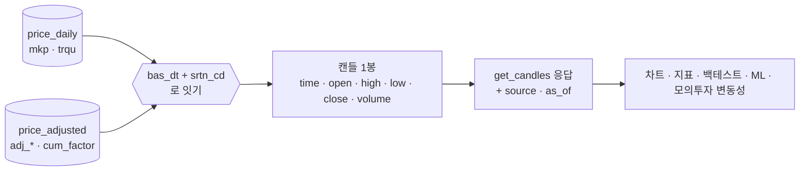
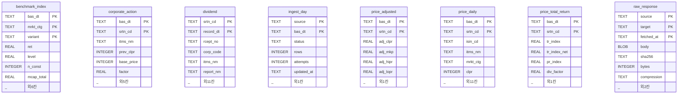

# ERD v1.1 — 이 프로젝트의 데이터는 어떻게 생겼나 (다시 잼)

> **구분**: 데이터 설계 (강사님 산출물 10구분 중 하나 · `docs/산출물목록.md`)
> **실측 도구**: `python scripts/schema_scan.py` — 이 문서의 **모든 표 이름·칸 이름·행 수는
> 그 출력에서 왔다.** 손으로 옮겨 적은 숫자는 없다. 의심스러우면 다시 돌리면 된다 — **v1.1 부터는
> 정말로 같은 출력이 나온다**(§0.1 재현성).
> **기준 커밋**: `df345b4` (+ 같은 세션 코드 PR `feat/collector-candles-df08` 의 다리 · 스캐너 수정) · **작성일** 2026-09-28 (KST) · S57
> **이전 판**: [ERD_v1.0.md](ERD_v1.0.md) (2026-09-21 · S42 · 이력으로 둔다) · **짝 문서**: [데이터사전_v1.1.md](데이터사전_v1.1.md)

---

## 0. 한눈에

| | 수집기 DB | 앱 DB |
|---|---|---|
| 무엇 | 시세·배당·지수 **원자료** | 사용자·주문·대화 **서비스 데이터** |
| 엔진 | SQLite (`data/collector/market.sqlite3`) | PostgreSQL |
| 표 | **8개** | **26개** |
| 칸 | **88개** | **259개** |
| 행 | **13,462,818행** 🟢 실측 (v1.0 13,431,190) | 🟡 **운영 DB 가 없다** — 대신 빈 DB 에 마이그레이션을 올려 모델과 대조했다(§5.3) |
| 스키마 출처 | 실제 파일을 열어 읽음 | SQLAlchemy 모델 정의 + **alembic 대조 🟢** |
| 확실도 | 🟢 **실측** | 🟡 **정의** · 모델 ↔ 마이그레이션은 🟢 **실측 대조**(4곳 어긋남) |

**용어 — ERD (Entity-Relationship Diagram · 개체관계도)**
- 뜻: 어떤 표(=개체)가 있고 그 표들이 서로 **어떻게 이어져 있는지** 그린 그림입니다.
- 이 문서에서: 표의 *모든 칸*은 그리지 않습니다. 키와 대표 칸만 그리고, 칸 전체는
  [데이터사전_v1.1.md](데이터사전_v1.1.md) 가 맡습니다. ERD 가 답해야 하는 질문은
  "이 표는 무엇과 이어지는가" 이기 때문입니다.
- 헷갈리는 점: ERD 에 선이 있다 = **DB 가 그 관계를 강제한다**는 뜻입니다. 선이 없어도
  사람 머릿속에서는 이어져 있을 수 있습니다 — 이 프로젝트가 정확히 그렇습니다(§2).

### 0.1 v1.0 → v1.1 에서 바뀐 것

강사님 일정표의 **10-06(화) 오전 칸**이 IA · 와이어프레임과 함께 ERD 를 본다. 그 전에 다시 쟀다(산출물목록 0.1절).
**스키마는 한 칸도 바뀌지 않았다** — 스캐너의 두 그림이 v1.0 과 글자 하나까지 같다. 바뀐 것은 **표 사이의 길**과 **값**이다.

| # | 바뀐 곳 | v1.0 (09-21) | v1.1 (09-28) | 확실도 |
|:-:|---|---|---|:-:|
| 1 | **두 DB 사이의 길** | 없음 — 앱이 수집 DB 를 여는 곳 0 | **하나** — 국내 주식 일봉을 `app/services/collector_db.py` 가 읽기 전용으로 읽는다(§1) | 🟢 |
| 2 | 수집기 행 수 | 13,431,190 | **13,462,818** · 시세 세 표가 **4,472,185 로 같아졌다** | 🟢 |
| 3 | 자동매매가 쓰는 표 | `quant_virtual_accounts` | **`paper_accounts`** (I14 · S53) → `quant_virtual_accounts` 는 **읽고 쓰는 코드 0곳** | 🟢 |
| 4 | 값 오염 DF-01 | 052670 300배 | **그대로 + 같은 유형 1곳 더**(086460) — 등락률 대조로는 안 잡힌다(§5.1) | 🟢 |
| 5 | 앱 DB 확인 수준 | 정적 파싱(표 26 = 26) | **빈 Postgres 에 마이그레이션 0001~0003 을 올려 `alembic check`** — 4곳 어긋남(§5.3) | 🟢 |
| 6 | 재현성 | 사전 7줄이 실행마다 달랐다(메모리 주소) | **두 번 돌려 같음** — 스캐너 수정 + 시험 2건 | 🟢 |

```
v1.0                                          v1.1
───────────────────────────────               ─────────────────────────────────────────
수집기 DB ──✕── 앱                              수집기 DB ──(읽기 전용 · 일봉만)──▶ 앱
  1,343만 행 · 화면 0줄                           get_candles 호출 14곳이 수집 DB 를 먼저 본다
자동매매 → quant_virtual_accounts               자동매매 → paper_accounts (수동 모의주문과 같은 행)
앱 DB = 모델에 적힌 것                           앱 DB = 모델 ↔ 실제 마이그레이션 대조(4곳 어긋남)
```

---

## 1. 🟡 두 DB 는 **이제 한 길로 이어졌다** — 일봉만

v1.0 의 첫 발견은 「1,343만 행을 모았는데 앱 화면은 그 데이터를 한 번도 읽지 않는다」였다.
S57 에 그 다리(옛 `#61` P1-1 · 결함대장 DF-08)를 놓았다. **다만 한 길뿐이다.**

```
┌─────────────────────────────┐        ┌──────────────────────────────┐
│  수집기 DB (SQLite)          │        │  앱 DB (PostgreSQL)           │
│  13,462,818행               │        │  사용자 · 주문 · 대화          │
│  ├ price_daily    4,472,185 │        │  ├ users · orders             │
│  ├ price_adjusted 4,472,185 │        │  ├ paper_accounts ← 자동매매도 │
│  ├ price_total_r. 4,472,185 │        │  └ … 26표                     │
│  ├ benchmark_idx     19,824 │        └──────────────┬───────────────┘
│  ├ dividend           9,188 │                       │
│  └ … 8표                    │                       │ 화면이 시세를 물으면
└──────┬──────────────────────┘                       ▼
       │  ✅ S57 새 길 (읽기 전용)         ┌──────────────────────────────┐
       │  price_adjusted ⋈ price_daily    │  app/services/stock.py        │
       └─────────────────────────────────▶│  get_candles()  ← 국내 주식 일봉 │
            app/services/collector_db.py  │  get_quote()    → 외부 API ❌  │
                                          │  지수·환율·해외·ETF → 외부 API ❌│
                                          └──────────────────────────────┘
                                            ▲ 차트 · 지표 · 백테스트 · ML (14곳)
```

**확인한 방법** 🟢:

| 물음 | v1.0 | v1.1 |
|---|---|---|
| 앱이 `market.sqlite3` 를 여는가 | `grep` **0건** | **1곳** — `app/services/collector_db.py` (읽기 전용 `mode=ro`) |
| 도커 앱 컨테이너에서 보이는가 | — | 🟢 compose 가 이미 `./data` 를 `/app/data/csv` 에 읽기 전용으로 붙인다 → `/app/data/csv/collector/market.sqlite3`. 같은 마운트를 컨테이너로 흉내 내 열리는 것을 확인(WAL 모드 · SQLite 3.46) |
| 화면의 일봉은 어디서 오는가 | 전부 외부 API | **국내 주식 일봉 → 수집 DB** · 지수 · 환율 · 해외 · ETF · 주봉 → 외부 API |
| 화면의 실시간 시세는 | 외부 API | 외부 API 그대로 — 수집기는 **다음 날 낮**에 전일 값을 받는다 |

### 1.1 다리가 읽는 칸 — 수집기 88칸 중 11칸

v1.0 은 「쓰이는지는 보지 않았다」(§5.2)였다. 다리가 생겼으니 수집기 쪽은 답할 수 있다.

| 표 | 칸 | 앱에서 되는 것 |
|---|---|---|
| `price_adjusted` | `bas_dt` · `srtn_cd` · `adj_clpr` · `adj_mkp` · `adj_hipr` · `adj_lopr` · `cum_factor` | 캔들의 날짜 · 시가 · 고가 · 저가 · 종가(수정주가) · 거래량 환산 계수 |
| `price_daily` | `bas_dt` · `srtn_cd` (잇는 열쇠) · `mkp` · `trqu` | 두 표를 같은 날 · 같은 종목으로 잇기 · 거래가 있었나(시가 0 = 없음) · 거래량 |



**아직 앱에 닿지 않는 표** — `price_total_return`(배당 재투자 TR) · `dividend` · `benchmark_index`(시장 지수 재현) ·
`corporate_action`. 옛 `#61` 의 「가장 값싼 승리」 중 하나였던 `benchmark_index` → 성과 화면 연결(P1-6)이 다음 길 후보다.

### 1.2 다리가 바꾼 뜻 — 마지막 봉은 **어제**다

수집 DB 는 공공데이터포털이 다음 날 낮에 주는 값을 받는다(collector/README §7). 그래서 다리를 건너온 일봉의
마지막 봉은 오늘이 아니라 **어제(휴일 뒤면 그 전)** 다. 응답에 `as_of` 칸을 더한 이유다.
「마지막 봉 종가 = 지금 가격」으로 쓰던 곳이 5곳 있다 — 자동매매 체결가(P-E)가 가장 급하다.
→ 이슈 초안 [`이슈-DF08-다리-뒤-기준일`](../../github-archive/2026-09-28/이슈-DF08-다리-뒤-기준일/00-본문.md)

---

## 2. 수집기 DB — 시세·배당·지수 🟢 실측

<!-- 아래 그림과 연결축 표는 `python scripts/schema_scan.py --erd` 의 출력을
     그대로 붙인 것이다. 손으로 고치지 말 것 — 고치면 다음 실행에서 어긋난다. -->



이 DB 는 **외래키를 선언하지 않는다.** 위 그림에 연결선이 없는 이유다. 실제로는 아래 칸들이 표를 잇는 축이다 — 선언이 아니라 **이름으로 추론한 것**이다.

| 연결 축 | 이 칸을 기본키로 쓰는 표 |
|---|---|
| `bas_dt` (6표) | `benchmark_index`, `corporate_action`, `ingest_day`, `price_adjusted`, `price_daily`, `price_total_return` |
| `source` (2표) | `ingest_day`, `raw_response` |
| `srtn_cd` (5표) | `corporate_action`, `dividend`, `price_adjusted`, `price_daily`, `price_total_return` |

### 2.1 왜 외래키가 없는가 — 그리고 그 대가

대량 적재에서는 제약이 순서를 강제합니다. 배당 공시를 먼저 받았는데 그 종목의 시세가
아직 안 들어왔다면, 외래키가 있으면 **적재가 거부됩니다.** 그래서 이 DB 는 제약을 걸지
않고, 대신 각 수집기가 스스로 검증합니다.

**대가는 분명합니다** — 무결성을 DB 가 지켜 주지 않습니다. `price_daily` 에 없는 종목이
`dividend` 에 있어도 DB 는 아무 말도 하지 않습니다. 그래서 `collector/*/verify` 명령들이
따로 존재합니다.

### 2.2 세 개의 시세 표는 왜 나뉘어 있나

```
price_daily          원본 그대로. 공공데이터포털이 준 값 (정수 원 단위)
  │                  └ 액면분할이 있으면 그 전후가 불연속이다 (그게 사실이니까)
  ├──▶ price_adjusted   분할·감자를 되돌린 값 (실수)
  │                     └ 가격만 맞춘다. 배당은 빠져 있다
  └──▶ price_total_return  배당까지 재투자한 값
                        └ "실제로 내 계좌가 얼마나 늘었나" 에 가장 가깝다
```

세 표의 행 수가 같은 것(**4,472,185 × 3** · v1.1 실측 — v1.0 때는 원본이 2,869행 많았다)은 **같은 (날짜, 종목)에
대해 세 가지 값을 각각 저장**하기 때문입니다. v1.0 의 차이는 파생 두 표가 마지막 며칠을 아직 안 만든 것이었고,
지금은 매일 12:30 일일 갱신(S53)이 원본 → 파생을 한 번에 돌려 세 표가 같이 간다. 한 표에 칸을 늘리지 않은 이유는, 조정값이
**나중에 다시 계산되기 때문**입니다 — 새 분할이 들어오면 과거 전체가 바뀝니다. 원본을
건드리지 않고 파생만 다시 만들려면 표가 갈라져 있어야 합니다.

---

## 3. 앱 DB — 사용자·주문·대화 🟡 모델 정의

26개 표 **전체**입니다. 한 화면에 안 들어올 만큼 크지만, 일부만 골라 그리면 그 순간
**어느 표를 뺐는지가 기록되지 않습니다** — 빠진 표는 없는 표처럼 보입니다. 그래서
스캐너 출력을 그대로 둡니다. 각 표의 전체 칸은 [데이터사전_v1.1.md](데이터사전_v1.1.md) 에
있고, 관계만 빠르게 보려면 **아래 §3.1 의 요약**을 먼저 보십시오.

### 3.1 관계 요약 — 20개 중 18개가 `users` 에서 뻗습니다

```
users ──┬──▶ orders ──▶ order_fills      (주문 1건 : 체결 여러 건)
        ├──▶ portfolio                   보유 종목
        ├──▶ paper_accounts              모의 현금 계좌 ← 수동 모의주문 · 자동매매 둘 다 (I14)
        ├──▶ broker_settings · api_keys  증권사 연결 · 발급 키
        ├──▶ conversations ──▶ chats     대화 1건 : 메시지 여러 건
        ├──▶ crypto_orders · crypto_holdings
        ├──▶ alternative_orders · alternative_positions
        ├──▶ custom_indicators           3차 커스텀 지표
        ├──▶ lean_backtest_runs          백테스트 실행 기록
        └──▶ audit_events                감사 로그
```

`users` 에서 뻗지 않는 관계는 **둘뿐**입니다 — `conversations → chats`,
`orders → order_fills`. 나머지 표(`bank_products`·`fund_products`·`data_cache` 등)는
**사용자에 매이지 않는 참조 데이터**라 관계선이 없습니다.

```mermaid
erDiagram
  alternative_orders {
    UUID user_id FK
    UUID id PK
    VARCHAR_30 symbol
    VARCHAR_100 name
    VARCHAR_20 category
    VARCHAR_4 order_type
    _ 외6칸
  }
  alternative_positions {
    UUID user_id FK
    UUID id PK
    VARCHAR_30 symbol
    VARCHAR_20 category
    INTEGER quantity
    FLOAT avg_price
    _ 외1칸
  }
  api_keys {
    UUID user_id FK
    UUID id PK
    VARCHAR_100 label
    VARCHAR_16 key_prefix
    VARCHAR_64 key_hash
    BOOLEAN is_active
    _ 외3칸
  }
  audit_events {
    UUID user_id FK
    UUID id PK
    VARCHAR_64 client_id
    VARCHAR_80 event_type
    JSONB payload
    DATETIME created_at
  }
  bank_products {
    UUID id PK
    VARCHAR_20 bank_code
    VARCHAR_100 bank_name
    VARCHAR_50 product_code
    VARCHAR_300 product_name
    _ 외11칸
  }
  broker_settings {
    UUID user_id FK
    UUID id PK
    VARCHAR_20 broker
    VARCHAR_200 app_key
    VARCHAR_200 app_secret
    VARCHAR_50 account_no
    _ 외9칸
  }
  chats {
    UUID user_id FK
    UUID conversation_id FK
    UUID id PK
    VARCHAR_32 client_id
    TEXT question
    TEXT answer
    JSONB steps
    _ 외2칸
  }
  conversations {
    UUID user_id FK
    UUID id PK
    VARCHAR_200 title
    INTEGER message_count
    DATETIME created_at
    DATETIME updated_at
  }
  corporate_cb_stats {
    UUID id PK
    VARCHAR_20 bs_dt
    VARCHAR_10 sic_cd
    INTEGER wg_gb
    INTEGER cnt
    _ 외2칸
  }
  crawled_docs {
    UUID id PK
    VARCHAR_1000 url
    VARCHAR_500 title
    TEXT content
    VARCHAR_200 source
    _ 외1칸
  }
  crypto_holdings {
    UUID user_id FK
    UUID id PK
    VARCHAR_30 market_code
    VARCHAR_100 korean_name
    FLOAT quantity
    FLOAT avg_price
    _ 외2칸
  }
  crypto_orders {
    UUID user_id FK
    UUID id PK
    VARCHAR_30 market_code
    VARCHAR_100 korean_name
    VARCHAR_4 order_type
    FLOAT quantity
    _ 외4칸
  }
  custom_indicators {
    UUID user_id FK
    UUID id PK
    VARCHAR_60 name
    VARCHAR_20 base
    INTEGER short_window
    INTEGER mid_window
    _ 외3칸
  }
  data_cache {
    UUID id PK
    VARCHAR_200 key
    JSONB data
    DATETIME updated_at
  }
  fund_products {
    UUID id PK
    VARCHAR_20 eval_date
    VARCHAR_50 fund_code
    VARCHAR_300 fund_name
    VARCHAR_200 company_name
    _ 외11칸
  }
  lean_backtest_runs {
    UUID user_id FK
    UUID id PK
    VARCHAR_20 ticker
    VARCHAR_20 strategy
    VARCHAR_60 engine
    VARCHAR_10 start_date
    _ 외6칸
  }
  notification_log {
    UUID user_id FK
    UUID id PK
    VARCHAR_300 subject
    VARCHAR_500 message
    JSONB channels
    DATETIME created_at
  }
  notification_settings {
    UUID user_id FK
    UUID id PK
    JSONB channels
    VARCHAR_200 telegram_token
    VARCHAR_100 telegram_chat_id
    VARCHAR_300 slack_webhook_url
    _ 외15칸
  }
  order_fills {
    UUID order_id FK
    UUID id PK
    INTEGER seq
    FLOAT fill_price
    INTEGER fill_quantity
    DATETIME fill_at
    _ 외7칸
  }
  orders {
    UUID user_id FK
    UUID id PK
    VARCHAR_20 symbol
    VARCHAR_100 name
    VARCHAR_10 order_type
    INTEGER quantity
    _ 외17칸
  }
  paper_accounts {
    UUID user_id FK
    UUID id PK
    FLOAT cash
    FLOAT initial_cash
    DATETIME created_at
    DATETIME updated_at
  }
  personal_cb_stats {
    UUID id PK
    VARCHAR_20 stdt
    INTEGER gender
    INTEGER age_band
    INTEGER cnt
    _ 외4칸
  }
  portfolio {
    UUID user_id FK
    UUID id PK
    VARCHAR_20 symbol
    VARCHAR_100 name
    INTEGER quantity
    FLOAT avg_price
    _ 외1칸
  }
  quant_virtual_accounts {
    UUID user_id FK
    UUID id PK
    FLOAT initial_capital
    FLOAT cash_balance
    DATETIME created_at
    DATETIME updated_at
  }
  uploaded_docs {
    UUID user_id FK
    UUID id PK
    VARCHAR_300 filename
    VARCHAR_320 uploader
    VARCHAR_400 source_key
    INTEGER chunks
    _ 외3칸
  }
  users {
    UUID id PK
    VARCHAR_200 name
    VARCHAR_320 email
    VARCHAR_200 password_hash
    VARCHAR_32 client_id
    _ 외2칸
  }
  users ||--o{ alternative_orders : "user_id"
  users ||--o{ alternative_positions : "user_id"
  users ||--o{ api_keys : "user_id"
  users ||--o{ audit_events : "user_id"
  users ||--o{ broker_settings : "user_id"
  users ||--o{ chats : "user_id"
  conversations ||--o{ chats : "conversation_id"
  users ||--o{ conversations : "user_id"
  users ||--o{ crypto_holdings : "user_id"
  users ||--o{ crypto_orders : "user_id"
  users ||--o{ custom_indicators : "user_id"
  users ||--o{ lean_backtest_runs : "user_id"
  users ||--o{ notification_log : "user_id"
  users ||--o{ notification_settings : "user_id"
  orders ||--o{ order_fills : "order_id"
  users ||--o{ orders : "user_id"
  users ||--o{ paper_accounts : "user_id"
  users ||--o{ portfolio : "user_id"
  users ||--o{ quant_virtual_accounts : "user_id"
  users ||--o{ uploaded_docs : "user_id"
```



관계는 **20개**가 선언돼 있고, 그중 **18개가 `users` 에서 뻗습니다.** 나머지 둘은
`conversations → chats`, `orders → order_fills` 입니다.

### 3.2 `orders` 와 `order_fills` 가 나뉜 이유 — D7 논의와 직결됩니다

주문 1건이 **여러 번에 나눠 체결**될 수 있습니다. 그래서 주문(`orders`)과 체결
(`order_fills`)이 따로 있습니다. 여기에 D7 옛 논의 `#13`([기록](../../github-archive/2026-09-15/논의-013/00-기록.md))
⑥-1 에서 합의한 **비용 출처 구분**이 들어갑니다:

| 칸 | 값 | 뜻 |
|---|---|---|
| `orders.cost_basis` | `none` | 비용을 안 뗐다 (무비용 대조용) |
| | `estimated` | **우리 요율표**(`trading_cost.py`)로 계산했다 |
| | `broker` | **증권사가 실제로 뗀** 금액이다 |

같은 표 · 같은 행에서 두 출처가 **칸 하나로 구분**되므로 섞이지 않습니다.

### 3.3 아무도 안 쓰는 표 — `quant_virtual_accounts` (v1.1 새로 봄)

I14(S53 · `#24` · PR `#25`)가 자동매매의 현금을 `quant_virtual_accounts`(초기 1천만 원) 대신 `paper_accounts`(초기 1억 원)에서
빼게 바꿨다. 두 장부가 따로 놀아 **자동매매가 산 주식이 공짜가 되던** 결함(+3.19%)을 닫은 것이다.

```
I14 전                                       I14 뒤 (지금)
users ──▶ paper_accounts        ← 수동 주문   users ──▶ paper_accounts        ← 수동 주문 + 자동매매
      └─▶ quant_virtual_accounts ← 자동매매         └─▶ quant_virtual_accounts ← 아무도 안 씀
```

| 무엇 | 지금 | 확실도 |
|---|---|:-:|
| 모델 `QuantVirtualAccount` | 남아 있다 — 클래스 설명에 「쓰지 않는다」 | 🟢 |
| 마이그레이션 0001 의 표 생성 | 남아 있다 | 🟢 |
| 읽거나 쓰는 코드 (`app/` 전체) | **0곳** — `auto_trade.py` 의 머리말 설명 두 줄만 이름을 부른다 | 🟢 |

표를 지우는 것은 마이그레이션이 필요한 일이라 I14 범위 밖으로 남겼다(산출물목록 12절). **이 ERD 에는 선이 그대로 있다** —
「선이 있다 = 쓰인다」가 아니라는 예다.

---

## 4. 이 ERD 가 드러낸 것 — v1.0 의 발견 4개는 어떻게 됐나 + 새로 3개

| # | 발견 | v1.0 | v1.1 (09-28 다시 잼) | 근거 |
|---|---|:--:|:--:|---|
| **1** | **두 DB 가 이어져 있지 않다** | 🔴 | 🟡 **일봉만 이어졌다** — 실시간 시세 · 지수 · 환율 · 해외 · 펀더멘털 · LEAN 은 아직 외부 API | §1 · `collector_db.py` |
| **2** | `benchmark_index` 가 `collector/db.py` 의 SCHEMA 상수에 없다 | 🟡 | 🟡 **그대로** | 스캐너 대조 출력 |
| **3** | 수집기 DB 는 외래키를 하나도 선언하지 않는다 | 🟡 | 🟡 **그대로** — 대신 §5.1 의 주식 수 검사를 시험에 넣었다 | `PRAGMA foreign_key_list` |
| **4** | 앱 DB 의 실제 모양을 모른다 | 🟡 | 🟢 **마이그레이션은 확인** — 모델과 **4곳 어긋남**. 운영 DB 행 수는 여전히 모른다(운영 DB 가 없다) | §5.3 |
| **5** ★ | **DF-01 유형 — 포털이 기준가를 조정하지 않은 감자 · 병합** | — | 🔴 **2곳** (052670 · 086460). 다리가 생겨 차트에서 그대로 보인다 | §5.1 |
| **6** ★ | **`quant_virtual_accounts` — 아무도 안 쓰는 표** | — | 🟡 I14 뒤 읽고 쓰는 코드 0곳. 모델 · 마이그레이션 · 표는 남아 있다 | §3.3 |
| **7** ★ | **스캐너가 실행마다 다른 사전을 냈다** | — | 🟢 **고침** — 함수 기본값 7칸의 메모리 주소 | 데이터사전 v1.1 §0 |

```
            v1.0                   v1.1
 발견 1   🔴 이어지지 않음   ──▶   🟡 일봉 한 길
 발견 2   🟡 SCHEMA 밖       ──▶   🟡 그대로
 발견 3   🟡 외래키 0        ──▶   🟡 그대로 (시험이 대신 본다)
 발견 4   🟡 앱 DB 모름      ──▶   🟢 마이그레이션 대조 · 4곳 어긋남
 새 5     ──                 ──▶   🔴 DF-01 유형 2곳
 새 6     ──                 ──▶   🟡 죽은 표 1
 새 7     ──                 ──▶   🟢 재현성 고침
```

**발견 2 가 왜 아직 문제인가** (v1.0 그대로): 스키마를 한곳에서 읽을 수 없습니다. `collector/db.py` 만 보고
"이 DB 에는 7개 표가 있다"고 믿으면 틀립니다. 실제로는 8개입니다. 이번 다리(`collector_db.py`)도 표 이름을
스스로 알고 있어서, 표 모양이 바뀌면 **세 곳**(`db.py` · `benchmark.py` · `collector_db.py`)을 같이 고쳐야 합니다.
다리 쪽은 시험이 수집기의 실제 `SCHEMA` 로 픽스처 DB 를 만들어 어긋남을 잡습니다.

---

## 5. 한계 — 이 문서가 답하지 **않는** 것 (v1.1 에서 좁힌 것 포함)

### 5.1 값이 옳은지 — DF-01 을 다시 쟀습니다 🟢

스캐너는 여전히 값을 보지 않습니다. 대신 이번 판에서 **알려진 오염 하나를 손으로 다시 쟀습니다.**

| 날짜 | `adj_clpr` | 주식 수 | 포털 `vs` · 등락률 |
|---|---:|---:|---|
| 2026-02-06 (거래정지 중) | 2,080 | 29,129,064 | 0 · 0.00% |
| 2026-02-09 (감자 뒤 재개) | **625,000** | **19,419** | 622,920 · **+29,948.08%** |

- **그대로다.** 1,500:1 감자인데 조정 종가가 하루에 300배가 된다(옛 `#55` [기록](../../github-archive/2026-09-21/이슈-055/00-기록.md) 과 같은 값).
- 원인이 한 겹 더 보였다 — **포털이 준 `vs`(전일대비) 자체가 기준가를 조정하지 않았다.** 장기 거래정지 뒤라 기준가가
  정지 전 종가(2,080)로 남아 있다. 그래서 등락률도 +29,948% 로 함께 틀린다.
- **같은 유형 한 곳 더** — 086460 큐러블 2025-08-07: 386일 정지 뒤 주식 수 2,939,400 → 146,970(20:1), 조정 이벤트 없음.
- 전 종목 실측: 「주식 수가 하루에 1/5 아래로 줄었는데 `corporate_action` 이 없는 날」 = **2곳**(위 둘). 🟢
  (조정 종가가 하루에 2배 넘게 뛰거나 0.4배 아래로 떨어진 날은 162종목 219일이지만, 정리매매 · 신규상장처럼 가격제한폭이
  없는 날이 섞여 있어 **결함 수로 세지 않는다** 🟡.)

> ⚠️ **대조의 사각지대** — 수정주가와 등락률은 같은 포털 값(`vs`)에서 나온다. 포털이 틀린 날은 **둘이 함께 틀려**
> 「수정 수익률 = 거래소 등락률」 대조를 통과한다. 다리 시험(TC-CD)은 그래서 **주식 수**라는 다른 칸으로 한 번 더 본다
> (스크리닝 유니버스 31종목에는 0곳). 고치는 곳은 `collector/preprocess.py` — `vs` 가 0 이거나 믿을 수 없을 때
> 주식 수 비율을 대체 신호로 쓰는 것(옛 `#55` §4). 데이터 파트의 다음 일이다.

### 5.2 쓰이는지 — 수집기 쪽만 답했습니다

v1.0 은 「쓰이는지 보지 않았다」였다. v1.1 은 **수집기 88칸 중 11칸이 앱에 닿는다**(§1.1)까지 답한다.
앱 DB 26표 중 화면이 실제로 쓰는 것이 몇 개인지는 여전히 범위 밖이다(RTM · 화면 IA 가 다룬다).
한 가지는 확실하다 — **`quant_virtual_accounts` 는 쓰는 코드가 0곳**이다(§3.3).

### 5.3 앱 DB 는 🟡 "정의" 입니다 — 그러나 이번엔 실제 DB 에 올려 대조했습니다

v1.0 은 마이그레이션 파일의 `op.create_table("x"` 를 **글자로 세어** 모델과 맞췄다(26 = 26). v1.1 은 한 걸음 더 갔다 —
빈 Postgres(`pgvector/pgvector:pg16`)를 띄워 **마이그레이션 0001 → 0002 → 0003 을 실제로 올리고**, alembic 의
`command.check` 로 **그 DB 와 모델을 대조**했다. 컨테이너는 끝나고 지웠다.

```
마이그레이션을 올린 DB 의 표       27개  (26 + alembic_version)
모델이 선언한 표                  26개   ✅ 표 이름은 일치
모델 ↔ 실제 DB 대조 (command.check)
  ⚠️ 마이그레이션에만 있는 인덱스   ix_api_keys_user · ix_portfolio_user_id · ix_users_client_id
  ⚠️ 모델만 다르게 적은 제약        users.client_id — 모델은 UniqueConstraint, DB 는 유일 인덱스
```

- **4곳 어긋남은 새것이 아니다.** 2026-09-20(S34)에 같은 검사로 찾은 4건이 **그대로** 남아 있다. 어긋남은 **인덱스 선언**뿐이고
  표 · 칸은 맞는다. 그래서 동작에는 영향이 없지만, 다음에 `alembic revision --autogenerate` 를 돌리면 이 4개를 **지우는**
  마이그레이션이 만들어진다 — 누군가 모르고 받으면 인덱스가 사라진다. 🟢
- 누가 고치나 — 모델 파일은 표마다 주담당 파트가 다르다(분배안 v1.0). 고치는 방법은 모델에 `Index(...)` 3줄과 제약 표기 1줄을
  더하는 것이다. 팀 결정으로 남긴다.
- ⚠️ 이것도 **운영 DB 를 본 것은 아니다.** 운영 DB 가 따로 없고(AWS 보류), 팀원 각자의 로컬 DB 는 이 대조와 다를 수 있다.

---

## 6. 다시 만드는 법

```bash
python scripts/schema_scan.py          # 사람이 읽는 요약 + 어긋난 곳
python scripts/schema_scan.py --erd    # 이 문서의 그림
python scripts/schema_scan.py --md     # 데이터 사전
python scripts/schema_scan.py --json   # 기계용
```

수집기 DB 파일(`data/collector/market.sqlite3`)은 `.gitignore` 대상이라 저장소에 없습니다.
파일이 없으면 스캐너는 **수집기 부분을 건너뛰고 앱 부분만** 출력합니다 — 멈추지 않습니다.

§5.3 의 alembic 대조는 스캐너 밖의 일이다. 저장소 루트에서 돌리면 루트의 `alembic/` 폴더가 설치된 패키지를 가린다 —
**다른 폴더에서** `Config(<루트>/alembic.ini)` + `script_location=<루트>/alembic` 으로 `command.upgrade(cfg, "head")` →
`command.check(cfg)` 를 부른다(`DATABASE_URL` 을 빈 Postgres 로).

---

## 7. 관련 문서 · 기록

- [데이터사전_v1.1.md](데이터사전_v1.1.md) — 34개 표 **347칸 전체** · [v1.0](데이터사전_v1.0.md)
- [ERD_v1.0.md](ERD_v1.0.md) — 이전 판 (09-21)
- 다리 — `app/services/collector_db.py` · `tests/test_collector_candles_df08.py` · 이슈 초안 [`이슈-DF08-다리-뒤-기준일`](../../github-archive/2026-09-28/이슈-DF08-다리-뒤-기준일/00-본문.md)
- 옛 `#61` P1-1 — `get_candles` → 수집 DB 어댑터 ([기록](../../github-archive/2026-09-21/이슈-061/00-기록.md))
- 옛 `#55` — `adj_clpr` 052670 오염 · DF-01 ([기록](../../github-archive/2026-09-21/이슈-055/00-기록.md))
- 옛 `#56` — 코스닥 재현 오차 0.871% · DF-02 ([기록](../../github-archive/2026-09-21/이슈-056/00-기록.md))
- [테스트계획서 v1.1](../../시험/지난판/테스트계획서_v1.1.md) 6.1절 — TC-CD · DF-01 · DF-08 변경 노트
