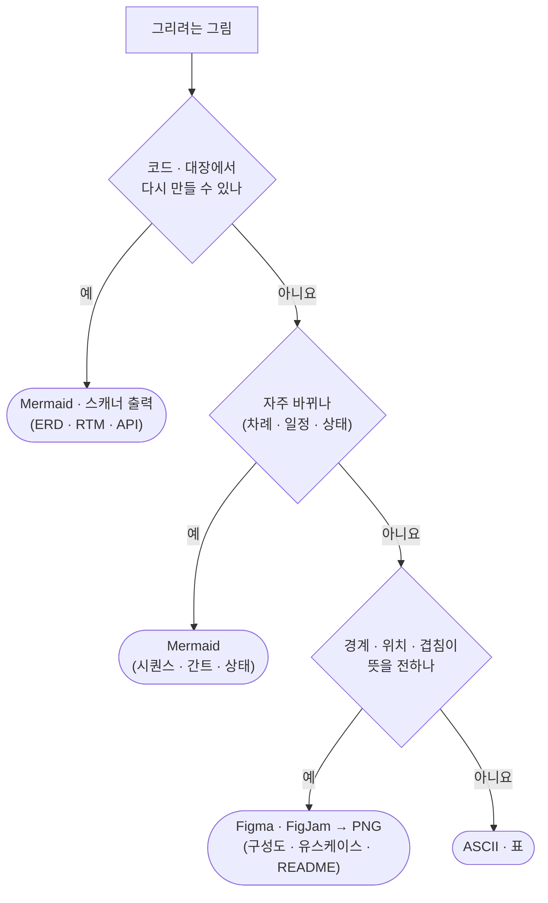
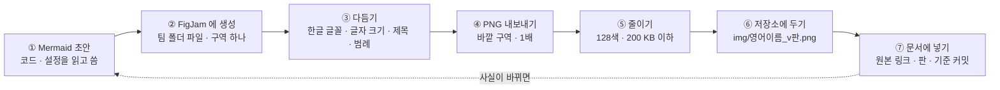
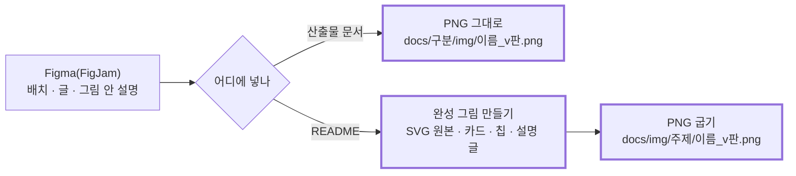

# 문서 그림 지침 v0.1 — Qurious

| 문서 정보 | |
|---|---|
| **판 · 상태** | v0.1 · 초안(검토 전) |
| **구분** | 1. 착수·과업 정의 — 표준화 계획([문서 작성 기준 v0.2](문서작성기준_v0.2.md))의 6절 「표와 그림 규칙」 을 보탠다 |
| **작성** | 이동원 |
| **검토** | 검토 전 — 판을 올리는 PR 에 팀원 한 명 이상의 「읽었음」 |
| **최종 수정** | 2026-10-03 (KST) |
| **기준** | 코드 `main` `7afe5e9` · Figma 파일 [Qurious · 문서 그림 (산출물 · README)](https://www.figma.com/board/qTCGg7PlmpGNZT5uM8VQGm) |
| **관련 문서** | [문서 작성 기준 v0.2](문서작성기준_v0.2.md) 6절 · [화면 설계 절차 v0.2](화면/화면설계절차_v0.2.md) · [인프라 · 네트워크 구성도 v0.1](설계/인프라-네트워크구성도_v0.1.md)(첫 적용) |
| **최근 개정** | 새 문서 |

> **이 문서로 알 수 있는 것**
> 1. 이 그림은 Mermaid 로 문서 안에 두나, Figma 에서 그려 넣나?
> 2. Figma 에서 그린 그림은 어떻게 저장소 문서 · README 에 넣고, 판을 어떻게 맞추나?
> 3. 손으로 그린 그림이 코드와 어긋나지 않게 무엇을 점검하나?
>
> **읽는 순서** — 그림을 그리는 사람: 1절 → 2절 → 3절 · README 를 고치는 사람: 4절 · 읽기만 하는 사람: 요약

## 요약

1. **코드 · 대장에서 다시 만드는 그림은 지금처럼 Mermaid 로 둔다** — ERD · RTM · API 표 · 시퀀스 · 일정 간트. 글자라서 검색되고 PR 에서 바뀐 줄이 보이며, 스캐너가 코드에서 다시 그린다.
2. **모양 · 배치가 뜻을 전하는 그림은 Figma(FigJam)에서 깔끔하게 그려 PNG 로 넣는다** — 인프라 · 네트워크 · 배포 구성도, 유스케이스 그림. 그림 아래에 원본 링크 · 그림 판 · 기준 커밋을 적고, 그 그림의 Mermaid 원문은 접어 둔다(검색 · 다시 그리기 · 화면 낭독용).
3. **README 그림은 두 단계다** — Figma 그림을 **초안**(배치 · 글 · 그림 안에 넣을 설명)으로 쓰고, 그 초안을 바탕으로 **정갈한 완성 그림**을 따로 만든다(지금 README 첫 그림 아키텍처 v2.0 처럼 SVG 원본 + PNG). README 는 처음 온 사람이 가장 먼저 보고, 그림 안에 설명을 넣어야 할 때가 많기 때문이다(4절).
4. **원본은 Figma 팀 폴더의 FigJam 파일 한 곳**(그림 하나 = 구역 하나)이고, 저장소에는 판마다 새 PNG 파일을 둔다. 판을 올릴 때 「그림이 그린 사실이 코드와 같은가」 를 점검표로 본다(6절). Figma 를 쓰는 가장 큰 까닭은 **문서의 정갈한 디자인 · 시각 자료**다.

---

## 1. 무엇으로 그리나

기준은 둘이다 — **코드가 바뀌면 그림도 저절로 바뀌어야 하나**(그렇다면 Mermaid · 스캐너), **경계 · 위치 · 겹침이 뜻을 전하나**(그렇다면 Figma).

**<표 1> 그림 종류 → 도구**

| 그림이 답할 질문 | 이 프로젝트의 예 | 도구 | 까닭 |
|---|---|---|---|
| 표가 어떻게 이어지나 · 요구가 어디까지 왔나 · API 는 몇 개인가 | ERD · RTM · API 표 | **Mermaid · 스캐너 출력** | 스캐너(`schema_scan` · `rtm_scan` · `api_scan`)가 코드에서 다시 그린다 — 손 그림은 코드와 어긋나도 시험이 못 잡는다 |
| 누가 누구를 어떤 차례로 부르나 | 로그인 유지 · 근거 검색 시퀀스 | Mermaid | 함수가 바뀌면 같은 PR 에서 글자로 고친다 |
| 언제 무엇을 하나 | 스프린트 · 마일스톤 간트 | Mermaid | 일정이 자주 바뀐다 |
| 상태가 어떻게 바뀌나 | 주문 · 문서 상태 | Mermaid | 위와 같다 |
| 어디에 무엇이 놓이고 어떤 길 · 포트로 닿나 | 인프라 · 네트워크 · 배포 구성도 | **Figma(FigJam)** | 경계(이 PC · 도커 망 · 인터넷)와 포트가 뜻을 전한다 · 자주 바뀌지 않는다 |
| 누가 무엇을 하나 | 유스케이스 그림 | **Figma(FigJam)** | Mermaid 에 유스케이스 그림 종류가 없다 |
| 처음 온 사람이 첫눈에 무엇을 보나 | README 첫 그림 · 발표 그림 | **Figma 초안 → 완성 그림(SVG · PNG)** | 독자가 가장 많은 그림 · 그림 안 설명 · 다크 · 라이트 화면 둘(4절) |
| 화면이 어떻게 생겼나 | 와이어프레임 · 화면 설계 | Figma(Design) | [화면 설계 절차](화면/화면설계절차_v0.2.md)가 따로 있다 |
| 얼마나 큰가 · 무엇이 바뀌었나 | 수량 막대 · 전후 비교 | ASCII · 표 | 문서 작성 기준 6.2 |

그림 1 은 같은 판정을 차례로 보인다.

**<그림 1> 이 그림은 어디서 그리나** · 범례: 마름모 = 질문 · 둥근 끝 = 도구



Figma 로 옮기는 것은 「경계가 있는 구성도」 와 「첫눈에 보는 그림」 뿐이다. 나머지는 Mermaid 가 낫다 — 실무 문서 규칙도 Mermaid 를 기본으로 권하되 모든 경우에 맞지는 않다고 하고 [G2], 그림 도구 밖에 있는 그림은 PR 에서 함께 고쳐지지 않아 낡는다고 본다 [M1][D1].

---

## 2. Figma 그림 만드는 흐름

숫자는 첫 적용(인프라 · 네트워크 구성도 그림 1)에서 잰 값이다.

**<그림 2> 문서 그림 한 장이 만들어지는 길** · 범례: 실선 = 차례 · 점선 = 판을 올릴 때 다시 도는 길



**<표 2> 단계마다 할 일**

| 단계 | 할 일 | 첫 적용에서 잰 것 · 주의 |
|---|---|---|
| ① 초안 | 그릴 사실을 **코드 · 설정에서 읽고** Mermaid 로 먼저 쓴다. 모르는 길은 그리지 않는다 | `docker-compose.yml` 서비스 9 · 포트 · 외부 주소(앱 · 수집기 코드의 주소 문자열)를 읽고 그렸다 |
| ② 생성 | FigJam 파일 [Qurious · 문서 그림](https://www.figma.com/board/qTCGg7PlmpGNZT5uM8VQGm)에 그림을 만든다. Figma MCP `generate_diagram` 은 Mermaid 로 FigJam 그림을 만든다(흐름도 · 시퀀스 · 상태 · 간트 · ERD 만) [F3] | 「구조도 배치」 모드는 구역 이름이 client · gateway · service · datastore · external · async 로 고정이라, **경계(이 PC · 도커 망)를 그리는 네트워크 그림에는 일반 흐름도**가 맞았다 |
| ③ 다듬기 | 한글 글꼴을 **Noto Sans KR** 로 · 글자 크기를 키운다 · 흰 바탕 바깥 구역에 제목 · 기준 · 범례 · **구역 안에 이름표 글자** | 생성 그림은 Inter 글꼴이라 한글이 대체 글꼴로 나온다 · 캔버스가 2,600px 라 문서 폭 1,000px 로 줄면 16px 글자가 약 6px 가 된다 → 도형 26 · 선 22 · 제목 64 · 기준 · 범례 28 · **구역 이름은 내보낸 그림에 찍히지 않는다** |
| ④ 내보내기 | 바깥 구역을 PNG **1배**로 | 2,680 × 2,602 · 234 KB. SVG 는 1배만 되고 글자를 윤곽선으로 바꾸는 설정이 기본으로 켜져 있어 [F1] 한글이 검색 · 선택되지 않는다 → PNG 를 기본으로 |
| ⑤ 줄이기 | 128색 팔레트로 줄인다(아래 명령) | 234 KB → 101 KB · 1,000px 로 줄여 읽히는지 눈으로 본다 · 실무 규칙의 100 KB [G2] 는 화면 캡처 기준이라 구성도는 **200 KB 이하**를 목표로 |
| ⑥ 저장 | `docs/<구분 폴더>/img/<영어-소문자-이름>_v<판>.png` | 한글 파일 이름은 Figma 레이어 · 일부 도구에서 깨진 적이 있다 · 판을 올리면 새 파일(옛 판은 지우지 않는다) |
| ⑦ 넣기 | 3절 모양 그대로 | 대체 글은 그림의 결론을 155자 안에 [G2] |
| ⑧ 판 이름 | Figma 파일 메뉴 「Save to version history」 에 문서 이름과 판(예: 「인프라 · 네트워크 구성도 v0.1」) | 사람이 한다 — 교육 요금제는 판 이력을 전부 보관한다(Starter 는 30일) [F2] · **Figma 링크는 늘 최신을 연다** [F2] → 옛 판의 모습은 저장소의 옛 PNG 가 증거다 |

⑤ 의 명령(저장소 밖 도구 없이 Pillow 만):

```bash
python -c "from PIL import Image; f='docs/설계/img/infra-local-network_v0.1.png'; Image.open(f).quantize(colors=128, method=Image.Quantize.FASTOCTREE).save(f, optimize=True)"
```

> 팀원이 손으로 그릴 때는 FigJam 에서 직접 그리고 ③ ~ ⑦ 만 따른다. Mermaid 원문이 있으면 이동원에게 주면 ② 를 대신 돌린다.

---

## 3. 문서에 넣는 모양 — 복사해서 쓴다

[문서 작성 기준 v0.2](문서작성기준_v0.2.md) 6.1(캡션 「<그림 N> 제목 · 범례」 → 그림 → 출처 · 기준 → 본문에서 「<그림 N> 과 같이」 로 부르기)에 두 줄을 더한다. **원본 · 판 줄**과 **접힌 Mermaid 원문**이다.

````markdown


**<그림 1> 로컬 네트워크 구성도** · 범례: 실선 = 늘 쓰는 길 · 점선 = 필요할 때만


<sub>원본: [Figma · 문서 그림 · 그림 1](https://www.figma.com/board/qTCGg7PlmpGNZT5uM8VQGm?node-id=3-100) · 그림 판 v0.1 · 기준 `7afe5e9` · 2026-10-03</sub>

<details><summary>그림 원문(Mermaid) — 검색 · 다시 그리기용</summary>

```mermaid
flowchart LR
  …
```

</details>

이 PC 밖으로 열리는 포트는 … 이다.
````

- 그림의 결론은 **글에도** 쓴다 — Discord · 인쇄 · 화면 낭독 프로그램에서는 그림이 안 보인다(문서 작성 기준 6.1 ⑥).
- 원문(Mermaid)은 그림과 같은 사실을 담는다. 판을 올릴 때 둘을 함께 고친다(6절).

---

## 4. README 그림

README 는 GitHub 저장소 첫 화면이라 독자가 가장 많고, 처음 온 사람이 그림 하나로 전체를 잡아야 한다. 그래서 그림 **안에** 설명(각 칸이 무엇을 하나 · 보안 경계 같은 약속)을 넣어야 할 때가 많다. README 그림은 **두 단계**로 만든다 — 

**<그림 3> 일반 문서 그림과 README 그림** · 범례: 실선 = 차례 · 굵은 상자 = 저장소에 들어가는 것



**<표 3> 두 단계의 몫**

| 단계 | 하는 일 | 결과물 | 지금 본보기 |
|---|---|---|---|
| ① 초안 — Figma | 무엇을 어디에 둘지 · 칸마다 넣을 설명 글 · 화살표를 정한다. 사용자 · 팀과 이 그림으로 의견을 모은다 | Figma 구역 하나(이 문서 2절 흐름의 ① ~ ③) | — |
| ② 완성 그림 | 초안의 배치와 글을 그대로 옮겨 **정갈한 디자인**으로 다시 그린다 — 어두운 바탕 카드 · 색 칩 · 카드 안 설명 · 범례 줄 | **SVG 원본**(글자라서 git 에서 바뀐 줄이 보인다) + 그 SVG 를 구운 **PNG** | README 첫 그림 [아키텍처 v2.0](img/architecture/qurious-architecture_v2.0.png) — SVG 2,752 × 1,536 · 글 72줄 · 카드 안 설명 · 보안 경계 칩 일곱 |

- **일반 산출물 문서 그림은 ① 만 한다** — Figma 에서 깔끔하게 그린 것을 PNG 로 그대로 넣는다(2절 · 3절). README 수준의 완성 그림까지 만들 필요는 없다.
- 완성 그림 SVG 의 `<title>` · `<desc>` 에 그림의 결론을 적는다 — v2.0 이 그렇게 되어 있다(화면 낭독 · 검색).
- 독자의 GitHub 화면은 밝을 수도 어두울 수도 있다. 어두운 바탕 카드 그림(v2.0)은 어느 화면에서도 한 장으로 읽힌다. 밝은 판 · 어두운 판을 따로 둘 때는 `<picture>` 안에 `media="(prefers-color-scheme: dark)"` 판을 넣는다 — GitHub 공식 방법이고, 옛 `#gh-dark-mode-only` 꼬리표는 폐기됐다 [G1].

```html
<picture>
  <source media="(prefers-color-scheme: light)" srcset="docs/img/architecture/qurious-architecture_v2.1-light.png">
  
</picture>
```

- 폴더 README(`docs/**/README.md` · `scripts/personal/README.md` 등)도 같은 판정을 따른다 — 처음 온 사람이 보는 첫 그림이면 두 단계, 설명용 그림이면 ① 만.
- `readme.md` 와 폴더 README 는 팀이 함께 고치는 파일이다 — 고치기 전에 팀원의 열린 PR 을 확인한다.
- 다음 README 첫 그림(아키텍처 v2.1)은 이 두 단계로 만드는 첫 대상이다(부록 C).

---

## 5. 그림 모양 — 세로로 길어질 때

FigJam 그림 도구는 같은 층(한 행위자에 붙은 유스케이스들처럼)에 놓인 상자를 **한 줄로 쌓는다**. 그래서 한 사람에게서 선이 여럿 나가는 그림은 세로로 길어진다 — 유스케이스 그림 첫 판이 1,768 × 3,617 이었다. 문서는 폭 1,000px 안팎으로 보이므로 세로로 긴 그림은 글자가 작아지고 스크롤이 길다. 실무 규칙도 화면 그림을 폭 1,000 · 높이 500 안으로 둔다 [G2]. 

**<표 4> 세로로 길어질 때 고르는 방법** · 위에서부터 먼저 해 본다

| # | 방법 | 이렇게 | 언제 | 근거 |
|:-:|---|---|---|---|
| ① | **개요 + 상세로 나누기** | 개요는 묶음(기능 · 패키지) 단위로 한 장, 상세는 묶음마다 · 한 그림은 15개 안팎 | 상자가 15개를 넘거나 한 상자에 선이 여럿 몰릴 때 | 묶음 요약 그림 + 묶음별 상세 그림 [U1] · C4 의 「점점 확대」 [C1] |
| ② | **위 · 아래로 다시 배치** | 사람(행위자)은 위 한 줄, 묶음은 아래 한 줄 · 선 끝점을 「위 상자의 아래 → 아래 상자의 위」 로 · 곧은 선 | 생성 그림이 한 줄로 쌓였을 때 | 많이 쓰는 행위자는 가운데, 드문 행위자는 가장자리 · 선이 상자를 가로지르지 않게 [U1] |
| ③ | **많은 연결은 표로** | 「누가 무엇을」 같은 다대다는 행위자 × 유스케이스 표 | 선이 열 개를 넘을 때 | 문서 작성 기준 6.2 「어느 쪽이 나은가 · 판정은 → 표」 |
| ④ | **상세는 접어 두기** | `<details>` 안에 Mermaid(펼칠 때 GitHub 이 그린다) 또는 PNG | 상세가 꼭 필요하지만 늘 볼 것은 아닐 때 | 이번 유스케이스 명세서 |
| ⑤ | **확대는 Figma 링크로** | 그림 아래 원본 줄의 링크 — Figma 에서 확대 · 이동 | 큰 구성도를 자세히 볼 때 | 2절 ⑦ |

그림 4 는 같은 유스케이스를 한 장에 다 넣은 첫 판과, ① · ② 로 고친 판을 견준다.

**<그림 4> 고치기 전과 뒤** · 범례: 크기 = Figma 구역(px) · 문서 폭 1,000px 로 줄였을 때 도형 글자 크기

```
  고치기 전 — 한 장에 유스케이스 13개           고친 뒤 — 개요(묶음 5) + 표 + 접은 상세
  ┌──────────┐                                 ┌────────────────────────────────────┐
  │ 행위자 ○ │──┬─ UC-01                       │  ○방문자 ○예약 ○운영자    ○규칙 투자자 │
  │          │  ├─ UC-02                       │     ╲    │     │       ╱ ╱  │  ╲ ╲    │
  │          │  ├─ …   (한 줄로 쌓임)           │  [계정][①데이터][XAI·패턴][③배분][④성과] │
  │          │  └─ UC-12                       │            ╲               ╱          │
  └──────────┘                                 │             [외부 공식 데이터 · 증권사] │
  1,768 × 3,617 · 글자 약 12px · 스크롤 길다     └────────────────────────────────────┘
                                                2,280 × 1,704 · 글자 약 11px · 한 화면
```

세로로 길어지면 **먼저 나눈다(①)** — 묶음 단위 개요는 가로 한 화면에 들어오고, 유스케이스 하나하나는 표와 접은 상세가 맡는다. 배치만 바꾸는 것(②)은 선이 많은 그림에서는 선이 상자를 가로질러 오히려 읽기 어려웠다(Figma 「버린 안」 구역).

## 6. 어긋남 막기 — 판을 올릴 때 점검

손으로 그린 그림은 코드가 바뀌어도 시험이 실패하지 않는다. 그래서 그림 아래에 **기준 커밋**을 적어 두고, 문서 판을 올릴 때 그 커밋 이후의 변화를 본다.

**점검표 — Figma 그림이 있는 문서의 판을 올리기 전**

- [ ] 그림이 그린 사실의 원천(예: `docker-compose.yml` · `scripts/personal/_common.ps1` 포트 표)이 기준 커밋 뒤에 바뀌었나 — `git diff --stat <기준 커밋> -- <원천 파일>`
- [ ] 바뀌었으면 Figma 구역을 고치고 **새 PNG 판**(`_v0.2.png`)으로 · 원본 · 판 줄의 판과 기준 커밋을 바꾼다
- [ ] 접힌 Mermaid 원문도 같이 고쳤나
- [ ] 대체 글이 지금 그림의 결론을 말하나
- [ ] Figma 「Save to version history」 에 새 판 이름(사람)

이 점검표는 문서 작성 기준 다음 판(v0.2)의 10.2 점검표에 한 줄로 넣는다(부록 C).

---

## 7. 색 · 글자 · 아이콘

| 항목 | 정한 것 | 까닭 |
|---|---|---|
| 글꼴 | Noto Sans KR(제목 Bold · 나머지 Medium · Regular) | 생성 그림의 Inter 에는 한글이 없다 · Figma 에 바로 있는 한글 글꼴(IBM Plex Sans KR · 나눔고딕도 있음) |
| 글자 크기 | 제목 64 · 구역 이름표 28 ~ 32 · 도형 26 · 선 22 · 기준 · 범례 28 | 2,600px 캔버스를 1,000px 로 줄였을 때 10px 안팎으로 읽힌다(실측) |
| 색 | FigJam 기본 팔레트의 연한 색 + 같은 계열 진한 테두리 · 구역마다 다른 색 · 색만으로 뜻을 전하지 않는다(범례에 글로) | 문서 작성 기준 6.3 · FigJam 팔레트를 쓰면 손으로 고칠 때도 같은 색이 나온다 |
| 아이콘 | 기본은 도형(원통 = 저장소 · 평행사변형 = 사람이 쓰는 곳). 클라우드 서비스를 그릴 때만 **AWS 공식 Architecture Icons** | AWS 가 다이어그램 · 백서 · 발표에 쓰도록 허용하고 분기마다 새 판을 낸다 [A1] · 그 밖의 상표 로고는 넣지 않고 글자로 쓴다 |

---

## 8. 첫 적용 — 이 판에서 그린 그림

**<표 5> Figma 로 그린 문서 그림**

| 그림 | 문서 | Figma 구역 | PNG | 크기 |
|---|---|---|---|---|
| 로컬 네트워크 구성도 | [인프라 · 네트워크 구성도 v0.1](설계/인프라-네트워크구성도_v0.1.md) 그림 1 | [`3:100`](https://www.figma.com/board/qTCGg7PlmpGNZT5uM8VQGm?node-id=3-100) | `docs/설계/img/infra-local-network_v0.1.png` | 2,680 × 2,602 · 101 KB |
| 유스케이스 개요(가로) | [유스케이스 명세서 v0.1](요구사항/유스케이스명세서_v0.1.md) 그림 1 | [`15:243`](https://www.figma.com/board/qTCGg7PlmpGNZT5uM8VQGm?node-id=15-243) | `docs/요구사항/img/usecase-overview_v0.1.png` | 2,360 × 1,784 · 75 KB |
| (버린 안) 유스케이스 한 장 | — 5절 그림 4 의 「고치기 전」 | [`8:190`](https://www.figma.com/board/qTCGg7PlmpGNZT5uM8VQGm?node-id=8-190) | 저장소에 두지 않음 | 1,768 × 3,617 |

배포 구성도 그림은 그린 뒤 이 표에 더한다.

---

## 부록 A. 출처

| 번호 | 출처 | 이 문서에서 쓴 것 |
|---|---|---|
| [F1] | Figma 도움말 — [Export formats and settings for static designs](https://help.figma.com/hc/en-us/articles/13402894554519-Export-formats-and-settings-for-static-designs) | PNG 배율 · SVG 는 1배만 · SVG 「Outline text」 가 글자 레이어가 있으면 기본으로 켜짐 · PDF 도 1배 · 글리프 |
| [F2] | Figma 도움말 — [View a file's version history](https://help.figma.com/hc/en-us/articles/360038006754-View-a-file-s-version-history) | 30분마다 자동 저장점 · Starter 30일 · Professional · Education 은 전부 · 「Save to Version History」 로 이름 붙이기 · 파일 링크는 늘 최신 |
| [F3] | Figma MCP 서버 — `figma-generate-diagram` 스킬 안내(2026-10-03 읽음) | Mermaid → FigJam 지원 종류(흐름도 · 시퀀스 · 상태 · 간트 · ERD) · 구조도 배치 모드의 고정 구역 이름 · 생성 뒤 다듬기(혼합 작업) |
| [G1] | GitHub 블로그 — [How to make your images in Markdown on GitHub adjust for dark mode and light mode](https://github.blog/developer-skills/github/how-to-make-your-images-in-markdown-on-github-adjust-for-dark-mode-and-light-mode/) | `<picture>` + `prefers-color-scheme` · 옛 `#gh-dark-mode-only` 폐기 |
| [G2] | GitLab — [Documentation Style Guide](https://docs.gitlab.com/development/documentation/styleguide/) | Mermaid 권장(모든 경우는 아님) · 원본 파일에 링크 · 폭 1,000px · 100 KB · pngquant · 대체 글 155자 · 그림은 낡는다 |
| [M1] | Mintlify — [Documentation diagrams: when to use them and how to keep them accurate](https://www.mintlify.com/library/when-and-how-to-use-diagrams) | 그림을 문서 안 글자로 두면 같은 커밋에서 고친다 · 안정된 구조만 그림으로 · 대체 글 |
| [D1] | Dept Engineering — [Diagrams as code](https://engineering.dept.global/diagrams-as-code) | 그림 도구 밖의 그림은 코드 리뷰에 안 들어와 낡는다 |
| [U1] | Go UML — [Drawing Readable UML Use Case Diagrams](https://www.go-uml.com/drawing-readable-uml-use-case-diagrams-guide/) | 많이 쓰는 행위자는 가운데 · 드문 행위자는 가장자리 · 선이 상자 가까이에서 엇갈리지 않게 · 묶음 요약 그림 + 묶음별 상세 그림 |
| [C1] | Wikipedia — [C4 model](https://en.wikipedia.org/wiki/C4_model) | 한 그림에 다 넣지 않고 수준(맥락 → 컨테이너 → 구성 요소)별로 나눠 점점 확대해 본다 |
| [A1] | AWS — [Architecture Icons](https://aws.amazon.com/architecture/icons/) | 고객 · 파트너가 아키텍처 그림 · 백서 · 발표에 쓰도록 허용 · 분기 릴리스 · Figma 등 도구 지원 |

## 부록 B. 만든 방법

- 그림 1 은 Figma MCP 의 `create_new_file`(FigJam · 팀 폴더) → `generate_diagram`(일반 흐름도) → `use_figma`(글꼴 · 크기 · 바깥 구역 · 이름표) → `download_assets`(PNG 1배) → Pillow `quantize(128)` 순서로 만들었다(2026-10-03).
- 1,000px 미리보기로 읽힘을 눈으로 확인했다 — 구역 이름표가 아래쪽 점선과 겹쳐 위로 옮겼다.
- 뒤집을 조건: GitHub 이 저장소 Markdown 에서 FigJam 임베드를 그리게 되거나, 팀이 그림 원본을 draw.io 파일(저장소 안 · 글자 비교 가능)로 두기로 하면 2절을 다시 쓴다.

## 부록 C. 변경 노트 — 다음 판(v0.2)에 넣을 것

| 날짜 | 종류 | 무엇 | 옮길 곳 | 근거 |
|---|---|---|---|---|

## 부록 D. 개정 이력

| 판 | 날짜 | 무엇이 바뀌었나 | 왜 | 근거 |
|---|---|---|---|---|
| v0.1 | 2026-10-03 | 추가 — 새 문서(도구 판정 · 만드는 흐름 · 넣는 모양 · README · 점검표 · 첫 적용) | 문서 그림을 Figma 로도 그리자는 제안 — 구성도 · README 그림을 더 깔끔하게 | 이동원 제안 · 첫 적용 그림 1 |
