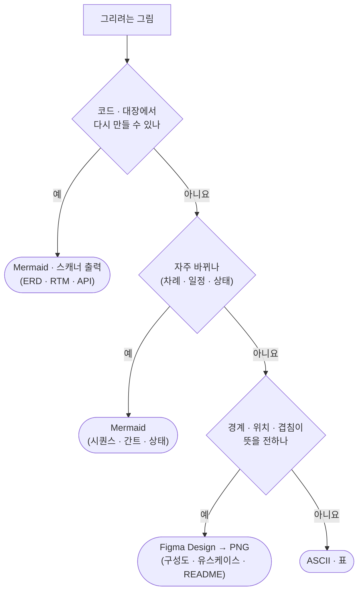
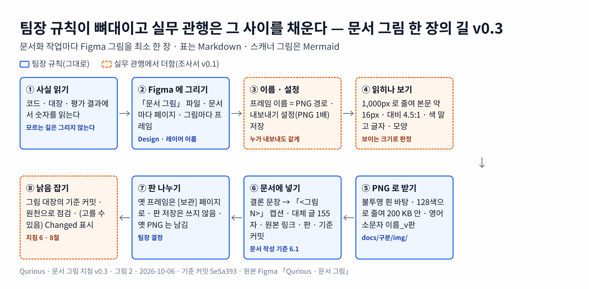
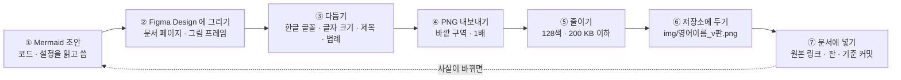
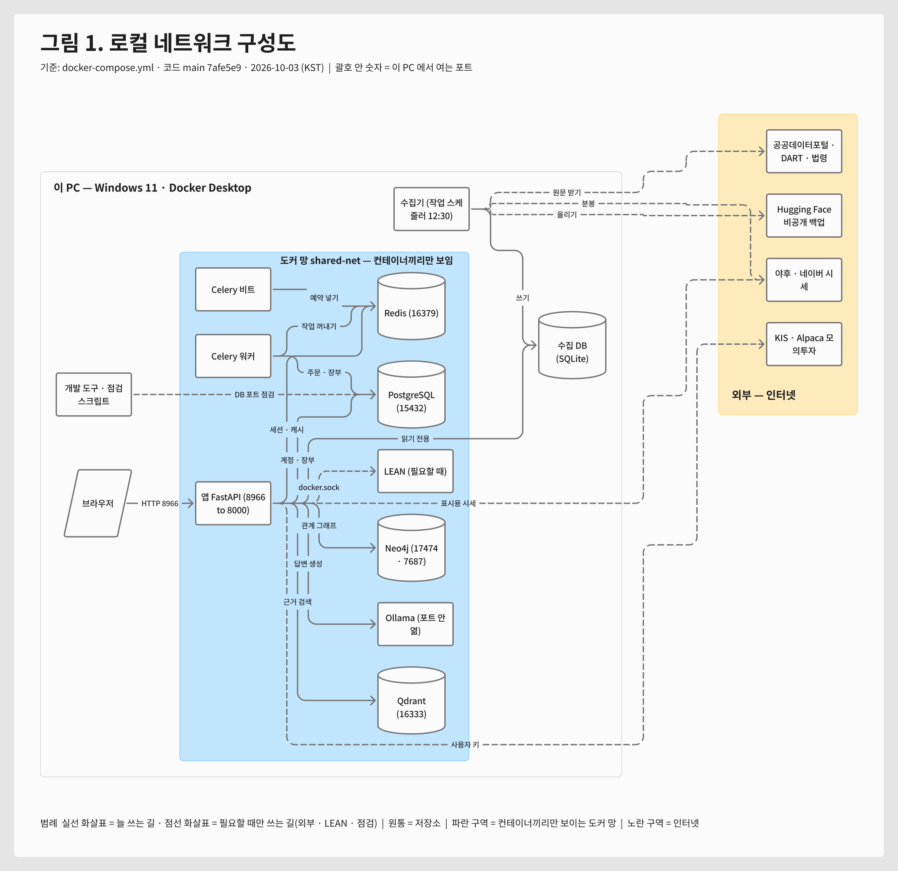
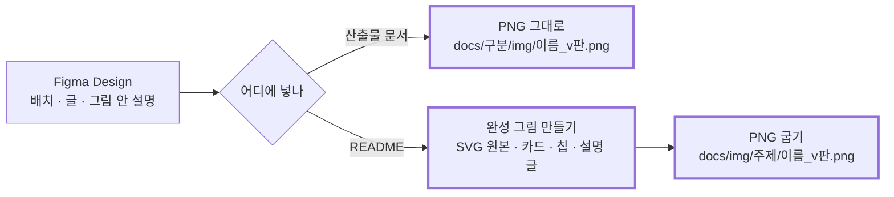

# 문서 그림 지침 v0.10 — Qurious

| 문서 정보 | |
|---|---|
| **판 · 상태** | v0.10 · 초안(검토 전) |
| **구분** | 1. 착수·과업 정의 — 표준화 계획([문서 작성 기준](../문서작성기준.md))의 6절 「표와 그림 규칙」 을 보탠다 |
| **작성** | 이동원 |
| **검토** | 검토 전 — 판을 올리는 PR 에 팀원 한 명 이상의 「읽었음」 |
| **최종 수정** | 2026-10-10 (KST) |
| **기준** | 코드 `main` `5e5a393` · 새 그림의 원본 Figma Design 파일 [Qurious · 문서 그림](https://www.figma.com/design/6lstWS4YwuhJPhGB9XoBMD)(2026-10-06 만듦 · 팀 폴더) · 이미 그린 그림 셋은 FigJam 파일 [Qurious · 문서 그림 (산출물 · README)](https://www.figma.com/board/qTCGg7PlmpGNZT5uM8VQGm) · 팀 Figma 요금제 student(교육) |
| **관련 문서** | [문서 작성 기준](../문서작성기준.md) 6절 · 4.6절 · [docs 폴더 지도](../../README.md) · [화면 설계 절차 v0.2](../../화면/화면설계절차.md) · [Figma 문서 그림 실무 관행 조사서 v0.1](../../조사/Figma-문서그림-실무관행-조사.md) |
| **최근 개정** | v0.10 (2026-10-10) — 그림 대장에 UI 명세서 v0.8 의 그림 셋(데이터 관제 관리자 한 줄 · 수집 일정 수집 요청 단추 · 확인 창 · 대기 창 — 구현 캡처 · 번호 상자 · 1배 · 128색 · 구현 대조 `51:2` · `52:2`) · 8절에 「구현 캡처에 번호 상자를 얹을 때」 · 지난 판 v0.9 (2026-10-10) — 그림 대장에 조사서 넷의 새 그림 넷(기초 코드 융합 · 시장 범위 데이터 확장 · 모의투자 회차 · 금융 지식 배치 — Figma Design 새 페이지 넷 · 2,400 폭 · 1배 · 128색 · 불투명) · 지난 판 v0.8 은 2026-10-08 |

> **이 문서로 알 수 있는 것**
> 1. 이 그림은 Mermaid 로 문서 안에 두나, Figma 에서 그려 넣나?
> 2. Figma 에서 그린 그림은 어떻게 저장소 문서 · README 에 넣고, 판을 어떻게 맞추나?
> 3. 손으로 그린 그림이 코드와 어긋나지 않게 무엇을 점검하나?
>
> **읽는 순서** — 그림을 그리는 사람: 1절 → 2절 → 3절 · README 를 고치는 사람: 4절 · 읽기만 하는 사람: 요약

## 요약

1. **문서화 작업마다 Figma 를 최대한 쓴다(팀장 결정 2026-10-06).** 그 판에서 바뀌거나 새로 쓴 문서마다 핵심 — 결과 비교 · 흐름 · 구조 · 요약 — 을 Figma Design 에서 정돈해 **최소 한 장** 넣는다. 예전에 ASCII 로 그리던 수량 막대 · 전후 비교도 Figma 로 그린다. 시각 자료 · 표를 모두 옮기기는 무리여도 핵심 한 장은 넣는다.
2. **표는 Markdown 표 그대로 둔다** — 검색되고 PR 에서 바뀐 칸이 보인다. 그림은 그 표의 결론을 한눈에 보이는 몫이고, 같은 숫자는 표에 남긴다.
3. **코드 · 대장에서 다시 만드는 그림과 자주 바뀌는 그림은 Mermaid 로 둔다** — ERD · RTM · API 표 · 시퀀스 · 일정 간트. 스캐너가 코드에서 다시 그리고, 손 그림은 코드와 어긋나도 시험이 못 잡는다.
4. **README 그림은 두 단계다** — Figma 그림을 **초안**(배치 · 글 · 그림 안에 넣을 설명)으로 쓰고, 그 초안을 바탕으로 **정갈한 완성 그림**을 따로 만든다(4절).
5. **원본은 Figma Design 파일 「Qurious · 문서 그림」 한 곳**이다 — 표지 · 문서마다 페이지(이름 앞에 [작업 중] · [확정] · [보관]) · 그림마다 프레임(**이름 = 저장소 PNG 경로**) · 이름 붙인 레이어. **판은 페이지로 나눈다** — 판이 바뀌면 옛 프레임을 [보관] 페이지로 옮기고, 「Save to version history」 는 쓰지 않는다(파일을 지우지 않으면 이력이 남는다 · 팀장 결정). 저장소에는 판마다 새 PNG 를 둔다.
6. **실무 관행에서 더한 것(조사서 v0.1)** — 보이는 크기로 글자 · 대비 판정(7절) · 색만으로 구분하지 않기 · 불투명 흰 바탕 · 결론 문장 제목 · 그림 안 꼬리말(문서 · 판 · 날짜 · 기준 커밋) · 그림 대장 · PR 본문에 옛 판 · 새 판 나란히(6절) · **교육 요금제 만료 대비**(2.2절).

---

## 1. 무엇으로 그리나

기준은 둘이다 — **코드가 바뀌면 그림도 저절로 바뀌어야 하나**(그렇다면 Mermaid · 스캐너), **경계 · 위치 · 겹침이 뜻을 전하나**(그렇다면 Figma).

**<표 1> 그림 종류 → 도구**

| 그림이 답할 질문 | 이 프로젝트의 예 | 도구 | 까닭 |
|---|---|---|---|
| 표가 어떻게 이어지나 · 요구가 어디까지 왔나 · API 는 몇 개인가 | ERD · RTM · API 표 | **Mermaid · 스캐너 출력** | 스캐너(`schema_scan` · `rtm_scan` · `api_scan`)가 코드에서 다시 그린다 — 손 그림은 코드와 어긋나도 시험이 못 잡는다 |
| 누가 누구를 어떤 차례로 부르나 | 로그인 유지 · 근거 검색 시퀀스 | Mermaid | 함수가 바뀌면 같은 PR 에서 글자로 고친다 |
| 언제 무엇을 하나 | 스프린트 · 마일스톤 간트 | Mermaid | 일정이 자주 바뀐다 |
| 상태가 어떻게 바뀌나 | 주문 · 문서 상태 | Mermaid | 위와 같다 |
| 어디에 무엇이 놓이고 어떤 길 · 포트로 닿나 | 인프라 · 네트워크 · 배포 구성도 | **Figma Design** | 경계(이 PC · 도커 망 · 인터넷)와 포트가 뜻을 전한다 · 자주 바뀌지 않는다 |
| 누가 무엇을 하나 | 유스케이스 그림 | **Figma Design** | Mermaid 에 유스케이스 그림 종류가 없다 |
| 처음 온 사람이 첫눈에 무엇을 보나 | README 첫 그림 · 발표 그림 | **Figma 초안 → 완성 그림(SVG · PNG)** | 독자가 가장 많은 그림 · 그림 안 설명 · 다크 · 라이트 화면 둘(4절) |
| 화면이 어떻게 생겼나 | 와이어프레임 · 화면 설계 | Figma(Design) | [화면 설계 절차](../../화면/화면설계절차.md)가 따로 있다 |
| 얼마나 큰가 · 무엇이 바뀌었나 | 수량 막대 · 전후 비교 · 평가 결과 · 상태 지도 | **Figma Design**(v0.3 — 예전에는 ASCII) + 숫자는 Markdown 표 | 결론을 한눈에 보이는 그림 · 같은 숫자는 표에 남겨 검색 · diff |
| 이 문서의 핵심이 무엇인가 | 문서마다 최소 한 장(요약 · 흐름 · 구조) | **Figma Design** | v0.3 팀장 결정 — 모든 문서화 작업에 Figma 를 최대한 |

그림 1 은 같은 판정을 차례로 보인다.

**<그림 1> 이 그림은 어디서 그리나** · 범례: 마름모 = 질문 · 둥근 끝 = 도구



Figma 로 옮기는 것은 「경계가 있는 구성도」 와 「첫눈에 보는 그림」 뿐이다. 나머지는 Mermaid 가 낫다 — 실무 문서 규칙도 Mermaid 를 기본으로 권하되 모든 경우에 맞지는 않다고 하고 [G2], 그림 도구 밖에 있는 그림은 PR 에서 함께 고쳐지지 않아 낡는다고 본다 [M1][D1].

---

## 2. Figma 그림 만드는 흐름

숫자는 첫 적용(인프라 · 네트워크 구성도 그림 1)에서 잰 값이다. 팀장 규칙이 뼈대이고 실무 관행은 그 사이를 채운다 — 이름 · 설정(③) · 읽히나 보기(④) · 낡음 잡기(⑧)가 v0.3 에서 더한 단계다(<그림 2>).

**<그림 2> 문서 그림 한 장의 길 v0.3** · 범례: 실선 테두리 = 팀장 규칙 · 점선 테두리 = 실무 관행에서 더함



<sub>원본: [Figma · Qurious · 문서 그림 · 그림 2](https://www.figma.com/design/6lstWS4YwuhJPhGB9XoBMD?node-id=6-2) · 그림 판 v0.3 · 기준 `5e5a393` · 2026-10-06</sub>

<details><summary>v0.2 의 같은 흐름(Mermaid) — 검색 · 다시 그리기용</summary>



</details>

**<표 2> 단계마다 할 일**

| 단계 | 할 일 | 첫 적용에서 잰 것 · 주의 |
|---|---|---|
| ① 초안 | 그릴 사실을 **코드 · 설정에서 읽고** Mermaid 로 먼저 쓴다. 모르는 길은 그리지 않는다 | `docker-compose.yml` 서비스 9 · 포트 · 외부 주소(앱 · 수집기 코드의 주소 문자열)를 읽고 그렸다 |
| ② 그리기 | 「Qurious · 문서 그림」 파일에 문서마다 페이지(이름 앞에 [작업 중] · [확정] · [보관]), 그림마다 프레임을 만들고, **프레임 이름은 저장소에 둘 PNG 경로**(확장자 뺌 · 예: `docs/계획서/img/dongwon-todo-status_v0.1`)로, 프레임에 **내보내기 설정(PNG 1배)을 저장**한다(v0.3 · 실무 관행 — 누가 내보내도 이름 · 배율이 같다). 요소마다 레이어 이름(예: `구역-도커망` · `상자-앱` · `선-8966`)을 붙인다. 결과 비교 · 상태 지도처럼 표에 가까운 그림은 HTML 로 짜서 `html_to_figma` 로 옮기면 빠르다(2026-10-06 첫 적용 · 옮긴 뒤 겹침을 화면 캡처로 본다). 화살표는 선 도구로 그린다(연결선이 없다 · 2.1절). Mermaid 에서 시작하고 싶으면 FigJam 에 Figma MCP `generate_diagram`(흐름도 · 시퀀스 · 상태 · 간트 · ERD 만) [F3] 으로 초안을 만들어 보고 그린다 — 붙여 넣었을 때 연결선이 어떻게 바뀌는지는 아직 확인하지 않았다 | 첫 적용(FigJam)에서: 「구조도 배치」 모드는 구역 이름이 고정이라 경계(이 PC · 도커 망)를 그리는 네트워크 그림에는 일반 흐름도가 맞았다 |
| ③ 다듬기 | 한글 글꼴을 **Noto Sans KR** 로 · 글자 크기를 키운다 · 흰 바탕 바깥 구역에 제목 · 기준 · 범례 · **구역 안에 이름표 글자** | 생성 그림은 Inter 글꼴이라 한글이 대체 글꼴로 나온다 · 캔버스가 2,600px 라 문서 폭 1,000px 로 줄면 16px 글자가 약 6px 가 된다 → 도형 26 · 선 22 · 제목 64 · 기준 · 범례 28 · **구역 이름은 내보낸 그림에 찍히지 않는다** |
| ④ 내보내기 | 바깥 구역을 PNG **1배**로 | 2,680 × 2,602 · 234 KB. SVG 는 1배만 되고 글자를 윤곽선으로 바꾸는 설정이 기본으로 켜져 있어 [F1] 한글이 검색 · 선택되지 않는다 → PNG 를 기본으로 |
| ⑤ 줄이기 | 128색 팔레트로 줄인다(아래 명령) | 234 KB → 101 KB · 1,000px 로 줄여 읽히는지 눈으로 본다 · 실무 규칙의 100 KB [G2] 는 화면 캡처 기준이라 구성도는 **200 KB 이하**를 목표로 |
| ⑥ 저장 | `docs/<구분 폴더>/img/<영어-소문자-이름>_v<판>.png` | 한글 파일 이름은 Figma 레이어 · 일부 도구에서 깨진 적이 있다 · 판을 올리면 새 파일(옛 판은 지우지 않는다) |
| ⑦ 넣기 | 3절 모양 그대로 | 대체 글은 그림의 결론을 155자 안에 [G2] |
| ⑧ 판 나누기 | **「Save to version history」 는 쓰지 않는다(v0.3 · 팀장 결정)** — 판이 바뀌면 옛 프레임을 [보관] 페이지로 옮기고 새 프레임을 만든다. 파일을 지우지 않으면 자동 이력이 남는다 | 교육 요금제는 판 이력을 전부 보관한다(Starter 는 30일) [F2] · **Figma 링크는 늘 최신을 연다** [F2] → 옛 판의 모습은 [보관] 페이지와 저장소의 옛 PNG 가 증거다 · 판 저장 · 썸네일 · 개발 상태 API 는 MCP 에서 막혀 있다(실측) |
| ⑨ 낡음 표시(고를 수 있음) | 내보낸 직후 프레임을 「Ready for dev」 로 표시 — 고치면 자동으로 「Changed」 가 되어 PNG 가 낡았음을 안다 | 교육 요금제(= Professional) · Full 좌석이면 된다 [F7] · 사람이 한 번 누른다(MCP 막힘) · 변수 · 스타일 값만 바꾼 것은 Changed 가 안 된다 → 6절 그림 대장과 함께 |

⑤ 의 명령(저장소 밖 도구 없이 Pillow 만):

```bash
python -c "from PIL import Image; f='docs/설계/img/infra-local-network_v0.1.png'; Image.open(f).quantize(colors=128, method=Image.Quantize.FASTOCTREE).save(f, optimize=True)"
```

> 팀원이 손으로 그릴 때는 Figma Design 에서 직접 그리고 ③ ~ ⑦ 만 따른다. Mermaid 원문이 있으면 이동원에게 주면 ② 를 대신 돌린다.

### 2.1 편집기 — FigJam 에서 Figma Design 으로 (2026-10-03 결정)

첫 판은 FigJam 보드 하나에 그림마다 구역을 두었다. 그림이 늘면 한 보드에서 찾기 어렵고, 팀장 의견(2026-10-03)대로 그림마다 페이지 · 레이어로 나누려면 편집기를 바꿔야 한다. 두 편집기의 차이는 <표 2-1> 과 같다.

**<표 2-1> FigJam 과 Figma Design** · 확인: 도움말 · 공식 문서 원문(부록 A) · 팀 요금제는 Figma 계정 조회

| 항목 | FigJam | Figma Design |
|---|---|---|
| 페이지 | 2024년부터 있지만 Professional 이상 요금제만 · 교육용 팀은 쓸 수 없다 [F4] — 우리 팀은 student | 쓸 수 있다 |
| 요소 나누기 | 구역 · 스티커 · 도형 | 프레임 · 그룹 · 이름 붙인 레이어 |
| 연결선(상자를 옮기면 따라오는 화살표) | 있다 [F5] | 없다 — 선 도구로 그린다(2차 출처) |
| Mermaid → 그림 자동 생성(Figma MCP) | 있다 [F3] | 없다 |
| PNG 내보내기 · 판 이력 | 같다 [F1] [F2] | 같다 |

문서 그림은 PNG 로 내보내 넣는 그림이라 화살표가 따라오지 않아도 손해가 작고, 페이지 · 레이어로 나누는 이득이 크다. 그래서 다음과 같이 정했다(팀장 결정 2026-10-03).

- **새 문서 그림은 Figma Design 에서** — 파일 하나(「Qurious · 문서 그림」) · 문서마다 페이지 · 그림마다 프레임 · 요소마다 레이어 이름.
- **이미 그린 FigJam 그림 셋(인프라 · 네트워크 · 유스케이스 개요 · 배포)은 그대로 둔다** — 문서에 PNG 로 들어가 있다. 그 그림을 고칠 때 Design 으로 다시 그리고 새 판 PNG 를 만든다.
- Mermaid 로 빠르게 배치를 보고 싶으면 FigJam 의 자동 생성으로 초안을 본 뒤 Design 에서 그린다.

### 2.2 요금제 위험 — 교육 인증이 끝나면 (v0.3 · 실무 관행)

팀 Figma 는 교육 요금제(Professional 기능)다. 교육 인증은 고등교육 학생 1년 · 부트캠프 학생 6개월이고, 끝나면 파일이 넷 이상인 팀은 무료 Starter(파일 3 · 파일당 3페이지 · 이력 30일)로 내려가며 잠긴다 — 파일 내려받기 · 옮기기는 된다 [F6] [F3]. 우리 팀 폴더는 파일이 일곱이다.

- 인증 만료일을 「Qurious · 문서 그림」 표지에 적는다(계정 설정에서 확인 · 지금은 확인 전).
- 만료 한 달 전에 다시 인증한다.
- 달마다 팀 폴더의 파일을 내려받아(.fig) 저장소 밖(드라이브)에 둔다 — 저장소의 PNG 는 그림의 결과일 뿐 원본이 아니다.

---

## 3. 문서에 넣는 모양 — 복사해서 쓴다

[문서 작성 기준 v0.2](../문서작성기준.md) 6.1(캡션 「<그림 N> 제목 · 범례」 → 그림 → 출처 · 기준 → 본문에서 「<그림 N> 과 같이」 로 부르기)에 두 줄을 더한다. **원본 · 판 줄**과 **접힌 Mermaid 원문**이다.

````markdown


**<그림 1> 로컬 네트워크 구성도** · 범례: 실선 = 늘 쓰는 길 · 점선 = 필요할 때만



<sub>원본: [Figma · 문서 그림 · 그림 1](https://www.figma.com/board/qTCGg7PlmpGNZT5uM8VQGm?node-id=3-100) · 그림 판 v0.1 · 기준 `7afe5e9` · 2026-10-03</sub>

<details><summary>그림 원문(Mermaid) — 검색 · 다시 그리기용</summary>

```mermaid
flowchart LR
  …
```

</details>

이 PC 밖으로 열리는 포트는 … 이다.
````

- 그림의 결론은 **글에도** 쓴다 — Discord · 인쇄 · 화면 낭독 프로그램에서는 그림이 안 보인다(문서 작성 기준 6.1 ⑥).
- 원문(Mermaid)은 그림과 같은 사실을 담는다. 판을 올릴 때 둘을 함께 고친다(6절).

---

## 4. README 그림

README 는 GitHub 저장소 첫 화면이라 독자가 가장 많고, 처음 온 사람이 그림 하나로 전체를 잡아야 한다. 그래서 그림 **안에** 설명(각 칸이 무엇을 하나 · 보안 경계 같은 약속)을 넣어야 할 때가 많다. README 그림은 **두 단계**로 만든다 — 

**<그림 3> 일반 문서 그림과 README 그림** · 범례: 실선 = 차례 · 굵은 상자 = 저장소에 들어가는 것



**<표 3> 두 단계의 몫**

| 단계 | 하는 일 | 결과물 | 지금 본보기 |
|---|---|---|---|
| ① 초안 — Figma | 무엇을 어디에 둘지 · 칸마다 넣을 설명 글 · 화살표를 정한다. 사용자 · 팀과 이 그림으로 의견을 모은다 | Figma 구역 하나(이 문서 2절 흐름의 ① ~ ③) | — |
| ② 완성 그림 | 초안의 배치와 글을 그대로 옮겨 **정갈한 디자인**으로 다시 그린다 — 어두운 바탕 카드 · 색 칩 · 카드 안 설명 · 범례 줄 | **SVG 원본**(글자라서 git 에서 바뀐 줄이 보인다) + 그 SVG 를 구운 **PNG** | README 첫 그림 [아키텍처 v2.0](../../img/architecture/qurious-architecture_v2.0.png) — SVG 2,752 × 1,536 · 글 72줄 · 카드 안 설명 · 보안 경계 칩 일곱 |

- **일반 산출물 문서 그림은 ① 만 한다** — Figma 에서 깔끔하게 그린 것을 PNG 로 그대로 넣는다(2절 · 3절). README 수준의 완성 그림까지 만들 필요는 없다.
- 완성 그림 SVG 의 `<title>` · `<desc>` 에 그림의 결론을 적는다 — v2.0 이 그렇게 되어 있다(화면 낭독 · 검색).
- 독자의 GitHub 화면은 밝을 수도 어두울 수도 있다. 어두운 바탕 카드 그림(v2.0)은 어느 화면에서도 한 장으로 읽힌다. 밝은 판 · 어두운 판을 따로 둘 때는 `<picture>` 안에 `media="(prefers-color-scheme: dark)"` 판을 넣는다 — GitHub 공식 방법이고, 옛 `#gh-dark-mode-only` 꼬리표는 폐기됐다 [G1].

```html
<picture>
  <source media="(prefers-color-scheme: light)" srcset="docs/img/architecture/qurious-architecture_v2.1-light.png">
  
</picture>
```

- 폴더 README(`docs/**/README.md` · `scripts/personal/README.md` 등)도 같은 판정을 따른다 — 처음 온 사람이 보는 첫 그림이면 두 단계, 설명용 그림이면 ① 만.
- `readme.md` 와 폴더 README 는 팀이 함께 고치는 파일이다 — 고치기 전에 팀원의 열린 PR 을 확인한다.
- 다음 README 첫 그림(아키텍처 v2.1)은 이 두 단계로 만드는 첫 대상이다(부록 C).

---

## 5. 그림 모양 — 세로로 길어질 때

FigJam 그림 도구는 같은 층(한 행위자에 붙은 유스케이스들처럼)에 놓인 상자를 **한 줄로 쌓는다**. 그래서 한 사람에게서 선이 여럿 나가는 그림은 세로로 길어진다 — 유스케이스 그림 첫 판이 1,768 × 3,617 이었다. 문서는 폭 1,000px 안팎으로 보이므로 세로로 긴 그림은 글자가 작아지고 스크롤이 길다. 실무 규칙도 화면 그림을 폭 1,000 · 높이 500 안으로 둔다 [G2]. 

**<표 4> 세로로 길어질 때 고르는 방법** · 위에서부터 먼저 해 본다

| # | 방법 | 이렇게 | 언제 | 근거 |
|:-:|---|---|---|---|
| ① | **개요 + 상세로 나누기** | 개요는 묶음(기능 · 패키지) 단위로 한 장, 상세는 묶음마다 · 한 그림은 15개 안팎 | 상자가 15개를 넘거나 한 상자에 선이 여럿 몰릴 때 | 묶음 요약 그림 + 묶음별 상세 그림 [U1] · C4 의 「점점 확대」 [C1] |
| ② | **위 · 아래로 다시 배치** | 사람(행위자)은 위 한 줄, 묶음은 아래 한 줄 · 선 끝점을 「위 상자의 아래 → 아래 상자의 위」 로 · 곧은 선 | 생성 그림이 한 줄로 쌓였을 때 | 많이 쓰는 행위자는 가운데, 드문 행위자는 가장자리 · 선이 상자를 가로지르지 않게 [U1] |
| ③ | **많은 연결은 표로** | 「누가 무엇을」 같은 다대다는 행위자 × 유스케이스 표 | 선이 열 개를 넘을 때 | 문서 작성 기준 6.2 「어느 쪽이 나은가 · 판정은 → 표」 |
| ④ | **상세는 접어 두기** | `<details>` 안에 Mermaid(펼칠 때 GitHub 이 그린다) 또는 PNG | 상세가 꼭 필요하지만 늘 볼 것은 아닐 때 | 이번 유스케이스 명세서 |
| ⑤ | **확대는 Figma 링크로** | 그림 아래 원본 줄의 링크 — Figma 에서 확대 · 이동 | 큰 구성도를 자세히 볼 때 | 2절 ⑦ |

그림 4 는 같은 유스케이스를 한 장에 다 넣은 첫 판과, ① · ② 로 고친 판을 견준다.

**<그림 4> 고치기 전과 뒤** · 범례: 크기 = Figma 구역(px) · 문서 폭 1,000px 로 줄였을 때 도형 글자 크기

```
  고치기 전 — 한 장에 유스케이스 13개           고친 뒤 — 개요(묶음 5) + 표 + 접은 상세
  ┌──────────┐                                 ┌────────────────────────────────────┐
  │ 행위자 ○ │──┬─ UC-01                       │  ○방문자 ○예약 ○운영자    ○규칙 투자자 │
  │          │  ├─ UC-02                       │     ╲    │     │       ╱ ╱  │  ╲ ╲    │
  │          │  ├─ …   (한 줄로 쌓임)           │  [계정][①데이터][XAI·패턴][③배분][④성과] │
  │          │  └─ UC-12                       │            ╲               ╱          │
  └──────────┘                                 │             [외부 공식 데이터 · 증권사] │
  1,768 × 3,617 · 글자 약 12px · 스크롤 길다     └────────────────────────────────────┘
                                                2,280 × 1,704 · 글자 약 11px · 한 화면
```

세로로 길어지면 **먼저 나눈다(①)** — 묶음 단위 개요는 가로 한 화면에 들어오고, 유스케이스 하나하나는 표와 접은 상세가 맡는다. 배치만 바꾸는 것(②)은 선이 많은 그림에서는 선이 상자를 가로질러 오히려 읽기 어려웠다(Figma 「버린 안」 구역).

## 6. 어긋남 막기 — 판을 올릴 때 점검

손으로 그린 그림은 코드가 바뀌어도 시험이 실패하지 않는다. 그래서 그림 아래에 **기준 커밋**을 적어 두고, 문서 판을 올릴 때 그 커밋 이후의 변화를 본다.

**점검표 — Figma 그림이 있는 문서의 판을 올리기 전**

- [ ] 그림이 그린 사실의 원천(예: `docker-compose.yml` · `scripts/personal/_common.ps1` 포트 표)이 기준 커밋 뒤에 바뀌었나 — `git diff --stat <기준 커밋> -- <원천 파일>`
- [ ] 바뀌었으면 Figma 구역을 고치고 **새 PNG 판**(`_v0.2.png`)으로 · 원본 · 판 줄의 판과 기준 커밋을 바꾼다
- [ ] 접힌 Mermaid 원문도 같이 고쳤나
- [ ] 대체 글이 지금 그림의 결론을 말하나
- [ ] 옛 프레임을 [보관] 페이지로 옮겼나(판 저장 대신 · v0.3)
- [ ] 그림 안 꼬리말(문서 · 판 · 날짜 · 기준 커밋)을 새 판으로 고쳤나
- [ ] (고를 수 있음) Figma 에서 Changed 표시가 뜬 프레임이 없나 — 있으면 PNG 가 낡았다
- [ ] PR 본문에 옛 판 · 새 판 PNG 를 표로 나란히 두었나 — 판마다 새 파일 이름이라 GitHub 그림 비교 화면이 나오지 않는다
- [ ] 그림 점검 여섯(C4 · 실무 관행): 제목이 결론을 말하나 · 범례가 있나 · 화살표마다 라벨이 있나 · 약어 · 색 · 모양의 뜻이 적혔나 · 색만으로 구분하지 않나 · 1,000px 로 줄여 읽히나

이 점검표는 문서 작성 기준 다음 판(v0.2)의 10.2 점검표에 한 줄로 넣는다(부록 C).

---

## 7. 색 · 글자 · 아이콘

| 항목 | 정한 것 | 까닭 |
|---|---|---|
| 글꼴 | Noto Sans KR(제목 Bold · 나머지 Medium · Regular) | 생성 그림의 Inter 에는 한글이 없다 · Figma 에 바로 있는 한글 글꼴(IBM Plex Sans KR · 나눔고딕도 있음) |
| 글자 크기 | **보이는 크기로 판정(v0.3)** — 문서 폭 1,000px 로 줄였을 때 본문 · 라벨이 약 16px 이 되게: 캔버스 폭 2,400 ~ 2,600px 이면 본문 40 ~ 42px 이상 · 각주 32px 이상 · 제목 60 ~ 64px. 옛 구성도의 도형 26 · 선 22 는 1,000px 에서 10px 안팎이라 다음 판부터 키운다 | WCAG 는 화면에 보이는 크기로 대비 · 큰 글자를 판정한다 [W2] · 첫 적용(그림 1)을 1,000px 로 줄여 눈으로 확인했다 |
| 대비 | 본문 글자 4.5:1 · 큰 글자(보이는 24px · 굵게 18.7px) 3:1 · 선 · 도형 3:1 | [W2] [W3] · Figma 색 선택기의 대비 검사를 쓴다 |
| 색 | 연한 색 + 같은 계열 진한 테두리 · **색만으로 뜻을 전하지 않는다** — 상태는 글자와 모양(● 완료 · ◐ 진행 · ○ 예정)을 함께, 범주는 직접 라벨 · 내보내기 전에 흑백으로 한 번 본다 · 바탕은 불투명 흰색(투명 PNG 금지 — 다크 모드에서 글자가 사라진다) | 문서 작성 기준 6.3 · [O1] · Google 이미지 규칙 [G3] |
| 제목 · 꼬리말 | 그림 제목은 결론 문장(예: 「서버 쪽은 대부분 끝났다 — 남은 큰 일은 …」) · 그림 안 아래에 꼬리말 「Qurious · 문서 · 그림 N · 날짜 · 기준 커밋」 | 그림만 따로 퍼져도 출처가 따라간다 [U1] |
| 키트(다음 판) | 상자 · 말풍선 · 범례 · 단계 배지 · 화살표 · 머리 · 꼬리말을 「키트 · 그림 부품」 페이지의 부품으로 · 색 · 글자를 변수로 | 그림 수십 장을 한결같게 [F8] — 처음 2 ~ 3시간이 들어 다음 판에 만든다 |
| 아이콘 | 기본은 도형(원통 = 저장소 · 평행사변형 = 사람이 쓰는 곳). 클라우드 서비스를 그릴 때만 **AWS 공식 Architecture Icons** | AWS 가 다이어그램 · 백서 · 발표에 쓰도록 허용하고 분기마다 새 판을 낸다 [A1] · 그 밖의 상표 로고는 넣지 않고 글자로 쓴다 |

---

## 8. 그림 대장 — Figma 로 그린 문서 그림

이 표가 그림 대장이다(v0.3 · 실무 관행). 판을 올릴 때 6절 점검표가 이 표의 「기준 · 원천」 칸으로 「그림이 그린 사실이 바뀌었나」 를 본다. 그림을 새로 그리면 한 줄씩 더한다.

**<표 5> 그림 대장**

| 그림 | 문서 | Figma | PNG | 크기 | 기준 · 원천 |
|---|---|---|---|---|---|
| 로컬 네트워크 구성도 | [인프라 · 네트워크 구성도 v0.1](../../설계/인프라-네트워크구성도.md) 그림 1 | FigJam [`3:100`](https://www.figma.com/board/qTCGg7PlmpGNZT5uM8VQGm?node-id=3-100) | `docs/설계/img/infra-local-network_v0.1.png` | 2,680 × 2,602 · 101 KB | `7afe5e9` · `docker-compose.yml` · `scripts/personal/_common.ps1` |
| 유스케이스 개요(가로) | [유스케이스 명세서 v0.1](../../요구사항/지난판/유스케이스명세서_v0.1.md) 그림 1 | FigJam [`15:243`](https://www.figma.com/board/qTCGg7PlmpGNZT5uM8VQGm?node-id=15-243) | `docs/요구사항/img/usecase-overview_v0.1.png` | 2,360 × 1,784 · 75 KB | 요구 대장 |
| (버린 안) 유스케이스 한 장 | — 5절 그림 4 의 「고치기 전」 | FigJam [`8:190`](https://www.figma.com/board/qTCGg7PlmpGNZT5uM8VQGm?node-id=8-190) | 저장소에 두지 않음 | 1,768 × 3,617 | — |
| 문서 그림 한 장의 길 v0.3 | 이 문서 그림 2 | Design [`6:2`](https://www.figma.com/design/6lstWS4YwuhJPhGB9XoBMD?node-id=6-2) | `docs/문서기준/img/doc-figure-flow_v0.3.png` | 2,400 × 1,179 · 80 KB | `5e5a393` · 이 문서 2절 · 조사서 v0.1 · 2026-10-07 `docs/img/` 에서 옮김(Figma 프레임 이름도 새 경로로) |
| 근거 답 서버 검사 갈래와 화면 | [목표 기능 ① 설계서 v1.6](../../설계/목표기능1-데이터지식-설계.md) 그림 6-1 | Design [`25:2`](https://www.figma.com/design/6lstWS4YwuhJPhGB9XoBMD?node-id=25-2) | `docs/설계/img/kb-answer-checks_v1.6.png` | 2,400 × 1,420 · 108 KB | `5e5a393` + 그 판 · `app/services/kb_answer.py` `ask` · `public/js/kbchat.js` |
| 섹터 질문 분류 1판 · 2판 판정 | [테스트 계획서 v1.14](../../시험/지난판/테스트계획서_v1.14.md) 그림 4-8 | Design [`19:2`](https://www.figma.com/design/6lstWS4YwuhJPhGB9XoBMD?node-id=19-2) | `docs/시험/img/sector-words-v2_v1.14.png` | 2,400 × 1,026 · 74 KB | `5e5a393` + 그 판 · `docs/시험/평가셋/섹터법령-사람판정_v3.tsv` · `kb_answer_eval-20261006-*.json` |
| 디스크와 HF 할당량을 먹는 것 | [조사서 · 로컬 용량과 HF 원격 저장 v0.1](../../조사/로컬용량-HF원격저장-조사.md) 그림 1 | Design [`34:2`](https://www.figma.com/design/6lstWS4YwuhJPhGB9XoBMD?node-id=34-2) | `docs/조사/img/local-storage-hf_v0.1.png` | 2,400 × 1,389 · 88 KB | `5e5a393` · `du` · `docker system df` · HF REST `usedStorage`(2026-10-06 13:4x) |
| 팀장 규칙과 실무에서 더한 넷 | [조사서 · Figma 문서 그림 실무 관행 v0.1](../../조사/Figma-문서그림-실무관행-조사.md) 그림 1 | Design [`32:2`](https://www.figma.com/design/6lstWS4YwuhJPhGB9XoBMD?node-id=32-2) | `docs/조사/img/figma-practice-fusion_v0.1.png` | 2,400 × 1,302 · 109 KB | 조사서 2 · 3절 · 이 파일에서 실측한 MCP API 셋 |
| 이동원 몫 상태 지도 | [이동원 파트 할 일 v0.1](../../계획서/지난판/이동원파트-할일_v0.1.md) 그림 1 | Design [`2:2`](https://www.figma.com/design/6lstWS4YwuhJPhGB9XoBMD?node-id=2-2) | `docs/계획서/img/dongwon-todo-status_v0.1.png` | 2,400 × 1,615 · 103 KB | `5e5a393` · `docs/시험/대장/기능완성도-점검표.tsv` · 설계서 v1.5 3.1절 |
| 신용평가 CSV 인제스트 — 지금과 고쳐 쓰는 안 | [조사서 · 신용평가 CSV 인제스트 v0.1](../../조사/신용평가CSV-인제스트-조사.md) 그림 1 | Design [`38:3`](https://www.figma.com/design/6lstWS4YwuhJPhGB9XoBMD?node-id=38-3) | `docs/조사/img/credit-csv-ingest_v0.1.png` | 2,400 × 1,811 · 124 KB | `13a6ae9` · 앱 DB 행 수(2026-10-07) · 금감원 오픈 API 이용약관 제9조 · 강의 4일차 쪽 |
| 교재 원천 갱신 — 추천 E 의 세 단계 | [조사서 · 교재 원천 갱신 따라가기 v0.1](../../조사/교재원천-갱신따라가기-조사.md) 그림 5 | Design [`40:2`](https://www.figma.com/design/6lstWS4YwuhJPhGB9XoBMD?node-id=40-2) | `docs/조사/img/lecture-upstream-sync_v0.1.png` | 2,400 × 1,700 · 122 KB | `13a6ae9` · 두 원본 사본의 로컬 참조(th01 `12f423d` · th07 `f55dd3f`) · 조사서 3.5 · 3.7절 |
| 교재 원천 갱신 — 결정(E 와 C 융합) 흐름 넷 | [조사서 · 교재 원천 갱신 따라가기 v0.1](../../조사/교재원천-갱신따라가기-조사.md) 그림 6 | Design [`41:2`](https://www.figma.com/design/6lstWS4YwuhJPhGB9XoBMD?node-id=41-2) | `docs/조사/img/lecture-upstream-decision_v0.1.png` | 2,400 × 1,479 · 93 KB | `13a6ae9` · 사용자 결정(2026-10-07 「E 와 C 잘 융합」) · 조사서 3.3 · 4절 |
| 크롤링 세 화면 — 정할 것 넷과 결정 | [IA v1.3](../../화면/IA.md) 그림 2-1 · [이동원 파트 할 일 v0.3](../../계획서/이동원파트-할일.md) 그림 2 | 화면 설계 「데이터 수집 화면」 [`10:2`](https://www.figma.com/design/AfiCh50uOwrSq5F2Tk2JLZ?node-id=10-2) | `docs/화면/img/collect-decisions_v1.3.png` | 1,280 × 695 · 50 KB | `13a6ae9` · Figma 05 결정 기록(① ③ ④ 2026-10-06 · ② 2026-10-07 결정) |
| 수집 일정 · 단계(구현) | [UI 명세서 v0.6](../../화면/UI명세서.md) 그림 5 | 「데이터 수집 화면」 구현 대조 [`36:2`](https://www.figma.com/design/AfiCh50uOwrSq5F2Tk2JLZ?node-id=36-2) · 설계 [`7:2`](https://www.figma.com/design/AfiCh50uOwrSq5F2Tk2JLZ?node-id=7-2) | `docs/화면/img/ui-spec/ui-collect-schedule_v0.6.png` | 1,280 × 1,610 · 83 KB · 번호 상자 11 | 구현 화면 캡처(로컬 개발 앱 · 점검 계정 · 2026-10-08) · 2026-10-07 회차 기록(19 단계 · 다시 돌린 줄 포함) |
| 자료 직접 받기(구현) | [UI 명세서 v0.6](../../화면/UI명세서.md) 그림 6 | 「데이터 수집 화면」 구현 대조 [`36:3`](https://www.figma.com/design/AfiCh50uOwrSq5F2Tk2JLZ?node-id=36-3) · 설계 [`8:2`](https://www.figma.com/design/AfiCh50uOwrSq5F2Tk2JLZ?node-id=8-2) | `docs/화면/img/ui-spec/ui-collect-fetch_v0.6.png` | 1,280 × 1,440 · 64 KB · 번호 상자 13 | 구현 화면 캡처(2026-10-08) · 받을 범위는 수집기 기록(시세 최근 한 달) |
| 적재 · 백업(구현) | [UI 명세서 v0.6](../../화면/UI명세서.md) 그림 7 | 「데이터 수집 화면」 구현 대조 [`38:2`](https://www.figma.com/design/AfiCh50uOwrSq5F2Tk2JLZ?node-id=38-2) · 설계 [`9:2`](https://www.figma.com/design/AfiCh50uOwrSq5F2Tk2JLZ?node-id=9-2) | `docs/화면/img/ui-spec/ui-collect-backup_v0.6.png` | 1,280 × 830 · 46 KB · 번호 상자 8 | 구현 화면 캡처(2026-10-08 13:5x) · 백업 판정 기록(13:43 · `hf_dataset.py status --write`) · 이 PC 용량(13:25 회차 끝) |
| 수집 일정 · 신호 단계 건너뜀(구현) | [UI 명세서 v0.7](../../화면/UI명세서.md) 그림 5-2 | 「데이터 수집 화면」 설계 [`7:2`](https://www.figma.com/design/AfiCh50uOwrSq5F2Tk2JLZ?node-id=7-2) · 구현 대조 프레임 아직 | `docs/화면/img/ui-spec/ui-collect-schedule-skip_v0.7.png` | 1,280 × 900 · 52 KB · 번호 상자 없음 | 구현 화면 캡처(로컬 개발 앱 · 2026-10-08) · 기준 `5f3c325` + 러너 묶음 · 신호 줄 응답만 브라우저에서 「앱 DB 꺼짐」 으로 바꿔 그림(회차 기록 파일은 그대로) |
| 자료 안내 1280(구현) | [UI 명세서 v0.7](../../화면/UI명세서.md) 그림 8 | 「자료 안내」 [결정] 안 B 1280 [`2:2`](https://www.figma.com/design/VvA8jPPHsJ8bohge31hQ88?node-id=2-2) · 구현 대조 프레임 아직 | `docs/화면/img/ui-spec/ui-data-guide_v0.7.png` | 1,280 × 900 · 53 KB · 번호 상자 없음 | 구현 화면 캡처(2026-10-08 17:19) · 기준 `5f3c325` + 자료 안내 1단계 · 숫자는 그날 실제 값(상태 · 백업 목록 10-08 13:23) |
| 자료 안내 390(구현) | [UI 명세서 v0.7](../../화면/UI명세서.md) 그림 9 | 「자료 안내」 [결정] 390 [`7:2`](https://www.figma.com/design/VvA8jPPHsJ8bohge31hQ88?node-id=7-2) · 구현 대조 프레임 아직 | `docs/화면/img/ui-spec/ui-data-guide-390_v0.7.png` | 390 × 844 · 24 KB · 번호 상자 없음 | 같은 캡처 · 390 폭 |
| 자료 한 장 서랍(구현 · 관리자) | [UI 명세서 v0.7](../../화면/UI명세서.md) 그림 10 | 「자료 안내」 서랍 관리자 [`6:2`](https://www.figma.com/design/VvA8jPPHsJ8bohge31hQ88?node-id=6-2) · 일반 사용자 [`10:2`](https://www.figma.com/design/VvA8jPPHsJ8bohge31hQ88?node-id=10-2) · 구현 대조 프레임 아직 | `docs/화면/img/ui-spec/ui-data-guide-drawer_v0.7.png` | 1,280 × 900 · 66 KB · 번호 상자 없음 | 같은 캡처 · 주식 일봉 서랍 |
| docs 정리 전후 — 종류 폴더 맨 위 166 → 52 | [docs 폴더 지도 v1.0](../../README.md) 그림 1 | Design [`45:3`](https://www.figma.com/design/6lstWS4YwuhJPhGB9XoBMD?node-id=45-3) | `docs/img/docs-folder-map_v1.0.png` | 2,400 × 1,302 · 65 KB | `0011743` + docs 정리 · 정리 전 `git ls-tree HEAD` · 정리 뒤 폴더를 직접 셈 · 옮김 목록 171 |
| 기초 코드 10-08 판 72파일 — 분류 · 반영 흐름 · 받는 차례 | [조사서 · 기초 코드 최신판 융합 v0.1](../../조사/기초코드-최신판-융합-조사.md) 그림 1 | Design [`48:3`](https://www.figma.com/design/6lstWS4YwuhJPhGB9XoBMD?node-id=48-3) | `docs/조사/img/base-code-fusion_v0.1.png` | 2,400 × 1,834 · 136 KB | `83a0b12` · 조사서 2 ~ 6절 · 파일별 분류 대장 72줄(강사님 원본 사본 `5b0a768` 읽기) |
| 미국 · 코인 데이터 확장 설계 | [조사서 · 시장 범위 · 미국 · 코인 거래 기준 v0.1](../../조사/시장범위-미국코인-거래기준-조사.md) 그림 2 | Design [`49:3`](https://www.figma.com/design/6lstWS4YwuhJPhGB9XoBMD?node-id=49-3) | `docs/조사/img/market-data-extension_v0.1.png` | 2,400 × 1,945 · 130 KB | `83a0b12` · 조사서 4 ~ 6절(LEAN · Zipline · Qlib · OpenBB 공식 문서 · 우리 코드 읽기) |
| 모의 계좌 시작 금액 · 회차(추천 안 A) | [조사서 · 모의투자 증권사 규칙 · 시작 금액 v0.1](../../조사/모의투자-증권사규칙-시작금액-조사.md) 그림 1 | Design [`49:76`](https://www.figma.com/design/6lstWS4YwuhJPhGB9XoBMD?node-id=49-76) | `docs/조사/img/paper-account-rounds_v0.1.png` | 2,400 × 1,549 · 119 KB | `83a0b12` · 조사서 2 · 5 · 7절(증권사 운영 · 대회 규정 · 해외 플랫폼 공식 문서) |
| 금융 필수 지식 · 개념 학습 — 두 메뉴 · 장 84 · 판정 규칙 | [조사서 · 금융 필수 지식 · 개념 학습 배치 v0.1](../../조사/금융지식-개념학습-배치-조사.md) 그림 2 | Design [`49:157`](https://www.figma.com/design/6lstWS4YwuhJPhGB9XoBMD?node-id=49-157) | `docs/조사/img/learning-placement_v0.1.png` | 2,400 × 1,785 · 124 KB | `83a0b12` · 조사서 2 · 4 · 5절 · 개념 학습 장 대장 84줄 |
| 데이터 관제 · 관리자 한 줄(구현) | [UI 명세서 v0.8](../../화면/UI명세서.md) 그림 2 | 「데이터 수집 화면」 03-2 구현 대조 [`52:2`](https://www.figma.com/design/AfiCh50uOwrSq5F2Tk2JLZ?node-id=52-2) | `docs/화면/img/ui-spec/ui-data-status_v0.8.png` | 1,280 × 1,959 · 102 KB · 번호 상자 11 | 구현 화면 캡처(로컬 개발 앱 · 관리자 · 2026-10-10 16:29) · 수집 요청 목록 응답은 정책뉴스 요청 직후 것으로 고정 · 그날 12:30 회차 일부 실패(DART 점검) |
| 수집 일정 · 단계 — 수집 요청 단추(구현) | [UI 명세서 v0.8](../../화면/UI명세서.md) 그림 5 | 「데이터 수집 화면」 03-2 구현 대조 [`51:2`](https://www.figma.com/design/AfiCh50uOwrSq5F2Tk2JLZ?node-id=51-2) · [결정] 안 A [`40:2`](https://www.figma.com/design/AfiCh50uOwrSq5F2Tk2JLZ?node-id=40-2) | `docs/화면/img/ui-spec/ui-collect-schedule_v0.8.png` | 1,280 × 2,412 · 118 KB · 번호 상자 16 | 같은 캡처 · 20단계 · 10-10 회차 · 정책뉴스 다시 받기 대기 |
| 전체 수집 확인 창 · 대기 창(구현) | [UI 명세서 v0.8](../../화면/UI명세서.md) 그림 5-3 | 03-2 [결정] 확인 창 [`43:2`](https://www.figma.com/design/AfiCh50uOwrSq5F2Tk2JLZ?node-id=43-2) · 대기 창 [`44:2`](https://www.figma.com/design/AfiCh50uOwrSq5F2Tk2JLZ?node-id=44-2) · 구현 대조 프레임 없음(두 창 캡처를 이어 붙임) | `docs/화면/img/ui-spec/ui-collect-request-modals_v0.8.png` | 1,016 × 401 · 20 KB · 번호 상자 2 | 같은 날 16:29 — 대기 창은 실제 요청 직후 · 확인 창은 「닫기」 로 닫음 |

배포 구성도 그림은 그린 뒤 이 표에 더한다.

**화면 설계 프레임을 문서 그림으로 쓸 때(v0.4)** — 화면 설계 파일(절차의 03 설계 · 05 결정 기록)의 프레임은 이름 머리([설계 중] · [결정] · [만듦])가 상태를 뜻하므로 저장소 경로로 바꾸지 않는다. 대장에는 그 파일과 프레임 번호를 적는다. UI 명세서의 빨간 번호 상자는 내보낸 PNG 위에 그린다 — Figma 화면 프레임 안에는 주석을 넣지 않는다(화면 안 글은 실제 서비스 말만). 요소 위치는 Figma 에서 프레임 기준 좌표로 읽는다.

**구현 캡처에 번호 상자를 얹을 때(v0.10)** — 상자는 Figma 에서 손으로 그리지 않고 앱 화면에 얹어 찍는다. Playwright 로 요소의 자리(`getBoundingClientRect`)를 재서 빨간 테두리 · 번호 동그라미를 화면 위에 그리고 전체 높이로 찍는다 — 요소가 움직여도 상자가 따라간다. 같은 화면(상자 포함)을 `generate_figma_design` 으로 화면 설계 파일의 구현 대조 프레임에도 보내고, 프레임은 화면 폭으로 자른다(내용 잘라내기 — 화면 밖 「전체 메뉴」 서랍까지 찍힌다). 한 순간에만 있는 상태(요청 대기 1분)는 실제로 만든 뒤 그 순간의 응답을 붙잡아(`page.route`) 찍고 그림 설명에 그렇게 적는다.

**문서가 지난판으로 갈 때(v0.5)** — 그림 파일(`img/`)은 옮기지 않는다. 판을 올릴 때 `python scripts/docs_scan.py --bump` 가 지난판 사본의 그림 링크를 `../img/…` 로 맞춘다([문서 작성 기준](../문서작성기준.md) 4.6절). PNG 를 꼭 다른 폴더로 옮겨야 하면 Figma 프레임 이름(= 저장소 경로)도 함께 바꾸고 이 대장의 PNG 칸을 고친다 — 2026-10-07 docs 정리에서 이 문서 그림 2(`doc-figure-flow_v0.3`) 하나를 `문서기준/img/` 로 옮기며 프레임 `6:2` 의 이름을 바꿨다.

---

## 부록 A. 출처

| 번호 | 출처 | 이 문서에서 쓴 것 |
|---|---|---|
| [F1] | Figma 도움말 — [Export formats and settings for static designs](https://help.figma.com/hc/en-us/articles/13402894554519-Export-formats-and-settings-for-static-designs) | PNG 배율 · SVG 는 1배만 · SVG 「Outline text」 가 글자 레이어가 있으면 기본으로 켜짐 · PDF 도 1배 · 글리프 |
| [F2] | Figma 도움말 — [View a file's version history](https://help.figma.com/hc/en-us/articles/360038006754-View-a-file-s-version-history) | 30분마다 자동 저장점 · Starter 30일 · Professional · Education 은 전부 · 「Save to Version History」 로 이름 붙이기 · 파일 링크는 늘 최신 |
| [F3] | Figma MCP 서버 — `figma-generate-diagram` 스킬 안내(2026-10-03 읽음) | Mermaid → FigJam 지원 종류(흐름도 · 시퀀스 · 상태 · 간트 · ERD) · 구조도 배치 모드의 고정 구역 이름 · 생성 뒤 다듬기(혼합 작업) |
| [F4] | Figma 도움말 — [Create and manage pages in FigJam](https://help.figma.com/hc/en-us/articles/24005082123159-Create-and-manage-pages-in-FigJam) · 커뮤니티 공지 「LAUNCHED during Config 2024: Pages for FigJam files」 | FigJam 페이지는 Professional · Organization · Enterprise 요금제만 · 교육용 팀은 쓸 수 없다(2026-10-03 조회) |
| [F5] | Figma 플러그인 API — [ConnectorNode](https://developers.figma.com/docs/plugins/api/ConnectorNode/) | 「A connector is used to connect FigJam components」 — Design 파일에서 연결선 API 가 막힌다는 것은 기능 요청 글 · 플러그인 저장소(2차 출처) |
| [G1] | GitHub 블로그 — [How to make your images in Markdown on GitHub adjust for dark mode and light mode](https://github.blog/developer-skills/github/how-to-make-your-images-in-markdown-on-github-adjust-for-dark-mode-and-light-mode/) | `<picture>` + `prefers-color-scheme` · 옛 `#gh-dark-mode-only` 폐기 |
| [G2] | GitLab — [Documentation Style Guide](https://docs.gitlab.com/development/documentation/styleguide/) | Mermaid 권장(모든 경우는 아님) · 원본 파일에 링크 · 폭 1,000px · 100 KB · pngquant · 대체 글 155자 · 그림은 낡는다 |
| [M1] | Mintlify — [Documentation diagrams: when to use them and how to keep them accurate](https://www.mintlify.com/library/when-and-how-to-use-diagrams) | 그림을 문서 안 글자로 두면 같은 커밋에서 고친다 · 안정된 구조만 그림으로 · 대체 글 |
| [D1] | Dept Engineering — [Diagrams as code](https://engineering.dept.global/diagrams-as-code) | 그림 도구 밖의 그림은 코드 리뷰에 안 들어와 낡는다 |
| [U1] | Go UML — [Drawing Readable UML Use Case Diagrams](https://www.go-uml.com/drawing-readable-uml-use-case-diagrams-guide/) | 많이 쓰는 행위자는 가운데 · 드문 행위자는 가장자리 · 선이 상자 가까이에서 엇갈리지 않게 · 묶음 요약 그림 + 묶음별 상세 그림 |
| [C1] | Wikipedia — [C4 model](https://en.wikipedia.org/wiki/C4_model) | 한 그림에 다 넣지 않고 수준(맥락 → 컨테이너 → 구성 요소)별로 나눠 점점 확대해 본다 |
| [A1] | AWS — [Architecture Icons](https://aws.amazon.com/architecture/icons/) | 고객 · 파트너가 아키텍처 그림 · 백서 · 발표에 쓰도록 허용 · 분기 릴리스 · Figma 등 도구 지원 |
| [F6] | Figma 도움말 — [Figma for Education](https://help.figma.com/hc/en-us/articles/360041061214-Figma-for-Education) | 교육 인증 기간(고등교육 학생 1년 · 부트캠프 6개월) · 만료되면 파일 넷 이상 팀은 Starter 로 잠김 · Professional 기능(2026-10-06 원문) |
| [F7] | Figma 도움말 — [Dev Mode statuses and notifications](https://help.figma.com/hc/en-us/articles/26781702258583-Dev-Mode-statuses-and-notifications) | Ready for dev 는 유료 요금제 · Full 좌석 · 고치면 자동 Changed · 변수 · 스타일 값 변경은 예외 · 손으로 못 켬(2026-10-06 원문) |
| [F8] | Figma Best Practices — [Components, styles, and shared libraries](https://www.figma.com/best-practices/components-styles-and-shared-libraries/) | 키트 부품 · 스타일 이름 |
| [W2] | W3C — [Understanding 1.4.3 Contrast (Minimum)](https://www.w3.org/WAI/WCAG22/Understanding/contrast-minimum.html) | 4.5:1 · 큰 글자 · 보이는 크기 기준 |
| [W3] | W3C — [Understanding 1.4.11 Non-text Contrast](https://www.w3.org/WAI/WCAG22/Understanding/non-text-contrast.html) | 선 · 도형 3:1 |
| [O1] | Okabe & Ito — [Color Universal Design](https://jfly.uni-koeln.de/color/) | 색각 이상에도 구분되는 색 · 직접 라벨 |
| [G3] | Google — [Developer documentation style guide: Images](https://developers.google.com/style/images) | 투명 바탕 금지 · Figure N · 대체 글 155자 |
| [U2] | UK Analysis Function — [Charts](https://analysisfunction.civilservice.gov.uk/policy-store/data-visualisation-charts/) | 결론형 제목 · 직접 라벨 |

v0.3 에서 더한 실무 관행의 근거 · 우선순위 · 부딪히는 점은 [Figma 문서 그림 실무 관행 조사서 v0.1](../../조사/Figma-문서그림-실무관행-조사.md) 에 있다.

## 부록 B. 만든 방법

- 그림 1 은 Figma MCP 의 `create_new_file`(FigJam · 팀 폴더) → `generate_diagram`(일반 흐름도) → `use_figma`(글꼴 · 크기 · 바깥 구역 · 이름표) → `download_assets`(PNG 1배) → Pillow `quantize(128)` 순서로 만들었다(2026-10-03).
- 1,000px 미리보기로 읽힘을 눈으로 확인했다 — 구역 이름표가 아래쪽 점선과 겹쳐 위로 옮겼다.
- 뒤집을 조건: GitHub 이 저장소 Markdown 에서 FigJam 임베드를 그리게 되거나, 팀이 그림 원본을 draw.io 파일(저장소 안 · 글자 비교 가능)로 두기로 하면 2절을 다시 쓴다.

## 부록 C. 변경 노트 — 다음 판(v0.2)에 넣을 것

| 날짜 | 종류 | 무엇 | 옮길 곳 | 근거 |
|---|---|---|---|---|

## 부록 D. 개정 이력

| 판 | 날짜 | 무엇이 바뀌었나 | 왜 | 근거 |
|---|---|---|---|---|
| v0.10 | 2026-10-10 | 추가 — 8절 그림 대장에 셋(UI 명세서 v0.8 그림 2 · 5 · 5-3 — 구현 캡처 · 1배 · 128색 · 번호 상자 11 · 16 · 2 · 구현 대조 `51:2` · `52:2`) · 8절 「구현 캡처에 번호 상자를 얹을 때」 | 화면 수집 단추 구현 — 상자를 화면에 얹어 찍는 길을 처음 씀 | 로컬 개발 앱 캡처(실제 요청 하나 · 목록 응답 고정) · Figma 03-2 |
| v0.9 | 2026-10-10 | 추가 — 8절 그림 대장에 넷(조사서 넷의 그림 — Figma Design 새 페이지 `48:2` · `49:2` · `49:75` · `49:156` · 프레임 이름 = 저장소 PNG 경로 · 1배 · 128색 · 불투명) | 조사 초안 넷을 `docs/조사/` 로 옮기며 문서마다 그림 한 장 | 사용자 규칙(문서화 작업마다 Figma 그림 한 장 이상 · 2026-10-06) |
| v0.8 | 2026-10-08 | 추가 — 8절 그림 대장에 넷(UI 명세서 v0.7 그림 5-2 · 8 · 9 · 10 — 구현 캡처 · 1배 · 128색 · 불투명) | 러너 묶음(신호 단계 건너뜀 · 빠진 날 채우기) · 자료 안내 1단계 구현 | 로컬 개발 앱 캡처 · 같은 PR 의 코드로 찍음(배지 · 묶음 이름 고친 뒤 다시 찍음) · 번호 상자 · Figma 구현 대조 프레임은 다음 판 |
| v0.7 | 2026-10-08 | 고침 — 8절 그림 대장의 수집 화면 셋(UI 명세서 그림 5 · 6 · 7)을 구현 캡처 판으로(`_v0.6` 그림 · 크기 · 번호 상자 11 · 13 · 8 · 원본 칸 = 구현 대조 프레임 `36:2` · `36:3` · `38:2` 와 설계 프레임) | 크롤링 세 화면을 구현해 UI 명세서 v0.6 이 구현 화면을 싣는다 — 적재 · 백업은 판정 기록이 처음 생긴 뒤(2026-10-08 13:43) 찍었다 | Figma 「데이터 수집 화면」 03 설계 · 로컬 개발 앱 |
| v0.6 | 2026-10-07 | 고침 — 8절 그림 대장의 UI 명세서 그림 6 · 7 두 줄(새 PNG `_v0.4` · 크기 · 번호 상자 · 기준) | Figma 설계 2 · 3 을 손질해 다시 내보냈다 — 「예시 값」 꼬리표를 화면 밖 주석으로 · 결정 ② A 로 자료 올리기 · 위험 구역 칸을 지움 | Figma 「데이터 수집 화면」 `8:2` · `9:2` · `29:2` |
| v0.5 | 2026-10-07 | 추가 — 8절 그림 대장 한 줄(docs 폴더 지도 그림 1 · Design `45:3`) · 문서가 지난판으로 갈 때 그림은 옮기지 않는다는 규칙 / 고침 — 이 문서 그림 2 의 PNG 경로(`docs/img/` → `docs/문서기준/img/` · Figma 프레임 이름도) · 머리표의 문서 작성 기준 판 표기 | docs 폴더 정리(최신은 판 없는 이름 · 지난 판은 지난판 사본 · 문서 작성 기준 · 그림 지침은 `docs/문서기준/`) | 정리 PR(`docs/reorganize-by-kind`) |
| v0.4 | 2026-10-07 | 추가 — 8절 그림 대장 일곱 줄(신용평가 CSV 조사서 그림 1 · 교재 원천 갱신 조사서 그림 5 · 6 · 크롤링 세 화면 결정 기록 · 설계 셋) / 고침 — 로컬 네트워크 구성도 그림 링크(v0.1 부터 `img/` 로 깨져 있었다 → `설계/img/`) · 화면 설계 프레임을 문서 그림으로 쓸 때의 규칙(프레임 이름 그대로 · 대장에 프레임 번호 · 번호 상자는 PNG 에) | 크롤링 세 화면 결정을 IA · UI 명세서 · 할 일에 옮기며 화면 설계 파일의 프레임을 처음으로 문서 그림으로 썼다 · 새 조사서 그림 | 이 판과 같은 PR |
| v0.3 | 2026-10-06 | 변경 — **모든 문서화 작업에 Figma 를 최대한**(문서마다 최소 한 장 · 수량 막대 · 전후 비교도 Figma · 표는 Markdown · 스캐너 그림은 Mermaid) · 판 나누기(판 저장 대신 [보관] 페이지) · 글자 크기를 보이는 크기로 / 추가 — 2.2절 요금제 위험 · 표 2 ② 프레임 이름 = 저장소 경로 · 내보내기 설정 저장 · ⑨ 낡음 표시 · 6절 점검 다섯 줄 · 7절 대비 · 제목 · 꼬리말 · 키트 · 8절 그림 대장 · 출처 여덟 | 팀장 결정(모든 문서화 작업에 Figma 최대한 · 실무자 방식과 융합 · 판 저장 안 함) · 실무 관행 조사 | 2026-10-06 사용자 지시 · [조사서 v0.1](../../조사/Figma-문서그림-실무관행-조사.md) |
| v0.2 | 2026-10-03 | 변경 — 새 문서 그림의 편집기를 FigJam → Figma Design(문서마다 페이지 · 그림마다 프레임 · 레이어 이름) · 요약 2 · 4 · 1절 표 · 그림 1 · 2 · 표 2 ② · 4절 그림 / 추가 — 2.1절(두 편집기 비교 · 결정) · 출처 [F4] · [F5] | 팀장 의견(FigJam 말고 Figma Design 에서 페이지 · 레이어로 나누기) · 팀 요금제가 student 라 FigJam 페이지를 못 씀 | 2026-10-03 질문 답 · Figma 계정 조회 |
| v0.1 | 2026-10-03 | 추가 — 새 문서(도구 판정 · 만드는 흐름 · 넣는 모양 · README · 점검표 · 첫 적용) | 문서 그림을 Figma 로도 그리자는 제안 — 구성도 · README 그림을 더 깔끔하게 | 이동원 제안 · 첫 적용 그림 1 |
